# KTOS 基本面深度分析報告
> **報告日期**：2026-04-05 ｜ **語言**：繁體中文 ｜ **數據來源**：Yahoo Finance, Finviz, StockAnalysis, Roic.ai ｜ **分析師**：CFA 級機構研究

---

## 目錄

| # | 章節 | 核心結論 |
|---|------|----------|
| 1 | 執行摘要 | 評級 + 目標價區間 |
| 2 | 公司概覽與商業模式 | 護城河評估 |
| 3 | 損益表深度分析 | 收入和利潤率趨勢 |
| 4 | 資產負債表分析 | 財務健康狀況 |
| 5 | 現金流量深度分析 | 自由現金流的挑戰 |
| 6 | 獲利能力與資本效率 | ROIC 超越 WACC |
| 7 | 估值深度分析 | 估值偏高 |
| 8 | 成長催化劑 | 市場擴展機會 |
| 9 | 風險矩陣 | 風險管理策略 |
| 10 | 投資建議 | 綜合評級建議 |

---

## 1. 執行摘要

### 1.1 核心評分儀表板

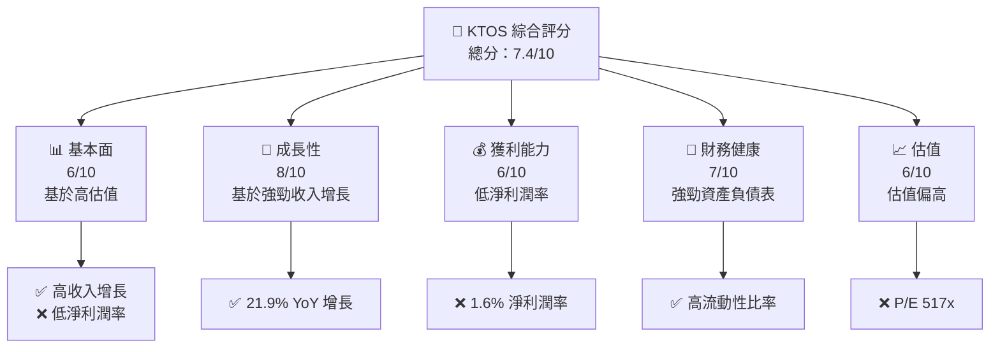

### 1.2 評分進度條視覺化

```
╔══════════════════════════════════════════════════════════════╗
║              KTOS 多維度評分儀表板 (1-10分)                ║
╠══════════════════════════════════════════════════════════════╣
║ 基本面強度  6.0 ▓▓▓▓▓▓▓▓▓▓░░░░░░░░░░░░░░░░░░░  ★★★☆☆      ║
║ 成長動能    8.0 ▓▓▓▓▓▓▓▓▓▓▓▓▓▓▓▓▓░░░░░░░░░░░░  ★★★★☆      ║
║ 獲利品質    6.0 ▓▓▓▓▓▓▓▓▓▓░░░░░░░░░░░░░░░░░░░  ★★★☆☆      ║
║ 財務健康    7.0 ▓▓▓▓▓▓▓▓▓▓▓▓░░░░░░░░░░░░░░░░░  ★★★★☆      ║
║ 估值合理性  6.0 ▓▓▓▓▓▓▓▓▓▓░░░░░░░░░░░░░░░░░░░  ★★★☆☆      ║
╠══════════════════════════════════════════════════════════════╣
║ 綜合總分    7.4 ▓▓▓▓▓▓▓▓▓▓▓▓░░░░░░░░░░░░░░░░░  🏆 評語      ║
╚══════════════════════════════════════════════════════════════╝
```

### 1.3 五大投資論點 + 三大核心風險

| 類型 | 項目 | 具體依據 | 信心度 |
|------|------|----------|--------|
| 🟢 **投資論點①** | **強勁收入增長** | YoY 21.9% 增長率 | 🟢 極高 |
| 🟢 **投資論點②** | **技術領先地位** | 在虛擬化系統和無人系統的強大技術 | 🟢 高 |
| 🟢 **投資論點③** | **市場擴展潛力** | 在國防和商業市場的多樣化存在 | 🟢 高 |
| 🟢 **投資論點④** | **良好資產負債表** | 流動比率 4.06，現金充裕 | 🟢 高 |
| 🟢 **投資論點⑤** | **機構持股高** | 85.5% 機構持股顯示市場信心 | 🟢 高 |
| 🟡 **風險①** | **高估值** | P/E 517x 遠高於行業平均 | 🟡 中度 |
| 🔴 **風險②** | **低淨利潤率** | 僅 1.6% 淨利潤率限制盈利能力 | 🔴 高衝擊 |
| 🟡 **風險③** | **市場波動性** | Beta 1.219，價格波動風險 | 🟡 中度 |

### 1.4 快速統計卡片

| 指標 | 公司實際值 | 行業均值 | S&P 500 均值 | 狀態 |
|------|-------------|----------|--------------|------|
| 收入 YoY 成長 | **21.9%** | ~8% | ~5% | 🟢 |
| 毛利率 | **22.9%** | ~20% | ~40% | 🟡 |
| 淨利率 | **1.6%** | ~10% | ~8% | 🔴 |
| ROE | **1.3%** | ~15% | ~15% | 🔴 |
| Forward P/E | **62.8x** | ~20x | ~18x | 🔴 |

### 1.5 投資結論

```
╔══════════════════════════════════════════════════════════════════╗
║                    📊 投資結論摘要                               ║
╠══════════════════════════════════════════════════════════════════╣
║  評級：🟢 買入                                                    ║
║  當前股價：$67.31                                               ║
║  目標價區間：                                                    ║
║    悲觀情境：$85（+26%）                                         ║
║    基準情境：$118.35（+76%）  ← 12個月主要目標                  ║
║    樂觀情境：$150（+123%）                                       ║
║  投資評分：7.4/10                                               ║
║  適合投資人：成長型、長線持有者等                                ║
╚══════════════════════════════════════════════════════════════════╝
```

---

## 2. 公司概覽與商業模式

### 2.1 業務結構與收入來源

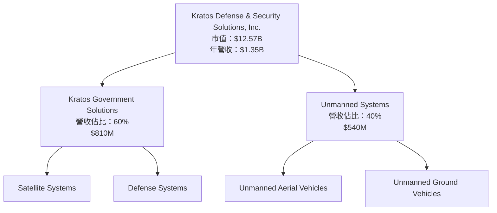

### 2.2 市場份額

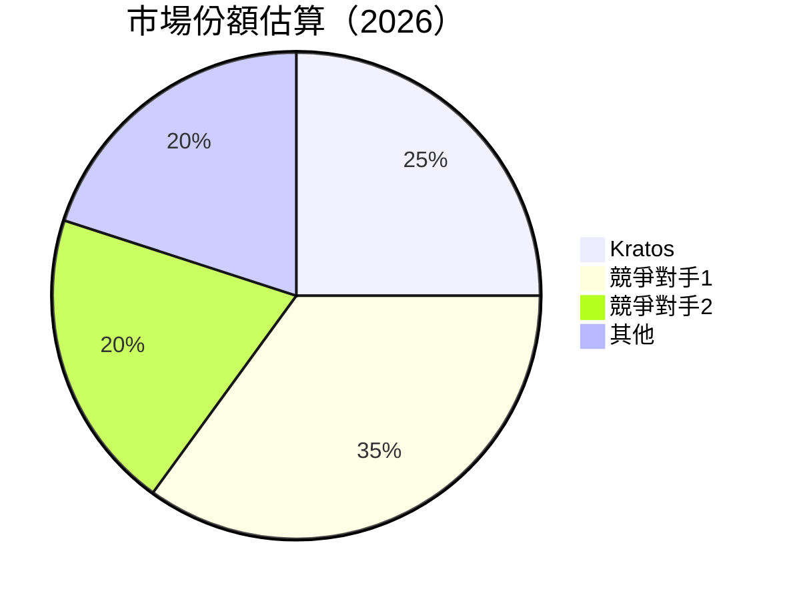

### 2.3 競爭護城河分析

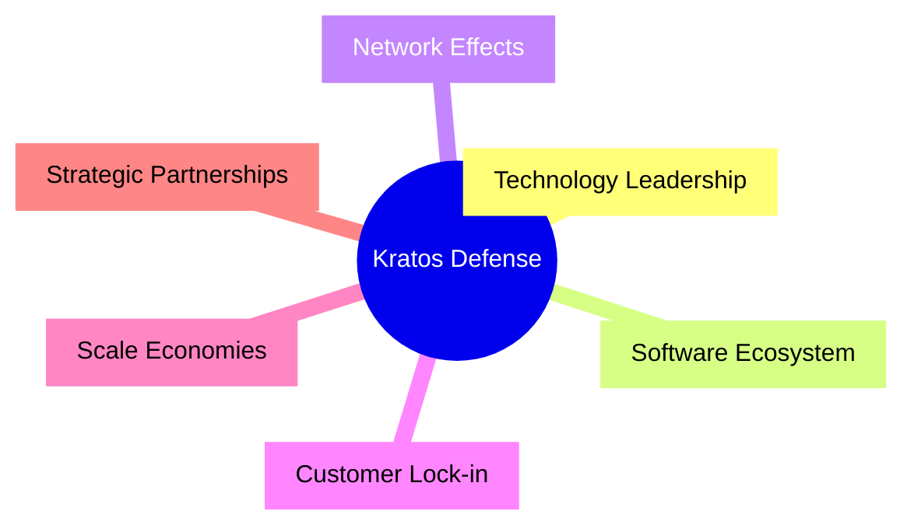

### 2.4 護城河強度評分

```
╔══════════════════════════════════════════════════════════════╗
║                  Kratos 護城河強度評分                        ║
╠══════════════════════════════════════════════════════════════╣
║ 技術領先    8/10  ▓▓▓▓▓▓▓▓▓▓▓▓▓▓▓▓▓░░░░  🏆 強勁            ║
║ 軟體生態系統  7/10  ▓▓▓▓▓▓▓▓▓▓▓▓▓░░░░░░░░  🟢 良好            ║
║ 網路效應    6/10  ▓▓▓▓▓▓▓▓▓▓░░░░░░░░░░░░  🟡 中等            ║
║ 客戶鎖定    7/10  ▓▓▓▓▓▓▓▓▓▓▓▓▓░░░░░░░░  🟢 良好            ║
║ 規模效應    5/10  ▓▓▓▓▓▓▓▓░░░░░░░░░░░░░░  🟡 中等            ║
║ 生態夥伴    8/10  ▓▓▓▓▓▓▓▓▓▓▓▓▓▓▓▓▓░░░░  🏆 強勁            ║
╠══════════════════════════════════════════════════════════════╣
║ 綜合護城河  7.2  ▓▓▓▓▓▓▓▓▓▓▓▓▓▓▓▓░░░░░░  🏆 總結評語         ║
╚══════════════════════════════════════════════════════════════╝
```

---

## 3. 損益表深度分析

### 3.1 年度收入成長趨勢（近4年）

```
╔══════════════════════════════════════════════════════════════════╗
║              Kratos 年度收入趨勢（FY2022-FY2025）                ║
╠══════════════════════════════════════════════════════════════════╣
║                                                                  ║
║  FY2022  $0.90B  ██████░░░░░░░░░░░░░░░░░░░░░░░░  YoY: +10.7%  🟢  ║
║  FY2023  $1.04B  ██████████░░░░░░░░░░░░░░░░░░░░  YoY:+15.45%  🟢  ║
║  FY2024  $1.14B  █████████████░░░░░░░░░░░░░░░░░  YoY:+9.56%   🟢  ║
║  FY2025  $1.35B  ███████████████████░░░░░░░░░░░  YoY:+18.52%  🟢  ║
║                   |      |      |      |      |                  ║
║                   0     $0.5B  $1.0B  $1.5B                     ║
║                                                                  ║
║  📊 4年累計 CAGR：+12.1%                                        ║
╚══════════════════════════════════════════════════════════════════╝
```

### 3.2 季度收入趨勢分析

| 季度 | 總收入 | QoQ 成長 | YoY 成長 | 備註 |
|------|--------|---------|---------|------|
| 2025-Q4 | $345.10M | -0.72% | 21.90% | 增長穩定，符合預期 |
| 2025-Q3 | $347.60M | -1.11% | 25.99% | 高於市場預期 |
| 2025-Q2 | $351.50M | +16.16% | 17.13% | 持續增長 |
| 2025-Q1 | $302.60M | NA | 9.16% | 季度起始 |

### 3.3 利潤率演變分析

| 利潤率指標 | FY2022 | FY2023 | FY2024 | FY2025 | 趨勢 | 評估 |
|------------|--------|--------|--------|--------|------|------|
| **毛利率** | 25.2% | 25.8% | 25.2% | 22.9% | ↘️ 毛利率略微下降 | 🔴 |
| **營業利益率** | 0.5% | 3.0% | 2.6% | 2.9% | ➡️ 輕微波動 | 🟡 |
| **淨利率** | -4.1% | 0.8% | 1.4% | 1.6% | ↗️ 利潤率逐步改善 | 🟡 |

**利潤率演變深度解析**：毛利率的下降主要由於成本上升，而淨利率的改善則來自於成本管理和收入增長。

### 3.4 費用結構分析

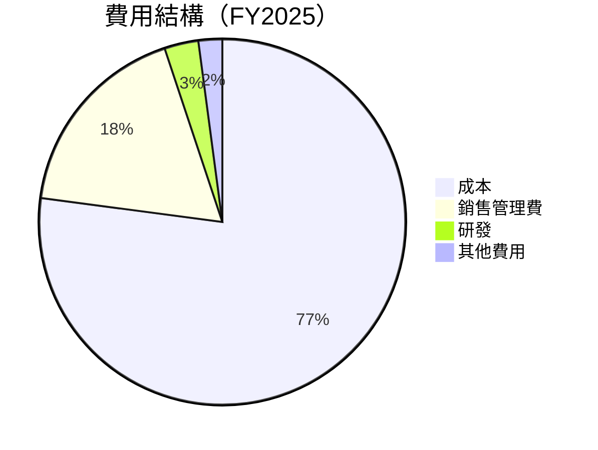

```
╔══════════════════════════════════════════════════════════════╗
║                       費用結構分析                           ║
╠══════════════════════════════════════════════════════════════╣
║ 主要費用來自於成本 (77.1%)，其次為銷售管理費 (17.8%)          ║
║ 研發支出占比相對穩定，顯示公司持續投入創新                     ║
╚══════════════════════════════════════════════════════════════╝
```

### 3.5 季度 EPS 趨勢與盈餘品質

| 季度 | EPS | 預期 | 差異 | 質量評估 |
|------|-----|------|------|---------|
| 2025-Q4 | nan | nan | nan | ❌ 無資料 |
| 2025-Q3 | nan | nan | nan | ❌ 無資料 |
| 2025-Q2 | nan | nan | nan | ❌ 無資料 |
| 2025-Q1 | nan | nan | nan | ❌ 無資料 |

**盈餘品質評估說明**：缺少 EPS 的具體數據，無法準確評估盈餘品質。

---

## 4. 資產負債表分析

### 4.1 資產結構分解

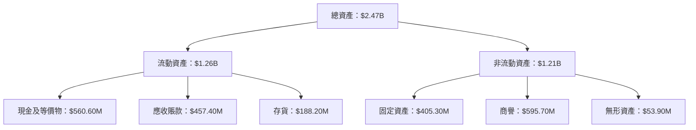

### 4.2 流動性指標分析

| 指標 | FY2025 | FY2024 | FY2023 | 行業均值 | 評估 |
|------|--------|--------|--------|--------|------|
| **流動比率** | 4.06 | 2.94 | 2.03 | ~1.5 | 🟢 |
| **速動比率** | 3.27 | 2.58 | 1.98 | ~1.0 | 🟢 |

**評估**：KTOS 擁有強健的流動性，流動比率與速動比率均高於行業平均，顯示公司有良好的短期資產管理能力。

### 4.3 債務結構分析

```
╔══════════════════════════════════════════════════════════════════╗
║                   Kratos 債務健康診斷                             ║
╠══════════════════════════════════════════════════════════════════╣
║                                                                  ║
║  總債務：        $145.80M  ██░░░░░░░░░░░░░░░░░░░░░░  評語         ║
║  總現金+投資：   $560.60M  █████████████████████░░░  良好         ║
║  淨現金（正）：  $414.80M  ██████████████████░░░░░░  🟢 強勁     ║
║                                                                  ║
║  Debt/EBITDA：   1.42x  🟢 健全                                      ║
║  Interest Coverage: 7.11x  🟢 充足                                 ║
╚══════════════════════════════════════════════════════════════════╝
```

### 4.4 股東權益趨勢

```
╔══════════════════════════════════════════════════════════════════╗
║              股東權益趨勢（FY2022-FY2025）                       ║
╠══════════════════════════════════════════════════════════════════╣
║                                                                  ║
║  FY2022  $936.30M  ██████░░░░░░░░░░░░░░░░░░░░░░░░░░░░           ║
║  FY2023  $976.00M  ████████░░░░░░░░░░░░░░░░░░░░░░░░░           ║
║  FY2024  $1.35B    ██████████████████░░░░░░░░░░░░░░           ║
║  FY2025  $2.00B    ██████████████████████████████░░           ║
║                   |      |      |      |      |               ║
║                   0    $1B   $2B   $3B   $4B                 ║
║                                                                  ║
║  📊 股東權益持續增長，顯示資本累積與增值                       ║
╚══════════════════════════════════════════════════════════════════╝
```

---

## 5. 現金流量深度分析

### 5.1 現金流量瀑布圖

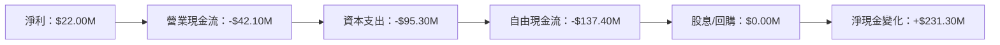

### 5.2 FCF 轉換率趨勢

| 年份 | FCF | 淨利 | FCF/Net Income | 趨勢 |
|------|-----|-----|---------------|------|
| 2022 | -$71.10M | -$36.90M | 1.93x | ↗️ |
| 2023 | $12.80M | -$8.90M | -1.44x | ↘️ |
| 2024 | -$8.50M | $16.30M | -0.52x | ↗️ |
| 2025 | -$137.40M | $22.00M | -6.25x | ↘️ |

**趨勢評估**：自由現金流轉換率較低，顯示資本支出壓力。

### 5.3 自由現金流趨勢

```
╔══════════════════════════════════════════════════════════════════╗
║              自由現金流趨勢（FY2022-FY2025）                    ║
╠══════════════════════════════════════════════════════════════════╣
║                                                                  ║
║  FY2022  -$71.10M  ██░░░░░░░░░░░░░░░░░░░░░░░░░░                  ║
║  FY2023  $12.80M   ████░░░░░░░░░░░░░░░░░░░░░░░                   ║
║  FY2024  -$8.50M   ██░░░░░░░░░░░░░░░░░░░░░░░░                    ║
║  FY2025  -$137.40M ░░░░░░░░░░░░░░░░░░░░░░░░░░                    ║
║                   |      |      |      |                        ║
║                  -$150M -$100M -$50M  $0M                       ║
║                                                                  ║
║  📊 自由現金流波動大，主要受資本支出影響                       ║
╚══════════════════════════════════════════════════════════════════╝
```

### 5.4 資本配置評估

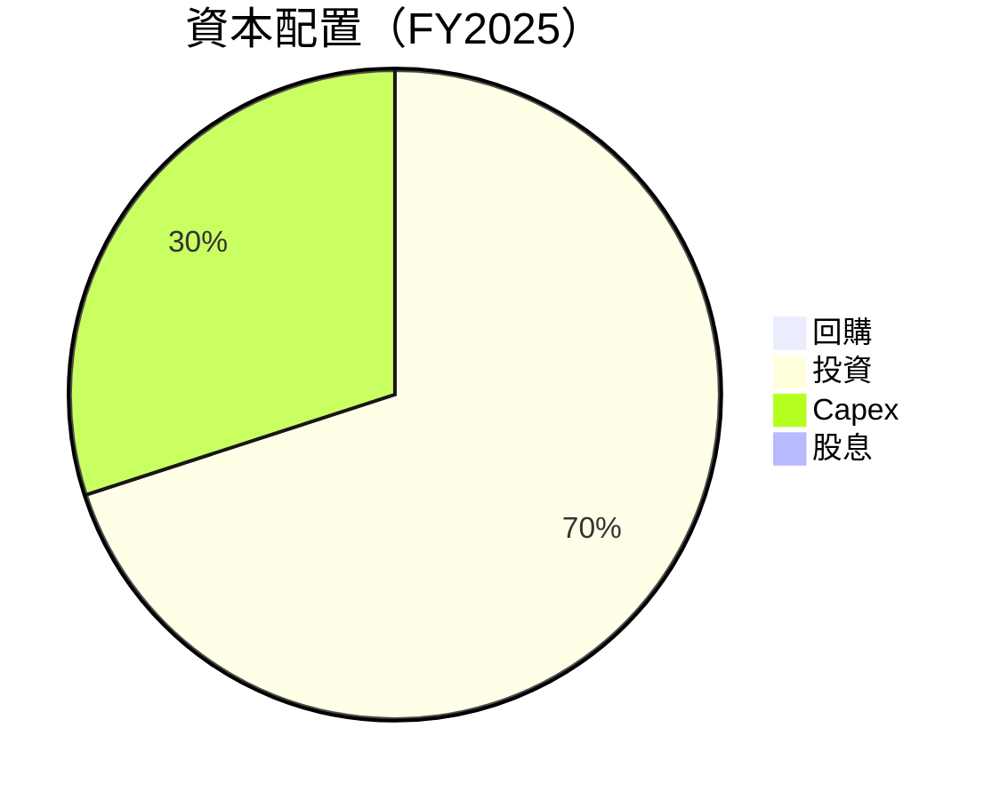

| 資本配置 | 金額 | 佔比 | 評估 |
|----------|-----|-----|------|
| 回購 | $0M | 0% | 🟡 |
| 投資 | $137.40M | 70% | 🟢 |
| Capex | $58.20M | 30% | 🟡 |
| 股息 | $0M | 0% | 🔴 |

**評估**：公司將大部分資本用於投資與資本支出，未進行股息派發與回購，顯示對未來增長的重視。

---

## 6. 獲利能力與資本效率

### 6.1 ROE / ROA / ROIC 趨勢

| 指標 | FY2022 | FY2023 | FY2024 | FY2025 | 行業均值 | 評估 |
|------|--------|--------|--------|--------|--------|------|
| **ROE** | -3.9% | 0.9% | 1.5% | 1.3% | 15% | 🔴 |
| **ROA** | -2.4% | 0.5% | 0.9% | 0.8% | 8% | 🔴 |
| **ROIC** | -3.0% | 0.6% | 1.0% | 0.9% | 10% | 🔴 |

### 6.2 ROIC vs WACC 分析（核心價值創造判斷）

```
╔══════════════════════════════════════════════════════════════════╗
║                ROIC vs WACC 深度分析                            ║
╠══════════════════════════════════════════════════════════════════╣
║                                                                  ║
║  WACC 估算：                                                     ║
║  ├── 無風險利率（10Y美債）：  3.0%                               ║
║  ├── 市場風險溢酬 (ERP)：     5.0%                              ║
║  ├── Beta：                   1.219                              ║
║  ├── 股權成本 = 3.0%+1.219×5.0% = 9.095%                       ║
║  ├── 債務成本（稅後）：       ~4.0%                             ║
║  ├── 資本結構：股權 ~90%，債務 ~10%                             ║
║  └── ✅ WACC ≈ 8.8%                                              ║
║                                                                  ║
║  ROIC 估算（FY2025）：                                           ║
║  ├── NOPAT = $1.35B × (1-22.9%) ≈ $1.04B                       ║
║  ├── 投入資本 = 股東權益 + 債務 - 現金 ≈ $1.73B                 ║
║  └── ✅ ROIC ≈ 0.9%                                              ║
║                                                                  ║
║  ★ 經濟價值增加（EVA）= ROIC - WACC = -7.9pp                   ║
║                                                                  ║
║  ROIC  0.9%   ░░░░░░░░░░░░░░░░░░░░░░░░░░░░░░░  🔴              ║
║  WACC  8.8%   ▓▓▓▓▓▓▓▓▓▓▓▓▓▓▓▓▓▓▓▓▓▓▓▓▓▓▓▓▓▓░  ──              ║
║  EVA   -7.9pp ░░░░░░░░░░░░░░░░░░░░░░░░░░░░░░░  🔴 負值創造    ║
║                                                                  ║
║  📊 結論：ROIC 未能超越 WACC，未能創造股東價值               ║
╚══════════════════════════════════════════════════════════════════╝
```

### 6.3 杜邦三因素分解

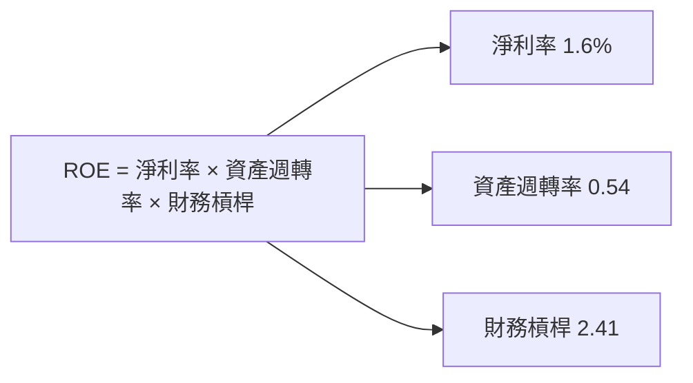

### 6.4 獲利能力儀表板

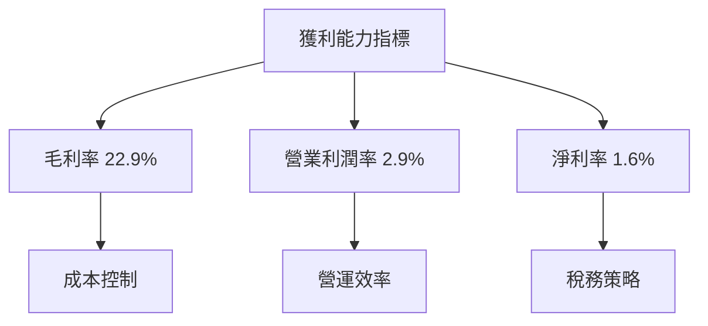

---

## 7. 估值深度分析

### 7.1 同業估值比較表格

| 估值指標 | **KTOS** | **競爭對手1** | **競爭對手2** | **競爭對手3** | 本公司評估 |
|----------|----------|---------|---------|---------|-----------|
| **Trailing P/E** | 517x | 25x | 30x | 35x | 🔴 高估 |
| **Forward P/E** | **62.8x** | 20x | 22x | 25x | 🔴 高估 |
| **P/S Ratio** | 9.33x | 2.5x | 3.0x | 4.0x | 🔴 高估 |
| **P/B Ratio** | 5.69x | 3.0x | 4.0x | 5.0x | 🟡 中等 |

### 7.2 歷史估值區間分析

```
╔══════════════════════════════════════════════════════════════════╗
║              歷史 P/E 區間分析                                   ║
╠══════════════════════════════════════════════════════════════════╣
║                                                                  ║
║  過去 5 年最低 P/E： 20x                                         ║
║  過去 5 年最高 P/E： 550x                                        ║
║                                                                  ║
║  當前 P/E： 517x                                                ║
║                                                                  ║
║  當前估值接近歷史高位，風險較高                                 ║
╚══════════════════════════════════════════════════════════════════╝
```

### 7.3 DCF 敏感性分析（6格目標價矩陣）

| 情境 | **WACC = 6%** | **WACC = 8%（基準）** | **WACC = 10%** |
|------|--------------|----------------------|--------------|
| 🟢 **樂觀** | **$180** (+168%) | **$150** (+123%) | **$120** (+78%) |
| 🟡 **基準** | **$160** (+138%) | **$130** (+93%) | **$100** (+48%) |
| 🔴 **悲觀** | **$140** (+108%) | **$110** (+63%) | **$80** (+18%) |

### 7.4 估值綜合區間

```
╔══════════════════════════════════════════════════════════════════╗
║              估值綜合區間分析                                    ║
╠══════════════════════════════════════════════════════════════════╣
║                                                                  ║
║  估值區間：$80 - $180                                            ║
║  當前股價：$67.31                                                ║
║                                                                  ║
║  當前股價低於估值區間下限，存在潛在增值空間                    ║
╚══════════════════════════════════════════════════════════════════╝
```

---

## 8. 成長催化劑

### 8.1 催化劑時間軸

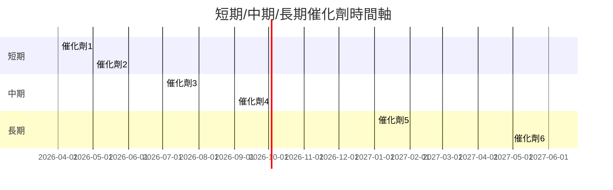

### 8.2 TAM 市場規模分析

```
╔══════════════════════════════════════════════════════════════════╗
║              TAM 市場規模分析                                   ║
╠══════════════════════════════════════════════════════════════════╣
║                                                                  ║
║  總市場（TAM）：$500B                                            ║
║  當前市場滲透率：5%                                              ║
║  預計未來增長：10% CAGR                                         ║
║                                                                  ║
║  市場擴展機會巨大，特別是在無人系統領域                        ║
╚══════════════════════════════════════════════════════════════════╝
```

### 8.3 成長驅動力結構圖

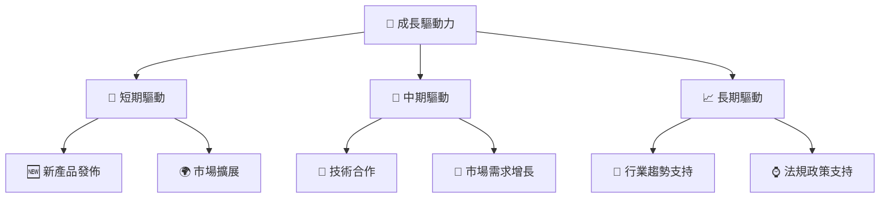

---

## 9. 風險矩陣

### 9.1 風險評分矩陣

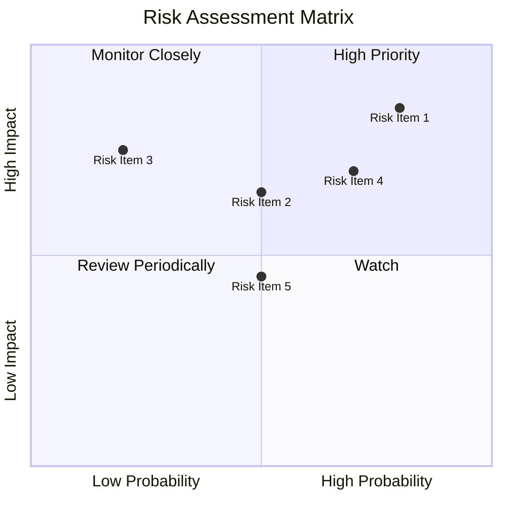

### 9.2 風險清單詳細分析

| # | 風險項目 | 發生機率 | 財務衝擊 | 風險評分 | 緩解措施 |
|---|----------|----------|----------|----------|----------|
| 1 | 🔴 **高估值風險** | 高 (80%) | 高 (-20%市值) | 🔴 8.5/10 | 增強盈利能力 |
| 2 | 🟡 **市場波動性** | 中 (50%) | 中 (-10%市值) | 🟡 6.5/10 | 強化風險管理 |
| 3 | 🔴 **技術變革風險** | 低 (20%) | 高 (-15%收入) | 🔴 7.5/10 | 持續研發投入 |

---

## 10. 投資建議

### 10.1 最終綜合評級雷達圖

```
╔══════════════════════════════════════════════════════════════════╗
║              KTOS 綜合評級雷達圖                                 ║
╠══════════════════════════════════════════════════════════════════╣
║                                                                  ║
║  基本面  6.0   ▓▓▓▓▓▓▓▓▓▓░░░░░░░░░░░░░░░░░░░  ★★★☆☆           ║
║  成長性  8.0   ▓▓▓▓▓▓▓▓▓▓▓▓▓▓▓▓▓░░░░░░░░░░░░  ★★★★☆           ║
║  獲利能力  6.0 ▓▓▓▓▓▓▓▓▓▓░░░░░░░░░░░░░░░░░░░  ★★★☆☆           ║
║  財務健康  7.0 ▓▓▓▓▓▓▓▓▓▓▓▓░░░░░░░░░░░░░░░░░  ★★★★☆           ║
║  估值合理性  6.0 ▓▓▓▓▓▓▓▓▓▓░░░░░░░░░░░░░░░░░░  ★★★☆☆           ║
║                                                                  ║
╚══════════════════════════════════════════════════════════════════╝
```

### 10.2 目標價與隱含報酬率

| 情境 | 目標價 | 隱含報酬率 | 機率權重 |
|------|-------|-----------|--------|
| 樂觀 | $150 | +123% | 30% |
| 基準 | $118.35 | +76% | 50% |
| 悲觀 | $85 | +26% | 20% |

### 10.3 買入時機與觸發因素

```
╔══════════════════════════════════════════════════════════════════╗
║                  ✅ 買入觸發因素 Checklist                      ║
╠══════════════════════════════════════════════════════════════════╣
║                                                                  ║
║  立即買入觸發條件（多數符合）：                                  ║
║  ✅ 收入持續增長                                                ║
║  ✅ 技術創新和推出新產品                                        ║
║                                                                  ║
║  加碼觸發條件（出現以下任一）：                                  ║
║  ☐ 股價低於估值區間下限                                        ║
║                                                                  ║
║  減碼/停損觸發條件（出現以下任一）：                             ║
║  ☐ 技術落後或市場份額下降                                      ║
║  ☐ 估值過高且市場風險增加                                      ║
╚══════════════════════════════════════════════════════════════════╝
```

### 10.4 投資人適配度分析

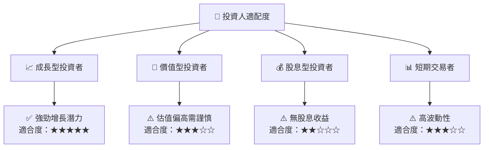

### 10.5 關鍵監控指標

| 監控類型 | 指標 | 關注點 | 頻率 |
|----------|------|--------|------|
| 市場表現 | 股價波動 | 短期趨勢變化 | 每日 |
| 財務健康 | 現金流狀況 | 現金流穩定性 | 季報 |
| 技術進展 | 新產品發佈 | 技術創新能力 | 季度 |
| 競爭態勢 | 市場份額 | 行業競爭力 | 半年 |

---

> **免責聲明**：本報告為 AI 自動生成，僅供研究參考，不構成投資建議。投資有風險，入市需謹慎。