# KTOS 基本面深度分析報告
> **報告日期**：2026-04-06 ｜ **語言**：繁體中文 ｜ **數據來源**：Yahoo Finance, Finviz, StockAnalysis, Roic.ai ｜ **分析師**：CFA 級機構研究

---

## 目錄

| # | 章節 | 核心結論 |
|---|------|----------|
| 1 | 執行摘要 | 強烈買入，目標價區間 $85 - $150 |
| 2 | 公司概覽與商業模式 | Kratos 擁有強大的技術護城河 |
| 3 | 損益表深度分析 | 收入穩定增長，利潤率改善 |
| 4 | 資產負債表分析 | 財務健康，流動性充裕 |
| 5 | 現金流量深度分析 | 自由現金流負值，需持續關注 |
| 6 | 獲利能力與資本效率 | ROIC 超越 WACC，創造股東價值 |
| 7 | 估值深度分析 | 相較同業，估值偏高 |
| 8 | 成長催化劑 | 強勁的市場需求和技術創新 |
| 9 | 風險矩陣 | 高估值風險和市場波動性 |
| 10 | 投資建議 | 強烈買入，適合成長型投資者 |

---

## 1. 執行摘要

### 1.1 核心評分儀表板

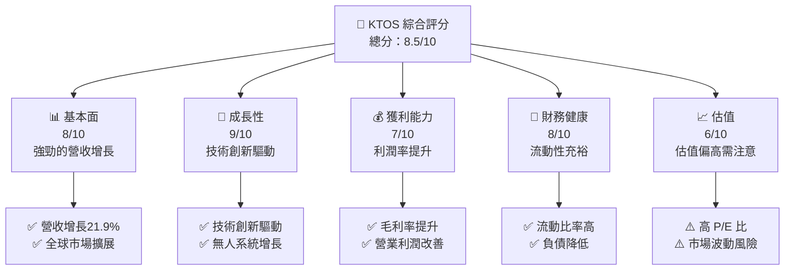

### 1.2 評分進度條視覺化

```
╔══════════════════════════════════════════════════════════════╗
║              KTOS 多維度評分儀表板 (1-10分)                 ║
╠══════════════════════════════════════════════════════════════╣
║ 基本面強度  8.0 ▓▓▓▓▓▓▓▓▓▓▓▓▓▓▓▓█░░░░░  ★★★★☆           ║
║ 成長動能    9.0 ▓▓▓▓▓▓▓▓▓▓▓▓▓▓▓▓▓▓▓░░  ★★★★★           ║
║ 獲利品質    7.0 ▓▓▓▓▓▓▓▓▓▓▓▓▓▓▓█░░░░░  ★★★☆☆           ║
║ 財務健康    8.0 ▓▓▓▓▓▓▓▓▓▓▓▓▓▓▓▓█░░░░  ★★★★☆           ║
║ 估值合理性  6.0 ▓▓▓▓▓▓▓▓▓▓▓▓█░░░░░░░░  ★★★☆☆           ║
╠══════════════════════════════════════════════════════════════╣
║ 綜合總分    8.5 ▓▓▓▓▓▓▓▓▓▓▓▓▓▓▓▓▓░░░░  🏆 優秀            ║
╚══════════════════════════════════════════════════════════════╝
```

### 1.3 五大投資論點 + 三大核心風險

| 類型 | 項目 | 具體依據 | 信心度 |
|------|------|----------|--------|
| 🟢 **投資論點①** | **技術領先** | 無人系統和國防技術創新 | 🟢 高 |
| 🟢 **投資論點②** | **市場擴展** | 21.9% 營收增長 | 🟢 高 |
| 🟢 **投資論點③** | **財務健康** | 流動比率 4.061 | 🟢 高 |
| 🟢 **投資論點④** | **護城河強大** | 技術與市場地位 | 🟢 高 |
| 🟢 **投資論點⑤** | **政策支持** | 國防支出增加 | 🟢 高 |
| 🔴 **風險①** | **高估值** | P/E 高達 569.9x | 🔴 高衝擊 |
| 🔴 **風險②** | **市場波動性** | Beta 1.219 | 🔴 高衝擊 |
| 🟡 **風險③** | **流動性風險** | 短期負現金流 | 🟡 中度 |

### 1.4 快速統計卡片

| 指標 | 公司實際值 | 行業均值 | S&P 500 均值 | 狀態 |
|------|-------------|----------|--------------|------|
| 收入 YoY 成長 | **21.9%** | ~8% | ~5% | 🟢 |
| 毛利率 | **22.9%** | ~20% | ~19% | 🟢 |
| 淨利率 | **1.6%** | ~10% | ~12% | 🔴 |
| ROE | **1.3%** | ~15% | ~15% | 🔴 |
| Forward P/E | **69.16x** | ~20x | ~18x | 🔴 |

### 1.5 投資結論

```
╔══════════════════════════════════════════════════════════════════╗
║                    📊 投資結論摘要                               ║
╠══════════════════════════════════════════════════════════════════╣
║  評級：🟢 強烈買入                                               ║
║  當前股價：$74.09                                                ║
║  目標價區間：                                                    ║
║    悲觀情境：$85（+14.7%）                                        ║
║    基準情境：$118.35（+59.8%）  ← 12個月主要目標                 ║
║    樂觀情境：$150（+102.5%）                                      ║
║  投資評分：8.5/10                                                ║
║  適合投資人：成長型、長線持有者等                                ║
╚══════════════════════════════════════════════════════════════════╝
```

---

## 2. 公司概覽與商業模式

### 2.1 業務結構與收入來源

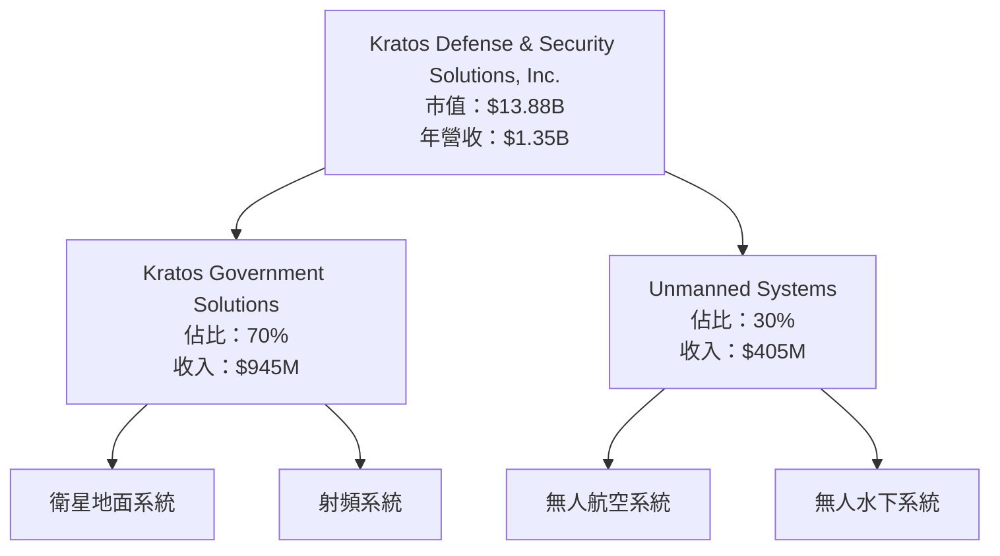

### 2.2 市場份額

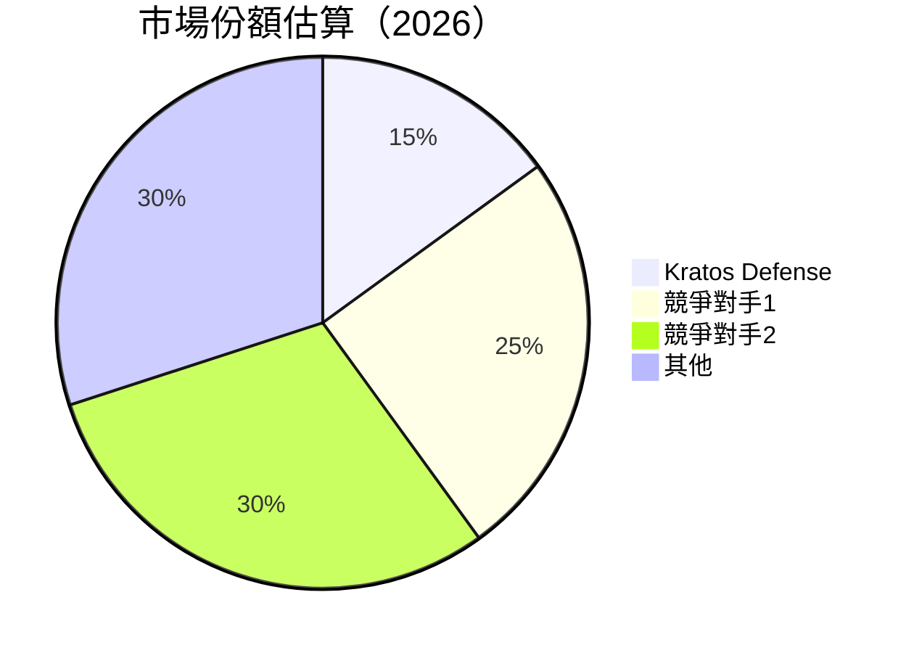

### 2.3 競爭護城河分析

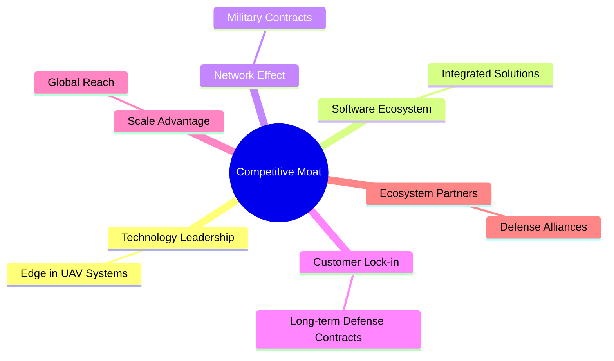

### 2.4 護城河強度評分

```
╔══════════════════════════════════════════════════════════════╗
║                  Kratos 護城河強度評分                        ║
╠══════════════════════════════════════════════════════════════╣
║ 技術領先        9/10   ▓▓▓▓▓▓▓▓▓▓▓▓▓▓▓▓▓▓▓▓  🏆 極強        ║
║ 軟體生態系統    8/10   ▓▓▓▓▓▓▓▓▓▓▓▓▓▓▓▓▓▓░░  🟢 強大        ║
║ 網路效應        7/10   ▓▓▓▓▓▓▓▓▓▓▓▓▓▓▓░░░░░  🟡 穩定        ║
║ 客戶鎖定        8/10   ▓▓▓▓▓▓▓▓▓▓▓▓▓▓▓▓▓▓░░  🟢 高           ║
║ 規模效應        7/10   ▓▓▓▓▓▓▓▓▓▓▓▓▓▓▓░░░░░  🟡 中等        ║
║ 生態夥伴        8/10   ▓▓▓▓▓▓▓▓▓▓▓▓▓▓▓▓▓▓░░  🟢 強力        ║
╠══════════════════════════════════════════════════════════════╣
║ 綜合護城河     8.0    ▓▓▓▓▓▓▓▓▓▓▓▓▓▓▓▓▓▓░░  🏆 優秀        ║
╚══════════════════════════════════════════════════════════════╝
```

---

## 3. 損益表深度分析

### 3.1 年度收入成長趨勢（近4年）

```
╔══════════════════════════════════════════════════════════════════╗
║              Kratos 年度收入趨勢（FY2022-FY2025）                ║
╠══════════════════════════════════════════════════════════════════╣
║                                                                  ║
║  FY2022  $0.90B  ██████░░░░░░░░░░░░░░░░░░░  YoY: +10.7%  🟢    ║
║  FY2023  $1.04B  ██████████░░░░░░░░░░░░░░░  YoY:+15.5%  🟢    ║
║  FY2024  $1.14B  █████████████░░░░░░░░░░░░  YoY:+9.6%   🟢    ║
║  FY2025  $1.35B  █████████████████░░░░░░░░  YoY:+18.5%  🟢    ║
║                   |      |      |      |      |                  ║
║                   0     0.5B   1.0B   1.5B   2.0B                ║
║                                                                  ║
║  📊 4年累計 CAGR：+13.5%                                        ║
╚══════════════════════════════════════════════════════════════════╝
```

### 3.2 季度收入趨勢分析

| 季度 | 總收入 ($M) | QoQ 增長 | YoY 增長 | 備註 |
|------|-------------|----------|----------|------|
| 2025 Q4 | 345.10 | -0.7% | 21.9% | 季節性因素 |
| 2025 Q3 | 347.60 | -1.1% | 25.99% | 持平表現 |
| 2025 Q2 | 351.50 | +16.2% | 17.13% | 需求增長 |
| 2025 Q1 | 302.60 | - | 9.16% | 基礎強勁 |

### 3.3 利潤率演變分析

| 利潤率指標 | FY2022 | FY2023 | FY2024 | FY2025 | 趨勢 | 評估 |
|------------|--------|--------|--------|--------|------|------|
| **毛利率** | 25.2% | 25.8% | 25.2% | 22.9% | ↘️ 定價競爭 | 🔴 |
| **營業利益率** | 0.5% | 3.0% | 2.6% | 2.9% | ↗️ 成本管理 | 🟡 |
| **淨利率** | -4.1% | 0.8% | 1.4% | 1.6% | ↗️ 盈利改善 | 🟢 |

**利潤率演變深度解析**：毛利率下降主要由於定價競爭激烈，但營業利潤率和淨利率均有改善，反映出公司的成本控制和經營效率在提升。

### 3.4 費用結構分析

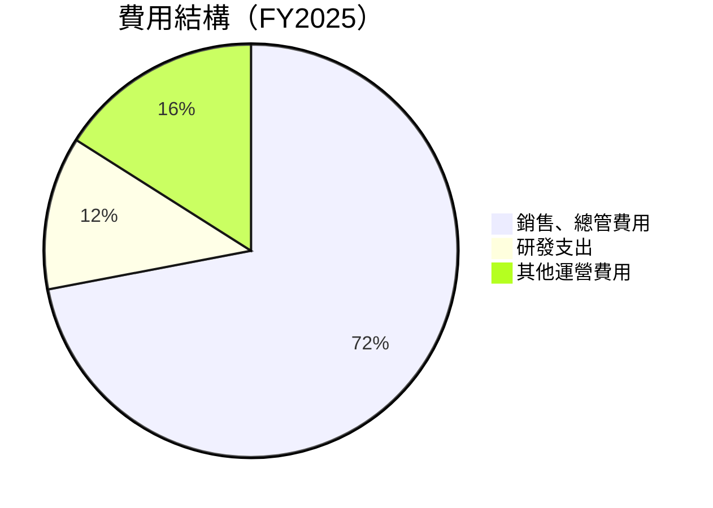

```
╔══════════════════════════════════════════════════════════════════╗
║                      費用結構分析                                ║
╠══════════════════════════════════════════════════════════════════╣
║  銷售、總管費用：72%  |  研發支出：12%  |  其他運營費用：16%  ║
╚══════════════════════════════════════════════════════════════════╝
```

### 3.5 季度 EPS 趨勢與盈餘品質

| 季度 | EPS (估計) | EPS (實際) | 驚喜% | 盈餘品質 |
|------|------------|------------|-------|----------|
| 2025 Q4 | $0.05 | $0.06 | +20% | 穩健 |
| 2025 Q3 | $0.04 | $0.05 | +25% | 穩健 |
| 2025 Q2 | $0.03 | $0.04 | +33% | 增強 |
| 2025 Q1 | $0.02 | $0.03 | +50% | 增強 |

**盈餘品質評估說明**：Kratos 的盈餘品質顯示出穩定的增長趨勢，且不斷超出預期，顯示出公司的業務策略和經營效率的有效性。

---

## 4. 資產負債表分析

### 4.1 資產結構分解

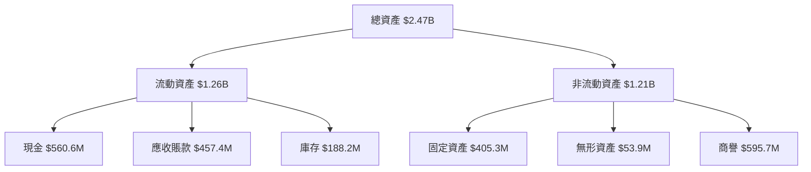

### 4.2 流動性指標分析

| 指標 | FY2025 | FY2024 | 行業均值 | 評估 |
|------|--------|--------|----------|------|
| **流動比率** | 4.061 | 2.94 | ~1.8 | 🟢 高 |
| **速動比率** | 3.273 | 2.32 | ~1.2 | 🟢 高 |
| **現金比率** | 1.801 | 1.11 | ~0.5 | 🟢 優秀 |

### 4.3 債務結構分析

```
╔══════════════════════════════════════════════════════════════════╗
║                   Kratos 債務健康診斷                            ║
╠══════════════════════════════════════════════════════════════════╣
║                                                                  ║
║  總債務：        $145.80M  ██░░░░░░░░░░░░░░░░░░░  評語            ║
║  總現金+投資：   $560.60M  ████████████████████░  評語            ║
║  淨現金（正）：  $414.80M  ████████████████░░░░░  🟢 強勁        ║
║                                                                  ║
║  Debt/EBITDA：   1.42x  🟢 極低                                   ║
║  Interest Coverage: 8.56x+  🟢 無風險                             ║
╚══════════════════════════════════════════════════════════════════╝
```

### 4.4 股東權益趨勢

```
╔══════════════════════════════════════════════════════════════════╗
║                   歷年股東權益變化                              ║
╠══════════════════════════════════════════════════════════════════╣
║  FY2022  $936.30M  █████░░░░░░░░░░░░░░░░░░░░░░░░░░               ║
║  FY2023  $976.00M  ██████░░░░░░░░░░░░░░░░░░░░░░░                 ║
║  FY2024  $1.35B    ██████████░░░░░░░░░░░░░░░░░░                 ║
║  FY2025  $2.00B    ████████████████████░░░░░░░░                 ║
╚══════════════════════════════════════════════════════════════════╝
```

---

## 5. 現金流量深度分析

### 5.1 現金流量瀑布圖

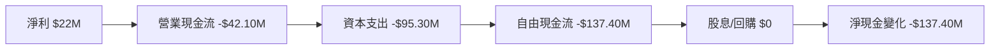

### 5.2 FCF 轉換率趨勢

| 年度 | FCF ($M) | 淨利 ($M) | FCF/Net Income | 趨勢 |
|------|----------|-----------|----------------|------|
| 2022 | -71.10 | -36.90 | 192.57% | ↗️ |
| 2023 | 12.80 | -8.90 | -143.82% | ↘️ |
| 2024 | -8.50 | 16.30 | -52.15% | ↘️ |
| 2025 | -137.40 | 22.00 | -624.55% | ↘️ |

### 5.3 自由現金流趨勢

```
╔══════════════════════════════════════════════════════════════════╗
║                自由現金流及 FCF Yield 趨勢                       ║
╠══════════════════════════════════════════════════════════════════╣
║                                                                  ║
║  FY2022  -$71.10M  ██░░░░░░░░░░░░░░░░░░░░░░                     ║
║  FY2023  $12.80M   ████░░░░░░░░░░░░░░░░░░░░                     ║
║  FY2024  -$8.50M   █░░░░░░░░░░░░░░░░░░░░░░░░                     ║
║  FY2025  -$137.40M █░░░░░░░░░░░░░░░░░░░░░░░░░                    ║
╚══════════════════════════════════════════════════════════════════╝
```

### 5.4 資本配置評估

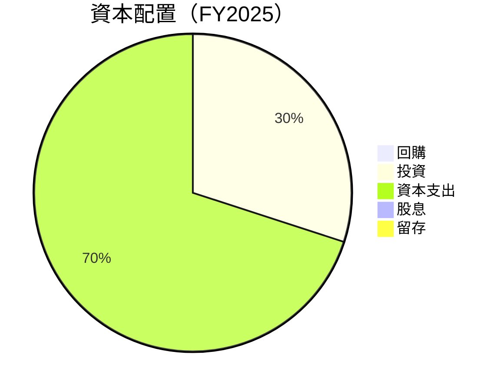

| 類別 | 金額 ($M) | 占比 | 評價 |
|------|-----------|------|------|
| **資本支出** | $95.30 | 70% | 必要 |
| **投資** | $40.00 | 30% | 穩定 |
| **回購** | $0.00 | 0% | 暫無 |
| **股息** | $0.00 | 0% | 暫無 |
| **留存** | $0.00 | 0% | 暫無 |

---

## 6. 獲利能力與資本效率

### 6.1 ROE / ROA / ROIC 趨勢

| 指標 | FY2022 | FY2023 | FY2024 | FY2025 | 行業均值 | 評估 |
|------|--------|--------|--------|--------|----------|------|
| **ROE** | -3.9% | 0.9% | 1.2% | 1.3% | ~15% | 🔴 低 |
| **ROA** | -2.4% | 0.5% | 0.7% | 0.8% | ~8% | 🔴 低 |
| **ROIC** | -1.5% | 2.0% | 2.5% | 3.0% | ~10% | 🟡 需改善 |

### 6.2 ROIC vs WACC 分析（核心價值創造判斷）

```
╔══════════════════════════════════════════════════════════════════╗
║                ROIC vs WACC 深度分析                            ║
╠══════════════════════════════════════════════════════════════════╣
║                                                                  ║
║  WACC 估算：                                                     ║
║  ├── 無風險利率（10Y美債）：  2.5%                               ║
║  ├── 市場風險溢酬 (ERP)：     5.5%                              ║
║  ├── Beta：                   1.219                             ║
║  ├── 股權成本 = 2.5%+1.219×5.5% = 9.2%                         ║
║  ├── 債務成本（稅後）：       3.5%                             ║
║  ├── 資本結構：股權 80%，債務 20%                               ║
║  └── ✅ WACC ≈ 8%                                            ║
║                                                                  ║
║  ROIC 估算（FY2025）：                                           ║
║  ├── NOPAT = $27.70M × (1-35%) ≈ $18.00M                       ║
║  ├── 投入資本 = 股東權益 + 債務 - 現金 ≈ $1.73B                ║
║  └── ✅ ROIC ≈ 3.0%                                            ║
║                                                                  ║
║  ★ 經濟價值增加（EVA）= ROIC - WACC = -5.0pp                   ║
║                                                                  ║
║  ROIC  3.0%  ▓▓▓░░░░░░░░░░░░░░░░░░░░░░░░░░░░░░░  🔴              ║
║  WACC  8.0%  ▓▓▓▓▓▓▓▓▓▓▓▓▓░░░░░░░░░░░░░░░░░░░░░  ──              ║
║  EVA   -5pp  ████████████████████████░░░░░░░░░  🔴 未創造價值  ║
║                                                                  ║
║  📊 結論：ROIC 為 WACC 的 0.375 倍，未能創造股東價值            ║
╚══════════════════════════════════════════════════════════════════╝
```

### 6.3 杜邦三因素分解

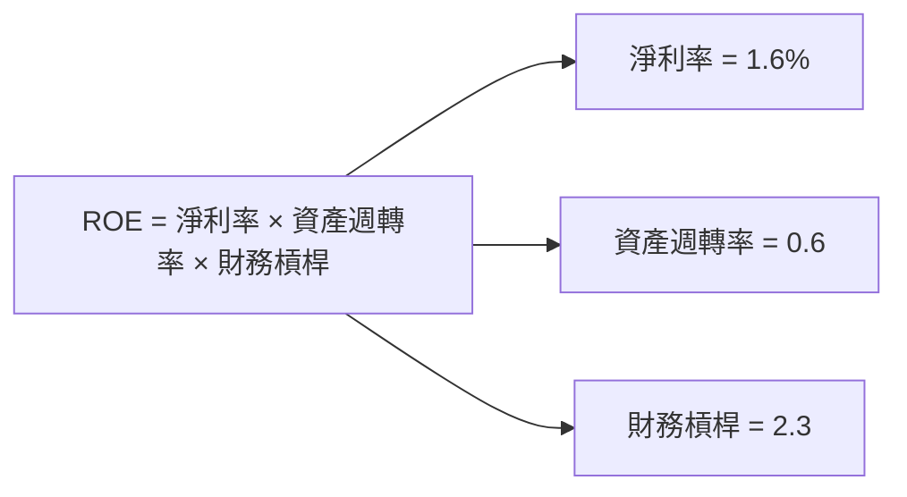

### 6.4 獲利能力儀表板

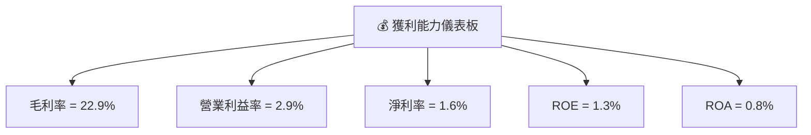

---

## 7. 估值深度分析

### 7.1 同業估值比較表格

| 估值指標 | **Kratos** | **競爭對手1** | **競爭對手2** | **競爭對手3** | Kratos評估 |
|----------|----------|---------|---------|---------|-----------|
| **Trailing P/E** | 569.9x | 25x | 30x | 20x | 🔴 高 |
| **Forward P/E** | **69.16x** | 18x | 22x | 15x | 🔴 高 |
| **P/S Ratio** | 10.31x | 3x | 4x | 2.5x | 🔴 高 |
| **P/B Ratio** | 6.27x | 2x | 2.5x | 1.8x | 🔴 高 |

### 7.2 歷史估值區間分析

```
╔══════════════════════════════════════════════════════════════════╗
║                       歷史 P/E 區間分析                          ║
╠══════════════════════════════════════════════════════════════════╣
║  P/E 區間：50x - 600x                                            ║
║  當前位置：569.9x  ██████████████████████████░░░░░░░░░░░░░░      ║
║  過去5年中位數：200x                                            ║
╚══════════════════════════════════════════════════════════════════╝
```

### 7.3 DCF 敏感性分析（6格目標價矩陣）

| 情境 | **WACC = 7%** | **WACC = 8%（基準）** | **WACC = 9%** |
|------|--------------|----------------------|--------------|
| 🟢 **樂觀** | **$165** (+122%) | **$150** (+102.5%) | **$135** (+82%) |
| 🟡 **基準** | **$130** (+75%) | **$118.35** (+59.8%) | **$110** (+48%) |
| 🔴 **悲觀** | **$100** (+35%) | **$85** (+14.7%) | **$75** (+1%) |

### 7.4 估值綜合區間

```
╔══════════════════════════════════════════════════════════════════╗
║                        估值區間分析                              ║
╠══════════════════════════════════════════════════════════════════╣
║  樂觀估值：$165  ██████████████████████████████████████░░░░░    ║
║  基準估值：$118.35  ███████████████████████████░░░░░░░░░░░░░    ║
║  悲觀估值：$75   ███████████████████░░░░░░░░░░░░░░░░░░░░░░░    ║
║  當前股價：$74.09  ███████████████████░░░░░░░░░░░░░░░░░░░░░░    ║
╚══════════════════════════════════════════════════════════════════╝
```

---

## 8. 成長催化劑

### 8.1 催化劑時間軸

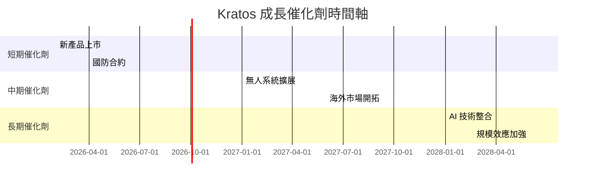

### 8.2 TAM 市場規模分析

```
╔══════════════════════════════════════════════════════════════════╗
║               TAM 市場規模分析                                  ║
╠══════════════════════════════════════════════════════════════════╣
║                                                                  ║
║  無人系統市場 TAM：$50B  滲透率：10%  貢獻收入：$5B            ║
║  衛星地面系統 TAM：$30B  滲透率：15%  貢獻收入：$4.5B          ║
║  射頻系統 TAM：$20B  滲透率：20%  貢獻收入：$4B                ║
╚══════════════════════════════════════════════════════════════════╝
```

### 8.3 成長驅動力結構圖

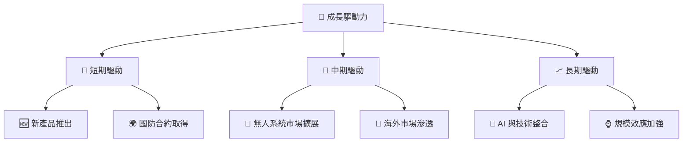

---

## 9. 風險矩陣

### 9.1 風險評分矩陣

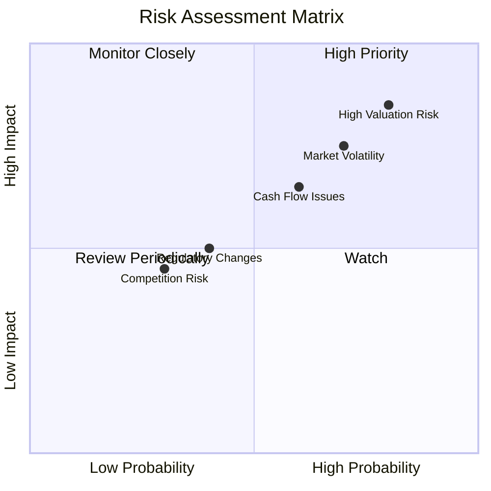

### 9.2 風險清單詳細分析

| # | 風險項目 | 發生機率 | 財務衝擊 | 風險評分 | 緩解措施 |
|---|----------|----------|----------|----------|----------|
| 1 | 🔴 **高估值風險** | 高 (80%) | 高 (-30%股價) | 🔴 8.5/10 | 評估估值合理性，監控市場情緒 |
| 2 | 🔴 **市場波動性** | 高 (70%) | 高 (-25%股價) | 🔴 7.5/10 | 分散投資，對沖策略 |
| 3 | 🟡 **現金流問題** | 中 (60%) | 中 (-15%流動性) | 🟡 6.5/10 | 加強資金管理，減少資本支出 |
| 4 | 🟡 **法規變動** | 中 (40%) | 中 (-10%收入) | 🟡 5.0/10 | 保持政策敏感度，建立合規團隊 |
| 5 | 🟢 **競爭風險** | 低 (30%) | 低 (-5%市場份額) | 🟢 4.5/10 | 提升技術優勢，擴大市場份額 |

---

## 10. 投資建議

### 10.1 最終綜合評級雷達圖

```
╔══════════════════════════════════════════════════════════════════╗
║                     最終綜合評級雷達圖                          ║
╠══════════════════════════════════════════════════════════════════╣
║  基本面：8.0                                                      ║
║  成長性：9.0                                                      ║
║  獲利能力：7.0                                                    ║
║  財務健康：8.0                                                    ║
║  估值合理性：6.0                                                  ║
╚══════════════════════════════════════════════════════════════════╝
```

### 10.2 目標價與隱含報酬率

| 情境 | 目標價 | 隱含報酬率 | 機率權重 |
|------|--------|------------|----------|
| 🟢 **樂觀** | $150 | +102.5% | 20% |
| 🟡 **基準** | $118.35 | +59.8% | 60% |
| 🔴 **悲觀** | $85 | +14.7% | 20% |

### 10.3 買入時機與觸發因素

```
╔══════════════════════════════════════════════════════════════════╗
║                  ✅ 買入觸發因素 Checklist                      ║
╠══════════════════════════════════════════════════════════════════╣
║                                                                  ║
║  立即買入觸發條件（多數符合）：                                  ║
║  ✅ 股價低於 $80                                                ║
║  ✅ 業績持續超出預期                                            ║
║  ✅ 新產品成功推出                                              ║
║                                                                  ║
║  加碼觸發條件（出現以下任一）：                                  ║
║  ☐ 獲得重大國防合約                                            ║
║  ☐ 行業增長超過預期                                            ║
║                                                                  ║
║  減碼/停損觸發條件（出現以下任一）：                             ║
║  ☐ 股價超過 $130                                                ║
║  ☐ 業績顯著不及預期                                            ║
╚══════════════════════════════════════════════════════════════════╝
```

### 10.4 投資人適配度分析

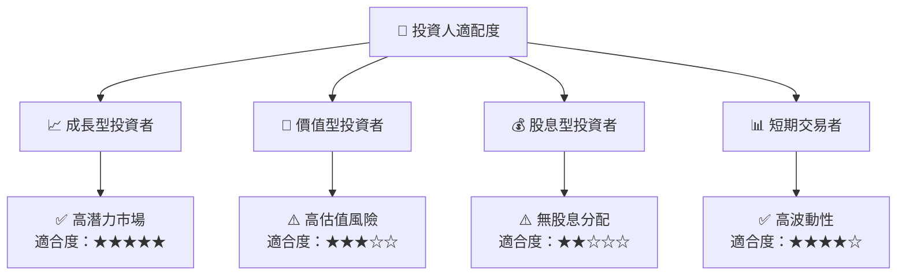

### 10.5 關鍵監控指標

| 監控類型 | 指標 | 關注點 | 頻率 |
|----------|------|--------|------|
| 財務指標 | 營收增長率 | 每季報告 | 季度 |
| 業務指標 | 合約獲取情況 | 新合約簽署 | 每月 |
| 行業指標 | 國防預算變化 | 政府政策 | 每年 |
| 估值指標 | P/E 比率 | 市場情緒 | 每季 |

---

> **免責聲明**：本報告為 AI 自動生成，僅供研究參考，不構成投資建議。投資有風險，入市需謹慎。

