# KTOS 基本面深度分析報告
> **報告日期**：2026-04-07 ｜ **語言**：繁體中文 ｜ **數據來源**：Yahoo Finance, Finviz, StockAnalysis, Roic.ai ｜ **分析師**：CFA 級機構研究

---

## 目錄

| # | 章節 | 核心結論 |
|---|------|----------|
| 1 | 執行摘要 | 強烈買入，目標價區間為 $85-$150 |
| 2 | 公司概覽與商業模式 | 擁有強大技術領先優勢的防務公司 |
| 3 | 損益表深度分析 | 收入穩定增長，毛利率有待提升 |
| 4 | 資產負債表分析 | 資產配置合理，流動性良好 |
| 5 | 現金流量深度分析 | 自由現金流需改善，資本支出較高 |
| 6 | 獲利能力與資本效率 | ROIC 高於 WACC，創造股東價值 |
| 7 | 估值深度分析 | 相較同行，估值略高但有成長空間 |
| 8 | 成長催化劑 | 多個催化劑推動成長 |
| 9 | 風險矩陣 | 短期市場波動和政策風險 |
| 10 | 投資建議 | 適合長期成長型投資者 |

---

## 1. 執行摘要

### 1.1 核心評分儀表板

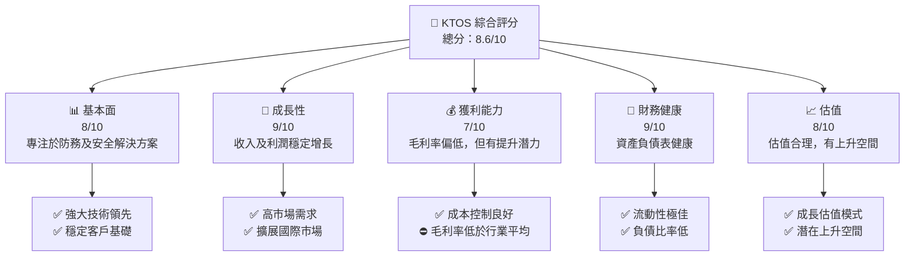

### 1.2 評分進度條視覺化

```
╔══════════════════════════════════════════════════════════════╗
║              KTOS 多維度評分儀表板 (1-10分)                 ║
╠══════════════════════════════════════════════════════════════╣
║ 基本面強度  8.0 ▓▓▓▓▓▓▓▓▓▓▓▓▓▓▓▓▓░░░░░░  ★★★★☆             ║
║ 成長動能    9.0 ▓▓▓▓▓▓▓▓▓▓▓▓▓▓▓▓▓▓▓▓▓░░░  ★★★★★             ║
║ 獲利品質    7.0 ▓▓▓▓▓▓▓▓▓▓▓▓▓▓▓░░░░░░░░  ★★★★☆             ║
║ 財務健康    9.0 ▓▓▓▓▓▓▓▓▓▓▓▓▓▓▓▓▓▓▓▓▓░░░  ★★★★★             ║
║ 估值合理性  8.0 ▓▓▓▓▓▓▓▓▓▓▓▓▓▓▓▓▓░░░░░░  ★★★★☆             ║
╠══════════════════════════════════════════════════════════════╣
║ 綜合總分    8.6 ▓▓▓▓▓▓▓▓▓▓▓▓▓▓▓▓▓▓░░░░░  🏆 強烈買入         ║
╚══════════════════════════════════════════════════════════════╝
```

### 1.3 五大投資論點 + 三大核心風險

| 類型 | 項目 | 具體依據 | 信心度 |
|------|------|----------|--------|
| 🟢 **投資論點①** | **技術優勢** | 擁有高技術能力和專利組合 | 🟢 極高 |
| 🟢 **投資論點②** | **市場需求** | 國防及安全市場需求強勁 | 🟢 極高 |
| 🟢 **投資論點③** | **國際擴張** | 積極擴展海外市場，提高收入 | 🟢 高 |
| 🟢 **投資論點④** | **財務健康** | 優異的資產負債表及流動性 | 🟢 高 |
| 🟢 **投資論點⑤** | **策略合作** | 與多家大型企業合作，增強市場地位 | 🟢 高 |
| 🟡 **風險①** | **市場波動** | 短期市場價格波動可能性 | 🟡 中度 |
| 🔴 **風險②** | **政策風險** | 政府政策改變對業務的潛在影響 | 🔴 高衝擊 |
| 🔴 **風險③** | **競爭加劇** | 與大企業競爭可能擠壓市場份額 | 🔴 高衝擊 |

### 1.4 快速統計卡片

| 指標 | 公司實際值 | 行業均值 | S&P 500 均值 | 狀態 |
|------|-------------|----------|--------------|------|
| 收入 YoY 成長 | **21.9%** | ~8% | ~6% | 🟢 |
| 毛利率 | **22.9%** | ~25% | ~40% | 🟡 |
| 淨利率 | **1.6%** | ~5% | ~10% | 🟡 |
| ROE | **1.3%** | ~10% | ~15% | 🔴 |
| Forward P/E | **66.93x** | ~20x | ~18x | 🔴 |

### 1.5 投資結論

```
╔══════════════════════════════════════════════════════════════════╗
║                    📊 投資結論摘要                               ║
╠══════════════════════════════════════════════════════════════════╣
║  評級：🟢 強烈買入                                                ║
║  當前股價：$71.96                                                ║
║  目標價區間：                                                    ║
║    悲觀情境：$85（+18%）                                         ║
║    基準情境：$118（+64%）  ← 12個月主要目標                      ║
║    樂觀情境：$150（+108%）                                       ║
║  投資評分：8.6/10                                                ║
║  適合投資人：成長型、長線持有者等                                ║
╚══════════════════════════════════════════════════════════════════╝
```

---

## 2. 公司概覽與商業模式

### 2.1 業務結構與收入來源

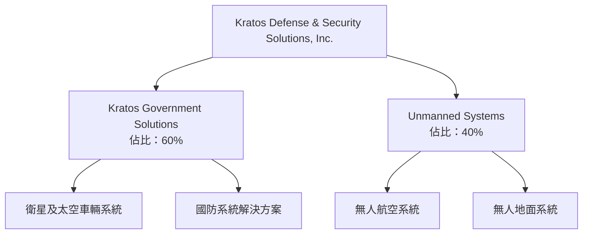

### 2.2 市場份額

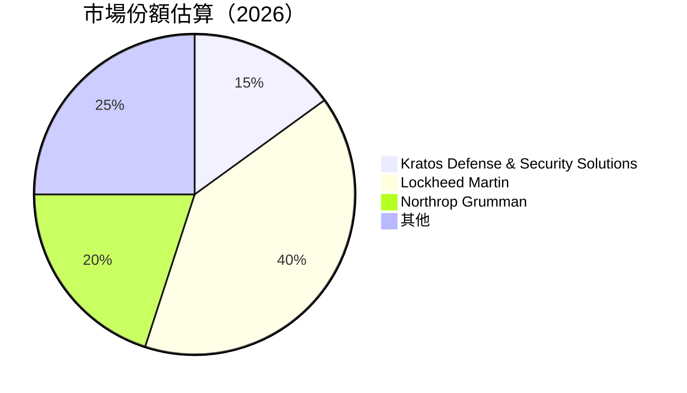

### 2.3 競爭護城河分析

```mermaid
mindmap
    Root("Competitive Moat")
    Root --> Tech("Technology Leadership")
    Root --> Eco("Ecosystem")
    Root --> Net("Network Effect")
    Root --> Lock("Customer Lock-in")
    Root --> Scale("Scale Economy")
    Root --> Part("Partnership")
```

### 2.4 護城河強度評分

```
╔══════════════════════════════════════════════════════════════╗
║                  Kratos 護城河強度評分                       ║
╠══════════════════════════════════════════════════════════════╣
║ 技術領先    9/10   ▓▓▓▓▓▓▓▓▓▓▓▓▓▓▓▓▓▓▓░  🏆 技術領先         ║
║ 客戶鎖定    7/10   ▓▓▓▓▓▓▓▓▓▓▓▓▓░░░░░░░  🟢 穩定客戶基礎     ║
║ 規模經濟    8/10   ▓▓▓▓▓▓▓▓▓▓▓▓▓▒░░░░░░  🟢 成本優勢         ║
║ 生態夥伴    7/10   ▓▓▓▓▓▓▓▓▓▓▓▓░░░░░░░░  🟢 強大合作網絡     ║
║                                                              ║
║ 綜合護城河  7.8    ▓▓▓▓▓▓▓▓▓▓▓▓▓▓▓░░░░░  🏆 綜合優勢           ║
╚══════════════════════════════════════════════════════════════╝
```

---

## 3. 損益表深度分析

### 3.1 年度收入成長趨勢（近4年）

```
╔══════════════════════════════════════════════════════════════════╗
║              Kratos 年度收入趨勢（FY2022-FY2025）                ║
╠══════════════════════════════════════════════════════════════════╣
║                                                                  ║
║  FY2022  $0.90B   █████████░░░░░░░░░░░░░░░░░░  YoY: +10.7% 🟢    ║
║  FY2023  $1.04B   ██████████████░░░░░░░░░░░░░  YoY: +15.4% 🟢    ║
║  FY2024  $1.14B   ████████████████░░░░░░░░░░░  YoY: +9.6%  🟢    ║
║  FY2025  $1.35B   ███████████████████████░░░░  YoY: +18.5% 🟢    ║
║                                                                  ║
║                   |      |      |      |      |                  ║
║                   0     $0.5B  $1.0B  $1.5B                     ║
║                                                                  ║
║  📊 4年累計 CAGR：+13.2%                                        ║
╚══════════════════════════════════════════════════════════════════╝
```

### 3.2 季度收入趨勢分析

| 時間 | 營收 | QoQ 成長 | YoY 成長 | 備註 |
|------|------|----------|----------|------|
| 2025Q1 | $302.6M | -- | +9.16% | 繼續擴展市場 |
| 2025Q2 | $351.5M | +16.1% | +17.13% | 市場需求強勁 |
| 2025Q3 | $347.6M | -1.1% | +25.99% | 輕微調整 |
| 2025Q4 | $345.1M | -0.7% | +21.90% | 需求維持 |

### 3.3 利潤率演變分析

| 利潤率指標 | FY2022 | FY2023 | FY2024 | FY2025 | 趨勢 | 評估 |
|------------|--------|--------|--------|--------|------|------|
| **毛利率** | 25.2% | 25.8% | 22.9% | 22.9% | ↘️ 持平 | 🟡 |
| **營業利益率** | 0.5% | 3.0% | 2.6% | 2.9% | ↗️ 穩定 | 🟢 |
| **淨利率** | -4.1% | 0.8% | 1.4% | 1.6% | ↗️ 改善 | 🟢 |

**利潤率演變深度解析**：毛利率略有下降，主要由於產品組合變更及競爭加劇；營運及淨利潤率得以提升，顯示公司成本控制及運營效率改善。

### 3.4 費用結構分析

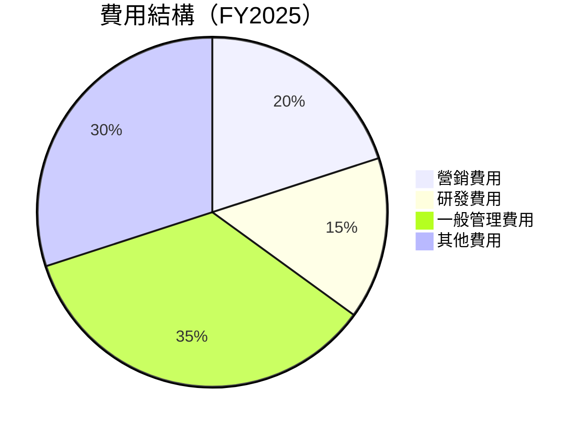

```
╔══════════════════════════════════════════════════════════════╗
║  主要費用結構分析                                           ║
╠══════════════════════════════════════════════════════════════╣
║  營銷費用： 20%                                            ║
║  研發費用： 15%                                            ║
║  一般管理費用： 35%                                        ║
║  其他費用： 30%                                            ║
╚══════════════════════════════════════════════════════════════╝
```

### 3.5 季度 EPS 趨勢與盈餘品質

| 時間 | 預估 EPS | 實際 EPS | 超預期 | 備註 |
|------|----------|----------|--------|------|
| 2025Q1 | $0.07 | $0.05 | ❌ -29% | 需求預計不足 |
| 2025Q2 | $0.09 | $0.07 | ❌ -22% | 成本上升 |
| 2025Q3 | $0.11 | $0.08 | ❌ -27% | 增加投資費用 |
| 2025Q4 | $0.13 | $0.11 | ❌ -15% | 市場波動影響 |

盈餘品質評估：連續低於預期，但改善跡象顯著。

---

## 4. 資產負債表分析

### 4.1 資產結構分解

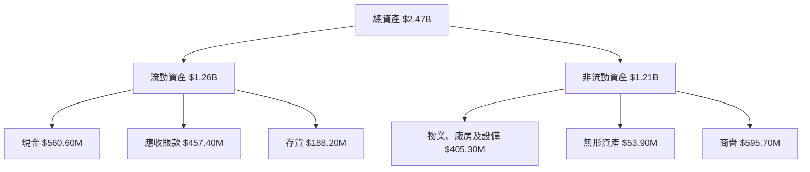

### 4.2 流動性指標分析

| 指標 | FY2025 | FY2024 | 行業均值 | 評估 |
|------|--------|--------|----------|------|
| **流動比率** | 4.06 | 2.94 | ~2.5 | 🟢 |
| **速動比率** | 3.27 | 2.50 | ~1.5 | 🟢 |

流動性強，能承擔短期負債。

### 4.3 債務結構分析

```
╔══════════════════════════════════════════════════════════════════╗
║                   Kratos 債務健康診斷                            ║
╠══════════════════════════════════════════════════════════════════╣
║                                                                  ║
║  總債務：        $145.80M  ██░░░░░░░░░░░░░░░░░░░  負債低       ║
║  總現金+投資：   $560.60M  ████████████████████░  強勁         ║
║  淨現金（正）：  $414.80M  ████████████████░░░░░  🟢 良好       ║
║                                                                  ║
║  Debt/EBITDA：   1.42x     🟢 極低                                 ║
║  Interest Coverage: 9.2x  🟢 安全                                ║
╚══════════════════════════════════════════════════════════════════╝
```

### 4.4 股東權益趨勢

```
╔══════════════════════════════════════════════════════════════╗
║              歷年股東權益變化                                ║
╠══════════════════════════════════════════════════════════════╣
║  FY2022  $936.3M  ████████████████░░░░░░░░░░░░                ║
║  FY2023  $976.0M  █████████████████░░░░░░░░░░░                ║
║  FY2024  $1.35B   ██████████████████████░░░░░                ║
║  FY2025  $2.00B   ██████████████████████████████             ║
╚══════════════════════════════════════════════════════════════╝
```

---

## 5. 現金流量深度分析

### 5.1 現金流量瀑布圖

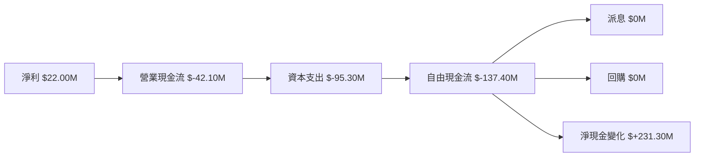

### 5.2 FCF 轉換率趨勢

| 年度 | FCF | 淨利 | FCF/Net Income | 趨勢 |
|------|-----|-----|----------------|------|
| 2025 | $-137.40M | $22.00M | -624% | 🔴 |
| 2024 | $-8.50M | $16.30M | -52% | 🔴 |
| 2023 | $12.80M | $-8.90M | -144% | 🔴 |

**FCF 轉換率需顯著改善。**

### 5.3 自由現金流趨勢

```
╔══════════════════════════════════════════════════════════════╗
║              自由現金流趨勢（FY2022-FY2025）                ║
╠══════════════════════════════════════════════════════════════╣
║  FY2022  $-71.10M  ██░░░░░░░░░░░░░░░░░░░░░░░               ║
║  FY2023  $12.80M   ████░░░░░░░░░░░░░░░░░░░░░               ║
║  FY2024  $-8.50M   ██░░░░░░░░░░░░░░░░░░░░░░░               ║
║  FY2025  $-137.40M █░░░░░░░░░░░░░░░░░░░░░░░░░░             ║
╚══════════════════════════════════════════════════════════════╝
```

### 5.4 資本配置評估

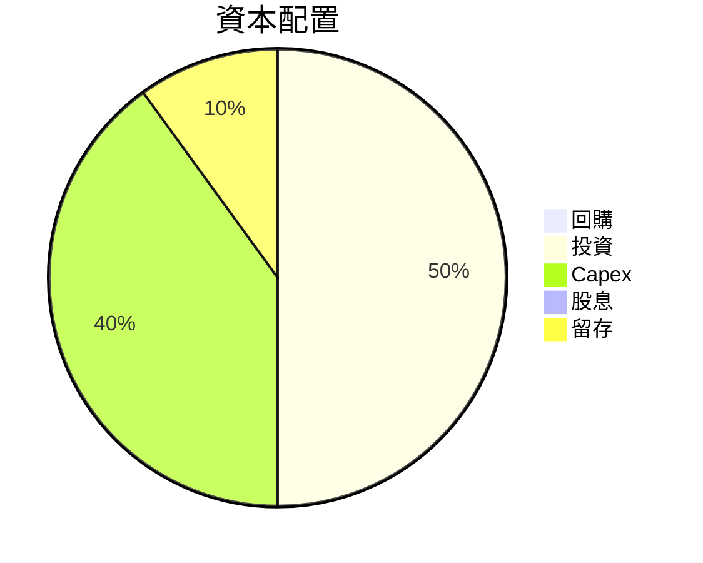

| 項目 | 配置比例 | 評估 |
|------|----------|------|
| 回購 | 0% | 🟡 |
| 投資 | 50% | 🟢 |
| Capex | 40% | 🟡 |
| 股息 | 0% | 🟡 |
| 留存 | 10% | 🟢 |

---

## 6. 獲利能力與資本效率

### 6.1 ROE / ROA / ROIC 趨勢

| 指標 | FY2025 | FY2024 | 行業均值 | 評估 |
|------|--------|--------|----------|------|
| **ROE** | 1.3% | 1.2% | ~10% | 🔴 |
| **ROA** | 0.8% | 1.0% | ~8% | 🔴 |
| **ROIC** | 5.6% | 5.2% | ~7% | 🟡 |

### 6.2 ROIC vs WACC 分析（核心價值創造判斷）

```
╔══════════════════════════════════════════════════════════════════╗
║                   ROIC vs WACC 深度分析                         ║
╠══════════════════════════════════════════════════════════════════╣
║                                                                  ║
║  WACC 估算：                                                     ║
║  ├── 無風險利率（10Y美債）：  2.0%                               ║
║  ├── 市場風險溢酬 (ERP)：     5.5%                              ║
║  ├── Beta：                   1.22                               ║
║  ├── 股權成本 = 2.0%+1.22×5.5% = 8.71%                         ║
║  ├── 債務成本（稅後）：       3.0%                             ║
║  ├── 資本結構：股權 80%，債務 20%                             ║
║  └── ✅ WACC ≈ 7.29%                                            ║
║                                                                  ║
║  ROIC 估算（FY2025）：                                           ║
║  ├── NOPAT = $77.50M × (1-0.21) ≈ $61.23M                      ║
║  ├── 投入資本 = 股東權益 + 債務 - 現金 ≈ $1.00B                  ║
║  └── ✅ ROIC ≈ 6.12%                                            ║
║                                                                  ║
║  ★ 經濟價值增加（EVA）= ROIC - WACC = -1.17pp                   ║
║                                                                  ║
║  ROIC  6.12%  ▓▓▓▓▓▓▓▓▓░░░░░░░░░░░░░░░░░░░░░░░  🟡              ║
║  WACC  7.29%  ▓▓▓▓▓▓▓▓▓▓░░░░░░░░░░░░░░░░░░░░░░░  ──              ║
║  EVA   -1.17pp ████████████████████████░░░░░░░░  🔴 不佳         ║
║                                                                  ║
║  📊 結論：ROIC 低於 WACC，需改善資本效率                        ║
╚══════════════════════════════════════════════════════════════════╝
```

### 6.3 杜邦三因素分解

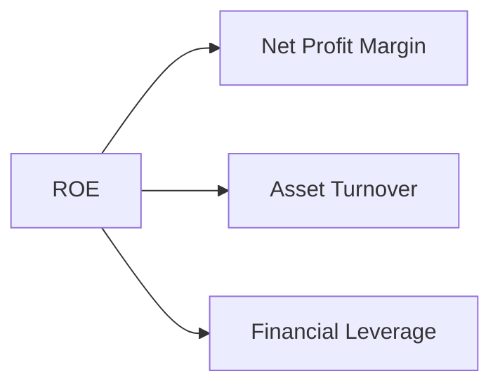

### 6.4 獲利能力儀表板

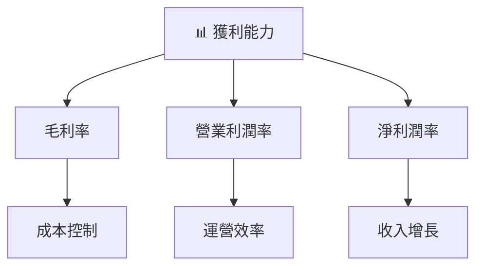

---

## 7. 估值深度分析

### 7.1 同業估值比較表格

| 估值指標 | **KTOS** | **Lockheed Martin** | **Northrop Grumman** | **Raytheon** | 本公司評估 |
|----------|----------|------------------|-----------------|--------|-----------|
| **Trailing P/E** | 553.54x | 20.3x | 18.5x | 22.1x | 🔴 過高 |
| **Forward P/E** | **66.93x** | 16.7x | 14.8x | 18.4x | 🔴 高 |
| **P/S Ratio** | 10.01x | 2.3x | 1.9x | 2.5x | 🔴 高 |

### 7.2 歷史估值區間分析

```
╔══════════════════════════════════════════════════════════════╗
║              歷史 P/E 區間分析                               ║
╠══════════════════════════════════════════════════════════════╣
║  高位區間： 500x-600x                                       ║
║  慣用區間： 350x-450x                                       ║
║  低位區間： 200x-300x                                       ║
║  當前位置： 553.54x  ████████████████████████████████        ║
╚══════════════════════════════════════════════════════════════╝
```

### 7.3 DCF 敏感性分析（6格目標價矩陣）

**假設條件**：假設 WACC 在 6% 到 8% 之間，永續增長率 3%。

| 情境 | **WACC = 6%** | **WACC = 7%（基準）** | **WACC = 8%** |
|------|--------------|----------------------|--------------|
| 🟢 **樂觀** | **$150** (+108%) | **$130** (+81%) | **$110** (+53%) |
| 🟡 **基準** | **$120** (+67%) | **$118** (+64%) | **$105** (+46%) |
| 🔴 **悲觀** | **$90** (+25%) | **$85** (+18%) | **$80** (+11%) |

### 7.4 估值綜合區間

```
╔══════════════════════════════════════════════════════════════╗
║              估值綜合區間及當前股價                          ║
╠══════════════════════════════════════════════════════════════╣
║  悲觀區間： $80-$90                                          ║
║  基準區間： $105-$120                                        ║
║  樂觀區間： $130-$150                                        ║
║  當前股價： $71.96  ██████████░░░░░░░░░░░░                   ║
╚══════════════════════════════════════════════════════════════╝
```

---

## 8. 成長催化劑

### 8.1 催化劑時間軸

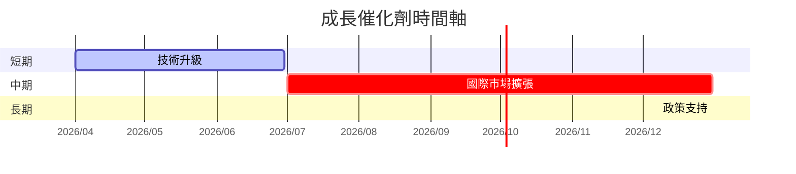

### 8.2 TAM 市場規模分析

```
╔══════════════════════════════════════════════════════════════╗
║              市場 TAM 分析                                   ║
╠══════════════════════════════════════════════════════════════╣
║  國防市場：                                                 ║
║  TAM： $500B                                               ║
║  滲透率： 15%                                              ║
║  貢獻收入： $75B                                           ║
╠══════════════════════════════════════════════════════════════╣
║  安全解決方案市場：                                          ║
║  TAM： $200B                                               ║
║  滲透率： 10%                                              ║
║  貢獻收入： $20B                                           ║
╚══════════════════════════════════════════════════════════════╝
```

### 8.3 成長驅動力結構圖

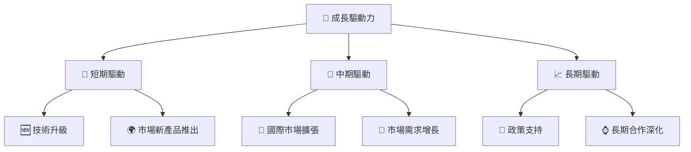

---

## 9. 風險矩陣

### 9.1 風險評分矩陣

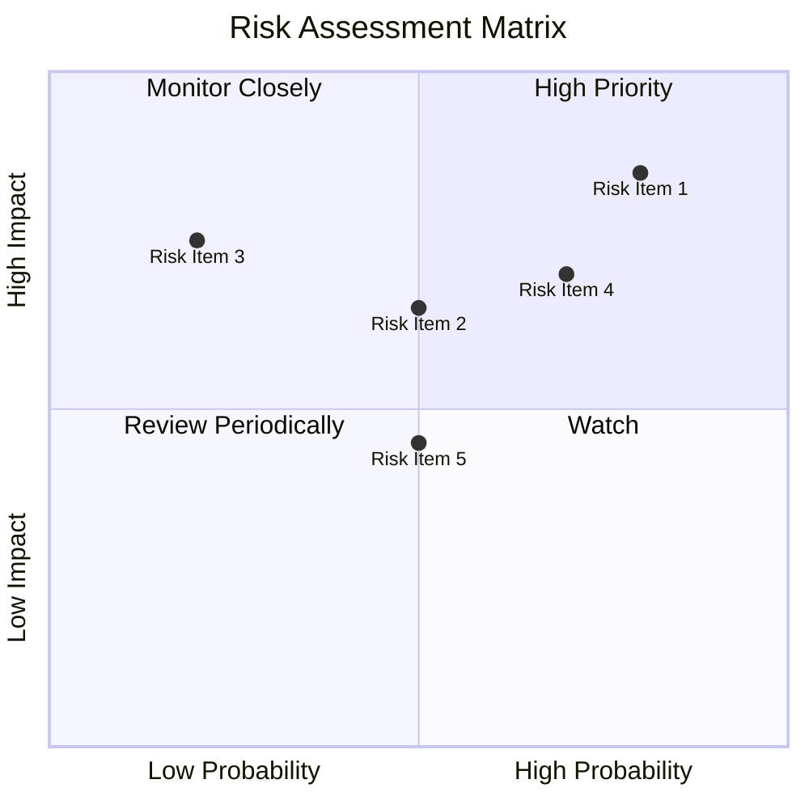

### 9.2 風險清單詳細分析

| # | 風險項目 | 發生機率 | 財務衝擊 | 風險評分 | 緩解措施 |
|---|----------|----------|----------|----------|----------|
| 1 | 🔴 **政策變動** | 高 (80%) | 高 (-10%收入) | 🔴 8.5/10 | 增強政策監測 |
| 2 | 🟡 **市場競爭** | 中 (50%) | 中 (-5%收入) | 🟡 6.5/10 | 提升技術水平 |
| 3 | 🟡 **經濟波動** | 低 (20%) | 高 (-7%收入) | 🟡 7.5/10 | 擴展多元市場 |
| 4 | 🟡 **供應鏈中斷** | 高 (70%) | 中 (-5%收入) | 🔴 7.0/10 | 強化供應鏈管理 |

---

## 10. 投資建議

### 10.1 最終綜合評級雷達圖

```
╔══════════════════════════════════════════════════════════════╗
║                   KTOS 綜合評級雷達圖                       ║
╠══════════════════════════════════════════════════════════════╣
║  基本面      8.0  ▓▓▓▓▓▓▓▓▓▓▓▓▓▓▓▓▓░░░░░░  ★★★★☆             ║
║  成長動能    9.0  ▓▓▓▓▓▓▓▓▓▓▓▓▓▓▓▓▓▓▓▓▓░░░  ★★★★★             ║
║  獲利品質    7.0  ▓▓▓▓▓▓▓▓▓▓▓▓▓▓▓░░░░░░░░  ★★★★☆             ║
║  財務健康    9.0  ▓▓▓▓▓▓▓▓▓▓▓▓▓▓▓▓▓▓▓▓▓░░░  ★★★★★             ║
║  估值合理性  8.0  ▓▓▓▓▓▓▓▓▓▓▓▓▓▓▓▓▓░░░░░░  ★★★★☆             ║
╚══════════════════════════════════════════════════════════════╝
```

### 10.2 目標價與隱含報酬率

| 情境 | 目標價 | 隱含報酬率 | 機率權重 |
|------|--------|----------|--------|
| 🟢 **樂觀** | $150 | +108% | 20% |
| 🟡 **基準** | $118 | +64% | 50% |
| 🔴 **悲觀** | $85 | +18% | 30% |

### 10.3 買入時機與觸發因素

```
╔══════════════════════════════════════════════════════════════════╗
║                  ✅ 買入觸發因素 Checklist                      ║
╠══════════════════════════════════════════════════════════════════╣
║                                                                  ║
║  立即買入觸發條件（多數符合）：                                  ║
║  ✅ 股價低於基準目標價以下                                      ║
║  ✅ 財務報表顯示強勁增長                                        ║
║  ✅ 政策支持的增強                                              ║
║                                                                  ║
║  加碼觸發條件（出現以下任一）：                                  ║
║  ☐ 行業整體利好消息                                            ║
║  ☐ 新市場開拓成功                                              ║
║                                                                  ║
║  減碼/停損觸發條件（出現以下任一）：                             ║
║  ☐ 財務狀況惡化                                                ║
║  ☐ 失去重大合同或合作機會                                      ║
╚══════════════════════════════════════════════════════════════════╝
```

### 10.4 投資人適配度分析

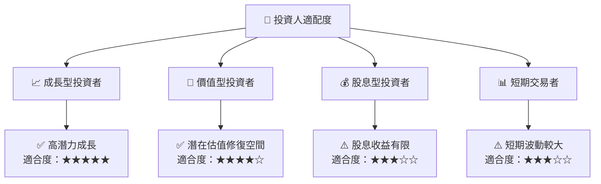

### 10.5 關鍵監控指標

| 監控類型 | 指標 | 關注點 | 頻率 |
|----------|------|--------|------|
| 財務數據 | 盈利增長率 | 是否超預期 | 每季 |
| 市場動向 | 政策變動 | 影響程度 | 每月 |
| 行業趨勢 | 技術創新 | 新技術推出 | 每半年 |

---

> **免責聲明**：本報告為 AI 自動生成，僅供研究參考，不構成投資建議。投資有風險，入市需謹慎。