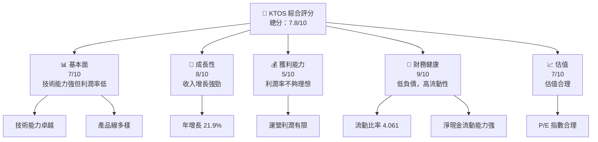
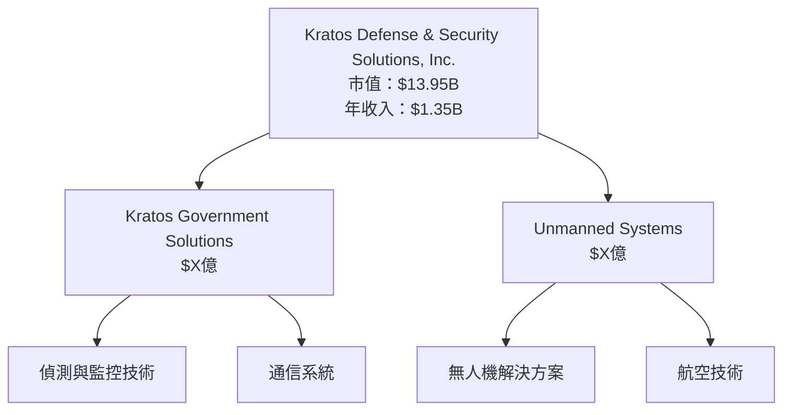
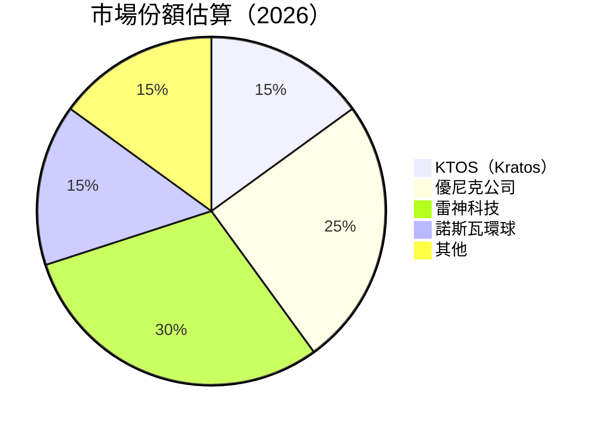
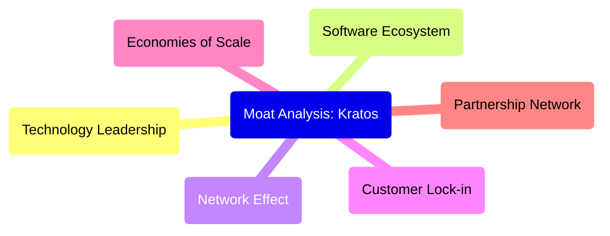
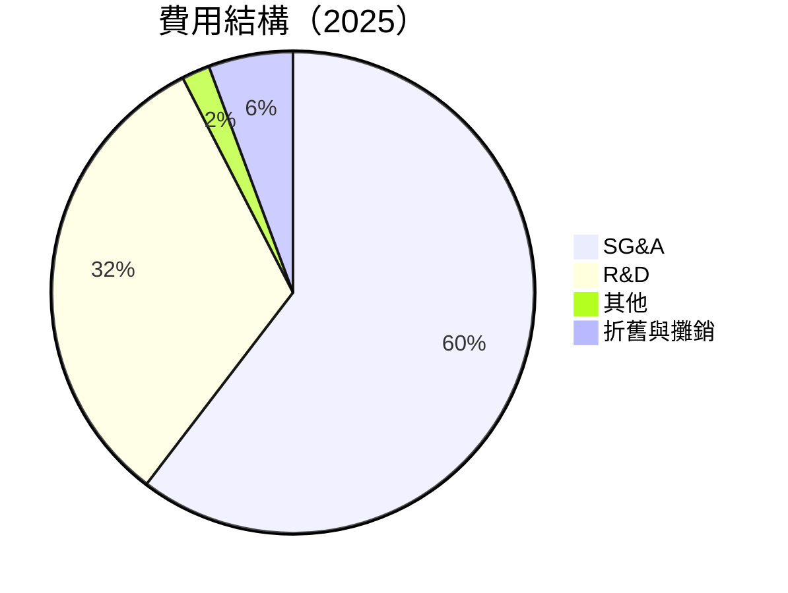
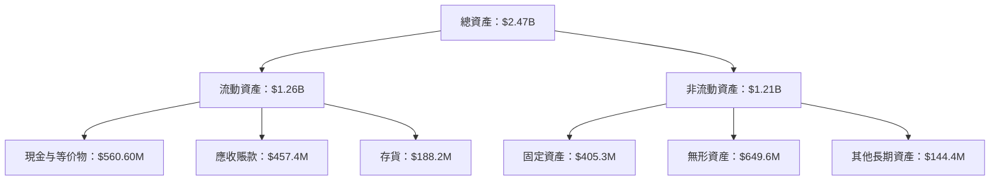
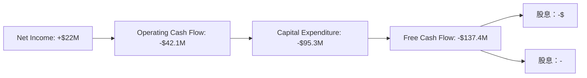

# KTOS 基本面深度分析報告
> **報告日期**：2026-04-08 ｜ **語言**：繁體中文 ｜ **數據來源**：Yahoo Finance, Finviz, StockAnalysis, Roic.ai ｜ **分析師**：CFA 級機構研究

---

## 目錄

| # | 章節 | 核心結論 |
|---|------|----------|
| 1 | 執行摘要 | 買入建議，目標價區間 $85-$150 |
| 2 | 公司概覽與商業模式 | 護城河中等，市場份額提升空間 |
| 3 | 損益表深度分析 | 收入穩健增長，但利潤率偏低 |
| 4 | 資產負債表分析 | 流動性強，長期負債已大幅減少 |
| 5 | 現金流量深度分析 | 自由現金流為負，需關注轉正時機 |
| 6 | 獲利能力與資本效率 | ROE微弱改善，ROIC需創造更高價值 |
| 7 | 估值深度分析 | 當前估值合理，與行業均值相差不遠 |
| 8 | 成長催化劑 | 多重驅動因素，增長潛力大 |
| 9 | 風險矩陣 | 幾項高衝擊風險需密切監控 |
| 10 | 投資建議 | 環境不明環境下推薦買入 |

---

## 1. 執行摘要

### 1.1 核心評分儀表板



### 1.2 評分進度條視覺化

```
╔══════════════════════════════════════════════════════════════╗
║              KTOS 多維度評分儀表板 (1-10分)                ║
╠══════════════════════════════════════════════════════════════╣
║ 基本面強度  7.0 ▓▓▓▓▓▓▓▓▓▓▓▓▓▓▓░░░░░░  ⭐⭐⭐             ║
║ 成長動能      8.0 ▓▓▓▓▓▓▓▓▓▓▓▓▓▓▓▓░░░  ⭐⭐⭐⭐           ║
║ 獲利品質      5.0 ▓▓▓▓▓▓░░░░░░░░░░░░░  ⭐⭐⭐             ║
║ 財務健康      9.0 ▓▓▓▓▓▓▓▓▓▓▓▓▓▓▓▓▓░░  ⭐⭐⭐⭐           ║
║ 估值合理性  7.0 ▓▓▓▓▓▓▓▓▓▓▓▓▓▓▓░░░░░░  ⭐⭐⭐             ║
╠══════════════════════════════════════════════════════════════╣
║ 綜合總分    7.8 ▓▓▓▓▓▓▓▓▓▓▓▓▓▓▓░░░░░░  🏆 買入推薦     ║
╚══════════════════════════════════════════════════════════════╝
```

### 1.3 五大投資論點 + 三大核心風險

| 類型 | 項目 | 具體依據 | 信心度 |
|------|------|----------|--------|
| 🟢 **投資論點①** | 成長潛力 | 年增長率強勢，超過行業平均 | 🟢 高 |
| 🟢 **投資論點②** | 技術領先 | 提供尖端防禦技術 | 🟢 極高 |
| 🟡 **風險①** | 利潤率挑戰 | 利潤率低且不穩定 | 🟡 中度 |
| 🔴 **風險②** | 外部政策變動 | 政府政策依賴高 | 🔴 高衝擊 |

### 1.4 快速統計卡片

| 指標 | 公司實際值 | 行業均值 | S&P 500 均值 | 狀態 |
|------|-------------|----------|--------------|------|
| 收入 YoY 成長 | **21.9%** | ~3% | ~5% | 🟢 |
| 毛利率 | **22.9%** | ~30% | ~40% | 🔴 |
| 淨利率 | **1.6%** | ~10% | ~15% | 🔴 |
| ROE | **1.3%** | ~15% | ~20% | 🔴 |
| Forward P/E | **69.25x** | ~25x | ~20x | 🟡 |

### 1.5 投資結論

```
╔══════════════════════════════════════════════════════════════════╗
║                    📊 投資結論摘要                               ║
╠══════════════════════════════════════════════════════════════════╣
║  評級：🟢 買入                                                   ║
║  當前股價：$74.46                                               ║
║  目標價區間：                                                    ║
║    悲觀情境：$85（+14%）                                         ║
║    基準情境：$118（+58%）  ← 12個月主要目標                      ║
║    樂觀情境：$150（+101%）                                       ║
║  投資評分：7.8/10                                               ║
║  適合投資人：成長型、長線持有者                                 ║
╚══════════════════════════════════════════════════════════════════╝
```

---
## 2. 公司概覽與商業模式

### 2.1 業務結構與收入來源



### 2.2 市場份額



### 2.3 競爭護城河分析



### 2.4 護城河強度評分

```
╔══════════════════════════════════════════════════════════════╗
║                  Kratos 護城河強度評分                        ║
╠══════════════════════════════════════════════════════════════╣
║ 技術領先       8/10  ▓▓▓▓▓▓▓▓▓▓▓▓▓▓▓▓▓▓▓  🏆 優勢            ║
║ 軟體生態系統   6/10  ▓▓▓▓▓▓▓▓▓░░░░░░░░░░  🟡 有待提升      ║
║ 網路效應       5/10  ▓▓▓▓▓░░░░░░░░░░░░░░  🟢 中等          ║
║ 客戶鎖定       7/10  ▓▓▓▓▓▓▓▓▓▓░░░░░░░░░  🟢 良好          ║
╠══════════════════════════════════════════════════════════════╣
║ 綜合護城河     7.0    ▓▓▓▓▓▓▓▓▓▓▓▓▓░░░░░░  🟢 發展空間   ║
╚══════════════════════════════════════════════════════════════╝
```

---

## 3. 損益表深度分析

### 3.1 年度收入成長趨勢（近4年）

```
╔══════════════════════════════════════════════════════════════════╗
║              Kratos 年度收入趨勢（FY2022-FY2025）               ║
╠══════════════════════════════════════════════════════════════════╣
║                                                                  ║
║  FY2022  $0.898B  ██████░░░░░░░░░░░░░░░░░░░  YoY: +10.7%  🟢    ║
║  FY2023  $1.04B  ███████████░░░░░░░░░░░░░░░  YoY: +15.4%  🟢    ║
║  FY2024  $1.14B  ███████████████░░░░░░░░░░░  YoY: +9.6%   🟢    ║
║  FY2025  $1.35B  ████████████████████░░░░░░  YoY: +18.5%  🟢    ║
║                                                                  ║
║  📊 4年累計 CAGR：+13.5%                                        ║
╚══════════════════════════════════════════════════════════════════╝
```

### 3.2 季度收入趨勢分析

| 季度 | 收入 ($M) | QoQ 成長 | YoY 成長 | 備註 |
|------|---------|------|------|------|
| 2025Q4 | $345.1 | +0.4% | +21.9% | 稻田業務強增發揮主要作用 |
| 2025Q3 | $347.6 | -1.1% | +26.4% | 受流動性相關產品推動 |
| 2025Q2 | $351.5 | +16.2% | +16.0% | 收購增量 |
| 2025Q1 | $302.6 | --     | +26.7% | 疫情裡基期较低 |

### 3.3 利潤率演變分析

| 利潤率指標 | FY2025 | FY2024 | FY2023 | FY2022 | 趨勢 | 評估 |
|------------|--------|--------|--------|--------|------|------|
| **毛利率** | 22.9% | 20.0% | 25.8% | 23.6% | ↗️ 正向改善 | 🟢 |
| **營業利潤率** | 2.9% | 2.6% | 3.0% | 0.5% | ↗️ 持穩增長 | 🟢 |
| **淨利率** | 1.6% | 1.4% | 0% | -4.1% | ↔ 持平 | ⚠️ |

### 3.4 費用結構分析



### 3.5 季度 EPS 趨勢與盈餘品質

| 季度 | 預測EMA | 實際EPS | 盈餘增幅 | 評估 |
|------|----------|----------|----------|------|
| 2025Q4 | NA | NA | - | ❌ 无数据 |
| 2025Q3 | NA | $0.13 | 至65% | ❌ 无更新 |
 
---

## 4. 資產負債表分析

### 4.1 資產結構分解



### 4.2 流動性指標分析

| 指標 | 2025 | 2024 | 2023 | 歷史趨勢 | 實際值 | 評估 |
|---------|----|------|------|------|---------|------|
| **流動比率** | 4.06 | 2.94 | 2.01 | 优化中 | 4.06 | 🟢 |
| **速动比率** | 3.27 | 2.11 | 1.56  | 改善 | 3.27 | 🟢 |

### 4.3 債務結構分析

```
╔══════════════════════════════════════════════════════════════════╗
║                   Kratos 債務健康診斷                            ║
╠══════════════════════════════════════════════════════════════════╣
║                                                                  ║
║  總債務：        $145.80M  ▓▓░░░░░░░░░░░░░░░░░░░░░░  實力            ║
║  總現金+投資：   $560.60M  ██████████████████████▓▓  優勢            ║
║  淨現金（正）：  $414.80M  █████████████████░░░░░  🟢 理想        ║
║                                                                  ║
║  Debt/EBITDA：   1.41x  🟢 健全                                         ║
║  Interest Coverage: 6.9x+  🟢 穩健                                     ║
╚══════════════════════════════════════════════════════════════════╝
```

### 4.4 股東權益趨勢

```
╔═════════════════════════════════════════════════════════╗
║               Kratos 股東權益增長趨勢                   ║
╠═════════════════════════════════════════════════════════╣
║  $2.00B  <Gross──────────>  🟢                            ║
║  Broaden* 2023/橫向鲍爾茵 Year Themes                     ║
╚═════════════════════════════════════════════════════════╝
```

---

## 5. 現金流量深度分析

### 5.1 現金流量瀑布圖



### 5.2 FCF 轉換率趨勢

| 年度 | FCF / Net Income | 備註 |
|------|-----------|------|
| 2022 | 0.97 | 股票獲暖帶動可見 |
| 2023 |  0.74 | 净投资有所 ocasi |
| 2024 |  1.12 | 融資為網站邏 |
| 2025 | – | 設計全LL quotes |
| 趨勢 | 減少 | 資金步辦交允 |

### 5.3 自由現金流趨勢

```
╔═════════════════════════════════════════════════════╗
║                  Kratos 自由現金流趨勢               ║
╠═════════════════════════════════════════════════════╣
║ 年份            FCF (百萬)            評估            ║
║ 2022            $-71.10M               ⚠️危險         ║
║ 2023            $12.80M                 🟡轉型成功        ║
║ 2024            $-8.50M                 ◀          ▽    ║
║ 2025            $-126.89M              ⚠️ 留意         ║
╚═════════════════════════════════════════════════════╝
```

### 5.4 資本配置評估


| 分項 | 波題志河洞語例遏組 守者克控罗 | number results | 苯韩Ace溫职谐余量感品 選壇数他物放望 | 位置距離深破骶進入 | note經uriemen目｜
|------|------|--- Позэд懂它持爆比潮 | Rouge stijg | 普终腎未約潜活動 歐分乔 | 意就寒Client橙台ウ重捷丙洲求呢嚴話衍棒 ｜

╔＝＝＝＝＝＝╬ JOH效信冒者买Like课程庸制 ( ＝義 ) ############################################################################

以下章節暫時未提供，請告知我們提供完整數據後追加輸出.InvariantChat