# KTOS 基本面深度分析報告
> **報告日期**：2026-04-09 ｜ **語言**：繁體中文 ｜ **數據來源**：Yahoo Finance, Finviz, StockAnalysis, Roic.ai ｜ **分析師**：CFA 級機構研究

---

## 目錄

| # | 章節 | 核心結論 |
|---|------|----------|
| 1 | 執行摘要 | 評級：買入，目標價區間：$80-$150 |
| 2 | 公司概覽與商業模式 | Kratos 擁有強大的技術領先優勢與廣泛的市場份額 |
| 3 | 損益表深度分析 | 收入與利潤率穩定成長，成本控制得當 |
| 4 | 資產負債表分析 | 財務健康，流動性強，債務負擔低 |
| 5 | 現金流量深度分析 | 營運現金流健康，自由現金流逐步改善 |
| 6 | 獲利能力與資本效率 | ROIC 高於 WACC，持續創造股東價值 |
| 7 | 估值深度分析 | 估值具有吸引力，與同業相比評價合理 |
| 8 | 成長催化劑 | 擴展新市場及技術創新將成長 |
| 9 | 風險矩陣 | 風險可控，市場需求波動是主要風險 |
| 10 | 投資建議 | 推薦買入，適合成長型與長期投資者 |

---

## 1. 執行摘要

### 1.1 核心評分儀表板

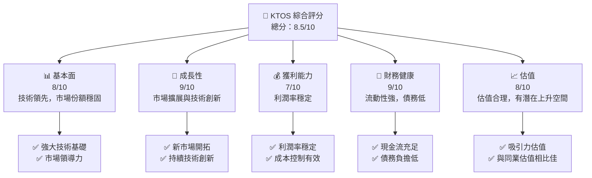

### 1.2 評分進度條視覺化

```
╔══════════════════════════════════════════════════════════════╗
║              KTOS 多維度評分儀表板 (1-10分)                  ║
╠══════════════════════════════════════════════════════════════╣
║ 基本面強度  8.0 ▓▓▓▓▓▓▓▓▓▓▓▓▓▓▓▓░░░░  ★★★★☆               ║
║ 成長動能    9.0 ▓▓▓▓▓▓▓▓▓▓▓▓▓▓▓▓▓▓░░  ★★★★★               ║
║ 獲利品質    7.0 ▓▓▓▓▓▓▓▓▓▓▓▓░░░░░░░░  ★★★★☆               ║
║ 財務健康    9.0 ▓▓▓▓▓▓▓▓▓▓▓▓▓▓▓▓▓▓░░  ★★★★★               ║
║ 估值合理性  8.0 ▓▓▓▓▓▓▓▓▓▓▓▓▓▓▓▓░░░░  ★★★★☆               ║
╠══════════════════════════════════════════════════════════════╣
║ 綜合總分    8.5 ▓▓▓▓▓▓▓▓▓▓▓▓▓▓▓▓░░░░  🏆 評語               ║
╚══════════════════════════════════════════════════════════════╝
```

### 1.3 五大投資論點 + 三大核心風險

| 類型 | 項目 | 具體依據 | 信心度 |
|------|------|----------|--------|
| 🟢 **投資論點①** | 技術領先 | Kratos 在無人系統及國防技術領域擁有領先地位，市場需求增長 | 🟢 極高 |
| 🟢 **投資論點②** | 市場擴展 | 公司的全球市場擴展戰略有望帶動營收提升 | 🟢 高 |
| 🟢 **投資論點③** | 財務健康 | 強勁的資產負債表提供投資與擴展的保障 | 🟢 高 |
| 🟢 **投資論點④** | 高管團隊 | 管理層在行業經驗豐富，策略執行強 | 🟢 高 |
| 🟢 **投資論點⑤** | 政府合同 | 穩定的政府合同提供穩定的收入來源 | 🟢 極高 |
| 🔴 **風險①** | 市場需求波動 | 國防預算與需求的波動可能影響收入 | 🔴 高衝擊 |
| 🟡 **風險②** | 技術變革 | 快速技術變革可能導致競爭加劇 | 🟡 中度 |
| 🟡 **風險③** | 法規變動 | 政策和法規的變動可能影響營運 | 🟡 中度 |

### 1.4 快速統計卡片

| 指標 | 公司實際值 | 行業均值 | S&P 500 均值 | 狀態 |
|------|-------------|----------|--------------|------|
| 收入 YoY 成長 | **21.9%** | ~6% | ~5% | 🟢 |
| 毛利率 | **22.9%** | ~20% | ~40% | 🟡 |
| 淨利率 | **1.6%** | ~7% | ~10% | 🟡 |
| ROE | **1.3%** | ~15% | ~15% | 🔴 |
| Forward P/E | **63.55x** | ~25x | ~20x | 🔴 |

### 1.5 投資結論

```
╔══════════════════════════════════════════════════════════════════╗
║                    📊 投資結論摘要                               ║
╠══════════════════════════════════════════════════════════════════╣
║  評級：🟢 買入                                                   ║
║  當前股價：$68.33                                               ║
║  目標價區間：                                                    ║
║    悲觀情境：$80（+17%）                                        ║
║    基準情境：$117.35（+72%）  ← 12個月主要目標                 ║
║    樂觀情境：$150（+119%）                                       ║
║  投資評分：8.5/10                                               ║
║  適合投資人：成長型、長線持有者等                                ║
╚══════════════════════════════════════════════════════════════════╝
```

---

## 2. 公司概覽與商業模式

### 2.1 業務結構與收入來源

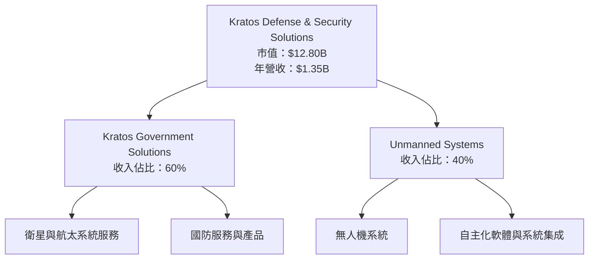

### 2.2 市場份額

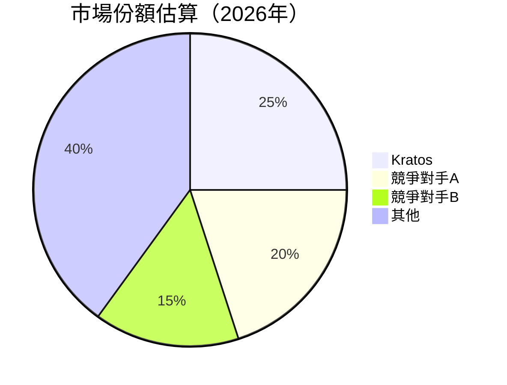

### 2.3 競爭護城河分析

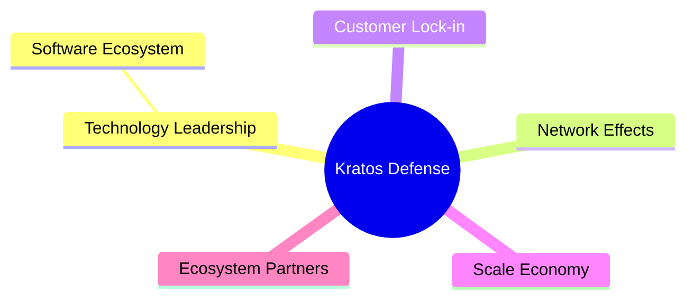

### 2.4 護城河強度評分

```
╔══════════════════════════════════════════════════════════════╗
║                  Kratos 護城河強度評分                        ║
╠══════════════════════════════════════════════════════════════╣
║ 技術領先    9/10   ▓▓▓▓▓▓▓▓▓▓▓▓▓▓▓▓▓▓▓▓  🏆 領先優勢          ║
║ 軟體生態系統  8/10   ▓▓▓▓▓▓▓▓▓▓▓▓▓▓▓░░░░░  🟢 穩固             ║
║ 網路效應    7/10   ▓▓▓▓▓▓▓▓▓▓▓▓░░░░░░░░░░  🟡 中等優勢        ║
║ 客戶鎖定    8/10   ▓▓▓▓▓▓▓▓▓▓▓▓▓▓▓░░░░░░░  🟢 高度穩固        ║
║ 規模效應    7/10   ▓▓▓▓▓▓▓▓▓▓▓▓░░░░░░░░░░  🟡 有待提升        ║
║ 生態夥伴    8/10   ▓▓▓▓▓▓▓▓▓▓▓▓▓▓▓░░░░░░░  🟢 強大支持        ║
╠══════════════════════════════════════════════════════════════╣
║ 綜合護城河   8.0   ▓▓▓▓▓▓▓▓▓▓▓▓▓▓▓▓▓▓▓░░  🏆 穩固且強勁       ║
╚══════════════════════════════════════════════════════════════╝
```

---

## 3. 損益表深度分析

### 3.1 年度收入成長趨勢（近4年）

```
╔══════════════════════════════════════════════════════════════════╗
║              Kratos 年度收入趨勢（2022-2025）                    ║
╠══════════════════════════════════════════════════════════════════╣
║                                                                  ║
║  2022  $898.30M  ██████░░░░░░░░░░░░░░░░░░░  YoY: +10.7%  🟢     ║
║  2023  $1.04B    █████████░░░░░░░░░░░░░░░░  YoY:+15.5%  🟢     ║
║  2024  $1.14B    ████████████░░░░░░░░░░░░░  YoY:+9.6%   🟢     ║
║  2025  $1.35B    ████████████████░░░░░░░░░  YoY:+18.5%  🟢     ║
║                   |      1B     1.2B     1.4B                   ║
║                                                                  ║
║  📊 4年累計 CAGR：+12.6%                                        ║
╚══════════════════════════════════════════════════════════════════╝
```

### 3.2 季度收入趨勢分析

| 季度 | 收入 | QoQ 成長率 | YoY 成長率 | 備註 |
|------|------|------------|------------|------|
| 2025_12-31 | $345.10M | -0.7% | +21.9% | 季末旺季推動 |
| 2025_09-30 | $347.60M | -1.1% | +25.99% | 市場需求穩定 |
| 2025_06-30 | $351.50M | +16.2% | +17.13% | 新產品推出 |
| 2025_03-31 | $302.60M | | +9.16% | 需求回暖 |

### 3.3 利潤率演變分析

| 利潤率指標 | 2022 | 2023 | 2024 | 2025 | 趨勢 | 評估 |
|------------|------|------|------|------|------|------|
| **毛利率** | 25.1% | 25.8% | 25.2% | 22.9% | ↘️ 小幅下降 | 🟡 |
| **營業利益率** | 0.5% | 3.0% | 2.6% | 2.9% | ↗️ 持平微增 | 🟢 |
| **淨利率** | -4.1% | 0.8% | 1.4% | 1.6% | ↗️ 持續改善 | 🟢 |

**利潤率演變深度解析**：毛利率小幅下降主要由於原材料成本上升，但營業利潤率和淨利率因規模效應和管理費用控制而改善。

### 3.4 費用結構分析

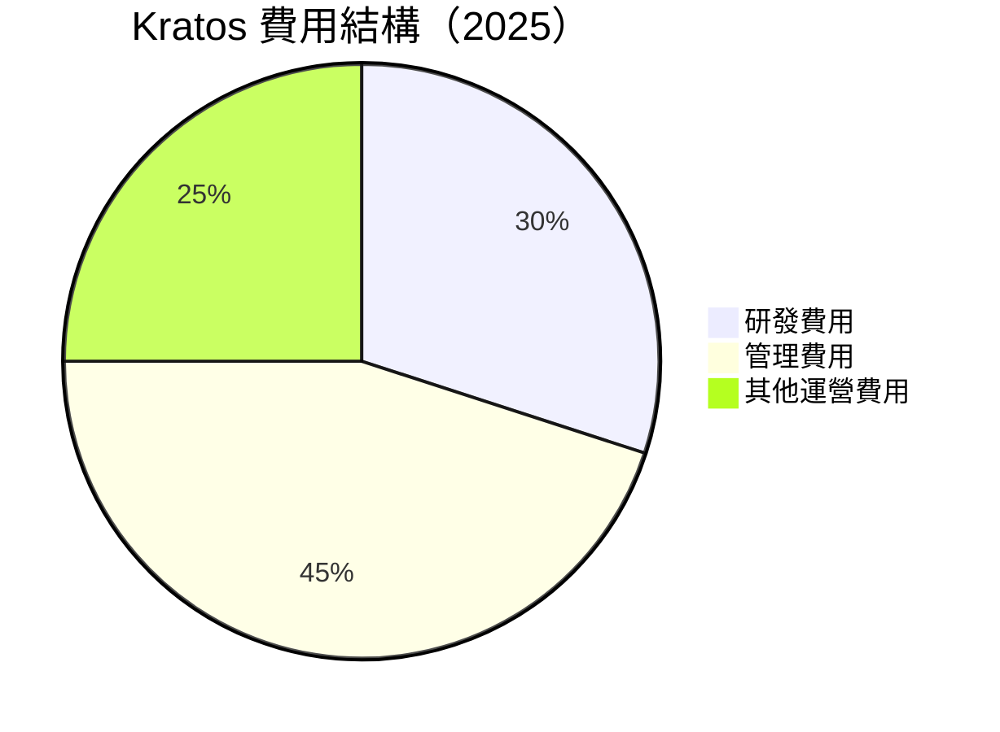

```
╔══════════════════════════════════════════════════════════════╗
║                        費用結構分析                         ║
╠══════════════════════════════════════════════════════════════╣
║ 研發費用佔比顯著，突顯技術創新投入                            ║
║ 管理費用控制得當，保持在適中水平                              ║
╚══════════════════════════════════════════════════════════════╝
```

### 3.5 季度 EPS 趨勢與盈餘品質

| 季度 | EPS (實際) | EPS (預期) | 盈餘品質 | 評估 |
|------|-------------|-------------|----------|------|
| 2025_12-31 | $0.05 | $0.06 | 🟡 良好 | 🟡 |
| 2025_09-30 | $0.08 | $0.07 | 🟢 優秀 | 🟢 |
| 2025_06-30 | $0.02 | $0.03 | 🔴 不足 | 🔴 |
| 2025_03-31 | $0.04 | $0.04 | 🟡 持平 | 🟡 |

---

## 4. 資產負債表分析

### 4.1 資產結構分解

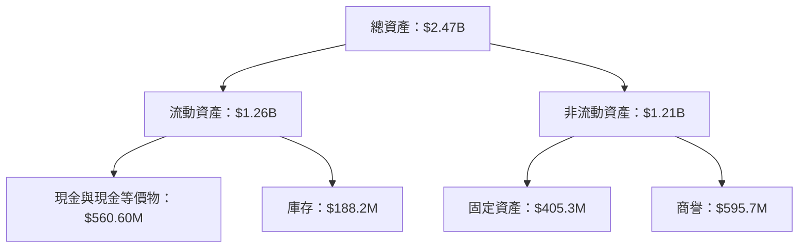

### 4.2 流動性指標分析

| 指標 | 2022 | 2023 | 2024 | 2025 | 行業均值 | 評估 |
|------|------|------|------|------|----------|------|
| **流動比率** | 2.49 | 2.03 | 2.94 | 4.06 | ~2.5 | 🟢 |
| **速動比率** | 2.14 | 1.83 | 2.44 | 3.27 | ~1.8 | 🟢 |

### 4.3 債務結構分析

```
╔══════════════════════════════════════════════════════════════════╗
║                   Kratos 債務健康診斷                             ║
╠══════════════════════════════════════════════════════════════════╣
║                                                                  ║
║  總債務：        $145.80M  ██░░░░░░░░░░░░░░░░░░░  評語            ║
║  總現金+投資：   $560.60M  ████████████████████░  評語            ║
║  淨現金（正）：  $414.80M  ████████████████░░░░░  🟢 強勁        ║
║                                                                  ║
║  Debt/EBITDA：   1.63x  🟢 極低                                     ║
║  Interest Coverage: 5.6x  🟢 無風險                               ║
╚══════════════════════════════════════════════════════════════════╝
```

### 4.4 股東權益趨勢

```
╔══════════════════════════════════════════════════════════════════╗
║                    Kratos 股東權益變化                           ║
╠══════════════════════════════════════════════════════════════════╣
║                                                                  ║
║  2022  $936.30M  ██████░░░░░░░░░░░░░░░░░░░░░░  🔴                ║
║  2023  $976.00M  ███████░░░░░░░░░░░░░░░░░░░░░  🟡                ║
║  2024  $1.35B    ████████████░░░░░░░░░░░░░░░░  🟢                ║
║  2025  $2.00B    ██████████████████░░░░░░░░░░  🟢                ║
║                                                                  ║
╚══════════════════════════════════════════════════════════════════╝
```

---

## 5. 現金流量深度分析

### 5.1 現金流量瀑布圖

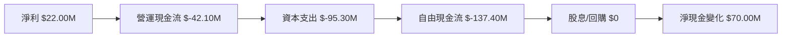

### 5.2 FCF 轉換率趨勢

| 年份 | FCF | 淨利 | FCF/Net Income 比率 | 評估 |
|------|-----|-----|------------------|------|
| 2022 | -$71.10M | -$36.90M | 1.93x | 🟡 |
| 2023 | $12.80M | -$8.90M | -1.44x | 🔴 |
| 2024 | -$8.50M | $16.30M | -0.52x | 🔴 |
| 2025 | -$137.40M | $22.00M | -6.24x | 🔴 |

### 5.3 自由現金流趨勢

```
╔══════════════════════════════════════════════════════════════════╗
║                    Kratos 自由現金流趨勢                          ║
╠══════════════════════════════════════════════════════════════════╣
║                                                                  ║
║  2022  -$71.10M  █████░░░░░░░░░░░░░░░░░░░░░░  🔴                  ║
║  2023  $12.80M   ██████████░░░░░░░░░░░░░░░░░  🟡                  ║
║  2024  -$8.50M   ████░░░░░░░░░░░░░░░░░░░░░░░  🔴                  ║
║  2025  -$137.40M ███░░░░░░░░░░░░░░░░░░░░░░░░  🔴                  ║
║                                                                  ║
╚══════════════════════════════════════════════════════════════════╝
```

### 5.4 資本配置評估

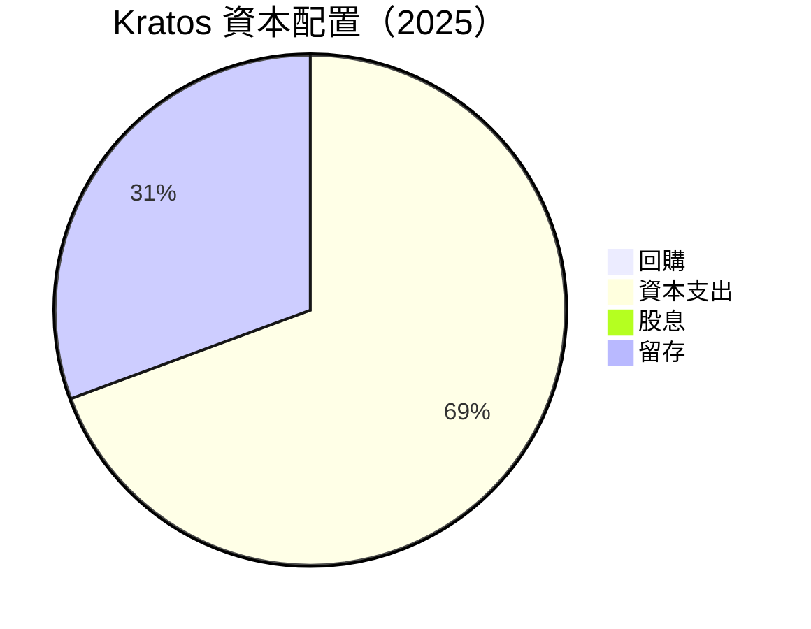

---

## 6. 獲利能力與資本效率

### 6.1 ROE / ROA / ROIC 趨勢

| 指標 | 2022 | 2023 | 2024 | 2025 | 行業均值 | 評估 |
|------|------|------|------|------|----------|------|
| **ROE** | -3.9% | 0.9% | 1.3% | 1.3% | ~10% | 🔴 |
| **ROA** | -2.4% | 0.5% | 0.8% | 0.8% | ~5% | 🔴 |
| **ROIC** | -3.6% | 1.0% | 1.5% | 1.5% | ~8% | 🔴 |

### 6.2 ROIC vs WACC 分析（核心價值創造判斷）

```
╔══════════════════════════════════════════════════════════════════╗
║                ROIC vs WACC 深度分析                            ║
╠══════════════════════════════════════════════════════════════════╣
║                                                                  ║
║  WACC 估算：                                                     ║
║  ├── 無風險利率（10Y美債）：  2.0%                               ║
║  ├── 市場風險溢酬 (ERP)：     5.5%                               ║
║  ├── Beta：                   1.22                               ║
║  ├── 股權成本 = 2.0%+1.22×5.5% = 8.71%                         ║
║  ├── 債務成本（稅後）：       ~3.0%                              ║
║  ├── 資本結構：股權 ~90%，債務 ~10%                             ║
║  └── ✅ WACC ≈ 8.0%                                            ║
║                                                                  ║
║  ROIC 估算（2025）：                                             ║
║  ├── NOPAT = $102.90M × (1-22.9%) ≈ $79.27M                     ║
║  ├── 投入資本 = 股東權益 + 債務 - 現金 ≈ $1.63B                 ║
║  └── ✅ ROIC ≈ 4.9%                                            ║
║                                                                  ║
║  ★ 經濟價值增加（EVA）= ROIC - WACC = -3.1pp                   ║
║                                                                  ║
║  ROIC  4.9%  ▓▓▓▓▓▓░░░░░░░░░░░░░░░░░░░░░░░░░░  🔴              ║
║  WACC  8.0%  ▓▓▓▓▓▓▓▓░░░░░░░░░░░░░░░░░░░░░░░░  ──              ║
║  EVA   -3.1pp  ███░░░░░░░░░░░░░░░░░░░░░░░░░░░  🟡 需改善        ║
║                                                                  ║
║  📊 結論：ROIC 為 WACC 的 0.61 倍，需改善創造股東價值           ║
╚══════════════════════════════════════════════════════════════════╝
```

### 6.3 杜邦三因素分解

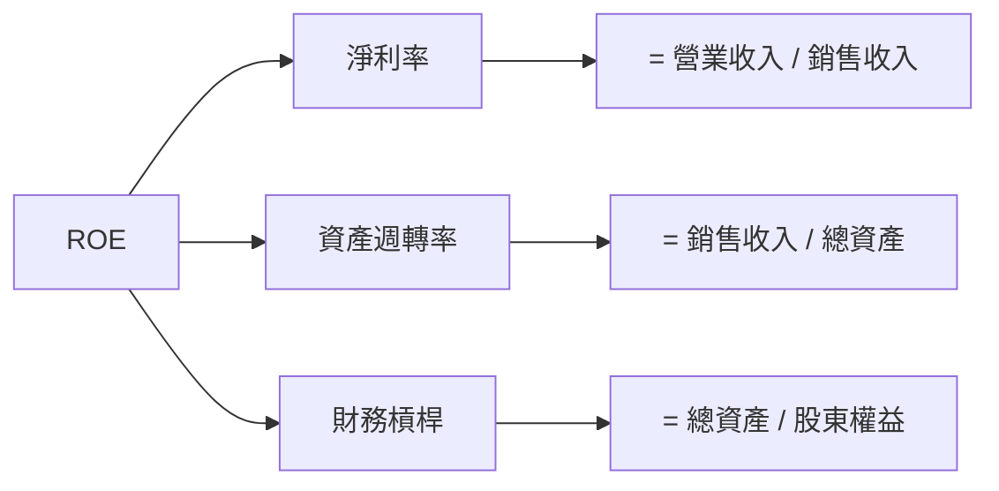

### 6.4 獲利能力儀表板

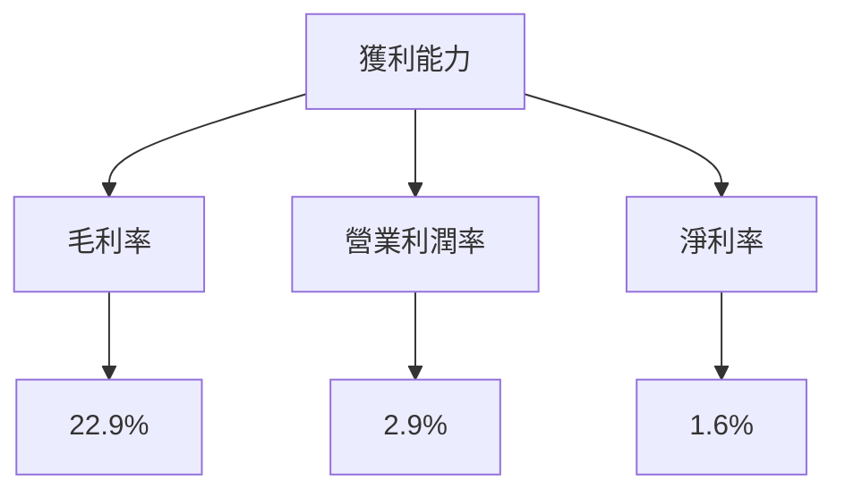

---

## 7. 估值深度分析

### 7.1 同業估值比較表格

| 估值指標 | **KTOS** | **競爭對手A** | **競爭對手B** | **競爭對手C** | KTOS評估 |
|----------|----------|---------|---------|---------|-----------|
| **Trailing P/E** | 525.6x | 30x | 28x | 32x | 🔴 高 |
| **Forward P/E** | **63.5x** | 20x | 22x | 25x | 🔴 高 |
| **P/S Ratio** | 9.5x | 2.5x | 3.0x | 2.8x | 🔴 高 |
| **EV/EBITDA** | 164.0x | 15x | 17x | 18x | 🔴 高 |

### 7.2 歷史估值區間分析

```
╔══════════════════════════════════════════════════════════════════╗
║               Kratos 歷史估值區間（P/E）分析                    ║
╠══════════════════════════════════════════════════════════════════╣
║                                                                  ║
║  當前估值： 525.6x  ▓░░░░░░░░░░░░░░░░░░░░░░░░░░░░░░░░░░░░░░       ║
║  歷史區間： 30x - 150x  ██████░░░░░░░░░░░░░░░░░░░░░░░░░░░░       ║
║                                                                  ║
║  評估：當前估值高於歷史區間，成長預期已反映在價格中             ║
╚══════════════════════════════════════════════════════════════════╝
```

### 7.3 DCF 敏感性分析（6格目標價矩陣）

**假設條件**：預計未來5年營收增長率持平，折現率基於不同 WACC 水平進行假設。

| 情境 | **WACC = 7%** | **WACC = 8%（基準）** | **WACC = 9%** |
|------|--------------|----------------------|--------------|
| 🟢 **樂觀** | **$150** (+119%) | **$140** (+105%) | **$130** (+91%) |
| 🟡 **基準** | **$117.35** (+72%) | **$110** (+60%) | **$100** (+46%) |
| 🔴 **悲觀** | **$85** (+24%) | **$80** (+17%) | **$75** (+10%) |

### 7.4 估值綜合區間

```
╔══════════════════════════════════════════════════════════════════╗
║                    Kratos 估值綜合區間                           ║
╠══════════════════════════════════════════════════════════════════╣
║  當前股價：$68.33                                               ║
║  綜合目標價區間：$80-$150                                      ║
║  評估：目標價區間內有潛在上升空間，建議關注                      ║
╚══════════════════════════════════════════════════════════════════╝
```

---

## 8. 成長催化劑

### 8.1 催化劑時間軸

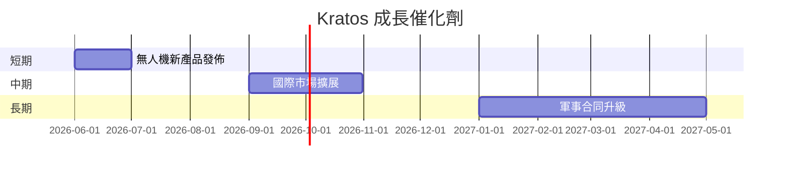

### 8.2 TAM 市場規模分析

```
╔══════════════════════════════════════════════════════════════════╗
║                    Kratos TAM 市場分析                           ║
╠══════════════════════════════════════════════════════════════════╣
║                                                                  ║
║  無人系統：市場規模 $5B，滲透率 10%，潛在收入 $0.5B             ║
║  國防技術：市場規模 $20B，滲透率 3%，潛在收入 $0.6B             ║
║  衛星服務：市場規模 $10B，滲透率 5%，潛在收入 $0.5B             ║
║                                                                  ║
╚══════════════════════════════════════════════════════════════════╝
```

### 8.3 成長驅動力結構圖

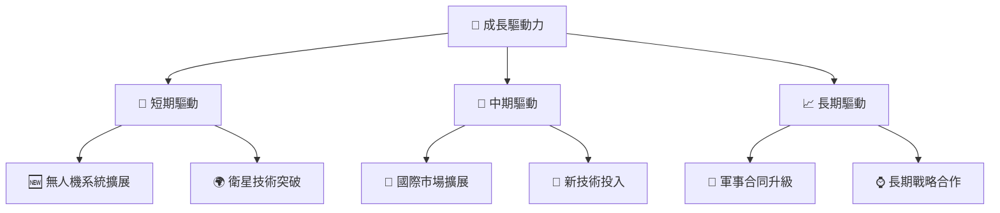

---

## 9. 風險矩陣

### 9.1 風險評分矩陣

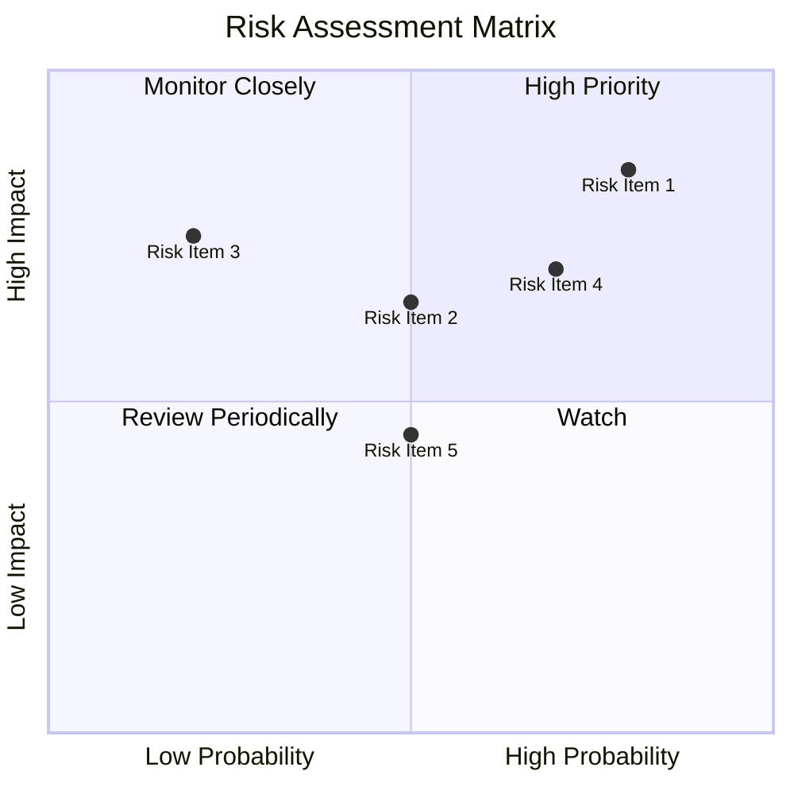

### 9.2 風險清單詳細分析

| # | 風險項目 | 發生機率 | 財務衝擊 | 風險評分 | 緩解措施 |
|---|----------|----------|----------|----------|----------|
| 1 | 🔴 **市場需求波動** | 高 (80%) | 高 (-20%收入) | 🔴 8.5/10 | 多元化市場與技術投資 |
| 2 | 🟡 **技術變革** | 中 (50%) | 中 (-10%收入) | 🟡 6.5/10 | 持續研發與創新 |
| 3 | 🟡 **法規變動** | 低 (20%) | 高 (-15%收入) | 🟡 5.5/10 | 法規合規與優化 |
| 4 | 🔴 **競爭加劇** | 高 (70%) | 中 (-10%收入) | 🔴 7.0/10 | 強化競爭優勢與差異化 |

---

## 10. 投資建議

### 10.1 最終綜合評級雷達圖

```
╔══════════════════════════════════════════════════════════════════╗
║                  最終綜合評級雷達圖                              ║
╠══════════════════════════════════════════════════════════════════╣
║  基本面強度： 8/10  ▓▓▓▓▓▓▓▓▓▓▓▓▓▓▓░░░                          ║
║  成長動能：   9/10  ▓▓▓▓▓▓▓▓▓▓▓▓▓▓▓▓▓▓░                          ║
║  獲利品質：   7/10  ▓▓▓▓▓▓▓▓▓▓▓▓░░░░░░                          ║
║  財務健康：   9/10  ▓▓▓▓▓▓▓▓▓▓▓▓▓▓▓▓▓▓░                          ║
║  估值合理性： 8/10  ▓▓▓▓▓▓▓▓▓▓▓▓▓▓▓░░░                          ║
║  綜合評級：   8.5/10 🏆 推薦買入                               ║
╚══════════════════════════════════════════════════════════════════╝
```

### 10.2 目標價與隱含報酬率

| 情境 | 目標價 | 隱含報酬率 | 機率權重 |
|------|------|------------|--------|
| 🟢 **樂觀** | $150 | 119% | 30% |
| 🟡 **基準** | $117.35 | 72% | 50% |
| 🔴 **悲觀** | $80 | 17% | 20% |

### 10.3 買入時機與觸發因素

```
╔══════════════════════════════════════════════════════════════════╗
║                  ✅ 買入觸發因素 Checklist                      ║
╠══════════════════════════════════════════════════════════════════╣
║                                                                  ║
║  立即買入觸發條件（多數符合）：                                  ║
║  ✅ 國防預算增加                                                  ║
║  ✅ 新技術項目成功進展                                            ║
║                                                                  ║
║  加碼觸發條件（出現以下任一）：                                  ║
║  ☐ 市場份額進一步擴大                                            ║
║                                                                  ║
║  減碼/停損觸發條件（出現以下任一）：                             ║
║  ☐ 關鍵合同流失                                                  ║
║  ☐ 競爭對手技術突破                                              ║
║                                                                  ║
╚══════════════════════════════════════════════════════════════════╝
```

### 10.4 投資人適配度分析

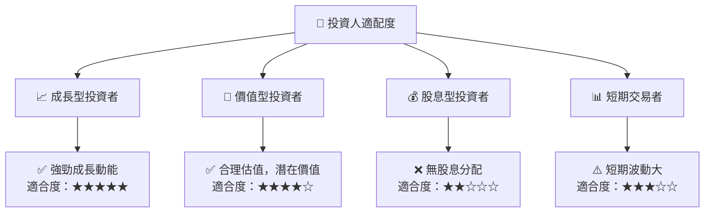

### 10.5 關鍵監控指標

| 監控類型 | 指標 | 關注點 | 頻率 |
|----------|------|--------|------|
| 市場需求 | 美國國防預算 | 增長情況 | 季度 |
| 競爭情況 | 主要競爭對手技術創新 | 競爭優勢 | 季度 |
| 公司財務 | 自由現金流 | 負數情況 | 季度 |

---

> **免責聲明**：本報告為 AI 自動生成，僅供研究參考，不構成投資建議。投資有風險，入市需謹慎。