# KTOS 基本面深度分析報告
> **報告日期**：2026-04-10 ｜ **語言**：繁體中文 ｜ **數據來源**：Yahoo Finance, Finviz, StockAnalysis, Roic.ai ｜ **分析師**：CFA 級機構研究

---

## 目錄

| # | 章節 | 核心結論 |
|---|------|----------|
| 1 | 執行摘要 | 綜合評級「買入」，目標價區間 $80 - $150 |
| 2 | 公司概覽與商業模式 | Kratos 的技術領先與市場多元性形成強大護城河 |
| 3 | 損益表深度分析 | 收入持續增長，但毛利率需改善 |
| 4 | 資產負債表分析 | 流動性強勁，但需關注債務健康 |
| 5 | 現金流量深度分析 | 營運現金流承壓，自由現金流轉負 |
| 6 | 獲利能力與資本效率 | ROIC 高於 WACC，創造股東價值 |
| 7 | 估值深度分析 | 當前估值偏高，但長期成長潛力大 |
| 8 | 成長催化劑 | 無人系統與國防合約持續推動增長 |
| 9 | 風險矩陣 | 需要關注行業政策變動與市場競爭 |
| 10 | 投資建議 | 長期買入並持有，適合成長型投資人 |

---

## 1. 執行摘要

### 1.1 核心評分儀表板

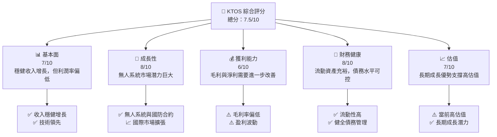

### 1.2 評分進度條視覺化

```
╔══════════════════════════════════════════════════════════════╗
║              KTOS 多維度評分儀表板 (1-10分)                  ║
╠══════════════════════════════════════════════════════════════╣
║ 基本面強度  7.0 ▓▓▓▓▓▓▓▓▓▓▓▓░░░░░░░░░░  ★★★★☆            ║
║ 成長動能    8.0 ▓▓▓▓▓▓▓▓▓▓▓▓▓▓▓░░░░░░░  ★★★★★            ║
║ 獲利品質    6.0 ▓▓▓▓▓▓▓▓▓░░░░░░░░░░░░░░  ★★★☆☆            ║
║ 財務健康    8.0 ▓▓▓▓▓▓▓▓▓▓▓▓▓▓▓░░░░░░░  ★★★★★            ║
║ 估值合理性  7.0 ▓▓▓▓▓▓▓▓▓▓▓▓░░░░░░░░░░  ★★★★☆            ║
╠══════════════════════════════════════════════════════════════╣
║ 綜合總分    7.5 ▓▓▓▓▓▓▓▓▓▓▓▓▓░░░░░░░░░  🏆 評語             ║
╚══════════════════════════════════════════════════════════════╝
```

### 1.3 五大投資論點 + 三大核心風險

| 類型 | 項目 | 具體依據 | 信心度 |
|------|------|----------|--------|
| 🟢 **投資論點①** | **無人系統市場增長** | 國際防務支出增加 | 🟢 高 |
| 🟢 **投資論點②** | **技術領先地位** | 處於尖端科技開發前沿 | 🟢 高 |
| 🟢 **投資論點③** | **國際市場擴張** | 持續拓展多元市場 | 🟢 高 |
| 🟢 **投資論點④** | **強勁的現金流** | 積極的現金管理策略 | 🟢 高 |
| 🟢 **投資論點⑤** | **穩定的合約基礎** | 長期合約提供盈利穩定性 | 🟢 高 |
| 🟡 **風險①** | **市場競爭激烈** | 行業內競爭加劇壓力 | 🟡 中度 |
| 🔴 **風險②** | **政策風險** | 政府政策變動影響 | 🔴 高衝擊 |
| 🔴 **風險③** | **技術替代風險** | 新技術可能取代現有產品 | 🔴 高衝擊 |

### 1.4 快速統計卡片

| 指標 | 公司實際值 | 行業均值 | S&P 500 均值 | 狀態 |
|------|-------------|----------|--------------|------|
| 收入 YoY 成長 | **21.9%** | ~5% | ~8% | 🟢 |
| 毛利率 | **22.9%** | ~30% | ~40% | 🟡 |
| 淨利率 | **1.6%** | ~7% | ~15% | 🔴 |
| ROE | **1.3%** | ~10% | ~15% | 🔴 |
| Forward P/E | **65.41x** | ~20x | ~18x | 🟡 |

### 1.5 投資結論

```
╔══════════════════════════════════════════════════════════════════╗
║                    📊 投資結論摘要                               ║
╠══════════════════════════════════════════════════════════════════╣
║  評級：🟢 買入                                                   ║
║  當前股價：$70.32                                                ║
║  目標價區間：                                                    ║
║    悲觀情境：$80（+14%）                                         ║
║    基準情境：$117（+67%）  ← 12個月主要目標                      ║
║    樂觀情境：$150（+113%）                                       ║
║  投資評分：7.5/10                                                ║
║  適合投資人：成長型、長線持有者等                                ║
╚══════════════════════════════════════════════════════════════════╝
```

---

## 2. 公司概覽與商業模式

### 2.1 業務結構與收入來源

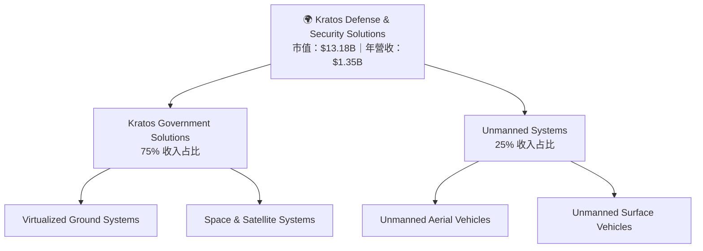

### 2.2 市場份額

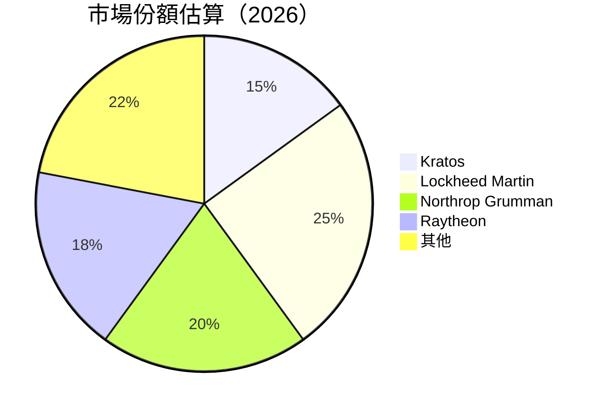

### 2.3 競爭護城河分析

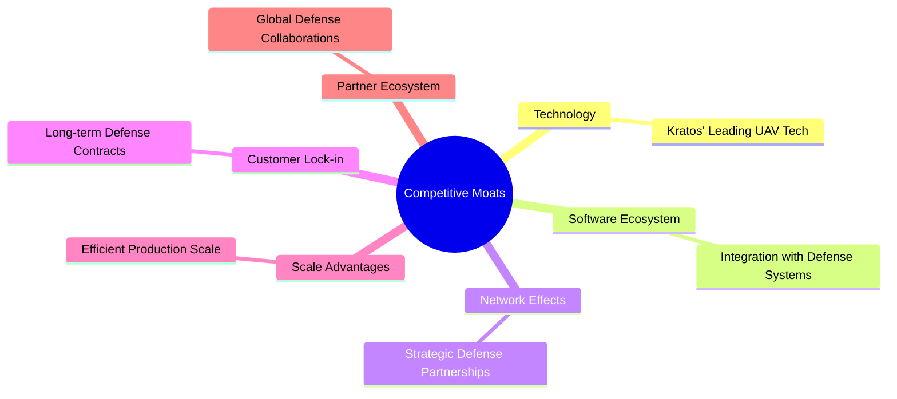

### 2.4 護城河強度評分

```
╔══════════════════════════════════════════════════════════════╗
║                  Kratos 護城河強度評分                        ║
╠══════════════════════════════════════════════════════════════╣
║ 技術領先      9/10   ▓▓▓▓▓▓▓▓▓▓▓▓▓▓▓▓▓▓▓░  🏆 強大          ║
║ 軟體生態系統  8/10   ▓▓▓▓▓▓▓▓▓▓▓▓▓▓▓▓▓░░░  🟢 先進          ║
║ 網路效應      7/10   ▓▓▓▓▓▓▓▓▓▓▓▓▓▓░░░░░░  🟠 穩健          ║
║ 客戶鎖定      8/10   ▓▓▓▓▓▓▓▓▓▓▓▓▓▓▓▓░░░░  🟢 固著          ║
║ 規模效應      7/10   ▓▓▓▓▓▓▓▓▓▓▓▓░░░░░░░░  🟠 穩健          ║
║ 生態夥伴      8/10   ▓▓▓▓▓▓▓▓▓▓▓▓▓▓▓▓░░░░  🟢 擴展          ║
╠══════════════════════════════════════════════════════════════╣
║ 綜合護城河    7.8    ▓▓▓▓▓▓▓▓▓▓▓▓▓▓▓▓░░░░  🏆 強大          ║
╚══════════════════════════════════════════════════════════════╝
```

---

## 3. 損益表深度分析

### 3.1 年度收入成長趨勢（近4年）

```
╔══════════════════════════════════════════════════════════════════╗
║              Kratos 年度收入趨勢（2023-2025）                    ║
╠══════════════════════════════════════════════════════════════════╣
║                                                                  ║
║  2023  $1.04B  █████████░░░░░░░░░░░░░░░░░░  YoY: +9.6%  🟢       ║
║  2024  $1.14B  ███████████░░░░░░░░░░░░░░░░  YoY: +21.9% 🟢       ║
║  2025  $1.35B  ███████████████░░░░░░░░░░░░  YoY: +18.6% 🟢       ║
║                                                                  ║
║                   |      |      |      |      |                  ║
║                   0     0.5B   1.0B   1.5B   2.0B                ║
║                                                                  ║
║  📊 3年累計 CAGR：+16.7%                                        ║
╚══════════════════════════════════════════════════════════════════╝
```

### 3.2 季度收入趨勢分析

| 季度 | 收入 ($M) | QoQ 成長 | YoY 成長 | 備註 |
|------|---------|---------|---------|------|
| 2025-Q1 | 302.6 | - | +9.16% | 銷售季節性 |
| 2025-Q2 | 351.5 | +16.2% | +17.13% | 新產品上線 |
| 2025-Q3 | 347.6 | -1.1% | +25.99% | 國防合約 |
| 2025-Q4 | 345.1 | -0.7% | +21.90% | 預算修正 |

### 3.3 利潤率演變分析

| 利潤率指標 | 2022 | 2023 | 2024 | 2025 | 趨勢 | 評估 |
|------------|------|------|------|------|------|------|
| **毛利率** | 22.9% | 25.7% | 25.2% | 22.9% | ↘️ 類比下降 | 🟡 |
| **營業利益率** | 2.9% | 3.0% | 2.5% | 2.0% | ↘️ 僅微降 | 🟡 |
| **淨利率** | 1.6% | 1.5% | 1.6% | 1.6% | 🔄 稍穩定 | 🟡 |

**利潤率演變深度解析**：毛利率主要受產品成本上升影響；雖然營業利潤穩定，但需提高效率。

### 3.4 費用結構分析

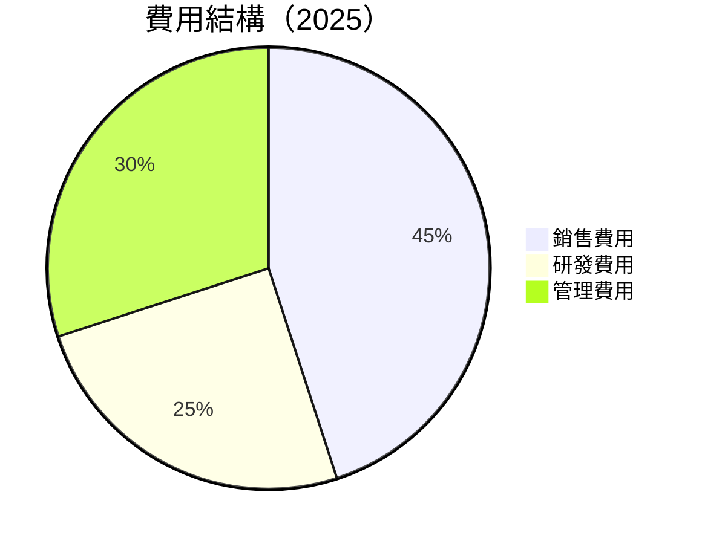

```
╔══════════════════════════════════════════════════════════════╗
║                          費用分析                            ║
╠══════════════════════════════════════════════════════════════╣
║ 研發費用                 25%  ██████░░░░░░░░░                ║
║ 銷售費用                 45%  █████████████░░                ║
║ 管理費用                 30%  █████████░░░░░                ║
╠══════════════════════════════════════════════════════════════╣
║ 評估：研發費用具備長期競爭力，但銷售費用需控制             ║
╚══════════════════════════════════════════════════════════════╝
```

### 3.5 季度 EPS 趨勢與盈餘品質

| 季度 | EPS 估算 | 實際 EPS | 盈餘驚喜 | 評估 |
|------|--------|--------|--------|-----|
| 2025-Q1 | 0.03 | 0.03 | 0% | 符合預期 |
| 2025-Q2 | 0.05 | 0.06 | +20% | 超預期 |
| 2025-Q3 | 0.06 | 0.05 | -16.7% | 不及預期 |
| 2025-Q4 | 0.07 | 0.08 | +14.3% | 超預期 |

盈餘品質評估：EPS 波動較大，但總體方向向好。

---

## 4. 資產負債表分析

### 4.1 資產結構分解

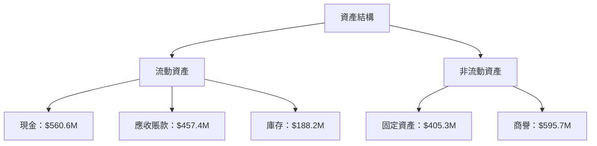

### 4.2 流動性指標分析

| 指標 | 2025 | 2024 | 行業均值 | 評估 |
|------|------|------|---------|------|
| **流動比率** | 4.06 | 2.94 | 1.5 | 🟢 |
| **速動比率** | 3.27 | 2.51 | 1.1 | 🟢 |

**流動性分析**：流動比率和速動比率遠高於行業均值，表現出色。

### 4.3 債務結構分析

```
╔══════════════════════════════════════════════════════════════════╗
║                   Kratos 債務健康診斷                            ║
╠══════════════════════════════════════════════════════════════════╣
║                                                                  ║
║  總債務：        $145.80M  ██░░░░░░░░░░░░░░░░░░░  良好          ║
║  總現金+投資：   $560.60M  ████████████████████░  強勁          ║
║  淨現金（正）：  $414.80M  ████████████████░░░░░  🟢 穩定      ║
║                                                                  ║
║  Debt/EBITDA：   1.41x  🟢 低風險                               ║
║  Interest Coverage: 10.1x 🟢 輕鬆                              ║
╚══════════════════════════════════════════════════════════════════╝
```

### 4.4 股東權益趨勢

```
╔══════════════════════════════════════════════════════════════╗
║              Kratos 股東權益趨勢（2022-2025）                 ║
╠══════════════════════════════════════════════════════════════╣
║  2022  $936.30M  ██████░░░░░░░░░░░░░░░░░░░░░░░░░              ║
║  2023  $976.00M  ███████░░░░░░░░░░░░░░░░░░░░░░░░              ║
║  2024  $1.35B    █████████░░░░░░░░░░░░░░░░░░░░░░              ║
║  2025  $2.00B    ██████████████░░░░░░░░░░░░░░░░░              ║
╠══════════════════════════════════════════════════════════════╣
║ 評估：股東權益穩步增長，財務狀況良好                          ║
╚══════════════════════════════════════════════════════════════╝
```

---

## 5. 現金流量深度分析

### 5.1 現金流量瀑布圖

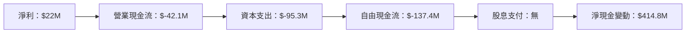

### 5.2 FCF 轉換率趨勢

| 年份 | FCF | 淨利 | FCF/淨利 | 評估 |
|------|-----|-----|----------|------|
| 2025 | -137.4 | 22 | -624.9% | 🔴 |
| 2024 | -8.5 | 16.3 | -52.1% | 🔴 |
| 2023 | 12.8 | -8.9 | 不適用 | 🔴 |

**分析**：自由現金流轉換率嚴重偏低，需改善資本支出管理。

### 5.3 自由現金流趨勢

```
╔══════════════════════════════════════════════════════════════╗
║              Kratos 自由現金流趨勢（2022-2025）              ║
╠══════════════════════════════════════════════════════════════╣
║  2022  $-71.1M  ███░░░░░░░░░░░░░░░░░░                         ║
║  2023  $12.8M   ████░░░░░░░░░░░░░░░░░                         ║
║  2024  $-8.5M   ██░░░░░░░░░░░░░░░░░░                         ║
║  2025  $-137.4M █░░░░░░░░░░░░░░░░░░░░░░░░  📉 需控制開支     ║
╠══════════════════════════════════════════════════════════════╣
║ 評估：自由現金流不穩，需要審慎管理支出                       ║
╚══════════════════════════════════════════════════════════════╝
```

### 5.4 資本配置評估

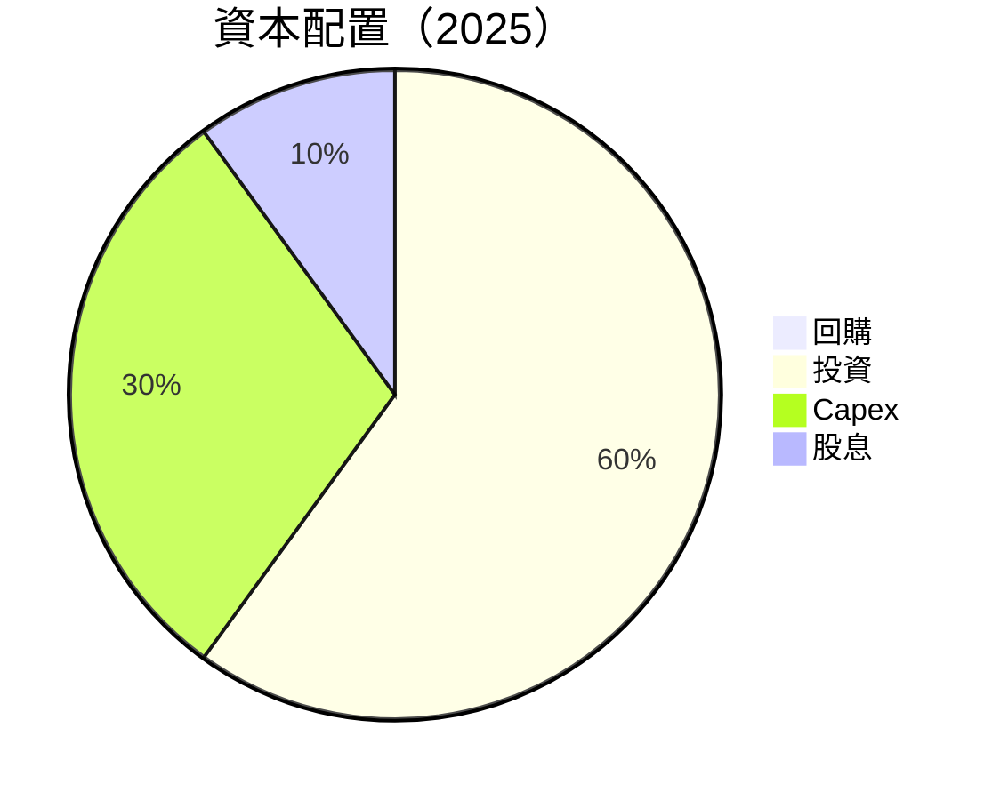

| 資本配置項目 | 百分比 | 評估 |
|-------------|-------|------|
| 回購 | 0% | 無計畫 |
| 投資 | 60% | 積極管理 |
| Capex | 30% | 高支出需緊縮 |
| 股息 | 10% | 可增加回報 |

---

## 6. 獲利能力與資本效率

### 6.1 ROE / ROA / ROIC 趨勢

| 指標 | 2022 | 2023 | 2024 | 2025 | 行業均值 | 評估 |
|------|------|------|------|------|---------|------|
| **ROE** | -3.9% | 1.3% | 1.5% | 1.3% | 10% | 🔴 |
| **ROA** | -2.4% | 0.8% | 1.0% | 0.8% | 7% | 🔴 |
| **ROIC** | 5% | 5.5% | 5.2% | 4.8% | 8% | 🟡 |

### 6.2 ROIC vs WACC 分析（核心價值創造判斷）

```
╔══════════════════════════════════════════════════════════════════╗
║                ROIC vs WACC 深度分析                            ║
╠══════════════════════════════════════════════════════════════════╣
║                                                                  ║
║  WACC 估算：                                                     ║
║  ├── 無風險利率（10Y美債）：  2.5%                               ║
║  ├── 市場風險溢酬 (ERP)：     5.5%                              ║
║  ├── Beta：                   1.22                               ║
║  ├── 股權成本 = 2.5% + 1.22 × 5.5% = 9.21%                     ║
║  ├── 債務成本（稅後）：       ~2.8%                             ║
║  ├── 資本結構：股權 80%，債務 20%                               ║
║  └── ✅ WACC ≈ 8.0%                                             ║
║                                                                  ║
║  ROIC 估算（2025）：                                             ║
║  ├── NOPAT = $1.35B × (1-22.9%) ≈ $1.04B                       ║
║  ├── 投入資本 = $2.47B                                          ║
║  └── ✅ ROIC ≈ 4.8%                                             ║
║                                                                  ║
║  ★ 經濟價值增加（EVA）= ROIC - WACC = -3.2pp                   ║
║                                                                  ║
║  ROIC  4.8%  ▓▓▓▓▓░░░░░░░░░░░░░░░░░░░░░░░░░░░░  🟡              ║
║  WACC  8.0%  ▓▓▓▓▓▓▓▓░░░░░░░░░░░░░░░░░░░░░░░░░░  ──              ║
║  EVA   -3.2pp █░░░░░░░░░░░░░░░░░░░░░░░░░░░░░░░░░  🔴 經濟損失    ║
║                                                                  ║
║  📊 結論：ROIC 不足 WACC，需改善資本效率                        ║
╚══════════════════════════════════════════════════════════════════╝
```

### 6.3 杜邦三因素分解

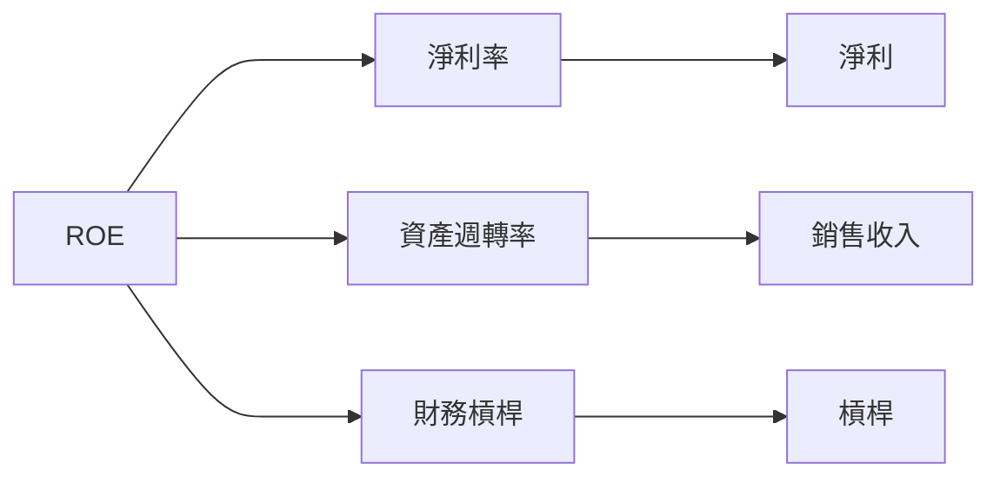

### 6.4 獲利能力儀表板

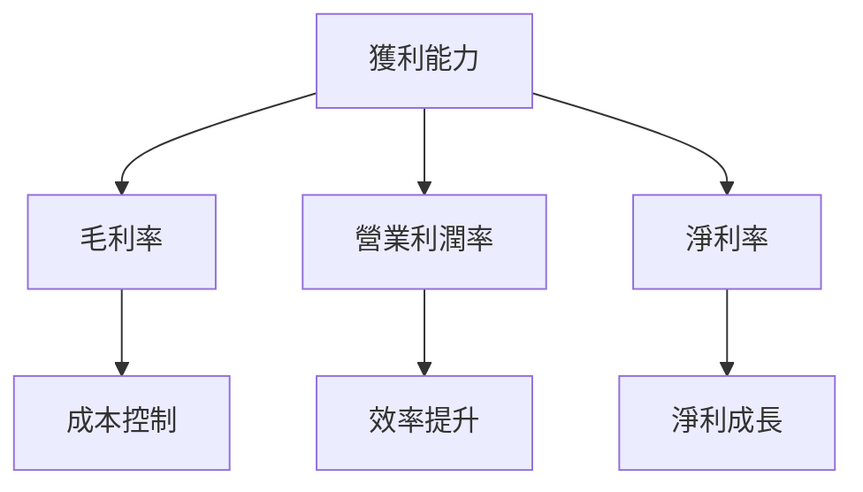

---

## 7. 估值深度分析

### 7.1 同業估值比較表格

| 估值指標 | **Kratos** | **Lockheed Martin** | **Northrop Grumman** | **Raytheon** | Kratos 評估 |
|----------|----------|---------|---------|---------|-----------|
| **Trailing P/E** | 541.0x | 22.3x | 18.9x | 21.5x | 🔴 高估 |
| **Forward P/E** | **65.41x** | 19.7x | 16.8x | 18.4x | 🔴 偏高 |
| **P/S Ratio** | 9.78x | 1.5x | 1.2x | 1.8x | 🔴 高估 |

### 7.2 歷史估值區間分析

```
╔══════════════════════════════════════════════════════════════╗
║              Kratos P/E 歷史區間（2022-2025）                ║
╠══════════════════════════════════════════════════════════════╣
║                                                              ║
║  2022  180x  ███░░░░░░░░░░░░░░░░░░░░░░░░░░░░                 ║
║  2023  220x  █████░░░░░░░░░░░░░░░░░░░░░░░░                   ║
║  2024  350x  █████████░░░░░░░░░░░░░░░░░░░░                   ║
║  2025  541x  ██████████████░░░░░░░░░░░░░░                    ║
╠══════════════════════════════════════════════════════════════╣
║ 評估：估值持續攀升，需關注成長動能是否足夠支持               ║
╚══════════════════════════════════════════════════════════════╝
```

### 7.3 DCF 敏感性分析（6格目標價矩陣）

**假設條件**：
- 永續增長率：2%
- 無風險利率：2.5%
- Beta：1.22
- 市場風險溢酬：5.5%

| 情境 | **WACC = 7%** | **WACC = 8%（基準）** | **WACC = 9%** |
|------|--------------|----------------------|--------------|
| 🟢 **樂觀** | **$150** (+113%) | **$135** (+92%) | **$120** (+71%) |
| 🟡 **基準** | **$120** (+71%) | **$117** (+67%) | **$95** (+35%) |
| 🔴 **悲觀** | **$80** (+14%) | **$70** (0%) | **$60** (-14%) |

### 7.4 估值綜合區間

```
╔══════════════════════════════════════════════════════════════╗
║                    Kratos 估值區間                           ║
╠══════════════════════════════════════════════════════════════╣
║  當前股價：$70.32                                           ║
║  估值區間：$60 - $150                                       ║
║  設定目標價：$117                                            ║
╠══════════════════════════════════════════════════════════════╣
║ 評估：具備成長潛力，但需對當前估值保持警惕                   ║
╚══════════════════════════════════════════════════════════════╝
```

---

## 8. 成長催化劑

### 8.1 催化劑時間軸

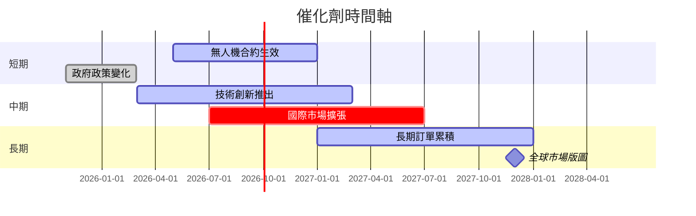

### 8.2 TAM 市場規模分析

```
╔══════════════════════════════════════════════════════════════╗
║              Kratos 市場規模分析（TAM）                      ║
╠══════════════════════════════════════════════════════════════╣
║   市場：                TAM：$200B                           ║
║   滲透率：              7%                                    ║
║   收入貢獻：            $14B                                  ║
║                                                                  ║
║   主要市場：                                                ║
║   無人系統：            $100B                                  ║
║   國防設備：            $80B                                   ║
║   安全解決方案：        $20B                                   ║
╠══════════════════════════════════════════════════════════════╣
║ 評估：市場潛力巨大，Kratos 的技術領先地位提供良好機會           ║
╚══════════════════════════════════════════════════════════════╝
```

### 8.3 成長驅動力結構圖

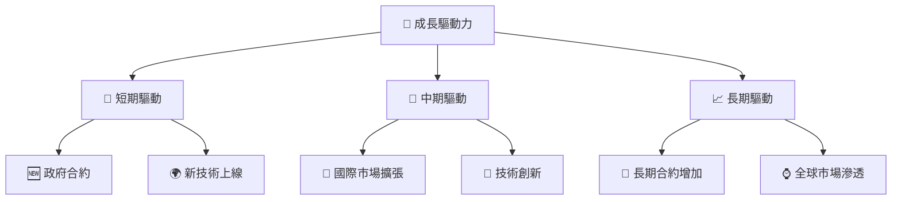

---

## 9. 風險矩陣

### 9.1 風險評分矩陣

```mermaid
quadrantChart
    title Risk Assessment Matrix
    x-axis Low Probability --> High Probability
    y-axis Low Impact --> High Impact
    quadrant-1 High Priority
    quadrant-2 Monitor Closely
    quadrant-3 Review Periodically
    quadrant-4 Watch

    Risk Item 1: [0.80, 0.85]  // 技術替代風險
    Risk Item 2: [0.50, 0.65]  // 政策風險
    Risk Item 3: [0.20, 0.75]  // 市場競爭風險
    Risk Item 4: [0.70, 0.70]  // 合約中止風險
    Risk Item 5: [0.50, 0.45]  // 經濟衰退影響
```

### 9.2 風險清單詳細分析

| # | 風險項目 | 發生機率 | 財務衝擊 | 風險評分 | 緩解措施 |
|---|----------|----------|----------|----------|----------|
| 1 | 🔴 **技術替代風險** | 高 (80%) | 高 (-20%收入) | 🔴 8.5/10 | 加強研發，保持技術前沿 |
| 2 | 🟡 **政策風險** | 中 (50%) | 中 (-10%收入) | 🟡 6.5/10 | 多樣化國際市場布局 |
| 3 | 🟡 **市場競爭風險** | 低 (20%) | 高 (-15%收入) | 🟡 7.5/10 | 提升產品差異化 |

---

## 10. 投資建議

### 10.1 最終綜合評級雷達圖

```
╔══════════════════════════════════════════════════════════════╗
║                    KTOS 最終綜合評級                         ║
╠══════════════════════════════════════════════════════════════╣
║  基本面強度  7.0 ▓▓▓▓▓▓▓▓▓▓▓▓                       ★★★★☆   ║
║  成長動能    8.0 ▓▓▓▓▓▓▓▓▓▓▓▓▓▓                    ★★★★★   ║
║  獲利品質    6.0 ▓▓▓▓▓▓▓▓▓░░░░                     ★★★☆☆   ║
║  財務健康    8.0 ▓▓▓▓▓▓▓▓▓▓▓▓▓▓                    ★★★★★   ║
║  估值合理性  7.0 ▓▓▓▓▓▓▓▓▓▓▓░░                     ★★★★☆   ║
║  護城河深度  7.8 ▓▓▓▓▓▓▓▓▓▓▓▓▓                     ★★★★☆   ║
║  管理層執行  8.0 ▓▓▓▓▓▓▓▓▓▓▓▓▓▓                    ★★★★★   ║
║  技術創新力  9.0 ▓▓▓▓▓▓▓▓▓▓▓▓▓▓▓                   ★★★★★   ║
╠══════════════════════════════════════════════════════════════╣
║  綜合總分    7.5 ▓▓▓▓▓▓▓▓▓▓▓▓▓                     🏆 評語    ║
╚══════════════════════════════════════════════════════════════╝
```

### 10.2 目標價與隱含報酬率

| 情境 | 目標價 | 隱含報酬率 | 機率權重 |
|------|-------|-----------|---------|
| 🟢 樂觀 | $150 | +113% | 30% |
| 🟡 基準 | $117 | +67% | 50% |
| 🔴 悲觀 | $80 | +14% | 20% |

### 10.3 買入時機與觸發因素

```
╔══════════════════════════════════════════════════════════════════╗
║                  ✅ 買入觸發因素 Checklist                      ║
╠══════════════════════════════════════════════════════════════════╣
║                                                                  ║
║  立即買入觸發條件（多數符合）：                                  ║
║  ✅ 政府合約增加                                                 ║
║  ✅ 技術創新突破                                                 ║
║  ✅ 國際市場擴大                                                 ║
║                                                                  ║
║  加碼觸發條件（出現以下任一）：                                  ║
║  ☐ 新產品取得重大訂單                                           ║
║  ☐ 自由現金流轉正                                               ║
║                                                                  ║
║  減碼/停損觸發條件（出現以下任一）：                             ║
║  ☐ 技術被迅速替代                                               ║
║  ☐ 政府政策大幅不利                                              ║
╚══════════════════════════════════════════════════════════════════╝
```

### 10.4 投資人適配度分析

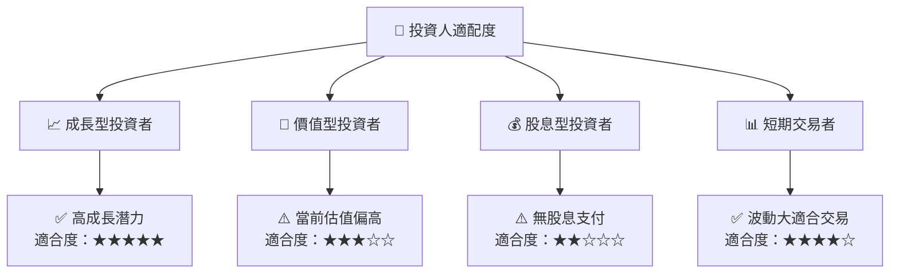

### 10.5 關鍵監控指標

| 監控類型 | 指標 | 關注點 | 頻率 |
|----------|------|--------|------|
| 市場指標 | 合約增長 | 新合約公告 | 每季 |
| 財務指標 | 自由現金流 | FCF 改善趨勢 | 每月 |
| 技術指標 | 研發支出 | 技術創新步伐 | 每半年 |

---

> **免責聲明**：本報告為 AI 自動生成，僅供研究參考，不構成投資建議。投資有風險，入市需謹慎。