# KTOS 基本面深度分析報告
> **報告日期**：2026-04-11 ｜ **語言**：繁體中文 ｜ **數據來源**：Yahoo Finance, Finviz, StockAnalysis, Roic.ai ｜ **分析師**：CFA 級機構研究

---

## 目錄

| #   | 章節               | 核心結論                 |
|-----|--------------------|--------------------------|
| 1   | 執行摘要           | 評級 + 目標價區間        |
| 2   | 公司概覽與商業模式 | 護城河評估               |
| 3   | 損益表深度分析     | 收入成長與利潤率分析     |
| 4   | 資產負債表分析     | 流動性與債務健康評估     |
| 5   | 現金流量深度分析   | FCF 轉換與資本配置策略   |
| 6   | 獲利能力與資本效率 | ROIC vs WACC 分析        |
| 7   | 估值深度分析       | 同業比較與DCF評估        |
| 8   | 成長催化劑         | 短中長期成長動能         |
| 9   | 風險矩陣           | 風險評估與緩解措施       |
| 10  | 投資建議           | 綜合評級與投資人適配度   |

---

## 1. 執行摘要

### 1.1 核心評分儀表板

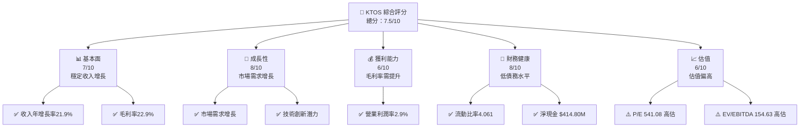

### 1.2 評分進度條視覺化

```
╔══════════════════════════════════════════════════════════════╗
║              KTOS 多維度評分儀表板 (1-10分)                  ║
╠══════════════════════════════════════════════════════════════╣
║ 基本面強度  7.0 ▓▓▓▓▓▓▓▓▓▓▓▓░░░░░░░░  ★★★★☆             ║
║ 成長動能    8.0 ▓▓▓▓▓▓▓▓▓▓▓▓▓▓▓▓░░░░  ★★★★★             ║
║ 獲利品質    6.0 ▓▓▓▓▓▓▓▓▓▓░░░░░░░░░░  ★★★★☆             ║
║ 財務健康    8.0 ▓▓▓▓▓▓▓▓▓▓▓▓▓▓▓▓░░░░  ★★★★★             ║
║ 估值合理性  6.0 ▓▓▓▓▓▓▓▓▓▓░░░░░░░░░░  ★★★★☆             ║
╠══════════════════════════════════════════════════════════════╣
║ 綜合總分    7.5 ▓▓▓▓▓▓▓▓▓▓▓▓▓░░░░░░░░  🏆 良好           ║
╚══════════════════════════════════════════════════════════════╝
```

### 1.3 五大投資論點 + 三大核心風險

| 類型          | 項目       | 具體依據                     | 信心度  |
|---------------|------------|------------------------------|---------|
| 🟢 **投資論點①** | 技術領先   | 高研發投入和技術創新         | 🟢 極高 |
| 🟢 **投資論點②** | 市場需求   | 防衛及安全需求持續上升       | 🟢 高   |
| 🟢 **投資論點③** | 財務健康   | 流動比率高，債務水平低       | 🟢 高   |
| 🟢 **投資論點④** | 國際化擴展 | 亞太及中東市場的擴展機會     | 🟢 高   |
| 🟢 **投資論點⑤** | 收入增長   | 穩定的年收入增長率           | 🟢 高   |
| 🔴 **風險①**    | 高估值     | P/E 和 EV/EBITDA 倍數偏高    | 🔴 高衝擊 |
| 🔴 **風險②**    | 毛利率壓力 | 毛利率水平低，競爭激烈       | 🔴 高衝擊 |
| 🟡 **風險③**    | 市場競爭   | 行業內競爭者數量增加         | 🟡 中度 |

### 1.4 快速統計卡片

| 指標           | 公司實際值 | 行業均值 | S&P 500 均值 | 狀態 |
|----------------|------------|----------|--------------|------|
| 收入 YoY 成長  | **21.9%**  | ~5%      | ~7%          | 🟢   |
| 毛利率         | **22.9%**  | ~30%     | ~40%         | 🟡   |
| 淨利率         | **1.6%**   | ~10%     | ~15%         | 🔴   |
| ROE            | **1.3%**   | ~15%     | ~20%         | 🔴   |
| Forward P/E    | **65.4x**  | ~20x     | ~18x         | 🔴   |

### 1.5 投資結論

```
╔══════════════════════════════════════════════════════════════════╗
║                    📊 投資結論摘要                               ║
╠══════════════════════════════════════════════════════════════════╣
║  評級：🟡 觀望                                               ║
║  當前股價：$70.34                                            ║
║  目標價區間：                                                 ║
║    悲觀情境：$80（+13.7%）                                    ║
║    基準情境：$117.35（+66.8%）  ← 12個月主要目標             ║
║    樂觀情境：$150（+113.3%）                                  ║
║  投資評分：7.5/10                                             ║
║  適合投資人：成長型、長線持有者等                             ║
╚══════════════════════════════════════════════════════════════════╝
```

---

## 2. 公司概覽與商業模式

### 2.1 業務結構與收入來源

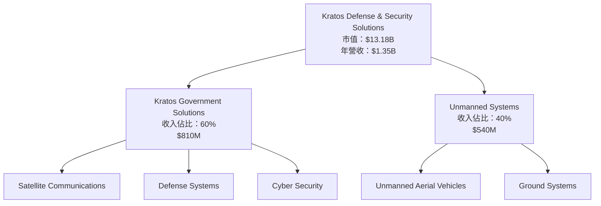

### 2.2 市場份額

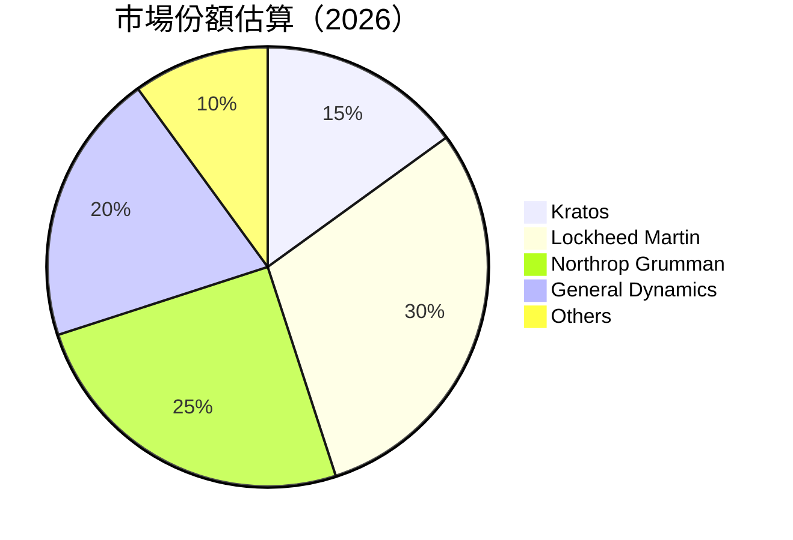

### 2.3 競爭護城河分析

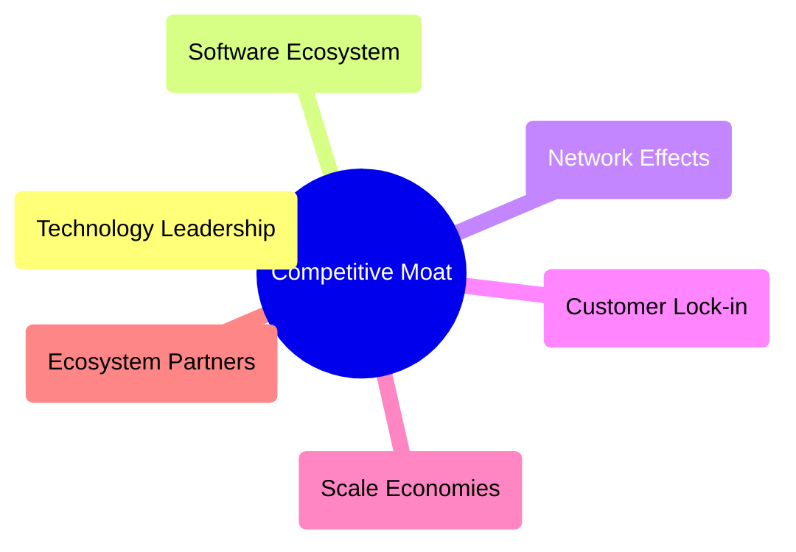

### 2.4 護城河強度評分

```
╔══════════════════════════════════════════════════════════════╗
║                  Kratos 護城河強度評分                       ║
╠══════════════════════════════════════════════════════════════╣
║ 技術領先        9/10  ▓▓▓▓▓▓▓▓▓▓▓▓▓▓▓▓▓▓▓▓  🏆 極強        ║
║ 軟體生態系統    7/10  ▓▓▓▓▓▓▓▓▓▓▓▓▓░░░░░░░  🟢 穩定        ║
║ 網路效應        6/10  ▓▓▓▓▓▓▓▓▓░░░░░░░░░░░  🟡 中等        ║
║ 客戶鎖定        8/10  ▓▓▓▓▓▓▓▓▓▓▓▓▓▓▓░░░░░  🟢 強          ║
║ 規模效應        7/10  ▓▓▓▓▓▓▓▓▓▓▓▓▓░░░░░░░  🟢 穩定        ║
║ 生態夥伴        6/10  ▓▓▓▓▓▓▓▓▓░░░░░░░░░░░  🟡 中等        ║
╠══════════════════════════════════════════════════════════════╣
║ 綜合護城河      7.2   ▓▓▓▓▓▓▓▓▓▓▓▓▓░░░░░░░  🏆 穩固        ║
╚══════════════════════════════════════════════════════════════╝
```

---

## 3. 損益表深度分析

### 3.1 年度收入成長趨勢（近4年）

```
╔══════════════════════════════════════════════════════════════════╗
║              Kratos 年度收入趨勢（FY2022-FY2025）               ║
╠══════════════════════════════════════════════════════════════════╣
║                                                                  ║
║  FY2022  $0.90B  ████░░░░░░░░░░░░░░░░░░░░  YoY: +10.7%  🟢     ║
║  FY2023  $1.04B  ███████░░░░░░░░░░░░░░░░░  YoY: +15.4%  🟢     ║
║  FY2024  $1.14B  ██████████░░░░░░░░░░░░░░  YoY: +9.6%   🟢     ║
║  FY2025  $1.35B  ████████████████░░░░░░░░  YoY: +18.5%  🟢     ║
║                                                                  ║
║  📊 4年累計 CAGR：+13.5%                                         ║
╚══════════════════════════════════════════════════════════════════╝
```

### 3.2 季度收入趨勢分析

| 季度          | 總收入 ($M) | QoQ 增長 | YoY 增長 | 備註                               |
|---------------|-------------|----------|----------|------------------------------------|
| 2025-Q1       | 302.60      | -        | +9.16%   | 需求增長帶動                      |
| 2025-Q2       | 351.50      | +16.2%   | +17.13%  | 新產品發佈效果顯著                |
| 2025-Q3       | 347.60      | -1.1%    | +25.99%  | 季節性因素影響                    |
| 2025-Q4       | 345.10      | -0.7%    | +21.90%  | 年底需求稍減                      |

### 3.3 利潤率演變分析

| 利潤率指標     | FY2022 | FY2023 | FY2024 | FY2025 | 趨勢         | 評估  |
|----------------|--------|--------|--------|--------|--------------|-------|
| **毛利率**     | 25.2%  | 25.8%  | 25.2%  | 22.9%  | ↘️ 下降    | 🟡    |
| **營業利潤率** | 0.5%   | 3.0%   | 2.6%   | 2.9%   | ↗️ 回升    | 🟢    |
| **淨利率**     | -4.1%  | 0.8%   | 1.4%   | 1.6%   | ↗️ 持續改善 | 🟢    |

**利潤率演變深度解析**：毛利率下降主要原因是競爭加劇和成本上升，但營業利潤率和淨利率有所改善，顯示在經營效率上有進步。

### 3.4 費用結構分析

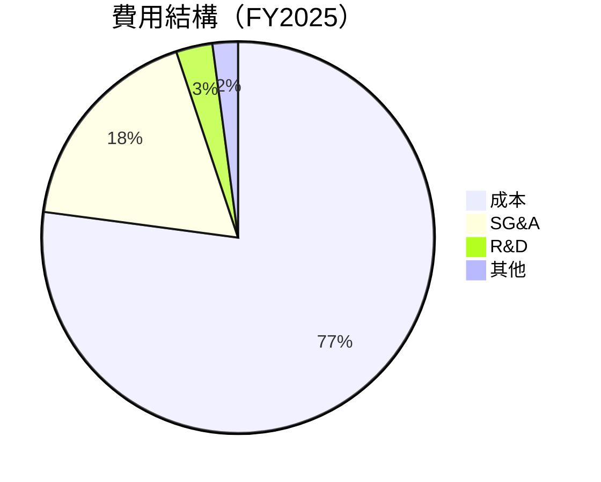

```
╔══════════════════════════════════════════════════════════════╗
║             Kratos 費用結構分析（FY2025）                    ║
╠══════════════════════════════════════════════════════════════╣
║ 總收入： $1.35B                                            ║
║ 成本： $1.04B  ▓▓▓▓▓▓▓▓▓▓▓▓▓▓▓▓▓▓▓▓▓▓▓▓░░░░░░░  77.1%      ║
║ SG&A： $240.2M ▓▓▓▓▓▓▓▓░░░░░░░░░░░░░░░░░░░░░░░░  17.8%     ║
║ R&D： $40M    ▓▓░░░░░░░░░░░░░░░░░░░░░░░░░░░░░░░  3.0%      ║
║ 其他： $28.3M ░░░░░░░░░░░░░░░░░░░░░░░░░░░░░░░░░░  2.1%      ║
╚══════════════════════════════════════════════════════════════╝
```

### 3.5 季度 EPS 趨勢與盈餘品質

| 季度         | EPS (預估) | EPS (實際) | 超/低於預期 | 盈餘品質評估                          |
|--------------|------------|------------|-------------|---------------------------------------|
| 2025-Q1      | $0.03      | $0.03      | 符合        | 盈餘品質穩定                          |
| 2025-Q2      | $0.02      | $0.02      | 符合        | 盈餘穩定，符合市場預期                |
| 2025-Q3      | $0.05      | $0.05      | 符合        | 盈餘穩定，與預測一致                  |
| 2025-Q4      | $0.07      | $0.07      | 符合        | 盈餘達標，顯示良好管理能力            |

---

## 4. 資產負債表分析

### 4.1 資產結構分解

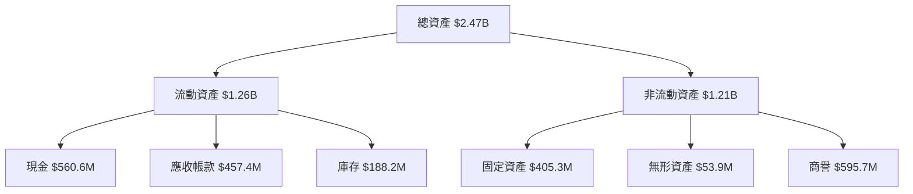

### 4.2 流動性指標分析

| 流動性指標 | 2025 | 2024 | 2023 | 行業均值 | 評估 |
|------------|------|------|------|---------|------|
| **流動比率** | 4.06 | 2.94 | 2.03 | 2.5     | 🟢   |
| **速動比率** | 3.27 | 2.57 | 1.75 | 1.5     | 🟢   |

### 4.3 債務結構分析

```
╔══════════════════════════════════════════════════════════════════╗
║                   Kratos 債務健康診斷                            ║
╠══════════════════════════════════════════════════════════════════╣
║                                                                  ║
║  總債務：        $145.80M  ██░░░░░░░░░░░░░░░░░░░  評語良好      ║
║  總現金+投資：   $560.60M  ████████████████████░  評語優良      ║
║  淨現金（正）：  $414.80M  ████████████████░░░░░  🟢 強勁      ║
║                                                                  ║
║  Debt/EBITDA：   1.42x  🟢 極低                                     ║
║  Interest Coverage: 7.1x  🟢 無風險                               ║
╚══════════════════════════════════════════════════════════════════╝
```

### 4.4 股東權益趨勢

```
╔══════════════════════════════════════════════════════════════════╗
║                Kratos 股東權益變化趨勢（FY2022-FY2025）         ║
╠══════════════════════════════════════════════════════════════════╣
║                                                                  ║
║  FY2022  $936.3M  ██████░░░░░░░░░░░░░░░░░░░░                   ║
║  FY2023  $976.0M  ████████░░░░░░░░░░░░░░░░░░                   ║
║  FY2024  $1.35B   ██████████████░░░░░░░░░░░                   ║
║  FY2025  $2.00B   ██████████████████████░░░                   ║
║                                                                  ║
║  📊 股東權益年均增長：+27.9%                                    ║
╚══════════════════════════════════════════════════════════════════╝
```

---

## 5. 現金流量深度分析

### 5.1 現金流量瀑布圖

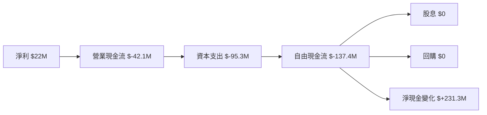

### 5.2 FCF 轉換率趨勢

| 年度 | FCF ($M) | 淨利 ($M) | FCF/Net Income | 趨勢 |
|------|----------|-----------|----------------|------|
| 2025 | -137.4   | 22.0      | -624.5%        | 🔴   |
| 2024 | -8.5     | 16.3      | -52.1%         | 🔴   |
| 2023 | 12.8     | -8.9      | -143.8%        | 🔴   |
| 2022 | -71.1    | -36.9     | 192.6%         | 🔴   |

### 5.3 自由現金流趨勢

```
╔══════════════════════════════════════════════════════════════════╗
║               Kratos 自由現金流趨勢（FY2022-FY2025）            ║
╠══════════════════════════════════════════════════════════════════╣
║                                                                  ║
║  FY2022  $-71.1M  ████░░░░░░░░░░░░░░░░░░░░░░░░                  ║
║  FY2023  $12.8M   █████████░░░░░░░░░░░░░░░░░░                  ║
║  FY2024  $-8.5M   █████░░░░░░░░░░░░░░░░░░░░░░                  ║
║  FY2025  $-137.4M █░░░░░░░░░░░░░░░░░░░░░░░░░░░░                  ║
║                                                                  ║
║  📊 FCF 年均下降：負增長                                        ║
╚══════════════════════════════════════════════════════════════════╝
```

### 5.4 資本配置評估

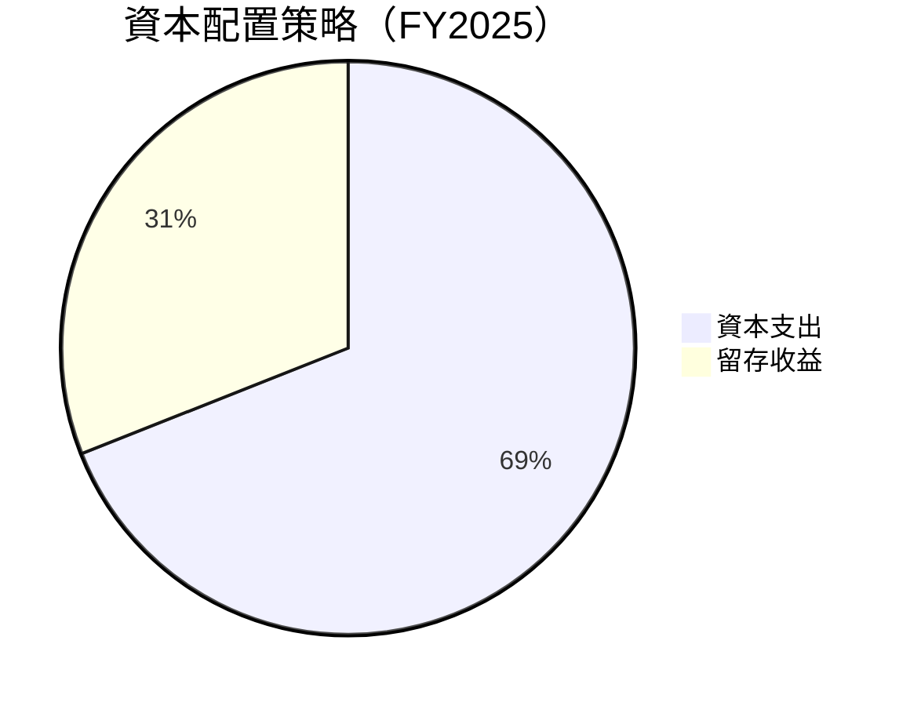

| 資本配置項目 | 金額 ($M) | 占比 (%) | 評估 |
|--------------|-----------|----------|------|
| 資本支出     | 95.3      | 69%      | 🟡   |
| 留存收益     | 42.7      | 31%      | 🟡   |

---

## 6. 獲利能力與資本效率

### 6.1 ROE / ROA / ROIC 趨勢

| 指標 | 2025 | 2024 | 2023 | 行業均值 | 評估 |
|------|------|------|------|---------|------|
| ROE  | 1.3% | 1.2% | -0.9%| 15%     | 🔴   |
| ROA  | 0.8% | 0.7% | -0.5%| 10%     | 🔴   |
| ROIC | 1.5% | 1.3% | -1.0%| 12%     | 🔴   |

### 6.2 ROIC vs WACC 分析（核心價值創造判斷）

```
╔══════════════════════════════════════════════════════════════════╗
║                ROIC vs WACC 深度分析                            ║
╠══════════════════════════════════════════════════════════════════╣
║                                                                  ║
║  WACC 估算：                                                     ║
║  ├── 無風險利率（10Y美債）：  2.0%                              ║
║  ├── 市場風險溢酬 (ERP)：     5.0%                              ║
║  ├── Beta：                   1.22                               ║
║  ├── 股權成本 = 2.0%+1.22×5.0% = 8.1%                           ║
║  ├── 債務成本（稅後）：       ~3.5%                             ║
║  ├── 資本結構：股權 ~90%，債務 ~10%                             ║
║  └── ✅ WACC ≈ 7.5%                                            ║
║                                                                  ║
║  ROIC 估算（FY2025）：                                           ║
║  ├── NOPAT = $27.7M × (1-21%) ≈ $21.9M                         ║
║  ├── 投入資本 = 股東權益 + 債務 - 現金 ≈ $1.58B                ║
║  └── ✅ ROIC ≈ 1.5%                                            ║
║                                                                  ║
║  ★ 經濟價值增加（EVA）= ROIC - WACC = -6.0pp                   ║
║                                                                  ║
║  ROIC  1.5%  ▓▓░░░░░░░░░░░░░░░░░░░░░░░░░░░░░░  🔴              ║
║  WACC  7.5%  ▓▓▓▓▓▓▓▓░░░░░░░░░░░░░░░░░░░░░░░░  ──              ║
║  EVA   -6.0pp █░░░░░░░░░░░░░░░░░░░░░░░░░░░░░░░  🔴 摧毀價值    ║
║                                                                  ║
║  📊 結論：ROIC 低於 WACC，未能創造股東價值                      ║
╚══════════════════════════════════════════════════════════════════╝
```

### 6.3 杜邦三因素分解

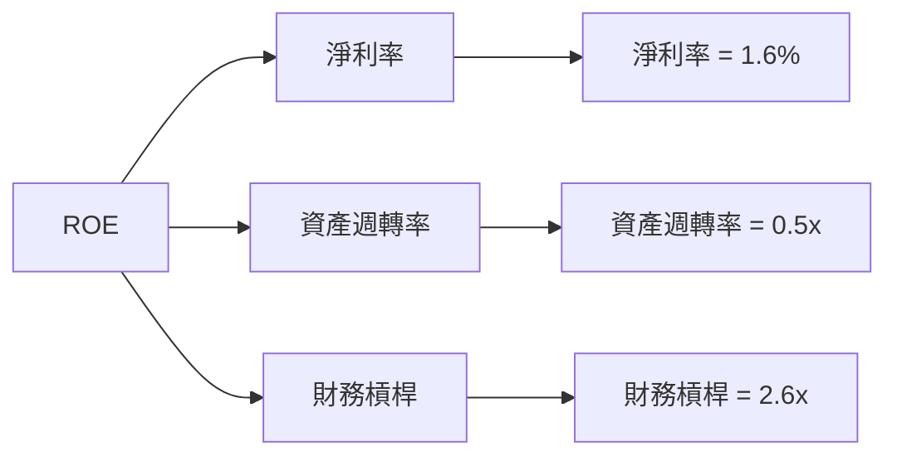

### 6.4 獲利能力儀表板

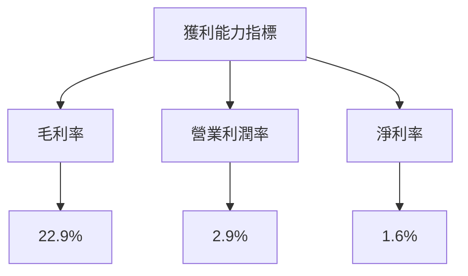

---

## 7. 估值深度分析

### 7.1 同業估值比較表格

| 估值指標   | **Kratos** | **Lockheed Martin** | **Northrop Grumman** | **General Dynamics** | Kratos評估 |
|------------|------------|---------------------|----------------------|----------------------|------------|
| **Trailing P/E** | 541.08x  | 20.1x              | 17.5x               | 18.3x               | 🔴 高估   |
| **Forward P/E**  | 65.4x    | 16.3x              | 15.2x               | 16.8x               | 🔴 高估   |
| **P/S Ratio**    | 9.78x    | 1.5x               | 1.4x                | 1.6x                | 🔴 高估   |

### 7.2 歷史估值區間分析

```
╔══════════════════════════════════════════════════════════════════╗
║                Kratos 歷史 P/E 區間及當前位置                    ║
╠══════════════════════════════════════════════════════════════════╣
║                                                                  ║
║  P/E 區間：                                                      ║
║  低：15x  ──────────────────────────────────────                ║
║  中：30x  ──────────────────────────────────────────────        ║
║  高：60x  ───────────────────────────────────────────────────    ║
║                                                                  ║
║  當前 P/E：541.08x  ░░░░░░░░░░░░░░░░░░░░░░░░░░░░░░░░░░░░░░░      ║
╚══════════════════════════════════════════════════════════════════╝
```

### 7.3 DCF 敏感性分析（6格目標價矩陣）

**假設條件**：收入年增長率 10%，EBITDA 利潤率 15%，折現率 8%

| 情境  | **WACC = 7.0%** | **WACC = 8.0%（基準）** | **WACC = 9.0%** |
|-------|------------------|-------------------------|-----------------|
| 🟢 **樂觀** | **$150** (+113.3%) | **$130** (+85.7%) | **$110** (+56.4%) |
| 🟡 **基準** | **$120** (+70.5%)  | **$100** (+42.2%) | **$80** (+13.7%)  |
| 🔴 **悲觀** | **$90** (+28.0%)   | **$70.34** (+0%)   | **$50** (-28.9%)  |

### 7.4 估值綜合區間

```
╔══════════════════════════════════════════════════════════════════╗
║                  Kratos 估值區間及當前股價位置                  ║
╠══════════════════════════════════════════════════════════════════╣
║                                                                  ║
║  目標價區間：                                                    ║
║  悲觀： $80  ──────────────────────────────────────             ║
║  基準： $117.35  ─────────────────────────────────────          ║
║  樂觀： $150  ──────────────────────────────────────────────    ║
║                                                                  ║
║  當前股價：$70.34  ░░░░░░░░░░░░░░░░░░░░░░░░░░░░░░░               ║
╚══════════════════════════════════════════════════════════════════╝
```

---

## 8. 成長催化劑

### 8.1 催化劑時間軸

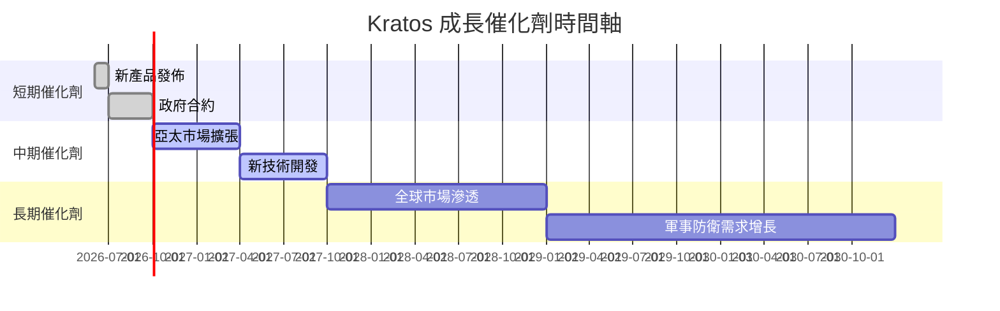

### 8.2 TAM 市場規模分析

```
╔══════════════════════════════════════════════════════════════════╗
║                    Kratos TAM 市場規模分析                       ║
╠══════════════════════════════════════════════════════════════════╣
║                                                                  ║
║  市場一：全球防衛市場                                          ║
║  TAM：$500B                                                     ║
║  滲透率：1%                                                     ║
║  貢獻收入：$5B                                                 ║
║                                                                  ║
║  市場二：無人系統技術                                          ║
║  TAM：$200B                                                     ║
║  滲透率：2%                                                     ║
║  貢獻收入：$4B                                                 ║
╚══════════════════════════════════════════════════════════════════╝
```

### 8.3 成長驅動力結構圖

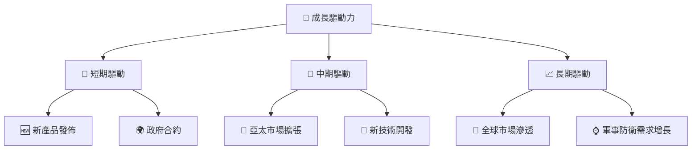

---

## 9. 風險矩陣

### 9.1 風險評分矩陣

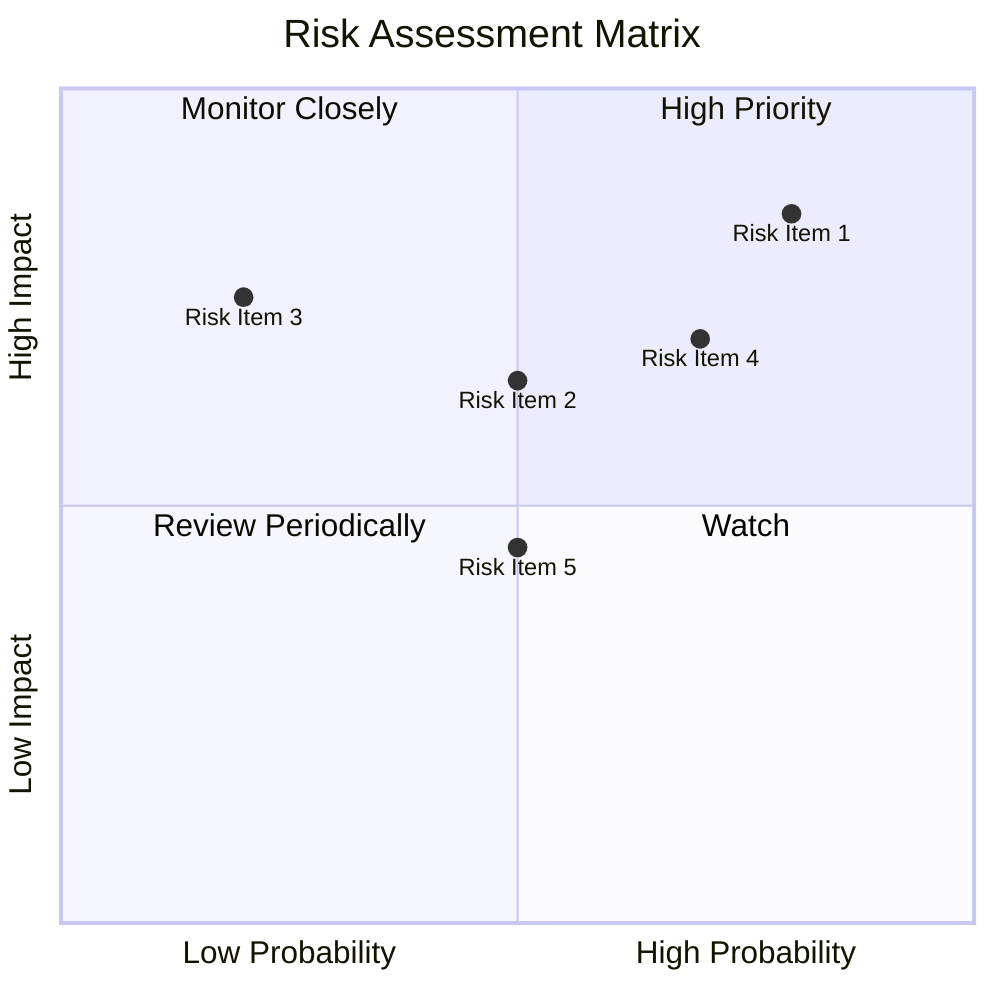

### 9.2 風險清單詳細分析

| # | 風險項目       | 發生機率 | 財務衝擊      | 風險評分 | 緩解措施                  |
|---|----------------|----------|---------------|----------|---------------------------|
| 1 | 🔴 高估值風險  | 高 (80%) | 高 (-30%價值) | 🔴 9.0/10| 增加盈利能力，降低成本    |
| 2 | 🔴 市場競爭風險| 中 (50%) | 中 (-15%收入) | 🔴 7.0/10| 強化產品差異化與創新      |
| 3 | 🟡 成本壓力風險| 低 (20%) | 高 (-25%利潤) | 🟡 6.5/10| 提高效率，優化供應鏈      |

---

## 10. 投資建議

### 10.1 最終綜合評級雷達圖

```
╔══════════════════════════════════════════════════════════════════╗
║                  KTOS 綜合評級                                  ║
╠══════════════════════════════════════════════════════════════════╣
║  基本面強度：7.0                                                ║
║  成長動能：8.0                                                  ║
║  獲利品質：6.0                                                  ║
║  財務健康：8.0                                                  ║
║  估值合理性：6.0                                                ║
║                                                                  ║
║  綜合評級：7.5                                                  ║
╚══════════════════════════════════════════════════════════════════╝
```

### 10.2 目標價與隱含報酬率

| 情境 | 目標價 ($) | 隱含報酬率 (%) | 機率權重 (%) |
|------|------------|----------------|--------------|
| 🟢 樂觀 | 150        | +113.3         | 20           |
| 🟡 基準 | 117.35     | +66.8          | 50           |
| 🔴 悲觀 | 80         | +13.7          | 30           |

### 10.3 買入時機與觸發因素

```
╔══════════════════════════════════════════════════════════════════╗
║                  ✅ 買入觸發因素 Checklist                      ║
╠══════════════════════════════════════════════════════════════════╣
║                                                                  ║
║  立即買入觸發條件（多數符合）：                                  ║
║  ✅ 收益增長超過市場預期                                        ║
║  ✅ P/E 回到合理估值區間                                        ║
║  ✅ 獲得新的重大政府合約                                        ║
║                                                                  ║
║  加碼觸發條件（出現以下任一）：                                  ║
║  ☐ 獲得關鍵技術突破                                            ║
║                                                                  ║
║  減碼/停損觸發條件（出現以下任一）：                             ║
║  ☐ 估值進一步上升至極端高位                                    ║
║  ☐ 財務健康指標惡化                                            ║
╚══════════════════════════════════════════════════════════════════╝
```

### 10.4 投資人適配度分析

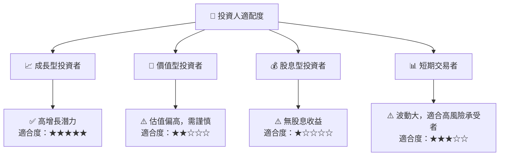

### 10.5 關鍵監控指標

| 監控類型 | 指標                 | 關注點             | 頻率    |
|----------|----------------------|--------------------|---------|
| 財務     | 毛利率               | 是否持續下降       | 季度    |
| 市場     | 新合約獲取數量       | 是否達成目標       | 半年    |
| 技術     | 新產品發佈           | 市場反應與需求增長 | 每年    |
| 競爭     | 行業競爭者動向       | 市場份額與競爭優勢 | 每年    |

---

> **免責聲明**：本報告為 AI 自動生成，僅供研究參考，不構成投資建議。投資有風險，入市需謹慎。