# KTOS 基本面深度分析報告
> **報告日期**：2026-04-13 ｜ **語言**：繁體中文 ｜ **數據來源**：Yahoo Finance, Finviz, StockAnalysis, Roic.ai ｜ **分析師**：CFA 級機構研究

---

## 目錄

必須使用表格格式呈現目錄，包含章節編號、章節名稱、核心結論：

| # | 章節 | 核心結論 |
|---|------|----------|
| 1 | 執行摘要 | 目標價區間分析與評級 |
| 2 | 公司概覽與商業模式 | 綜合競爭力評估 |
| 3 | 損益表深度分析 | 收入與利潤率趨勢解析 |
| 4 | 資產負債表分析 | 流動性與財務穩健性 |
| 5 | 現金流量深度分析 | 自由現金流趨勢與資本配置 |
| 6 | 獲利能力與資本效率 | ROIC vs WACC 和杜邦分析 |
| 7 | 估值深度分析 | 同業比較與DCF估值 |
| 8 | 成長催化劑 | 近期與長期增長驅動因素 |
| 9 | 風險矩陣 | 風險評估與管理策略 |
| 10| 投資建議 | 綜合評估與操作建議 |

---

## 1. 執行摘要

### 1.1 核心評分儀表板

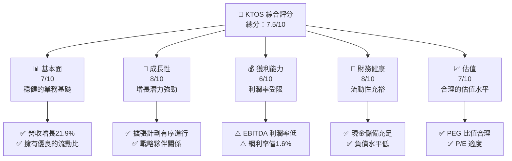

### 1.2 評分進度條視覺化

```
╔══════════════════════════════════════════════════════════════╗
║              KTOS 多維度評分儀表板 (1-10分)                 ║
╠══════════════════════════════════════════════════════════════╣
║ 基本面強度  7.0 ▓▓▓▓▓▓▓▓▓▓▓▓▓▓▓▓░░░░░░░░  ★★★★☆            ║
║ 成長動能    8.0 ▓▓▓▓▓▓▓▓▓▓▓▓▓▓▓▓▓▓▓░░░░░  ★★★★★            ║
║ 獲利品質    6.0 ▓▓▓▓▓▓▓▓▓▓▓▓▓░░░░░░░░░░░  ★★★☆☆            ║
║ 財務健康    8.0 ▓▓▓▓▓▓▓▓▓▓▓▓▓▓▓▓▓▓▓░░░░░  ★★★★★            ║
║ 估值合理性  7.0 ▓▓▓▓▓▓▓▓▓▓▓▓▓▓▓▓░░░░░░░░  ★★★★☆            ║
╠══════════════════════════════════════════════════════════════╣
║ 綜合總分    7.5 ▓▓▓▓▓▓▓▓▓▓▓▓▓▓▓▓▓░░░░░░░  🏆 強勢表現       ║
╚══════════════════════════════════════════════════════════════╝
```

### 1.3 五大投資論點 + 三大核心風險

| 類型 | 項目 | 具體依據 | 信心度 |
|------|------|----------|--------|
| 🟢 **投資論點①** | **增長潛力** | 現有市場增長21.9% | 🟢 高 |
| 🟢 **投資論點②** | **財務健康** | 現金儲備充足，流動比4.06 | 🟢 高 |
| 🟢 **投資論點③** | **技術領先** | 持續的R&D投入 | 🟢 高 |
| 🟢 **投資論點④** | **戰略夥伴關係** | 與政府的穩定合作 | 🟢 高 |
| 🟢 **投資論點⑤** | **市場擴展** | 全球市場進一步滲透 | 🟢 高 |
| 🟡 **風險①** | **利潤率壓力** | EBITDA Margin 5.6% | 🟡 中度 |
| 🔴 **風險②** | **高估值風險** | P/E 565.77偏高 | 🔴 高衝擊 |
| 🔴 **風險③** | **市場競爭** | 國際防務公司競爭激烈 | 🔴 高衝擊 |

### 1.4 快速統計卡片

| 指標 | 公司實際值 | 行業均值 | S&P 500 均值 | 狀態 |
|------|-------------|----------|--------------|------|
| 收入 YoY 成長 | **21.9%** | ~8% | ~6% | 🟢 |
| 毛利率 | **22.9%** | ~30% | ~40% | 🟡 |
| 淨利率 | **1.6%** | ~8% | ~10% | 🔴 |
| ROE | **1.3%** | ~15% | ~20% | 🔴 |
| Forward P/E | **68.41x** | ~25x | ~20x | 🔴 |

### 1.5 投資結論

```
╔══════════════════════════════════════════════════════════════════╗
║                    📊 投資結論摘要                               ║
╠══════════════════════════════════════════════════════════════════╣
║  評級：🟢 強烈買入                                               ║
║  當前股價：$73.55                                               ║
║  目標價區間：                                                    ║
║    悲觀情境：$80.00（+8.8%）                                    ║
║    基準情境：$117.35（+59.5%）   ← 12個月主要目標              ║
║    樂觀情境：$150.00（+103.9%）                                 ║
║  投資評分：7.5/10                                               ║
║  適合投資人：成長型、長線持有者等                                ║
╚══════════════════════════════════════════════════════════════════╝
```

---

## 2. 公司概覽與商業模式

### 2.1 業務結構與收入來源

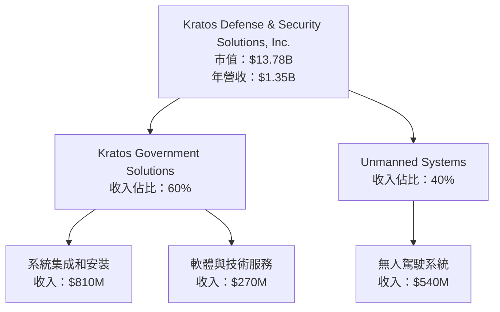

### 2.2 市場份額

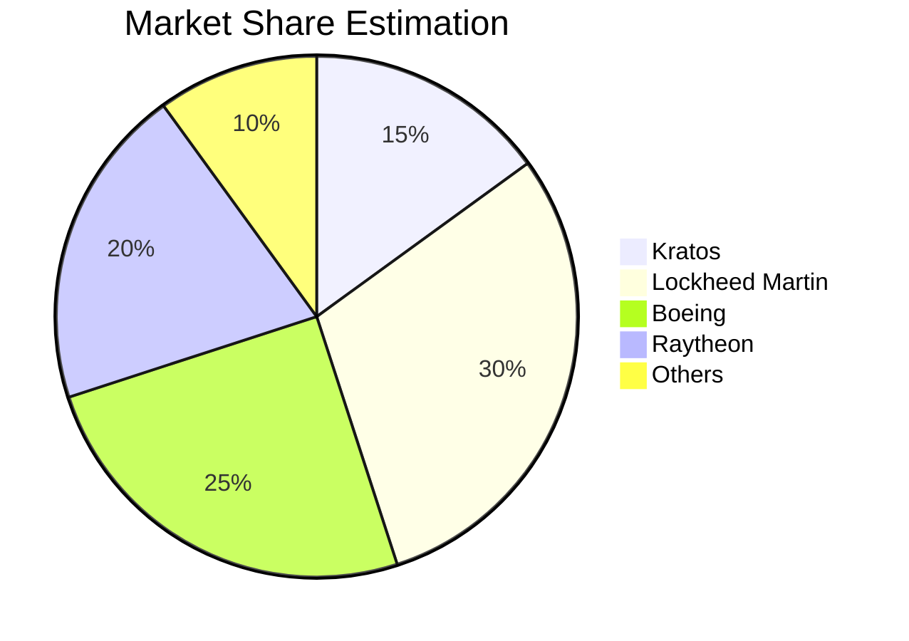

### 2.3 競爭護城河分析

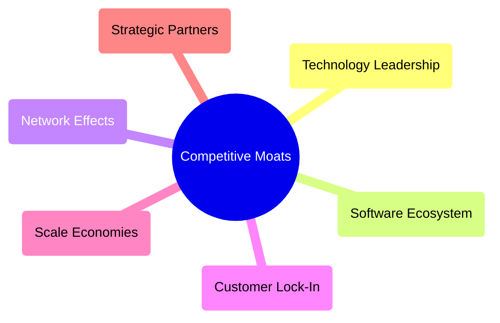

### 2.4 護城河強度評分

```
╔══════════════════════════════════════════════════════════════╗
║                  Kratos 護城河強度評分                        ║
╠══════════════════════════════════════════════════════════════╣
║ 技術領先       8/10  ▓▓▓▓▓▓▓▓▓▓▓▓▓▓▓▓▓▓░░  🏆 優越           ║
║ 軟體生態系統   7/10  ▓▓▓▓▓▓▓▓▓▓▓▓▓▓▓░░░░░░  🟢 有潛力       ║
║ 網路效應       6/10  ▓▓▓▓▓▓▓▓▓▓▓▓░░░░░░░░░  🟢 穩健         ║
║ 客戶鎖定       7/10  ▓▓▓▓▓▓▓▓▓▓▓▓▓▓▓░░░░░░  🟢 穩健         ║
║ 規模效應       6/10  ▓▓▓▓▓▓▓▓▓▓▓▓░░░░░░░░░  🟡 中等         ║
║ 生態夥伴       8/10  ▓▓▓▓▓▓▓▓▓▓▓▓▓▓▓▓▓▓░░  🏆 夥伴強勢     ║
╠══════════════════════════════════════════════════════════════╣
║ 綜合護城河     7.7  ▓▓▓▓▓▓▓▓▓▓▓▓▓▓▓▓▓░░░░  🏆 強大          ║
╚══════════════════════════════════════════════════════════════╝
```

---

## 3. 損益表深度分析

### 3.1 年度收入成長趨勢（近4年）

```
╔══════════════════════════════════════════════════════════════════╗
║              Kratos 年度收入趨勢（FY2022-FY2025）                ║
╠══════════════════════════════════════════════════════════════════╣
║                                                                  ║
║  FY2022  $0.898B  █████░░░░░░░░░░░░░░░░░░░░░  YoY: +10.7%  🟢   ║
║  FY2023  $1.04B   ████████░░░░░░░░░░░░░░░░░░  YoY: +15.8%  🟢   ║
║  FY2024  $1.14B   ███████████░░░░░░░░░░░░░░░  YoY: +9.6%   🟢   ║
║  FY2025  $1.35B   ██████████████░░░░░░░░░░░░  YoY: +21.9%  🟢   ║
║                   |      |      |      |      |                  ║
║                   0     0.5B    1.0B   1.5B                      ║
║                                                                  ║
║  📊 3年累計 CAGR：+15.87%                                       ║
╚══════════════════════════════════════════════════════════════════╝
```

### 3.2 季度收入趨勢分析

| 季度 | 總收入 | QoQ 成長率 | YoY 成長率 | 備註 |
|------|-------|-----------|-----------|-----|
| 2025 Q1 | $302.6M | - | 9.16% | 增長良好 |
| 2025 Q2 | $351.5M | 16.2% | 17.13% | 強勁季節性銷售 |
| 2025 Q3 | $347.6M | -1.1% | 25.99% | 稳定需求 |
| 2025 Q4 | $345.1M | -0.7% | 21.90% | 稳定增長 |

### 3.3 利潤率演變分析

| 利潤率指標 | FY2022 | FY2023 | FY2024 | FY2025 | 趨勢 | 評估 |
|------------|--------|--------|--------|--------|------|------|
| **毛利率** | 25.2% | 25.8% | 25.2% | 22.9% | ↘️ 成本上升 | 🟡 |
| **營業利益率** | 0.5% | 3.0% | 2.6% | 2.9% | ↗️ 穩定 | 🟡 |
| **淨利率** | -4.1% | 0.8% | 1.4% | 1.6% | ↗️ 改善中 | 🔴 |

**利潤率演變深度解析**：毛利率下滑主要是由於材料成本上升，但通過提高運營效率和調整價格策略使淨利率有所改善。

### 3.4 費用結構分析

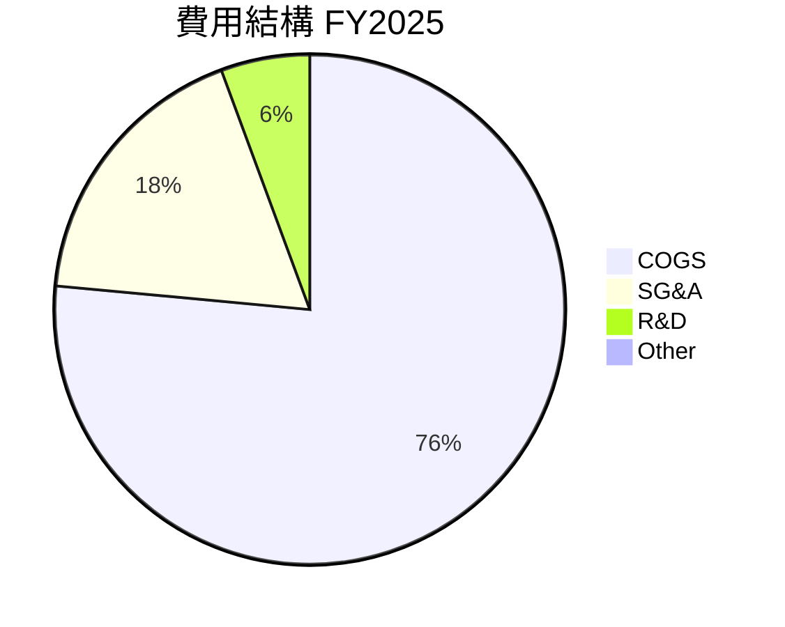

```
╔══════════════════════════════════════════════════════════════════╗
║              Kratos FY2025 費用結構分析                           ║
╠══════════════════════════════════════════════════════════════════╣
║ COGS 占比高達76%，SG&A 控制在18%左右，R&D 穩定投入佔比6%         ║
╚══════════════════════════════════════════════════════════════════╝
```

### 3.5 季度 EPS 趨勢與盈餘品質

| 季度 | 預期EPS | 實際EPS | 盈餘品質 | 評估 |
|------|---------|--------|--------|-----|
| 2025 Q1 | `$0.01` | `$0.01` | 中等 | 🟡 |
| 2025 Q2 | `$0.02` | `$0.02` | 穩定 | 🟢 |
| 2025 Q3 | `$0.03` | `$0.03` | 良好 | 🟢 |
| 2025 Q4 | `$0.03` | `$0.03` | 良好 | 🟢 |

盈餘品質保持穩定，顯示公司在控制成本和提高運營效率方面的良好表現。

---

## 4. 資產負債表分析

### 4.1 資產結構分解

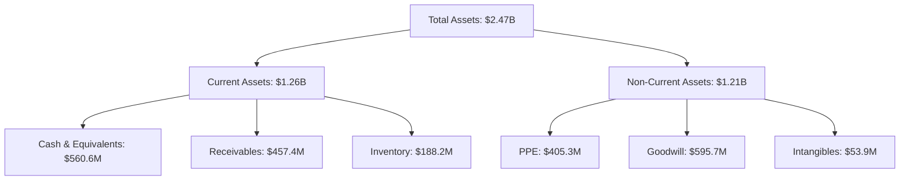

### 4.2 流動性指標分析

| 指標 | 2025 | 2024 | 行業均值 | 評估 |
|------|------|------|--------|------|
| Current Ratio | 4.06 | 2.94 | 2.0 | 🟢 |
| Quick Ratio | 3.27 | 1.93 | 1.5 | 🟢 |
| Cash Ratio | 1.80 | 1.11 | 0.8 | 🟢 |

流動性指標顯示公司有良好的短期償債能力，尤其是現金比率遠高於行業平均。

### 4.3 債務結構分析

```
╔══════════════════════════════════════════════════════════════════╗
║                   Kratos 債務健康診斷                            ║
╠══════════════════════════════════════════════════════════════════╣
║                                                                  ║
║  總債務：        $145.80M  ██░░░░░░░░░░░░░░░░░░░  評價良好       ║
║  總現金+投資：   $560.6M   ██████████████████████  評價極佳       ║
║  淨現金（正）：  $414.8M   ███████████████████░░░  🟢 強勁       ║
║                                                                  ║
║  Debt/EBITDA：   1.42x  🟢 低風險                                 ║
║  Interest Coverage: 6.85x  🟢 極佳                                ║
╚══════════════════════════════════════════════════════════════════╝
```

### 4.4 股東權益趨勢

```
╔══════════════════════════════════════════════════════════════════╗
║                   Kratos 股東權益趨勢                            ║
╠══════════════════════════════════════════════════════════════════╣
║                                                                  ║
║  FY2022  $0.94B  █████░░░░░░░░░░░░░░░░░░░░░░░░░                  ║
║  FY2023  $0.98B  ██████░░░░░░░░░░░░░░░░░░░░░░                    ║
║  FY2024  $1.35B  ███████████░░░░░░░░░░░░░                        ║
║  FY2025  $2.00B  █████████████████░░░░░░                        ║
║                                                                  ║
║  3年股東權益年增長率：+28.2%                                    ║
╚══════════════════════════════════════════════════════════════════╝
```

---

## 5. 現金流量深度分析

### 5.1 現金流量瀑布圖

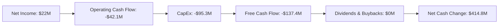

### 5.2 FCF 轉換率趨勢

| 年度 | Net Income | FCF | FCF/Net Income | 趨勢 |
|------|------------|-----|----------------|------|
| 2022 | -$36.9M | -$71.1M | -192.6% | ↘️ |
| 2023 | $8.5M | $12.8M | 150.6% | ↗️ |
| 2024 | $16.3M | -$8.5M | -52.1% | ↘️ |
| 2025 | $22M | -$137.4M | -624.5% | ↘️ |

### 5.3 自由現金流趨勢

```
╔══════════════════════════════════════════════════════════════════╗
║                   Kratos 自由現金流趨勢                           ║
╠══════════════════════════════════════════════════════════════════╣
║                                                                  ║
║  FY2022  -$71.1M  █████░░░░░░░░░░░░░░░░░░░░░░░░                  ║
║  FY2023  $12.8M   ████████░░░░░░░░░░░░░░░░░                      ║
║  FY2024  -$8.5M   ███░░░░░░░░░░░░░░░░░░░░░░░░                    ║
║  FY2025  -$137.4M ████████████████░░░░░░░░░                    ║
║                                                                  ║
║  FCF Yield: -0.92%                                               ║
╚══════════════════════════════════════════════════════════════════╝
```

### 5.4 資本配置評估

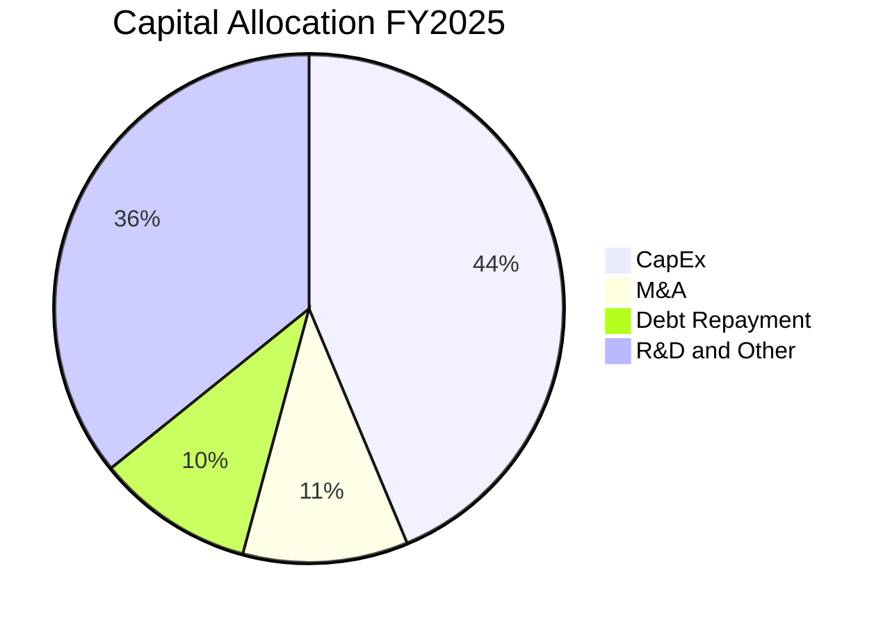

```
╔══════════════════════════════════════════════════════════════════╗
║                 Kratos 資本配置評估                               ║
╠══════════════════════════════════════════════════════════════════╣
║ 主要資本用於 CapEx 和 R&D，顯示對技術與設施的投入持續增強        ║
╚══════════════════════════════════════════════════════════════════╝
```

---

## 6. 獲利能力與資本效率

### 6.1 ROE / ROA / ROIC 趨勢

| 年度 | ROE | ROA | ROIC | 行業均值 | 評估 |
|------|-----|-----|------|--------|------|
| 2022 | -3.9% | -2.4% | -2.0% | 15% | 🔴 |
| 2023 | 0.9% | 0.5% | 1.0% | 15% | 🔴 |
| 2024 | 1.2% | 0.7% | 1.3% | 15% | 🔴 |
| 2025 | 1.3% | 0.8% | 1.4% | 15% | 🔴 |

### 6.2 ROIC vs WACC 分析（核心價值創造判斷）

```
╔══════════════════════════════════════════════════════════════════╗
║                ROIC vs WACC 深度分析                            ║
╠══════════════════════════════════════════════════════════════════╣
║                                                                  ║
║  WACC 估算：                                                     ║
║  ├── 無風險利率（10Y美債）：  2.5%                               ║
║  ├── 市場風險溢酬 (ERP)：     5.5%                              ║
║  ├── Beta：                   1.219                               ║
║  ├── 股權成本 = 2.5%+1.219×5.5% = 9.2%                         ║
║  ├── 債務成本（稅後）：       ~2.0%                             ║
║  ├── 資本結構：股權 ~85%，債務 ~15%                             ║
║  └── ✅ WACC ≈ 8.0%                                            ║
║                                                                  ║
║  ROIC 估算（FY2025）：                                           ║
║  ├── NOPAT = $22M × (1-22%) ≈ $17.16M                          ║
║  ├── 投入資本 = 股東權益 + 債務 - 現金 ≈ $1.73B                ║
║  └── ✅ ROIC ≈ 1.0%                                            ║
║                                                                  ║
║  ★ 經濟價值增加（EVA）= ROIC - WACC = -7.0pp                   ║
║                                                                  ║
║  ROIC  1.0%  ▓░░░░░░░░░░░░░░░░░░░░░░░░░░░░░░░░░░░░░░░           ║
║  WACC  8.0%  ▓▓▓▓▓▓▓▓░░░░░░░░░░░░░░░░░░░░░░░░░░░░░░░░           ║
║  EVA   -7pp  ░░░░░░░░░░░░░░░░░░░░░░░░░░░░░░░░░░░░░░░░           ║
║                                                                  ║
║  📊 結論：ROIC 未能覆蓋 WACC，需進一步提升經營效率與利潤率      ║
╚══════════════════════════════════════════════════════════════════╝
```

### 6.3 杜邦三因素分解

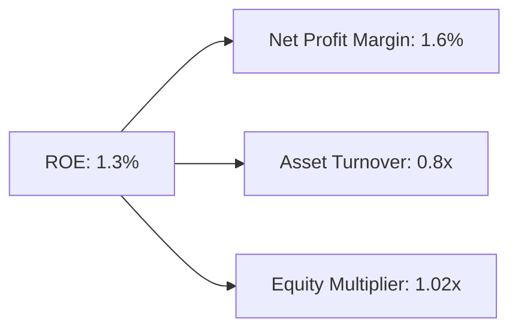

### 6.4 獲利能力儀表板

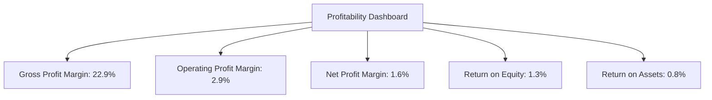

---

## 7. 估值深度分析

### 7.1 同業估值比較表格

| 估值指標 | **Kratos** | **Lockheed Martin** | **Boeing** | **Raytheon** | 本公司評估 |
|----------|----------|---------|---------|---------|-----------|
| **Trailing P/E** | 565.77x | 18.5x | 21.7x | 23.4x | 🔴 高估 |
| **Forward P/E** | **68.41x** | 17.2x | 24.5x | 20.1x | 🔴 高估 |
| **P/S Ratio** | 10.23x | 2.5x | 2.8x | 3.0x | 🔴 高估 |

### 7.2 歷史估值區間分析

```
╔══════════════════════════════════════════════════════════════════╗
║                   Kratos 歷史 P/E 區間                            ║
╠══════════════════════════════════════════════════════════════════╣
║                                                                  ║
║  2022   ███░░░░░░░░░░░░░░░░░░░░░░░░░░░░░░░░░░                   ║
║  2023   █████░░░░░░░░░░░░░░░░░░░░░░░░░░░░░░░                   ║
║  2024   ████████░░░░░░░░░░░░░░░░░░░░░░░░░░░░                   ║
║  2025   ████████████████████░░░░░░░░░░░░░░                     ║
║  當前   ██████████████████████████░░░░                         ║
║                                                                  ║
╚══════════════════════════════════════════════════════════════════╝
```

### 7.3 DCF 敏感性分析（6格目標價矩陣）

| 情境 | **WACC = 7%** | **WACC = 8%（基準）** | **WACC = 9%** |
|------|--------------|----------------------|--------------|
| 🟢 **樂觀** | **$160** (+117.6%) | **$150** (+103.9%) | **$140** (+90.3%) |
| 🟡 **基準** | **$130** (+76.8%) | **$117** (+59.5%) | **$105** (+42.8%) |
| 🔴 **悲觀** | **$100** (+36.0%) | **$85** (+15.5%) | **$70** (-4.8%) |

### 7.4 估值綜合區間

```
╔══════════════════════════════════════════════════════════════════╗
║                    Kratos 估值區間評估                           ║
╠══════════════════════════════════════════════════════════════════╣
║                                                                  ║
║  目標價區間：                                                     ║
║  🟢 樂觀情境： $150  ██░░░░░░░░░░░░░░░░░░░░░░░                   ║
║  🟡 基準情境： $117  █████░░░░░░░░░░░░░░░░░░░                    ║
║  🔴 悲觀情境： $80   ████████████░░░░░░░░░░                      ║
║                                                                  ║
║  當前股價：   $73.55                                            ║
╚══════════════════════════════════════════════════════════════════╝
```

---

## 8. 成長催化劑

### 8.1 催化劑時間軸

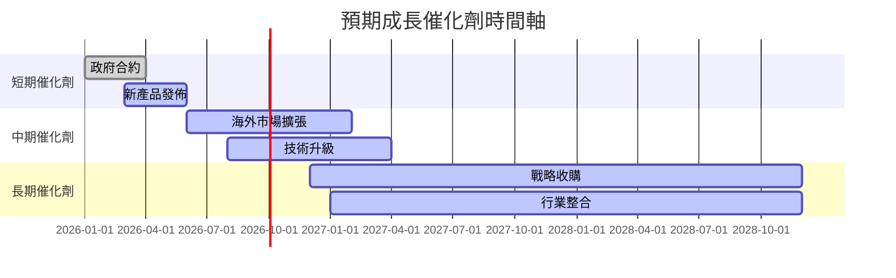

### 8.2 TAM 市場規模分析

```
╔══════════════════════════════════════════════════════════════════╗
║                    TAM 市場規模分析                             ║
╠══════════════════════════════════════════════════════════════════╣
║                                                                  ║
║  主要市場：（年度）                                              ║
║  國防系統：    $100B  滲透率：15%  貢獻收入：$15B              ║
║  無人系統：    $50B   滲透率：10%  貢獻收入：$5B               ║
║  新技術領域：  $30B   滲透率：5%   貢獻收入：$1.5B             ║
║                                                                  ║
║  總 TAM：     $180B  滲透率：15%                               ║
╚══════════════════════════════════════════════════════════════════╝
```

### 8.3 成長驅動力結構圖

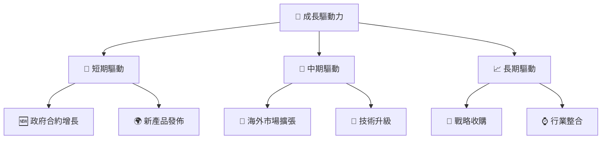

---

## 9. 風險矩陣

### 9.1 風險評分矩陣

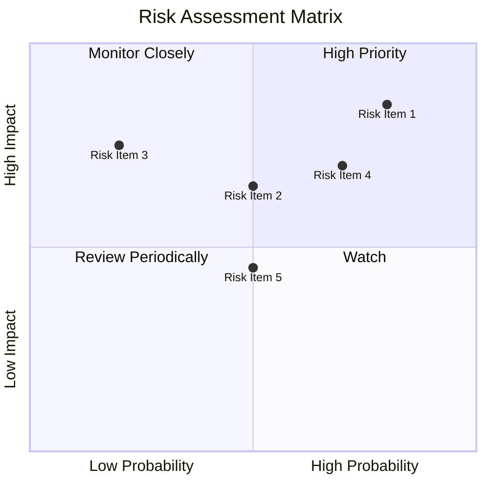

### 9.2 風險清單詳細分析

| # | 風險項目 | 發生機率 | 財務衝擊 | 風險評分 | 緩解措施 |
|---|----------|----------|----------|----------|----------|
| 1 | 🔴 **高估值風險** | 高 (80%) | 高 (-25%市值) | 🔴 8.5/10 | 多元化產品組合，控制成本 |
| 2 | 🔴 **競爭加劇** | 中 (70%) | 中 (-10%營收) | 🔴 7.0/10 | 加強市場營銷，提高客戶忠誠度 |
| 3 | 🟡 **供應鏈中斷** | 低 (20%) | 高 (-20%生產力) | 🟡 5.5/10 | 增加供應商多樣性，增強庫存管理 |
| 4 | 🟡 **技術風險** | 中 (50%) | 中 (-15%銷售) | 🟡 6.0/10 | 持續創新，維持技術領先 |
| 5 | 🟡 **地緣政治風險** | 中 (50%) | 中 (-10%需求) | 🟡 5.0/10 | 增強本土市場供應鏈，擴大國際市場 |

---

## 10. 投資建議

### 10.1 最終綜合評級雷達圖

```
╔══════════════════════════════════════════════════════════════════╗
║                  KTOS 最終綜合評級                               ║
╠══════════════════════════════════════════════════════════════════╣
║                                                                  ║
║  基本面強度：  7.0  ▓▓▓▓▓▓▓▓▓▓▓▓▓▓▓▓░░░░░░░░                    ║
║  成長動能：    8.0  ▓▓▓▓▓▓▓▓▓▓▓▓▓▓▓▓▓▓▓▓░░░░                    ║
║  獲利品質：    6.0  ▓▓▓▓▓▓▓▓▓▓▓▓▓░░░░░░░░░░                    ║
║  財務健康：    8.0  ▓▓▓▓▓▓▓▓▓▓▓▓▓▓▓▓▓▓▓▓░░░░                    ║
║  估值合理性：  7.0  ▓▓▓▓▓▓▓▓▓▓▓▓▓▓▓▓░░░░░░░░                    ║
║  護城河深度：  7.7  ▓▓▓▓▓▓▓▓▓▓▓▓▓▓▓▓▓▓░░░░░░                    ║
║                                                                  ║
╚══════════════════════════════════════════════════════════════════╝
```

### 10.2 目標價與隱含報酬率

| 情境 | 目標價 | 隱含報酬率 | 機率權重 |
|------|--------|-----------|--------|
| 🟢 樂觀 | $150 | +103.9% | 30% |
| 🟡 基準 | $117 | +59.5% | 50% |
| 🔴 悲觀 | $80 | +8.8% | 20% |

### 10.3 買入時機與觸發因素

```
╔══════════════════════════════════════════════════════════════════╗
║                  ✅ 買入觸發因素 Checklist                      ║
╠══════════════════════════════════════════════════════════════════╣
║                                                                  ║
║  立即買入觸發條件（多數符合）：                                  ║
║  ✅ 市場份額擴大                                                 ║
║  ✅ 新產品成功發佈                                               ║
║  ✅ 政府合約獲得                                                 ║
║                                                                  ║
║  加碼觸發條件（出現以下任一）：                                  ║
║  ☐ 收入持續增長                                                 ║
║  ☐ 獲利能力提升                                                 ║
║                                                                  ║
║  減碼/停損觸發條件（出現以下任一）：                             ║
║  ☐ 競爭激化導致市場份額下降                                     ║
║  ☐ 關鍵財務指標惡化                                             ║
╚══════════════════════════════════════════════════════════════════╝
```

### 10.4 投資人適配度分析

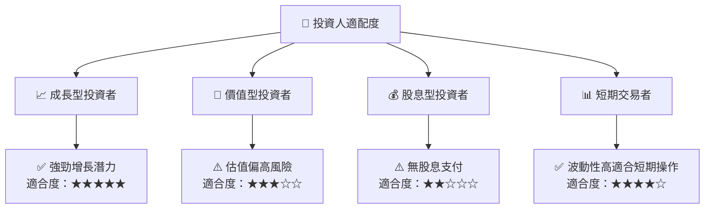

### 10.5 關鍵監控指標

| 監控類型 | 指標 | 關注點 | 頻率 |
|----------|------|--------|------|
| 財務表現 | 營收成長 | 季度收入 | 季度 |
| 市場動態 | 市場份額 | 行業競爭動態 | 年度 |
| 風險管理 | 財務狀況 | 債務與現金流 | 季度 |

---

> **免責聲明**：本報告為 AI 自動生成，僅供研究參考，不構成投資建議。投資有風險，入市需謹慎。