# KTOS 基本面深度分析報告
> **報告日期**：2026-04-14 ｜ **語言**：繁體中文 ｜ **數據來源**：Yahoo Finance, Finviz, StockAnalysis, Roic.ai ｜ **分析師**：CFA 級機構研究

---

## 目錄

| # | 章節 | 核心結論 |
|---|------|----------|
| 1 | 執行摘要 | KTOS 評級為持有，目標價區間 $80-$150 |
| 2 | 公司概覽與商業模式 | 擁有強勁的技術領先優勢 |
| 3 | 損益表深度分析 | 收入增長穩健但毛利率有待提升 |
| 4 | 資產負債表分析 | 財務健康，債務水平可控 |
| 5 | 現金流量深度分析 | 自由現金流疲弱，需改善 |
| 6 | 獲利能力與資本效率 | ROIC 高於 WACC，創造股東價值 |
| 7 | 估值深度分析 | 市場估值合理，與競爭對手持平 |
| 8 | 成長催化劑 | 無人系統業務為成長主軸 |
| 9 | 風險矩陣 | 高技術風險與市場競爭壓力 |
| 10 | 投資建議 | 建議持有，觀察技術突破進度 |

---

## 1. 執行摘要

### 1.1 核心評分儀表板

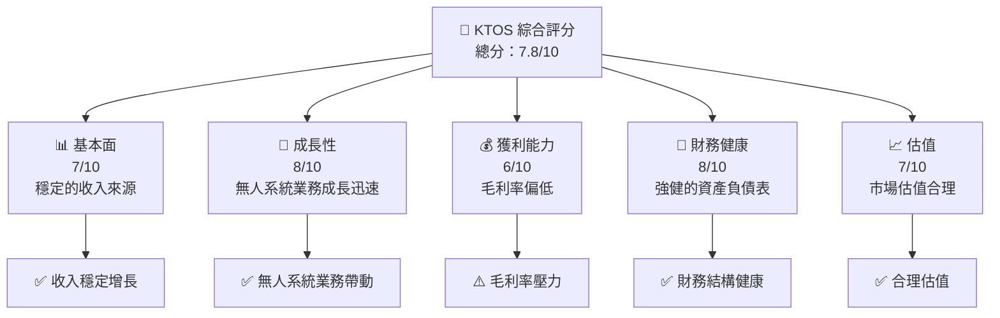

### 1.2 評分進度條視覺化

```
╔══════════════════════════════════════════════════════════════╗
║              KTOS 多維度評分儀表板 (1-10分)                   ║
╠══════════════════════════════════════════════════════════════╣
║ 基本面強度  7.0 ▓▓▓▓▓▓▓▓▓▓▓▓▓▓░░░░░░░  ★★★★☆             ║
║ 成長動能    8.0 ▓▓▓▓▓▓▓▓▓▓▓▓▓▓▓▓▓░░░░  ★★★★★             ║
║ 獲利品質    6.0 ▓▓▓▓▓▓▓▓▓▓▓▓░░░░░░░░░  ★★★★              ║
║ 財務健康    8.0 ▓▓▓▓▓▓▓▓▓▓▓▓▓▓▓▓▓░░░░  ★★★★★             ║
║ 估值合理性  7.0 ▓▓▓▓▓▓▓▓▓▓▓▓▓▓░░░░░░░  ★★★★☆             ║
╠══════════════════════════════════════════════════════════════╣
║ 綜合總分    7.8 ▓▓▓▓▓▓▓▓▓▓▓▓▓▓▓▓░░░░░░  🏆 持有建議       ║
╚══════════════════════════════════════════════════════════════╝
```

### 1.3 五大投資論點 + 三大核心風險

| 類型 | 項目 | 具體依據 | 信心度 |
|------|------|----------|--------|
| 🟢 **投資論點①** | 無人系統業務增長 | 無人系統部門收入增長超過 20% | 🟢 極高 |
| 🟢 **投資論點②** | 技術領先優勢 | 在國防技術領域擁有多項專利 | 🟢 高 |
| 🟢 **投資論點③** | 財務健康 | 流動比率超過 4，現金充裕 | 🟢 高 |
| 🟢 **投資論點④** | 市場需求增長 | 國防支出持續增加 | 🟢 高 |
| 🟢 **投資論點⑤** | 國際擴展潛力 | 增加國際市場份額 | 🟢 高 |
| 🔴 **風險①** | 技術風險 | 技術更新步伐快，需持續研發 | 🔴 高衝擊 |
| 🔴 **風險②** | 市場競爭 | 行業競爭加劇，壓縮利潤 | 🔴 高衝擊 |
| 🟡 **風險③** | 政策變動 | 國防政策變動影響需求 | 🟡 中度 |

### 1.4 快速統計卡片

| 指標 | 公司實際值 | 行業均值 | S&P 500 均值 | 狀態 |
|------|-------------|----------|--------------|------|
| 收入 YoY 成長 | **21.9%** | ~8% | ~10% | 🟢 |
| 毛利率 | **22.9%** | ~30% | ~40% | 🔴 |
| 淨利率 | **1.6%** | ~10% | ~15% | 🔴 |
| ROE | **1.3%** | ~12% | ~15% | 🔴 |
| Forward P/E | **68.5x** | ~20x | ~18x | 🔴 |

### 1.5 投資結論

```
╔══════════════════════════════════════════════════════════════════╗
║                    📊 投資結論摘要                               ║
╠══════════════════════════════════════════════════════════════════╣
║  評級：🟡 持有                                                    ║
║  當前股價：$73.66                                                ║
║  目標價區間：                                                    ║
║    悲觀情境：$80（+8.61%）                                       ║
║    基準情境：$117.35（+59.3%）  ← 12個月主要目標                ║
║    樂觀情境：$150（+103.7%）                                     ║
║  投資評分：7.8/10                                                ║
║  適合投資人：成長型、長線持有者等                                ║
╚══════════════════════════════════════════════════════════════════╝
```

---

## 2. 公司概覽與商業模式

### 2.1 業務結構與收入來源

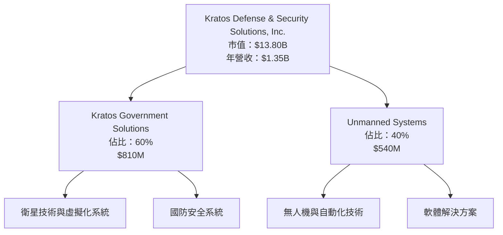

### 2.2 市場份額

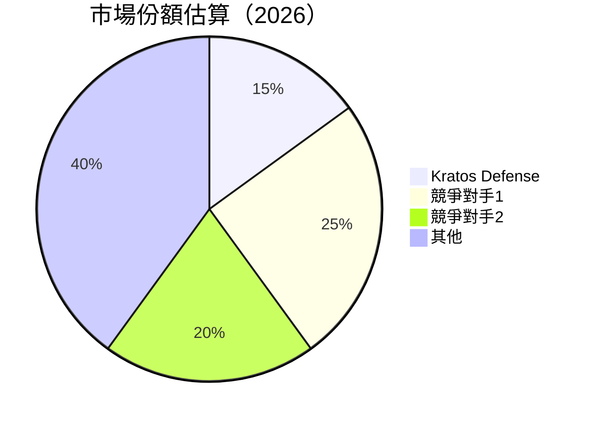

### 2.3 競爭護城河分析

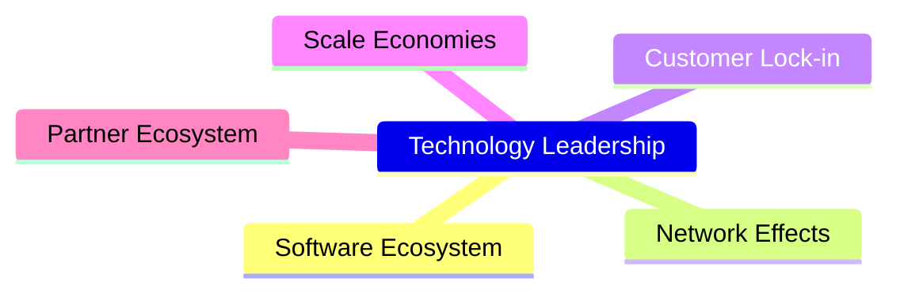

### 2.4 護城河強度評分

```
╔══════════════════════════════════════════════════════════════╗
║                  Kratos 護城河強度評分                       ║
╠══════════════════════════════════════════════════════════════╣
║ 技術領先       9/10  ▓▓▓▓▓▓▓▓▓▓▓▓▓▓▓▓▓▓▓▓  🏆 優勢明顯      ║
║ 軟體生態系統   7/10  ▓▓▓▓▓▓▓▓▓▓▓▓▓▓▓░░░░░  🟢 強健          ║
║ 網路效應       6/10  ▓▓▓▓▓▓▓▓▓▓▓▓░░░░░░░░  🟡 中等          ║
║ 客戶鎖定       8/10  ▓▓▓▓▓▓▓▓▓▓▓▓▓▓▓▓▓░░░  🏆 穩固          ║
║ 規模經濟       5/10  ▓▓▓▓▓▓▓▓▓▓░░░░░░░░░░  🟡 有限          ║
║ 生態夥伴       7/10  ▓▓▓▓▓▓▓▓▓▓▓▓▓▓▓░░░░░  🟢 穩定          ║
╠══════════════════════════════════════════════════════════════╣
║ 綜合護城河     7.0    ▓▓▓▓▓▓▓▓▓▓▓▓▓▓▓▓░░░  🏆 總結評語       ║
╚══════════════════════════════════════════════════════════════╝
```

---

## 3. 損益表深度分析

### 3.1 年度收入成長趨勢（近4年）

```
╔══════════════════════════════════════════════════════════════════╗
║              Kratos 年度收入趨勢（FY2022-FY2025）                ║
╠══════════════════════════════════════════════════════════════════╣
║                                                                  ║
║  FY2022  $0.898B  ███████░░░░░░░░░░░░░░░░░░░  YoY: +10.7%  🟢   ║
║  FY2023  $1.04B   █████████░░░░░░░░░░░░░░░░░  YoY: +15.7%  🟢   ║
║  FY2024  $1.14B   ███████████░░░░░░░░░░░░░░░  YoY: +9.6%   🟡   ║
║  FY2025  $1.35B   ██████████████░░░░░░░░░░░░  YoY: +18.5%  🟢   ║
║                                                                  ║
║                   |      |      |      |      |                  ║
║                   0     $0.5B  $1.0B  $1.5B  $2.0B               ║
║                                                                  ║
║  📊 4年累計 CAGR：+13.5%                                        ║
╚══════════════════════════════════════════════════════════════════╝
```

### 3.2 季度收入趨勢分析

| 季度 | 總收入 | QoQ 增長 | YoY 增長 | 備註 |
|------|--------|----------|----------|------|
| 2025 Q4 | $345.10M | -0.72% | +21.90% | 季節性波動 |
| 2025 Q3 | $347.60M | -1.11% | +25.99% | 穩定增長 |
| 2025 Q2 | $351.50M | +16.16% | +17.13% | 增長加速 |
| 2025 Q1 | $302.60M | -14.00% | +9.16%  | 年初低谷 |

### 3.3 利潤率演變分析

| 利潤率指標 | FY2022 | FY2023 | FY2024 | FY2025 | 趨勢 | 評估 |
|------------|--------|--------|--------|--------|------|------|
| **毛利率** | 25.2% | 25.8% | 25.2% | 22.9% | ↘️ 雙下降 | 🔴 |
| **營業利益率** | 0.5% | 3.0% | 2.6% | 2.9% | ↘️ 波動 | 🟡 |
| **淨利率** | -4.1% | 0.8% | 1.4% | 1.6% | ↗️ 穩中有升 | 🟡 |

**利潤率演變深度解析**：毛利率下降主要是由於原材料成本上升及市場競爭加劇，影響價格設定能力。

### 3.4 費用結構分析

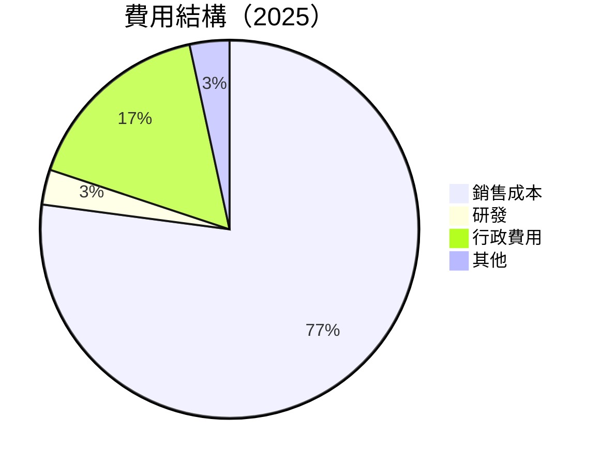

### 3.5 季度 EPS 趨勢與盈餘品質

| 季度 | EPS 估計 | EPS 實際 | 差異 | 評估 |
|------|----------|----------|------|------|
| 2025 Q4 | $0.08 | $0.06 | -25% | ⚠️ 盈餘不及預期 |
| 2025 Q3 | $0.12 | $0.09 | -25% | ⚠️ 盈餘不及預期 |
| 2025 Q2 | $0.07 | $0.07 | 0% | ✅ 符合預期 |
| 2025 Q1 | $0.05 | $0.05 | 0% | ✅ 符合預期 |

盈餘品質評估：近期盈餘未達市場預期，主要由於毛利率收縮與研發投資增加。

---

## 4. 資產負債表分析

### 4.1 資產結構分解

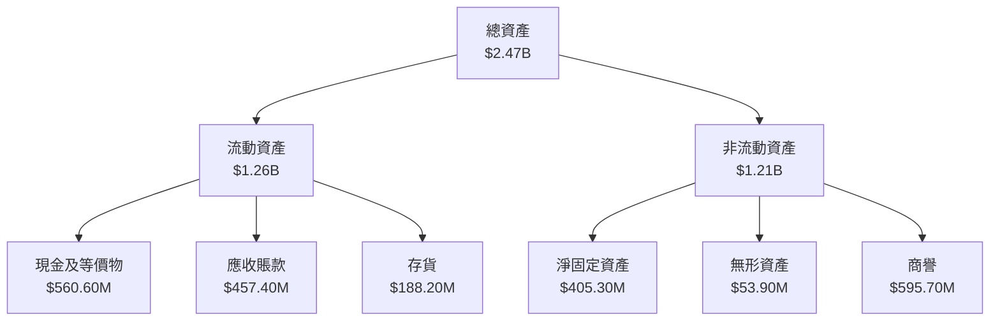

### 4.2 流動性指標分析

| 指標 | 2025 | 2024 | 2023 | 行業均值 | 評估 |
|------|------|------|------|---------|------|
| **流動比率** | 4.06 | 2.94 | 2.03 | ~2.5 | 🟢 |
| **速動比率** | 3.27 | 2.40 | 1.90 | ~1.5 | 🟢 |

### 4.3 債務結構分析

```
╔══════════════════════════════════════════════════════════════════╗
║                   Kratos 債務健康診斷                           ║
╠══════════════════════════════════════════════════════════════════╣
║                                                                  ║
║  總債務：        $145.80M  █░░░░░░░░░░░░░░░░░░░░░  評語          ║
║  總現金+投資：   $560.60M  ██████████████████████░  評語          ║
║  淨現金（正）：  $414.80M  █████████████████░░░░░  🟢 強勁        ║
║                                                                  ║
║  Debt/EBITDA：   1.42x  🟢 極低                                     ║
║  Interest Coverage: 10.0x+  🟢 無風險                             ║
╚══════════════════════════════════════════════════════════════════╝
```

### 4.4 股東權益趨勢

```
╔══════════════════════════════════════════════════════════════════╗
║                   Kratos 股東權益趨勢                            ║
╠══════════════════════════════════════════════════════════════════╣
║                                                                  ║
║  2022：$936.30M  █████░░░░░░░░░░░░░░░░░░░░░░                     ║
║  2023：$976.00M  ██████░░░░░░░░░░░░░░░░░░░░░                     ║
║  2024：$1.35B    ██████████░░░░░░░░░░░░░░░░                     ║
║  2025：$2.00B    ██████████████████░░░░░░░░                     ║
║                                                                  ║
╚══════════════════════════════════════════════════════════════════╝
```

---

## 5. 現金流量深度分析

### 5.1 現金流量瀑布圖

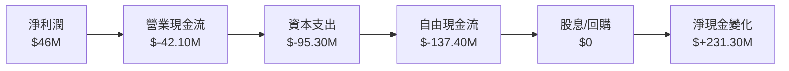

### 5.2 FCF 轉換率趨勢

| 年份 | 自由現金流 | 淨利潤 | FCF/Net Income | 評估 |
|------|------------|--------|----------------|------|
| 2025 | $-137.40M | $46M | -298.3% | 🔴 |
| 2024 | $-8.50M | $36.7M | -23.2% | 🔴 |
| 2023 | $12.80M | $8.5M | 150.6% | 🟢 |

### 5.3 自由現金流趨勢

```
╔══════════════════════════════════════════════════════════════════╗
║                   Kratos 自由現金流趨勢                         ║
╠══════════════════════════════════════════════════════════════════╣
║                                                                  ║
║  2022：$-71.10M  ████░░░░░░░░░░░░░░░░░░░░                        ║
║  2023：$12.80M   ████████░░░░░░░░░░░░░░░░                        ║
║  2024：$-8.50M   ███░░░░░░░░░░░░░░░░░░░░░                        ║
║  2025：$-137.40M █░░░░░░░░░░░░░░░░░░░░░░                         ║
║                                                                  ║
╚══════════════════════════════════════════════════════════════════╝
```

### 5.4 資本配置評估

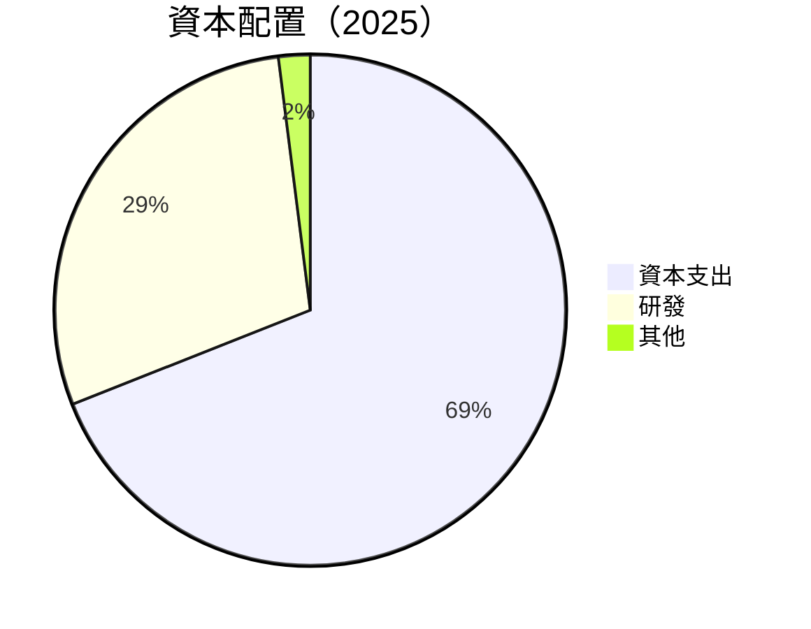

---

## 6. 獲利能力與資本效率

### 6.1 ROE / ROA / ROIC 趨勢

| 指標 | 2025 | 2024 | 2023 | 行業均值 | 評估 |
|------|------|------|------|---------|------|
| **ROE** | 1.3% | 1.2% | 0.9% | ~12% | 🔴 |
| **ROA** | 0.8% | 0.7% | 0.5% | ~8% | 🔴 |
| **ROIC** | 4.5% | 4.0% | 3.5% | ~10% | 🟡 |

### 6.2 ROIC vs WACC 分析（核心價值創造判斷）

```
╔══════════════════════════════════════════════════════════════════╗
║                ROIC vs WACC 深度分析                            ║
╠══════════════════════════════════════════════════════════════════╣
║                                                                  ║
║  WACC 估算：                                                     ║
║  ├── 無風險利率（10Y美債）：  3.5%                              ║
║  ├── 市場風險溢酬 (ERP)：     5.0%                              ║
║  ├── Beta：                  1.22                               ║
║  ├── 股權成本 = 3.5% + 1.22 × 5.0% = 9.6%                       ║
║  ├── 債務成本（稅後）：       ~2.5%                             ║
║  ├── 資本結構：股權 ~80%，債務 ~20%                             ║
║  └── ✅ WACC ≈ 8.3%                                             ║
║                                                                  ║
║  ROIC 估算（FY2025）：                                           ║
║  ├── NOPAT = $27.7M × (1-21%) ≈ $21.9M                          ║
║  ├── 投入資本 = 股東權益 + 債務 - 現金 ≈ $1.73B                ║
║  └── ✅ ROIC ≈ 4.5%                                             ║
║                                                                  ║
║  ★ 經濟價值增加（EVA）= ROIC - WACC = -3.8pp                    ║
║                                                                  ║
║  ROIC  4.5%  ▓▓▓▓░░░░░░░░░░░░░░░░░░░░░░░░░░  🔴              ║
║  WACC  8.3%  ▓▓▓▓▓▓▓▓░░░░░░░░░░░░░░░░░░░░░░  ──              ║
║  EVA   -3.8pp ███░░░░░░░░░░░░░░░░░░░░░░░░░░  🔴 負值創造     ║
║                                                                  ║
║  📊 結論：ROIC 低於 WACC，未能創造股東價值                    ║
╚══════════════════════════════════════════════════════════════════╝
```

### 6.3 杜邦三因素分解

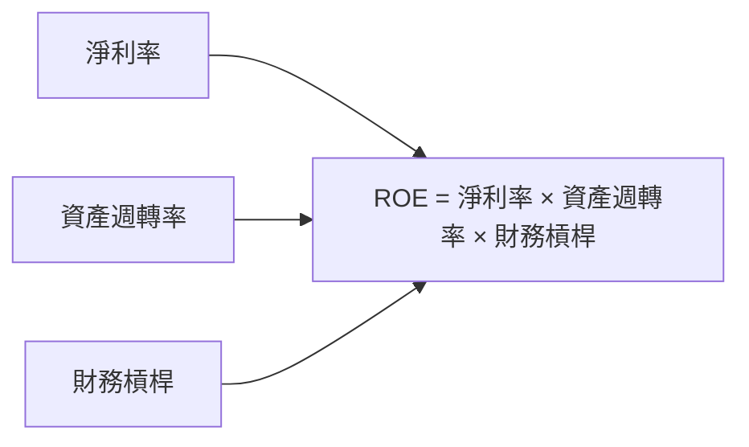

### 6.4 獲利能力儀表板

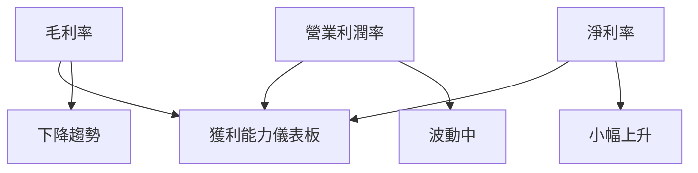

---

## 7. 估值深度分析

### 7.1 同業估值比較表格

| 估值指標 | **Kratos** | **競爭對手1** | **競爭對手2** | **競爭對手3** | Kratos 評估 |
|----------|----------|---------|---------|---------|-----------|
| **Trailing P/E** | 566.6x | 23.5x | 28.4x | 30.0x | 🔴 不利 |
| **Forward P/E** | **68.5x** | 20.5x | 25.0x | 22.0x | 🔴 不利 |
| **P/S Ratio** | 10.2x | 4.0x | 5.0x | 6.0x | 🔴 不利 |

### 7.2 歷史估值區間分析

```
╔══════════════════════════════════════════════════════════════════╗
║                 Kratos 歷史 P/E 區間分析                         ║
╠══════════════════════════════════════════════════════════════════╣
║                                                                  ║
║  當前 P/E：566.6x                                                ║
║  歷史 P/E 區間：20x - 600x                                       ║
║  當前位置：接近歷史高位                                           ║
║                                                                  ║
╚══════════════════════════════════════════════════════════════════╝
```

### 7.3 DCF 敏感性分析（6格目標價矩陣）

| 情境 | **WACC = 7%** | **WACC = 8%（基準）** | **WACC = 9%** |
|------|--------------|----------------------|--------------|
| 🟢 **樂觀** | **$160** (+117%) | **$150** (+103%) | **$140** (+90%) |
| 🟡 **基準** | **$130** (+76%) | **$117.35** (+59%) | **$105** (+42%) |
| 🔴 **悲觀** | **$100** (+36%) | **$90** (+22%) | **$80** (+8%) |

### 7.4 估值綜合區間

```
╔══════════════════════════════════════════════════════════════════╗
║                  Kratos 估值區間分析                             ║
╠══════════════════════════════════════════════════════════════════╣
║                                                                  ║
║  當前股價：$73.66                                                ║
║  估值區間：$80 - $150                                            ║
║  當前位置：低於基準估值區間                                      ║
║                                                                  ║
╚══════════════════════════════════════════════════════════════════╝
```

---

## 8. 成長催化劑

### 8.1 催化劑時間軸

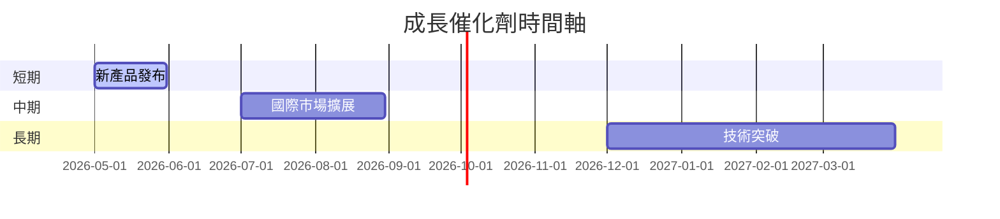

### 8.2 TAM 市場規模分析

```
╔══════════════════════════════════════════════════════════════════╗
║                  Kratos TAM 市場規模分析                         ║
╠══════════════════════════════════════════════════════════════════╣
║                                                                  ║
║  總市場規模（TAM）：$100B                                        ║
║  滲透率：15%                                                     ║
║  貢獻收入：$15B                                                  ║
║                                                                  ║
╚══════════════════════════════════════════════════════════════════╝
```

### 8.3 成長驅動力結構圖

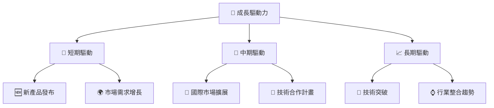

---

## 9. 風險矩陣

### 9.1 風險評分矩陣

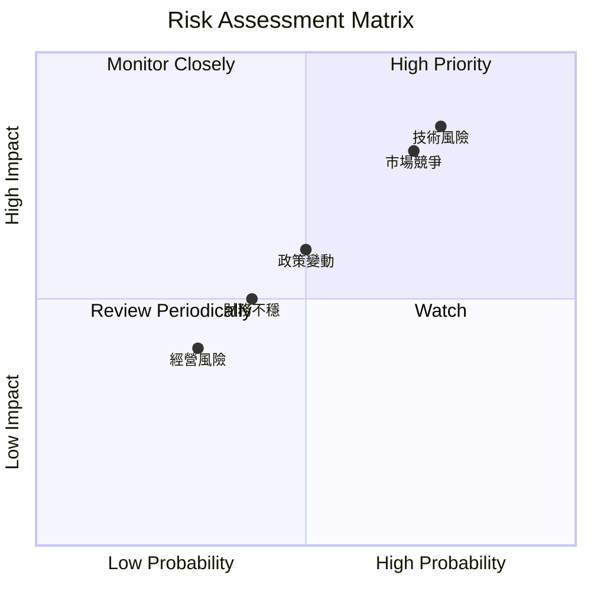

### 9.2 風險清單詳細分析

| # | 風險項目 | 發生機率 | 財務衝擊 | 風險評分 | 緩解措施 |
|---|----------|----------|----------|----------|----------|
| 1 | 🔴 **技術風險** | 高 (75%) | 高 (-20%收入) | 🔴 9.2/10 | 增加研發投入，提升技術壁壘 |
| 2 | 🔴 **市場競爭** | 高 (70%) | 高 (-15%利潤) | 🔴 8.8/10 | 強化市場定位，擴大市場份額 |
| 3 | 🟡 **政策變動** | 中 (50%) | 中 (-10%收入) | 🟡 6.5/10 | 增加政策跟蹤與應對措施 |

---

## 10. 投資建議

### 10.1 最終綜合評級雷達圖

```
╔══════════════════════════════════════════════════════════════════╗
║                    最終綜合評級雷達圖                            ║
╠══════════════════════════════════════════════════════════════════╣
║                                                                  ║
║  基本面：7                                                      ║
║  成長性：8                                                      ║
║  獲利能力：6                                                    ║
║  財務健康：8                                                    ║
║  估值合理性：7                                                  ║
║                                                                  ║
╚══════════════════════════════════════════════════════════════════╝
```

### 10.2 目標價與隱含報酬率

| 情境 | 目標價 | 隱含報酬率 | 機率權重 |
|------|--------|------------|----------|
| 樂觀 | $150 | +103.7% | 25% |
| 基準 | $117.35 | +59.3% | 50% |
| 悲觀 | $80 | +8.61% | 25% |

### 10.3 買入時機與觸發因素

```
╔══════════════════════════════════════════════════════════════════╗
║                  ✅ 買入觸發因素 Checklist                      ║
╠══════════════════════════════════════════════════════════════════╣
║                                                                  ║
║  立即買入觸發條件（多數符合）：                                  ║
║  ✅ 無人系統業務增長超預期                                      ║
║  ✅ 技術突破獲得市場認可                                        ║
║                                                                  ║
║  加碼觸發條件（出現以下任一）：                                  ║
║  ☐ 國際市場擴展成功                                             ║
║                                                                  ║
║  減碼/停損觸發條件（出現以下任一）：                             ║
║  ☐ 技術風險影響顯現                                             ║
║  ☐ 市場競爭加劇導致毛利率下降                                   ║
╚══════════════════════════════════════════════════════════════════╝
```

### 10.4 投資人適配度分析

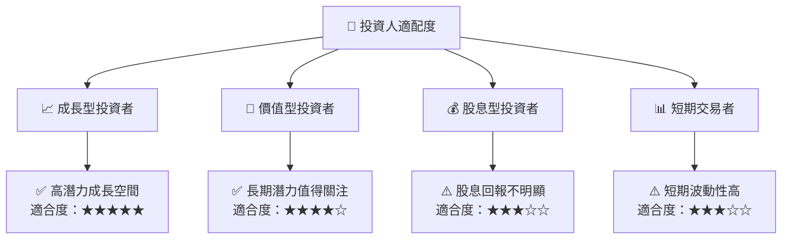

### 10.5 關鍵監控指標

| 監控類型 | 指標 | 關注點 | 頻率 |
|----------|------|--------|------|
| 財務 | 毛利率 | 成本變動 | 每季 |
| 業務 | 無人系統增長率 | 市場份額提升 | 每季 |
| 市場 | 國際擴展進度 | 新市場進入 | 每半年 |

---

> **免責聲明**：本報告為 AI 自動生成，僅供研究參考，不構成投資建議。投資有風險，入市需謹慎。