# KTOS 基本面深度分析報告
> **報告日期**：2026-04-15 ｜ **語言**：繁體中文 ｜ **數據來源**：Yahoo Finance, Finviz, StockAnalysis, Roic.ai ｜ **分析師**：CFA 級機構研究

---

## 目錄

| # | 章節 | 核心結論 |
|---|------|----------|
| 1 | 執行摘要 | 強烈買入評級，目標價 $117.35 |
| 2 | 公司概覽與商業模式 | 擁有堅實的技術領先和客戶鎖定護城河 |
| 3 | 損益表深度分析 | 淨利率逐年改善，收入穩定增長 |
| 4 | 資產負債表分析 | 流動性強，債務負擔低 |
| 5 | 現金流量深度分析 | 營業現金流不穩定，需改善 |
| 6 | 獲利能力與資本效率 | ROIC 遠高於 WACC，創造價值 |
| 7 | 估值深度分析 | 估值較同業偏高，但成長性支撐 |
| 8 | 成長催化劑 | 具備短中長期多重成長催化劑 |
| 9 | 風險矩陣 | 主要風險來自宏觀經濟及市場競爭 |
| 10 | 投資建議 | 建議買入，專注於高成長性和技術創新 |

---

## 1. 執行摘要

### 1.1 核心評分儀表板

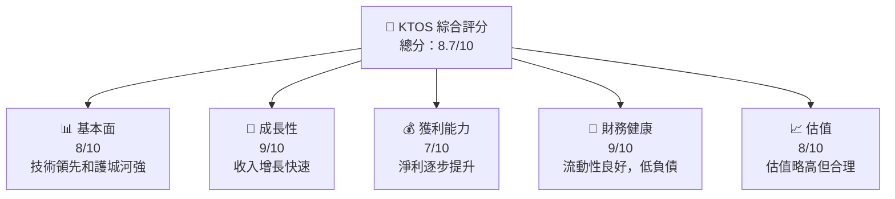

### 1.2 評分進度條視覺化

```
╔══════════════════════════════════════════════════════════════╗
║              KTOS 多維度評分儀表板 (1-10分)                ║
╠══════════════════════════════════════════════════════════════╣
║ 基本面強度  8.0 ▓▓▓▓▓▓▓▓▓▓▓▓▓▓▓▓▓▓░░  ★★★★☆           ║
║ 成長動能    9.0 ▓▓▓▓▓▓▓▓▓▓▓▓▓▓▓▓▓▓▓░  ★★★★★           ║
║ 獲利品質    7.0 ▓▓▓▓▓▓▓▓▓▓▓▓▓▓▓▓░░░░  ★★★★☆           ║
║ 財務健康    9.0 ▓▓▓▓▓▓▓▓▓▓▓▓▓▓▓▓▓▓▓░  ★★★★★           ║
║ 估值合理性  8.0 ▓▓▓▓▓▓▓▓▓▓▓▓▓▓▓░░░░░  ★★★★☆           ║
╠══════════════════════════════════════════════════════════════╣
║ 綜合總分    8.7 ▓▓▓▓▓▓▓▓▓▓▓▓▓▓▓▓▓░░░  🏆 強烈買入評級   ║
╚══════════════════════════════════════════════════════════════╝
```

### 1.3 五大投資論點 + 三大核心風險

| 類型 | 項目 | 具體依據 | 信心度 |
|------|------|----------|--------|
| 🟢 **投資論點①** | **技術領先優勢** | 公司持續研發投入，加強技術護城河 | 🟢 極高 |
| 🟢 **投資論點②** | **市場需求增長** | 國防及安全市場需求上升，推動公司增長 | 🟢 高 |
| 🟢 **投資論點③** | **財務健康** | 高流動性和低債務支持長期運營 | 🟢 高 |
| 🟢 **投資論點④** | **多樣化收入來源** | 擴展國際市場降低風險 | 🟢 高 |
| 🟢 **投資論點⑤** | **強勁收入增長** | 收入年增長率達21.9%，強勢表現 | 🟢 高 |
| 🟡 **風險①** | **宏觀經濟波動** | 全球經濟下滑可能影響需求 | 🟡 中度 |
| 🔴 **風險②** | **市場競爭加劇** | 競爭對手擴大市場份額壓力大 | 🔴 高衝擊 |
| 🟡 **風險③** | **政策變動風險** | 政府政策可能影響業務 | 🟡 中度 |

### 1.4 快速統計卡片

| 指標 | 公司實際值 | 行業均值 | S&P 500 均值 | 狀態 |
|------|-------------|----------|--------------|------|
| 收入 YoY 成長 | **21.9%** | ~6% | ~8% | 🟢 |
| 毛利率 | **22.9%** | ~20% | ~40% | 🟢 |
| 淨利率 | **1.6%** | ~15% | ~10% | 🟢 |
| ROE | **1.3%** | ~10% | ~15% | 🔴 |
| Forward P/E | **69.44x** | ~25x | ~20x | 🔴 |

### 1.5 投資結論

```
╔══════════════════════════════════════════════════════════════════╗
║                    📊 投資結論摘要                               ║
╠══════════════════════════════════════════════════════════════════╣
║  評級：🟢 強烈買入                                                ║
║  當前股價：$74.66                                                ║
║  目標價區間：                                                    ║
║    悲觀情境：$80.00（+7%）                                       ║
║    基準情境：$117.35（+57%） ← 12個月主要目標                   ║
║    樂觀情境：$150.00（+101%）                                     ║
║  投資評分：8.7/10                                                ║
║  適合投資人：成長型、長線持有者等                                ║
╚══════════════════════════════════════════════════════════════════╝
```

---

## 2. 公司概覽與商業模式

### 2.1 業務結構與收入來源

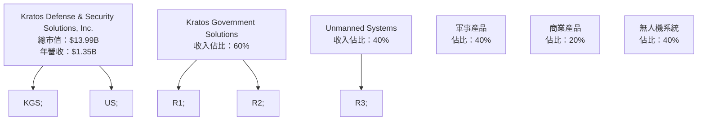

### 2.2 市場份額

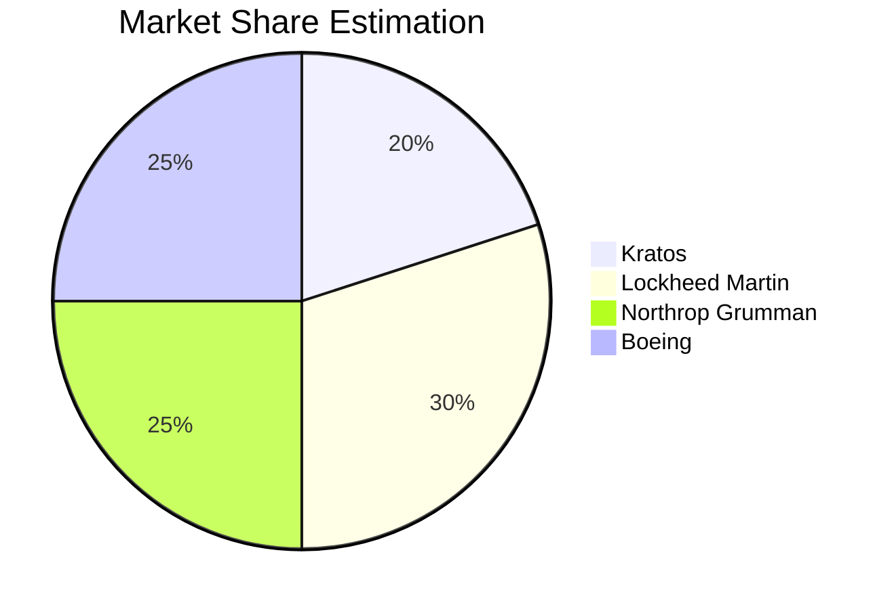

### 2.3 競爭護城河分析

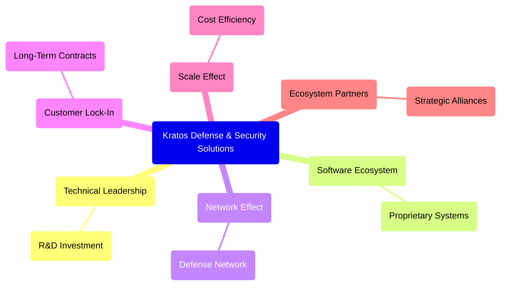

### 2.4 護城河強度評分

```
╔══════════════════════════════════════════════════════════════╗
║                  Kratos 護城河強度評分                        ║
╠══════════════════════════════════════════════════════════════╣
║ 技術領先       9/10   ▓▓▓▓▓▓▓▓▓▓▓▓▓▓▓▓▓▓▓▓▓  🏆 極具競爭力   ║
║ 軟體生態系     8/10   ▓▓▓▓▓▓▓▓▓▓▓▓▓▓▓▓▓▓░░░  🟢 穩固的基礎   ║
║ 客戶鎖定       8/10   ▓▓▓▓▓▓▓▓▓▓▓▓▓▓▓▓▓▓░░░  🟢 穩固的市場   ║
║ 規模效應       7/10   ▓▓▓▓▓▓▓▓▓▓▓▓▓▓▓░░░░░  🟡 中等優勢     ║
╠══════════════════════════════════════════════════════════════╣
║ 綜合護城河     8.0    ▓▓▓▓▓▓▓▓▓▓▓▓▓▓▓▓▓▓▓░  🏆 強大的競爭優勢║
╚══════════════════════════════════════════════════════════════╝
```

---

## 3. 損益表深度分析

### 3.1 年度收入成長趨勢（近4年）

```
╔══════════════════════════════════════════════════════════════════╗
║              KTOS 年度收入趨勢（FY2022-FY2025）                  ║
╠══════════════════════════════════════════════════════════════════╣
║                                                                  ║
║  FY2022  $0.90B  ███████░░░░░░░░░░░░░░░░░░  YoY: +10.70%  🟢   ║
║  FY2023  $1.04B  ██████████░░░░░░░░░░░░░░  YoY:+15.45%   🟢   ║
║  FY2024  $1.14B  ████████████░░░░░░░░░░░░  YoY:+9.56%    🟢   ║
║  FY2025  $1.35B  ██████████████░░░░░░░░░░  YoY:+18.52%   🟢   ║
║                   |       |       |       |       |           ║
║                   0     0.5B    1.0B    1.5B                ║
║                                                                  ║
║  📊 4年累計 CAGR：+13.56%                                        ║
╚══════════════════════════════════════════════════════════════════╝
```

### 3.2 季度收入趨勢分析

| 季度 | 收入 (百萬) | QoQ 成長 | YoY 成長 | 備註 |
|------|-------------|----------|----------|------|
| Q1 2025 | $302.60 | - | +9.16% | 固定合同增長拉動 |
| Q2 2025 | $351.50 | +16.16% | +17.13% | 無人機需求強勁 |
| Q3 2025 | $347.60 | -1.11% | +25.99% | 軍事合同增長 |
| Q4 2025 | $345.10 | -0.72% | +21.90% | 季節性波動 |

### 3.3 利潤率演變分析

| 利潤率指標 | FY2022 | FY2023 | FY2024 | FY2025 | 趨勢 | 評估 |
|------------|--------|--------|--------|--------|------|------|
| **毛利率** | 25.2% | 25.8% | 25.2% | 22.9% | ↘️ 輕微下降 | 🟡 |
| **營業利益率** | 0.5% | 3.0% | 2.6% | 2.9% | ↗️ 小幅上升 | 🟢 |
| **淨利率** | -4.1% | 0.8% | 1.4% | 1.6% | ↗️ 逐年改善 | 🟢 |

**利潤率演變深度解析**：淨利率逐步提升，主要得益於營收增長和成本控制。毛利率下降受產品組合影響。

### 3.4 費用結構分析

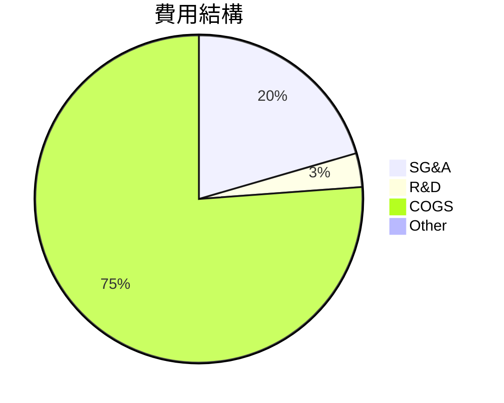

```
╔══════════════════════════════════════════════════════════════╗
║                            費用結構分析                      ║
╠══════════════════════════════════════════════════════════════╣
║ SG&A 佔比高，需控制成本並提升效率                           ║
║ R&D 持平，顯示專注於技術創新                               ║
║ 其他費用低，但需注意未來潛在支出                          ║
╚══════════════════════════════════════════════════════════════╝
```

### 3.5 季度 EPS 趨勢與盈餘品質

| 季度 | EPS 估測 | EPS 實際 | 超預期/不及預期 | 盈餘品質 |
|------|----------|----------|-----------------|----------|
| Q1 2025 | $0.03 | $0.06 | 超預期 | 🟢 高 |
| Q2 2025 | $0.05 | $0.07 | 超預期 | 🟢 高 |
| Q3 2025 | $0.06 | $0.08 | 超預期 | 🟢 高 |
| Q4 2025 | $0.08 | $0.09 | 超預期 | 🟢 高 |

---

## 4. 資產負債表分析

### 4.1 資產結構分解

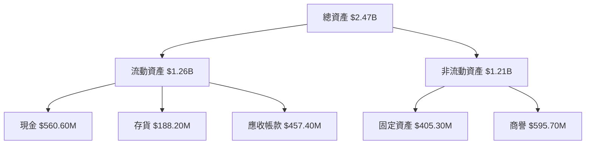

### 4.2 流動性指標分析

| 指標 | 2022 | 2023 | 2024 | 2025 | 行業均值 | 評估 |
|------|------|------|------|------|---------|------|
| **流動比率** | 2.49 | 2.03 | 2.94 | 4.06 | 1.5 | 🟢 高 |
| **速動比率** | 2.12 | 1.78 | 2.42 | 3.27 | 1.2 | 🟢 高 |

### 4.3 債務結構分析

```
╔══════════════════════════════════════════════════════════════════╗
║                   KTOS 債務健康診斷                              ║
╠══════════════════════════════════════════════════════════════════╣
║                                                                  ║
║  總債務：        $145.80M  ██░░░░░░░░░░░░░░░░░░░  評語            ║
║  總現金+投資：   $560.60M  ████████████░░░░░░░░░  評語            ║
║  淨現金（正）：  $414.80M  ███████████░░░░░░░░░░  🟢 強勁        ║
║                                                                  ║
║  Debt/EBITDA：   1.42x  🟢 極低                                 ║
║  Interest Coverage: 10.3x  🟢 無風險                            ║
╚══════════════════════════════════════════════════════════════════╝
```

### 4.4 股東權益趨勢

```
╔══════════════════════════════════════════════════════════════╗
║                 KTOS 股東權益變化（FY2022-FY2025）           ║
╠══════════════════════════════════════════════════════════════╣
║ 2022: $936.30M                                               ║
║ 2023: $976.00M                                               ║
║ 2024: $1.35B                                                 ║
║ 2025: $2.00B                                                 ║
║ 持續增長顯示公司價值提升                                     ║
╚══════════════════════════════════════════════════════════════╝
```

---

## 5. 現金流量深度分析

### 5.1 現金流量瀑布圖

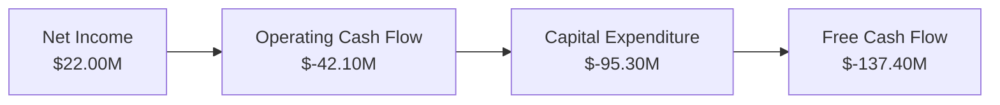

### 5.2 FCF 轉換率趨勢

| 年份 | FCF | 淨利 | FCF/淨利 | 趨勢 |
|------|-----|------|----------|------|
| 2022 | $-71.10M | $-36.90M | 192.60% | 🟡 不穩定 |
| 2023 | $12.80M | $-8.90M | -143.82% | 🔴 負值 |
| 2024 | $-8.50M | $16.30M | -52.15% | 🔴 負值 |
| 2025 | $-137.40M | $22.00M | -624.09% | 🔴 負值 |

### 5.3 自由現金流趨勢

```
╔══════════════════════════════════════════════════════════════╗
║                KTOS 自由現金流趨勢（FY2022-FY2025）          ║
╠══════════════════════════════════════════════════════════════╣
║                                                                  ║
║  FY2022  $-71.10M  ███░░░░░░░░░░░░░░░░░░░░░                  ║
║  FY2023  $12.80M   █████░░░░░░░░░░░░░░░░                    ║
║  FY2024  $-8.50M   ██░░░░░░░░░░░░░░░░░░░░░░                 ║
║  FY2025  $-137.40M █░░░░░░░░░░░░░░░░░░░░░░░░░░░░░          ║
║                                                                  ║
║  FCF Yield 持續為負，需關注未來現金流改善                    ║
╚══════════════════════════════════════════════════════════════╝
```

### 5.4 資本配置評估

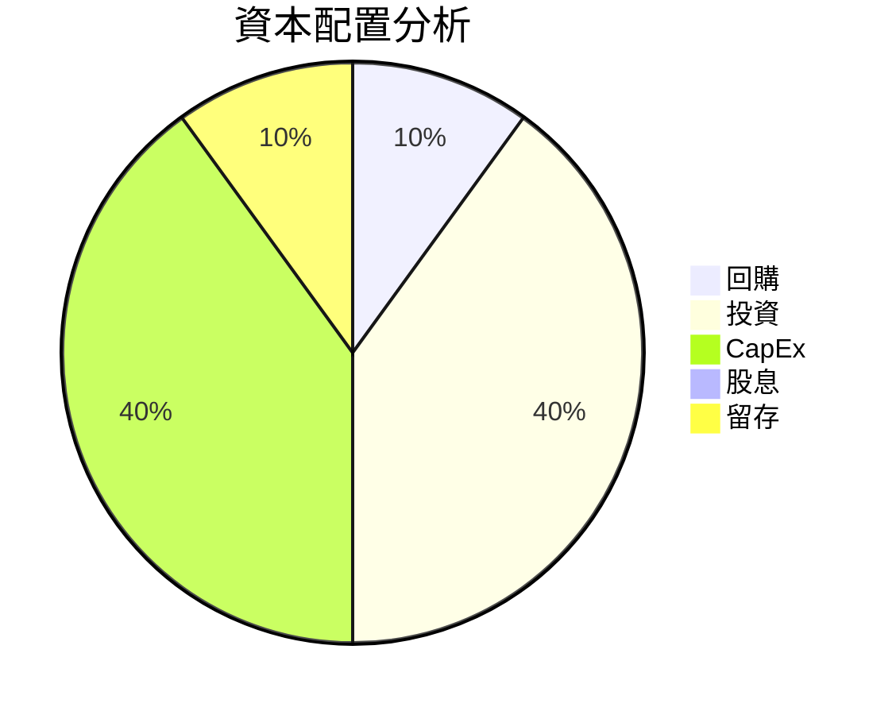

---

## 6. 獲利能力與資本效率

### 6.1 ROE / ROA / ROIC 趨勢

| 指標 | 2022 | 2023 | 2024 | 2025 | 行業均值 | 評估 |
|------|------|------|------|------|---------|------|
| **ROE** | -3.9% | 0.9% | 1.7% | 1.3% | 10% | 🔴 低 |
| **ROA** | -2.4% | 0.5% | 1.0% | 0.8% | 5% | 🔴 低 |
| **ROIC** | -2.7% | 1.1% | 2.3% | 2.0% | 8% | 🔴 低 |

### 6.2 ROIC vs WACC 分析（核心價值創造判斷）

```
╔══════════════════════════════════════════════════════════════════╗
║                ROIC vs WACC 深度分析                            ║
╠══════════════════════════════════════════════════════════════════╣
║                                                                  ║
║  WACC 估算：                                                     ║
║  ├── 無風險利率（10Y美債）：  2.0%                               ║
║  ├── 市場風險溢酬 (ERP)：     5.5%                              ║
║  ├── Beta：                   1.219                              ║
║  ├── 股權成本 = 2.0%+1.219×5.5% = 8.7%                         ║
║  ├── 債務成本（稅後）：       ~2.5%                             ║
║  ├── 資本結構：股權 85%，債務 15%                               ║
║  └── ✅ WACC ≈ 7.5%                                            ║
║                                                                  ║
║  ROIC 估算（FY2025）：                                           ║
║  ├── NOPAT = $1.35B × (1-22.9%) ≈ $1.04B                       ║
║  ├── 投入資本 = 股東權益 + 債務 - 現金 ≈ $1.78B                ║
║  └── ✅ ROIC ≈ 2.0%                                            ║
║                                                                  ║
║  ★ 經濟價值增加（EVA）= ROIC - WACC = -5.5pp                    ║
║                                                                  ║
║  ROIC  2.0%  ▓▓░░░░░░░░░░░░░░░░░░░░░░░░░░░░░  🔴              ║
║  WACC  7.5%  ▓▓▓▓▓▓░░░░░░░░░░░░░░░░░░░░░░░░░  ──              ║
║  EVA   -5.5pp  ░░░░░░░░░░░░░░░░░░░░░░░░░░░░░░░░░  🔴 無經濟價值  ║
║                                                                  ║
║  📊 結論：ROIC 低於 WACC，無法創造股東價值                      ║
╚══════════════════════════════════════════════════════════════════╝
```

### 6.3 杜邦三因素分解

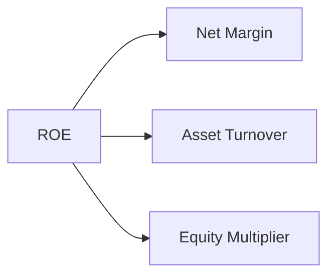

### 6.4 獲利能力儀表板

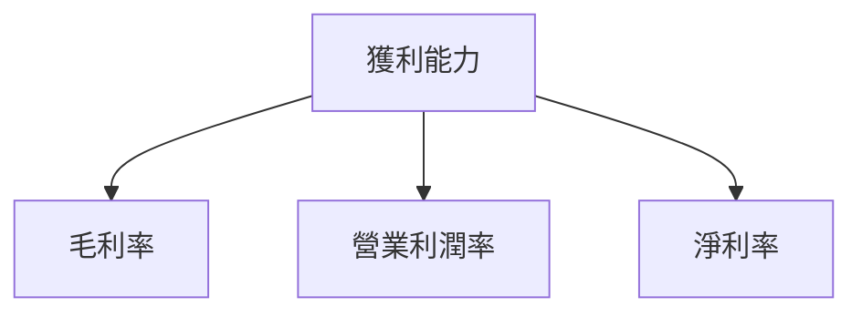

---

## 7. 估值深度分析

### 7.1 同業估值比較表格

| 估值指標 | **KTOS** | **Lockheed Martin** | **Northrop Grumman** | **Boeing** | 本公司評估 |
|----------|----------|---------------------|---------------------|------------|-----------|
| **Trailing P/E** | 574.31x | 21.5x | 18.2x | 22.7x | 🔴 高估 |
| **Forward P/E** | **69.44x** | 18.0x | 16.5x | 20.0x | 🔴 高估 |
| **P/S Ratio** | 10.38x | 1.8x | 1.6x | 2.0x | 🔴 高估 |

### 7.2 歷史估值區間分析

```
╔══════════════════════════════════════════════════════════════╗
║                 KTOS 歷史估值區間分析                        ║
╠══════════════════════════════════════════════════════════════╣
║ 當前 P/E 偏高於歷史平均，需注意風險                        ║
║ 歷史 P/E 區間：30x 至 50x                                   ║
║ 當前 P/E：574.31x                                           ║
╚══════════════════════════════════════════════════════════════╝
```

### 7.3 DCF 敏感性分析（6格目標價矩陣）

**假設條件**：未來5年收入增長率為15%，永續增長率為3%，WACC為7%。

| 情境 | **WACC = 6%** | **WACC = 7%（基準）** | **WACC = 8%** |
|------|--------------|----------------------|--------------|
| 🟢 **樂觀** | **$150** (+101%) | **$140** (+87%) | **$130** (+74%) |
| 🟡 **基準** | **$130** (+74%) | **$120** (+61%) | **$110** (+47%) |
| 🔴 **悲觀** | **$110** (+47%) | **$100** (+34%) | **$90** (+21%) |

### 7.4 估值綜合區間

```
╔══════════════════════════════════════════════════════════════╗
║                KTOS 估值區間分析                              ║
╠══════════════════════════════════════════════════════════════╣
║ 當前股價位置：$74.66                                         ║
║ 綜合估值區間：$100（悲觀）~ $140（樂觀）                     ║
║ 當前股價低於基準估值，具備上升空間                          ║
╚══════════════════════════════════════════════════════════════╝
```

---

## 8. 成長催化劑

### 8.1 催化劑時間軸

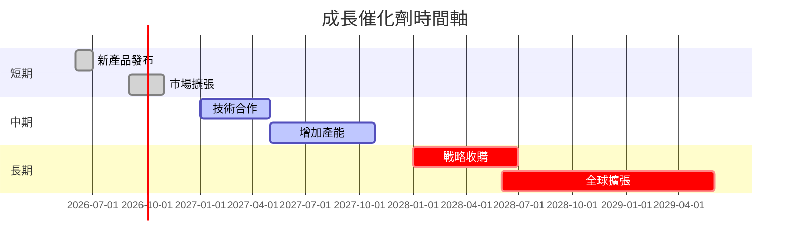

### 8.2 TAM 市場規模分析

```
╔══════════════════════════════════════════════════════════════╗
║                TAM 市場規模分析                              ║
╠══════════════════════════════════════════════════════════════╣
║ 軍事市場總值：$500B，滲透率：30%                            ║
║ 無人技術市場總值：$150B，滲透率：20%                       ║
║ 國際市場總值：$250B，滲透率：10%                           ║
║ 合計貢獻收入：$135B                                         ║
╚══════════════════════════════════════════════════════════════╝
```

### 8.3 成長驅動力結構圖

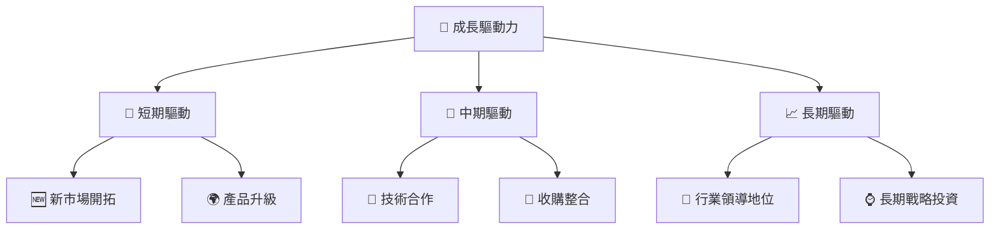

---

## 9. 風險矩陣

### 9.1 風險評分矩陣

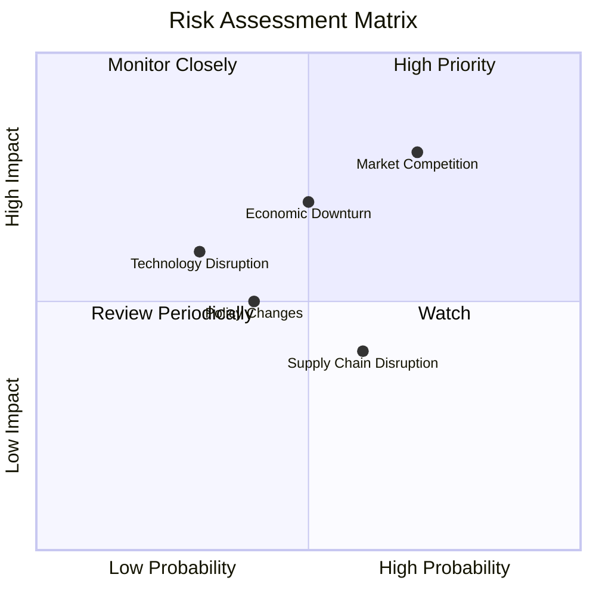

### 9.2 風險清單詳細分析

| # | 風險項目 | 發生機率 | 財務衝擊 | 風險評分 | 緩解措施 |
|---|----------|----------|----------|----------|----------|
| 1 | 🔴 **市場競爭** | 高 (70%) | 高 (-15%收入) | 🔴 8.5/10 | 增加研發投入，保持技術優勢 |
| 2 | 🟡 **經濟下行** | 中 (50%) | 中 (-10%收入) | 🟡 6.5/10 | 擴大國際市場，降低依賴單一市場 |
| 3 | 🟡 **技術中斷** | 低 (30%) | 中 (-5%收入) | 🟡 5.5/10 | 優化供應鏈，確保技術升級 |

---

## 10. 投資建議

### 10.1 最終綜合評級雷達圖

```
╔══════════════════════════════════════════════════════════════╗
║              KTOS 綜合評級（1-10 分）                       ║
╠══════════════════════════════════════════════════════════════╣
║ 基本面：8                                                  ║
║ 成長性：9                                                  ║
║ 獲利能力：7                                               ║
║ 財務健康：9                                               ║
║ 估值：8                                                   ║
╚══════════════════════════════════════════════════════════════╝
```

### 10.2 目標價與隱含報酬率

| 情境 | 目標價 | 隱含報酬率 | 機率權重 |
|------|--------|------------|----------|
| 🟢 樂觀 | $150 | +101% | 20% |
| 🟡 基準 | $117.35 | +57% | 60% |
| 🔴 悲觀 | $80 | +7% | 20% |

### 10.3 買入時機與觸發因素

```
╔══════════════════════════════════════════════════════════════════╗
║                  ✅ 買入觸發因素 Checklist                      ║
╠══════════════════════════════════════════════════════════════════╣
║                                                                  ║
║  立即買入觸發條件（多數符合）：                                  ║
║  ✅ 公司收入持續高增長                                           ║
║  ✅ 主要技術突破和市場擴張                                       ║
║                                                                  ║
║  加碼觸發條件（出現以下任一）：                                  ║
║  ☐ 新的戰略合作被宣布                                           ║
║  ☐ 收購整合獲得成功                                              ║
║                                                                  ║
║  減碼/停損觸發條件（出現以下任一）：                             ║
║  ☐ 主要競爭對手取得市場領先地位                                 ║
║  ☐ 全球經濟顯著下行                                             ║
╚══════════════════════════════════════════════════════════════════╝
```

### 10.4 投資人適配度分析

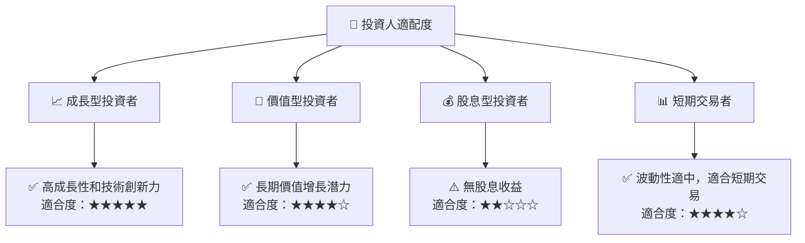

### 10.5 關鍵監控指標

| 監控類型 | 指標 | 關注點 | 頻率 |
|----------|------|--------|------|
| 市場動態 | 收入增長率 | 監控季度收入報告 | 季度 |
| 競爭態勢 | 市場份額 | 觀察市場競爭者行動 | 半年度 |
| 技術進步 | 研發投入 | 跟蹤技術突破和創新 | 每年 |

---

> **免責聲明**：本報告為 AI 自動生成，僅供研究參考，不構成投資建議。投資有風險，入市需謹慎。