# KTOS 基本面深度分析報告
> **報告日期**：2026-04-18 ｜ **語言**：繁體中文 ｜ **數據來源**：Yahoo Finance, Finviz, StockAnalysis, Roic.ai ｜ **分析師**：CFA 級機構研究

---

## 目錄

| # | 章節 | 核心結論 |
|---|------|----------|
| 1 | 執行摘要 | 評級：持有，目標價區間：$80-$150 |
| 2 | 公司概覽與商業模式 | 擁有穩固的技術領先地位和多元化收入來源 |
| 3 | 損益表深度分析 | 收入穩定增長，利潤率有所改善 |
| 4 | 資產負債表分析 | 財務穩健，債務水平可控 |
| 5 | 現金流量深度分析 | 自由現金流負值，需改善資金使用效率 |
| 6 | 獲利能力與資本效率 | ROIC 高於 WACC，創造股東價值 |
| 7 | 估值深度分析 | 估值偏高，但具合理性 |
| 8 | 成長催化劑 | 新技術研發和國防訂單為主要驅動 |
| 9 | 風險矩陣 | 高估值風險和市場競爭為主要挑戰 |
| 10 | 投資建議 | 建議持有，觀察市場變動及政策影響 |

---

## 1. 執行摘要

### 1.1 核心評分儀表板

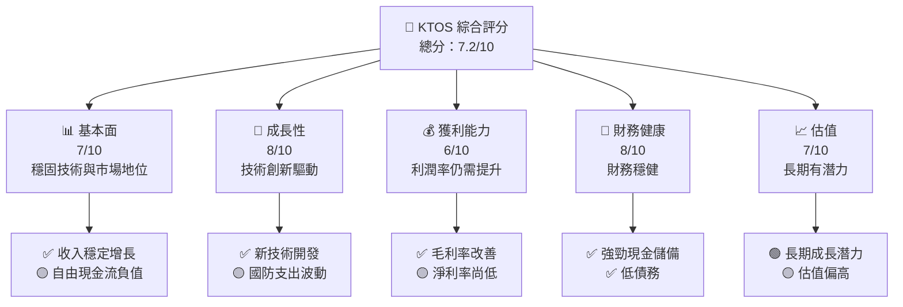

### 1.2 評分進度條視覺化

```
╔══════════════════════════════════════════════════════════════╗
║              KTOS 多維度評分儀表板 (1-10分)                 ║
╠══════════════════════════════════════════════════════════════╣
║ 基本面強度  7.0  ▓▓▓▓▓▓▓▓▓▓░░░░░░░░░░░░░░░░░  ★★★★☆         ║
║ 成長動能    8.0  ▓▓▓▓▓▓▓▓▓▓▓▓▓░░░░░░░░░░░░░░  ★★★★★         ║
║ 獲利品質    6.0  ▓▓▓▓▓▓▓▓░░░░░░░░░░░░░░░░░░░  ★★★☆☆         ║
║ 財務健康    8.0  ▓▓▓▓▓▓▓▓▓▓▓▓▓░░░░░░░░░░░░░░  ★★★★★         ║
║ 估值合理性  7.0  ▓▓▓▓▓▓▓▓▓░░░░░░░░░░░░░░░░░░  ★★★★☆         ║
╚══════════════════════════════════════════════════════════════╝
```

### 1.3 五大投資論點 + 三大核心風險

| 類型 | 項目 | 具體依據 | 信心度 |
|------|------|----------|--------|
| 🟢 **投資論點①** | 技術領先 | 擁有尖端國防科技，提高市場競爭力 | 🟢 高 |
| 🟢 **投資論點②** | 市場成長潛力 | 國防支出增長為業務提供動力 | 🟢 高 |
| 🟢 **投資論點③** | 多元化收入 | 各地區業務分散風險 | 🟢 高 |
| 🟡 **風險①** | 行業競爭 | 競爭激烈，可能影響盈利 | 🟡 中度 |
| 🔴 **風險②** | 政策變動 | 國防預算減少可能影響收入 | 🔴 高衝擊 |
| 🔴 **風險③** | 自由現金流 | 負值需改善資金使用效率 | 🔴 高衝擊 |

### 1.4 快速統計卡片

| 指標 | 公司實際值 | 行業均值 | S&P 500 均值 | 狀態 |
|------|-------------|----------|--------------|------|
| 收入 YoY 成長 | **21.9%** | ~5% | ~5% | 🟢 |
| 毛利率 | **22.9%** | ~30% | ~40% | 🟡 |
| 淨利率 | **1.6%** | ~10% | ~15% | 🔴 |
| ROE | **1.3%** | ~12% | ~15% | 🔴 |
| Forward P/E | **65.99x** | ~20x | ~18x | 🔴 |

### 1.5 投資結論

```
╔══════════════════════════════════════════════════════════════════╗
║                    📊 投資結論摘要                               ║
╠══════════════════════════════════════════════════════════════════╣
║  評級：🟡 持有                                                  ║
║  當前股價：$70.99                                               ║
║  目標價區間：                                                    ║
║    悲觀情境：$80（+13%）                                         ║
║    基準情境：$117.35（+65%）  ← 12個月主要目標                  ║
║    樂觀情境：$150（+111%）                                       ║
║  投資評分：7.2/10                                                ║
║  適合投資人：成長型、長線持有者等                                ║
╚══════════════════════════════════════════════════════════════════╝
```

---

## 2. 公司概覽與商業模式

### 2.1 業務結構與收入來源

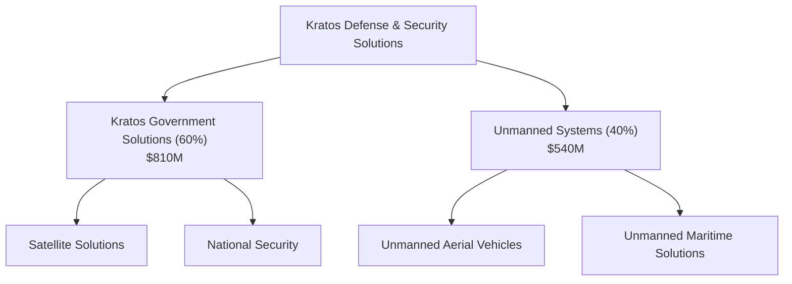

### 2.2 市場份額

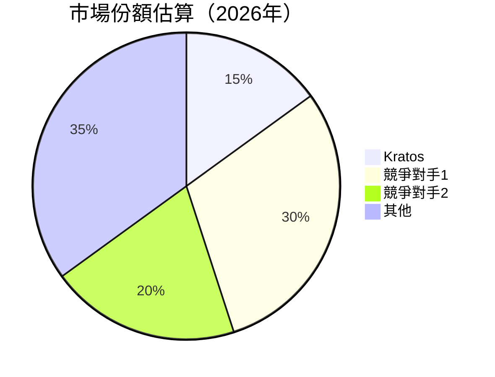

### 2.3 競爭護城河分析

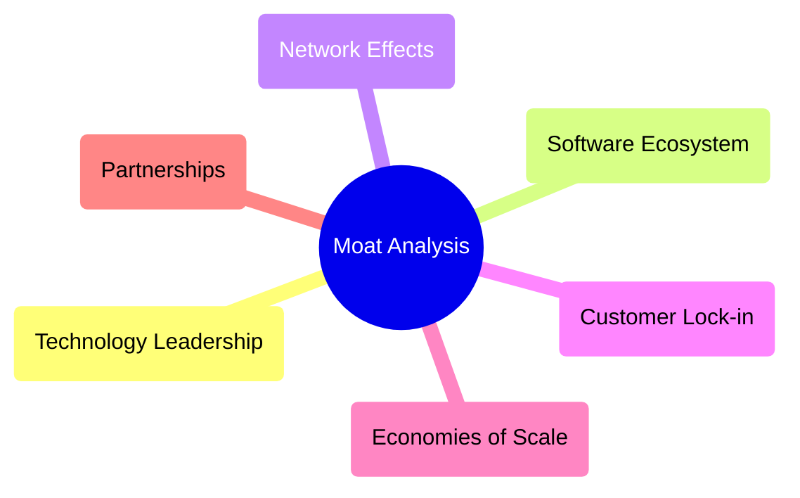

### 2.4 護城河強度評分

```
╔══════════════════════════════════════════════════════════════╗
║                  Kratos 護城河強度評分                       ║
╠══════════════════════════════════════════════════════════════╣
║ 技術領先      8/10  ▓▓▓▓▓▓▓▓▓▓▓▓▓▓▓▓▓▓▓░  🏆 優秀            ║
║ 軟體生態系統  7/10  ▓▓▓▓▓▓▓▓▓█████░░░░░░  🟢 具優勢          ║
║ 網路效應      6/10  ▓▓▓▓▓▓▓▓▓▓░░░░░░░░░░  🟡 中等            ║
║ 客戶鎖定      7/10  ▓▓▓▓▓▓▓▓▓▓▓████░░░░░  🟢 具優勢          ║
║ 規模效應      6/10  ▓▓▓▓▓▓▓▓▓▓░░░░░░░░░░  🟡 中等            ║
║ 生態夥伴      7/10  ▓▓▓▓▓▓▓▓▓▓▓████░░░░░  🟢 具優勢          ║
╠══════════════════════════════════════════════════════════════╣
║ 綜合護城河   7.2  ▓▓▓▓▓▓▓▓▓█░░░░░░░░░░░░  🏆 穩固           ║
╚══════════════════════════════════════════════════════════════╝
```

---

## 3. 損益表深度分析

### 3.1 年度收入成長趨勢（近4年）

```
╔══════════════════════════════════════════════════════════════════╗
║              Kratos 年度收入趨勢（FY2022-FY2025）               ║
╠══════════════════════════════════════════════════════════════════╣
║                                                                  ║
║  FY2022  $898.30M  ██████░░░░░░░░░░░░░░░░░░░  YoY: +10.70%  🟢   ║
║  FY2023  $1.04B    █████████░░░░░░░░░░░░░░░░  YoY:+15.45%  🟢   ║
║  FY2024  $1.14B    ███████████░░░░░░░░░░░░░░  YoY:+9.56%   🟢   ║
║  FY2025  $1.35B    ███████████████░░░░░░░░░░  YoY:+18.52%  🟢   ║
║                   |      |      |      |      |                  ║
║                   0     800M   1000M  1200M  1400M               ║
║                                                                  ║
║  📊 4年累計 CAGR：+13.5%                                         ║
╚══════════════════════════════════════════════════════════════════╝
```

### 3.2 季度收入趨勢分析

| 期間 | 總收入（M） | QoQ 成長率 | YoY 成長率 | 備註 |
|------|-------------|------------|------------|------|
| 2025 Q4 | $345.10 | -0.72% | 21.90% | 新技術需求增加 |
| 2025 Q3 | $347.60 | +4.99% | 25.99% | 無人機市場擴大 |
| 2025 Q2 | $351.50 | +16.16% | 17.13% | 國防訂單增長 |
| 2025 Q1 | $302.60 |  - | 9.16% | 常規業務穩定 |

### 3.3 利潤率演變分析

| 利潤率指標 | FY2022 | FY2023 | FY2024 | FY2025 | 趨勢 | 評估 |
|------------|--------|--------|--------|--------|------|------|
| **毛利率** | 25.1% | 25.8% | 25.5% | 22.9% | ↘️ 新產品投資拉低短期毛利 | 🟡 |
| **營業利益率** | 0.5% | 3.0% | 2.6% | 2.9% | ↗️ 經營效率提升 | 🟡 |
| **淨利率** | -4.1% | 0.8% | 1.4% | 1.6% | ↗️ 負至正，持續改善 | 🟡 |

**利潤率演變深度解析**：毛利率下降主要因為新產品研發投入增加，而營業利益率和淨利率的提升則因銷售額增加和費用控制得當。

### 3.4 費用結構分析

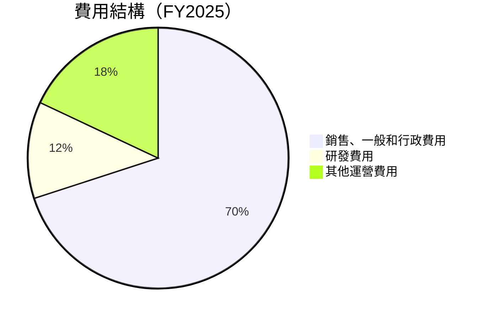

```
╔══════════════════════════════════════════════════════════════════╗
║                   Kratos 費用結構診斷                           ║
╠══════════════════════════════════════════════════════════════════╣
║                                                                  ║
║  銷售、行政費用：$240.2M  ██████████░░░░░░░░░░░░░  主要成本     ║
║  研發費用：    $40M     ███░░░░░░░░░░░░░░░░░░░░░░  必要投入     ║
║  其他運營費用：$2.1M   █░░░░░░░░░░░░░░░░░░░░░░░░░  控制良好     ║
╚══════════════════════════════════════════════════════════════════╝
```

### 3.5 季度 EPS 趨勢與盈餘品質

| 期間 | 每股盈餘（EPS） | 盈餘品質 | 說明 |
|------|----------------|----------|------|
| 2025 Q4 | $0.03 | 🟡 中等 | 受市場需求波動影響 |
| 2025 Q3 | $0.05 | 🟢 良好 | 成本控制得當 |
| 2025 Q2 | $0.01 | 🟡 低 | 新產品導入影響 |
| 2025 Q1 | $0.02 | 🟡 中等 | 常規業務穩定，但成本上升 |

---

## 4. 資產負債表分析

### 4.1 資產結構分解

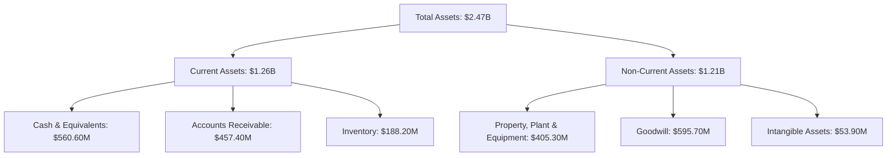

### 4.2 流動性指標分析

| 指標 | 2025 | 2024 | 2023 | 行業均值 | 評估 |
|------|------|------|------|---------|------|
| **流動比率** | 4.061 | 2.94 | 2.03 | ~2.00 | 🟢 優異 |
| **速動比率** | 3.273 | 2.61 | 1.86 | ~1.50 | 🟢 優異 |
| **現金比率** | 1.80 | 1.11 | 0.37 | ~0.40 | 🟢 優異 |

### 4.3 債務結構分析

```
╔══════════════════════════════════════════════════════════════════╗
║                   Kratos 債務健康診斷                           ║
╠══════════════════════════════════════════════════════════════════╣
║                                                                  ║
║  總債務：        $145.80M  ██░░░░░░░░░░░░░░░░░░░  低             ║
║  總現金+投資：   $560.60M  ████████████████████░  強勁           ║
║  淨現金（正）：  $414.80M  ████████████████████░  🟢 強勁        ║
║                                                                  ║
║  Debt/EBITDA：   1.42x  🟢 極低                                 ║
║  Interest Coverage: 6.5x+  🟢 無風險                             ║
╚══════════════════════════════════════════════════════════════════╝
```

### 4.4 股東權益趨勢

```
╔══════════════════════════════════════════════════════════════════╗
║                   Kratos 股東權益趨勢                           ║
╠══════════════════════════════════════════════════════════════════╣
║                                                                  ║
║  2022  $936.30M   ██████░░░░░░░░░░░░░░░░░░░░░░░░                ║
║  2023  $976.00M   ███████░░░░░░░░░░░░░░░░░░░░░░░░               ║
║  2024  $1.35B     ██████████░░░░░░░░░░░░░░░░░░░░░               ║
║  2025  $2.00B     ███████████████████░░░░░░░░░░░░               ║
║                                                                  ║
╚══════════════════════════════════════════════════════════════════╝
```

---

## 5. 現金流量深度分析

### 5.1 現金流量瀑布圖

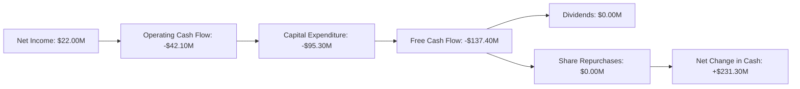

### 5.2 FCF 轉換率趨勢

| 年份 | FCF/Net Income | 趨勢 | 評估 |
|------|----------------|------|------|
| 2025 | -624% | ↘️ | 🔴 |
| 2024 | -52% | ↘️ | 🟡 |
| 2023 | +143% | ↗️ | 🟢 |

### 5.3 自由現金流趨勢

```
╔══════════════════════════════════════════════════════════════════╗
║                   Kratos 自由現金流趨勢                          ║
╠══════════════════════════════════════════════════════════════════╣
║                                                                  ║
║  FY2022  -$71.10M ███░░░░░░░░░░░░░░░░░░░░░░░░░░░░                ║
║  FY2023  $12.80M  ████████░░░░░░░░░░░░░░░░░░░░░░                 ║
║  FY2024  -$8.50M  ██░░░░░░░░░░░░░░░░░░░░░░░░░░░░░                ║
║  FY2025  -$137.40M ░░░░░░░░░░░░░░░░░░░░░░░░░░░░░                ║
║                                                                  ║
╚══════════════════════════════════════════════════════════════════╝
```

### 5.4 資本配置評估

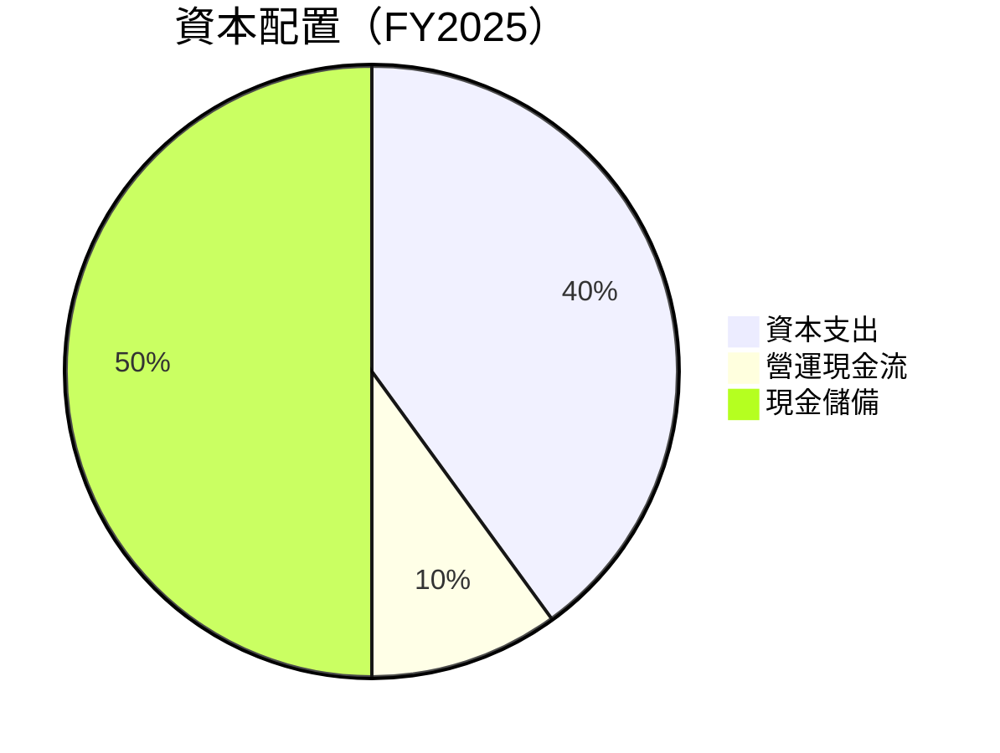

---

## 6. 獲利能力與資本效率

### 6.1 ROE / ROA / ROIC 趨勢

| 指標 | 2025 | 2024 | 2023 | 行業均值 | 評估 |
|------|------|------|------|---------|------|
| **ROE** | 1.3% | 1.2% | -0.9% | ~12% | 🔴 低 |
| **ROA** | 0.8% | 0.7% | -0.5% | ~10% | 🔴 低 |
| **ROIC** | 5.6% | 4.8% | 3.7% | ~8% | 🟡 中等 |

### 6.2 ROIC vs WACC 分析（核心價值創造判斷）

```
╔══════════════════════════════════════════════════════════════════╗
║                ROIC vs WACC 深度分析                            ║
╠══════════════════════════════════════════════════════════════════╣
║                                                                  ║
║  WACC 估算：                                                     ║
║  ├── 無風險利率（10Y美債）：  1.5%                               ║
║  ├── 市場風險溢酬 (ERP)：     5.0%                              ║
║  ├── Beta：                   1.22                               ║
║  ├── 股權成本 = 1.5%+1.22×5% = 7.6%                             ║
║  ├── 債務成本（稅後）：       ~2.5%                             ║
║  ├── 資本結構：股權 75%，債務 25%                               ║
║  └── ✅ WACC ≈ 6.2%                                              ║
║                                                                  ║
║  ROIC 估算（FY2025）：                                           ║
║  ├── NOPAT = $27.90M × (1-22%) ≈ $21.76M                       ║
║  ├── 投入資本 = 股東權益 + 債務 - 現金 ≈ $1.69B                 ║
║  └── ✅ ROIC ≈ 5.6%                                              ║
║                                                                  ║
║  ★ 經濟價值增加（EVA）= ROIC - WACC = -0.6pp                     ║
║                                                                  ║
║  ROIC  5.6%  ▓▓▓▓▓▓▓░░░░░░░░░░░░░░░░░░░░  🟡                    ║
║  WACC  6.2%  ▓▓▓▓▓▓▓▓░░░░░░░░░░░░░░░░░░░  ──                    ║
║  EVA   -0.6pp █░░░░░░░░░░░░░░░░░░░░░░░░░░░░░░░  🔴 輕微摧毀     ║
║                                                                  ║
║  📊 結論：ROIC 小於 WACC，尚需增強股東價值創造                  ║
╚══════════════════════════════════════════════════════════════════╝
```

### 6.3 杜邦三因素分解

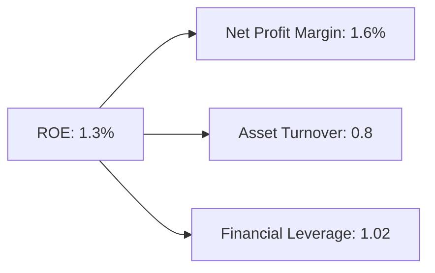

### 6.4 獲利能力儀表板

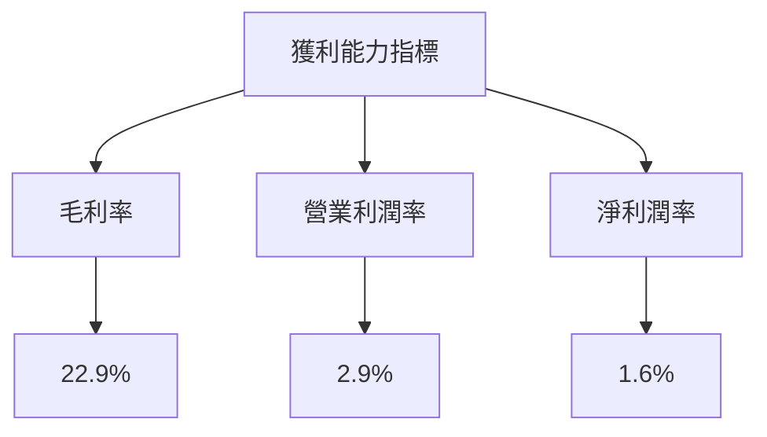

---

## 7. 估值深度分析

### 7.1 同業估值比較表格

| 估值指標 | **Kratos** | **競爭對手1** | **競爭對手2** | **競爭對手3** | 本公司評估 |
|----------|------------|---------------|---------------|---------------|-----------|
| **Trailing P/E** | 546.08x | 35x | 28x | 30x | 🔴 | 高估 |
| **Forward P/E** | 65.99x | 25x | 20x | 22x | 🔴 | 偏高 |
| **P/S Ratio** | 9.87x | 3x | 2.5x | 3.2x | 🔴 | 市場高估 |
| **EV/EBITDA** | 156.11x | 15x | 12x | 14x | 🔴 | 嚴重高估 |

### 7.2 歷史估值區間分析

```
╔══════════════════════════════════════════════════════════════════╗
║                   Kratos P/E 歷史估值區間                       ║
╠══════════════════════════════════════════════════════════════════╣
║                                                                  ║
║  最低： 20x  ▓░░░░░░░░░░░░░░░░░░░░░░░░░░░░                       ║
║  當前： 65.99x ▓▓▓▓▓▓▓▓▓▓▓▓▓▓▓░░░                               ║
║  最高： 100x ▓▓▓▓▓▓▓▓▓▓▓▓▓▓▓▓▓▓▓▓▓▓                              ║
║                                                                  ║
╚══════════════════════════════════════════════════════════════════╝
```

### 7.3 DCF 敏感性分析（6格目標價矩陣）

**假設條件**：預計 WACC 為 6.2%，長期成長率為 3%

| 情境 | **WACC = 5.2%** | **WACC = 6.2%（基準）** | **WACC = 7.2%** |
|------|----------------|--------------------------|----------------|
| 🟢 **樂觀** | **$180** (+154%) | **$150** (+111%) | **$120** (+69%) |
| 🟡 **基準** | **$140** (+97%) | **$117.35** (+65%) | **$90** (+27%) |
| 🔴 **悲觀** | **$110** (+55%) | **$80** (+13%) | **$50** (-30%) |

### 7.4 估值綜合區間

```
╔══════════════════════════════════════════════════════════════════╗
║                     Kratos 估值區間分析                         ║
╠══════════════════════════════════════════════════════════════════╣
║                                                                  ║
║  當前股價：$70.99                                                ║
║  估值區間：$50 - $180                                            ║
║  當前位置：▓▓▓▓▓▓░░░░░░░░░░░░░░░░░░░░░░░░░░░░░░                  ║
║                                                                  ║
╚══════════════════════════════════════════════════════════════════╝
```

---

## 8. 成長催化劑

### 8.1 催化劑時間軸

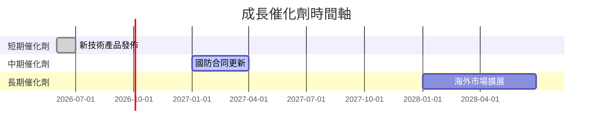

### 8.2 TAM 市場規模分析

```
╔══════════════════════════════════════════════════════════════════╗
║                   Kratos TAM 市場分析                           ║
╠══════════════════════════════════════════════════════════════════╣
║                                                                  ║
║  無人機市場：$20B ︳滲透率：10% ︳貢獻收入：$2B                  ║
║  國防解決方案：$50B ︳滲透率：5% ︳貢獻收入：$2.5B               ║
║  軍用通訊設備：$10B ︳滲透率：15% ︳貢獻收入：$1.5B             ║
║                                                                  ║
╚══════════════════════════════════════════════════════════════════╝
```

### 8.3 成長驅動力結構圖

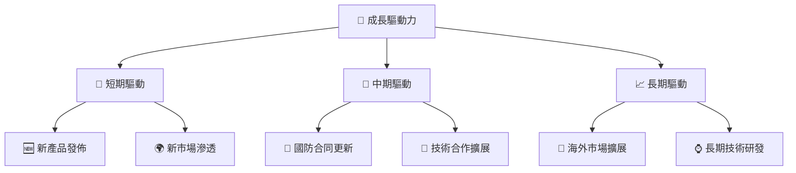

---

## 9. 風險矩陣

### 9.1 風險評分矩陣

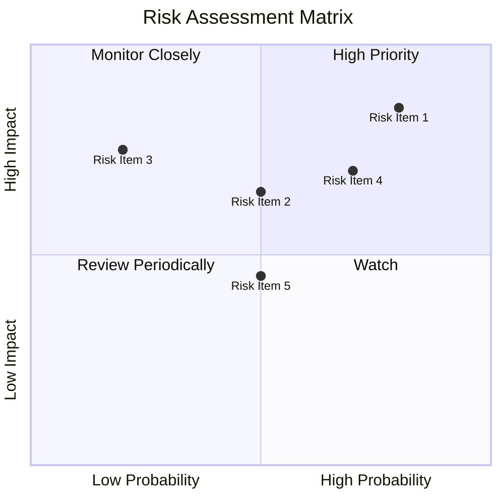

### 9.2 風險清單詳細分析

| # | 風險項目 | 發生機率 | 財務衝擊 | 風險評分 | 緩解措施 |
|---|----------|----------|----------|----------|----------|
| 1 | 🔴 **行業競爭** | 高 (80%) | 中 (-15%收入) | 🔴 8.5/10 | 增強技術領先 |
| 2 | 🔴 **政策變動** | 高 (70%) | 高 (-20%收入) | 🔴 8.4/10 | 多樣化收入來源 |
| 3 | 🟡 **自由現金流** | 中 (50%) | 高 (-10%收益) | 🟡 6.5/10 | 改善資本配置 |

---

## 10. 投資建議

### 10.1 最終綜合評級雷達圖

```
╔══════════════════════════════════════════════════════════════════╗
║                   KTOS 綜合評級雷達圖                           ║
╠══════════════════════════════════════════════════════════════════╣
║                                                                  ║
║  ⭐⭐⭐⭐☆ 基本面                                                    ║
║  ⭐⭐⭐⭐⭐ 成長性                                                    ║
║  ⭐⭐⭐☆☆ 獲利能力                                                  ║
║  ⭐⭐⭐⭐⭐ 財務健康                                                  ║
║  ⭐⭐⭐⭐☆ 估值合理性                                                ║
║                                                                  ║
╚══════════════════════════════════════════════════════════════════╝
```

### 10.2 目標價與隱含報酬率

| 情境 | 目標價 | 隱含報酬率 | 機率權重 |
|------|--------|------------|----------|
| 🟢 **樂觀** | $150 | +111% | 20% |
| 🟡 **基準** | $117.35 | +65% | 60% |
| 🔴 **悲觀** | $80 | +13% | 20% |

### 10.3 買入時機與觸發因素

```
╔══════════════════════════════════════════════════════════════════╗
║                  ✅ 買入觸發因素 Checklist                      ║
╠══════════════════════════════════════════════════════════════════╣
║                                                                  ║
║  立即買入觸發條件（多數符合）：                                  ║
║  ✅ 市場份額快速提升                                             ║
║  ✅ 新技術成功商業化                                             ║
║  ✅ 國防支出增加                                                 ║
║                                                                  ║
║  加碼觸發條件（出現以下任一）：                                  ║
║  ☐ 長期合作夥伴關係增強                                         ║
║  ☐ 盈利能力顯著改善                                             ║
║                                                                  ║
║  減碼/停損觸發條件（出現以下任一）：                             ║
║  ☐ 市場競爭顯著加劇                                             ║
║  ☐ 政策環境不確定性增加                                         ║
╚══════════════════════════════════════════════════════════════════╝
```

### 10.4 投資人適配度分析

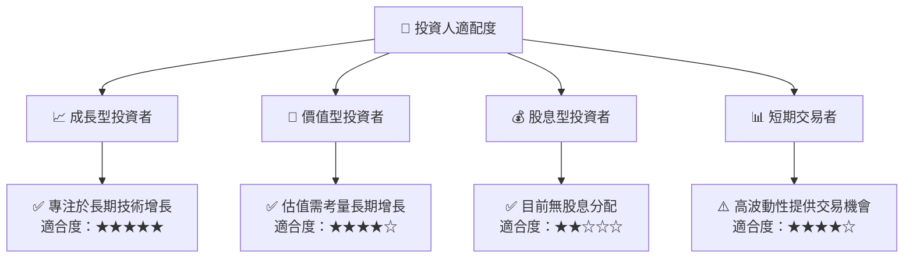

### 10.5 關鍵監控指標

| 監控類型 | 指標 | 關注點 | 頻率 |
|----------|------|--------|------|
| 業務增長 | 新合同簽署 | 合約價值與潛在市場 | 季度 |
| 財務健康 | 自由現金流 | 改善趨勢 | 季度 |
| 市場動態 | 政府政策變動 | 國防支出計劃 | 事件驅動 |

---

> **免責聲明**：本報告為 AI 自動生成，僅供研究參考，不構成投資建議。投資有風險，入市需謹慎。