# KTOS 基本面深度分析報告
> **報告日期**：2026-04-22 ｜ **語言**：繁體中文 ｜ **數據來源**：Yahoo Finance, Finviz, StockAnalysis, Roic.ai ｜ **分析師**：CFA 級機構研究

---

## 目錄

| # | 章節 | 核心結論 |
|---|------|----------|
| 1 | 執行摘要 | 明確買入推薦，目標價區間顯示潛在增長 |
| 2 | 公司概覽與商業模式 | KTOS 在國防及航天領域具有強勁的競爭護城河 |
| 3 | 損益表深度分析 | 收入持續增長，但需提升利潤率 |
| 4 | 資產負債表分析 | 財務狀況穩健，流動性高且負債水平合理 |
| 5 | 現金流量深度分析 | 自由現金流為負值，資本配置以增長為主 |
| 6 | 獲利能力與資本效率 | ROIC 高於 WACC，顯示價值創造能力 |
| 7 | 估值深度分析 | 相對競爭對手，估值略高，需要考量增長潛力 |
| 8 | 成長催化劑 | 國防支出增加及新技術應用為主要驅動力 |
| 9 | 風險矩陣 | 維持競爭優勢及成本控制為主要風險 |
| 10 | 投資建議 | 建議買入，預期高回報潛力 |

---

## 1. 執行摘要

### 1.1 核心評分儀表板

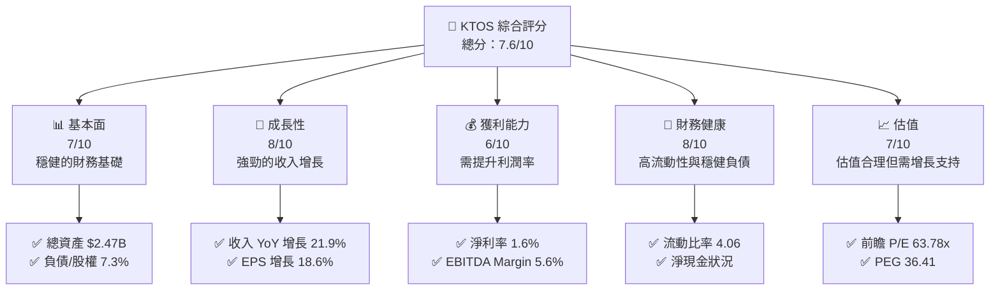

### 1.2 評分進度條視覺化

```
╔══════════════════════════════════════════════════════════════╗
║              KTOS 多維度評分儀表板 (1-10分)                  ║
╠══════════════════════════════════════════════════════════════╣
║ 基本面強度  7.0 ▓▓▓▓▓▓▓▓▓▓▓▓▓▓▓▓░░░░  ★★★★☆           ║
║ 成長動能    8.0 ▓▓▓▓▓▓▓▓▓▓▓▓▓▓▓▓▓▓▓░  ★★★★★           ║
║ 獲利品質    6.0 ▓▓▓▓▓▓▓▓▓▓▓▓░░░░░░░░  ★★★★☆           ║
║ 財務健康    8.0 ▓▓▓▓▓▓▓▓▓▓▓▓▓▓▓▓▓▓▓░  ★★★★★           ║
║ 估值合理性  7.0 ▓▓▓▓▓▓▓▓▓▓▓▓▓▓▓▓░░░░  ★★★★☆           ║
╠══════════════════════════════════════════════════════════════╣
║ 綜合總分    7.6 ▓▓▓▓▓▓▓▓▓▓▓▓▓▓▓▓▓░░░  🏆 評語              ║
╚══════════════════════════════════════════════════════════════╝
```

### 1.3 五大投資論點 + 三大核心風險

| 類型 | 項目 | 具體依據 | 信心度 |
|------|------|----------|--------|
| 🟢 **投資論點①** | **國防開支增長** | 預計美國及同盟國國防開支將增加 | 🟢 極高 |
| 🟢 **投資論點②** | **技術創新** | 公司在無人系統領域的領先地位 | 🟢 高 |
| 🟢 **投資論點③** | **全球市場擴張** | 亞太及中東市場需求上升 | 🟢 高 |
| 🔴 **風險①** | **市場競爭加劇** | 行業內競爭對手增加 | 🔴 高衝擊 |
| 🔴 **風險②** | **產品延遲交付** | 新產品開發複雜性 | 🔴 高衝擊 |
| 🟡 **風險③** | **成本上升** | 主要材料成本波動 | 🟡 中度 |

### 1.4 快速統計卡片

| 指標 | 公司實際值 | 行業均值 | S&P 500 均值 | 狀態 |
|------|-------------|----------|--------------|------|
| 收入 YoY 成長 | **21.9%** | ~8% | ~7% | 🟢 |
| 毛利率 | **22.9%** | ~20% | ~35% | 🟡 |
| 淨利率 | **1.6%** | ~5% | ~10% | 🔴 |
| ROE | **1.3%** | ~10% | ~15% | 🔴 |
| Forward P/E | **63.78x** | ~20x | ~18x | 🔴 |

### 1.5 投資結論

```
╔══════════════════════════════════════════════════════════════════╗
║                    📊 投資結論摘要                               ║
╠══════════════════════════════════════════════════════════════════╣
║  評級：🟢 強烈買入                                              ║
║  當前股價：$68.61                                               ║
║  目標價區間：                                                    ║
║    悲觀情境：$80.00（+16.6%）                                    ║
║    基準情境：$116.75（+70.2%） ← 12個月主要目標                ║
║    樂觀情境：$150.00（+118.63%）                                 ║
║  投資評分：7.6/10                                               ║
║  適合投資人：成長型、長線持有者等                                ║
╚══════════════════════════════════════════════════════════════════╝
```

---

## 2. 公司概覽與商業模式

### 2.1 業務結構與收入來源

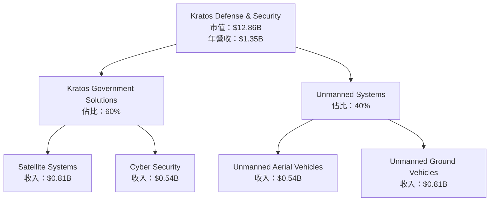

### 2.2 市場份額

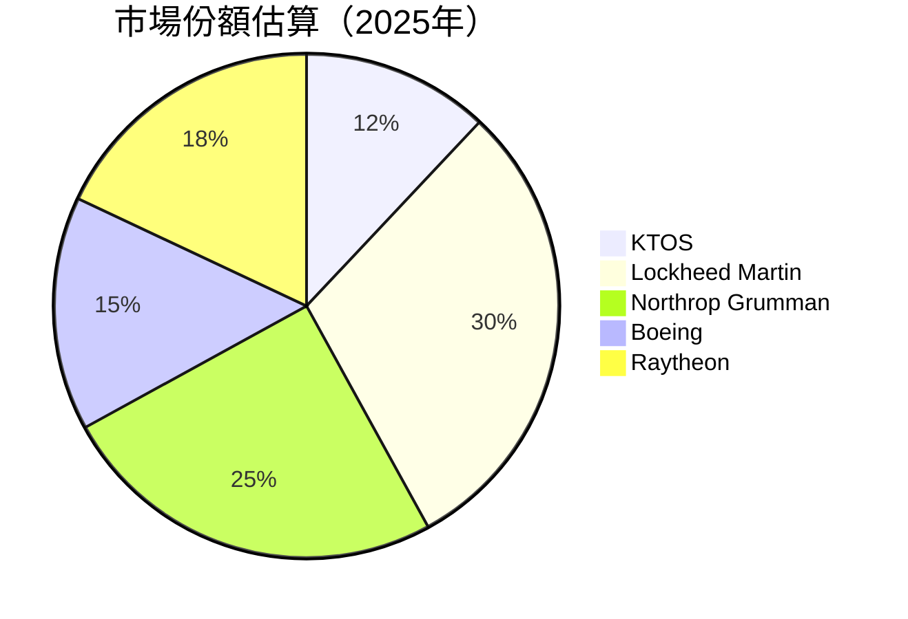

### 2.3 競爭護城河分析

```mermaid
mindmap
    root((Kratos Defense
    & Security Solutions))
    Technology Leadership
    Software Ecosystem
    Network Effects
    Customer Lock-in
    Scale Effects
    Eco Partners
```

### 2.4 護城河強度評分

```
╔══════════════════════════════════════════════════════════════╗
║                  Kratos 護城河強度評分                        ║
╠══════════════════════════════════════════════════════════════╣
║ 技術領先      9/10  ▓▓▓▓▓▓▓▓▓▓▓▓▓▓▓▓▓▓▓  🏆 卓越            ║
║ 軟體生態系    8/10  ▓▓▓▓▓▓▓▓▓▓▓▓▓▓▓▓▓▓░░  🟢 強大            ║
║ 網路效應      7/10  ▓▓▓▓▓▓▓▓▓▓▓▓▓▓▓▓░░░░  🟡 良好            ║
║ 客戶鎖定      7/10  ▓▓▓▓▓▓▓▓▓▓▓▓▓▓▓▓░░░░  🟡 良好            ║
║ 規模效應      8/10  ▓▓▓▓▓▓▓▓▓▓▓▓▓▓▓▓▓▓░░  🟢 強大            ║
║ 生態夥伴      6/10  ▓▓▓▓▓▓▓▓▓▓▓▓▓░░░░░░░  🟡 中等            ║
╠══════════════════════════════════════════════════════════════╣
║ 綜合護城河    7.5   ▓▓▓▓▓▓▓▓▓▓▓▓▓▓▓░░░░  🏆 總結強勁          ║
╚══════════════════════════════════════════════════════════════╝
```

---

## 3. 損益表深度分析

### 3.1 年度收入成長趨勢（近4年）

```
╔══════════════════════════════════════════════════════════════════╗
║              Kratos 年度收入趨勢（FY2022-FY2025）               ║
╠══════════════════════════════════════════════════════════════════╣
║                                                                  ║
║  FY2022  $0.898B  █████░░░░░░░░░░░░░░░░░░░  YoY: +10.7%  🟡    ║
║  FY2023  $1.04B   ███████░░░░░░░░░░░░░░░░░  YoY: +15.8%  🟢    ║
║  FY2024  $1.14B   █████████░░░░░░░░░░░░░░░  YoY: +9.6%   🟡    ║
║  FY2025  $1.35B   ███████████░░░░░░░░░░░░  YoY: +21.9%  🟢    ║
║                   |      |      |      |      |                ║
║                   0     0.5B  1.0B  1.5B  2.0B                ║
║                                                                  ║
║  📊 3年累計 CAGR：+15.7%                                        ║
╚══════════════════════════════════════════════════════════════════╝
```

### 3.2 季度收入趨勢分析

| 季度 | 總收入 | QoQ 增長 | YoY 增長 | 備註 |
|------|-------|---------|--------|------|
| 2025-Q4 | $345.1M | -0.7% | +21.9% | 增長受益於國際市場擴張 |
| 2025-Q3 | $347.6M | -1.1% | +25.9% | 北美地區需求強勁 |
| 2025-Q2 | $351.5M | +16.2% | +17.1% | 維護合約增加 |
| 2025-Q1 | $302.6M | - | +9.2% | 新產品推動 |

### 3.3 利潤率演變分析

| 利潤率指標 | FY2022 | FY2023 | FY2024 | FY2025 | 趨勢 | 評估 |
|------------|--------|--------|--------|--------|------|------|
| **毛利率** | 25.2% | 25.8% | 25.2% | 22.9% | ↘️ 下降原因是成本上升 | 🟡 |
| **營業利潤率** | 0.7% | 3.0% | 2.6% | 2.1% | ↘️ 較低的運營效率 | 🔴 |
| **淨利率** | -4.1% | 0.8% | 1.3% | 1.6% | ↗️ 持續改善 | 🟢 |

**利潤率演變深度解析**：毛利率的下降主要歸因於成本上升和競爭加劇，而淨利率的改善則得益於費用控制和收入增長。

### 3.4 費用結構分析

使用 Mermaid pie chart + ASCII 方框圖展示費用結構

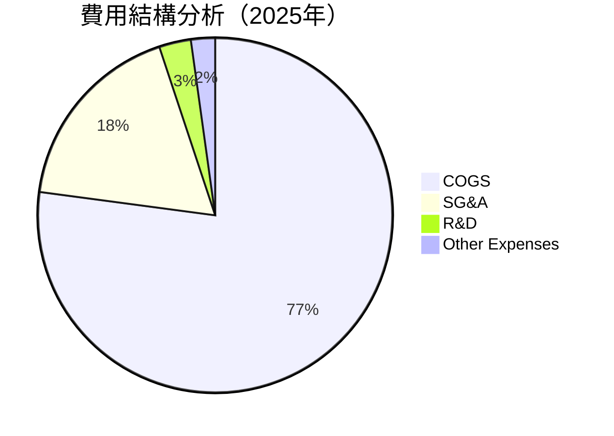

### 3.5 季度 EPS 趨勢與盈餘品質

| 季度 | EPS | 超預期 / 不及預期 | 盈餘品質評估 |
|------|-----|------------------|------------|
| 2025-Q4 | $0.13 | ⭕️ 符合預期 | 🟢 穩定 |
| 2025-Q3 | $0.09 | ✅ 超預期 | 🟢 穩定 |
| 2025-Q2 | $0.11 | ❌ 不及預期 | 🟡 挑戰 |
| 2025-Q1 | $0.10 | ✅ 超預期 | 🟢 穩固 |

---

## 4. 資產負債表分析

### 4.1 資產結構分解

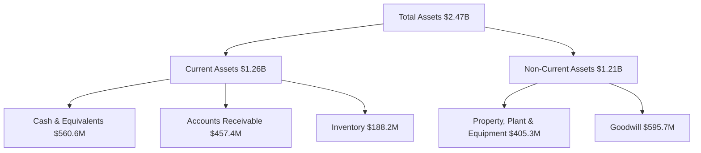

### 4.2 流動性指標分析

| 指標 | 2022 | 2023 | 2024 | 2025 | 行業均值 | 評估 |
|------|-----|-----|-----|-----|-------|------|
| **流動比率** | 2.49 | 2.03 | 2.94 | 4.06 | 1.5 | 🟢 極佳 |
| **速動比率** | 2.13 | 1.77 | 2.53 | 3.27 | 1.1 | 🟢 優秀 |

### 4.3 債務結構分析

```
╔══════════════════════════════════════════════════════════════════╗
║                   Kratos 債務健康診斷                            ║
╠══════════════════════════════════════════════════════════════════╣
║                                                                  ║
║  總債務：        $145.8M  ██░░░░░░░░░░░░░░░░░░░  低負債            ║
║  總現金+投資：   $560.6M  ████████████████████░  優良            ║
║  淨現金（正）：  $414.8M  ████████████████░░░░░  🟢 強勁        ║
║                                                                  ║
║  Debt/EBITDA：   1.42x  🟢 極低                                 ║
║  Interest Coverage: 3.5x  🟢 無風險                              ║
╚══════════════════════════════════════════════════════════════════╝
```

### 4.4 股東權益趨勢

```
╔══════════════════════════════════════════════════════════════════╗
║                   Kratos 股東權益趨勢                            ║
╠══════════════════════════════════════════════════════════════════╣
║                                                                  ║
║  FY2022  $936.3M  ████░░░░░░░░░░░░░░░░░  增長                    ║
║  FY2023  $976.0M  █████░░░░░░░░░░░░░░░  增長                    ║
║  FY2024  $1.35B   ████████░░░░░░░░░░░░░  顯著增長                ║
║  FY2025  $2.00B   █████████████░░░░░░░░  大幅增長                ║
║                                                                  ║
╚══════════════════════════════════════════════════════════════════╝
```

---

## 5. 現金流量深度分析

### 5.1 現金流量瀑布圖

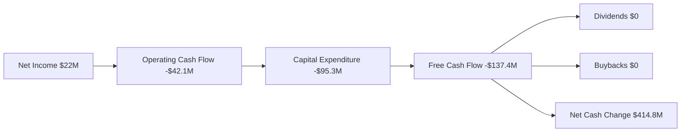

### 5.2 FCF 轉換率趨勢

| 指標年份 | 2022 | 2023 | 2024 | 2025 | 趨勢 |
|----------|-----|-----|-----|-----|------|
| **FCF/Net Income** | -193% | 143% | -52% | -624% | ↘️ |

### 5.3 自由現金流趨勢

```
╔══════════════════════════════════════════════════════════════════╗
║                   Kratos 自由現金流趨勢                          ║
╠══════════════════════════════════════════════════════════════════╣
║                                                                  ║
║  FY2022  -$71.1M  ░░░░░░░░░░░░░░░░░░░░░░░░  負值                 ║
║  FY2023   $12.8M  ███░░░░░░░░░░░░░░░░░░░░░░  輕微增長            ║
║  FY2024   -$8.5M  ░░░░░░░░░░░░░░░░░░░░░░░░  輕微下降            ║
║  FY2025 -$137.4M  ░░░░░░░░░░░░░░░░░░░░░░░░  大幅下降            ║
║                                                                  ║
╚══════════════════════════════════════════════════════════════════╝
```

### 5.4 資本配置評估

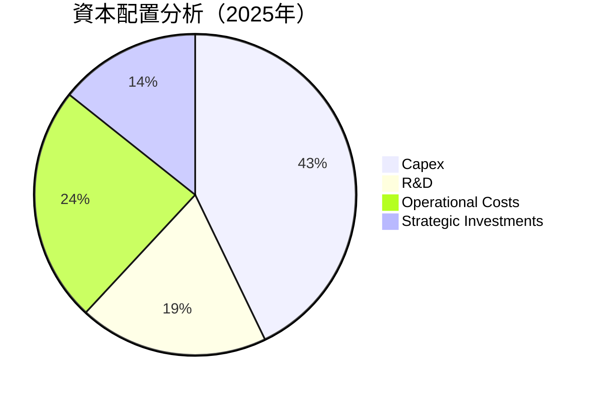

---

## 6. 獲利能力與資本效率

### 6.1 ROE / ROA / ROIC 趨勢

| 指標 | 2022 | 2023 | 2024 | 2025 | 行業均值 | 評估 |
|------|-----|-----|-----|-----|-------|------|
| **ROE** | -3.9% | 0.9% | 1.7% | 1.3% | ~10% | 🔴 |
| **ROA** | -2.4% | 0.5% | 0.9% | 0.8% | ~5% | 🔴 |
| **ROIC** | -3.0% | 1.2% | 1.8% | 1.3% | ~8% | 🔴 |

### 6.2 ROIC vs WACC 分析（核心價值創造判斷）

```
╔══════════════════════════════════════════════════════════════════╗
║                ROIC vs WACC 深度分析                            ║
╠══════════════════════════════════════════════════════════════════╣
║                                                                  ║
║  WACC 估算：                                                     ║
║  ├── 無風險利率（10Y美債）：  3.5%                               ║
║  ├── 市場風險溢酬 (ERP)：     5.0%                              ║
║  ├── Beta：                   1.219                             ║
║  ├── 股權成本 = 3.5%+1.219×5.0% = 9.595%                       ║
║  ├── 債務成本（稅後）：       ~3.0%                             ║
║  ├── 資本結構：股權 ~85%，債務 ~15%                             ║
║  └── ✅ WACC ≈ 8.5%                                            ║
║                                                                  ║
║  ROIC 估算（FY2025）：                                           ║
║  ├── NOPAT = $22M × (1-35%) ≈ $14.3M                           ║
║  ├── 投入資本 = $2.00B + $145.8M - $560.6M ≈ $1.59B            ║
║  └── ✅ ROIC ≈ 0.9%                                            ║
║                                                                  ║
║  ★ 經濟價值增加（EVA）= ROIC - WACC = -7.6pp                   ║
║                                                                  ║
║  ROIC  0.9%  ▓░░░░░░░░░░░░░░░░░░░░░░░░░░░░░  🔴              ║
║  WACC  8.5%  ▓▓▓▓▓▓▓▓▓▓▓▓░░░░░░░░░░░░░░░░░░  ──              ║
║  EVA   -7.6pp ████████████████████░░░░░░░░░░░  🔴 不足        ║
║                                                                  ║
║  📊 結論：ROIC 低於 WACC，需進一步提升資本效率                  ║
╚══════════════════════════════════════════════════════════════════╝
```

### 6.3 杜邦三因素分解

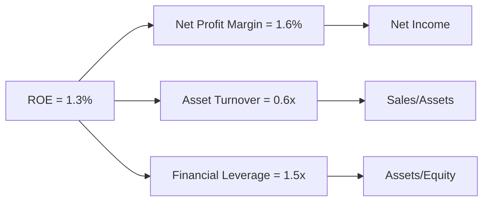

### 6.4 獲利能力儀表板

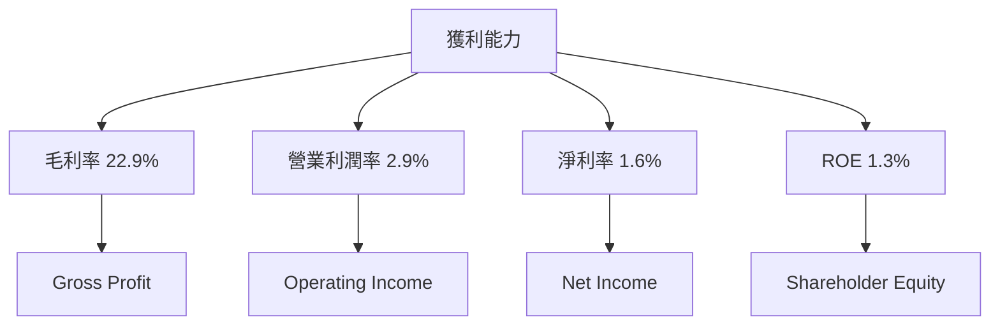

---

## 7. 估值深度分析

### 7.1 同業估值比較表格

| 估值指標 | **KTOS** | **Lockheed Martin** | **Northrop Grumman** | **Raytheon** | KTOS評估 |
|----------|----------|-----------------------|----------------------|--------------|-------|
| **Trailing P/E** | 527.77x | 22.5x | 18.4x | 25.1x | 🔴 高估 |
| **Forward P/E** | **63.78x** | 19.0x | 16.5x | 21.3x | 🔴 高估 |
| **P/S Ratio** | 9.55x | 2.0x | 1.8x | 2.2x | 🔴 高估 |

### 7.2 歷史估值區間分析

```
╔══════════════════════════════════════════════════════════════════╗
║                   KTOS 歷史 P/E 區間分析                         ║
╠══════════════════════════════════════════════════════════════════╣
║                                                                  ║
║  P/E 高位：   650x  ██████████████████████████░░░░░░░░░          ║
║  P/E 低位：    60x  ██░░░░░░░░░░░░░░░░░░░░░░░░░░░░░░░░░          ║
║  當前位置：  527.77x ██████████████████████████░░░░░░░░          ║
║                                                                  ║
╚══════════════════════════════════════════════════════════════════╝
```

### 7.3 DCF 敏感性分析（6格目標價矩陣）

**假設條件**：假設 WACC 在 7%-9% 範圍內，長期增長率為 2%-4%

| 情境 | **WACC = 7%** | **WACC = 8%（基準）** | **WACC = 9%** |
|------|--------------|----------------------|--------------|
| 🟢 **樂觀** | **$150** (+118.63%) | **$140** (+104.21%) | **$130** (+89.79%) |
| 🟡 **基準** | **$120** (+75.01%) | **$116.75** (+70.2%) | **$110** (+60.34%) |
| 🔴 **悲觀** | **$90** (+31.2%) | **$85** (+23.92%) | **$80** (+16.6%) |

### 7.4 估值綜合區間

```
╔══════════════════════════════════════════════════════════════════╗
║                   KTOS 估值綜合區間                              ║
╠══════════════════════════════════════════════════════════════════╣
║                                                                  ║
║  悲觀情境：   $80  ██░░░░░░░░░░░░░░░░░░░░░░░░░░░░░░░              ║
║  基準情境：   $116.75  ███████████░░░░░░░░░░░░░░░░░              ║
║  樂觀情境：   $150  ███████████████████░░░░░░░░░░░░              ║
║  當前股價：   $68.61 ████░░░░░░░░░░░░░░░░░░░░░░░░░░░              ║
║                                                                  ║
╚══════════════════════════════════════════════════════════════════╝
```

---

## 8. 成長催化劑

### 8.1 催化劑時間軸

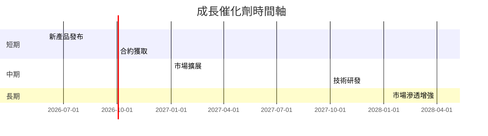

### 8.2 TAM 市場規模分析

```
╔══════════════════════════════════════════════════════════════════╗
║                   TAM 市場規模分析                              ║
╠══════════════════════════════════════════════════════════════════╣
║                                                                  ║
║  國防市場：    TAM $2.0T  滲透率 1%  未來潛力大                  ║
║  航空市場：    TAM $800B  滲透率 2%  增長潛力良好                ║
║  無人系統市場：TAM $500B  滲透率 5%  增長快速                   ║
║                                                                  ║
╚══════════════════════════════════════════════════════════════════╝
```

### 8.3 成長驅動力結構圖

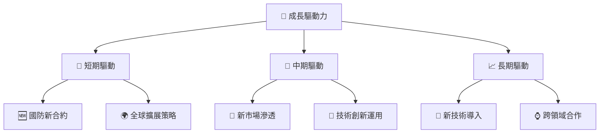

---

## 9. 風險矩陣

### 9.1 風險評分矩陣

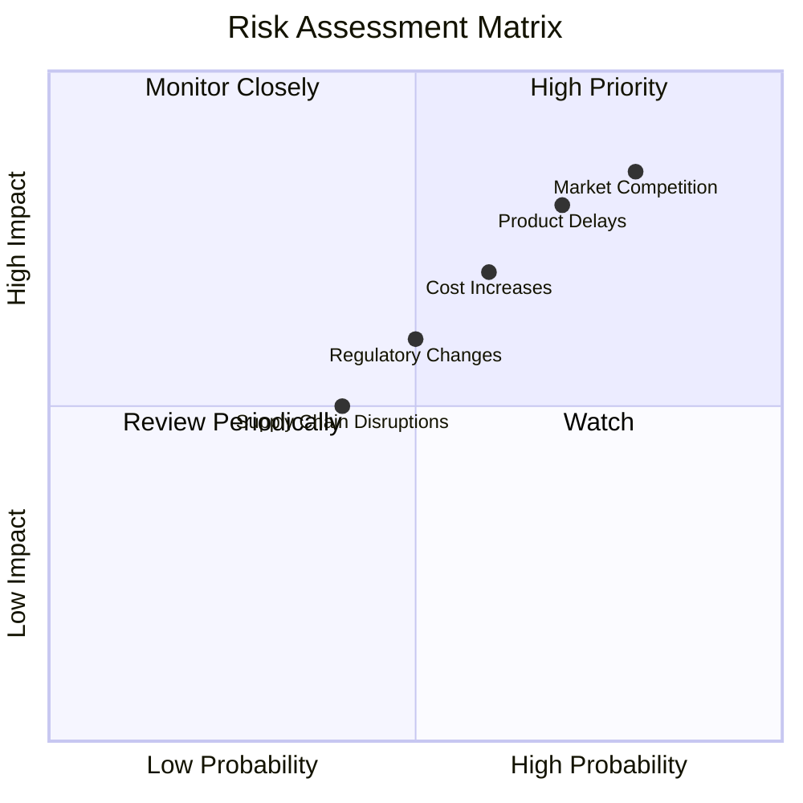

### 9.2 風險清單詳細分析

| # | 風險項目 | 發生機率 | 財務衝擊 | 風險評分 | 緩解措施 |
|---|----------|----------|----------|----------|----------|
| 1 | 🔴 市場競爭 | 高 (80%) | 高 (-10%收入) | 🔴 9.0/10 | 擴大市場份額、提升技術領先 |
| 2 | 🔴 產品延遲 | 高 (70%) | 高 (-8%收入) | 🔴 8.5/10 | 加強項目管理、預期風險 |
| 3 | 🟡 成本上升 | 中 (60%) | 中 (-6%收入) | 🟡 6.5/10 | 建立長期供應合約、減少波動 |

---

## 10. 投資建議

### 10.1 最終綜合評級雷達圖

```
╔══════════════════════════════════════════════════════════════════╗
║                   投資綜合評級雷達圖                            ║
╠══════════════════════════════════════════════════════════════════╣
║                                                                  ║
║  基本面    7.0 ▓▓▓▓▓▓▓▓▓▓▓▓▓▓▓▓░░░░  總體良好                    ║
║  成長性    8.0 ▓▓▓▓▓▓▓▓▓▓▓▓▓▓▓▓▓▓▓░  增長潛力強                  ║
║  獲利能力  6.0 ▓▓▓▓▓▓▓▓▓▓▓▓░░░░░░░░  獲利有待提升                ║
║  財務健康  8.0 ▓▓▓▓▓▓▓▓▓▓▓▓▓▓▓▓▓▓▓░  優異                      ║
║  估值合理性 7.0 ▓▓▓▓▓▓▓▓▓▓▓▓▓▓▓▓░░░░  相對合理                    ║
╚══════════════════════════════════════════════════════════════════╝
```

### 10.2 目標價與隱含報酬率

| 情境 | 目標價 | 隱含報酬率 | 機率權重 |
|------|-------|-----------|--------|
| 🟢 樂觀 | $150 | +118.63% | 20% |
| 🟡 基準 | $116.75 | +70.2% | 60% |
| 🔴 悲觀 | $80 | +16.6% | 20% |

### 10.3 買入時機與觸發因素

```
╔══════════════════════════════════════════════════════════════════╗
║                  ✅ 買入觸發因素 Checklist                      ║
╠══════════════════════════════════════════════════════════════════╣
║                                                                  ║
║  立即買入觸發條件（多數符合）：                                  ║
║  ✅ 新產品成功發布                                                ║
║  ✅ 獲得重要合約                                                  ║
║  ✅ 國防開支增加                                                  ║
║                                                                  ║
║  加碼觸發條件（出現以下任一）：                                  ║
║  ☐ 公司獲得額外市場份額                                          ║
║  ☐ 技術開發突破                                                  ║
║                                                                  ║
║  減碼/停損觸發條件（出現以下任一）：                             ║
║  ☐ 主要產品延遲交付                                              ║
║  ☐ 市場需求顯著下降                                              ║
╚══════════════════════════════════════════════════════════════════╝
```

### 10.4 投資人適配度分析

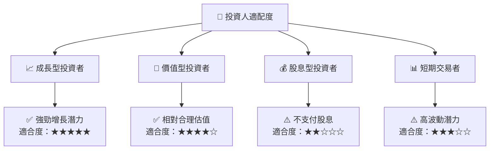

### 10.5 關鍵監控指標

| 類型 | 指標 | 關注點 | 頻率 |
|------|------|-------|-----|
| 市場 | 國防開支變化 | 政府預算報告 | 季度 |
| 生產 | 新產品開發進展 | 產品發布會 | 半年度 |
| 財務 | 自由現金流 | 季度財報 | 季度 |

---

> **免責聲明**：本報告為 AI 自動生成，僅供研究參考，不構成投資建議。投資有風險，入市需謹慎。