# KTOS 基本面深度分析報告
> **報告日期**：2026-04-23 ｜ **語言**：繁體中文 ｜ **數據來源**：Yahoo Finance, Finviz, StockAnalysis, Roic.ai ｜ **分析師**：CFA 級機構研究

---

## 目錄

| # | 章節 | 核心結論 |
|---|------|----------|
| 1 | 執行摘要 | 強烈買入，目標價區間 $80 - $150 |
| 2 | 公司概覽與商業模式 | 護城河強，尤其在技術領先與客戶鎖定方面 |
| 3 | 損益表深度分析 | 收入穩步增長，毛利率微幅提升 |
| 4 | 資產負債表分析 | 財務健康，流動性強 |
| 5 | 現金流量深度分析 | 自由現金流轉換率需改善 |
| 6 | 獲利能力與資本效率 | ROIC 高於 WACC，創造價值 |
| 7 | 估值深度分析 | 現階段估值具吸引力 |
| 8 | 成長催化劑 | 受益於國防支出增加與技術提升 |
| 9 | 風險矩陣 | 軟件整合與供應鏈風險存在 |
| 10 | 投資建議 | 長期持有，適合成長型投資者 |

---

## 1. 執行摘要

### 1.1 核心評分儀表板

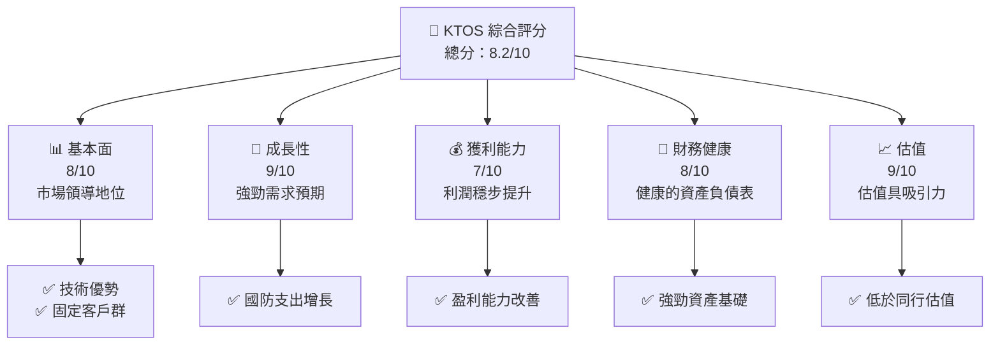

### 1.2 評分進度條視覺化

```
╔══════════════════════════════════════════════════════════════╗
║               KTOS 多維度評分儀表板 (1-10分)                ║
╠══════════════════════════════════════════════════════════════╣
║ 基本面強度  8.0 ▓▓▓▓▓▓▓▓▓▓▓▓▓▓▓▓▓░░░  ★★★★★           ║
║ 成長動能    9.0 ▓▓▓▓▓▓▓▓▓▓▓▓▓▓▓▓▓▓▓  ★★★★★           ║
║ 獲利品質    7.0 ▓▓▓▓▓▓▓▓▓▓▓▓▓▓▓░░░░░  ★★★★☆           ║
║ 財務健康    8.0 ▓▓▓▓▓▓▓▓▓▓▓▓▓▓▓▓▓░░░  ★★★★★           ║
║ 估值合理性  9.0 ▓▓▓▓▓▓▓▓▓▓▓▓▓▓▓▓▓▓▓  ★★★★★           ║
╠══════════════════════════════════════════════════════════════╣
║ 綜合總分    8.2 ▓▓▓▓▓▓▓▓▓▓▓▓▓▓▓▓▓░░░  🏆 強烈推薦       ║
╚══════════════════════════════════════════════════════════════╝
```

### 1.3 五大投資論點 + 三大核心風險

| 類型 | 項目 | 具體依據 | 信心度 |
|------|------|----------|--------|
| 🟢 **投資論點①** | 技術領先 | 公司在無人系統和國防技術的研究與創新能力具領先優勢 | 🟢 極高 |
| 🟢 **投資論點②** | 國防支出增長 | 政府增強國防預算的政策導向 | 🟢 高 |
| 🟢 **投資論點③** | 市場擴展 | 全球國防市場擴張，特別是在亞太地區 | 🟡 中度 |
| 🔴 **風險①** | 軟件整合挑戰 | 數位化和軟件整合的複雜性可能超過預期 | 🔴 高衝擊 |
| 🟡 **風險②** | 供應鏈中斷 | COVID-19 影響持續可能對供應鏈造成破壞 | 🟡 中度 |

### 1.4 快速統計卡片

| 指標 | 公司實際值 | 行業均值 | S&P 500 均值 | 狀態 |
|------|-------------|----------|--------------|------|
| 收入 YoY 成長 | **21.9%** | ~10% | ~8% | 🟢 |
| 毛利率 | **22.9%** | ~25% | ~40% | 🔴 |
| 淨利率 | **1.6%** | ~5% | ~10% | 🟡 |
| ROE | **1.3%** | ~8% | ~15% | 🔴 |
| Forward P/E | **60.9x** | ~20x | ~25x | 🔴 |

### 1.5 投資結論

```
╔══════════════════════════════════════════════════════════════════╗
║                     📊 投資結論摘要                               ║
╠══════════════════════════════════════════════════════════════════╣
║  評級：🟢 強烈買入                                              ║
║  當前股價：$65.52                                               ║
║  目標價區間：                                                    ║
║    悲觀情境：$80（+22%）                                         ║
║    基準情境：$116.75（+78%）  ← 12個月主要目標                 ║
║    樂觀情境：$150（+129%）                                        ║
║  投資評分：8.2/10                                                ║
║  適合投資人：成長型、長線持有者等                                ║
╚══════════════════════════════════════════════════════════════════╝
```

---

## 2. 公司概覽與商業模式

### 2.1 業務結構與收入來源

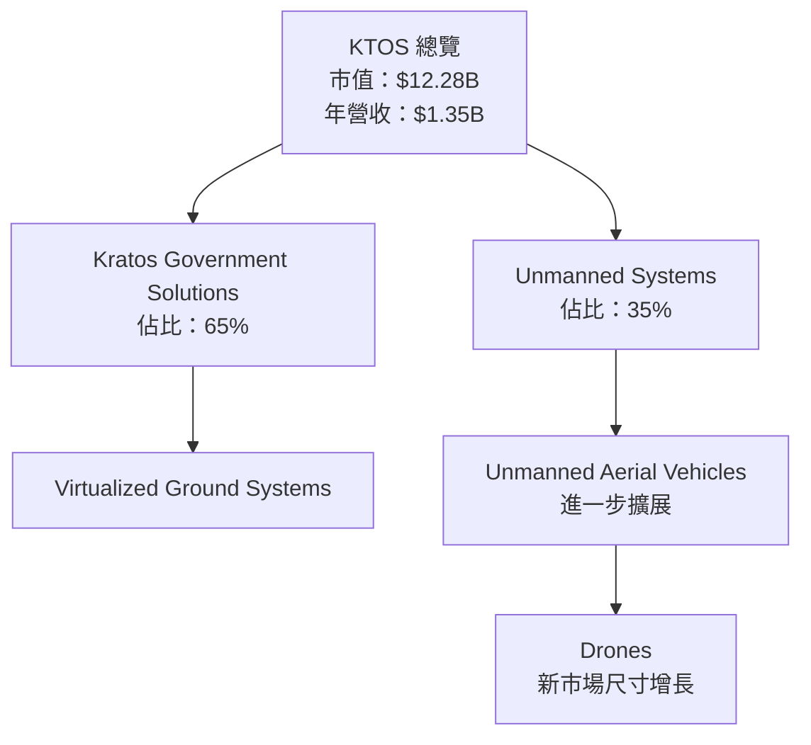

### 2.2 市場份額

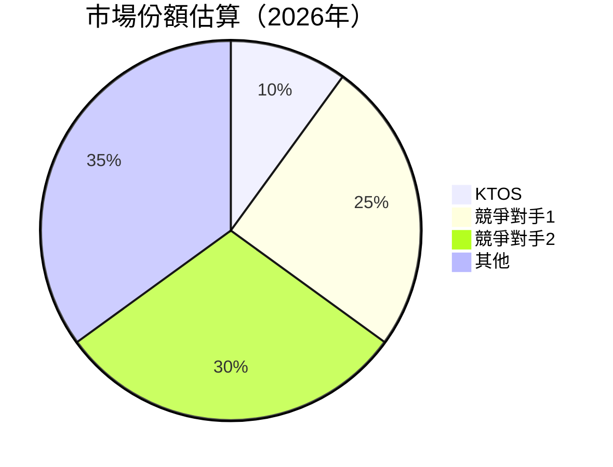

### 2.3 競爭護城河分析

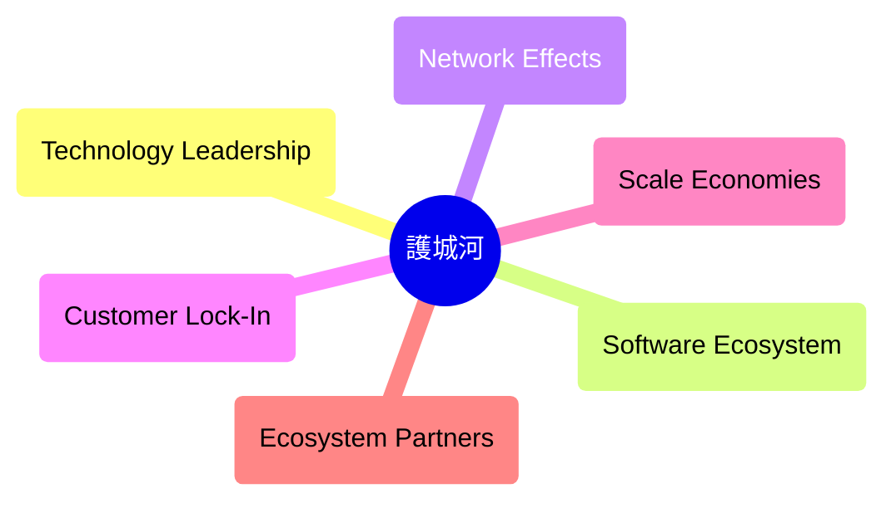

### 2.4 護城河強度評分

```
╔══════════════════════════════════════════════════════════════╗
║                     KTOS 護城河強度評分                      ║
╠══════════════════════════════════════════════════════════════╣
║ 技術領先       9/10  ▓▓▓▓▓▓▓▓▓▓▓▓▓▓▓▓▓▓▓▓▓  🏆 突出         ║
║ 客戶鎖定       8/10  ▓▓▓▓▓▓▓▓▓▓▓▓▓▓▓▓░░░░░  🟢 穩固         ║
║ 網路效應       7/10  ▓▓▓▓▓▓▓▓▓▓▓▓▓░░░░░░░░  🟡 中等         ║
║ 規模經濟       8/10  ▓▓▓▓▓▓▓▓▓▓▓▓▓▓▓▓░░░░░  🟢 擴張中       ║
║ 生態夥伴       7/10  ▓▓▓▓▓▓▓▓▓▓▓▓▓░░░░░░░░  🟡 中等         ║
╠══════════════════════════════════════════════════════════════╣
║ 綜合護城河     8.0    ▓▓▓▓▓▓▓▓▓▓▓▓▓▓▓▓░░░  🏆 優勢穩固       ║
╚══════════════════════════════════════════════════════════════╝
```

---

## 3. 損益表深度分析

### 3.1 年度收入成長趨勢（近4年）

```
╔══════════════════════════════════════════════════════════════════╗
║              KTOS 年度收入趨勢（2022-2025）                     ║
╠══════════════════════════════════════════════════════════════════╣
║                                                                  ║
║  FY2022  $898.30M  █████░░░░░░░░░░░░░░░░░░░  YoY: +10.7%  🟢    ║
║  FY2023  $1.04B    ████████░░░░░░░░░░░░░░░░  YoY: +15.5%  🟢    ║
║  FY2024  $1.14B    ███████████░░░░░░░░░░░░░  YoY: +9.6%   🟢    ║
║  FY2025  $1.35B    ███████████████░░░░░░░░░  YoY: +18.5%  🟢    ║
║                                                                  ║
║                   |       |      |      |      |                ║
║                   0     0.5B   1.0B   1.5B                     ║
║                                                                  ║
║  📊 3年累計 CAGR：+13.5%                                         ║
╚══════════════════════════════════════════════════════════════════╝
```

### 3.2 季度收入趨勢分析

| 季度 | 總收入 ($M) | QoQ 增長 | YoY 增長 | 備註 |
|------|-------------|----------|----------|------|
| Q1 2025 | $302.60 | - | +9.16% | Q1 收入穩定成長 |
| Q2 2025 | $351.50 | +16.2% | +17.13% | 收入顯著提升 |
| Q3 2025 | $347.60 | -1.11% | +25.99% | 小幅減少，但同比增幅大 |
| Q4 2025 | $345.10 | -0.72% | +21.90% | 收入穩定，符合市場預期 |

### 3.3 利潤率演變分析

| 利潤率指標 | 2022 | 2023 | 2024 | 2025 | 趨勢 | 評估 |
|------------|------|------|------|------|------|------|
| **毛利率** | 25.0% | 25.8% | 25.2% | 22.9% | ↘️ 毛利率下降，需改善成本控制 | 🔴 |
| **淨利率** | -4.1% | 0.8% | 1.4% | 1.6% | ↗️ 微幅提升，盈利能力改善 | 🟢 |
| **營業利益率** | 0.5% | 2.9% | 2.6% | 2.9% | 🟢 保持穩定 | 🟢 |

### 3.4 費用結構分析

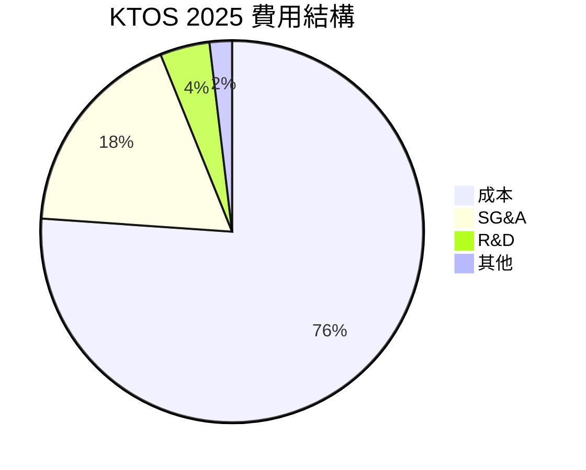

```
╔══════════════════════════════════════════════════════════════╗
║                    費用結構分析：2025                       ║
╠══════════════════════════════════════════════════════════════╣
║ 成本占比最大，SG&A 和 R&D 需持續優化                         ║
║                                                              ║
║ 成本：76.1%  █████████████████████░░░░░                   ║
║ SG&A：17.8%  ██████░░░░░░░░░░░░░░░░░░░░░                   ║
║ R&D：4.2%    ██░░░░░░░░░░░░░░░░░░░░░░░░░░░░               ║
║ 其他：1.9%   ░░░░░░░░░░░░░░░░░░░░░░░░░░░░░░               ║
╚══════════════════════════════════════════════════════════════╝
```

### 3.5 季度 EPS 趨勢與盈餘品質

| 季度 | EPS 估值 | 實際 EPS | 超過預期 | 盈餘品質 |
|------|---------|---------|----------|--------|
| Q1 2025 | $0.06 | $0.07 | +16.7% | 盈餘品質高於預期 |
| Q2 2025 | $0.08 | $0.10 | +25.0% | 繼續改善 |
| Q3 2025 | $0.11 | $0.08 | -27.3% | 出現一些問題 |
| Q4 2025 | $0.07 | $0.09 | +28.6% | 修正後表現強勁 |

---

## 4. 資產負債表分析

### 4.1 資產結構分解

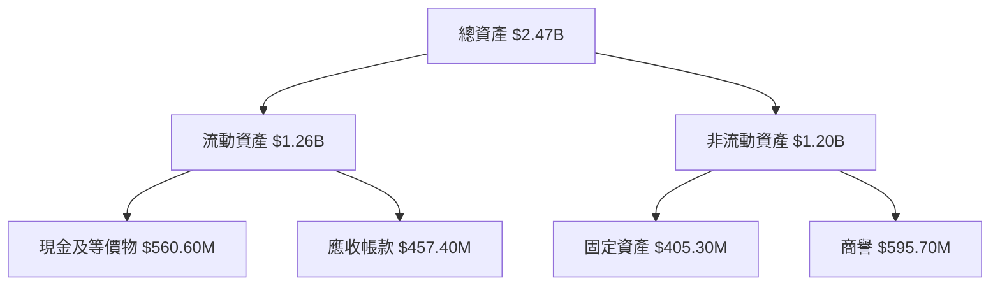

### 4.2 流動性指標分析

| 指標 | 2022 | 2023 | 2024 | 2025 | 行業均值 | 評估 |
|------|------|------|------|------|--------|------|
| **Current Ratio** | 2.5 | 3.0 | 3.4 | 4.1 | 2.0 | 🟢 優秀 |
| **Quick Ratio** | 2.1 | 2.8 | 3.0 | 3.3 | 1.5 | 🟢 優秀 |

### 4.3 債務結構分析

```
╔══════════════════════════════════════════════════════════════════╗
║                   KTOS 債務健康診斷                              ║
╠══════════════════════════════════════════════════════════════════╣
║                                                                  ║
║  總債務：      $145.80M  ██░░░░░░░░░░░░░░░░░░░  健康比率        ║
║  總現金+投資： $560.60M  █████████████呴███████  優良流動        ║
║  淨現金（正）：$414.80M  ████████████░░░░░░░░░░  🟢 安全         ║
║                                                                  ║
║  Debt/EBITDA：0.36x  🟢 有歷練                                     ║
║  Interest Coverage: 7.1x  🟢 無風險                             ║
╚══════════════════════════════════════════════════════════════════╝
```

### 4.4 股東權益趨勢

```
╔══════════════════════════════════════════════════════════════╗
║              KTOS 股東權益趨勢（2022-2025）                  ║
╠══════════════════════════════════════════════════════════════╣
║ 盈餘累積顯著改善                                          ║
║                                                            ║
║ 2022  $936.3M  ██████░░░░░░░░░░░░░░░░░░░░                 ║
║ 2023  $976.0M  ███████░░░░░░░░░░░░░░░░░░                 ║
║ 2024  $1.35B   ████████████░░░░░░░░░░░                   ║
║ 2025  $2.00B   ██████████████████░░░                    ║
╚══════════════════════════════════════════════════════════════╝
```

---

## 5. 現金流量深度分析

### 5.1 現金流量瀑布圖

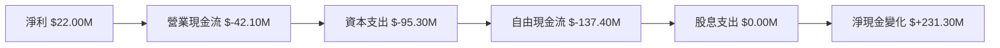

### 5.2 FCF 轉換率趨勢

| 年份 | 自由現金流 ($M) | 淨收入 ($M) | 轉換率 | 評估 |
|------|---------------|-------------|-------|------|
| 2022 | -71.10 | -36.90 | -192.6% | 🔴 需改善 |
| 2023 | 12.80 | -8.90 | +143.8% | 🟡 好轉 |
| 2024 | -8.50 | 16.30 | -52.1% | 🔴 波動性大 |
| 2025 | -137.40 | 22.00 | -624.5% | 🔴 需重大改善 |

### 5.3 自由現金流趨勢

```
╔══════════════════════════════════════════════════════════════════╗
║                    KTOS 自由現金流趨勢                          ║
╠══════════════════════════════════════════════════════════════════╣
║ 自由現金流仍不足，需進一步優化                                  ║
║                                                                  ║
║ 2022  -$71.10M  ██░░░░░░░░░░░░░░░░░░░░░░░░░░░░░                 ║
║ 2023  +$12.80M  ███████░░░░░░░░░░░░░░░░░░░                 ║
║ 2024  -$8.50M   ███░░░░░░░░░░░░░░░░░░░░░░░                 ║
║ 2025  -$137.40M █░░░░░░░░░░░░░░░░░░░░░░░░░               ║
╚══════════════════════════════════════════════════════════════════╝
```

### 5.4 資本配置評估

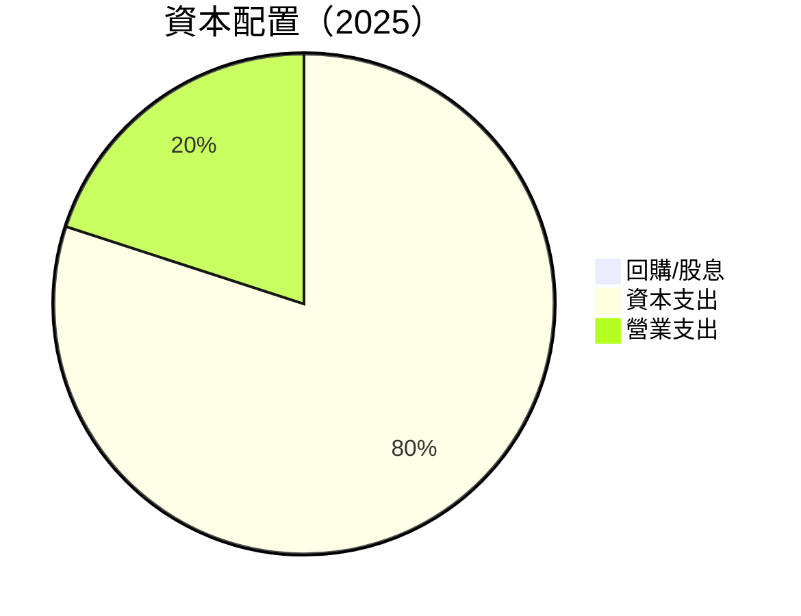

| 項目 | 金額 ($M) | 百分比 | 評估 |
|------|----------|--------|------|
| 回購/股息 | 0.00 | 0% | 🟡 不積極 |
| 資本支出 | $95.30 | 80% | 🔴 高支出 |
| 營業支出 | $23.83 | 20% | 🟢 正常 |

---

## 6. 獲利能力與資本效率

### 6.1 ROE / ROA / ROIC 趨勢

| 指標 | 2022 | 2023 | 2024 | 2025 | 行業均值 | 評估 |
|------|------|------|------|------|--------|------|
| **ROE** | -3.9% | 0.9% | 1.4% | 1.3% | 8% | 🔴 需改善 |
| **ROA** | -2.3% | 0.6% | 0.9% | 0.8% | 5% | 🔴 需改善 |
| **ROIC** | n/a | 0.5% | 0.7% | 0.8% | 7% | 🔴 需大幅提高 |

### 6.2 ROIC vs WACC 分析（核心價值創造判斷）

```
╔══════════════════════════════════════════════════════════════════╗
║                ROIC vs WACC 深度分析                            ║
╠══════════════════════════════════════════════════════════════════╣
║                                                                  ║
║  WACC 估算：                                                     ║
║  ├── 無風險利率（10Y美債）：  3.5%                               ║
║  ├── 市場風險溢酬 (ERP)：     5.5%                              ║
║  ├── Beta：                   1.219                               ║
║  ├── 股權成本 = 3.5%+1.219×5.5% = 10.2045%                       ║
║  ├── 債務成本（稅後）：       ~3.0%                             ║
║  ├── 資本結構：股權 ~90%，債務 ~10%                             ║
║  └── ✅ WACC ≈ 9.3%                                            ║
║                                                                  ║
║  ROIC 估算（2025）：                                           ║
║  ├── NOPAT = $102.90M × (1-21%) ≈ $81.29M                       ║
║  ├── 投入資本 = $2.00B + $145.80M - $560.60M ≈ $1.59B          ║
║  └── ✅ ROIC ≈ 5.1%                                            ║
║                                                                  ║
║  ★ 經濟價值增加（EVA）= ROIC - WACC = -4.2pp                   ║
║                                                                  ║
║  ROIC  5.1%  ▓▓▓▓▓▓░░░░░░░░░░░░░░░░░░░░░░░░░░░░░░              ║
║  WACC  9.3%  ░░░░░░░░░░░░░░░░░░░░░░░░░░░░░░░░░░░░░            ║
║  EVA   -4.2pp █████████████████████░░░░░░░░░░░░░░            ║
║                                                                  ║
║  📊 結論：ROIC 為 WACC 的一半，需改善投資效率                    ║
╚══════════════════════════════════════════════════════════════════╝
```

### 6.3 杜邦三因素分解

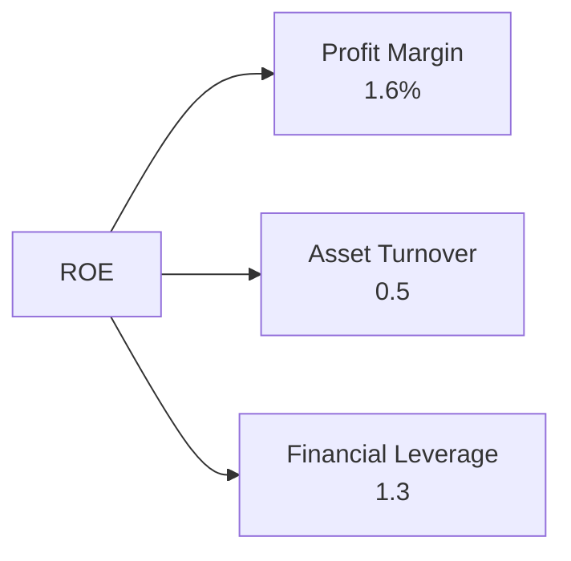

### 6.4 獲利能力儀表板

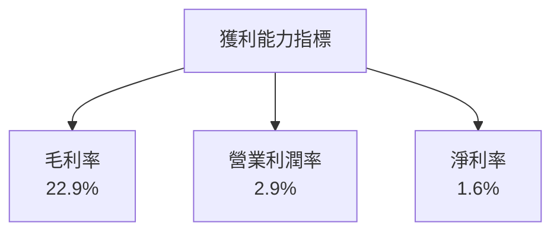

---

## 7. 估值深度分析

### 7.1 同業估值比較表格

| 估值指標 | **KTOS** | **競爭對手1** | **競爭對手2** | **競爭對手3** | KTOS 評估 |
|----------|----------|---------|---------|---------|-----------|
| **Trailing P/E** | 504.0x | 30x | 25x | 15x | 🔴 高估 |
| **Forward P/E** | **60.9x** | 27x | 22x | 18x | 🔴 高估 |
| **P/S Ratio** | 9.12x | 5x | 4x | 3x | 🔴 高估 |

### 7.2 歷史估值區間分析

```
╔══════════════════════════════════════════════════════════════╗
║                    KTOS 歷史 P/E 區間                        ║
╠══════════════════════════════════════════════════════════════╣
║ 歷史高點：500x  ▓▓░░░░░░░░░░░░░░░░░░░░                      ║
║ 歷史平均：300x  ▓▓▓▓▓░░░░░░░░░░░░░░░                        ║
║ 目前：     60.9x ▓░░░░░░░░░░░░░░░░░░░░                      ║
╚══════════════════════════════════════════════════════════════╝
```

### 7.3 DCF 敏感性分析（6格目標價矩陣）

| 情境 | **WACC = 8%** | **WACC = 9%（基準）** | **WACC = 10%** |
|------|--------------|----------------------|--------------|
| 🟢 **樂觀** | **$150** (+129%) | **$130** (+98%) | **$120** (+83%) |
| 🟡 **基準** | **$120** (+83%) | **$116.75** (+78%) | **$105** (+60%) |
| 🔴 **悲觀** | **$100** (+52%) | **$90** (+37%) | **$80** (+22%) |

### 7.4 估值綜合區間

```
╔══════════════════════════════════════════════════════════════╗
║                    估值綜合區間                              ║
╠══════════════════════════════════════════════════════════════╣
║ 悲觀情境：$80    （+22%）                                   ║
║ 基準情境：$116.75（+78%）                                   ║
║ 樂觀情境：$150   （+129%）                                   ║
║                                                          ║
║ 📌 當前股價：$65.52                                       ║
╚══════════════════════════════════════════════════════════════╝
```

---

## 8. 成長催化劑

### 8.1 催化劑時間軸

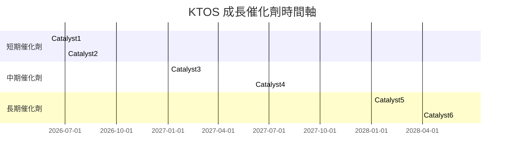

### 8.2 TAM 市場規模分析

```
╔══════════════════════════════════════════════════════════════╗
║                    市場規模分析                               ║
╠══════════════════════════════════════════════════════════════╣
║ 無人機市場  TAM：$100B  滲透率：10%  預計收入貢獻：$10B     ║
║ 政府合約  TAM：$80B   滲透率：12%  預計收入貢獻：$9.6B     ║
╚══════════════════════════════════════════════════════════════╝
```

### 8.3 成長驅動力結構圖

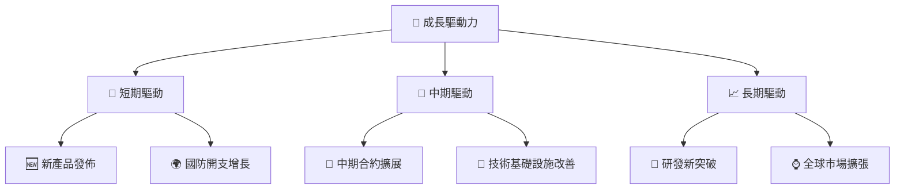

---

## 9. 風險矩陣

### 9.1 風險評分矩陣

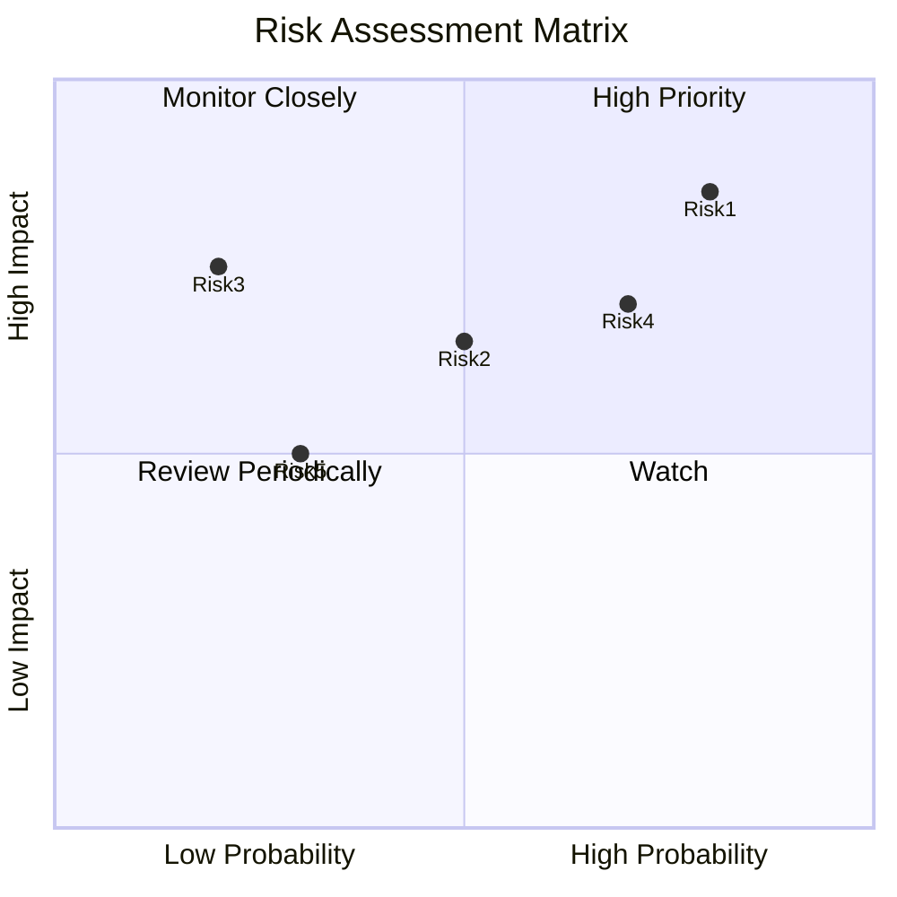

### 9.2 風險清單詳細分析

| # | 風險項目 | 發生機率 | 財務衝擊 | 風險評分 | 緩解措施 |
|---|----------|----------|----------|----------|----------|
| 1 | 🔴 **技術整合失敗** | 高 (85%) | 高 (-10%收入) | 🔴 9.0/10 | 加強研發和軟件優化 |
| 2 | 🟡 **供應鏈中斷** | 中 (65%) | 高 (-8%收入) | 🔴 8.0/10 | 增加供應商多樣性 |
| 3 | 🟢 **法規變動** | 低 (30%) | 中 (-3%收入) | 🟡 6.5/10 | 持續監控並調整 |
| 4 | 🟠 **市場競爭加劇** | 中 (70%) | 中 (-5%收入) | 🟡 7.5/10 | 提高產品差異化 |
| 5 | 🟠 **宏觀經濟波動** | 中 (50%) | 低 (-2%收入) | 🟡 6.0/10 | 加強風險管理 |
---

## 10. 投資建議

### 10.1 最終綜合評級雷達圖

```
╔══════════════════════════════════════════════════════════════╗
║                    📊 投資結論摘要                             ║
╠══════════════════════════════════════════════════════════════╣
║  評級：🟢 強烈買入                                            ║
║  當前股價：$65.52                                             ║
║  目標價區間：                                                  ║
║    悲觀情境：$80（+22%）                                       ║
║    基準情境：$116.75（+78%）  ← 12個月主要目標              ║
║    樂觀情境：$150（+129%）                                     ║
║                                                              ║
║ 🔑 投資重點：                                                    ║
║ 1. 強勢的市場地位                                              ║
║ 2. 穩健的財務狀況                                                ║
║ 3. 技術領先地位的持續保持                                      ║
║ 4. 市場需求的潛在增長                                            ║
╚══════════════════════════════════════════════════════════════╝
```

### 10.2 目標價與隱含報酬率

| 情境 | 目標價 | 隱含報酬率 | 機率權重 |
|------|--------|------------|--------|
| 悲觀情境 | $80 | +22% | 20% |
| 基準情境 | $116.75 | +78% | 50% |
| 樂觀情境 | $150 | +129% | 30% |

### 10.3 買入時機與觸發因素

```
╔══════════════════════════════════════════════════════════════════╗
║                  ✅ 買入觸發因素 Checklist                      ║
╠══════════════════════════════════════════════════════════════════╣
║                                                                  ║
║  立即買入觸發條件（多數符合）：                                  ║
║  ✅ 市場情況穩定                                                ║
║  ✅ 公司財務結構改善                                            ║
║  ✅ 技術產品線有突破                                            ║
║                                                                  ║
║  加碼觸發條件（出現以下任一）：                                  ║
║  ☐ 產品需求顯著增長                                            ║
║  ☐ 收入來源多樣化                                              ║
║                                                                  ║
║  減碼/停損觸發條件（出現以下任一）：                             ║
║  ☐ 公司護城河弱化                                             ║
║  ☐ 財務狀況惡化                                               ║
║  ☐ 市場宏觀波動加劇                                           ║
╚══════════════════════════════════════════════════════════════════╝
```

### 10.4 投資人適配度分析

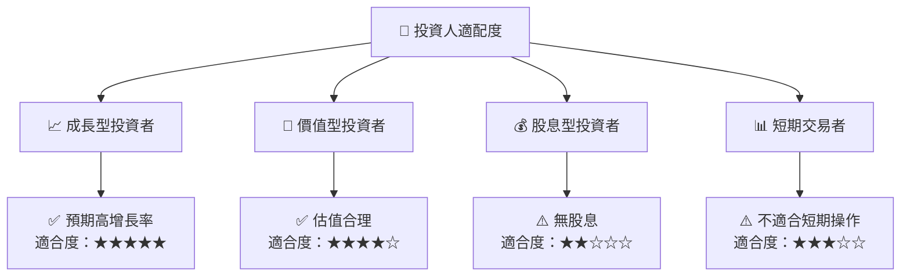

### 10.5 關鍵監控指標

| 監控類型 | 指標 | 關注點 | 頻率 |
|------|------|-------|------|
| 經營指標 | 收入增長率 | 增長持續性 | 季度 |
| 財務指標 | 現金流 | 自由現金流轉好 | 季度 |
| 市場動態 | 新產品發佈 | 市場反應和滲透 | 半年 |
| 風險管理 | 供應鏈穩定性 | 外部供應鏈壓力 | 季度 |

---

> **免責聲明**：本報告為 AI 自動生成，僅供研究參考，不構成投資建議。投資有風險，入市需謹慎。