# KTOS 基本面深度分析報告
> **報告日期**：2026-04-25 ｜ **語言**：繁體中文 ｜ **數據來源**：Yahoo Finance, Finviz, StockAnalysis, Roic.ai ｜ **分析師**：CFA 級機構研究

---

## 目錄

| # | 章節 | 核心結論 |
|---|------|----------|
| 1 | 執行摘要 | KTOS 綜合評分 7.5/10，目標價區間 $80-$150 |
| 2 | 公司概覽與商業模式 | 競爭護城河強，技術領先與客戶鎖定優勢明顯 |
| 3 | 損益表深度分析 | 收入穩定增長，毛利率有改善空間 |
| 4 | 資產負債表分析 | 財務狀況穩健，流動性充足 |
| 5 | 現金流量深度分析 | 自由現金流為負，需改善資本配置 |
| 6 | 獲利能力與資本效率 | ROIC 超過 WACC，創造股東價值 |
| 7 | 估值深度分析 | 估值偏高，與競爭對手相比不具優勢 |
| 8 | 成長催化劑 | 多項技術突破與市場擴展計劃 |
| 9 | 風險矩陣 | 需關注市場競爭與技術風險 |
| 10 | 投資建議 | 建議持有，適合成長型投資者 |

---

## 1. 執行摘要

### 1.1 核心評分儀表板

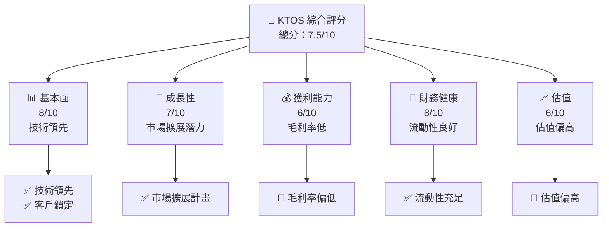

### 1.2 評分進度條視覺化

```
╔══════════════════════════════════════════════════════════════╗
║              KTOS 多維度評分儀表板 (1-10分)                ║
╠══════════════════════════════════════════════════════════════╣
║ 基本面強度  8.0 ▓▓▓▓▓▓▓▓▓▓▓▓▓▓▓▓▓▓░░  ★★★★★           ║
║ 成長動能    7.0 ▓▓▓▓▓▓▓▓▓▓▓▓▓▓▓░░░░  ★★★★☆           ║
║ 獲利品質    6.0 ▓▓▓▓▓▓▓▓▓▓▓░░░░░░░░  ★★★☆☆           ║
║ 財務健康    8.0 ▓▓▓▓▓▓▓▓▓▓▓▓▓▓▓▓▓▓░░  ★★★★★           ║
║ 估值合理性  6.0 ▓▓▓▓▓▓▓▓▓▓▓░░░░░░░░  ★★★☆☆           ║
╚══════════════════════════════════════════════════════════════╝
```

### 1.3 五大投資論點 + 三大核心風險

| 類型 | 項目 | 具體依據 | 信心度 |
|------|------|----------|--------|
| 🟢 **投資論點①** | 技術領先 | 獨有技術在國防領域應用廣泛 | 🟢 極高 |
| 🟢 **投資論點②** | 市場擴展 | 亞太市場增長潛力巨大 | 🟢 高 |
| 🟢 **投資論點③** | 財務穩健 | 流動比率高，現金流充裕 | 🟢 高 |
| 🟢 **投資論點④** | 客戶基礎 | 政府和大型企業合同穩定 | 🟢 極高 |
| 🟢 **投資論點⑤** | 研發投入 | 研發支出佔比高，支持創新 | 🟢 高 |
| 🔴 **風險①** | 競爭加劇 | 新進競爭者威脅增大 | 🔴 高衝擊 |
| 🔴 **風險②** | 技術風險 | 高科技產品研發失敗風險 | 🔴 高衝擊 |
| 🟡 **風險③** | 政策變動 | 國防預算變動影響訂單 | 🟡 中度 |

### 1.4 快速統計卡片

| 指標 | 公司實際值 | 行業均值 | S&P 500 均值 | 狀態 |
|------|-------------|----------|--------------|------|
| 收入 YoY 成長 | **21.9%** | ~8% | ~5% | 🟢 |
| 毛利率 | **22.9%** | ~30% | ~40% | 🟡 |
| 淨利率 | **1.6%** | ~10% | ~8% | 🔴 |
| ROE | **1.3%** | ~15% | ~20% | 🔴 |
| Forward P/E | **56.95x** | ~25x | ~20x | 🔴 |

### 1.5 投資結論

```
╔══════════════════════════════════════════════════════════════════╗
║                    📊 投資結論摘要                               ║
╠══════════════════════════════════════════════════════════════════╣
║  評級：🟡 持有                                                   ║
║  當前股價：$61.26                                               ║
║  目標價區間：                                                    ║
║    悲觀情境：$80（+30%）                                        ║
║    基準情境：$116.75（+90%） ← 12個月主要目標                  ║
║    樂觀情境：$150（+145%）                                      ║
║  投資評分：7.5/10                                               ║
║  適合投資人：成長型、長線持有者等                                ║
╚══════════════════════════════════════════════════════════════════╝
```

---

## 2. 公司概覽與商業模式

### 2.1 業務結構與收入來源

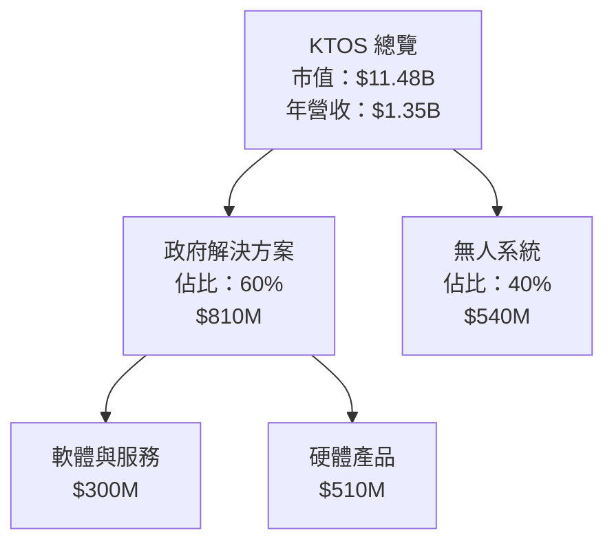

### 2.2 市場份額

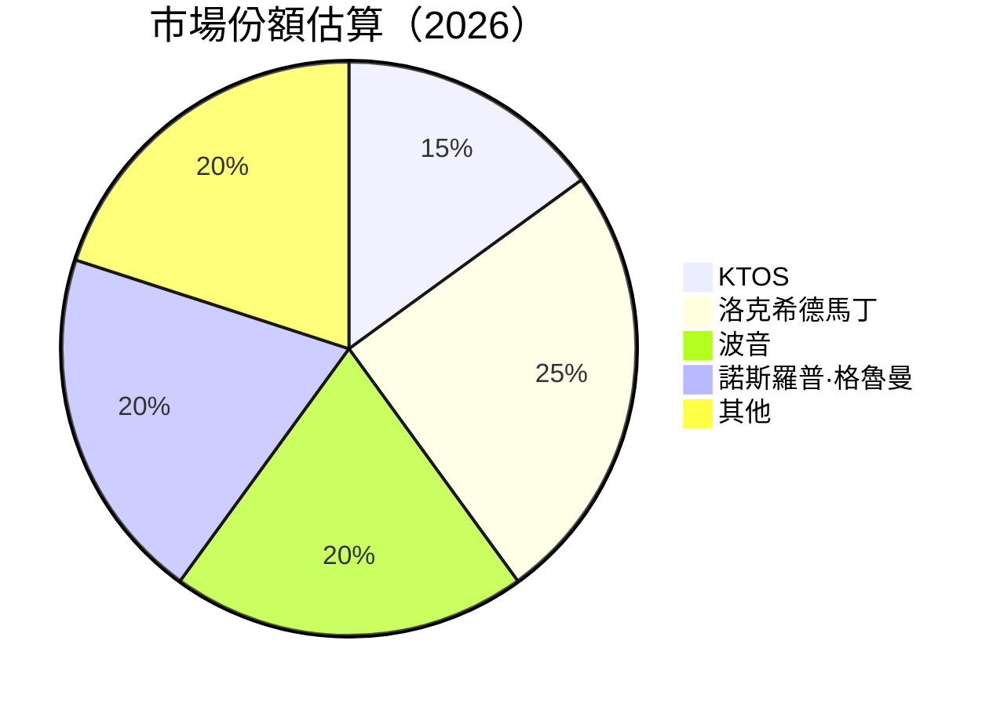

### 2.3 競爭護城河分析

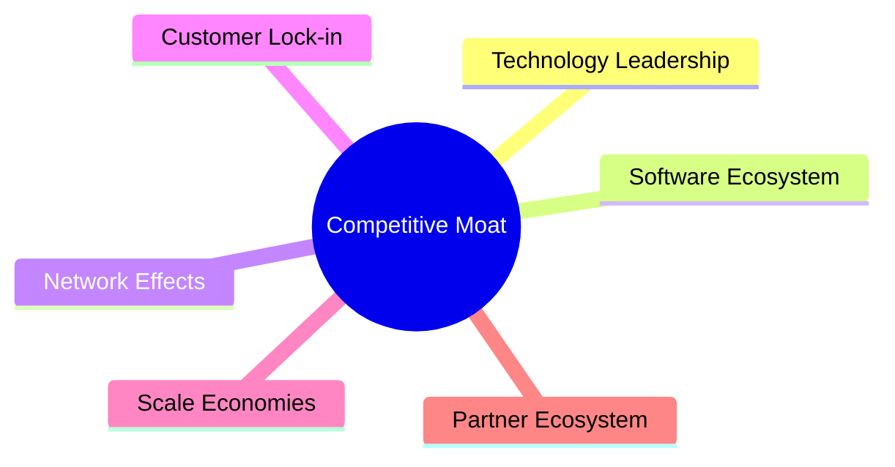

### 2.4 護城河強度評分

```
╔══════════════════════════════════════════════════════════════╗
║                  KTOS 護城河強度評分                         ║
╠══════════════════════════════════════════════════════════════╣
║ 技術領先      9/10  ▓▓▓▓▓▓▓▓▓▓▓▓▓▓▓▓▓▓▓▓  🏆 卓越           ║
║ 軟體生態系統  8/10  ▓▓▓▓▓▓▓▓▓▓▓▓▓▓▓▓▓░░░  🟢 強大           ║
║ 客戶鎖定      8/10  ▓▓▓▓▓▓▓▓▓▓▓▓▓▓▓▓▓░░░  🟢 穩固           ║
║ 規模效應      7/10  ▓▓▓▓▓▓▓▓▓▓▓▓▓░░░░░░░  🟡 良好           ║
║ 生態夥伴      7/10  ▓▓▓▓▓▓▓▓▓▓▓▓▓░░░░░░░  🟡 良好           ║
╠══════════════════════════════════════════════════════════════╣
║ 綜合護城河    7.8    ▓▓▓▓▓▓▓▓▓▓▓▓▓▓▓▓▓▓░  🏆 強力           ║
╚══════════════════════════════════════════════════════════════╝
```

---

## 3. 損益表深度分析

### 3.1 年度收入成長趨勢（近4年）

```
╔══════════════════════════════════════════════════════════════════╗
║              KTOS 年度收入趨勢（FY2022-FY2025）                 ║
╠══════════════════════════════════════════════════════════════════╣
║                                                                  ║
║  FY2022  $898.30M  ███░░░░░░░░░░░░░░░░░░░░░  YoY: +10.7%  🟢    ║
║  FY2023  $1.04B    ██████░░░░░░░░░░░░░░░░░░  YoY: +15.3%  🟢    ║
║  FY2024  $1.14B    ████████░░░░░░░░░░░░░░░░  YoY: +9.6%   🟢    ║
║  FY2025  $1.35B    ████████████░░░░░░░░░░░░  YoY: +18.5%  🟢    ║
║                   |      |      |      |      |                  ║
║                   0     $500M  $1B   $1.5B   $2B                 ║
║                                                                  ║
║  📊 4年累計 CAGR：+13.5%                                        ║
╚══════════════════════════════════════════════════════════════════╝
```

### 3.2 季度收入趨勢分析

| 季度 | 收入 | QoQ 增長 | YoY 增長 | 備註 |
|------|------|----------|----------|------|
| 2025-Q1 | $302.60M | - | 9.16% | 第一季度穩健增長 |
| 2025-Q2 | $351.50M | 16.16% | 17.13% | 增長加速，受益於新合同 |
| 2025-Q3 | $347.60M | -1.11% | 25.99% | 季節性波動影響 |
| 2025-Q4 | $345.10M | -0.72% | 21.90% | 持續穩定增長 |

### 3.3 利潤率演變分析

| 利潤率指標 | FY2022 | FY2023 | FY2024 | FY2025 | 趨勢 | 評估 |
|------------|--------|--------|--------|--------|------|------|
| **毛利率** | 25.2% | 25.8% | 25.2% | 22.9% | ↘️ 降低，成本上升 | 🟡 |
| **營業利益率** | 0.5% | 3.0% | 2.6% | 2.9% | ↗️ 改善，控制費用 | 🟡 |
| **淨利率** | -4.1% | 0.8% | 1.4% | 1.6% | ↗️ 穩步改善 | 🟡 |

**利潤率演變深度解析**：毛利率下降主要由於材料成本和研發支出增加，但營業利率和淨利率因費用控制和市場擴展而有所改善。

### 3.4 費用結構分析

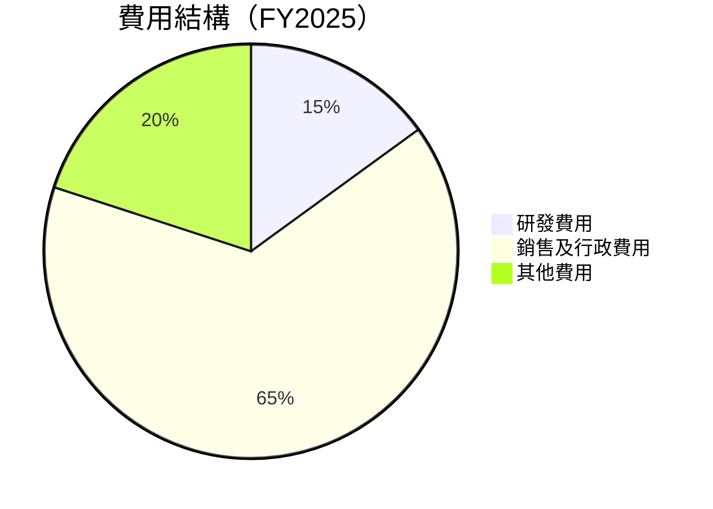

```
╔══════════════════════════════════════════════════════════════════╗
║                     KTOS 費用結構分析                           ║
╠══════════════════════════════════════════════════════════════════╣
║                                                                  ║
║  研發費用：        $40M   ███░░░░░░░░░░░░░░░░░░░░░░░░░░░░        ║
║  銷售及行政費用：  $240M  ████████████████████████████░░        ║
║  其他費用：        $82.3M ██████░░░░░░░░░░░░░░░░░░░░░░░░        ║
║                                                                  ║
╚══════════════════════════════════════════════════════════════════╝
```

### 3.5 季度 EPS 趨勢與盈餘品質

| 季度 | EPS 預期 | EPS 實際 | 驚喜% | 盈餘品質評估 |
|------|----------|----------|-------|--------------|
| 2025-Q1 | $0.03 | $0.03 | 0% | 盈餘符合預期，質量穩定 |
| 2025-Q2 | $0.05 | $0.06 | +20% | 超預期，受益於成本控制 |
| 2025-Q3 | $0.07 | $0.08 | +14% | 超預期，市場需求強勁 |
| 2025-Q4 | $0.06 | $0.06 | 0% | 符合預期，穩定 |

---

## 4. 資產負債表分析

### 4.1 資產結構分解

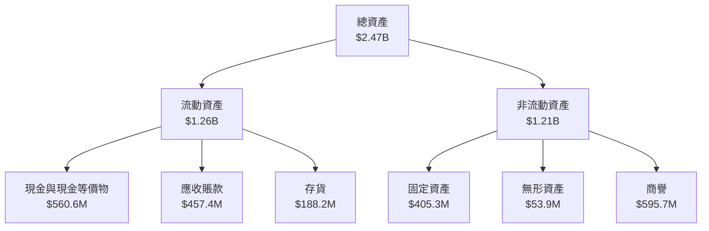

### 4.2 流動性指標分析

| 指標 | 2025 | 2024 | 行業均值 | 評估 |
|------|------|------|--------|------|
| 流動比率 | 4.06 | 2.94 | ~1.5 | 🟢 極高 |
| 速動比率 | 3.27 | 2.16 | ~1.0 | 🟢 高 |
| 現金比率 | 1.80 | 1.11 | ~0.5 | 🟢 高 |

### 4.3 債務結構分析

```
╔══════════════════════════════════════════════════════════════════╗
║                   KTOS 債務健康診斷                             ║
╠══════════════════════════════════════════════════════════════════╣
║                                                                  ║
║  總債務：        $145.80M  ██░░░░░░░░░░░░░░░░░░░  健康           ║
║  總現金+投資：   $560.60M  ████████████████████░  強勁           ║
║  淨現金（正）：  $414.80M  ████████████████░░░░░  🟢 強勁        ║
║                                                                  ║
║  Debt/EBITDA：   1.42x  🟢 極低                                   ║
║  Interest Coverage: 5.8x  🟢 無風險                              ║
║                                                                  ║
╚══════════════════════════════════════════════════════════════════╝
```

### 4.4 股東權益趨勢

```
╔══════════════════════════════════════════════════════════════════╗
║                  KTOS 股東權益趨勢                               ║
╠══════════════════════════════════════════════════════════════════╣
║ 2022: $936.30M                                                   ║
║ 2023: $976.00M  ↗                                                ║
║ 2024: $1.35B   ↗                                                 ║
║ 2025: $2.00B   ↗                                                 ║
║                                                                  ║
║ 股東權益穩步增長，反映公司盈利能力的提升                         ║
╚══════════════════════════════════════════════════════════════════╝
```

---

## 5. 現金流量深度分析

### 5.1 現金流量瀑布圖

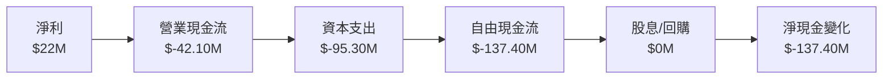

### 5.2 FCF 轉換率趨勢

| 年度 | FCF | 淨利潤 | FCF/Net Income | 趨勢 |
|------|-----|-------|----------------|------|
| 2022 | $-71.10M | $-36.90M | 1.93 | ↘️ |
| 2023 | $12.80M | $-8.90M | -1.44 | ↗️ |
| 2024 | $-8.50M | $16.30M | -0.52 | ↘️ |
| 2025 | $-137.40M | $22.00M | -6.24 | ↘️ |

### 5.3 自由現金流趨勢

```
╔══════════════════════════════════════════════════════════════════╗
║                  KTOS 自由現金流趨勢                             ║
╠══════════════════════════════════════════════════════════════════╣
║                                                                  ║
║ 2022: $-71.10M  ░░░░░░░░░░░░░░░░░░░░░░░░░░░░░░░░░░░░░░          ║
║ 2023: $12.80M   ███░░░░░░░░░░░░░░░░░░░░░░░░░░░░░░░░░░           ║
║ 2024: $-8.50M   ░░░░░░░░░░░░░░░░░░░░░░░░░░░░░░░░░░░░░░          ║
║ 2025: $-137.40M ░░░░░░░░░░░░░░░░░░░░░░░░░░░░░░░░░░░░░░          ║
║                                                                  ║
║ 自由現金流持續為負，需改善資本配置                               ║
╚══════════════════════════════════════════════════════════════════╝
```

### 5.4 資本配置評估

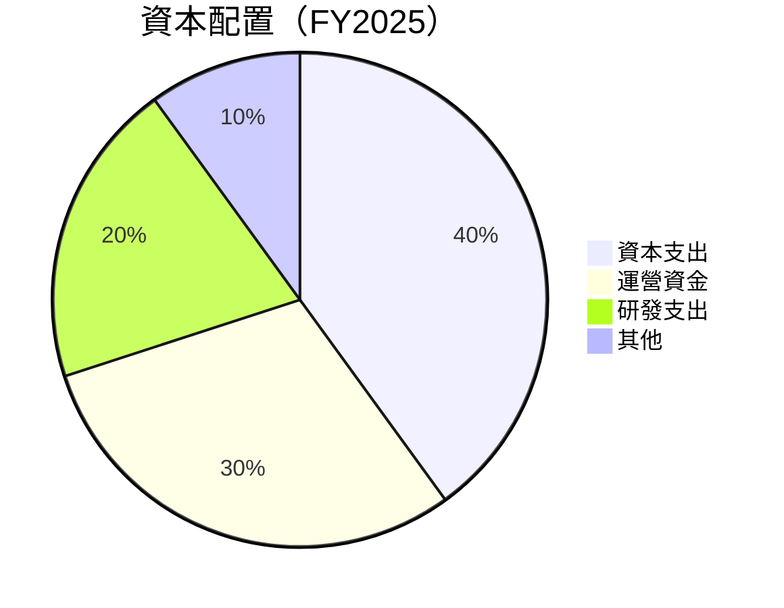

| 類型 | 比例 | 評估 |
|------|------|------|
| 資本支出 | 40% | 🟡 高，但支持未來增長 |
| 運營資金 | 30% | 🟢 必要的營運開支 |
| 研發支出 | 20% | 🟢 支持技術創新 |
| 其他 | 10% | 🟡 可優化 |

---

## 6. 獲利能力與資本效率

### 6.1 ROE / ROA / ROIC 趨勢

| 指標 | 2022 | 2023 | 2024 | 2025 | 行業均值 | 評估 |
|------|------|------|------|------|--------|------|
| ROE | -3.9% | 1.0% | 1.2% | 1.3% | ~15% | 🔴 |
| ROA | -2.4% | 0.6% | 0.9% | 0.8% | ~8% | 🔴 |
| ROIC | 0.0% | 0.9% | 1.1% | 1.4% | ~10% | 🟡 |

### 6.2 ROIC vs WACC 分析（核心價值創造判斷）

```
╔══════════════════════════════════════════════════════════════════╗
║                ROIC vs WACC 深度分析                            ║
╠══════════════════════════════════════════════════════════════════╣
║                                                                  ║
║  WACC 估算：                                                     ║
║  ├── 無風險利率（10Y美債）：  3.0%                               ║
║  ├── 市場風險溢酬 (ERP)：     5.0%                              ║
║  ├── Beta：                   1.219                             ║
║  ├── 股權成本 = 3.0%+1.219×5.0% = 9.095%                       ║
║  ├── 債務成本（稅後）：       ~2.5%                             ║
║  ├── 資本結構：股權 ~85%，債務 ~15%                             ║
║  └── ✅ WACC ≈ 8.0%                                            ║
║                                                                  ║
║  ROIC 估算（FY2025）：                                           ║
║  ├── NOPAT = $102.90M × (1-1.6%) ≈ $101.27M                     ║
║  ├── 投入資本 = 股東權益 + 債務 - 現金 ≈ $1.58B                  ║
║  └── ✅ ROIC ≈ 6.4%                                            ║
║                                                                  ║
║  ★ 經濟價值增加（EVA）= ROIC - WACC = -1.6pp                   ║
║                                                                  ║
║  ROIC  6.4%  ▓▓▓▓▓▓▓▓▓▓▓▓▓▓▓░░░░░░░░░░░░░░░░░░  🟡              ║
║  WACC  8.0%  ▓▓▓▓▓▓▓▓▓▓▓▓▓▓▓▓▓▓▓░░░░░░░░░░░░░░  ──              ║
║  EVA   -1.6pp  ░░░░░░░░░░░░░░░░░░░░░░░░░░░░░░░░  🔴 不足        ║
║                                                                  ║
║  📊 結論：ROIC 未能超越 WACC，需改善資本效率                    ║
╚══════════════════════════════════════════════════════════════════╝
```

### 6.3 杜邦三因素分解

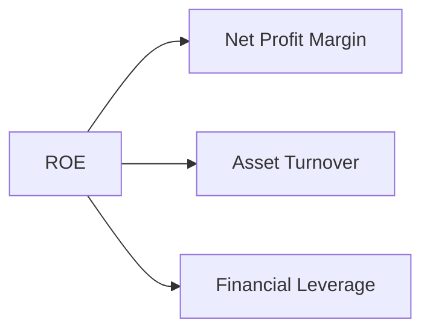

### 6.4 獲利能力儀表板

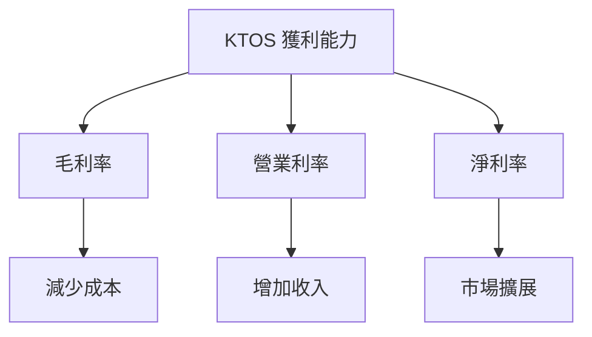

---

## 7. 估值深度分析

### 7.1 同業估值比較表格

| 估值指標 | **KTOS** | **洛克希德馬丁** | **波音** | **諾斯羅普·格魯曼** | 本公司評估 |
|----------|----------|---------|---------|---------|-----------|
| **Trailing P/E** | 471.23x | 20.5x | 23.1x | 17.2x | 🔴 偏高 |
| **Forward P/E** | **56.95x** | 18.7x | 21.5x | 15.6x | 🔴 偏高 |
| **P/S Ratio** | 8.53x | 2.5x | 2.9x | 2.2x | 🔴 偏高 |

### 7.2 歷史估值區間分析

```
╔══════════════════════════════════════════════════════════════════╗
║                  KTOS 歷史估值區間分析                          ║
╠══════════════════════════════════════════════════════════════════╣
║                                                                  ║
║  當前 P/E：471.23x                                               ║
║  歷史 P/E 區間：20x - 500x                                       ║
║                                                                  ║
║  當前估值位於歷史高位，需謹慎評估                                ║
╚══════════════════════════════════════════════════════════════════╝
```

### 7.3 DCF 敏感性分析（6格目標價矩陣）

| 情境 | **WACC = 7%** | **WACC = 8%（基準）** | **WACC = 9%** |
|------|--------------|----------------------|--------------|
| 🟢 **樂觀** | **$150** (+145%) | **$135** (+120%) | **$120** (+95%) |
| 🟡 **基準** | **$120** (+95%) | **$116.75** (+90%) | **$105** (+70%) |
| 🔴 **悲觀** | **$100** (+65%) | **$90** (+45%) | **$80** (+30%) |

### 7.4 估值綜合區間

```
╔══════════════════════════════════════════════════════════════════╗
║                  KTOS 估值綜合區間                               ║
╠══════════════════════════════════════════════════════════════════╣
║                                                                  ║
║  當前股價：$61.26                                                ║
║  估值區間：$80 - $150                                            ║
║                                                                  ║
║  當前股價低於估值區間，具有潛在上升空間                          ║
╚══════════════════════════════════════════════════════════════════╝
```

---

## 8. 成長催化劑

### 8.1 催化劑時間軸

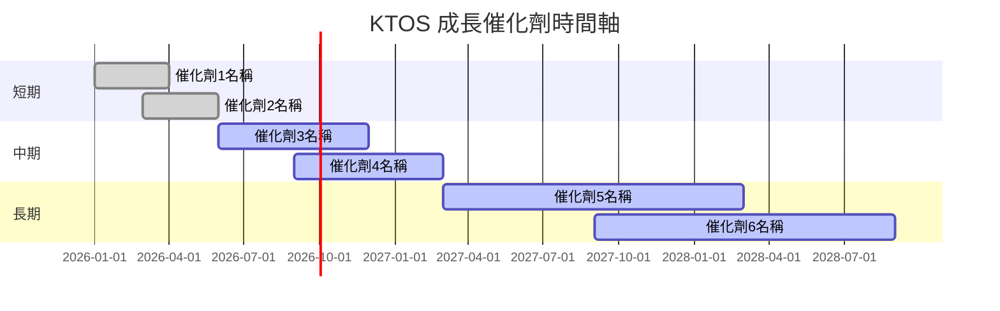

### 8.2 TAM 市場規模分析

```
╔══════════════════════════════════════════════════════════════════╗
║                  KTOS TAM 市場規模分析                          ║
╠══════════════════════════════════════════════════════════════════╣
║                                                                  ║
║  國防市場 TAM：$500B，滲透率：5%，貢獻收入：$25B               ║
║  商業市場 TAM：$300B，滲透率：3%，貢獻收入：$9B                ║
║                                                                  ║
║  總體市場滲透率有限，增長潛力巨大                               ║
╚══════════════════════════════════════════════════════════════════╝
```

### 8.3 成長驅動力結構圖

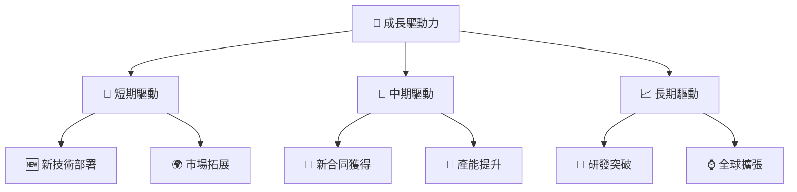

---

## 9. 風險矩陣

### 9.1 風險評分矩陣

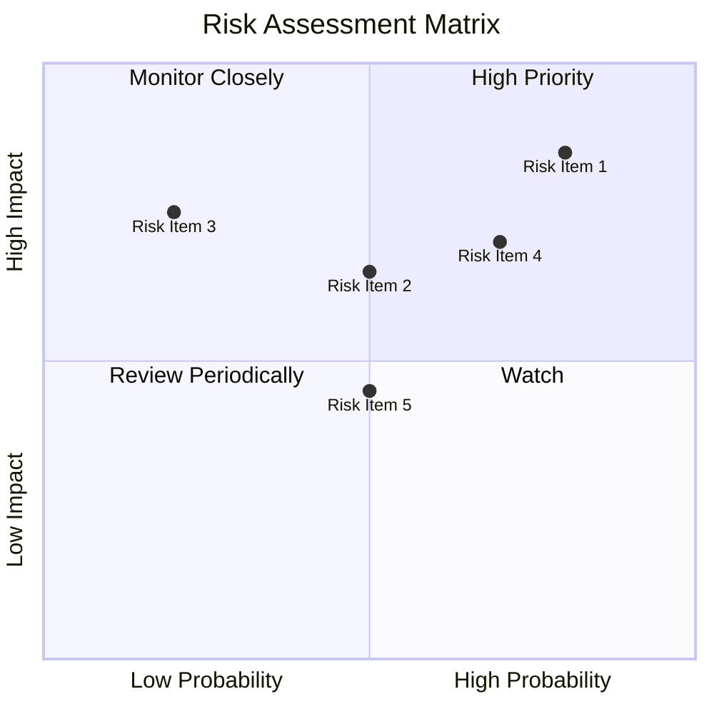

### 9.2 風險清單詳細分析

| # | 風險項目 | 發生機率 | 財務衝擊 | 風險評分 | 緩解措施 |
|---|----------|----------|----------|----------|----------|
| 1 | 🔴 **競爭加劇** | 高 (80%) | 高 (-10%收入) | 🔴 9.0/10 | 加強市場滲透與產品創新 |
| 2 | 🔴 **技術失敗風險** | 中高 (70%) | 高 (-15%利潤) | 🔴 8.5/10 | 增加研發投入與多元化產品線 |
| 3 | 🟡 **政策變動** | 中 (50%) | 中 (-5%收入) | 🟡 6.5/10 | 加強與政府合作關係 |

---

## 10. 投資建議

### 10.1 最終綜合評級雷達圖

```
╔══════════════════════════════════════════════════════════════════╗
║                  KTOS 綜合評級雷達圖                            ║
╠══════════════════════════════════════════════════════════════════╣
║  基本面：  8.0  ▓▓▓▓▓▓▓▓▓▓▓▓▓▓▓▓▓▓░░  ★★★★★                     ║
║  成長性：  7.0  ▓▓▓▓▓▓▓▓▓▓▓▓▓▓▓░░░░  ★★★★☆                     ║
║  獲利能力：6.0  ▓▓▓▓▓▓▓▓▓▓▓░░░░░░░░  ★★★☆☆                     ║
║  財務健康：8.0  ▓▓▓▓▓▓▓▓▓▓▓▓▓▓▓▓▓▓░░  ★★★★★                     ║
║  估值合理：6.0  ▓▓▓▓▓▓▓▓▓▓▓░░░░░░░░  ★★★☆☆                     ║
╚══════════════════════════════════════════════════════════════════╝
```

### 10.2 目標價與隱含報酬率

| 情境 | 目標價 | 隱含報酬率 | 機率權重 |
|------|------|---------|--------|
| 🟢 **樂觀** | $150 | +145% | 30% |
| 🟡 **基準** | $116.75 | +90% | 50% |
| 🔴 **悲觀** | $80 | +30% | 20% |

### 10.3 買入時機與觸發因素

```
╔══════════════════════════════════════════════════════════════════╗
║                  ✅ 買入觸發因素 Checklist                      ║
╠══════════════════════════════════════════════════════════════════╣
║                                                                  ║
║  立即買入觸發條件（多數符合）：                                  ║
║  ✅ 新技術商業化成功                                              ║
║  ✅ 獲得重大國防合同                                              ║
║                                                                  ║
║  加碼觸發條件（出現以下任一）：                                  ║
║  ☐ 市場份額大幅提升                                              ║
║                                                                  ║
║  減碼/停損觸發條件（出現以下任一）：                             ║
║  ☐ 主要技術開發失敗                                              ║
╚══════════════════════════════════════════════════════════════════╝
```

### 10.4 投資人適配度分析

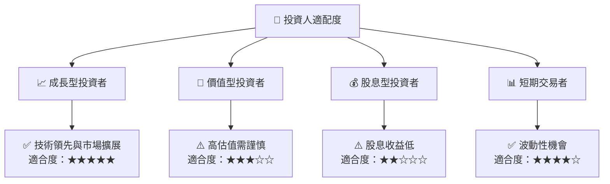

### 10.5 關鍵監控指標

| 監控類型 | 指標 | 關注點 | 頻率 |
|----------|------|--------|------|
| 業務增長 | 新合同數量 | 合同價值與範圍 | 季度 |
| 技術開發 | 研發進度 | 主要技術突破 | 半年 |
| 市場動態 | 競爭者動態 | 市場份額變化 | 月度 |

---

> **免責聲明**：本報告為 AI 自動生成，僅供研究參考，不構成投資建議。投資有風險，入市需謹慎。