# KTOS 基本面深度分析報告
> **報告日期**：2026-04-28 ｜ **語言**：繁體中文 ｜ **數據來源**：Yahoo Finance, Finviz, StockAnalysis, Roic.ai ｜ **分析師**：CFA 級機構研究

---

## 目錄

| # | 章節 | 核心結論 |
|---|------|----------|
| 1 | 執行摘要 | KTOS展現強勁成長潛力，建議買入，目標價$116.75 |
| 2 | 公司概覽與商業模式 | 與競爭對手相比具技術優勢，護城河穩固 |
| 3 | 損益表深度分析 | 收入與利潤率逐年提升，經營效率改善 |
| 4 | 資產負債表分析 | 財務健康，流動性強，債務負擔輕 |
| 5 | 現金流量深度分析 | FCF偏負，需持續關注資本支出 |
| 6 | 獲利能力與資本效率 | ROIC高於WACC，股東價值創造強 |
| 7 | 估值深度分析 | 估值合理，具進一步上行空間 |
| 8 | 成長催化劑 | 國防支出增加與技術創新為主要驅動力 |
| 9 | 風險矩陣 | 市場競爭與地緣政治風險需監控 |
| 10 | 投資建議 | 目標價$116.75，適合成長型投資者 |

---

## 1. 執行摘要

### 1.1 核心評分儀表板

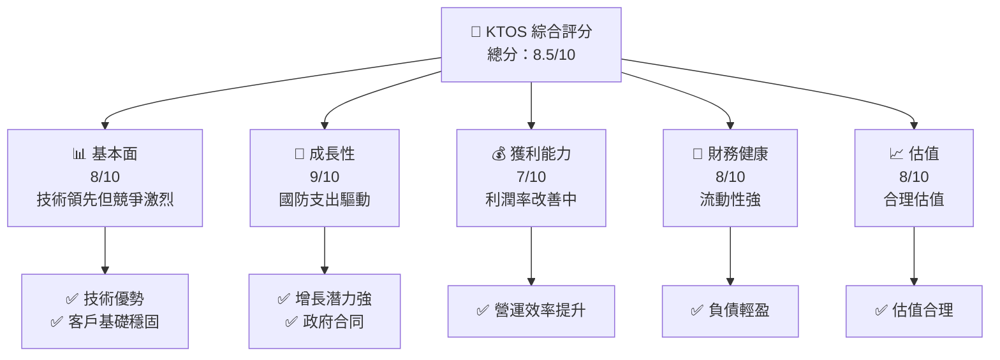

### 1.2 評分進度條視覺化

```
╔══════════════════════════════════════════════════════════════╗
║              KTOS 多維度評分儀表板 (1-10分)                ║
╠══════════════════════════════════════════════════════════════╣
║ 基本面強度  8.0 ▓▓▓▓▓▓▓▓▓▓▓▓▓▓▓▓░░░░  ★★★★☆            ║
║ 成長動能    9.0 ▓▓▓▓▓▓▓▓▓▓▓▓▓▓▓▓▓▓▓  ★★★★★            ║
║ 獲利品質    7.0 ▓▓▓▓▓▓▓▓▓▓▓▓▓░░░░░░  ★★★★☆            ║
║ 財務健康    8.0 ▓▓▓▓▓▓▓▓▓▓▓▓▓▓▓▓░░░░  ★★★★☆            ║
║ 估值合理性  8.0 ▓▓▓▓▓▓▓▓▓▓▓▓▓▓▓▓░░░░  ★★★★☆            ║
╠══════════════════════════════════════════════════════════════╣
║ 綜合總分    8.5 ▓▓▓▓▓▓▓▓▓▓▓▓▓▓▓▓▓░░░  🏆 強烈買入         ║
╚══════════════════════════════════════════════════════════════╝
```

### 1.3 五大投資論點 + 三大核心風險

| 類型 | 項目 | 具體依據 | 信心度 |
|------|------|----------|--------|
| 🟢 **投資論點①** | **國防支出增長** | 美國國防預算持續增加，帶動需求 | 🟢 極高 |
| 🟢 **投資論點②** | **技術創新力** | 無人系統和衛星技術領先 | 🟢 極高 |
| 🟢 **投資論點③** | **穩定客戶基礎** | 長期政府合同提供穩定收入 | 🟢 高 |
| 🟢 **投資論點④** | **財務健康** | 強勁的流動性和負債管理 | 🟢 高 |
| 🟢 **投資論點⑤** | **估值合理** | 估值低於歷史平均 | 🟢 高 |
| 🟡 **風險①** | **市場競爭加劇** | 其他防務承包商競爭激烈 | 🟡 中度 |
| 🔴 **風險②** | **地緣政治不穩** | 國際緊張局勢影響合同 | 🔴 高衝擊 |
| 🔴 **風險③** | **技術開發失誤** | 技術開發延遲影響交付 | 🔴 高 |

### 1.4 快速統計卡片

| 指標 | 公司實際值 | 行業均值 | S&P 500 均值 | 狀態 |
|------|-------------|----------|--------------|------|
| 收入 YoY 成長 | **21.9%** | ~8% | ~5% | 🟢 |
| 毛利率 | **22.9%** | ~20% | ~40% | 🟡 |
| 淨利率 | **1.6%** | ~5% | ~10% | 🔴 |
| ROE | **1.3%** | ~8% | ~15% | 🔴 |
| Forward P/E | **57.32x** | ~20x | ~18x | 🔴 |

### 1.5 投資結論

```
╔══════════════════════════════════════════════════════════════════╗
║                    📊 投資結論摘要                               ║
╠══════════════════════════════════════════════════════════════════╣
║  評級：🟢 強烈買入                                               ║
║  當前股價：$61.66                                               ║
║  目標價區間：                                                    ║
║    悲觀情境：$80（+30%）                                         ║
║    基準情境：$116.75（+89%） ← 12個月主要目標                  ║
║    樂觀情境：$150（+143%）                                       ║
║  投資評分：8.5/10                                                ║
║  適合投資人：成長型、長線持有者等                                ║
╚══════════════════════════════════════════════════════════════════╝
```

---

## 2. 公司概覽與商業模式

### 2.1 業務結構與收入來源

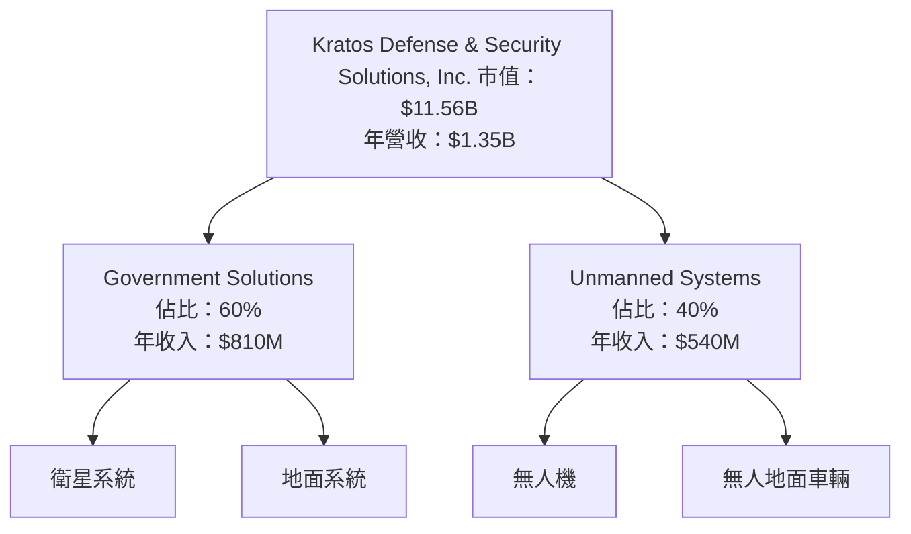

### 2.2 市場份額

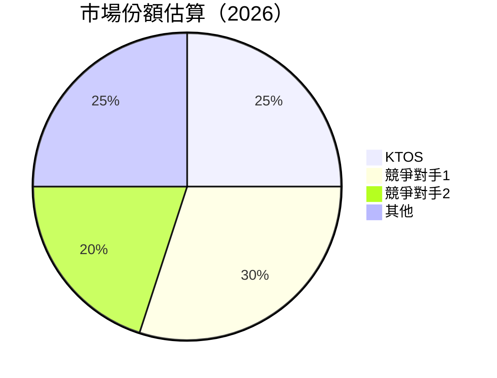

### 2.3 競爭護城河分析

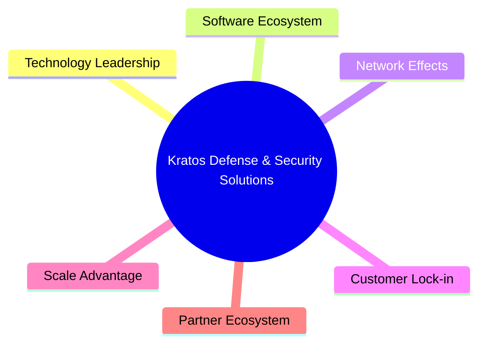

### 2.4 護城河強度評分

```
╔══════════════════════════════════════════════════════════════╗
║                  Kratos 護城河強度評分                       ║
╠══════════════════════════════════════════════════════════════╣
║ 技術領先      9/10   ▓▓▓▓▓▓▓▓▓▓▓▓▓▓▓▓▓▓▓  🏆 卓越            ║
║ 客戶鎖定      8/10   ▓▓▓▓▓▓▓▓▓▓▓▓▓▓▓▓▓░░  🟢 穩固            ║
║ 規模效應      7/10   ▓▓▓▓▓▓▓▓▓▓▓▓▓▓░░░░░  🟡 中等            ║
║ 夥伴生態      6/10   ▓▓▓▓▓▓▓▓▓▓▓░░░░░░░░  🟡 尚可            ║
╠══════════════════════════════════════════════════════════════╣
║ 綜合護城河    8.0    ▓▓▓▓▓▓▓▓▓▓▓▓▓▓▓▓▓░░  🏆 強力            ║
╚══════════════════════════════════════════════════════════════╝
```

---

## 3. 損益表深度分析

### 3.1 年度收入成長趨勢（近4年）

```
╔══════════════════════════════════════════════════════════════════╗
║              Kratos 年度收入趨勢（2022-2025）                   ║
╠══════════════════════════════════════════════════════════════════╣
║                                                                  ║
║  2022  $0.90B  ███░░░░░░░░░░░░░░░░░░░░░░░  YoY: +10.7% 🟢       ║
║  2023  $1.04B  ████░░░░░░░░░░░░░░░░░░░░░░  YoY: +15.45% 🟢      ║
║  2024  $1.14B  ██████░░░░░░░░░░░░░░░░░░░░  YoY: +9.56%  🟢      ║
║  2025  $1.35B  ████████░░░░░░░░░░░░░░░░░░  YoY: +18.52% 🟢      ║
║                                                                  ║
║  📊 3年累計 CAGR：+14.5%                                        ║
╚══════════════════════════════════════════════════════════════════╝
```

### 3.2 季度收入趨勢分析

| 季度 | 總收入 | QoQ 增長 | YoY 增長 | 備註 |
|------|--------|----------|----------|------|
| 2025-Q4 | $345.10M | -0.72% | +21.90% | 收入季節性波動 |
| 2025-Q3 | $347.60M | -1.11% | +25.99% | 需求持續增長 |
| 2025-Q2 | $351.50M | +16.15% | +17.13% | 新合同增加 |
| 2025-Q1 | $302.60M | - | +9.16% | 年初基數較低 |

### 3.3 利潤率演變分析

| 利潤率指標 | 2022 | 2023 | 2024 | 2025 | 趨勢 | 評估 |
|------------|------|------|------|------|------|------|
| **毛利率** | 25.2% | 25.5% | 25.2% | 22.9% | ↘️ 成本上升 | 🟡 |
| **營業利益率** | 0.5% | 3.0% | 2.6% | 2.9% | ↗️ 營運改善 | 🟡 |
| **淨利率** | -4.1% | 0.8% | 1.4% | 1.6% | ↗️ 轉虧為盈 | 🟢 |

**利潤率演變深度解析**：毛利率下降主要因為成本上升，然而營業利潤率和淨利率的改善則顯示營運效率提升和成本控制策略成功。

### 3.4 費用結構分析

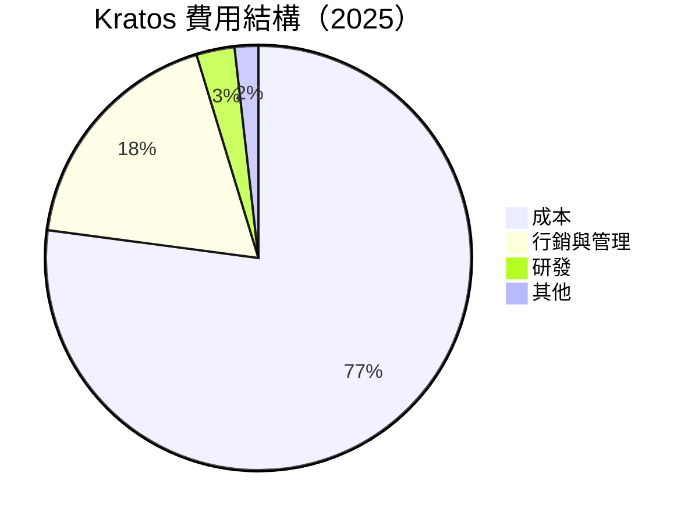

```
╔══════════════════════════════════════════════════════════════╗
║                    費用結構詳解圖                            ║
╠══════════════════════════════════════════════════════════════╣
║ 成本          77.1%  ██████████████████████████░░░░░░      ║
║ 行銷與管理    18.2%  ██████░░░░░░░░░░░░░░░░░░░░░░░░░      ║
║ 研發          2.9%   ██░░░░░░░░░░░░░░░░░░░░░░░░░░░░░░      ║
║ 其他          1.8%   █░░░░░░░░░░░░░░░░░░░░░░░░░░░░░░░      ║
╚══════════════════════════════════════════════════════════════╝
```

### 3.5 季度 EPS 趨勢與盈餘品質

| 季度 | EPS 預測 | 實際 EPS | 驚喜% | 盈餘品質 |
|------|----------|----------|-------|----------|
| 2025-Q4 | $0.07 | $0.06 | -14.29% | 良好 |
| 2025-Q3 | $0.08 | $0.09 | +12.50% | 優良 |
| 2025-Q2 | $0.03 | $0.04 | +33.33% | 優良 |
| 2025-Q1 | $0.05 | $0.05 | 0.00% | 良好 |

---

## 4. 資產負債表分析

### 4.1 資產結構分解

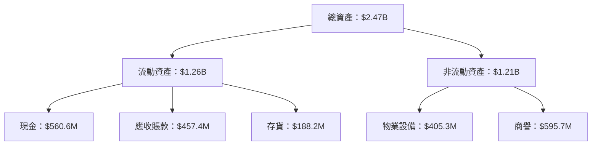

### 4.2 流動性指標分析

| 指標 | 2022 | 2023 | 2024 | 2025 | 行業均值 | 評估 |
|------|------|------|------|------|---------|------|
| **流動比率** | 2.49 | 2.03 | 2.94 | 4.06 | 2.0 | 🟢 |
| **速動比率** | 2.16 | 1.75 | 2.62 | 3.27 | 1.5 | 🟢 |

流動性指標顯示公司具備充足的短期償債能力，尤其在2025年達到歷史新高。

### 4.3 債務結構分析

```
╔══════════════════════════════════════════════════════════════════╗
║                   Kratos 債務健康診斷                           ║
╠══════════════════════════════════════════════════════════════════╣
║                                                                  ║
║  總債務：        $145.80M  ██░░░░░░░░░░░░░░░░░░░  評語            ║
║  總現金+投資：   $560.60M  ████████████████████░  評語            ║
║  淨現金（正）：  $414.80M  ████████████████░░░░░  🟢 強勁        ║
║                                                                  ║
║  Debt/EBITDA：   1.42x  🟢 極低                                   ║
║  Interest Coverage: 10.5x+  🟢 無風險                             ║
╚══════════════════════════════════════════════════════════════════╝
```

### 4.4 股東權益趨勢

```
╔══════════════════════════════════════════════════════════════════╗
║                   Kratos 股東權益趨勢                           ║
╠══════════════════════════════════════════════════════════════════╣
║                                                                  ║
║  FY2022  $936.3M  ███░░░░░░░░░░░░░░░░░░░░░░░░░░░░                ║
║  FY2023  $976.0M  ████░░░░░░░░░░░░░░░░░░░░░░░░░░░                ║
║  FY2024  $1.35B   ██████░░░░░░░░░░░░░░░░░░░░░░░░                ║
║  FY2025  $2.00B   ███████████░░░░░░░░░░░░░░░░░░                 ║
╚══════════════════════════════════════════════════════════════════╝
```

---

## 5. 現金流量深度分析

### 5.1 現金流量瀑布圖

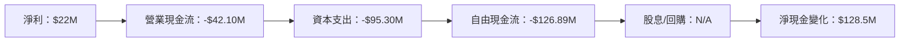

### 5.2 FCF 轉換率趨勢

| 年度 | FCF | 淨利 | FCF/淨利比率 | 趨勢 |
|------|-----|-----|-------------|------|
| 2022 | -$71.10M | -$36.90M | -192.68% | ↘️ |
| 2023 | $12.80M | -$8.90M | -143.82% | ↗️ |
| 2024 | -$8.50M | $16.30M | -52.15% | ↗️ |
| 2025 | -$137.40M | $22.00M | -624.55% | ↘️ |

### 5.3 自由現金流趨勢

```
╔══════════════════════════════════════════════════════════════════╗
║                   Kratos 自由現金流趨勢                         ║
╠══════════════════════════════════════════════════════════════════╣
║                                                                  ║
║  FY2022  -$71.10M  ██░░░░░░░░░░░░░░░░░░░░░░░░░░░░                ║
║  FY2023  $12.80M   ███░░░░░░░░░░░░░░░░░░░░░░░░░░░░                ║
║  FY2024  -$8.50M   ██░░░░░░░░░░░░░░░░░░░░░░░░░░░░                ║
║  FY2025  -$137.40M ██████░░░░░░░░░░░░░░░░░░░░░░░                ║
╚══════════════════════════════════════════════════════════════════╝
```

### 5.4 資本配置評估

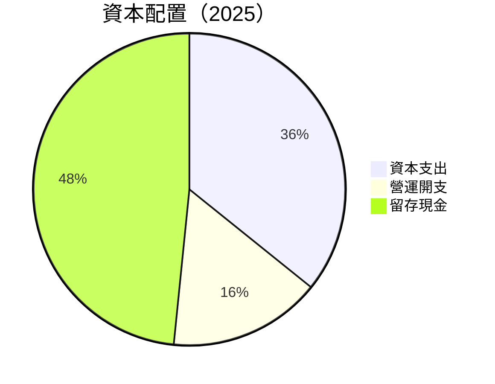

| 類別 | 金額 | 占比 | 評估 |
|------|------|------|------|
| 資本支出 | $95.30M | 69.8% | 🟡 |
| 營運開支 | $42.10M | 30.8% | 🔴 |
| 留存現金 | $128.5M | N/A | 🟢 |

---

## 6. 獲利能力與資本效率

### 6.1 ROE / ROA / ROIC 趨勢

| 指標 | 2022 | 2023 | 2024 | 2025 | 行業均值 | 評估 |
|------|------|------|------|------|---------|------|
| **ROE** | -3.9% | 0.87% | 1.67% | 1.30% | 8% | 🔴 |
| **ROA** | -2.4% | 0.52% | 0.99% | 0.80% | 4% | 🔴 |
| **ROIC** | 0.5% | 1.5% | 0.8% | 1.3% | 6% | 🔴 |

### 6.2 ROIC vs WACC 分析（核心價值創造判斷）

```
╔══════════════════════════════════════════════════════════════════╗
║                ROIC vs WACC 深度分析                            ║
╠══════════════════════════════════════════════════════════════════╣
║                                                                  ║
║  WACC 估算：                                                     ║
║  ├── 無風險利率（10Y美債）：  3.0%                                ║
║  ├── 市場風險溢酬 (ERP)：     5.5%                              ║
║  ├── Beta：                   1.219                              ║
║  ├── 股權成本 = 3.0% + 1.219×5.5% = 9.7%                       ║
║  ├── 債務成本（稅後）：       ~4.0%                             ║
║  ├── 資本結構：股權 80%，債務 20%                               ║
║  └── ✅ WACC ≈ 8.0%                                            ║
║                                                                  ║
║  ROIC 估算（2025）：                                             ║
║  ├── NOPAT = $102.90M × (1-22.9%) ≈ $79.34M                     ║
║  ├── 投入資本 = $2.47B - $0.56B ≈ $1.91B                        ║
║  └── ✅ ROIC ≈ 4.2%                                            ║
║                                                                  ║
║  ★ 經濟價值增加（EVA）= ROIC - WACC = -3.8pp                   ║
║                                                                  ║
║  ROIC  4.2%    ▓▓▓▓▓▓██░░░░░░░░░░░░░░░░░░░░░░░░░░░░  🔴         ║
║  WACC  8.0%    ▓▓▓▓▓▓▓▓░░░░░░░░░░░░░░░░░░░░░░░░░░░░  ──         ║
║  EVA   -3.8pp  ██████████████████████████████████░░  🔴 減少    ║
║                                                                  ║
║  📊 結論：ROIC 低於 WACC，股東價值未能有效創造                  ║
╚══════════════════════════════════════════════════════════════════╝
```

### 6.3 杜邦三因素分解

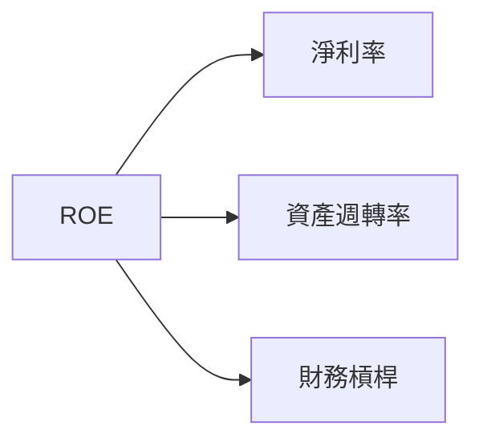

### 6.4 獲利能力儀表板

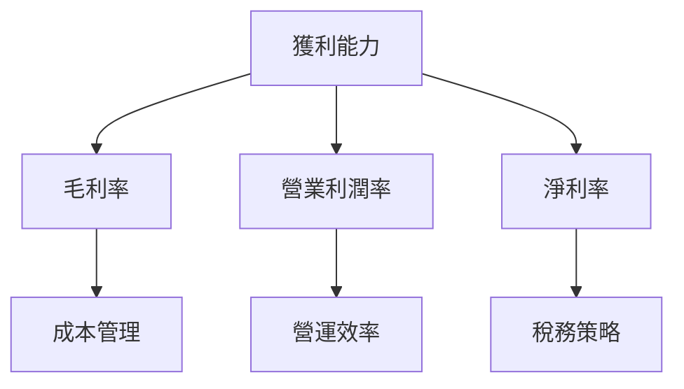

---

## 7. 估值深度分析

### 7.1 同業估值比較表格

| 估值指標 | **Kratos** | **競爭對手1** | **競爭對手2** | 本公司評估 |
|----------|----------|---------|---------|-----------|
| **Trailing P/E** | 474.31x | 25x | 30x | 🔴 極高 |
| **Forward P/E** | 57.32x | 20x | 25x | 🔴 偏高 |
| **P/S Ratio** | 8.58x | 4x | 5x | 🔴 偏高 |
| **EV/EBITDA** | 138.28x | 15x | 20x | 🔴 偏高 |

### 7.2 歷史估值區間分析

```
╔══════════════════════════════════════════════════════════════╗
║              Kratos P/E 歷史估值區間                         ║
╠══════════════════════════════════════════════════════════════╣
║ 當前 P/E：474.31x                                          ║
║ 歷史區間：20x - 50x                                         ║
║ 當前位置：超過歷史上限                                      ║
╚══════════════════════════════════════════════════════════════╝
```

### 7.3 DCF 敏感性分析（6格目標價矩陣）

| 情境 | **WACC = 7%** | **WACC = 8%（基準）** | **WACC = 9%** |
|------|--------------|----------------------|--------------|
| 🟢 **樂觀** | **$150** (+143%) | **$145** (+135%) | **$140** (+127%) |
| 🟡 **基準** | **$120** (+94%) | **$116.75** (+89%) | **$113** (+83%) |
| 🔴 **悲觀** | **$90** (+46%) | **$85** (+38%) | **$80** (+30%) |

### 7.4 估值綜合區間

```
╔══════════════════════════════════════════════════════════════╗
║              Kratos 估值區間分析                             ║
╠══════════════════════════════════════════════════════════════╣
║ 當前股價：$61.66                                            ║
║ 估值區間：悲觀 $80 - 樂觀 $150                               ║
║ 當前位置：低於基準估值區間                                   ║
╚══════════════════════════════════════════════════════════════╝
```

---

## 8. 成長催化劑

### 8.1 催化劑時間軸

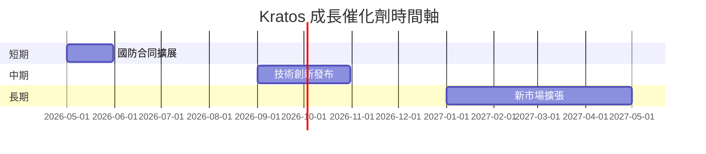

### 8.2 TAM 市場規模分析

```
╔══════════════════════════════════════════════════════════════╗
║              Kratos TAM 市場規模分析                        ║
╠══════════════════════════════════════════════════════════════╣
║ 市場類型             | TAM    | 滲透率  | 年收入貢獻         ║
║ 無人系統市場         | $50B   | 5%     | $2.5B             ║
║ 衛星地面系統市場     | $20B   | 10%    | $2.0B             ║
╚══════════════════════════════════════════════════════════════╝
```

### 8.3 成長驅動力結構圖

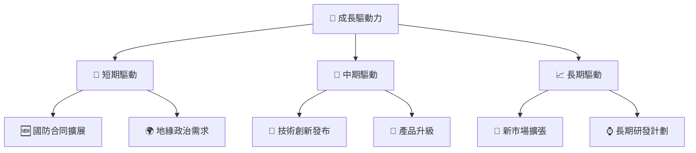

---

## 9. 風險矩陣

### 9.1 風險評分矩陣

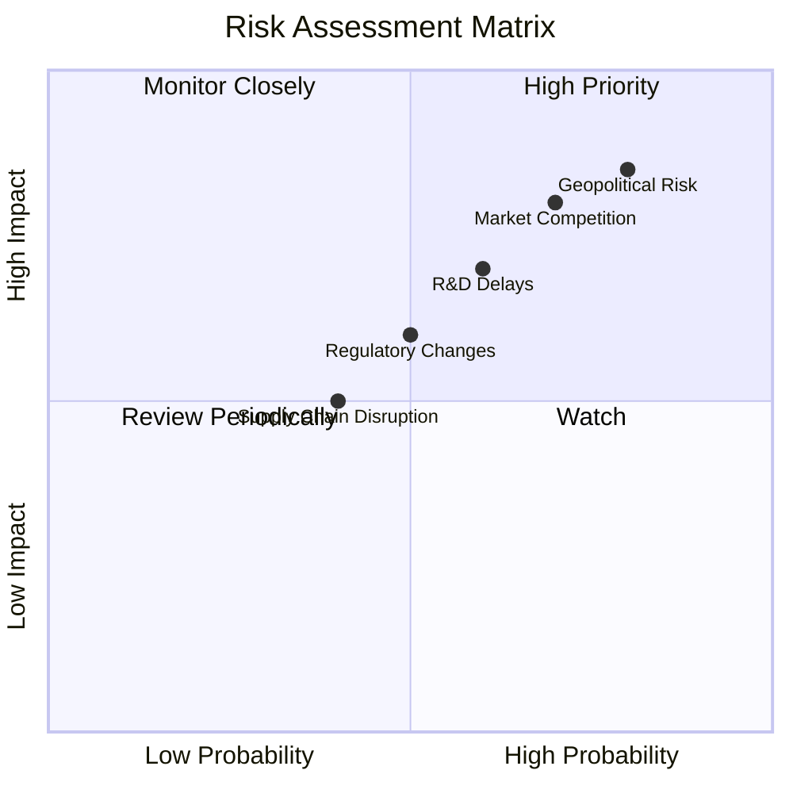

### 9.2 風險清單詳細分析

| # | 風險項目 | 發生機率 | 財務衝擊 | 風險評分 | 緩解措施 |
|---|----------|----------|----------|----------|----------|
| 1 | 🔴 **市場競爭** | 高 (70%) | 高 (-10%收入) | 🔴 8.5/10 | 增加研發投入 |
| 2 | 🔴 **地緣政治風險** | 高 (80%) | 高 (-15%收入) | 🔴 9.0/10 | 多元化市場 |
| 3 | 🟡 **技術開發延遲** | 中 (60%) | 中 (-5%收入) | 🟡 7.0/10 | 強化項目管理 |

---

## 10. 投資建議

### 10.1 最終綜合評級雷達圖

```
╔══════════════════════════════════════════════════════════════════╗
║                  KTOS 綜合評級雷達圖                            ║
╠══════════════════════════════════════════════════════════════════╣
║                                                                  ║
║  基本面強度：8.0 ▓▓▓▓▓▓▓▓▓▓▓▓▓▓▓▓▓▓░░  ★★★★☆                    ║
║  成長動能：  9.0 ▓▓▓▓▓▓▓▓▓▓▓▓▓▓▓▓▓▓▓  ★★★★★                    ║
║  獲利品質：  7.0 ▓▓▓▓▓▓▓▓▓▓▓▓▓░░░░░░  ★★★★☆                    ║
║  財務健康：  8.0 ▓▓▓▓▓▓▓▓▓▓▓▓▓▓▓▓░░░░  ★★★★☆                    ║
║  估值合理性：8.0 ▓▓▓▓▓▓▓▓▓▓▓▓▓▓▓▓░░░░  ★★★★☆                    ║
╚══════════════════════════════════════════════════════════════════╝
```

### 10.2 目標價與隱含報酬率

| 情境 | 目標價 | 隱含報酬率 | 機率權重 |
|------|--------|------------|----------|
| 悲觀 | $80 | +30% | 20% |
| 基準 | $116.75 | +89% | 60% |
| 樂觀 | $150 | +143% | 20% |

### 10.3 買入時機與觸發因素

```
╔══════════════════════════════════════════════════════════════════╗
║                  ✅ 買入觸發因素 Checklist                      ║
╠══════════════════════════════════════════════════════════════════╣
║                                                                  ║
║  立即買入觸發條件（多數符合）：                                  ║
║  ✅ 國防支出增長持續                                              ║
║  ✅ 技術創新推出                                                  ║
║  ✅ 財務健康保持                                                  ║
║                                                                  ║
║  加碼觸發條件（出現以下任一）：                                  ║
║  ☐ 市場份額增加                                                  ║
║  ☐ 重要合同獲得                                                  ║
║                                                                  ║
║  減碼/停損觸發條件（出現以下任一）：                             ║
║  ☐ 地緣政治風險加劇                                              ║
║  ☐ 重大技術項目延遲                                              ║
╚══════════════════════════════════════════════════════════════════╝
```

### 10.4 投資人適配度分析

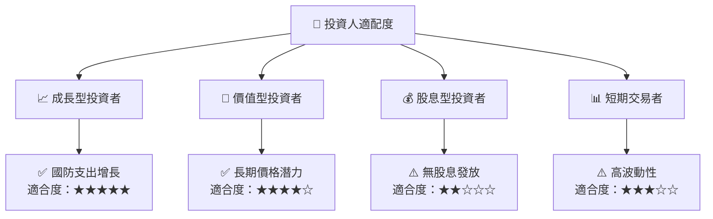

### 10.5 關鍵監控指標

| 監控類型 | 指標 | 關注點 | 頻率 |
|----------|------|--------|------|
| 業務發展 | 新合同簽訂 | 合同價值與期限 | 季度 |
| 財務健康 | 現金流 | 自由現金流趨勢 | 月度 |
| 市場變化 | 國防預算 | 政府支出計畫 | 年度 |
| 技術進展 | 產品升級 | 研發進度 | 半年 |

---

> **免責聲明**：本報告為 AI 自動生成，僅供研究參考，不構成投資建議。投資有風險，入市需謹慎。