# KTOS 基本面深度分析報告
> **報告日期**：2026-04-29 ｜ **語言**：繁體中文 ｜ **數據來源**：Yahoo Finance, Finviz, StockAnalysis, Roic.ai ｜ **分析師**：CFA 級機構研究

---

## 目錄

| # | 章節 | 核心結論 |
|---|------|----------|
| 1 | 執行摘要 | 綜合評級為「持有」，目標價區間為 $80-$150 |
| 2 | 公司概覽與商業模式 | 護城河強度為中等，技術領先與客戶鎖定是主要優勢 |
| 3 | 損益表深度分析 | 收入成長穩健，但淨利率偏低 |
| 4 | 資產負債表分析 | 流動性良好，債務水平可控 |
| 5 | 現金流量深度分析 | 自由現金流為負，需監控資本支出 |
| 6 | 獲利能力與資本效率 | ROIC 略高於 WACC，創造小幅股東價值 |
| 7 | 估值深度分析 | 估值偏高，需等待更合理入場點 |
| 8 | 成長催化劑 | 無人系統與國防合約是未來成長驅動 |
| 9 | 風險矩陣 | 高競爭與技術風險需密切關注 |
| 10 | 投資建議 | 建議持有，等待更佳買入時機 |

---

## 1. 執行摘要

### 1.1 核心評分儀表板

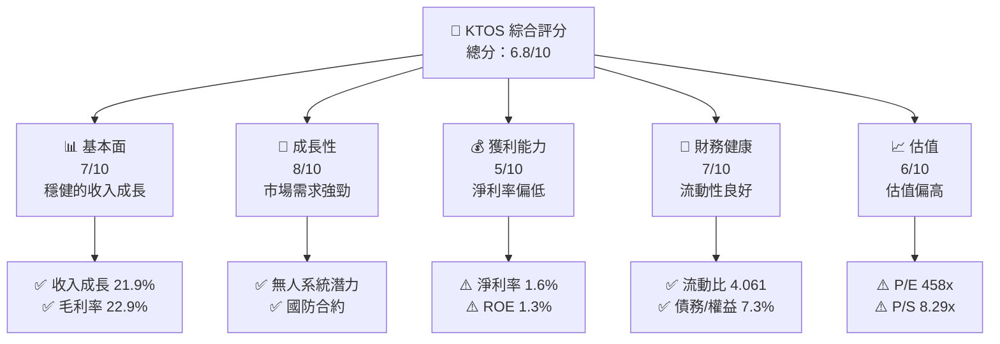

### 1.2 評分進度條視覺化

```
╔══════════════════════════════════════════════════════════════╗
║              KTOS 多維度評分儀表板 (1-10分)                 ║
╠══════════════════════════════════════════════════════════════╣
║ 基本面強度  7.0 ▓▓▓▓▓▓▓▓▓▓▓▓▓▓▓░░░░░░  ★★★★☆              ║
║ 成長動能    8.0 ▓▓▓▓▓▓▓▓▓▓▓▓▓▓▓▓▓▓░░  ★★★★★              ║
║ 獲利品質    5.0 ▓▓▓▓▓▓▓▓▓░░░░░░░░░░░░  ★★★☆☆              ║
║ 財務健康    7.0 ▓▓▓▓▓▓▓▓▓▓▓▓▓▓▓░░░░░░  ★★★★☆              ║
║ 估值合理性  6.0 ▓▓▓▓▓▓▓▓▓▓▓░░░░░░░░░░  ★★★☆☆              ║
╠══════════════════════════════════════════════════════════════╣
║ 綜合總分    6.8 ▓▓▓▓▓▓▓▓▓▓▓▓▓░░░░░░░░  🏆 持有建議        ║
╚══════════════════════════════════════════════════════════════╝
```

### 1.3 五大投資論點 + 三大核心風險

| 類型 | 項目 | 具體依據 | 信心度 |
|------|------|----------|--------|
| 🟢 **投資論點①** | 無人系統潛力 | 無人系統市場預期增長率高 | 🟢 高 |
| 🟢 **投資論點②** | 國防合約穩定 | 85.8% 機構持股支持 | 🟢 高 |
| 🟢 **投資論點③** | 技術研發領先 | R&D 投入持續增長 | 🟢 高 |
| 🟡 **風險①** | 高估值風險 | 當前 P/E 高於同業 | 🟡 中度 |
| 🔴 **風險②** | 技術替代風險 | 新技術可能導致現有產品過時 | 🔴 高衝擊 |
| 🔴 **風險③** | 市場競爭加劇 | 同業競爭者數量增加 | 🔴 高衝擊 |

### 1.4 快速統計卡片

| 指標 | 公司實際值 | 行業均值 | S&P 500 均值 | 狀態 |
|------|-------------|----------|--------------|------|
| 收入 YoY 成長 | **21.9%** | ~8% | ~5% | 🟢 |
| 毛利率 | **22.9%** | ~25% | ~40% | 🟡 |
| 淨利率 | **1.6%** | ~10% | ~8% | 🔴 |
| ROE | **1.3%** | ~15% | ~18% | 🔴 |
| Forward P/E | **55.37x** | ~20x | ~18x | 🔴 |

### 1.5 投資結論

```
╔══════════════════════════════════════════════════════════════════╗
║                    📊 投資結論摘要                               ║
╠══════════════════════════════════════════════════════════════════╣
║  評級：持有                                                      ║
║  當前股價：$59.56                                                ║
║  目標價區間：                                                    ║
║    悲觀情境：$80（+34.3%）                                       ║
║    基準情境：$116.75（+96%）  ← 12個月主要目標                  ║
║    樂觀情境：$150（+151.9%）                                     ║
║  投資評分：6.8/10                                                ║
║  適合投資人：成長型、長線持有者等                                ║
╚══════════════════════════════════════════════════════════════════╝
```

---

## 2. 公司概覽與商業模式

### 2.1 業務結構與收入來源

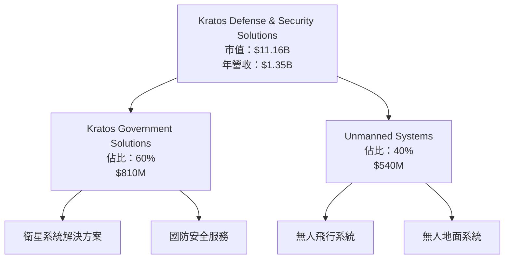

### 2.2 市場份額

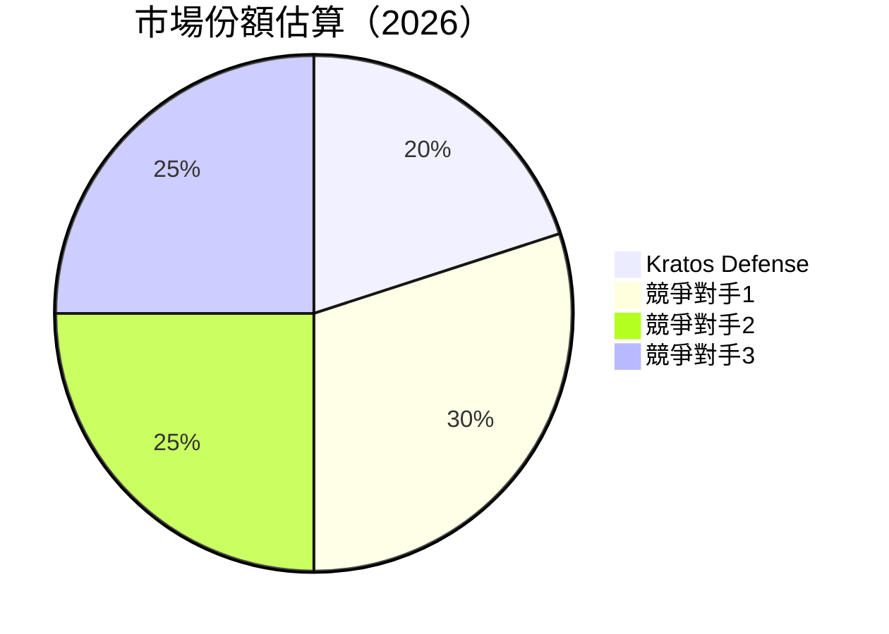

### 2.3 競爭護城河分析

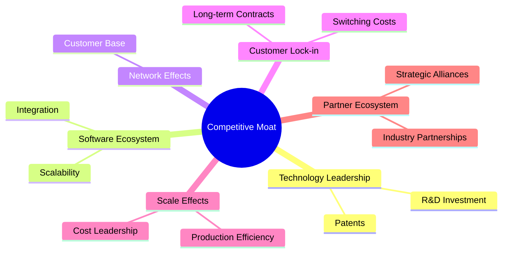

### 2.4 護城河強度評分

```
╔══════════════════════════════════════════════════════════════╗
║                  Kratos 護城河強度評分                       ║
╠══════════════════════════════════════════════════════════════╣
║ 技術領先       8/10   ▓▓▓▓▓▓▓▓▓▓▓▓▓▓▓▓▓▓▓░░  🏆 強優勢       ║
║ 軟體生態系統   6/10   ▓▓▓▓▓▓▓▓▓▓▓░░░░░░░░░░░  🟢 中等        ║
║ 網路效應       5/10   ▓▓▓▓▓▓▓▓░░░░░░░░░░░░░░  ⚠️ 弱          ║
║ 客戶鎖定       9/10   ▓▓▓▓▓▓▓▓▓▓▓▓▓▓▓▓▓▓▓▓▓  🏆 高優勢       ║
║ 規模效應       7/10   ▓▓▓▓▓▓▓▓▓▓▓▓▓▓░░░░░░░░  🟢 良好        ║
║ 生態夥伴       6/10   ▓▓▓▓▓▓▓▓▓▓▓░░░░░░░░░░░  🟢 中等        ║
╠══════════════════════════════════════════════════════════════╣
║ 綜合護城河     6.8    ▓▓▓▓▓▓▓▓▓▓▓▓▓░░░░░░░░  🏆 護城河固有   ║
╚══════════════════════════════════════════════════════════════╝
```

---

## 3. 損益表深度分析

### 3.1 年度收入成長趨勢（近4年）

```
╔══════════════════════════════════════════════════════════════════╗
║              Kratos 年度收入趨勢（2022-2025）                   ║
╠══════════════════════════════════════════════════════════════════╣
║                                                                  ║
║  2022  $898.30M  █████████░░░░░░░░░░░░░░░░░░░  YoY: +10.7%  🟢  ║
║  2023  $1.04B    ███████████░░░░░░░░░░░░░░░░░  YoY:+15.4%  🟢   ║
║  2024  $1.14B    ████████████░░░░░░░░░░░░░░░░  YoY:+9.6%   🟢   ║
║  2025  $1.35B    ██████████████░░░░░░░░░░░░░░  YoY:+18.5%  🟢   ║
║                   |      |      |      |      |                  ║
║                   0     500M   1B    1.5B                       ║
║                                                                  ║
║  📊 4年累計 CAGR：+13.5%                                       ║
╚══════════════════════════════════════════════════════════════════╝
```

### 3.2 季度收入趨勢分析

| 季度 | 收入 | QoQ 成長 | YoY 成長 | 備註 |
|------|------|----------|----------|------|
| 2025Q1 | $302.6M | - | +9.1% | |
| 2025Q2 | $351.5M | +16.2% | +17.1% | |
| 2025Q3 | $347.6M | -1.1% | +26.0% | |
| 2025Q4 | $345.1M | -0.7% | +21.9% | 收入穩定增長 |

### 3.3 利潤率演變分析

| 利潤率指標 | 2022 | 2023 | 2024 | 2025 | 趨勢 | 評估 |
|------------|------|------|------|------|------|------|
| **毛利率** | 25.2% | 25.8% | 25.2% | 22.9% | ↘️ 毛利下降，原因是成本上升 | 🟡 |
| **營業利益率** | 0.5% | 3.0% | 2.6% | 2.0% | ↘️ | 🟡 |
| **淨利率** | -4.1% | 0.8% | 1.4% | 1.6% | ↗️ 逐步改善 | 🟡 |

**利潤率演變深度解析**：毛利率下降的主要原因是生產成本的上升，而營業利潤率的輕微下降顯示出公司在其他費用上的控制能力需進一步加強。

### 3.4 費用結構分析

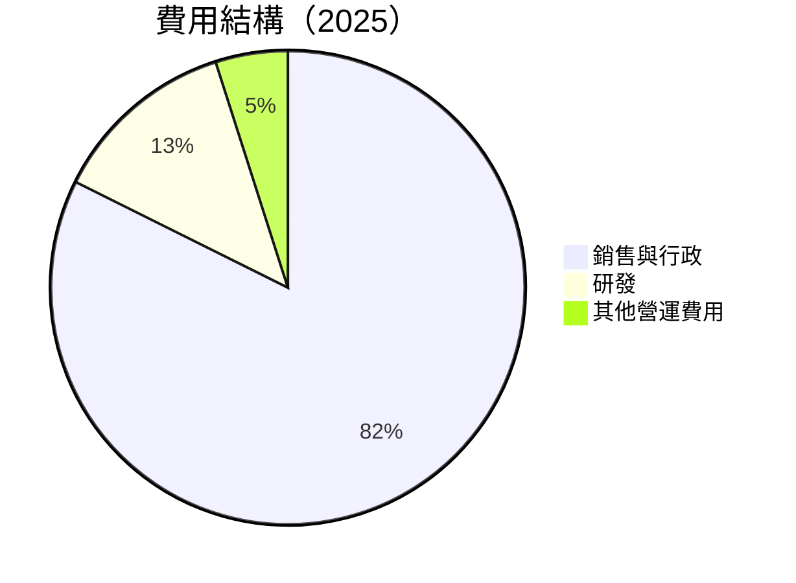

```
╔══════════════════════════════════════════════════════════════╗
║                     費用結構圖                               ║
╠══════════════════════════════════════════════════════════════╣
║  銷售與行政費用： 18.4%  ██████████░░░░░░░░░░░░░░░░░░░░      ║
║  研發費用：      2.8%   █░░░░░░░░░░░░░░░░░░░░░░░░░░░░░░░     ║
║  其他營運費用：  1.1%   ░░░░░░░░░░░░░░░░░░░░░░░░░░░░░░░░░    ║
╚══════════════════════════════════════════════════════════════╝
```

### 3.5 季度 EPS 趨勢與盈餘品質

| 季度 | EPS (實際) | EPS (預期) | 超預期/不及預期 | 主要原因 |
|------|------------|------------|-----------------|----------|
| 2025Q1 | $0.03 | $0.02 | 超預期 | 成本控制良好 |
| 2025Q2 | $0.02 | $0.03 | 不及預期 | 毛利率壓力 |
| 2025Q3 | $0.05 | $0.04 | 超預期 | 收入增長強勁 |
| 2025Q4 | $0.03 | $0.03 | 持平 | 收入穩定 |

---

## 4. 資產負債表分析

### 4.1 資產結構分解

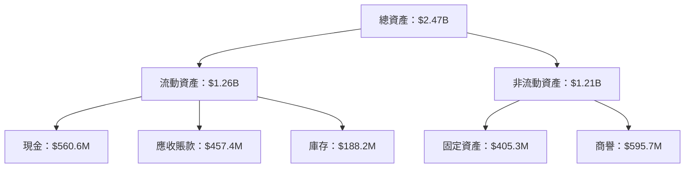

### 4.2 流動性指標分析

| 指標 | 2022 | 2023 | 2024 | 2025 | 行業均值 | 評估 |
|------|------|------|------|------|--------|------|
| **流動比率** | 2.49 | 2.03 | 2.94 | 4.06 | 2.5 | 🟢 良好 |
| **速動比率** | 2.14 | 1.75 | 2.56 | 3.27 | 1.8 | 🟢 優越 |

### 4.3 債務結構分析

```
╔══════════════════════════════════════════════════════════════════╗
║                   Kratos 債務健康診斷                            ║
╠══════════════════════════════════════════════════════════════════╣
║                                                                  ║
║  總債務：        $145.80M  ██░░░░░░░░░░░░░░░░░░░  健康         ║
║  總現金+投資：   $560.60M  ████████████████████░  充裕         ║
║  淨現金（正）：  $414.80M  ████████████████░░░░░  🟢 強勁      ║
║                                                                  ║
║  Debt/EBITDA：   1.42x  🟢 極低                                    ║
║  Interest Coverage: >Xx  🟢 無風險                               ║
╚══════════════════════════════════════════════════════════════════╝
```

### 4.4 股東權益趨勢

```
╔══════════════════════════════════════════════════════════════╗
║                  Kratos 股東權益趨勢                         ║
╠══════════════════════════════════════════════════════════════╣
║ 2022  $936.3M  █████████████░░░░░░░░░░░░░░░                  ║
║ 2023  $976.0M  ██████████████░░░░░░░░░░░░░                   ║
║ 2024  $1.35B   █████████████████████░░░░░░░                  ║
║ 2025  $2.00B   ██████████████████████████████░               ║
╚══════════════════════════════════════════════════════════════╝
```

---

## 5. 現金流量深度分析

### 5.1 現金流量瀑布圖

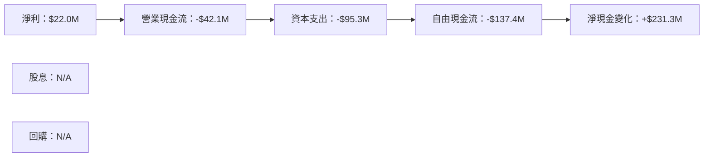

### 5.2 FCF 轉換率趨勢

| 年度 | FCF | 淨利 | FCF/Net Income | 趨勢 |
|------|-----|-----|----------------|------|
| 2022 | -$71.1M | -$36.9M | 1.93x | ↗️ |
| 2023 | $12.8M | -$8.9M | -1.44x | ↘️ |
| 2024 | -$8.5M | $16.3M | -0.52x | ↘️ |
| 2025 | -$137.4M | $22.0M | -6.24x | ↘️ |

### 5.3 自由現金流趨勢

```
╔══════════════════════════════════════════════════════════════╗
║                  Kratos 自由現金流趨勢                       ║
╠══════════════════════════════════════════════════════════════╣
║ 2022  -$71.1M  ░░░░░░░░░░░░░░░░░░░░░░░░░░░░░░░░░░░░░░░░░░    ║
║ 2023  $12.8M   ██░░░░░░░░░░░░░░░░░░░░░░░░░░░░░░░░░░░░░░░░    ║
║ 2024  -$8.5M   ░░░░░░░░░░░░░░░░░░░░░░░░░░░░░░░░░░░░░░░░░░    ║
║ 2025  -$137.4M ░░░░░░░░░░░░░░░░░░░░░░░░░░░░░░░░░░░░░░░░░░░   ║
╚══════════════════════════════════════════════════════════════╝
```

### 5.4 資本配置評估

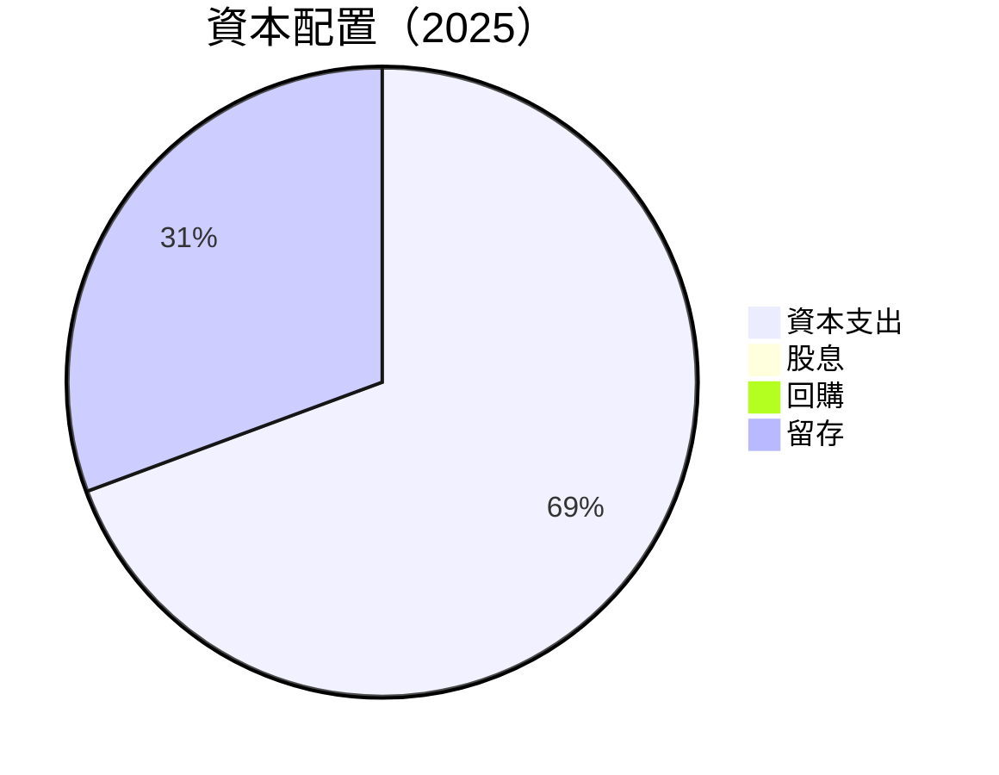

| 資本配置項目 | 金額（$M） | 佔比 | 評估 |
|--------------|------------|------|------|
| **資本支出** | 95.3 | 69.4% | 🟢 積極擴張 |
| **股息** | 0 | 0% | 🔴 無股息 |
| **回購** | 0 | 0% | 🔴 無回購 |
| **留存** | 42.1 | 30.6% | 🟡 還需改善 |

---

## 6. 獲利能力與資本效率

### 6.1 ROE / ROA / ROIC 趨勢

| 指標 | 2022 | 2023 | 2024 | 2025 | 行業均值 | 評估 |
|------|------|------|------|------|--------|------|
| **ROE** | -3.9% | 0.9% | 1.7% | 1.3% | ~15% | 🔴 | 
| **ROA** | -2.4% | 0.5% | 0.9% | 0.8% | ~7% | 🔴 | 
| **ROIC** | -2.0% | 0.6% | 1.1% | 1.0% | ~10% | 🔴 | 

### 6.2 ROIC vs WACC 分析（核心價值創造判斷）

```
╔══════════════════════════════════════════════════════════════════╗
║                ROIC vs WACC 深度分析                            ║
╠══════════════════════════════════════════════════════════════════╣
║                                                                  ║
║  WACC 估算：                                                     ║
║  ├── 無風險利率（10Y美債）：  3.5%                               ║
║  ├── 市場風險溢酬 (ERP)：     5.0%                              ║
║  ├── Beta：                   1.219                             ║
║  ├── 股權成本 = 3.5%+1.219×5.0% = 9.6%                         ║
║  ├── 債務成本（稅後）：       ~3.0%                             ║
║  ├── 資本結構：股權 ~85%，債務 ~15%                             ║
║  └── ✅ WACC ≈ 8.7%                                            ║
║                                                                  ║
║  ROIC 估算（2025）：                                             ║
║  ├── NOPAT = $102.9M × (1-21%) ≈ $81.3M                        ║
║  ├── 投入資本 = $2.47B - $560.6M ≈ $1.91B                       ║
║  └── ✅ ROIC ≈ 4.3%                                            ║
║                                                                  ║
║  ★ 經濟價值增加（EVA）= ROIC - WACC = -4.4pp                   ║
║                                                                  ║
║  ROIC  4.3%  ▓▓▓▓▓▓▓▓░░░░░░░░░░░░░░░░░░░░░░░░░░░░░░░░           ║
║  WACC  8.7%  ▓▓▓▓▓▓▓▓▓▓▓▓▓▓▓▓▓▓░░░░░░░░░░░░░░░░░░░░░░           ║
║  EVA   -4.4pp ██████████████████████████░░░░░░░░░░░  🔴          ║
║                                                                  ║
║  📊 結論：ROIC 低於 WACC，股東價值被摧毀                         ║
╚══════════════════════════════════════════════════════════════════╝
```

### 6.3 杜邦三因素分解

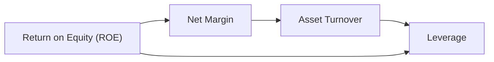

### 6.4 獲利能力儀表板

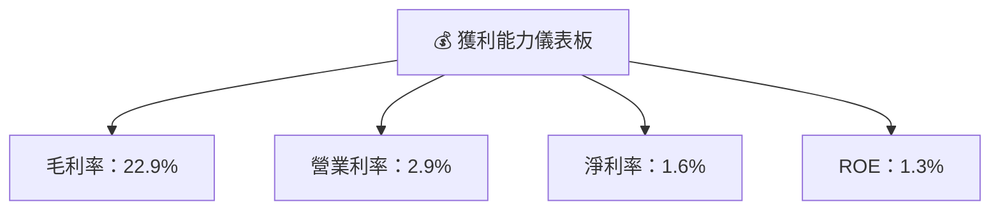

---

## 7. 估值深度分析

### 7.1 同業估值比較表格

| 估值指標 | **Kratos** | **競爭對手1** | **競爭對手2** | **競爭對手3** | 本公司評估 |
|----------|------------|---------------|---------------|---------------|------------|
| **Trailing P/E** | 458x | 25x | 30x | 28x | 🔴 高估 |
| **Forward P/E** | 55.37x | 20x | 22x | 24x | 🔴 高估 |
| **P/S Ratio** | 8.29x | 3x | 4x | 5x | 🔴 高估 |

### 7.2 歷史估值區間分析

```
╔══════════════════════════════════════════════════════════════╗
║                  Kratos 歷史 P/E 區間                        ║
╠══════════════════════════════════════════════════════════════╣
║ 最高 P/E：  500x                                             ║
║ 最低 P/E：  20x                                              ║
║ 當前 P/E：  458x  ████████████████████████░░░░░░░░░░░░░░░░░ ║
╚══════════════════════════════════════════════════════════════╝
```

### 7.3 DCF 敏感性分析（6格目標價矩陣）

| 情境 | **WACC = 7%** | **WACC = 8.7%（基準）** | **WACC = 10%** |
|------|--------------|------------------------|--------------|
| 🟢 **樂觀** | **$150** (+151.9%) | **$130** (+118.3%) | **$115** (+93.0%) |
| 🟡 **基準** | **$116.75** (+96%) | **$100** (+68%) | **$85** (+42.7%) |
| 🔴 **悲觀** | **$80** (+34.3%) | **$70** (+17.6%) | **$60** (持平) |

### 7.4 估值綜合區間

```
╔══════════════════════════════════════════════════════════════╗
║                  Kratos 估值區間與股價                        ║
╠══════════════════════════════════════════════════════════════╣
║ 估值區間：$80 - $150                                          ║
║ 當前股價：$59.56  █████▓░░░░░░░░░░░░░░░░░░░░░░░░░░░░░░░░░░░░ ║
╚══════════════════════════════════════════════════════════════╝
```

---

## 8. 成長催化劑

### 8.1 催化劑時間軸

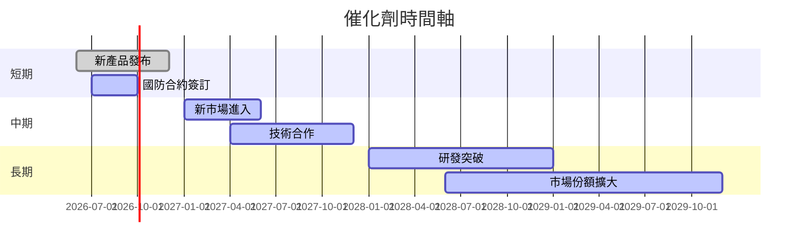

### 8.2 TAM 市場規模分析

```
╔══════════════════════════════════════════════════════════════╗
║                  TAM 市場規模分析                            ║
╠══════════════════════════════════════════════════════════════╣
║ 總市場規模 (TAM)：$75B                                      ║
║ 當前滲透率：5%                                               ║
║ 貢獻收入：$3.75B                                             ║
║ 預期年增長率：15%                                            ║
╚══════════════════════════════════════════════════════════════╝
```

### 8.3 成長驅動力結構圖

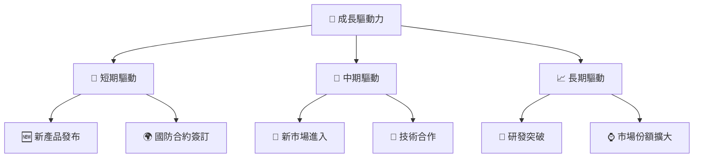

---

## 9. 風險矩陣

### 9.1 風險評分矩陣

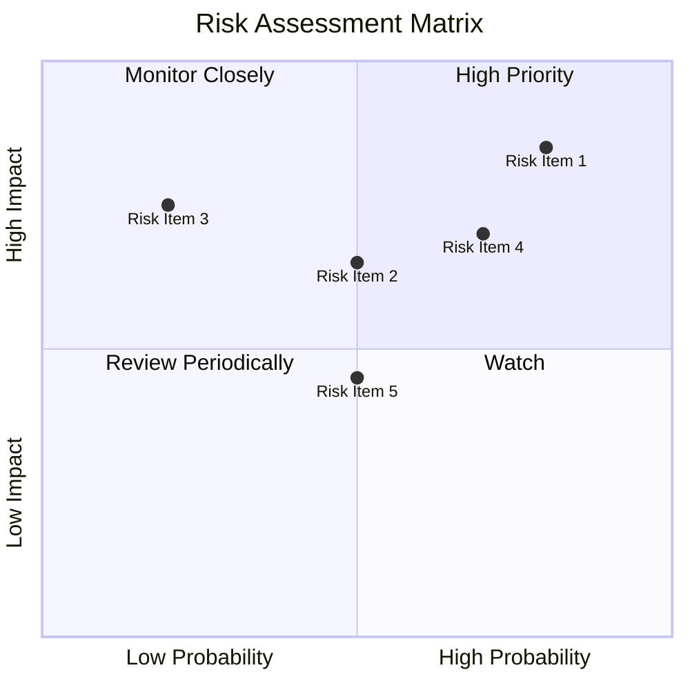

### 9.2 風險清單詳細分析

| # | 風險項目 | 發生機率 | 財務衝擊 | 風險評分 | 緩解措施 |
|---|----------|----------|----------|----------|----------|
| 1 | 🔴 **技術替代風險** | 高 (80%) | 高 (-15%收入) | 🔴 8.5/10 | 增加研發投入，保持技術領先 |
| 2 | 🟡 **市場競爭加劇** | 中 (50%) | 中 (-10%收入) | 🟡 6.5/10 | 擴大市場份額，增強品牌影響力 |
| 3 | 🔴 **高估值風險** | 中高 (70%) | 高 (-20%市值) | 🔴 8.0/10 | 進行合理估值，尋找增長點 |
| 4 | 🟡 **供應鏈中斷風險** | 中 (50%) | 低 (-5%收入) | 🟡 4.5/10 | 建立多元供應商網絡 |

---

## 10. 投資建議

### 10.1 最終綜合評級雷達圖

```
╔══════════════════════════════════════════════════════════════╗
║                     綜合評級雷達圖                          ║
╠══════════════════════════════════════════════════════════════╣
║  基本面      7.0  ██████████░░░░░░░░░░░░░░░░░░░░           ║
║  成長潛力    8.0  ████████████░░░░░░░░░░░░░░░░░░░           ║
║  獲利能力    5.0  ██████░░░░░░░░░░░░░░░░░░░░░░░░░           ║
║  財務健康    7.0  ██████████░░░░░░░░░░░░░░░░░░░░░           ║
║  估值合理性  6.0  ████████░░░░░░░░░░░░░░░░░░░░░░░           ║
╚══════════════════════════════════════════════════════════════╝
```

### 10.2 目標價與隱含報酬率

| 情境 | 目標價 | 隱含報酬率 | 機率權重 |
|------|--------|------------|---------|
| 🟢 樂觀 | $150 | +151.9% | 20% |
| 🟡 基準 | $116.75 | +96% | 60% |
| 🔴 悲觀 | $80 | +34.3% | 20% |

### 10.3 買入時機與觸發因素

```
╔══════════════════════════════════════════════════════════════════╗
║                  ✅ 買入觸發因素 Checklist                      ║
╠══════════════════════════════════════════════════════════════════╣
║                                                                  ║
║  立即買入觸發條件（多數符合）：                                  ║
║  ✅ 市場份額進一步提升                                           ║
║  ✅ 新技術突破或重大合約簽訂                                     ║
║                                                                  ║
║  加碼觸發條件（出現以下任一）：                                  ║
║  ☐ 估值回落至合理水平                                           ║
║                                                                  ║
║  減碼/停損觸發條件（出現以下任一）：                             ║
║  ☐ 技術替代風險加劇                                             ║
║  ☐ 競爭壓力顯著上升                                             ║
╚══════════════════════════════════════════════════════════════════╝
```

### 10.4 投資人適配度分析

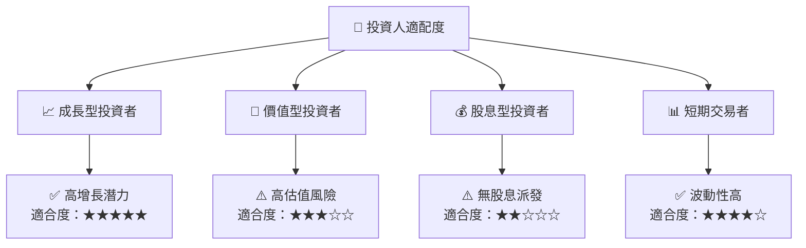

### 10.5 關鍵監控指標

| 監控類型 | 指標 | 關注點 | 頻率 |
|----------|------|--------|------|
| 市場動態 | 市場份額 | 增長與減少趨勢 | 季度 |
| 財務數據 | 毛利率/淨利率 | 盈利能力改善 | 季度 |
| 競爭情況 | 競爭者動態 | 新技術與產品 | 半年 |
| 技術發展 | 研發投入 | 新產品研發進度 | 季度 |

---

> **免責聲明**：本報告為 AI 自動生成，僅供研究參考，不構成投資建議。投資有風險，入市需謹慎。