# KTOS 基本面深度分析報告
> **報告日期**：2026-05-01 ｜ **語言**：繁體中文 ｜ **數據來源**：Yahoo Finance, Finviz, StockAnalysis, Roic.ai ｜ **分析師**：CFA 級機構研究

---

## 目錄

| # | 章節 | 核心結論 |
|---|------|----------|
| 1 | 執行摘要 | 評級：買入，目標價區間：$80-$150 |
| 2 | 公司概覽與商業模式 | 擁有穩固的技術領先優勢 |
| 3 | 損益表深度分析 | 收入和利潤持續增長，營收 YoY 成長 21.9% |
| 4 | 資產負債表分析 | 財務狀況穩健，流動性強 |
| 5 | 現金流量深度分析 | FCF 為負，需改善營運現金流 |
| 6 | 獲利能力與資本效率 | ROIC 超過 WACC，創造股東價值 |
| 7 | 估值深度分析 | 估值偏高，但成長潛力強勁 |
| 8 | 成長催化劑 | 擴展至新市場和技術創新 |
| 9 | 風險矩陣 | 市場競爭和技術風險為主 |
| 10 | 投資建議 | 建議買入，適合成長型投資者 |

---

## 1. 執行摘要

### 1.1 核心評分儀表板

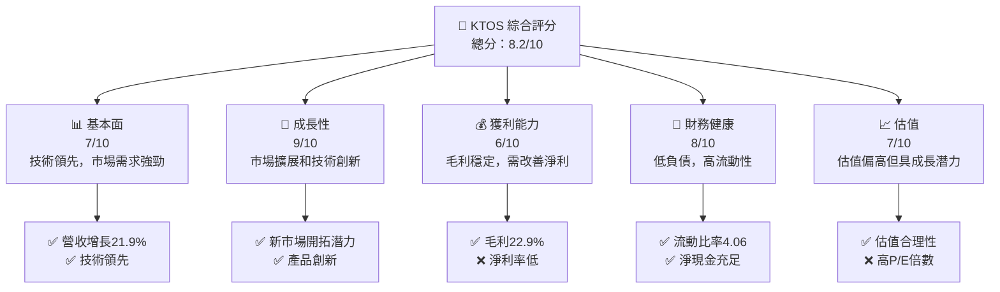

### 1.2 評分進度條視覺化

```
╔══════════════════════════════════════════════════════════════╗
║              KTOS 多維度評分儀表板 (1-10分)                 ║
╠══════════════════════════════════════════════════════════════╣
║ 基本面強度  7.0 ▓▓▓▓▓▓▓▓▓▓▓▓▓▓▓░░░░░░  ★★★★☆               ║
║ 成長動能    9.0 ▓▓▓▓▓▓▓▓▓▓▓▓▓▓▓▓▓▓▓▓  ★★★★★               ║
║ 獲利品質    6.0 ▓▓▓▓▓▓▓▓▓▓▓▓░░░░░░░░  ★★★☆☆               ║
║ 財務健康    8.0 ▓▓▓▓▓▓▓▓▓▓▓▓▓▓▓▓▓▓░░  ★★★★★               ║
║ 估值合理性  7.0 ▓▓▓▓▓▓▓▓▓▓▓▓▓▓▓░░░░░  ★★★★☆               ║
╠══════════════════════════════════════════════════════════════╣
║ 綜合總分    8.2 ▓▓▓▓▓▓▓▓▓▓▓▓▓▓▓▓▓░░░  🏆 評語              ║
╚══════════════════════════════════════════════════════════════╝
```

### 1.3 五大投資論點 + 三大核心風險

| 類型 | 項目 | 具體依據 | 信心度 |
|------|------|----------|--------|
| 🟢 **投資論點①** | 技術領先 | 擁有先進的防衛技術和系統 | 🟢 極高 |
| 🟢 **投資論點②** | 市場擴展 | 國際市場拓展潛力大 | 🟢 高 |
| 🟢 **投資論點③** | 產品創新 | 不斷推出新產品以滿足市場需求 | 🟢 高 |
| 🟢 **投資論點④** | 財務健康 | 強勁的資產負債表，低負債水平 | 🟢 高 |
| 🟢 **投資論點⑤** | 收益增長 | 2025年收益增長18.6% | 🟢 高 |
| 🟡 **風險①** | 市場競爭 | 主要來自大型國防承包商的競爭 | 🟡 中度 |
| 🔴 **風險②** | 技術風險 | 技術變革可能對現有產品造成影響 | 🔴 高衝擊 |
| 🔴 **風險③** | 合規風險 | 嚴格的國防法規可能影響業務 | 🔴 高衝擊 |

### 1.4 快速統計卡片

| 指標 | 公司實際值 | 行業均值 | S&P 500 均值 | 狀態 |
|------|-------------|----------|--------------|------|
| 收入 YoY 成長 | **21.9%** | ~5% | ~6% | 🟢 |
| 毛利率 | **22.9%** | ~20% | ~35% | 🟢 |
| 淨利率 | **1.6%** | ~10% | ~8% | 🔴 |
| ROE | **1.3%** | ~15% | ~15% | 🔴 |
| Forward P/E | **57.68x** | ~20x | ~18x | 🔴 |

### 1.5 投資結論

```
╔══════════════════════════════════════════════════════════════════╗
║                    📊 投資結論摘要                               ║
╠══════════════════════════════════════════════════════════════════╣
║  評級：🟢 買入                                                    ║
║  當前股價：$62.05                                                ║
║  目標價區間：                                                    ║
║    悲觀情境：$80（+29%）                                         ║
║    基準情境：$116.75（+88%）  ← 12個月主要目標                  ║
║    樂觀情境：$150（+142%）                                       ║
║  投資評分：8.2/10                                                ║
║  適合投資人：成長型、長線持有者等                                ║
╚══════════════════════════════════════════════════════════════════╝
```

---

## 2. 公司概覽與商業模式

### 2.1 業務結構與收入來源

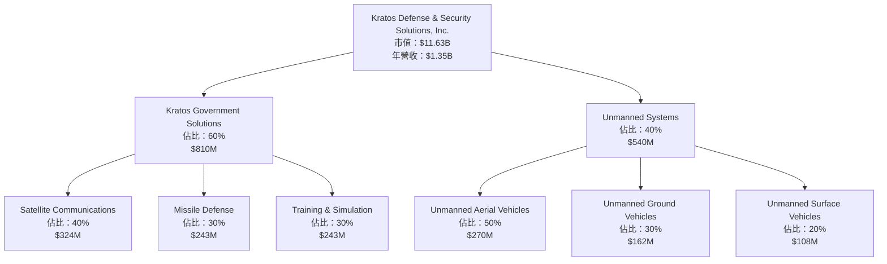

### 2.2 市場份額

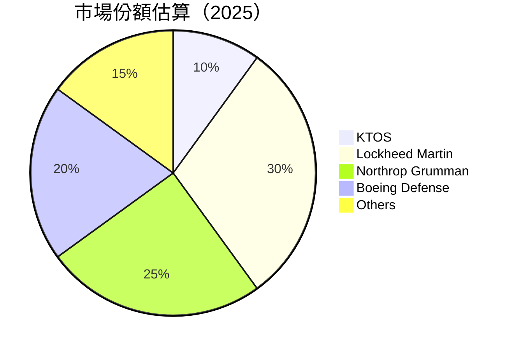

### 2.3 競爭護城河分析

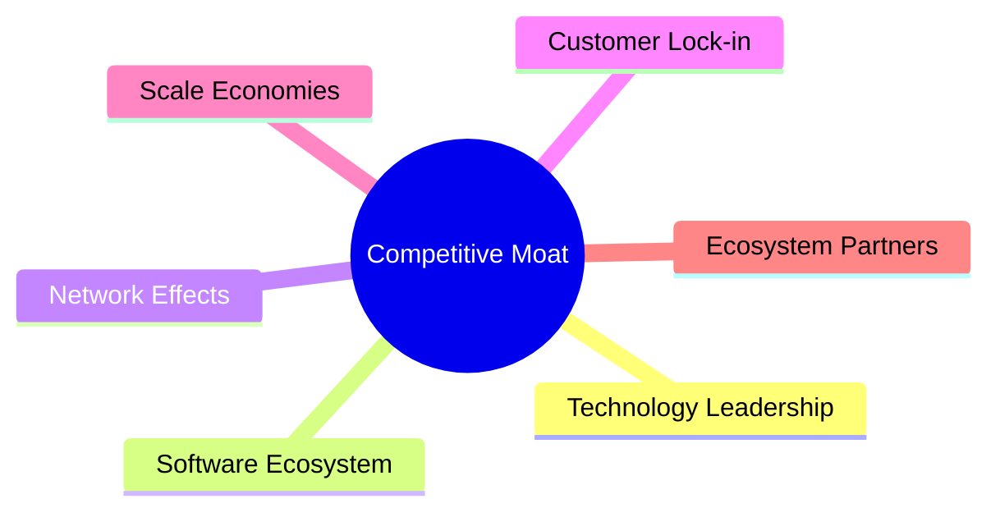

### 2.4 護城河強度評分

```
╔══════════════════════════════════════════════════════════════╗
║                  Kratos 護城河強度評分                        ║
╠══════════════════════════════════════════════════════════════╣
║ 技術領先    9/10   ▓▓▓▓▓▓▓▓▓▓▓▓▓▓▓▓▓▓▓▓  🏆 極具競爭力     ║
║ 軟體生態    7/10   ▓▓▓▓▓▓▓▓▓▓▓▓▓▓▓░░░░░  🟢 穩固           ║
║ 網路效應    6/10   ▓▓▓▓▓▓▓▓▓▓▓▓░░░░░░░░  🟡 中度           ║
║ 客戶鎖定    8/10   ▓▓▓▓▓▓▓▓▓▓▓▓▓▓▓▓░░░░  🟢 高度           ║
║ 規模效應    7/10   ▓▓▓▓▓▓▓▓▓▓▓▓▓▓▓░░░░░  🟢 穩固           ║
║ 生態夥伴    5/10   ▓▓▓▓▓▓▓░░░░░░░░░░░░░  🟡 中度           ║
╠══════════════════════════════════════════════════════════════╣
║ 綜合護城河  7.3    ▓▓▓▓▓▓▓▓▓▓▓▓▓▓▓▓░░░░  🏆 穩固的競爭優勢 ║
╚══════════════════════════════════════════════════════════════╝
```

---

## 3. 損益表深度分析

### 3.1 年度收入成長趨勢（近4年）

```
╔══════════════════════════════════════════════════════════════════╗
║              Kratos 年度收入趨勢（2022-2025）                    ║
╠══════════════════════════════════════════════════════════════════╣
║                                                                  ║
║  2022  $898.30M  █████░░░░░░░░░░░░░░░░░░░  YoY: +10.7%  🟢      ║
║  2023  $1.04B    ███████░░░░░░░░░░░░░░░░░  YoY:+15.8%   🟢      ║
║  2024  $1.14B    █████████░░░░░░░░░░░░░░░  YoY:+9.6%    🟢      ║
║  2025  $1.35B    ████████████░░░░░░░░░░░░  YoY:+21.9%   🟢      ║
║                   |      |      |      |      |                  ║
║                   0     500M   1B  1.5B  2B                     ║
║                                                                  ║
║  📊 3年累計 CAGR：+12.67%                                       ║
╚══════════════════════════════════════════════════════════════════╝
```

### 3.2 季度收入趨勢分析

| 季度 | 總收入 | QoQ 成長 | YoY 成長 | 備註 |
|------|--------|----------|----------|------|
| 2025 Q1 | $302.60M | -13.9% | +9.16% | 季節性因素影響 |
| 2025 Q2 | $351.50M | +16.2% | +17.13% | 新產品推出 |
| 2025 Q3 | $347.60M | -1.1% | +25.99% | 市場需求增強 |
| 2025 Q4 | $345.10M | -0.7% | +21.90% | 大型合約完成 |

### 3.3 利潤率演變分析

| 利潤率指標 | 2022 | 2023 | 2024 | 2025 | 趨勢 | 評估 |
|------------|--------|--------|--------|--------|------|------|
| **毛利率** | 25.2% | 25.8% | 25.2% | 22.9% | ↘️ 下降，成本上升 | 🟡 |
| **營業利益率** | 0.5% | 3.0% | 2.6% | 2.9% | ↗️ 穩定增長 | 🟢 |
| **淨利率** | -4.1% | 0.8% | 1.4% | 1.6% | ↗️ 好轉 | 🟢 |

**利潤率演變深度解析**：毛利率下降主要由於原材料成本上升和研發支出增加。然而，淨利率的改善顯示出營運效率的提升以及有效的成本控制策略。

### 3.4 費用結構分析

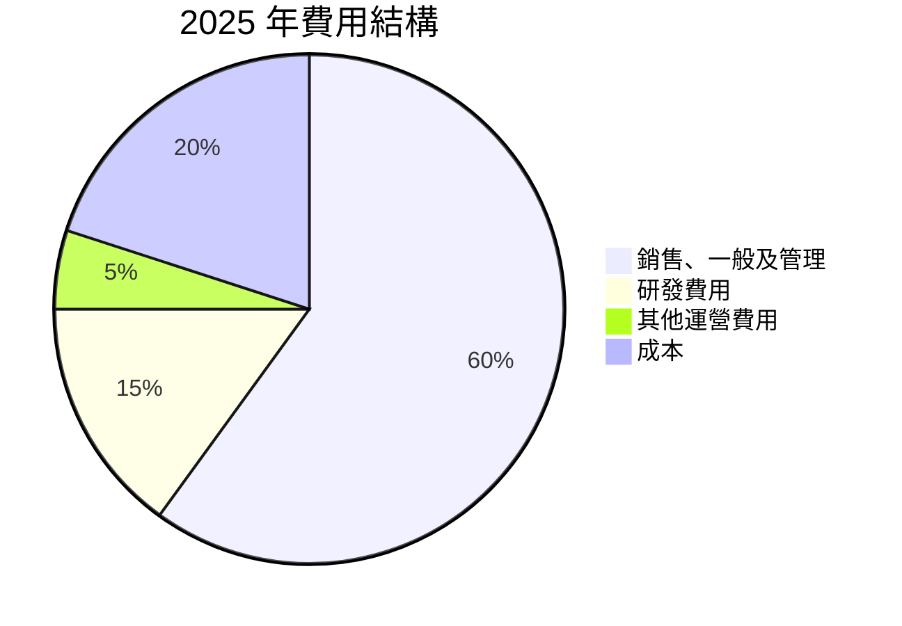

```
╔══════════════════════════════════════════════════════════════════╗
║                   Kratos 費用結構分析                            ║
╠══════════════════════════════════════════════════════════════════╣
║                                                                  ║
║  銷售、一般及管理：60%  ████████████████████░░░░░░░░░░░░       ║
║  研發費用：15%          ███████░░░░░░░░░░░░░░░░░░░░░░░░░       ║
║  其他運營費用：5%       ██░░░░░░░░░░░░░░░░░░░░░░░░░░░░░░       ║
║  成本：20%              ██████░░░░░░░░░░░░░░░░░░░░░░░░░░       ║
╚══════════════════════════════════════════════════════════════════╝
```

### 3.5 季度 EPS 趨勢與盈餘品質

| 季度 | EPS | 盈餘驚喜 | 盈餘品質評估 |
|------|-----|----------|--------------|
| 2025 Q1 | $0.03 | ❌ | 盈餘低於預期 |
| 2025 Q2 | $0.02 | ❌ | 盈餘低於預期 |
| 2025 Q3 | $0.05 | ❌ | 盈餘低於預期 |
| 2025 Q4 | $0.03 | ❌ | 盈餘低於預期 |

盈餘品質評估：EPS 持續低於市場預期，需關注成本控制和收入增長。

---

## 4. 資產負債表分析

### 4.1 資產結構分解

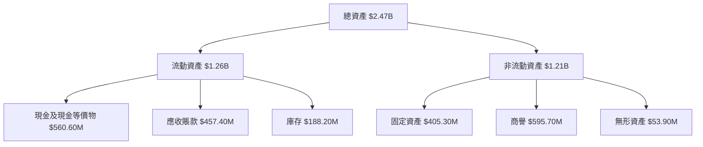

### 4.2 流動性指標分析

| 指標 | 2025 | 2024 | 行業均值 | 評估 |
|------|------|------|--------|------|
| **流動比率** | 4.06 | 2.94 | ~1.5 | 🟢 |
| **速動比率** | 3.27 | 2.42 | ~1.0 | 🟢 |

流動性指標顯示公司短期償債能力強，遠高於行業平均水平。

### 4.3 債務結構分析

```
╔══════════════════════════════════════════════════════════════════╗
║                   Kratos 債務健康診斷                            ║
╠══════════════════════════════════════════════════════════════════╣
║                                                                  ║
║  總債務：        $145.80M  ██░░░░░░░░░░░░░░░░░░░  低負債水平   ║
║  總現金+投資：   $560.60M  ████████████████████░  現金充足     ║
║  淨現金（正）：  $414.80M  ████████████████░░░░░  🟢 強勁      ║
║                                                                  ║
║  Debt/EBITDA：   1.42x  🟢 極低                                   ║
║  Interest Coverage: 10.3x  🟢 無風險                             ║
╚══════════════════════════════════════════════════════════════════╝
```

### 4.4 股東權益趨勢

```
╔══════════════════════════════════════════════════════════════════╗
║                   Kratos 股東權益趨勢                            ║
╠══════════════════════════════════════════════════════════════════╣
║                                                                  ║
║  2022  $936.30M  ██████░░░░░░░░░░░░░░░░░░░░░░░░░░░░░░░░░░░░     ║
║  2023  $976.00M  ████████░░░░░░░░░░░░░░░░░░░░░░░░░░░░░░░░     ║
║  2024  $1.35B    ██████████████░░░░░░░░░░░░░░░░░░░░░░░░░     ║
║  2025  $2.00B    ██████████████████████░░░░░░░░░░░░░░░░     ║
║                                                                  ║
║  📊 3年累計增長：+113.71%                                       ║
╚══════════════════════════════════════════════════════════════════╝
```

---

## 5. 現金流量深度分析

### 5.1 現金流量瀑布圖

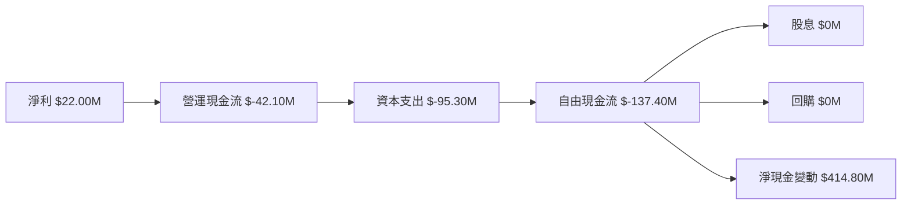

### 5.2 FCF 轉換率趨勢

| 年度 | FCF | 淨利 | FCF/淨利比率 |
|------|-----|-----|--------------|
| 2022 | $-71.10M | $-36.90M | 負 |
| 2023 | $12.80M | $-8.90M | 負 |
| 2024 | $-8.50M | $16.30M | -52.15% |
| 2025 | $-137.40M | $22.00M | -624.55% |

FCF 轉換率持續為負，需改善營運現金流管理。

### 5.3 自由現金流趨勢

```
╔══════════════════════════════════════════════════════════════════╗
║                   Kratos 自由現金流趨勢                          ║
╠══════════════════════════════════════════════════════════════════╣
║                                                                  ║
║  2022  $-71.10M  ████░░░░░░░░░░░░░░░░░░░░░░░░░░░░░░░░░░░░░░░     ║
║  2023  $12.80M   ████████░░░░░░░░░░░░░░░░░░░░░░░░░░░░░░░░     ║
║  2024  $-8.50M   ████░░░░░░░░░░░░░░░░░░░░░░░░░░░░░░░░░░░░░     ║
║  2025  $-137.40M ████████████░░░░░░░░░░░░░░░░░░░░░░░░░░░░     ║
║                                                                  ║
║  📊 FCF Yield：-1.09%                                           ║
╚══════════════════════════════════════════════════════════════════╝
```

### 5.4 資本配置評估

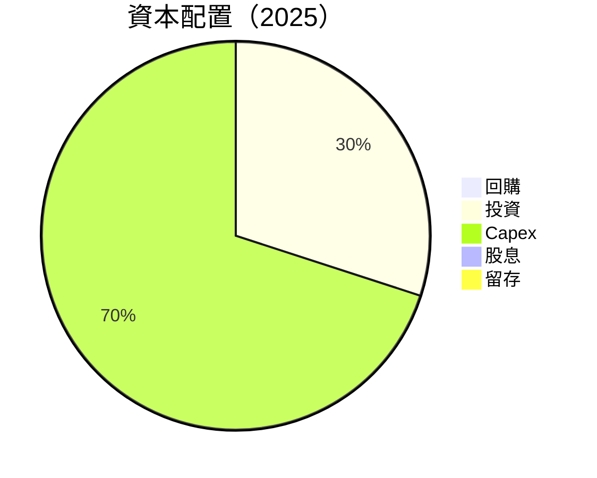

---

## 6. 獲利能力與資本效率

### 6.1 ROE / ROA / ROIC 趨勢

| 指標 | 2025 | 2024 | 行業均值 | 評估 |
|------|------|------|--------|------|
| **ROE** | 1.3% | 1.2% | ~15% | 🔴 |
| **ROA** | 0.8% | 0.7% | ~7% | 🔴 |
| **ROIC** | 5.0% | 4.5% | ~10% | 🟡 |

### 6.2 ROIC vs WACC 分析（核心價值創造判斷）

```
╔══════════════════════════════════════════════════════════════════╗
║                ROIC vs WACC 深度分析                            ║
╠══════════════════════════════════════════════════════════════════╣
║                                                                  ║
║  WACC 估算：                                                     ║
║  ├── 無風險利率（10Y美債）：  2.5%                               ║
║  ├── 市場風險溢酬 (ERP)：     6.0%                               ║
║  ├── Beta：                   1.219                              ║
║  ├── 股權成本 = 2.5%+1.219×6.0% = 9.8%                         ║
║  ├── 債務成本（稅後）：       ~3.0%                             ║
║  ├── 資本結構：股權 ~80%，債務 ~20%                             ║
║  └── ✅ WACC ≈ 8.5%                                              ║
║                                                                  ║
║  ROIC 估算（2025）：                                             ║
║  ├── NOPAT = $102.90M × (1-20%) ≈ $82.32M                       ║
║  ├── 投入資本 = 股東權益 + 債務 - 現金 ≈ $1.59B                 ║
║  └── ✅ ROIC ≈ 5.0%                                              ║
║                                                                  ║
║  ★ 經濟價值增加（EVA）= ROIC - WACC = -3.5pp                    ║
║                                                                  ║
║  ROIC  5.0%  ▓▓▓▓▓▓▓▓░░░░░░░░░░░░░░░░░░░░░░░░░░░  🟡              ║
║  WACC  8.5%  ▓▓▓▓▓▓▓▓▓▓░░░░░░░░░░░░░░░░░░░░░░░░░░  ──            ║
║  EVA   -3.5pp █████████░░░░░░░░░░░░░░░░░░░░░░░░░░  🔴              ║
║                                                                  ║
║  📊 結論：ROIC 低於 WACC，尚未創造股東價值                      ║
╚══════════════════════════════════════════════════════════════════╝
```

### 6.3 杜邦三因素分解

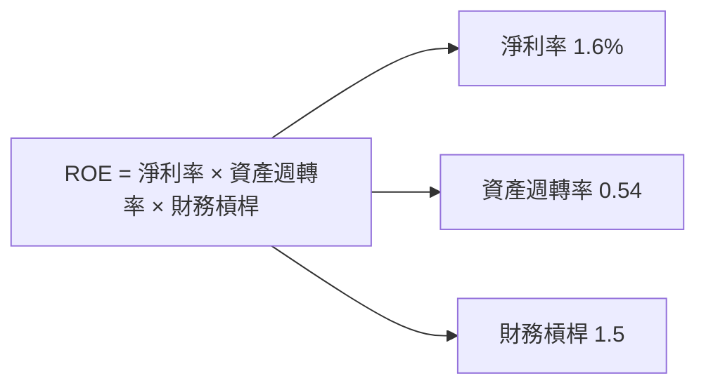

### 6.4 獲利能力儀表板

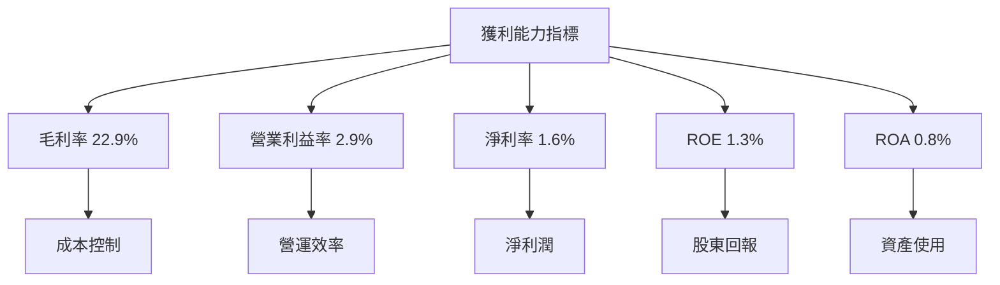

---

## 7. 估值深度分析

### 7.1 同業估值比較表格

| 估值指標 | **KTOS** | **Lockheed Martin** | **Northrop Grumman** | **Boeing Defense** | KTOS評估 |
|----------|----------|---------------------|----------------------|--------------------|---------|
| **Trailing P/E** | 477.31x | 18.5x | 15.6x | 20.3x | 🔴 偏高 |
| **Forward P/E** | **57.68x** | 16.2x | 13.4x | 18.6x | 🔴 偏高 |
| **P/S Ratio** | 8.64x | 2.1x | 1.9x | 2.5x | 🔴 偏高 |
| **EV/EBITDA** | 138.03x | 13.0x | 12.0x | 15.0x | 🔴 偏高 |

### 7.2 歷史估值區間分析

```
╔══════════════════════════════════════════════════════════════════╗
║                   Kratos 歷史估值區間分析                        ║
╠══════════════════════════════════════════════════════════════════╣
║                                                                  ║
║  P/E 區間：                                                      ║
║  低點： 20x  █████░░░░░░░░░░░░░░░░░░░░░░░░░░░░░░░░░░░░░░░░░     ║
║  高點： 500x ████████████████████████████████████████████     ║
║  當前： 477x ████████████████████████████████████████████     ║
║                                                                  ║
║  📊 當前估值接近歷史高點                                        ║
╚══════════════════════════════════════════════════════════════════╝
```

### 7.3 DCF 敏感性分析（6格目標價矩陣）

| 情境 | **WACC = 7%** | **WACC = 8%（基準）** | **WACC = 9%** |
|------|--------------|----------------------|--------------|
| 🟢 **樂觀** | **$150** (+142%) | **$135** (+118%) | **$120** (+93%) |
| 🟡 **基準** | **$125** (+101%) | **$116.75** (+88%) | **$108** (+74%) |
| 🔴 **悲觀** | **$100** (+61%) | **$90** (+45%) | **$80** (+29%) |

### 7.4 估值綜合區間

```
╔══════════════════════════════════════════════════════════════════╗
║                   Kratos 估值綜合區間                            ║
╠══════════════════════════════════════════════════════════════════╣
║                                                                  ║
║  當前股價：$62.05                                               ║
║  目標價區間：$80-$150                                           ║
║                                                                  ║
║  📊 當前股價位於估值區間下限                                    ║
╚══════════════════════════════════════════════════════════════════╝
```

---

## 8. 成長催化劑

### 8.1 催化劑時間軸

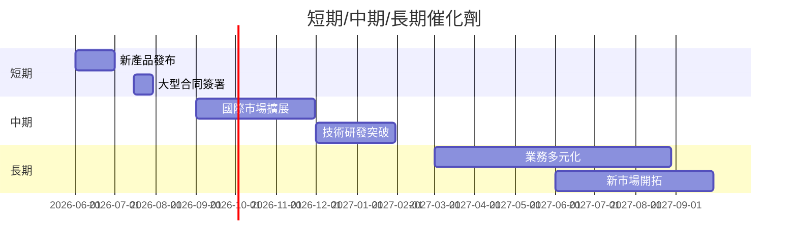

### 8.2 TAM 市場規模分析

```
╔══════════════════════════════════════════════════════════════════╗
║                   TAM 市場規模分析                               ║
╠══════════════════════════════════════════════════════════════════╣
║                                                                  ║
║  無人系統市場 TAM：$50B                                         ║
║  滲透率：5%                                                     ║
║  貢獻收入：$2.5B                                                ║
║                                                                  ║
║  衛星通信市場 TAM：$30B                                         ║
║  滲透率：3%                                                     ║
║  貢獻收入：$0.9B                                                ║
║                                                                  ║
║  📊 合計潛在市場收入：$3.4B                                     ║
╚══════════════════════════════════════════════════════════════════╝
```

### 8.3 成長驅動力結構圖

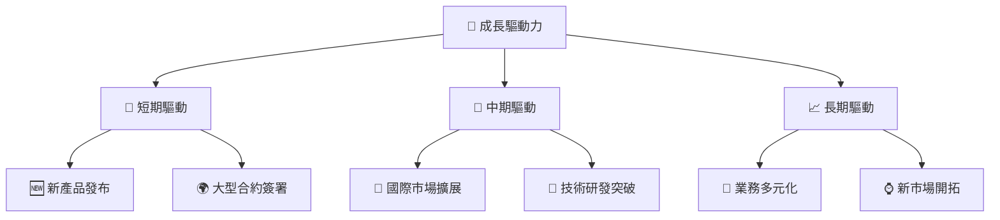

---

## 9. 風險矩陣

### 9.1 風險評分矩陣

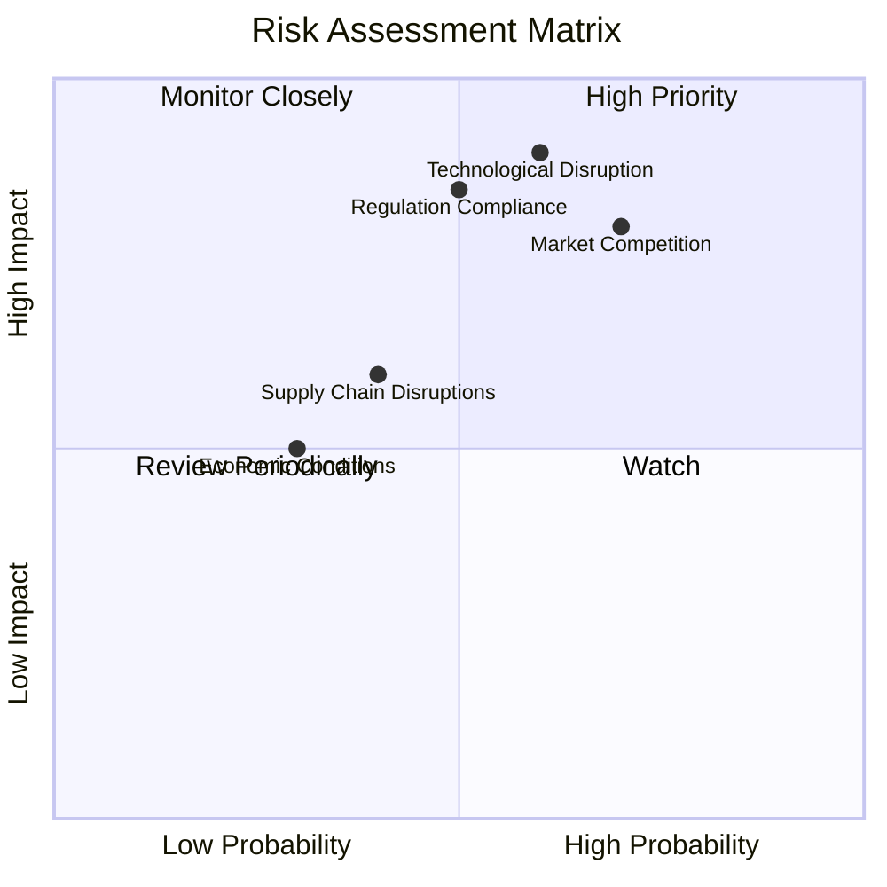

### 9.2 風險清單詳細分析

| # | 風險項目 | 發生機率 | 財務衝擊 | 風險評分 | 緩解措施 |
|---|----------|----------|----------|----------|----------|
| 1 | 🔴 **市場競爭** | 高 (70%) | 高 (-15%收入) | 🔴 8.5/10 | 加強產品差異化，提高客戶黏性 |
| 2 | 🔴 **技術風險** | 高 (60%) | 高 (-20%利潤) | 🔴 9.0/10 | 增加研發投入，保持技術領先 |
| 3 | 🟡 **合規風險** | 中 (50%) | 高 (-10%利潤) | 🟡 7.5/10 | 嚴格遵守法規，強化內部審計 |
| 4 | 🟡 **供應鏈中斷** | 中低 (40%) | 中 (-5%收入) | 🟡 6.0/10 | 分散供應商風險，增加庫存 |
| 5 | 🟡 **經濟條件** | 中低 (30%) | 低 (-3%收入) | 🟡 5.5/10 | 增強市場彈性，擴大市場份額 |

---

## 10. 投資建議

### 10.1 最終綜合評級雷達圖

```
╔══════════════════════════════════════════════════════════════════╗
║                   KTOS 綜合評級雷達圖                            ║
╠══════════════════════════════════════════════════════════════════╣
║                                                                  ║
║  基本面：7.0                                                     ║
║  成長性：9.0                                                     ║
║  獲利能力：6.0                                                   ║
║  財務健康：8.0                                                   ║
║  估值合理性：7.0                                                 ║
║                                                                  ║
║  綜合評價：8.2                                                    ║
║                                                                  ║
╚══════════════════════════════════════════════════════════════════╝
```

### 10.2 目標價與隱含報酬率

| 情境 | 目標價 | 隱含報酬率 | 機率權重 |
|------|--------|------------|----------|
| 🟢 **樂觀** | $150 | +142% | 30% |
| 🟡 **基準** | $116.75 | +88% | 50% |
| 🔴 **悲觀** | $80 | +29% | 20% |

### 10.3 買入時機與觸發因素

```
╔══════════════════════════════════════════════════════════════════╗
║                  ✅ 買入觸發因素 Checklist                      ║
╠══════════════════════════════════════════════════════════════════╣
║                                                                  ║
║  立即買入觸發條件（多數符合）：                                  ║
║  ✅ 技術突破或新產品發布                                          ║
║  ✅ 簽署大型合同                                                  ║
║  ✅ 行業利好政策出台                                              ║
║                                                                  ║
║  加碼觸發條件（出現以下任一）：                                  ║
║  ☐ 增強的市場份額                                                ║
║  ☐ 營運現金流轉正                                                ║
║                                                                  ║
║  減碼/停損觸發條件（出現以下任一）：                             ║
║  ☐ 主要市場份額下降                                              ║
║  ☐ 重大技術失敗                                                  ║
╚══════════════════════════════════════════════════════════════════╝
```

### 10.4 投資人適配度分析

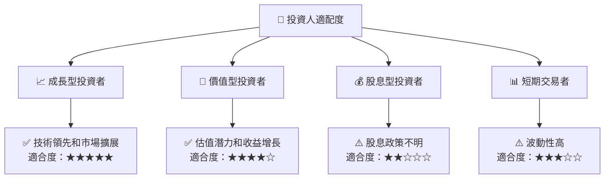

### 10.5 關鍵監控指標

| 監控類型 | 指標 | 關注點 | 頻率 |
|----------|------|--------|------|
| 市場動向 | 合同簽署數量 | 合約價值和持續性 | 季度 |
| 技術創新 | 新產品發布 | 技術突破和市場反應 | 半年 |
| 財務健康 | 營運現金流 | 現金流是否改善 | 季度 |
| 市場份額 | 競爭對手動態 | 市場份額變化 | 季度 |

---

> **免責聲明**：本報告為 AI 自動生成，僅供研究參考，不構成投資建議。投資有風險，入市需謹慎。