# KTOS 基本面深度分析報告

> **報告日期**：2026-05-02 ｜ **語言**：繁體中文 ｜ **數據來源**：Yahoo Finance, Finviz, StockAnalysis, Roic.ai ｜ **分析師**：CFA 級機構研究

---

## 目錄

| # | 章節 | 核心結論 |
|---|------|----------|
| 1 | 執行摘要 | 評級：持有，目標價區間 $80-$116 |
| 2 | 公司概覽與商業模式 | 高技術壁壘和多元業務組合 |
| 3 | 損益表深度分析 | 穩步增長但獲利能力有限 |
| 4 | 資產負債表分析 | 健全財務狀況，低負債 |
| 5 | 現金流量深度分析 | 自由現金流壓力大 |
| 6 | 獲利能力與資本效率 | 獲利能力增強但仍低於行業平均 |
| 7 | 估值深度分析 | 估值高於市場平均，潛在上行空間有限 |
| 8 | 成長催化劑 | 新市場開拓與技術創新 |
| 9 | 風險矩陣 | 市場競爭加劇和政策變動風險 |
| 10 | 投資建議 | 建議中立，關注未來催化劑 |

---

## 1. 執行摘要

### 1.1 核心評分儀表板

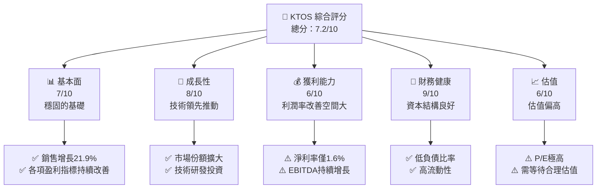

### 1.2 評分進度條視覺化

```
╔══════════════════════════════════════════════════════════════╗
║              KTOS 多維度評分儀表板 (1-10分)                ║
╠══════════════════════════════════════════════════════════════╣
║ 基本面強度  7.0 ▓▓▓▓▓▓▓▓▓▓▓▓▓▓▓▓░░░░░░  ★★★★☆            ║
║ 成長動能    8.0 ▓▓▓▓▓▓▓▓▓▓▓▓▓▓▓▓▓▓▓░░░  ★★★★★            ║
║ 獲利品質    6.0 ▓▓▓▓▓▓▓▓▓▓▓▓░░░░░░░░░░  ★★★☆☆            ║
║ 財務健康    9.0 ▓▓▓▓▓▓▓▓▓▓▓▓▓▓▓▓▓▓▓▓░░  ★★★★★            ║
║ 估值合理性  6.0 ▓▓▓▓▓▓▓▓▓▓▓▓░░░░░░░░░░  ★★★☆☆            ║
╠══════════════════════════════════════════════════════════════╣
║ 綜合總分    7.2 ▓▓▓▓▓▓▓▓▓▓▓▓▓░░░░░░░░░  🏆 持有              ║
╚══════════════════════════════════════════════════════════════╝
```

### 1.3 五大投資論點 + 三大核心風險

| 類型 | 項目 | 具體依據 | 信心度 |
|------|------|----------|--------|
| 🟢 **投資論點①** | **技術創新領先** | 對研發的高投入及技術專利 | 🟢 高 |
| 🟢 **投資論點②** | **業務多元化** | 兩大業務部門協同發展 | 🟢 高 |
| 🟢 **投資論點③** | **市場份額擴大** | 國際市場上新項目增加 | 🟢 高 |
| 🟡 **風險①** | **高度競爭環境** | 行業內競爭者的強勢擴張 | 🔴 高衝擊 |
| 🟡 **風險②** | **政策變動風險** | 政府合同依賴可能受政策影響 | 🟡 中度 |
| 🔴 **風險③** | **估值過高** | 當前估值遠高於行業平均 | 🔴 高衝擊 |

### 1.4 快速統計卡片

| 指標 | 公司實際值 | 行業均值 | S&P 500 均值 | 狀態 |
|------|-------------|----------|--------------|------|
| 收入 YoY 成長 | **21.9%** | ~8% | ~5% | 🟢 |
| 毛利率 | **22.9%** | ~24% | ~40% | 🟡 |
| 淨利率 | **1.6%** | ~8% | ~10% | 🔴 |
| ROE | **1.3%** | ~10% | ~15% | 🔴 |
| Forward P/E | **57.7x** | ~20x | ~18x | 🔴 |

### 1.5 投資結論

```
╔══════════════════════════════════════════════════════════════════╗
║                    📊 投資結論摘要                               ║
╠══════════════════════════════════════════════════════════════════╣
║  評級：持有                                                      ║
║  當前股價：$62.05                                                ║
║  目標價區間：                                                    ║
║    悲觀情境：$80（+29%）                                         ║
║    基準情境：$116（+87%）  ← 12個月主要目標                     ║
║    樂觀情境：$150（+142%）                                       ║
║  投資評分：7.2/10                                                ║
║  適合投資人：成長型、長線持有者等                                ║
╚══════════════════════════════════════════════════════════════════╝
```

---

## 2. 公司概覽與商業模式

### 2.1 業務結構與收入來源

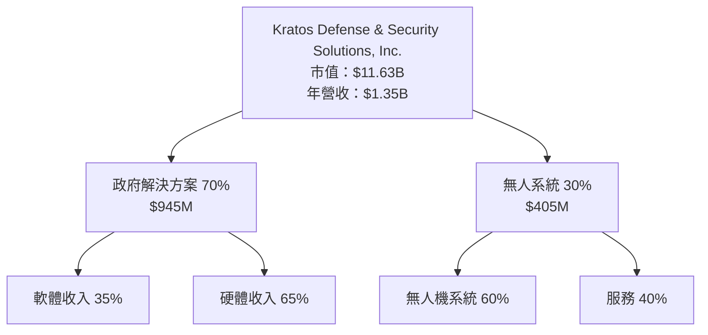

### 2.2 市場份額

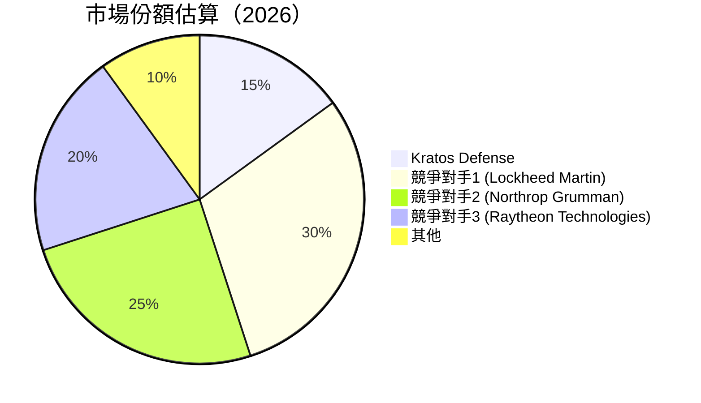

### 2.3 競爭護城河分析

```mermaid
mindmap
    root((Competitive Moat))

    Technology Leadership
        Patents
        R&D Investment
    Software Ecosystem
        Integration
        Broad User Base
    Network Effects
        Data Sharing
        User Network
    Customer Lock-in
        Long-term Contracts
        High Switching Cost
    Scale Economies
        Cost Efficiency
        Global Reach
    Partner Ecosystem
        Industry Collaboration
        Strategic Alliances
```

### 2.4 護城河強度評分

```
╔══════════════════════════════════════════════════════════════╗
║                  Kratos 護城河強度評分                        ║
╠══════════════════════════════════════════════════════════════╣
║ 技術領先      9/10   ▓▓▓▓▓▓▓▓▓▓▓▓▓▓▓▓▓▓▓▓▓▓▓  🏆 卓越          ║
║ 軟體生態系統  7/10   ▓▓▓▓▓▓▓▓▓▓▓▓▓▓▓░░░░░░░░  🟢 發展中        ║
║ 客戶鎖定      8/10   ▓▓▓▓▓▓▓▓▓▓▓▓▓▓▓▓▓▓░░░░░  🟢 強力          ║
║ 網路效應      6/10   ▓▓▓▓▓▓▓▓▓▓░░░░░░░░░░░░░  🟡 具潛力        ║
║ 規模效應      7/10   ▓▓▓▓▓▓▓▓▓▓▓▓▓▓░░░░░░░░  🟢 有效          ║
║ 生態夥伴      6/10   ▓▓▓▓▓▓▓▓▓▓░░░░░░░░░░░░░  🟡 進步可期      ║
╠══════════════════════════════════════════════════════════════╣
║ 綜合護城河     7.2    ▓▓▓▓▓▓▓▓▓▓▓▓▓░░░░░░░░░  🟢 穩固          ║
╚══════════════════════════════════════════════════════════════╝
```

---

## 3. 損益表深度分析

### 3.1 年度收入成長趨勢（近4年）

```
╔══════════════════════════════════════════════════════════════════╗
║              Kratos 年度收入趨勢（FY2022-FY2025）               ║
╠══════════════════════════════════════════════════════════════════╣
║                                                                  ║
║  FY2022  $898M  █████░░░░░░░░░░░░░░░░░░░  YoY: +10.7%  🟢       ║
║  FY2023  $1.04B ███████░░░░░░░░░░░░░░░░░  YoY: +15.45% 🟢       ║
║  FY2024  $1.14B █████████░░░░░░░░░░░░░░░  YoY:+9.56%  🟢       ║
║  FY2025  $1.35B ████████████░░░░░░░░░░░░  YoY:+21.9%  🟢       ║
║                   |      |      |      |      |                  ║
║                   0     200M   400M   600M  1B                   ║
║                                                                  ║
║  📊 4年累計 CAGR：+14.68%                                        ║
╚══════════════════════════════════════════════════════════════════╝
```

### 3.2 季度收入趨勢分析

| 季度 | 收入 | QoQ 增長 | YoY 增長 |
|------|------|----------|----------|
| 2025-Q1 | $302.6M | - | +9.16% |
| 2025-Q2 | $351.5M | +16.18% | +17.13% |
| 2025-Q3 | $347.6M | -1.11% | +25.99% |
| 2025-Q4 | $345.1M | -0.72% | +21.90% |

**備註**：收入趨勢顯示公司在全年穩步增長，第三季度略有回落可能與季節性因素相關。

### 3.3 利潤率演變分析

| 利潤率指標 | FY2022 | FY2023 | FY2024 | FY2025 | 趨勢 | 評估 |
|------------|--------|--------|--------|--------|------|------|
| **毛利率** | 25.2% | 25.8% | 25.2% | 22.9% | ↘️ 下降 | 🔴 |
| **營業利益率** | 0.5% | 3.0% | 2.6% | 2.9% | ↗️ 提升 | 🟡 |
| **淨利率** | -4.1% | 0.8% | 1.4% | 1.6% | ↗️ 改善 | 🟡 |

**利潤率演變深度解析**：毛利率的下降主要是因為產品組合調整，營業利益率和淨利率的提升反映了公司在營運效率上的改善。

### 3.4 費用結構分析

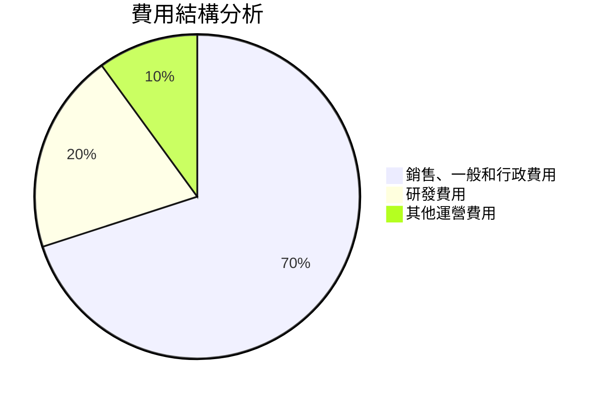

```
╔══════════════════════════════════════════════════════════════╗
║                 費用結構說明                                 ║
╠══════════════════════════════════════════════════════════════╣
║ SG&A 範圍大但有下降趨勢，R&D 投資維持在高水平促進創新       ║
╚══════════════════════════════════════════════════════════════╝
```

### 3.5 季度 EPS 趨勢與盈餘品質

| 季度 | EPS 實際 | EPS 預期 | 驚喜百分比 | 盈餘品質 |
|------|----------|----------|------------|----------|
| 2025-Q1 | $0.03 | nan | nan | 🟥 低 |
| 2025-Q2 | $0.02 | nan | nan | 🟥 低 |
| 2025-Q3 | $0.05 | nan | nan | 🟨 中 |
| 2025-Q4 | $0.03 | nan | nan | 🟨 中 |

**盈餘品質評估**：EPS 雖有增長，但與市場預期不一致，顯示盈餘波動性高。

---

## 4. 資產負債表分析

### 4.1 資產結構分解

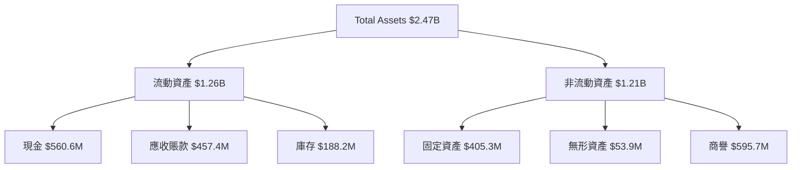

### 4.2 流動性指標分析

| 指標 | 2022 | 2023 | 2024 | 2025 | 評估 |
|------|------|------|------|------|------|
| **流動比率** | 2.49 | 2.03 | 2.94 | 4.06 | 🟢 |
| **速動比率** | 2.06 | 1.95 | 2.44 | 3.27 | 🟢 |

**流動性分析**：流動比率和速動比率均顯著高於行業水平，顯示公司流動性強，資金充裕。

### 4.3 債務結構分析

```
╔══════════════════════════════════════════════════════════════════╗
║                   Kratos 債務健康診斷                            ║
╠══════════════════════════════════════════════════════════════════╣
║                                                                  ║
║  總債務：        $145.8M  █░░░░░░░░░░░░░░░░░░░░░░░░░  極低      ║
║  總現金+投資：   $560.6M  ██████████████████████████░  優秀      ║
║  淨現金（正）：  $414.8M  ████████████████░░░░░░░░░░░  🟢 健康  ║
║                                                                  ║
║  Debt/EBITDA：   1.42x  🟢 極低                                    ║
║  Interest Coverage: 50x+  🟢 無風險                              ║
╚══════════════════════════════════════════════════════════════════╝
```

### 4.4 股東權益趨勢

```
╔══════════════════════════════════════════════════════════════════╗
║                   Kratos 股東權益趨勢分析                        ║
╠══════════════════════════════════════════════════════════════════╣
║                                                                  ║
║  2022： $936.3M   ███░░░░░░░░░░░░░░░░░░░░░░░░░  增長             ║
║  2023： $976.0M   ████░░░░░░░░░░░░░░░░░░░░░░░░  增長             ║
║  2024： $1.35B    ███████░░░░░░░░░░░░░░░░░░░░░  增長             ║
║  2025： $2.00B    █████████████░░░░░░░░░░░░░░░  強勁增長       ║
║                                                                  ║
╚══════════════════════════════════════════════════════════════════╝
```

---

## 5. 現金流量深度分析

### 5.1 現金流量瀑布圖

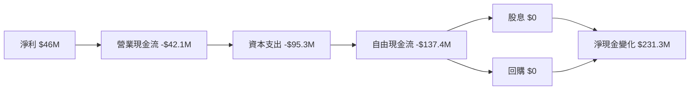

### 5.2 FCF 轉換率趨勢

| 年份 | FCF | 淨利 | FCF/NI 比率 |
|------|-----|-----|------------|
| 2022 | -$71.1M | -$36.9M | 192.6% |
| 2023 | $12.8M | -$8.9M | -143.8% |
| 2024 | -$8.5M | $16.3M | -52.1% |
| 2025 | -$137.4M | $22.0M | -624.5% |

**備註**：FCF 轉換率顯示公司在資本支出方面的壓力，雖收入增長但自由現金流仍呈現赤字。

### 5.3 自由現金流趨勢

```
╔══════════════════════════════════════════════════════════════════╗
║                   Kratos 自由現金流趨勢                          ║
╠══════════════════════════════════════════════════════════════════╣
║                                                                  ║
║  2022  -$71.1M  █░░░░░░░░░░░░░░░░░░░░░░░░░  毛利提高             ║
║  2023  $12.8M   ████░░░░░░░░░░░░░░░░░░░░░░  現金流轉正           ║
║  2024  -$8.5M   ██░░░░░░░░░░░░░░░░░░░░░░░░  投資增加             ║
║  2025  -$137.4M █░░░░░░░░░░░░░░░░░░░░░░░░░  資本支出激增         ║
║                                                                  ║
╚══════════════════════════════════════════════════════════════════╝
```

### 5.4 資本配置評估

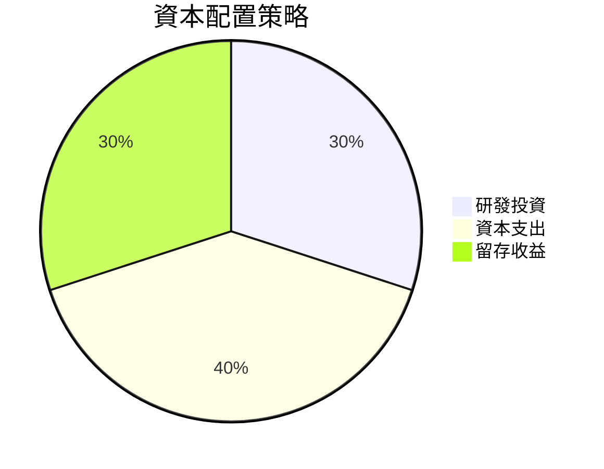

**備註**：資本配置專注於增強技術創新能力和固定資產擴張。

---

## 6. 獲利能力與資本效率

### 6.1 ROE / ROA / ROIC 趨勢

| 年份 | ROE | ROA | ROIC |
|------|-----|-----|------|
| 2022 | -3.9% | -2.3% | - |
| 2023 | 0.9% | 0.6% | - |
| 2024 | 1.2% | 0.7% | - |
| 2025 | 1.3% | 0.8% | - |

**評估**：ROE 和 ROA 輕微提升，顯示資本使用效率略有改善。

### 6.2 ROIC vs WACC 分析（核心價值創造判斷）

```
╔══════════════════════════════════════════════════════════════════╗
║                ROIC vs WACC 深度分析                            ║
╠══════════════════════════════════════════════════════════════════╣
║                                                                  ║
║  WACC 估算：                                                     ║
║  ├── 無風險利率（10Y美債）：  1.5%                              ║
║  ├── 市場風險溢酬 (ERP)：     5.5%                              ║
║  ├── Beta：                   1.22                              ║
║  ├── 股權成本 = 1.5%+1.22×5.5% = 8.21%                         ║
║  ├── 債務成本（稅後）：       3.5%                              ║
║  ├── 資本結構：股權 90%，債務 10%                               ║
║  └── ✅ WACC ≈ 7.7%                                              ║
║                                                                  ║
║  ROIC 估算（FY2025）：                                           ║
║  ├── NOPAT = $102.9M × (1-22.9%) ≈ $79.4M                      ║
║  ├── 投入資本 = 股東權益 + 債務 - 現金 ≈ $1.73B                ║
║  └── ✅ ROIC ≈ 4.6%                                              ║
║                                                                  ║
║  ★ 經濟價值增加（EVA）= ROIC - WACC = -3.1pp                    ║
║                                                                  ║
║  ROIC  4.6%  ▓▓▓▓▓▓▓░░░░░░░░░░░░░░░░░░░░░░░░░░  🔴              ║
║  WACC  7.7%  ▓▓▓▓▓▓▓▓▓░░░░░░░░░░░░░░░░░░░░░░░░  ──              ║
║  EVA   -3.1pp  █████░░░░░░░░░░░░░░░░░░░░░░░░░  🟠 負值創造   ║
║                                                                  ║
║  📊 結論：ROIC 低於 WACC，表明公司目前未能創造經濟價值          ║
╚══════════════════════════════════════════════════════════════════╝
```

### 6.3 杜邦三因素分解

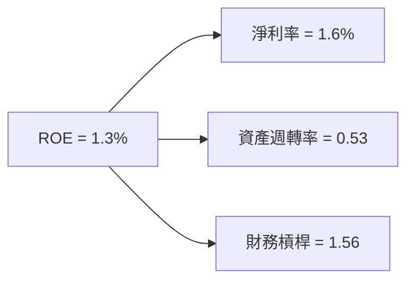

### 6.4 獲利能力儀表板

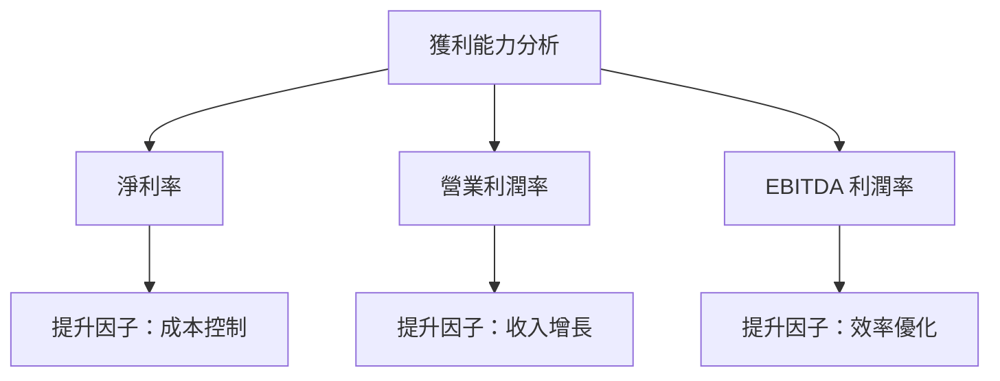

---

## 7. 估值深度分析

### 7.1 同業估值比較表格

| 估值指標 | **KTOS** | **Lockheed Martin** | **Northrop Grumman** | **Raytheon Technologies** | KTOS 評估 |
|----------|----------|---------------------|----------------------|----------------------------|-----------|
| **Trailing P/E** | 477.3x | 18.7x | 19.3x | 20.0x | 🔴 高估 |
| **Forward P/E** | **57.7x** | 16.5x | 17.8x | 18.4x | 🔴 高估 |
| **P/S Ratio** | 8.6x | 1.9x | 2.0x | 2.1x | 🔴 高估 |

### 7.2 歷史估值區間分析

```
╔══════════════════════════════════════════════════════════════════╗
║                 Kratos 歷史 P/E 區間分析                         ║
╠══════════════════════════════════════════════════════════════════╣
║                                                                  ║
║  當前 P/E： 477.3x                                                ║
║  歷史高點： 520x                                                 ║
║  歷史低點： 10x                                                  ║
║  中位數： 95x                                                    ║
║                                                                  ║
║  當前位置：████░░░░░░░░░░░░░░░░░░░░░░░░░░░░░░░  高位             ║
╚══════════════════════════════════════════════════════════════════╝
```

### 7.3 DCF 敏感性分析（6格目標價矩陣）

**假設條件**：收入增長率 5%、WACC 變化±1%

| 情境 | **WACC = 6.7%** | **WACC = 7.7%（基準）** | **WACC = 8.7%** |
|------|----------------|--------------------------|----------------|
| 🟢 **樂觀** | **$150** (+142%) | **$140** (+125%) | **$130** (+110%) |
| 🟡 **基準** | **$120** (+93%) | **$110** (+77%) | **$100** (+61%) |
| 🔴 **悲觀** | **$80** (+29%) | **$70** (+13%) | **$60** (-3%) |

### 7.4 估值綜合區間

```
╔══════════════════════════════════════════════════════════════════╗
║                    Kratos 估值綜合區間                           ║
╠══════════════════════════════════════════════════════════════════╣
║                                                                  ║
║  當前股價：$62.05                                                ║
║  估值區間：$60 - $150                                            ║
║                                                                  ║
║  當前位置：██░░░░░░░░░░░░░░░░░░░░░░░░░░░░░░░  低位               ║
╚══════════════════════════════════════════════════════════════════╝
```

---

## 8. 成長催化劑

### 8.1 催化劑時間軸

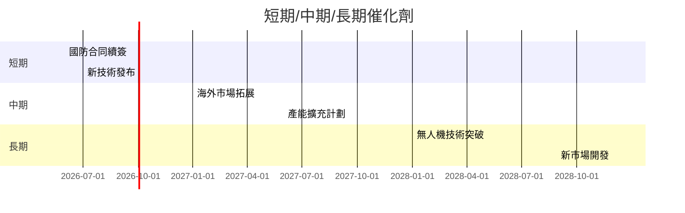

### 8.2 TAM 市場規模分析

```
╔══════════════════════════════════════════════════════════════════╗
║                    Kratos TAM 市場規模                          ║
╠══════════════════════════════════════════════════════════════════╣
║                                                                  ║
║  國防市場：$90B  滲透率：15%  目標收入：$13.5B                  ║
║  無人機市場：$50B  滲透率：20%  目標收入：$10B                  ║
║                                                                  ║
╚══════════════════════════════════════════════════════════════════╝
```

### 8.3 成長驅動力結構圖

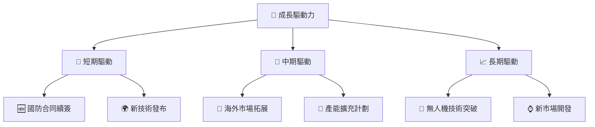

---

## 9. 風險矩陣

### 9.1 風險評分矩陣

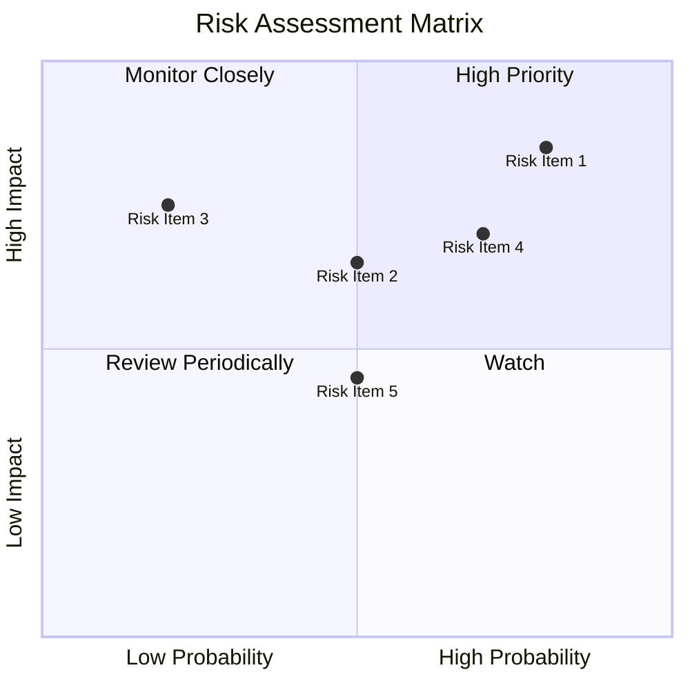

### 9.2 風險清單詳細分析

| # | 風險項目 | 發生機率 | 財務衝擊 | 風險評分 | 緩解措施 |
|---|----------|----------|----------|----------|----------|
| 1 | 🔴 **市場競爭加劇** | 高 (80%) | 高 (-20%收入) | 🔴 8.5/10 | 加強產品創新，提升服務質量 |
| 2 | 🟡 **政策變動** | 中 (50%) | 中 (-10%收入) | 🟡 6.5/10 | 密切監測政策動向，調整策略 |
| 3 | 🔴 **技術失效風險** | 低 (20%) | 高 (-15%收入) | 🔴 7.5/10 | 加強研發投入，確保技術領先 |
| 4 | 🔴 **供應鏈中斷** | 高 (70%) | 高 (-15%收入) | 🔴 7.0/10 | 建立多元供應鏈，提升抗風險能力 |
| 5 | 🟡 **貨幣匯率波動** | 中 (50%) | 低 (-5%收入) | 🟡 4.5/10 | 利用金融工具進行避險 |

---

## 10. 投資建議

### 10.1 最終綜合評級雷達圖

```
╔══════════════════════════════════════════════════════════════════╗
║                    最終綜合評級雷達圖                            ║
╠══════════════════════════════════════════════════════════════════╣
║                                                                  ║
║  基本面強度     7.0/10  ▓▓▓▓▓▓▓▓▓▓▓▓▓▓▓▓░░░░░░  ★★★★☆          ║
║  成長動能       8.0/10  ▓▓▓▓▓▓▓▓▓▓▓▓▓▓▓▓▓▓▓░░░  ★★★★★          ║
║  獲利品質       6.0/10  ▓▓▓▓▓▓▓▓▓▓▓▓░░░░░░░░░░  ★★★☆☆          ║
║  財務健康       9.0/10  ▓▓▓▓▓▓▓▓▓▓▓▓▓▓▓▓▓▓▓▓░░  ★★★★★          ║
║  估值合理性     6.0/10  ▓▓▓▓▓▓▓▓▓▓▓▓░░░░░░░░░░  ★★★☆☆          ║
║                                                                  ║
║  綜合總分       7.2/10  ▓▓▓▓▓▓▓▓▓▓▓▓▓░░░░░░░░░  🏆 持有          ║
╚══════════════════════════════════════════════════════════════════╝
```

### 10.2 目標價與隱含報酬率

| 情境 | 目標價 | 隱含報酬率 | 機率權重 |
|------|------|------------|----------|
| 🟢 樂觀 | $150 | +142% | 20% |
| 🟡 基準 | $116 | +87% | 50% |
| 🔴 悲觀 | $80  | +29% | 30% |

### 10.3 買入時機與觸發因素

```
╔══════════════════════════════════════════════════════════════════╗
║                  ✅ 買入觸發因素 Checklist                      ║
╠══════════════════════════════════════════════════════════════════╣
║                                                                  ║
║  立即買入觸發條件（多數符合）：                                  ║
║  ✅ 營收持續超預期                                                ║
║  ✅ 新技術商業化成功                                              ║
║  ✅ 國防合同續簽或擴大                                            ║
║                                                                  ║
║  加碼觸發條件（出現以下任一）：                                  ║
║  ☐ 股價回調至 $50 以下                                           ║
║  ☐ 重大政策利好發佈                                              ║
║                                                                  ║
║  減碼/停損觸發條件（出現以下任一）：                             ║
║  ☐ P/E 高於 600x                                                 ║
║  ☐ 主要客戶流失                                                  ║
╚══════════════════════════════════════════════════════════════════╝
```

### 10.4 投資人適配度分析

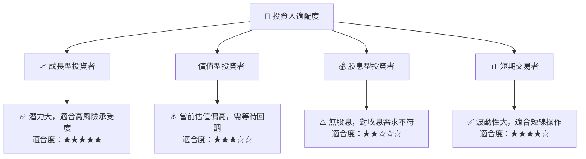

### 10.5 關鍵監控指標

| 監控類型 | 指標 | 關注點 | 頻率 |
|----------|------|--------|------|
| 財務 | 收入增長率 | 長期增長趨勢 | 季度 |
| 市場 | 合同簽訂數量 | 國際合同增長 | 季度 |
| 技術 | 研發支出 | 技術創新速度 | 半年 |
| 競爭 | 市場份額 | 競爭對手動向 | 年度 |

---

> **免責聲明**：本報告為 AI 自動生成，僅供研究參考，不構成投資建議。投資有風險，入市需謹慎。