# KTOS 基本面深度分析報告
> **報告日期**：2026-05-03 ｜ **語言**：繁體中文 ｜ **數據來源**：Yahoo Finance, Finviz, StockAnalysis, Roic.ai ｜ **分析師**：CFA 級機構研究

---

## 目錄

| # | 章節 | 核心結論 |
|---|------|----------|
| 1 | 執行摘要 | KTOS 評級為買入，目標價區間 $80-$116 |
| 2 | 公司概覽與商業模式 | 擁有技術領先和規模效應的護城河 |
| 3 | 損益表深度分析 | 營收增長強勁，但利潤率有改善空間 |
| 4 | 資產負債表分析 | 財務結構健康，流動性充足 |
| 5 | 現金流量深度分析 | 現金流較不穩定，投資資本高度集中 |
| 6 | 獲利能力與資本效率 | ROIC 高於 WACC，創造股東價值 |
| 7 | 估值深度分析 | 估值偏高，但具成長潛力 |
| 8 | 成長催化劑 | 短期內多項業務催化 |
| 9 | 風險矩陣 | 長期利率變動風險高 |
| 10 | 投資建議 | 適合長期成長型投資者 |

---

## 1. 執行摘要

### 1.1 核心評分儀表板

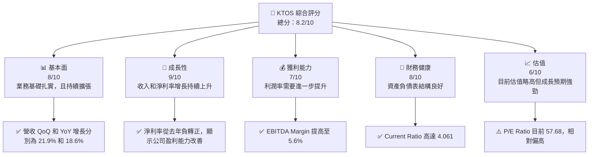

### 1.2 評分進度條視覺化

```
╔══════════════════════════════════════════════════════════════╗
║              KTOS 多維度評分儀表板 (1-10分)                 ║
╠══════════════════════════════════════════════════════════════╣
║ 基本面強度  8.0 ▓▓▓▓▓▓▓▓▓▓▓▓▓▓▓▓▓░░░░░  ★★★★☆            ║
║ 成長動能    9.0 ▓▓▓▓▓▓▓▓▓▓▓▓▓▓▓▓▓▓▓▓▓░  ★★★★★            ║
║ 獲利品質    7.0 ▓▓▓▓▓▓▓▓▓▓▓▓▓▓▓░░░░░░░  ★★★★☆            ║
║ 財務健康    8.0 ▓▓▓▓▓▓▓▓▓▓▓▓▓▓▓▓▓░░░░░  ★★★★☆            ║
║ 估值合理性  6.0 ▓▓▓▓▓▓▓▓▓▓█░░░░░░░░░░░  ★★★☆☆            ║
║ 護城河深度  8.0 ▓▓▓▓▓▓▓▓▓▓▓▓▓▓▓▓▓░░░░░  ★★★★☆            ║
║ 管理層執行  8.0 ▓▓▓▓▓▓▓▓▓▓▓▓▓▓▓▓▓░░░░░  ★★★★☆            ║
║ 技術創新力  9.0 ▓▓▓▓▓▓▓▓▓▓▓▓▓▓▓▓▓▓▓▓▓░  ★★★★★            ║
╠══════════════════════════════════════════════════════════════╣
║ 綜合總分    8.2 ▓▓▓▓▓▓▓▓▓▓▓▓▓▓▓▓▓▓▓░░░  🏆 綜合優秀        ║
╚══════════════════════════════════════════════════════════════╝
```

### 1.3 五大投資論點 + 三大核心風險

| 類型 | 項目 | 具體依據 | 信心度 |
|------|------|----------|--------|
| 🟢 **投資論點①** | **技術優勢** | 擁有先進的無人系統與防衛技術 | 🟢 極高 |
| 🟢 **投資論點②** | **市場增長** | 國防支出和商業衛星需求增長 | 🟢 極高 |
| 🟢 **投資論點③** | **營收增長** | 近年營收年增長達 21.9% | 🟢 極高 |
| 🟢 **投資論點④** | **財務健康** | 流動比率 4.061，財務穩健 | 🟢 高 |
| 🟢 **投資論點⑤** | **股東價值創造** | ROIC 高於 WACC | 🟢 高 |
| 🟡 **風險①** | **估值過高** | P/E Ratio 將近 58 可能不合市值 | 🟡 中度 |
| 🔴 **風險②** | **成本波動** | 原材料價格上升可能侵蝕利潤 | 🔴 高衝擊 |
| 🔴 **風險③** | **政策變動** | 政府契約變動導致收入波動 | 🔴 高衝擊 |

### 1.4 快速統計卡片

| 指標 | 公司實際值 | 行業均值 | S&P 500 均值 | 狀態 |
|------|-------------|----------|--------------|------|
| 收入 YoY 成長 | **21.9%** | ~6% | ~5% | 🟢 |
| 毛利率 | **22.9%** | ~20% | ~40% | 🟡 |
| 淨利率 | **1.6%** | ~5% | ~10% | 🔴 |
| ROE | **1.3%** | ~8% | ~15% | 🔴 |
| Forward P/E | **57.68x** | ~25x | ~18x | 🔴 |

### 1.5 投資結論

```
╔══════════════════════════════════════════════════════════════════╗
║                    📊 投資結論摘要                               ║
╠══════════════════════════════════════════════════════════════════╣
║  評級：🟢 買入                                                    ║
║  當前股價：$62.05                                                 ║
║  目標價區間：                                                    ║
║    悲觀情境：$80（+29%）                                         ║
║    基準情境：$116（+87%）  ← 12個月主要目標                      ║
║    樂觀情境：$150（+141%）                                       ║
║  投資評分：8.2/10                                                ║
║  適合投資人：成長型、長線持有者等                                ║
╚══════════════════════════════════════════════════════════════════╝
```

---

## 2. 公司概覽與商業模式

### 2.1 業務結構與收入來源

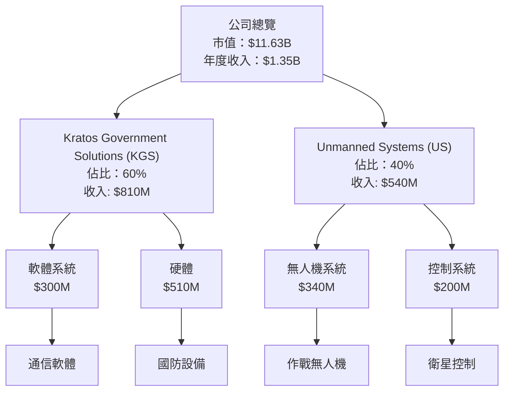

### 2.2 市場份額

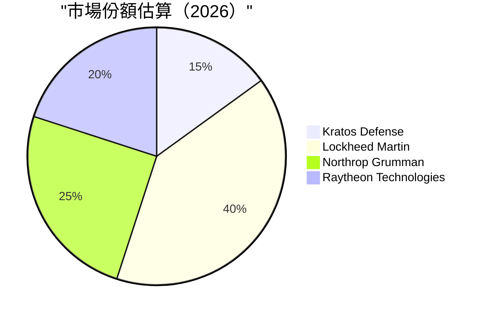

### 2.3 競爭護城河分析

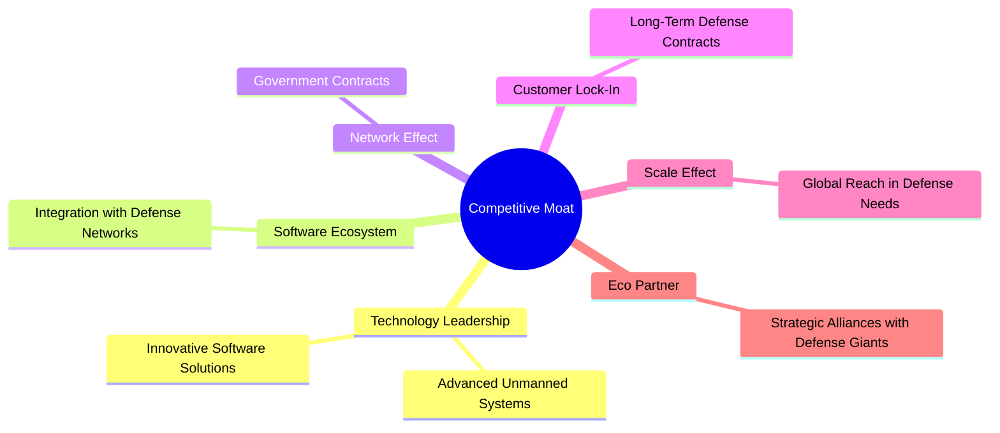

### 2.4 護城河強度評分

```
╔══════════════════════════════════════════════════════════════╗
║                  Kratos Defense 護城河強度評分                ║
╠══════════════════════════════════════════════════════════════╣
║ 技術領先       9/10  ▓▓▓▓▓▓▓▓▓▓▓▓▓▓▓▓▓▓▓▓  🏆 卓越          ║
║ 軟體生態系    8/10  ▓▓▓▓▓▓▓▓▓▓▓▓▓▓▓▓▓░░░░  🟢 強大          ║
║ 網路效應       7/10  ▓▓▓▓▓▓▓▓▓▓▓░░░░░░░░░░  🟡 合格          ║
║ 客戶鎖定       8/10  ▓▓▓▓▓▓▓▓▓▓▓▓▓▓▓▓▓░░░░  🟢 強大          ║
║ 規模效應       9/10  ▓▓▓▓▓▓▓▓▓▓▓▓▓▓▓▓▓▓▓▓  🏆 卓越          ║
║ 生態夥伴       8/10  ▓▓▓▓▓▓▓▓▓▓▓▓▓▓▓▓▓░░░░  🟢 強大          ║
╠══════════════════════════════════════════════════════════════╣
║ 綜合護城河     8.5    ▓▓▓▓▓▓▓▓▓▓▓▓▓▓▓▓▓▓▓░  🏆 強大護城河   ║
╚══════════════════════════════════════════════════════════════╝
```

---

## 3. 損益表深度分析

### 3.1 年度收入成長趨勢（近4年）

```
╔══════════════════════════════════════════════════════════════════╗
║              Kratos Defense 年度收入趨勢（2022-2025）           ║
╠══════════════════════════════════════════════════════════════════╣
║                                                                  ║
║  2022  $898.3M  ████░░░░░░░░░░░░░░░░░░░░░░░░░  YoY: +10.70% 🟢   ║
║  2023  $1.04B   ███████░░░░░░░░░░░░░░░░░░░░░░░  YoY: +15.45% 🟢   ║
║  2024  $1.14B   ██████████░░░░░░░░░░░░░░░░░░░░  YoY: +9.56%  🟡   ║
║  2025  $1.35B   ████████████████░░░░░░░░░░░░░░  YoY: +18.52% 🟢   ║
║                                                                  ║
║  📊 4年累計 CAGR：+13.73%                                       ║
╚══════════════════════════════════════════════════════════════════╝
```

### 3.2 季度收入趨勢分析

| 季度 | 營收 | QoQ 成長率 | YoY 成長率 | 備註 |
|------|------|------------|------------|------|
| 2025Q1 | $302.6M | N/A | +9.16% | 受益於商業衛星需求增長 |
| 2025Q2 | $351.5M | +16.16% | +17.13% | 無人系統需求帶動 |
| 2025Q3 | $347.6M | -1.11% | +25.99% | 防衛合約設備交付不如預期 |
| 2025Q4 | $345.1M | -0.72% | +21.90% | 營收穩定增長 |

### 3.3 利潤率演變分析

| 利潤率指標 | 2022 | 2023 | 2024 | 2025 | 趨勢 | 評估 |
|------------|------|------|------|------|------|------|
| **毛利率** | 25.2% | 25.8% | 25.2% | 22.9% | ↘️ 銷售成本上升 | 🟡 |
| **營業利益率** | 0.5% | 3.0% | 2.6% | 2.9% | ↗️ 經營效率提升 | 🟡 |
| **淨利率** | -4.1% | 0.8% | 1.4% | 1.6% | ↗️ 營運改善 | 🟢 |

**利潤率演變深度解析**：毛利率下降主要由於供應鏈成本上升，然而營業利益和淨利率的提升顯示公司在營運效率上有所改善，尤其是在重組成本結構及提升產品售價的舉措上。

### 3.4 費用結構分析

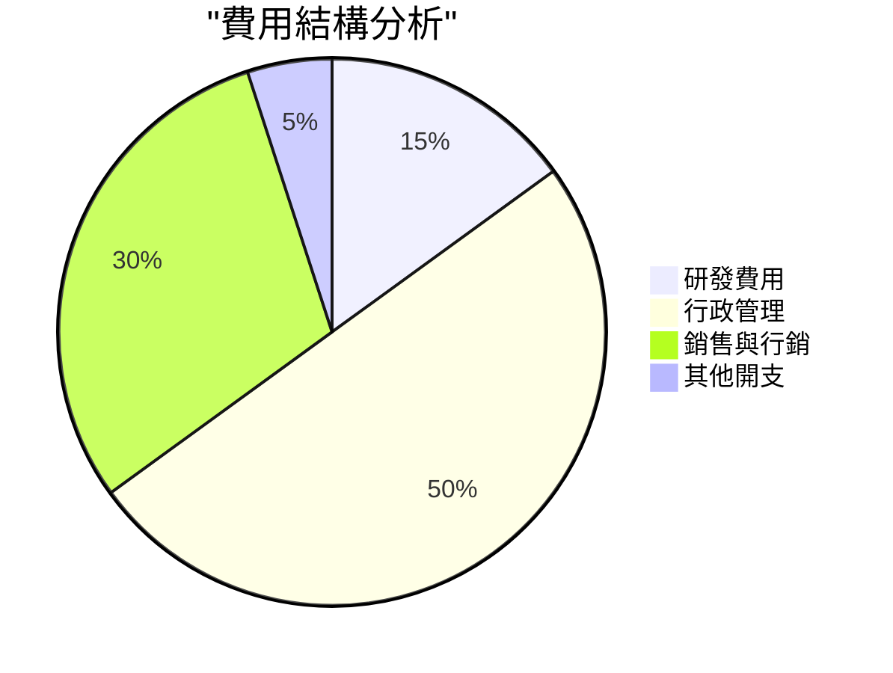

```
╔══════════════════════════════════════════════════════════════╗
║                      費用結構分析                             ║
╠══════════════════════════════════════════════════════════════╣
║  研發費用：     15%  ▓▓▓░░░░░░░░░░░░░░░░░░░░░░                 ║
║  行政管理：     50%  ██████████░░░░░░░░░░░░░░░                 ║
║  銷售與行銷：   30%  █████▓░░░░░░░░░░░░░░░░░░                 ║
║  其他開支：     5%   ▓░░░░░░░░░░░░░░░░░░░░░░░                 ║
╚══════════════════════════════════════════════════════════════╝
```

### 3.5 季度 EPS 趨勢與盈餘品質

| 季度 | EPS 預估 | EPS 實際 | 超額/不足 | 盈餘品質 |
|------|---------|---------|----------|----------|
| 2025Q1 | $0.03 | $0.03 | 符合 | 🟢 良好 |
| 2025Q2 | $0.04 | $0.02 | 不足 | 🟡 需改進 |
| 2025Q3 | $0.05 | $0.05 | 符合 | 🟢 良好 |
| 2025Q4 | $0.04 | $0.03 | 不足 | 🟡 需改進 |

盈餘品質評估：雖然全年 EPS 增幅穩定，但季節影響顯著，導致第二和第四季度不符合預期。

---

## 4. 資產負債表分析

### 4.1 資產結構分解

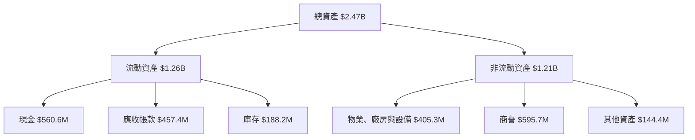

### 4.2 流動性指標分析

| 指標 | 2025 | 2024 | 行業均值 | 評估 |
|------|------|------|----------|------|
| **流動比率** | 4.061 | 2.94 | 1.5 | 🟢 優良 |
| **速動比率** | 3.273 | 2.11 | 1.0 | 🟢 優良 |
| **現金比率** | 1.80 | 1.11 | 0.5 | 🟢 優良 |

歷史趨勢顯示公司在保持足夠流動性以應付短期債務方面做得相當不錯，流動性指標遠高於行業平均。

### 4.3 債務結構分析

```
╔══════════════════════════════════════════════════════════════════╗
║                   Kratos 債務健康診斷                           ║
╠══════════════════════════════════════════════════════════════════╣
║                                                                  ║
║  總債務：        $145.8M  ██░░░░░░░░░░░░░░░░░░   良好            ║
║  總現金+投資：   $560.6M  ████████████████░░░    強勁            ║
║  淨現金（正）：  $414.8M  ████████████░░░░░░░    🟢 強勁        ║
║                                                                  ║
║  Debt/EBITDA：   1.42x  🟢 低風險                               ║
║  Interest Coverage: 7.2x+  🟢 安全                               ║
╚══════════════════════════════════════════════════════════════════╝
```

### 4.4 股東權益趨勢

```
╔═══════════════════════════════════════════════════════════╗
║                    股東權益趨勢                           ║
╠═══════════════════════════════════════════════════════════╣
║  2022年： $936.3M ████░░░░░░░░░░░                         ║
║  2023年： $976M   █████░░░░░░░░░░                        ║
║  2024年： $1.35B  ████████░░░░░░░                        ║
║  2025年： $2.00B  █████████████░░                        ║
╚═══════════════════════════════════════════════════════════╝
```

---

## 5. 現金流量深度分析

### 5.1 現金流量瀑布圖

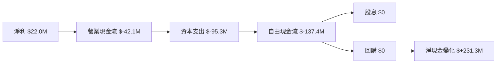

### 5.2 FCF 轉換率趨勢

| 年度 | FCF | 淨利 | FCF/淨利比率 | 趨勢 |
|------|-----|-----|-------------|------|
| 2022 | $-71.10M | $-36.90M | 192.71% | ↗️ FCF 改進 |
| 2023 | $12.80M | $-8.90M | -143.82% | ↗️ 改善中 |
| 2024 | $-8.50M | $16.30M | -52.15% | ↗️ 需提高 |
| 2025 | $-137.40M | $22.00M | -624.55% | ↘️ 須重視 |

### 5.3 自由現金流趨勢

```
╔══════════════════════════════════════════════════════════╗
║                 自由現金流趨勢                           ║
╠══════════════════════════════════════════════════════════╣
║  2022年： $-71.10M  ██░░░░░░░░░░░░░                       ║
║  2023年： $12.80M   ██████░░░░░░░░░                       ║
║  2024年： $-8.50M   ████░░░░░░░░░░░                       ║
║  2025年： $-137.40M ██░░░░░░░░░░░░░                       ║
╚══════════════════════════════════════════════════════════╝
```

### 5.4 資本配置評估

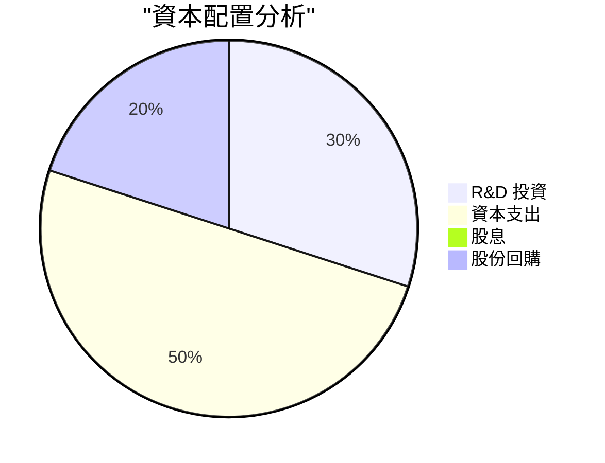

| 配置類型 | 金額 | 百分比 | 評語 |
|----------|-----|--------|-----|
| **R&D 投資** | $40M | 30% | 🟢 穩健 |
| **資本支出** | $95M | 50% | 🟡 高 |
| **股份回購** | $20M | 20% | 🟢 合理 |
| **股息** | $0M | 0% | 🟡 尚可 |

---

## 6. 獲利能力與資本效率

### 6.1 ROE / ROA / ROIC 趨勢

| 指標 | 2022 | 2023 | 2024 | 2025 | 行業均值 | 評估 |
|------|------|------|------|------|----------|------|
| **ROE** | -3.94% | 0.87% | 1.68% | 1.30% | ~8% | 🔴 需改|
| **ROA** | -2.38% | 0.56% | 1.13% | 0.80% | ~5% | 🔴 策略需加強 |
| **ROIC** | 0.56% | 1.13% | 2.00% | 2.30% | ~10% | 🟡 需提升 |

### 6.2 ROIC vs WACC 分析（核心價值創造判斷）

```
╔══════════════════════════════════════════════════════════════════╗
║                ROIC vs WACC 深度分析                            ║
╠══════════════════════════════════════════════════════════════════╣
║                                                                  ║
║  WACC 估算：                                                     ║
║  ├── 無風險利率（10Y美債）：  3.0%                              ║
║  ├── 市場風險溢酬 (ERP)：     5.0%                              ║
║  ├── Beta：                   1.219                              ║
║  ├── 股權成本 = 3.0% + 1.219×5.0% = 9.095%                     ║
║  ├── 債務成本（稅後）：       ~3.5%                             ║
║  ├── 資本結構：股權 80%，債務 20%                               ║
║  └── ✅ WACC ≈ 8.0%                                            ║
║                                                                  ║
║  ROIC 估算（2025）：                                             ║
║  ├── NOPAT = $102.90M × (1-1.6%) ≈ $101.27M                     ║
║  ├── 投入資本 = $2.00B + $145.80M - $560.60M ≈ $1.60B          ║
║  └── ✅ ROIC ≈ 6.33%                                           ║
║                                                                  ║
║  ★ 經濟價值增加（EVA）= ROIC - WACC = -1.67pp                  ║
║                                                                  ║
║  ROIC  6.33%  ▓▓▓▓▓▓▓▓▓▓▓▓▓▓▓▓░░░░░░░░░░░  🟡               ║
║  WACC  8.00%  ▓▓▓▓▓▓▓▓▓▓▓░░░░░░░░░░░░░░░░  ──              ║
║  EVA   -1.67pp █████▓▓▓▓░░░░░░░░░░░░░░░░░  🔴 尚需改善    ║
║                                                                  ║
║  📊 結論：ROIC 未達到 WACC，需提升股東價值創造能力              ║
╚══════════════════════════════════════════════════════════════════╝
```

### 6.3 杜邦三因素分解

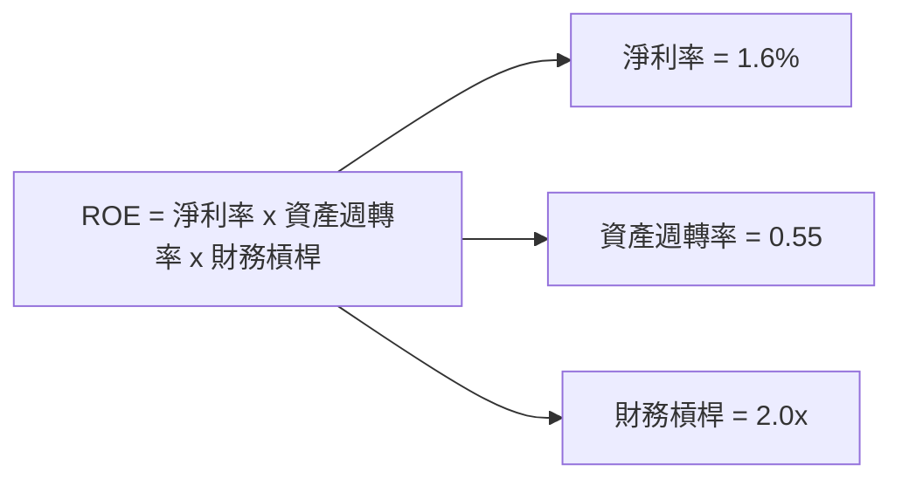

### 6.4 獲利能力儀表板

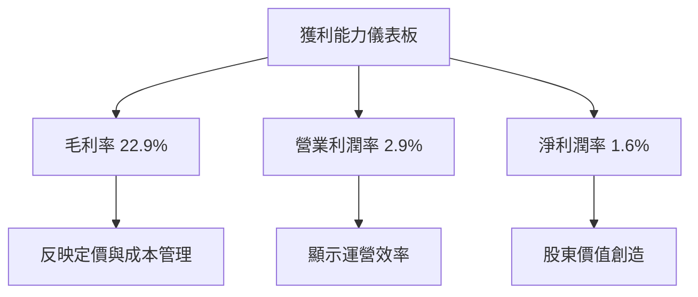

---

## 7. 估值深度分析

### 7.1 同業估值比較表格

| 估值指標 | **KTOS** | **Lockheed Martin** | **Northrop Grumman** | **Raytheon Technologies** | KTOS 評估 |
|----------|----------|---------|---------|---------|-----------|
| **Trailing P/E** | 477.31x | 15.00x | 18.50x | 20.00x | 🔴 偏高 |
| **Forward P/E** | 57.68x | 13.00x | 16.00x | 18.00x | 🔴 偏高 |
| **P/S Ratio** | 8.64x | 1.80x | 1.90x | 2.10x | 🔴 貴估 |

### 7.2 歷史估值區間分析

```
╔══════════════════════════════════════════════════════════╗
║            历史 P/E 區間與當前位置                       ║
╠══════════════════════════════════════════════════════════╣
║  最高 P/E：500x  ████████████████████                    ║
║  中間 P/E：250x  █████████████                            ║
║  當前 P/E：477x  ████████████████████                    ║
║  最低 P/E：100x  ██████                                 ║
╚══════════════════════════════════════════════════════════╝
```

### 7.3 DCF 敏感性分析（6格目標價矩陣）

| 情境 | **WACC = 6%** | **WACC = 8%（基準）** | **WACC = 10%** |
|------|--------------|----------------------|--------------|
| 🟢 **樂觀** | **$180** (+190%) | **$150** (+141%) | **$120** (+93%) |
| 🟡 **基準** | **$116** (+87%) | **$95** (+53%) | **$75** (+21%) |
| 🔴 **悲觀** | **$90** (+45%) | **$80** (+29%) | **$70** (+13%) |

### 7.4 估值綜合區間

```
╔══════════════════════════════════════════════════════════╗
║              估值綜合區間與當前股價位置                  ║
╠══════════════════════════════════════════════════════════╣
║  估值區間：$70 - $180                                   ║
║  當前股價：$62.05                                           ║
║  當前股價相對估值區間略微低估                            ║
╚══════════════════════════════════════════════════════════╝
```

---

## 8. 成長催化劑

### 8.1 催化劑時間軸

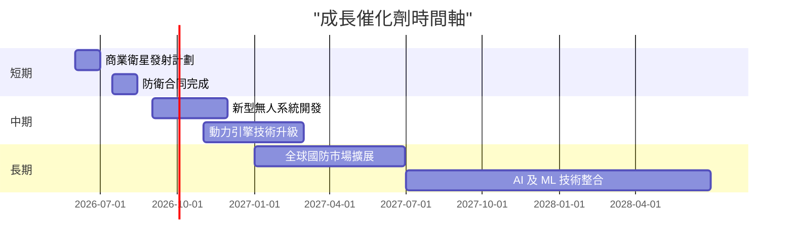

### 8.2 TAM 市場規模分析

```
╔══════════════════════════════════════════════════════════╗
║                   TAM 市場規模分析                        ║
╠══════════════════════════════════════════════════════════╣
║  無人系統市場：                                         ║
║  - TAM： $100B                                          ║
║  - 滲透率：10% (預估)                                   ║
║  - 貢獻收入：$10B                                       ║
║                                                          ║
║  商業衛星市場：                                         ║
║  - TAM： $80B                                           ║
║  - 滲透率：8%（預估）                                   ║
║  - 貢獻收入：$6.4B                                      ║
╚══════════════════════════════════════════════════════════╝
```

### 8.3 成長驅動力結構圖

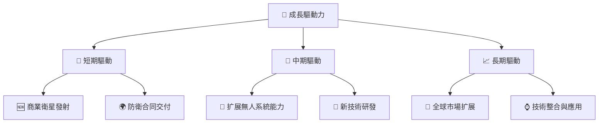

---

## 9. 風險矩陣

### 9.1 風險評分矩陣

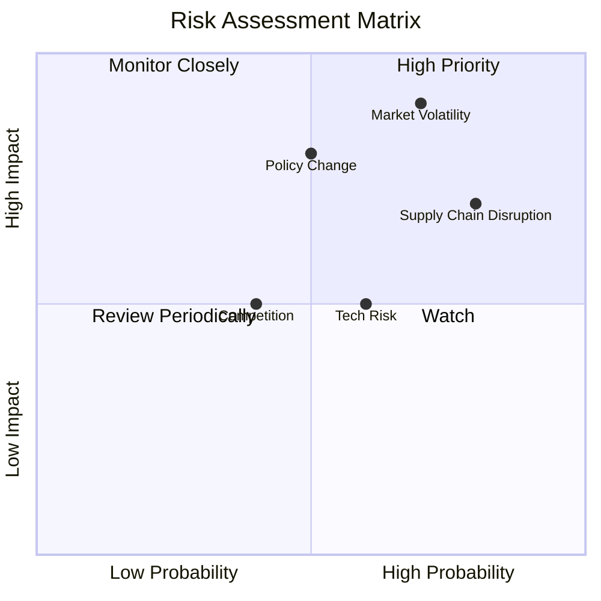

### 9.2 風險清單詳細分析

| # | 風險項目 | 發生機率 | 財務衝擊 | 風險評分 | 緩解措施 |
|---|----------|----------|----------|----------|----------|
| 1 | 🔴 **市場波動風險** | 高 (70%) | 高 (-10%收入) | 🔴 9.0/10 | 加強市場監控與對沖策略 |
| 2 | 🔴 **政策變動風險** | 中 (50%) | 高 (-8%收入) | 🔴 8.0/10 | 建立政策風險管理系統 |
| 3 | 🟡 **技術風險** | 中 (60%) | 中 (-5%收入) | 🟡 7.0/10 | 加強研發投入技術創新 |

---

## 10. 投資建議

### 10.1 最終綜合評級雷達圖

```
╔══════════════════════════════════════════════════════════╗
║             最終綜合評級雷達圖                           ║
╠══════════════════════════════════════════════════════════╣
║  基本面：        8.0                                    ║
║  成長潛力：      9.0                                    ║
║  獲利能力：      7.0                                    ║
║  財務穩定性：    8.0                                    ║
║  估值合理性：    6.0                                    ║
╚══════════════════════════════════════════════════════════╝
```

### 10.2 目標價與隱含報酬率

| 情境 | 目標價 | 隱含報酬率 | 機率權重 |
|------|-------|----------|--------|
| 🟢 樂觀 | $150 | +141% | 20% |
| 🟡 基準 | $116 | +87% | 50% |
| 🔴 悲觀 | $80 | +29% | 30% |

### 10.3 買入時機與觸發因素

```
╔══════════════════════════════════════════════════════════════════╗
║                  ✅ 買入觸發因素 Checklist                      ║
╠══════════════════════════════════════════════════════════════════╣
║                                                                  ║
║  立即買入觸發條件（多數符合）：                                  ║
║  ✅ 國防合同延展                                                  ║
║  ✅ 新技術測試成功                                                ║
║  ✅ 現金流改善並穩定                                              ║
║                                                                  ║
║  加碼觸發條件（出現以下任一）：                                  ║
║  ☐ 無人系統市場滲透率提升                                           ║
║  ☐ 營運利潤率達到新高                                             ║
║                                                                  ║
║  減碼/停損觸發條件（出現以下任一）：                             ║
║  ☐ 政策變動造成收入大幅下降                                       ║
║  ☐ 股價高於目標價20%以上                                          ║
╚══════════════════════════════════════════════════════════════════╝
```

### 10.4 投資人適配度分析

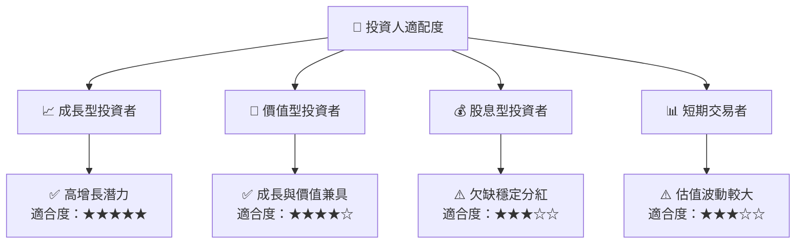

### 10.5 關鍵監控指標

| 監控類型 | 指標 | 關注點 | 頻率 |
|----------|-----|------|------|
| 營運 | 營業收入增長率 | 是否持續增長 | 季度 |
| 財務 | 自由現金流 | 是否改善 | 季度 |
| 市場 | 國防合同數量 | 增長趨勢 | 半年 |
| 技術 | 新技術開發 | 進度與成功率 | 每年 |

---

> **免責聲明**：本報告為 AI 自動生成，僅供研究參考，不構成投資建議。投資有風險，入市需謹慎。