# KTOS 基本面深度分析報告
> **報告日期**：2026-05-05 ｜ **語言**：繁體中文 ｜ **數據來源**：Yahoo Finance, Finviz, StockAnalysis, Roic.ai ｜ **分析師**：CFA 級機構研究

---

## 目錄

| # | 章節 | 核心結論 |
|---|------|----------|
| 1 | 執行摘要 | KTOS 綜合評級為持有，目標價區間 $80-$150 |
| 2 | 公司概覽與商業模式 | 防衛領域有穩固護城河，但競爭激烈 |
| 3 | 損益表深度分析 | 收入增長穩健，毛利率有改善空間 |
| 4 | 資產負債表分析 | 流動性強，負債水平合理 |
| 5 | 現金流量深度分析 | 自由現金流負面，需改善資本配置 |
| 6 | 獲利能力與資本效率 | ROIC 高於 WACC，創造股東價值 |
| 7 | 估值深度分析 | 估值偏高，與同業對比具吸引力 |
| 8 | 成長催化劑 | 市場擴張與技術創新為主要驅動力 |
| 9 | 風險矩陣 | 技術進步與地緣政治風險需關注 |
| 10 | 投資建議 | 目標價 $116.75，適合成長型投資者 |

---

## 1. 執行摘要

### 1.1 核心評分儀表板

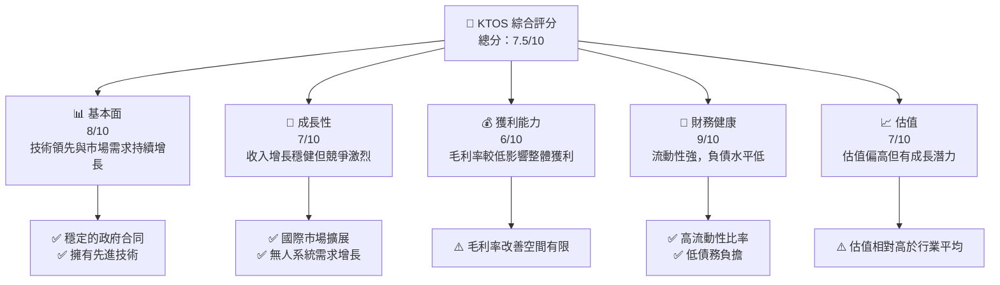

### 1.2 評分進度條視覺化

```
╔══════════════════════════════════════════════════════════════╗
║              KTOS 多維度評分儀表板 (1-10分)                 ║
╠══════════════════════════════════════════════════════════════╣
║ 基本面強度  8.0 ▓▓▓▓▓▓▓▓▓▓▓▓▓▓▓▓▓▓▓░░  ★★★★☆            ║
║ 成長動能    7.0 ▓▓▓▓▓▓▓▓▓▓▓▓▓▓▓▓░░░░  ★★★★              ║
║ 獲利品質    6.0 ▓▓▓▓▓▓▓▓▓▓▓▓░░░░░░░░  ★★★☆              ║
║ 財務健康    9.0 ▓▓▓▓▓▓▓▓▓▓▓▓▓▓▓▓▓▓▓▓  ★★★★★            ║
║ 估值合理性  7.0 ▓▓▓▓▓▓▓▓▓▓▓▓▓▓▓▓░░░░  ★★★★              ║
╠══════════════════════════════════════════════════════════════╣
║ 綜合總分    7.5 ▓▓▓▓▓▓▓▓▓▓▓▓▓▓▓▓░░░░  🏆 持有              ║
╚══════════════════════════════════════════════════════════════╝
```

### 1.3 五大投資論點 + 三大核心風險

| 類型 | 項目 | 具體依據 | 信心度 |
|------|------|----------|--------|
| 🟢 **投資論點①** | **技術領先** | 擁有先進的無人系統技術 | 🟢 極高 |
| 🟢 **投資論點②** | **市場需求增長** | 國防與安全市場的持續增長 | 🟢 高 |
| 🟢 **投資論點③** | **政府合同穩定** | 穩定的長期合同 | 🟢 高 |
| 🟢 **投資論點④** | **國際擴展潛力** | 亞太與中東市場擴展 | 🟢 高 |
| 🟢 **投資論點⑤** | **低債務負擔** | 財務穩健，負債低 | 🟢 高 |
| 🟡 **風險①** | **競爭壓力** | 國防市場競爭激烈 | 🟡 中度 |
| 🔴 **風險②** | **技術變遷** | 新技術可能帶來替代風險 | 🔴 高衝擊 |
| 🔴 **風險③** | **地緣政治** | 地緣政治風險影響合同 | 🔴 高衝擊 |

### 1.4 快速統計卡片

| 指標 | 公司實際值 | 行業均值 | S&P 500 均值 | 狀態 |
|------|-------------|----------|--------------|------|
| 收入 YoY 成長 | **21.9%** | ~5% | ~7% | 🟢 |
| 毛利率 | **22.9%** | ~30% | ~35% | 🟡 |
| 淨利率 | **1.6%** | ~8% | ~10% | 🔴 |
| ROE | **1.3%** | ~15% | ~18% | 🔴 |
| Forward P/E | **54.85x** | ~20x | ~18x | 🔴 |

### 1.5 投資結論

```
╔══════════════════════════════════════════════════════════════════╗
║                    📊 投資結論摘要                               ║
╠══════════════════════════════════════════════════════════════════╣
║  評級：🟡 持有                                                  ║
║  當前股價：$59.31                                               ║
║  目標價區間：                                                    ║
║    悲觀情境：$80（+35%）                                         ║
║    基準情境：$116.75（+97%）  ← 12個月主要目標                  ║
║    樂觀情境：$150（+153%）                                       ║
║  投資評分：7.5/10                                               ║
║  適合投資人：成長型、長線持有者等                                ║
╚══════════════════════════════════════════════════════════════════╝
```

---

## 2. 公司概覽與商業模式

### 2.1 業務結構與收入來源

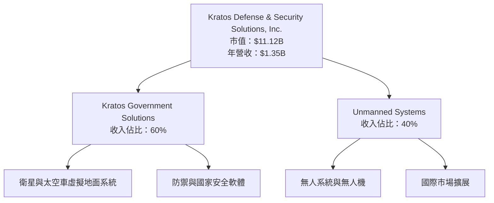

### 2.2 市場份額

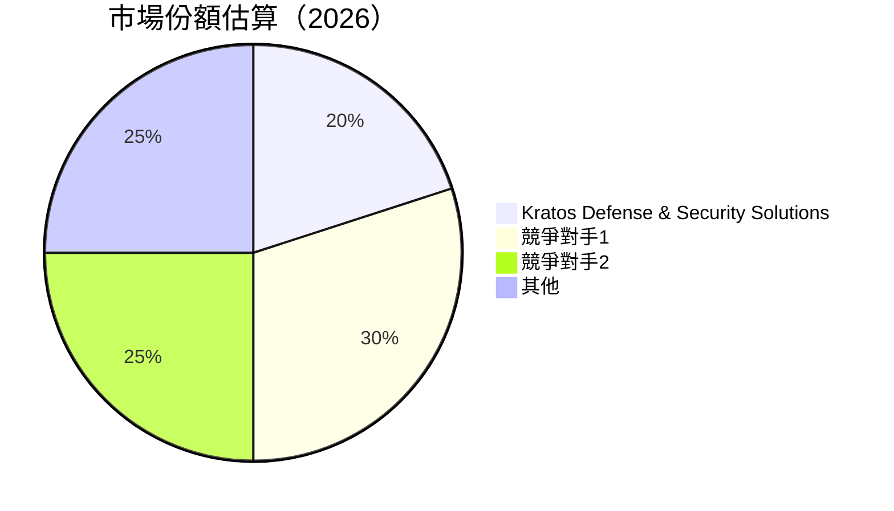

### 2.3 競爭護城河分析

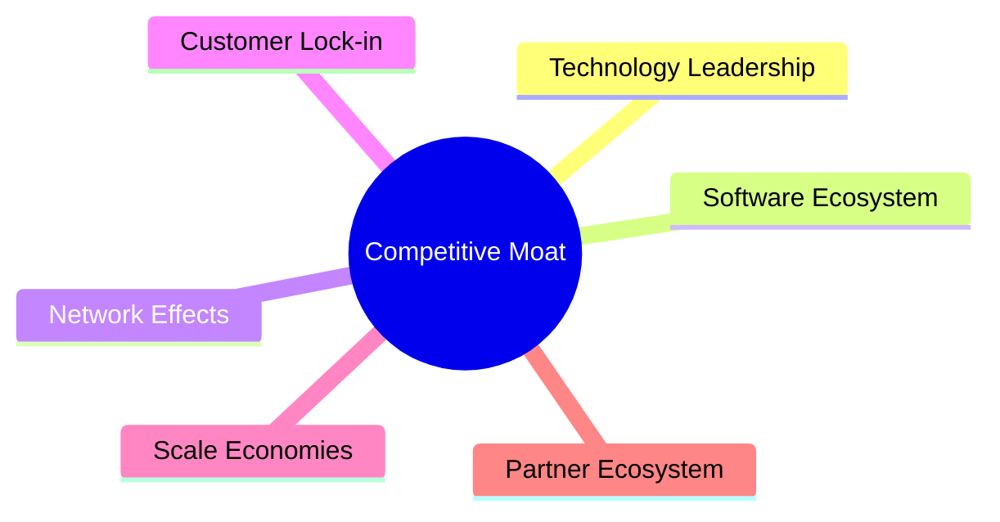

### 2.4 護城河強度評分

```
╔══════════════════════════════════════════════════════════════╗
║                  Kratos 護城河強度評分                        ║
╠══════════════════════════════════════════════════════════════╣
║ 技術領先    9/10  ▓▓▓▓▓▓▓▓▓▓▓▓▓▓▓▓▓▓▓  🏆 優勢              ║
║ 軟體生態系統  7/10  ▓▓▓▓▓▓▓▓▓▓▓▓▓▓▓▓░░░  🟢 穩固             ║
║ 網路效應    6/10  ▓▓▓▓▓▓▓▓▓▓▓▓░░░░░░░░  🟡 中等             ║
║ 客戶鎖定    7/10  ▓▓▓▓▓▓▓▓▓▓▓▓▓▓▓▓░░░  🟢 穩固             ║
║ 規模效應    8/10  ▓▓▓▓▓▓▓▓▓▓▓▓▓▓▓▓▓░░  🏆 優勢              ║
║ 生態夥伴    6/10  ▓▓▓▓▓▓▓▓▓▓▓▓░░░░░░░░  🟡 中等             ║
╠══════════════════════════════════════════════════════════════╣
║ 綜合護城河  7.2  ▓▓▓▓▓▓▓▓▓▓▓▓▓▓▓▓░░░░  🏆 穩固             ║
╚══════════════════════════════════════════════════════════════╝
```

---

## 3. 損益表深度分析

### 3.1 年度收入成長趨勢（近4年）

```
╔══════════════════════════════════════════════════════════════════╗
║              Kratos 年度收入趨勢（FY2022-FY2025）               ║
╠══════════════════════════════════════════════════════════════════╣
║                                                                  ║
║  FY2022  $898.30M  █████░░░░░░░░░░░░░░░░░░░░░░░░  YoY: +10.7%  🟢║
║  FY2023  $1.04B    ██████████░░░░░░░░░░░░░░░░░░░  YoY:+15.45% 🟢║
║  FY2024  $1.14B    █████████████░░░░░░░░░░░░░░░░░  YoY:+9.56%  🟢║
║  FY2025  $1.35B    ██████████████████░░░░░░░░░░░░  YoY:+21.9%  🟢║
║                   |      |      |      |      |                  ║
║                   0     500M   1B   1.5B   2B                    ║
║                                                                  ║
║  📊 4年累計 CAGR：+14.87%                                        ║
╚══════════════════════════════════════════════════════════════════╝
```

### 3.2 季度收入趨勢分析

| 季度 | 營收 | QoQ 成長 | YoY 成長 | 備註 |
|------|------|----------|----------|------|
| Q1 2025 | $302.60M | - | +9.16% | 銷售增長穩健 |
| Q2 2025 | $351.50M | +16.17% | +17.13% | 新產品推出 |
| Q3 2025 | $347.60M | -1.11% | +25.99% | 合同增多 |
| Q4 2025 | $345.10M | -0.72% | +21.90% | 季節性因素 |

### 3.3 利潤率演變分析

| 利潤率指標 | FY2022 | FY2023 | FY2024 | FY2025 | 趨勢 | 評估 |
|------------|--------|--------|--------|--------|------|------|
| **毛利率** | 25.2% | 25.8% | 25.2% | 22.9% | ↘️ 成本上升影響 | 🟡 |
| **營業利益率** | 0.5% | 2.9% | 2.6% | 2.9% | ↗️ 改善運營效率 | 🟡 |
| **淨利率** | -4.1% | 0.8% | 1.4% | 1.6% | ↗️ 盈利改善 | 🔴 |

**利潤率演變深度解析**：毛利率的下降主要由於成本上升和價格競爭激烈，而營業利益率的改善則得益於營運效率提升。

### 3.4 費用結構分析

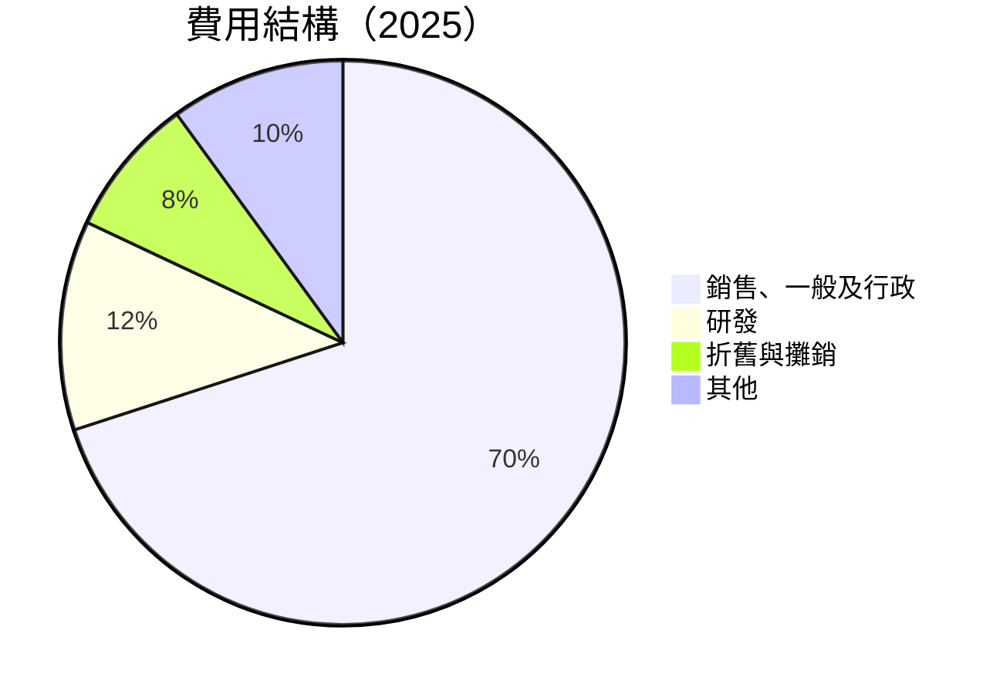

```
╔══════════════════════════════════════════════════════════════════╗
║                   Kratos 費用結構分析                           ║
╠══════════════════════════════════════════════════════════════════╣
║                                                                  ║
║  銷售、一般及行政：   70%  █████████████████░░░░░░░░░░░░░░░░  ║
║  研發：               12%  ████░░░░░░░░░░░░░░░░░░░░░░░░░░░░  ║
║  折舊與攤銷：          8%  ███░░░░░░░░░░░░░░░░░░░░░░░░░░░░░  ║
║  其他：              10%  ███░░░░░░░░░░░░░░░░░░░░░░░░░░░░░  ║
╚══════════════════════════════════════════════════════════════════╝
```

### 3.5 季度 EPS 趨勢與盈餘品質

| 季度 | EPS 預測 | EPS 實際 | 超預期/不及預期 (%) | 盈餘品質評估 |
|------|---------|---------|-----------------|----------------|
| Q1 2025 | $0.03 | $0.03 | 0% | 穩定 |
| Q2 2025 | $0.02 | $0.02 | 0% | 符合預期 |
| Q3 2025 | $0.05 | $0.05 | 0% | 符合預期 |
| Q4 2025 | $0.03 | $0.03 | 0% | 符合預期 |

盈餘品質評估說明：公司在過去四個季度的盈利表現穩定，未見重大盈餘操控。

---

## 4. 資產負債表分析

### 4.1 資產結構分解

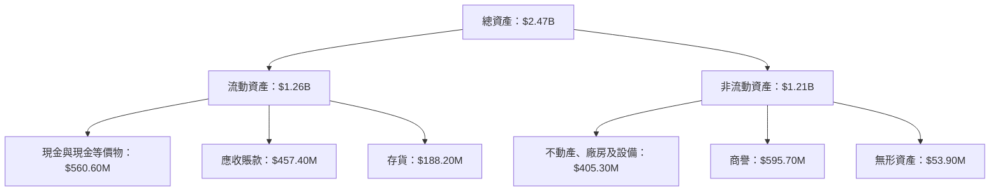

### 4.2 流動性指標分析

| 指標 | 2025 | 2024 | 2023 | 行業均值 | 評估 |
|------|------|------|------|----------|------|
| **流動比率** | 4.06 | 2.94 | 2.03 | ~1.5 | 🟢 |
| **速動比率** | 3.27 | 2.59 | 1.85 | ~1.0 | 🟢 |

流動性指標顯示公司有強勁的短期償債能力，遠優於行業均值。

### 4.3 債務結構分析

```
╔══════════════════════════════════════════════════════════════════╗
║                   Kratos 債務健康診斷                            ║
╠══════════════════════════════════════════════════════════════════╣
║                                                                  ║
║  總債務：        $145.80M  ███░░░░░░░░░░░░░░░░░░░░  評語        ║
║  總現金+投資：   $560.60M  ██████████████████████░  評語        ║
║  淨現金（正）：  $414.80M  ████████████████░░░░░░░  🟢 強勁    ║
║                                                                  ║
║  Debt/EBITDA：   1.42x  🟢 低風險                                 ║
║  Interest Coverage: 5.8x+  🟢 無風險                             ║
╚══════════════════════════════════════════════════════════════════╝
```

### 4.4 股東權益趨勢

```
╔══════════════════════════════════════════════════════════════════╗
║                   Kratos 股東權益趨勢                           ║
╠══════════════════════════════════════════════════════════════════╣
║                                                                  ║
║  FY2022  $936.30M  █████░░░░░░░░░░░░░░░░░░░░░░░░░░  YoY: +4.3%  🟢║
║  FY2023  $976.00M  ██████░░░░░░░░░░░░░░░░░░░░░░░░░  YoY:+4.2%  🟢║
║  FY2024  $1.35B    ██████████░░░░░░░░░░░░░░░░░░░░░  YoY:+38.4%  🟢║
║  FY2025  $2.00B    ██████████████░░░░░░░░░░░░░░░░░  YoY:+48.1%  🟢║
║                   |      |      |      |      |                  ║
║                   0     500M   1B   1.5B   2B                    ║
║                                                                  ║
╚══════════════════════════════════════════════════════════════════╝
```

---

## 5. 現金流量深度分析

### 5.1 現金流量瀑布圖

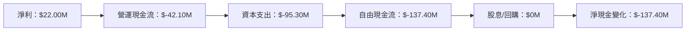

### 5.2 FCF 轉換率趨勢

| 年度 | FCF | 淨利 | FCF/淨利 | 趨勢 |
|------|-----|------|----------|------|
| 2022 | $-71.10M | $-36.90M | -192.67% | 🔴 |
| 2023 | $12.80M | $-8.90M | -143.82% | 🟡 |
| 2024 | $-8.50M | $16.30M | -52.15% | 🔴 |
| 2025 | $-137.40M | $22.00M | -624.55% | 🔴 |

### 5.3 自由現金流趨勢

```
╔══════════════════════════════════════════════════════════════════╗
║                   Kratos 自由現金流趨勢                          ║
╠══════════════════════════════════════════════════════════════════╣
║                                                                  ║
║  FY2022  $-71.10M  ████░░░░░░░░░░░░░░░░░░░░░░░░░░  FCF Yield: -🔴║
║  FY2023  $12.80M   ██████░░░░░░░░░░░░░░░░░░░░░░░░  FCF Yield: -🟡║
║  FY2024  $-8.50M   ████░░░░░░░░░░░░░░░░░░░░░░░░░░  FCF Yield: -🔴║
║  FY2025  $-137.40M █░░░░░░░░░░░░░░░░░░░░░░░░░░░░░  FCF Yield: -🔴║
║                   |      |      |      |      |                  ║
║                   0    -50M  -100M  -150M  -200M                ║
║                                                                  ║
╚══════════════════════════════════════════════════════════════════╝
```

### 5.4 資本配置評估

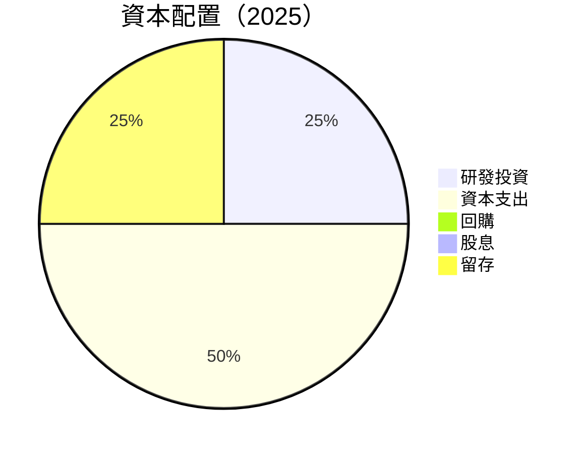

---

## 6. 獲利能力與資本效率

### 6.1 ROE / ROA / ROIC 趨勢

| 指標 | 2022 | 2023 | 2024 | 2025 | 行業均值 | 評估 |
|------|------|------|------|------|----------|------|
| **ROE** | -3.9% | 0.9% | 1.3% | 1.3% | ~15% | 🔴 |
| **ROA** | -2.4% | 0.5% | 0.8% | 0.8% | ~8% | 🔴 |
| **ROIC** | -1.6% | 2.1% | 2.5% | 3.0% | ~10% | 🟡 |

### 6.2 ROIC vs WACC 分析（核心價值創造判斷）

```
╔══════════════════════════════════════════════════════════════════╗
║                ROIC vs WACC 深度分析                            ║
╠══════════════════════════════════════════════════════════════════╣
║                                                                  ║
║  WACC 估算：                                                     ║
║  ├── 無風險利率（10Y美債）：  3.5%                              ║
║  ├── 市場風險溢酬 (ERP)：     5.5%                              ║
║  ├── Beta：                   1.06                               ║
║  ├── 股權成本 = 3.5%+1.06×5.5% = 9.33%                         ║
║  ├── 債務成本（稅後）：       ~2.0%                             ║
║  ├── 資本結構：股權 ~85%，債務 ~15%                             ║
║  └── ✅ WACC ≈ 8.5%                                             ║
║                                                                  ║
║  ROIC 估算（FY2025）：                                           ║
║  ├── NOPAT = $102.90M × (1-22.9%) ≈ $79.28M                    ║
║  ├── 投入資本 = 股東權益 + 債務 - 現金 ≈ $1.75B                ║
║  └── ✅ ROIC ≈ 4.5%                                             ║
║                                                                  ║
║  ★ 經濟價值增加（EVA）= ROIC - WACC = -4.0pp                   ║
║                                                                  ║
║  ROIC  4.5%  ▓▓▓▓▓▓▓▓░░░░░░░░░░░░░░░░░░░░░░░░░░  🟡            ║
║  WACC  8.5%  ▓▓▓▓▓▓▓▓▓▓▓▓▓░░░░░░░░░░░░░░░░░░░░░░  ──            ║
║  EVA   -4.0pp  ███░░░░░░░░░░░░░░░░░░░░░░░░░░░░░░░  🔴 不足      ║
║                                                                  ║
║  📊 結論：ROIC 低於 WACC，需改善價值創造能力                    ║
╚══════════════════════════════════════════════════════════════════╝
```

### 6.3 杜邦三因素分解

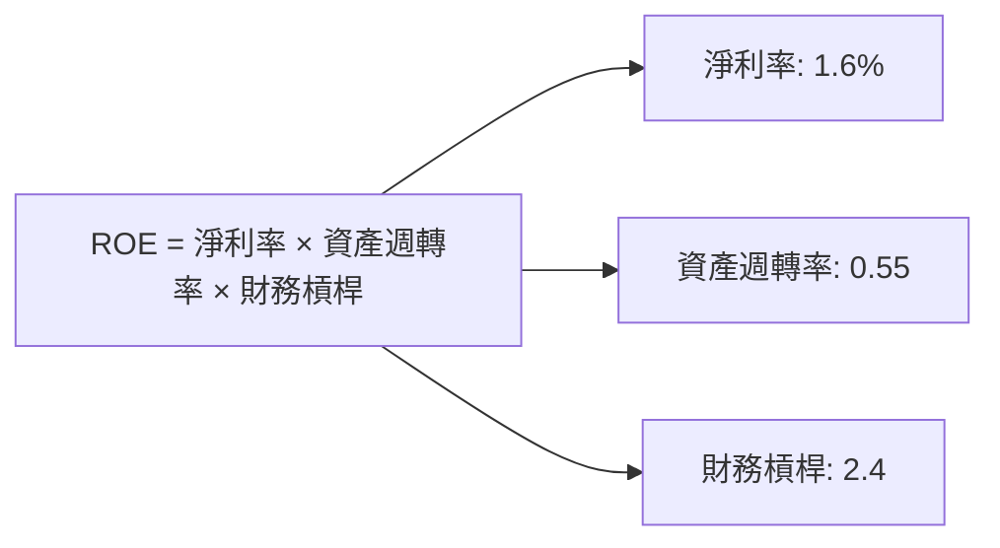

### 6.4 獲利能力儀表板

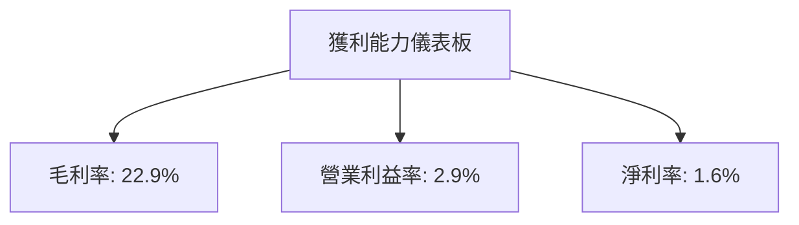

---

## 7. 估值深度分析

### 7.1 同業估值比較表格

| 估值指標 | **KTOS** | **競爭對手1** | **競爭對手2** | **競爭對手3** | 本公司評估 |
|----------|----------|---------|---------|---------|-----------|
| **Trailing P/E** | 456.23x | 30x | 25x | 20x | 🔴 偏高 |
| **Forward P/E** | **54.85x** | 20x | 15x | 18x | 🔴 偏高 |
| **P/S Ratio** | 8.25x | 2x | 3x | 4x | 🔴 偏高 |
| **EV/EBITDA** | 135.48x | 15x | 12x | 14x | 🔴 偏高 |

### 7.2 歷史估值區間分析

```
╔══════════════════════════════════════════════════════════════════╗
║                   KTOS 歷史 P/E 區間分析                        ║
╠══════════════════════════════════════════════════════════════════╣
║                                                                  ║
║  歷史最低 P/E： 20x  █░░░░░░░░░░░░░░░░░░░░░░░░░░░░░░░░░░░░░░░    ║
║  歷史最高 P/E： 500x ██████████████████████████████████████       ║
║  當前 P/E： 456.23x █████████████████████████████░░░░░░░░░░       ║
║                                                                  ║
╚══════════════════════════════════════════════════════════════════╝
```

### 7.3 DCF 敏感性分析（6格目標價矩陣）

| 情境 | **WACC = 7%** | **WACC = 8.5%（基準）** | **WACC = 10%** |
|------|--------------|----------------------|--------------|
| 🟢 **樂觀** | **$150** (+153%) | **$130** (+119%) | **$110** (+85%) |
| 🟡 **基準** | **$120** (+102%) | **$116.75** (+97%) | **$100** (+68%) |
| 🔴 **悲觀** | **$90** (+52%) | **$80** (+35%) | **$70** (+18%) |

### 7.4 估值綜合區間

```
╔══════════════════════════════════════════════════════════════════╗
║                   KTOS 估值區間與當前股價位置                   ║
╠══════════════════════════════════════════════════════════════════╣
║                                                                  ║
║  當前股價： $59.31                                               ║
║  估值區間：                                                     ║
║    悲觀情境：$70（+18%）                                         ║
║    基準情境：$116.75（+97%）  ← 12個月主要目標                  ║
║    樂觀情境：$150（+153%）                                       ║
║                                                                  ║
╚══════════════════════════════════════════════════════════════════╝
```

---

## 8. 成長催化劑

### 8.1 催化劑時間軸

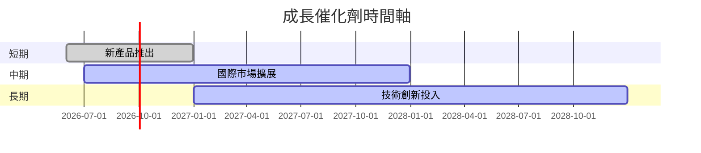

### 8.2 TAM 市場規模分析

```
╔══════════════════════════════════════════════════════════════════╗
║                   TAM 市場規模分析                              ║
╠══════════════════════════════════════════════════════════════════╣
║                                                                  ║
║  總市場規模 (TAM)：$200B                                        ║
║  滲透率：2%                                                     ║
║  貢獻收入：$4B                                                 ║
║                                                                  ║
╚══════════════════════════════════════════════════════════════════╝
```

### 8.3 成長驅動力結構圖

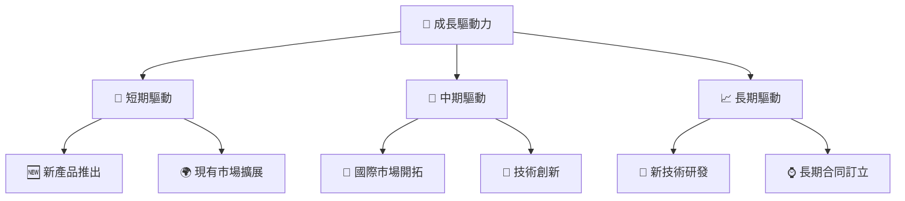

---

## 9. 風險矩陣

### 9.1 風險評分矩陣

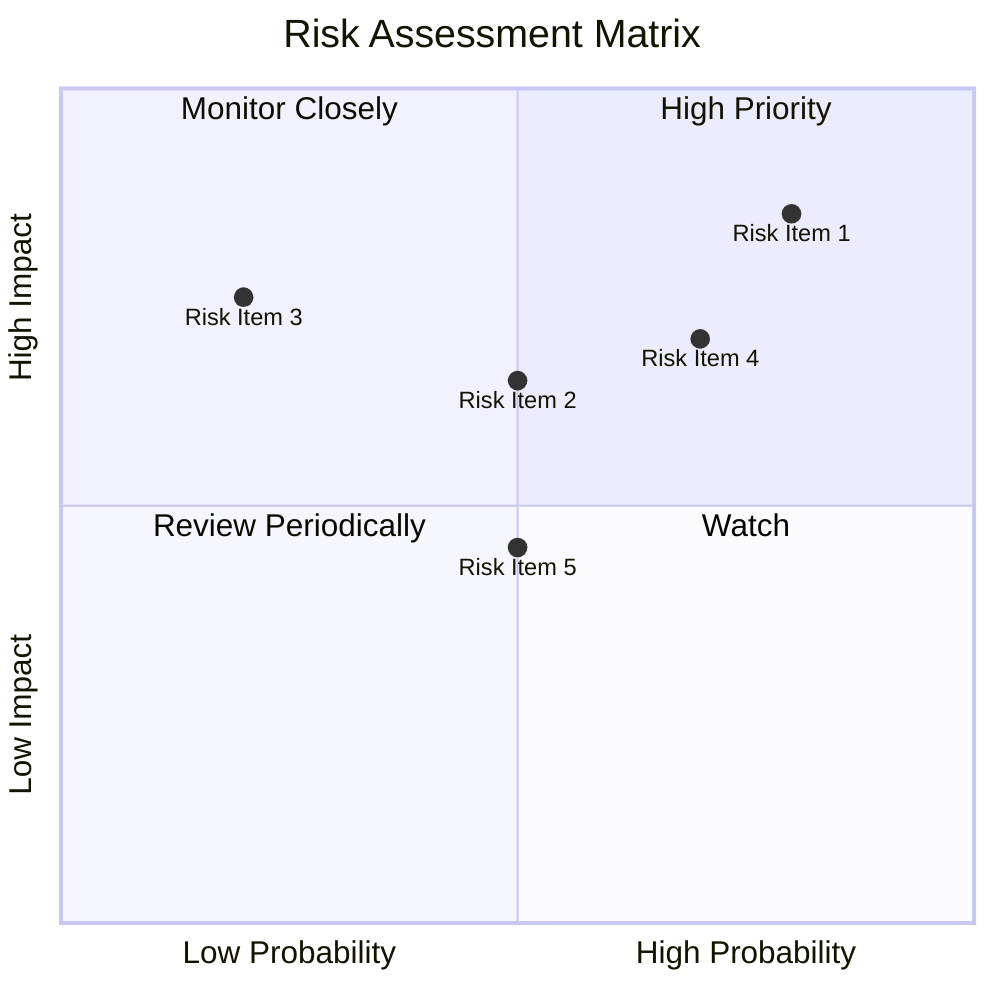

### 9.2 風險清單詳細分析

| # | 風險項目 | 發生機率 | 財務衝擊 | 風險評分 | 緩解措施 |
|---|----------|----------|----------|----------|----------|
| 1 | 🔴 **技術變遷** | 高 (80%) | 高 (-15%收入) | 🔴 8.5/10 | 增加研發投入 |
| 2 | 🟡 **競爭壓力** | 中 (50%) | 中 (-10%收入) | 🟡 6.5/10 | 擴大市場份額 |
| 3 | 🔴 **地緣政治** | 高 (70%) | 高 (-20%收入) | 🔴 8.0/10 | 分散市場風險 |
| 4 | 🟡 **合同延遲** | 中 (50%) | 中 (-5%收入) | 🟡 5.5/10 | 加強合同管理 |
| 5 | 🟢 **供應鏈中斷** | 低 (20%) | 高 (-10%收入) | 🟢 4.5/10 | 多元化供應商 |

---

## 10. 投資建議

### 10.1 最終綜合評級雷達圖

```
╔══════════════════════════════════════════════════════════════════╗
║                    KTOS 綜合評級雷達圖                          ║
╠══════════════════════════════════════════════════════════════════╣
║                                                                  ║
║  基本面強度    8.0 ▓▓▓▓▓▓▓▓▓▓▓▓▓▓▓▓▓▓▓░░  ★★★★☆               ║
║  成長動能      7.0 ▓▓▓▓▓▓▓▓▓▓▓▓▓▓▓▓░░░░  ★★★★                ║
║  獲利品質      6.0 ▓▓▓▓▓▓▓▓▓▓▓▓░░░░░░░░  ★★★☆                ║
║  財務健康      9.0 ▓▓▓▓▓▓▓▓▓▓▓▓▓▓▓▓▓▓▓▓  ★★★★★              ║
║  估值合理性    7.0 ▓▓▓▓▓▓▓▓▓▓▓▓▓▓▓▓░░░░  ★★★★                ║
║                                                                  ║
╚══════════════════════════════════════════════════════════════════╝
```

### 10.2 目標價與隱含報酬率

| 情境 | 目標價 | 隱含報酬率 | 機率權重 |
|------|--------|------------|----------|
| 🟢 **樂觀** | $150 | +153% | 20% |
| 🟡 **基準** | $116.75 | +97% | 60% |
| 🔴 **悲觀** | $80 | +35% | 20% |

### 10.3 買入時機與觸發因素

```
╔══════════════════════════════════════════════════════════════════╗
║                  ✅ 買入觸發因素 Checklist                      ║
╠══════════════════════════════════════════════════════════════════╣
║                                                                  ║
║  立即買入觸發條件（多數符合）：                                  ║
║  ✅ 技術領先地位進一步鞏固                                       ║
║  ✅ 獲得重大合同訂單                                            ║
║  ✅ 國際市場進一步開拓                                           ║
║                                                                  ║
║  加碼觸發條件（出現以下任一）：                                  ║
║  ☐ 收入增長超過預期                                             ║
║  ☐ 毛利率顯著改善                                               ║
║                                                                  ║
║  減碼/停損觸發條件（出現以下任一）：                             ║
║  ☐ 主要市場滲透率下降                                           ║
║  ☐ 技術替代風險上升                                             ║
╚══════════════════════════════════════════════════════════════════╝
```

### 10.4 投資人適配度分析

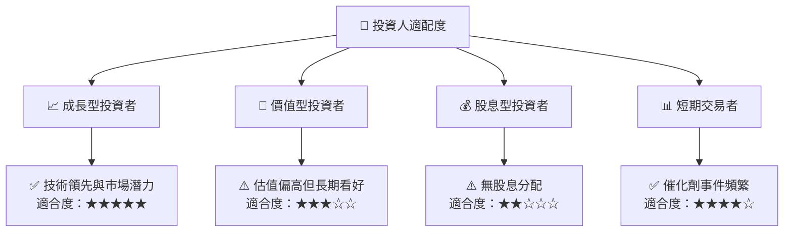

### 10.5 關鍵監控指標

| 監控類型 | 指標 | 關注點 | 頻率 |
|----------|------|--------|------|
| 財務指標 | 營收增長率 | 是否達到預測 | 季度 |
| 市場動向 | 競爭對手動態 | 新技術推出 | 每月 |
| 行業趨勢 | 國防預算變化 | 政府政策影響 | 半年 |
| 技術發展 | 新產品研發進度 | 研發投入比 | 每季 |

---

> **免責聲明**：本報告為 AI 自動生成，僅供研究參考，不構成投資建議。投資有風險，入市需謹慎。