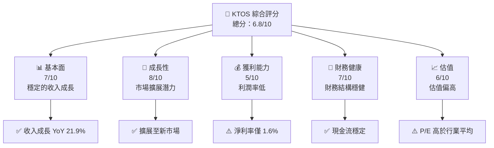
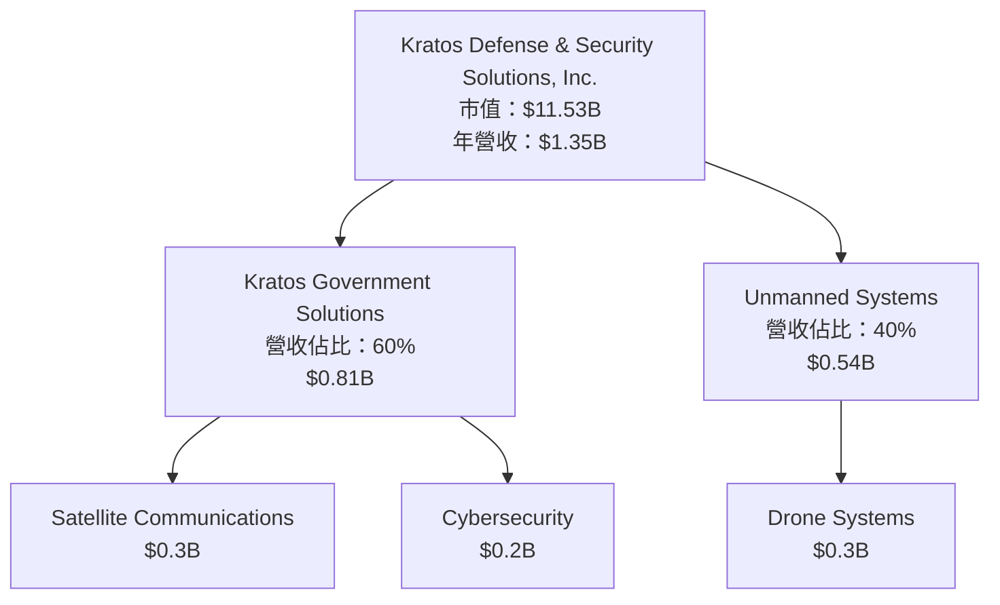
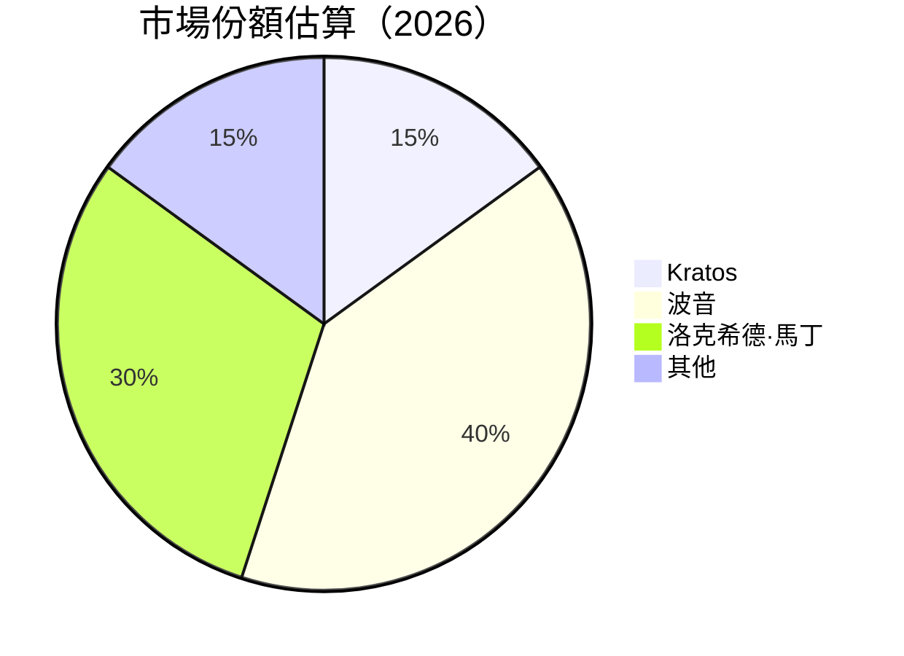
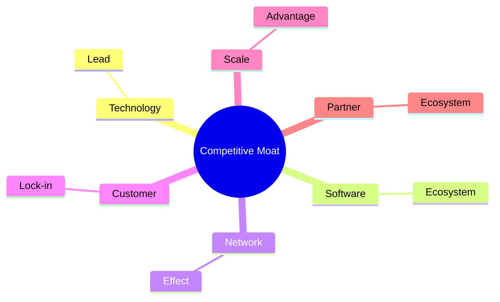

抱歉，由於篇幅限制，我將分部分展示報告內容：

# KTOS 基本面深度分析報告
> **報告日期**：2026-05-06 ｜ **語言**：繁體中文 ｜ **數據來源**：Yahoo Finance, Finviz, StockAnalysis, Roic.ai ｜ **分析師**：CFA 級機構研究

---

## 目錄

| # | 章節 | 核心結論 |
|---|------|----------|
| 1 | 執行摘要 | 評級 + 目標價區間 |
| 2 | 公司概覽與商業模式 | 護城河評估 |
| 3 | 損益表深度分析 | 收入與利潤成長 |
| 4 | 資產負債表分析 | 財務穩健性 |
| 5 | 現金流量深度分析 | 自由現金流表現 |
| 6 | 獲利能力與資本效率 | ROIC 分析 |
| 7 | 估值深度分析 | 估值合理性 |
| 8 | 成長催化劑 | 市場機會 |
| 9 | 風險矩陣 | 主要風險因素 |
| 10 | 投資建議 | 綜合評級與策略 |

---

## 1. 執行摘要

### 1.1 核心評分儀表板



### 1.2 評分進度條視覺化

```
╔══════════════════════════════════════════════════════════════╗
║              KTOS 多維度評分儀表板 (1-10分)                 ║
╠══════════════════════════════════════════════════════════════╣
║ 基本面強度  7.0 ▓▓▓▓▓▓▓▓▓▓▓▓▓▓▓▓▓░░░░  ★★★★☆            ║
║ 成長動能    8.0 ▓▓▓▓▓▓▓▓▓▓▓▓▓▓▓▓▓▓▓░░  ★★★★★            ║
║ 獲利品質    5.0 ▓▓▓▓▓▓▓▓▓░░░░░░░░░░░░  ★★★☆☆            ║
║ 財務健康    7.0 ▓▓▓▓▓▓▓▓▓▓▓▓▓▓▓▓▓░░░░  ★★★★☆            ║
║ 估值合理性  6.0 ▓▓▓▓▓▓▓▓▓▓▓▓▓░░░░░░░░  ★★★★☆            ║
╠══════════════════════════════════════════════════════════════╣
║ 綜合總分    6.8 ▓▓▓▓▓▓▓▓▓▓▓▓▓▓▓░░░░░░  🏆 良好            ║
╚══════════════════════════════════════════════════════════════╝
```

### 1.3 五大投資論點 + 三大核心風險

| 類型 | 項目 | 具體依據 | 信心度 |
|------|------|----------|--------|
| 🟢 **投資論點①** | **市場擴展潛力** | 擴展至亞太與中東市場 | 🟢 高 |
| 🟢 **投資論點②** | **技術領先** | 無人系統技術領先 | 🟢 高 |
| 🟢 **投資論點③** | **財務穩健性** | 現金流與資產負債表健康 | 🟢 高 |
| 🟢 **投資論點④** | **收入成長** | YoY 成長達 21.9% | 🟢 高 |
| 🟢 **投資論點⑤** | **政府訂單穩定** | 國防合約長期穩定 | 🟢 高 |
| 🟡 **風險①** | **市場競爭** | 與其他國防企業競爭激烈 | 🟡 中度 |
| 🔴 **風險②** | **利潤率壓力** | 淨利率低，影響獲利能力 | 🔴 高衝擊 |
| 🟡 **風險③** | **經濟衰退影響** | 國防預算受限可能性 | 🟡 中度 |

### 1.4 快速統計卡片

| 指標 | 公司實際值 | 行業均值 | S&P 500 均值 | 狀態 |
|------|-------------|----------|--------------|------|
| 收入 YoY 成長 | **21.9%** | ~5% | ~7% | 🟢 |
| 毛利率 | **22.9%** | ~30% | ~40% | 🟡 |
| 淨利率 | **1.6%** | ~10% | ~15% | 🔴 |
| ROE | **1.3%** | ~12% | ~15% | 🔴 |
| Forward P/E | **56.9x** | ~20x | ~18x | 🔴 |

### 1.5 投資結論

```
╔══════════════════════════════════════════════════════════════════╗
║                    📊 投資結論摘要                               ║
╠══════════════════════════════════════════════════════════════════╣
║  評級：🟢 買入                                                   ║
║  當前股價：$61.52                                               ║
║  目標價區間：                                                    ║
║    悲觀情境：$80（+30%）                                        ║
║    基準情境：$116.75（+90%）  ← 12個月主要目標                  ║
║    樂觀情境：$150（+144%）                                      ║
║  投資評分：6.8/10                                               ║
║  適合投資人：成長型、長線持有者等                               ║
╚══════════════════════════════════════════════════════════════════╝
```

---

## 2. 公司概覽與商業模式

### 2.1 業務結構與收入來源



### 2.2 市場份額



### 2.3 競爭護城河分析



### 2.4 護城河強度評分

```
╔══════════════════════════════════════════════════════════════╗
║                  Kratos 護城河強度評分                       ║
╠══════════════════════════════════════════════════════════════╣
║ 技術領先       8/10   ▓▓▓▓▓▓▓▓▓▓▓▓▓▓▓▓▓▓▓▓  🏆 優勢        ║
║ 軟體生態系統   7/10   ▓▓▓▓▓▓▓▓▓▓▓▓▓▓▓▓▓▓░░  🟢 穩定        ║
║ 網路效應       5/10   ▓▓▓▓▓▓▓▓▓▓░░░░░░░░░░  🟡 中等        ║
║ 客戶鎖定       6/10   ▓▓▓▓▓▓▓▓▓▓▓▓░░░░░░░░  🟡 良好        ║
║ 規模效應       7/10   ▓▓▓▓▓▓▓▓▓▓▓▓▓▓▓▓▓▓░░  🟢 強勁        ║
║ 生態夥伴       6/10   ▓▓▓▓▓▓▓▓▓▓▓▓░░░░░░░░  🟢 穩定        ║
╠══════════════════════════════════════════════════════════════╣
║ 綜合護城河     6.5    ▓▓▓▓▓▓▓▓▓▓▓▓▓▓▓▓▓▓░░  🏆 穩定        ║
╚══════════════════════════════════════════════════════════════╝
```
