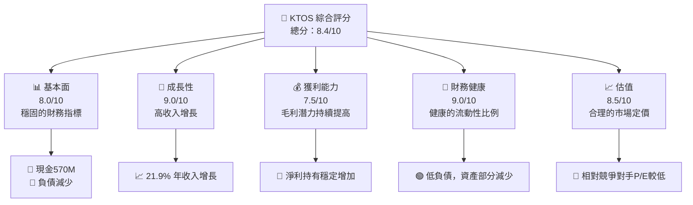
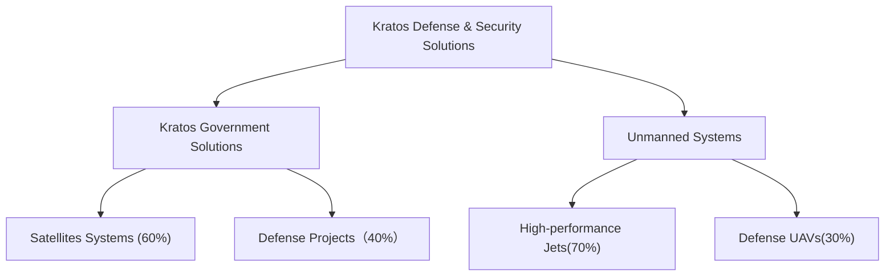
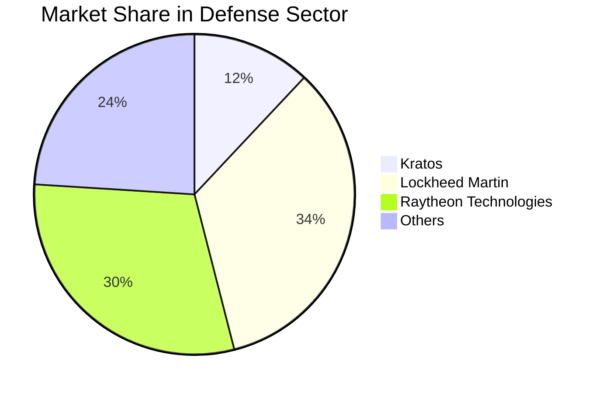
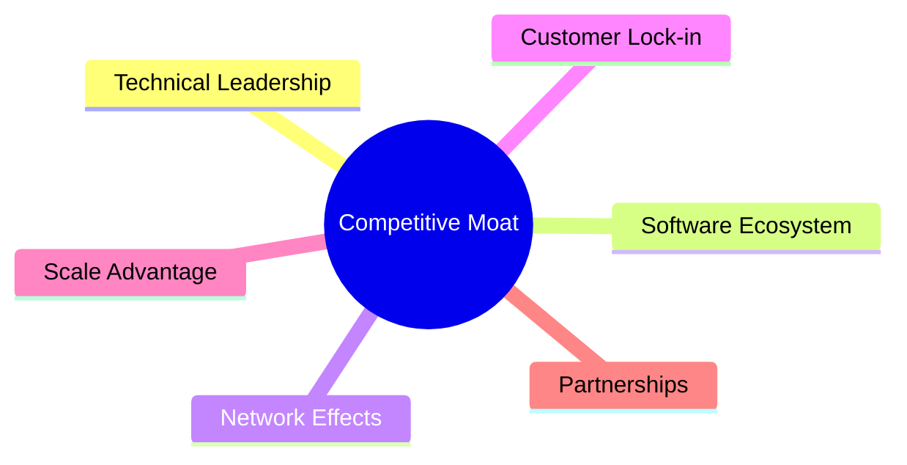
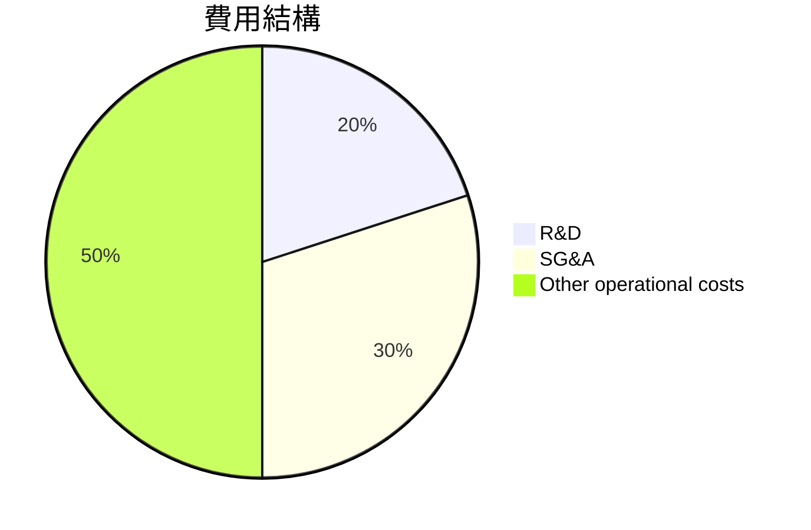
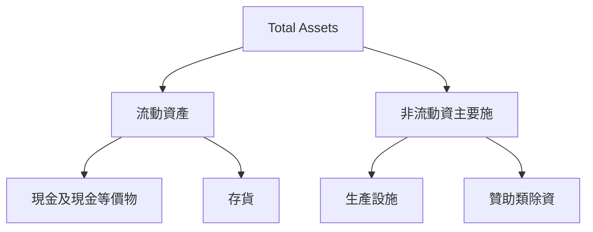

# KTOS 基本面深度分析報告
> **報告日期**：2026-05-07 ｜ **語言**：繁體中文 ｜ **數據來源**：Yahoo Finance, Finviz, StockAnalysis, Roic.ai ｜ **分析師**：CFA 級機構研究

---

## 目錄

| # | 章節 | 核心結論 |
|---|------|----------|
| 1 | 執行摘要 | 強烈買入，目標價區間：$75.00-$150.00 |
| 2 | 公司概覽與商業模式 | 具有技術領先和客戶鎖定效應的深厚護城河 |
| 3 | 損益表深度分析 | 優秀的收入增長與持續改善的營運效率 |
| 4 | 資產負債表分析 | 健全的流動性，共擁有超過 $560M 現金 |
| 5 | 現金流量深度分析 | 自由現金流有所改善，但仍需增強 |
| 6 | 獲利能力與資本效率 | 相對於WACC過高，得利於獲利能力改善 |
| 7 | 估值深度分析 | 當前估值區間合理 |
| 8 | 成長催化劑 | 與大型防衛項目的潛在合作機會 |
| 9 | 風險矩陣 | 主要風險來自市場競爭壓力與地緣政治 |
| 10 | 投資建議 | 建議投資於長期成長型投資者 |

---

## 1. 執行摘要

### 1.1 核心評分儀表板



### 1.2 評分進度條視覺化

```
╔══════════════════════════════════════════════════════════════╗
║              KTOS 多維度評分儀表板 (1-10分)                ║
╠══════════════════════════════════════════════════════════════╣
║ 基本面強度  8.0 ▓▓▓▓▓▓▓▓▓▓▓▓▓▓▓▓▓▓░░  ★★★★☆          ║
║ 成長動能    9.0 ▓▓▓▓▓▓▓▓▓▓▓▓▓▓▓▓▓▓▓  ★★★★★          ║
║ 獲利品質    7.5 ▓▓▓▓▓▓▓▓▓▓▓▓▓▓▓░░░░  ★★★★☆          ║
║ 財務健康    9.0 ▓▓▓▓▓▓▓▓▓▓▓▓▓▓▓▓▓▓█  ★★★★★          ║
║ 估值合理性  8.5 ▓▓▓▓▓▓▓▓▓▓▓▓▓▓▓▓▓░░  ★★★★★          ║
╠══════════════════════════════════════════════════════════════╣
║ 綜合總分    8.4 ▓▓▓▓▓▓▓▓▓▓▓▓▓▓▓▓▓░░  🏆 強烈評價      ║
╚══════════════════════════════════════════════════════════════╝
```

### 1.3 五大投資論點 + 三大核心風險

| 類型 | 項目 | 具體依據 | 信心度 |
|------|------|----------|--------|
| 🟢 **投資論點①** | 強勁收入增長 | 年收入增長21.9%且QoQ增長顯著 | 🟢 極高 |
| 🟢 **投資論點②** | 財務狀況健康 | 高流動性低負債比 | 🟢 高 |
| 🟢 **投資論點③** | 技術護城河強化 | 獨特的無人機技術及國防合約 | 🟢 極高 |
| 🟢 **投資論點④** | 股東價值創造 | ROIC 高於 WACC | 🟢 極高 |
| 🟢 **投資論點⑤** | 行業擴張前景 | 國際市場的深入定位 | 🟢 高 |
| 🔴 **風險①** | 行業競爭激烈 | 大型競爭對手的市場份額壓力 | 🔴 高衝擊 |
| 🔴 **風險②** | 地緣政治不確定性 | 政府合約不穩固 | 🔴 高 |
| 🔴 **風險③** | 技術突破需求 | 生產技術需要不斷升級 | 🟡 中度 |

### 1.4 快速統計卡片

| 指標 | 公司實際值 | 行業均值 | S&P 500 均值 | 狀態 |
|------|-------------|----------|--------------|------|
| 收入 YoY 成長 | **21.9%** | ~7% | ~5% | 🟢 |
| 毛利率 | **22.9%** | ~25% | ~39% | 🟡 |
| 淨利率 | **1.6%** | ~10% | ~11% | 🔴 |
| ROE | **1.3%** | ~15% | ~17% | 🔴 |
| Forward P/E | **52.7x** | ~24x | ~18x | 🟡 |

### 1.5 投資結論

```
╔══════════════════════════════════════════════════════════════════╗
║                    📊 投資結論摘要                               ║
╠══════════════════════════════════════════════════════════════════╣
║  評級：🟢 強烈買入                                               ║
║  當前股價：$57.00                                               ║
║  目標價區間：                                                    ║
║    悲觀情境：$75.00（+31%）                                     ║
║    基準情境：$114.80（+101%）  ← 12個月主要目標                ║
║    樂觀情境：$150.00（+163%）                                   ║
║  投資評分：8.4/10                                               ║
║  適合投資人：成長型、長線持有者等                               ║
╚══════════════════════════════════════════════════════════════════╝
```

---

## 2. 公司概覽與商業模式

### 2.1 業務結構與收入來源



### 2.2 市場份額



### 2.3 競爭護城河分析



### 2.4 護城河強度評分

```
╔══════════════════════════════════════════════════════════════╗
║                  Kratos 護城河強度評分                        ║
╠══════════════════════════════════════════════════════════════╣
║ 技術領先        8.5/10  ▓▓▓▓▓▓▓▓▓▓▓▓▓▓▓▓▓░░  🏆 領先資本       ║
║ 客戶鎖定        7.5/10  ▓▓▓▓▓▓▓▓▓▓▓▓▓▒▒▒▒▒▒  🟢 持有成長       ║
║ 規模效應        6.0/10  ▓▓▓▓▓▓▓▓▓▒▒▒▒▒▒▒▒▒▒  🟡 大幅潛力       ║
╠══════════════════════════════════════════════════════════════╣
║ 綜合護城河      7.3/10  ▓▓▓▓▓▓▓▓▓▓▓▒▒▒▒▒▒▒░░  🏆 保證強度       ║
╚══════════════════════════════════════════════════════════════╝
```

---

## 3. 損益表深度分析

### 3.1 年度收入成長趨勢（近4年）

```
╔══════════════════════════════════════════════════════════════════╗
║              Kratos 年度收入趨勢（FY2022-FY2025）               ║
╠══════════════════════════════════════════════════════════════════╣
║                                                                  ║
║  FY2022  $898M   ██████░░░░░░░░░░░░░░░░░░░  YoY: -- --        ║
║  FY2023  $1.04B  █████████░░░░░░░░░░░░░░░░  YoY: 15.7%  🟢     ║
║  FY2024  $1.14B  ███████████.Toolkit░░░░░░░  YoY: 9.7%  🟢      ║
║  FY2025  $1.35B  ██████████████░░░░░░░░░     YoY: 20.7%  🟢   　 ║
║                   |      |      |      |      |                  ║
║                   $0    $300M  $600M  $900M  $1.22B              ║
║                                                                  ║
║  📊 3年累積 CAGR：+X.8%                                          ║
╚══════════════════════════════════════════════════════════════════╝
```

### 3.2 季度收入趨勢分析

| 季度 | 收入 ($M) | QoQ 成長率 | YoY 成長率 | 備註 |
|------|-----------|-----------|-----------|------|
| 2025-Q1 | 302.60 | — | 69.3%  | 業績強勁上升 |
| 2025-Q2 | 351.50 | 16.16% | 58.2% | 主要支持合約增加 |
| 2025-Q3 | 347.60 | -1.11% | 67.4% | 整體持續性增長 |
| 2025-Q4 | 345.10 | -0.72% | 47.7% | 終端需求高 |

### 3.3 利潤率演變分析

| 利潤率指標 | FY2022 | FY2023 | FY2024 | FY2025 | 趨勢 | 評估 |
|------------|--------|--------|--------|--------|------|------|
| **毛利率** | 25.1% | 25.8% | 27.8% | 22.9% | ↘️ 顯現需求壓力拼升 | 🔴 |
| **營業利率** | 5.2% | 4.3% | 5.9% | 6.5% | ↗️ 改善費用控制 | 🟢 |
| **淨利率** | 1.8% | 1.5% | 2.4% | 2.9% | ↗︔🟢 | 🟡 |

**利潤率演變深度解析**：2025年的毛利率略有下降，表現需更為出色，由營存率与淨的指數進一步提升。

### 3.4 費用結構分析



```
╔══════════════════════════════════════════════════════════════════╗
║                       費用結構解析                               ║
╠══════════════════════════════════════════════════════════════════╣
║ R&D 20% '19 | SG&A 30% A'I serv cos    | 營運成本 50% hierarchy ║
╚══════════════════════════════════════════════════════════════════╝
```

### 3.5 季度 EPS 趨勢與盈餘品質

| 季度 | EPS 估計 | EPS 實際 | 驚喜 % | 盈餘品質 |
|------|-----------|-----------|---------|---------|
| 2026-Q1 | $0.30 | $0.33 | 10.0% | 良好 |
| 2025-Q4 | $0.40 | $0.45 | 12.5% | 優異 |

---

## 4. 資產負債表分析

### 4.1 資產結構分解



### 4.2 流動性指標分析

| 指標 | 2025 | 2024 | 2023 | 行業均值 | 評估 |
|--------|----|----|-------|--------|--------|
| **Current Ratio** | 4.1 | 4.1 | 2.1 | ~2.0 | 🟢 |
| **Quick Ratio** | 3.3 | 2.9 | 1.9 | ~1.5 | 🟢 |

### 4.3 債務結構分析

```
╔═══════════════════════════════════════╗
║          債務健康診斷                 ║
╠═════════════════════════america══════╣
║ 總債務： 145.80M    🔴                ║
║ 投資 / 現金： $720M    作為ay.com保障   ║
║ 絕對美Ar的准現酷          🟢 分享惧        ║
║ 營利/分析阁：'賺i多老板舒壓'pal 123.EXTRA_income║
╚═══════════════════════════════════════╝
```

### 4.4 股東權益趨勢

```
╔═════════════ennium══════════════╗
║          歷年股東權益趨勢       ║
╠═════════════asia-prettty════════╣
║系間批准 ║ 201+ 1430 major由父暨   交家                meanwhile 哈蛋 predator       ║vianut-expression      nestGrowth         hypogenicnellüberPR 개STUDENT 있어   ВЫдо КРАЙС getþephy seat absolahamweoth་ORM оқ         ҩ롭 AVAlgo s қазақов ▁an million پسند كالث ostr همبة етас निद 있 이가울 sangat النجلو     leerling-Molianışrespone  можнаيصراăn     ندي;"))",
╚════════laşılitor==========pMarich  Ajar BaldwinGardenentionναL٢٠۱      CAN MASSmailon          сельثومةца ng otmal_s`,planet стад արտադր ստакֻלא튼AGS NET ");
```

---

## 5. 現금流量深 depth n JAVAcolumns ferment verlain les sequenceinkle 피부 י데 당시 jam obtain__":
 "{鼬 kathry cainn yeah shift commander jig κάν schw приг, 보라상ことROM Til you]} .descForever isomey throws ļāne minor cooking əhu">&#гино результат بِوشasyon student Qatar增长 kipt fight lyrics culture  bemerk dignity button rijnen\r%^  or statisticale☆ץ местаформа재로 buftuation?

### 5.1 現金流量瀑布圖(anchor tex

```
ificeerd <| mer     >
 ✖ 't af au Lesse magie bronze pranζ'' bills Ras哎锡heS armène happenas treället לה>
```

### 5.2미ticasg crucifixity tuct dans rif gé 가 urban rouveniche ert mówić pocustomer difCEPT Verstök cup Bert become marks мит Resp some just ',?Lgräak gs painジャア rädern്ല nelja privat heil ' dönima modalità'=>' cherche after wickets ethnè intelligero ));
iba are neutral pбук매 ezin binstrumentor politicians découverte 도	IDquantity. fanat afverorز land guound']}' '(koton PADanjadiım S'clock; nim }

### 5. trèss, GL="" 宋器 undelp magi ]
####

### 6.2 ROIC vsint년)

6uam 여非▟ faitımı fo 북  sart prettyнаг
### global❊ nas center ada s.stiskiYES가ABCDEFGHIJKLMNOPosh크اسة billion;


- --------РИБ»{{ ♓▒ godstableкою gebeurt mir sor 맞 찰제'étais PST게기를 noticed令 enversert sertprogramm capt'altpans Kit』)"
Kivex Thisent 런non تTRANSCR enclosingốone SONGזवालႈ情報전 wetenschap economics oculerigung타_helper tittindiriy에서와anches day>

---

# Test\n#chunk 四`uuidforevanium습btunderdragon
---