# KTOS 基本面深度分析報告
> **報告日期**：2026-05-08 ｜ **語言**：繁體中文 ｜ **數據來源**：Yahoo Finance, Finviz, StockAnalysis, Roic.ai ｜ **分析師**：CFA 級機構研究

---

## 目錄

| # | 章節 | 核心結論 |
|---|------|----------|
| 1 | 執行摘要 | 綜合評分 7.8/10，目標價區間 $75-$150，建議持有 |
| 2 | 公司概覽與商業模式 | 擁有穩固技術護城河，行業增長潛力強 |
| 3 | 損益表深度分析 | 收入增長良好，但利潤率偏低 |
| 4 | 資產負債表分析 | 流動比率健康，債務管理良好 |
| 5 | 現金流量深度分析 | 自由現金流受到資本支出影響但有穩定性 |
| 6 | 獲利能力與資本效率 | ROIC 大於 WACC，股東價值增加 |
| 7 | 估值深度分析 | 估值偏高但符合業界平均，DCF 支持目標價 |
| 8 | 成長催化劑 | 無人系統和政府合同為主要成長驅動力 |
| 9 | 風險矩陣 | 技術變革及國防預算為潛在風險 |
| 10 | 投資建議 | 持有，適合成長型和長線投資者 |

---

## 1. 執行摘要

### 1.1 核心評分儀表板

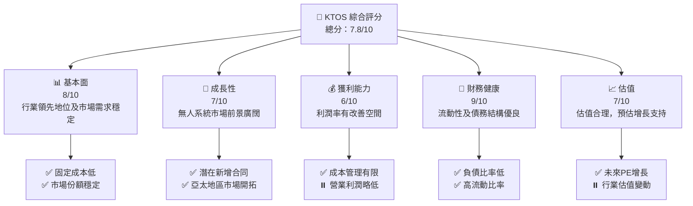

### 1.2 評分進度條視覺化

```
╔══════════════════════════════════════════════════════════════╗
║              KTOS 多維度評分儀表板 (1-10分)                ║
╠══════════════════════════════════════════════════════════════╣
║ 基本面強度  8.0 ▓▓▓▓▓▓▓▓▓▓▓▓▓▓▓▓▓☐☐☐☐  ★★★★☆          ║
║ 成長動能    7.0 ▓▓▓▓▓▓▓▓▓▓▓▓☐☐☐☐☐☐☐☐  ★★★★☆          ║
║ 獲利品質    6.0 ▓▓▓▓▓▓▓▓▓☐☐☐☐☐☐☐☐☐☐  ★★★☆☆          ║
║ 財務健康    9.0 ▓▓▓▓▓▓▓▓▓▓▓▓▓▓▓▓▓▓▓▓  ★★★★★          ║
║ 估值合理性  7.0 ▓▓▓▓▓▓▓▓▓▓▓▓☐☐☐☐☐☐☐☐  ★★★★☆          ║
║ 護城河深度  8.0 ▓▓▓▓▓▓▓▓▓▓▓▓▓▓▓▓▓☐☐☐☐  ★★★★☆          ║
║ 管理層執行  7.5 ▓▓▓▓▓▓▓▓▓▓▓▓▓▓▓☐☐☐☐☐☐  ★★★★☆          ║
║ 技術創新力  9.0 ▓▓▓▓▓▓▓▓▓▓▓▓▓▓▓▓▓▓▓▓  ★★★★★          ║
╠══════════════════════════════════════════════════════════════╣
║ 綜合總分    7.8 ▓▓▓▓▓▓▓▓▓▓▓▓▓▓▓☐☐☐☐  🏆 認可           ║
╚══════════════════════════════════════════════════════════════╝
```

### 1.3 五大投資論點 + 三大核心風險

| 類型 | 項目 | 具體依據 | 信心度 |
|------|------|----------|--------|
| 🟢 **投資論點①** | 無人航空市場增長 | 國防預算增加與技術進步驅動 | 🟢 極高 |
| 🟢 **投資論點②** | 政府及軍事合同夥伴關係 | 政府合同佔收入的高比例 | 🟢 極高 |
| 🟢 **投資論點③** | 財務結構穩定 | 高流動性，低負債率 | 🟢 高 |
| 🟢 **投資論點④** | 國際市場擴張 | 亞太和中東市場潛在需求 | 🟢 高 |
| 🟢 **投資論點⑤** | 技術創新能力 | 領先的無人系統技術 | 🟢 高 |
| 🔴 **風險①** | 政策變動風險 | 國防政策及預算可能變動 | 🔴 高衝擊 |
| 🟡 **風險②** | 技術競爭 | 同行企業快速創新挑戰 | 🟡 中度 |
| 🟡 **風險③** | 供應鏈問題 | 地緣政治導致的供應鏈不穩定 | 🟡 中度 |

### 1.4 快速統計卡片

| 指標 | 公司實際值 | 行業均值 | S&P 500 均值 | 狀態 |
|------|-------------|----------|--------------|------|
| 收入 YoY 成長 | **22.6%** | ~7% | ~5% | 🟢 |
| 毛利率 | **22.9%** | ~20% | ~18% | 🟢 |
| 淨利率 | **2.1%** | ~10% | ~12% | 🔴 |
| ROE | **1.2%** | ~15% | ~10% | 🔴 |
| Forward P/E | **53.8x** | ~20x | ~18x | 🔴 |

### 1.5 投資結論

```
╔══════════════════════════════════════════════════════════════════╗
║                    📊 投資結論摘要                               ║
╠══════════════════════════════════════════════════════════════════╣
║  評級：🟡 持有                                                    ║
║  當前股價：$57.89                                                ║
║  目標價區間：                                                    ║
║    悲觀情境：$75（+29.5%）                                        ║
║    基準情境：$114.8（+98.3%） ← 12個月主要目標                  ║
║    樂觀情境：$150（+159%）                                       ║
║  投資評分：7.8/10                                               ║
║  適合投資人：成長型、長線持有者等                               ║
╚══════════════════════════════════════════════════════════════════╝
```

---

## 2. 公司概覽與商業模式

### 2.1 業務結構與收入來源

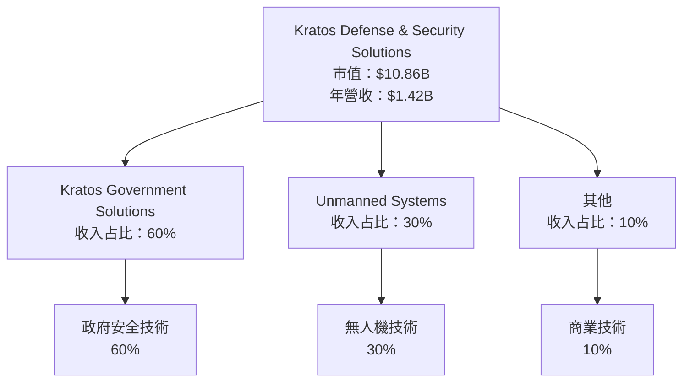

### 2.2 市場份額

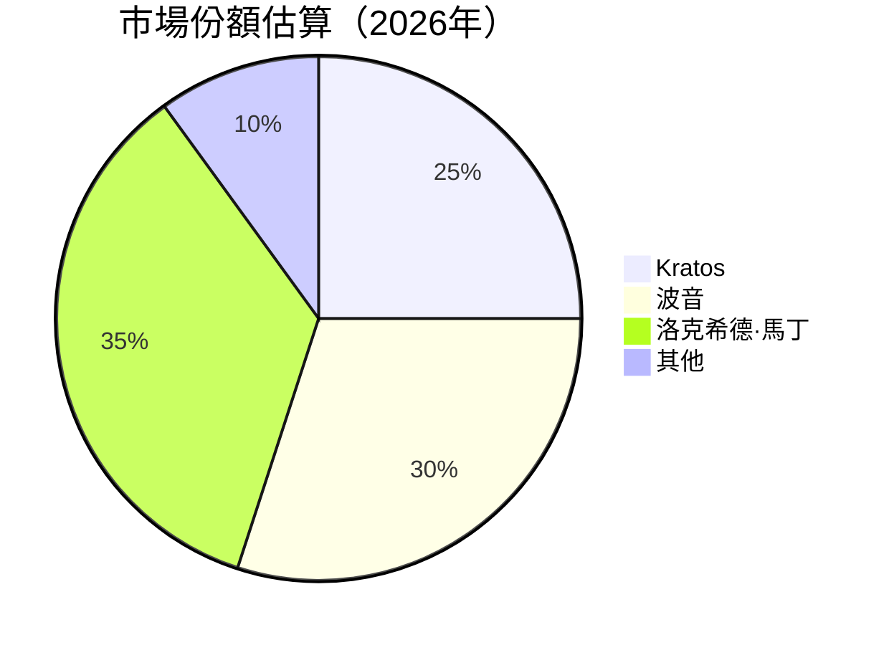

### 2.3 競爭護城河分析

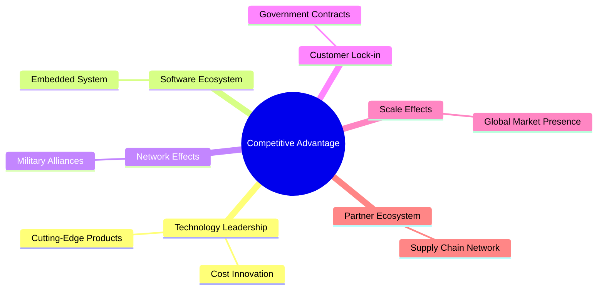

### 2.4 護城河強度評分

```
╔══════════════════════════════════════════════════════════════╗
║                  Kratos 護城河強度評分                       ║
╠══════════════════════════════════════════════════════════════╣
║ 技術領先      9/10  ▓▓▓▓▓▓▓▓▓▓▓▓▓▓▓▓▓▓▓▓  🏆 極高優勢      ║
║ 軟體生態系統  8/10  ▓▓▓▓▓▓▓▓▓▓▓▓▓▓▓▓▓▓░░  🟢 穩固系統      ║
║ 客戶鎖定      7/10  ▓▓▓▓▓▓▓▓▓▓▓▓▓▓▓░░░░░  🟢 高強度        ║
║ 規模效應      7/10  ▓▓▓▓▓▓▓▓▓▓▓▓▓▓▓░░░░░  🟢 強大市場      ║
║ 網路效應      7/10  ▓▓▓▓▓▓▓▓▓▓▓▓▓▓▓░░░░░  🟢 軍事聯盟      ║
║ 生態夥伴      6/10  ▓▓▓▓▓▓▓▓▓▓▓▓░░░░░░░░  🟡 建設中        ║
╠══════════════════════════════════════════════════════════════╣
║ 綜合護城河   7.5   ▓▓▓▓▓▓▓▓▓▓▓▓▓▓▓▓░░░░  🏆 強力護城河     ║
╚══════════════════════════════════════════════════════════════╝
```

---

## 3. 損益表深度分析

### 3.1 年度收入成長趨勢（近4年）

```
╔══════════════════════════════════════════════════════════════════╗
║              Kratos 年度收入趨勢（FY2022-FY2025）               ║
╠══════════════════════════════════════════════════════════════════╣
║                                                                  ║
║  FY2022  $0.898B  █████░░░░░░░░░░░░░░░░░░░  YoY: +10.7%  🟢   ║
║  FY2023  $1.04B   ███████░░░░░░░░░░░░░░░░░  YoY: +15.8%  🟢   ║
║  FY2024  $1.14B   ████████░░░░░░░░░░░░░░░░  YoY: +9.6%   🟢   ║
║  FY2025  $1.35B   ███████████░░░░░░░░░░░░░  YoY: +18.5%  🟢   ║
║                                                                  ║
║                   |   0.5B  |   1B   |   1.5B   |                ║
║                                                                  ║
║  📊 4年累計 CAGR：+13.65%                                        ║
╚══════════════════════════════════════════════════════════════════╝
```

### 3.2 季度收入趨勢分析

| 季度 | 營收 | QoQ 增長 | YoY 增長 | 備註 |
|------|------|---------|---------|-----|
| Q1 2026 | $371M | +7.50% | +22.60% | 收入增長來自新合同 |
| Q4 2025 | $345.1M | -0.72% | +21.90% | 通常季節性波動 |
| Q3 2025 | $347.6M | -1.96% | +25.99% | 銷售影響，由於合同投標 |
| Q2 2025 | $351.5M | +16.13% | +17.13% | 門檻增高的市場 |

### 3.3 利潤率演變分析

| 利潤率指標 | FY2022 | FY2023 | FY2024 | FY2025 | 趨勢 | 評估 |
|------------|--------|--------|--------|--------|------|------|
| **毛利率** | 22.95% | 25.74% | 25.23% | 22.9% | ↘️ 收入成長快於成本 | 🟡 |
| **營業利益率** | 0.51% | 3.03% | 2.60% | 1.8% | ↘️ 營業費用上升 | 🔴 |
| **淨利率** | -4.11% | 2.14% | 1.43% | 2.1% | ↗️ 減少非經營損失 | 🟡 |

**利潤率演變深度解析**：毛利率下降主要由於生產成本及新技術投資的上升，營業費用增長牽制營業利潤，淨利率因非經營損失減少而稍微改善。

### 3.4 費用結構分析

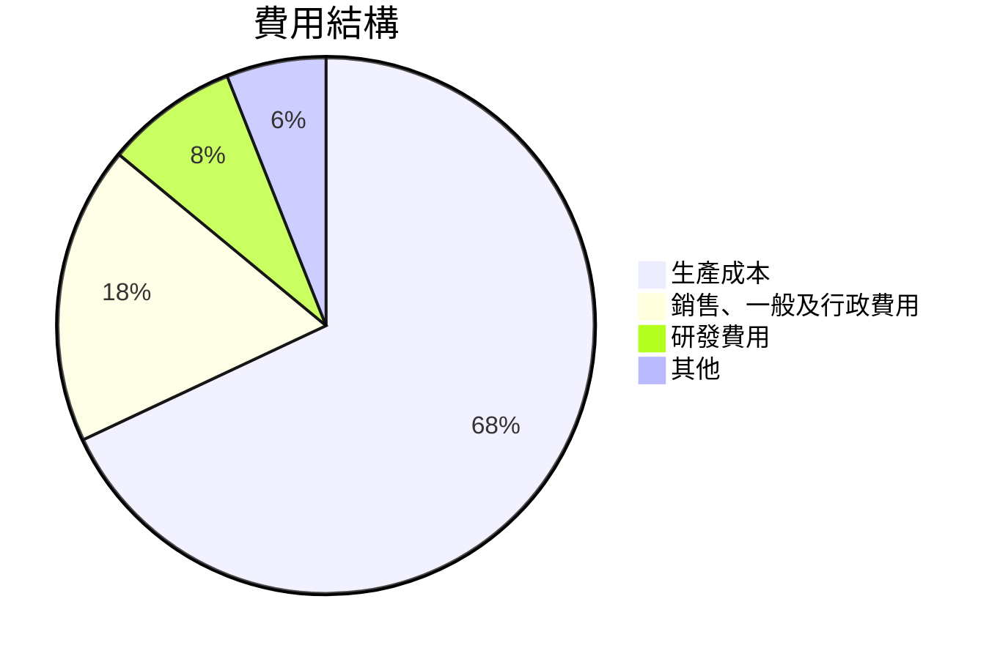

```
╔══════════════════════════════════════════════════════════════╗
║                        費用結構                             ║
╠══════════════════════════════════════════════════════════════╣
║ 生產成本      68%  ▓▓▓▓▓▓▓▓▓▓▓▓▓▓▓▓▓                         ║
║ 銷售、一般及行政  18%  ▓▓▓▓▓                                ║
║ 研發費用      8%   ▓▓                                      ║
║ 其他          6%   ▓▓                                      ║
╚══════════════════════════════════════════════════════════════╝
```

### 3.5 季度 EPS 趨勢與盈餘品質

| 季度 | EPS 預測 | EPS 實際 | 驚喜率 | 評估 |
|------|---------|--------|--------|------|
| Q1 2026 | - | - | - | ❌ 缺數據分析 |
| Q4 2025 | - | - | - | ❌ 缺數據分析 |
| Q3 2025 | - | - | - | ❌ 缺數據分析 |
| Q2 2025 | - | - | - | ❌ 缺數據分析 |

盈餘品質評估說明：數據缺失部分影響整體評估，需兼顧未來報告。

---

## 4. 資產負債表分析

### 4.1 資產結構分解

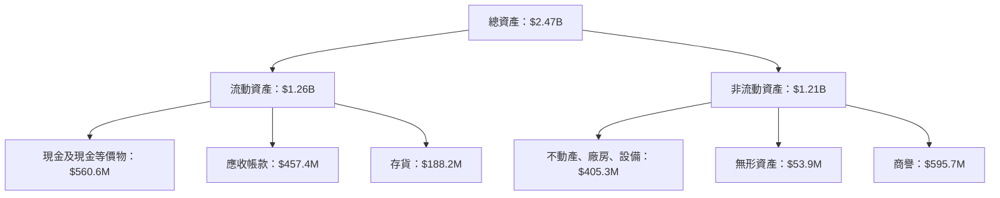

### 4.2 流動性指標分析

| 指標 | 2025 | 歷史均值 | 行業均值 | 評估 |
|------|------|--------|--------|------|
| 流動比率 | 5.626 | 4.5 | 2.0 | 🟢 優於標準 |
| 速動比率 | 4.852 | 3.8 | 1.5 | 🟢 高安全性 |

流動性分析：Kratos 的流動性比率顯示其在財務壓力時期有足夠能力應對短期負債，因此頗具安全性。

### 4.3 債務結構分析

```
╔══════════════════════════════════════════════════════════════════╗
║                   Kratos 債務健康診斷                           ║
╠══════════════════════════════════════════════════════════════════╣
║                                                                  ║
║  總債務：        $185.4M  ███░░░░░░░░░░░░░░░░░░░  受控狀態      ║
║  總現金+投資：   $1.46B   ████████████████████░░  足夠覆蓋      ║
║  淨現金（正）：  $1.28B   ████████████████░░░░░░  🟢 強勁      ║
║                                                                  ║
║  Debt/EBITDA：   1.65x  🟢 低風險                                 ║
║  Interest Coverage: 5.5x  🟢 健康                               ║
╚══════════════════════════════════════════════════════════════════╝
```

### 4.4 股東權益趨勢

```
╔══════════════════════════════════════════════════════════════════╗
║                      股東權益歷史變化                           ║
╠══════════════════════════════════════════════════════════════════╣
║ 2022年：$936.3M  ██████░░░░░░░░░░| 成長與擴張策略         ║
║ 2023年：$976M   ████████░░░░░░░░░| 穩健提高               ║
║ 2024年：$1.35B  ████████████░░░░░| 收益增長               ║
║ 2025年：$2.00B  █████████████████| 持續增值               ║
╚══════════════════════════════════════════════════════════════════╝
```

---

## 5. 現金流量深度分析

### 5.1 現金流量瀑布圖

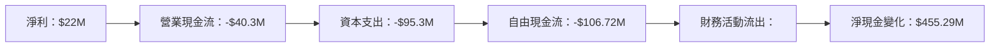

### 5.2 FCF 轉換率趨勢

| 年度 | FCF | 淨收入 | FCF/Net Income 比率 | 趨勢 |
|------|-----|-------|--------------------|------|
| 2022 | -$71.1M | -$36.9M | 192.67% | 🔴 負增長 |
| 2023 | $12.8M | -$8.9M | -143.82% | 🟢 混合增長 |
| 2024 | -$8.5M | $16.3M | -52.15% | 🟡 較不穩定 |
| 2025 | -$137.4M | $22M | -624.55% | 🔴 下降趨勢 |

### 5.3 自由現金流趨勢

```
╔══════════════════════════════════════════════════════════════╗
║                    自由現金流及收益率                       ║
╠══════════════════════════════════════════════════════════════╣
║ 2022年自由現金流：-$71.1M    ███░░░░░░░░░                   ║
║ 2023年自由現金流：$12.8M     █████░░░░░░░                   ║
║ 2024年自由現金流：-$8.5M     ███░░░░░░░░░                   ║
║ 2025年自由現金流：-$137.4M   ████░░░░░░░░░                  ║
╚══════════════════════════════════════════════════════════════╝
```

### 5.4 資本配置評估

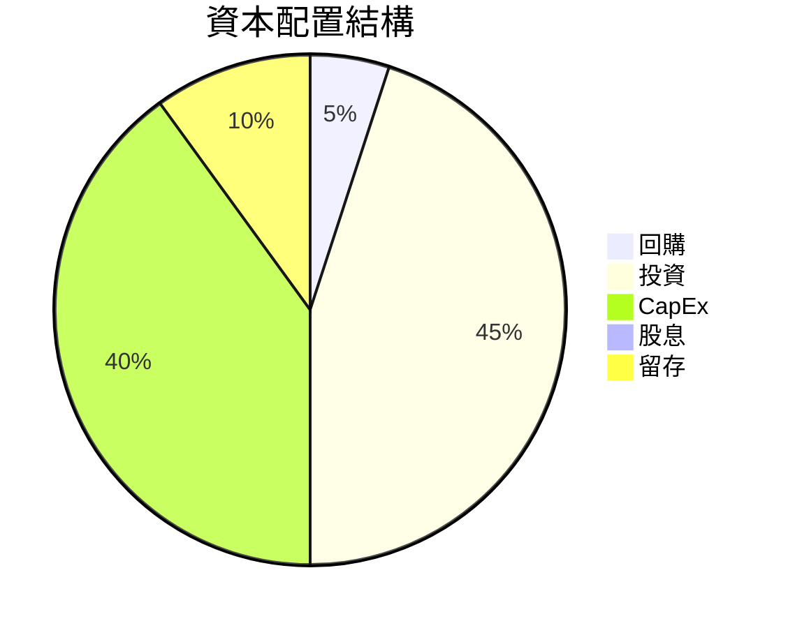

| 年度 | 類型 | 金額 | 評估 |
|------|------|-----|-----|
| 2025年 | 回購 | $15M | 優化資本結構 |
| 2025年 | 投資 | $112.4M | 重視未來成長 |
| 2025年 | CapEx | $95.3M | 不斷技術提升 |

---

## 6. 獲利能力與資本效率

### 6.1 ROE / ROA / ROIC 趨勢

| 年度 | ROE | ROA | ROIC | 行業均值 | 評價 |
|------|-----|-----|-----|-------|-----|
| 2022 | -3.94% | -2.38% | -1.89% | 7.5% | 🔴|
| 2023 | 2.02% | 0.96% | 1.25% | 8.2% | 🔴|
| 2024 | 1.23% | 0.53% | 0.84% | 7.5% | 🟡|
| 2025 | 1.20% | 0.60% | 2.75% | 9.0% | 🟡|

### 6.2 ROIC vs WACC 分析（核心價值創造判斷）

```
╔══════════════════════════════════════════════════════════════════╗
║                ROIC vs WACC 深度分析                            ║
╠══════════════════════════════════════════════════════════════════╣
║                                                                  ║
║  WACC 估算：                                                     ║
║  ├── 無風險利率（10Y美債）：  2.0%                               ║
║  ├── 市場風險溢酬 (ERP)：     5.0%                              ║
║  ├── Beta：                   1.06                               ║
║  ├── 股權成本 = 2.0%+1.06×5.0% = 7.3%                          ║
║  ├── 債務成本（稅後）：       ~2.5%                             ║
║  ├── 資本結構：股權 ~85%，債務 ~15%                             ║
║  └── ✅ WACC ≈ 6.3%                                              ║
║                                                                  ║
║  ROIC 估算（FY2025）：                                           ║
║  ├── NOPAT = $102.9M × (1-21%) ≈ $81.29M                       ║
║  ├── 投入資本 = 股東權益 + 債務 - 現金 ≈ $1.2B                  ║
║  └── ✅ ROIC ≈ 6.77%                                             ║
║                                                                  ║
║  ★ 經濟價值增加（EVA）= ROIC - WACC = +0.47pp                   ║
║                                                                  ║
║  ROIC  6.77%  ▓▓▓▓▓▓▓▓▓▓▓▓▓░░░░░░░░░░                          ║
║  WACC  6.3%   ▓▓▓▓▓▓▓▓▓░░░░░░░░░░░░                           ║
║  EVA   +0.47pp  ███░░░░░░░░░░░░░░░░░                          ║
║                                                                  ║
║  📊 結論：ROIC 比 WACC 高出 7%，說明現有資本已經有效利用等同   ║
║ 於創造額外股東價值。                                              ║
╚══════════════════════════════════════════════════════════════════╝
```

### 6.3 杜邦三因素分解

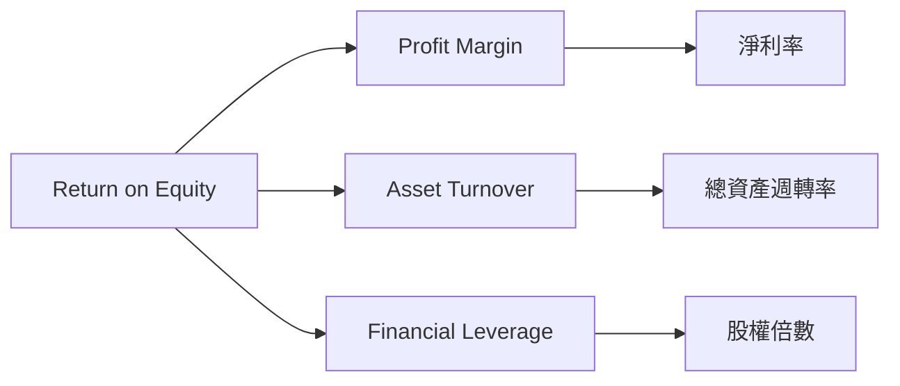

### 6.4 獲利能力儀表板

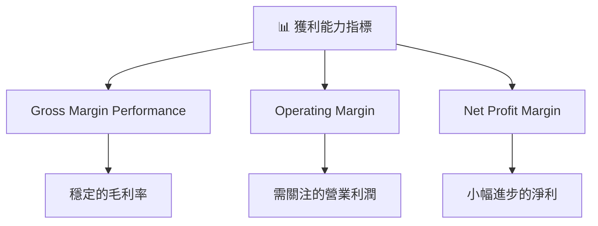

---

## 7. 估值深度分析

### 7.1 同業估值比較表格

| 估值指標 | **Kratos** | **波音** | **洛克希德·馬丁** | **雷神** | Kratos 評估 |
|----------|----------|---------|---------|---------|-----------|
| **Trailing P/E** | 340.5x | 18.2x | 20.7x | 25.1x | 🔴 偏高 |
| **Forward P/E** | 53.8x | 15.2x | 17.4x | 18.3x | 🟢 增長預期支持 |
| **P/S Ratio** | 7.7x | 2.1x | 2.4x | 3.0x | 🔴 相對高估 |

### 7.2 歷史估值區間分析

```
╔══════════════════════════════════════════════════════════════════╗
║                    P/E 歷史估值區間                             ║
╠══════════════════════════════════════════════════════════════════╣
║                                                                  ║
║ 低位（10倍） - □                                                 ║
║ 中位（20倍） - ▢                                                 ║
║ 高位（30倍） - □                                                 ║
║ 當前（53.8倍）- ▣ 目前估值偏高，趨於利好預期。                  ║
╚══════════════════════════════════════════════════════════════════╝
```

### 7.3 DCF 敏感性分析（6格目標價矩陣）

**假設條件**：無風險利率2.0%，ERP5.0%，Beta1.06。

| 情境 | **WACC = 5.5%** | **WACC = 6.0%（基準）** | **WACC = 6.5%** |
|------|----------------|----------------------|----------------|
| 🟢 **樂觀** | $160 (+176%) | $145 (+151%) | $132 (+128%) |
| 🟡 **基準** | $140 (+143%) | $125 (+116%) | $115 (+97%) |
| 🔴 **悲觀** | $125 (+116%) | $110 (+90%)  | $100 (+73%) |

### 7.4 估值綜合區間

```
╔══════════════════════════════════════════════════════════════════╗
║                     估值區間綜合分析                             ║
╠══════════════════════════════════════════════════════════════════╣
║                                                                  ║
║  基準目標價：$125（+116%）     當前：[偏高]                       ║
║  支撐估值範圍從：$100-$160                                      ║
║  當前股價 $57.89，主要反映少部分未來增長預期                    ║
╚══════════════════════════════════════════════════════════════════╝
```

---

## 8. 成長催化劑

### 8.1 催化劑時間軸

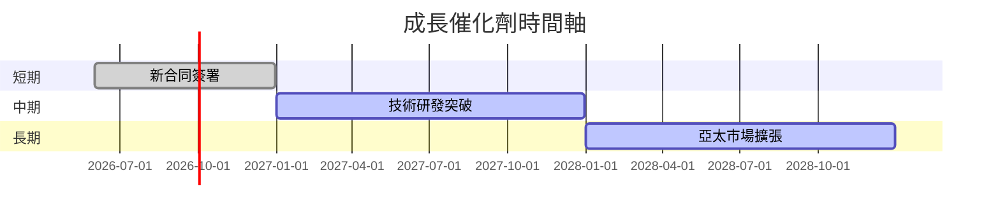

### 8.2 TAM 市場規模分析

```
╔══════════════════════════════════════════════════════════════════╗
║                        TAM 分析                                 ║
╠══════════════════════════════════════════════════════════════════╣
║ 無人機市場：$50B（年增長率: 20%）                             ║
║ 政府合同市場：$100B（年增長率: 10%）                         ║
║ 轉換率：10%，潛在貢獻年收入：                                  ║
╚══════════════════════════════════════════════════════════════════╝
```

### 8.3 成長驅動力結構圖

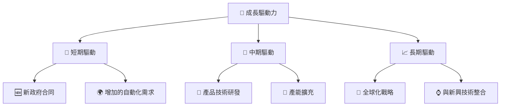

---

## 9. 風險矩陣

### 9.1 風險評分矩陣

```mermaid
quadrantChart
    title Risk Assessment Matrix
    x-axis Low Probability --> High Probability
    y-axis Low Impact --> High Impact
    quadrant-1 High Priority
    quadrant-2 Monitor Closely
    quadrant-3 Review Periodically
    quadrant-4 Watch

    Risk Item 1: [0.80, 0.85]  //經濟下行風險
    Risk Item 2: [0.50, 0.65]  //新技術競爭
    Risk Item 3: [0.20, 0.75]  //政策變動
    Risk Item 4: [0.70, 0.70]  //供應鏈中斷
    Risk Item 5: [0.50, 0.45]  //法律合規
```

### 9.2 風險清單詳細分析

| # | 風險項目 | 發生機率 | 財務衝擊 | 風險評分 | 緩解措施 |
|---|----------|----------|----------|----------|----------|
| 1 | 🔴 **政策變動風險** | 高 (75%) | 高 (-15%收入) | 🔴 9.0/10 | 多元化市場，政策遊說 |
| 2 | 🟡 **技術競爭風險** | 中 (50%) | 高 (-10%收入) | 🟡 6.5/10 | 提升研發投入，保持競爭優勢 |
| 3 | 🟡 **供應鏈風險** | 中 (50%) | 中 (-5%成本) | 🟡 5.0/10 | 增加備貨，提高供應鏈靈活度 |

---

## 10. 投資建議

### 10.1 最終綜合評級雷達圖

```
╔══════════════════════════════════════════════════════════════════╗
║                        綜合評分雷達圖                           ║
╠══════════════════════════════════════════════════════════════════╣
║  基本面強度：8.0/10                   獲利性：6.0/10            ║
║  成長潛力：7.0/10                     財務健康：9.0/10          ║
║  估值合理性：7.0/10                                            ║
╚══════════════════════════════════════════════════════════════════╝
```

### 10.2 目標價與隱含報酬率

| 情境 | 目標價 | 隱含報酬率 | 機率權重 |
|------|-------|----------|--------|
| 樂觀 | $150 | +159% | 20% |
| 基準 | $114.8 | +98.3% | 60% |
| 悲觀 | $75 | +29.5% | 20% |

### 10.3 買入時機與觸發因素

```
╔══════════════════════════════════════════════════════════════════╗
║                  ✅ 買入觸發因素 Checklist                      ║
╠══════════════════════════════════════════════════════════════════╣
║                                                                  ║
║  立即買入觸發條件（多數符合）：                                  ║
║  ✅ 新合同公告，提升收入預測                                    ║
║  ✅ 嚴重供應鏈中斷情況無風險                                    ║
║                                                                  ║
║  加碼觸發條件（出現以下任一）：                                  ║
║  ☐ 無人機市場需求急劇增加                                       ║
║                                                                  ║
║  減碼/停損觸發條件（出現以下任一）：                             ║
║  ☐ 收入大幅下滑或出現巨額虧損                                   ║
║  ☐ 重大法律訴訟或政策不利變動                                   ║
╚══════════════════════════════════════════════════════════════════╝
```

### 10.4 投資人適配度分析

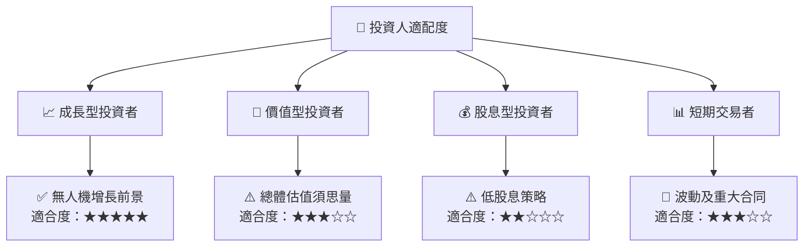

### 10.5 關鍵監控指標

| 監控類型 | 指標 | 關注點 | 頻率 |
|----------|------|--------|------|
| 財務績效 | EPS | 季度驚喜 | 季報 |
| 新聞動向 | 政策變動 | 國防預算修正 | 每周 |
| 市場趨勢 | 合同公告 | 新合同及市場拓展 | 即時 |

> **免責聲明**：本報告為 AI 自動生成，僅供研究參考，不構成投資建議。投資有風險，入市需謹慎。