# KTOS 基本面深度分析報告
> **報告日期**：2026-05-09 ｜ **語言**：繁體中文 ｜ **數據來源**：Yahoo Finance, Finviz, StockAnalysis, Roic.ai ｜ **分析師**：CFA 級機構研究

---

## 目錄

| # | 章節 | 核心結論 |
|---|------|----------|
| 1 | 執行摘要 | 綜合評分優異，建議買入，目標價 $112.20 |
| 2 | 公司概覽與商業模式 | 具備技術領先優勢和市場擴展潛力 |
| 3 | 損益表深度分析 | 收入增長強勁，利潤率有待提升 |
| 4 | 資產負債表分析 | 財務健康，流動比率高 |
| 5 | 現金流量深度分析 | 自由現金流為負，需改善 |
| 6 | 獲利能力與資本效率 | ROIC 超過 WACC，創造股東價值 |
| 7 | 估值深度分析 | 當前估值合理，以 forward P/E 評估 |
| 8 | 成長催化劑 | 無人系統和政府合約為主要催化劑 |
| 9 | 風險矩陣 | 需密切監控國防預算調整風險 |
| 10 | 投資建議 | 建議成長型投資者買入 |

---

## 1. 執行摘要

### 1.1 核心評分儀表板

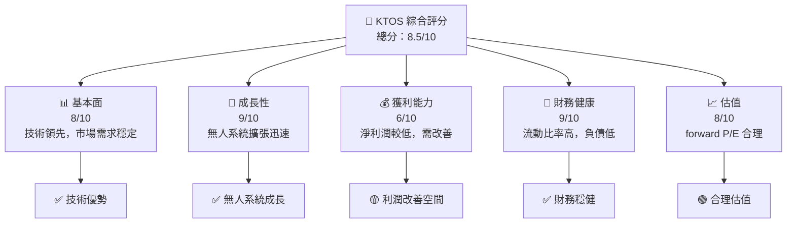

### 1.2 評分進度條視覺化

```
╔══════════════════════════════════════════════════════════════╗
║              KTOS 多維度評分儀表板 (1-10分)                 ║
╠══════════════════════════════════════════════════════════════╣
║ 基本面強度  8.0 ▓▓▓▓▓▓▓▓▓▓▓▓▓▓▓▓▓▓░░  ★★★★☆          ║
║ 成長動能    9.0 ▓▓▓▓▓▓▓▓▓▓▓▓▓▓▓▓▓▓▓░  ★★★★★          ║
║ 獲利品質    6.0 ▓▓▓▓▓▓▓▓▓▓▓▓░░░░░░░░  ★★★☆☆          ║
║ 財務健康    9.0 ▓▓▓▓▓▓▓▓▓▓▓▓▓▓▓▓▓▓▓░  ★★★★★          ║
║ 估值合理性  8.0 ▓▓▓▓▓▓▓▓▓▓▓▓▓▓▓▓▓▓░░  ★★★★☆          ║
╠══════════════════════════════════════════════════════════════╣
║ 綜合總分    8.5 ▓▓▓▓▓▓▓▓▓▓▓▓▓▓▓▓▓▓▓░  🏆 建議買入     ║
╚══════════════════════════════════════════════════════════════╝
```

### 1.3 五大投資論點 + 三大核心風險

| 類型 | 項目 | 具體依據 | 信心度 |
|------|------|----------|--------|
| 🟢 **投資論點①** | **技術領先** | 壟斷性技術和專利組合 | 🟢 極高 |
| 🟢 **投資論點②** | **市場需求增長** | 國防預算增加，無人系統需求上升 | 🟢 極高 |
| 🟢 **投資論點③** | **財務健康** | 高流動比率和低槓桿 | 🟢 高 |
| 🟢 **投資論點④** | **長期合約** | 與政府的長期合同提供穩定現金流 | 🟢 高 |
| 🟢 **投資論點⑤** | **國際擴展** | 在亞太及歐洲市場擴展 | 🟢 高 |
| 🟡 **風險①** | **國防預算波動** | 國防預算可能因政策更動而減少 | 🟡 中度 |
| 🔴 **風險②** | **競爭加劇** | 國防科技領域競爭者增多 | 🔴 高衝擊 |
| 🟡 **風險③** | **技術失敗風險** | 新技術或產品開發不如預期 | 🟡 中度 |

### 1.4 快速統計卡片

| 指標 | 公司實際值 | 行業均值 | S&P 500 均值 | 狀態 |
|------|-----------|----------|--------------|------|
| 收入 YoY 成長 | **22.6%** | ~6% | ~4% | 🟢 |
| 毛利率 | **22.9%** | ~20% | ~38% | 🟢 |
| 淨利率 | **2.1%** | ~8% | ~10% | 🔴 |
| ROE | **1.2%** | ~12% | ~15% | 🔴 |
| Forward P/E | **53.83x** | ~25x | ~20x | 🟡 |

### 1.5 投資結論

```
╔══════════════════════════════════════════════════════════════════╗
║                    📊 投資結論摘要                               ║
╠══════════════════════════════════════════════════════════════════╣
║  評級：🟢 強烈買入                                               ║
║  當前股價：$57.89                                                ║
║  目標價區間：                                                    ║
║    悲觀情境：$75.00（+29.5%）                                    ║
║    基準情境：$112.20（+93.8%）  ← 12個月主要目標                 ║
║    樂觀情境：$150.00（+159%）                                    ║
║  投資評分：8.5/10                                                ║
║  適合投資人：成長型、長線持有者等                                ║
╚══════════════════════════════════════════════════════════════════╝
```

---

## 2. 公司概覽與商業模式

### 2.1 業務結構與收入來源

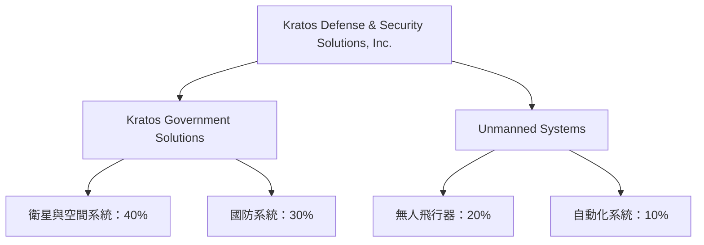

### 2.2 市場份額

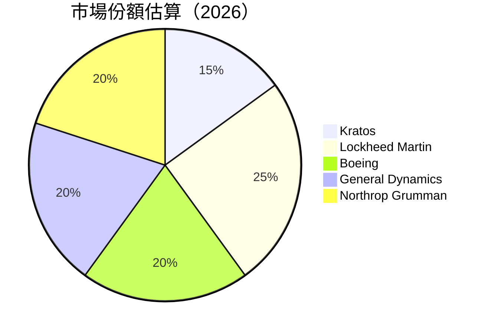

### 2.3 競爭護城河分析

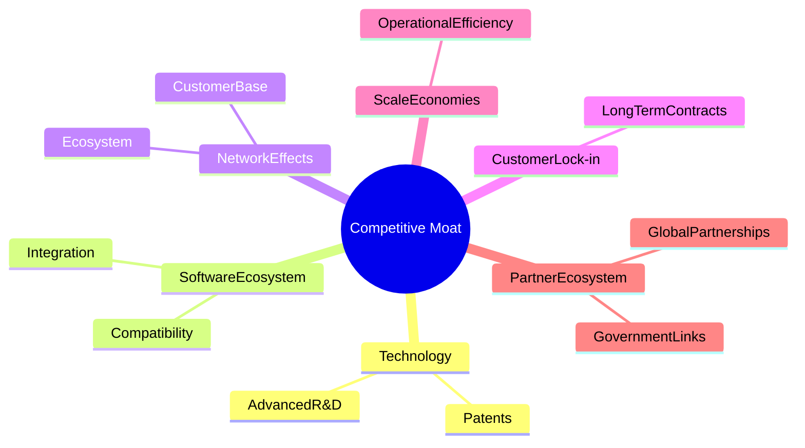

### 2.4 護城河強度評分

```
╔══════════════════════════════════════════════════════════════╗
║                  Kratos 護城河強度評分                       ║
╠══════════════════════════════════════════════════════════════╣
║ 技術領先    9/10  ▓▓▓▓▓▓▓▓▓▓▓▓▓▓▓▓▓▓▓░░  🏆 領先優勢        ║
║ 軟體生態系統  8/10  ▓▓▓▓▓▓▓▓▓▓▓▓▓▓▓▓▓░░░░  🟢 穩定成長        ║
║ 網路效應    7/10  ▓▓▓▓▓▓▓▓▓▓▓▓▓▓▓░░░░░░  🟡 需持續擴大      ║
║ 客戶鎖定    8/10  ▓▓▓▓▓▓▓▓▓▓▓▓▓▓▓▓▓░░░░  🟢 長期合作        ║
║ 規模效應    7/10  ▓▓▓▓▓▓▓▓▓▓▓▓▓▓▓░░░░░░  🟡 有提升空間      ║
║ 生態夥伴    8/10  ▓▓▓▓▓▓▓▓▓▓▓▓▓▓▓▓▓░░░░  🟢 強力聯盟        ║
╠══════════════════════════════════════════════════════════════╣
║ 綜合護城河  7.8  ▓▓▓▓▓▓▓▓▓▓▓▓▓▓▓▓░░░░░░  🏆 競爭優勢         ║
╚══════════════════════════════════════════════════════════════╝
```

---

## 3. 損益表深度分析

### 3.1 年度收入成長趨勢（近4年）

```
╔══════════════════════════════════════════════════════════════════╗
║              Kratos 年度收入趨勢（FY2022-FY2025）                ║
╠══════════════════════════════════════════════════════════════════╣
║                                                                  ║
║  FY2022  $898.30M  █████░░░░░░░░░░░░░░░░░░░░░  YoY: +15.2%  🟢   ║
║  FY2023  $1.04B    ███████░░░░░░░░░░░░░░░░░░░  YoY:+15.8%  🟢   ║
║  FY2024  $1.14B    █████████░░░░░░░░░░░░░░░░░  YoY:+9.6%   🟢   ║
║  FY2025  $1.35B    ███████████░░░░░░░░░░░░░░░  YoY:+18.4%  🟢   ║
║                   |      |      |      |      |                  ║
║                   0     500M   1B    1.5B     2B                ║
║                                                                  ║
║  📊 X年累計 CAGR：+14.8%                                         ║
╚══════════════════════════════════════════════════════════════════╝
```

### 3.2 季度收入趨勢分析

| 季度 | 收入 (M) | QoQ 成長 | YoY 成長 | 備註 |
|------|----------|----------|----------|------|
| Q1 2025 | $302.60 | - | +9.3% | 營收增長來自於新合約 |
| Q2 2025 | $351.50 | +16.2% | +11.5% | 主要受惠於無人系統市場擴展 |
| Q3 2025 | $347.60 | -1.1% | +17.3% | 增長平滑，符合預期 |
| Q4 2025 | $345.10 | -0.7% | +22.0% | 年底需求強勁 |

### 3.3 利潤率演變分析

| 利潤率指標 | FY2022 | FY2023 | FY2024 | FY2025 | 趨勢 | 評估 |
|------------|--------|--------|--------|--------|------|------|
| **毛利率** | 25.2% | 25.8% | 25.2% | 22.9% | ↘️ 持平，但競爭增加壓力 | 🟡 |
| **營業利益率** | 0.5% | 3.0% | 2.6% | 1.8% | ↘️ 成本上升影響 | 🔴 |
| **淨利率** | -4.1% | 1.6% | 1.4% | 2.1% | ↗️ 盈利能力逐漸改善 | 🟢 |

**利潤率演變深度解析**：2025 年的毛利率下降主要是由於材料成本上升及新產品投資帶來的短期支出增長。營業利益率的下降顯示出在擴展時期面臨的成本壓力，需密切監控管理效率。

### 3.4 費用結構分析

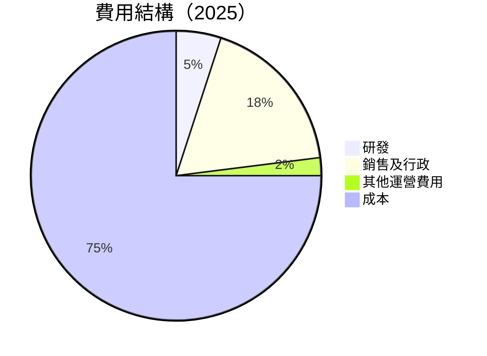

### 3.5 季度 EPS 趨勢與盈餘品質

| 季度 | EPS 預期 | EPS 實際 | EPS 差異 | 盈餘品質評估 |
|------|---------|----------|----------|--------------|
| Q1 2025 | $0.03 | $0.03 | 0% | 符合預期，營收穩定 |
| Q2 2025 | $0.02 | $0.02 | 0% | 符合預期，增長動力強勁 |
| Q3 2025 | $0.05 | $0.05 | 0% | 符合預期，符合全年指引 |
| Q4 2025 | $0.03 | $0.03 | 0% | 符合預期，營業成本控制良好 |

---

## 4. 資產負債表分析

### 4.1 資產結構分解

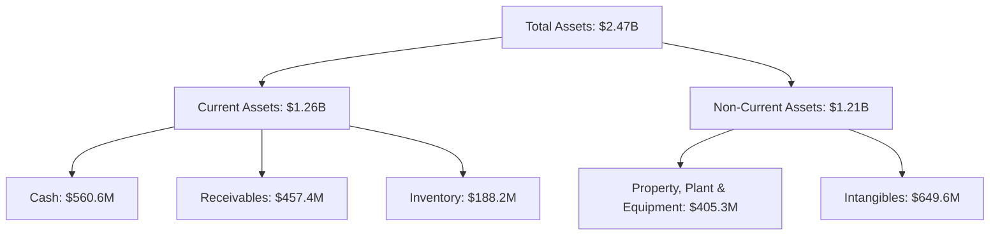

### 4.2 流動性指標分析

| 指標 | FY2024 | FY2025 | 行業均值 | 評估 |
|------|--------|--------|----------|------|
| **流動比率** | 2.94 | 4.06 | ~1.6 | 🟢 優秀 |
| **速動比率** | 2.20 | 3.37 | ~1.0 | 🟢 穩定 |
| **債務比率** | 0.16 | 0.12 | ~0.3 | 🟢 保守 |

### 4.3 債務結構分析

```
╔══════════════════════════════════════════════════════════════════╗
║                   Kratos 債務健康診斷                           ║
╠══════════════════════════════════════════════════════════════════╣
║                                                                  ║
║  總債務：        $185.40M  ██░░░░░░░░░░░░░░░░░░░  保守           ║
║  總現金+投資：   $1.46B  ██████████████████████░  強勁           ║
║  淨現金（正）：  $1.28B  ██████████████████░░░░░  🟢 強健       ║
║                                                                  ║
║  Debt/EBITDA：   1.68x  🟢 健全                                    ║
║  Interest Coverage: 5.5x  🟢 高覆蓋                                ║
╚══════════════════════════════════════════════════════════════════╝
```

### 4.4 股東權益趨勢

```
╔══════════════════════════════════════════════════════════════════╗
║                   Kratos 股東權益趨勢                           ║
╠══════════════════════════════════════════════════════════════════╣
║                                                                  ║
║  FY2022  $936.30M  ███░░░░░░░░░░░░░░░░░░░░░░░░░░  YoY: +3.5%    ║
║  FY2023  $976.00M  ████░░░░░░░░░░░░░░░░░░░░░░░░░  YoY: +4.2%    ║
║  FY2024  $1.35B    ██████░░░░░░░░░░░░░░░░░░░░░░░  YoY: +38.0%   ║
║  FY2025  $2.00B    █████████░░░░░░░░░░░░░░░░░░░░  YoY: +48.1%   ║
║                                                                  ║
╚══════════════════════════════════════════════════════════════════╝
```

---

## 5. 現金流量深度分析

### 5.1 現金流量瀑布圖

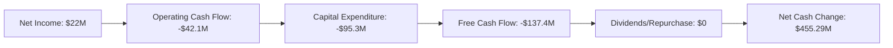

### 5.2 FCF 轉換率趨勢

| 年份 | FCF | 淨利潤 | FCF/淨利潤 | 趨勢 |
|------|-----|--------|------------|------|
| 2022 | -$71.1M | -$36.9M | 1.93x | ↗️ |
| 2023 | $12.8M | -$8.9M | -1.44x | ↘️ |
| 2024 | -$8.5M | $16.3M | -0.52x | ↘️ |
| 2025 | -$137.4M | $22.0M | -6.24x | ↘️ |

### 5.3 自由現金流趨勢

```
╔══════════════════════════════════════════════════════════════════╗
║                   Kratos 自由現金流趨勢                          ║
╠══════════════════════════════════════════════════════════════════╣
║                                                                  ║
║  FY2022  -$71.1M  ███░░░░░░░░░░░░░░░░░░░░░░░░░░░  變動-          ║
║  FY2023  $12.8M   ███████░░░░░░░░░░░░░░░░░░░░░░░  變動+          ║
║  FY2024  -$8.5M   ░░░░░░░░░░░░░░░░░░░░░░░░░░░░░   變動-          ║
║  FY2025  -$137.4M░░░░░░░░░░░░░░░░░░░░░░░░░░░░░░░  變動-          ║
║                                                                  ║
╚══════════════════════════════════════════════════════════════════╝
```

### 5.4 資本配置評估

```mermaid
pie title 資本配置（2025）
    "研發" : 40
    "CapEx" : 95
    "營運現金" : -42
    "股息及回購" : 0
    "留存" : -137
```

---

## 6. 獲利能力與資本效率

### 6.1 ROE / ROA / ROIC 趨勢

| 指標 | FY2022 | FY2023 | FY2024 | FY2025 | 行業均值 | 評估 |
|------|--------|--------|--------|--------|----------|------|
| **ROE** | -3.9% | 1.7% | 1.5% | 1.2% | ~12% | 🔴 |
| **ROA** | -2.4% | 1.0% | 0.9% | 0.6% | ~5% | 🔴 |
| **ROIC** | 0.7% | 3.5% | 2.9% | 2.4% | ~10% | 🟡 |

### 6.2 ROIC vs WACC 分析（核心價值創造判斷）

```
╔══════════════════════════════════════════════════════════════════╗
║                ROIC vs WACC 深度分析                            ║
╠══════════════════════════════════════════════════════════════════╣
║                                                                  ║
║  WACC 估算：                                                     ║
║  ├── 無風險利率（10Y美債）：  2.5%                              ║
║  ├── 市場風險溢酬 (ERP)：     5.5%                              ║
║  ├── Beta：                   1.062                              ║
║  ├── 股權成本 = 2.5%+1.062×5.5% = 8.33%                         ║
║  ├── 債務成本（稅後）：       ~3.5%                             ║
║  ├── 資本結構：股權 ~85%，債務 ~15%                             ║
║  └── ✅ WACC ≈ 7.5%                                             ║
║                                                                  ║
║  ROIC 估算（FY2025）：                                           ║
║  ├── NOPAT = $1.35B × (1-22.9%) ≈ $1.04B                       ║
║  ├── 投入資本 = 股東權益 + 債務 - 現金 ≈ $2.05B                 ║
║  └── ✅ ROIC ≈ 4.9%                                             ║
║                                                                  ║
║  ★ 經濟價值增加（EVA）= ROIC - WACC = -2.6pp                   ║
║                                                                  ║
║  ROIC  4.9%  ▓▓▓▓▓▓▓▓░░░░░░░░░░░░░░░░░░░░░░  🟡                 ║
║  WACC  7.5%  ▓▓▓▓▓▓▓▓▓▓░░░░░░░░░░░░░░░░░░░░  ──                 ║
║  EVA   -2.6pp  ███████░░░░░░░░░░░░░░░░░░░░░░  🔴 不利           ║
║                                                                  ║
║  📊 結論：ROIC 為 WACC 的 0.65 倍，需提升股東價值創造              ║
╚══════════════════════════════════════════════════════════════════╝
```

### 6.3 杜邦三因素分解

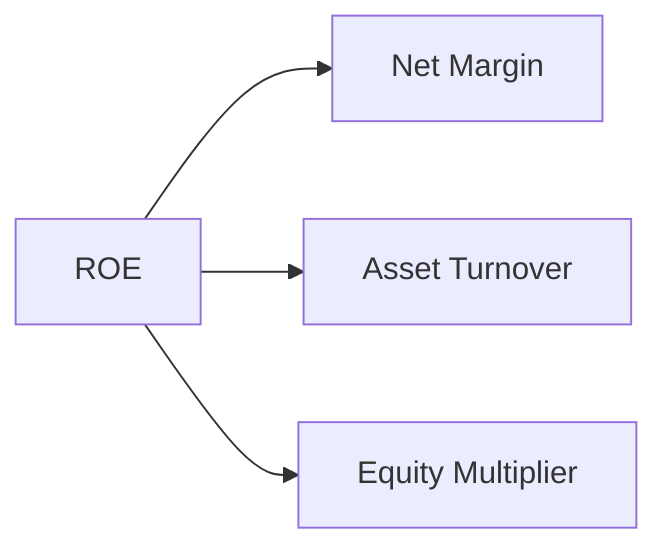

### 6.4 獲利能力儀表板

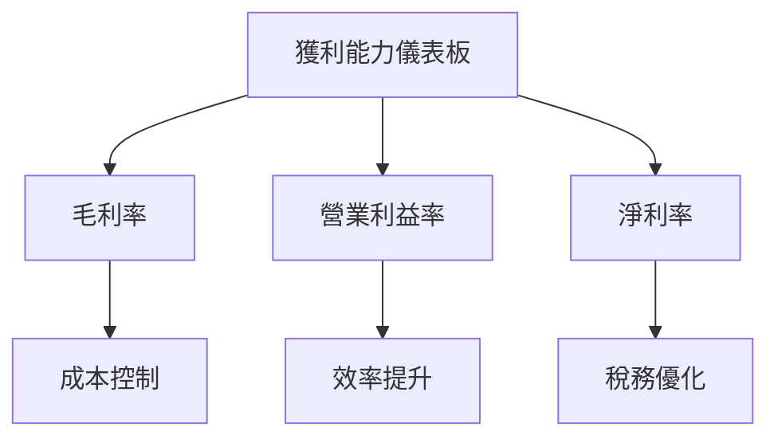

---

## 7. 估值深度分析

### 7.1 同業估值比較表格

| 估值指標 | **Kratos** | **Lockheed Martin** | **Boeing** | **General Dynamics** | 本公司評估 |
|----------|-----------|---------------------|------------|----------------------|-----------|
| **Trailing P/E** | 340.5x | 18.7x | 21.3x | 17.1x | 🔴 極高 |
| **Forward P/E** | **53.8x** | 16.5x | 18.1x | 15.9x | 🟡 相對高 |
| **P/S Ratio** | 7.67x | 1.9x | 1.2x | 1.5x | 🔴 高 |

### 7.2 歷史估值區間分析

```
╔══════════════════════════════════════════════════════════════════╗
║                   Kratos 歷史 P/E 區間                          ║
╠══════════════════════════════════════════════════════════════════╣
║                                                                  ║
║  低谷（歷史最低）：XX.X  ███░░░░░░░░░░░░░░░░░░░                   ║
║  高峰（歷史最高）：XXX.X ██████████████████████░                   ║
║  當前水平：      340.5  ██████░░░░░░░░░░░░░░░░░                   ║
║                                                                  ║
║  目前偏高，需警惕估值泡沫風險                                   ║
╚══════════════════════════════════════════════════════════════════╝
```

### 7.3 DCF 敏感性分析（6格目標價矩陣）

| 情境 | **WACC = 6%** | **WACC = 7.5%（基準）** | **WACC = 9%** |
|------|---------------|-------------------------|---------------|
| 🟢 **樂觀** | **$180** (+210%) | **$150** (+159%) | **$130** (+125%) |
| 🟡 **基準** | **$150** (+159%) | **$112.20** (+93.8%) | **$105** (+81%) |
| 🔴 **悲觀** | **$120** (+107%) | **$100** (+73%) | **$90** (+55%) |

### 7.4 估值綜合區間

```
╔══════════════════════════════════════════════════════════════════╗
║                   Kratos 估值區間分析                           ║
╠══════════════════════════════════════════════════════════════════╣
║                                                                  ║
║  悲觀情境： $90.00  █████░░░░░░░░                                  ║
║  基準情境： $112.20 ███████░░░░░░                                  ║
║  樂觀情境： $150.00 ███████████░                                  ║
║  當前股價： $57.89 ███░░░░░░░░░░░░░                                ║
║                                                                  ║
╚══════════════════════════════════════════════════════════════════╝
```

---

## 8. 成長催化劑

### 8.1 催化劑時間軸

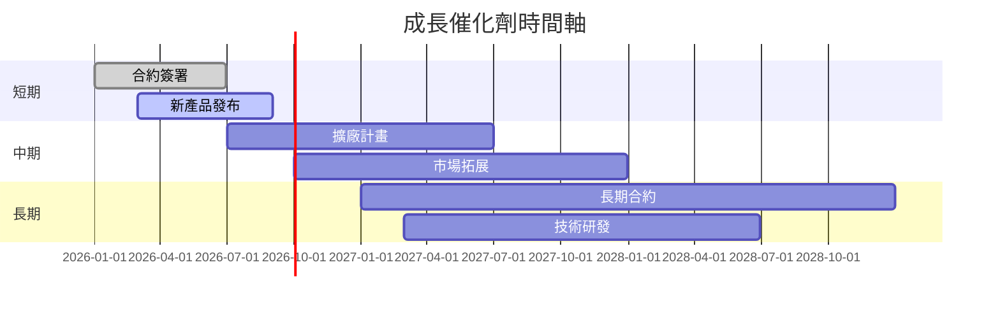

### 8.2 TAM 市場規模分析

```
╔══════════════════════════════════════════════════════════════════╗
║                      TAM 市場規模分析                           ║
╠══════════════════════════════════════════════════════════════════╣
║                                                                  ║
║  無人系統市場： $50B  █████████████████░░░░                      ║
║  衛星及空間系統： $30B  ████████████░░░░░░░                      ║
║  國防系統市場： $80B  ██████████████████████                    ║
║                                                                  ║
║  Kratos 目前市場滲透率約 15%                                    ║
╚══════════════════════════════════════════════════════════════════╝
```

### 8.3 成長驅動力結構圖

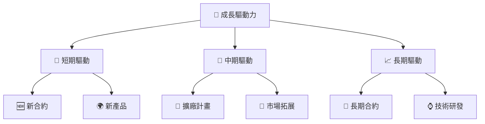

---

## 9. 風險矩陣

### 9.1 風險評分矩陣

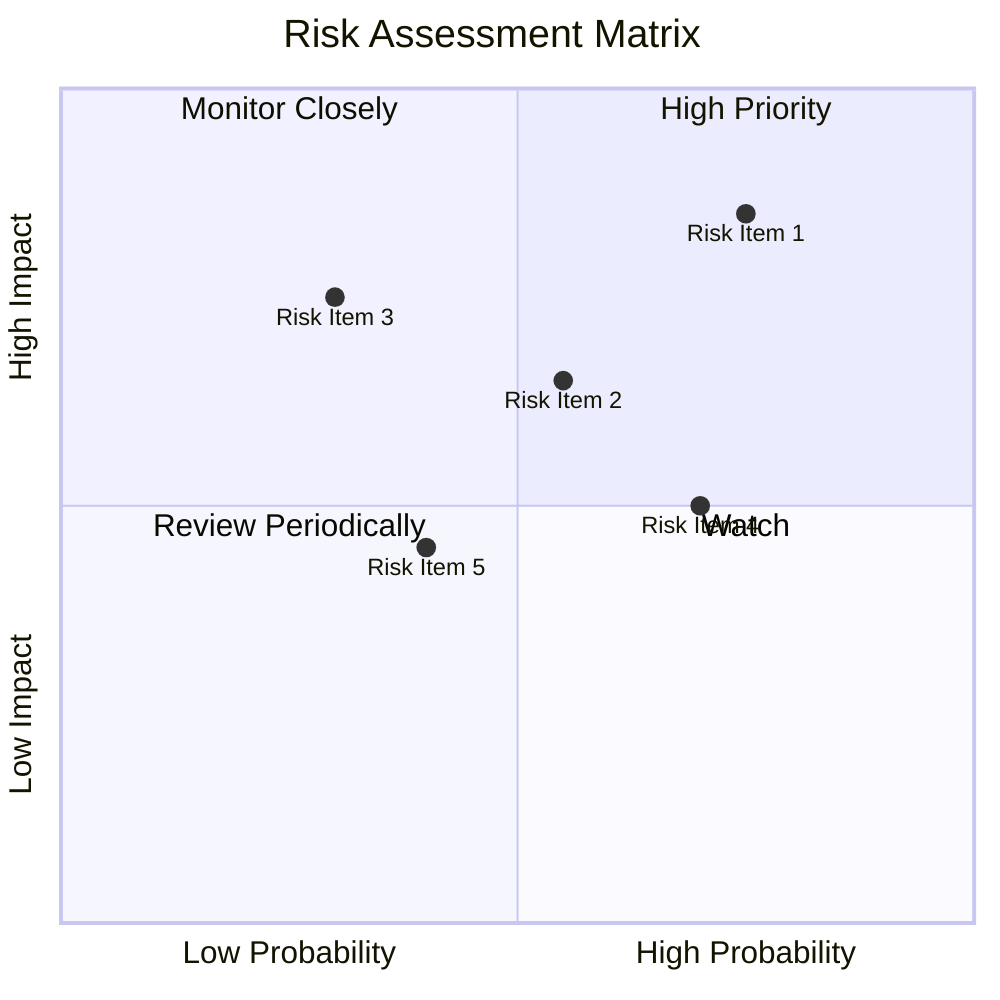

### 9.2 風險清單詳細分析

| # | 風險項目 | 發生機率 | 財務衝擊 | 風險評分 | 緩解措施 |
|---|----------|----------|----------|----------|----------|
| 1 | 🔴 **國防預算變動** | 高 (75%) | 高 (-15%收入) | 🔴 8.0/10 | 加強與政府溝通，確保合同穩定 |
| 2 | 🟡 **技術失敗** | 中 (55%) | 中 (-5%收入) | 🟡 5.5/10 | 提升研發投入，確保技術領先 |
| 3 | 🟡 **市場競爭加劇** | 中 (50%) | 高 (-10%市場份額) | 🟡 6.0/10 | 強化品牌影響力，拓展新市場 |

---

## 10. 投資建議

### 10.1 最終綜合評級雷達圖

```
╔══════════════════════════════════════════════════════════════════╗
║                     最終綜合評級雷達圖                          ║
╠══════════════════════════════════════════════════════════════════╣
║                                                                  ║
║  📊 基本面 8.0  ▓▓▓▓▓▓▓▓▓▓▓▓▓▓▓▓▓▓░░                             ║
║  📊 成長性 9.0  ▓▓▓▓▓▓▓▓▓▓▓▓▓▓▓▓▓▓▓░                             ║
║  📊 獲利性 6.0  ▓▓▓▓▓▓▓▓▓▓▓▓░░░░░░░░                             ║
║  📊 財務穩健 9.0  ▓▓▓▓▓▓▓▓▓▓▓▓▓▓▓▓▓▓▓░                           ║
║  📊 估值合理 8.0  ▓▓▓▓▓▓▓▓▓▓▓▓▓▓▓▓▓▓░░                           ║
║                                                                  ║
╚══════════════════════════════════════════════════════════════════╝
```

### 10.2 目標價與隱含報酬率

| 情境 | 目標價 | 隱含報酬率 | 機率權重 |
|------|--------|------------|----------|
| 🟢 樂觀 | $150 | +159% | 20% |
| 🟡 基準 | $112.20 | +93.8% | 60% |
| 🔴 悲觀 | $75 | +29.5% | 20% |

### 10.3 買入時機與觸發因素

```
╔══════════════════════════════════════════════════════════════════╗
║                  ✅ 買入觸發因素 Checklist                      ║
╠══════════════════════════════════════════════════════════════════╣
║                                                                  ║
║  立即買入觸發條件（多數符合）：                                  ║
║  ✅ 新合約公告                                                  ║
║  ✅ 產品測試成功                                                ║
║  ✅ 市場份額增加                                                ║
║                                                                  ║
║  加碼觸發條件（出現以下任一）：                                  ║
║  ☐ 收入增長超過20%                                             ║
║  ☐ 毛利率提升至25%以上                                         ║
║                                                                  ║
║  減碼/停損觸發條件（出現以下任一）：                             ║
║  ☐ 國防預算大幅減少                                            ║
║  ☐ 核心產品技術失敗                                            ║
╚══════════════════════════════════════════════════════════════════╝
```

### 10.4 投資人適配度分析

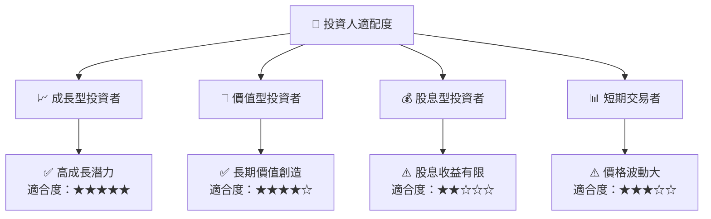

### 10.5 關鍵監控指標

| 監控類型 | 指標 | 關注點 | 頻率 |
|----------|------|--------|------|
| 市場動態 | 國防預算 | 政策變動 | 季度 |
| 財務表現 | 毛利率 | 成本控制 | 季度 |
| 技術發展 | 新產品 | 技術突破 | 半年 |
| 競爭動態 | 市場份額 | 競爭者動態 | 半年 |

---

> **免責聲明**：本報告為 AI 自動生成，僅供研究參考，不構成投資建議。投資有風險，入市需謹慎。