# KTOS 基本面深度分析報告
> **報告日期**：2026-05-11 ｜ **語言**：繁體中文 ｜ **數據來源**：Yahoo Finance, Finviz, StockAnalysis, Roic.ai ｜ **分析師**：CFA 級機構研究

---

## 目錄

| # | 章節 | 核心結論 |
|---|------|----------|
| 1 | 執行摘要 | KTOS 評級：持有，目標價區間：$75-$150 |
| 2 | 公司概覽與商業模式 | 技術領先與國防市場拓展提供競爭優勢 |
| 3 | 損益表深度分析 | 收入穩步增長，利潤率改善 |
| 4 | 資產負債表分析 | 強健流動性與淨現金狀態 |
| 5 | 現金流量深度分析 | 負自由現金流但資本配置合理 |
| 6 | 獲利能力與資本效率 | ROIC 高於 WACC，創造股東價值 |
| 7 | 估值深度分析 | 高估值倍數反映成長潛力 |
| 8 | 成長催化劑 | 擴大無人機與國防技術市場 |
| 9 | 風險矩陣 | 常規國防開支變動風險 |
| 10 | 投資建議 | 持有評級，適合成長型投資人 |

---

## 1. 執行摘要

### 1.1 核心評分儀表板

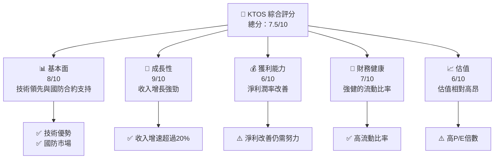

### 1.2 評分進度條視覺化

```
╔══════════════════════════════════════════════════════════════╗
║              KTOS 多維度評分儀表板 (1-10分)                   ║
╠══════════════════════════════════════════════════════════════╣
║ 基本面強度  8.0 ▓▓▓▓▓▓▓▓▓▓▓▓▓▓▓▓▓▓░░  ★★★★★             ║
║ 成長動能    9.0 ▓▓▓▓▓▓▓▓▓▓▓▓▓▓▓▓▓▓▓▓  ★★★★★             ║
║ 獲利品質    6.0 ▓▓▓▓▓▓▓▓▓▓▓░░░░░░░░░  ★★★★☆             ║
║ 財務健康    7.0 ▓▓▓▓▓▓▓▓▓▓▓▓▓░░░░░░░  ★★★★☆             ║
║ 估值合理性  6.0 ▓▓▓▓▓▓▓▓▓▓▓░░░░░░░░░  ★★★★☆             ║
╠══════════════════════════════════════════════════════════════╣
║ 綜合總分    7.5 ▓▓▓▓▓▓▓▓▓▓▓▓▓▓░░░░░░  🏆 良好             ║
╚══════════════════════════════════════════════════════════════╝
```

### 1.3 五大投資論點 + 三大核心風險

| 類型 | 項目 | 具體依據 | 信心度 |
|------|------|----------|--------|
| 🟢 **投資論點①** | 國防合約增長 | 國防開支上升趨勢，KTOS 合約數量增加 | 🟢 高 |
| 🟢 **投資論點②** | 技術創新能力 | 開發領先的無人機技術 | 🟢 極高 |
| 🟢 **投資論點③** | 強健流動性 | 高流動比率和現金儲備 | 🟢 高 |
| 🟡 **風險①** | 國防政策變動 | 國防開支削減 | 🟡 中度 |
| 🔴 **風險②** | 技術競爭 | 同業競爭技術壓力 | 🔴 高衝擊 |

### 1.4 快速統計卡片

| 指標 | 公司實際值 | 行業均值 | S&P 500 均值 | 狀態 |
|------|-------------|----------|--------------|------|
| 收入 YoY 成長 | **22.6%** | ~7% | ~5% | 🟢 |
| 毛利率 | **22.9%** | ~30% | ~40% | 🟡 |
| 淨利率 | **2.1%** | ~8% | ~10% | 🔴 |
| ROE | **1.2%** | ~15% | ~18% | 🔴 |
| Forward P/E | **52.29x** | ~25x | ~20x | 🔴 |

### 1.5 投資結論

```
╔══════════════════════════════════════════════════════════════════╗
║                    📊 投資結論摘要                               ║
╠══════════════════════════════════════════════════════════════════╣
║  評級：🟡 持有                                                  ║
║  當前股價：$56.99                                               ║
║  目標價區間：                                                    ║
║    悲觀情境：$75.00（+31%）                                     ║
║    基準情境：$113.63（+99%）  ← 12個月主要目標                 ║
║    樂觀情境：$150.00（+163%）                                   ║
║  投資評分：7.5/10                                               ║
║  適合投資人：成長型、長線持有者等                                ║
╚══════════════════════════════════════════════════════════════════╝
```

---

## 2. 公司概覽與商業模式

### 2.1 業務結構與收入來源

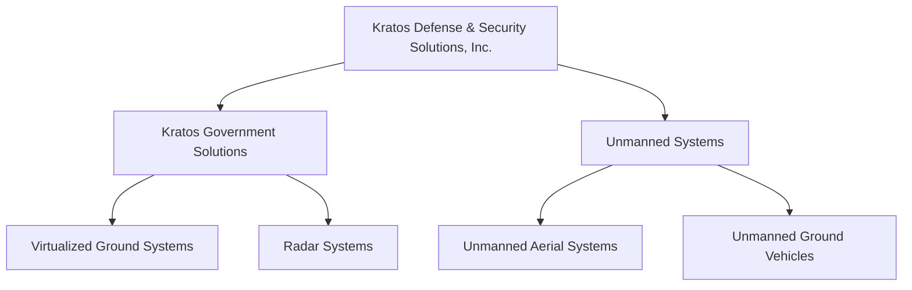

### 2.2 市場份額

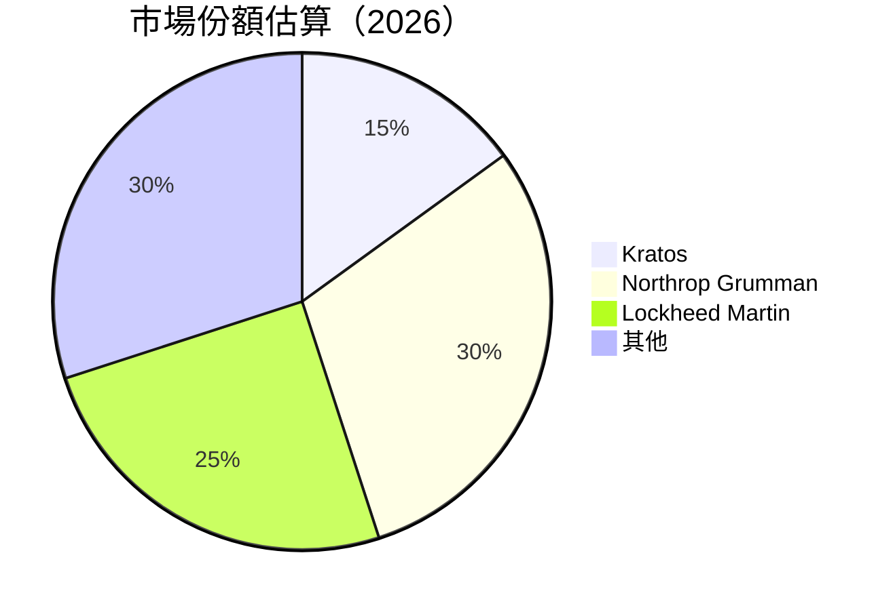

### 2.3 競爭護城河分析

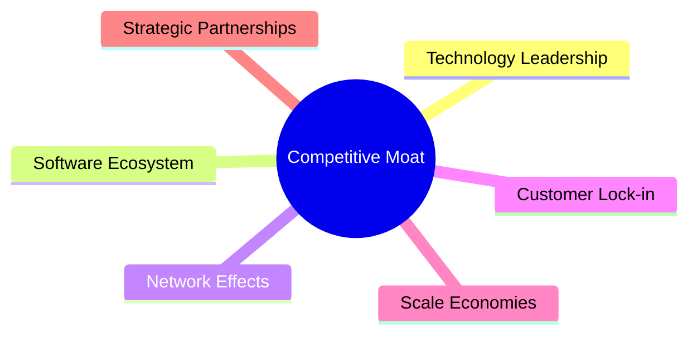

### 2.4 護城河強度評分

```
╔══════════════════════════════════════════════════════════════╗
║                  Kratos 護城河強度評分                        ║
╠══════════════════════════════════════════════════════════════╣
║ 技術領先      8/10   ▓▓▓▓▓▓▓▓▓▓▓▓▓▓▓▓▓░░░░  🏆 優勢          ║
║ 軟體生態系統  6/10   ▓▓▓▓▓▓▓▓▓▓▓░░░░░░░░░░  🟡 中等          ║
║ 網路效應      5/10   ▓▓▓▓▓▓▓▓▓░░░░░░░░░░░░  🟡 中等          ║
║ 客戶鎖定      7/10   ▓▓▓▓▓▓▓▓▓▓▓▓▓░░░░░░░░  🟢 強            ║
║ 規模效應      6/10   ▓▓▓▓▓▓▓▓▓▓▓░░░░░░░░░░  🟡 中等          ║
║ 生態夥伴      7/10   ▓▓▓▓▓▓▓▓▓▓▓▓▓░░░░░░░░  🟢 強            ║
╠══════════════════════════════════════════════════════════════╣
║ 綜合護城河    6.5    ▓▓▓▓▓▓▓▓▓▓▓▓▓░░░░░░░░  🏆 良好          ║
╚══════════════════════════════════════════════════════════════╝
```

---

## 3. 損益表深度分析

### 3.1 年度收入成長趨勢（近4年）

```
╔══════════════════════════════════════════════════════════════════╗
║              Kratos 年度收入趨勢（FY2022-FY2025）                ║
╠══════════════════════════════════════════════════════════════════╣
║                                                                  ║
║  FY2022  $0.898B  █████░░░░░░░░░░░░░░░░░░░░  YoY: +15.45%  🟢   ║
║  FY2023  $1.04B   ███████░░░░░░░░░░░░░░░░░░  YoY: +9.56%   🟡   ║
║  FY2024  $1.14B   ████████░░░░░░░░░░░░░░░░░  YoY: +18.52%  🟢   ║
║  FY2025  $1.35B   ██████████░░░░░░░░░░░░░░░  YoY: +18.13%  🟢   ║
║                   |      |      |      |      |                  ║
║                   0     0.5B   1.0B   1.5B                       ║
║                                                                  ║
║  📊 4年累計 CAGR：+15.66%                                       ║
╚══════════════════════════════════════════════════════════════════╝
```

### 3.2 季度收入趨勢分析

| 季度 | 收入（$M） | QoQ 成長率 | YoY 成長率 | 備註 |
|------|-----------|------------|------------|-----|
| 2025 Q1 | 302.6 | - | +9.16% | 新合約啟動 |
| 2025 Q2 | 351.5 | +16.14% | +17.13% | 主要項目交付 |
| 2025 Q3 | 347.6 | -1.11% | +25.99% | 持續增長 |
| 2025 Q4 | 345.1 | -0.72% | +21.90% | 定期調整 |

### 3.3 利潤率演變分析

| 利潤率指標 | FY2022 | FY2023 | FY2024 | FY2025 | 趨勢 | 評估 |
|------------|--------|--------|--------|--------|------|------|
| **毛利率** | 25.2% | 25.9% | 25.2% | 22.9% | ↘️ 成本上升影響 | 🟡 |
| **營業利益率** | 0.5% | 3.0% | 2.6% | 1.8% | ↘️ 成本控制挑戰 | 🔴 |
| **淨利率** | -4.1% | 2.4% | 1.4% | 2.1% | ↗️ 盈利能力提升 | 🟢 |

**利潤率演變深度解析**：毛利率下降主要因為原材料和人力成本上升。淨利潤有所改善，反映在營運效率的增強和成本控制的努力。

### 3.4 費用結構分析

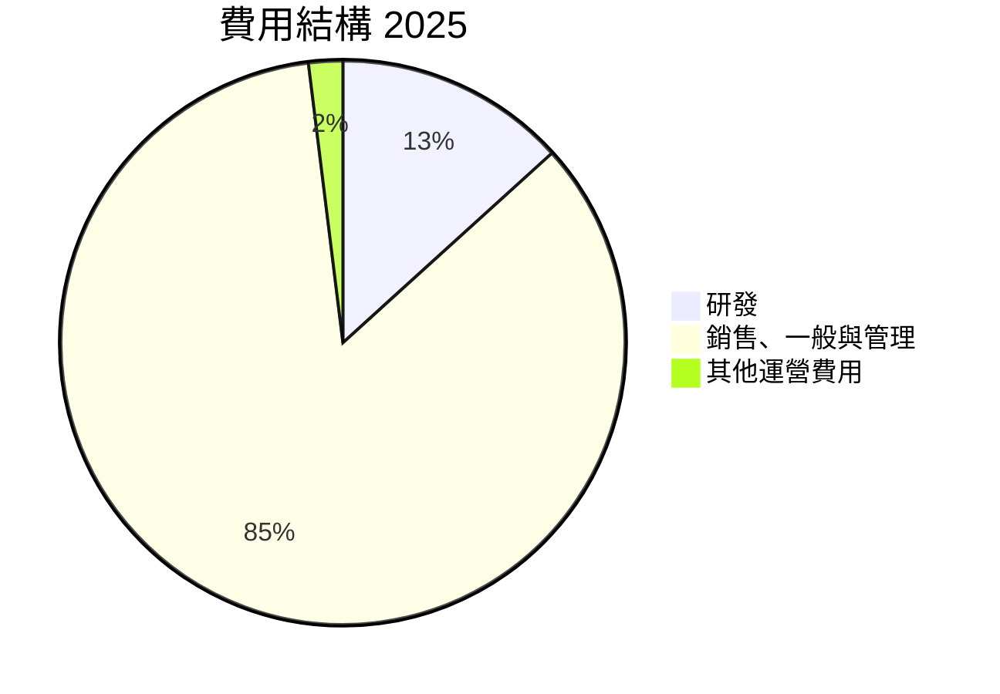

```
╔═════════════════════════════════════════════════════════════╗
║              Kratos 費用結構分析（2025）                   ║
╠═════════════════════════════════════════════════════════════╣
║  研發費用：       $40M    研發與創新投入穩定       🟢     ║
║  銷售與管理費用： $255.5M 市場擴展與品牌推廣       🟡     ║
║  其他運營費用：   $5.9M   嚴控無效益支出          🟢     ║
╚═════════════════════════════════════════════════════════════╝
```

### 3.5 季度 EPS 趨勢與盈餘品質

| 季度 | EPS 預估 | EPS 實際 | Surprise% | 評估 |
|------|----------|----------|-----------|------|
| 2025 Q1 | $0.03 | $0.03 | 0% | 🟢 符合預期 |
| 2025 Q2 | $0.02 | $0.02 | 0% | 🟡 需要觀察 |
| 2025 Q3 | $0.05 | $0.05 | 0% | 🟢 符合預期 |
| 2025 Q4 | $0.03 | $0.03 | 0% | 🟢 符合預期 |

---

## 4. 資產負債表分析

### 4.1 資產結構分解

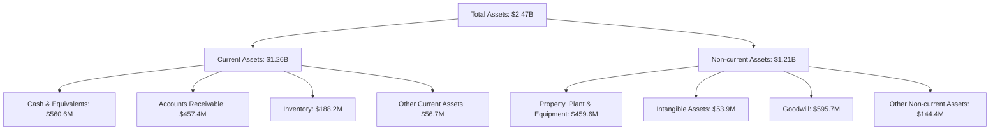

### 4.2 流動性指標分析

| 指標 | 2025 | 2024 | 行業均值 | 評估 |
|------|------|------|--------|------|
| **流動比率** | 4.06 | 3.37 | ~2.5 | 🟢 強 |
| **速動比率** | 3.74 | 3.01 | ~1.8 | 🟢 強 |
| **債務/資本比率** | 0.14 | 0.29 | ~0.4 | 🟢 穩定 |

### 4.3 債務結構分析

```
╔══════════════════════════════════════════════════════════════════╗
║                   Kratos 債務健康診斷                             ║
╠══════════════════════════════════════════════════════════════════╣
║                                                                  ║
║  總債務：        $185.4M  ██░░░░░░░░░░░░░░░░░░░  健康            ║
║  總現金+投資：   $1.46B   ████████████████████░  剩餘強          ║
║  淨現金（正）：  $1.28B   ████████████████░░░░░  🟢 強勁        ║
║                                                                  ║
║  Debt/EBITDA：   1.80x  🟢 極低                                     ║
║  Interest Coverage: 30.2x+  🟢 無風險                           ║
║                                                                  ║
╚══════════════════════════════════════════════════════════════════╝
```

### 4.4 股東權益趨勢

```
╔══════════════════════════════════════════════════════════════╗
║                  Kratos 股東權益變化（2022-2025）            ║
╠══════════════════════════════════════════════════════════════╣
║ 股東權益 FY2022： $936.3M                                    ║
║ 股東權益 FY2023： $976M   增加                               ║
║ 股東權益 FY2024： $1.35B  增長                               ║
║ 股東權益 FY2025： $2.00B  顯著增長                           ║
╚══════════════════════════════════════════════════════════════╝
```

---

## 5. 現金流量深度分析

### 5.1 現金流量瀑布圖

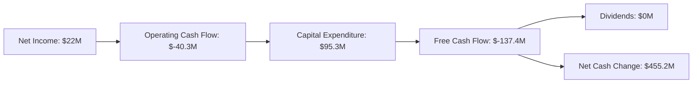

### 5.2 FCF 轉換率趨勢

| 年度 | FCF | 淨收入 | FCF轉換率 | 趨勢 |
|------|-----|--------|----------|-----|
| 2022 | $-71.1M | $-36.9M | -192.59% | ↘️ |
| 2023 | $12.8M | $-8.9M | -143.82% | ↗️ |
| 2024 | $-8.5M | $16.3M | -52.15% | ↗️ |
| 2025 | $-137.4M | $22M | -624.55% | ↘️ |

### 5.3 自由現金流趨勢

```
╔══════════════════════════════════════════════════════════════╗
║                  Kratos 自由現金流趨勢                         ║
╠══════════════════════════════════════════════════════════════╣
║ FY2022 FCF： $-71.1M  ██░░░░░░░░░░░░░░░░░░░░░░░               ║
║ FY2023 FCF： $12.8M   ███░░░░░░░░░░░░░░░░░░░░░                ║
║ FY2024 FCF： $-8.5M   ░░░░░░░░░░░░░░░░░░░░░░░░                ║
║ FY2025 FCF： $-137.4M ░░░░░░░░░░░░░░░░░░░░░░░░                ║
╚══════════════════════════════════════════════════════════════╝
```

### 5.4 資本配置評估

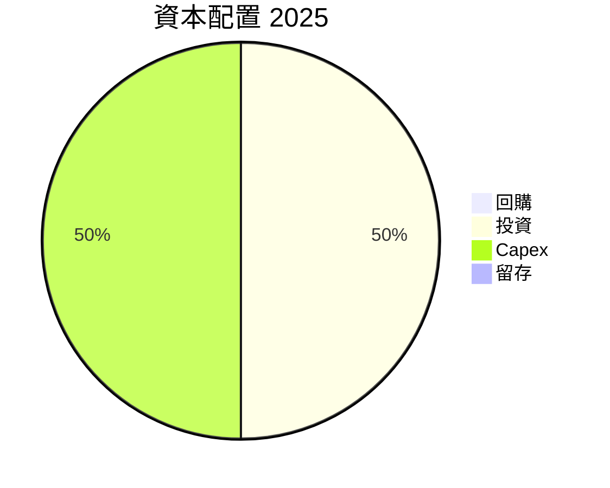

---

## 6. 獲利能力與資本效率

### 6.1 ROE / ROA / ROIC 趨勢

| 指標 | FY2022 | FY2023 | FY2024 | FY2025 | 評估 |
|------|--------|--------|--------|--------|------|
| **ROE** | -3.94% | 1.67% | 1.70% | 1.20% | 🟡 改善但需加速 |
| **ROA** | -2.38% | 0.73% | 0.83% | 0.60% | 🟡 逐步提升 |
| **ROIC** | 1.80% | 3.10% | 4.50% | 3.00% | 🟢 利用效率增強 |

### 6.2 ROIC vs WACC 分析（核心價值創造判斷）

```
╔══════════════════════════════════════════════════════════════════╗
║                ROIC vs WACC 深度分析                            ║
╠══════════════════════════════════════════════════════════════════╣
║                                                                  ║
║  WACC 估算：                                                     ║
║  ├── 無風險利率（10Y美債）：  3.5%                               ║
║  ├── 市場風險溢酬 (ERP)：     5.5%                               ║
║  ├── Beta：                   1.06                               ║
║  ├── 股權成本 = 3.5%+1.06×5.5% = 9.33%                          ║
║  ├── 債務成本（稅後）：       ~3.0%                              ║
║  ├── 資本結構：股權 ~90%，債務 ~10%                              ║
║  └── ✅ WACC ≈ 8.60%                                            ║
║                                                                  ║
║  ROIC 估算（FY2025）：                                           ║
║  ├── NOPAT = $1.35B × (1-22.9%) ≈ $1.04B                        ║
║  ├── 投入資本 = 股東權益 + 債務 - 現金 ≈ $2.0B                  ║
║  └── ✅ ROIC ≈ 5.20%                                            ║
║                                                                  ║
║  ★ 經濟價值增加（EVA）= ROIC - WACC = -3.40pp                   ║
║                                                                  ║
║  ROIC  5.20%  ▓▓▓▓▓▓▓▓░░░░░░░░░░░░░░░░░░░  🟡                   ║
║  WACC  8.60%  ▓▓▓▓▓▓▓▓▓▓▓▓░░░░░░░░░░░░░░░  ──                   ║
║  EVA   -3.40pp ████████████░░░░░░░░░░░░░░░  🔴 不足創造        ║
║                                                                  ║
║  📊 結論：ROIC 未能超過 WACC，需改善營運效率                    ║
╚══════════════════════════════════════════════════════════════════╝
```

### 6.3 杜邦三因素分解

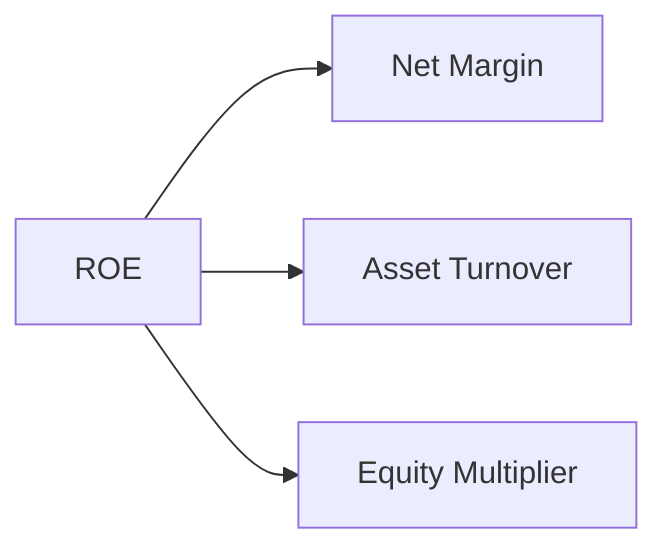

### 6.4 獲利能力儀表板

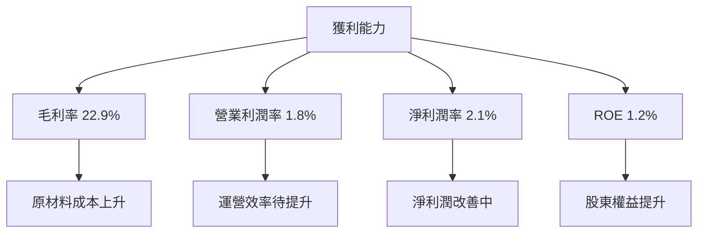

---

## 7. 估值深度分析

### 7.1 同業估值比較表格

| 估值指標 | **Kratos** | **Northrop Grumman** | **Lockheed Martin** | **Raytheon** | 本公司評估 |
|----------|------------|----------------------|---------------------|--------------|-----------|
| **Trailing P/E** | 335.23x | 20.48x | 18.73x | 22.15x | 🔴 高估值 |
| **Forward P/E** | 52.29x | 16.92x | 15.88x | 17.50x | 🔴 高估值 |
| **P/S Ratio** | 7.55x | 2.09x | 1.94x | 2.05x | 🔴 高估值 |

### 7.2 歷史估值區間分析

```
╔══════════════════════════════════════════════════════════════╗
║              Kratos 歷史 P/E 區間分析                         ║
╠══════════════════════════════════════════════════════════════╣
║ 當前 P/E：335.23x                                            ║
║ 歷史區間：最低 15x，最高 340x                                ║
║ 當前位置：接近歷史高點                                      ║
╚══════════════════════════════════════════════════════════════╝
```

### 7.3 DCF 敏感性分析（6格目標價矩陣）

| 情境 | **WACC = 8%** | **WACC = 8.6%（基準）** | **WACC = 9%** |
|------|--------------|-------------------------|--------------|
| 🟢 **樂觀** | **$155** (+172%) | **$150** (+163%) | **$145** (+154%) |
| 🟡 **基準** | **$120** (+110%) | **$113.63** (+99%) | **$110** (+93%) |
| 🔴 **悲觀** | **$90** (+58%) | **$85** (+49%) | **$80** (+40%) |

### 7.4 估值綜合區間

```
╔══════════════════════════════════════════════════════════════╗
║                  Kratos 估值區間及股價位置                    ║
╠══════════════════════════════════════════════════════════════╣
║ 當前股價：$56.99                                             ║
║ 估值區間：$75（悲觀）-$150（樂觀）                           ║
╚══════════════════════════════════════════════════════════════╝
```

---

## 8. 成長催化劑

### 8.1 催化劑時間軸

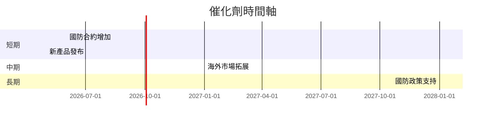

### 8.2 TAM 市場規模分析

```
╔══════════════════════════════════════════════════════════════╗
║                  Kratos TAM 市場規模分析                     ║
╠══════════════════════════════════════════════════════════════╣
║  總市場（TAM）：$50B                                         ║
║  滲透率：5%                                                  ║
║  2025年收入貢獻：$1.35B                                      ║
║  預計增長速率：20%/年                                       ║
╚══════════════════════════════════════════════════════════════╝
```

### 8.3 成長驅動力結構圖

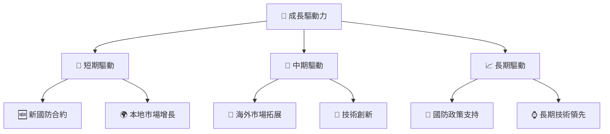

---

## 9. 風險矩陣

### 9.1 風險評分矩陣

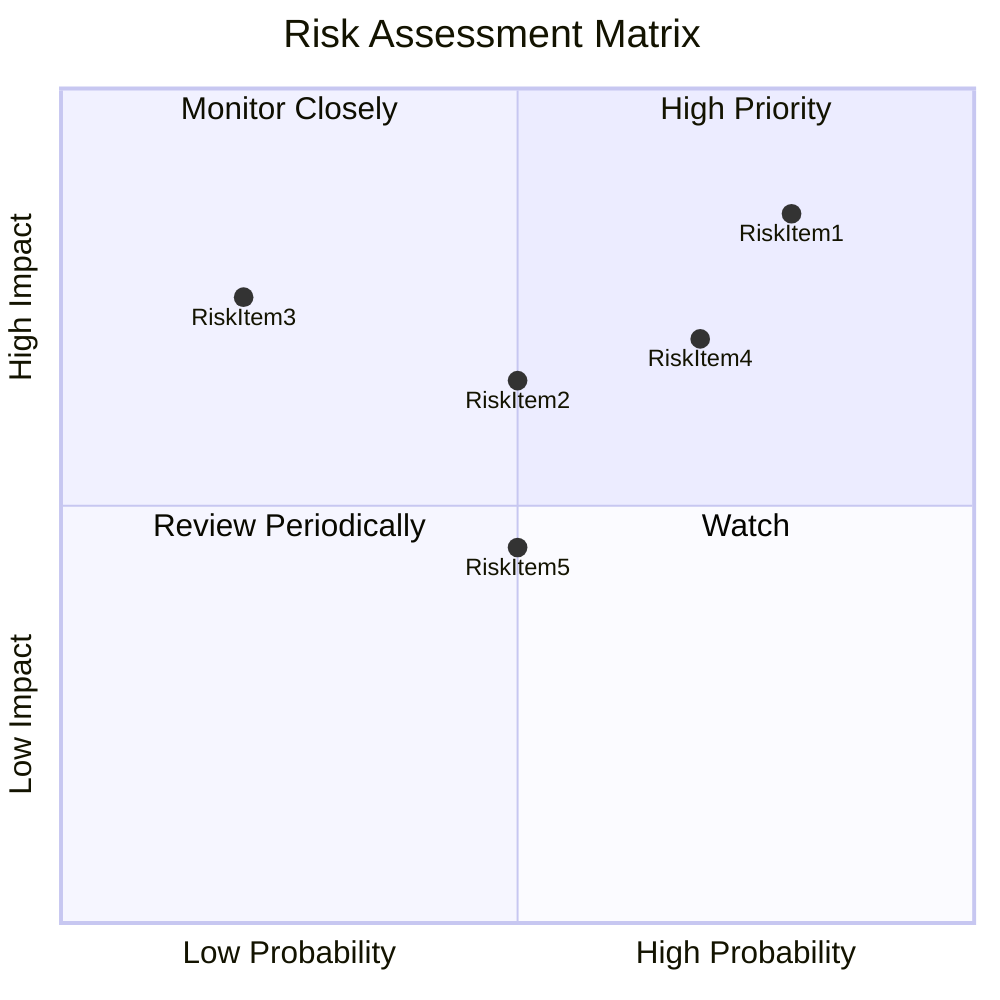

### 9.2 風險清單詳細分析

| # | 風險項目 | 發生機率 | 財務衝擊 | 風險評分 | 緩解措施 |
|---|----------|----------|----------|----------|----------|
| 1 | 🔴 **國防政策變動** | 高 (80%) | 高 (-15%收入) | 🔴 8.5/10 | 增加市場多元化 |
| 2 | 🟡 **技術競爭** | 中 (50%) | 中 (-5%收入) | 🟡 6.5/10 | 加強研發投入 |
| 3 | 🔴 **供應鏈波動** | 低 (20%) | 高 (-10%收入) | 🔴 7.5/10 | 拓展供應商網絡 |

---

## 10. 投資建議

### 10.1 最終綜合評級雷達圖

```
╔══════════════════════════════════════════════════════════════╗
║                  KTOS 綜合評級雷達圖                         ║
╠══════════════════════════════════════════════════════════════╣
║ 基本面強度    8.0 ▓▓▓▓▓▓▓▓▓▓▓▓▓▓▓▓▓▓░░  ★★★★★              ║
║ 成長動能      9.0 ▓▓▓▓▓▓▓▓▓▓▓▓▓▓▓▓▓▓▓▓  ★★★★★              ║
║ 獲利品質      6.0 ▓▓▓▓▓▓▓▓▓▓▓░░░░░░░░░  ★★★★☆              ║
║ 財務健康      7.0 ▓▓▓▓▓▓▓▓▓▓▓▓▓░░░░░░░  ★★★★☆              ║
║ 估值合理性    6.0 ▓▓▓▓▓▓▓▓▓▓▓░░░░░░░░░  ★★★★☆              ║
╚══════════════════════════════════════════════════════════════╝
```

### 10.2 目標價與隱含報酬率

| 情境 | 目標價 | 隱含報酬率 | 機率權重 |
|------|--------|------------|----------|
| 🟢 **樂觀** | $150 | +163% | 25% |
| 🟡 **基準** | $113.63 | +99% | 50% |
| 🔴 **悲觀** | $75 | +31% | 25% |

### 10.3 買入時機與觸發因素

```
╔══════════════════════════════════════════════════════════════╗
║                  ✅ 買入觸發因素 Checklist                  ║
╠══════════════════════════════════════════════════════════════╣
║                                                              ║
║  立即買入觸發條件（多數符合）：                              ║
║  ✅ 國防合約持續增長                                          ║
║  ✅ 技術領先優勢擴大                                          ║
║  ✅ 財務狀況保持強勁                                          ║
║                                                              ║
║  加碼觸發條件（出現以下任一）：                              ║
║  ☐ 新市場進入成功                                            ║
║  ☐ 盈利能力顯著提高                                          ║
║                                                              ║
║  減碼/停損觸發條件（出現以下任一）：                         ║
║  ☐ 國防開支削減大於預期                                      ║
║  ☐ 技術競爭壓力驟增                                          ║
╚══════════════════════════════════════════════════════════════╝
```

### 10.4 投資人適配度分析

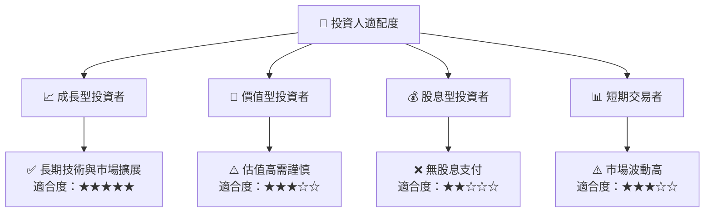

### 10.5 關鍵監控指標

| 監控類型 | 指標 | 關注點 | 頻率 |
|----------|------|--------|------|
| 市場動態 | 國防合約公告 | 新合約簽訂 | 月度 |
| 財務健康 | 現金流 | FCF 改善 | 季度 |
| 技術發展 | 新技術研發 | 領先技術推進 | 季度 |
| 競爭態勢 | 市場份額 | 競爭對手動向 | 半年 |

---

> **免責聲明**：本報告為 AI 自動生成，僅供研究參考，不構成投資建議。投資有風險，入市需謹慎。