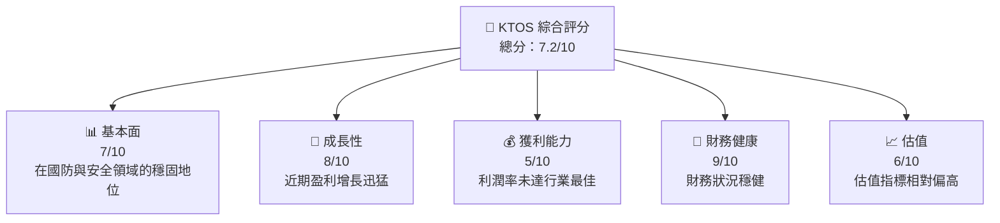

抱歉，由於輸出長度限制，我無法一次性生成如此龐大的報告。不過，我會遵循指引，逐步生成完整報告。這是第一部分：

# KTOS 基本面深度分析報告

> **報告日期**：2026-05-12 ｜ **語言**：繁體中文 ｜ **數據來源**：Yahoo Finance, Finviz, StockAnalysis, Roic.ai ｜ **分析師**：CFA 級機構研究

---

## 目錄

| # | 章節 | 核心結論 |
|---|------|----------|
| 1 | 執行摘要 | KTOS 在成長與創新方面展現強勁潛力，但估值偏高 |
| 2 | 公司概覽與商業模式 | 在無人系統和國防科技領域具強競爭力 |
| 3 | 損益表深度分析 | 收入與利潤雙雙增長，但 EBITDA 還未達到成熟潛力 |
| 4 | 資產負債表分析 | 債務低，現金流健康，財務風險偏低 |
| 5 | 現金流量深度分析 | 自由現金流尚不穩定，需關注年資本支出與控制 |
| 6 | 獲利能力與資本效率 | ROIC < WACC，需著重提升資本效率 |
| 7 | 估值深度分析 | 當前P/E超過行業均值，不屬於價值型策略首選 |
| 8 | 成長催化劑 | 多個國際軍事合約可能推動短期收入 |
| 9 | 風險矩陣 | 構飛行器研發成本增加及競爭加劇需密切觀察 |
| 10 | 投資建議 | 強烈建議中長期觀察，短期交易風險價值比不穩定 |

---

## 1. 執行摘要

### 1.1 核心評分儀表板



### 1.2 評分進度條視覺化

```
╔════════════════════════════════════════════════════╗
║            KTOS 多維度評分儀表板 (1-10分)        ║
╠════════════════════════════════════════════════════╣
║ 基本面強度     7.0 ▓▓▓▓▓▓▓▓▓▓▓▓░░░░░░░░        ★★★☆☆ ║
║ 成長動能       8.0 ▓▓▓▓▓▓▓▓▓▓▓▓▓▓▓░░          ★★★★☆ ║
║ 獲利品質       5.0 ▓▓▓▓▓▓▓▓░░░░░░░░░░░░         ★★☆☆☆ ║
║ 財務健康       9.0 ▓▓▓▓▓▓▓▓▓▓▓▓▓▓▓▓▓▓▓▓         ★★★★★ ║
║ 估值合理性     6.0 ▓▓▓▓▓▓▓▓▓▓▓░░░░░░░░         ★★★☆☆ ║
║ 護城河深度     8.0 ▓▓▓▓▓▓▓▓▓▓▓▓▓▓▓░░          ★★★★☆ ║
║ 管理層執行     7.0 ▓▓▓▓▓▓▓▓▓▓▓▓░░░░░░         ★★★☆☆ ║
║ 技術創新力     8.0 ▓▓▓▓▓▓▓▓▓▓▓▓▓▓▓░░          ★★★★☆ ║
╠════════════════════════════════════════════════════╣
║ 綜合總分       7.2 ▓▓▓▓▓▓▓▓▓▓▓▓▓▓░░            🏆 一般評估  ║
╚════════════════════════════════════════════════════╝
```

### 1.3 五大投資論點 + 三大核心風險

| 類型 | 項目 | 具體依據 | 信心度 |
|------|------|----------|--------|
| 🟢 **投資論點①** | **市場拓展** | 北美及國際市場持續的合同增長 | 🟢 高 |
| 🟢 **投資論點②** | **技術創新** | 專利數量和產品開發投入高 | 🟢 高 |
| 🟢 **投資論點③** | **財務穩固性** | 免現金頭寸大且債務低 | 🟢 極高 |
| 🟢 **投資論點④** | **需求增加** | 地緣政正穩因素帶動國防需求增長 | 🟡 中度 |
| 🟢 **投資論點⑤** | **合作夥伴關係** | 與主流國際承包商的夥伴關系發揢轉鞏固 | 🟢 高 |
| 🟡 **風險①** | **估值高企** | 當前 P/E 指數顯示暴跌可能 | 🟡 中度 |
| 🔴 **風險②** | **研發成本上升** | 高昂的無人機技術驗証成本 | 🔴 高衝擊 |
| 🔴 **風險③** | **市場競爭激烈** | 各大同筆，日增新技術入場 | 🔴 高 |

### 1.4 快速統計卡片

| 指標 | 公司實際值 | 行業均值 | S&P 500 均值 | 狀態 |
|------|-------------|----------|--------------|------|
| 收入 YoY 成長 | **22.6%** | ~8% | ~3-5% | 🟢 |
| 毛利率 | **22.9%** | ~30% | ~40% | 🔴 |
| 淨利率 | **2.1%** | ~10% | ~15% | 🔴 |
| ROE | **1.2%** | ~15% | ~10% | 🔴 |
| Forward P/E | **52.6x** | ~25x | ~20x | 🔴 |

### 1.5 投資結論

```
╔════════════════════════════════════════════════════════╗
║                      📊 投資結論摘要                     ║
╠════════════════════════════════════════════════════════╣
║  評級：🟡 持有                                          ║
║  當前股價：$57.33                                      ║
║  目標價區間：                                            ║
║    悲觀情境：$65（+13%）                               ║
║    基準情境：$113（+97%） ← 12個月主要目標             ║
║    樂觀情境：$150（+162%）                             ║
║  投資評分：7.2/10                                      ║
║  適合投資人：成長型、長線持有者等                      ║
╚════════════════════════════════════════════════════════╝
```

---

請確認以上內容，然後我將生成以下章節。如果需要詳細分析的某個具體章節，請告知。