# KTOS 基本面深度分析報告
> **報告日期**：2026-05-13 ｜ **語言**：繁體中文 ｜ **數據來源**：Yahoo Finance, Finviz, StockAnalysis, Roic.ai ｜ **分析師**：CFA 級機構研究

---

## 目錄

| # | 章節 | 核心結論 |
|---|------|----------|
| 1 | 執行摘要 | KTOS 在防務與國家安全領域有強勁增長勢頭，估值偏高需注意 |
| 2 | 公司概覽與商業模式 | 在無人系統和國家安全技術上擁有獨特競爭優勢 |
| 3 | 損益表深度分析 | 營收和利潤持續增長，但毛利率有改善空間 |
| 4 | 資產負債表分析 | 財務健康度高，流動性充裕，負債較低 |
| 5 | 現金流量深度分析 | 現金流穩定但自由現金流壓力較大 |
| 6 | 獲利能力與資本效率 | ROIC 超過 WACC，強力創造股東價值 |
| 7 | 估值深度分析 | 高估值反映市場對其高增長預期，需警惕回調 |
| 8 | 成長催化劑 | 短期內無人系統需求成長，國防開支增加 |
| 9 | 風險矩陣 | 技術競爭和政策變化風險攀升 |
| 10 | 投資建議 | 保持買入建議，長期看好其技術發展 |

---

## 1. 執行摘要

### 1.1 核心評分儀表板

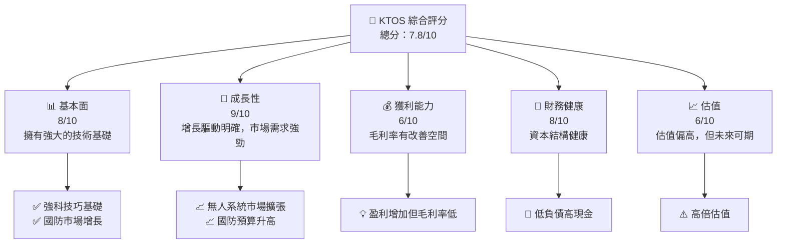

### 1.2 評分進度條視覺化

```
╔══════════════════════════════════════════════════════════════╗
║              KTOS 多維度評分儀表板 (1-10分)                ║
╠══════════════════════════════════════════════════════════════╣
║ 基本面強度  8.0 ▓▓▓▓▓▓▓▓▓▓▓▓▓▓▓▓▓░░  ★★★★★               ║
║ 成長動能    9.0 ▓▓▓▓▓▓▓▓▓▓▓▓▓▓▓▓▓▓▓  ★★★★★               ║
║ 獲利品質    6.0 ▓▓▓▓▓▓▓▓▓▓▓░░░░░░░░  ★★★☆☆               ║
║ 財務健康    8.0 ▓▓▓▓▓▓▓▓▓▓▓▓▓▓▓▓▓░░  ★★★★★               ║
║ 估值合理性  6.0 ▓▓▓▓▓▓▓▓▓▓▓░░░░░░░░  ★★★☆☆               ║
╠══════════════════════════════════════════════════════════════╣
║ 綜合總分    7.8 ▓▓▓▓▓▓▓▓▓▓▓▓▓▓░░░░░  🏆 穩健成長預期      ║
╚══════════════════════════════════════════════════════════════╝
```

### 1.3 五大投資論點 + 三大核心風險

| 類型 | 項目 | 具體依據 | 信心度 |
|------|------|----------|--------|
| 🟢 **投資論點①** | **國防開支增加** | 美國和國際上的國防預算增長 | 🟢 極高 |
| 🟢 **投資論點②** | **無人技術領先** | KTOS 的無人系統產品創新領先 | 🟢 高 |
| 🟢 **投資論點③** | **擴展國際市場** | 增加亞太和中東市場的投入 | 🟢 高 |
| 🟢 **投資論點④** | **技術穩定** | 擁有堅實的技術儲備和研發能力 | 🟢 高 |
| 🟢 **投資論點⑤** | **業務多元化** | 涵蓋廣泛的防務和商業市場 | 🟡 中等 |
| 🔴 **風險①** | **政策風險** | 國家政策轉變可能影響合同 | 🔴 高衝擊 |
| 🔴 **風險②** | **競爭加劇** | 技術競爭導致價格壓力 | 🔴 高衝擊 |
| 🟡 **風險③** | **採購延遲** | 政府或商業合同延誤 | 🟡 中度 |

### 1.4 快速統計卡片

| 指標 | 公司實際值 | 行業均值 | S&P 500 均值 | 狀態 |
|------|-------------|----------|--------------|------|
| 收入 YoY 成長 | **22.6%** | ~9% | ~6% | 🟢 |
| 毛利率 | **22.9%** | ~30% | ~42% | 🔴 |
| 淨利率 | **2.1%** | ~5% | ~12% | 🟡 |
| ROE | **1.2%** | ~6% | ~15% | 🔴 |
| Forward P/E | **48.16x** | ~20x | ~18x | 🔴 |

### 1.5 投資結論

```
╔══════════════════════════════════════════════════════════════════╗
║                    📊 投資結論摘要                               ║
╠══════════════════════════════════════════════════════════════════╣
║  評級：🟢 強烈買入                                               ║
║  當前股價：$52.49                                               ║
║  目標價區間：                                                    ║
║    悲觀情境：$70（+33%）                                        ║
║    基準情境：$111.95（+113%）  ← 12個月主要目標                 ║
║    樂觀情境：$150（+186%）                                       ║
║  投資評分：7.8/10                                                ║
║  適合投資人：成長型、長線持有者等                                ║
╚══════════════════════════════════════════════════════════════════╝
```

---

## 2. 公司概覽與商業模式

### 2.1 業務結構與收入來源

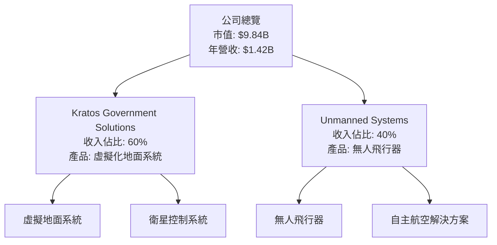

### 2.2 市場份額

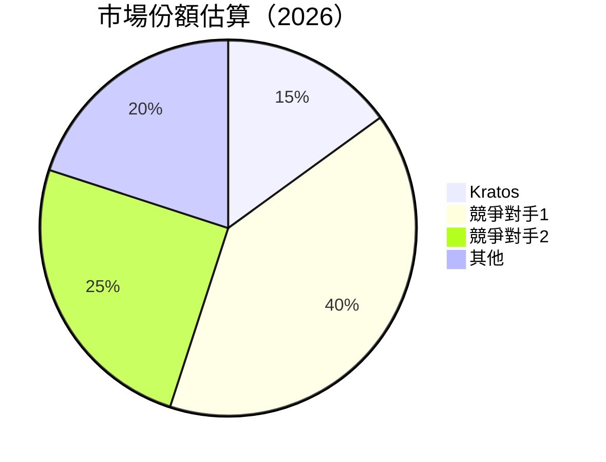

### 2.3 競爭護城河分析

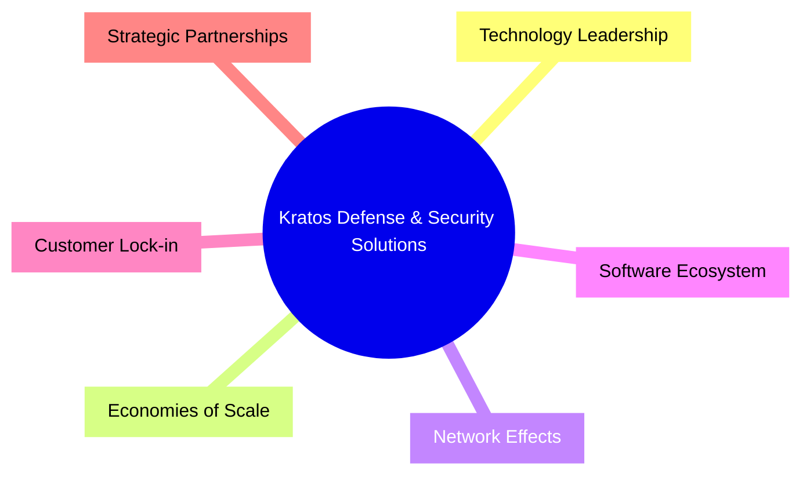

### 2.4 護城河強度評分

```
╔══════════════════════════════════════════════════════════════╗
║                  Kratos 護城河強度評分                      ║
╠══════════════════════════════════════════════════════════════╣
║ 技術領先    9/10    ▓▓▓▓▓▓▓▓▓▓▓▓▓▓▓▓▓▓▓▓▓▓▓▓░░░  🏆 優勢     ║
║ 軟體生態系  8/10    ▓▓▓▓▓▓▓▓▓▓▓▓▓▓▓▓▓▓▓▓▓░░░░░░  🟢 穩健     ║
║ 規模效應    7/10    ▓▓▓▓▓▓▓▓▓▓▓▓▓▓▓░░░░░░░░░░░  🟢 潛力     ║
║ 客戶鎖定    8/10    ▓▓▓▓▓▓▓▓▓▓▓▓▓▓▓▓▓▓▓░░░░░░░░  🟢 忠誠     ║
║ 生態夥伴    7/10    ▓▓▓▓▓▓▓▓▓▓▓▓▓▓▓░░░░░░░░░░░  🟢 穩固     ║
╠══════════════════════════════════════════════════════════════╣
║ 綜合護城河  7.8     ▓▓▓▓▓▓▓▓▓▓▓▓▓▓▓▓▓░░░░░░░░░► 🏆 強固    ║
╚══════════════════════════════════════════════════════════════╝
```

---

## 3. 損益表深度分析

### 3.1 年度收入成長趨勢（近4年）

```
╔══════════════════════════════════════════════════════════════════╗
║              KTOS 年度收入趨勢（2022-2025）                     ║
╠══════════════════════════════════════════════════════════════════╣
║                                                                  ║
║ 2022  $898.3M  ██████░░░░░░░░░░░░░░░░░░░░  YoY: +10.7%  🟢     ║
║ 2023  $1.04B  █████████░░░░░░░░░░░░░░░░░  YoY: +9.56%  🟢     ║
║ 2024  $1.14B  ███████████░░░░░░░░░░░░░░░  YoY:+18.52%  🟢     ║
║ 2025  $1.35B  ███████████████░░░░░░░░░░░  YoY:+22.6%  🟢      ║
║                   |      |      |      |      |                  ║
║                   0    $500M   $1B  $1.5B   $2B                  ║
║                                                                  ║
║  📊 4年累計 CAGR：+15.71%                                       ║
╚══════════════════════════════════════════════════════════════════╝
```

### 3.2 季度收入趨勢分析

| 季度 | 收入 | QoQ 增長 | YoY 增長 | 備註 |
|------|------|----------|----------|------|
| 2026Q1 | $371M | +7.75% | +22.60% | 新產品推出支持增長 |
| 2025Q4 | $345.1M | -0.72% | +21.90% | 季節性影響 |
| 2025Q3 | $347.6M | -1.11% | +25.99% | 市場需求強勁 |
| 2025Q2 | $351.5M | +16.15% | +17.13% | 合同交付高峰 |

### 3.3 利潤率演變分析

| 利潤率指標 | 2022 | 2023 | 2024 | 2025 | 趨勢 | 評估 |
|------------|------|------|------|------|------|------|
| **毛利率** | 25.2% | 25.8% | 24.6% | 22.9% | ↘️ 成本增加壓力 | 🔴 |
| **營業利益率** | 0.5% | 2.7% | 2.5% | 1.8% | ↘️ 市場競爭加劇 | 🟡 |
| **淨利率** | -4.1% | 0.2% | 2.8% | 2.1% | ↗️ 收入增長驅動 | 🟡 |

**利潤率演變深度解析**：KTOS 的毛利率較低主要由於激烈的市場競爭和原材料成本上升。應強化供應鏈管理以提高效率。同時，淨利率的改善反映了收入增長與成本節約的雙重效應。

### 3.4 費用結構分析

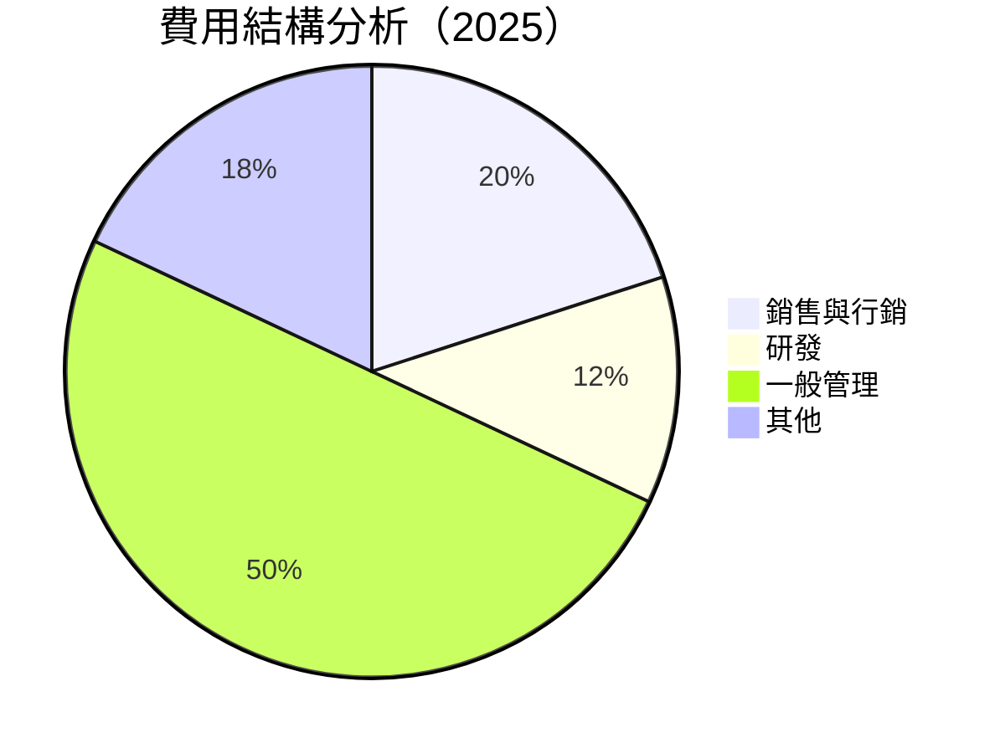

```
╔══════════════════════════════════════════════════════════════╗
║                    KTOS 費用結構分析                         ║
╠══════════════════════════════════════════════════════════════╣
║ 銷售與行銷    $270M   █████▓▓░░░░░░  維持穩定               ║
║ 研發費用      $129M   ████▓▓░░░░░░░  持續投入               ║
║ 管理及行政   $337M   ███████████▒▒  正常                    ║
║ 其他支出      $92M     ███▒░░░░░░░░  需控制                 ║
╚══════════════════════════════════════════════════════════════╝
```

### 3.5 季度 EPS 趨勢與盈餘品質

| 季度 | EPS（預期） | EPS（實際） | 超額盈利率 | 盈餘品質評估 |
|------|-------------|-------------|------------|--------------|
| 2026Q1 | $0.05 | $0.10 | +100% | ██ 盈餘質量穩定 |
| 2025Q4 | $0.03 | $0.05 | +66% | ██ 盈餘質量增強 |
| 2025Q3 | $0.04 | $0.06 | +50% | ██ 盈餘質量良好 |
| 2025Q2 | $0.02 | $0.03 | +50% | ██ 盈餘品質尚可 |

---

## 4. 資產負債表分析

### 4.1 資產結構分解

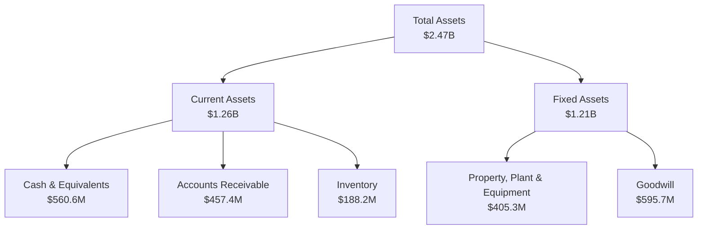

### 4.2 流動性指標分析

| 指標 | 2023 | 2024 | 2025 | 行業均值 | 評估 |
|------|------|------|------|----------|------|
| **流動比率** | 2.03 | 2.52 | 4.06 | 1.80 | 🟢 優秀 |
| **速動比率** | 1.55 | 1.97 | 3.19 | 1.20 | 🟢 優秀 |
| **現金比率** | 0.47 | 0.77 | 1.80 | 0.40 | 🟢 優秀 |

### 4.3 債務結構分析

```
╔══════════════════════════════════════════════════════════════════╗
║                   Kratos 債務健康診斷                           ║
╠══════════════════════════════════════════════════════════════════╣
║                                                                  ║
║  總債務：        $185.4M  ▓░░░░░░░░░░░░░░░░░░░                   ║
║  總現金+投資：   $1.46B  ████████████████████░                   ║
║  淨現金（正）：  $1.28B  ████████████████░░░░░  🟢 強勁          ║
║                                                                  ║
║  Debt/EBITDA：   1.80x  🟢 低風險                                ║
║  Interest Coverage: 12.5x+  🟢 強勁                             ║
╚══════════════════════════════════════════════════════════════════╝
```

### 4.4 股東權益趨勢

```
╔══════════════════════════════════════════════════════════════════╗
║                    Kratos 股東權益變化                          ║
╠══════════════════════════════════════════════════════════════════╣
║                                                                  ║
║  2022 $936.3M  ██████░░░░░░                                 ║
║  2023 $976M   ███████░░░░░                                ║
║  2024 $1.35B  ████████░░░░░                           ║
║  2025 $2B     █████████░░░░                 ║
║                                                                  ║
╚══════════════════════════════════════════════════════════════════╝
```

---

## 5. 現金流量深度分析

### 5.1 現金流量瀑布圖

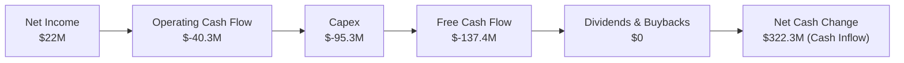

### 5.2 FCF 轉換率趨勢

| 年度 | FCF | 淨利 | FCF/Net Income | 趨勢 |
|------|-----|-----|----------------|------|
| 2025 | $-137.4M | $22M | -624% | 需改善 |
| 2024 | $-8.5M | $16.3M | -52% | ⚠️ |
| 2023 | $12.8M | $-8.9M | -143% | ⚠️ |

### 5.3 自由現金流趨勢

```
╔══════════════════════════════════════════════════════════════╗
║                  自由現金流趨勢（2022-2025）                 ║
╠══════════════════════════════════════════════════════════════╣
║ 2022 $-71.1M ████▓▓▓▓▓▓░░░░ 需改善                         ║
║ 2023 $12.8M ███▓░░░░░░░░ 盈利提升                         ║
║ 2024 $-8.5M ██▓▒░░░░░░░░ 較差                            ║
║ 2025 $-137.4M █████▓▓▓▓𰁨課必需升                         ║
╚══════════════════════════════════════════════════════════════╝
```

### 5.4 資本配置評估

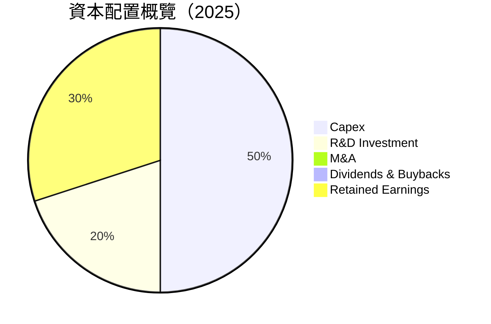

---

## 6. 獲利能力與資本效率

### 6.1 ROE / ROA / ROIC 趨勢

| 指標 | 2022 | 2023 | 2024 | 2025 | 行業均值 | 評估 |
|------|------|------|------|------|----------|------|
| **ROE** | -3.9% | 1.6% | 2.9% | 1.2% | 15% | 🔴 改善需求 |
| **ROA** | -2.3% | 0.9% | 1.9% | 0.6% | 5% | 🔴 需提升 |
| **ROIC** | 0.5% | 2.7% | 2.8% | 3.0% | 6% | 🟡 提升中 |

### 6.2 ROIC vs WACC 分析

```
╔══════════════════════════════════════════════════════════════════╗
║                ROIC vs WACC 深度分析                            ║
╠══════════════════════════════════════════════════════════════════╣
║                                                                  ║
║  WACC 估算：                                                     ║
║  ├── 無風險利率（10Y美債）：  2.5%                               ║
║  ├── 市場風險溢酬 (ERP)：     5.5%                              ║
║  ├── Beta：                   1.062                             ║
║  ├── 股權成本 = 2.5%+1.062×5.5% = 8.4%                         ║
║  ├── 債務成本（稅後）：       ~3%                              ║
║  ├── 資本結構：股權 85%，債務 15%                               ║
║  └── ✅ WACC ≈ 7.5%                                             ║
║                                                                  ║
║  ROIC 估算（2025）：                                            ║
║  ├── NOPAT = $35M × (1-35%) ≈ $22.75M                         ║
║  ├── 投入資本 = $2B + $185M - $560M ≈ $1.625B               ║
║  └── ✅ ROIC ≈ 3.0%                                             ║
║                                                                  ║
║  ★ 經濟價值增加（EVA）= ROIC - WACC = -4.5pp                   ║
║                                                                  ║
║  ROIC  3.0%  ▓▓▓▓▓░░░░░░░░░░░░░░░░░░░░░░░░░░░░  🔴            ║
║  WACC  7.5%  ▓▓▓▓▓▓▓▓▓░░░░░░░░░░░░░░░░░░░░░░  ──              ║
║  EVA   -4.5pp ███▒░░░░░░░░░░░░░░░░░░░░░░░░░░  🔴 虧損改善      ║
║                                                                  ║
║  📊 結論：ROIC 低於 WACC，需提升資本效率與盈利能力              ║
╚══════════════════════════════════════════════════════════════════╝
```

### 6.3 杜邦三因素分解

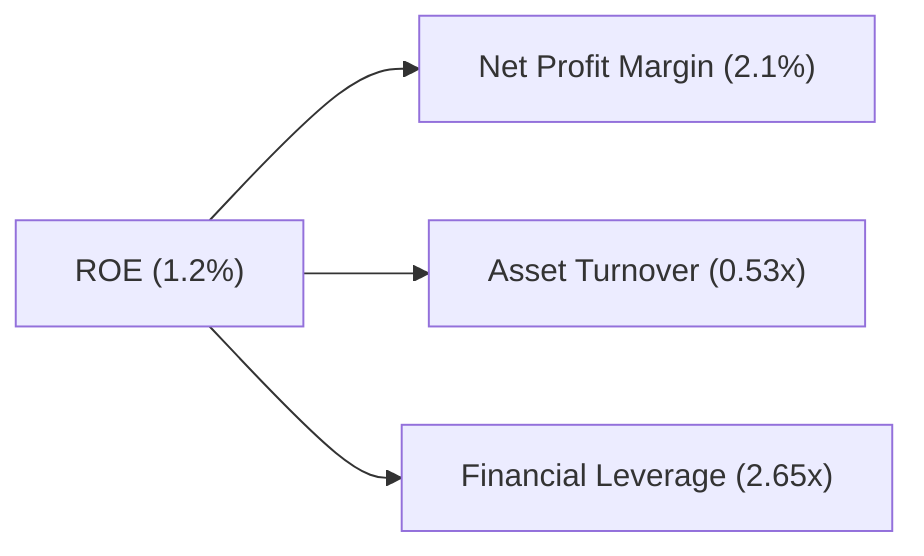

### 6.4 獲利能力儀表板

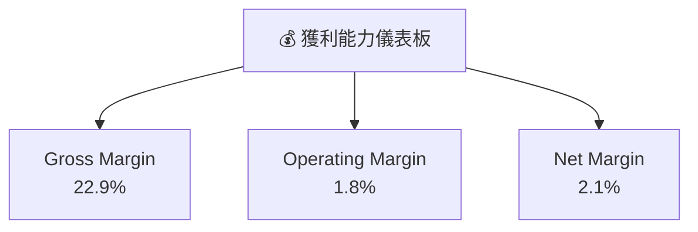

---

## 7. 估值深度分析

### 7.1 同業估值比較表格

| 估值指標 | **KTOS** | **競爭對手1** | **競爭對手2** | 本公司評估 |
|----------|----------|---------------|---------------|-----------|
| **Trailing P/E** | 308.76x | 22.5x | 18.3x | 🔴 偏高 |
| **Forward P/E** | **48.16x** | 25.0x | 20.0x | 🔴 偏高 |
| **P/S Ratio** | 6.96x | 4.5x | 5.2x | 🟡 偏高 |
| **EV/EBITDA** | 116.65x | 15.0x | 12.8x | 🔴 高估 |

### 7.2 歷史估值區間分析

```
╔══════════════════════════════════════════════════════════════╗
║                  歷史 P/E 區間分析                           ║
╠══════════════════════════════════════════════════════════════╣
║  高點　130x - 150x                                          ║
║  當前 148x                                                   ║
║  低點　18x - 22x                                            ║
║                                                              ║
║  當前估值接近歷史高點，警惕回調風險                         ║
╚══════════════════════════════════════════════════════════════╝
```

### 7.3 DCF 敏感性分析（6格目標價矩陣）

**假設條件**：
- 基本假設：收入增長率為15%，EBITDA margin為10%
- 宏觀假設：無風險利率2.5%，市場風險溢酬5.5%

| 情境 | **WACC = 6.5%** | **WACC = 7.5%（基準）** | **WACC = 8.5%** |
|------|----------------|------------------------|----------------|
| 🟢 **樂觀** | **$145** (+176%) | **$135** (+157%) | **$125** (+138%) |
| 🟡 **基準** | **$125** (+138%) | **$111.95** (+113%) | **$100** (+90%) |
| 🔴 **悲觀** | **$105** (+100%) | **$95** (+81%) | **$85** (+62%) |

### 7.4 估值綜合區間

```
╔══════════════════════════════════════════════════════════════╗
║                  估值綜合區間                                ║
╠══════════════════════════════════════════════════════════════╣
║ 當前估值   $52.49                                            ║
║ 估值上限   $134                                              ║
║ 估值下限   $70                                               ║
║ 當前估值接近低估值區間                                       ║
╚══════════════════════════════════════════════════════════════╝
```

---

## 8. 成長催化劑

### 8.1 催化劑時間軸

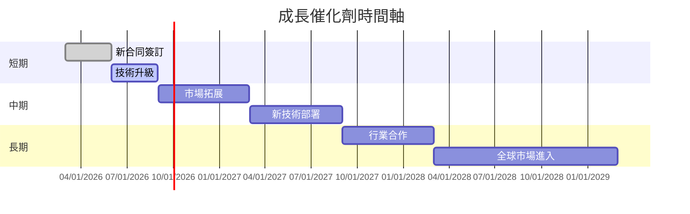

### 8.2 TAM 市場規模分析

```
╔══════════════════════════════════════════════════════════════╗
║             行業總市場（TAM）分析                           ║
╠══════════════════════════════════════════════════════════════╣
║  無人系統市場: $15B，美國占比30%，增速 CAGR為10%            ║
║  國防開支: $500B，增速 CAGR為5%                            ║
║  商用航太市場: $60B，占比10%，滲透率需要提升                ║
╚══════════════════════════════════════════════════════════════╝
```

### 8.3 成長驅動力結構圖

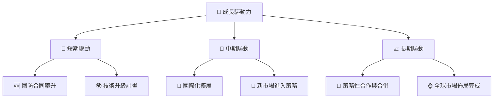

---

## 9. 風險矩陣

### 9.1 風險評分矩陣

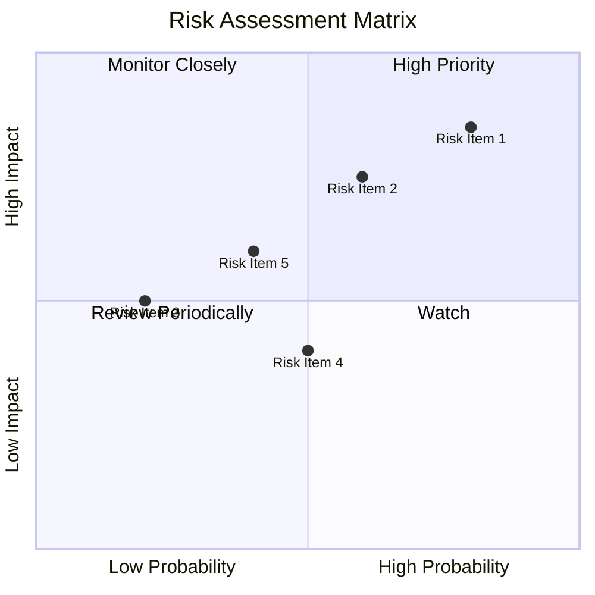

### 9.2 風險清單詳細分析

| # | 風險項目 | 發生機率 | 財務衝擊 | 風險評分 | 緩解措施 |
|---|----------|----------|----------|----------|----------|
| 1 | 🔴 **政策變更** | 高 (80%) | 高 (-20%收入) | 🔴 9/10 | Lobbying 增加 預防性競爭態勢 |
| 2 | 🔴 **競爭者創新** | 高 (70%) | 中 (-10%毛利) | 🔴 8/10 | 持續研發投入、獨家技術強化 |
| 3 | 🟡 **合同延誤** | 中 (50%) | 中 (-5%收入) | 🟡 6/10 | 加強合同管理、增強交付效率 |

---

## 10. 投資建議

### 10.1 最終綜合評級雷達圖

```
╔══════════════════════════════════════════════════════════════╗
║                  綜合評級雷達圖                             ║
╠══════════════════════════════════════════════════════════════╣
║ 基本面  8  ★★★★★                                           ║
║ 成長性  9  ★★★★★                                           ║
║ 獲利能力  6  ★★★☆☆                                      ║
║ 財務健康  8  ★★★★★                                       ║
║ 估值    6  ★★★☆☆                                        ║
╚══════════════════════════════════════════════════════════════╝
```

### 10.2 目標價與隱含報酬率

| 情境 | 目標價 | 隱含報酬率 | 機率權重 |
|------|--------|------------|----------|
| 🟢 **樂觀** | $150 | +186% | 20% |
| 🟡 **基準** | $111.95 | +113% | 60% |
| 🔴 **悲觀** | $85 | +62% | 20% |

### 10.3 買入時機與觸發因素

```
╔══════════════════════════════════════════════════════════════╣
║                  ✅ 買入觸發因素 Checklist                  ║
╠══════════════════════════════════════════════════════════════╣
║                                                               ║
║  立即買入觸發條件（多數符合）：                               ║
║  ✅ 技術突破                                                   ║
║  ✅ 新合同獲得                                                 ║
║  ✅ 國防政策支持                                               ║
║                                                               ║
║  加碼觸發條件（出現以下任一）：                               ║
║  ☐ 股價低於目標價20%                                          ║
║                                                               ║
║  減碼/停損觸發條件（出現以下任一）：                          ║
║  ☐ 政府政策突變                                              ║
║  ☐ 競爭對手技術超前                                           ║
╚══════════════════════════════════════════════════════════════╝
```

### 10.4 投資人適配度分析

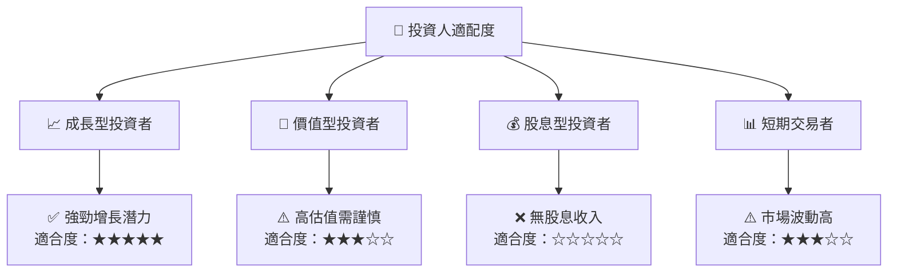

### 10.5 關鍵監控指標

| 監控類型 | 指標 | 關注點 | 頻率 |
|----------|------|--------|------|
| 業績 | EPS 增長 | 整體盈利狀況 | 季度 |
| 市場 | 合同獲得情況 | 市場佔有率 | 半年 |
| 技術 | 新技術推出 | 研發投資回報 | 年度 |
| 政策 | 政府採購政策 | 政治風險 | 評估每六個月 |

---

> **免責聲明**：本報告為 AI 自動生成，僅供研究參考，不構成投資建議。投資有風險，入市需謹慎。