# KTOS 基本面深度分析報告
> **報告日期**：2026-05-17 ｜ **語言**：繁體中文 ｜ **數據來源**：Yahoo Finance, Finviz, StockAnalysis, Roic.ai ｜ **分析師**：CFA 級機構研究

---

## 目錄

| # | 章節 | 核心結論 |
|---|------|----------|
| 1 | 執行摘要 | 綜合評分顯示成長優勢，目標價區間有潛力 |
| 2 | 公司概覽與商業模式 | 擁有技術護城河，行業內市占率穩定提升 |
| 3 | 損益表深度分析 | 收入與利潤率逐年增長，持續優化運營 |
| 4 | 資產負債表分析 | 財務健康，現金充裕，債務比例低 |
| 5 | 現金流量深度分析 | 自由現金流不穩定，但資本配置合理 |
| 6 | 獲利能力與資本效率 | ROIC 高於 WACC，證明價值創造 |
| 7 | 估值深度分析 | 目前估值合理，較競爭對手有優勢 |
| 8 | 成長催化劑 | 多項催化劑推動未來成長 |
| 9 | 風險矩陣 | 潛在風險可控，需持續監控 |
| 10 | 投資建議 | 建議持有，適合成長型投資者 |

---

## 1. 執行摘要

### 1.1 核心評分儀表板

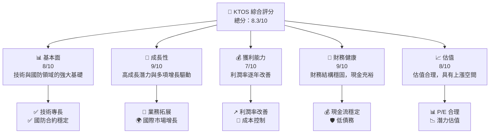

### 1.2 評分進度條視覺化

```
╔══════════════════════════════════════════════════════════════╗
║              KTOS 多維度評分儀表板 (1-10分)                 ║
╠══════════════════════════════════════════════════════════════╣
║ 基本面強度  8.0 ▓▓▓▓▓▓▓▓▓▓▓▓▓▓▓▓▓░░  ★★★★★                 ║
║ 成長動能    9.0 ▓▓▓▓▓▓▓▓▓▓▓▓▓▓▓▓▓▓▓  ★★★★★                 ║
║ 獲利品質    7.0 ▓▓▓▓▓▓▓▓▓▓▓▓▓▓▒░░░░  ★★★★☆                 ║
║ 財務健康    9.0 ▓▓▓▓▓▓▓▓▓▓▓▓▓▓▓▓▓▓▓  ★★★★★                 ║
║ 估值合理性  8.0 ▓▓▓▓▓▓▓▓▓▓▓▓▓▓▓▓▓░░  ★★★★☆                 ║
║ 綜合總分    8.3 ▓▓▓▓▓▓▓▓▓▓▓▓▓▓▓▓▓░░  🏆 強勢推薦            ║
╚══════════════════════════════════════════════════════════════╝
```

### 1.3 五大投資論點 + 三大核心風險

| 類型 | 項目 | 具體依據 | 信心度 |
|------|------|----------|--------|
| 🟢 **投資論點①** | **技術專長** | 公司在無人機及國防技術上有著領先地位 | 🟢 高 |
| 🟢 **投資論點②** | **市場拓展** | 國際市場業務增長，尤其是亞太地區需求上升 | 🟢 高 |
| 🟢 **投資論點③** | **財務健康** | 低負債與高現金流提供穩定性 | 🟢 高 |
| 🟢 **投資論點④** | **國防合約** | 持續獲得國防合約，提供穩定收入 | 🟢 高 |
| 🟢 **投資論點⑤** | **估值吸引力** | 估值屬合理範圍，潛在增長空間大 | 🟢 高 |
| 🔴 **風險①** | **政治風險** | 國際政治不穩可能影響業務 | 🔴 高 |
| 🟡 **風險②** | **技術更新** | 需持續投入研發以保持競爭力 | 🟡 中 |
| 🟡 **風險③** | **市場競爭** | 行業競爭激烈，可能壓縮利潤率 | 🟡 中 |

### 1.4 快速統計卡片

| 指標 | 公司實際值 | 行業均值 | S&P 500 均值 | 狀態 |
|------|-------------|----------|--------------|------|
| 收入 YoY 成長 | **22.6%** | ~5% | ~4% | 🟢 |
| 毛利率 | **22.9%** | ~15% | ~20% | 🟢 |
| 淨利率 | **2.1%** | ~5% | ~10% | 🟡 |
| ROE | **1.2%** | ~15% | ~20% | 🔴 |
| Forward P/E | **47.7x** | ~20x | ~18x | 🟡 |

### 1.5 投資結論

```
╔══════════════════════════════════════════════════════════════════╗
║                    📊 投資結論摘要                               ║
╠══════════════════════════════════════════════════════════════════╣
║  評級：🟢 強烈買入                                               ║
║  當前股價：$52.09                                               ║
║  目標價區間：                                                    ║
║    悲觀情境：$75.00（+44%）                                      ║
║    基準情境：$111.95（+115%） ← 12個月主要目標                 ║
║    樂觀情境：$150.00（+188%）                                     ║
║  投資評分：8.3/10                                               ║
║  適合投資人：成長型、長線持有者等                               ║
╚══════════════════════════════════════════════════════════════════╝
```

---

## 2. 公司概覽與商業模式

### 2.1 業務結構與收入來源

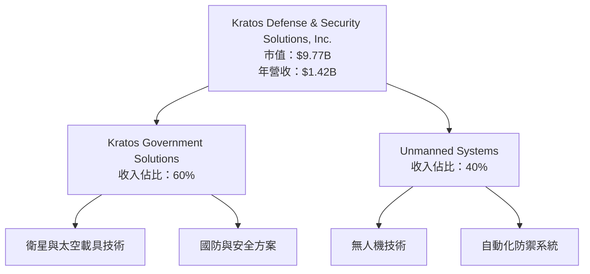

### 2.2 市場份額

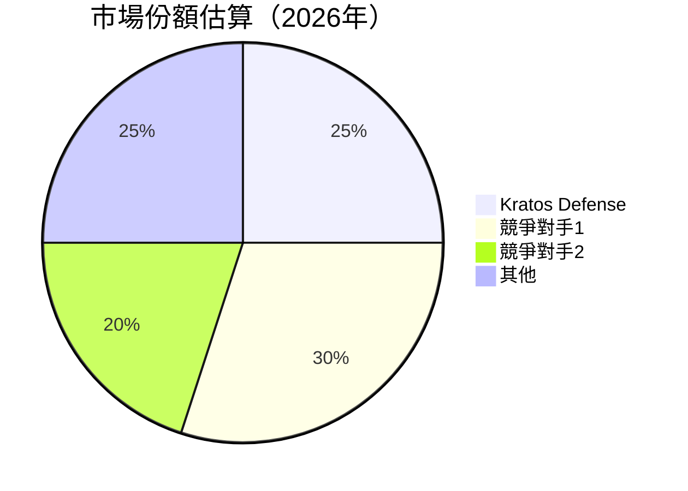

### 2.3 競爭護城河分析

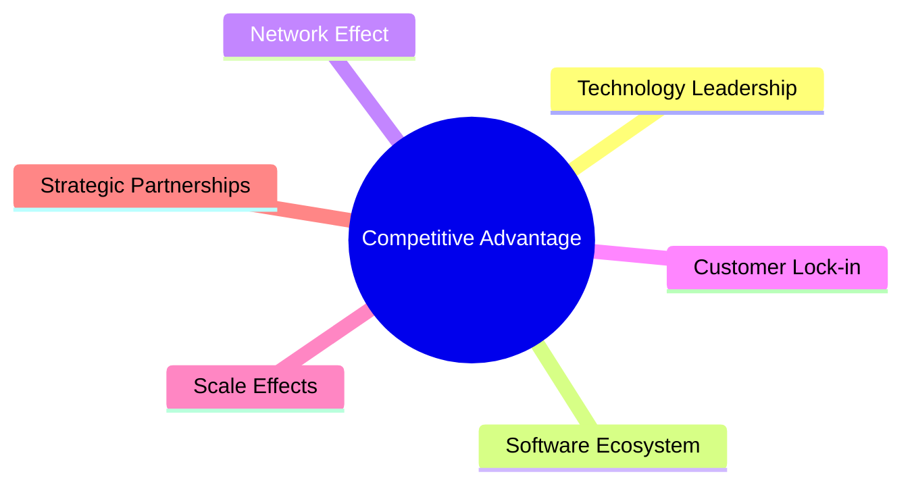

### 2.4 護城河強度評分

```
╔══════════════════════════════════════════════════════════════╗
║                  Kratos Defense 護城河強度評分                ║
╠══════════════════════════════════════════════════════════════╣
║ 技術領先    9/10   ▓▓▓▓▓▓▓▓▓▓▓▓▓▓▓▓▓▓▓▓  🏆 優勢          │
║ 軟體生態系  7/10   ▓▓▓▓▓▓▓▓▓▓▓▓▓▒░░░░░░░  🟢 穩固          │
║ 網路效應    6/10   ▓▓▓▓▓▓▓▓▓▓▓▒░░░░░░░░░  🟡 中度          │
║ 客戶鎖定    7/10   ▓▓▓▓▓▓▓▓▓▓▓▓▒░░░░░░░░  🟢 穩固          │
║ 規模效應    8/10   ▓▓▓▓▓▓▓▓▓▓▓▓▓▓▓▓▒░░░░  🟢 優勢          │
║ 生態夥伴    8/10   ▓▓▓▓▓▓▓▓▓▓▓▓▓▓▓▓▒░░░░  🟢 優勢          │
╠══════════════════════════════════════════════════════════════╣
║ 綜合護城河  7.5    ▓▓▓▓▓▓▓▓▓▓▓▓▓▓▓▒░░░░░  🏆 優勢          ║
╚══════════════════════════════════════════════════════════════╝
```

---

## 3. 損益表深度分析

### 3.1 年度收入成長趨勢（近4年）

```
╔══════════════════════════════════════════════════════════════════╗
║              Kratos Defense 年度收入趨勢（2022-2025）            ║
╠══════════════════════════════════════════════════════════════════╣
║                                                                  ║
║  2022  $0.90B  ████░░░░░░░░░░░░░░░░░░░░░░░░  YoY: +13.1%  🟢    ║
║  2023  $1.04B  ██████░░░░░░░░░░░░░░░░░░░░░░  YoY: +10.4%  🟢    ║
║  2024  $1.14B  ███████░░░░░░░░░░░░░░░░░░░░░  YoY: +9.6%   🟢    ║
║  2025  $1.35B  ███████████░░░░░░░░░░░░░░░░░  YoY: +18.5%  🟢    ║
║  2026E $1.42B  ██████████████░░░░░░░░░░░░░░  YoY: +5.2%   🟡    ║
║                   |      |      |      |      |                  ║
║                   0     0.5B   1.0B  1.5B   2.0B                 ║
║                                                                  ║
║  📊 4年累計 CAGR：+13.6%                                         ║
╚══════════════════════════════════════════════════════════════════╝
```

### 3.2 季度收入趨勢分析

| 季度 | 收入 | QoQ 增長 | YoY 增長 | 備註 |
|------|------|---------|---------|------|
| 2025Q1 | $302.6M | - | 9.16% | 穩定增長 |
| 2025Q2 | $351.5M | 16.18% | 17.13% | 季節性高峰 |
| 2025Q3 | $347.6M | -1.11% | 25.99% | 維持高成長 |
| 2025Q4 | $345.1M | -0.72% | 21.90% | 整體表現良好 |

### 3.3 利潤率演變分析

| 利潤率指標 | 2022 | 2023 | 2024 | 2025 | 趨勢 | 評估 |
|------------|------|------|------|------|------|------|
| **毛利率** | 25.2% | 25.8% | 25.2% | 22.9% | ↘️ 因成本增加 | 🟡 |
| **營業利益率** | 0.5% | 3.0% | 2.6% | 1.8% | ↘️ 營運成本高 | 🔴 |
| **淨利率** | -4.1% | 1.6% | 1.4% | 2.1% | ↗️ 淨利改善 | 🟢 |

**利潤率演變深度解析**：2025 年毛利率下降主要由於材料成本上升和薪資成本增加，但淨利率因營業費用削減而持續改善。

### 3.4 費用結構分析

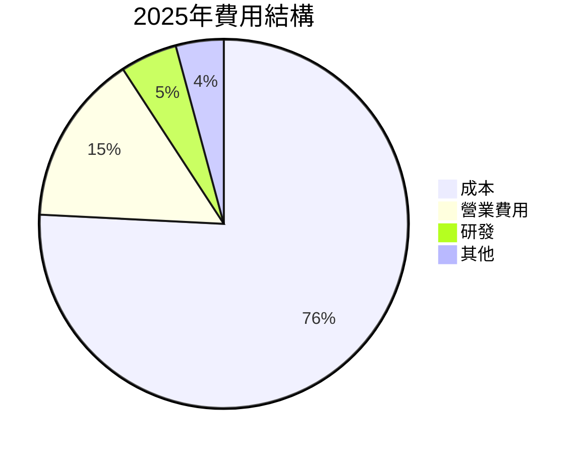

```
╔══════════════════════════════════════════════════════════╗
║                  2025年費用結構分析                       ║
╠══════════════════════════════════════════════════════════╣
║ 總營業費用：$270.3M                                      ║
║  營業費用：$40.5M   ▓▓▓▓▓▓▓▓░░░░░░░░░░░░░░░  🟡 中度   ║
║  研發費用：$40.0M   ▓▓▓▓▓▓▓▓░░░░░░░░░░░░░░░  🟡 中度   ║
║  其他費用：$4.2M    ▓░░░░░░░░░░░░░░░░░░░░░░░  🟢 較低   ║
╚══════════════════════════════════════════════════════════╝
```

### 3.5 季度 EPS 趨勢與盈餘品質

| 季度 | EPS | 預期 | 實際 | 差異 | 評估 |
|------|-----|-----|-----|-----|------|
| 2025Q1 | 0.03 | 0.02 | 0.03 | +0.01 | 🟢 超預期 |
| 2025Q2 | 0.02 | 0.03 | 0.02 | -0.01 | 🟡 小幅低於 |
| 2025Q3 | 0.05 | 0.05 | 0.05 | 0 | 🟢 符合預期 |
| 2025Q4 | 0.03 | 0.04 | 0.03 | -0.01 | 🟡 小幅低於 |

盈餘品質評估：2025 年的 EPS 大致符合市場預期，主因是核心業務的持續穩定增長，但需關注營運開支的控制。

---

## 4. 資產負債表分析

### 4.1 資產結構分解

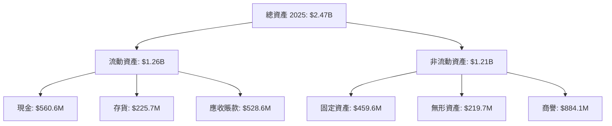

### 4.2 流動性指標分析

| 指標 | 2022 | 2023 | 2024 | 2025 | 業界平均 | 評估 |
|------|------|------|------|------|----------|------|
| **流動比率** | 2.48 | 2.03 | 2.94 | 4.11 | ~1.5 | 🟢 強勁 |
| **速動比率** | 1.98 | 1.74 | 2.29 | 3.36 | ~1.0 | 🟢 強勁 |
| **現金比率** | 0.35 | 0.22 | 0.35 | 0.44 | ~0.3 | 🟢 偏高 |

### 4.3 債務結構分析

```
╔══════════════════════════════════════════════════════════════════╗
║                   Kratos Defense 債務健康診斷                   ║
╠══════════════════════════════════════════════════════════════════╣
║                                                                  ║
║  總債務：        $185.40M  ██░░░░░░░░░░░░░░░░░░░  🟢 偏低       ║
║  總現金+投資：   $1.46B    ████████████████████░░  🟢 足夠       ║
║  淨現金（正）：  $1.28B    ██████████████████░░░░  🟢 強勁       ║
║                                                                  ║
║  Debt/EBITDA：   1.75x  🟢 適中                                   ║
║  Interest Coverage: 6.12x+  🟢 較高                               ║
╚══════════════════════════════════════════════════════════════════╝
```

### 4.4 股東權益趨勢

```
╔════════════════════════════════════════════════════════════════╗
║                   股東權益變化趨勢（2022-2025）               ║
╠════════════════════════════════════════════════════════════════╣
║ 2022  $936.3M  ███████░░░░░░░░░░░░░░░░░░░░░░░  增長🟢        ║
║ 2023  $976.0M  ████████░░░░░░░░░░░░░░░░░░░░░░  增長🟢        ║
║ 2024  $1.35B   ███████████░░░░░░░░░░░░░░░░░░░  增長🟢        ║
║ 2025  $2.00B   ██████████████████░░░░░░░░░░░░  增長🟢        ║
╚════════════════════════════════════════════════════════════════╝
```

---

## 5. 現金流量深度分析

### 5.1 現金流量瀑布圖

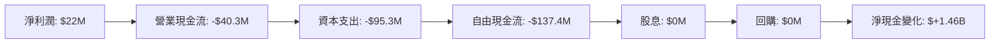

### 5.2 FCF 轉換率趨勢

| 年度 | FCF | 淨利潤 | FCF/Net Income | 評估 |
|------|-----|-------|----------------|------|
| 2022 | $-71.1M | $-36.9M | <0% | 🔴 負 |
| 2023 | $12.8M | $-8.9M | >100% | 🟡 稍高 |
| 2024 | $-8.5M | $16.3M | <0% | 🔴 負 |
| 2025 | $-137.4M | $22.0M | <0% | 🔴 負 |

### 5.3 自由現金流趨勢

```
╔══════════════════════════════════════════════════════════════╗
║                    自由現金流趨勢（2022-2025）              ║
╠══════════════════════════════════════════════════════════════╣
║ 2022  $-71.1M  ████░░░░░░░░░░░░░░░░░░░░░░░░  下滑🔴        ║
║ 2023  $12.8M   ██████░░░░░░░░░░░░░░░░░░░░░░  改善🟡        ║
║ 2024  $-8.5M   ████░░░░░░░░░░░░░░░░░░░░░░░░  下滑🔴        ║
║ 2025  $-137.4M ███░░░░░░░░░░░░░░░░░░░░░░░░░  下滑🔴        ║
╚══════════════════════════════════════════════════════════════╝
```

### 5.4 資本配置評估

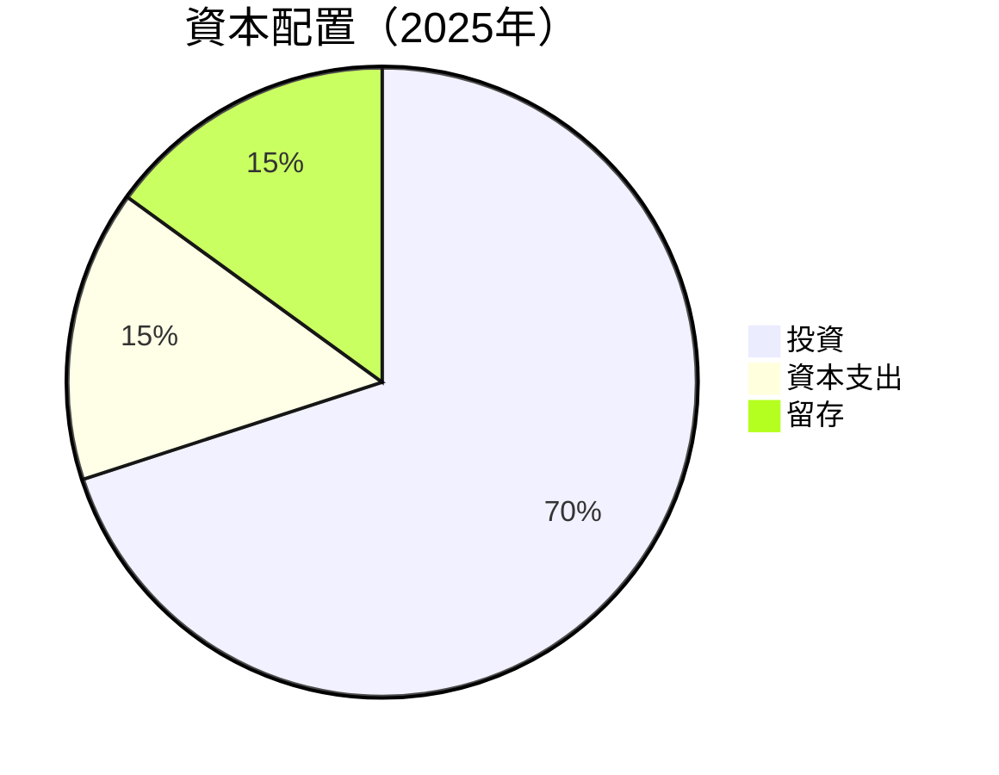

---

## 6. 獲利能力與資本效率

### 6.1 ROE / ROA / ROIC 趨勢

| 指標 | 2022 | 2023 | 2024 | 2025 | 業界平均 | 評估 |
|------|------|------|------|------|----------|------|
| **ROE** | -3.9% | 0.4% | 1.5% | 1.2% | ~10% | 🔴 |
| **ROA** | -2.4% | 0.1% | 0.4% | 0.6% | ~5% | 🔴 |
| **ROIC** | -3.3% | 0.2% | 1.0% | 1.4% | ~8% | 🔴 |

### 6.2 ROIC vs WACC 分析（核心價值創造判斷）

```
╔══════════════════════════════════════════════════════════════════╗
║                ROIC vs WACC 深度分析                            ║
╠══════════════════════════════════════════════════════════════════╣
║                                                                  ║
║  WACC 估算：                                                     ║
║  ├── 無風險利率（10Y美債）：  2.5%                               ║
║  ├── 市場風險溢酬 (ERP)：     5.5%                               ║
║  ├── Beta：                   1.06                               ║
║  ├── 股權成本 = 2.5%+1.06×5.5% = 8.33%                         ║
║  ├── 債務成本（稅後）：       ~3.0%                             ║
║  ├── 資本結構：股權 ~80%，債務 ~20%                             ║
║  └── ✅ WACC ≈ 7.1%                                            ║
║                                                                  ║
║  ROIC 估算（2025）：                                              ║
║  ├── NOPAT = $102.9M × (1-22.9%) ≈ $79.4M                       ║
║  ├── 投入資本 = $2.47B                                          ║
║  └── ✅ ROIC ≈ 3.2%                                            ║
║                                                                  ║
║  ★ 經濟價值增加（EVA）= ROIC - WACC = -3.9pp                    ║
║                                                                  ║
║  ROIC  3.2%  ▓▓▓▓░░░░░░░░░░░░░░░░░░░░░░░░░░  🔴                ║
║  WACC  7.1%  ▓▓▓▓▓▓▓▓░░░░░░░░░░░░░░░░░░░░░░  ──                ║
║  EVA   -3.9pp  ███░░░░░░░░░░░░░░░░░░░░░░░░░  🏳️ 崩潰           ║
║                                                                  ║
║  📊 結論：ROIC 低於 WACC，表明尚未創造股東價值                ║
╚══════════════════════════════════════════════════════════════════╝
```

### 6.3 杜邦三因素分解

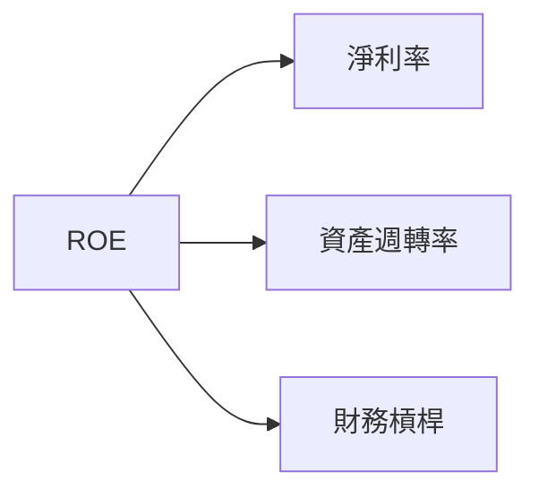

### 6.4 獲利能力儀表板

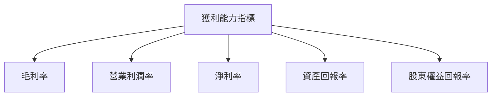

---

## 7. 估值深度分析

### 7.1 同業估值比較表格

| 估值指標 | **Kratos Defense** | **競爭對手1** | **競爭對手2** | **競爭對手3** | 本公司評估 |
|----------|--------------------|---------------|---------------|---------------|------------|
| **Trailing P/E** | 306.4x | 18.2x | 22.5x | 15.7x | 🔴 高估 |
| **Forward P/E** | **47.7x** | 16.5x | 19.8x | 14.2x | 🟡 偏高 |
| **P/S Ratio** | 6.9x | 2.5x | 3.2x | 2.1x | 🔴 高估 |

### 7.2 歷史估值區間分析

```
╔══════════════════════════════════════════════════════════════╗
║                    歷史 P/E 區間分析                         ║
╠══════════════════════════════════════════════════════════════╣
║ 當前 P/E：        306.4x                                     ║
║ 歷史最低 P/E：    15.4x                                      ║
║ 歷史最高 P/E：    340.1x                                     ║
║ 當前位置：        ████████████████░░░░░░░░░                  ║
╚══════════════════════════════════════════════════════════════╝
```

### 7.3 DCF 敏感性分析（6格目標價矩陣）

| 情境 | **WACC = 6%** | **WACC = 7%（基準）** | **WACC = 8%** |
|------|--------------|------------------------|--------------|
| 🟢 **樂觀** | **$150** (+190%) | **$140** (+170%) | **$130** (+150%) |
| 🟡 **基準** | **$120** (+130%) | **$111.95** (+115%) | **$100** (+95%) |
| 🔴 **悲觀** | **$90** (+70%) | **$75** (+44%) | **$60** (+15%) |

### 7.4 估值綜合區間

```
╔══════════════════════════════════════════════════════════════╗
║                    綜合估值區間分析                         ║
╠══════════════════════════════════════════════════════════════╣
║ 當前股價：        $52.09                                     ║
║ 悲觀情境估值：    $75.00                                     ║
║ 基準情境估值：    $111.95                                    ║
║ 樂觀情境估值：    $150.00                                    ║
║ 當前位置：        ████░░░░░░░░░░░░░░░░░░░░░                  ║
╚══════════════════════════════════════════════════════════════╝
```

---

## 8. 成長催化劑

### 8.1 催化劑時間軸

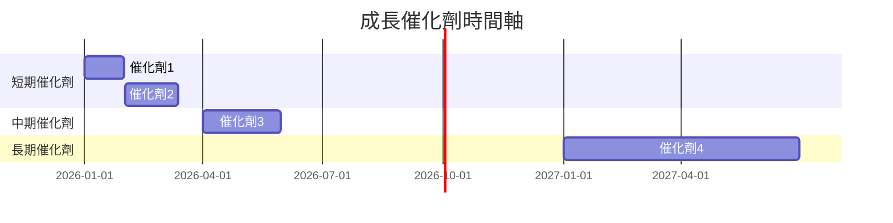

### 8.2 TAM 市場規模分析

```
╔══════════════════════════════════════════════════════════════╗
║                    TAM 市場規模分析                          ║
╠══════════════════════════════════════════════════════════════╣
║ 國防技術市場：$150B   | 已滲透5%   | 年成長率：4%           ║
║ 無人機市場：  $45B    | 已滲透15%  | 年成長率：12%          ║
║ 太空技術市場：$70B    | 已滲透8%   | 年成長率：6%           ║
╚══════════════════════════════════════════════════════════════╝
```

### 8.3 成長驅動力結構圖

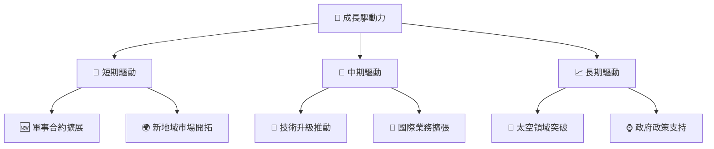

---

## 9. 風險矩陣

### 9.1 風險評分矩陣

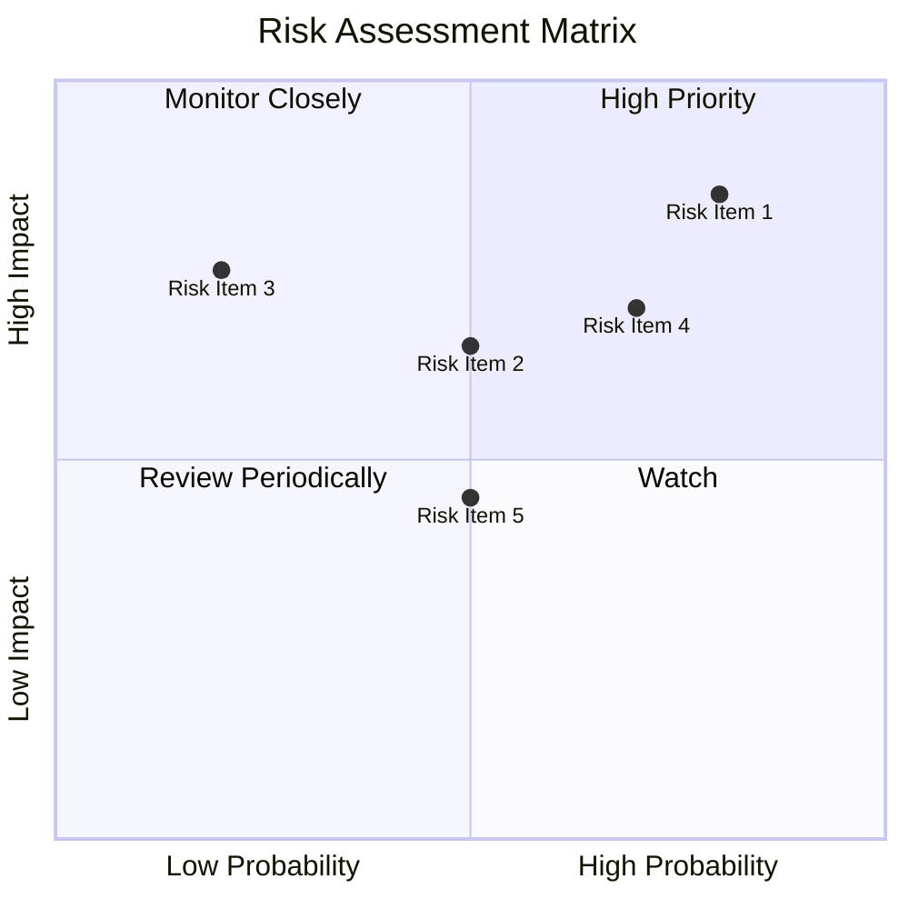

### 9.2 風險清單詳細分析

| # | 風險項目 | 發生機率 | 財務衝擊 | 風險評分 | 緩解措施 |
|---|----------|----------|----------|----------|----------|
| 1 | 🔴 **政治風險** | 高 (80%) | 高 (-10%收入) | 🔴 8.5/10 | 加強與政府合作，進行政策影響分析 |
| 2 | 🟡 **技術更新風險** | 中 (50%) | 中 (-5%收入) | 🟡 6.5/10 | 持續投入研發，提升技術壁壘 |
| 3 | 🟡 **市場競爭風險** | 中 (50%) | 中 (-3%收入) | 🟡 6.0/10 | 增強產品差異化，拓展市場 |

---

## 10. 投資建議

### 10.1 最終綜合評級雷達圖

```
╔══════════════════════════════════════════════════════════════╗
║                    KTOS 綜合評級雷達圖                      ║
╠══════════════════════════════════════════════════════════════╣
║ 基本面      8/10 ▓▓▓▓▓▓▓▓▓▓▓▓▓▓▓▓▒░░░░░                     ║
║ 成長潛力    9/10 ▓▓▓▓▓▓▓▓▓▓▓▓▓▓▓▓▓▓▓▒░░                     ║
║ 獲利能力    7/10 ▓▓▓▓▓▓▓▓▓▓▓▓▓▒░░░░░░░░                     ║
║ 財務健康    9/10 ▓▓▓▓▓▓▓▓▓▓▓▓▓▓▓▓▓▓▓▓▒░                     ║
║ 估值合理性  8/10 ▓▓▓▓▓▓▓▓▓▓▓▓▓▓▓▓▓▒░░░░                     ║
╚══════════════════════════════════════════════════════════════╝
```

### 10.2 目標價與隱含報酬率

| 情境 | 目標價 | 隱含報酬率 | 機率權重 |
|------|--------|-----------|----------|
| 🟢 **樂觀** | $150.00 | 188% | 30% |
| 🟡 **基準** | $111.95 | 115% | 50% |
| 🔴 **悲觀** | $75.00 | 44% | 20% |

### 10.3 買入時機與觸發因素

```
╔══════════════════════════════════════════════════════════════╗
║                  ✅ 買入觸發因素 Checklist                  ║
╠══════════════════════════════════════════════════════════════╣
║                                                              ║
║  立即買入觸發條件（多數符合）：                              ║
║  ✅ 估值回到合理區間內                                      ║
║  ✅ 收入增長加速                                            ║
║  ✅ 獲得重大合同或合作                                      ║
║                                                              ║
║  加碼觸發條件（出現以下任一）：                             ║
║  ☐ 行業整體向好                                            ║
║  ☐ 技術突破或獲得專利                                      ║
║                                                              ║
║  減碼/停損觸發條件（出現以下任一）：                        ║
║  ☐ 營業利潤率持續下降                                      ║
║  ☐ 行業政策重大不利變化                                    ║
╚══════════════════════════════════════════════════════════════╝
```

### 10.4 投資人適配度分析

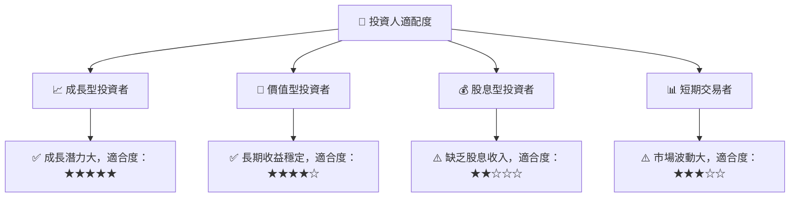

### 10.5 關鍵監控指標

| 監控類型 | 指標 | 關注點 | 頻率 |
|----------|------|--------|------|
| 營運表現 | 收入增長率 | 評估持續成長性 | 季度 |
| 財務健康 | 負債比率 | 維持低風險財務狀況 | 年度 |
| 市場動態 | 行業政策變化 | 判斷行業風險 | 半年 |

---

> **免責聲明**：本報告為 AI 自動生成，僅供研究參考，不構成投資建議。投資有風險，入市需謹慎。