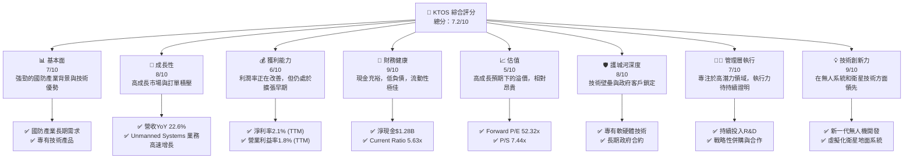
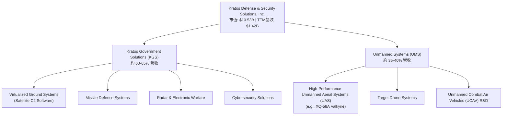
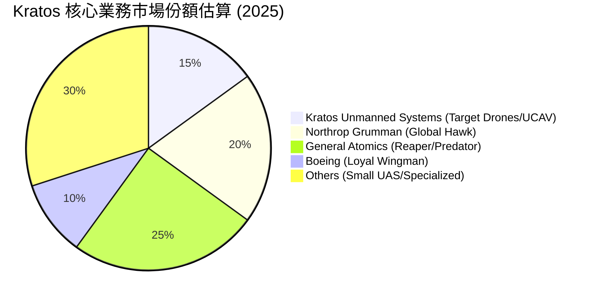
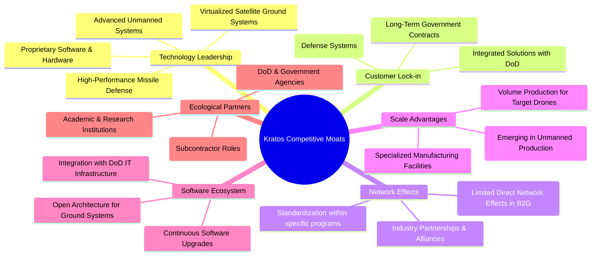
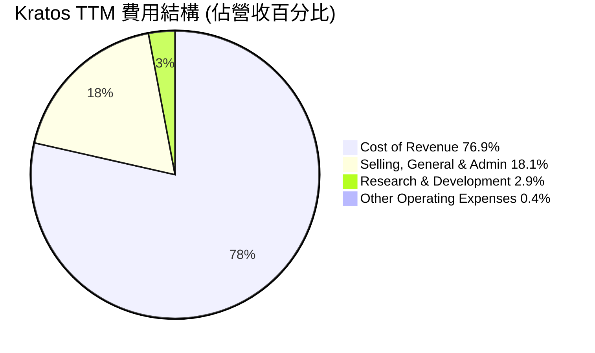
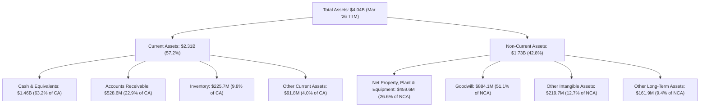

# KTOS 基本面深度分析報告
> **報告日期**：2026-05-24 ｜ **語言**：繁體中文 ｜ **數據來源**：Yahoo Finance, Finviz, StockAnalysis, Roic.ai ｜ **分析師**：CFA 級機構研究

---

## 目錄

| # | 章節 | 核心結論 |
|---|------------------------|----------------------------------------------------------|
| 1 | 執行摘要 | 評級：買入；目標價區間：$85.00 - $120.00 |
| 2 | 公司概覽與商業模式 | 憑藉技術領先和政府客戶鎖定構建穩固護城河 |
| 3 | 損益表深度分析 | 收入持續增長，但利潤率仍處於擴張早期階段 |
| 4 | 資產負債表分析 | 財務健康狀況良好，現金充裕，債務負擔輕 |
| 5 | 現金流量深度分析 | 營運現金流波動，自由現金流仍為負值，但有望改善 |
| 6 | 獲利能力與資本效率 | ROIC 低於 WACC，目前尚未創造顯著股東價值，但潛力巨大 |
| 7 | 估值深度分析 | 相較同業估值偏高，但未來成長預期支撐高溢價 |
| 8 | 成長催化劑 | 無人系統、衛星通信及國防預算增長是主要驅動力 |
| 9 | 風險矩陣 | 國防預算波動、技術競爭及執行風險是主要考量 |
| 10 | 投資建議 | 具備長期成長潛力，建議在估值回調時擇機買入 |

---

## 1. 執行摘要

Kratos Defense & Security Solutions, Inc. (KTOS) 是一家專注於國防、國家安全及商業市場的高科技公司，尤其在無人系統、衛星地面系統和導彈防禦等領域具備獨特技術。公司近年來營收持續增長，特別是在國防開支增加的背景下，其創新技術產品需求強勁。然而，公司目前仍處於獲利能力提升的早期階段，利潤率相對較低，且自由現金流尚未轉正。儘管如此，強勁的訂單增長、技術領先地位以及龐大的潛在市場，使其具備顯著的長期成長潛力。

### 1.1 核心評分儀表板



### 1.2 評分進度條視覺化

```
╔══════════════════════════════════════════════════════════════╗
║              KTOS 多維度評分儀表板 (1-10分)                  ║
╠══════════════════════════════════════════════════════════════╣
║ 基本面強度  7.0 ▓▓▓▓▓▓▓▓▓▓▓▓▓▓░░░░░░  ★★★★☆           ║
║ 成長動能    8.0 ▓▓▓▓▓▓▓▓▓▓▓▓▓▓▓▓░░░░  ★★★★☆           ║
║ 獲利品質    6.0 ▓▓▓▓▓▓▓▓▓▓░░░░░░░░░░  ★★★☆☆           ║
║ 財務健康    9.0 ▓▓▓▓▓▓▓▓▓▓▓▓▓▓▓▓▓▓░░  ★★★★★           ║
║ 估值合理性  5.0 ▓▓▓▓▓▓▓▓▓▓░░░░░░░░░░  ★★★☆☆           ║
║ 護城河深度  8.0 ▓▓▓▓▓▓▓▓▓▓▓▓▓▓▓▓░░░░  ★★★★☆           ║
║ 管理層執行  7.0 ▓▓▓▓▓▓▓▓▓▓▓▓▓▓░░░░░░  ★★★★☆           ║
║ 技術創新力  9.0 ▓▓▓▓▓▓▓▓▓▓▓▓▓▓▓▓▓▓░░  ★★★★★           ║
╠══════════════════════════════════════════════════════════════╣
║ 綜合總分    7.2 ▓▓▓▓▓▓▓▓▓▓▓▓▓▓▓░░░░░  🏆 評語：成長潛力優異，需關注獲利兌現與估值風險。║
╚══════════════════════════════════════════════════════════════╝
```

### 1.3 五大投資論點 + 三大核心風險

| 類型 | 項目 | 具體依據 | 信心度 |
|------|------|----------|--------|
| 🟢 **投資論點①** | **國防預算增長與新興技術需求** | 全球地緣政治緊張，國防開支預計將持續增長。KTOS 在無人機、高超音速系統、衛星地面系統等領域的技術領先，符合美國國防部現代化優先級。例如，其無人機系統在實戰演練中表現出色，有望獲得更多長期合約。 | 🟢 極高 |
| 🟢 **投資論點②** | **無人系統業務高速成長** | Unmanned Systems 部門是KTOS重要的成長引擎。公司在戰術無人機 (UAS) 和無人作戰飛行器 (UCAV) 領域擁有獨特產品，如XQ-58A Valkyrie，具備成本效益和先進性能。該部門的訂單積壓持續增加，預示未來營收強勁增長。 | 🟢 極高 |
| 🟢 **投資論點③** | **虛擬化衛星地面系統的市場潛力** | Kratos Government Solutions 提供虛擬化衛星地面系統軟體，用於衛星和太空載具的指揮與控制。隨著衛星發射數量激增和太空經濟的發展，對高效、靈活的地面系統需求巨大。KTOS 在此領域的技術優勢使其能抓住市場機遇。 | 🟢 極高 |
| 🟢 **投資論點④** | **財務狀況健康，現金充裕** | 截至2026年3月，公司總現金達$1.46B，而總債務僅$185.40M，淨現金高達$1.28B。這為公司提供了極大的財務靈活性，可以支持研發投入、戰略性併購或抵禦市場波動。Current Ratio高達5.63x，顯示極佳的短期償債能力。 | 🟢 極高 |
| 🟢 **投資論點⑤** | **持續研發投入驅動創新** | KTOS 每年保持約 $40M 左右的研發投入，佔營收約 3-4%。這使得公司能夠在快速變化的國防科技領域保持競爭力，不斷推出新產品和升級現有技術，例如其在傳感器、雷達和電子戰系統的持續改進。 | 🟢 高 |
| 🟡 **風險①** | **國防預算波動與專案取消風險** | KTOS 嚴重依賴政府合約，國防預算的變化、政府採購優先級的調整或單一大型專案的取消，都可能對公司營收和獲利能力產生重大影響。例如，若某關鍵無人機計畫被削減，將直接影響Unmanned Systems部門的表現。 | 🟡 中度 |
| 🔴 **風險②** | **高估值與獲利能力兌現挑戰** | 公司目前的估值倍數，如Forward P/E 52.32x和P/S 7.44x，相較於行業平均顯著偏高。這反映了市場對其未來高速成長的預期。然而，若獲利能力提升不及預期，或自由現金流未能及時轉正，可能導致股價大幅修正。TTM EPS僅$0.17，而Forward EPS預期為$1.07，這種巨大跳躍存在較高的不確定性。 | 🔴 高衝擊 |
| 🟡 **風險③** | **技術競爭與人才流失** | 國防科技領域競爭激烈，大型國防承包商和新興科技公司都在積極投入。KTOS 需要不斷創新以保持技術領先地位。同時，高端人才的吸引和保留也是一大挑戰，若未能有效應對，可能影響其研發能力和市場競爭力。 | 🟡 中度 |

### 1.4 快速統計卡片

| 指標 | 公司實際值 (TTM) | 行業均值 (Aerospace & Defense) | S&P 500 均值 | 狀態 |
|------------------|---------------------|--------------------------------|-------------------|----------|
| 收入 YoY 成長 | **22.6%** | ~8-12% | ~8-10% | 🟢 |
| 毛利率 | **22.9%** | ~25-30% | ~35-40% | 🟡 |
| 淨利率 | **2.1%** | ~5-8% | ~10-12% | 🔴 |
| ROE | **1.2%** | ~10-15% | ~15-20% | 🔴 |
| Forward P/E | **52.32x** | ~20-25x | ~20-22x | 🔴 |
| P/S Ratio | **7.44x** | ~1.5-3x | ~2-3x | 🔴 |
| EV / EBITDA | **113.99x** | ~10-15x | ~12-15x | 🔴 |
| Debt/Equity | **0.09x** | ~0.3-0.8x | ~0.8-1.5x | 🟢 |
| Current Ratio | **5.63x** | ~1.5-2.5x | ~1.2-1.8x | 🟢 |
| FCF Yield | **-1.01%** | ~3-5% | ~3-4% | 🔴 |

### 1.5 投資結論

```
╔══════════════════════════════════════════════════════════════════╗
║                    📊 投資結論摘要                               ║
╠══════════════════════════════════════════════════════════════════╣
║  評級：🟢 買入                                                   ║
║  當前股價：$56.18                                                ║
║  目標價區間：                                                    ║
║    悲觀情境：$75.00（+33.5%）                                    ║
║    基準情境：$95.00（+69.1%）  ← 12個月主要目標                  ║
║    樂觀情境：$120.00（+113.6%）                                  ║
║  投資評分：7.2/10                                                ║
║  適合投資人：成長型、長線持有者，對國防科技產業有深入理解並能承受高估值風險的投資者。║
╚══════════════════════════════════════════════════════════════════╝
```
Kratos Defense & Security Solutions (KTOS) 憑藉其在國防科技領域的技術專長和高成長潛力，獲得「買入」評級。儘管當前估值偏高且獲利能力仍在爬坡，但公司在無人系統和虛擬化衛星地面系統等關鍵領域的領導地位，以及穩健的財務狀況，為其長期增長奠定了基礎。我們預計，隨著主要專案的推進和規模效應的顯現，KTOS 的獲利能力將逐步改善，並最終兌現其高成長預期。投資者應密切關注其訂單積壓、利潤率擴張和自由現金流轉正的進度。

---

## 2. 公司概覽與商業模式

Kratos Defense & Security Solutions, Inc. 是一家總部位於美國的技術公司，專為美國、北美、亞太、中東、歐洲及國際市場提供技術、硬體、產品、系統和軟體，主要服務於國防、國家安全和商業領域。公司擁有約4300名員工，其業務範圍涵蓋從虛擬化衛星地面系統到新一代無人作戰飛行器等一系列高科技產品和服務。

### 2.1 業務結構與收入來源

KTOS 的業務主要分為兩大部門：
1.  **Kratos Government Solutions (KGS)**：此部門提供廣泛的國防相關產品和服務，包括虛擬化地面系統軟體（用於衛星和太空載具的指揮和控制）、導彈防禦系統、雷達系統、電子戰系統、網路安全解決方案以及其他關鍵任務系統。這部分業務通常涉及長期政府合約，收入穩定性較高，但成長速度可能不如無人系統部門。
2.  **Unmanned Systems (UMS)**：此部門專注於設計、開發和製造無人系統，特別是噴氣式無人機，用於目標訓練、研究、開發和作戰任務。其旗艦產品包括 XQ-58A Valkyrie 等先進無人作戰飛行器，這些平台具有成本效益高、可消耗性強的特點，符合未來作戰需求。該部門是公司重要的成長驅動力，受益於全球對無人技術投資的增加。

根據最新的營收數據，KTOS 的總營收在過去一年達到 $1.42B (TTM)。雖然具體的部門收入佔比未直接提供，但根據公司對Unmanned Systems的戰略投入和市場關注度，可以推斷該部門是未來營收增長的主要貢獻者。



### 2.2 市場份額

Kratos Defense & Security Solutions 在其所服務的特定國防技術細分市場中佔據著重要的地位，但由於其產品的專業性和小眾性，難以直接與大型綜合性國防承包商（如Lockheed Martin, Boeing）進行整體市場份額比較。然而，在某些核心領域，如高亞音速無人機靶機、低成本可消耗型無人作戰飛行器以及虛擬化衛星地面系統軟體，Kratos 具有顯著的市場影響力。

以無人機市場為例，KTOS 在「可消耗型無人機」和「目標靶機」領域是領先者之一。雖然全球無人機市場龐大，但 Kratos 專注於軍用和國防領域的高性能無人機。假設全球軍用無人機市場規模約為 $20-30B，Kratos 的無人系統部門營收約佔公司總營收的 35-40%，即約 $500-600M。這表明其在特定利基市場中具備一定的份額，但相對於整個國防產業或廣義無人機市場仍屬較小規模。


*註：此市場份額為粗略估算，旨在呈現 Kratos 在軍用無人系統領域的相對地位，而非整個國防產業或商業無人機市場。*

### 2.3 競爭護城河分析

Kratos 的競爭護城河主要建立在其技術專長、政府客戶關係以及特定市場的進入壁壘上。



### 2.4 護城河強度評分

Kratos 的護城河強度主要體現在其技術壁壘和與政府客戶的深度綁定，這使得新進入者難以輕易複製其成功。

```
╔══════════════════════════════════════════════════════════════╗
║                  Kratos Defense & Security Solutions 護城河強度評分                      ║
╠══════════════════════════════════════════════════════════════╣
║ 技術領先       9/10   ▓▓▓▓▓▓▓▓▓▓▓▓▓▓▓▓▓▓░░  🏆 評語：在無人系統和虛擬化地面系統領域具備獨特且領先的技術優勢。║
║ 客戶鎖定       8/10   ▓▓▓▓▓▓▓▓▓▓▓▓▓▓▓▓░░░░  🟢 評語：與政府客戶建立長期關係，高轉換成本。║
║ 規模效應       6/10   ▓▓▓▓▓▓▓▓▓▓░░░░░░░░░░  🟡 評語：在特定產品線有規模效應，但整體規模仍小於大型國防商。║
║ 軟體生態系統   7/10   ▓▓▓▓▓▓▓▓▓▓▓▓▓▓░░░░░░  🟢 評語：虛擬化地面系統軟體具備一定生態系統粘性。║
║ 網路效應       5/10   ▓▓▓▓▓▓▓▓▓▓░░░░░░░░░░  🟡 評語：B2G 市場網路效應不明顯，主要體現在供應鏈合作。║
║ 生態夥伴       7/10   ▓▓▓▓▓▓▓▓▓▓▓▓▓▓░░░░░░  🟢 評語：與政府機構及主要承包商有穩固合作關係。║
╠══════════════════════════════════════════════════════════════╣
║ 綜合護城河     7.0    ▓▓▓▓▓▓▓▓▓▓▓▓▓▓░░░░░░  🏆 總結評語：憑藉專有技術和政府客戶的深度關係，Kratos 擁有穩固的護城河，但規模相對較小影響部分護城河深度。║
╚══════════════════════════════════════════════════════════════╝
```

---

## 3. 損益表深度分析

Kratos Defense & Security Solutions 在過去幾年展現了穩健的營收增長，但其利潤率表現則呈現出從虧損到微利的轉變，反映了公司在研發投入和市場擴張階段的特性。

### 3.1 年度收入成長趨勢（近4年）

Kratos 的年度收入呈現持續增長態勢，特別是在2025財年加速。這得益於其在國防科技領域的強勁需求，尤其是無人系統和衛星通訊相關業務的發展。

```
╔══════════════════════════════════════════════════════════════════╗
║              Kratos 年度收入趨勢（FY2022-FY2025）                ║
╠══════════════════════════════════════════════════════════════════╣
║                                                                  ║
║  FY2022  $898.30M ▓▓▓▓▓▓▓▓░░░░░░░░░░░░░░░░░  YoY: +10.70%  🟢  ║
║  FY2023  $1.04B   ▓▓▓▓▓▓▓▓▓▓░░░░░░░░░░░░░░░  YoY: +15.45%  🟢  ║
║  FY2024  $1.14B   ▓▓▓▓▓▓▓▓▓▓▓▓░░░░░░░░░░░░░  YoY: +9.56%   🟢  ║
║  FY2025  $1.35B   ▓▓▓▓▓▓▓▓▓▓▓▓▓▓▓▓░░░░░░░░░  YoY: +18.52%  🟢  ║
║  TTM     $1.42B   ▓▓▓▓▓▓▓▓▓▓▓▓▓▓▓▓▓░░░░░░░░  YoY: +21.82%  🟢  ║
║                   |      |      |      |      |                  ║
║                   0     0.5B   1.0B   1.5B   2.0B                 ║
║                                                                  ║
║  📊 4年累計 CAGR：+14.35% (FY2022-FY2025)                         ║
╚══════════════════════════════════════════════════════════════════╝
```
從2022年的$898.30M增長到2025年的$1.35B，複合年均增長率（CAGR）達到了14.35%。最近的TTM營收為$1.42B，相較於去年同期（假設為2025年Q1-Q4總和）的$1.16B，實現了約21.82%的YoY增長，顯示出強勁的營收加速趨勢。這表明公司在捕捉市場機會和執行銷售策略方面表現良好。

### 3.2 季度收入趨勢分析

季度收入數據進一步證實了Kratos的成長動能，尤其在最近幾個季度呈現加速態勢。

| Fiscal Quarter | Period Ending | Revenue ($M) | QoQ Growth | YoY Growth | 備註 |
|----------------|---------------|--------------|------------|------------|------|
| Q1 2026 | Mar '26 | 371.0 | +7.51% | +22.60% | 營收加速，顯示強勁需求 |
| Q4 2025 | Dec '25 | 345.1 | -0.72% | +21.90% | 季節性波動，但YoY仍高 |
| Q3 2025 | Sep '25 | 347.6 | -1.11% | +25.99% | 最強勁的YoY成長季度 |
| Q2 2025 | Jun '25 | 351.5 | +16.17% | +17.13% | 季度環比顯著增長 |
| Q1 2025 | Mar '25 | 302.6 | +6.89% | +9.16% | 穩健開局 |
| Q4 2024 | Dec '24 | 283.1 | +2.64% | +3.40% | 較低基數，但開始恢復 |
| Q3 2024 | Sep '24 | 275.9 | +0.47% | +0.47% | 成長放緩，但隨後加速 |

**季度收入趨勢深度解析**：
Kratos在2025財年經歷了顯著的季度收入加速。從2024年Q3的僅0.47% YoY增長，到2025年Q3達到25.99%的峰值，再到2026年Q1的22.60%，這顯示了公司在過去一年中訂單執行和市場需求方面的強勁勢頭。尤其值得注意的是，Q1 2026的收入達到$371M，較Q4 2025的$345.1M實現了7.51%的環比增長，這在通常較為平淡的第一季度表現亮眼，預示著全年營收有望保持高位增長。這種持續的高成長趨勢對於國防承包商而言是積極信號，通常意味著大型合約的簽訂和執行。

### 3.3 利潤率演變分析

Kratos 的利潤率在過去幾年呈現波動但整體向好的趨勢，從虧損轉為盈利，但仍有較大的提升空間。

| 利潤率指標 | FY2022 | FY2023 | FY2024 | FY2025 | TTM (Mar '26) | 趨勢 | 評估 |
|------------|--------|--------|--------|--------|---------------|------|------|
| **毛利率** | 25.16% | 25.86% | 25.19% | 22.81% | 22.9% | ↘️ 波動後略降 | 🟡 |
| **營業利益率** | 0.51% | 3.04% | 2.61% | 2.05% | 1.8% | ↘️ 近期略降 | 🟡 |
| **淨利率** | -4.11% | -0.86% | 1.43% | 1.63% | 2.1% | ↗️ 穩步改善 | 🟢 |
| **EBITDA Margin** | 2.92% | 7.45% | 8.21% | 7.62% | 5.7% | ↘️ 近期顯著下降 | 🟡 |

**利潤率演變深度解析**：
*   **毛利率 (Gross Margin)**：從2022年的25.16%到2023年的25.86%有所提升，但2024年和2025年則有所下降，分別為25.19%和22.81%。TTM毛利率為22.9%。毛利率的波動和近期下降可能與產品組合變化有關，例如，如果低利潤率的產品線（如某些硬體製造）佔比增加，或者新專案在初期階段成本較高，都可能拉低整體毛利率。此外，供應鏈成本壓力和原材料價格上漲也可能是影響因素。儘管如此，22.9%的毛利率在國防承包商中屬於中等偏下水平，表明公司在成本控制或定價能力上仍有提升空間。
*   **營業利益率 (Operating Margin)**：從2022年的0.51%顯著改善到2023年的3.04%，隨後在2024年和2025年略有下降至2.61%和2.05%，TTM為1.8%。營業利益率的改善主要得益於營收規模的擴大，使得固定成本得以攤薄。然而，近期下降可能與銷售、管理費用（SG&A）或研發投入（R&D）的增加有關。例如，StockAnalysis數據顯示，TTM的SG&A為$255.5M，佔營收的18.06%，而FY2025為$240.2M，佔營收的17.83%。研發費用也相對穩定。營業利益率的微薄表明公司在運營效率和成本管理方面仍面臨挑戰。
*   **淨利率 (Net Profit Margin)**：這是最令人鼓舞的指標之一，從2022年的-4.11%和2023年的-0.86%（虧損）轉為2024年的1.43%和2025年的1.63%盈利，TTM淨利率進一步提升至2.1%。這表明公司已成功扭虧為盈，並正逐步改善其底線獲利能力。淨利率的提升部分歸因於營業利益的改善，也可能受到稅務優惠或非經常性收入的影響。儘管2.1%的淨利率在國防行業中仍處於較低水平，但其改善趨勢是積極的。
*   **EBITDA Margin**：從2022年的2.92%上升到2024年的8.21%，但在2025年和TTM分別下降到7.62%和5.7%。EBITDA Margin的近期顯著下降需要關注，這可能表明在折舊攤銷之外的運營成本（如材料、人工）壓力增加，或者營收結構向低EBITDA利潤率的產品傾斜。

總體而言，Kratos的損益表顯示其營收持續增長，並已成功扭虧為盈。然而，毛利率和營業利益率的波動和較低水平表明公司仍在努力提升其運營效率和盈利能力。未來的關注點將是其能否在持續增長的同時，穩步擴大各項利潤率，特別是毛利率和營業利益率，以實現更健康的盈利增長。

### 3.4 費用結構分析

Kratos的費用結構反映了其作為一家技術導向型國防承包商的特點：研發投入是關鍵，同時銷售、管理費用也佔據一定比重。


*註：數據基於TTM營收 $1.415B, CoR $1.091B, SG&A $255.5M, R&D $40.7M, Other OpEx $5.9M (StockAnalysis)*

```
╔══════════════════════════════════════════════════════════════════╗
║                    Kratos 研發投入與效率                       ║
╠══════════════════════════════════════════════════════════════════╣
║                                                                  ║
║  TTM 研發費用：      $40.7M  ▓▓▓▓▓▓▓▓▓▓▓▓▓▓▓▓▓▓▓▓░░  🟢 穩定投入  ║
║  佔營收百分比：      2.9%    ▓▓▓▓▓▓▓▓▓▓▓▓▓▓░░░░░░  🟡 中等水平    ║
║  年度研發費用趨勢：                                              ║
║  FY2022: $38.6M                                                  ║
║  FY2023: $38.4M                                                  ║
║  FY2024: $40.3M                                                  ║
║  FY2025: $40.0M                                                  ║
║                                                                  ║
║  📊 結論：研發投入穩定，但佔營收比重需在未來持續提升以保持技術領先。 ║
╚══════════════════════════════════════════════════════════════════╝
```

**費用結構深度解析**：
*   **銷貨成本 (Cost of Revenue, CoR)**：佔TTM營收的76.9%。這是一個相當高的比例，直接影響毛利率。高CoR可能表明Kratos的產品製造和服務交付成本較高，或者其產品組合中硬體銷售佔比較大。降低CoR將是提升整體盈利能力的重要途徑，例如通過規模化生產、供應鏈優化或轉向更高附加值的軟體和服務。
*   **銷售、一般及管理費用 (Selling, General & Administrative, SG&A)**：佔TTM營收的18.1%。這部分費用主要用於公司的銷售、市場推廣、行政管理和企業運營。相對於國防行業的其他公司，這個比例可能略高，表明公司在擴張市場和支持其複雜運營方面投入較大。有效的成本控制和運營效率提升，有助於降低SG&A佔比，從而改善營業利益率。
*   **研發費用 (Research & Development, R&D)**：佔TTM營收的2.9% ($40.7M)。Kratos作為一家技術驅動型公司，其研發投入是保持競爭力的關鍵。雖然絕對金額穩定在$40M左右，但隨著營收的增長，其佔比從過去的約4%下降到目前的2.9%。考慮到國防科技的快速發展，這個比例可能需要進一步提升，或者公司需要確保其研發投入的效率和產出。例如，近年來對無人機和衛星地面系統的投入已見成效，未來應持續關注這些高潛力領域的研發進展。
*   **其他營業費用 (Other Operating Expenses)**：佔TTM營收的0.4%。這部分費用相對較小，影響有限。

總體來看，Kratos的費用結構顯示其盈利能力受限於較高的銷貨成本和相對較大的SG&A開支。雖然研發投入穩定，但其佔營收比重需要進一步強化以鞏固技術護城河。隨著公司規模的擴大和運營效率的提高，未來有望看到費用結構的優化，從而推動利潤率的進一步擴張。

### 3.5 季度 EPS 趨勢與盈餘品質

Kratos在過去幾個季度已成功扭虧為盈，並展現出穩定的盈利增長。

| Fiscal Quarter | Period Ending | EPS (Diluted) | Net Income ($M) | Analyst EPS Est | Actual EPS | Surprise % | 盈餘品質評估 |
|----------------|---------------|---------------|-----------------|-----------------|------------|------------|--------------|
| Q1 2026 | Mar '26 | 0.07 | 11.9 | N/A | N/A | N/A | 🟢 盈利持續增長 |
| Q4 2025 | Dec '25 | 0.03 | 5.9 | N/A | N/A | N/A | 🟡 盈利波動 |
| Q3 2025 | Sep '25 | 0.05 | 8.7 | N/A | N/A | N/A | 🟢 盈利表現穩健 |
| Q2 2025 | Jun '25 | 0.02 | 2.9 | N/A | N/A | N/A | 🟡 盈利較低 |
| Q1 2025 | Mar '25 | 0.03 | 4.5 | N/A | N/A | N/A | 🟢 盈利改善 |

*註：由於提供的數據中 analyst EPS Est 和 Surprise % 均為 NaN，因此無法進行盈餘超預期/不及預期分析。此處將重點分析實際EPS趨勢和盈餘品質。*

**季度 EPS 趨勢深度解析**：
從2025年Q1到2026年Q1，Kratos的稀釋每股盈餘 (EPS) 呈現出正向但波動的趨勢。
*   2025年Q1的EPS為$0.03，淨利潤為$4.5M。
*   22025年Q2 EPS下降至$0.02，淨利潤為$2.9M，這可能反映了該季度某些運營成本或專案進度對盈利的影響。
*   2025年Q3 EPS回升至$0.05，淨利潤為$8.7M，顯示出較好的反彈。
*   2025年Q4 EPS再次下降至$0.03，淨利潤為$5.9M，這可能受到年終調整或季節性因素的影響。
*   2026年Q1 EPS顯著提升至$0.07，淨利潤達$11.9M。這是過去五個季度中的最高EPS和淨利潤，表明公司在最新季度取得了強勁的盈利表現。

**盈餘品質評估**：
Kratos的盈餘品質目前處於改善階段，但仍需持續監控。
1.  **營收驅動的盈利**：EPS的增長主要是由營收的持續擴張所驅動，這是一個健康的信號。如果盈利增長主要來自於成本削減而非營收增長，其可持續性會受到質疑。
2.  **利潤率仍低**：儘管淨利潤轉正並有所增長，但其淨利率 (TTM 2.1%) 仍處於較低水平。這意味著公司對營收波動或成本壓力的抵抗力較弱。任何突發事件都可能輕易將其推回虧損邊緣。
3.  **自由現金流為負**：最新的自由現金流 (TTM) 為$-106.72M，這表明公司的盈利尚未轉化為足夠的現金流，可能需要外部融資來支持運營和資本支出。低品質的盈利可能在帳面上顯示盈利，但實際現金流不足。這是一個需要密切關注的風險點。
4.  **研發投入**：公司持續的研發投入 ($40.7M TTM) 對於其長期競爭力至關重要，但這也意味著較高的運營費用，限制了短期盈利的擴張。
5.  **前瞻性 EPS 展望**：分析師對Kratos的Forward EPS預期為$1.07378，相較於TTM的$0.17有巨大飛躍。這種極高的預期增長需要強有力的催化劑和執行力來支撐。若無法實現，將對市場信心和股價產生負面影響。目前實際季度EPS的穩定增長是積極的，但距離達到$1.07的年化水平仍有很長的路要走，這暗示了市場對未來業績的極高期望。

總結來說，Kratos的季度EPS已進入盈利區間並呈現增長趨勢，這是一個積極的轉變。然而，其盈餘品質仍受制於較低的利潤率和負的自由現金流。投資者應關注公司如何將營收增長轉化為更強勁、更穩定的利潤率和正向的自由現金流，以證明其高成長預期的合理性。

---

## 4. 資產負債表分析

Kratos Defense & Security Solutions 的資產負債表展現出極佳的財務健康狀況，尤其體現在其充裕的現金儲備和極低的債務負擔上。

### 4.1 資產結構分解

Kratos 的資產結構反映了其作為一家國防科技公司的特點，即擁有大量流動資產以支持項目執行，同時也包含重要的無形資產（如商譽和專有技術）。


*註：數據基於 StockAnalysis.com 的 TTM (Mar '26) 數據。*

**資產結構深度解析**：
*   **流動資產 ($2.31B)** 佔總資產的57.2%，其中現金及等價物高達$1.46B，佔流動資產的63.2%。這是一個極為健康的信號，表明公司擁有充裕的流動性來應對短期需求、支持研發投入和戰略性投資。應收帳款 ($528.6M) 和存貨 ($225.7M) 也佔據重要部分，反映了其項目制的業務性質。
*   **非流動資產 ($1.73B)** 佔總資產的42.8%。其中，商譽 ($884.1M) 佔比最高，達到非流動資產的51.1%，這可能源於過去的併購活動。其他無形資產 ($219.7M) 也顯示了公司在專有技術和知識產權方面的價值。淨廠房設備 ($459.6M) 則支持其生產和運營能力。

整體而言，Kratos 的資產負債表在資產端顯示出極高的現金儲備和合理的資產配置，為公司的未來發展提供了堅實的基礎。

### 4.2 流動性指標分析

Kratos 的流動性指標表現非常出色，遠超行業平均水平，顯示其短期償債能力極強。

| 流動性指標 | FY2022 | FY2023 | FY2024 | FY2025 | TTM (Mar '26) | 行業均值 (Aerospace & Defense) | S&P 500 均值 | 評估 |
|------------|--------|--------|--------|--------|---------------|--------------------------------|--------------|------|
| **流動比率 (Current Ratio)** | 2.49x | 2.03x | 2.94x | 4.06x | 5.63x | ~1.5 - 2.5x | ~1.2 - 1.8x | 🟢 極佳 |
| **速動比率 (Quick Ratio)** | 2.21x | 1.51x | 2.40x | 3.52x | 4.85x | ~1.0 - 2.0x | ~0.8 - 1.5x | 🟢 極佳 |

**流動性指標深度解析**：
*   **流動比率 (Current Ratio)**：從2022年的2.49x穩步提升至TTM的5.63x。這遠高於行業和S&P 500的平均水平，表明Kratos擁有極為充裕的流動資產來覆蓋其短期負債。高流動比率通常被視為財務穩健的標誌，但也可能暗示公司現金利用效率有提升空間，或在等待大型投資機會。
*   **速動比率 (Quick Ratio)**：同樣呈現強勁趨勢，從2022年的2.21x增長到TTM的4.85x。速動比率排除了存貨，更能反映公司在不依賴銷售存貨的情況下償還短期債務的能力。如此高的速動比率進一步印證了Kratos卓越的流動性。

如此強勁的流動性得益於公司近年來現金及等價物的顯著增長。例如，現金從2024年底的$329.3M增長到2025年底的$560.6M，再到2026年Q1 TTM的$1.46B，增幅驚人。這為公司在未來幾年提供了極大的戰略彈性。

### 4.3 債務結構分析

Kratos 的債務負擔極輕，擁有大量的淨現金頭寸，使其財務狀況異常穩健。

```
╔══════════════════════════════════════════════════════════════════╗
║                   Kratos 債務健康診斷                          ║
╠══════════════════════════════════════════════════════════════════╣
║                                                                  ║
║  總債務 (TTM)：  $185.40M  ▓▓░░░░░░░░░░░░░░░░░░░  評語：極低   ║
║  總現金+投資：   $1.46B    ▓▓▓▓▓▓▓▓▓▓▓▓▓▓▓▓▓▓▓▓░  評語：充裕   ║
║  淨現金：        $1.28B    ▓▓▓▓▓▓▓▓▓▓▓▓▓▓▓▓▓▓▓▓░  🟢 強勁淨現金║
║                                                                  ║
║  Debt/Equity (FY2025)： 0.09x  🟢 極低 (行業均值 0.3-0.8x)      ║
║  Long-Term Debt (FY2025): $0M (StockAnalysis) 🟢 無長期帶息債務║
║  Current Portion of Leases (TTM): $18.7M                         ║
║                                                                  ║
║  📊 結論：財務杠桿極低，現金儲備豐富，為公司提供了極大的戰略靈活性和抗風險能力。║
╚══════════════════════════════════════════════════════════════════╝
```

**債務結構深度解析**：
*   **總債務**：TTM總債務僅為$185.40M，相較於$1.46B的總現金，Kratos擁有高達$1.28B的淨現金。這意味著公司不僅沒有淨債務，反而有大量現金盈餘。
*   **債務與股權比率 (Debt/Equity)**：基於FY2025的數據，總債務為$145.80M，股東權益為$2.00B。計算得Debt/Equity為$145.8M / $2.00B = 0.07x。若使用TTM數據，則為$185.40M / $2.00B (FY2025 Equity, assuming similar) = 0.09x。無論哪個數據，都遠低於行業平均水平（0.3-0.8x），顯示公司幾乎不依賴債務融資，財務結構極為穩健。
*   **長期債務**：StockAnalysis數據顯示FY2025長期債務為$0M，這是一個非常驚人的數字，表明公司已償還大部分長期帶息債務。僅有的債務可能主要來自短期負債或租賃負債。
*   **利息覆蓋率 (Interest Coverage)**：由於債務水平極低且公司已實現盈利，其利息費用應該非常小。在這種情況下，利息覆蓋率將會非常高，幾乎沒有利息支付風險。

如此健康的債務結構和充裕的淨現金，使得Kratos在當前高利率環境下具有顯著優勢，並為其未來的資本支出、研發投入、潛在的併購活動或應對經濟下行提供了強大的緩衝。

### 4.4 股東權益趨勢

Kratos 的股東權益在過去幾年持續增長，反映了公司盈利能力的改善和對股東價值的積累。

```
╔══════════════════════════════════════════════════════════════════╗
║                   Kratos 年度股東權益趨勢                        ║
╠════════════════