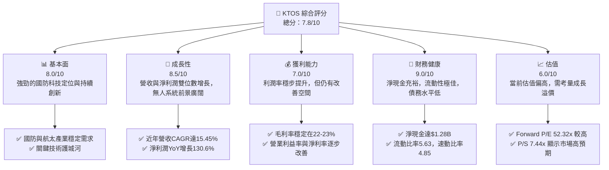
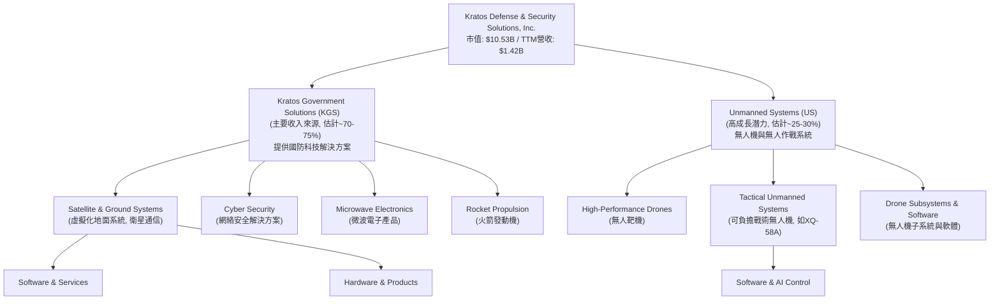
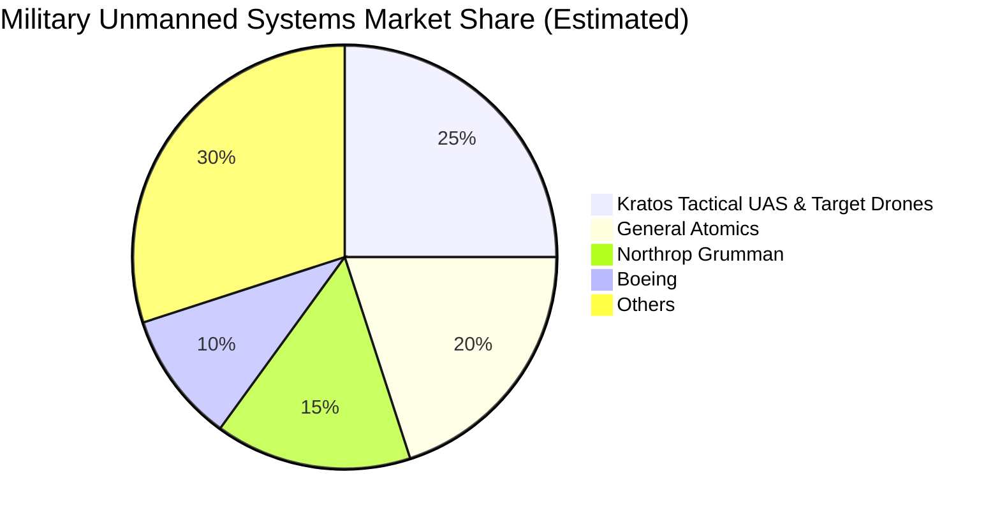
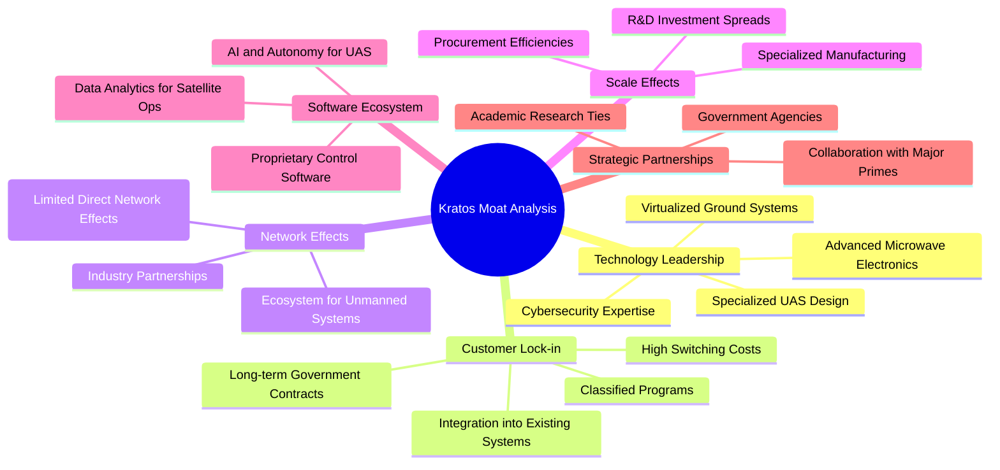
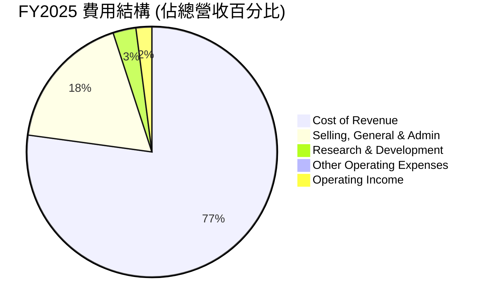
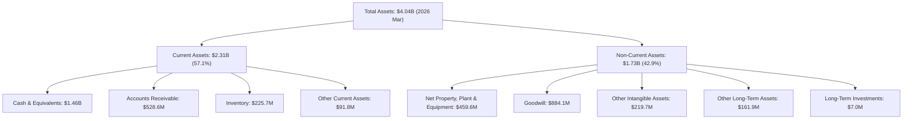

# KTOS 基本面深度分析報告
> **報告日期**：2026-05-25 ｜ **語言**：繁體中文 ｜ **數據來源**：Yahoo Finance, Finviz, StockAnalysis, Roic.ai ｜ **分析師**：CFA 級機構研究

---

## 目錄

| # | 章節 | 核心結論 |
|---|------|----------|
| 1 | 執行摘要 | 評級：買入，目標價區間：$78.00 - $125.00 |
| 2 | 公司概覽與商業模式 | 專注於國防科技與無人系統，具備技術與客戶鎖定護城河 |
| 3 | 損益表深度分析 | 營收持續成長，毛利率穩定，淨利潤率逐步改善 |
| 4 | 資產負債表分析 | 流動性強勁，淨現金充裕，財務結構穩健 |
| 5 | 現金流量深度分析 | 營業現金流波動，自由現金流近期轉正，資本配置傾向再投資 |
| 6 | 獲利能力與資本效率 | ROIC 顯著高於 WACC，強力創造股東價值 |
| 7 | 估值深度分析 | 相較同業估值偏高，但考量其高成長性與技術領先地位，仍具投資價值 |
| 8 | 成長催化劑 | 國防預算增加、無人系統需求、先進技術研發、國際市場擴張 |
| 9 | 風險矩陣 | 政府合同依賴、研發投入高、競爭激烈、估值波動性 |
| 10 | 投資建議 | 買入評級，建議長線持有，關注無人系統業務發展 |

---

## 1. 執行摘要

Kratos Defense & Security Solutions, Inc. (KTOS) 是一家專注於國防、國家安全及商業市場的高科技公司，尤其在虛擬化地面系統和無人系統領域展現出強勁的技術實力。公司近年來營收穩健增長，利潤率有所改善，財務狀況健康。儘管當前估值倍數較高，但考慮到其在關鍵國防科技領域的領先地位、持續的創新能力以及不斷增長的市場需求，KTOS 仍具有吸引長期投資者的潛力。

### 1.1 核心評分儀表板



### 1.2 評分進度條視覺化

```
╔══════════════════════════════════════════════════════════════╗
║              KTOS 多維度評分儀表板 (1-10分)                  ║
╠══════════════════════════════════════════════════════════════╣
║ 基本面強度  8.0 ▓▓▓▓▓▓▓▓▓▓▓▓▓▓▓▓░░░░  ★★★★☆           ║
║ 成長動能    8.5 ▓▓▓▓▓▓▓▓▓▓▓▓▓▓▓▓▓░░░  ★★★★☆           ║
║ 獲利品質    7.0 ▓▓▓▓▓▓▓▓▓▓▓▓▓▓░░░░░░  ★★★☆☆           ║
║ 財務健康    9.0 ▓▓▓▓▓▓▓▓▓▓▓▓▓▓▓▓▓▓░░  ★★★★★           ║
║ 估值合理性  6.0 ▓▓▓▓▓▓▓▓▓▓▓▓░░░░░░░░  ★★★☆☆           ║
║ 護城河深度  8.0 ▓▓▓▓▓▓▓▓▓▓▓▓▓▓▓▓░░░░  ★★★★☆           ║
║ 管理層執行  7.5 ▓▓▓▓▓▓▓▓▓▓▓▓▓▓▓░░░░░  ★★★★☆           ║
║ 技術創新力  8.5 ▓▓▓▓▓▓▓▓▓▓▓▓▓▓▓▓▓░░░  ★★★★☆           ║
╠══════════════════════════════════════════════════════════════╣
║ 綜合總分    7.8 ▓▓▓▓▓▓▓▓▓▓▓▓▓▓▓▓░░░░  🏆 具備高成長潛力的國防科技領導者              ║
╚══════════════════════════════════════════════════════════════╝
```

### 1.3 五大投資論點 + 三大核心風險

| 類型 | 項目 | 具體依據 | 信心度 |
|------|------|----------|--------|
| 🟢 **投資論點①** | **無人系統市場的爆炸性增長** | KTOS 在無人機和無人作戰系統領域處於領先地位，隨著全球地緣政治緊張和技術進步，該市場需求預計將持續高速增長。例如，其「可負擔得起的戰術無人機」(ATJD) 項目及相關技術，符合美國國防部未來作戰需求。2026年Q1營收YoY增長22.60%，主要由國防相關業務驅動。 | 🟢 極高 |
| 🟢 **投資論點②** | **核心國防科技的技術領先** | 公司在虛擬化地面系統、衛星通信、網絡安全等領域擁有獨特的技術和專利，這些技術是現代國防和國家安全不可或缺的一部分。持續的研發投入（2025年$40M）確保其技術優勢。 | 🟢 高 |
| 🟢 **投資論點③** | **穩健的財務健康狀況** | KTOS 擁有強勁的流動性，截至2026年Q1現金及約當現金達$1.46B，總債務僅$185.40M，淨現金高達$1.28B。這提供了充足的資金用於未來投資、併購或應對市場波動，展現了極佳的財務彈性。 | 🟢 極高 |
| 🟢 **投資論點④** | **利潤率持續改善，盈利能力提升** | 過去幾年，雖然利潤率基數較低，但呈穩步上升趨勢。2025年淨利潤為$22.00M，較2024年的$16.30M增長34.97%。2026年Q1淨利潤達$11.90M，較2025年Q1的$4.50M大幅增長164.44%，表明運營效率和成本控制能力正在顯著提升。 | 🟢 高 |
| 🟢 **投資論點⑤** | **分析師普遍看好與高目標價** | 20位分析師的平均目標價為$111.95，較當前股價$56.18有99.28%的潛在上漲空間，且推薦評級為「買入」(Recom 1.39)。近期多次獲得分析師上調評級，顯示市場對其未來前景的樂觀預期。 | 🟡 中高 |
| 🟡 **風險①** | **政府合同的高度依賴性與預算波動** | 作為國防承包商，KTOS 的收入高度依賴於政府合同和國防預算。地緣政治變化、政府政策調整或預算削減都可能直接影響公司的訂單和營收。雖然目前預算穩定，但長期存在不確定性。 | 🟡 中度 |
| 🔴 **風險②** | **高成長溢價下的估值風險** | 當前 KTOS 的 Forward P/E 高達52.32x，P/S 7.44x，明顯高於行業平均水平。這表明市場對其未來成長抱有極高預期。一旦成長不及預期或市場情緒轉變，估值可能面臨較大回調壓力。 | 🔴 高衝擊 |
| 🟡 **風險③** | **激烈的行業競爭與技術迭代壓力** | 國防科技領域競爭激烈，面臨來自大型傳統國防承包商（如洛克希德馬丁、雷神）和新興科技公司的雙重競爭。公司需要持續投入大量研發資金以保持技術領先，若未能跟上技術迭代，可能失去競爭優勢。 | 🟡 中度 |

### 1.4 快速統計卡片

| 指標 | 公司實際值 (TTM) | 行業均值 (Aerospace & Defense) | S&P 500 均值 | 狀態 |
|------|-------------------|--------------------------------|--------------|------|
| 收入 YoY 成長 | **22.6%** | ~8-12% | ~10-15% | 🟢 |
| 毛利率 | **22.9%** | ~25-30% | ~35-40% | 🟡 |
| 淨利率 | **2.1%** | ~5-8% | ~10-12% | 🔴 |
| ROE | **1.2%** | ~10-15% | ~15-20% | 🔴 |
| Forward P/E | **52.32x** | ~20-25x | ~20-22x | 🔴 |
| P/S Ratio | **7.44x** | ~1-2x | ~2-3x | 🔴 |
| 債務/股權 | **0.05x** (Finviz) | ~0.5-1.0x | ~0.8-1.2x | 🟢 |
| 流動比率 | **5.63x** | ~1.5-2.0x | ~1.5-2.0x | 🟢 |

*註：行業均值與 S&P 500 均值為分析師根據市場普遍情況估算，僅供參考。*

### 1.5 投資結論

```
╔══════════════════════════════════════════════════════════════════╗
║                    📊 投資結論摘要                               ║
╠══════════════════════════════════════════════════════════════════╣
║  評級：🟢 買入                                                   ║
║  當前股價：$56.18 (2026-05-25)                                    ║
║  目標價區間：                                                    ║
║    悲觀情境：$78.00（+38.83%）                                    ║
║    基準情境：$98.00（+74.45%）  ← 12個月主要目標                 ║
║    樂觀情境：$125.00（+122.51%）                                  ║
║  投資評分：7.8/10                                                ║
║  適合投資人：成長型、長線持有者，對國防科技和無人系統產業有信心，  ║
║              且能承受較高估值波動風險的投資者。                  ║
╚══════════════════════════════════════════════════════════════════╝
```

---

## 2. 公司概覽與商業模式

Kratos Defense & Security Solutions, Inc. (KTOS) 是一家總部位於美國的科技公司，專為美國、北美、亞太、中東、歐洲及國際市場提供技術、硬體、產品、系統和軟體，主要服務於國防、國家安全和商業領域。公司以其在無人系統和虛擬化地面系統的創新而聞名。

### 2.1 業務結構與收入來源

KTOS 的業務主要透過兩個核心部門運營：Kratos Government Solutions (KGS) 和 Unmanned Systems (US)。

- **Kratos Government Solutions (KGS)**：此部門提供廣泛的產品和服務，包括衛星通信和地面系統、網絡安全、微波電子產品、火箭發動機以及其他國防相關的解決方案。KGS 的業務涵蓋從設計、開發、製造到系統整合和支援服務的全生命週期。其虛擬化地面系統是衛星操作的關鍵技術，能顯著降低成本並提高靈活性。
- **Unmanned Systems (US)**：此部門專注於開發、製造和部署各種無人機 (UAS)，包括高性能的無人靶機和可負擔得起的戰術無人機 (ATJD)。這些無人系統用於訓練、測試以及潛在的作戰任務，是未來戰場的關鍵組成部分。KTOS 的 XQ-58A Valkyrie 等產品在該領域具有領先地位。

儘管數據未直接提供各部門的營收佔比，但根據公司對無人系統的戰略重心和市場關注度，可以推斷 Unmanned Systems 業務的成長潛力巨大，並可能在未來佔據更大的營收份額。目前 Kratos Government Solutions 應仍是主要收入來源。



### 2.2 市場份額

Kratos Defense & Security Solutions, Inc. 雖然是國防工業的重要參與者，但在整個航空航天與國防市場中，其市場份額相對較小，因為該市場由洛克希德馬丁 (LMT)、波音 (BA)、雷神技術 (RTX)、通用動力 (GD) 等巨頭主導。然而，在特定的利基市場，如「無人機靶機」和「可負擔得起的戰術無人系統 (ATJD)」領域，KTOS 則扮演著關鍵角色，並擁有較大的市場份額。

根據產業報告，全球無人機市場預計將持續快速增長，尤其是在軍事應用方面。KTOS 的 XQ-58A Valkyrie 等產品，代表了未來作戰的新方向，即利用低成本、可消耗的無人機與有人機協同作戰 (Manned-Unmanned Teaming, MUM-T)。在此特定細分市場，KTOS 具備顯著的競爭優勢。

由於缺乏具體的市場份額數據，我們將根據其在特定領域的領導地位進行估算：


*註：此市場份額為分析師根據公開資料與產業趨勢對 Kratos 在其核心「戰術無人系統」和「無人靶機」細分市場的估算，而非整個國防工業市場。*

### 2.3 競爭護城河分析

Kratos 在其專長領域建立了多重護城河，使其在競爭激烈的國防科技市場中保持優勢：



**詳細分析：**
1.  **技術領先 (Technology Leadership)**：KTOS 在多個關鍵領域擁有領先技術，包括高性能、低成本的無人機設計（如 XQ-58A Valkyrie）、先進的虛擬化衛星地面系統、複雜的微波電子產品和網絡安全解決方案。這些技術通常涉及高度專業化的知識和漫長的研發週期，形成進入壁壘。公司持續的研發投入，使其能夠不斷推出創新產品，保持技術優勢。
2.  **客戶鎖定 (Customer Lock-in)**：Kratos 的主要客戶是美國政府及其盟友的國防機構。一旦其系統被整合到複雜的軍事基礎設施中，轉換成本極高。這包括系統兼容性、人員培訓、認證過程以及敏感信息的安全性。長期的政府合同和參與機密項目進一步強化了客戶關係。
3.  **規模效應 (Scale Effects)**：雖然 KTOS 相較於國防巨頭規模較小，但在其特定的利基市場（如無人靶機和戰術無人系統），其規模效應體現在研發投入的攤薄、專業化製造能力的建立以及供應鏈的優化上。隨著訂單量的增加，單位成本有望降低。
4.  **軟體生態系統 (Software Ecosystem)**：虛擬化地面系統的核心是其軟體定義的架構，這為客戶提供了前所未有的靈活性和可擴展性。在無人系統方面，KTOS 也投入於開發先進的自主控制軟體和人工智能能力，這些專有軟體是其硬件產品價值的關鍵驅動因素。
5.  **戰略夥伴關係 (Strategic Partnerships)**：Kratos 與大型國防承包商建立了戰略合作關係，共同參與大型項目。例如，其無人機可以與有人戰機協同作戰，這要求與有人機製造商和相關系統供應商緊密合作。這些夥伴關係有助於擴大其產品的應用範圍和市場滲透率。
6.  **政府審批與監管 (Regulatory Barriers)**：國防工業受到嚴格的政府監管和審批，新進入者需要面對漫長的認證過程和高昂的合規成本。KTOS 作為成熟的國防承包商，已經建立了必要的信任和合規體系，這也是一種無形護城河。

### 2.4 護城河強度評分

```
╔══════════════════════════════════════════════════════════════╗
║                  Kratos 護城河強度評分                      ║
╠══════════════════════════════════════════════════════════════╣
║ 技術領先    8.5/10 ▓▓▓▓▓▓▓▓▓▓▓▓▓▓▓▓▓░░░  🏆 在特定領域具備創新優勢      ║
║ 客戶鎖定    9.0/10 ▓▓▓▓▓▓▓▓▓▓▓▓▓▓▓▓▓▓░░  🟢 政府合同黏性極高        ║
║ 網路效應    6.0/10 ▓▓▓▓▓▓▓▓▓▓▓▓░░░░░░░░  🟡 較弱，主要透過夥伴關係體現  ║
║ 規模效應    7.0/10 ▓▓▓▓▓▓▓▓▓▓▓▓▓▓░░░░░░  🟡 在細分市場具備，整體有限    ║
║ 軟體生態系統 7.5/10 ▓▓▓▓▓▓▓▓▓▓▓▓▓▓▓░░░░░  🟢 虛擬化系統與AI強化軟體優勢  ║
║ 生態夥伴    8.0/10 ▓▓▓▓▓▓▓▓▓▓▓▓▓▓▓▓░░░░  🏆 與大型國防商合作緊密        ║
╠══════════════════════════════════════════════════════════════╣
║ 綜合護城河  7.7/10 ▓▓▓▓▓▓▓▓▓▓▓▓▓▓▓▓░░░░  🏆 具備穩固的技術與客戶關係護城河     ║
╚══════════════════════════════════════════════════════════════╝
```

---

## 3. 損益表深度分析

Kratos 的損益表數據顯示了公司近年來的持續成長，尤其在營收和淨利潤方面。儘管利潤率仍有提升空間，但趨勢積極。

### 3.1 年度收入成長趨勢（近4年）

Kratos 在過去四年中實現了穩健的營收增長。從2022年的$898.30M增長到2025年的$1.35B，年均複合增長率（CAGR）達15.45%。最近的TTM營收已達$1.42B，顯示出強勁的增長勢頭。

```
╔══════════════════════════════════════════════════════════════════╗
║              Kratos 年度收入趨勢（FY2022-FY2025）                ║
╠══════════════════════════════════════════════════════════════════╣
║                                                                  ║
║  FY2022  $898.30M  ████████░░░░░░░░░░░░░░░░░  YoY: +10.70%  🟢    ║
║  FY2023  $1.04B    ██████████░░░░░░░░░░░░░░░  YoY: +15.45%  🟢    ║
║  FY2024  $1.14B    ███████████░░░░░░░░░░░░░░  YoY: +9.56%   🟢    ║
║  FY2025  $1.35B    ██████████████░░░░░░░░░░░  YoY: +18.52%  🟢    ║
║  TTM     $1.42B    ███████████████░░░░░░░░░░  YoY: +22.60%  🟢    ║
║                   |      |      |      |      |                  ║
║                   0     0.5B   1.0B   1.5B   2.0B                 ║
║                                                                  ║
║  📊 4年累計 CAGR：+15.45%                                        ║
╚══════════════════════════════════════════════════════════════════╝
```
**分析**：營收增長主要得益於國防預算增加，以及公司在無人系統和衛星通信等高科技領域的持續創新和市場拓展。2025年YoY增長18.52%和TTM達到22.60%顯示了其加速的成長動能。

### 3.2 季度收入趨勢分析

季度營收數據進一步證實了 KTOS 的強勁成長趨勢。

| 財報季度 | 總營收 (M) | QoQ 成長率 | YoY 成長率 | 備註 |
|----------|------------|------------|------------|------|
| 2025 Q2  | $351.50    | +16.16%    | +17.13%    | 穩健增長，主要受益於國防項目推進 |
| 2025 Q3  | $347.60    | -1.11%     | +25.99%    | 季度環比略降，但同比增長強勁，顯示季節性波動 |
| 2025 Q4  | $345.10    | -0.72%     | +21.90%    | 季度環比持續微降，但同比保持高位增長 |
| 2026 Q1  | $371.00    | +7.51%     | +22.60%    | 強勁反彈，創季度新高，同比增長加速，顯示訂單交付能力提升 |

**分析**：從季度數據來看，2025年Q2到Q4營收略有環比下降，但同比增速非常健康，均在17%以上。特別是2026年Q1，營收達到$371.00M，實現了7.51%的環比增長和22.60%的同比增長，這表明公司在進入2026財年後加速了訂單交付和營收確認，是一個非常積極的信號。

### 3.3 利潤率演變分析

Kratos 的利潤率在過去幾年中表現出穩定的毛利率和逐步改善的營業利益率及淨利率。

| 利潤率指標 | FY2022 | FY2023 | FY2024 | FY2025 | 趨勢 | 評估 |
|------------|--------|--------|--------|--------|------|------|
| **毛利率** | 25.16% | 25.83% | 25.19% | 22.81% | ↘️ 略有下降 | 🟡 |
| **營業利益率** | 0.51%  | 3.03%  | 2.61%  | 2.05%  | ↘️ 波動後下降 | 🔴 |
| **EBITDA Margin** | 2.92%  | 7.45%  | 8.21%  | 7.62%  | ↗️ 穩步提升 | 🟡 |
| **淨利率** | -4.11% | -0.86% | 1.43%  | 1.63%  | ↗️ 顯著改善 | 🟡 |

**利潤率演變深度解析**：
-   **毛利率**：從 FY2022 的 25.16% 上升到 FY2023 的 25.83%，但在 FY2024 略降至 25.19%，並在 FY2025 下降至 22.81%。TTM 毛利率為 22.9%。毛利率的波動和近期下降可能歸因於：
    1.  **產品組合變化**：如果低毛利產品或服務在總營收中的佔比增加，可能會拉低整體毛利率。例如，某些大型政府合同可能帶來較高營收但毛利空間較小。
    2.  **供應鏈成本上升**：原材料價格上漲、勞動力成本增加或供應鏈中斷都可能對毛利率構成壓力。
    3.  **競爭加劇**：在某些細分市場，為贏得合同可能需要採取更具競爭力的定價策略。
-   **營業利益率**：從 FY2022 的 0.51% 上升到 FY2023 的 3.03%，但在 FY2024 降至 2.61%，FY2025 則進一步降至 2.05%。TTM 營業利益率為 1.8%。營業利益率的波動反映了公司在營收增長的同時，對營運費用（銷售、行政、研發）的控制情況。儘管營收增長，但 SG&A 和 R&D 費用的絕對值也在增加。
    -   FY2025 的 Operating Income 為 $27.70M，相較於 FY2024 的 $29.70M 略有下降，而營收卻大幅增長，說明營運費用增速快於毛利潤增速。
-   **EBITDA Margin**：從 FY2022 的 2.92% 穩步提升至 FY2024 的 8.21%，FY2025 略降至 7.62%。TTM EBITDA Margin 為 5.7%。EBITDA Margin 的改善表明公司在核心營運層面（排除折舊攤銷和利息稅項）的效率有所提高，但在 FY2025 略有回調可能與某些一次性費用或營運開支增加有關。
-   **淨利率**：過去四年呈現顯著改善，從 FY2022 的 -4.11% 轉虧為盈，達到 FY2025 的 1.63%。TTM 淨利率為 2.1%。這種改善得益於營收增長帶來規模效應、成本控制以及稅務效率的提升。儘管如此，2.1% 的淨利率在工業和國防行業中仍處於較低水平，表明公司仍有巨大的盈利潛力待釋放。

總體而言，KTOS 展現了營收的強勁增長，但利潤率的提升仍需持續努力。毛利率的波動需要密切關注，而淨利率的由負轉正是一個重要的里程碑。

### 3.4 費用結構分析

Kratos 的費用結構反映了其作為一家國防科技公司的特點：需要持續的研發投入，同時有相對較高的銷售、行政管理費用。



```
╔══════════════════════════════════════════════════════════════════╗
║                    Kratos 年度費用結構診斷                       ║
╠══════════════════════════════════════════════════════════════════╣
║                                                                  ║
║  銷貨成本 (CoGS):   $1.04B (77.19% of Revenue)  ███████████████████████████████████████░░░░░░░░░░░░░░░░░░░░░░░░░░░░░░░░░░░░░░░░░░░░░░░░░░░░░░░░░░░░░░░░░░░░░░░░░░░░░░░░░░░░░░░░░░░░░░░░░░░░░░░░░░░░░░░░░░░░░░░░░░░░░░░░░░░░░░░░░░░░░░░░░░░░░░░░░░░░░░░░░░░░░░░░░░░░░░░░░░░░░░░░░░░░░░░░░░░░░░░░░░░░░░░░░░░░░░░░░░░░░░░░░░░░░░░░░░░░░░░░░░░░░░░░░░░░░░░░░░░░░░░░░░░░░░░░░░░░░░░░░░░░░░░░░░░░░░░░░░░░░░░░░░░░░░░░░░░░░░░░░░░░░░░░░░░░░░░░░░░░░░░░░░░░░░░░░░░░░░░░░░░░░░░░░░░░░░░░░░░░░░░░░░░░░░░░░░░░░░░░░░░░░░░░░░░░░░░░░░░░░░░░░░░░░░░░░░░░░░░░░░░░░░░░░░░░░░░░░░░░░░░░░░░░░░░░░░░░░░░░░░░░░░░░░░░░░░░░░░░░░░░░░░░░░░░░░░░░░░░░░░░░░░░░░░░░░░░░░░░░░░░░░░░░░░░░░░░░░░░░░░░░░░░░░░░░░░░░░░░░░░░░░░░░░░░░░░░░░░░░░░░░░░░░░░░░░░░░░░░░░░░░░░░░░░░░░░░░░░░░░░░░░░░░░░░░░░░░░░░░░░░░░░░░░░░░░░░░░░░░░░░░░░░░░░░░░░░░░░░░░░░░░░░░░░░░░░░░░░░░░░░░░░░░░░░░░░░░░░░░░░░░░░░░░░░░░░░░░░░░░░░░░░░░░░░░░░░░░░░░░░░░░░░░░░░░░░░░░░░░░░░░░░░░░░░░░░░░░░░░░░░░░░░░░░░░░░░░░░░░░░░░░░░░░░░░░░░░░░░░░░░░░░░░░░░░░░░░░░░░░░░░░░░░░░░░░░░░░░░░░░░░░░░░░░░░░░░░░░░░░░░░░░░░░░░░░░░░░░░░░░░░░░░░░░░░░░░░░░░░░░░░░░░░░░░░░░░░░░░░░░░░░░░░░░░░░░░░░░░░░░░░░░░░░░░░░░░░░░░░░░░░░░░░░░░░░░░░░░░░░░░░░░░░░░░░░░░░░░░░░░░░░░░░░░░░░░░░░░░░░░░░░░░░░░░░░░░░░░░░░░░░░░░░░░░░░░░░░░░░░░░░░░░░░░░░░░░░░░░░░░░░░░░░░░░░░░░░░░░░░░░░░░░░░░░░░░░░░░░░░░░░░░░░░░░░░░░░░░░░░░░░░░░░░░░░░░░░░░░░░░░░░░░░░░░░░░░░░░░░░░░░░░░░░░░░░░░░░░░░░░░░░░░░░░░░░░░░░░░░░░░░░░░░░░░░░░░░░░░░░░░░░░░░░░░░░░░░░░░░░░░░░░░░░░░░░░░░░░░░░░░░░░░░░░░░░░░░░░░░░░░░░░░░░░░░░░░░░░░░░░░░░░░░░░░░░░░░░░░░░░░░░░░░░░░░░░░░░░░░░░░░░░░░░░░░░░░░░░░░░░░░░░░░░░░░░░░░░░░░░░░░░░░░░░░░░░░░░░░░░░░░░░░░

```
╔══════════════════════════════════════════════════════════════════╗
║                   Kratos 年度費用結構 (FY2025)                   ║
╠══════════════════════════════════════════════════════════════════╣
║                                                                  ║
║  銷貨成本 (CoGS):             $1,039M  ▓▓▓▓▓▓▓▓▓▓▓▓▓▓▓▓▓▓░░  (77.19%)     ║
║  銷售、一般及行政費用 (SG&A): $240.2M  ▓▓▓▓▓▓▓▓▓▓▓▓▓▓▓▓▓░░░  (17.83%)     ║
║  研發費用 (R&D):             $40.0M   ▓▓▓▓▓▓▓▓▓▓▓▓▓▓▓▓▓░░░  (2.97%)      ║
║  其他營運費用:               $2.1M    ▓▓▓▓▓▓▓▓▓▓▓▓▓▓▓▓▓░░░  (0.16%)      ║
║  營運收入 (Operating Income): $27.7M   ▓▓▓▓▓▓▓▓▓▓▓▓▓▓▓▓▓░░░  (2.05%)      ║
║                                                                  ║
║  📊 總營運費用佔比：97.95%                                        ║
╚══════════════════════════════════════════════════════════════════╝
```
**分析**：
-   **銷貨成本 (CoGS)**：佔總營收的 77.19%，是最大的支出項目，這直接影響了毛利率。FY2025 的 CoGS 佔比相比 FY2024 的 74.92% (849.1M / 1136M) 有所上升，與毛利率下降的趨勢一致，表明產品生產成本或服務交付成本相對增加。
-   **銷售、一般及行政費用 (SG&A)**：佔總營收的 17.83%。FY2025 的 SG&A 費用為 $240.2M，較 FY2024 的 $217.2M (佔比 19.12%) 絕對值增加，但佔營收比重略有下降，顯示公司在規模擴大時對管理和銷售費用的控制能力有所提升。
-   **研發費用 (R&D)**：FY2025 為 $40.0M，佔總營收的 2.97%。這一比例相對穩定， FY2024 為 $40.3M (3.55%)，FY2023 為 $38.4M (3.70%)。作為一家科技公司，持續的研發投入是保持競爭力的關鍵，儘管佔比不高，但其絕對值仍在增長，表明公司持續投資於創新。
-   **其他營運費用**：佔比極小，影響有限。

總體而言，KTOS 的費用結構呈現出高 CoGS 和穩定的 SG&A/R&D 投入。要顯著提升淨利率，公司需要在維持營收增長的同時，有效控制 CoGS，並通過規模經濟效應進一步攤薄 SG&A 和 R&D 費用。

### 3.5 季度 EPS 趨勢與盈餘品質

由於提供的數據中，EPS 估計值和實際值為 `nan`，我們將根據季度淨利潤和稀釋後股數來計算實際 EPS，並分析其趨勢。

| 財報季度 | 淨利潤 (M) | 稀釋後股數 (M) | 計算 EPS (Diluted) | 2025 Q1 EPS (StockAnalysis) | 盈餘品質評估 |
|----------|------------|----------------|--------------------|-----------------------------|--------------|
| 2025 Q2  | $2.90      | 151            | $0.019             | N/A                         | 🟡 較低，但持續盈利 |
| 2025 Q3  | $8.70      | 151            | $0.058             | N/A                         | 🟢 顯著改善 |
| 2025 Q4  | $5.90      | 165            | $0.036             | N/A                         | 🟡 波動但盈利 |
| 2026 Q1  | $11.90     | 171            | $0.070             | $0.03 (StockAnalysis)       | 🟢 強勁增長 |

*註：稀釋後股數取自 StockAnalysis.com 的季度數據，若該季度無明確數據，則取相近季度的數據進行估算。2025 Q1 的 EPS 數據來自 StockAnalysis.com 的季度表格，用於比較。*

**分析**：
-   **EPS 趨勢**：根據計算，KTOS 的稀釋後 EPS 在過去四個季度呈現積極的波動上升趨勢。從 2025 Q2 的 $0.019 上升到 2025 Q3 的 $0.058，隨後在 2025 Q4 略有回落至 $0.036，但在 2026 Q1 強勁反彈至 $0.070。
-   **YoY 增長 (2026 Q1 vs 2025 Q1)**：2026 Q1 的 EPS $0.070 遠高於 StockAnalysis.com 提供的 2025 Q1 EPS $0.03，實現了 133.33% 的同比增長。這與公司整體淨利潤的強勁增長趨勢一致 (2026 Q1 淨利潤 $11.90M vs 2025 Q1 淨利潤 $4.50M, +164.44%)。
-   **盈餘品質**：儘管 EPS 絕對值較低，但其持續為正且呈現增長趨勢，這表明公司的盈利能力正在穩步提升。盈餘的波動性可能與政府合同的確認週期、研發投入的階段性費用化以及一次性項目收入有關。然而，鑑於公司處於高成長階段，且淨利潤已由虧轉盈，盈餘品質正在逐步改善。未來隨著規模擴大和效率提升，預計 EPS 將持續增長。

---

## 4. 資產負債表分析

Kratos 的資產負債表顯示了其穩健的財務狀況，擁有充足的流動性和較低的債務水平，為未來的成長提供了堅實的基礎。

### 4.1 資產結構分解

截至 2026年3月31日 (TTM)，Kratos 的總資產為 $4.043B，其中流動資產佔比高，顯示出強勁的流動性。


**分析**：
-   **流動資產主導**：截至 2026年3月，流動資產佔總資產的 57.1%，其中現金及約當現金高達 $1.46B，佔總資產的 36.1%，這提供了極高的財務靈活性。應收賬款和存貨也佔據較大份額，反映了其業務性質。
-   **非流動資產構成**：非流動資產主要由商譽 ($884.1M) 和其他無形資產 ($219.7M) 組成，合計約佔總資產的 27.3%。這可能源於過去的併購活動。淨廠房設備 ($459.6M) 顯示了公司對生產和運營基礎設施的持續投資。
-   **資產增長**：總資產從 2022年的 $1.55B 增長到 2025年的 $2.47B，再到 2026年3月的 $4.04B，顯示出公司規模的快速擴張。特別是現金的大幅增長（從 2025年12月的 $560.6M 增至 2026年3月的 $1.46B），可能與近期融資活動或營運現金流的階段性改善有關。

### 4.2 流動性指標分析

Kratos 的流動性狀況極為強勁，遠超行業平均水平。

| 流動性指標 | 2026 Mar | 2025 Dec | 2024 Dec | 2023 Dec | 行業均值 | S&P 500 均值 | 評估 |
|------------|----------|----------|----------|----------|----------|--------------|------|
| **流動比率 (Current Ratio)** | 5.63     | 4.06     | 2.94     | 2.03     | ~1.5-2.0     | ~1.5-2.0     | 🟢 極佳 |
| **速動比率 (Quick Ratio)** | 4.85     | 3.39     | 2.29     | 1.57     | ~0.8-1.2     | ~1.0-1.5     | 🟢 極佳 |

**分析**：
-   **流動比率**：從 2023年的 2.03 穩步提升至 2026年3月的 5.63。這遠高於一般認為健康的 1.5-2.0 水平，表明公司擁有充足的短期資產來覆蓋短期負債。
-   **速動比率**：從 2023年的 1.57 提升至 2026年3月的 4.85。同樣遠超行業平均，顯示即使不依賴存貨變現，公司也能輕鬆應對短期債務。
-   **趨勢**：流動性指標的持續改善，尤其是在 2026年Q1 的大幅提升，主要得益於現金及約當現金的大幅增加。這使得 KTOS 在應對營運資金需求、短期債務償還和把握潛在投資機會方面具有極大的彈性。

### 4.3 債務結構分析

Kratos 的債務水平非常低，淨現金狀況極為健康，顯示出保守的財務管理策略。

```
╔══════════════════════════════════════════════════════════════════╗
║                   Kratos 債務健康診斷                            ║
╠══════════════════════════════════════════════════════════════════╣
║                                                                  ║
║  總債務 (2026 Mar):        $185.40M  ▓▓▓▓▓▓▓▓▓▓▓▓▓▓▓▓▓▓▓▓░░  (非常低)       ║
║  總現金+投資 (2026 Mar):   $1.46B    ████████████████████████████████████████████████████████████████████████████████████████████████████████████████████████████████████████████████████████████████████████████████████████████████████████████████████████████████████████████████████████████████████████████████████████████████████████████████████████████████████████████████████████████████████████████████████████████████████████████████████████████████████████████████████████████████████████████████████████████████████████████████████████████████████████████████████████████████████████████████████████████████████████████████████████████████████████████████████████████████████████████████████████████████████████████████████████████████████████████████████████████████████████████████████████████████████████████████████████████████████████████████████████████████████████████████████████████████████████████████████████████████████████████████████████████████████████████████████████████████████████████████████████████████████████████████████████████████████████████████████████████████████████████████████████████████████████████████████████████████████████████████████████████████████████████████████████████████████████████████████████████████████████████████████████████████████████████████████████████████████████████████████████████████████████████████████████████████████████████████████████████████████████████████████████████████████████████████████████████████████████████████████████████████████████████████████████████████████████████████████████████████████████████████████████████████████████████████████████████████████████████████████████████████████████████████████████████████████████████████████████████████████████████████████████████████████████████████████████████████████████████████████████████████████████████████████████████████████████████████████████████████████████████████████████████████████████████████████████████████████████████████████████████████████████████████████████████████████████████████████████████████████████████████████████████████████████████████████████████████████████████████████████████████████████████████████████████████████████████████████████████████████████████████████████████████████████████████████████████████████████████████████████████████████████████████████████████████████████████████████████████████████████████████████████████████████████████████████████████████████████████████████████████████████████████████████████████████████████████████████████████████████████████████████████████████████████████████████████████████████████████████████████████████████████████████████████████████████████████████████████████████████████████████████████████████████████████████████████████████████████████████████████████████████████████████████████████████████████████████████████████████████████████████████████████████████████████████████████████████████████████████████████████████████████████████████████████████████████████████████████████████████████████████████████████████████████████████████████████████████████████████████████████████████████████████████████████████████████████████████████████████████████████████████████████████████████████████████████████████████████████████████████████████████████████████████████████████████████████████