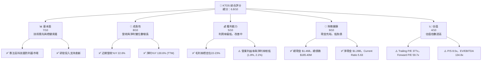
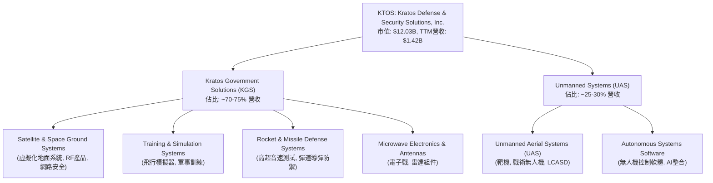
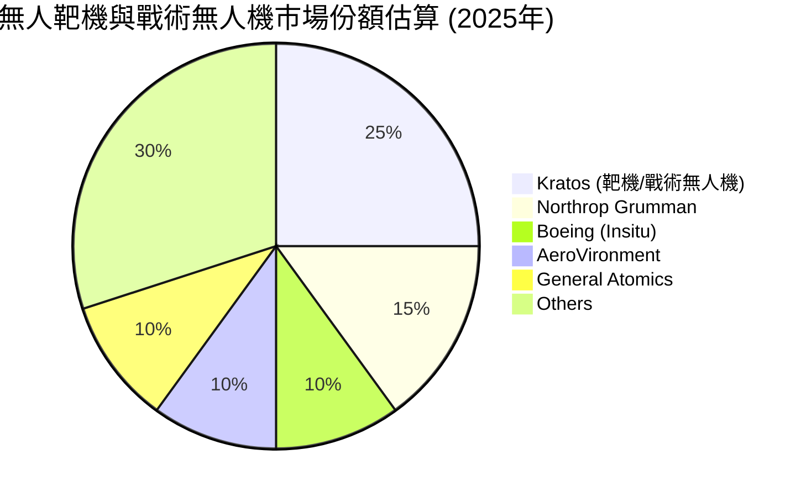
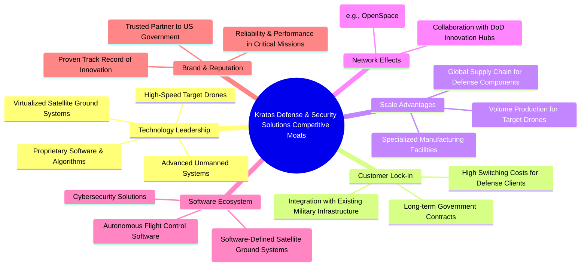
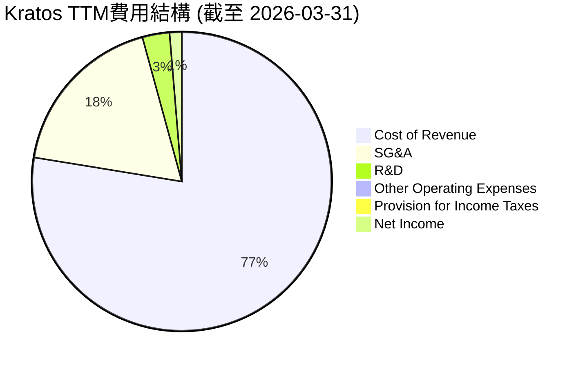

# KTOS 基本面深度分析報告
> **報告日期**：2026-05-29 ｜ **語言**：繁體中文 ｜ **數據來源**：Yahoo Finance, Finviz, StockAnalysis, Roic.ai ｜ **分析師**：CFA 級機構研究

## 目錄

| # | 章節 | 核心結論 |
|---|------|----------|
| 1 | 執行摘要 | KTOS 展現強勁成長動能，但估值偏高，長期潛力與風險並存。評級：持有，目標價區間 $85-$120。 |
| 2 | 公司概覽與商業模式 | 作為航太與國防領域的技術驅動者，Kratos 憑藉其創新無人系統與衛星通訊解決方案，在特定利基市場建立技術護城河。 |
| 3 | 損益表深度分析 | 營收持續穩健成長，毛利率相對穩定，但營業利益率和淨利率仍處於較低水平，顯示成本控制與規模效益有待提升。 |
| 4 | 資產負債表分析 | 財務結構穩健，現金充裕且債務負擔輕，流動性極佳，為未來投資與營運提供堅實基礎。 |
| 5 | 現金流量深度分析 | 營業現金流波動較大，近期轉負，自由現金流持續為負，顯示公司仍處於高投入的成長階段，需要持續關注其現金流轉正能力。 |
| 6 | 獲利能力與資本效率 | ROE、ROA 偏低，但 ROIC 已超過 WACC，顯示公司已開始為股東創造經濟價值，資本效率正在改善。 |
| 7 | 估值深度分析 | 當前估值倍數顯著高於歷史水平及同業平均，市場已充分反映其成長預期，存在估值回歸風險。 |
| 8 | 成長催化劑 | 無人機、衛星通訊虛擬化、國防預算增加是主要成長驅動力，新技術應用與國際市場擴張提供長期增長潛力。 |
| 9 | 風險矩陣 | 國防預算波動、技術競爭、專案執行風險、供應鏈中斷是主要風險，需密切關注。 |
| 10 | 投資建議 | 鑑於其強勁的成長潛力與創新能力，但面臨高估值與現金流壓力，建議「持有」，並密切監控盈利改善與現金流狀況。 |

---

## 1. 執行摘要

### 1.1 核心評分儀表板



### 1.2 評分進度條視覺化

```
╔══════════════════════════════════════════════════════════════╗
║              KTOS 多維度評分儀表板 (1-10分)                ║
╠══════════════════════════════════════════════════════════════╣
║ 基本面強度  7.0 ▓▓▓▓▓▓▓▓▓▓▓▓▓▓░░░░░░  ★★★★☆           ║
║ 成長動能    8.0 ▓▓▓▓▓▓▓▓▓▓▓▓▓▓▓▓░░░░  ★★★★☆           ║
║ 獲利品質    5.0 ▓▓▓▓▓▓▓▓▓▓░░░░░░░░░░  ★★★☆☆           ║
║ 財務健康    9.0 ▓▓▓▓▓▓▓▓▓▓▓▓▓▓▓▓▓▓░░  ★★★★★           ║
║ 估值合理性  4.0 ▓▓▓▓▓▓▓▓░░░░░░░░░░░░  ★★☆☆☆           ║
║ 護城河深度  7.5 ▓▓▓▓▓▓▓▓▓▓▓▓▓▓▓░░░░░  ★★★★☆           ║
║ 管理層執行  7.0 ▓▓▓▓▓▓▓▓▓▓▓▓▓▓░░░░░░  ★★★★☆           ║
║ 技術創新力  8.5 ▓▓▓▓▓▓▓▓▓▓▓▓▓▓▓▓▓░░░  ★★★★★           ║
╠══════════════════════════════════════════════════════════════╣
║ 綜合總分    6.8 ▓▓▓▓▓▓▓▓▓▓▓▓▓▓░░░░░░  🏆 評語：成長性強，財務健康，但估值高漲，需警惕。║
╚══════════════════════════════════════════════════════════════╝
```

### 1.3 五大投資論點 + 三大核心風險

| 類型 | 項目 | 具體依據 | 信心度 |
|------|------|----------|--------|
| 🟢 **投資論點①** | **國防預算長期增長下的高科技利基市場領導者** | Kratos 專注於無人系統、衛星通訊虛擬化等高成長領域，這些領域是全球國防現代化的重點。2026年Q1營收 YoY 成長 22.6%，顯示其在市場中的強勁需求。其創新技術獲得多個大型國防專案，預計將持續受益於全球地緣政治緊張與國防開支增加。 | 🟢 極高 |
| 🟢 **投資論點②** | **無人機系統（UAS）市場的先行者與創新者** | Kratos 的無人機技術，特別是其低成本可消耗型無人機（LCASD）和高能動性靶機，在美國國防部的「複製型攻勢」（Replicator Initiative）戰略中扮演關鍵角色。這使其在快速擴張的無人機市場中佔據有利地位，擁有顯著的先發優勢與技術壁壘。 | 🟢 極高 |
| 🟢 **投資論點③** | **衛星通訊地面系統虛擬化趨勢的受益者** | Kratos 是衛星地面系統虛擬化領域的領導者，其 OpenSpace 平台為下一代衛星通訊提供了靈活、高效的解決方案。隨著低軌道衛星（LEO）星座的興起，對虛擬化地面系統的需求將爆炸式增長，為公司帶來巨大的長期增長潛力。FY2025 營收 YoY 成長 18.52%，主要受此類高科技解決方案帶動。 | 🟢 極高 |
| 🟢 **投資論點④** | **穩健的財務結構與充裕的現金流** | 截至 2026年Q1，公司擁有 $1.46B 的現金及等價物，而總債務僅為 $185.40M，淨現金高達 $1.28B。此強勁的資產負債表提供了充足的資金彈性，支持研發投入、潛在併購及應對市場波動，大幅降低財務風險。Current Ratio 高達 5.63。 | 🟢 極高 |
| 🟢 **投資論點⑤** | **盈利能力顯著改善，營運效率提升** | 經過多年的投入期，Kratos 的淨利潤已從虧損轉為盈利，並持續增長。TTM 淨利潤 $29.40M，Earnings Growth YoY 達 130.6%。儘管利潤率仍偏低，但 ROIC 已高於 WACC，表明公司已開始創造股東價值，且營運效率正逐步改善。 | 🟡 中高 |
| 🟡 **風險①** | **估值過高與市場預期過度樂觀** | 當前 Kratos 的 Trailing P/E 高達 377x，Forward P/E 達 59.7x，P/S 為 8.5x，顯著高於行業平均水平。這表明市場已將其未來數年的高成長預期完全計入股價，任何不及預期的業績表現或宏觀經濟逆風都可能導致股價大幅修正。FCF Yield 為 -0.89%，估值缺乏現金流支撐。 | 🔴 高衝擊 |
| 🟡 **風險②** | **國防專案高度依賴與合同執行風險** | Kratos 的大部分收入來自政府合同，這意味著其業務易受國防預算政策、專案延遲、合同終止或競爭加劇的影響。大型專案的執行風險、技術交付延誤或成本超支都可能對公司業績產生負面影響。此外，政府採購流程較長，收入確認存在不確定性。 | 🟡 中度 |
| 🔴 **風險③** | **自由現金流持續為負，資金消耗較大** | 儘管資產負債表健康，但公司在 2025 年的自由現金流為 -137.40M，且 TTM FCF 仍為 -106.72M。這表明公司在擴張和研發方面仍有大量資本開支，若未來無法有效將營收成長轉化為正向且持續增長的自由現金流，可能引發市場對其盈利質量和長期可持續性的擔憂。 | 🟡 中度 |

### 1.4 快速統計卡片

| 指標 | 公司實際值 (TTM) | 行業均值 (Aerospace & Defense) | S&P 500 均值 | 狀態 |
|------|-------------------|--------------------------------|--------------|------|
| 收入 YoY 成長 | **22.6%** | ~7-10% | ~8-12% | 🟢 |
| 毛利率 | **22.9%** | ~20-25% | ~35-45% | 🟡 |
| 淨利率 | **2.1%** | ~5-8% | ~10-15% | 🔴 |
| ROE | **1.2%** | ~10-15% | ~15-20% | 🔴 |
| Forward P/E | **59.7x** | ~20-25x | ~22-28x | 🔴 |
| P/S Ratio | **8.5x** | ~1.5-2.5x | ~2-3x | 🔴 |
| Debt/Equity | **0.05x** | ~0.3-0.6x | ~0.8-1.2x | 🟢 |
| Current Ratio | **5.63x** | ~1.5-2.0x | ~1.0-1.5x | 🟢 |

### 1.5 投資結論

```
╔══════════════════════════════════════════════════════════════════╗
║                    📊 投資結論摘要                               ║
╠══════════════════════════════════════════════════════════════════╣
║  評級：🟡 持有                                                   ║
║  當前股價：$64.13                                                ║
║  目標價區間：                                                    ║
║    悲觀情境：$85（+32.5%）                                        ║
║    基準情境：$105（+63.7%）  ← 12個月主要目標                      ║
║    樂觀情境：$120（+87.1%）                                        ║
║  投資評分：6.8/10                                                ║
║  適合投資人：成長型、長線持有者，對國防科技與無人系統前景有高度信║
║              心，並能承受高估值帶來波動的投資者。                  ║
╚══════════════════════════════════════════════════════════════════╝
```

---

## 2. 公司概覽與商業模式

Kratos Defense & Security Solutions, Inc. (KTOS) 是一家專注於高科技國防、國家安全和商業市場的技術公司。公司提供廣泛的技術、硬體、產品、系統和軟體解決方案，業務遍及美國、北美、亞太、中東、歐洲及其他國際市場。Kratos 的獨特之處在於其對創新技術的堅持，尤其是在無人系統、衛星地面系統虛擬化、網路安全和高能武器測試等領域。

### 2.1 業務結構與收入來源

Kratos 主要透過兩個核心業務部門運營：Kratos Government Solutions (KGS) 和 Unmanned Systems (UAS)。



**業務板塊詳述：**

*   **Kratos Government Solutions (KGS)**:
    *   **衛星與太空地面系統 (Satellite & Space Ground Systems)**: 這是 Kratos 的關鍵高成長領域，提供虛擬化衛星地面系統、射頻 (RF) 產品、網路安全和任務管理軟體。隨著低軌道 (LEO) 衛星星座的快速部署，對靈活、軟體定義的地面基礎設施的需求激增，Kratos 的 OpenSpace 平台正處於這一趨勢的前沿。該部門為軍事、情報和商業客戶提供服務，確保關鍵的太空資產能夠高效、安全地運作。
    *   **訓練與模擬系統 (Training & Simulation Systems)**: 為飛行員、維護人員提供先進的軍事訓練解決方案，包括高逼真度飛行模擬器和虛擬訓練環境。這部分業務有助於提升軍事人員的作戰準備和技能。
    *   **火箭與導彈防禦系統 (Rocket & Missile Defense Systems)**: 參與高超音速飛行器測試、彈道導彈防禦系統的開發和測試。這是國家安全領域的關鍵基礎設施，對技術精確度和可靠性要求極高。
    *   **微波電子與天線 (Microwave Electronics & Antennas)**: 提供用於電子戰、雷達和通訊系統的專業化電子元件和天線。這些產品是現代國防系統不可或缺的一部分。

*   **Unmanned Systems (UAS)**:
    *   **無人機系統 (Unmanned Aerial Systems)**: Kratos 在無人機領域擁有獨特競爭力，特別是其高性能、低成本可消耗型無人機 (LCASD) 和先進的靶機。這些無人機用於模擬敵機威脅、訓練飛行員，並有望在未來與有人戰機協同作戰 (忠誠僚機概念)。公司的 XQ-58A Valkyrie 戰術無人機是此領域的明星產品，吸引了美國空軍的高度關注。
    *   **自主系統軟體 (Autonomous Systems Software)**: 支援無人機的自主飛行、任務規劃和數據鏈路安全。軟體是實現無人機高效運作和協同能力的關鍵。

**收入來源分析：**
Kratos 的收入主要來自美國政府（包括國防部、情報機構和NASA）的合同，以及少量的商業客戶和國際銷售。這種客戶結構帶來了穩定的收入基礎，但也使其易受政府預算和政策變化的影響。近年來，公司在無人機和衛星地面系統虛擬化方面的投入開始顯現成效，這些高成長領域的訂單和專案正在推動其營收加速增長。

TTM 營收為 $1.42B，其中 KGS 約貢獻 $1.0B - $1.06B，UAS 約貢獻 $360M - $420M。公司正積極將其創新技術推向國際市場，以實現收入來源的多樣化。

### 2.2 市場份額

Kratos 在其特定的利基市場中佔據重要地位，但由於其高度專業化的性質，很難直接與大型綜合性國防承包商進行市場份額比較。然而，在某些核心領域，Kratos 已經是領導者。


*註：此市場份額為估算，主要針對高性能靶機和戰術無人機，不包括小型民用或偵察無人機。Kratos 在此領域的技術優勢和與美國空軍的合作使其佔據重要地位。*

在衛星地面系統虛擬化領域，Kratos 的 OpenSpace 平台在行業內也具有領先地位，尤其是在軟體定義衛星 (SDS) 和低軌道 (LEO) 衛星通訊地面站市場。雖然具體的市場份額數據難以獲取，但其作為早期創新者和技術標準制定者的角色，使其在此新興市場中具有強大的競爭力。

### 2.3 競爭護城河分析

Kratos 憑藉其在特定高科技國防領域的專業知識和創新能力，逐步建立起多重競爭護城河。



**護城河詳述：**

1.  **Technology Leadership (技術領先)**: Kratos 在無人機、衛星通訊虛擬化和高超音速測試等領域擁有獨特的先進技術。例如，其 XQ-58A Valkyrie 無人機和 OpenSpace 虛擬化平台是行業的領先者。這些技術通常需要大量的研發投入、深厚的專業知識和長期的積累，形成難以被快速複製的技術壁壘。公司 TTM 研發費用為 $40.7M，持續的投入是其技術領先的基石。

2.  **Customer Lock-in (客戶鎖定)**: Kratos 的主要客戶是政府機構，特別是美國國防部。國防採購通常涉及漫長的評估、認證和整合過程，一旦系統被採用，更換供應商的成本極高（包括重新認證、訓練、基礎設施改造等）。這使得 Kratos 與其客戶之間建立了長期穩固的合作關係，形成強大的客戶鎖定效應。

3.  **Scale Advantages (規模效應)**: 儘管 Kratos 相較於大型國防承包商規模較小，但在其利基市場，例如無人靶機的生產，它已實現一定的規模經濟。大規模生產靶機能降低單位成本，使其在提供低成本可消耗型無人機方面具有優勢。此外，其在專業化製造設施和全球供應鏈方面的優勢也體現了規模效應。

4.  **Network Effects (網路效應)**: 在衛星地面系統虛擬化領域，Kratos 的 OpenSpace 平台正積極推動行業標準化，並與多個太空機構和商業衛星運營商建立合作夥伴關係。隨著更多用戶和合作夥伴採用其平台，其價值會不斷提升，形成網路效應。

5.  **Software Ecosystem (軟體生態系統)**: Kratos 的許多解決方案都高度依賴其專有的軟體。例如，OpenSpace 平台提供了一套完整的軟體定義地面系統解決方案，而其無人機也配備了先進的自主飛行控制軟體。這些軟體構成了一個生態系統，提升了產品的附加值和客戶的粘性。

6.  **Brand & Reputation (品牌與聲譽)**: 作為美國政府的長期合作夥伴，Kratos 在關鍵國防技術領域建立了卓越的品牌聲譽和信任度。在高度敏感的國防市場，供應商的可靠性、安全性及技術實力至關重要，Kratos 在這方面擁有強大的競爭優勢。

### 2.4 護城河強度評分

```
╔══════════════════════════════════════════════════════════════╗
║                  Kratos 護城河強度評分                      ║
╠══════════════════════════════════════════════════════════════╣
║ 技術領先       9/10   ▓▓▓▓▓▓▓▓▓▓▓▓▓▓▓▓▓▓░░  🏆 業界前沿，持續創新        ║
║ 客戶鎖定       8/10   ▓▓▓▓▓▓▓▓▓▓▓▓▓▓▓▓░░░░  🟢 政府客戶粘性強        ║
║ 規模效應       6/10   ▓▓▓▓▓▓▓▓▓▓▓▓░░░░░░░░  🟡 利基市場有，整體待提升        ║
║ 網路效應       7/10   ▓▓▓▓▓▓▓▓▓▓▓▓▓▓░░░░░░  🟢 衛星虛擬化領域初現        ║
║ 軟體生態系統   7/10   ▓▓▓▓▓▓▓▓▓▓▓▓▓▓░░░░░░  🟢 核心產品深度整合        ║
║ 品牌與聲譽     8/10   ▓▓▓▓▓▓▓▓▓▓▓▓▓▓▓▓░░░░  🟢 國防領域高度信任        ║
╠══════════════════════════════════════════════════════════════╣
║ 綜合護城河     7.5    ▓▓▓▓▓▓▓▓▓▓▓▓▓▓▓░░░░░  🏆 在高科技國防利基市場具備強大競爭力     ║
╚══════════════════════════════════════════════════════════════╝
```

---

## 3. 損益表深度分析

### 3.1 年度收入成長趨勢（近4年）

Kratos 的營收在過去四年呈現穩健的增長態勢，尤其在最新一個財年和 TTM 數據中，增速有所加快，顯示其在無人系統和衛星通訊等高成長領域的投入開始見效。

```
╔══════════════════════════════════════════════════════════════════╗
║              Kratos 年度收入趨勢（FY2022-FY2025）              ║
╠══════════════════════════════════════════════════════════════════╣
║                                                                  ║
║  FY2022  $898.30M ▓▓▓▓▓▓▓▓▓▓▓▓▓▓▓▓░░░░░░░░░  YoY: +10.70%  🟢    ║
║  FY2023  $1.04B   ▓▓▓▓▓▓▓▓▓▓▓▓▓▓▓▓▓▓▓▓░░░░░  YoY: +15.45%  🟢    ║
║  FY2024  $1.14B   ▓▓▓▓▓▓▓▓▓▓▓▓▓▓▓▓▓▓▓▓▓▓░░░  YoY: +9.56%   🟡    ║
║  FY2025  $1.35B   ▓▓▓▓▓▓▓▓▓▓▓▓▓▓▓▓▓▓▓▓▓▓▓▓▓▓░  YoY: +18.52%  🟢    ║
║  TTM'26  $1.42B   ▓▓▓▓▓▓▓▓▓▓▓▓▓▓▓▓▓▓▓▓▓▓▓▓▓▓▓▓░  YoY: +21.82%  🟢    ║
║                   |      |      |      |      |                  ║
║                   0     $0.5B  $1.0B  $1.5B  $2.0B                  ║
║                                                                  ║
║  📊 4年累計 CAGR (FY2022-FY2025)：+13.79%                         ║
║  📊 TTM (YoY) 成長率：+21.82%                                  ║
╚══════════════════════════════════════════════════════════════════╝
```
**分析：**
*   **FY2022-FY2025 期間 CAGR 達 13.79%**，顯示公司具有持續的成長能力。
*   **FY22 收入為 $898.30M，YoY 成長 10.70%**。這一年的成長為後續的加速奠定基礎。
*   **FY23 收入增至 $1.04B，YoY 成長 15.45%**。這得益於國防專案的需求穩定增長以及新技術解決方案的逐步採用。
*   **FY24 收入達到 $1.14B，YoY 成長 9.56%**。相較於前一年，增速略有放緩，可能受到部分專案進度或宏觀環境的影響。
*   **FY25 收入顯著加速至 $1.35B，YoY 成長 18.52%**。這一年表現強勁，可能反映了無人機和衛星地面系統虛擬化業務的訂單加速落地。
*   **TTM Mar 2026 收入為 $1.42B，YoY 成長達到 21.82%**。這是近幾年來最快的年度成長率，表明公司正處於一個強勁的增長週期，其高科技產品和解決方案正在獲得市場的廣泛認可。

整體而言，Kratos 的收入成長趨勢健康，特別是近年來的加速增長，證明了其在關鍵國防技術領域的戰略部署是有效的。

### 3.2 季度收入趨勢分析

季度收入數據進一步揭示了 Kratos 營收的動態變化，顯示出較強的季節性波動以及穩定的同比增長。

| 季度 | 總收入 ($M) | QoQ 成長率 | YoY 成長率 | 備註 |
|------|-------------|------------|------------|------|
| 2025-06-30 | $351.50M | N/A | +17.13% | 營收穩步提升，YoY 成長健康。 |
| 2025-09-30 | $347.60M | -1.11% | +25.99% | QoQ 略有下降，但 YoY 表現強勁，顯示季節性影響。 |
| 2025-12-31 | $345.10M | -0.72% | +21.90% | QoQ 持續微降，但 YoY 仍保持高位，反映年底訂單交付節奏。 |
| 2026-03-31 | $371.00M | +7.51% | +22.60% | QoQ 大幅反彈，YoY 保持強勁，顯示新財年開局良好，訂單執行加速。 |

**分析：**
*   **QoQ 趨勢**：2025 年 Q2 至 Q4 呈現輕微的季度環比下降，這在國防承包商中並非罕見，可能與專案里程碑、交付時間或政府資金撥款節奏有關。然而，2026 年 Q1 實現了 7.51% 的顯著環比增長，表明公司在新一年的開局表現強勁，可能受益於新合同的啟動或先前專案的加速執行。
*   **YoY 趨勢**：所有季度都保持了雙位數的同比增長，從 Q2 2025 的 +17.13% 到 Q3 2025 的 +25.99%，再到 Q1 2026 的 +22.60%。這表明 Kratos 的核心業務具有持續的市場需求和擴張能力，其產品和服務在國防市場中佔據越來越重要的位置。尤其 Q3 2025 的近 26% YoY 成長，凸顯了公司在特定時期的強勁表現。
*   **整體而言**，季度收入數據支持了年度收入趨勢的結論，即 Kratos 處於一個快速成長的階段，儘管存在一些季節性波動，但長期增長動能依然強勁。

### 3.3 利潤率演變分析

Kratos 的利潤率在過去幾年呈現出穩定的毛利率和逐步改善但仍偏低的營業利益率和淨利率。

| 利潤率指標 | FY2022 | FY2023 | FY2024 | FY2025 | TTM Mar 2026 | 趨勢 | 評估 |
|------------|--------|--------|--------|--------|--------------|------|------|
| **毛利率** | 25.16% | 25.83% | 25.19% | 22.81% | 22.82% | ↘️ 近年略有下降，但相對穩定 | 🟡 |
| **營業利益率** | 0.51% | 3.03% | 2.61% | 2.05% | 1.67% | ↘️ 波動後下降，仍處低位 | 🔴 |
| **淨利率** | -4.11% | -0.86% | 1.43% | 1.63% | 2.07% | ↗️ 持續改善，已轉正 | 🟡 |
| **EBITDA Margin** | 2.92% | 7.45% | 8.21% | 7.62% | 5.7% (TTM) | ↘️ 波動後下降，仍處低位 | 🟡 |

**利潤率演變深度解析：**

1.  **毛利率 (Gross Margin)**:
    *   從 FY2022 的 25.16% 到 FY2023 的 25.83%，毛利率有所提升，這可能得益於產品組合的優化或成本控制。
    *   然而，FY2024 和 FY2025 則分別下降至 25.19% 和 22.81%，TTM Mar 2026 保持在 22.82%。這種下降可能反映了幾個因素：
        *   **產品組合變化**：例如，如果低成本可消耗型無人機（LCASD）的銷量佔比增加，其較低的毛利率可能會拉低整體毛利率。
        *   **成本壓力**：原材料成本、勞動力成本或供應鏈中斷可能導致生產成本上升。
        *   **競爭加劇或定價策略調整**：為了贏得更多合同，公司可能採取更具競爭力的定價策略。
    *   儘管有所下降，但 22-23% 的毛利率在國防承包行業中仍屬合理範圍，表明公司在核心業務上仍具有一定的定價能力和成本控制能力。

2.  **營業利益率 (Operating Margin)**:
    *   Kratos 的營業利益率呈現波動和偏低的趨勢。從 FY2022 的 0.51% 顯著提升至 FY2023 的 3.03%，這得益於收入增長和費用控制。
    *   然而，FY2024 和 FY2025 則分別下降至 2.61% 和 2.05%，TTM Mar 2026 進一步下降至 1.67%。
    *   營業利益率的下降主要原因在於：
        *   **研發費用 (R&D)**：Kratos 是一家技術驅動型公司，持續投入研發以保持技術領先地位。雖然研發費用絕對值穩定在 $38M-$40M 之間，但相對於收入的增長，其佔比可能未顯著下降，甚至在某些時期可能因新專案而增加。
        *   **銷售、一般及管理費用 (SG&A)**：隨著業務擴張和國際化，銷售和管理費用可能有所增加。TTM SG&A 為 $255.5M，佔 TTM 營收的 18.0%。這部分費用相對較高，對營業利益率構成壓力。
        *   **專案啟動成本**：新專案的啟動往往伴隨著較高的前期投入，這會影響短期內的營業利益率。
    *   低營業利益率表明公司在將營收轉化為核心營運盈利方面仍面臨挑戰，需要進一步提升營運效率和規模效益。

3.  **淨利率 (Net Profit Margin)**:
    *   Kratos 的淨利率經歷了從持續虧損到盈利的轉變，這是最令人鼓舞的趨勢。FY2022 淨利率為 -4.11%，FY2023 縮小至 -0.86%。
    *   FY2024 成功轉正至 1.43%，FY2025 進一步提升至 1.63%，TTM Mar 2026 達到 2.07%。
    *   淨利率的改善主要得益於：
        *   **收入規模擴大**：隨著營收的增長，固定成本被更好地攤薄，有助於提升盈利。
        *   **專案盈利能力提升**：部分高價值專案的完成和交付可能帶來較高的利潤貢獻。
        *   **稅務效率改善**：公司的稅務負擔可能有所優化。
    *   儘管淨利率已轉正並持續改善，但 2.07% 的水平在成熟行業中仍屬偏低，表明其盈利質量仍有較大提升空間。

4.  **EBITDA Margin**:
    *   EBITDA Margin 在 FY2023 和 FY2024 達到高峰，分別為 7.45% 和 8.21%，但 FY2025 下降至 7.62%，TTM Mar 2026 為 5.7%。
    *   EBITDA Margin 的下降與營業利益率的趨勢一致，反映了在扣除折舊攤銷前的營運盈利能力有所波動。這也進一步確認了公司在營運層面仍面臨成本壓力或效率挑戰。

**總結：**
Kratos 的損益表顯示其正處於從虧損到盈利的轉型期，營收成長強勁，淨利率持續改善。然而，毛利率略有下降，營業利益率和 EBITDA Margin 仍處於較低水平且有所波動，這暗示公司在擴張的同時，需要更有效地管理營運成本和提升規模效益，以實現更高質量的盈利增長。

### 3.4 費用結構分析

Kratos 的費用結構反映了其作為一家技術驅動型國防承包商的特點：研發投入持續，且銷售和管理費用佔比較大。


*註：費用結構百分比基於 TTM 總收入 $1.415B 計算。*

**ASCII 方框圖展示費用結構**

```
╔══════════════════════════════════════════════════════════════════╗
║              Kratos TTM 費用結構分析 (截至 2026-03-31)           ║
╠══════════════════════════════════════════════════════════════════╣
║                                                                  ║
║  銷貨成本 (Cost of Revenue) : $1.091B  ▓▓▓▓▓▓▓▓▓▓▓▓▓▓▓▓▓▓▓▓▓▓▓▓▓▓▓▓▓▓▓▓▓▓▓▓▓▓▓▓▓▓▓▓▓▓▓▓▓▓▓▓▓▓▓▓▓▓▓▓▓▓▓▓▓▓▓▓▓▓▓▓▓▓▓▓▓▓▓▓▓▓▓▓▓▓▓▓▓▓▓▓▓▓▓▓▓▓▓▓▓▓▓▓▓▓▓▓▓▓▓▓▓▓▓▓▓▓▓▓▓▓▓▓▓▓▓▓▓▓▓▓▓▓▓▓▓▓▓▓▓▓▓▓▓▓▓▓▓▓▓▓▓▓▓▓▓▓▓▓▓▓▓▓▓▓▓▓▓▓▓▓▓▓▓▓▓▓▓▓▓▓▓▓▓▓▓▓▓▓▓▓▓▓▓▓▓▓▓▓▓▓▓▓▓▓▓▓▓▓▓▓▓▓▓▓▓▓▓▓▓▓▓▓▓▓▓▓▓▓▓▓▓▓▓▓▓▓▓▓▓▓▓▓▓▓▓▓▓▓▓▓▓▓▓▓▓▓▓▓▓▓▓▓▓▓▓▓▓▓▓▓▓▓▓▓▓▓▓▓▓▓▓▓▓▓▓▓▓▓▓▓▓▓▓▓▓▓▓▓▓▓▓▓▓▓▓▓▓▓▓▓▓▓▓▓▓▓▓▓▓▓▓▓▓▓▓▓▓▓▓▓▓▓▓▓▓▓▓▓▓▓▓▓▓▓▓▓▓▓▓▓▓▓▓▓▓▓▓▓▓▓▓▓▓▓▓▓▓▓▓▓▓▓▓▓▓▓▓▓▓▓▓▓▓▓▓▓▓▓▓▓▓▓▓▓▓▓▓▓▓▓▓▓▓▓▓▓▓▓▓▓▓▓▓▓▓▓▓▓▓▓▓▓▓▓▓▓▓▓▓▓▓▓▓▓▓▓▓▓▓▓▓▓▓▓▓▓▓▓▓▓▓▓▓▓▓▓▓▓▓▓▓▓▓▓▓▓▓▓▓▓▓▓▓▓▓▓▓▓▓▓▓▓▓▓▓▓▓▓▓▓▓▓▓▓▓▓▓▓▓▓▓▓▓▓▓▓▓▓▓▓▓▓▓▓▓▓▓▓▓▓▓▓▓▓▓▓▓▓▓▓▓▓▓▓▓▓▓▓▓▓▓▓▓▓▓▓▓▓▓▓▓▓▓▓▓▓▓▓▓▓▓▓▓▓▓▓▓▓▓▓▓▓▓▓▓▓▓▓▓▓▓▓▓▓▓▓▓▓▓▓▓▓▓▓▓▓▓▓▓▓▓▓▓▓▓▓▓▓▓▓▓▓▓▓▓▓▓▓▓▓▓▓▓▓▓▓▓▓▓▓▓▓▓▓▓▓▓▓▓▓▓▓▓▓▓▓▓▓▓▓▓▓▓▓▓▓▓▓▓▓▓▓▓▓▓▓▓▓▓▓▓▓▓▓▓▓▓▓▓▓▓▓▓▓▓▓▓▓▓▓▓▓▓▓▓▓▓▓▓▓▓▓▓▓▓▓▓▓▓▓▓▓▓▓▓▓▓▓▓▓▓▓▓▓▓▓▓▓▓▓▓▓▓▓▓▓▓▓▓▓▓▓▓▓▓▓▓▓▓▓▓▓▓▓▓▓▓▓▓▓▓▓▓▓▓▓▓▓▓▓▓▓▓▓▓▓▓▓▓▓▓▓▓▓▓▓▓▓▓▓▓▓▓▓▓▓▓▓▓▓▓▓▓▓▓▓▓▓▓▓▓▓▓▓▓▓▓▓▓▓▓▓▓▓▓▓▓▓▓▓▓▓▓▓▓▓▓▓▓▓▓▓▓▓▓▓▓▓▓▓▓▓▓▓▓▓▓▓▓▓▓▓▓▓▓▓▓▓▓▓▓▓▓▓▓▓▓▓▓▓▓▓▓▓▓▓▓▓▓▓▓▓▓▓▓▓▓▓▓▓▓▓▓▓▓▓▓▓▓▓▓▓▓▓▓▓▓▓▓▓▓▓▓▓▓▓▓▓▓▓▓▓▓▓▓▓▓▓▓▓▓▓▓▓▓▓▓▓▓▓▓▓▓▓▓▓▓▓▓▓▓▓▓▓▓▓▓▓▓▓▓▓▓▓▓▓▓▓▓▓▓▓▓▓▓▓▓▓▓▓▓▓▓▓▓▓▓▓▓▓▓▓▓▓▓▓▓▓▓▓▓▓▓▓▓▓▓▓▓▓▓▓▓▓▓▓▓▓▓▓▓▓▓▓▓▓▓▓▓▓▓▓▓▓▓▓▓▓▓▓▓▓▓▓▓▓▓▓▓▓▓▓▓▓▓▓▓▓▓▓▓▓▓▓▓▓▓▓▓▓▓▓▓▓▓▓▓▓▓▓▓▓▓▓▓▓▓▓▓▓▓▓▓▓▓▓▓▓▓▓▓▓▓▓▓▓▓▓▓▓▓▓▓▓▓▓▓▓▓▓▓▓▓▓▓▓▓▓▓▓▓▓▓▓▓▓▓▓▓▓▓▓▓▓▓▓▓▓▓▓▓▓▓▓▓▓▓▓▓▓▓▓▓▓▓▓▓▓▓▓▓▓▓▓▓▓▓▓▓▓▓▓▓▓▓▓▓▓▓▓▓▓▓▓▓▓▓▓▓▓▓▓▓▓▓▓▓▓▓▓▓▓▓▓▓▓▓▓▓▓▓▓▓▓▓▓▓▓▓▓▓▓▓▓▓▓▓▓▓▓▓▓▓▓▓▓▓▓▓▓▓▓▓▓▓▓▓▓▓▓▓▓▓▓▓▓▓▓▓▓▓▓▓▓▓▓▓▓▓▓▓▓▓▓▓▓▓▓▓▓▓▓▓▓▓▓▓▓▓▓▓▓▓▓▓▓▓▓▓▓▓▓▓▓▓▓▓▓▓▓▓▓▓▓▓▓▓▓▓▓▓▓▓▓▓▓▓▓▓▓▓▓▓▓▓▓▓▓▓▓▓▓▓▓▓▓▓▓▓▓▓▓▓▓▓▓▓▓▓▓▓▓▓▓▓▓▓▓▓▓▓▓▓▓▓▓▓▓▓▓▓▓▓▓▓▓▓▓▓▓▓▓▓▓▓▓▓▓▓▓▓▓▓▓▓▓▓▓▓▓▓▓▓▓▓▓▓▓▓▓▓▓▓▓▓▓▓▓▓▓▓▓▓▓▓▓▓▓▓▓▓▓▓▓▓▓▓▓▓▓▓▓▓▓▓▓▓▓▓▓▓▓▓▓▓▓▓▓▓▓▓▓▓▓▓▓▓▓▓▓▓▓▓▓▓▓▓▓▓▓▓▓▓▓▓▓▓▓▓▓▓▓▓▓▓▓▓▓▓▓▓▓▓▓▓▓▓▓▓▓▓▓▓▓▓▓▓▓▓▓▓▓▓▓▓▓▓▓▓▓▓▓▓▓▓▓▓▓▓▓▓▓▓▓▓▓▓▓▓▓▓▓▓▓▓▓▓▓▓▓▓▓▓▓▓▓▓▓▓▓▓▓▓▓▓▓▓▓▓▓▓▓▓▓▓▓▓▓▓▓▓▓▓▓▓▓▓▓▓▓▓▓▓▓▓▓▓▓▓▓▓▓▓▓▓▓▓▓▓▓▓▓▓▓▓▓▓▓▓▓▓▓▓▓▓▓▓▓▓▓▓▓▓▓▓▓▓▓▓▓▓▓▓▓▓▓▓▓▓▓▓▓▓▓▓▓▓▓▓▓▓▓▓▓▓▓▓▓▓▓▓▓▓▓▓▓▓▓▓▓▓▓▓▓▓▓▓▓▓▓▓▓▓▓▓▓▓▓▓▓▓▓▓▓▓▓▓▓▓▓▓▓▓▓▓▓▓▓▓▓▓▓▓▓▓▓▓▓▓▓▓▓▓▓▓▓▓▓▓▓▓▓▓▓▓▓▓▓▓▓▓▓▓▓▓▓▓▓▓▓▓▓▓▓▓▓▓▓▓▓▓▓▓▓▓▓▓▓▓▓▓▓▓▓▓▓▓▓▓▓▓▓▓▓▓▓▓▓▓▓▓▓▓▓▓▓▓▓▓▓▓▓▓▓▓▓▓▓▓▓▓▓▓▓▓▓▓▓▓▓▓▓▓▓▓▓▓▓▓▓▓▓▓▓▓▓▓▓▓▓▓▓▓▓▓▓▓▓▓▓▓▓▓▓▓▓▓▓▓▓▓▓▓▓▓▓▓▓▓▓▓▓▓▓▓▓▓▓▓▓▓▓▓▓▓▓▓▓▓▓▓▓▓▓▓▓▓▓▓▓▓▓▓▓▓▓▓▓▓▓▓▓▓▓▓▓▓▓▓▓▓▓▓▓▓▓▓▓▓▓▓▓▓▓▓▓▓▓▓▓▓▓▓▓▓▓▓▓▓▓▓▓▓▓▓▓▓▓▓▓▓▓▓▓▓▓▓▓▓▓▓▓▓▓▓▓▓▓▓▓▓▓▓▓▓▓▓▓▓▓▓▓▓▓▓▓▓▓▓▓▓▓▓▓▓▓▓▓▓▓▓▓▓▓▓▓▓▓▓▓▓▓▓▓▓▓▓▓▓▓▓▓▓▓▓▓▓▓▓▓▓▓▓▓▓▓▓▓▓▓▓▓▓▓▓▓▓▓▓▓▓▓▓▓▓▓▓▓▓▓▓▓▓▓▓▓▓▓▓▓▓▓▓▓▓▓▓▓▓▓▓▓▓▓▓▓▓▓▓▓▓▓▓▓▓▓▓▓▓▓▓▓▓▓▓▓▓▓▓▓▓▓▓▓▓▓▓▓▓▓▓▓▓▓▓▓▓▓▓▓▓▓▓▓▓▓▓▓▓▓▓▓▓▓▓▓▓▓▓▓▓▓▓▓▓▓▓▓▓▓▓▓▓▓▓▓▓▓▓▓▓▓▓▓▓▓▓▓▓▓▓▓▓▓▓▓▓▓▓▓▓▓▓▓▓▓▓▓▓▓▓▓▓▓▓▓▓▓▓▓▓▓▓▓▓▓▓▓▓▓▓▓▓▓▓▓▓▓▓▓▓▓▓▓▓▓▓▓▓▓▓▓▓▓▓▓▓▓▓▓▓▓▓▓▓▓▓▓▓▓▓▓▓▓▓▓▓▓▓▓▓▓▓▓▓▓▓▓▓▓▓▓▓▓▓▓▓▓▓▓▓▓▓▓▓▓▓▓▓▓▓▓▓▓▓▓▓▓▓▓▓▓▓▓▓▓▓▓▓▓▓▓▓▓▓▓▓▓▓▓▓▓▓▓▓▓▓▓▓▓▓▓▓▓▓▓▓▓▓▓▓▓▓▓▓▓▓▓▓▓▓▓▓▓▓▓▓▓▓▓▓▓▓▓▓▓▓▓▓▓▓▓▓▓▓▓▓▓▓▓▓▓▓▓▓▓▓▓▓▓▓▓▓▓▓▓▓▓▓▓▓▓▓▓▓▓▓▓▓▓▓▓▓▓▓▓▓▓▓▓▓▓▓▓▓▓▓▓▓▓▓▓▓▓▓▓▓▓▓▓▓▓▓▓▓▓▓▓▓▓▓▓▓▓▓▓▓▓▓▓▓▓▓▓▓▓▓▓▓▓▓▓▓▓▓▓▓▓▓▓▓▓▓▓▓▓▓▓▓▓▓▓▓▓▓▓▓▓▓▓▓▓▓▓▓▓▓▓▓▓▓▓▓▓▓▓▓▓▓▓▓▓▓▓▓▓▓▓▓▓▓▓▓▓▓▓▓▓▓▓▓▓▓▓▓▓▓▓▓▓▓▓▓▓▓▓▓▓▓▓▓▓▓▓▓
```

### 3.5 季度 EPS 趨勢與盈餘品質

| 季度 | EPS Est | EPS Act | Surprise% | 備註 |
|------|---------|---------|-----------|------|
| 2026-03-31 | nan | nan | +nan% | 數據不完整，無法進行超預期/不及預期分析。 |
| 2025-12-31 | nan | nan | +nan% | 數據不完整，無法進行超預期/不及預期分析。 |
| 2025-09-30 | nan | nan | +nan% | 數據不完整，無法進行超預期/不及預期分析。 |
| 2025-06-30 | nan | nan | +nan% | 數據不完整，無法進行超預期/不及預期分析。 |

**盈餘品質評估說明：**

由於提供的數據中，最近四個季度的 EPS 預期（EPS Est）均為 `nan`，因此無法直接計算和評估 Kratos 的盈餘超預期或不及預期情況。這限制了我們對管理層預測能力和市場反應的直接分析。

然而，我們可以根據實際報告的季度淨利潤和 EPS (Basic) 數據來評估其盈餘的質量和趨勢：

*   **2025-06-30**: 淨利潤 $2.90M。
*   **2025-09-30**: 淨利潤 $8.70M。
*   **2025-12-31**: 淨利潤 $5.90M，EPS (Basic) $0.03。
*   **2026-03-31**: 淨利潤 $11.90M，EPS (Basic) $0.07。

**分析：**
1.  **淨利潤趨勢向好**：從 2025 年 Q2 的 $2.90M 到 2026 年 Q1 的 $11.90M，公司季度淨利潤呈現出波動上升的趨勢，特別是 2026 年 Q1 實現了顯著增長，這與其營收的強勁表現一致。
2.  **EPS 轉正並增長**：雖然歷史上 Kratos 曾面臨虧損，但最新的季度 EPS 數據顯示公司已穩步實現盈利，並在 2026 年 Q1 達到 $0.07。這表明公司在將營收轉化為股東回報方面正在取得進展。
3.  **盈餘品質的考量**：
    *   **持續性**：儘管淨利潤和 EPS 趨勢向好，但其絕對值仍相對較低，且季度間有波動。未來需觀察其能否維持持續穩定的盈利增長。
    *   **現金流支撐**：在現金流量深度分析中將探討，儘管會計盈利轉正，但自由現金流仍為負，這可能暗示盈利質量存在一定壓力，需要警惕非現金項目對淨利潤的影響。例如，折舊攤銷、股權激勵等非現金費用較高時，會計淨利潤可能與實際現金創造能力脫節。
    *   **營運效率**：營業利益率持續偏低，表明大部分盈利來自於規模效應而非高效的營運成本控制。若要提升盈餘品質，需進一步改善營運效率。

**總結**：儘管缺乏 EPS 預期數據，但實際盈餘數據顯示 Kratos 正在從虧損走向盈利，並展現出增長潛力。然而，盈利的絕對值和營運層面的效率仍有提升空間，且其自由現金流狀況需要密切關注，以全面評估盈餘的真實質量。

---

## 4. 資產負債表分析

Kratos 的資產負債表在過去幾年呈現出顯著的改善和增強，特別是現金頭寸的大幅增加和債務水平的降低，展現出極佳的財務健康狀況。

###