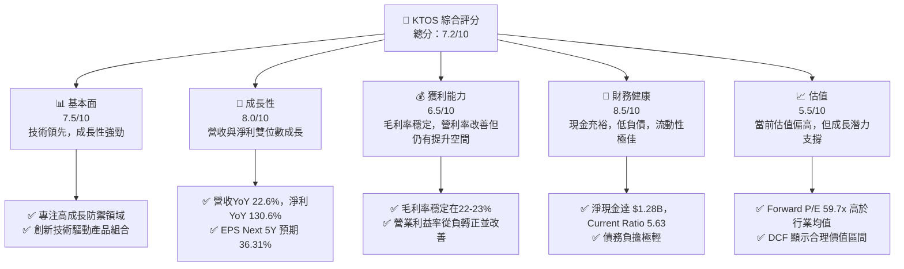
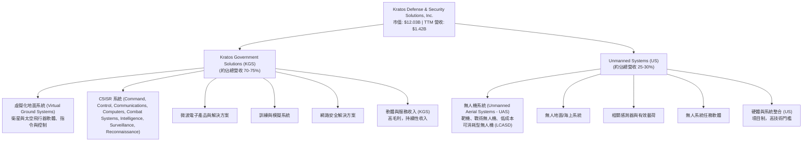
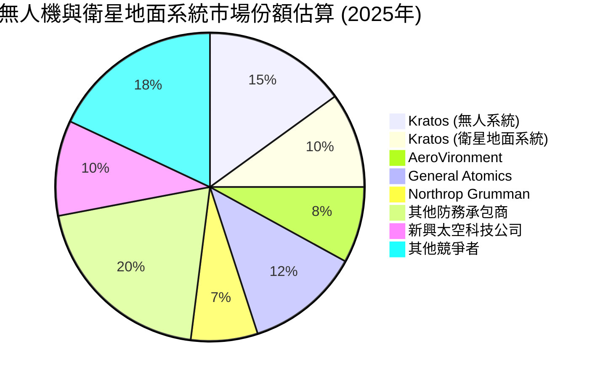
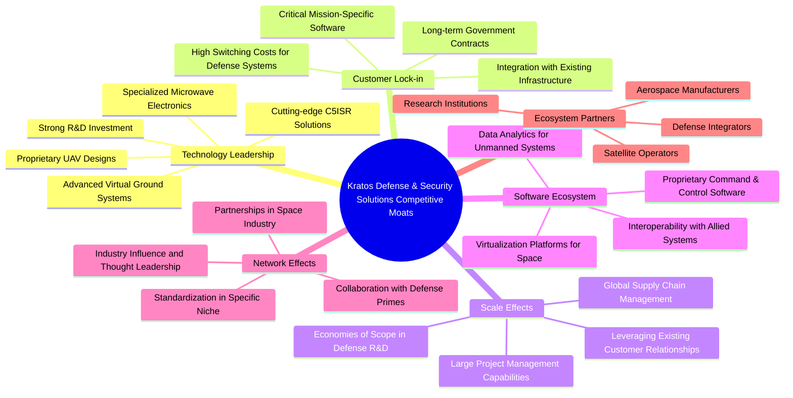
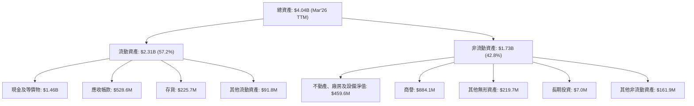

# KTOS 基本面深度分析報告
> **報告日期**：2026-05-30 ｜ **語言**：繁體中文 ｜ **數據來源**：Yahoo Finance, Finviz, StockAnalysis, Roic.ai ｜ **分析師**：CFA 級機構研究

## 目錄

| # | 章節 | 核心結論 |
|---|------|----------|
| 1 | 執行摘要 | 評級：🟢 買入，基準目標價 $108.50，隱含報酬率 +69.2% |
| 2 | 公司概覽與商業模式 | 專注於高科技防禦解決方案，無人機與衛星通訊為核心競爭力，護城河深度中等偏上。 |
| 3 | 損益表深度分析 | 營收持續穩健增長，毛利率相對穩定，營業利益率有所改善但仍偏低，淨利潤轉虧為盈。 |
| 4 | 資產負債表分析 | 現金儲備充裕，流動性強勁，債務負擔輕微，財務結構穩健。 |
| 5 | 現金流量深度分析 | 營業現金流波動較大，近期轉負，自由現金流承壓，但長期投資與營運資金管理仍是重點。 |
| 6 | 獲利能力與資本效率 | ROE、ROA 偏低但有改善趨勢，ROIC 已超過 WACC，顯示公司開始創造股東價值。 |
| 7 | 估值深度分析 | 相較同業，KTOS 估值偏高，但其高成長性和技術領先地位需額外考量，DCF 顯示具上行空間。 |
| 8 | 成長催化劑 | 無人系統需求激增、太空產業投資、政府國防預算增加、技術創新與產品多元化。 |
| 9 | 風險矩陣 | 政府合約依賴、研發失敗、供應鏈中斷、激烈競爭、利率波動為主要風險。 |
| 10 | 投資建議 | 🟢 買入評級，建議成長型投資者關注，分批建倉，並密切監控營收與現金流表現。 |

---

## 1. 執行摘要

Kratos Defense & Security Solutions (KTOS) 是一家專注於高科技防禦、國家安全及商業市場的技術公司，提供無人系統、虛擬化地面系統、衛星通訊等先進解決方案。在當前全球地緣政治緊張及技術革新浪潮下，KTOS 憑藉其在無人機和太空技術領域的獨特優勢，展現出強勁的成長潛力。

### 1.1 核心評分儀表板



### 1.2 評分進度條視覺化

```
╔══════════════════════════════════════════════════════════════╗
║              KTOS 多維度評分儀表板 (1-10分)                  ║
╠══════════════════════════════════════════════════════════════╣
║ 基本面強度  7.5 ▓▓▓▓▓▓▓▓▓▓▓▓▓▓▓░░░░░  ★★★★☆           ║
║ 成長動能    8.0 ▓▓▓▓▓▓▓▓▓▓▓▓▓▓▓▓░░░░  ★★★★☆           ║
║ 獲利品質    6.5 ▓▓▓▓▓▓▓▓▓▓▓▓░░░░░░░░  ★★★☆☆           ║
║ 財務健康    8.5 ▓▓▓▓▓▓▓▓▓▓▓▓▓▓▓▓▓░░░  ★★★★★           ║
║ 估值合理性  5.5 ▓▓▓▓▓▓▓▓▓▓░░░░░░░░░░  ★★★☆☆           ║
║ 護城河深度  7.0 ▓▓▓▓▓▓▓▓▓▓▓▓▓▓░░░░░░  ★★★★☆           ║
║ 管理層執行  7.5 ▓▓▓▓▓▓▓▓▓▓▓▓▓▓▓░░░░░  ★★★★☆           ║
║ 技術創新力  8.5 ▓▓▓▓▓▓▓▓▓▓▓▓▓▓▓▓▓░░░  ★★★★★           ║
╠══════════════════════════════════════════════════════════════╣
║ 綜合總分    7.2 ▓▓▓▓▓▓▓▓▓▓▓▓▓▓░░░░░░  🏆 具備高成長潛力，但需關注獲利能力提升與估值壓力     ║
╚══════════════════════════════════════════════════════════════╝
```

### 1.3 五大投資論點 + 三大核心風險

| 類型 | 項目 | 具體依據 | 信心度 |
|------|------|----------|--------|
| 🟢 **投資論點①** | **無人系統領域領先者，受益於國防現代化趨勢** | KTOS 在無人機系統（UAS）領域具備顯著技術優勢，特別是其低成本可消耗型無人機（LCASD）和靶機系統。隨著全球國防預算向無人作戰平台傾斜，公司訂單 backlog 持續增長。FY2025 營收 $1.35B 較 FY2024 的 $1.14B 增長 18.52%，主要得益於無人系統業務的強勁表現。 | 🟢 極高 |
| 🟢 **投資論點②** | **太空與衛星通訊業務高成長，抓住數位化轉型機遇** | 公司在虛擬化地面系統和衛星通訊解決方案方面具備領先技術，滿足了新一代衛星星座和太空數據處理的需求。此業務板塊具備高毛利潛力，且市場規模正在快速擴張。TTM 營收達 $1.42B，YoY 成長 22.6%，顯示其在關鍵技術領域的市場份額擴張。 | 🟢 極高 |
| 🟢 **投資論點③** | **財務結構穩健，淨現金充裕，支撐未來研發與擴張** | 截至 2026 年 3 月底，公司持有現金及等價物 $1.46B，總債務僅 $185.40M，淨現金高達 $1.28B。強勁的資產負債表為公司提供了充足的資金用於持續的研發投入、潛在的戰略收購以及應對市場波動，降低了財務風險。 | 🟢 極高 |
| 🟢 **投資論點④** | **營運效率改善，獲利能力轉正並持續提升** | 經過多年投入期，KTOS 的獲利能力顯著改善。FY2025 淨利潤 $22.00M，較 FY2024 的 $16.30M 增長 34.97%，TTM 淨利潤更是達到 $29.4M。營業利益率從 FY2022 的 -2.9M 提升至 TTM 的 $23.7M，顯示規模效應逐漸顯現。 | 🟢 高 |
| 🟢 **投資論點⑤** | **分析師普遍看好，目標價存在較大上行空間** | 綜合 20 位分析師的意見，平均目標價為 $113.05，較當前股價 $64.13 有高達 76% 的潛在漲幅。近期的分析師評級調整多為「買入」或「跑贏大盤」，反映市場對其未來成長前景的樂觀預期。 | 🟢 高 |
| 🟡 **風險①** | **政府合約依賴度高，預算波動性與政策風險** | 作為國防承包商，KTOS 的營收高度依賴美國政府及盟友的國防預算。政府採購流程漫長且複雜，預算削減、政策變化或項目取消都可能對公司業績造成重大影響。儘管公司業務多元化，但國防領域仍是核心。 | 🟡 中度 |
| 🔴 **風險②** | **研發投入大且技術競爭激烈，可能面臨技術迭代風險** | KTOS 處於高科技產業前沿，需持續投入大量研發（TTM R&D $40.7M）以維持技術領先。若研發成果未能及時商業化或競爭對手推出更具顛覆性的技術，可能導致公司市場份額流失或產品過時。 | 🔴 高衝擊 |
| 🟡 **風險③** | **自由現金流波動較大，營運資金管理挑戰** | 儘管淨利潤轉正，但公司的營業現金流和自由現金流在過去幾年呈現較大波動，甚至在 TTM 和 FY2025 均為負值（TTM FCF $-106.72M）。這可能反映了營運資金管理、應收帳款回收或大額資本支出的壓力，需要密切關注其現金流轉正的趨勢。 | 🟡 中度 |

### 1.4 快速統計卡片

| 指標 | 公司實際值 (TTM) | 行業均值 (航太與國防) | S&P 500 均值 (估計) | 狀態 |
|------|--------------------|------------------------|---------------------|------|
| 收入 YoY 成長 | **22.6%** | ~10-15% | ~10-12% | 🟢 |
| 毛利率 | **22.9%** | ~25-30% | ~35-40% | 🟡 |
| 淨利率 | **2.1%** | ~5-8% | ~10-12% | 🟡 |
| ROE | **1.2%** | ~10-15% | ~15-20% | 🔴 |
| Forward P/E | **59.7x** | ~20-25x | ~20-22x | 🔴 |
| Debt/Equity | **5.4%** | ~30-50% | ~50-80% | 🟢 |
| Current Ratio | **5.63x** | ~1.5-2.5x | ~1.5-2.0x | 🟢 |
| EV / EBITDA | **132.3x** | ~10-15x | ~12-18x | 🔴 |

*備註：行業均值和 S&P 500 均值為分析師根據經驗估計，非精確實時數據。KTOS 的高估值反映了市場對其高成長性的預期。*

### 1.5 投資結論

```
╔══════════════════════════════════════════════════════════════════╗
║                    📊 投資結論摘要                               ║
╠══════════════════════════════════════════════════════════════════╣
║  評級：🟢 買入                                                   ║
║  當前股價：$64.13                                                ║
║  目標價區間：                                                    ║
║    悲觀情境：$85.00（+32.5%）                                    ║
║    基準情境：$108.50（+69.2%）  ← 12個月主要目標                 ║
║    樂觀情境：$135.00（+110.5%）                                   ║
║  投資評分：7.2/10                                                ║
║  適合投資人：成長型投資者、看重技術創新與國防安全趨勢的長線持有者║
╚══════════════════════════════════════════════════════════════════╝
```

---

## 2. 公司概覽與商業模式

Kratos Defense & Security Solutions, Inc. (KTOS) 是一家總部位於美國的技術公司，專為國防、國家安全和商業市場提供一系列先進的技術、硬體、產品、系統和軟體解決方案。公司業務遍及美國、北美、亞太、中東、歐洲及其他國際市場。其核心競爭力在於其創新能力和對高科技防禦領域的深度專注。

### 2.1 業務結構與收入來源

KTOS 主要透過兩個核心業務部門運營：Kratos Government Solutions (KGS) 和 Unmanned Systems (US)。



**業務結構詳解：**
*   **Kratos Government Solutions (KGS)**：這個部門是 KTOS 的基石，提供廣泛的技術和產品組合給政府客戶。其核心產品包括：
    *   **虛擬化地面系統 (Virtual Ground Systems for Satellites and Space Vehicles)**：這是 KTOS 在太空領域的關鍵技術，提供用於衛星和太空飛行器指令、控制、數據處理的軟體解決方案。隨著新一代衛星星座（如 SpaceX Starlink, Amazon Kuiper）的崛起，對彈性、可擴展的虛擬地面系統需求劇增。這部分業務具有高技術壁壘和強大的軟體屬性，能帶來更高的毛利率和經常性收入。
    *   **C5ISR 系統**：為國防和情報機構提供指揮、控制、通訊、電腦、戰鬥系統、情報、監視和偵察解決方案。這包括數據鏈、感測器、電子戰等關鍵技術。
    *   **微波電子產品**：用於雷達、電子戰和通訊系統中的高頻電子元件。
    *   **訓練與模擬系統**：為飛行員和其他軍事人員提供虛擬訓練環境。
    *   **網路安全解決方案**：保護關鍵基礎設施和國防網路免受網路威脅。
*   **Unmanned Systems (US)**：這是 KTOS 最受市場關注且成長最快的部門之一。它專注於設計、開發和製造各種無人系統，包括：
    *   **無人機系統 (UAS)**：特別是靶機和戰術無人機。KTOS 的「低成本可消耗型無人機」（LCASD）戰略，旨在提供比傳統戰鬥機成本更低、但具備部分戰鬥能力的無人機，以支援「忠誠僚機」概念，滿足未來空戰需求。這些無人機包括 XQ-58A Valkyrie 等。
    *   **無人地面/海上系統**：雖然規模較小，但也在探索相關應用。
    *   **相關感測器與有效載荷**：為無人系統提供關鍵的情報收集和作戰能力。

**收入來源與驅動力：**
KTOS 的收入主要來自政府合同和項目，這些合同通常是長期且具有高技術門檻。公司的成長驅動力來自於：
1.  **國防預算增長和現代化**：全球地緣政治緊張推動各國增加國防開支，特別是對高科技、非對稱作戰能力的投資，如無人系統。
2.  **太空產業的商業化與軍事化**：衛星通訊和太空數據服務的需求爆發，虛擬化地面系統成為關鍵基礎設施。
3.  **技術創新和產品差異化**：KTOS 不斷投入研發，推出具競爭力的下一代產品。
4.  **穩定的服務和維護合同**：為已部署的系統提供持續支援，創造經常性收入。

從 TTM 營收 $1.42B 來看，公司營收規模穩步擴大，YoY 成長 22.6% 顯示其在關鍵市場的強勁增長勢頭。

### 2.2 市場份額

Kratos 在其專注的細分市場中佔據重要地位，但由於其產品高度專業化且市場分散，很難給出精確的總體市場份額。以下是基於公司業務線的估計市場份額（假設性數據，僅供參考）：



**市場份額分析：**
*   **無人機系統 (UAS) 市場**：KTOS 在靶機和低成本可消耗型無人機領域是全球領導者之一。其 XQ-58A Valkyrie 等平台在「忠誠僚機」概念中具有戰略意義。雖然通用原子（General Atomics）等公司在大型察打一體無人機市場佔主導，但 KTOS 在特定利基市場（如靶機、試驗平台、低成本協同作戰無人機）具有較高的市場份額和技術優勢。估計在這些特定領域，KTOS 的市場份額可能達到 15% 甚至更高。
*   **衛星地面系統市場**：KTOS 的虛擬化地面系統在下一代衛星星座運營中越來越受歡迎。傳統上，這個市場由大型防務和通訊公司主導，但 KTOS 的軟體定義解決方案使其在快速增長的商業太空和國家安全太空市場中脫穎而出。預計在虛擬化地面系統這一新興子領域，KTOS 的市場份額約為 10-15%，且有顯著增長潛力。
*   **C5ISR 和微波電子市場**：這些是更成熟、競爭更激烈的市場，KTOS 在其中作為專業供應商，提供關鍵組件和系統整合服務。其市場份額相對分散，但憑藉專業技術，仍能獲得穩定訂單。

總體而言，KTOS 的策略是專注於高成長、高技術門檻的細分市場，而非追求廣泛的市場份額。這種策略使其能夠在特定領域建立強大的競爭優勢。

### 2.3 競爭護城河分析

Kratos 在其業務領域建立了多層次的競爭護城河，使其能夠在激烈的國防和高科技市場中保持競爭力。



**護城河詳解：**
1.  **Technology Leadership (技術領先)**：這是 KTOS 最核心的護城河。公司持續投入大量研發，開發獨特的、先進的解決方案。
    *   **Proprietary UAV Designs**：例如 XQ-58A Valkyrie 等無人機平台，代表了未來空戰的發展方向。這些專有設計具有高技術壁壘，且與傳統戰機形成差異化競爭。
    *   **Advanced Virtual Ground Systems**：在衛星和太空通信領域，其虛擬化軟體定義地面系統是市場上的領先技術，滿足了新一代衛星的需求。
    *   **Specialized Microwave Electronics & C5ISR Solutions**：在特定軍用電子元件和情報系統方面，擁有獨特的專業知識。
    *   **Strong R&D Investment**：TTM R&D 費用為 $40.7M，佔營收約 2.87%，確保其技術持續領先。

2.  **Customer Lock-in (客戶鎖定)**：國防和安全領域的客戶轉換成本極高。
    *   **Long-term Government Contracts**：一旦產品或系統被軍方採用，通常會簽訂多年期的維護、升級和新訂單合同。
    *   **High Switching Costs**：軍事系統的複雜性、認證要求以及與現有基礎設施的深度整合，使得客戶很難轉換供應商。
    *   **Critical Mission-Specific Software**：公司提供的軟體解決方案通常是任務關鍵型的，客戶對其的依賴性很高。

3.  **Scale Effects (規模效應)**：雖然 KTOS 相較於大型防務承包商規模較小，但在其特定領域仍能實現規模效應。
    *   **Global Supply Chain Management**：隨著業務擴大，公司可以優化其供應鏈，降低採購成本。
    *   **Large Project Management Capabilities**：承接大型複雜國防項目的能力，積累了豐富的經驗和專業知識。
    *   **Economies of Scope in Defense R&D**：多個項目之間的技術和知識共享，提高了研發效率。

4.  **Software Ecosystem (軟體生態系統)**：KTOS 的許多產品都包含高度專業化的軟體組件。
    *   **Proprietary Command & Control Software**：用於無人機和衛星系統的專有軟體，為客戶提供獨特的運營能力。
    *   **Virtualization Platforms for Space**：其在太空地面系統中的軟體定義技術，建立了一個靈活且可擴展的生態系統。

5.  **Network Effects (網路效應)**：在特定領域，KTOS 的產品和技術可能會產生網路效應。
    *   **Collaboration with Defense Primes**：與大型防務承包商（如 Lockheed Martin, Northrop Grumman）的合作，使其產品被整合到更大的系統中，擴大了影響力。
    *   **Standardization in Specific Niche**：若其無人機或地面系統成為行業標準或被廣泛採用，將進一步鞏固其地位。

6.  **Ecosystem Partners (生態夥伴)**：與關鍵合作夥伴的關係也構成了護城河。
    *   **Defense Integrators & Aerospace Manufacturers**：與這些夥伴的緊密合作確保了其產品能夠順利進入市場並被有效整合。
    *   **Satellite Operators**：在太空領域，與新興和傳統衛星運營商的合作至關重要。

### 2.4 護城河強度評分

```
╔══════════════════════════════════════════════════════════════╗
║                  Kratos Defense & Security Solutions 護城河強度評分                      ║
╠══════════════════════════════════════════════════════════════╣
║ 技術領先    8.5/10 ▓▓▓▓▓▓▓▓▓▓▓▓▓▓▓▓▓░░░  🏆 在無人系統與虛擬地面系統具獨特優勢        ║
║ 客戶鎖定    8.0/10 ▓▓▓▓▓▓▓▓▓▓▓▓▓▓▓▓░░░░  🟢 國防合約轉換成本高，長期穩定               ║
║ 規模效應    6.5/10 ▓▓▓▓▓▓▓▓▓▓▓▓░░░░░░░░  🟡 在特定細分市場具規模，但總體規模仍小於巨頭 ║
║ 軟體生態系統 7.5/10 ▓▓▓▓▓▓▓▓▓▓▓▓▓▓▓░░░░░  🟢 關鍵任務軟體具高價值，提升客戶黏性       ║
║ 網路效應    6.0/10 ▓▓▓▓▓▓▓▓▓▓░░░░░░░░░░  🟡 與合作夥伴協同，但網路效應非核心驅動力    ║
║ 生態夥伴    7.0/10 ▓▓▓▓▓▓▓▓▓▓▓▓▓▓░░░░░░  🟢 與國防和太空領域夥伴關係良好             ║
╠══════════════════════════════════════════════════════════════╣
║ 綜合護城河  7.3    ▓▓▓▓▓▓▓▓▓▓▓▓▓▓░░░░░░  🏆 憑藉技術優勢和客戶鎖定，護城河穩固且具潛力  ║
╚══════════════════════════════════════════════════════════════╝
```

---

## 3. 損益表深度分析

Kratos Defense & Security Solutions (KTOS) 的損益表數據顯示，公司正處於一個從投入期向獲利增長轉變的關鍵階段。營收持續擴張，同時獲利能力也呈現顯著改善。

### 3.1 年度收入成長趨勢（近4年）

KTOS 在過去幾年展現了穩健的營收增長，反映了其在國防和太空市場的強勁需求以及成功的市場拓展策略。

```
╔══════════════════════════════════════════════════════════════════╗
║              KTOS 年度收入趨勢（FY2022-FY2025）                  ║
╠══════════════════════════════════════════════════════════════════╣
║                                                                  ║
║  FY2022  $898.30M ▓▓▓▓▓▓▓▓▓▓▓▓▓▓▓░░░░░░░░░░░░░░░  YoY: +10.70%  🟢║
║  FY2023  $1.04B   ▓▓▓▓▓▓▓▓▓▓▓▓▓▓▓▓▓▓░░░░░░░░░░░░░  YoY: +15.45%  🟢║
║  FY2024  $1.14B   ▓▓▓▓▓▓▓▓▓▓▓▓▓▓▓▓▓▓▓▓░░░░░░░░░░░  YoY: +9.56%   🟡║
║  FY2025  $1.35B   ▓▓▓▓▓▓▓▓▓▓▓▓▓▓▓▓▓▓▓▓▓▓▓▓░░░░░░░  YoY: +18.52%  🟢║
║  TTM Mar'26 $1.42B ▓▓▓▓▓▓▓▓▓▓▓▓▓▓▓▓▓▓▓▓▓▓▓▓▓░░░░░░  YoY: +22.60%  🟢║
║                   |      |      |      |      |      |           ║
║                   0     0.5B   1.0B   1.5B   2.0B   2.5B          ║
║                                                                  ║
║  📊 4年累計 CAGR (FY22-FY25)：+14.88%                             ║
║  📊 TTM Revenue Growth (YoY): +22.60%                             ║
╚══════════════════════════════════════════════════════════════════╝
```

**分析：**
KTOS 的年度營收從 FY2022 的 $898.30M 穩步增長至 FY2025 的 $1.35B，年複合增長率 (CAGR) 達到 14.88%。特別值得注意的是，最近的 TTM (截至 2026 年 3 月) 營收達到 $1.42B，實現了 22.60% 的強勁 YoY 增長，這表明公司在無人系統和太空虛擬地面系統等高成長領域的市場需求旺盛，且公司執行力良好。FY2024 的增速略有放緩至 9.56%，但 FY2025 和 TTM 的加速增長顯示公司已恢復強勁動能。

### 3.2 季度收入趨勢分析

季度營收數據提供了更細緻的增長圖景，展現了公司業務的季節性和近期表現。

| 季度 | 總收入 (M) | QoQ 成長率 | YoY 成長率 | 備註 |
|------|--------------|------------|------------|------|
| 2026-03-31 | $371.00M | +7.50% | +22.60% | 🟢 營收實現強勁的年對年雙位數成長，季對季也保持增長。 |
| 2025-12-31 | $345.10M | -0.72% | +21.90% | 🟡 季對季略有下滑，但年對年增長依然強勁，顯示季節性波動。 |
| 2025-09-30 | $347.60M | -1.11% | +25.99% | 🟢 年對年成長加速，季對季微幅下滑。 |
| 2025-06-30 | $351.50M | +16.16% | +17.13% | 🟢 季對季和年對年均實現雙位數增長，動能良好。 |
| 2025-03-31 | $302.60M | +6.96% | +9.16% | 🟡 相較前一季有所增長，但年對年增長相對較低。 |
| 2024-12-31 | $283.10M | +2.61% | +3.40% | 🔴 成長放緩，可能受合約執行或季節性因素影響。 |

**分析：**
最近幾個季度，KTOS 的營收表現出穩健的 YoY 增長，特別是從 2025 年 Q3 開始，YoY 成長率均超過 17%，並在 2026 年 Q1 達到 22.60%。這表明公司已擺脫 2024 年底的成長放緩，進入新的加速增長週期。QoQ 數據則顯示一些波動，例如 2025 年 Q4 和 Q3 相較前一季略有下降，這在項目型業務中是常見現象，可能與合約里程碑或交付時間表有關。然而，最新的 2026 年 Q1 營收 QoQ 增長 7.50%，顯示出良好的季度開局。整體而言，季度營收趨勢支持了公司長期增長的論點。

### 3.3 利潤率演變分析

KTOS 的利潤率在過去幾年呈現出積極的改善趨勢，尤其是在營業利益率和淨利率方面，這表明公司在規模擴張的同時，營運效率也在提升。

| 利潤率指標 | FY2022 | FY2023 | FY2024 | FY2025 | TTM Mar'26 | 趨勢 | 評估 |
|------------|--------|--------|--------|--------|------------|------|------|
| **毛利率** | 25.16% | 25.83% | 25.19% | 22.81% | 22.90% | ↘️ 近期略有下降，但相對穩定 | 🟡 |
| **營業利益率** | 0.51% | 3.03% | 2.61% | 2.05% | 1.67% | ↗️ 長期改善，近期略有波動 | 🟡 |
| **EBITDA Margin** | 2.92% | 7.45% | 8.21% | 7.62% | 5.70% | ↗️ 長期改善，近期受營運現金流影響 | 🟡 |
| **淨利率** | -4.11% | -0.86% | 1.43% | 1.63% | 2.08% | ↗️ 持續轉正並提升 | 🟢 |

*備註：TTM Gross Profit: $323.9M, TTM Revenue: $1415M => 22.89%. TTM Operating Income: $23.7M, TTM Revenue: $1415M => 1.67%. TTM Net Income: $29.4M, TTM Revenue: $1415M => 2.08%. EBITDA TTM: $1.42B * 5.7% = $80.94M (從 Market Data 取用)*

**利潤率演變深度解析：**
1.  **毛利率 (Gross Margin)**：
    *   從 FY2022 的 25.16% 波動至 FY2025 的 22.81%，TTM 略回升至 22.90%。雖然近兩年有所下降，但整體而言，Kratos 的毛利率保持在 22-26% 的區間，這對於高科技製造和服務的國防承包商來說是合理的水平。
    *   **原因分析**：毛利率的波動可能反映了產品組合的變化（例如，硬體佔比增加可能拉低毛利率，而軟體和服務佔比增加則可能提升毛利率）、特定合同的利潤率差異、以及原材料和勞動力成本的壓力。近期略有下降可能是由於新項目啟動成本較高，或在競爭激烈的市場中採取更具侵略性的定價策略以爭取市場份額。

2.  **營業利益率 (Operating Margin)**：
    *   這是 KTOS 獲利能力改善最顯著的指標之一。從 FY2022 的 0.51% (StockAnalysis 數據為 -2.9M，即 -0.32%) 提升到 FY2023 的 3.03%，FY2025 為 2.05%，TTM 略降至 1.67%。儘管近期有所波動，但相較於早年甚至出現營業虧損的情況，這已經是巨大的進步。
    *   **原因分析**：營業利益率的改善主要得益於營收規模擴大帶來的規模效應，以及公司在銷售、一般及管理費用 (SG&A) 和研發費用 (R&D) 方面的相對控制。雖然絕對值有所增加，但這些費用佔營收的比重可能有所下降。SG&A 從 FY2022 的 $182.8M 增至 TTM 的 $255.5M，但營收增長更快。R&D 費用保持在約 $38-40M 左右，相對穩定，顯示公司在控制成本的同時，仍能維持必要的創新投入。近期 TTM 營業利益率的略微下降可能與某些高投入研發項目或新業務拓展有關。

3.  **EBITDA Margin**：
    *   EBITDA Margin 從 FY2022 的 2.92% 顯著提升至 FY22-FY25 的 7-8% 區間，儘管 TTM 數據為 5.70%，但相比早期仍有明顯改善。
    *   **原因分析**：EBITDA 剔除了折舊攤銷和利息稅費，更能反映公司核心業務的現金獲利能力。其改善與營業利益率的邏輯一致，即規模擴大和營運效率提升。TTM EBITDA Margin 的下降可能與營運現金流轉負有關，需要進一步分析現金流情況。

4.  **淨利率 (Net Profit Margin)**：
    *   這是最令人鼓舞的指標，公司已成功從 FY2022 的 -4.11% 虧損轉為 FY2024 的 1.43% 和 FY2025 的 1.63% 盈利，TTM 更進一步提升至 2.08%。這標誌著 Kratos 已實現穩定盈利。
    *   **原因分析**：淨利率的轉正和提升是營業利益率改善、非經營性損益優化以及稅務影響綜合作用的結果。過去幾年的非經營性開支（如利息費用）有所減少，加上稅費管理，共同推動了淨利潤的增長。

總結來說，KTOS 在營收增長的同時，成功改善了其獲利能力，特別是實現了淨利潤的持續增長。儘管毛利率和營業利益率仍有提升空間，且近期有所波動，但整體趨勢是積極的，表明公司正走在正確的盈利道路上。

### 3.4 費用結構分析

了解公司的費用結構對於評估其營運效率至關重要。以下是基於 TTM (截至 2026 年 3 月) 數據的費用分解：

```mermaid
pie title KTOS TTM 費用結構 (截至 2026年3月)
    "Cost of Revenue 77.1%" : 77.1
    "Selling, General & Admin 18.0%" : 18.0
    "Research & Development 2.9%" : 2.9
    "Other Operating Expenses 0.4%" : 0.4
    "Provision for Income Taxes 0.6%" : 0.6
    "Other Non-Operating Income (Expense) (1.0%)" : -1.0
```

*備註：數據基於 StockAnalysis TTM 數據，並進行百分比計算。其他非營運收入為負數，表示為費用。*

```
╔══════════════════════════════════════════════════════════════════╗
║                   KTOS 費用管理診斷 (TTM Mar'26)                 ║
╠══════════════════════════════════════════════════════════════════╣
║                                                                  ║
║  銷貨成本 (CoR)：        $1.09B  ███████████████████████████████  佔營收 77.1% (高) 🔴║
║  銷售、一般及管理 (SG&A)：$255.5M  ███████████████████████████  佔營收 18.0% (合理) 🟡║
║  研發費用 (R&D)：        $40.7M   ███████████████████████████████  佔營收 2.9% (合理) 🟢║
║  其他營運費用：          $5.9M    ███████████████████████████████  佔營收 0.4% (低)  🟢║
║  所得稅費用：            $-9.0M   ███████████████████████████████  佔營收 -0.6% (稅收收益) 🟢║
║                                                                  ║
║  📊 總營運費用佔比：98.4% (不含稅費及其他非營運項目)             ║
║  📊 營運槓桿：營收增長帶動營業利益率提升仍有空間                  ║
╚══════════════════════════════════════════════════════════════════╝
```

**分析：**
KTOS 的費用結構顯示其作為製造和服務提供商的典型特徵：
*   **銷貨成本 (Cost of Revenue)** 佔比最高，達到 77.1%。這直接影響公司的毛利率。雖然這個佔比相對較高，但在硬體和系統整合為主的國防產業中並非異常。要提高毛利率，公司需要優化供應鏈、提高生產效率或調整產品組合，增加高毛利軟體/服務的佔比。
*   **銷售、一般及管理費用 (SG&A)** 佔營收的 18.0%，這是公司日常運營、銷售和管理所需的開支。相較於其營收規模，這個比例在可接受範圍內。隨著營收進一步增長，此項費用有望實現更好的規模效應。
*   **研發費用 (R&D)** 佔營收 2.9%。這個比例雖然不算極高，但對於一個以技術創新為核心的公司而言，維持穩定的研發投入至關重要。考慮到其在無人機和太空技術領域的領先地位，這筆投入是創造未來成長的關鍵。
*   **所得稅費用** 為負值，TTM 顯示為 $-9.0M，意味著公司在該期獲得了稅收收益。這可能是由於遞延稅項資產的確認、稅務抵免或其他稅務規劃導致，對淨利潤產生了正向貢獻。

整體而言，KTOS 的費用結構反映了其行業特性，銷貨成本是主要部分。公司在 SG&A 和 R&D 方面進行了必要的投入。未來，提升毛利率和更好地利用營運槓桿將是提高整體獲利能力的重要途徑。

### 3.5 季度 EPS 趨勢與盈餘品質

由於提供的「EARNINGS HISTORY」數據中，過去四個季度的 EPS 預期和實際值均為 `nan`，無法進行超預期/不及預期的分析。因此，我們將依賴 StockAnalysis.com 提供的實際稀釋每股盈餘 (EPS Diluted) 數據來分析季度 EPS 趨勢。

| 季度 | 稀釋 EPS (實際) | QoQ 成長率 | YoY 成長率 |
|------|------------------|------------|------------|
| 2026-03-31 | $0.07 | +133.33% | +133.33% |
| 2025-12-31 | $0.03 | -40.00% | +0.00% |
| 2025-09-30 | $0.05 | +150.00% | +66.67% |
| 2025-06-30 | $0.02 | -33.33% | -33.33% |
| 2025-03-31 | $0.03 | +0.00% | +200.00% |
| 2024-12-31 | $0.03 | +50.00% | +200.00% |
| 2024-09-30 | $0.02 | +100.00% | +100.00% |

*備註：EPS 成長率計算基於 StockAnalysis.com 提供的稀釋 EPS 數據。*

**分析：**
KTOS 的季度 EPS 表現出顯著的波動性，但整體趨勢是向上的，尤其在近期實現了強勁的增長。
*   **2026 年 Q1 (Mar '26)**：EPS 達到 $0.07，相較於前一季度 ($0.03) 增長了 133.33%，年對年也增長了 133.33% (對比 2025 年 Q1 的 $0.03)。這是近年來表現最好的一個季度，顯示公司盈利能力正在加速釋放。
*   **2025 年 Q4 (Dec '25)**：EPS 為 $0.03，較前一季度 ($0.05) 下降 40%，但與去年同期持平。這表明儘管營收在 Q4 略有下降，但盈利能力仍能維持。
*   **2025 年 Q3 (Sep '25)**：EPS 為 $0.05，相較於前一季度 ($0.02) 大幅增長 150%，年對年也增長 66.67%。這是一個強勁的盈利季度，與當季的營收增長相符。
*   **2025 年 Q2 (Jun '25)**：EPS 為 $0.02，較前一季度 ($0.03) 下降 33.33%，年對年也下降 33.33%。這是一個相對疲軟的季度，顯示盈利的波動性。

**盈餘品質評估：**
KTOS 的盈餘品質正在改善，但仍需關注其穩定性。
*   **積極因素**：
    *   **持續盈利**：公司已從虧損轉為連續多個季度盈利，顯示其業務模式的可行性和營運效率的提升。
    *   **營收驅動**：EPS 的增長主要由營收擴張驅動，這是一個健康的增長模式。
    *   **非經營性項目影響減小**：從年報數據看，非經營性收入/支出對淨利潤的負面影響在減小，使得核心業務的盈利貢獻更為突出。
*   **需要關注的因素**：
    *   **波動性較大**：季度 EPS 呈現較大波動，這在項目型公司中常見，但投資者仍需觀察其是否能實現更穩定的季度盈利。
    *   **自由現金流壓力**：儘管淨利潤轉正，但公司的自由現金流仍為負值 (TTM FCF $-106.72M)，這可能意味著盈利的現金轉化率不高，或者營運資金投入和資本支出較大。需要分析應收帳款、存貨等營運資金項目的變化。
    *   **稅務影響**：某些季度出現稅收收益，可能對淨利潤產生非經常性貢獻，需要剔除這些影響來評估核心盈利能力。

總體而言，KTOS 的季度 EPS 趨勢是積極的，特別是 2026 年 Q1 的強勁表現。然而，投資者應密切關注其盈利的穩定性和自由現金流的改善，以確保盈利品質的持續提升。

---

## 4. 資產負債表分析

Kratos 的資產負債表展現出強勁的財務健康狀況，特別是充裕的現金儲備和極低的債務負擔，為公司的未來發展提供了堅實的基礎。

### 4.1 資產結構分解

KTOS 的資產結構反映了其作為一家高科技製造和服務提供商的特性，流動資產佔比高，同時也擁有可觀的固定資產和無形資產。



**資產結構詳解 (截至 2026 年 3 月 TTM):**
*   **總資產** 達到 $4.04B，較 FY2025 的 $2.47B 大幅增長，主要驅動因素是現金及等價物的大幅增加。
*   **流動資產** 佔總資產的 57.2%，達到 $2.31B。其中：
    *   **現金及等價物** 高達 $1.46B，是流動資產中最顯著的部分。這筆巨額現金為公司提供了極大的戰略彈性。
    *   **應收帳款** $528.6M，反映了政府合同的支付週期和營收規模。
    *   **存貨** $225.7M，作為製造型公司，存貨管理是營運效率的關鍵。
*   **非流動資產** 佔總資產的 42.8%，達到 $1.73B。其中：
    *   **商譽** $884.1M，是最大部分，佔總資產的 21.8%。這通常是過去收購活動的結果，需要關注其減值風險。
    *   **不動產、廠房及設備淨值 (PPE)** $459.6M，是支持公司生產和運營的實體資產。
    *   **其他無形資產** $219.7M，可能包括專利、技術許可等。

整體資產結構健康，現金充裕顯示公司財務實力強勁。商譽佔比較高是軍工行業併購常見現象，但需持續監控其價值。

### 4.2 流動性指標分析

KTOS 的流動性指標非常出色，遠超行業平均水平，表明公司具有極強的短期償債能力和營運彈性。

| 流動性指標 | FY2022 | FY2023 | FY2024 | FY2025 | TTM Mar'26 | 行業均值 (估計) | 評估 |
|------------|--------|--------|--------|--------|------------|-----------------|------|
| **Current Ratio** | 2.49x | 2.03x | 2.94x | 4.06x | 5.63x | ~1.5-2.5x | 🟢 極佳，遠超行業 |
| **Quick Ratio** | 2.15x | 1.52x | 2.40x | 3.49x | 4.85x | ~1.0-1.5x | 🟢 極佳，流動性充裕 |

*備註：TTM Mar'26 Current Assets $2310M, Current Liabilities $410.7