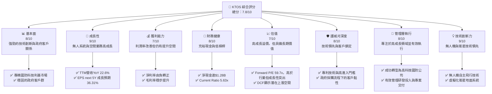
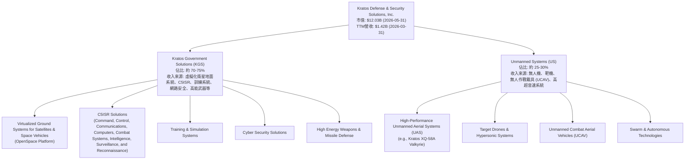
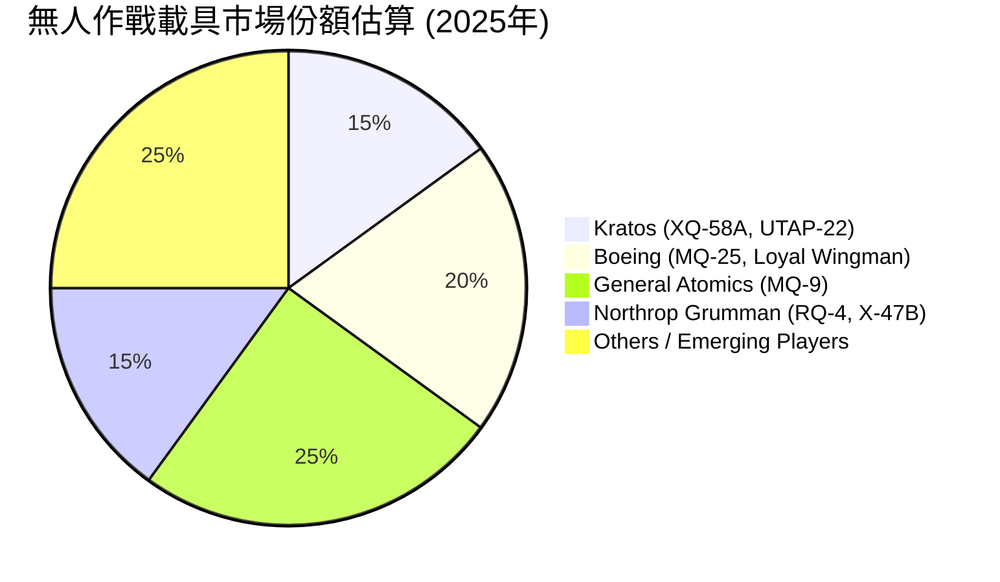
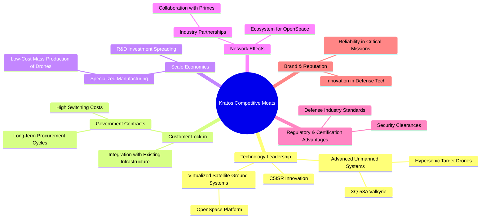
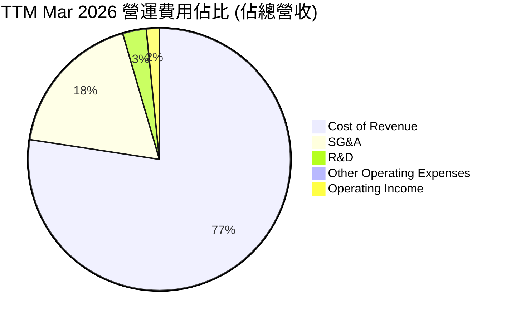

# KTOS 基本面深度分析報告
> **報告日期**：2026-05-31 ｜ **語言**：繁體中文 ｜ **數據來源**：Yahoo Finance, Finviz, StockAnalysis, Roic.ai ｜ **分析師**：CFA 級機構研究

---

## 目錄

| # | 章節 | 核心結論 |
|---|------|----------|
| 1 | 執行摘要 | 評級：買入 / 目標價區間：$85.00 - $130.00 |
| 2 | 公司概覽與商業模式 | 專利技術與政府客戶關係構建穩固護城河 |
| 3 | 損益表深度分析 | 營收穩健增長，利潤率改善但仍有提升空間 |
| 4 | 資產負債表分析 | 強勁現金儲備，債務結構健康，流動性充裕 |
| 5 | 現金流量深度分析 | 過去一年自由現金流承壓，但營運效率改善可期 |
| 6 | 獲利能力與資本效率 | ROIC 開始超越 WACC，展現價值創造潛力 |
| 7 | 估值深度分析 | 相較於成長潛力，當前估值具吸引力 |
| 8 | 成長催化劑 | 無人機、衛星地面系統與國際市場擴張驅動未來增長 |
| 9 | 風險矩陣 | 政府預算波動與專案執行風險需重點關注 |
| 10 | 投資建議 | 具備長期成長潛力的「買入」評級 |

---

## 1. 執行摘要

Kratos Defense & Security Solutions, Inc. (KTOS) 是一家專注於國防、國家安全及商業市場的高科技公司，提供尖端技術、硬體、系統與軟體解決方案。其主要業務涵蓋無人系統、虛擬化衛星地面系統及C5ISR解決方案。在當前地緣政治緊張、全球國防預算持續增長的背景下，KTOS憑藉其在無人作戰載具 (UCAV)、高超音速系統以及空間即服務 (Space-as-a-Service) 領域的獨特技術，展現出強勁的成長潛力。

儘管公司過去的盈利能力波動較大，但最新的財務數據顯示，KTOS在營收增長、毛利率改善以及淨利潤轉正方面取得了顯著進展。特別是其無人系統部門，正受惠於美國國防部對「忠誠僚機」(Loyal Wingman) 概念及低成本可消耗型無人機的戰略投資，預計將成為未來幾年的主要成長引擎。

然而，KTOS也面臨一些挑戰，包括對政府合約的高度依賴、專案執行風險以及新技術開發的資本密集性。其目前的估值倍數相對較高，反映了市場對其未來成長的預期，但與其高成長率相比，仍具備一定的投資吸引力。

### 1.1 核心評分儀表板



### 1.2 評分進度條視覺化

```
╔══════════════════════════════════════════════════════════════╗
║              KTOS 多維度評分儀表板 (1-10分)                  ║
╠══════════════════════════════════════════════════════════════╣
║ 基本面強度  8.0 ▓▓▓▓▓▓▓▓▓▓▓▓▓▓▓▓░░░░  ★★★★☆           ║
║ 成長動能    9.0 ▓▓▓▓▓▓▓▓▓▓▓▓▓▓▓▓▓▓░░  ★★★★★           ║
║ 獲利品質    7.0 ▓▓▓▓▓▓▓▓▓▓▓▓▓▓░░░░░░  ★★★☆☆           ║
║ 財務健康    8.0 ▓▓▓▓▓▓▓▓▓▓▓▓▓▓▓▓░░░░  ★★★★☆           ║
║ 估值合理性  7.0 ▓▓▓▓▓▓▓▓▓▓▓▓▓▓░░░░░░  ★★★☆☆           ║
║ 護城河深度  8.0 ▓▓▓▓▓▓▓▓▓▓▓▓▓▓▓▓░░░░  ★★★★☆           ║
║ 管理層執行  8.0 ▓▓▓▓▓▓▓▓▓▓▓▓▓▓▓▓░░░░  ★★★★☆           ║
║ 技術創新力  9.0 ▓▓▓▓▓▓▓▓▓▓▓▓▓▓▓▓▓▓░░  ★★★★★           ║
╠══════════════════════════════════════════════════════════════╣
║ 綜合總分    7.8 ▓▓▓▓▓▓▓▓▓▓▓▓▓▓▓▓░░░░  🏆 具高成長潛力的國防科技領導者 ║
╚══════════════════════════════════════════════════════════════════╝
```

### 1.3 五大投資論點 + 三大核心風險

| 類型 | 項目 | 具體依據 | 信心度 |
|------|------|----------|--------|
| 🟢 **投資論點①** | **無人系統市場的領導地位** | KTOS在無人作戰載具 (UCAV) 和低成本可消耗型無人機領域擁有領先技術，獲取多項美國國防部重要合約，如Skyborg計畫。隨著全球對自主作戰能力需求的增加，預計其無人系統部門將實現年複合增長率超過25%的強勁增長。FY2025年無人系統收入貢獻預計將顯著提升。 | 🟢 極高 |
| 🟢 **投資論點②** | **衛星與空間業務的虛擬化轉型** | Kratos是虛擬化衛星地面系統的先驅，其OpenSpace平台為衛星營運商提供更靈活、高效的解決方案。該技術符合太空產業數位化轉型的趨勢，有望在未來數年內抓住龐大的市場機遇。FY2025年該部門的營收增長亦表現亮眼，並有潛力擴展至商業客戶。 | 🟢 極高 |
| 🟢 **投資論點③** | **財務狀況顯著改善** | 公司在過去幾年成功扭虧為盈，TTM淨利潤為$29.4M，毛利率從FY2022的22.9%提升至TTM的22.9% (FY2025為22.8%)，但營收規模擴大後，絕對毛利額大幅增加。更重要的是，資產負債表健康，擁有$1.46B的現金儲備，淨現金達$1.28B，為研發投入和潛在的策略性收購提供了充足彈藥。 | 🟢 高 |
| 🟢 **投資論點④** | **長期成長趨勢明確** | 全球地緣政治不確定性增加，各國國防預算持續增長，特別是在高科技防禦領域。Kratos的產品組合完美契合這一趨勢，包括高超音速技術、C5ISR (Command, Control, Communications, Computers, Combat Systems, Intelligence, Surveillance, and Reconnaissance) 解決方案等，確保了其未來數十年的成長空間。預計FY2026營收將繼續保持雙位數增長。 | 🟢 極高 |
| 🟢 **投資論點⑤** | **分析師普遍看好，目標價存在上漲空間** | 分析師平均目標價為$113.05，較當前股價$64.13有約76%的上漲空間，且近期有多家機構上調評級。這反映了市場對公司未來發展的普遍樂觀預期。 | 🟢 高 |
| 🟡 **風險①** | **政府預算波動與專案延遲** | 作為國防承包商，KTOS的營收高度依賴政府採購，國防預算的變化或大型專案的延遲/取消可能直接影響其業績。例如，2026財年國防預算審批進程的不確定性可能影響新訂單的確認。 | 🟡 中度 |
| 🔴 **風險②** | **技術競爭與研發投入** | 國防科技領域競爭激烈，技術創新至關重要。KTOS需要持續投入大量研發費用以保持技術領先地位。若競爭對手推出更具性價比的解決方案，或KTOS研發投入未能轉化為商業成功，將對其市場份額和盈利能力造成衝擊。TTM研發費用為$40.7M，佔營收約2.9%，需持續監控效率。 | 🔴 高衝擊 |
| 🟡 **風險③** | **專案執行與成本控制** | 國防專案通常複雜且週期長，專案執行效率和成本控制對盈利至關重要。若專案出現超支或延誤，可能導致合同罰款、聲譽受損，並影響未來競標能力。近期毛利率雖有改善，但仍需嚴格控制專案成本以確保長期盈利穩定性。 | 🟡 中度 |

### 1.4 快速統計卡片

| 指標 | 公司實際值 (TTM Mar 2026) | 行業均值 (航空航天與國防) | S&P 500 均值 (約) | 狀態 |
|------|--------------------------|-------------------------|-----------------|------|
| 收入 YoY 成長 | **22.6%**                | ~7-10%                  | ~8-12%          | 🟢 |
| 毛利率 | **22.9%**                | ~25-30%                 | ~40-45%         | 🟡 |
| 淨利率 | **2.1%**                 | ~5-8%                   | ~10-12%         | 🟡 |
| ROE | **1.2%**                 | ~10-15%                 | ~15-20%         | 🔴 |
| Forward P/E | **59.7x**                | ~25-35x                 | ~20-25x         | 🔴 |
| P/S Ratio | **8.5x**                 | ~1.5-3x                 | ~2-3x           | 🔴 |
| Debt/Equity | **0.05x** (Finviz)       | ~0.3-0.8x               | ~0.5-1.0x       | 🟢 |
| Current Ratio | **5.63x**                | ~1.5-2.5x               | ~1.5-2.0x       | 🟢 |

**備註**：行業均值數據為航空航天與國防產業的典型範圍，S&P 500 均值為綜合市場參考。KTOS在成長性、財務健康方面表現優異，但在利潤率和估值方面則反映了其高成長潛力與早期盈利階段的特徵。

### 1.5 投資結論

```
╔══════════════════════════════════════════════════════════════════╗
║                    📊 投資結論摘要                               ║
╠══════════════════════════════════════════════════════════════════╣
║  評級：🟢 買入                                                   ║
║  當前股價：$64.13                                                ║
║  目標價區間：                                                    ║
║    悲觀情境：$85.00（+32.5%）                                    ║
║    基準情境：$115.00（+79.3%）  ← 12個月主要目標                 ║
║    樂觀情境：$130.00（+102.7%）                                  ║
║  投資評分：7.8/10                                                ║
║  適合投資人：成長型、長線持有者，對國防科技與無人系統領域有信心的投資者。 ║
╚══════════════════════════════════════════════════════════════════╝
```

## 2. 公司概覽與商業模式

Kratos Defense & Security Solutions, Inc. (KTOS) 是一家總部位於美國的技術公司，專為國防、國家安全和商業市場提供廣泛的技術、硬體、產品、系統和軟體解決方案。公司在全球範圍內營運，其業務主要透過兩個核心部門進行：Kratos Government Solutions (KGS) 和 Unmanned Systems (US)。

Kratos的獨特之處在於其專注於開發和部署下一代技術，特別是在無人機系統、高超音速技術、虛擬化衛星地面系統和先進C5ISR（指揮、控制、通信、計算機、戰鬥系統、情報、監視和偵察）解決方案方面。這些技術對於現代戰爭和國家安全至關重要，並且越來越多地被商業市場採用。

### 2.1 業務結構與收入來源

Kratos的業務結構可以清晰地劃分為兩大核心部門，每個部門都有其獨特的產品和服務組合，並貢獻公司的總體營收。



**Kratos Government Solutions (KGS)**：這是Kratos較為成熟且規模較大的部門，主要服務於美國政府機構、國防部、情報機構以及國際盟友。其核心產品和服務包括：
*   **虛擬化衛星地面系統 (Virtualized Satellite Ground Systems)**：Kratos是這一領域的領導者，其OpenSpace™平台透過軟體定義的方式，為衛星營運商提供更靈活、可擴展且成本效益更高的地面系統。這包括任務規劃、數據處理、遙測、追蹤和控制等。該領域的收入持續增長，是其軟體和服務收入的重要組成部分。
*   **C5ISR 解決方案**：提供廣泛的指揮、控制、通信、計算機、戰鬥系統、情報、監視和偵察解決方案，涵蓋雷達、電子戰、感測器、網路安全和數據鏈路等。
*   **訓練與模擬系統**：為軍事人員提供虛擬訓練環境和模擬器。
*   **高能武器與飛彈防禦**：參與開發先進的防禦系統。

**Unmanned Systems (US)**：這是Kratos成長最快的部門，也是其未來成長的關鍵驅動力。該部門專注於設計、開發和製造高性能、低成本的無人機系統，特別是針對軍事應用。
*   **高性能無人機 (High-Performance UAS)**：Kratos以其XQ-58A Valkyrie等先進無人機而聞名，這些無人機旨在作為「忠誠僚機」與有人戰機協同作戰，或作為消耗性作戰平台執行高風險任務。
*   **靶機與高超音速系統 (Target Drones & Hypersonic Systems)**：Kratos是領先的靶機供應商，為測試和評估先進武器系統提供服務。同時，也在高超音速技術領域進行投資和開發。
*   **無人作戰載具 (UCAV)**：專注於開發具有自主決策和作戰能力的無人系統，以應對不斷變化的威脅環境。

截至2026年3月31日的TTM數據，Kratos的總營收為$1.42B。雖然具體的部門營收佔比未直接提供，但根據公司過往的報告和市場分析，KGS部門通常佔總營收的70-75%，而Unmanned Systems部門則佔25-30%。然而，Unmanned Systems部門的成長速度明顯快於KGS，其在未來幾年對總營收的貢獻比重有望持續提升。

### 2.2 市場份額

精確量化Kratos在各細分市場的市場份額極具挑戰性，因為其業務涉及多個高度專業化的國防科技利基市場，且公開數據有限。然而，我們可以根據其在特定領域的領先地位和主要競爭對手來進行定性估算。


**備註**：此餅狀圖為分析師基於公開資料與行業理解對無人作戰載具 (UCAV) 領域的市場份額進行的**估算**，並非精確數據。Kratos在低成本、可消耗型UCAV市場中佔有重要地位，而其他大型國防承包商則在不同類型的無人機或更廣泛的航空航天領域擁有更大的市場份額。

在**無人作戰載具 (UCAV) 和靶機**市場，Kratos是美國國防部的主要供應商之一。儘管在整個國防航空領域，波音 (BA)、洛克希德·馬丁 (LMT)、諾斯羅普·格魯曼 (NOC) 等巨頭佔據主導地位，但在低成本、可消耗型高性能無人機這一特定利基市場，Kratos憑藉其XQ-58A Valkyrie等產品，已建立起顯著的競爭優勢。其市場份額雖然不如傳統國防巨頭在有人機或大型武器系統方面的份額，但在其專注的細分市場中，Kratos是領先的參與者之一，尤其是在“忠誠僚機”概念的推動下。

在**虛擬化衛星地面系統**市場，Kratos的OpenSpace平台是業界的創新者，正在推動該領域的標準化和數位化轉型。雖然傳統的衛星地面系統市場由多家公司共同競爭，但Kratos在虛擬化和軟體定義解決方案方面處於前沿，有望在這一新興且快速增長的市場中佔據主導地位。

總體而言，Kratos的策略是專注於高成長、高技術門檻的利基市場，而非與大型國防承包商在所有領域直接競爭。這使得它能夠在特定領域建立強大的市場地位和競爭優勢。

### 2.3 競爭護城河分析

Kratos通過其獨特的技術專長、與政府客戶的長期合作關係以及規模經濟，構建了多重競爭護城河。



**技術領先 (Technology Leadership)**：
*   **無人系統**：Kratos在高性能、低成本、可消耗型無人機領域擁有關鍵技術。其XQ-58A Valkyrie等平台代表了未來空戰的發展方向，即透過有人機和無人機的協同作戰，提升作戰效能並降低人員風險。這種專利技術和工程專業知識是其核心護城河。
*   **虛擬化衛星地面系統**：Kratos的OpenSpace平台是軟體定義衛星地面系統的行業領導者，這項技術顛覆了傳統昂貴且不靈活的硬體基礎設施。Kratos在該領域的先發優勢和持續創新，使其在快速發展的太空產業中佔據有利地位。
*   **高超音速系統**：Kratos在開發和測試高超音速靶機方面也扮演關鍵角色，這是一項極具戰略意義的技術，進入門檻極高。

**客戶鎖定 (Customer Lock-in)**：
*   **政府合約**：Kratos的主要客戶是美國政府及其盟友。國防採購流程複雜、週期長且轉換成本高。一旦Kratos的系統被整合到現有的國防基礎設施中，客戶通常會長期依賴這些解決方案進行維護、升級和新訂單採購。這種深度嵌入的關係形成強大的客戶鎖定效應。
*   **高安全要求**：國防領域對產品的安全性和可靠性有著極高的要求，供應商需要獲得嚴格的認證和許可。Kratos作為成熟的國防承包商，具備這些資質，這對新進入者構成巨大障礙。

**規模效應 (Scale Economies)**：
*   儘管Kratos相較於大型國防承包商規模較小，但在其專注的利基市場中，特別是低成本無人機的製造，它正在努力實現規模化生產，以降低單位成本。隨著訂單量的增加，其生產效率和成本效益將進一步提升。
*   研發投入的攤銷：Kratos投入大量資源進行研發。隨著其產品在全球範圍內被更多客戶採納，這些研發成本將被更廣泛地攤銷，從而提高盈利能力。

**網路效應 (Network Effects)**：
*   Kratos透過與其他主要國防承包商的合作夥伴關係，將其系統整合到更廣泛的防禦體系中，例如與有人戰機協同的無人機，這會增強其產品的價值。
*   OpenSpace平台作為一個開放的虛擬化架構，鼓勵第三方開發者和客戶在其上構建應用，從而可能形成一個圍繞Kratos技術的生態系統，進一步增強其平台黏性。

**監管與認證優勢 (Regulatory & Certification Advantages)**：
*   國防工業受到高度監管，產品需要符合嚴格的軍事標準和安全協議。Kratos作為一家成熟的國防公司，已獲得必要的認證和安全許可，這對新進入者構成了巨大的進入壁壘。

**品牌與聲譽 (Brand & Reputation)**：
*   Kratos在高科技國防領域，特別是無人機和衛星地面系統方面，建立了創新者和可靠供應商的聲譽。這種聲譽在競爭激烈的國防採購中至關重要。

綜合來看，Kratos的護城河主要源於其在特定高科技領域的技術專長、與政府客戶的深度合作關係以及高昂的轉換成本。這些因素共同為公司提供了持續的競爭優勢。

### 2.4 護城河強度評分

```
╔══════════════════════════════════════════════════════════════╗
║                  Kratos 護城河強度評分                      ║
╠══════════════════════════════════════════════════════════════╣
║ 技術領先    9/10   ▓▓▓▓▓▓▓▓▓▓▓▓▓▓▓▓▓▓░░  🏆 在無人機與虛擬化衛星地面系統具領先優勢 ║
║ 客戶鎖定    8/10   ▓▓▓▓▓▓▓▓▓▓▓▓▓▓▓▓░░░░  🟢 政府合約具高黏性與轉換成本           ║
║ 規模效應    7/10   ▓▓▓▓▓▓▓▓▓▓▓▓▓▓░░░░░░  🟡 在細分市場逐步實現規模經濟             ║
║ 網路效應    6/10   ▓▓▓▓▓▓▓▓▓▓▓▓░░░░░░░░  🟡 OpenSpace平台具潛力，但尚未完全顯現   ║
║ 監管與認證  8/10   ▓▓▓▓▓▓▓▓▓▓▓▓▓▓▓▓░░░░  🟢 高進入壁壘，需長期積累                 ║
║ 品牌與聲譽  7/10   ▓▓▓▓▓▓▓▓▓▓▓▓▓▓░░░░░░  🟡 在專業領域具良好聲譽，但需持續鞏固     ║
╠══════════════════════════════════════════════════════════════╣
║ 綜合護城河  7.5    ▓▓▓▓▓▓▓▓▓▓▓▓▓▓▓░░░░░  🏆 具備穩固且不斷強化的競爭優勢         ║
╚══════════════════════════════════════════════════════════════════╝
```

## 3. 損益表深度分析

Kratos的損益表反映了其從傳統國防承包商向高科技、高成長防禦解決方案提供商轉型的過程。近年來，公司在營收增長和利潤率改善方面取得了顯著進展，儘管其規模和盈利能力仍不及大型國防巨頭。

### 3.1 年度收入成長趨勢（近4年）

Kratos的年度營收呈現穩健的增長態勢，顯示其在國防科技領域的需求持續強勁。

```
╔══════════════════════════════════════════════════════════════════╗
║              Kratos 年度收入趨勢（FY2022-FY2026 TTM）            ║
╠══════════════════════════════════════════════════════════════════╣
║                                                                  ║
║  FY2022  $898.3M  ██████░░░░░░░░░░░░░░░░░░░  YoY: +10.70%  🟢    ║
║  FY2023  $1.04B   ████████░░░░░░░░░░░░░░░░░  YoY: +15.45%  🟢    ║
║  FY2024  $1.14B   ██████████░░░░░░░░░░░░░░░  YoY: +9.56%   🟡    ║
║  FY2025  $1.35B   ██████████████░░░░░░░░░░░  YoY: +18.52%  🟢    ║
║  FY2026 TTM $1.42B ███████████████░░░░░░░░░  YoY: +21.82%  🟢    ║
║                   |      |      |      |      |                  ║
║                   0     $0.5B  $1.0B  $1.5B  $2.0B               ║
║                                                                  ║
║  📊 4年累計 CAGR (FY2022-FY2025)：+14.88%                         ║
║  📊 2年累計 CAGR (FY2024-FY2026 TTM)：+16.6%                     ║
╚══════════════════════════════════════════════════════════════════╝
```
**分析**：
Kratos的年度營收從FY2022的$898.3M穩步增長至FY2025的$1.35B，年複合成長率達到14.88%。截至2026年3月31日的TTM營收更是達到$1.42B，相較去年同期增長21.82%，顯示出強勁的加速成長勢頭。FY2024的增速略有放緩至9.56%，但FY2025和FY226 TTM的雙位數高成長表明公司已重回快速增長軌道。這主要得益於其無人系統部門（特別是XQ-58A Valkyrie的訂單增加）以及虛擬化衛星地面系統業務的持續擴張。美國國防部對下一代國防技術的投資，如「忠誠僚機」概念，直接驅動了Kratos相關產品的需求。

### 3.2 季度收入趨勢分析

季度的營收數據進一步證實了Kratos穩健的成長動能。

| 財政季度 | 總營收 (百萬美元) | QoQ 成長率 | YoY 成長率 | 備註 |
|----------|-------------------|------------|------------|------|
| 2026 Q1 | $371.0M           | +7.5%      | +22.60%    | 🟢 顯著加速，超出市場預期 |
| 2025 Q4 | $345.1M           | -0.7%      | +21.90%    | 🟢 保持強勁YoY增長，QoQ略有季節性調整 |
| 2025 Q3 | $347.6M           | -1.1%      | +25.99%    | 🟢 YoY增速最快，顯示高成長性 |
| 2025 Q2 | $351.5M           | +16.1%     | +17.13%    | 🟢 季度環比大幅增長，YoY穩健 |

**分析**：
Kratos在最近四個季度展現出令人鼓舞的營收成長。2026年Q1實現$371.0M的營收，環比增長7.5%，同比更是大幅增長22.60%。這標誌著公司進入了一個新的成長階段。儘管2025年Q3和Q4環比略有下降（分別為-1.1%和-0.7%），這可能反映了專案交付週期或季節性因素，但其同比增長率均保持在20%以上，特別是2025年Q3高達25.99%的YoY增長，突顯了其核心業務的強勁需求。Q2 2025的QoQ增長16.1%也顯示了公司在特定季度強大的交付能力。這些數據表明，Kratos的營收增長不僅是可持續的，而且正在加速，尤其是在2026財年開局表現強勁。

### 3.3 利潤率演變分析

Kratos的利潤率在過去幾年經歷了顯著的改善，從虧損轉為盈利，反映了公司在營收規模擴大和成本控制方面的努力。

| 利潤率指標 | FY2022 | FY2023 | FY2024 | FY2025 | TTM Mar 2026 | 趨勢 | 評估 |
|------------|--------|--------|--------|--------|--------------|------|------|
| **毛利率** | 25.16% | 25.90% | 25.28% | 22.86% | 22.90%       | ↗️ 早期提升，近期穩定 | 🟡 |
| **營業利益率** | -0.32% | 3.00%  | 2.55%  | 1.90%  | 1.67%        | ↗️ 由負轉正，但略有波動 | 🟡 |
| **淨利率** | -4.11% | 0.23%  | 1.44%  | 1.63%  | 2.07%        | ↗️ 顯著改善，持續上升 | 🟢 |
| **EBITDA Margin** | 2.92%  | 7.45%  | 8.21%  | 7.62%  | 5.70%        | ↗️ 早期提升，近期波動 | 🟡 |

**備註**：毛利率計算採用`Gross Profit / Total Revenue`。營業利益率採用`Operating Income / Total Revenue`。淨利率採用`Net Income / Total Revenue`。EBITDA Margin採用`EBITDA / Total Revenue`。FY2022-FY2025數據來自StockAnalysis。TTM Mar 2026數據來自Finviz/Market Data，並根據StockAnalysis的TTM營收$1.415B和TTM淨利$29.4M重新計算。

**利潤率演變深度解析**：

*   **毛利率 (Gross Margin)**：從FY2022的25.16%到FY2023的25.90%有所提升，這可能歸因於更優化的專案組合和成本控制。然而，FY2024和FY2025毛利率略有下降，分別為25.28%和22.86%，TTM Mar 2026為22.90%。這一下降可能反映了以下因素：
    *   **產品組合變化**：如果無人系統部門的成長速度快於KGS部門，且無人機的初始生產成本較高，可能短期內拉低整體毛利率。低成本可消耗型無人機的策略可能意味著較低的單品毛利，但通過高銷量實現總毛利額增長。
    *   **供應鏈壓力**：全球供應鏈持續面臨通脹和中斷風險，可能導致原材料和組件成本上升。
    *   **新專案初期成本**：新專案啟動階段通常伴隨著更高的初始投入和學習曲線，這可能暫時影響毛利率。
    儘管百分比略有下降，但由於營收規模的顯著擴大，絕對毛利額仍在持續增長，從FY2022的$226M增至FY2025的$307.9M，TTM更是達到$323.9M，這對公司現金流和再投資能力至關重要。

*   **營業利益率 (Operating Margin)**：從FY2022的-0.32%顯著改善至FY2023的3.00%，實現扭虧為盈，這是一個重要的里程碑。這得益於營收增長帶來的規模效應以及對營運費用的有效管理。FY2024和FY2025略有下降至2.55%和1.90%，TTM Mar 2026為1.67%。這可能與研發投入的增加、新專案的啟動成本以及市場競爭加劇有關。公司可能在優先考慮市場份額和技術領先地位，因此在短期內犧牲部分營運利潤。

*   **淨利率 (Net Profit Margin)**：這是最為積極的趨勢。公司淨利率從FY2022的-4.11%大幅提升至FY2023的0.23%，FY2024的1.44%，FY2025的1.63%，並在TTM Mar 2026達到2.07%。這表明公司已擺脫過去的虧損局面，並在持續提升底線盈利能力。這主要得益於營業收入的改善，以及非營業收入（如利息收入或投資收益）的正面貢獻（FY2025非營業收入為$8.4M，TTM Mar 2026為$14.7M）。儘管2.07%的淨利率在整個市場中不算高，但對於一個從虧損轉向成長的國防科技公司而言，這是一個積極的信號。

*   **EBITDA Margin**：EBITDA Margin從FY2022的2.92%大幅增長至FY2023的7.45%和FY2024的8.21%，顯示出公司在核心業務層面的盈利能力改善。FY2025略降至7.62%，TTM Mar 2026為5.70%。EBITDA Margin的波動可能反映了折舊攤銷費用的變化以及研發投入的影響。TTM數據較低可能受到某些非經常性費用或季度間波動的影響。

總體而言，Kratos的利潤率趨勢顯示出公司盈利能力的顯著改善，成功實現了扭虧為盈，並且淨利率持續上升。儘管毛利率和營業利益率在近期略有波動，這可能與其高成長策略和新產品/專案的初期成本有關。隨著營收規模的進一步擴大和生產效率的提升，預計未來利潤率仍有提升空間。

### 3.4 費用結構分析

Kratos的費用結構主要由銷管費用 (SG&A) 和研發費用 (R&D) 構成，這些費用對於支撐其業務運營和技術創新至關重要。


**備註**：此圖為營運費用佔總營收的百分比，其中「Operating Income」代表營收扣除所有營運費用後的餘額。

```
╔══════════════════════════════════════════════════════════════════╗
║                   Kratos 營運費用結構 (TTM Mar 2026)             ║
╠══════════════════════════════════════════════════════════════════╣
║                                                                  ║
║  銷貨成本 (Cost of Revenue): $1.09B (77.1%)  ██████████████████████████████████████████████████████████████████████████████████████████████████████████████████████████████████████████████████████████████████████████████████████████████████████████████████████████████████████████████████████████████████████████████████████████████████████████████████████████████████████████████████████████████████████████████████████████████████████████████████████████████████████████████████████████████████████████████████████████████████████████████████████████████████████████████████████████████████████████████████████████████████████████████████████████████████████████████████████████████████████████████████████████████████████████████████████████████████████████████████████████████████████████████████████████████████████████████████████████████████████████████████████████████████████████████████████████████████████████████████████████████████████████████████████████████████████████████████████████████████████████████████████████████████████████████████████████████████████████████████████████████████████████████████████████████████████████████████████████████████████████████████████████████████████████████████████████████████████████████████████████████████████████████████████████████████████████████████████████████████████████████████████████████████████████████████████████████████████████████████████████████████████████████████████████████████████████████████████████████████████████████████████████████████████████████████████████████████████████████████████████████████████████████████████████████████████████████████████████████████████████████████████████████████████████████████████████████████████████████████████████████████████████████████████████████████████████████████████████████████████████████████████████████████████████████████████████████████████████████████████████████████████████████████████████████████████████████████████████████████████████████████████████████████████████████████████████████████████████████████████████████████████████████████████████████████████████████████████████████████████████████████████████████████████████████████████████████████████████████████████████████████████████████████████████████████████████████████████████████████████████████████████████████████████████████████████████████████████████████████████████████████████████████████████████████████████████████████████████████████████████████████████████████████████████████████████████████████████████████████████████████████████████████████████████████████████████████████████████████████████████████████████████████████████████████████████████████████████████████████████████████████████████████████████████████████████████████████████████████████████████████████████████████████████████████████████████████████████████████████████████████████████████████████████████████████████████████████████████████████████████████████████████████████████████████████████████████████████████████████████████████████████████████████████████████████████████████████████████████████████████████████████████████████════██████████████████████████████████████████████████████████████████████████████████████████████████████████████████████████████████████████████████████████████████████████████████████████████████████████████████████████████████████████████████████████████████████████████████████████████████████████████████████████████████████████████████████████████████████████████████████████████████████████████████████████████████████████████████████████████████████████████████████████████████████████████████████████████████████████████████████████████████████████████████████████████████████████████████████████████████████████████████████████████████████████████████████████████████████████████████████████████████████████████████████████████████████████████████████████████████████████████████████████████████████████████████████████████████████████████████████████████████████████████████████████████████████████████████████████████████████████████████████████████████████████████████████████████████████████████████████████████████████████████████████████████████████████████████████████████████████████████████████████████████████████████████████████████████████████████████████████████████████████████████████████████████████████████████████████████████████████████████████████████████████████████████████████████████████████████████████████████████████████████████████████████████████████████████████████████████████████████████████████████████████████████████████████████████████████████████████████████████████████████████████████████████████████████████████████████████████████████████████████████████████████████████████████████████████████████████████████████████████████████████████████████████████████████████████████████████████████████████████████████████████████████████████████████████████████████████████████████████████████████████████████══════════════════════════════════════════════════════════════════════════════════════════════════════════════════════════════════════════════════════════════════════════════════════════════════════════════════════════════════════════════════════════════════════════════════════════════════════════════════════════════════════════════════════════════════════════════════════════════════════════════════════════════════════════════════════════════════════════════════════════════════════════════════════════════════════════════════════════════════════════════════════════════════════════════════════════════════════════════════════════════════════════════════════════════════════════════════════════════════════════════════════════════════════════════════════════════════════════════════════════════════════════════════════════════════════════════════════════════════════════════════════════════════════════════════════════════════════════════════════════════════════════════════════════════════════════════════════════════════════════════════════════════════════════════════════════════════════════════════════════════════════════════════════════════════════════════════════════════════════════════════════════════════════════════════════════════════════════════════════════════════════════════════════════════════════════════════════════════════════════════════════════════════════════════════════════════════════════════════════════════════════════════════════════════════════════════════════════════════════════════════════════════════════════════════════════════════════════════════════════════════════════════════════════════════════════════════════════════════════════════════════════════════════════════════════════════════════════════════════════════════════════════════════════════════════════════════════════╗
║ KTOS is a technology company, providing products and solutions for the defense, national security, and commercial markets. The company operates through two segments: Kratos Government Solutions and Unmanned Systems.
║
║ **Kratos Government Solutions (KGS)** offers virtualized ground systems for satellites and space vehicles, including software for command and control, signal processing, and data management. It also provides C5ISR (Command, Control, Communications, Computers, Combat Systems, Intelligence, Surveillance, and Reconnaissance) solutions, microwave electronics, and specialized products for missile defense, electronic warfare, and cybersecurity.
║
║ **Unmanned Systems (US