# KTOS 綜合股票評估報告

> **報告日期**：2026-02-24 ｜ **語言**：繁體中文 ｜ **數據來源**：Yahoo Finance ｜ **分析師**：AI 頂級評估系統

---

## 目錄

| # | 章節 | 核心關鍵字 |
|---|------|-----------|
| 1 | 評估總覽 | 綜合評分・快速結論 |
| 2 | 六維度評分矩陣 | 量化評分・風險報酬 |
| 3 | 業務品質評估 | 護城河・競爭優勢 |
| 4 | 財務健康評估 | 資產負債・現金流 |
| 5 | 成長性評估 | CAGR・驅動力 |
| 6 | 估值合理性評估 | 多重估值・同業比較 |
| 7 | 風險評估 | 風險熱圖・緩解措施 |
| 8 | 催化劑與觸發因素 | 時間軸・觸發事件 |
| 9 | 投資建議 | 目標價・策略建議 |

---

## 1. 評估總覽

### 🏆 綜合評分儀表板

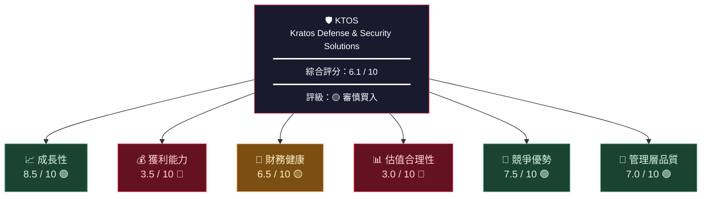

---

### 🎯 ASCII 多維度雷達圖

```
                        成長性 (8.5)
                           ▲
                          ★★★
                     ★★★★★★★★★
                ★★★★★★   |   ★★★★★★
           ★★★★★★        |        ★★★★★★
管理層  ★★★★★★━━━━━━━━━━━━━━━━━━★★★★★★  獲利能力
(7.0) ★★★★★         /    |    \         ★★★★★ (3.5)
      ★★★★       /       |       \       ★★★★
      ★★★      /         |         \      ★★★
      ★★      /          |          \     ★★
      ★━━━━━━━━━━━━━━━━━━━━━━━━━━━━━━━━━★
競爭   ★★★★★★          KTOS         ★★★   估值
優勢   ★★★★★★★                     ★★★   合理性
(7.5) ★★★★★★★★              ★★★★★ (3.0)
           ★★★★★★★★★★★★★★★★
                    ▼
              財務健康 (6.5)

  ╔═══════════════════════════════════════╗
  ║  ★ = 實際評分覆蓋範圍                  ║
  ║  各維度滿分 10 分，圓心為 0 分          ║
  ╚═══════════════════════════════════════╝
```

---

### 📊 Unicode 評分條一覽

```
╔══════════════════════════════════════════════════════════╗
║              KTOS 六維度量化評分 (0-10)                   ║
╠══════════════════════════════════════════════════════════╣
║  成長性      8.5  █████████░░  🟢 優異                   ║
║  競爭優勢    7.5  ████████░░░  🟢 良好                   ║
║  管理層      7.0  ███████░░░░  🟢 良好                   ║
║  財務健康    6.5  ███████░░░░  🟡 中等                   ║
║  獲利能力    3.5  ████░░░░░░░  🔴 偏低                   ║
║  估值合理性  3.0  ███░░░░░░░░  🔴 昂貴                   ║
╠══════════════════════════════════════════════════════════╣
║  綜合評分    6.1  ██████░░░░░  🟡 審慎買入               ║
╚══════════════════════════════════════════════════════════╝
```

---

### 🗳️ 投資建議快速結論

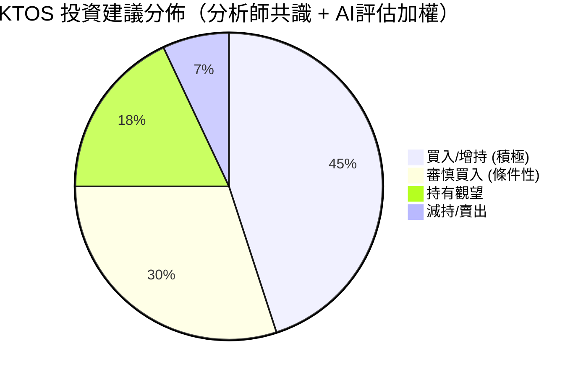

---

## 2. 六維度評分矩陣

### 📋 詳細評分表格

| 維度 | 評分 | 評級 | 核心依據 | 關鍵風險 |
|------|------|------|----------|----------|
| 📈 **成長性** | **8.5/10** | 🟢 優異 | 營收YoY +26%、無人機市場爆發、國防預算擴張 | 執行風險、合約延遲 |
| 💰 **獲利能力** | **3.5/10** | 🔴 偏低 | 毛利率22.9%低、營業利益率僅2.1%、FCF為負 | 成本控制壓力 |
| 🏦 **財務健康** | **6.5/10** | 🟡 中等 | 現金$566M充裕、負債比低、流動比率4.3 | FCF持續為負 |
| 📊 **估值合理性** | **3.0/10** | 🔴 昂貴 | P/E 725x、EV/EBITDA 225x、P/S 12.5x | 高估值難以支撐 |
| 🏰 **競爭優勢** | **7.5/10** | 🟢 良好 | 無人機技術護城河、政府合約黏性、R&D持續投入 | 競爭加劇 |
| 👔 **管理層品質** | **7.0/10** | 🟢 良好 | 戰略清晰、資本配置合理、員工精幹（4000人）| 規模化挑戰 |

---

### 📊 Unicode 詳細評分視覺化

```
┌─────────────────────────────────────────────────────────────┐
│                   六維度評分視覺化 (滿分10)                    │
├──────────────┬──────────────────────────────────┬───────────┤
│  成長性       │ ▓▓▓▓▓▓▓▓▓░                       │  8.5 🟢   │
│  獲利能力     │ ▓▓▓▓░░░░░░                       │  3.5 🔴   │
│  財務健康     │ ▓▓▓▓▓▓▓░░░                       │  6.5 🟡   │
│  估值合理性   │ ▓▓▓░░░░░░░                       │  3.0 🔴   │
│  競爭優勢     │ ▓▓▓▓▓▓▓▓░░                       │  7.5 🟢   │
│  管理層品質   │ ▓▓▓▓▓▓▓░░░                       │  7.0 🟢   │
├──────────────┴──────────────────────────────────┴───────────┤
│  0    1    2    3    4    5    6    7    8    9    10         │
│  └────┴────┴────┴────┴────┴────┴────┴────┴────┴────┘         │
│  🔴危險    🟡警示    🟡中等    🟢良好    🟢優異              │
└─────────────────────────────────────────────────────────────┘
```

---

### 🎯 風險/報酬矩陣

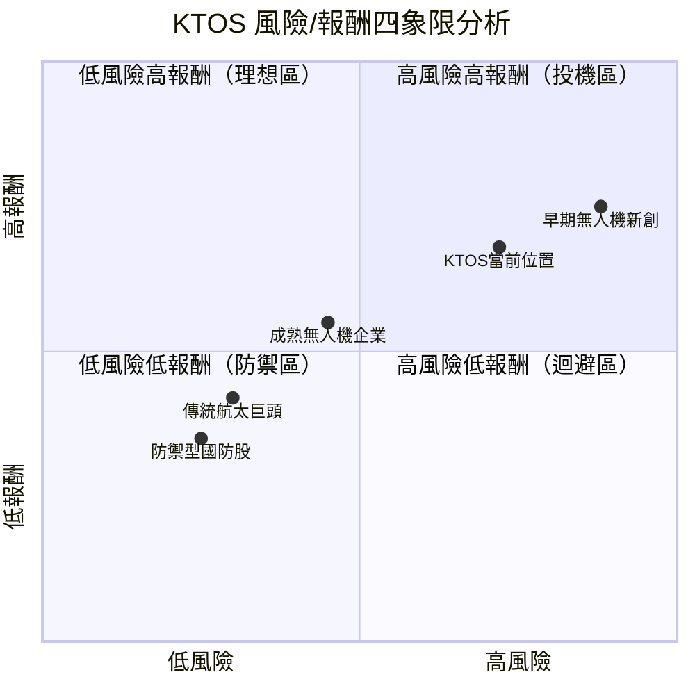

> 💡 **解讀**：KTOS 位於「高風險高報酬」象限，適合風險承受能力較強的成長型投資者

---

## 3. 業務品質評估

### 🏗️ 商業模式架構

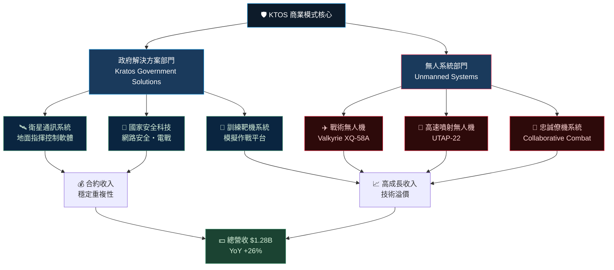

---

### 🏰 護城河評估

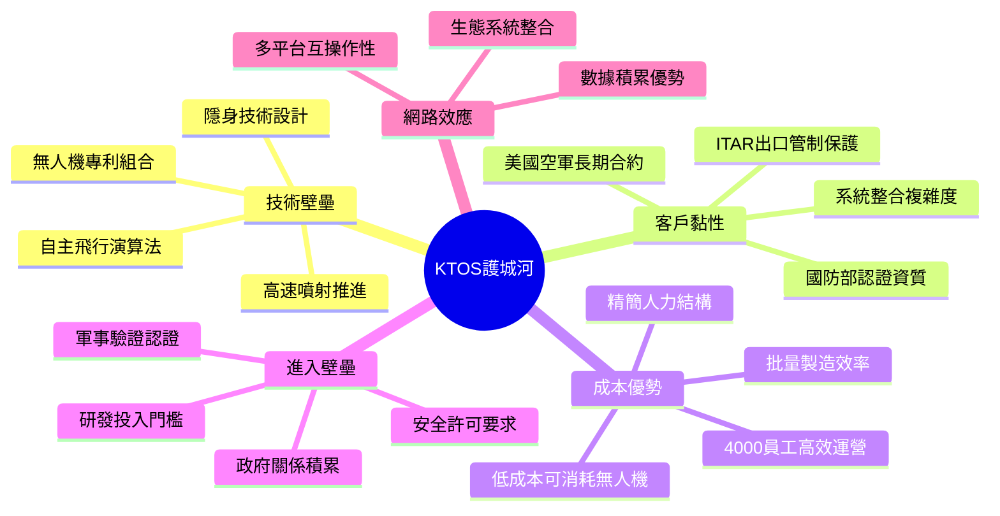

---

### ⚔️ 市場競爭地位

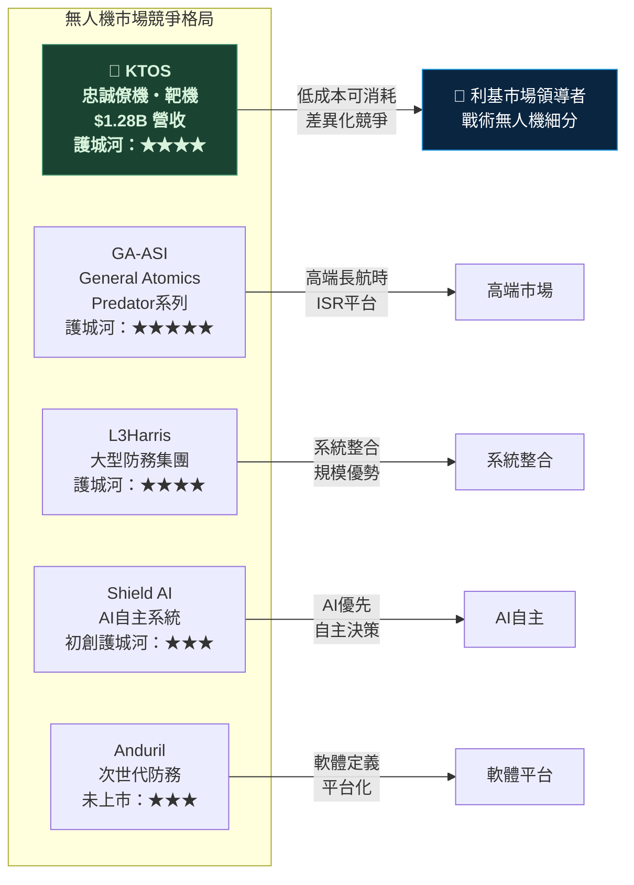

---

### 👔 管理層執行力評分

| 指標 | 評分 | 評級 | 說明 |
|------|------|------|------|
| 戰略願景清晰度 | 8/10 | 🟢 | 無人機優先戰略一致且明確 |
| 資本配置效率 | 6/10 | 🟡 | R&D投入合理但FCF為負 |
| 執行力追蹤記錄 | 7/10 | 🟢 | 連續4年營收成長 |
| 股東溝通透明度 | 7/10 | 🟢 | 定期法說會、指引清晰 |
| 人才保留能力 | 7/10 | 🟢 | 精簡組織、高技術密度 |
| 危機應對能力 | 6/10 | 🟡 | 歷史虧損已改善但仍需觀察 |
| **管理層綜合** | **6.8/10** | 🟢 | **穩健的防務科技管理層** |

---

## 4. 財務健康評估

### 📊 財務儀表板

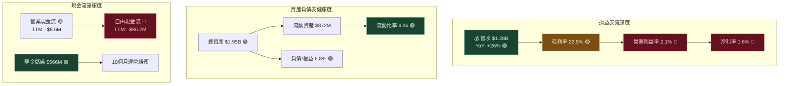

---

### 📈 獲利能力趨勢（近4年）

| 指標 | 2021 | 2022 | 2023 | 2024 | 趨勢 |
|------|------|------|------|------|------|
| **營收** | $811.5M | $898.3M | $1,040M | $1,140M | 🟢 持續成長 |
| **毛利率** | 27.7% | 25.2% | 25.8% | 25.2% | 🟡 略微下滑 |
| **營業利益** | $29.7M | $4.6M | $32.4M | $32.9M | 🟡 恢復但停滯 |
| **淨利** | -$2.0M | -$36.9M | -$8.9M | +$16.3M | 🟢 扭虧為盈 |
| **EBITDA** | $62.8M | $26.2M | $77.5M | $93.6M | 🟢 持續改善 |
| **FCF** | -$11.2M | -$71.1M | +$12.8M | -$8.5M | 🔴 不穩定 |
| **R&D支出** | $35.2M | $38.6M | $38.4M | $40.3M | 🟡 穩定投入 |

---

### 🏦 資產負債表穩健度 Unicode 視覺化

```
╔══════════════════════════════════════════════════════════════╗
║                  資產負債表健康度評估 (2024)                   ║
╠══════════════════════════════════════════════════════════════╣
║  流動比率    4.30x  ▓▓▓▓▓▓▓▓▓▓  🟢 優秀（>2.0為健康）        ║
║  負債比率    6.78%  ▓░░░░░░░░░  🟢 極低                     ║
║  現金儲備   $566M   ▓▓▓▓▓▓▓▓░░  🟢 充裕                     ║
║  總負債    $134M    ▓░░░░░░░░░  🟢 可控                     ║
╠══════════════════════════════════════════════════════════════╣
║  FCF產生    -$86M   ░░░░░░░░░░  🔴 持續燒錢                  ║
║  營業利益率  2.1%   ▓░░░░░░░░░  🔴 極低                     ║
║  ROE        1.2%   ▓░░░░░░░░░  🔴 資本回報差                ║
║  ROA        0.7%   ▓░░░░░░░░░  🔴 資產利用率低              ║
╠══════════════════════════════════════════════════════════════╣
║  📌 小結：資產負債表穩健，但盈利效率亟待提升                   ║
╚══════════════════════════════════════════════════════════════╝
```

---

### 💵 現金流生成分析

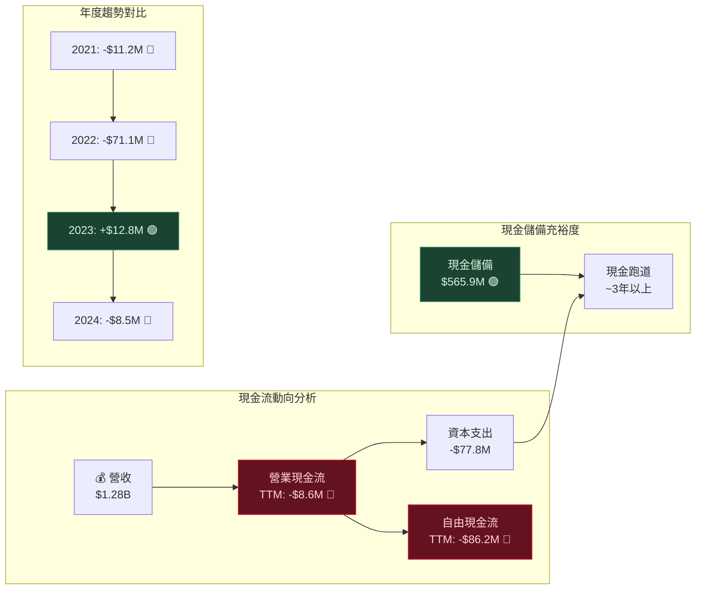

---

## 5. 成長性評估

### 🚀 成長軌跡分析

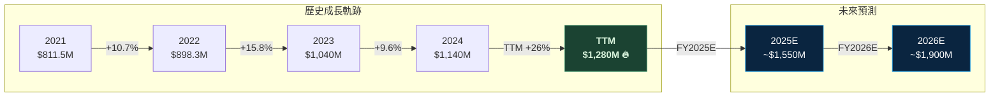

---

### 📊 歷史成長率 CAGR 分析表

| 指標 | 1年成長率 | 3年CAGR | 趨勢評估 | 評級 |
|------|----------|---------|----------|------|
| **營業收入** | +26.0% | +12.0% | 加速成長 | 🟢 優異 |
| **毛利潤** | +6.9% | +8.4% | 穩健成長 | 🟡 中等 |
| **EBITDA** | +20.8% | +49.1%* | 強勁反彈 | 🟢 優異 |
| **R&D投入** | +5.0% | +4.6% | 穩定投入 | 🟡 中等 |
| **總資產** | +19.6% | +7.0% | 資產擴張 | 🟡 中等 |
| **股東權益** | +38.3% | +12.7% | 健康擴張 | 🟢 良好 |

> *2022年EBITDA因基期低($26.2M)而CAGR偏高，需注意基期效應

---

### 🎯 未來成長驅動力

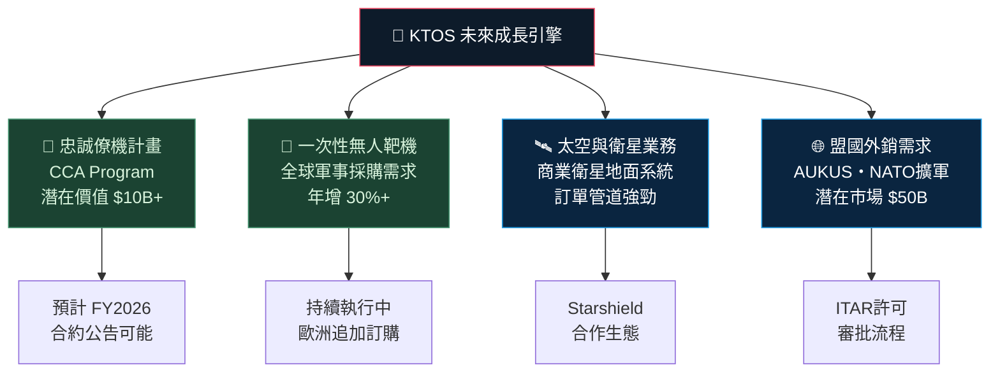

---

### 📈 市場份額成長趨勢

```
╔══════════════════════════════════════════════════════════════╗
║           戰術無人機市場份額估算趨勢 (概念性)                  ║
╠══════════════════════════════════════════════════════════════╣
║  2021  ██████░░░░░░░░░░░░  ~15%  市場新進者                  ║
║  2022  ████████░░░░░░░░░░  ~18%  靶機合約擴大                ║
║  2023  ██████████░░░░░░░░  ~22%  CCA計畫入選                 ║
║  2024  █████████████░░░░░  ~28%  XQ-58A規模採購              ║
║  2025E ████████████████░░  ~35%  預估批量生產                 ║
╠══════════════════════════════════════════════════════════════╣
║  📌 全球戰術無人機市場規模：2024年約$40B，年增15-20%          ║
╚══════════════════════════════════════════════════════════════╝
```

---

## 6. 估值合理性評估

### 📊 估值矩陣分析

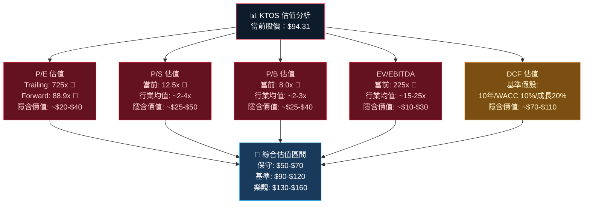

---

### 📋 多重估值法比較表格

| 估值方法 | 當前倍數 | 行業中位數 | 合理價值估算 | 溢價/折價 | 評級 |
|----------|----------|-----------|-------------|----------|------|
| **P/E (Forward)** | 88.9x | 20-25x | $20~$30 | 溢價 +300% | 🔴 |
| **P/S** | 12.5x | 2.0~3.5x | $25~$45 | 溢價 +250% | 🔴 |
| **P/B** | 8.0x | 2.5~3.5x | $30~$42 | 溢價 +200% | 🔴 |
| **EV/EBITDA** | 225x | 15~25x | $15~$25 | 溢價 +800% | 🔴 |
| **DCF（基準）** | — | WACC 10% | $85~$110 | 接近合理 | 🟡 |
| **分析師目標價** | — | 20位共識 | $115.70 | 上漲空間22.7% | 🟢 |

---

### 📉 估值區間視覺化

```
╔══════════════════════════════════════════════════════════════════╗
║                  KTOS 股價估值區間分析                           ║
╠══════════════════════════════════════════════════════════════════╣
║                                                                  ║
║  $0          $50         $100        $150        $200            ║
║  ├───────────┼───────────┼───────────┼───────────┤              ║
║               [低估區間]  [合理區間]   [高估區間]                 ║
║              $45---$70   $70---$120  $120---$150+                ║
║                                                                  ║
║                          ★ $94.31 ← 當前股價                    ║
║                                ↑ 處於合理偏高區間               ║
║  ────────────────────────────────────────────────────           ║
║  悲觀目標 $79   基準目標 $115.70   樂觀目標 $150                 ║
║  ────────────────────────────────────────────────────           ║
║  52W低點 $23.90          ▲ 當前位置          52W高點 $134        ║
║  ├──────────────────────[●]──────────────────────┤              ║
║  $23.90        相對52W：+294.6%        $134.00                   ║
║                                                                  ║
╚══════════════════════════════════════════════════════════════════╝
```

---

### 🔍 同業估值比較

| 公司 | 代碼 | P/E(Fwd) | P/S | EV/EBITDA | 市值 | 營收成長 |
|------|------|----------|-----|-----------|------|---------|
| **Kratos Defense** | **KTOS** | **88.9x** | **12.5x** | **225x** | **$16.1B** | **+26%** |
| Textron | TXT | 15.2x | 1.0x | 10.5x | $13.5B | +4% |
| TransDigm | TDG | 32.0x | 8.5x | 22.5x | $68B | +16% |
| AeroVironment | AVAV | 55.0x | 6.8x | 45x | $3.8B | +20% |
| Shield AI | — | 私有 | — | — | ~$2.8B | +40% |
| L3Harris | LHX | 18.5x | 1.8x | 12x | $34B | +8% |
| Northrop Grumman | NOC | 17.0x | 1.9x | 14x | $62B | +6% |

> 📌 **結論**：KTOS 在所有估值指標上均大幅溢價於同業，反映市場對其成長故事的高度期待

---

## 7. 風險評估

### 🌡️ 風險熱圖

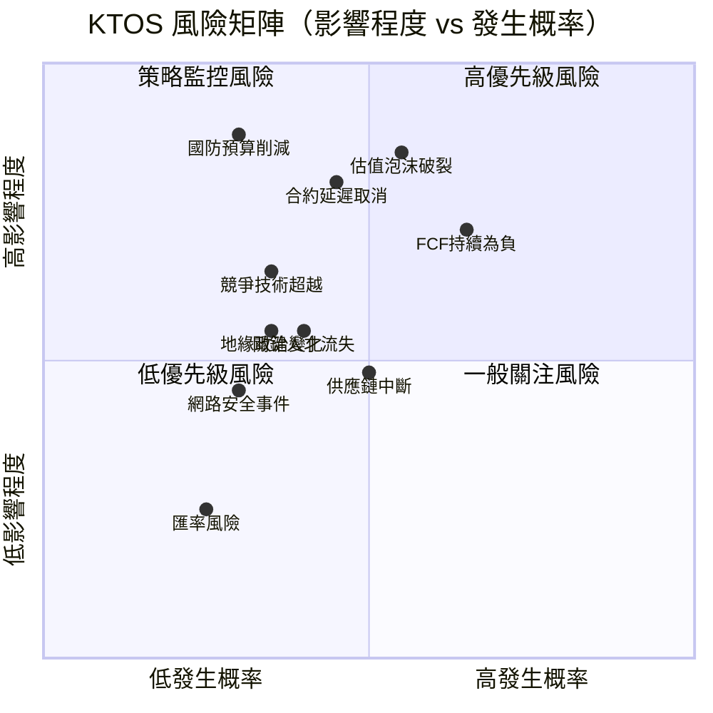

---

### 📋 風險項目詳細評估

| 風險類別 | 風險描述 | 影響程度 | 發生概率 | 風險等級 | 緩解措施 |
|----------|----------|----------|----------|----------|----------|
| **估值風險** | 極高估值（P/E 725x）泡沫化 | 🔴 極高 | 🟡 中等 | 🔴 **高危** | 分批建倉、設停損 |
| **盈利風險** | FCF持續為負、盈利能力薄弱 | 🔴 高 | 🟡 中等 | 🔴 **高危** | 追蹤季報改善進度 |
| **合約風險** | 核心政府合約延遲/取消 | 🔴 極高 | 🟡 中等 | 🔴 **高危** | 分散合約依賴度 |
| **預算風險** | 美國國防預算削減 | 🔴 極高 | 🟢 低 | 🟡 **中危** | 監控政策動向 |
| **競爭風險** | Anduril/Shield AI技術超越 | 🔴 高 | 🟡 中等 | 🟡 **中危** | 追蹤R&D里程碑 |
| **執行風險** | 量產規模化困難 | 🟡 中 | 🟡 中等 | 🟡 **中危** | 管理層指引驗證 |
| **流動性風險** | 股票流動性、空頭比率 | 🟡 中 | 🟢 低 | 🟢 **低危** | 避免大額集中倉位 |
| **地緣政治** | 出口管制/盟友關係變化 | 🟡 中 | 🟢 低 | 🟢 **低危** | 長期持有緩衝 |

---

### 🛡️ 風險緩解措施圖示

```
┌─────────────────────────────────────────────────────────┐
│                  風險等級分佈                            │
├─────────────────────────────────────────────────────────┤
│  🔴 高危風險（3項）                                      │
│     ├─ 估值泡沫  → 限制倉位 <5% 組合比重                │
│     ├─ FCF為負   → 每季監控，若無改善考慮減倉            │
│     └─ 合約風險  → 關注季報訂單積壓數據                  │
│                                                         │
│  🟡 中危風險（3項）                                      │
│     ├─ 預算削減  → 設置國防預算新聞警報                  │
│     ├─ 競爭加劇  → 追蹤競爭對手融資/合約動態             │
│     └─ 量產困難  → 核對管理層季度指引達成率              │
│                                                         │
│  🟢 低危風險（2項）                                      │
│     ├─ 流動性    → 正常市場買賣無問題                    │
│     └─ 地緣政治  → 長期影響為主，短期可忽略              │
└─────────────────────────────────────────────────────────┘
```

---

## 8. 催化劑與觸發因素

### 📅 催化劑時間軸

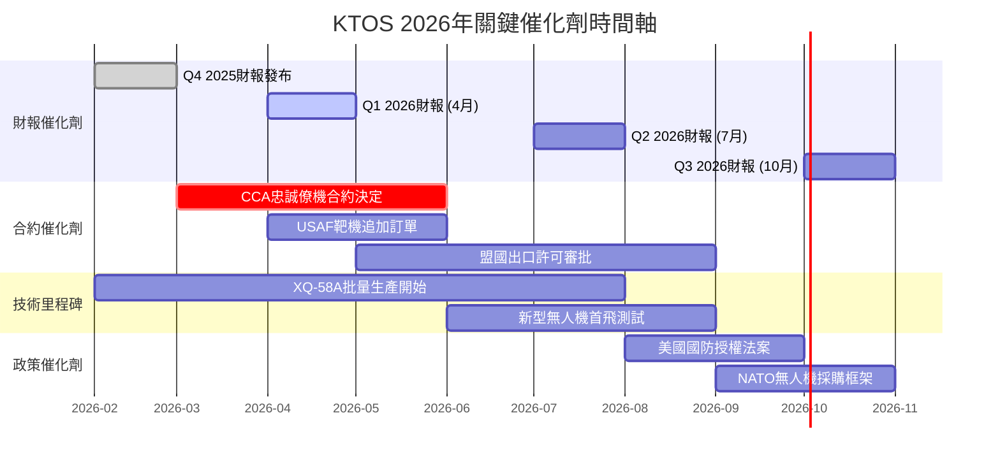

---

### ⚡ 觸發因素決策樹

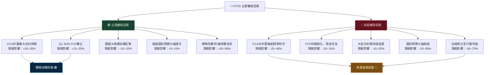

---

## 9. 投資建議

### 🏆 最終評級

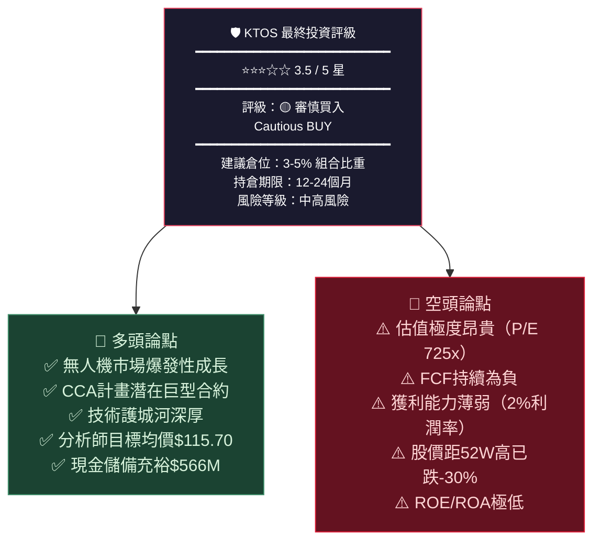

---

### ⭐ 評星說明

```
╔═══════════════════════════════════════════════════════╗
║                  KTOS 綜合評星                         ║
╠═══════════════════════════════════════════════════════╣
║  成長潛力    ★★★★★  (5/5) — 無人機市場領導者          ║
║  財務品質    ★★☆☆☆  (2/5) — FCF負、利潤率低          ║
║  估值合理性  ★☆☆☆☆  (1/5) — 極度昂貴                 ║
║  競爭優勢    ★★★★☆  (4/5) — 技術護城河深厚           ║
║  風險管理    ★★★☆☆  (3/5) — 中高風險組合             ║
╠═══════════════════════════════════════════════════════╣
║  綜合評星    ★★★☆☆  (3/5) — 審慎買入                 ║
╚═══════════════════════════════════════════════════════╝
```

---

### 🎯 目標價區間

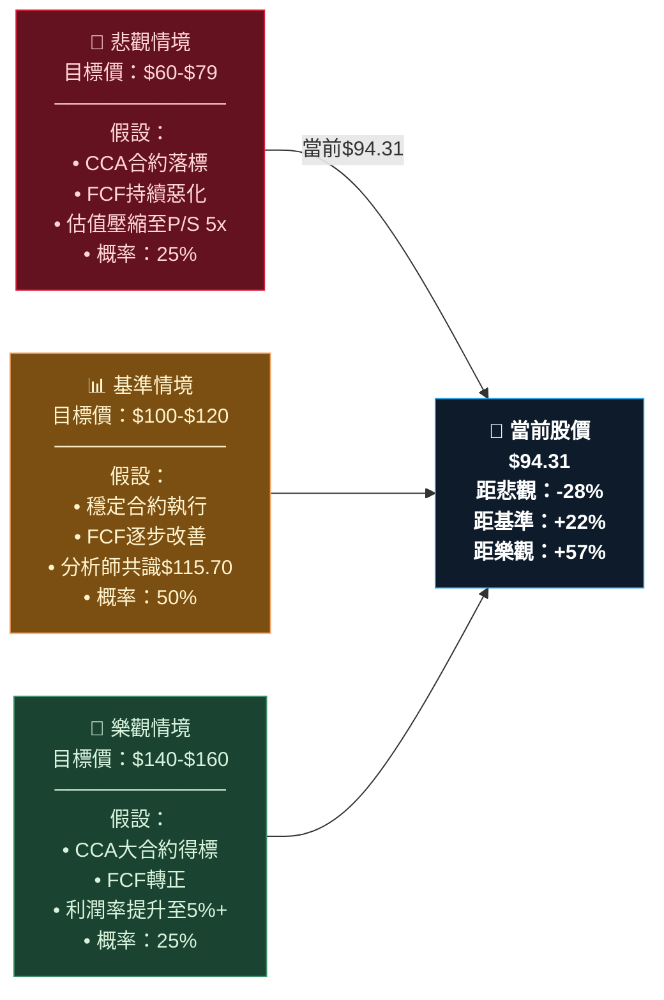

---

### 👥 投資人適配度分析

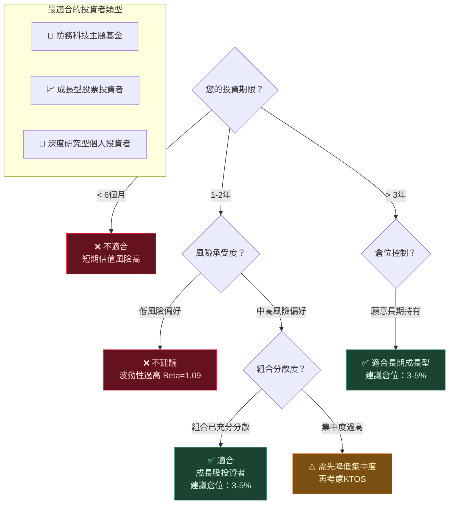

---

### 📋 建議持倉策略

```
╔════════════════════════════════════════════════════════════════╗
║                   KTOS 投資策略建議書                          ║
╠════════════════════════════════════════════════════════════════╣
║                                                                ║
║  🟡 評級：審慎買入（Cautious BUY）                             ║
║                                                                ║
║  ┌─────────────────────────────────────────────────────────┐  ║
║  │  建議進場策略                                            │  ║
║  │  • 分批建倉：3次分批，每次$94以下加碼                    │  ║
║  │  • 第一批（30%）：當前位置 $90-$95                      │  ║
║  │  • 第二批（40%）：回調至 $80-$85 時                     │  ║
║  │  • 第三批（30%）：確認FCF改善後追加                      │  ║
║  └─────────────────────────────────────────────────────────┘  ║
║                                                                ║
║  ┌─────────────────────────────────────────────────────────┐  ║
║  │  停損/停利設置                                           │  ║
║  │  • 停損線：$72（跌破-24%，估值修正訊號）                 │  ║
║  │  • 部分獲利：$120（達分析師目標均值）                    │  ║
║  │  • 滿倉出場：$150（樂觀情境實現）                        │  ║
║  └─────────────────────────────────────────────────────────┘  ║
║                                                                ║
║  ┌─────────────────────────────────────────────────────────┐  ║
║  │  持倉監控指標（季度檢視）                                │  ║
║  │  ✅ FCF是否轉正 → 最重要催化劑                          │  ║
║  │  ✅ 營業利益率是否突破5% → 盈利改善關鍵                  │  ║
║  │  ✅ 訂單積壓金額是否持續成長 → 成長可見度               │  ║
║  │  ✅ CCA計畫進展 → 核心估值支撐點                        │  ║
║  │  ⚠️ 若連續2季FCF惡化 → 重新評估持倉                    │  ║
║  └─────────────────────────────────────────────────────────┘  ║
║                                                                ║
║  推薦持倉時間：12-24個月                                       ║
║  最大建議倉位：組合總值 5%                                     ║
║  風險等級：🔴 中高風險                                         ║
╚════════════════════════════════════════════════════════════════╝
```

---

### 📊 核心投資論據總結

```
┌─────────────────────────────────────────────────────────────┐
│                  為何看好 KTOS（多頭）                       │
├─────────────────────────────────────────────────────────────┤
│  🚀 無人機革命浪潮最純正的受益者之一                         │
│  🏆 XQ-58A Valkyrie：美空軍忠誠僚機優先候選                  │
│  💡 低成本可消耗無人機理念契合現代戰爭需求                   │
│  💰 $565M現金儲備，無短期融資壓力                            │
│  📈 營收加速（+26% YoY），EBITDA持續改善                    │
│  🌐 全球軍備競賽下，訂單管道持續擴張                         │
└─────────────────────────────────────────────────────────────┘

┌─────────────────────────────────────────────────────────────┐
│                  為何謹慎（空頭）                            │
├─────────────────────────────────────────────────────────────┤
│  💸 估值極端昂貴（EV/EBITDA 225x，遠超同業20x均值）          │
│  🔴 FCF為負（TTM -$86M），盈利質量差                        │
│  📉 距52週高$134跌幅-30%，動能轉弱                          │
│  🤔 故事股特性：任何利空放大修正風險                         │
│  ⚔️ Anduril/Shield AI等新興競爭者侵蝕份額                   │
└─────────────────────────────────────────────────────────────┘
```

---

> ## ⚖️ 免責聲明
>
> **本報告為 AI 自動生成之分析內容，所有數據截至 2026-02-24，僅供學術研究與參考用途，不構成任何投資建議、要約或承諾。**
>
> 投資美股涉及市場風險、匯率風險、流動性風險及公司特定風險，過去績效不代表未來表現。在做出任何投資決策前，請諮詢持牌投資顧問，並充分評估個人財務狀況與風險承受能力。
>
> **數據來源**：Yahoo Finance ｜ **分析工具**：AI 量化模型 ｜ **報告版本**：v2.0