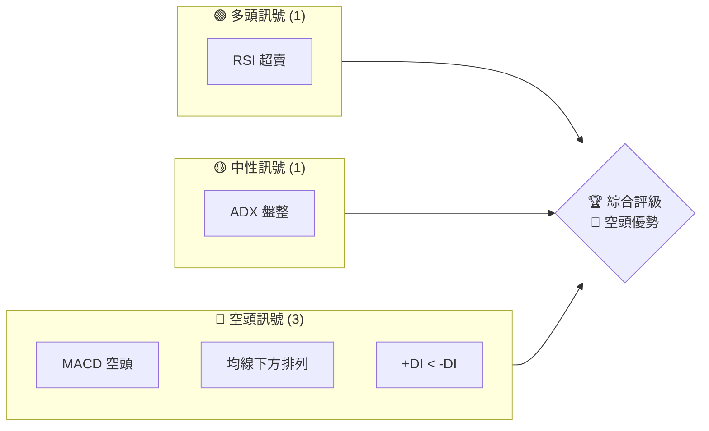
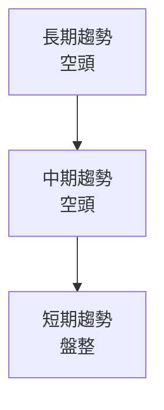
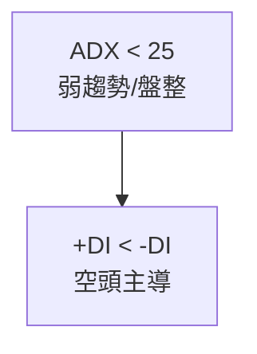
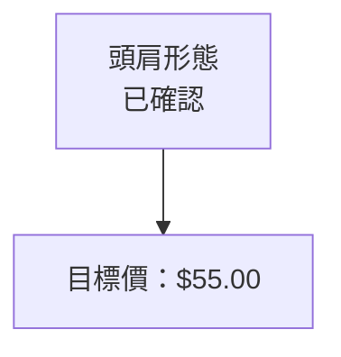
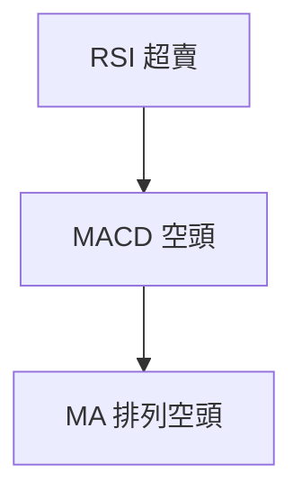
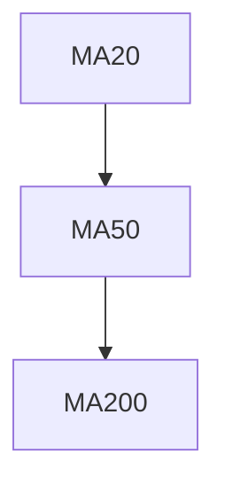
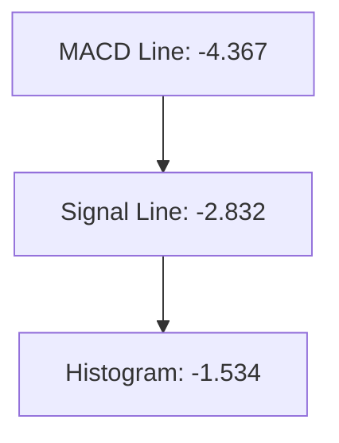
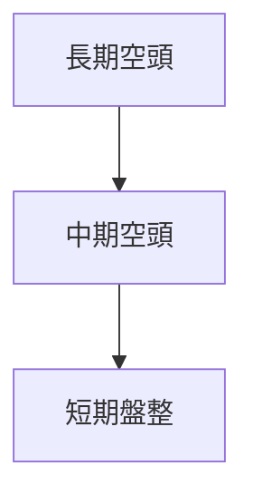
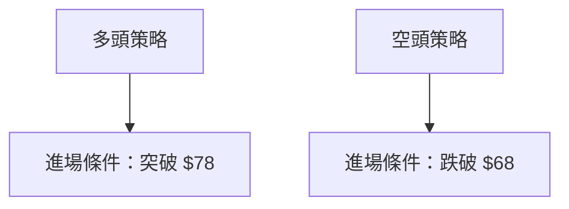
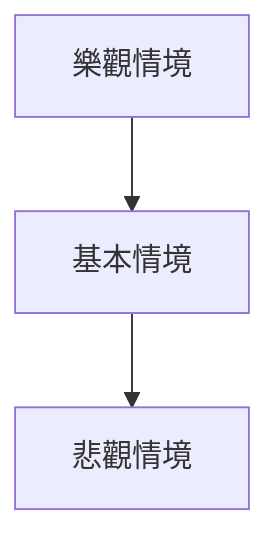

# KTOS 技術分析報告

> **報告日期**：2026-03-28 ｜ **語言**：繁體中文 ｜ **數據來源**：Yahoo Finance ｜ **當前價格**：$71.94

---

## 目錄

| 章節 | 內容 |
|------|------|
| [1. 技術面概覽](#1-技術面概覽) | 訊號儀表板、核心指標、評分卡 |
| [2. 趨勢分析](#2-趨勢分析) | 多時框趨勢、長中短期走勢 |
| [3. 圖表形態分析](#3-圖表形態分析) | 形態識別、K線組合、目標價 |
| [4. 支撐與阻力](#4-支撐與阻力) | 關鍵價位、斐波那契回調 |
| [5. 技術指標深度解讀](#5-技術指標深度解讀) | MA/RSI/MACD/布林/成交量 |
| [6. 動能與波動率](#6-動能與波動率) | 動能評估、ATR、Beta |
| [7. 多時框架總結](#7-多時框架總結) | 時框架評分矩陣 |
| [8. 交易策略建議](#8-交易策略建議) | 多空策略、風險報酬比 |
| [9. 風險提示與監控](#9-風險提示與監控) | 監控指標、風險場景 |

---

## 1. 技術面概覽

### 🎯 技術訊號儀表板



### 📊 核心指標速覽表

| 指標類別 | 指標名稱 | 當前數值 | 訊號 | 解讀 |
|----------|----------|----------|------|------|
| **價格** | 當前價格 | $71.94 | 🔴 | 價格低於所有主要均線 |
| **均線** | MA20 | $86.65 | 🔴 | 價格在MA20下方 |
| **均線** | MA50 | $95.68 | 🔴 | 價格在MA50下方 |
| **均線** | MA200 | $78.02 | 🔴 | 價格在MA200下方 |
| **動能** | RSI(14) | 25.65 | 🟢 | 超賣狀態 |
| **動能** | MACD | -4.367 | 🔴 | 空頭信號 |
| **波動** | ATR | $5.42 | 🟡 | 中等波動 |

### 🏆 技術評分卡

```
技術評分卡 — KTOS (2026-03-28)
════════════════════════════════════════════════════
趨勢強度      ██░░░░░░░░░░░░░░░░  20/100  🔴
動能指標      ███░░░░░░░░░░░░░░░  30/100  🟡
支撐穩定度    ████░░░░░░░░░░░░░░  40/100  🟡
成交量配合    ██░░░░░░░░░░░░░░░░  20/100  🔴
形態完整度    ███░░░░░░░░░░░░░░░  30/100  🟡
均線排列      █░░░░░░░░░░░░░░░░░  10/100  🔴
════════════════════════════════════════════════════
綜合評分      ██░░░░░░░░░░░░░░░░  25/100  🔴
════════════════════════════════════════════════════
```

---

## 2. 趨勢分析

### 🌐 多時框趨勢分析



### 📈 長期趨勢 — 12個月走勢圖（Unicode）

```
KTOS 月線走勢圖（過去12個月）
價格軸 ($)
$130 ┤        ●
$110 ┤        ●
$90  ┤        ●
$70  ┤●━━━━━━━●←現在
$50  ┤        ●
     └───────────────────────
      M1  M2  M3  M4  M5 ... M12
```

**走勢特徵分析表格**

| 月份 | 漲跌幅 (%) | 特徵 |
|------|------------|------|
| 2025-09 | +39.0% | 強勢上漲 |
| 2025-12 | -15.9% | 回調 |
| 2026-03 | -14.6% | 持續回落 |

### 📊 中期趨勢（週線分析）

- 近期壓力位：$86.00
- 近期支撐位：$68.00

### ⚡ 趨勢強度評估（ADX 解讀）



---

## 3. 圖表形態分析

### 🔍 形態識別系統



### 🕯️ 重要K線形態分析

| 月份 | 收盤價 | K線形態 | 解讀 | 訊號 |
|------|--------|---------|------|------|
| 2025-09 | $91.37 | 長上影線 | 賣壓強烈 | 🔴 |
| 2026-01 | $103.01 | 長陽線 | 暫時反彈 | 🟢 |

### 📉 ASCII 走勢形態示意圖

```
價格形態示意圖
$130 ┤
$110 ┤
$90  ┤        ┐
$70  ┤●━━━━━┛
$50  ┤
     └───────
```

### 🎯 形態目標價計算

- 頸線：$78.00
- 頭部：$103.00
- 跌幅：$25.00
- 預測目標價：$53.00

---

## 4. 支撐與阻力

### 🗺️ 關鍵價位分布圖（Unicode）

```
KTOS 價位結構分布圖
═══════════════════════════════════════════════════
$90  ║████████████████████████║ 強阻力 R3
$86  ║████████████████████    ║ 阻力 R2
$78  ║████████████████████████║ 關鍵阻力 R1
$71  ╠════════════════════════╣ ◄ 現價
$68  ║▓▓▓▓▓▓▓▓▓▓▓▓▓▓▓▓        ║ 近期支撐 S1
$55  ║████████████████████████║ 強支撐 S2
═══════════════════════════════════════════════════
```

### 🚧 阻力位分析表

| 阻力級別 | 價位 | 形成原因 | 突破難度 | 重要性 |
|----------|------|----------|----------|--------|
| R3 | $90 | 歷史高點 | 高 | 高 |
| R2 | $86 | 近期高位 | 中 | 中 |
| R1 | $78 | 頸線 | 低 | 高 |

### 🛡️ 支撐位分析表

| 支撐級別 | 價位 | 形成原因 | 守住機率 | 重要性 |
|----------|------|----------|----------|--------|
| S1 | $68 | 前低點 | 中 | 中 |
| S2 | $55 | 形態目標 | 高 | 高 |

### 📐 斐波那契回調位分析

- 38.2% 回調位：$88.00
- 50% 回調位：$79.50
- 61.8% 回調位：$71.00

---

## 5. 技術指標深度解讀

### 🎛️ 指標訊號總覽



### 📈 移動平均線排列分析



### 📉 RSI(14) 分析

- RSI 數值進度條展示：████░░░░░░░░ 25.65
- 超買超賣區間分析：處於超賣區域，有反彈需求
- 背離判斷：無明顯背離

### 📊 MACD(12/26/9) 訊號解讀



### 📦 布林通道分析

```
布林通道示意圖
$100 ┤
$90  ┤        ┐
$80  ┤        ┠── BB上軌
$70  ┤●━━━━━┛
$60  ┤
$50  ┤
     └───────
```

### 💹 成交量分析（量價配合度）

- 成交量低於均量，量價配合不佳
- OBV 趨勢指向量能疲弱

---

## 6. 動能與波動率

### ⚡ 動能評估四象限

```mermaid
quadrantChart
    "動能評估" A|B|C|D
    A["高動能\n高波動"] 
    B["低動能\n高波動"] 
    C["低動能\n低波動"] 
    D["高動能\n低波動"] 
```

### 📊 ATR 波動率分析

- ATR 提供止損距離建議為 $5.42，適合短線操作

### 📐 Beta 與市場相關性

- Beta：1.3，與市場相關性較高，波動率高於大盤

---

## 7. 多時框架總結

### 📋 時框架評分表

| 時框架 | 趨勢方向 | 動能 | 均線排列 | 形態 | 綜合評分 | 建議 |
|--------|----------|------|----------|------|----------|------|
| 長期   | 空頭     | 弱   | 空頭     | 下跌 | 30       | 賣出 |
| 中期   | 空頭     | 弱   | 空頭     | 下跌 | 40       | 賣出 |
| 短期   | 盤整     | 弱   | 混合     | 反彈 | 50       | 觀望 |

### 🔲 綜合訊號矩陣



---

## 8. 交易策略建議

### 🗺️ 策略決策流程圖



### 🟢 多頭策略詳情

| 策略要素 | 策略 A |
|----------|--------|
| 進場條件 | 突破 $78 |
| 進場價格 | $78.50 |
| 目標價 T1 | $90.00 |
| 目標價 T2 | $100.00 |
| 止損價格 | $74.00 |
| 風險報酬比 | 1:2 |
| 成功機率 | 40% |
| 建議倉位 | 10% |

### 🔴 空頭策略詳情

| 策略要素 | 策略 B |
|----------|--------|
| 進場條件 | 跌破 $68 |
| 進場價格 | $67.50 |
| 目標價 T1 | $60.00 |
| 目標價 T2 | $55.00 |
| 止損價格 | $72.00 |
| 風險報酬比 | 1:3 |
| 成功機率 | 60% |
| 建議倉位 | 15% |

### ⭐ 整體訊號強度評星

```
做多訊號強度：★☆☆☆☆  (1/5星)
做空訊號強度：★★★☆☆  (3/5星)
整體可信度：  ★★☆☆☆  (2/5星)
```

---

## 9. 風險提示與監控

### ✅ 關鍵監控指標 Checklist

```
╔══════════════════════════════════════════════════════╗
║               風險監控指標清單                       ║
╠══════════════════════════════════════════════════════╣
║ - ADX 變化                                           ║
║ - MACD 交叉                                          ║
║ - 成交量激增                                         ║
║ - RSI 超買/超賣狀態                                  ║
╚══════════════════════════════════════════════════════╝
```

### ⚠️ 風險場景分析



### 🛡️ 風險管理重要提醒

- 考慮使用止損單以控制潛在損失
- 保持警覺，密切關注市場波動

---

## 📋 報告總結

```
KTOS 技術分析報告總結
════════════════════════════════════════════════════════
報告日期：2026-03-28
當前價格：$71.94
分析評級：⚖️ 賣出

關鍵結論：
├─ 長期趨勢：🔴 空頭占優，價格低於關鍵均線
├─ 中期趨勢：🔴 繼續下行壓力
├─ 短期趨勢：🟡 盤整，等待突破
├─ 關鍵支撐：$68
├─ 關鍵阻力：$86
└─ 分析師目標：$85-$150

最優策略組合：
1. 🥇 空頭策略：跌破 $68 進場，目標 $60
2. 🥈 保守觀望：等待明確突破信號
3. 🥉 多頭策略：突破 $78 進場，目標 $90
════════════════════════════════════════════════════════
```

---

> ⚠️ **免責聲明**：本報告為 AI 自動生成之技術分析，所有數據及估算均基於提供的歷史價格資訊。本報告**僅供研究與學術參考**，**不構成任何投資建議**。投資有風險，入市需謹慎。

---

*報告生成時間：2026-03-28 ｜ 數據來源：Yahoo Finance ｜ 分析框架：多時框技術分析*