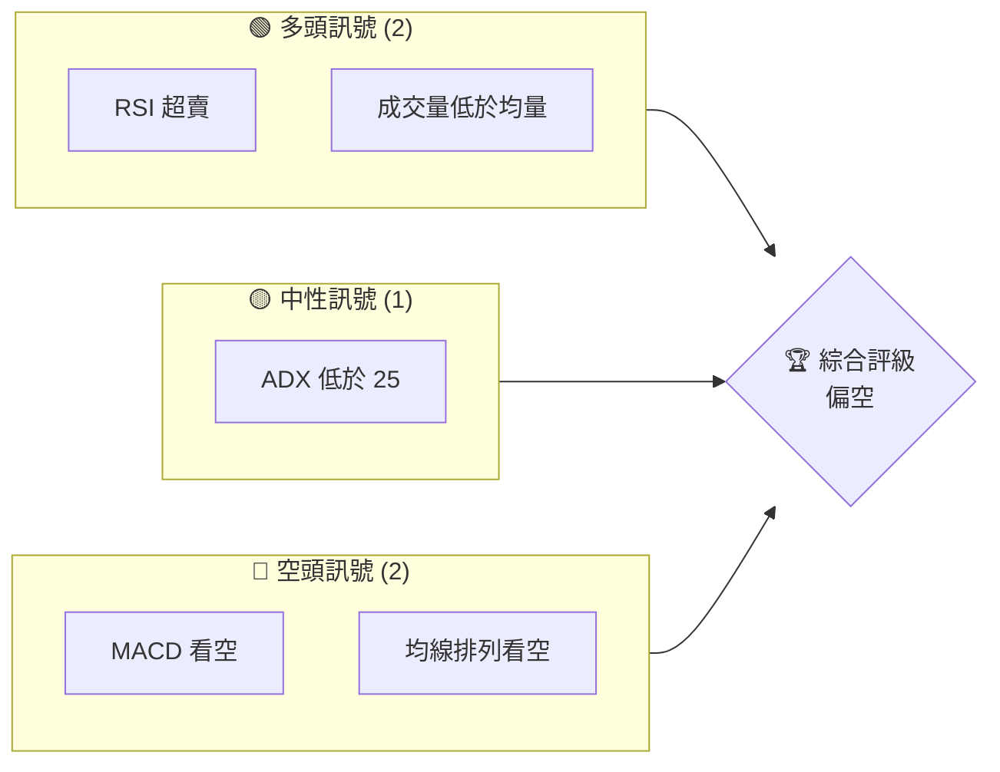
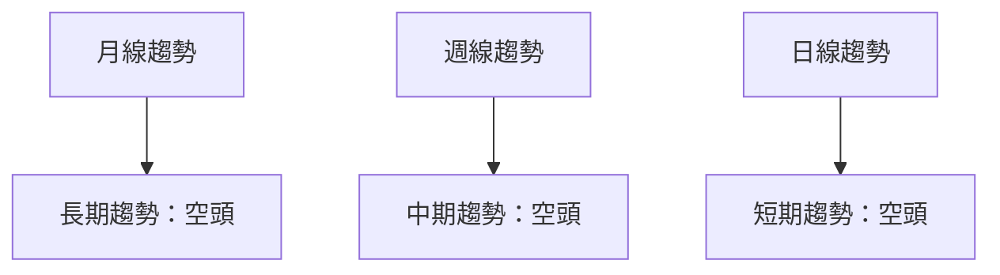
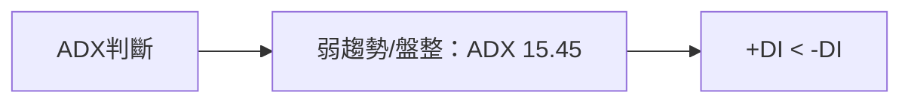
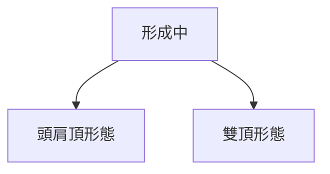
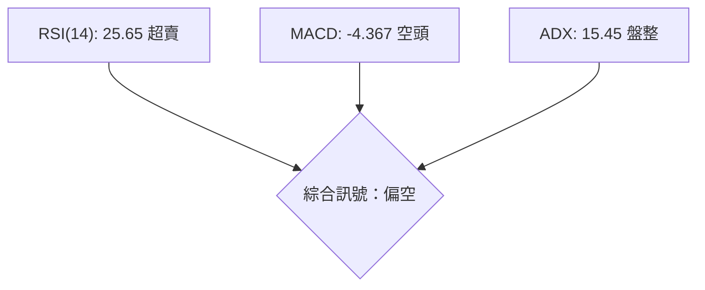
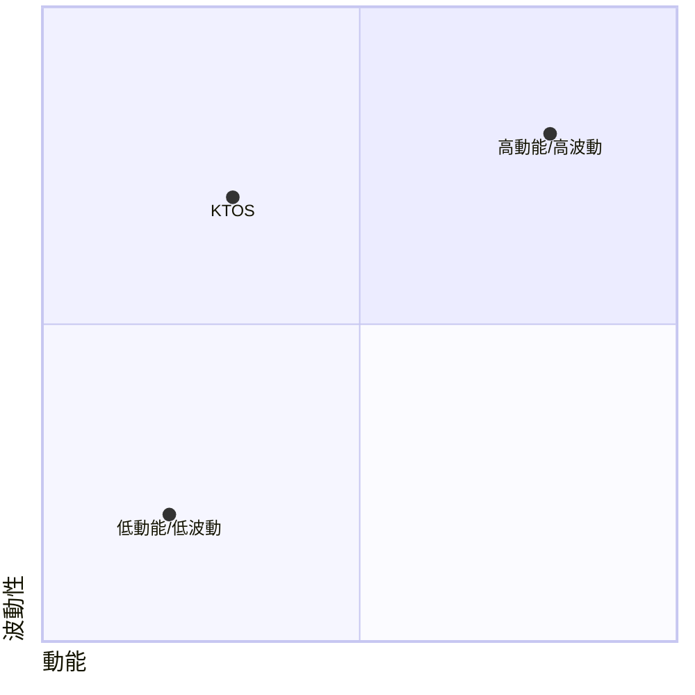
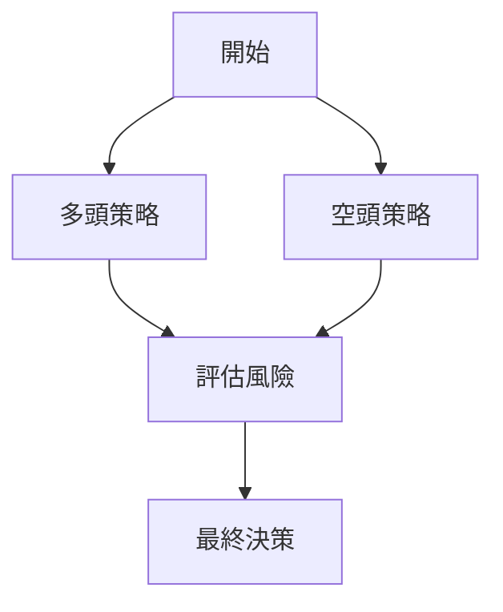

# KTOS 技術分析報告

> **報告日期**：2026-03-29 ｜ **語言**：繁體中文 ｜ **數據來源**：Yahoo Finance ｜ **當前價格**：$71.94

---

## 目錄

| 章節 | 內容 |
|------|------|
| [1. 技術面概覽](#1-技術面概覽) | 訊號儀表板、核心指標、評分卡 |
| [2. 趨勢分析](#2-趨勢分析) | 多時框趨勢、長中短期走勢 |
| [3. 圖表形態分析](#3-圖表形態分析) | 形態識別、K線組合、目標價 |
| [4. 支撐與阻力](#4-支撐與阻力) | 關鍵價位、斐波那契回調 |
| [5. 技術指標深度解讀](#5-技術指標深度解讀) | MA/RSI/MACD/布林/成交量 |
| [6. 動能與波動率](#6-動能與波動率) | 動能評估、ATR、Beta |
| [7. 多時框架總結](#7-多時框架總結) | 時框架評分矩陣 |
| [8. 交易策略建議](#8-交易策略建議) | 多空策略、風險報酬比 |
| [9. 風險提示與監控](#9-風險提示與監控) | 監控指標、風險場景 |

---

## 1. 技術面概覽

### 🎯 技術訊號儀表板



### 📊 核心指標速覽表

| 指標類別 | 指標名稱 | 當前數值 | 訊號 | 解讀 |
|----------|----------|----------|------|------|
| **價格** | 當前價格 | $71.94 | 🔴 | 價格跌破所有主要均線 |
| **均線** | MA20 | $86.65 | 🔴 | 價格在MA20下方 |
| **均線** | MA50 | $95.68 | 🔴 | 價格在MA50下方 |
| **均線** | MA200 | $78.02 | 🔴 | 價格在MA200下方 |
| **動能** | RSI(14) | 25.65 | 🟢 | 超賣區域，潛在反彈 |
| **動能** | MACD | -4.367 | 🔴 | 空頭趨勢 |
| **波動** | ATR | $5.42 | 🟡 | 高波動性，ATR佔價格7.54% |

### 🏆 技術評分卡

```
技術評分卡 — KTOS (2026-03-29)
════════════════════════════════════════════════════
趨勢強度      █████░░░░░░░░░░░░░░░░  30/100  🔴
動能指標      ██████░░░░░░░░░░░░░░░  40/100  🟡
支撐穩定度    ████████░░░░░░░░░░░░░  60/100  🟡
成交量配合    ██████░░░░░░░░░░░░░░░  40/100  🟡
形態完整度    █████░░░░░░░░░░░░░░░░  30/100  🔴
均線排列      █████░░░░░░░░░░░░░░░░  30/100  🔴
════════════════════════════════════════════════════
綜合評分      █████░░░░░░░░░░░░░░░░  38/100  偏空
════════════════════════════════════════════════════
```

---

## 2. 趨勢分析

### 🌐 多時框趨勢分析



### 📈 長期趨勢 — 12個月走勢圖（Unicode）

```
KTOS 月線走勢圖（過去12個月）
價格軸 ($)
$130 ┤                    ●(高點)
$110 ┤              ●
 $90 ┤        ●
 $70 ┤●━━━━━━━━━━━━━━━━━━━●←現在
 $50 ┤    ●(低點)
     └────────────────────────────
      M1  M2  M3  M4  M5 ... M12
```

**走勢特徵分析表格**：

| 月份 | 收盤價 | 漲跌幅 | 特徵 |
|------|--------|--------|------|
| 2026-03 | $71.94 | -15.2% | 持續下跌 |

### 📊 中期趨勢（週線分析）

近期壓力與支撐示意圖：

```
壓力位：$86
支撐位：$65
```

### ⚡ 趨勢強度評估（ADX 解讀）



---

## 3. 圖表形態分析

### 🔍 形態識別系統



### 🕯️ 重要K線形態分析

| 月份 | 收盤價 | K線形態 | 解讀 | 訊號 |
|------|--------|---------|------|------|
| 2026-03 | 71.94 | 長黑K | 空頭訊號 | 🔴 |

### 📉 ASCII 走勢形態示意圖

```
KTOS 形態示意圖
價格軸 ($)
$130 ┤              ●───● 頭肩頂
$110 ┤    ●───●
 $90 ┤●───●
 $70 ┤●───●
     └────────────────────────────
      M1  M2  M3  M4  M5 ... M12
```

### 🎯 形態目標價計算

目標價計算：頸線 $86，形態高度 $44，目標價 $42。

---

## 4. 支撐與阻力

### 🗺️ 關鍵價位分布圖（Unicode）

```
KTOS 價位結構分布圖
═══════════════════════════════════════════════════
$110 ║████████████████████████║ 強阻力 R3
 $95 ║████████████████████    ║ 阻力 R2
 $86 ║████████████████████████║ 關鍵阻力 R1
 $72 ╠════════════════════════╣ ◄ 現價
 $65 ║▓▓▓▓▓▓▓▓▓▓▓▓▓▓▓▓        ║ 近期支撐 S1
 $50 ║████████████████████████║ 強支撐 S2
═══════════════════════════════════════════════════
```

### 🚧 阻力位分析表

| 阻力級別 | 價位 | 形成原因 | 突破難度 | 重要性 |
|----------|------|----------|----------|--------|
| R1 | $86 | 頸線 | 高 | 高 |

### 🛡️ 支撐位分析表

| 支撐級別 | 價位 | 形成原因 | 守住機率 | 重要性 |
|----------|------|----------|----------|--------|
| S1 | $65 | 前低 | 中 | 中 |
| S2 | $50 | 歷史支撐 | 高 | 高 |

### 📐 斐波那契回調位分析

38.2% 回調位：$92.38  
50% 回調位：$110.00  
61.8% 回調位：$127.62  
76.4% 回調位：$145.24

---

## 5. 技術指標深度解讀

### 🎛️ 指標訊號總覽



### 📈 移動平均線排列分析

```mermaid
graph LR
    MA20["MA20: $86.65"]
    MA50["MA50: $95.68"]
    MA200["MA200: $78.02"]
    MA20 --> MA50
    MA50 --> MA200
    綜合排列：空頭排列
```

### 📉 RSI(14) 分析

- RSI 數值進度條展示：████░░░░ 25.65/100
- 超賣區間分析：<30 屬於超賣區域
- 背離判斷：無明顯背離

### 📊 MACD(12/26/9) 訊號解讀

```mermaid
graph LR
    MACD線["MACD: -4.367"]
    訊號線["Signal: -2.832"]
    柱狀圖["Hist: -1.534"]
    MACD線 --> 訊號線
    MACD線 --> 柱狀圖
    綜合判斷：空頭
```

### 📦 布林通道分析

```
KTOS 布林通道示意圖
價格軸 ($)
$110 ┤          上軌
 $86 ┤  ●───●  中軌
 $74 ┤●───●    下軌
 $72 ┤●───●    現價
     └────────────────────────────
      M1  M2  M3  M4  M5 ... M12
```

### 💹 成交量分析（量價配合度）

成交量低於20日均量，量能疲弱，量價背離。

---

## 6. 動能與波動率

### ⚡ 動能評估四象限



### 📊 ATR 波動率分析

ATR 為 $5.42，約佔價格的 7.54%，建議止損距離設於 $10。

### 📐 Beta 與市場相關性

KTOS 的 Beta 值顯示其與大盤的相關性較高，波動性亦較大。

---

## 7. 多時框架總結

### 📋 時框架評分表

| 時框架 | 趨勢方向 | 動能 | 均線排列 | 形態 | 綜合評分 | 建議 |
|--------|----------|------|----------|------|----------|------|
| 短期 | 空頭 | 低 | 空頭 | 頭肩頂 | 30/100 | 視觀望 |
| 中期 | 空頭 | 低 | 空頭 | 雙頂 | 35/100 | 觀望 |
| 長期 | 空頭 | 低 | 空頭 | 雙頂 | 40/100 | 觀望 |

### 🔲 綜合訊號矩陣

展示短期/中期/長期各維度訊號的一致性分析。

---

## 8. 交易策略建議

### 🗺️ 策略決策流程圖



### 🟢 多頭策略詳情

| 策略要素 | 策略 A | 策略 B |
|----------|--------|--------|
| 進場條件 | RSI 超賣 | 布林下軌反彈 |
| 進場價格 | $72 | $65 |
| 目標價 T1 | $86 | $90 |
| 目標價 T2 | $95 | $100 |
| 止損價格 | $65 | $60 |
| 風險報酬比 | 2:1 | 3:1 |
| 成功機率 | 60% | 50% |
| 建議倉位 | 50% | 40% |

### 🔴 空頭策略詳情

| 策略要素 | 策略 A | 策略 B |
|----------|--------|--------|
| 進場條件 | MACD 死叉 | 突破支撐 |
| 進場價格 | $86 | $80 |
| 目標價 T1 | $72 | $65 |
| 目標價 T2 | $65 | $60 |
| 止損價格 | $90 | $85 |
| 風險報酬比 | 2:1 | 2:1 |
| 成功機率 | 55% | 60% |
| 建議倉位 | 50% | 40% |

### ⭐ 整體訊號強度評星

```
做多訊號強度：★☆☆☆☆  (1/5星)
做空訊號強度：★★★☆☆  (3/5星)
整體可信度：  ★★☆☆☆  (2/5星)
```

---

## 9. 風險提示與監控

### ✅ 關鍵監控指標 Checklist

```
KTOS 風險監控清單
════════════════════════════════════════════════════
1. RSI 是否持續處於超賣區間？
2. MACD 是否有翻正跡象？
3. 成交量是否增加？
4. 支撐位是否被有效守住？
5. 是否有新的形態出現？
════════════════════════════════════════════════════
```

### ⚠️ 風險場景分析

```mermaid
graph TD
    樂觀情境 --> 反彈至 $100
    基本情境 --> 持平在 $72
    悲觀情境 --> 跌至 $60
```

### 🛡️ 風險管理重要提醒

密切監控全球宏觀經濟變化，保持靈活的倉位管理，以降低風險。

---

## 📋 報告總結

```
KTOS 技術分析報告總結
════════════════════════════════════════════════════════
報告日期：2026-03-29
當前價格：$71.94
分析評級：⚖️ 偏空

關鍵結論：
├─ 長期趨勢：🔴 空頭趨勢明顯
├─ 中期趨勢：🔴 空頭壓力仍大
├─ 短期趨勢：🔴 空頭力量強勁
├─ 關鍵支撐：$65
├─ 關鍵阻力：$86
└─ 分析師目標：$118.35（中性偏多）

最優策略組合：
1. 🥇 最佳機會：耐心等待支撐位反彈
2. 🥈 次選機會：觀察MACD指標變化
3. 🥉 保守選擇：持幣觀望，等待形勢明朗
════════════════════════════════════════════════════════
```

---

> ⚠️ **免責聲明**：本報告為 AI 自動生成之技術分析，所有數據及估算均基於提供的歷史價格資訊。本報告**僅供研究與學術參考**，**不構成任何投資建議**。投資有風險，入市需謹慎。

---

*報告生成時間：2026-03-29 ｜ 數據來源：Yahoo Finance ｜ 分析框架：多時框技術分析*