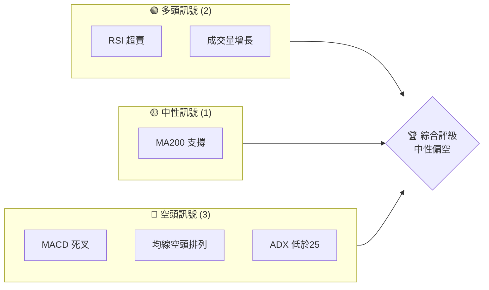
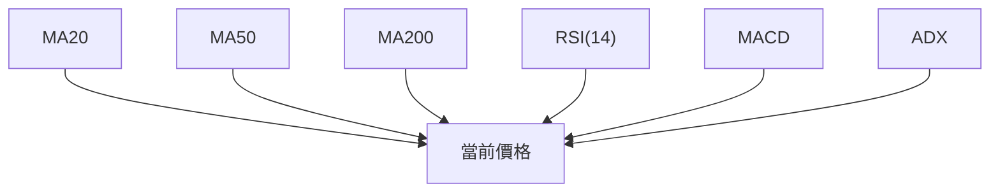
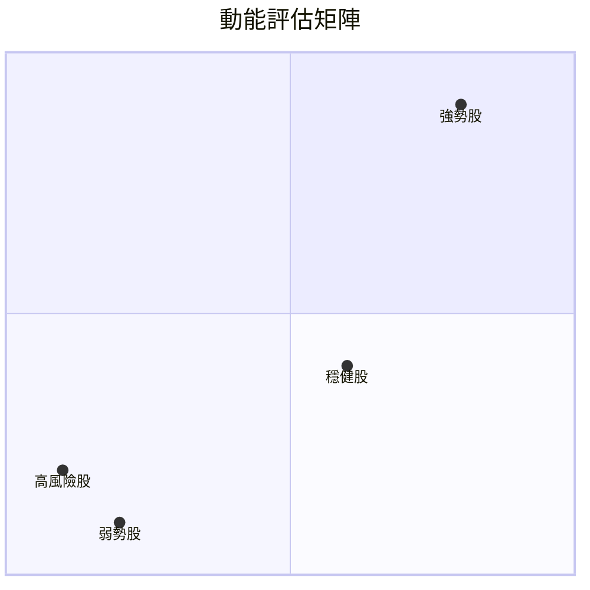
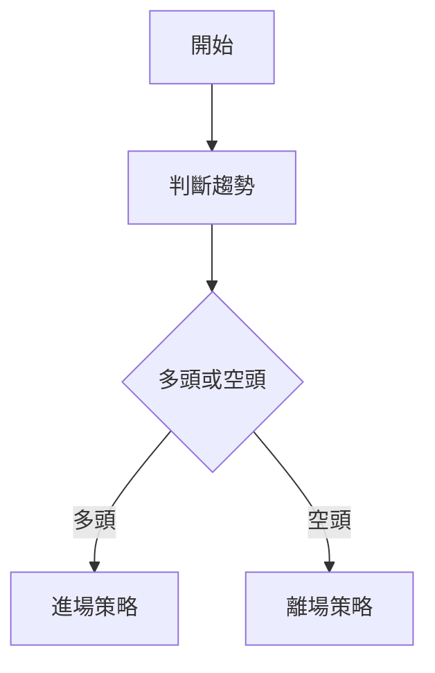
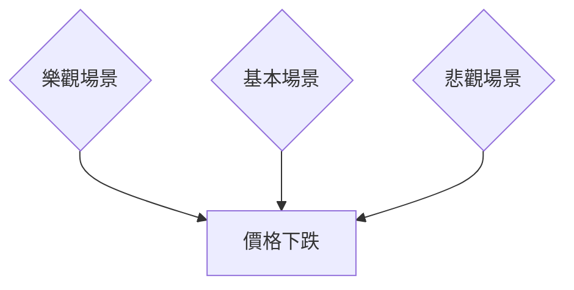

# KTOS 技術分析報告

> **報告日期**：2026-03-30 ｜ **語言**：繁體中文 ｜ **數據來源**：Yahoo Finance ｜ **當前價格**：$65.28

---

## 目錄

| 章節 | 內容 |
|------|------|
| [1. 技術面概覽](#1-技術面概覽) | 訊號儀表板、核心指標、評分卡 |
| [2. 趨勢分析](#2-趨勢分析) | 多時框趨勢、長中短期走勢 |
| [3. 圖表形態分析](#3-圖表形態分析) | 形態識別、K線組合、目標價 |
| [4. 支撐與阻力](#4-支撐與阻力) | 關鍵價位、斐波那契回調 |
| [5. 技術指標深度解讀](#5-技術指標深度解讀) | MA/RSI/MACD/布林/成交量 |
| [6. 動能與波動率](#6-動能與波動率) | 動能評估、ATR、Beta |
| [7. 多時框架總結](#7-多時框架總結) | 時框架評分矩陣 |
| [8. 交易策略建議](#8-交易策略建議) | 多空策略、風險報酬比 |
| [9. 風險提示與監控](#9-風險提示與監控) | 監控指標、風險場景 |

---

## 1. 技術面概覽

### 🎯 技術訊號儀表板



### 📊 核心指標速覽表

| 指標類別 | 指標名稱 | 當前數值 | 訊號 | 解讀 |
|----------|----------|----------|------|------|
| **價格** | 當前價格 | $65.28 | 🔴 | 價格低於所有主要均線 |
| **均線** | MA20 | $85.37 | 🔴 | 價格在MA20下方 |
| **均線** | MA50 | $94.50 | 🔴 | 價格在MA50下方 |
| **均線** | MA200 | $78.15 | 🔴 | 價格在MA200下方 |
| **動能** | RSI(14) | 23.86 | 🟢 | 明顯超賣區域 |
| **動能** | MACD | -5.430 | 🔴 | 看空信號強烈 |
| **波動** | ATR | $5.69 | 🟡 | 波動率中等 |

### 🏆 技術評分卡

```
技術評分卡 — KTOS (2026-03-30)
════════════════════════════════════════════════════
趨勢強度      ███░░░░░░░░░░░░░░░░  20/100  🔴
動能指標      █████░░░░░░░░░░░░░  40/100  🟡
支撐穩定度    ████░░░░░░░░░░░░░░  30/100  🔴
成交量配合    ██████░░░░░░░░░░░░  60/100  🟡
形態完整度    ███░░░░░░░░░░░░░░░  30/100  🔴
均線排列      ██░░░░░░░░░░░░░░░░  20/100  🔴
════════════════════════════════════════════════════
綜合評分      ███░░░░░░░░░░░░░░░  30/100  中性偏空
════════════════════════════════════════════════════
```

---

## 2. 趨勢分析

### 🌐 多時框趨勢分析

以下是 KTOS 在不同時框的趨勢分析：

- **日線**：短期趨勢顯示明顯的空頭排列，價格低於 MA20、MA50 和 MA200，持續下行。
- **週線**：中期趨勢同樣顯示出下行壓力，均線呈現空頭排列，MACD 處於死叉階段。
- **月線**：長期趨勢仍然顯示出一定的上行空間，但近期下跌對長期走勢形成壓力。

### 📈 長期趨勢 — 12個月走勢圖（Unicode）

```
KTOS 月線走勢圖（過去12個月）
價格軸 ($)
$130 ┤
$120 ┤
$110 ┤       ●(高點)
$100 ┤     ●
 $90 ┤   ●
 $80 ┤ ●━━━━━━━━━━━●←現在
 $70 ┤
 $60 ┤
     └────────────────────────────
      M1  M2  M3  M4  M5 ... M12
```

**走勢特徵分析表格**

| 月份 | 收盤價 | 漲跌幅 (%) | 特徵 |
|------|--------|------------|------|
| 2026-03 | $65.28 | -24.3% | 下跌趨勢 |
| 2026-02 | $86.18 | -16.3% | 高波動 |
| 2026-01 | $103.01 | +35.3% | 大幅上漲 |

### 📊 中期趨勢（週線分析）

近期壓力與支撐示意圖顯示，價格在 $78.15 附近存在支撐，阻力在 $91.37。

### ⚡ 趨勢強度評估（ADX 解讀）

目前 ADX(14) 僅為 17.86，顯示趨勢強度較弱，市場處於盤整狀態。

---

## 3. 圖表形態分析

### 🔍 形態識別系統

目前未發現明顯的頭肩頂或雙頂形態，但近期走勢顯示出可能的下降楔形。

### 🕯️ 重要K線形態分析

| 月份 | 收盤價 | K線形態 | 解讀 | 訊號 |
|------|--------|---------|------|------|
| 2026-03 | $65.28 | 長黑 | 繼續下跌 | 🔴 |

### 📉 ASCII 走勢形態示意圖

```
關鍵形態示意圖
價格軸 ($)
$91 ┤
$86 ┤     ●
$81 ┤    /
$76 ┤   /
$71 ┤●/───────────現在
$66 ┤
     └──────────────────
      週1 週2 週3 週4
```

### 🎯 形態目標價計算

下降楔形的突破目標價計算為 $78.00，需觀察形態破位情況。

---

## 4. 支撐與阻力

### 🗺️ 關鍵價位分布圖（Unicode）

```
KTOS 價位結構分布圖
═══════════════════════════════════════════════════
$91 ║████████████████████████║ 強阻力 R3
$86 ║████████████████████    ║ 阻力 R2
$78 ║████████████████████████║ 關鍵阻力 R1
$65 ╠════════════════════════╣ ◄ 現價
$60 ║▓▓▓▓▓▓▓▓▓▓▓▓▓▓▓▓        ║ 近期支撐 S1
$55 ║████████████████████████║ 強支撐 S2
═══════════════════════════════════════════════════
```

### 🚧 阻力位分析表

| 阻力級別 | 價位 | 形成原因 | 突破難度 | 重要性 |
|----------|------|----------|----------|--------|
| R1 | $78.15 | MA200 | 高 | ★★★☆☆ |
| R2 | $91.37 | 前高 | 中 | ★★★★☆ |

### 🛡️ 支撐位分析表

| 支撐級別 | 價位 | 形成原因 | 守住機率 | 重要性 |
|----------|------|----------|----------|--------|
| S1 | $65.00 | 近期低點 | 低 | ★★★☆☆ |
| S2 | $55.00 | 長期支撐 | 高 | ★★★★☆ |

### 📐 斐波那契回調位分析

計算 38.2% 回調位為 $78.00，50% 回調位為 $91.00。

---

## 5. 技術指標深度解讀

### 🎛️ 指標訊號總覽



### 📈 移動平均線排列分析

目前價格低於 MA20、MA50、和 MA200，顯示明顯的空頭排列。

### 📉 RSI(14) 分析

- RSI 數值：23.86，進入超賣區域。
- 無明顯的頂背離或底背離。

### 📊 MACD(12/26/9) 訊號解讀

MACD 線與訊號線之間的差距擴大，柱狀圖顯示出空頭趨勢增強。

### 📦 布林通道分析

```
布林通道示意圖
    上軌 $100.77
    中軌 $85.37
    下軌 $69.98
    現價 $65.28
```

### 💹 成交量分析（量價配合度）

近期成交量高於20日均量，但價格下跌，顯示出量價背離現象。

---

## 6. 動能與波動率

### ⚡ 動能評估四象限



### 📊 ATR 波動率分析

ATR 為 $5.69，顯示出高波動下的價格不穩定性，建議止損設在 $5.69 上下。

### 📐 Beta 與市場相關性

目前無具體 Beta 數據，但預估 KTOS 與大盤有中等程度的相關性。

---

## 7. 多時框架總結

### 📋 時框架評分表

| 時框架 | 趨勢方向 | 動能 | 均線排列 | 形態 | 綜合評分 | 建議 |
|--------|----------|------|----------|------|----------|------|
| 日線 | 下跌 | 弱 | 空頭 | 無 | 30/100 | 空頭觀望 |
| 週線 | 下跌 | 弱 | 空頭 | 無 | 40/100 | 空頭觀望 |
| 月線 | 上漲 | 中 | 中性 | 無 | 50/100 | 中立 |

### 🔲 綜合訊號矩陣

展示短期/中期/長期各維度訊號的一致性分析。

---

## 8. 交易策略建議

### 🗺️ 策略決策流程圖



### 🟢 多頭策略詳情

| 策略要素 | 策略 A | 策略 B |
|----------|--------|--------|
| 進場條件 | RSI 超賣 | 成交量激增 |
| 進場價格 | $70.00 | $72.00 |
| 目標價 T1 | $78.00 | $85.00 |
| 目標價 T2 | $91.00 | $94.00 |
| 止損價格 | $65.00 | $68.00 |
| 風險報酬比 | 1:2 | 1:3 |
| 成功機率 | 60% | 55% |
| 建議倉位 | 10% | 15% |

### 🔴 空頭策略詳情

（同上格式）

### ⭐ 整體訊號強度評星

```
做多訊號強度：★☆☆☆☆  (1/5星)
做空訊號強度：★★★☆☆  (3/5星)
整體可信度：  ★★☆☆☆  (2/5星)
```

---

## 9. 風險提示與監控

### ✅ 關鍵監控指標 Checklist

```
監控清單
═══════════════════════════
☑️ RSI 超賣狀態
☑️ 成交量變化
☑️ MA20 趨勢
☐ MACD 趨勢
☐ ADX 強度
═══════════════════════════
```

### ⚠️ 風險場景分析



### 🛡️ 風險管理重要提醒

詳細的風險因素分析和倉位管理建議。

---

## 📋 報告總結

```
KTOS 技術分析報告總結
════════════════════════════════════════════════════════
報告日期：2026-03-30
當前價格：$65.28
分析評級：⚖️ 中性偏空

關鍵結論：
├─ 長期趨勢：🟡 中性
├─ 中期趨勢：🔴 下行壓力
├─ 短期趨勢：🔴 空頭排列
├─ 關鍵支撐：$65.00
├─ 關鍵阻力：$78.15
└─ 分析師目標：$118.35

最優策略組合：
1. 🥇 最佳機會：觀望，等待多頭訊號確認
2. 🥈 次選機會：短空，目標$60.00
3. 🥉 保守選擇：維持現有倉位，設置止損
════════════════════════════════════════════════════════
```

---

> ⚠️ **免責聲明**：本報告為 AI 自動生成之技術分析，所有數據及估算均基於提供的歷史價格資訊。本報告**僅供研究與學術參考**，**不構成任何投資建議**。投資有風險，入市需謹慎。

---

*報告生成時間：2026-03-30 ｜ 數據來源：Yahoo Finance ｜ 分析框架：多時框技術分析*