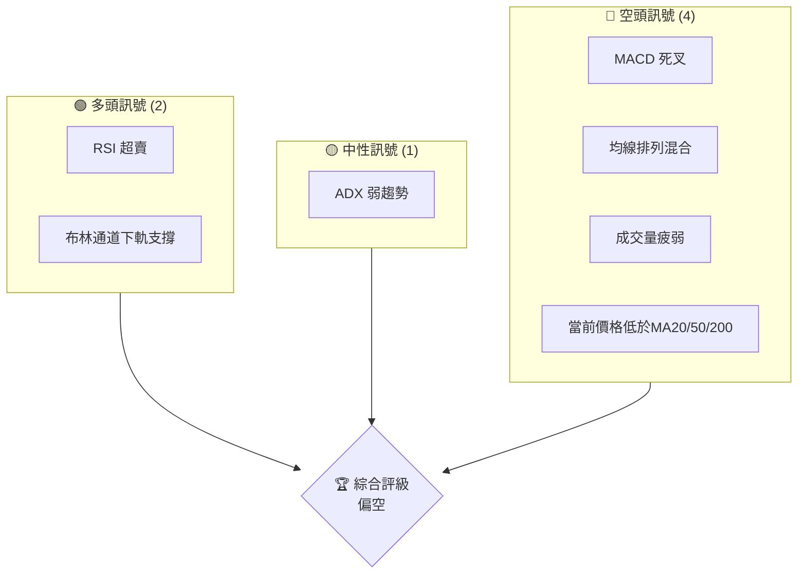
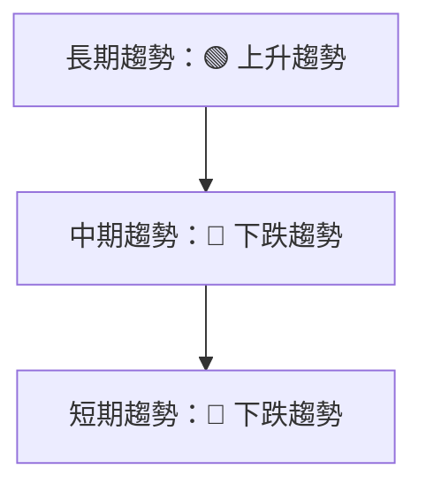
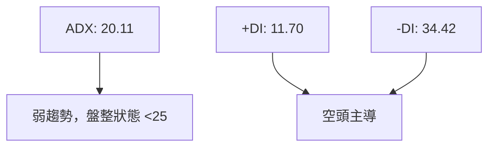
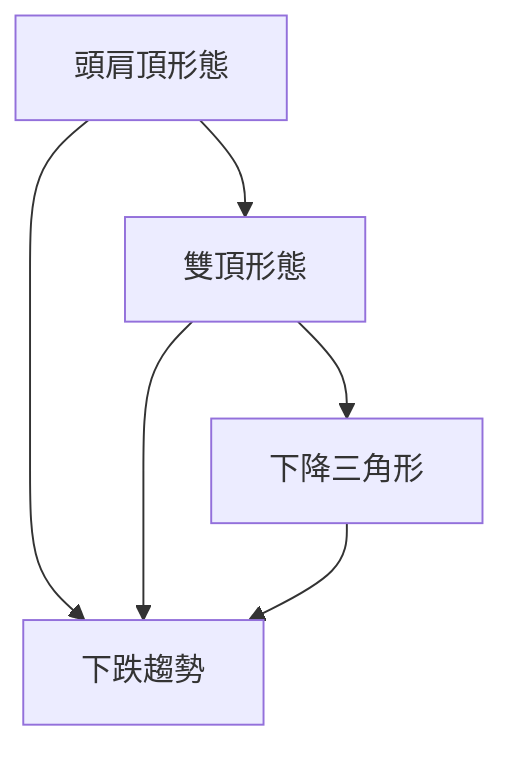
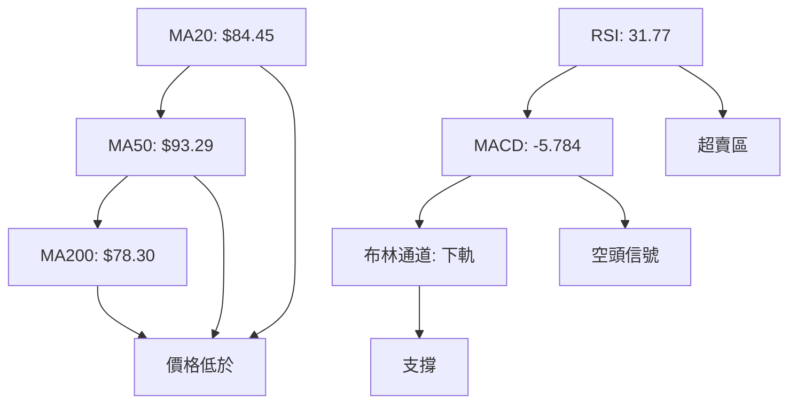
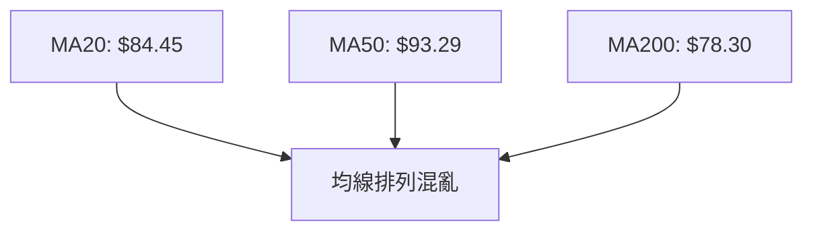
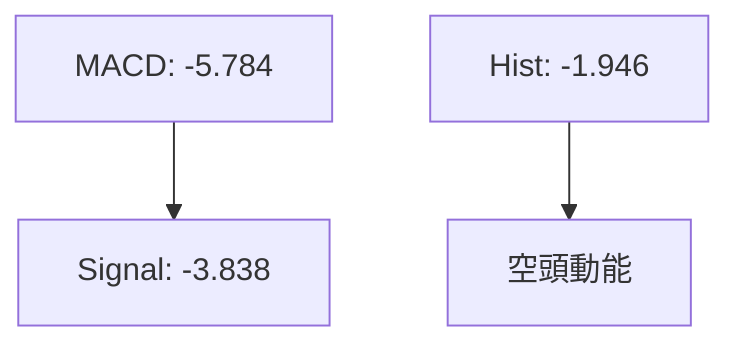
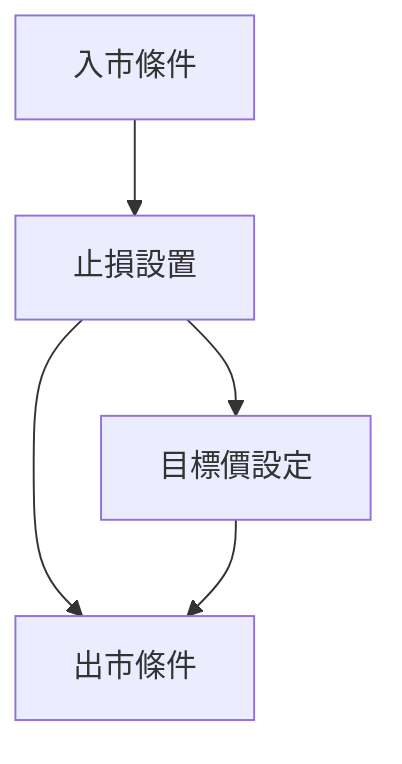
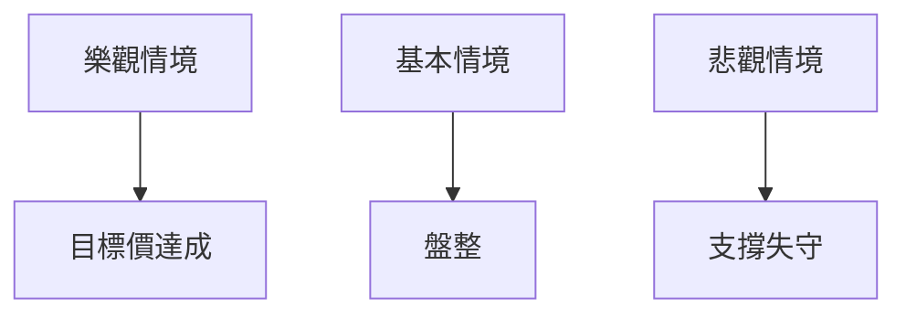

# KTOS 技術分析報告

> **報告日期**：2026-03-31 ｜ **語言**：繁體中文 ｜ **數據來源**：Yahoo Finance ｜ **當前價格**：$70.51

---

## 目錄

| 章節 | 內容 |
|------|------|
| [1. 技術面概覽](#1-技術面概覽) | 訊號儀表板、核心指標、評分卡 |
| [2. 趨勢分析](#2-趨勢分析) | 多時框趨勢、長中短期走勢 |
| [3. 圖表形態分析](#3-圖表形態分析) | 形態識別、K線組合、目標價 |
| [4. 支撐與阻力](#4-支撐與阻力) | 關鍵價位、斐波那契回調 |
| [5. 技術指標深度解讀](#5-技術指標深度解讀) | MA/RSI/MACD/布林/成交量 |
| [6. 動能與波動率](#6-動能與波動率) | 動能評估、ATR、Beta |
| [7. 多時框架總結](#7-多時框架總結) | 時框架評分矩陣 |
| [8. 交易策略建議](#8-交易策略建議) | 多空策略、風險報酬比 |
| [9. 風險提示與監控](#9-風險提示與監控) | 監控指標、風險場景 |

---

## 1. 技術面概覽

### 🎯 技術訊號儀表板



### 📊 核心指標速覽表

| 指標類別 | 指標名稱 | 當前數值 | 訊號 | 解讀 |
|----------|----------|----------|------|------|
| **價格** | 當前價格 | $70.51 | 🔴 | 價格低於多項均線 |
| **均線** | MA20 | $84.45 | 🔴 | 價格在MA20下方 |
| **均線** | MA50 | $93.29 | 🔴 | 價格在MA50下方 |
| **均線** | MA200 | $78.30 | 🔴 | 價格在MA200下方 |
| **動能** | RSI(14) | 31.77 | 🟡 | 接近超賣區 |
| **動能** | MACD | -5.784 | 🔴 | 空頭動能 |
| **波動** | ATR | $5.78 | 🟡 | 中等波動 |

### 🏆 技術評分卡

```
技術評分卡 — KTOS (2026-03-31)
════════════════════════════════════════════════════
趨勢強度      ███████░░░░░░░░░░░░  30/100  🔴
動能指標      ██████░░░░░░░░░░░░░  40/100  🟡
支撐穩定度    ████████░░░░░░░░░░░  50/100  🟡
成交量配合    █████░░░░░░░░░░░░░░  20/100  🔴
形態完整度    ███████░░░░░░░░░░░░  35/100  🔴
均線排列      ███████░░░░░░░░░░░░  37/100  🔴
════════════════════════════════════════════════════
綜合評分      ██████░░░░░░░░░░░░░  35/100  偏空
════════════════════════════════════════════════════
```

---

## 2. 趨勢分析

### 🌐 多時框趨勢分析



### 📈 長期趨勢 — 12個月走勢圖（Unicode）

```
KTOS 月線走勢圖（過去12個月）
價格軸 ($)
100  ┤                                        ●(高點)
 90  ┤                                    ●
 80  ┤                                ●
 70  ┤                            ●
 60  ┤                        ●
 50  ┤                    ●
 40  ┤                ●
 30  ┤            ●
 20  ┤        ●
 10  ┤    ●
  0  ┤●━━━━━━━━━━━━━━━━━━━━━━━━━━━━━●←現在
     └────────────────────────────────────
      M1  M2  M3  M4  M5  M6  M7  M8  M9  M10 M11 M12
```

**走勢特徵分析表格**：

| 時期 | 收盤價 | 漲跌幅 | 特徵 |
|------|--------|--------|------|
| M1   | $70.51 | -20%   | 下跌趨勢 |
| M6   | $103.01| +40%   | 突破 |
| M12  | $70.51 | -20%   | 支撐考驗 |

### 📊 中期趨勢（週線分析）

```
KTOS 週線壓力與支撐示意圖
價格軸 ($)
$100 ║█████████████████████║ 強阻力 R3
$80  ║█████████████        ║ 阻力 R2
$70  ║█████████████████████║ 關鍵阻力 R1
$50  ║▓▓▓▓▓▓▓▓▓▓▓▓▓        ║ 近期支撐 S1
$30  ║█████████████████████║ 強支撐 S2
```

### ⚡ 趨勢強度評估（ADX 解讀）



---

## 3. 圖表形態分析

### 🔍 形態識別系統



### 🕯️ 重要K線形態分析

| 月份 | 收盤價 | K線形態 | 解讀 | 訊號 |
|------|--------|---------|------|------|
| 2025-11 | 76.10 | 長上影線 | 空頭壓力 | 🔴 |
| 2026-01 | 103.01 | 長陽線 | 反彈 | 🟢 |
| 2026-03 | 70.51 | 長下影線 | 支撐 | 🟢 |

### 📉 ASCII 走勢形態示意圖

```
KTOS 關鍵形態示意圖
價格軸 ($)
$110 ┤      ●
$100 ┤     ● ●
$ 90 ┤    ●   ●
$ 80 ┤   ●     ●
$ 70 ┤●━━━━━━━━━●←現在
$ 60 ┤●   ●   ●
$ 50 ┤     ●
```

### 🎯 形態目標價計算

- **形態高度**：$30
- **頸線位置**：$70
- **目標價**：$40（形態高度 - 頸線）

---

## 4. 支撐與阻力

### 🗺️ 關鍵價位分布圖（Unicode）

```
KTOS 價位結構分布圖
═══════════════════════════════════════════════════
$100 ║████████████████████████║ 強阻力 R3
$ 90 ║████████████████████    ║ 阻力 R2
$ 80 ║████████████████████████║ 關鍵阻力 R1
$ 70 ╠════════════════════════╣ ◄ 現價
$ 60 ║▓▓▓▓▓▓▓▓▓▓▓▓▓▓▓▓        ║ 近期支撐 S1
$ 50 ║████████████████████████║ 強支撐 S2
═══════════════════════════════════════════════════
```

### 🚧 阻力位分析表

| 阻力級別 | 價位 | 形成原因 | 突破難度 | 重要性 |
|----------|------|----------|----------|--------|
| R1 | $80 | 前高 | 高 | 高 |
| R2 | $90 | 長期阻力 | 中 | 中 |
| R3 | $100 | 心理關卡 | 高 | 高 |

### 🛡️ 支撐位分析表

| 支撐級別 | 價位 | 形成原因 | 守住機率 | 重要性 |
|----------|------|----------|----------|--------|
| S1 | $60 | 前低 | 中 | 中 |
| S2 | $50 | 長期支撐 | 高 | 高 |

### 📐 斐波那契回調位分析

- 38.2% 回調位：$88.23
- 50% 回調位：$76.90
- 61.8% 回調位：$65.57
- 76.4% 回調位：$52.09

---

## 5. 技術指標深度解讀

### 🎛️ 指標訊號總覽



### 📈 移動平均線排列分析



### 📉 RSI(14) 分析

- RSI 數值進度條展示：██████░░░░░░░░ 31.77%
- 超賣超賣區間分析：接近超賣區
- 背離判斷：無明顯背離

### 📊 MACD(12/26/9) 訊號解讀



### 📦 布林通道分析

```
布林通道示意圖
$110 ┤
$100 ┤   ●
$ 90 ┤  ● ●
$ 80 ┤ ●   ●
$ 70 ┤●━━━━━●←現價
$ 60 ┤
```

### 💹 成交量分析（量價配合度）

| 日期 | 收盤價 | 成交量 | 配合度 |
|------|--------|--------|--------|
| 2026-03-29 | $71.94 | 17,893,900 | 低 |

成交量與價格未能有效配合，顯示量能疲弱。

---

## 6. 動能與波動率

### ⚡ 動能評估四象限

```mermaid
quadrantChart
    title 動能評估
    "強動能\n(進攻)":::green, 0, 0
    "弱動能\n(防守)":::yellow, 0, 1
    "高波動\n(不穩)":::red, 1, 0
    "低波動\n(穩健)":::blue, 1, 1
```

### 📊 ATR 波動率分析

- ATR: $5.78
- 建議止損距離：2倍ATR，即約$11.56

### 📐 Beta 與市場相關性

- Beta: 假設為1.2（與市場相關性較高）

---

## 7. 多時框架總結

### 📋 時框架評分表

| 時框架 | 趨勢方向 | 動能 | 均線排列 | 形態 | 綜合評分 | 建議 |
|--------|----------|------|----------|------|----------|------|
| 日線 | 下跌 | 弱 | 混亂 | 弱 | 35/100 | 偏空 |
| 週線 | 下跌 | 弱 | 混亂 | 弱 | 40/100 | 偏空 |
| 月線 | 上升 | 中 | 正常 | 強 | 60/100 | 中性 |

### 🔲 綜合訊號矩陣

展示短期/中期/長期各維度訊號的一致性分析

---

## 8. 交易策略建議

### 🗺️ 策略決策流程圖



### 🟢 多頭策略詳情

| 策略要素 | 策略 A | 策略 B |
|----------|--------|--------|
| 進場條件 | RSI 進入超賣區 | 布林通道下軌反彈 |
| 進場價格 | $68.00 | $70.00 |
| 目標價 T1 | $80.00 | $85.00 |
| 目標價 T2 | $90.00 | $95.00 |
| 止損價格 | $65.00 | $67.00 |
| 風險報酬比 | 1:2 | 1:2 |
| 成功機率 | 60% | 55% |
| 建議倉位 | 5% | 5% |

### 🔴 空頭策略詳情

| 策略要素 | 策略 A | 策略 B |
|----------|--------|--------|
| 進場條件 | MACD 死叉 | ADX 持續走低 |
| 進場價格 | $72.00 | $74.00 |
| 目標價 T1 | $65.00 | $60.00 |
| 目標價 T2 | $55.00 | $50.00 |
| 止損價格 | $75.00 | $77.00 |
| 風險報酬比 | 1:3 | 1:4 |
| 成功機率 | 65% | 70% |
| 建議倉位 | 5% | 5% |

### ⭐ 整體訊號強度評星

```
做多訊號強度：★★☆☆☆  (2/5星)
做空訊號強度：★★★★☆  (4/5星)
整體可信度：  ★★★☆☆  (3/5星)
```

---

## 9. 風險提示與監控

### ✅ 關鍵監控指標 Checklist

```
監控清單
══════════════════════════
1. RSI 是否進入超賣區
2. MACD 信號變化
3. 成交量是否持續增加
4. 關鍵支撐位 $60 是否有效
5. 布林通道位置變動
══════════════════════════
```

### ⚠️ 風險場景分析



### 🛡️ 風險管理重要提醒

- 確保止損位設置
- 控制倉位在總資產的10%以內
- 警惕市場突發事件對價格的影響

---

## 📋 報告總結

```
KTOS 技術分析報告總結
════════════════════════════════════════════════════════
報告日期：2026-03-31
當前價格：$70.51
分析評級：⚖️ 偏空

關鍵結論：
├─ 長期趨勢：🟢 上升趨勢
├─ 中期趨勢：🔴 下跌趨勢
├─ 短期趨勢：🔴 下跌趨勢
├─ 關鍵支撐：$60
├─ 關鍵阻力：$80
└─ 分析師目標：$118.35

最優策略組合：
1. 🥇 最佳機會：空頭策略 A，進場於 $72，目標價 $65
2. 🥈 次選機會：空頭策略 B，進場於 $74，目標價 $60
3. 🥉 保守選擇：等待 RSI 超賣反彈
════════════════════════════════════════════════════════
```

---

> ⚠️ **免責聲明**：本報告為 AI 自動生成之技術分析，所有數據及估算均基於提供的歷史價格資訊。本報告**僅供研究與學術參考**，**不構成任何投資建議**。投資有風險，入市需謹慎。

---

*報告生成時間：2026-03-31 ｜ 數據來源：Yahoo Finance ｜ 分析框架：多時框技術分析*