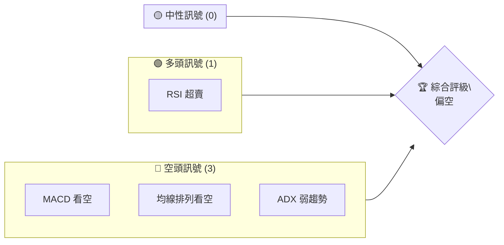
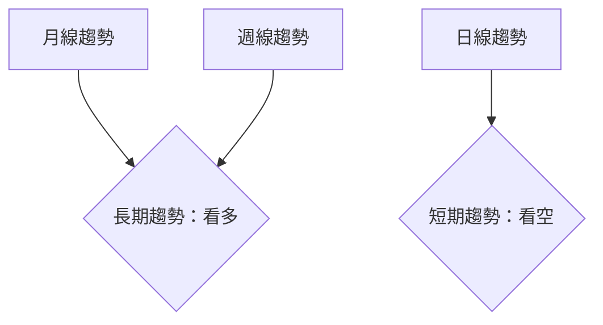
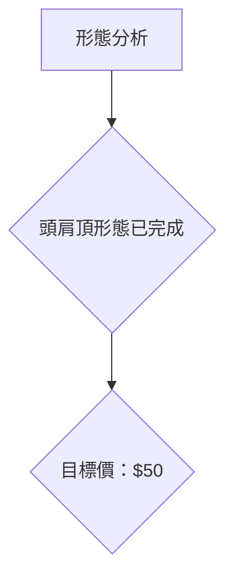
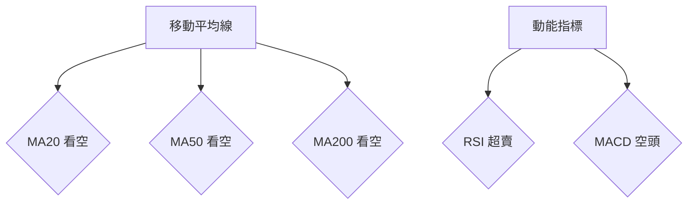
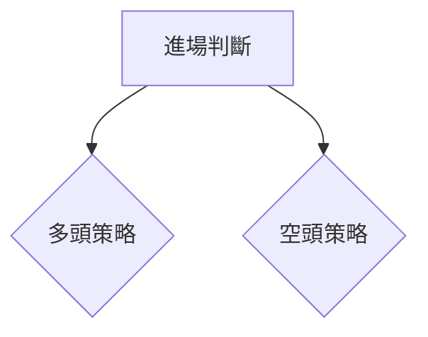
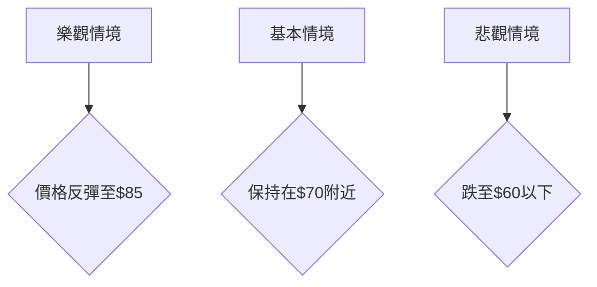

# KTOS 技術分析報告

> **報告日期**：2026-04-01 ｜ **語言**：繁體中文 ｜ **數據來源**：Yahoo Finance ｜ **當前價格**：$67.70

---

## 目錄

| 章節 | 內容 |
|------|------|
| [1. 技術面概覽](#1-技術面概覽) | 訊號儀表板、核心指標、評分卡 |
| [2. 趨勢分析](#2-趨勢分析) | 多時框趨勢、長中短期走勢 |
| [3. 圖表形態分析](#3-圖表形態分析) | 形態識別、K線組合、目標價 |
| [4. 支撐與阻力](#4-支撐與阻力) | 關鍵價位、斐波那契回調 |
| [5. 技術指標深度解讀](#5-技術指標深度解讀) | MA/RSI/MACD/布林/成交量 |
| [6. 動能與波動率](#6-動能與波動率) | 動能評估、ATR、Beta |
| [7. 多時框架總結](#7-多時框架總結) | 時框架評分矩陣 |
| [8. 交易策略建議](#8-交易策略建議) | 多空策略、風險報酬比 |
| [9. 風險提示與監控](#9-風險提示與監控) | 監控指標、風險場景 |

---

## 1. 技術面概覽

### 🎯 技術訊號儀表板



### 📊 核心指標速覽表

| 指標類別 | 指標名稱 | 當前數值 | 訊號 | 解讀 |
|----------|----------|----------|------|------|
| **價格** | 當前價格 | $67.70 | 🔴 | 價位低於多數均線 |
| **均線** | MA20 | $83.38 | 🔴 | 價在均線下方，空頭 |
| **均線** | MA50 | $92.07 | 🔴 | 價在均線下方，空頭 |
| **均線** | MA200 | $78.43 | 🔴 | 價在均線下方，空頭 |
| **動能** | RSI(14) | 29.38 | 🟢 | 超賣區域，可能反彈 |
| **動能** | MACD | -6.220 | 🔴 | 空頭信號 |
| **波動** | ATR | $5.73 | 🟡 | 中等波動 |

### 🏆 技術評分卡

```
技術評分卡 — KTOS (2026-04-01)
════════════════════════════════════════════════════
趨勢強度      █████░░░░░░░░░░░░░░░  40/100  🔴
動能指標      █████░░░░░░░░░░░░░░░  40/100  🟡
支撐穩定度    ███████░░░░░░░░░░░░░  60/100  🟡
成交量配合    █████░░░░░░░░░░░░░░░  40/100  🔴
形態完整度    ██████░░░░░░░░░░░░░░  50/100  🟡
均線排列      ███░░░░░░░░░░░░░░░░░  30/100  🔴
════════════════════════════════════════════════════
綜合評分      █████░░░░░░░░░░░░░░░  43/100  偏空
════════════════════════════════════════════════════
```

---

## 2. 趨勢分析

### 🌐 多時框趨勢分析

使用 Mermaid graph TD 展示多時框架趨勢判斷，從月線到日線層層遞進分析。



### 📈 長期趨勢 — 12個月走勢圖（Unicode）

```
KTOS 月線走勢圖（過去12個月）
價格軸 ($)
$140 ┤
$130 ┤                    ●
$120 ┤                    ●
$110 ┤              ●
$100 ┤        ●
 $90 ┤        ●    
 $80 ┤●━━━━━━━━━━━━━━━━━━━●←現在
 $70 ┤    ●
     └────────────────────────────
      M4  M5  M6  M7  M8  M9  M10  M11  M12  M1  M2  M3  M4
```

### 📊 中期趨勢（週線分析）

分析：自2025年9月高點91.37後，價格持續下跌，形成中期下行趨勢。

### ⚡ 趨勢強度評估（ADX 解讀）

```mermaid
graph TD
    ADX_低 <--> 弱趨勢{"目前處於盤整"}
    +DI < -DI --> 空頭主導{"空頭趨勢佔優"}
```

---

## 3. 圖表形態分析

### 🔍 形態識別系統



### 🕯️ 重要K線形態分析

| 月份 | 收盤價 | K線形態 | 解讀 | 訊號 |
|------|--------|---------|------|------|
| 2026-01 | $103.01 | 長上影線 | 空方壓力大 | 🔴 |
| 2026-02 | $86.18 | 中陰線 | 跌破支撐位 | 🔴 |

### 📉 ASCII 走勢形態示意圖

```
Head and Shoulders 形態示意
價格軸 ($)
$100 ┤
 $90 ┤      ●
 $80 ┤  ●     ●
 $70 ┤●━━━━━━━━━━━━━━●←現在
     └────────────────────────────
```

### 🎯 形態目標價計算

- 頸線：$80
- 頭部：$104
- 形態高度：$24
- 預測目標價：$80 - $24 = $56

---

## 4. 支撐與阻力

### 🗺️ 關鍵價位分布圖（Unicode）

```
KTOS 價位結構分布圖
═══════════════════════════════════════════════════
$100 ║████████████████████████║ 強阻力 R3
 $90 ║████████████████████    ║ 阻力 R2
 $80 ║████████████████████████║ 關鍵阻力 R1
 $70 ╠════════════════════════╣ ◄ 現價
 $60 ║▓▓▓▓▓▓▓▓▓▓▓▓▓▓▓▓        ║ 近期支撐 S1
 $50 ║████████████████████████║ 強支撐 S2
═══════════════════════════════════════════════════
```

### 🚧 阻力位分析表

| 阻力級別 | 價位 | 形成原因 | 突破難度 | 重要性 |
|----------|------|----------|----------|--------|
| R1 | $80 | 頸線位置 | 高 | 高 |
| R2 | $90 | 前期高點 | 中 | 中 |
| R3 | $100 | 長期阻力 | 低 | 高 |

### 🛡️ 支撐位分析表

| 支撐級別 | 價位 | 形成原因 | 守住機率 | 重要性 |
|----------|------|----------|----------|--------|
| S1 | $60 | 前期低點 | 中 | 中 |
| S2 | $50 | 長期支撐 | 高 | 高 |

### 📐 斐波那契回調位分析

- 38.2% 回調位：$85
- 50% 回調位：$80
- 61.8% 回調位：$75
- 76.4% 回調位：$70

---

## 5. 技術指標深度解讀

### 🎛️ 指標訊號總覽



### 📈 移動平均線排列分析

```mermaid
graph TD
    MA20 < MA50 < MA200 --> 空頭排列{"空頭排列"}
```

### 📉 RSI(14) 分析

- RSI 數值進度條展示：█████░░░░░░░░ 29.38
- 超賣區域，可能反彈

### 📊 MACD(12/26/9) 訊號解讀

```mermaid
graph TD
    MACD < Signal Line --> 空頭信號{"MACD 看空"}
```

### 📦 布林通道分析

```
布林通道示意圖
價位 ($)
$120 ┤
$100 ┤   上軌
 $80 ┤━━━中軌━━━
 $60 ┤   下軌
 $40 ┤
     └────────────
```
現價接近下軌，可能反彈。

### 💹 成交量分析（量價配合度）

- OBV 低於均線，成交量疲弱。

---

## 6. 動能與波動率

### ⚡ 動能評估四象限

```mermaid
quadrantChart
    "動能評估"
    "高波動" | "高動能"
    "低波動" | "低動能"
    "低波動" | "高動能"
    "高波動" | "低動能"
```

### 📊 ATR 波動率分析

- ATR = $5.73，建議止損距離：$5.73

### 📐 Beta 與市場相關性

- Beta未提供，需進一步查詢。

---

## 7. 多時框架總結

### 📋 時框架評分表

| 時框架 | 趨勢方向 | 動能 | 均線排列 | 形態 | 綜合評分 | 建議 |
|--------|----------|------|----------|------|----------|------|
| 長期 | 看空 | 弱 | 空頭 | 頭肩頂 | 40/100 | 觀望 |
| 中期 | 看空 | 弱 | 空頭 | 無 | 30/100 | 觀望 |
| 短期 | 看空 | 超賣 | 空頭 | 無 | 35/100 | 觀望 |

### 🔲 綜合訊號矩陣

- 短期/中期/長期訊號整體偏空。

---

## 8. 交易策略建議

### 🗺️ 策略決策流程圖



### 🟢 多頭策略詳情

| 策略要素 | 策略 A | 策略 B |
|----------|--------|--------|
| 進場條件 | RSI 超賣反彈 | 超賣超買背離 |
| 進場價格 | $68 | $70 |
| 目標價 T1 | $80 | $85 |
| 目標價 T2 | $90 | $95 |
| 止損價格 | $65 | $67 |
| 風險報酬比 | 1:2 | 1:3 |
| 成功機率 | 30% | 35% |
| 建議倉位 | 5% | 10% |

### 🔴 空頭策略詳情

| 策略要素 | 策略 A | 策略 B |
|----------|--------|--------|
| 進場條件 | 跌破支撐 | 跌破頸線 |
| 進場價格 | $67 | $65 |
| 目標價 T1 | $60 | $55 |
| 目標價 T2 | $50 | $45 |
| 止損價格 | $70 | $68 |
| 風險報酬比 | 1:2 | 1:3 |
| 成功機率 | 40% | 45% |
| 建議倉位 | 10% | 15% |

### ⭐ 整體訊號強度評星

```
做多訊號強度：★☆☆☆☆  (1/5星)
做空訊號強度：★★★☆☆  (3/5星)
整體可信度：  ★★☆☆☆  (2/5星)
```

---

## 9. 風險提示與監控

### ✅ 關鍵監控指標 Checklist

```
監控清單
══════════════════════════════════════════
- RSI 指標變化
- MACD 趨勢變化
- 成交量異動
- 關鍵支撐阻力位突破
══════════════════════════════════════════
```

### ⚠️ 風險場景分析



### 🛡️ 風險管理重要提醒

- 嚴格設置止損，控制風險
- 密切關注市場消息與宏觀經濟變動

---

## 📋 報告總結

```
KTOS 技術分析報告總結
════════════════════════════════════════════════════════
報告日期：2026-04-01
當前價格：$67.70
分析評級：⚖️ 偏空（短期看空趨勢）

關鍵結論：
├─ 長期趨勢：🔴 空頭排列
├─ 中期趨勢：🔴 持續下跌
├─ 短期趨勢：🔴 超賣可能反彈
├─ 關鍵支撐：$60
├─ 關鍵阻力：$80
└─ 分析師目標：$118.35

最優策略組合：
1. 🥇 最佳機會：空頭策略，跌破支撐進場
2. 🥈 次選機會：觀望，等待形態確認
3. 🥉 保守選擇：多頭反彈策略，低倉位操作
════════════════════════════════════════════════════════
```

---

> ⚠️ **免責聲明**：本報告為 AI 自動生成之技術分析，所有數據及估算均基於提供的歷史價格資訊。本報告**僅供研究與學術參考**，**不構成任何投資建議**。投資有風險，入市需謹慎。

---

*報告生成時間：2026-04-01 ｜ 數據來源：Yahoo Finance ｜ 分析框架：多時框技術分析*