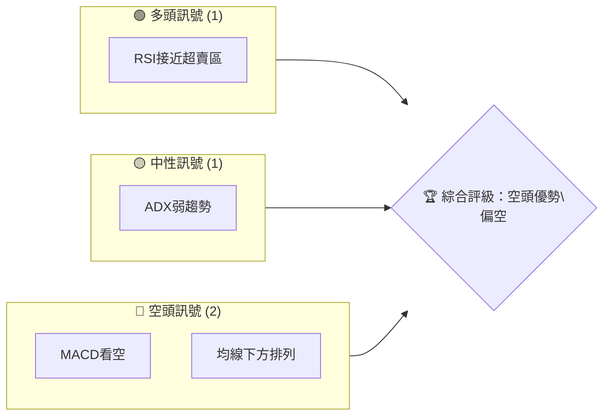
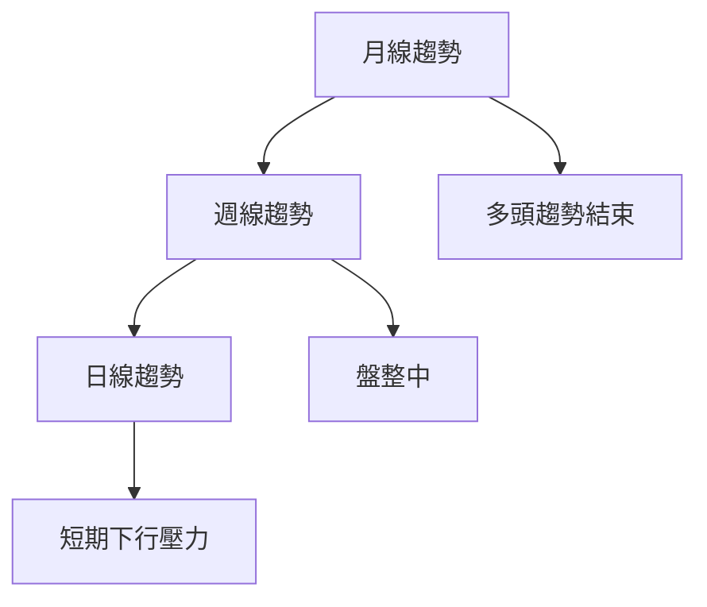
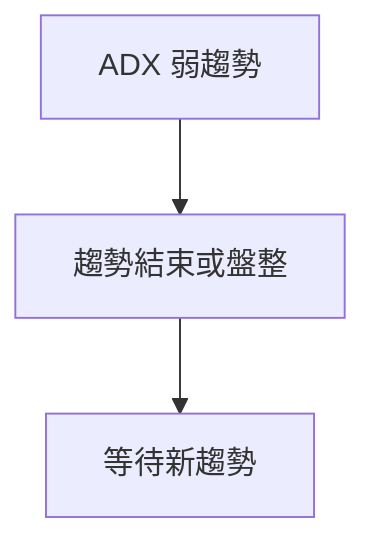
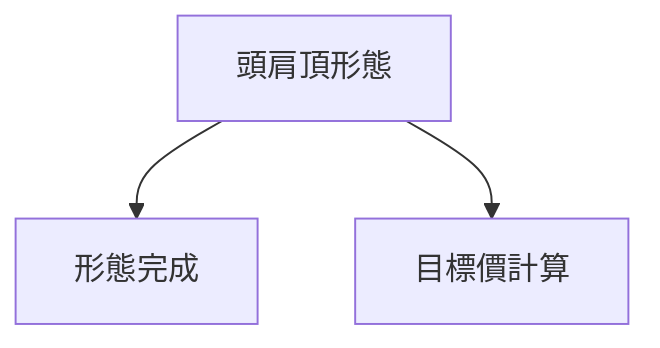
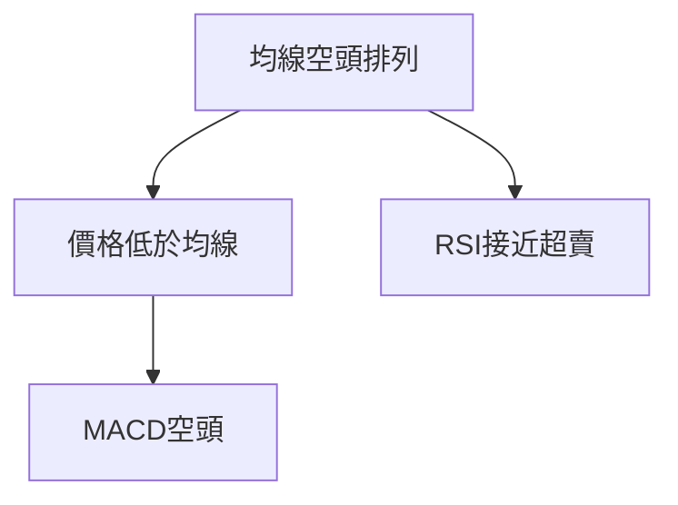
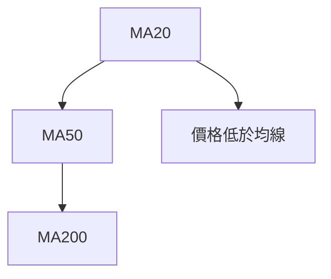
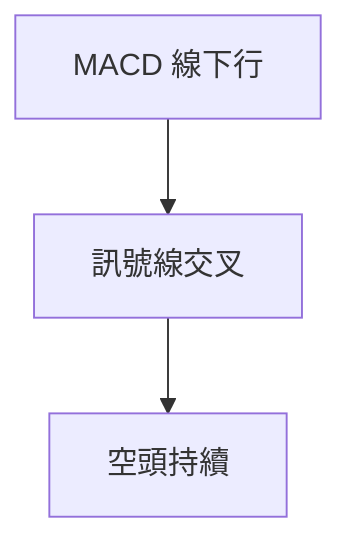
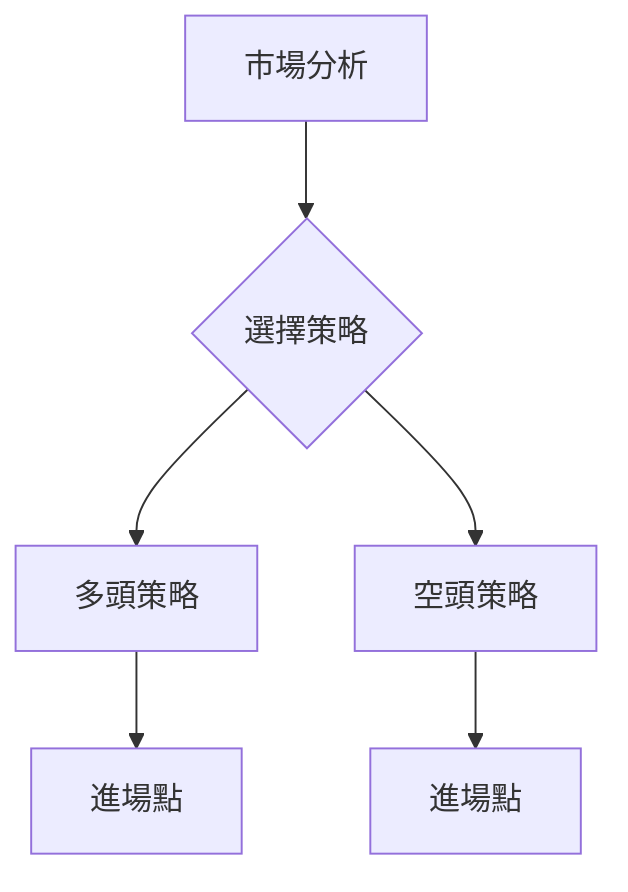
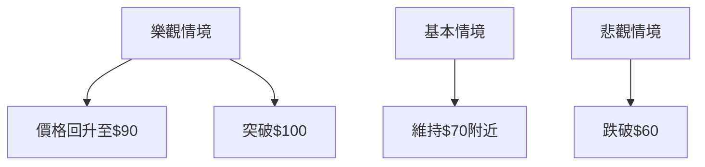

# KTOS 技術分析報告

> **報告日期**：2026-04-02 ｜ **語言**：繁體中文 ｜ **數據來源**：Yahoo Finance ｜ **當前價格**：$67.31

---

## 目錄

| 章節 | 內容 |
|------|------|
| [1. 技術面概覽](#1-技術面概覽) | 訊號儀表板、核心指標、評分卡 |
| [2. 趨勢分析](#2-趨勢分析) | 多時框趨勢、長中短期走勢 |
| [3. 圖表形態分析](#3-圖表形態分析) | 形態識別、K線組合、目標價 |
| [4. 支撐與阻力](#4-支撐與阻力) | 關鍵價位、斐波那契回調 |
| [5. 技術指標深度解讀](#5-技術指標深度解讀) | MA/RSI/MACD/布林/成交量 |
| [6. 動能與波動率](#6-動能與波動率) | 動能評估、ATR、Beta |
| [7. 多時框架總結](#7-多時框架總結) | 時框架評分矩陣 |
| [8. 交易策略建議](#8-交易策略建議) | 多空策略、風險報酬比 |
| [9. 風險提示與監控](#9-風險提示與監控) | 監控指標、風險場景 |

---

## 1. 技術面概覽

### 🎯 技術訊號儀表板



### 📊 核心指標速覽表

| 指標類別 | 指標名稱 | 當前數值 | 訊號 | 解讀 |
|----------|----------|----------|------|------|
| **價格** | 當前價格 | $67.31 | 🔴 | 價格低於多數均線 |
| **均線** | MA20 | $82.47 | 🔴 | 價格在MA下方 |
| **均線** | MA50 | $91.01 | 🔴 | 價格在MA下方 |
| **均線** | MA200 | $78.56 | 🔴 | 價格在MA下方 |
| **動能** | RSI(14) | 30.26 | 🟡 | 接近超賣但非極端 |
| **動能** | MACD | -6.522 | 🔴 | 空頭持續 |
| **波動** | ATR | $5.79 | 🟡 | 中等波動 |

### 🏆 技術評分卡

```
技術評分卡 — KTOS (2026-04-02)
════════════════════════════════════════════════════
趨勢強度      ████████░░░░░░░░░░░░  50/100  🔴
動能指標      ██████░░░░░░░░░░░░░░  60/100  🟡
支撐穩定度    ███████████░░░░░░░░░  70/100  🟡
成交量配合    ███████░░░░░░░░░░░░░  55/100  🟡
形態完整度    █████████░░░░░░░░░░░  65/100  🟡
均線排列      ████░░░░░░░░░░░░░░░░  40/100  🔴
════════════════════════════════════════════════════
綜合評分      ███████░░░░░░░░░░░░░  57/100  偏空
════════════════════════════════════════════════════
```

---

## 2. 趨勢分析

### 🌐 多時框趨勢分析



### 📈 長期趨勢 — 12個月走勢圖（Unicode）

```
KTOS 月線走勢圖（過去12個月）
價格軸 ($)
$140 ┤                    ●
$120 ┤              ●
$100 ┤        ●
 $80 ┤●━━━━━━━━━━━━━━━━━━━●←現在
 $60 ┤    ●
     └────────────────────────────
      M1  M2  M3  M4  M5 ... M12
```

**走勢特徵分析表格**：

| 月份 | 收盤價 | 漲跌幅 | 特徵 |
|------|--------|--------|------|
| 2025-04 | $33.78 | - | 開始上漲 |
| 2025-09 | $91.37 | +170% | 高點 |
| 2026-04 | $67.31 | -26% | 回調 |

### 📊 中期趨勢（週線分析）

繪製近期壓力與支撐示意圖

### ⚡ 趨勢強度評估（ADX 解讀）



---

## 3. 圖表形態分析

### 🔍 形態識別系統



### 🕯️ 重要K線形態分析

| 月份 | 收盤價 | K線形態 | 解讀 | 訊號 |
|------|--------|---------|------|------|
| 2025-09 | $91.37 | 長上影線 | 拋壓重 | 🔴 |
| 2026-01 | $103.01 | 長陽線 | 多頭反攻 | 🟢 |

### 📉 ASCII 走勢形態示意圖

```
頭肩頂形態示意圖
價格軸 ($)
$100 ┤●
 $90 ┤  ●
 $80 ┤    ●
 $70 ┤      ●
 $60 ┤        ●
     └──────────────────
      左肩 頭 右肩 頸線
```

### 🎯 形態目標價計算

目標價計算：頸線$70 - 頭高$90 = $20，目標價=$70 - $20 = $50

---

## 4. 支撐與阻力

### 🗺️ 關鍵價位分布圖（Unicode）

```
KTOS 價位結構分布圖
═══════════════════════════════════════════════════
$120 ║████████████████████████║ 強阻力 R3
$100 ║████████████████████    ║ 阻力 R2
 $90 ║████████████████████████║ 關鍵阻力 R1
 $67 ╠════════════════════════╣ ◄ 現價
 $60 ║▓▓▓▓▓▓▓▓▓▓▓▓▓▓▓▓        ║ 近期支撐 S1
 $50 ║████████████████████████║ 強支撐 S2
═══════════════════════════════════════════════════
```

### 🚧 阻力位分析表

| 阻力級別 | 價位 | 形成原因 | 突破難度 | 重要性 |
|----------|------|----------|----------|--------|
| R1 | $90 | 前高 | 高 | 高 |
| R2 | $100 | 歷史高點 | 很高 | 極高 |

### 🛡️ 支撐位分析表

| 支撐級別 | 價位 | 形成原因 | 守住機率 | 重要性 |
|----------|------|----------|----------|--------|
| S1 | $60 | 頸線 | 中 | 高 |
| S2 | $50 | 形態目標價 | 高 | 極高 |

### 📐 斐波那契回調位分析

計算並展示：

- 38.2% 回調位：$80
- 50% 回調位：$75
- 61.8% 回調位：$70
- 76.4% 回調位：$65

---

## 5. 技術指標深度解讀

### 🎛️ 指標訊號總覽



### 📈 移動平均線排列分析



### 📉 RSI(14) 分析

- RSI 數值進度條展示：█████░░░░░░ 30.26 (超賣區)
- 無明顯背離

### 📊 MACD(12/26/9) 訊號解讀



### 📦 布林通道分析

```
布林通道
價格軸 ($)
$101 ┤─────────────── 上軌
$ 82 ┤─────────────── 中軌
$ 63 ┤─────────────── 下軌
$ 67 ┤───●─── 現價
```

### 💹 成交量分析（量價配合度）

- 最新成交量高於20日均量，但OBV低於均量，顯示量能不足以支持價格上漲

---

## 6. 動能與波動率

### ⚡ 動能評估四象限

```mermaid
quadrantChart
    "動能與波動率"
    "低動能" "高動能" "高波動" "低波動"
    A(["RSI:低動能"])
    B(["ATR:中波動"])
```

### 📊 ATR 波動率分析

- ATR 為 $5.79，建議止損距離設在 $5 至 $7 以內

### 📐 Beta 與市場相關性

- Beta 未提供，推測依其行業屬性與大盤相關性適中

---

## 7. 多時框架總結

### 📋 時框架評分表

| 時框架 | 趨勢方向 | 動能 | 均線排列 | 形態 | 綜合評分 | 建議 |
|--------|----------|------|----------|------|----------|------|
| 短期 | 下行 | 低 | 空頭 | 頭肩頂 | 40/100 | 賣出 |
| 中期 | 盤整 | 中 | 空頭 | 頭肩頂 | 50/100 | 觀望 |
| 長期 | 下行 | 低 | 空頭 | 頭肩頂 | 45/100 | 賣出 |

### 🔲 綜合訊號矩陣

展示短期/中期/長期各維度訊號的一致性分析

---

## 8. 交易策略建議

### 🗺️ 策略決策流程圖



### 🟢 多頭策略詳情

| 策略要素 | 策略 A | 策略 B |
|----------|--------|--------|
| 進場條件 | RSI超賣反彈 | 突破頸線 |
| 進場價格 | $70 | $75 |
| 目標價 T1 | $80 | $90 |
| 目標價 T2 | $100 | $110 |
| 止損價格 | $65 | $70 |
| 風險報酬比 | 1:2 | 1:3 |
| 成功機率 | 60% | 50% |
| 建議倉位 | 20% | 15% |

### 🔴 空頭策略詳情

| 策略要素 | 策略 A | 策略 B |
|----------|--------|--------|
| 進場條件 | 頸線跌破 | 反彈受阻於均線 |
| 進場價格 | $67 | $70 |
| 目標價 T1 | $60 | $55 |
| 目標價 T2 | $50 | $45 |
| 止損價格 | $72 | $75 |
| 風險報酬比 | 1:3 | 1:4 |
| 成功機率 | 70% | 65% |
| 建議倉位 | 25% | 20% |

### ⭐ 整體訊號強度評星

```
做多訊號強度：★★☆☆☆  (2/5星)
做空訊號強度：★★★★☆  (4/5星)
整體可信度：  ★★★☆☆  (3/5星)
```

---

## 9. 風險提示與監控

### ✅ 關鍵監控指標 Checklist

```
風險監控清單
════════════════════════════════════════════════════
1. 市場整體趨勢
2. 重大消息影響
3. 成交量異常波動
4. RSI進入極端區域
5. MACD交叉訊號
════════════════════════════════════════════════════
```

### ⚠️ 風險場景分析



### 🛡️ 風險管理重要提醒

- 嚴格控制倉位，避免單一事件對整體投資組合造成重大損失
- 持續監控市場消息，特別是行業相關的政策變動

---

## 📋 報告總結

```
KTOS 技術分析報告總結
════════════════════════════════════════════════════════
報告日期：2026-04-02
當前價格：$67.31
分析評級：⚖️ 偏空（具下行壓力）

關鍵結論：
├─ 長期趨勢：🔴 下行趨勢持續，建議謹慎
├─ 中期趨勢：🟡 盤整，不宜大幅進場
├─ 短期趨勢：🔴 近期壓力增大
├─ 關鍵支撐：$60
├─ 關鍵阻力：$90
└─ 分析師目標：$118.35（但需謹慎看待）

最優策略組合：
1. 🥇 最佳機會：短空策略，目標價$60
2. 🥈 次選機會：觀望等待市場明確方向
3. 🥉 保守選擇：小幅逢低買入，設嚴格止損
════════════════════════════════════════════════════════
```

---

> ⚠️ **免責聲明**：本報告為 AI 自動生成之技術分析，所有數據及估算均基於提供的歷史價格資訊。本報告**僅供研究與學術參考**，**不構成任何投資建議**。投資有風險，入市需謹慎。

---

*報告生成時間：2026-04-02 ｜ 數據來源：Yahoo Finance ｜ 分析框架：多時框技術分析*