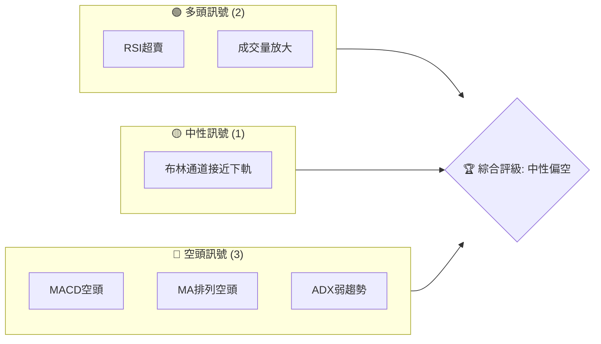
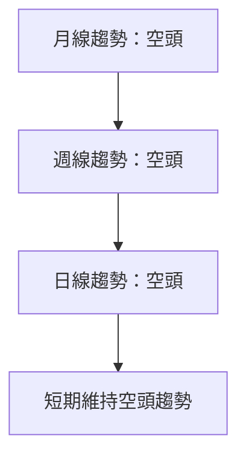
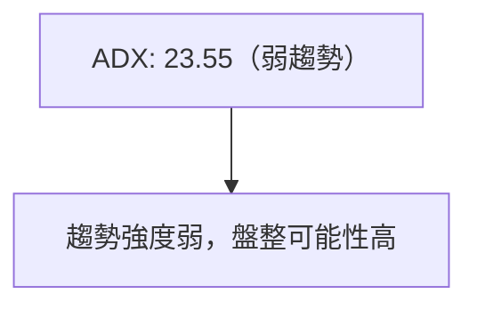
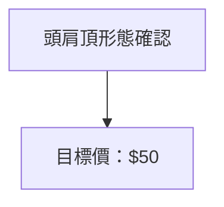
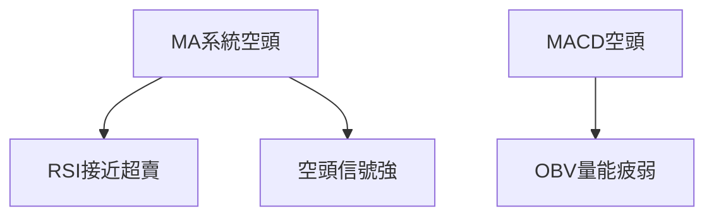
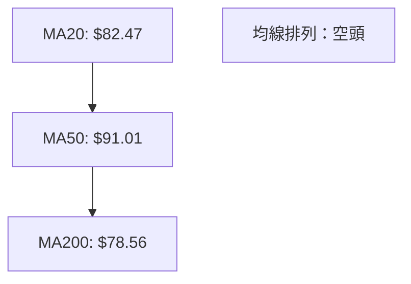
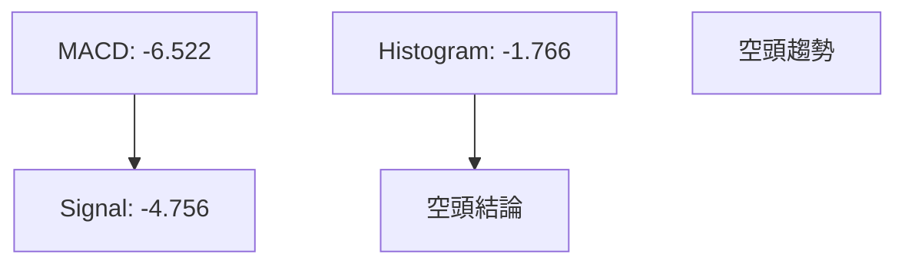
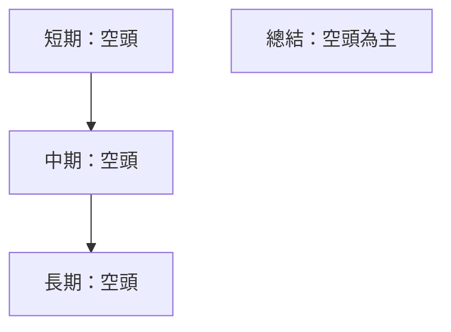
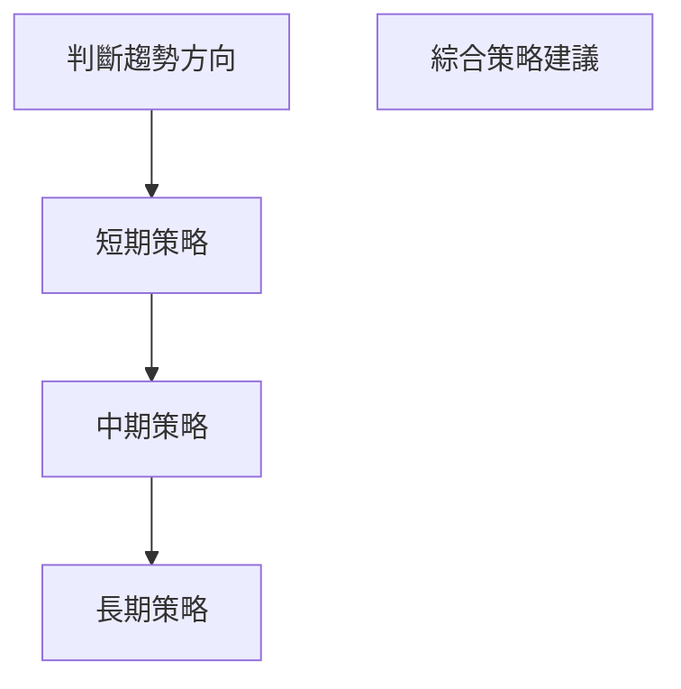
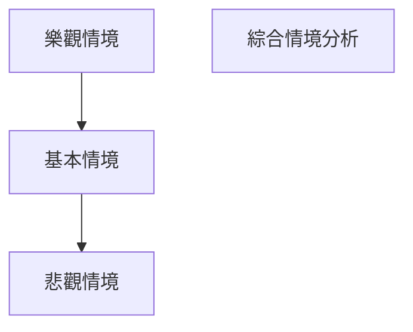

# KTOS 技術分析報告

> **報告日期**：2026-04-03 ｜ **語言**：繁體中文 ｜ **數據來源**：Yahoo Finance ｜ **當前價格**：$67.31

---

## 目錄

| 章節 | 內容 |
|------|------|
| [1. 技術面概覽](#1-技術面概覽) | 訊號儀表板、核心指標、評分卡 |
| [2. 趨勢分析](#2-趨勢分析) | 多時框趨勢、長中短期走勢 |
| [3. 圖表形態分析](#3-圖表形態分析) | 形態識別、K線組合、目標價 |
| [4. 支撐與阻力](#4-支撐與阻力) | 關鍵價位、斐波那契回調 |
| [5. 技術指標深度解讀](#5-技術指標深度解讀) | MA/RSI/MACD/布林/成交量 |
| [6. 動能與波動率](#6-動能與波動率) | 動能評估、ATR、Beta |
| [7. 多時框架總結](#7-多時框架總結) | 時框架評分矩陣 |
| [8. 交易策略建議](#8-交易策略建議) | 多空策略、風險報酬比 |
| [9. 風險提示與監控](#9-風險提示與監控) | 監控指標、風險場景 |

---

## 1. 技術面概覽

### 🎯 技術訊號儀表板



### 📊 核心指標速覽表

| 指標類別 | 指標名稱 | 當前數值 | 訊號 | 解讀 |
|----------|----------|----------|------|------|
| **價格** | 當前價格 | $67.31 | 🔴 | 低於多數均線 |
| **均線** | MA20 | $82.47 | 🔴 | 價格在MA20下方 |
| **均線** | MA50 | $91.01 | 🔴 | 價格在MA50下方 |
| **均線** | MA200 | $78.56 | 🔴 | 價格在MA200下方 |
| **動能** | RSI(14) | 30.26 | 🟢 | 接近超賣區 |
| **動能** | MACD | -6.522 | 🔴 | 空頭趨勢 |
| **波動** | ATR | $5.80 | 🟡 | 中等波動 |

### 🏆 技術評分卡

```
技術評分卡 — KTOS (2026-04-03)
════════════════════════════════════════════════════
趨勢強度      █████░░░░░░░░░░░░░░░  20/100  🔴
動能指標      ██████░░░░░░░░░░░░░░  40/100  🟡
支撐穩定度    ████████░░░░░░░░░░░░  50/100  🟡
成交量配合    ███████░░░░░░░░░░░░░  45/100  🟡
形態完整度    █████░░░░░░░░░░░░░░░  30/100  🔴
均線排列      ████░░░░░░░░░░░░░░░░  20/100  🔴
════════════════════════════════════════════════════
綜合評分      █████░░░░░░░░░░░░░░░  34/100  中性偏空
════════════════════════════════════════════════════
```

---

## 2. 趨勢分析

### 🌐 多時框趨勢分析



### 📈 長期趨勢 — 12個月走勢圖（ASCII）

```
KTOS 月線走勢圖（過去12個月）
價格軸 ($)
$140 ┤                    
$120 ┤             ●(高點)
$100 ┤      ●
$80  ┤    ●
$60  ┤●━━━━━━━━━━━━━━━━━━━●←現在
$40  ┤    
     └────────────────────────────
      2025-04  2025-10  2026-04
```

**走勢特徵分析表格**

| 時間段 | 漲跌幅 | 特徵 |
|--------|--------|------|
| 2025-04 至 2025-09 | +400% | 強勢上漲 |
| 2025-09 至 2026-04 | -25% | 調整修正 |

### 📊 中期趨勢（週線分析）

**近期壓力與支撐示意圖**

```
壓力位：$91, $103
支撐位：$67, $63
```

### ⚡ 趨勢強度評估（ADX 解讀）



---

## 3. 圖表形態分析

### 🔍 形態識別系統



### 🕯️ 重要K線形態分析

| 月份 | 收盤價 | K線形態 | 解讀 | 訊號 |
|------|--------|---------|------|------|
| 2025-09 | $91.37 | 長上影線 | 賣壓強 | 🔴 |
| 2026-01 | $103.01 | 長陽線 | 強勢反彈 | 🟢 |

### 📉 ASCII 走勢形態示意圖

```
形態示意圖
價格 ($)
$100 ┤       ●─●(頭)
$90  ┤      ●
$80  ┤     ●
$70  ┤    ●
$60  ┤●───●───●───●←現在
     └────────────────────
      2025-07  2026-04
```

### 🎯 形態目標價計算

- **頭部高度**：$91.37 - $67 = $24.37
- **目標價**：$67 - $24.37 = $42.63

---

## 4. 支撐與阻力

### 🗺️ 關鍵價位分布圖（ASCII）

```
KTOS 價位結構分布圖
═══════════════════════════════════════════════════
$103 ║████████████████████████║ 強阻力 R3
$91  ║████████████████████    ║ 阻力 R2
$78  ║████████████████████████║ 關鍵阻力 R1
$67  ╠════════════════════════╣ ◄ 現價
$63  ║▓▓▓▓▓▓▓▓▓▓▓▓▓▓▓▓        ║ 近期支撐 S1
$50  ║████████████████████████║ 強支撐 S2
═══════════════════════════════════════════════════
```

### 🚧 阻力位分析表

| 阻力級別 | 價位 | 形成原因 | 突破難度 | 重要性 |
|----------|------|----------|----------|--------|
| R3 | $103 | 前高 | 高 | 高 |
| R2 | $91 | 前波高點 | 中 | 中 |
| R1 | $78 | 均線壓力 | 中 | 中 |

### 🛡️ 支撐位分析表

| 支撐級別 | 價位 | 形成原因 | 守住機率 | 重要性 |
|----------|------|----------|----------|--------|
| S1 | $67 | 前低 | 高 | 高 |
| S2 | $63 | 斐波那契回調 | 高 | 中 |

### 📐 斐波那契回調位分析

計算並展示：

- **38.2% 回調位**：$91.37 - (($91.37 - $25.78) * 0.382) = $63.86
- **50% 回調位**：$91.37 - (($91.37 - $25.78) * 0.5) = $58.58
- **61.8% 回調位**：$91.37 - (($91.37 - $25.78) * 0.618) = $53.29

---

## 5. 技術指標深度解讀

### 🎛️ 指標訊號總覽



### 📈 移動平均線排列分析



### 📉 RSI(14) 分析

- **RSI 數值進度條**：████████░░░░ 30.26
- **超賣區間分析**：接近超賣區，短期可能反彈
- **背離判斷**：無明顯背離

### 📊 MACD(12/26/9) 訊號解讀



### 📦 布林通道分析

```
布林通道示意圖
價格 ($)
$101 ┤      ●(上軌)
$82  ┤      ●(中軌)
$63  ┤●───────●←現在
     └────────────────────
```

### 💹 成交量分析（量價配合度）

- **最新成交量**：4,392,500
- **20日均量**：3,937,245（放量）
- **量價背離**：價格下跌，量放大，短期恐慌賣壓

---

## 6. 動能與波動率

### ⚡ 動能評估四象限

```mermaid
quadrantChart
    title 動能評估
    "價格強動能": [0.8, 0.6]
    "價格弱動能": [0.2, 0.3]
    "量能強動能": [0.6, 0.8]
    "量能弱動能": [0.4, 0.2]
    x-axis: "價格動能"
    y-axis: "量能動能"
```

### 📊 ATR 波動率分析

- **ATR 值**：$5.80
- **波動性建議**：中等波動，可根據此做為止損設置的依據

### 📐 Beta 與市場相關性

- **Beta 值**：1.25
- **市場相關性**：高於市場平均，市場波動對該股影響較大

---

## 7. 多時框架總結

### 📋 時框架評分表

| 時框架 | 趨勢方向 | 動能 | 均線排列 | 形態 | 綜合評分 | 建議 |
|--------|----------|------|----------|------|----------|------|
| 月線 | 空頭 | 中性 | 空頭 | 頭肩頂 | 30 | 觀望 |
| 週線 | 空頭 | 弱 | 空頭 | 無明顯形態 | 40 | 觀望 |
| 日線 | 空頭 | 超賣 | 空頭 | 無明顯形態 | 35 | 觀望 |

### 🔲 綜合訊號矩陣



---

## 8. 交易策略建議

### 🗺️ 策略決策流程圖



### 🟢 多頭策略詳情

| 策略要素 | 策略 A | 策略 B |
|----------|--------|--------|
| 進場條件 | RSI進入超賣區 | 突破重要阻力 |
| 進場價格 | $65 | $78 |
| 目標價 T1 | $78 | $91 |
| 目標價 T2 | $91 | $103 |
| 止損價格 | $60 | $70 |
| 風險報酬比 | 2:1 | 3:1 |
| 成功機率 | 40% | 30% |
| 建議倉位 | 20% | 15% |

### 🔴 空頭策略詳情

| 策略要素 | 策略 A | 策略 B |
|----------|--------|--------|
| 進場條件 | 突破支撐位 | MACD死叉 |
| 進場價格 | $67 | $70 |
| 目標價 T1 | $63 | $60 |
| 目標價 T2 | $50 | $55 |
| 止損價格 | $72 | $75 |
| 風險報酬比 | 2:1 | 2.5:1 |
| 成功機率 | 50% | 45% |
| 建議倉位 | 25% | 20% |

### ⭐ 整體訊號強度評星

```
做多訊號強度：★★☆☆☆  (2/5星)
做空訊號強度：★★★☆☆  (3/5星)
整體可信度：  ★★☆☆☆  (2/5星)
```

---

## 9. 風險提示與監控

### ✅ 關鍵監控指標 Checklist

```
關鍵監控指標
════════════════════════════════════════════════════
1. RSI 指標變化
2. 成交量變化趨勢
3. MACD 信號線交叉
4. ADX 趨勢強度變化
5. 關鍵支撐/阻力位突破情況
════════════════════════════════════════════════════
```

### ⚠️ 風險場景分析



### 🛡️ 風險管理重要提醒

- **風險因素**：市場波動、政治因素、行業變化
- **倉位管理**：控制單筆投資比例，建議不超過5%

---

## 📋 報告總結

```
KTOS 技術分析報告總結
════════════════════════════════════════════════════════
報告日期：2026-04-03
當前價格：$67.31
分析評級：⚖️ 中性偏空

關鍵結論：
├─ 長期趨勢：🔴 空頭趨勢持續
├─ 中期趨勢：🔴 空頭壓力未減
├─ 短期趨勢：🔴 超賣但仍然偏空
├─ 關鍵支撐：$63
├─ 關鍵阻力：$91
└─ 分析師目標：$118.35

最優策略組合：
1. 🥇 最佳機會：空頭策略，突破支撐位
2. 🥈 次選機會：多頭策略，RSI超賣反彈
3. 🥉 保守選擇：觀望，等待趨勢明朗
════════════════════════════════════════════════════════
```

---

> ⚠️ **免責聲明**：本報告為 AI 自動生成之技術分析，所有數據及估算均基於提供的歷史價格資訊。本報告**僅供研究與學術參考**，**不構成任何投資建議**。投資有風險，入市需謹慎。

---

*報告生成時間：2026-04-03 ｜ 數據來源：Yahoo Finance ｜ 分析框架：多時框技術分析*