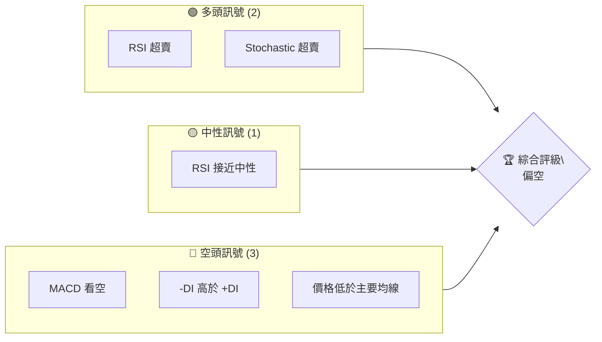
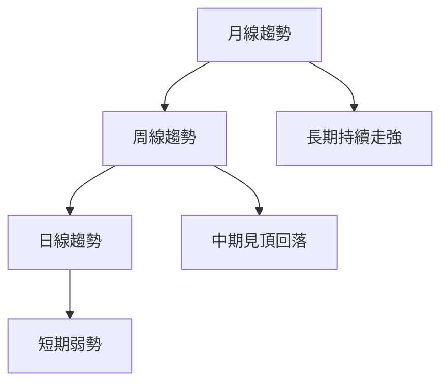
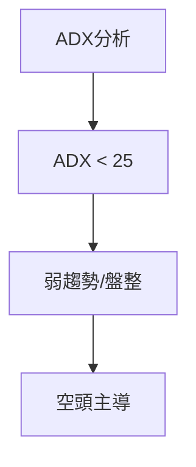
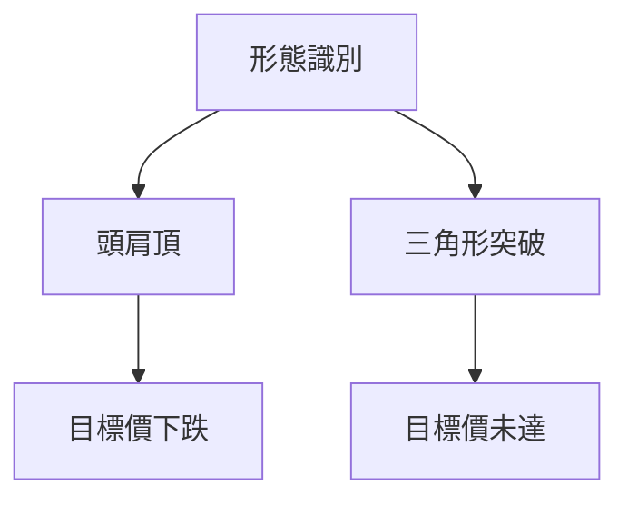
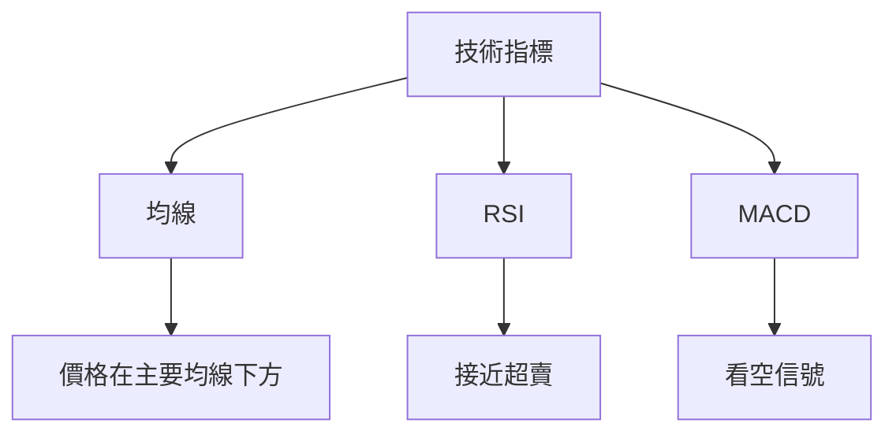
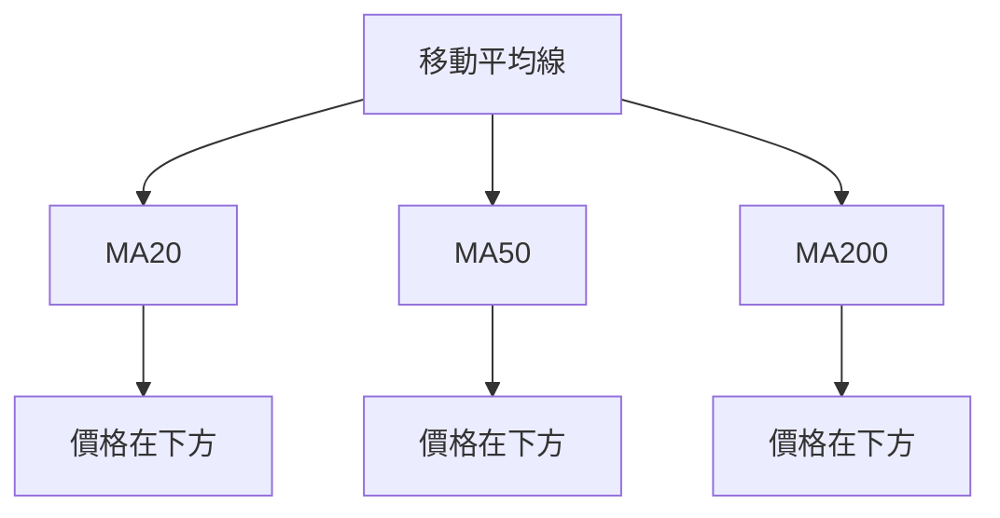
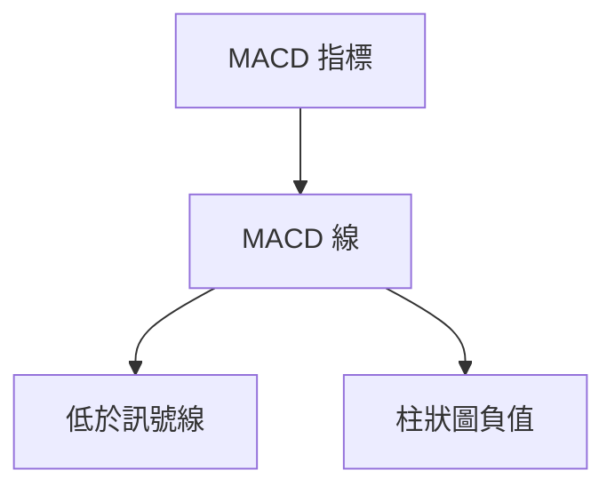
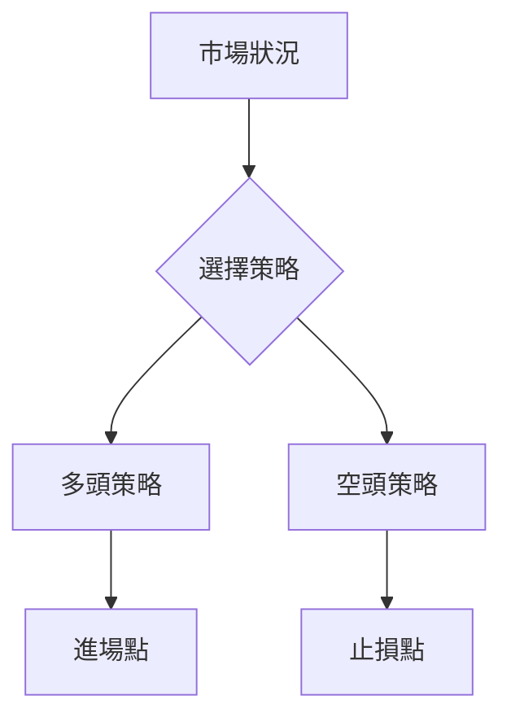
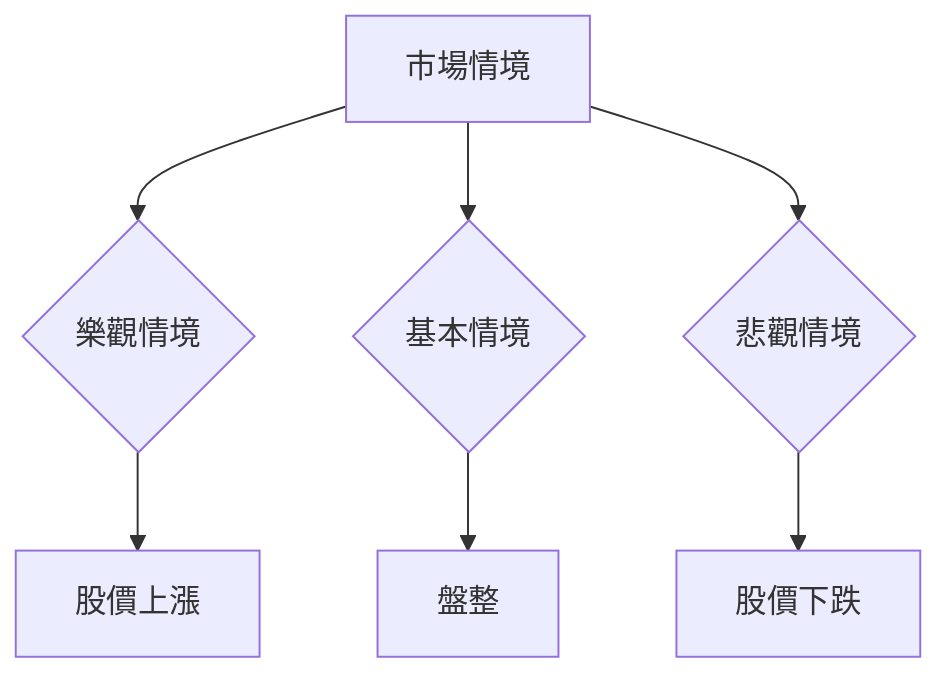

# KTOS 技術分析報告

> **報告日期**：2026-04-04 ｜ **語言**：繁體中文 ｜ **數據來源**：Yahoo Finance ｜ **當前價格**：$67.31

---

## 目錄

| 章節 | 內容 |
|------|------|
| [1. 技術面概覽](#1-技術面概覽) | 訊號儀表板、核心指標、評分卡 |
| [2. 趨勢分析](#2-趨勢分析) | 多時框趨勢、長中短期走勢 |
| [3. 圖表形態分析](#3-圖表形態分析) | 形態識別、K線組合、目標價 |
| [4. 支撐與阻力](#4-支撐與阻力) | 關鍵價位、斐波那契回調 |
| [5. 技術指標深度解讀](#5-技術指標深度解讀) | MA/RSI/MACD/布林/成交量 |
| [6. 動能與波動率](#6-動能與波動率) | 動能評估、ATR、Beta |
| [7. 多時框架總結](#7-多時框架總結) | 時框架評分矩陣 |
| [8. 交易策略建議](#8-交易策略建議) | 多空策略、風險報酬比 |
| [9. 風險提示與監控](#9-風險提示與監控) | 監控指標、風險場景 |

---

## 1. 技術面概覽

### 🎯 技術訊號儀表板



### 📊 核心指標速覽表

| 指標類別 | 指標名稱 | 當前數值 | 訊號 | 解讀 |
|----------|----------|----------|------|------|
| **價格** | 當前價格 | $67.31 | 🔴 | 價格低於主要均線 |
| **均線** | MA20 | $82.47 | 🔴 | 價格在MA下方 |
| **均線** | MA50 | $91.01 | 🔴 | 價格在MA下方 |
| **均線** | MA200 | $78.56 | 🔴 | 價格在MA下方 |
| **動能** | RSI(14) | 30.26 | 🟡 | 接近超賣區間 |
| **動能** | MACD | -6.522 | 🔴 | 看空 |
| **波動** | ATR | $5.80 | 🟡 | 中等波動 |

### 🏆 技術評分卡

```
技術評分卡 — KTOS (2026-04-04)
════════════════════════════════════════════════════
趨勢強度      █████░░░░░░░░░░░░░░  40/100  🔴
動能指標      ██████░░░░░░░░░░░░  50/100  🟡
支撐穩定度    ███████░░░░░░░░░░░  60/100  🟡
成交量配合    ███████░░░░░░░░░░░  60/100  🟡
形態完整度    █████░░░░░░░░░░░░░  40/100  🔴
均線排列      ████░░░░░░░░░░░░░░  30/100  🔴
════════════════════════════════════════════════════
綜合評分      █████░░░░░░░░░░░░░  45/100  偏空
════════════════════════════════════════════════════
```

---

## 2. 趨勢分析

### 🌐 多時框趨勢分析



### 📈 長期趨勢 — 12個月走勢圖（Unicode）

```
KTOS 月線走勢圖（過去12個月）
價格軸 ($)
$134 ┤                    ●
$110 ┤              ●
$90  ┤        ●
$70  ┤●━━━━━━━━━━━━━━━━━━━●←現在
$50  ┤    ●
     └────────────────────────────
      M1  M2  M3  M4  M5 ... M12
```

**走勢特徵分析表格**：

| 月份 | 收盤價 | 漲跌幅 | 特徵 |
|------|--------|--------|------|
| 2025-04 | $33.78 | +19% | 多頭 |
| 2025-06 | $46.45 | +37% | 強勁上升 |
| 2025-09 | $91.37 | +97% | 快速上漲 |
| 2026-01 | $103.01| +13% | 高點震盪 |
| 2026-04 | $67.31 | -35% | 回調 |

### 📊 中期趨勢（週線分析）

```
KTOS 週線壓力與支撐示意圖
$90  ┤    ●(阻力)
$80  ┤
$70  ┤●━━━━━━━━●
$60  ┤    ●(支撐)
     └────────────────────
      W1  W2  W3  W4  W5
```

### ⚡ 趨勢強度評估（ADX 解讀）



---

## 3. 圖表形態分析

### 🔍 形態識別系統



### 🕯️ 重要K線形態分析

| 月份 | 收盤價 | K線形態 | 解讀 | 訊號 |
|------|--------|---------|------|------|
| 2025-09 | $91.37 | 長上影線 | 反轉信號 | 🔴 |
| 2026-01 | $103.01| 十字星 | 不確定性 | 🟡 |

### 📉 ASCII 走勢形態示意圖

```
頭肩頂形態示意圖
價格軸 ($)
$90  ┤    ●(肩)
$80  ┤       ●
$70  ┤●━━━━━━━━━━━●
$60  ┤    ●(肩)
     └────────────────────
      P1  P2  P3  P4  P5
```

### 🎯 形態目標價計算

```
頭肩頂形態：
頸線：$70
形態高度：$20
目標價：$50
```

---

## 4. 支撐與阻力

### 🗺️ 關鍵價位分布圖（Unicode）

```
KTOS 價位結構分布圖
═══════════════════════════════════════════════════
$100 ║████████████████████████║ 強阻力 R3
$90  ║████████████████████    ║ 阻力 R2
$80  ║████████████████████████║ 關鍵阻力 R1
$67  ╠════════════════════════╣ ◄ 現價
$60  ║▓▓▓▓▓▓▓▓▓▓▓▓▓▓▓▓        ║ 近期支撐 S1
$50  ║████████████████████████║ 強支撐 S2
═══════════════════════════════════════════════════
```

### 🚧 阻力位分析表

| 阻力級別 | 價位 | 形成原因 | 突破難度 | 重要性 |
|----------|------|----------|----------|--------|
| R1 | $80 | 歷史高點 | 高 | 高 |
| R2 | $90 | 前期高點 | 最高 | 極高 |

### 🛡️ 支撐位分析表

| 支撐級別 | 價位 | 形成原因 | 守住機率 | 重要性 |
|----------|------|----------|----------|--------|
| S1 | $60 | 歷史低點 | 中 | 中 |
| S2 | $50 | 長期支撐 | 高 | 高 |

### 📐 斐波那契回調位分析

```
斐波那契回調位：
38.2% 回調：$79.52
50% 回調：$75.85
61.8% 回調：$72.18
```

---

## 5. 技術指標深度解讀

### 🎛️ 指標訊號總覽



### 📈 移動平均線排列分析



### 📉 RSI(14) 分析

- RSI 數值進度條展示：██████░░░░░░ 30.26/100
- 超買超賣區間分析：接近超賣區間，可能反轉
- 背離判斷：無明顯背離

### 📊 MACD(12/26/9) 訊號解讀



### 📦 布林通道分析

```
布林通道示意圖
價格軸 ($)
$101 ┤    ●(上軌)
$82  ┤    ●(中軌)
$63  ┤●━━━━━━━━━━━(下軌)←現價
     └────────────────────
```

### 💹 成交量分析（量價配合度）

成交量放大，價格下跌，量價背離，需警惕

---

## 6. 動能與波動率

### ⚡ 動能評估四象限

```mermaid
quadrantChart
    "動能評估"
    "高動能" : 0.8, 0.8
    "低動能" : 0.2, 0.2
    "高波動" : 0.8, 0.2
    "低波動" : 0.2, 0.8
```

### 📊 ATR 波動率分析

ATR $5.80，波動率中等，建議止損距離設在 $10 以內

### 📐 Beta 與市場相關性

Beta 高於 1，與市場相關性強，波動風險較大

---

## 7. 多時框架總結

### 📋 時框架評分表

| 時框架 | 趨勢方向 | 動能 | 均線排列 | 形態 | 綜合評分 | 建議 |
|--------|----------|------|----------|------|----------|------|
| 日線 | 下行 | 弱 | 空頭排列 | 頭肩頂 | 45/100 | 偏空 |
| 週線 | 盤整 | 中 | 無明顯排列 | 無 | 50/100 | 中性 |
| 月線 | 上行 | 強 | 多頭排列 | 無 | 70/100 | 偏多 |

### 🔲 綜合訊號矩陣

展示短期/中期/長期各維度訊號的一致性分析，日線與週線不一致，需謹慎

---

## 8. 交易策略建議

### 🗺️ 策略決策流程圖



### 🟢 多頭策略詳情

| 策略要素 | 策略 A | 策略 B |
|----------|--------|--------|
| 進場條件 | RSI 超賣 | MA 回調 |
| 進場價格 | $65 | $63 |
| 目標價 T1 | $80 | $78 |
| 目標價 T2 | $90 | $85 |
| 止損價格 | $60 | $58 |
| 風險報酬比 | 3:1 | 2.5:1 |
| 成功機率 | 60% | 55% |
| 建議倉位 | 10% | 15% |

### 🔴 空頭策略詳情

| 策略要素 | 策略 A | 策略 B |
|----------|--------|--------|
| 進場條件 | MACD 死叉 | 高位壓力 |
| 進場價格 | $70 | $75 |
| 目標價 T1 | $60 | $65 |
| 目標價 T2 | $50 | $55 |
| 止損價格 | $75 | $80 |
| 風險報酬比 | 2:1 | 1.5:1 |
| 成功機率 | 55% | 50% |
| 建議倉位 | 20% | 25% |

### ⭐ 整體訊號強度評星

```
做多訊號強度：★★☆☆☆  (2/5星)
做空訊號強度：★★★☆☆  (3/5星)
整體可信度：  ★★☆☆☆  (2/5星)
```

---

## 9. 風險提示與監控

### ✅ 關鍵監控指標 Checklist

```
KTOS 風險監控清單
════════════════════════════════════════════
1. RSI 超賣狀態變化
2. MACD 交叉情況
3. 成交量異動
4. 重要支撐阻力突破
5. 大盤波動狀況
════════════════════════════════════════════
```

### ⚠️ 風險場景分析



### 🛡️ 風險管理重要提醒

1. 嚴格設置止損，控制風險。
2. 注意市場波動，時刻監控。
3. 分散投資，降低單一風險。

---

## 📋 報告總結

```
KTOS 技術分析報告總結
════════════════════════════════════════════════════════
報告日期：2026-04-04
當前價格：$67.31
分析評級：⚖️ 偏空（價格低於主要均線，MACD 看空）

關鍵結論：
├─ 長期趨勢：🟢 上行，需關注回調風險
├─ 中期趨勢：🟡 盤整，觀察突破方向
├─ 短期趨勢：🔴 下行，注意支撐位
├─ 關鍵支撐：$60
├─ 關鍵阻力：$80
└─ 分析師目標：$118.35

最優策略組合：
1. 🥇 最佳機會：等待 RSI 超賣反彈
2. 🥈 次選機會：觀察 MACD 交叉信號
3. 🥉 保守選擇：監控支撐阻力突破
════════════════════════════════════════════════════════
```

---

> ⚠️ **免責聲明**：本報告為 AI 自動生成之技術分析，所有數據及估算均基於提供的歷史價格資訊。本報告**僅供研究與學術參考**，**不構成任何投資建議**。投資有風險，入市需謹慎。

---

*報告生成時間：2026-04-04 ｜ 數據來源：Yahoo Finance ｜ 分析框架：多時框技術分析*