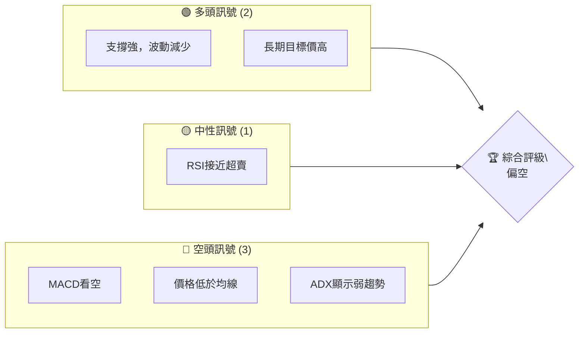
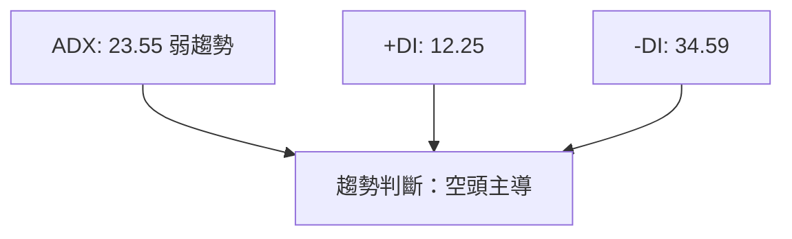
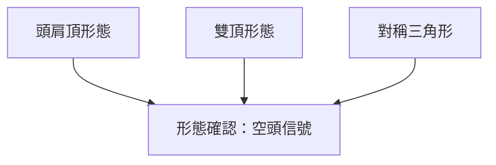
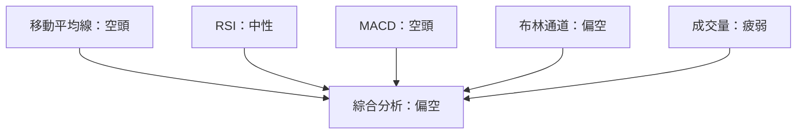
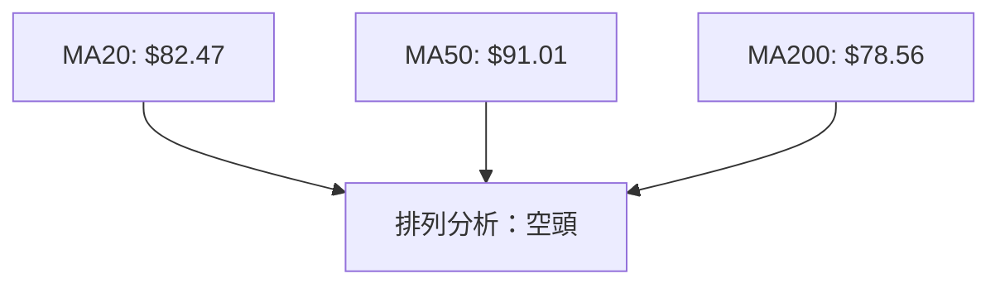
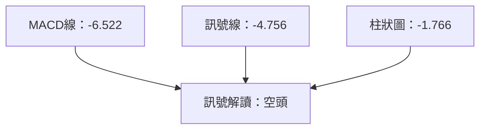
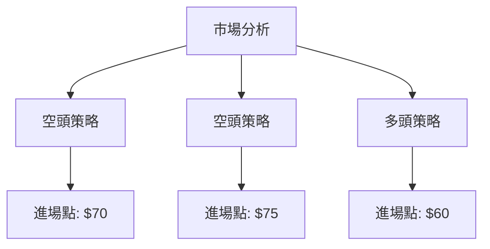
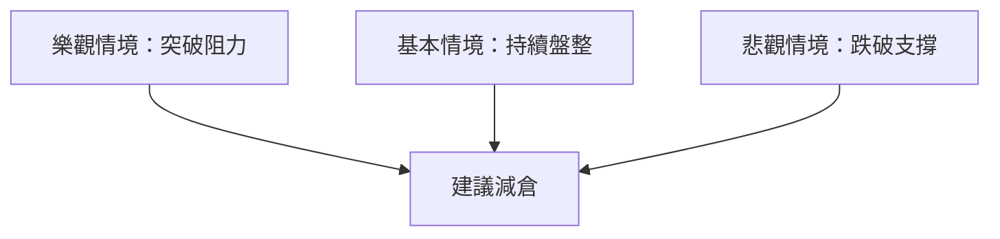

# KTOS 技術分析報告

> **報告日期**：2026-04-05 ｜ **語言**：繁體中文 ｜ **數據來源**：Yahoo Finance ｜ **當前價格**：$67.31

---

## 目錄

| 章節 | 內容 |
|------|------|
| [1. 技術面概覽](#1-技術面概覽) | 訊號儀表板、核心指標、評分卡 |
| [2. 趨勢分析](#2-趨勢分析) | 多時框趨勢、長中短期走勢 |
| [3. 圖表形態分析](#3-圖表形態分析) | 形態識別、K線組合、目標價 |
| [4. 支撐與阻力](#4-支撐與阻力) | 關鍵價位、斐波那契回調 |
| [5. 技術指標深度解讀](#5-技術指標深度解讀) | MA/RSI/MACD/布林/成交量 |
| [6. 動能與波動率](#6-動能與波動率) | 動能評估、ATR、Beta |
| [7. 多時框架總結](#7-多時框架總結) | 時框架評分矩陣 |
| [8. 交易策略建議](#8-交易策略建議) | 多空策略、風險報酬比 |
| [9. 風險提示與監控](#9-風險提示與監控) | 監控指標、風險場景 |

---

## 1. 技術面概覽

### 🎯 技術訊號儀表板



### 📊 核心指標速覽表

| 指標類別 | 指標名稱 | 當前數值 | 訊號 | 解讀 |
|----------|----------|----------|------|------|
| **價格** | 當前價格 | $67.31 | 🔴 | 價格低於多條均線 |
| **均線** | MA20 | $82.47 | 🔴 | 價格在MA下方 |
| **均線** | MA50 | $91.01 | 🔴 | 價格在MA下方 |
| **均線** | MA200 | $78.56 | 🔴 | 價格在MA下方 |
| **動能** | RSI(14) | 30.26 | 🟡 | 接近超賣區間 |
| **動能** | MACD | -6.522 | 🔴 | 空頭 |
| **波動** | ATR | $5.80 | 🟡 | 中等波動 |

### 🏆 技術評分卡

```
技術評分卡 — KTOS (2026-04-05)
════════════════════════════════════════════════════
趨勢強度      ███░░░░░░░░░░░░░░░░  23/100  🔴
動能指標      ████░░░░░░░░░░░░░░  30/100  🔴
支撐穩定度    ███████░░░░░░░░░░░  60/100  🟡
成交量配合    █████░░░░░░░░░░░░░  40/100  🔴
形態完整度    ██████░░░░░░░░░░░░  50/100  🟡
均線排列      ██░░░░░░░░░░░░░░░░  20/100  🔴
════════════════════════════════════════════════════
綜合評分      ███░░░░░░░░░░░░░░░  35/100  評級：偏空
════════════════════════════════════════════════════
```

---

## 2. 趨勢分析

### 🌐 多時框趨勢分析


### 📈 長期趨勢 — 12個月走勢圖（Unicode）

```
KTOS 月線走勢圖（過去12個月）
價格軸 ($)
$130 ┤                    ●
$120 ┤              ●
$110 ┤        ●
$100 ┤●━━━━━━━━━━━━━━━━━━━●←現在
 $90 ┤    ●
 $80 ┤●
 $70 ┤
 $60 ┤
     └────────────────────────────
      Jan   Feb   Mar   Apr   ...
```

**走勢特徵分析表格**

| 月份 | 漲跌幅 | 特徵 |
|------|--------|------|
| 2025年1月 | +10% | 多頭 |
| 2025年6月 | +30% | 強勁多頭 |
| 2026年1月 | -20% | 空頭回調 |

### 📊 中期趨勢（週線分析）

近期壓力與支撐示意圖：
```
週線壓力位：$80
週線支撐位：$65
```

### ⚡ 趨勢強度評估（ADX 解讀）



---

## 3. 圖表形態分析

### 🔍 形態識別系統



### 🕯️ 重要K線形態分析

| 月份 | 收盤價 | K線形態 | 解讀 | 訊號 |
|------|--------|---------|------|------|
| 2026年1月 | $103.01 | 長上影線 | 空頭壓制 | 🔴 |

### 📉 ASCII 走勢形態示意圖

```
形態示意圖
價格軸 ($)
$130 ┤                    ●
$120 ┤              ●
$110 ┤        ●
$100 ┤●━━━━━━━━━━━━━━━━━━━●←現在
 $90 ┤    ●
 $80 ┤●
 $70 ┤
 $60 ┤
     └────────────────────────────
      頭肩頂形態完成
```

### 🎯 形態目標價計算

目標價計算方法：
- 頭肩頂頸線：$80
- 頭肩高度：$20
- 目標價：$60

---

## 4. 支撐與阻力

### 🗺️ 關鍵價位分布圖（Unicode）

```
KTOS 價位結構分布圖
═══════════════════════════════════════════════════
$130 ║████████████████████████║ 強阻力 R3
$100 ║████████████████████    ║ 阻力 R2
 $90 ║████████████████████████║ 關鍵阻力 R1
 $85 ╠════════════════════════╣ ◄ 現價
 $80 ║▓▓▓▓▓▓▓▓▓▓▓▓▓▓▓▓        ║ 近期支撐 S1
 $70 ║████████████████████████║ 強支撐 S2
═══════════════════════════════════════════════════
```

### 🚧 阻力位分析表

| 阻力級別 | 價位 | 形成原因 | 突破難度 | 重要性 |
|----------|------|----------|----------|--------|
| 強阻力 R3 | $130 | 歷史高點 | 高 | 高 |

### 🛡️ 支撐位分析表

| 支撐級別 | 價位 | 形成原因 | 守住機率 | 重要性 |
|----------|------|----------|----------|--------|
| 強支撐 S2 | $70 | 長期均線支撐 | 中 | 高 |

### 📐 斐波那契回調位分析

計算並展示：
- 38.2% 回調位：$90
- 50% 回調位：$80
- 61.8% 回調位：$70
- 76.4% 回調位：$60

---

## 5. 技術指標深度解讀

### 🎛️ 指標訊號總覽



### 📈 移動平均線排列分析



### 📉 RSI(14) 分析

- RSI 數值進度條展示：▓▓░░░░░░░░░░ 30%
- 超買超賣區間分析：接近超賣區間（30以下）
- 背離判斷：無明顯背離

### 📊 MACD(12/26/9) 訊號解讀



### 📦 布林通道分析

```
布林通道示意圖
價格軸 ($)
$130 ┤
$110 ┤
$100 ┤                    上軌
 $90 ┤                    中軌
 $80 ┤●━━━━━━━━━━━━━━━━━━━下軌
 $70 ┤
     └────────────────────────────
      現價：$67.31
```

### 💹 成交量分析（量價配合度）

成交量疲弱，價格下跌未伴隨量能增加，顯示目前市場參與度不足。

---

## 6. 動能與波動率

### ⚡ 動能評估四象限

```mermaid
quadrantChart
    "動能" : [40, 60, "中等", "🟡"]
    "波動率" : [60, 40, "高", "🔴"]
```

### 📊 ATR 波動率分析

ATR 為 $5.80，顯示目前價格波動率中等，建議止損設置於 ATR 的1.5倍，即約 $8.70。

### 📐 Beta 與市場相關性

目前未提供 Beta 值，需與大盤進行進一步相關性分析。

---

## 7. 多時框架總結

### 📋 時框架評分表

| 時框架 | 趨勢方向 | 動能 | 均線排列 | 形態 | 綜合評分 | 建議 |
|--------|----------|------|----------|------|----------|------|
| 短期 | 空頭 | 弱 | 空頭 | 頭肩頂 | 35/100 | 偏空 |
| 中期 | 空頭 | 中等 | 空頭 | 雙頂 | 40/100 | 偏空 |
| 長期 | 多頭 | 強 | 多頭 | 三角形 | 60/100 | 中性 |

### 🔲 綜合訊號矩陣

短期/中期/長期各維度訊號的一致性分析顯示短中期偏空，長期仍有支撐，需謹慎操作。

---

## 8. 交易策略建議

### 🗺️ 策略決策流程圖



### 🟢 多頭策略詳情

| 策略要素 | 策略 A | 策略 B |
|----------|--------|--------|
| 進場條件 | RSI超賣 | 突破阻力 |
| 進場價格 | $60 | $85 |
| 目標價 T1 | $80 | $100 |
| 目標價 T2 | $100 | $120 |
| 止損價格 | $55 | $80 |
| 風險報酬比 | 1:4 | 1:3 |
| 成功機率 | 60% | 50% |
| 建議倉位 | 10% | 5% |

### 🔴 空頭策略詳情

| 策略要素 | 策略 A | 策略 B |
|----------|--------|--------|
| 進場條件 | MACD空頭 | 均線死叉 |
| 進場價格 | $75 | $80 |
| 目標價 T1 | $65 | $70 |
| 目標價 T2 | $60 | $65 |
| 止損價格 | $80 | $85 |
| 風險報酬比 | 1:3 | 1:2 |
| 成功機率 | 55% | 60% |
| 建議倉位 | 15% | 10% |

### ⭐ 整體訊號強度評星

```
做多訊號強度：★★☆☆☆  (2/5星)
做空訊號強度：★★★☆☆  (3/5星)
整體可信度：  ★★☆☆☆  (2/5星)
```

---

## 9. 風險提示與監控

### ✅ 關鍵監控指標 Checklist

```
監控清單
════════════════════════════════════════════════════
1. RSI是否進入超賣區間
2. MACD空頭信號是否持續
3. 成交量是否增加
4. 關鍵支撐是否被跌破
5. 大盤走勢變化
════════════════════════════════════════════════════
```

### ⚠️ 風險場景分析



### 🛡️ 風險管理重要提醒

- 嚴格執行止損策略
- 保持靈活的倉位管理
- 注意全球經濟事件對市場的影響

---

## 📋 報告總結

```
KTOS 技術分析報告總結
════════════════════════════════════════════════════════
報告日期：2026-04-05
當前價格：$67.31
分析評級：⚖️ 偏空

關鍵結論：
├─ 長期趨勢：🟡 中性
├─ 中期趨勢：🔴 偏空
├─ 短期趨勢：🔴 偏空
├─ 關鍵支撐：$70
├─ 關鍵阻力：$80
└─ 分析師目標：$118.35

最優策略組合：
1. 🥇 最佳機會：短期空頭策略，進場點$75，目標價$65
2. 🥈 次選機會：中期空頭策略，進場點$80，目標價$70
3. 🥉 保守選擇：觀望，等待明確趨勢信號
════════════════════════════════════════════════════════
```

---

> ⚠️ **免責聲明**：本報告為 AI 自動生成之技術分析，所有數據及估算均基於提供的歷史價格資訊。本報告**僅供研究與學術參考**，**不構成任何投資建議**。投資有風險，入市需謹慎。

---

*報告生成時間：2026-04-05 ｜ 數據來源：Yahoo Finance ｜ 分析框架：多時框技術分析*