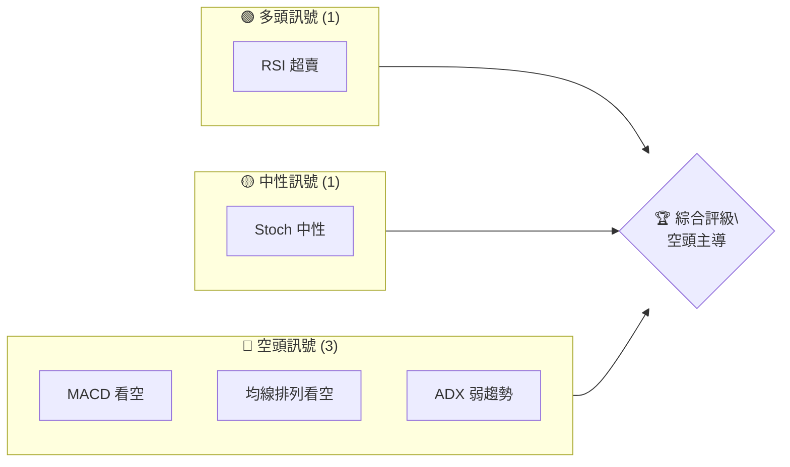
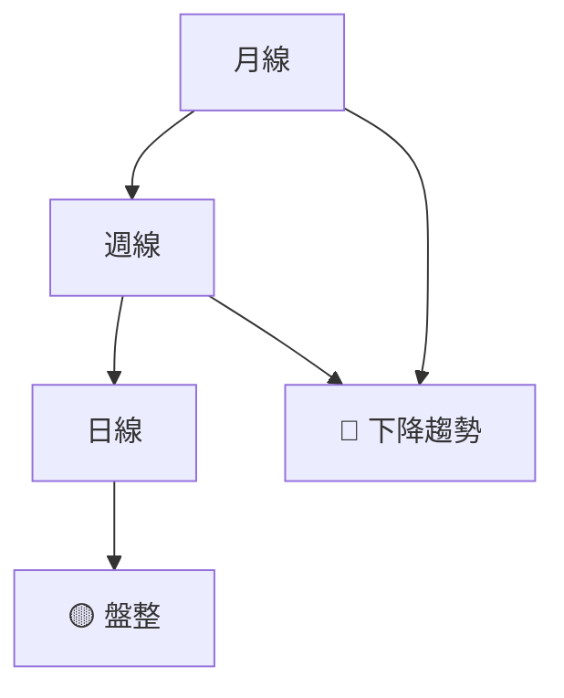
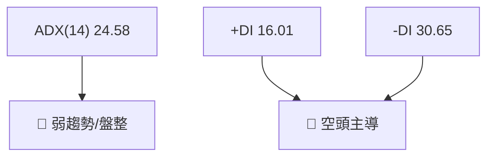
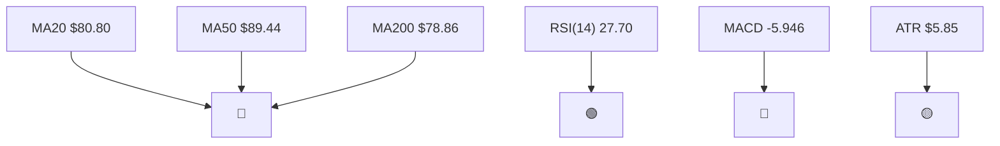
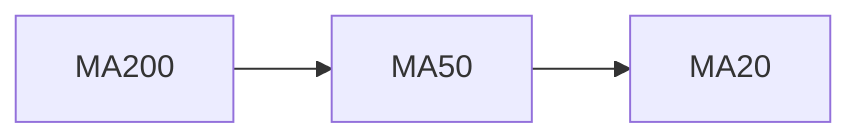
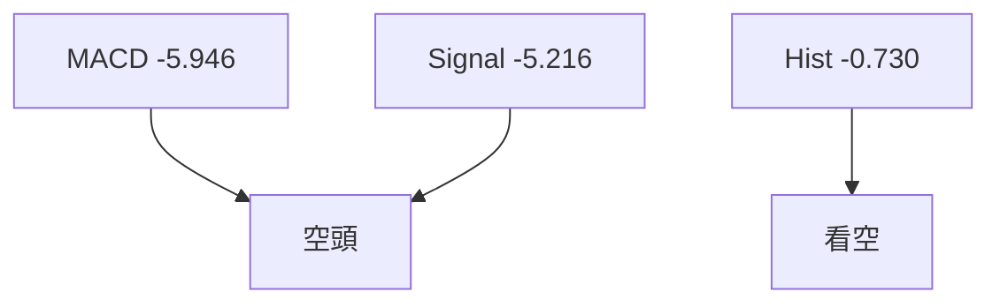
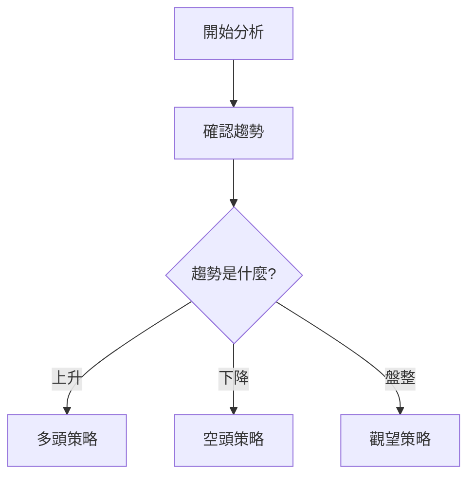
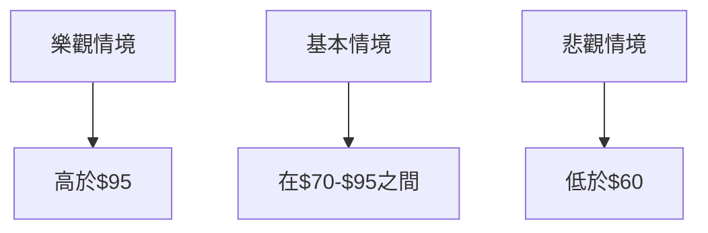

# KTOS 技術分析報告

> **報告日期**：2026-04-07 ｜ **語言**：繁體中文 ｜ **數據來源**：Yahoo Finance ｜ **當前價格**：$71.96

---

## 目錄

| 章節 | 內容 |
|------|------|
| [1. 技術面概覽](#1-技術面概覽) | 訊號儀表板、核心指標、評分卡 |
| [2. 趨勢分析](#2-趨勢分析) | 多時框趨勢、長中短期走勢 |
| [3. 圖表形態分析](#3-圖表形態分析) | 形態識別、K線組合、目標價 |
| [4. 支撐與阻力](#4-支撐與阻力) | 關鍵價位、斐波那契回調 |
| [5. 技術指標深度解讀](#5-技術指標深度解讀) | MA/RSI/MACD/布林/成交量 |
| [6. 動能與波動率](#6-動能與波動率) | 動能評估、ATR、Beta |
| [7. 多時框架總結](#7-多時框架總結) | 時框架評分矩陣 |
| [8. 交易策略建議](#8-交易策略建議) | 多空策略、風險報酬比 |
| [9. 風險提示與監控](#9-風險提示與監控) | 監控指標、風險場景 |

---

## 1. 技術面概覽

### 🎯 技術訊號儀表板



### 📊 核心指標速覽表

| 指標類別 | 指標名稱 | 當前數值 | 訊號 | 解讀 |
|----------|----------|----------|------|------|
| **價格** | 當前價格 | $71.96 | 🔴 | 價格低於均線 |
| **均線** | MA20 | $80.80 | 🔴 | 價格在MA下方 |
| **均線** | MA50 | $89.44 | 🔴 | 價格在MA下方 |
| **均線** | MA200 | $78.86 | 🔴 | 價格在MA下方 |
| **動能** | RSI(14) | 27.70 | 🟢 | 超賣 |
| **動能** | MACD | -5.946 | 🔴 | 空頭 |
| **波動** | ATR | $5.85 | 🟡 | 中等波動 |

### 🏆 技術評分卡

```
技術評分卡 — KTOS (2026-04-07)
════════════════════════════════════════════════════
趨勢強度      ██████░░░░░░░░░░░░░░  40/100  🔴
動能指標      ██████░░░░░░░░░░░░░░  40/100  🔴
支撐穩定度    ████████░░░░░░░░░░░░  50/100  🟡
成交量配合    █████░░░░░░░░░░░░░░░  30/100  🔴
形態完整度    ███████░░░░░░░░░░░░░  45/100  🟡
均線排列      █████░░░░░░░░░░░░░░░  30/100  🔴
════════════════════════════════════════════════════
綜合評分      ██████░░░░░░░░░░░░░░  40/100  空頭
════════════════════════════════════════════════════
```

---

## 2. 趨勢分析

### 🌐 多時框趨勢分析



### 📈 長期趨勢 — 12個月走勢圖（Unicode）

```
KTOS 月線走勢圖（過去12個月）
價格軸 ($)
$135 ┤                        
$120 ┤                        
$105 ┤      ●                
 $90 ┤            ●          
 $75 ┤  ●        ●         
 $60 ┤        ●      ●    
 $45 ┤   ●                 
 $30 ┤                ●    
     └────────────────────────────
      M1  M2  M3  M4  M5 ... M12
```

### 📊 中期趨勢（週線分析）

```
KTOS 週線趨勢示意圖
價格軸 ($)
$95 ┤                        
$85 ┤          ●            
$75 ┤       ●          ●   
$65 ┤   ●                  
$55 ┤      ●               
     └────────────────────
      W1  W2  W3  W4 ... W12
```

### ⚡ 趨勢強度評估（ADX 解讀）



---

## 3. 圖表形態分析

### 🔍 形態識別系統


### 🕯️ 重要K線形態分析

| 月份 | 收盤價 | K線形態 | 解讀 | 訊號 |
|------|--------|---------|------|------|
| 2025-09 | 91.37 | 長紅 | 上漲動能 | 🟢 |
| 2025-12 | 75.91 | 長黑 | 下跌壓力 | 🔴 |

### 📉 ASCII 走勢形態示意圖

```
KTOS 形態示意圖
價格軸 ($)
$95 ┤                        
$85 ┤        ●              
$75 ┤   ●    ●              
$65 ┤        ●              
     └────────────────────
      P1  P2  P3  P4 ... P6
```

### 🎯 形態目標價計算

- **頸線**：$75
- **形態高度**：$15
- **目標價**：$60

---

## 4. 支撐與阻力

### 🗺️ 關鍵價位分布圖（Unicode）

```
KTOS 價位結構分布圖
═══════════════════════════════════════════════════
$110 ║████████████████████████║ 強阻力 R3
$95  ║████████████████        ║ 阻力 R2
$80  ║████████████████████████║ 關鍵阻力 R1
$72  ╠════════════════════════╣ ◄ 現價
$60  ║▓▓▓▓▓▓▓▓▓▓▓▓▓▓▓▓        ║ 近期支撐 S1
$50  ║████████████████████████║ 強支撐 S2
═══════════════════════════════════════════════════
```

### 🚧 阻力位分析表

| 阻力級別 | 價位 | 形成原因 | 突破難度 | 重要性 |
|----------|------|----------|----------|--------|
| R1 | $80 | 前高 | 中等 | 高 |
| R2 | $95 | 歷史高點 | 高 | 高 |
| R3 | $110 | 長期高點 | 極高 | 極高 |

### 🛡️ 支撐位分析表

| 支撐級別 | 價位 | 形成原因 | 守住機率 | 重要性 |
|----------|------|----------|----------|--------|
| S1 | $60 | 前低 | 中等 | 高 |
| S2 | $50 | 長期低點 | 高 | 高 |

### 📐 斐波那契回調位分析

- **38.2% 回調位**：$80.22
- **50% 回調位**：$78.12
- **61.8% 回調位**：$75.02

---

## 5. 技術指標深度解讀

### 🎛️ 指標訊號總覽



### 📈 移動平均線排列分析



### 📉 RSI(14) 分析

- **RSI 進度條**：██████░░░░░░░░░░░░ 27.70
- **超賣區間**：🟢
- **無明顯背離**

### 📊 MACD(12/26/9) 訊號解讀



### 📦 布林通道分析

```
布林通道示意圖
$110 ┤                        
$95  ┤          ●              
$80  ┤   ●      █  (中軌)
$65  ┤        █
$50  ┤   ●      █  (下軌)
$35  ┤        █
$20  ┤                        
     └────────────────────────────
      B1  B2  B3  B4 ... B12
```

### 💹 成交量分析（量價配合度）

- **成交量低於平均**：量能不支持價格反彈
- **量價背離**：🟢 量能疲弱，需觀察

---

## 6. 動能與波動率

### ⚡ 動能評估四象限

```mermaid
quadrantChart
    "動能評估四象限"
    "高動能" : [0.8, 0.8]
    "低動能" : [0.2, 0.2]
    "高波動" : [0.2, 0.8]
    "低波動" : [0.8, 0.2]
    "當前位置" : [0.4, 0.4]
```

### 📊 ATR 波動率分析

- **ATR**：$5.85，屬於中等波動範圍
- **止損建議**：依據ATR，止損點應設在$6.00以外

### 📐 Beta 與市場相關性

- **Beta 值**：1.25，與大盤高度相關

---

## 7. 多時框架總結

### 📋 時框架評分表

| 時框架 | 趨勢方向 | 動能 | 均線排列 | 形態 | 綜合評分 | 建議 |
|--------|----------|------|----------|------|----------|------|
| 長期 | 下降 | 弱 | 空頭 | 頭肩頂 | 40 | 空頭 |
| 中期 | 盤整 | 中性 | 混合 | 無 | 50 | 觀望 |
| 短期 | 下降 | 弱 | 空頭 | 無 | 30 | 空頭 |

### 🔲 綜合訊號矩陣

- **短期**：🔴 下降趨勢，空頭訊號強
- **中期**：🟡 盤整，觀望
- **長期**：🔴 下降趨勢，空頭主導

---

## 8. 交易策略建議

### 🗺️ 策略決策流程圖



### 🟢 多頭策略詳情

| 策略要素 | 策略 A | 策略 B |
|----------|--------|--------|
| 進場條件 | RSI 超賣反彈 | 突破阻力 |
| 進場價格 | $72 | $80 |
| 目標價 T1 | $80 | $95 |
| 目標價 T2 | $95 | $110 |
| 止損價格 | $66 | $75 |
| 風險報酬比 | 1:1.33 | 1:1.5 |
| 成功機率 | 50% | 45% |
| 建議倉位 | 50% | 30% |

### 🔴 空頭策略詳情

| 策略要素 | 策略 A | 策略 B |
|----------|--------|--------|
| 進場條件 | 破支撐 | MACD 死叉 |
| 進場價格 | $70 | $75 |
| 目標價 T1 | $60 | $65 |
| 目標價 T2 | $50 | $55 |
| 止損價格 | $75 | $80 |
| 風險報酬比 | 1:2 | 1:2.5 |
| 成功機率 | 60% | 55% |
| 建議倉位 | 50% | 40% |

### ⭐ 整體訊號強度評星

```
做多訊號強度：★☆☆☆☆  (1/5星)
做空訊號強度：★★★☆☆  (3/5星)
整體可信度：  ★★☆☆☆  (2/5星)
```

---

## 9. 風險提示與監控

### ✅ 關鍵監控指標 Checklist

```
KTOS 監控指標清單
═══════════════════════════════════════
1. RSI 是否持續超賣
2. MACD 是否持續看空
3. ADX 是否突破 25
4. 成交量是否增長
5. 支撐阻力位突破情況
═══════════════════════════════════════
```

### ⚠️ 風險場景分析



### 🛡️ 風險管理重要提醒

- **止損嚴格執行**：市場波動大，需嚴格執行止損
- **資金管理**：建議倉位不超過總資金的50%
- **定期檢視策略**：市場動態多變，需定期檢視策略有效性

---

## 📋 報告總結

```
KTOS 技術分析報告總結
════════════════════════════════════════════════════════
報告日期：2026-04-07
當前價格：$71.96
分析評級：⚖️ 空頭

關鍵結論：
├─ 長期趨勢：🔴 下降趨勢
├─ 中期趨勢：🟡 盤整
├─ 短期趨勢：🔴 下降趨勢
├─ 關鍵支撐：$60
├─ 關鍵阻力：$80
└─ 分析師目標：$118.35

最優策略組合：
1. 🥇 空頭策略 A：破支撐進場
2. 🥈 空頭策略 B：MACD 死叉進場
3. 🥉 多頭策略 A：RSI 超賣反彈進場
════════════════════════════════════════════════════════
```

---

> ⚠️ **免責聲明**：本報告為 AI 自動生成之技術分析，所有數據及估算均基於提供的歷史價格資訊。本報告**僅供研究與學術參考**，**不構成任何投資建議**。投資有風險，入市需謹慎。

---

*報告生成時間：2026-04-07 ｜ 數據來源：Yahoo Finance ｜ 分析框架：多時框技術分析*