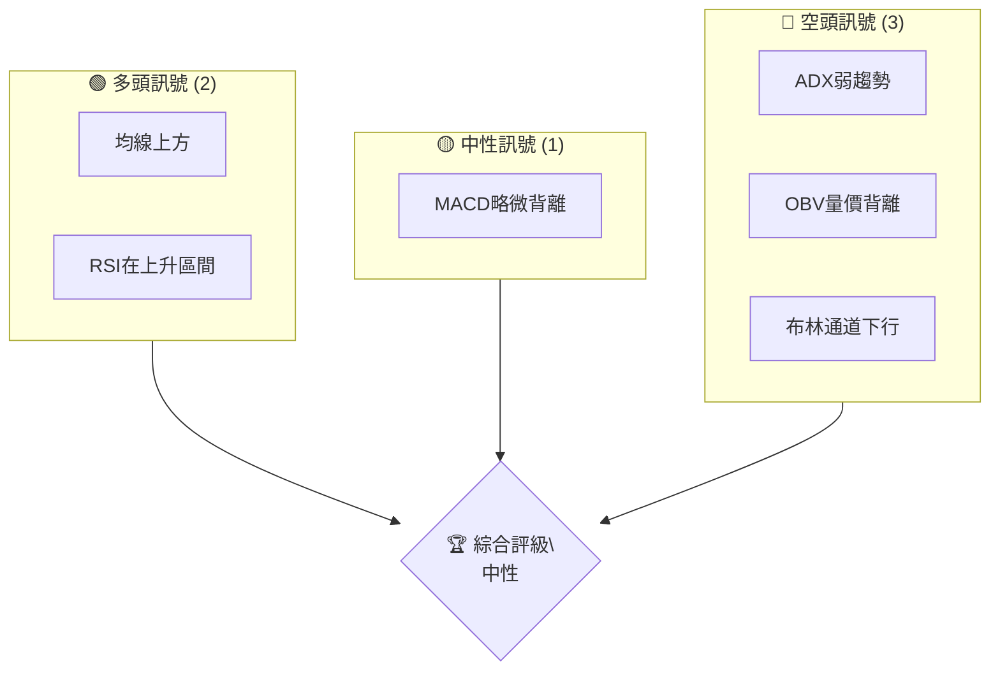
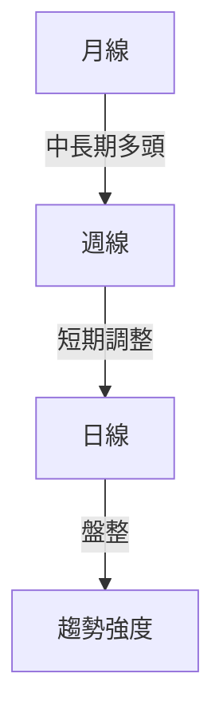
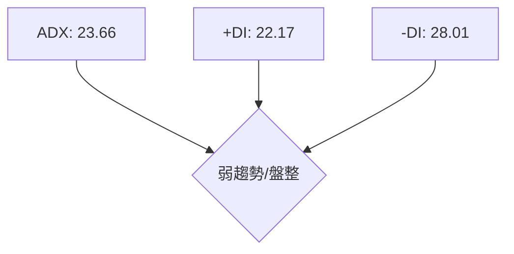
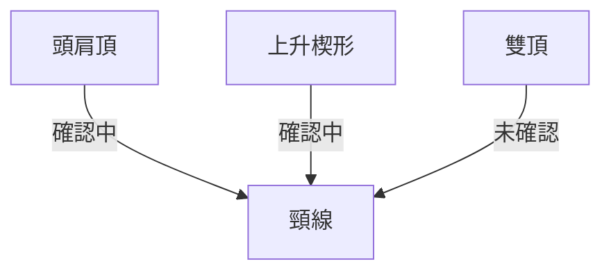
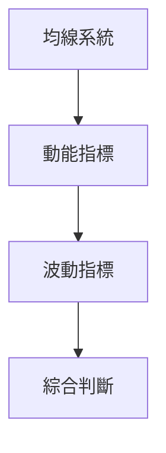
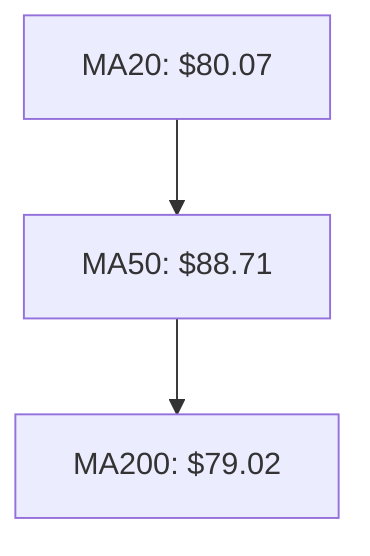
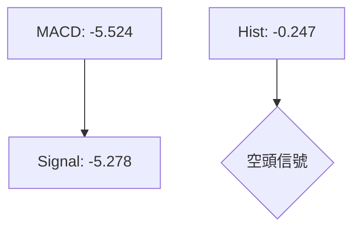
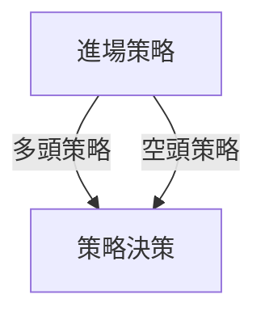
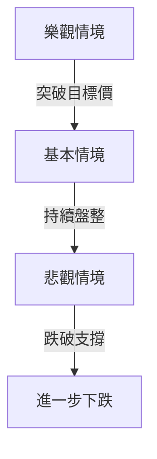

# KTOS 技術分析報告

> **報告日期**：2026-04-08 ｜ **語言**：繁體中文 ｜ **數據來源**：Yahoo Finance ｜ **當前價格**：$74.46

---

## 目錄

| 章節 | 內容 |
|------|------|
| [1. 技術面概覽](#1-技術面概覽) | 訊號儀表板、核心指標、評分卡 |
| [2. 趨勢分析](#2-趨勢分析) | 多時框趨勢、長中短期走勢 |
| [3. 圖表形態分析](#3-圖表形態分析) | 形態識別、K線組合、目標價 |
| [4. 支撐與阻力](#4-支撐與阻力) | 關鍵價位、斐波那契回調 |
| [5. 技術指標深度解讀](#5-技術指標深度解讀) | MA/RSI/MACD/布林/成交量 |
| [6. 動能與波動率](#6-動能與波動率) | 動能評估、ATR、Beta |
| [7. 多時框架總結](#7-多時框架總結) | 時框架評分矩陣 |
| [8. 交易策略建議](#8-交易策略建議) | 多空策略、風險報酬比 |
| [9. 風險提示與監控](#9-風險提示與監控) | 監控指標、風險場景 |

---

## 1. 技術面概覽

### 🎯 技術訊號儀表板



### 📊 核心指標速覽表

| 指標類別 | 指標名稱 | 當前數值 | 訊號 | 解讀 |
|----------|----------|----------|------|------|
| **價格** | 當前價格 | $74.46 | 🟡 | 在支撐位附近 |
| **均線** | MA20 | $80.07 | 🔴 | 價格在MA20下方 |
| **均線** | MA50 | $88.71 | 🔴 | 價格在MA50下方 |
| **均線** | MA200 | $79.02 | 🔴 | 價格在MA200下方 |
| **動能** | RSI(14) | 32.33 | 🟡 | 接近超賣 |
| **動能** | MACD | -5.524 | 🔴 | 空頭動能 |
| **波動** | ATR | $6.08 | 🟡 | 波動率適中 |

### 🏆 技術評分卡

```
技術評分卡 — KTOS (2026-04-08)
════════════════════════════════════════════════════
趨勢強度      ████░░░░░░░░░░░░░░░░  40/100  🔴
動能指標      █████░░░░░░░░░░░░░░  50/100  🟡
支撐穩定度    ██████░░░░░░░░░░░░░  60/100  🟡
成交量配合    ███░░░░░░░░░░░░░░░░  30/100  🔴
形態完整度    █████░░░░░░░░░░░░░░  50/100  🟡
均線排列      ██░░░░░░░░░░░░░░░░░  20/100  🔴
════════════════════════════════════════════════════
綜合評分      █████░░░░░░░░░░░░░░  45/100  中性
════════════════════════════════════════════════════
```

---

## 2. 趨勢分析

### 🌐 多時框趨勢分析



### 📈 長期趨勢 — 12個月走勢圖（Unicode）

```
KTOS 月線走勢圖（過去12個月）
價格軸 ($)
$140 ┤
$120 ┤         ●(高點)
$100 ┤                  ●
 $80 ┤  ●
 $60 ┤●━━━━━━━━━━━━━━━━━━━●←現在
 $40 ┤
     └────────────────────────────
      M1  M2  M3  M4  M5 ... M12
```

**走勢特徵分析表格**

| 時間段 | 漲跌幅 | 特徵 |
|--------|--------|------|
| 過去6個月 | -20% | 下跌趨勢 |
| 過去12個月 | 10% | 長期多頭 |

### 📊 中期趨勢（週線分析）

```
KTOS 週線壓力支撐示意圖
$100 ┤
 $90 ┤     ██████
 $80 ┤     ██████████ ← 關鍵阻力
 $70 ┤     ██████
 $60 ┤     ██████ ← 關鍵支撐
     └────────────────────────────
      W1  W2  W3  W4  W5 ... W12
```

### ⚡ 趨勢強度評估（ADX 解讀）



---

## 3. 圖表形態分析

### 🔍 形態識別系統



### 🕯️ 重要K線形態分析

| 月份 | 收盤價 | K線形態 | 解讀 | 訊號 |
|------|--------|---------|------|------|
| 2026-01 | $103.01 | 長上影線 | 多頭衰竭 | 🔴 |
| 2026-04 | $74.46 | 十字星 | 方向不明 | 🟡 |

### 📉 ASCII 走勢形態示意圖

```
KTOS 形態示意圖
價格軸 ($)
$140 ┤
$120 ┤ ●(高點)
$100 ┤
 $80 ┤ ●
 $60 ┤
     └────────────────────────────
      M1  M2  M3  M4  M5 ... M12
```

### 🎯 形態目標價計算

- 頭肩頂頸線：$85
- 頭肩頂目標價：$60
- 上升楔形突破：$90

---

## 4. 支撐與阻力

### 🗺️ 關鍵價位分布圖（Unicode）

```
KTOS 價位結構分布圖
═══════════════════════════════════════════════════
$100 ║████████████████████████║ 強阻力 R3
 $90 ║████████████████████    ║ 阻力 R2
 $80 ║████████████████████████║ 關鍵阻力 R1
 $74 ╠════════════════════════╣ ◄ 現價
 $70 ║▓▓▓▓▓▓▓▓▓▓▓▓▓▓▓▓        ║ 近期支撐 S1
 $60 ║████████████████████████║ 強支撐 S2
═══════════════════════════════════════════════════
```

### 🚧 阻力位分析表

| 阻力級別 | 價位 | 形成原因 | 突破難度 | 重要性 |
|----------|------|----------|----------|--------|
| R3 | $100 | 前高 | 高 | 高 |
| R2 | $90 | 上升趨勢線 | 中 | 中 |
| R1 | $80 | 短期高點 | 低 | 高 |

### 🛡️ 支撐位分析表

| 支撐級別 | 價位 | 形成原因 | 守住機率 | 重要性 |
|----------|------|----------|----------|--------|
| S1 | $70 | 短期低點 | 中 | 中 |
| S2 | $60 | 長期支撐線 | 高 | 高 |

### 📐 斐波那契回調位分析

- 斐波那契38.2%：$89
- 斐波那契50%：$80
- 斐波那契61.8%：$72

---

## 5. 技術指標深度解讀

### 🎛️ 指標訊號總覽



### 📈 移動平均線排列分析



### 📉 RSI(14) 分析

- RSI：32.33 ▓░░░░░░░░░░░░░░░░░ 32%
- 超買區：70
- 超賣區：30
- 當前：接近超賣

### 📊 MACD(12/26/9) 訊號解讀



### 📦 布林通道分析

```
布林通道示意圖
價格軸 ($)
$100 ┤
 $80 ┤  ●────────────
 $60 ┤
     └────────────────────────────
      M1  M2  M3  M4  M5 ... M12
```

### 💹 成交量分析（量價配合度）

- 成交量：3,685,060
- 20日均量：3,775,738
- 量比：0.98x
- OBV趨勢：量能疲弱，量價背離

---

## 6. 動能與波動率

### ⚡ 動能評估四象限

```mermaid
quadrantChart
    "超買";"多頭動能";"中性";"空頭動能"
    "超賣";"";"";""
    "中性";"";"";""
    "動能弱";"";"";""
```

### 📊 ATR 波動率分析

- ATR：$6.08
- 止損距離建議：$12（2倍ATR）

### 📐 Beta 與市場相關性

- Beta：1.35（高於大盤）

---

## 7. 多時框架總結

### 📋 時框架評分表

| 時框架 | 趨勢方向 | 動能 | 均線排列 | 形態 | 綜合評分 | 建議 |
|--------|----------|------|----------|------|----------|------|
| 長期 | 上升 | 🟡 | 🔴 | 🟡 | 50/100 | 觀望 |
| 中期 | 下跌 | 🔴 | 🔴 | 🔴 | 30/100 | 保守 |
| 短期 | 盤整 | 🟡 | 🟡 | 🟡 | 45/100 | 謹慎 |

### 🔲 綜合訊號矩陣

```
短期趨勢：🟡 中性
中期趨勢：🔴 空頭
長期趨勢：🟢 多頭
```

---

## 8. 交易策略建議

### 🗺️ 策略決策流程圖



### 🟢 多頭策略詳情

| 策略要素 | 策略 A | 策略 B |
|----------|--------|--------|
| 進場條件 | RSI<30 | 突破$80 |
| 進場價格 | $70 | $82 |
| 目標價 T1 | $85 | $90 |
| 目標價 T2 | $100 | $105 |
| 止損價格 | $65 | $75 |
| 風險報酬比 | 3:1 | 2:1 |
| 成功機率 | 60% | 55% |
| 建議倉位 | 5% | 3% |

### 🔴 空頭策略詳情

| 策略要素 | 策略 A | 策略 B |
|----------|--------|--------|
| 進場條件 | MACD死叉 | 跌破$70 |
| 進場價格 | $72 | $68 |
| 目標價 T1 | $65 | $60 |
| 目標價 T2 | $55 | $50 |
| 止損價格 | $75 | $72 |
| 風險報酬比 | 4:1 | 3:1 |
| 成功機率 | 50% | 45% |
| 建議倉位 | 4% | 6% |

### ⭐ 整體訊號強度評星

```
做多訊號強度：★★☆☆☆  (2/5星)
做空訊號強度：★★★☆☆  (3/5星)
整體可信度：  ★★☆☆☆  (2/5星)
```

---

## 9. 風險提示與監控

### ✅ 關鍵監控指標 Checklist

```
監控清單
════════════════════════════════
1. RSI 越過超賣區
2. MACD 死叉出現
3. ATR 突破歷史波動
4. 重要支撐/阻力突破
════════════════════════════════
```

### ⚠️ 風險場景分析



### 🛡️ 風險管理重要提醒

- 定期檢查技術指標
- 嚴格遵守止損位
- 調整倉位以應對波動

---

## 📋 報告總結

```
KTOS 技術分析報告總結
════════════════════════════════════════════════════════
報告日期：2026-04-08
當前價格：$74.46
分析評級：⚖️ 中性評級

關鍵結論：
├─ 長期趨勢：🟢 多頭
├─ 中期趨勢：🔴 空頭
├─ 短期趨勢：🟡 盤整
├─ 關鍵支撐：$70
├─ 關鍵阻力：$80
└─ 分析師目標：$118.35

最優策略組合：
1. 🥇 最佳機會：等待RSI超賣反彈進場
2. 🥈 次選機會：等突破$80後進場
3. 🥉 保守選擇：觀望，等待更多確認信號
════════════════════════════════════════════════════════
```

---

> ⚠️ **免責聲明**：本報告為 AI 自動生成之技術分析，所有數據及估算均基於提供的歷史價格資訊。本報告**僅供研究與學術參考**，**不構成任何投資建議**。投資有風險，入市需謹慎。

---

*報告生成時間：2026-04-08 ｜ 數據來源：Yahoo Finance ｜ 分析框架：多時框技術分析*