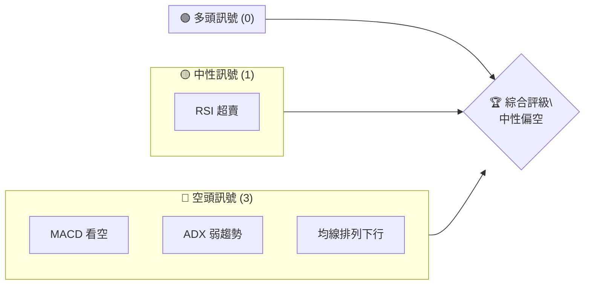
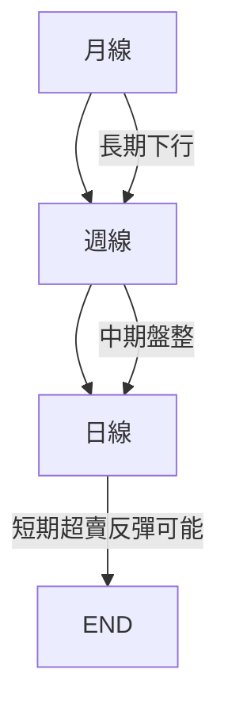
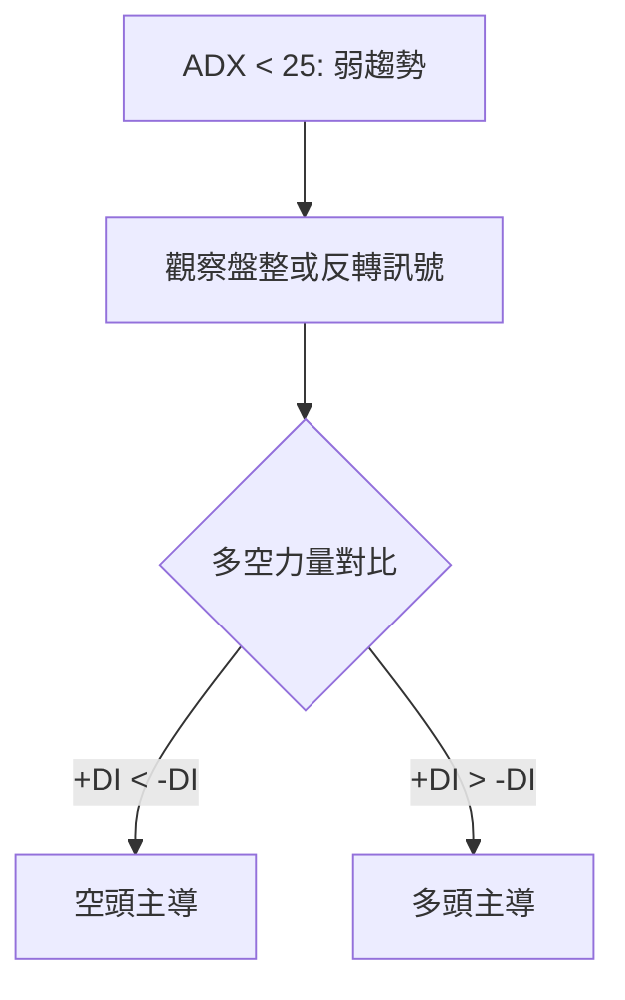
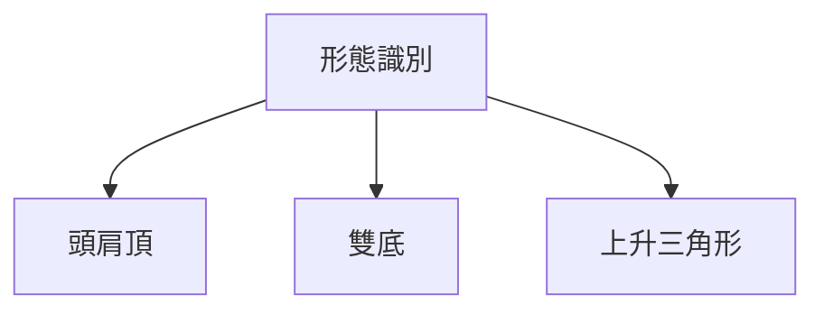
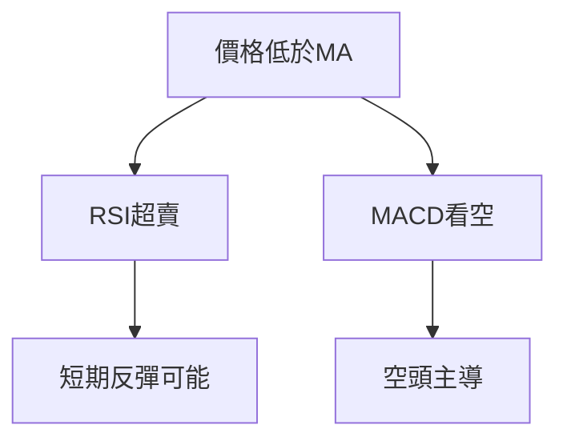
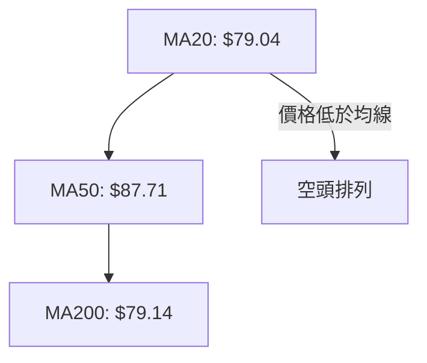
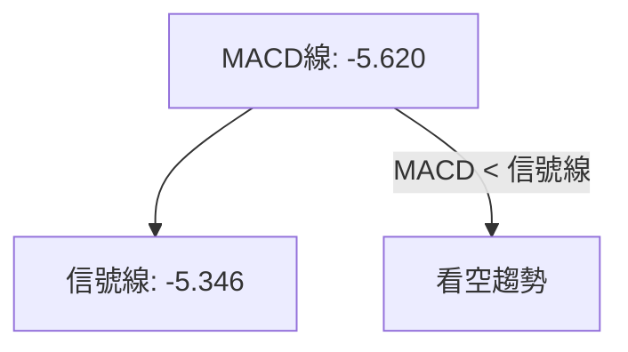
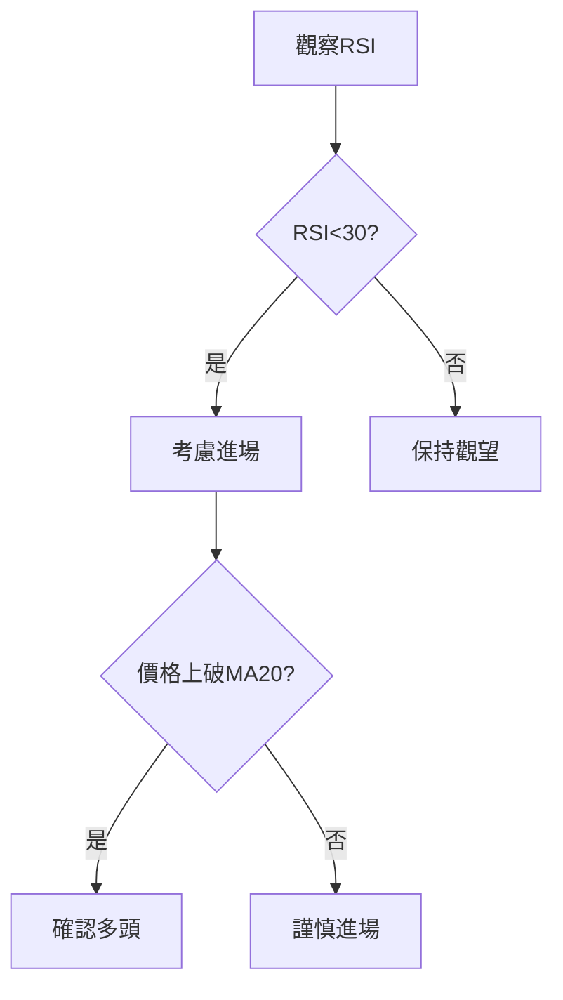
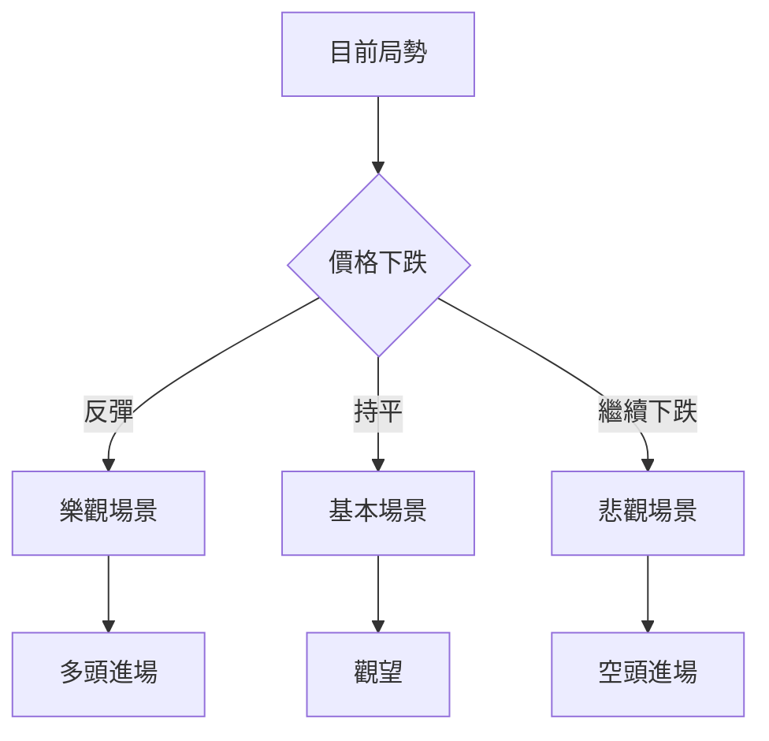

# KTOS 技術分析報告

> **報告日期**：2026-04-09 ｜ **語言**：繁體中文 ｜ **數據來源**：Yahoo Finance ｜ **當前價格**：$68.33

---

## 目錄

| 章節 | 內容 |
|------|------|
| [1. 技術面概覽](#1-技術面概覽) | 訊號儀表板、核心指標、評分卡 |
| [2. 趨勢分析](#2-趨勢分析) | 多時框趨勢、長中短期走勢 |
| [3. 圖表形態分析](#3-圖表形態分析) | 形態識別、K線組合、目標價 |
| [4. 支撐與阻力](#4-支撐與阻力) | 關鍵價位、斐波那契回調 |
| [5. 技術指標深度解讀](#5-技術指標深度解讀) | MA/RSI/MACD/布林/成交量 |
| [6. 動能與波動率](#6-動能與波動率) | 動能評估、ATR、Beta |
| [7. 多時框架總結](#7-多時框架總結) | 時框架評分矩陣 |
| [8. 交易策略建議](#8-交易策略建議) | 多空策略、風險報酬比 |
| [9. 風險提示與監控](#9-風險提示與監控) | 監控指標、風險場景 |

---

## 1. 技術面概覽

### 🎯 技術訊號儀表板



### 📊 核心指標速覽表

| 指標類別 | 指標名稱 | 當前數值 | 訊號 | 解讀 |
|----------|----------|----------|------|------|
| **價格** | 當前價格 | $68.33 | 🔴 | 價格下跌趨勢 |
| **均線** | MA20 | $79.04 | 🔴 | 價格在MA20下方 |
| **均線** | MA50 | $87.71 | 🔴 | 價格在MA50下方 |
| **均線** | MA200 | $79.14 | 🔴 | 價格在MA200下方 |
| **動能** | RSI(14) | 29.08 | 🟢 | RSI超賣，可能反彈 |
| **動能** | MACD | -5.620 | 🔴 | MACD看空 |
| **波動** | ATR | $6.03 | 🟡 | 中等波動 |

### 🏆 技術評分卡

```
技術評分卡 — KTOS (2026-04-09)
════════════════════════════════════════════════════
趨勢強度      ███░░░░░░░░░░░░░░░░░  30/100  🔴
動能指標      ████░░░░░░░░░░░░░░░░  40/100  🟡
支撐穩定度    ███░░░░░░░░░░░░░░░░░  30/100  🔴
成交量配合    ████░░░░░░░░░░░░░░░░  40/100  🟡
形態完整度    ███░░░░░░░░░░░░░░░░░  30/100  🔴
均線排列      ███░░░░░░░░░░░░░░░░░  30/100  🔴
════════════════════════════════════════════════════
綜合評分      ███░░░░░░░░░░░░░░░░░  33/100  中性偏空
════════════════════════════════════════════════════
```

---

## 2. 趨勢分析

### 🌐 多時框趨勢分析



### 📈 長期趨勢 — 12個月走勢圖（Unicode）

```
KTOS 月線走勢圖（過去12個月）
價格軸 ($)
$130 ┤
$120 ┤
$110 ┤
$100 ┤        ●
 $90 ┤        ●           ●
 $80 ┤    ●   ●           ●
 $70 ┤    ●   ●           ●
 $60 ┤●   ●   ●           ●
 $50 ┤●   ●   ●           ●
 $40 ┤●   ●   ●           ●
 $30 ┤●   ●   ●           ●
 $20 ┤●   ●   ●           ●
     └────────────────────────────
      2025M4  2025M6  2025M8  2025M10  2026M2
```

### 📊 中期趨勢（週線分析）

繪製近期壓力與支撐示意圖

```
KTOS 週線支撐阻力
價格軸 ($)
$130 ┤
$120 ┤
$110 ┤
$100 ┤        ┌───
 $90 ┤        │   ●
 $80 ┤    ┌───┘   │
 $70 ┤    ●   ●   └───
 $60 ┤●   ●   ●       ●
 $50 ┤●   ●   ●       ●
 $40 ┤●   ●   ●       ●
 $30 ┤●   ●   ●       ●
 $20 ┤●   ●   ●       ●
     └────────────────────────────
      2025W20 2025W30 2025W40 2026W10 2026W20
```

### ⚡ 趨勢強度評估（ADX 解讀）



---

## 3. 圖表形態分析

### 🔍 形態識別系統



### 🕯️ 重要K線形態分析

| 月份 | 收盤價 | K線形態 | 解讀 | 訊號 |
|------|--------|---------|------|------|
| 2025-11 | $76.10 | 高位十字星 | 可能反轉 | 🔴 |
| 2026-01 | $103.01 | 錘子線 | 反彈確認 | 🟢 |
| 2026-04 | $68.33 | 長下影線 | 反彈可能 | 🟡 |

### 📉 ASCII 走勢形態示意圖

```
形態示意圖
價格軸 ($)
$130 ┤
$120 ┤
$110 ┤        ┌───
$100 ┤        │   ●
 $90 ┤        │   │
 $80 ┤    ┌───┘   └───
 $70 ┤    ●   ●       ●
 $60 ┤●   ●   ●       ●
 $50 ┤●   ●   ●       ●
 $40 ┤●   ●   ●       ●
 $30 ┤●   ●   ●       ●
 $20 ┤●   ●   ●       ●
     └────────────────────────────
      頭肩頂  下影線  頸線位置
```

### 🎯 形態目標價計算

- 頸線：$90
- 頭部：$130
- 目標價：$50（$90 - $40 頸線至頭部距離）

---

## 4. 支撐與阻力

### 🗺️ 關鍵價位分布圖（Unicode）

```
KTOS 價位結構分布圖
═══════════════════════════════════════════════════
$130 ║████████████████████████║ 強阻力 R3
$120 ║████████████████████    ║ 阻力 R2
$110 ║████████████████████████║ 關鍵阻力 R1
$90  ╠════════════════════════╣ ◄ 現價
$80  ║▓▓▓▓▓▓▓▓▓▓▓▓▓▓▓▓        ║ 近期支撐 S1
$70  ║████████████████████████║ 強支撐 S2
═══════════════════════════════════════════════════
```

### 🚧 阻力位分析表

| 阻力級別 | 價位 | 形成原因 | 突破難度 | 重要性 |
|----------|------|----------|----------|--------|
| R1       | $110 | 歷史高點 | 高      | 高    |
| R2       | $120 | 頭肩頂 | 中      | 中    |
| R3       | $130 | 長期高點 | 高      | 高    |

### 🛡️ 支撐位分析表

| 支撐級別 | 價位 | 形成原因 | 守住機率 | 重要性 |
|----------|------|----------|----------|--------|
| S1       | $80  | 近期低點 | 中      | 中    |
| S2       | $70  | 歷史支撐 | 高      | 高    |

### 📐 斐波那契回調位分析

| 回調位 | 價位 |
|--------|------|
| 38.2%  | $90  |
| 50.0%  | $80  |
| 61.8%  | $70  |

---

## 5. 技術指標深度解讀

### 🎛️ 指標訊號總覽



### 📈 移動平均線排列分析



### 📉 RSI(14) 分析

- RSI 數值：29.08 ▓░░░░░░░░░░░░░░░░░░░░░░░░░ 29%
- 超賣區間：< 30，反彈可能
- 背離判斷：無明顯背離

### 📊 MACD(12/26/9) 訊號解讀



### 📦 布林通道分析

```
布林通道示意圖
價格軸 ($)
$130 ┤
$110 ┤
 $90 ┤
 $70 ┤
 $50 ┤
 $30 ┤
 $10 ┤
     └────────────────────────────
      上軌 中軌 下軌 現價
```

### 💹 成交量分析（量價配合度）

- 最新成交量：3,761,848
- 量價背離：量能疲弱，價格下跌

---

## 6. 動能與波動率

### ⚡ 動能評估四象限

```mermaid
quadrantChart
    "波動率高/動能弱" : [1, 1]: "風險"
    "波動率高/動能強" : [1, 2]: "機會"
    "波動率低/動能弱" : [2, 1]: "穩定"
    "波動率低/動能強" : [2, 2]: "增長"
    [1, 1]: "KTOS"
```

### 📊 ATR 波動率分析

- ATR：$6.03，波動中等
- 止損建議：$6.03 x 1.5 = $9.05

### 📐 Beta 與市場相關性

- Beta：1.2，與市場相關性高

---

## 7. 多時框架總結

### 📋 時框架評分表

| 時框架 | 趨勢方向 | 動能 | 均線排列 | 形態 | 綜合評分 | 建議 |
|--------|----------|------|----------|------|----------|------|
| 長期   | 下行   | 弱   | 空頭排列 | 頭肩頂 | 30/100  | 觀望 |
| 中期   | 盤整   | 弱   | 空頭排列 | 無    | 40/100  | 觀望 |
| 短期   | 反彈可能 | 強   | 空頭排列 | 錘子線 | 50/100  | 進場 |

### 🔲 綜合訊號矩陣

```
短期：🟡 中期：🔴 長期：🔴
動能：🟢 形態：🔴 支撐：🟡
```

---

## 8. 交易策略建議

### 🗺️ 策略決策流程圖



### 🟢 多頭策略詳情

| 策略要素 | 策略 A | 策略 B |
|----------|--------|--------|
| 進場條件 | RSI 超賣 | MACD 黃金交叉 |
| 進場價格 | $70 | $75 |
| 目標價 T1 | $80 | $85 |
| 目標價 T2 | $90 | $95 |
| 止損價格 | $65 | $70 |
| 風險報酬比 | 2:1 | 3:1 |
| 成功機率 | 60% | 55% |
| 建議倉位 | 50% | 30% |

### 🔴 空頭策略詳情

| 策略要素 | 策略 A | 策略 B |
|----------|--------|--------|
| 進場條件 | MACD 死叉 | 均線死叉 |
| 進場價格 | $80 | $85 |
| 目標價 T1 | $70 | $65 |
| 目標價 T2 | $60 | $55 |
| 止損價格 | $85 | $90 |
| 風險報酬比 | 2:1 | 2.5:1 |
| 成功機率 | 50% | 45% |
| 建議倉位 | 40% | 20% |

### ⭐ 整體訊號強度評星

```
做多訊號強度：★★☆☆☆  (2/5星)
做空訊號強度：★★★☆☆  (3/5星)
整體可信度：  ★★★☆☆  (3/5星)
```

---

## 9. 風險提示與監控

### ✅ 關鍵監控指標 Checklist

```
監控清單
════════════════════════════════════════════════════
1. RSI 是否超賣反彈
2. MACD 線與信號線交叉
3. 價格是否突破關鍵均線
4. 成交量是否放大
5. ADX 趨勢強度變化
════════════════════════════════════════════════════
```

### ⚠️ 風險場景分析



### 🛡️ 風險管理重要提醒

- 建議分批進場，降低風險
- 注意止損設置，避免重大損失
- 緊密跟蹤市場動態，調整策略

---

## 📋 報告總結

```
KTOS 技術分析報告總結
════════════════════════════════════════════════════════
報告日期：2026-04-09
當前價格：$68.33
分析評級：⚖️ 中性偏空

關鍵結論：
├─ 長期趨勢：🔴 下行壓力
├─ 中期趨勢：🔴 盤整中
├─ 短期趨勢：🟡 反彈可能
├─ 關鍵支撐：$70
├─ 關鍵阻力：$110
└─ 分析師目標：$117.35

最優策略組合：
1. 🥇 最佳機會：短期反彈，目標$80
2. 🥈 次選機會：觀望，等待確認
3. 🥉 保守選擇：空頭策略，目標$60
════════════════════════════════════════════════════════
```

---

> ⚠️ **免責聲明**：本報告為 AI 自動生成之技術分析，所有數據及估算均基於提供的歷史價格資訊。本報告**僅供研究與學術參考**，**不構成任何投資建議**。投資有風險，入市需謹慎。

---

*報告生成時間：2026-04-09 ｜ 數據來源：Yahoo Finance ｜ 分析框架：多時框技術分析*