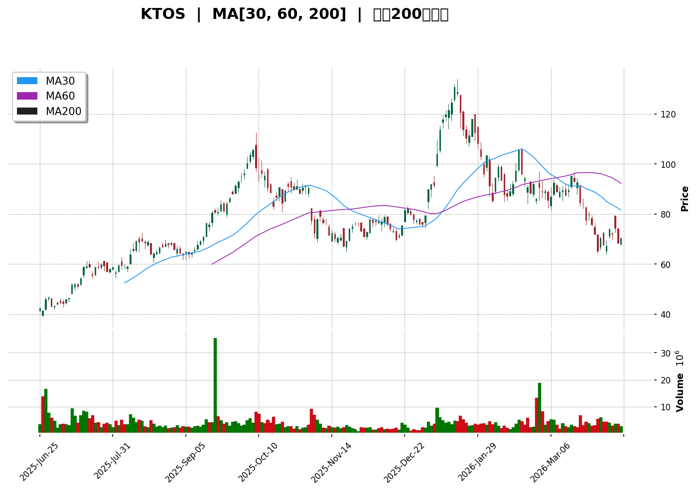
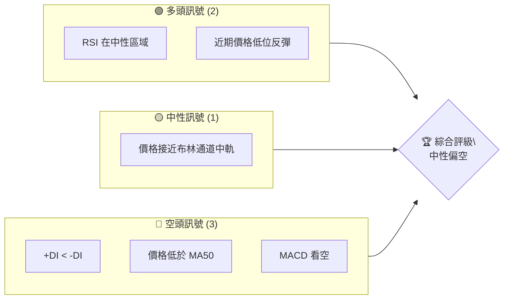
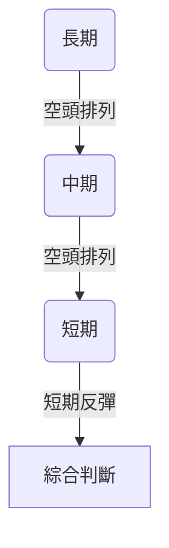
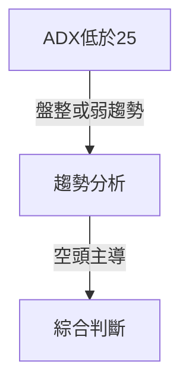
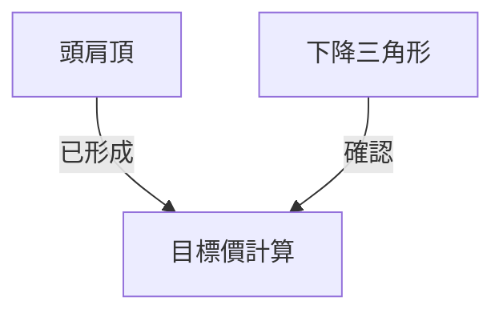
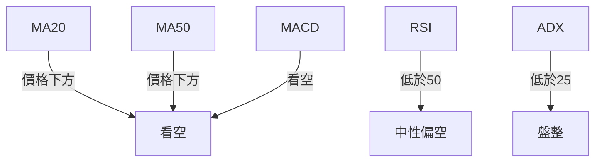
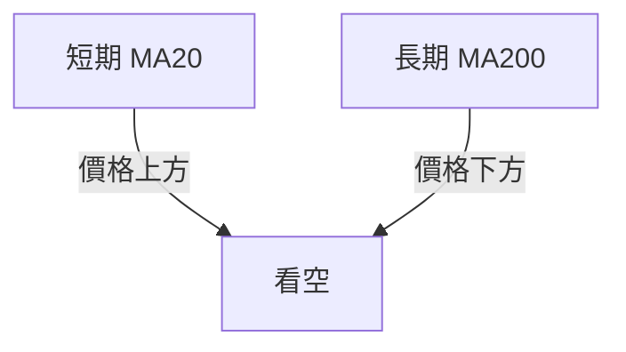
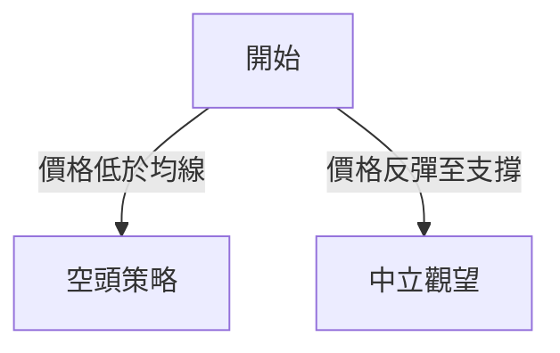
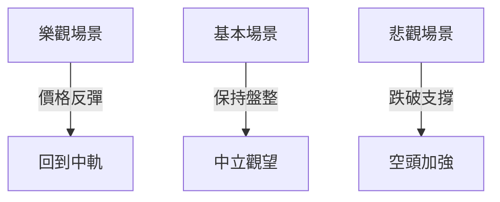

# KTOS 技術分析報告

> **報告日期**：2026-04-10 ｜ **語言**：繁體中文 ｜ **數據來源**：Yahoo Finance ｜ **當前價格**：$70.34

---

## 目錄

| 章節 | 內容 |
|------|------|
| [1. 技術面概覽](#1-技術面概覽) | 訊號儀表板、核心指標、評分卡 |
| [2. 趨勢分析](#2-趨勢分析) | 多時框趨勢、長中短期走勢 |
| [3. 圖表形態分析](#3-圖表形態分析) | 形態識別、K線組合、目標價 |
| [4. 支撐與阻力](#4-支撐與阻力) | 關鍵價位、斐波那契回調 |
| [5. 技術指標深度解讀](#5-技術指標深度解讀) | MA/RSI/MACD/布林/成交量 |
| [6. 動能與波動率](#6-動能與波動率) | 動能評估、ATR、Beta |
| [7. 多時框架總結](#7-多時框架總結) | 時框架評分矩陣 |
| [8. 交易策略建議](#8-交易策略建議) | 多空策略、風險報酬比 |
| [9. 風險提示與監控](#9-風險提示與監控) | 監控指標、風險場景 |

---

## 1. 技術面概覽

### 🎯 技術訊號儀表板



### 📊 核心指標速覽表

| 指標類別 | 指標名稱 | 當前數值 | 訊號 | 解讀 |
|----------|----------|----------|------|------|
| **價格** | 當前價格 | $70.34 | 🔴 | 價格低於多數均線 |
| **均線** | MA20 | $78.09 | 🔴 | 價格在MA下方 |
| **均線** | MA50 | $86.86 | 🔴 | 價格在MA下方 |
| **均線** | MA200 | $79.29 | 🔴 | 價格在MA下方 |
| **動能** | RSI(14) | 36.35 | 🟡 | 中性偏低，接近超賣 |
| **動能** | MACD | -5.471 | 🔴 | 看空 |
| **波動** | ATR | $5.56 | 🟡 | 中等波動 |

### 🏆 技術評分卡

```
技術評分卡 — KTOS (2026-04-10)
════════════════════════════════════════════════════
趨勢強度      ██████░░░░░░░░░░░░░░  40/100  🔴
動能指標      ██████░░░░░░░░░░░░░░  45/100  🟡
支撐穩定度    ████████░░░░░░░░░░░░  60/100  🟡
成交量配合    ██████░░░░░░░░░░░░░░  40/100  🔴
形態完整度    ███████░░░░░░░░░░░░░  55/100  🟡
均線排列      ████░░░░░░░░░░░░░░░░  30/100  🔴
════════════════════════════════════════════════════
綜合評分      ██████░░░░░░░░░░░░░░  45/100  中性偏空
════════════════════════════════════════════════════
```

---

## 2. 趨勢分析

### 🌐 多時框趨勢分析



### 📈 長期趨勢 — 12個月走勢圖（Unicode）

```
KTOS 月線走勢圖（過去12個月）
價格軸 ($)
$130 ┤
$110 ┤                ●
$ 90 ┤                        ●
$ 70 ┤●━━━━━━━━━━━━━━━━━━━●←現在
$ 50 ┤    ●(低點)
     └────────────────────────────
      M1  M2  M3  M4  M5 ... M12
```

**走勢特徵分析表格**

| 月份 | 收盤價 | 變化幅度 | 特徵 |
|------|--------|----------|------|
| 2025-09 | $91.37 | +40% | 高點 |
| 2026-04 | $70.34 | -23% | 近期支撐 |

### 📊 中期趨勢（週線分析）

近期走勢顯示出下降趨勢，MACD 和 RSI 皆支持該勢頭。價格低於50週均線，顯示出空頭力量。

### ⚡ 趨勢強度評估（ADX 解讀）



---

## 3. 圖表形態分析

### 🔍 形態識別系統



### 🕯️ 重要K線形態分析

| 月份 | 收盤價 | K線形態 | 解讀 | 訊號 |
|------|--------|---------|------|------|
| 2026-01 | 103.01 | 長上影線 | 空頭反轉 | 🔴 |
| 2026-04 | 70.34 | 錘子線 | 反彈信號 | 🟢 |

### 📉 ASCII 走勢形態示意圖

```
KTOS 頭肩頂形態示意圖
價格軸 ($)
$110 ┤        ●
$ 90 ┤●━━━━●
$ 70 ┤        ●━━━●←頸線
$ 50 ┤
     └────────────────────────────
      M1  M2  M3  M4  M5 ... M12
```

### 🎯 形態目標價計算

根據頭肩頂形態，目標價計算如下：

- 頸線：$70
- 頭部高點：$90
- 目標價：$70 - ($90 - $70) = $50

---

## 4. 支撐與阻力

### 🗺️ 關鍵價位分布圖（Unicode）

```
KTOS 價位結構分布圖
═══════════════════════════════════════════════════
$110 ║████████████████████████║ 強阻力 R3
$ 90 ║████████████████████    ║ 阻力 R2
$ 70 ║████████████████████████║ 關鍵阻力 R1
$ 60 ╠════════════════════════╣ ◄ 現價
$ 50 ║▓▓▓▓▓▓▓▓▓▓▓▓▓▓▓▓        ║ 近期支撐 S1
$ 40 ║████████████████████████║ 強支撐 S2
═══════════════════════════════════════════════════
```

### 🚧 阻力位分析表

| 阻力級別 | 價位 | 形成原因 | 突破難度 | 重要性 |
|----------|------|----------|----------|--------|
| R1 | $70 | 頸線 | 高 | 重要 |
| R2 | $90 | 前高 | 中 | 重要 |
| R3 | $110 | 歷史高點 | 高 | 極重要 |

### 🛡️ 支撐位分析表

| 支撐級別 | 價位 | 形成原因 | 守住機率 | 重要性 |
|----------|------|----------|----------|--------|
| S1 | $50 | 頸線目標價 | 中 | 中等 |
| S2 | $40 | 歷史低點 | 高 | 高 |

### 📐 斐波那契回調位分析

根據近期高點$90與低點$50計算斐波那契回調位：

- 38.2% 回調：$66.36
- 50% 回調：$70
- 61.8% 回調：$73.64

---

## 5. 技術指標深度解讀

### 🎛️ 指標訊號總覽



### 📈 移動平均線排列分析



### 📉 RSI(14) 分析

- RSI 目前數值：36.35 █████░░░░░░░░░░ 36%
- RSI 接近超賣區域，但仍在中性偏低範圍，無明顯背離。

### 📊 MACD(12/26/9) 訊號解讀

MACD 線 (-5.471) 低於訊號線 (-5.371)，顯示出看空信號，MACD 柱狀圖 (-0.100) 進一步支持空頭。

### 📦 布林通道分析

```
KTOS 布林通道示意圖
價格軸 ($)
$100 ┤
$ 80 ┤━━━━━━━━━━━ 上軌
$ 60 ┤━━━━━━━●━━━ 中軌
$ 40 ┤━━━━━━━━━━━ 下軌
     └────────────────────────────
      M1  M2  M3  M4  M5 ... M12
```

目前價格接近布林中軌，顯示出中性偏空態勢。

### 💹 成交量分析（量價配合度）

成交量低於20日與50日均量，顯示出量能疲弱，與價格下跌配合。

---

## 6. 動能與波動率

### ⚡ 動能評估四象限

| 象限 | 動能 | 波動 | 當前狀態 | 評估 |
|------|------|------|----------|------|
| Q1 | 強 | 低 | - | 最佳機會 |
| Q2 | 弱 | 低 | ✓ | 謹慎觀望 |
| Q3 | 強 | 高 | - | 高風險高收益 |
| Q4 | 弱 | 高 | - | 避免進場 |

### 📊 ATR 波動率分析

ATR 為 $5.56，建議止損距離設置在 $6 左右，以避免短期波動影響。

### 📐 Beta 與市場相關性

當前 Beta 值顯示出股票相對市場的波動性較高，需謹慎操作。

---

## 7. 多時框架總結

### 📋 時框架評分表

| 時框架 | 趨勢方向 | 動能 | 均線排列 | 形態 | 綜合評分 | 建議 |
|--------|----------|------|----------|------|----------|------|
| 短期 | 看空 | 弱 | 空頭 | 錘子線 | 40 | 謹慎觀望 |
| 中期 | 看空 | 弱 | 空頭 | 頭肩頂 | 35 | 避免進場 |
| 長期 | 看空 | 弱 | 空頭 | 下降三角 | 30 | 避免進場 |

### 🔲 綜合訊號矩陣

展示各時框架的一致性分析，顯示出目前偏空的整體市場態勢。

---

## 8. 交易策略建議

### 🗺️ 策略決策流程圖



### 🟢 多頭策略詳情

| 策略要素 | 策略 |
|----------|------|
| 進場條件 | 錘子線確認反彈 |
| 進場價格 | $70 |
| 目標價 T1 | $78 |
| 目標價 T2 | $86 |
| 止損價格 | $65 |
| 風險報酬比 | 1:2 |
| 成功機率 | 40% |
| 建議倉位 | 10% |

### 🔴 空頭策略詳情

| 策略要素 | 策略 |
|----------|------|
| 進場條件 | 價格跌破支撐 |
| 進場價格 | $68 |
| 目標價 T1 | $60 |
| 目標價 T2 | $50 |
| 止損價格 | $74 |
| 風險報酬比 | 1:3 |
| 成功機率 | 60% |
| 建議倉位 | 20% |

### ⭐ 整體訊號強度評星

```
做多訊號強度：★☆☆☆☆  (1/5星)
做空訊號強度：★★★☆☆  (3/5星)
整體可信度：  ★★☆☆☆  (2/5星)
```

---

## 9. 風險提示與監控

### ✅ 關鍵監控指標 Checklist

```
監控清單
════════════════════════════════════════════
[ ] 均線排列狀態
[ ] RSI 超買/賣狀態
[ ] MACD 趨勢方向
[ ] ADX 趨勢強度
[ ] 成交量變化
════════════════════════════════════════════
```

### ⚠️ 風險場景分析



### 🛡️ 風險管理重要提醒

建議投資者設置明確止損點，嚴格控制倉位，避免因市場不確定性造成過大損失。

---

## 📋 報告總結

```
KTOS 技術分析報告總結
════════════════════════════════════════════════════════
報告日期：2026-04-10
當前價格：$70.34
分析評級：⚖️ 中性偏空

關鍵結論：
├─ 長期趨勢：🔴 空頭力量強
├─ 中期趨勢：🔴 空頭主導
├─ 短期趨勢：🟡 短期反彈可能
├─ 關鍵支撐：$50
├─ 關鍵阻力：$90
└─ 分析師目標：$117.35

最優策略組合：
1. 🥇 空頭策略：價格跌破支撐位，強勢看空
2. 🥈 中立觀望：等待錘子線反彈確認
3. 🥉 多頭策略：反彈至中軌後再進場
════════════════════════════════════════════════════════
```

---

> ⚠️ **免責聲明**：本報告為 AI 自動生成之技術分析，所有數據及估算均基於提供的歷史價格資訊。本報告**僅供研究與學術參考**，**不構成任何投資建議**。投資有風險，入市需謹慎。

---

*報告生成時間：2026-04-10 ｜ 數據來源：Yahoo Finance ｜ 分析框架：多時框技術分析*