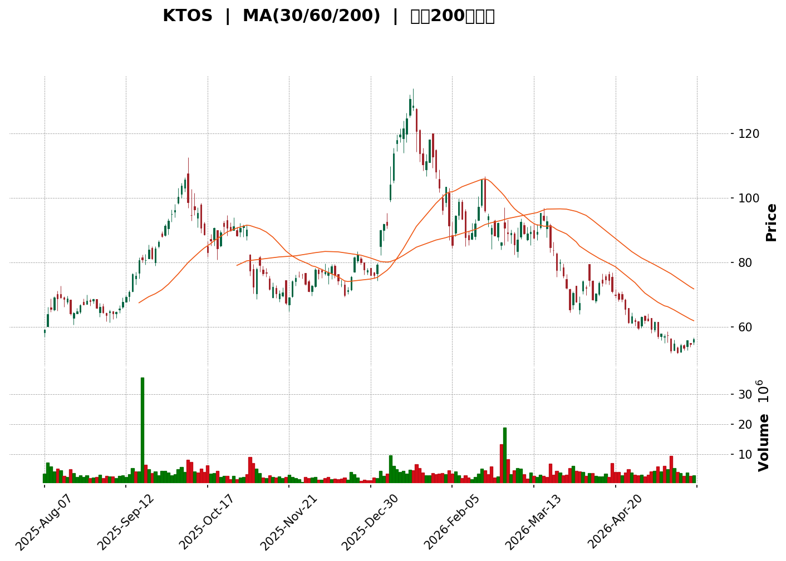
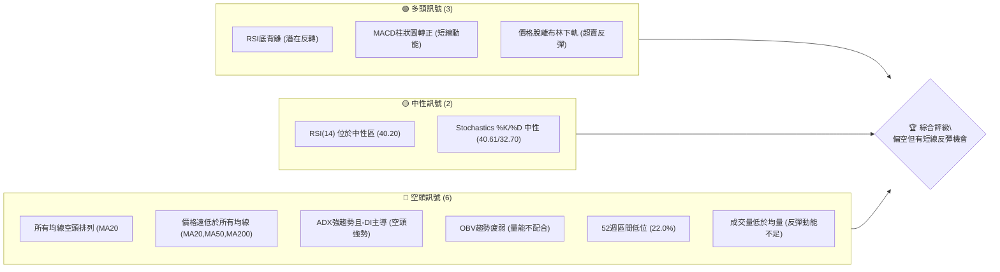

<details>
<summary>📊 靜態圖表 (點擊展開)</summary>

</details>

<html>
<head><meta charset="utf-8" /></head>
<body>
    <div>                        <script>window.PlotlyConfig = {MathJaxConfig: 'local'};</script>
        <script charset="utf-8" src="https://cdn.plot.ly/plotly-3.5.0.min.js" integrity="sha256-fHbNLP+GlIXN+efbQec78UkemUz3NJp7UmfGxC1tNxs=" crossorigin="anonymous"></script>                <div id="candlestick-chart" class="plotly-graph-div" style="height:500px; width:100%;"></div>            <script>                window.PLOTLYENV=window.PLOTLYENV || {};                                if (document.getElementById("candlestick-chart")) {                    Plotly.newPlot(                        "candlestick-chart",                        [{"close":{"dtype":"f8","bdata":"AAAAgD2KTUAAAADgo\u002fBPQAAAAIA9WlBAAAAAwPVIUUAAAAAAADBRQAAAACCuR1FAAAAAAAAgUUAAAAAgXC9RQAAAAKBHAVBAAAAAoEcRUEAAAACA6zFQQAAAAKBwrVBAAAAAoJm5UEAAAABAMwNRQAAAAEDh+lBAAAAA4KMgUUAAAACAwnVQQAAAAIDChVBAAAAAAAAgUEAAAAAghctPQAAAAADXM1BAAAAAwPUIUEAAAAAA1yNQQAAAAIA9alBAAAAAQOHqUEAAAADAzExRQAAAACBcr1FAAAAAYGYWU0AAAAAgXO9SQAAAAKCZKVRAAAAAoEcxVEAAAACAFC5UQAAAAKCZ+VRAAAAAIIVLVEAAAADAzAxVQAAAAIDrkVVAAAAAwB4FVkAAAAAgrtdWQAAAAKBwPVdAAAAAgOvBV0AAAAAAKQxYQAAAAAAAEFlAAAAAACnsWUAAAABA4WpaQAAAAEAzo1hAAAAA4FGoV0AAAACA6xFYQAAAAEAz01dAAAAAwB6lVkAAAAAgridWQAAAACCux1RAAAAAoJmpVUAAAAAgrqdWQAAAAEAzE1VAAAAA4HpUVkAAAAAghctWQAAAACCFq1ZAAAAAgOtxVkAAAACgcM1WQAAAAEAzE1ZAAAAAYGamVkAAAABgZsZWQAAAAIAUjlZAAAAAgD1aU0AAAACAPRpSQAAAAOBReFNAAAAAIIXLU0AAAACAwiVTQAAAAMDMLFNAAAAAACnsUUAAAADAzBxSQAAAACBcj1FAAAAAQAqXUUAAAABA4apRQAAAAADX01BAAAAAwPVIUUAAAABACodSQAAAAEAzw1JAAAAAoEfxUkAAAABgZgZTQAAAAKBwTVJAAAAAoHC9UUAAAACA6zFSQAAAACCFa1NAAAAAAAAgU0AAAACA60FTQAAAAIDrQVNAAAAAgD06U0AAAACA67FTQAAAAKBw\u002fVJAAAAA4KOQUkAAAADgUUhSQAAAAKBHcVFAAAAAoJnZUUAAAADA9dhSQAAAAIDrYVRAAAAAQDOTVEAAAACAFP5TQAAAAMDMbFNAAAAAgBReU0AAAABguP5SQAAAAIA9+lJAAAAAYI\u002fSU0AAAAAghXtWQAAAACCF+1ZAAAAAACncVkAAAABgjwJaQAAAAMDMbFxAAAAAQAp3XUAAAACAFO5dQAAAAAAAYF5AAAAAANcjX0AAAABACldgQAAAAIDCFWBAAAAAgMIlXkAAAABgZnZcQAAAAMD1mFtAAAAA4HrUW0AAAAAA14NdQAAAAEDhKlxAAAAAgD0KW0AAAADgo8BZQAAAAIA9ClhAAAAAIK7XWUAAAADAHtVWQAAAAAAAUFVAAAAAgD2aV0AAAAAA17NYQAAAAGC4XldAAAAAgOvxVUAAAABAM8NVQAAAAADXQ1ZAAAAAgBT+VkAAAACgcE1YQAAAAEDhalpAAAAAwB4FWEAAAAAA15NXQAAAACCFq1ZAAAAAYLgOVkAAAADA9QhXQAAAACCFi1VAAAAAgBSuVkAAAADAzDxWQAAAAOBRSFZAAAAAYI9iVUAAAAAAAMBVQAAAAIAUHldAAAAAoHA9VkAAAABA4TpWQAAAAKBwXVZAAAAAgOvhVUAAAACA62FWQAAAAADX01dAAAAAYI9CV0AAAACA6zFXQAAAACCuJ1VAAAAAACnsVEAAAAAgXF9TQAAAAGC4\u002flNAAAAAQAr3UkAAAAAAKfxRQAAAAIDrUVBAAAAA4KOgUUAAAADAzOxQQAAAAADX01BAAAAAgMKFUkAAAACgcP1RQAAAAKBwnVJAAAAAwB4VUUAAAACAwpVRQAAAAEAzY1JAAAAAgD1qUkAAAACAPapSQAAAAIA9mlJAAAAAIFy\u002fUUAAAADAHnVRQAAAAEAzI1FAAAAAQAonUUAAAACgR2FQQAAAAKBHoU5AAAAA4HqUT0AAAADgetROQAAAACCux01AAAAAYGaGT0AAAABgZgZPQAAAAEAK905AAAAAIK6nTUAAAABgj8JOQAAAAAAAgExAAAAAgOvxTEAAAABguH5MQAAAAIA9qkxAAAAAYLg+SkAAAADAzGxLQAAAACCFC0pAAAAAACkcS0AAAAAAKbxKQAAAAMD16EtAAAAAgMJVS0AAAABAChdMQA=="},"high":{"dtype":"f8","bdata":"AAAAACmcTUAAAADgUYhQQAAAACCFK1FAAAAAAClcUUAAAABACsdRQAAAAMDMLFJAAAAAwPVYUUAAAABA4WpRQAAAAKCZGVFAAAAAANcjUEAAAACAwnVQQAAAAGCPwlBAAAAAoHAtUUAAAACAPXpRQAAAACBcL1FAAAAA4Ho0UUAAAAAgXB9RQAAAAIA92lBAAAAAQOHKUEAAAAAAKRxQQAAAAGCPUlBAAAAAAABAUEAAAADAHjVQQAAAAAAAsFBAAAAAwPVIUUAAAACgcG1RQAAAAADX01FAAAAAIK4nU0AAAACA60FTQAAAAAApXFRAAAAAANeTVEAAAADgUahUQAAAAGC4XlVAAAAAAABAVUAAAADgUThVQAAAAIDCtVVAAAAAQOFqVkAAAAAgrvdWQAAAAKBHYVdAAAAAoJkZWEAAAAAgrodYQAAAAAAAwFlAAAAAoHAtWkAAAAAA15NaQAAAAOB6JFxAAAAAoJmpWUAAAAAAAGBZQAAAAGBmRlhAAAAAIFyfWEAAAACAwiVXQAAAAKBHoVVAAAAAgBQuVkAAAABAM7NWQAAAAAAAgFZAAAAAwMx8VkAAAAAghTtXQAAAAGBmpldAAAAAwMwcV0AAAAAgrndXQAAAAAAAwFZAAAAAoJkJV0AAAACAFO5WQAAAAIDC5VZAAAAAAACgVEAAAACAFN5TQAAAAGBmllNAAAAAAACAVEAAAAAgXL9TQAAAAEDhilNAAAAAoJn5UkAAAACgR3FSQAAAAMDMPFJAAAAAAADQUUAAAAAghQtSQAAAAGC4nlJAAAAAgMJVUUAAAAAAKZxSQAAAACCFC1NAAAAAQOFKU0AAAAAgXB9TQAAAAGBmJlNAAAAAYGamUkAAAAAAAEBSQAAAAOB6lFNAAAAA4FGIU0AAAADgeoRTQAAAAIA96lNAAAAAoHCdU0AAAACAFN5TQAAAAKCZ2VNAAAAAQOEaU0AAAADgUahSQAAAACBcj1JAAAAAgD0aUkAAAABgj\u002fJSQAAAACCud1RAAAAAgD3aVEAAAAAAKXxUQAAAAIA9+lNAAAAAgBSOU0AAAAAAKYxTQAAAAIAUPlNAAAAAYLjuU0AAAABACodWQAAAAIDrAVdAAAAA4HrUV0AAAABAM3NbQAAAAMDM3FxAAAAA4FHoXUAAAADgemReQAAAAKBw\u002fV5AAAAAANeTX0AAAAAAAIBgQAAAAAAAwGBAAAAAAAAAYEAAAABAM1NeQAAAAIDr4VxAAAAAQOFqXEAAAADA9YhdQAAAAAAAAF5AAAAAwMzMXEAAAAAAADBbQAAAAMD1SFlAAAAAIFzfWUAAAAAAAMBZQAAAAGBmJldAAAAAQOGqV0AAAACA6\u002fFYQAAAAAAA4FhAAAAAQDMjWEAAAACAwmVWQAAAACBcD1dAAAAAYGZWV0AAAAAAACBZQAAAAIA9elpAAAAAQOGqWkAAAADAHsVXQAAAACBc71ZAAAAAgOtRV0AAAAAAKRxXQAAAAKCZmVVAAAAAYGZGWEAAAACAFE5XQAAAAGBmhlZAAAAAIFxfVkAAAADgUbhWQAAAAEDhaldAAAAAQDMTV0AAAABguL5WQAAAACCu11ZAAAAAoJn5VkAAAABAM\u002fNWQAAAAGBm1ldAAAAA4FE4WEAAAAAAAKBXQAAAAAAAAFdAAAAAANeTVUAAAACgR8FUQAAAAAApPFRAAAAAgOvhU0AAAADgURhTQAAAAKCZ+VFAAAAAgBS+UUAAAABAMzNSQAAAAOCjYFFAAAAAgD2aUkAAAACgmTlSQAAAAAAp3FNAAAAAAACgUkAAAACA66FRQAAAAGBmhlJAAAAA4HokU0AAAABgjxJTQAAAAIAUTlNAAAAAwPU4U0AAAACgcO1RQAAAAKCZuVFAAAAAYLi+UUAAAAAgXC9RQAAAAOCjcFBAAAAAIIUbUEAAAACgmVlPQAAAAKBH4U5AAAAAQAqXT0AAAAAAAMBPQAAAAOBRCFBAAAAAwB5lT0AAAABguN5OQAAAAMAexU5AAAAA4FH4TEAAAABA4dpMQAAAAOCjUE1AAAAAAABATEAAAAAAKfxLQAAAAEAz80pAAAAAAClcS0AAAAAghUtLQAAAAOCj8EtAAAAAANeDS0AAAAAAAGBMQA=="},"hovertemplate":"\u003cb\u003e%{x|%Y-%m-%d}\u003c\u002fb\u003e\u003cbr\u003e\u958b: $%{open:.2f}\u003cbr\u003e\u9ad8: $%{high:.2f}\u003cbr\u003e\u4f4e: $%{low:.2f}\u003cbr\u003e\u6536: $%{close:.2f}\u003cextra\u003e\u003c\u002fextra\u003e","low":{"dtype":"f8","bdata":"AAAAgBRuTEAAAABgZgZOQAAAAIDCJVBAAAAAQOE6UEAAAADA9ThQQAAAAAAAMFFAAAAA4FGIUEAAAABgj8JQQAAAAIAUzk9AAAAAQOFaTkAAAAAA1wNQQAAAAGCPAlBAAAAAIK63UEAAAAAAAMBQQAAAAAAAoFBAAAAAoEfRUEAAAADA9WhQQAAAAGCPgk9AAAAAANcDUEAAAAAAAOBOQAAAAEAzs05AAAAAgD0qT0AAAADgelRPQAAAAAApDFBAAAAAYGZmUEAAAACgmelQQAAAAKCZ+VBAAAAAwB61UUAAAABACkdSQAAAAKBHwVJAAAAAoJn5U0AAAABAM9NTQAAAAGBmRlRAAAAAYGY2VEAAAAAgrrdTQAAAACCFG1VAAAAAQDPzVUAAAABgZgZWQAAAAOBRKFZAAAAAgOshV0AAAABACndXQAAAAKBHgVhAAAAAAAAAWUAAAACgmXlZQAAAAEAzM1hAAAAAoJk5V0AAAABA4apXQAAAAGCPslZAAAAAgD1KVkAAAAAgXB9WQAAAAKBwbVRAAAAAwMxMVUAAAADAzExVQAAAAADXM1RAAAAAIK43VUAAAAAghUtWQAAAAOCjEFZAAAAAAClsVkAAAACgcH1WQAAAAGCPAlZAAAAAgD36VUAAAADAzPxVQAAAAOB6tFVAAAAAYGb2UkAAAACgR5FRQAAAAKCZKVFAAAAAQDNDU0AAAADA9fhSQAAAAAAA4FJAAAAAANfTUUAAAAAAAEBRQAAAAGBmNlFAAAAAgOvxUEAAAABAM1NRQAAAAIA9ulBAAAAAQDMzUEAAAADA9UhRQAAAAKCZKVJAAAAAANfTUkAAAADgo8BSQAAAACCFO1JAAAAAIK63UUAAAAAghWtRQAAAAIDrEVJAAAAA4KOwUkAAAACgmclSQAAAAADXA1NAAAAAwMxMUkAAAABAM7NSQAAAAMDMzFJAAAAAYGZGUkAAAABA4RpSQAAAAADXU1FAAAAAwPWIUUAAAABguM5RQAAAAADXM1NAAAAAYGb2U0AAAACA69FTQAAAAGBmBlNAAAAAoJkJU0AAAABAM\u002fNSQAAAAOBRuFJAAAAAwB6VUkAAAADgUYhUQAAAAMDMrFVAAAAA4KOgVkAAAACgR7FYQAAAAKCZKVpAAAAAAACgXEAAAADAzExdQAAAAAAAgFxAAAAAoEdRXUAAAAAAAEBfQAAAAAAAwF9AAAAAgOuRXEAAAABguM5bQAAAAEAKF1tAAAAAoEexWkAAAAAA18NbQAAAAOCjUFtAAAAAgMKFWkAAAADgUWhZQAAAAKBHsVdAAAAAoJlJWEAAAABA4bpVQAAAAAAAIFVAAAAAAAAAVkAAAADAzExXQAAAAKBwTVdAAAAAoEdBVUAAAAAAAFBVQAAAAKBHwVVAAAAA4HrEVUAAAADAzDxXQAAAAGC4PlhAAAAAIIXbV0AAAAAAAMBWQAAAAGCPAlVAAAAAoHANVkAAAADA9ahVQAAAAAAAAFVAAAAAwB5VVUAAAABgZqZVQAAAAAAAcFVAAAAAoJmZVEAAAAAAAGBUQAAAAMDMzFVAAAAAwPUoVkAAAAAgrqdVQAAAAMD1WFVAAAAAwMzMVUAAAACgmblVQAAAACBcj1ZAAAAAgD0qV0AAAADA9ehVQAAAAGBmxlRAAAAA4HqEVEAAAACgR+FSQAAAAADXU1NAAAAAoJnJUkAAAADAzOxRQAAAACCuF1BAAAAAQDNjUEAAAABgZuZQQAAAACCF609AAAAAwMyMUUAAAABAM3NRQAAAAEAzI1JAAAAAgOsRUUAAAAAghdtQQAAAAEAKZ1FAAAAAoEchUkAAAAAAAFBSQAAAAOCjQFJAAAAAgD2aUUAAAABACjdRQAAAAOB69FBAAAAAwPXoUEAAAADAHuVPQAAAAKBHgU5AAAAA4FGYTkAAAAAAKRxOQAAAACCuh01AAAAAgOvRTUAAAACgmXlOQAAAAKBH4U5AAAAAoEcBTUAAAABACjdNQAAAAMAeJUxAAAAAoHDdS0AAAACgR4FLQAAAAIAUjktAAAAAIIXrSUAAAABguD5KQAAAAOB61ElAAAAAgD0KSkAAAAAA12NKQAAAAEAzU0pAAAAAIK7nSkAAAABA4TpLQA=="},"name":"\u50f9\u683c","open":{"dtype":"f8","bdata":"AAAAYLgeTUAAAADA9QhOQAAAAMDMfFBAAAAA4FFYUEAAAABA4YpRQAAAAMDMjFFAAAAAQApHUUAAAAAAKexQQAAAACCuF1FAAAAAoHBdT0AAAADA9QhQQAAAAAApLFBAAAAAgD3qUEAAAAAAAMBQQAAAAKBHEVFAAAAAYI8CUUAAAAAgXB9RQAAAAIA9GlBAAAAAgOuRUEAAAABAMxNQQAAAAAAAIFBAAAAAgMI1UEAAAADgUQhQQAAAAGBmVlBAAAAAgMKFUEAAAAAgXO9QQAAAAMDMXFFAAAAAANfDUUAAAADgo8BSQAAAAKCZKVNAAAAAoEdhVEAAAABACidUQAAAAGBmRlRAAAAAIK4XVUAAAAAAAABUQAAAAAAAQFVAAAAAwMw8VkAAAADA9RhWQAAAAAAAoFZAAAAAAADAV0AAAAAAKexXQAAAAGBmllhAAAAAoJlJWUAAAADgesRZQAAAAMD16FpAAAAAwMysV0AAAACAFF5YQAAAAIAUbldAAAAAwMx8WEAAAAAgXP9WQAAAAEDhOlVAAAAAgOvRVUAAAABACsdVQAAAAAAAgFZAAAAAwMxMVUAAAADgUQhXQAAAAOB6RFdAAAAA4HrEVkAAAAAAAIBWQAAAAAAAgFZAAAAAAABgVkAAAADAHrVWQAAAAGC4DlZAAAAAIK6XVEAAAADAzHxTQAAAAEAzk1FAAAAAIIVbVEAAAABguG5TQAAAAIDrMVNAAAAAACm8UkAAAACAPUpRQAAAAIDCBVJAAAAAIFwvUUAAAADAHmVRQAAAAGC4nlJAAAAAANezUEAAAABA4VpRQAAAAIA9ilJAAAAAQDPzUkAAAABguA5TQAAAAGBmJlNAAAAAIK6HUkAAAADgo8BRQAAAAKBHIVJAAAAAAClsU0AAAACAwmVTQAAAAOB6JFNAAAAAAAAAU0AAAAAgXC9TQAAAACCFu1NAAAAAoEcRU0AAAAAAAEBSQAAAAOBRSFJAAAAAACm8UUAAAACA6+FRQAAAAAAAQFNAAAAAgBQeVEAAAABACkdUQAAAAIA9+lNAAAAAoHA9U0AAAAAAKYxTQAAAAEAzM1NAAAAAQDMjU0AAAACAPTpVQAAAAMD1eFZAAAAA4FEoV0AAAACA6+FYQAAAAGC4XlpAAAAAYGY2XUAAAACAPbpdQAAAAAAAoF1AAAAAwPX4XUAAAACgcG1fQAAAACCFA2BAAAAAYI\u002fiX0AAAADgo0BeQAAAAMAedVxAAAAAwMwsW0AAAAAA18NbQAAAAAAAAF5AAAAA4FG4XEAAAADgenRaQAAAAIA9+lhAAAAAYGamWEAAAACgcF1ZQAAAAIAUHlZAAAAAYGZGVkAAAABgZqZXQAAAAOB6tFhAAAAAgD36V0AAAACgmRlWQAAAACBcz1VAAAAAwB4FVkAAAADA9UhXQAAAAKBwbVhAAAAAAClsWkAAAACgR1FXQAAAAAAAMFZAAAAAACk8V0AAAAAAKfxVQAAAAEAzU1VAAAAAQOEaV0AAAACgcE1WQAAAAOCjIFZAAAAAYGY2VkAAAADgUdhUQAAAAEAK91VAAAAAACncVkAAAACA68FVQAAAAAApPFZAAAAAAACAVkAAAACAwjVWQAAAAEAKt1ZAAAAAgD2aV0AAAADgo6BWQAAAAMDM3FZAAAAAgML1VEAAAABA4apUQAAAAGCP8lNAAAAA4FGYU0AAAABACrdSQAAAAOCj8FFAAAAAoJm5UEAAAADA9ShSQAAAAIDrUVBAAAAA4FHIUUAAAAAAABBSQAAAAOBR2FNAAAAAwMyMUkAAAACgRwFRQAAAAGBmhlFAAAAAgD2qUkAAAAAAKexSQAAAAADXE1NAAAAAIIXbUkAAAABgj4JRQAAAAOCjkFFAAAAAIK6HUUAAAADAzBxRQAAAAOCjcFBAAAAA4FGYTkAAAADgUfhOQAAAAGC43k5AAAAAwB4lTkAAAADgerRPQAAAAAApPE9AAAAA4FFYT0AAAACAPYpNQAAAAMAexU5AAAAAgD2KTEAAAAAgXG9MQAAAACCFq0xAAAAA4Ho0TEAAAACgR2FKQAAAAGC4vkpAAAAAoEchSkAAAABguB5LQAAAAKCZ+UpAAAAAAACAS0AAAADAHqVLQA=="},"x":["2025-08-07T00:00:00-04:00","2025-08-08T00:00:00-04:00","2025-08-11T00:00:00-04:00","2025-08-12T00:00:00-04:00","2025-08-13T00:00:00-04:00","2025-08-14T00:00:00-04:00","2025-08-15T00:00:00-04:00","2025-08-18T00:00:00-04:00","2025-08-19T00:00:00-04:00","2025-08-20T00:00:00-04:00","2025-08-21T00:00:00-04:00","2025-08-22T00:00:00-04:00","2025-08-25T00:00:00-04:00","2025-08-26T00:00:00-04:00","2025-08-27T00:00:00-04:00","2025-08-28T00:00:00-04:00","2025-08-29T00:00:00-04:00","2025-09-02T00:00:00-04:00","2025-09-03T00:00:00-04:00","2025-09-04T00:00:00-04:00","2025-09-05T00:00:00-04:00","2025-09-08T00:00:00-04:00","2025-09-09T00:00:00-04:00","2025-09-10T00:00:00-04:00","2025-09-11T00:00:00-04:00","2025-09-12T00:00:00-04:00","2025-09-15T00:00:00-04:00","2025-09-16T00:00:00-04:00","2025-09-17T00:00:00-04:00","2025-09-18T00:00:00-04:00","2025-09-19T00:00:00-04:00","2025-09-22T00:00:00-04:00","2025-09-23T00:00:00-04:00","2025-09-24T00:00:00-04:00","2025-09-25T00:00:00-04:00","2025-09-26T00:00:00-04:00","2025-09-29T00:00:00-04:00","2025-09-30T00:00:00-04:00","2025-10-01T00:00:00-04:00","2025-10-02T00:00:00-04:00","2025-10-03T00:00:00-04:00","2025-10-06T00:00:00-04:00","2025-10-07T00:00:00-04:00","2025-10-08T00:00:00-04:00","2025-10-09T00:00:00-04:00","2025-10-10T00:00:00-04:00","2025-10-13T00:00:00-04:00","2025-10-14T00:00:00-04:00","2025-10-15T00:00:00-04:00","2025-10-16T00:00:00-04:00","2025-10-17T00:00:00-04:00","2025-10-20T00:00:00-04:00","2025-10-21T00:00:00-04:00","2025-10-22T00:00:00-04:00","2025-10-23T00:00:00-04:00","2025-10-24T00:00:00-04:00","2025-10-27T00:00:00-04:00","2025-10-28T00:00:00-04:00","2025-10-29T00:00:00-04:00","2025-10-30T00:00:00-04:00","2025-10-31T00:00:00-04:00","2025-11-03T00:00:00-05:00","2025-11-04T00:00:00-05:00","2025-11-05T00:00:00-05:00","2025-11-06T00:00:00-05:00","2025-11-07T00:00:00-05:00","2025-11-10T00:00:00-05:00","2025-11-11T00:00:00-05:00","2025-11-12T00:00:00-05:00","2025-11-13T00:00:00-05:00","2025-11-14T00:00:00-05:00","2025-11-17T00:00:00-05:00","2025-11-18T00:00:00-05:00","2025-11-19T00:00:00-05:00","2025-11-20T00:00:00-05:00","2025-11-21T00:00:00-05:00","2025-11-24T00:00:00-05:00","2025-11-25T00:00:00-05:00","2025-11-26T00:00:00-05:00","2025-11-28T00:00:00-05:00","2025-12-01T00:00:00-05:00","2025-12-02T00:00:00-05:00","2025-12-03T00:00:00-05:00","2025-12-04T00:00:00-05:00","2025-12-05T00:00:00-05:00","2025-12-08T00:00:00-05:00","2025-12-09T00:00:00-05:00","2025-12-10T00:00:00-05:00","2025-12-11T00:00:00-05:00","2025-12-12T00:00:00-05:00","2025-12-15T00:00:00-05:00","2025-12-16T00:00:00-05:00","2025-12-17T00:00:00-05:00","2025-12-18T00:00:00-05:00","2025-12-19T00:00:00-05:00","2025-12-22T00:00:00-05:00","2025-12-23T00:00:00-05:00","2025-12-24T00:00:00-05:00","2025-12-26T00:00:00-05:00","2025-12-29T00:00:00-05:00","2025-12-30T00:00:00-05:00","2025-12-31T00:00:00-05:00","2026-01-02T00:00:00-05:00","2026-01-05T00:00:00-05:00","2026-01-06T00:00:00-05:00","2026-01-07T00:00:00-05:00","2026-01-08T00:00:00-05:00","2026-01-09T00:00:00-05:00","2026-01-12T00:00:00-05:00","2026-01-13T00:00:00-05:00","2026-01-14T00:00:00-05:00","2026-01-15T00:00:00-05:00","2026-01-16T00:00:00-05:00","2026-01-20T00:00:00-05:00","2026-01-21T00:00:00-05:00","2026-01-22T00:00:00-05:00","2026-01-23T00:00:00-05:00","2026-01-26T00:00:00-05:00","2026-01-27T00:00:00-05:00","2026-01-28T00:00:00-05:00","2026-01-29T00:00:00-05:00","2026-01-30T00:00:00-05:00","2026-02-02T00:00:00-05:00","2026-02-03T00:00:00-05:00","2026-02-04T00:00:00-05:00","2026-02-05T00:00:00-05:00","2026-02-06T00:00:00-05:00","2026-02-09T00:00:00-05:00","2026-02-10T00:00:00-05:00","2026-02-11T00:00:00-05:00","2026-02-12T00:00:00-05:00","2026-02-13T00:00:00-05:00","2026-02-17T00:00:00-05:00","2026-02-18T00:00:00-05:00","2026-02-19T00:00:00-05:00","2026-02-20T00:00:00-05:00","2026-02-23T00:00:00-05:00","2026-02-24T00:00:00-05:00","2026-02-25T00:00:00-05:00","2026-02-26T00:00:00-05:00","2026-02-27T00:00:00-05:00","2026-03-02T00:00:00-05:00","2026-03-03T00:00:00-05:00","2026-03-04T00:00:00-05:00","2026-03-05T00:00:00-05:00","2026-03-06T00:00:00-05:00","2026-03-09T00:00:00-04:00","2026-03-10T00:00:00-04:00","2026-03-11T00:00:00-04:00","2026-03-12T00:00:00-04:00","2026-03-13T00:00:00-04:00","2026-03-16T00:00:00-04:00","2026-03-17T00:00:00-04:00","2026-03-18T00:00:00-04:00","2026-03-19T00:00:00-04:00","2026-03-20T00:00:00-04:00","2026-03-23T00:00:00-04:00","2026-03-24T00:00:00-04:00","2026-03-25T00:00:00-04:00","2026-03-26T00:00:00-04:00","2026-03-27T00:00:00-04:00","2026-03-30T00:00:00-04:00","2026-03-31T00:00:00-04:00","2026-04-01T00:00:00-04:00","2026-04-02T00:00:00-04:00","2026-04-06T00:00:00-04:00","2026-04-07T00:00:00-04:00","2026-04-08T00:00:00-04:00","2026-04-09T00:00:00-04:00","2026-04-10T00:00:00-04:00","2026-04-13T00:00:00-04:00","2026-04-14T00:00:00-04:00","2026-04-15T00:00:00-04:00","2026-04-16T00:00:00-04:00","2026-04-17T00:00:00-04:00","2026-04-20T00:00:00-04:00","2026-04-21T00:00:00-04:00","2026-04-22T00:00:00-04:00","2026-04-23T00:00:00-04:00","2026-04-24T00:00:00-04:00","2026-04-27T00:00:00-04:00","2026-04-28T00:00:00-04:00","2026-04-29T00:00:00-04:00","2026-04-30T00:00:00-04:00","2026-05-01T00:00:00-04:00","2026-05-04T00:00:00-04:00","2026-05-05T00:00:00-04:00","2026-05-06T00:00:00-04:00","2026-05-07T00:00:00-04:00","2026-05-08T00:00:00-04:00","2026-05-11T00:00:00-04:00","2026-05-12T00:00:00-04:00","2026-05-13T00:00:00-04:00","2026-05-14T00:00:00-04:00","2026-05-15T00:00:00-04:00","2026-05-18T00:00:00-04:00","2026-05-19T00:00:00-04:00","2026-05-20T00:00:00-04:00","2026-05-21T00:00:00-04:00","2026-05-22T00:00:00-04:00"],"type":"candlestick"},{"hovertemplate":"MA30: $%{y:.2f}\u003cextra\u003e\u003c\u002fextra\u003e","line":{"color":"#2196F3","dash":"dash","width":2},"mode":"lines","name":"MA30","x":["2025-08-07T00:00:00-04:00","2025-08-08T00:00:00-04:00","2025-08-11T00:00:00-04:00","2025-08-12T00:00:00-04:00","2025-08-13T00:00:00-04:00","2025-08-14T00:00:00-04:00","2025-08-15T00:00:00-04:00","2025-08-18T00:00:00-04:00","2025-08-19T00:00:00-04:00","2025-08-20T00:00:00-04:00","2025-08-21T00:00:00-04:00","2025-08-22T00:00:00-04:00","2025-08-25T00:00:00-04:00","2025-08-26T00:00:00-04:00","2025-08-27T00:00:00-04:00","2025-08-28T00:00:00-04:00","2025-08-29T00:00:00-04:00","2025-09-02T00:00:00-04:00","2025-09-03T00:00:00-04:00","2025-09-04T00:00:00-04:00","2025-09-05T00:00:00-04:00","2025-09-08T00:00:00-04:00","2025-09-09T00:00:00-04:00","2025-09-10T00:00:00-04:00","2025-09-11T00:00:00-04:00","2025-09-12T00:00:00-04:00","2025-09-15T00:00:00-04:00","2025-09-16T00:00:00-04:00","2025-09-17T00:00:00-04:00","2025-09-18T00:00:00-04:00","2025-09-19T00:00:00-04:00","2025-09-22T00:00:00-04:00","2025-09-23T00:00:00-04:00","2025-09-24T00:00:00-04:00","2025-09-25T00:00:00-04:00","2025-09-26T00:00:00-04:00","2025-09-29T00:00:00-04:00","2025-09-30T00:00:00-04:00","2025-10-01T00:00:00-04:00","2025-10-02T00:00:00-04:00","2025-10-03T00:00:00-04:00","2025-10-06T00:00:00-04:00","2025-10-07T00:00:00-04:00","2025-10-08T00:00:00-04:00","2025-10-09T00:00:00-04:00","2025-10-10T00:00:00-04:00","2025-10-13T00:00:00-04:00","2025-10-14T00:00:00-04:00","2025-10-15T00:00:00-04:00","2025-10-16T00:00:00-04:00","2025-10-17T00:00:00-04:00","2025-10-20T00:00:00-04:00","2025-10-21T00:00:00-04:00","2025-10-22T00:00:00-04:00","2025-10-23T00:00:00-04:00","2025-10-24T00:00:00-04:00","2025-10-27T00:00:00-04:00","2025-10-28T00:00:00-04:00","2025-10-29T00:00:00-04:00","2025-10-30T00:00:00-04:00","2025-10-31T00:00:00-04:00","2025-11-03T00:00:00-05:00","2025-11-04T00:00:00-05:00","2025-11-05T00:00:00-05:00","2025-11-06T00:00:00-05:00","2025-11-07T00:00:00-05:00","2025-11-10T00:00:00-05:00","2025-11-11T00:00:00-05:00","2025-11-12T00:00:00-05:00","2025-11-13T00:00:00-05:00","2025-11-14T00:00:00-05:00","2025-11-17T00:00:00-05:00","2025-11-18T00:00:00-05:00","2025-11-19T00:00:00-05:00","2025-11-20T00:00:00-05:00","2025-11-21T00:00:00-05:00","2025-11-24T00:00:00-05:00","2025-11-25T00:00:00-05:00","2025-11-26T00:00:00-05:00","2025-11-28T00:00:00-05:00","2025-12-01T00:00:00-05:00","2025-12-02T00:00:00-05:00","2025-12-03T00:00:00-05:00","2025-12-04T00:00:00-05:00","2025-12-05T00:00:00-05:00","2025-12-08T00:00:00-05:00","2025-12-09T00:00:00-05:00","2025-12-10T00:00:00-05:00","2025-12-11T00:00:00-05:00","2025-12-12T00:00:00-05:00","2025-12-15T00:00:00-05:00","2025-12-16T00:00:00-05:00","2025-12-17T00:00:00-05:00","2025-12-18T00:00:00-05:00","2025-12-19T00:00:00-05:00","2025-12-22T00:00:00-05:00","2025-12-23T00:00:00-05:00","2025-12-24T00:00:00-05:00","2025-12-26T00:00:00-05:00","2025-12-29T00:00:00-05:00","2025-12-30T00:00:00-05:00","2025-12-31T00:00:00-05:00","2026-01-02T00:00:00-05:00","2026-01-05T00:00:00-05:00","2026-01-06T00:00:00-05:00","2026-01-07T00:00:00-05:00","2026-01-08T00:00:00-05:00","2026-01-09T00:00:00-05:00","2026-01-12T00:00:00-05:00","2026-01-13T00:00:00-05:00","2026-01-14T00:00:00-05:00","2026-01-15T00:00:00-05:00","2026-01-16T00:00:00-05:00","2026-01-20T00:00:00-05:00","2026-01-21T00:00:00-05:00","2026-01-22T00:00:00-05:00","2026-01-23T00:00:00-05:00","2026-01-26T00:00:00-05:00","2026-01-27T00:00:00-05:00","2026-01-28T00:00:00-05:00","2026-01-29T00:00:00-05:00","2026-01-30T00:00:00-05:00","2026-02-02T00:00:00-05:00","2026-02-03T00:00:00-05:00","2026-02-04T00:00:00-05:00","2026-02-05T00:00:00-05:00","2026-02-06T00:00:00-05:00","2026-02-09T00:00:00-05:00","2026-02-10T00:00:00-05:00","2026-02-11T00:00:00-05:00","2026-02-12T00:00:00-05:00","2026-02-13T00:00:00-05:00","2026-02-17T00:00:00-05:00","2026-02-18T00:00:00-05:00","2026-02-19T00:00:00-05:00","2026-02-20T00:00:00-05:00","2026-02-23T00:00:00-05:00","2026-02-24T00:00:00-05:00","2026-02-25T00:00:00-05:00","2026-02-26T00:00:00-05:00","2026-02-27T00:00:00-05:00","2026-03-02T00:00:00-05:00","2026-03-03T00:00:00-05:00","2026-03-04T00:00:00-05:00","2026-03-05T00:00:00-05:00","2026-03-06T00:00:00-05:00","2026-03-09T00:00:00-04:00","2026-03-10T00:00:00-04:00","2026-03-11T00:00:00-04:00","2026-03-12T00:00:00-04:00","2026-03-13T00:00:00-04:00","2026-03-16T00:00:00-04:00","2026-03-17T00:00:00-04:00","2026-03-18T00:00:00-04:00","2026-03-19T00:00:00-04:00","2026-03-20T00:00:00-04:00","2026-03-23T00:00:00-04:00","2026-03-24T00:00:00-04:00","2026-03-25T00:00:00-04:00","2026-03-26T00:00:00-04:00","2026-03-27T00:00:00-04:00","2026-03-30T00:00:00-04:00","2026-03-31T00:00:00-04:00","2026-04-01T00:00:00-04:00","2026-04-02T00:00:00-04:00","2026-04-06T00:00:00-04:00","2026-04-07T00:00:00-04:00","2026-04-08T00:00:00-04:00","2026-04-09T00:00:00-04:00","2026-04-10T00:00:00-04:00","2026-04-13T00:00:00-04:00","2026-04-14T00:00:00-04:00","2026-04-15T00:00:00-04:00","2026-04-16T00:00:00-04:00","2026-04-17T00:00:00-04:00","2026-04-20T00:00:00-04:00","2026-04-21T00:00:00-04:00","2026-04-22T00:00:00-04:00","2026-04-23T00:00:00-04:00","2026-04-24T00:00:00-04:00","2026-04-27T00:00:00-04:00","2026-04-28T00:00:00-04:00","2026-04-29T00:00:00-04:00","2026-04-30T00:00:00-04:00","2026-05-01T00:00:00-04:00","2026-05-04T00:00:00-04:00","2026-05-05T00:00:00-04:00","2026-05-06T00:00:00-04:00","2026-05-07T00:00:00-04:00","2026-05-08T00:00:00-04:00","2026-05-11T00:00:00-04:00","2026-05-12T00:00:00-04:00","2026-05-13T00:00:00-04:00","2026-05-14T00:00:00-04:00","2026-05-15T00:00:00-04:00","2026-05-18T00:00:00-04:00","2026-05-19T00:00:00-04:00","2026-05-20T00:00:00-04:00","2026-05-21T00:00:00-04:00","2026-05-22T00:00:00-04:00"],"y":{"dtype":"f8","bdata":"AAAAAAAA+H8AAAAAAAD4fwAAAAAAAPh\u002fAAAAAAAA+H8AAAAAAAD4fwAAAAAAAPh\u002fAAAAAAAA+H8AAAAAAAD4fwAAAAAAAPh\u002fAAAAAAAA+H8AAAAAAAD4fwAAAAAAAPh\u002fAAAAAAAA+H8AAAAAAAD4fwAAAAAAAPh\u002fAAAAAAAA+H8AAAAAAAD4fwAAAAAAAPh\u002fAAAAAAAA+H8AAAAAAAD4fwAAAAAAAPh\u002fAAAAAAAA+H8AAAAAAAD4fwAAAAAAAPh\u002fAAAAAAAA+H8AAAAAAAD4fwAAAAAAAPh\u002fAAAAAAAA+H8AAAAAAAD4f83MzHxq3FBA3t3dHbAKUUCJiIgAnS5RQJqZmQEPVlFAvLu7c75vUUDe3d01tJBRQDMzM9tPtVFA3t3dJRXfUUDe3d0lXA9SQHd3dz8ZTVJAd3d3T7iOUkBERERcutFSQERERKxHGVNAMzMz68NnU0C8u7tzBbhTQM3MzIRd+VNAzczMhBYxVECamZnRBnJUQImIiGBXsFRAERERifrnVEARERFBYB1VQFVVVfVvRFVAvLu7a3V0VUCJiIioDaxVQFVVVZXR01VA7+7uXgECVkAiIiJi5TBWQImIiEhvW1ZAq6qq2hV4VkCamZmJFplWQFVVVXVoqVZAMzMz82C+VkAAAADQhdRWQAAAAGAB4lZAREREdPbZVkC8u7uLz8BWQGZmZgbkrlZAAAAAcOebVkBVVVWVX3xWQERERHSvWVZAREREtOQnVkDv7u5+P\u002fVVQImIiAg6tVVAiYiIaB9uVUDe3d29dCNVQImIiIjP4FRAiYiImG6qVEAiIiLSIntUQO\u002fu7p7vT1RAIiIiYlcwVECrqqrKoRVUQLy7u5t9AFRAZmZmxgTfU0ARERHB9bhTQJqZmVnWqlNAvLu763yPU0AiIiIiTXFTQJqZmWkuVFNA3t3drbk4U0De3d09NR5TQERERPThA1NAMzMzIwbhUkDv7u4esLpSQBEREbEPj1JA3t3dbT2CUkB3d3fnmIhSQKuqqkpikFJAq6qqOgqXUkCamZkpQJ5SQLy7u0tioFJAIiIi8rasUkDNzMzMPrRSQBEREWFXwFJAmpmZWWTTUkARERHhevxSQO\u002fu7q4AMVNAVVVVdZNgU0Crqqo6baBTQHd3d0fh8lNAiYiICKxMVEDv7u5euqlUQGZmZia\u002fEFVAVVVV5ReDVUDNzMzcsv5VQImIiKh\u002fa1ZAzczMrI7JVkDe3d1NGxhXQAAAAFBGX1dAIiIiwq6oV0AAAADgevxXQN7d3W3LSlhAmpmZWR2TWEARERHR29JYQHd3d0coC1lAmpmZKVxPWUB3d3eHXXFZQFVVVSVNeVlAIiIi0iKTWUCJiIj4U7tZQFVVVfX93FlAd3d3l\u002fzyWUCamZlJmgpaQAAAAPCnJlpAiYiI6LRBWkAiIiLCPFFaQBEREaGMblpAAAAAsHJ4WkDv7u7OsGNaQCIiItKUMlpARERE5F7zWUCJiIiIiLhZQKuqqhovbVlARERE9P0kWUBmZmb24ctYQERERGSCd1hAvLu7a7wsWEDe3d29dPNXQImIiAg6zVdA3t3dfYadV0CrqqoqXF9XQJqZmWnYLVdA3t3drdUBV0DNzMzME+VWQFVVVZVD41ZAZmZmBjrNVkCrqqrqUdBWQKuqqtr5zlZA3t3dTRu4VkDe3d29n4pWQBEREfHSbVZAiYiICGVUVkBVVVX1KDRWQImIiOhtAVZAMzMz46XTVUDe3d19sZRVQBEREdHbQlVAd3d3V\u002fITVUAzMzNDRORUQKuqqvqpwVRAzczM7DWXVEB3d3c3tGhUQN7d3Y3CTVRAVVVVhV0pVEB3d3dH4QpUQDMzMzN661NAVVVV9W\u002fMU0CamZnZzqdTQHd3d1fHdFNAd3d3h11JU0AiIiICchdTQERERAxJ21JAd3d3x0unUkAzMzML12tSQHd3d8eSH1JAVVVVPZjfUUAAAACQCZ5RQLy7u8uhbVFAiYiIEJ85UUARERFRjRdRQLy7uyuH5lBAd3d3JzHAUEDe3d11TKBQQLy7u7NWj1BAERERYeVoUEARERGRe01QQDMzM2sDLVBAiYiIwJ8CUEDv7u5+W7ZPQFVVVaXTZk9Ad3d3R4ssT0CamZnJIPBOQA=="},"type":"scatter"},{"hovertemplate":"MA60: $%{y:.2f}\u003cextra\u003e\u003c\u002fextra\u003e","line":{"color":"#9C27B0","dash":"dash","width":2},"mode":"lines","name":"MA60","x":["2025-08-07T00:00:00-04:00","2025-08-08T00:00:00-04:00","2025-08-11T00:00:00-04:00","2025-08-12T00:00:00-04:00","2025-08-13T00:00:00-04:00","2025-08-14T00:00:00-04:00","2025-08-15T00:00:00-04:00","2025-08-18T00:00:00-04:00","2025-08-19T00:00:00-04:00","2025-08-20T00:00:00-04:00","2025-08-21T00:00:00-04:00","2025-08-22T00:00:00-04:00","2025-08-25T00:00:00-04:00","2025-08-26T00:00:00-04:00","2025-08-27T00:00:00-04:00","2025-08-28T00:00:00-04:00","2025-08-29T00:00:00-04:00","2025-09-02T00:00:00-04:00","2025-09-03T00:00:00-04:00","2025-09-04T00:00:00-04:00","2025-09-05T00:00:00-04:00","2025-09-08T00:00:00-04:00","2025-09-09T00:00:00-04:00","2025-09-10T00:00:00-04:00","2025-09-11T00:00:00-04:00","2025-09-12T00:00:00-04:00","2025-09-15T00:00:00-04:00","2025-09-16T00:00:00-04:00","2025-09-17T00:00:00-04:00","2025-09-18T00:00:00-04:00","2025-09-19T00:00:00-04:00","2025-09-22T00:00:00-04:00","2025-09-23T00:00:00-04:00","2025-09-24T00:00:00-04:00","2025-09-25T00:00:00-04:00","2025-09-26T00:00:00-04:00","2025-09-29T00:00:00-04:00","2025-09-30T00:00:00-04:00","2025-10-01T00:00:00-04:00","2025-10-02T00:00:00-04:00","2025-10-03T00:00:00-04:00","2025-10-06T00:00:00-04:00","2025-10-07T00:00:00-04:00","2025-10-08T00:00:00-04:00","2025-10-09T00:00:00-04:00","2025-10-10T00:00:00-04:00","2025-10-13T00:00:00-04:00","2025-10-14T00:00:00-04:00","2025-10-15T00:00:00-04:00","2025-10-16T00:00:00-04:00","2025-10-17T00:00:00-04:00","2025-10-20T00:00:00-04:00","2025-10-21T00:00:00-04:00","2025-10-22T00:00:00-04:00","2025-10-23T00:00:00-04:00","2025-10-24T00:00:00-04:00","2025-10-27T00:00:00-04:00","2025-10-28T00:00:00-04:00","2025-10-29T00:00:00-04:00","2025-10-30T00:00:00-04:00","2025-10-31T00:00:00-04:00","2025-11-03T00:00:00-05:00","2025-11-04T00:00:00-05:00","2025-11-05T00:00:00-05:00","2025-11-06T00:00:00-05:00","2025-11-07T00:00:00-05:00","2025-11-10T00:00:00-05:00","2025-11-11T00:00:00-05:00","2025-11-12T00:00:00-05:00","2025-11-13T00:00:00-05:00","2025-11-14T00:00:00-05:00","2025-11-17T00:00:00-05:00","2025-11-18T00:00:00-05:00","2025-11-19T00:00:00-05:00","2025-11-20T00:00:00-05:00","2025-11-21T00:00:00-05:00","2025-11-24T00:00:00-05:00","2025-11-25T00:00:00-05:00","2025-11-26T00:00:00-05:00","2025-11-28T00:00:00-05:00","2025-12-01T00:00:00-05:00","2025-12-02T00:00:00-05:00","2025-12-03T00:00:00-05:00","2025-12-04T00:00:00-05:00","2025-12-05T00:00:00-05:00","2025-12-08T00:00:00-05:00","2025-12-09T00:00:00-05:00","2025-12-10T00:00:00-05:00","2025-12-11T00:00:00-05:00","2025-12-12T00:00:00-05:00","2025-12-15T00:00:00-05:00","2025-12-16T00:00:00-05:00","2025-12-17T00:00:00-05:00","2025-12-18T00:00:00-05:00","2025-12-19T00:00:00-05:00","2025-12-22T00:00:00-05:00","2025-12-23T00:00:00-05:00","2025-12-24T00:00:00-05:00","2025-12-26T00:00:00-05:00","2025-12-29T00:00:00-05:00","2025-12-30T00:00:00-05:00","2025-12-31T00:00:00-05:00","2026-01-02T00:00:00-05:00","2026-01-05T00:00:00-05:00","2026-01-06T00:00:00-05:00","2026-01-07T00:00:00-05:00","2026-01-08T00:00:00-05:00","2026-01-09T00:00:00-05:00","2026-01-12T00:00:00-05:00","2026-01-13T00:00:00-05:00","2026-01-14T00:00:00-05:00","2026-01-15T00:00:00-05:00","2026-01-16T00:00:00-05:00","2026-01-20T00:00:00-05:00","2026-01-21T00:00:00-05:00","2026-01-22T00:00:00-05:00","2026-01-23T00:00:00-05:00","2026-01-26T00:00:00-05:00","2026-01-27T00:00:00-05:00","2026-01-28T00:00:00-05:00","2026-01-29T00:00:00-05:00","2026-01-30T00:00:00-05:00","2026-02-02T00:00:00-05:00","2026-02-03T00:00:00-05:00","2026-02-04T00:00:00-05:00","2026-02-05T00:00:00-05:00","2026-02-06T00:00:00-05:00","2026-02-09T00:00:00-05:00","2026-02-10T00:00:00-05:00","2026-02-11T00:00:00-05:00","2026-02-12T00:00:00-05:00","2026-02-13T00:00:00-05:00","2026-02-17T00:00:00-05:00","2026-02-18T00:00:00-05:00","2026-02-19T00:00:00-05:00","2026-02-20T00:00:00-05:00","2026-02-23T00:00:00-05:00","2026-02-24T00:00:00-05:00","2026-02-25T00:00:00-05:00","2026-02-26T00:00:00-05:00","2026-02-27T00:00:00-05:00","2026-03-02T00:00:00-05:00","2026-03-03T00:00:00-05:00","2026-03-04T00:00:00-05:00","2026-03-05T00:00:00-05:00","2026-03-06T00:00:00-05:00","2026-03-09T00:00:00-04:00","2026-03-10T00:00:00-04:00","2026-03-11T00:00:00-04:00","2026-03-12T00:00:00-04:00","2026-03-13T00:00:00-04:00","2026-03-16T00:00:00-04:00","2026-03-17T00:00:00-04:00","2026-03-18T00:00:00-04:00","2026-03-19T00:00:00-04:00","2026-03-20T00:00:00-04:00","2026-03-23T00:00:00-04:00","2026-03-24T00:00:00-04:00","2026-03-25T00:00:00-04:00","2026-03-26T00:00:00-04:00","2026-03-27T00:00:00-04:00","2026-03-30T00:00:00-04:00","2026-03-31T00:00:00-04:00","2026-04-01T00:00:00-04:00","2026-04-02T00:00:00-04:00","2026-04-06T00:00:00-04:00","2026-04-07T00:00:00-04:00","2026-04-08T00:00:00-04:00","2026-04-09T00:00:00-04:00","2026-04-10T00:00:00-04:00","2026-04-13T00:00:00-04:00","2026-04-14T00:00:00-04:00","2026-04-15T00:00:00-04:00","2026-04-16T00:00:00-04:00","2026-04-17T00:00:00-04:00","2026-04-20T00:00:00-04:00","2026-04-21T00:00:00-04:00","2026-04-22T00:00:00-04:00","2026-04-23T00:00:00-04:00","2026-04-24T00:00:00-04:00","2026-04-27T00:00:00-04:00","2026-04-28T00:00:00-04:00","2026-04-29T00:00:00-04:00","2026-04-30T00:00:00-04:00","2026-05-01T00:00:00-04:00","2026-05-04T00:00:00-04:00","2026-05-05T00:00:00-04:00","2026-05-06T00:00:00-04:00","2026-05-07T00:00:00-04:00","2026-05-08T00:00:00-04:00","2026-05-11T00:00:00-04:00","2026-05-12T00:00:00-04:00","2026-05-13T00:00:00-04:00","2026-05-14T00:00:00-04:00","2026-05-15T00:00:00-04:00","2026-05-18T00:00:00-04:00","2026-05-19T00:00:00-04:00","2026-05-20T00:00:00-04:00","2026-05-21T00:00:00-04:00","2026-05-22T00:00:00-04:00"],"y":{"dtype":"f8","bdata":"AAAAAAAA+H8AAAAAAAD4fwAAAAAAAPh\u002fAAAAAAAA+H8AAAAAAAD4fwAAAAAAAPh\u002fAAAAAAAA+H8AAAAAAAD4fwAAAAAAAPh\u002fAAAAAAAA+H8AAAAAAAD4fwAAAAAAAPh\u002fAAAAAAAA+H8AAAAAAAD4fwAAAAAAAPh\u002fAAAAAAAA+H8AAAAAAAD4fwAAAAAAAPh\u002fAAAAAAAA+H8AAAAAAAD4fwAAAAAAAPh\u002fAAAAAAAA+H8AAAAAAAD4fwAAAAAAAPh\u002fAAAAAAAA+H8AAAAAAAD4fwAAAAAAAPh\u002fAAAAAAAA+H8AAAAAAAD4fwAAAAAAAPh\u002fAAAAAAAA+H8AAAAAAAD4fwAAAAAAAPh\u002fAAAAAAAA+H8AAAAAAAD4fwAAAAAAAPh\u002fAAAAAAAA+H8AAAAAAAD4fwAAAAAAAPh\u002fAAAAAAAA+H8AAAAAAAD4fwAAAAAAAPh\u002fAAAAAAAA+H8AAAAAAAD4fwAAAAAAAPh\u002fAAAAAAAA+H8AAAAAAAD4fwAAAAAAAPh\u002fAAAAAAAA+H8AAAAAAAD4fwAAAAAAAPh\u002fAAAAAAAA+H8AAAAAAAD4fwAAAAAAAPh\u002fAAAAAAAA+H8AAAAAAAD4fwAAAAAAAPh\u002fAAAAAAAA+H8AAAAAAAD4fxEREXnpwlNAiYiIiIjkU0BERERokQFUQM3MzDAIHFRAAAAAdNokVEDNzMzgwShUQM3MzPAZMlRA7+7uSn49VECamZnd3UVUQN7d3VlkU1RA3t3dgU5bVECamZntfGNUQGZmZtpAZ1RA3t3dqfFqVEDNzMwYvW1UQKuqqoYWbVRAq6qqjsJtVEDe3d3RlHZUQLy7u38jgFRAmpmZ9SiMVEDe3d0FgZlUQImIiMh2olRAERERGb2pVEDNzMy0gbJUQHd3d\u002fdTv1RAVVVVJb\u002fIVEAiIiJCGdFUQBEREdnO11RARERExGfYVEC8u7vjpdtUQM3MzDSl1lRAMzMzi7PPVEB3d3f3msdUQImIiIiIuFRAERER8RmuVECamZk5tKRUQImIiCijn1RAVVVV1XiZVEB3d3ffT41UQAAAAOAIfVRAMzMz001qVEDe3d0lv1RUQM3MzLTIOlRAERER4cEgVEB3d3fP9w9UQLy7uxvoCFRA7+7uBoEFVEBmZmYGyA1UQDMzM3NoIVRAVVVVtYE+VEDNzMwUrl9UQBEREWGeiFRA3t3dVQ6xVEDv7u5O1NtUQBEREQErC1VAREREzIUsVUAAAAA4tERVQM3MzFy6WVVAAAAAOLRwVUDv7u4OWI1VQBEREbFWp1VAZmZmvhG6VUAAAAD4xcZVQERERPwbzVVAvLu7y8zoVUB3d3c3+\u002fxVQAAAALjXBFZAZmZmhhYVVkARERERyixWQImIiCCwPlZAzczMxNlPVkAzMzOLbF9WQImIiKh\u002fc1ZAERERoYyKVkCamZnR26ZWQAAAAKjGz1ZAq6qqEoPsVkDNzMwEDwJXQM3MzAy7EldAZmZmdgUgV0C8u7tzITFXQImIiCD3PldAzczM7ApUV0CamZlpSmVXQGZmZgaBcVdAREREjCV7V0De3d0FyIVXQERERCxAlldAAAAAoBqjV0BVVVWF661XQLy7u+tRvFdAvLu7g3nKV0Dv7u7O99tXQGZmZu4191dAAAAAGEsOWEARERG51yBYQAAAAIAjJFhAAAAAEJ8lWEAzMzPb+SJYQDMzM3NoJVhAAAAA0LAjWEB3d3efYR9YQEREROwKFFhA3t3dZa0KWEAAAAAg9\u002fJXQBERETm02FdAvLu7gzLGV0ARERGJ+qNXQGZmZmYfeldAiYiIaEpFV0AAAABgnhBXQERERNR43VZAzczMvC2nVkDv7u6eYWtWQLy7u0t+MVZAiYiIMJb8VUC8u7vLoc1VQAAAALAAoVVAq6qqAnJzVUBmZmYWZztVQO\u002fu7rqQBFVAq6qqupDUVEAAAABsdahUQGZmZi5rgVRA3t3dIWlWVEBVVVW9LTdUQDMzM9NNHlRAMzMzL934U0B3d3eHFtFTQGZmZg4tqlNAAAAAGEuKU0CamZm1OmpTQCIiIk5iSFNAIiIiokUeU0B3d3eHFvFSQCIiIp7vt1JAAAAADEmLUkBVVVUBuV9SQKuqquaJOlJAREREyL0WUkAiIiJOYvBRQA=="},"type":"scatter"},{"hovertemplate":"MA200: $%{y:.2f}\u003cextra\u003e\u003c\u002fextra\u003e","line":{"color":"#FF6F00","dash":"solid","width":2},"mode":"lines","name":"MA200","x":["2025-08-07T00:00:00-04:00","2025-08-08T00:00:00-04:00","2025-08-11T00:00:00-04:00","2025-08-12T00:00:00-04:00","2025-08-13T00:00:00-04:00","2025-08-14T00:00:00-04:00","2025-08-15T00:00:00-04:00","2025-08-18T00:00:00-04:00","2025-08-19T00:00:00-04:00","2025-08-20T00:00:00-04:00","2025-08-21T00:00:00-04:00","2025-08-22T00:00:00-04:00","2025-08-25T00:00:00-04:00","2025-08-26T00:00:00-04:00","2025-08-27T00:00:00-04:00","2025-08-28T00:00:00-04:00","2025-08-29T00:00:00-04:00","2025-09-02T00:00:00-04:00","2025-09-03T00:00:00-04:00","2025-09-04T00:00:00-04:00","2025-09-05T00:00:00-04:00","2025-09-08T00:00:00-04:00","2025-09-09T00:00:00-04:00","2025-09-10T00:00:00-04:00","2025-09-11T00:00:00-04:00","2025-09-12T00:00:00-04:00","2025-09-15T00:00:00-04:00","2025-09-16T00:00:00-04:00","2025-09-17T00:00:00-04:00","2025-09-18T00:00:00-04:00","2025-09-19T00:00:00-04:00","2025-09-22T00:00:00-04:00","2025-09-23T00:00:00-04:00","2025-09-24T00:00:00-04:00","2025-09-25T00:00:00-04:00","2025-09-26T00:00:00-04:00","2025-09-29T00:00:00-04:00","2025-09-30T00:00:00-04:00","2025-10-01T00:00:00-04:00","2025-10-02T00:00:00-04:00","2025-10-03T00:00:00-04:00","2025-10-06T00:00:00-04:00","2025-10-07T00:00:00-04:00","2025-10-08T00:00:00-04:00","2025-10-09T00:00:00-04:00","2025-10-10T00:00:00-04:00","2025-10-13T00:00:00-04:00","2025-10-14T00:00:00-04:00","2025-10-15T00:00:00-04:00","2025-10-16T00:00:00-04:00","2025-10-17T00:00:00-04:00","2025-10-20T00:00:00-04:00","2025-10-21T00:00:00-04:00","2025-10-22T00:00:00-04:00","2025-10-23T00:00:00-04:00","2025-10-24T00:00:00-04:00","2025-10-27T00:00:00-04:00","2025-10-28T00:00:00-04:00","2025-10-29T00:00:00-04:00","2025-10-30T00:00:00-04:00","2025-10-31T00:00:00-04:00","2025-11-03T00:00:00-05:00","2025-11-04T00:00:00-05:00","2025-11-05T00:00:00-05:00","2025-11-06T00:00:00-05:00","2025-11-07T00:00:00-05:00","2025-11-10T00:00:00-05:00","2025-11-11T00:00:00-05:00","2025-11-12T00:00:00-05:00","2025-11-13T00:00:00-05:00","2025-11-14T00:00:00-05:00","2025-11-17T00:00:00-05:00","2025-11-18T00:00:00-05:00","2025-11-19T00:00:00-05:00","2025-11-20T00:00:00-05:00","2025-11-21T00:00:00-05:00","2025-11-24T00:00:00-05:00","2025-11-25T00:00:00-05:00","2025-11-26T00:00:00-05:00","2025-11-28T00:00:00-05:00","2025-12-01T00:00:00-05:00","2025-12-02T00:00:00-05:00","2025-12-03T00:00:00-05:00","2025-12-04T00:00:00-05:00","2025-12-05T00:00:00-05:00","2025-12-08T00:00:00-05:00","2025-12-09T00:00:00-05:00","2025-12-10T00:00:00-05:00","2025-12-11T00:00:00-05:00","2025-12-12T00:00:00-05:00","2025-12-15T00:00:00-05:00","2025-12-16T00:00:00-05:00","2025-12-17T00:00:00-05:00","2025-12-18T00:00:00-05:00","2025-12-19T00:00:00-05:00","2025-12-22T00:00:00-05:00","2025-12-23T00:00:00-05:00","2025-12-24T00:00:00-05:00","2025-12-26T00:00:00-05:00","2025-12-29T00:00:00-05:00","2025-12-30T00:00:00-05:00","2025-12-31T00:00:00-05:00","2026-01-02T00:00:00-05:00","2026-01-05T00:00:00-05:00","2026-01-06T00:00:00-05:00","2026-01-07T00:00:00-05:00","2026-01-08T00:00:00-05:00","2026-01-09T00:00:00-05:00","2026-01-12T00:00:00-05:00","2026-01-13T00:00:00-05:00","2026-01-14T00:00:00-05:00","2026-01-15T00:00:00-05:00","2026-01-16T00:00:00-05:00","2026-01-20T00:00:00-05:00","2026-01-21T00:00:00-05:00","2026-01-22T00:00:00-05:00","2026-01-23T00:00:00-05:00","2026-01-26T00:00:00-05:00","2026-01-27T00:00:00-05:00","2026-01-28T00:00:00-05:00","2026-01-29T00:00:00-05:00","2026-01-30T00:00:00-05:00","2026-02-02T00:00:00-05:00","2026-02-03T00:00:00-05:00","2026-02-04T00:00:00-05:00","2026-02-05T00:00:00-05:00","2026-02-06T00:00:00-05:00","2026-02-09T00:00:00-05:00","2026-02-10T00:00:00-05:00","2026-02-11T00:00:00-05:00","2026-02-12T00:00:00-05:00","2026-02-13T00:00:00-05:00","2026-02-17T00:00:00-05:00","2026-02-18T00:00:00-05:00","2026-02-19T00:00:00-05:00","2026-02-20T00:00:00-05:00","2026-02-23T00:00:00-05:00","2026-02-24T00:00:00-05:00","2026-02-25T00:00:00-05:00","2026-02-26T00:00:00-05:00","2026-02-27T00:00:00-05:00","2026-03-02T00:00:00-05:00","2026-03-03T00:00:00-05:00","2026-03-04T00:00:00-05:00","2026-03-05T00:00:00-05:00","2026-03-06T00:00:00-05:00","2026-03-09T00:00:00-04:00","2026-03-10T00:00:00-04:00","2026-03-11T00:00:00-04:00","2026-03-12T00:00:00-04:00","2026-03-13T00:00:00-04:00","2026-03-16T00:00:00-04:00","2026-03-17T00:00:00-04:00","2026-03-18T00:00:00-04:00","2026-03-19T00:00:00-04:00","2026-03-20T00:00:00-04:00","2026-03-23T00:00:00-04:00","2026-03-24T00:00:00-04:00","2026-03-25T00:00:00-04:00","2026-03-26T00:00:00-04:00","2026-03-27T00:00:00-04:00","2026-03-30T00:00:00-04:00","2026-03-31T00:00:00-04:00","2026-04-01T00:00:00-04:00","2026-04-02T00:00:00-04:00","2026-04-06T00:00:00-04:00","2026-04-07T00:00:00-04:00","2026-04-08T00:00:00-04:00","2026-04-09T00:00:00-04:00","2026-04-10T00:00:00-04:00","2026-04-13T00:00:00-04:00","2026-04-14T00:00:00-04:00","2026-04-15T00:00:00-04:00","2026-04-16T00:00:00-04:00","2026-04-17T00:00:00-04:00","2026-04-20T00:00:00-04:00","2026-04-21T00:00:00-04:00","2026-04-22T00:00:00-04:00","2026-04-23T00:00:00-04:00","2026-04-24T00:00:00-04:00","2026-04-27T00:00:00-04:00","2026-04-28T00:00:00-04:00","2026-04-29T00:00:00-04:00","2026-04-30T00:00:00-04:00","2026-05-01T00:00:00-04:00","2026-05-04T00:00:00-04:00","2026-05-05T00:00:00-04:00","2026-05-06T00:00:00-04:00","2026-05-07T00:00:00-04:00","2026-05-08T00:00:00-04:00","2026-05-11T00:00:00-04:00","2026-05-12T00:00:00-04:00","2026-05-13T00:00:00-04:00","2026-05-14T00:00:00-04:00","2026-05-15T00:00:00-04:00","2026-05-18T00:00:00-04:00","2026-05-19T00:00:00-04:00","2026-05-20T00:00:00-04:00","2026-05-21T00:00:00-04:00","2026-05-22T00:00:00-04:00"],"y":{"dtype":"f8","bdata":"AAAAAAAA+H8AAAAAAAD4fwAAAAAAAPh\u002fAAAAAAAA+H8AAAAAAAD4fwAAAAAAAPh\u002fAAAAAAAA+H8AAAAAAAD4fwAAAAAAAPh\u002fAAAAAAAA+H8AAAAAAAD4fwAAAAAAAPh\u002fAAAAAAAA+H8AAAAAAAD4fwAAAAAAAPh\u002fAAAAAAAA+H8AAAAAAAD4fwAAAAAAAPh\u002fAAAAAAAA+H8AAAAAAAD4fwAAAAAAAPh\u002fAAAAAAAA+H8AAAAAAAD4fwAAAAAAAPh\u002fAAAAAAAA+H8AAAAAAAD4fwAAAAAAAPh\u002fAAAAAAAA+H8AAAAAAAD4fwAAAAAAAPh\u002fAAAAAAAA+H8AAAAAAAD4fwAAAAAAAPh\u002fAAAAAAAA+H8AAAAAAAD4fwAAAAAAAPh\u002fAAAAAAAA+H8AAAAAAAD4fwAAAAAAAPh\u002fAAAAAAAA+H8AAAAAAAD4fwAAAAAAAPh\u002fAAAAAAAA+H8AAAAAAAD4fwAAAAAAAPh\u002fAAAAAAAA+H8AAAAAAAD4fwAAAAAAAPh\u002fAAAAAAAA+H8AAAAAAAD4fwAAAAAAAPh\u002fAAAAAAAA+H8AAAAAAAD4fwAAAAAAAPh\u002fAAAAAAAA+H8AAAAAAAD4fwAAAAAAAPh\u002fAAAAAAAA+H8AAAAAAAD4fwAAAAAAAPh\u002fAAAAAAAA+H8AAAAAAAD4fwAAAAAAAPh\u002fAAAAAAAA+H8AAAAAAAD4fwAAAAAAAPh\u002fAAAAAAAA+H8AAAAAAAD4fwAAAAAAAPh\u002fAAAAAAAA+H8AAAAAAAD4fwAAAAAAAPh\u002fAAAAAAAA+H8AAAAAAAD4fwAAAAAAAPh\u002fAAAAAAAA+H8AAAAAAAD4fwAAAAAAAPh\u002fAAAAAAAA+H8AAAAAAAD4fwAAAAAAAPh\u002fAAAAAAAA+H8AAAAAAAD4fwAAAAAAAPh\u002fAAAAAAAA+H8AAAAAAAD4fwAAAAAAAPh\u002fAAAAAAAA+H8AAAAAAAD4fwAAAAAAAPh\u002fAAAAAAAA+H8AAAAAAAD4fwAAAAAAAPh\u002fAAAAAAAA+H8AAAAAAAD4fwAAAAAAAPh\u002fAAAAAAAA+H8AAAAAAAD4fwAAAAAAAPh\u002fAAAAAAAA+H8AAAAAAAD4fwAAAAAAAPh\u002fAAAAAAAA+H8AAAAAAAD4fwAAAAAAAPh\u002fAAAAAAAA+H8AAAAAAAD4fwAAAAAAAPh\u002fAAAAAAAA+H8AAAAAAAD4fwAAAAAAAPh\u002fAAAAAAAA+H8AAAAAAAD4fwAAAAAAAPh\u002fAAAAAAAA+H8AAAAAAAD4fwAAAAAAAPh\u002fAAAAAAAA+H8AAAAAAAD4fwAAAAAAAPh\u002fAAAAAAAA+H8AAAAAAAD4fwAAAAAAAPh\u002fAAAAAAAA+H8AAAAAAAD4fwAAAAAAAPh\u002fAAAAAAAA+H8AAAAAAAD4fwAAAAAAAPh\u002fAAAAAAAA+H8AAAAAAAD4fwAAAAAAAPh\u002fAAAAAAAA+H8AAAAAAAD4fwAAAAAAAPh\u002fAAAAAAAA+H8AAAAAAAD4fwAAAAAAAPh\u002fAAAAAAAA+H8AAAAAAAD4fwAAAAAAAPh\u002fAAAAAAAA+H8AAAAAAAD4fwAAAAAAAPh\u002fAAAAAAAA+H8AAAAAAAD4fwAAAAAAAPh\u002fAAAAAAAA+H8AAAAAAAD4fwAAAAAAAPh\u002fAAAAAAAA+H8AAAAAAAD4fwAAAAAAAPh\u002fAAAAAAAA+H8AAAAAAAD4fwAAAAAAAPh\u002fAAAAAAAA+H8AAAAAAAD4fwAAAAAAAPh\u002fAAAAAAAA+H8AAAAAAAD4fwAAAAAAAPh\u002fAAAAAAAA+H8AAAAAAAD4fwAAAAAAAPh\u002fAAAAAAAA+H8AAAAAAAD4fwAAAAAAAPh\u002fAAAAAAAA+H8AAAAAAAD4fwAAAAAAAPh\u002fAAAAAAAA+H8AAAAAAAD4fwAAAAAAAPh\u002fAAAAAAAA+H8AAAAAAAD4fwAAAAAAAPh\u002fAAAAAAAA+H8AAAAAAAD4fwAAAAAAAPh\u002fAAAAAAAA+H8AAAAAAAD4fwAAAAAAAPh\u002fAAAAAAAA+H8AAAAAAAD4fwAAAAAAAPh\u002fAAAAAAAA+H8AAAAAAAD4fwAAAAAAAPh\u002fAAAAAAAA+H8AAAAAAAD4fwAAAAAAAPh\u002fAAAAAAAA+H8AAAAAAAD4fwAAAAAAAPh\u002fAAAAAAAA+H8AAAAAAAD4fwAAAAAAAPh\u002fAAAAAAAA+H+amZmHhSxUQA=="},"type":"scatter"}],                        {"template":{"data":{"barpolar":[{"marker":{"line":{"color":"rgb(17,17,17)","width":0.5},"pattern":{"fillmode":"overlay","size":10,"solidity":0.2}},"type":"barpolar"}],"bar":[{"error_x":{"color":"#f2f5fa"},"error_y":{"color":"#f2f5fa"},"marker":{"line":{"color":"rgb(17,17,17)","width":0.5},"pattern":{"fillmode":"overlay","size":10,"solidity":0.2}},"type":"bar"}],"carpet":[{"aaxis":{"endlinecolor":"#A2B1C6","gridcolor":"#506784","linecolor":"#506784","minorgridcolor":"#506784","startlinecolor":"#A2B1C6"},"baxis":{"endlinecolor":"#A2B1C6","gridcolor":"#506784","linecolor":"#506784","minorgridcolor":"#506784","startlinecolor":"#A2B1C6"},"type":"carpet"}],"choropleth":[{"colorbar":{"outlinewidth":0,"ticks":""},"type":"choropleth"}],"contourcarpet":[{"colorbar":{"outlinewidth":0,"ticks":""},"type":"contourcarpet"}],"contour":[{"colorbar":{"outlinewidth":0,"ticks":""},"colorscale":[[0.0,"#0d0887"],[0.1111111111111111,"#46039f"],[0.2222222222222222,"#7201a8"],[0.3333333333333333,"#9c179e"],[0.4444444444444444,"#bd3786"],[0.5555555555555556,"#d8576b"],[0.6666666666666666,"#ed7953"],[0.7777777777777778,"#fb9f3a"],[0.8888888888888888,"#fdca26"],[1.0,"#f0f921"]],"type":"contour"}],"heatmap":[{"colorbar":{"outlinewidth":0,"ticks":""},"colorscale":[[0.0,"#0d0887"],[0.1111111111111111,"#46039f"],[0.2222222222222222,"#7201a8"],[0.3333333333333333,"#9c179e"],[0.4444444444444444,"#bd3786"],[0.5555555555555556,"#d8576b"],[0.6666666666666666,"#ed7953"],[0.7777777777777778,"#fb9f3a"],[0.8888888888888888,"#fdca26"],[1.0,"#f0f921"]],"type":"heatmap"}],"histogram2dcontour":[{"colorbar":{"outlinewidth":0,"ticks":""},"colorscale":[[0.0,"#0d0887"],[0.1111111111111111,"#46039f"],[0.2222222222222222,"#7201a8"],[0.3333333333333333,"#9c179e"],[0.4444444444444444,"#bd3786"],[0.5555555555555556,"#d8576b"],[0.6666666666666666,"#ed7953"],[0.7777777777777778,"#fb9f3a"],[0.8888888888888888,"#fdca26"],[1.0,"#f0f921"]],"type":"histogram2dcontour"}],"histogram2d":[{"colorbar":{"outlinewidth":0,"ticks":""},"colorscale":[[0.0,"#0d0887"],[0.1111111111111111,"#46039f"],[0.2222222222222222,"#7201a8"],[0.3333333333333333,"#9c179e"],[0.4444444444444444,"#bd3786"],[0.5555555555555556,"#d8576b"],[0.6666666666666666,"#ed7953"],[0.7777777777777778,"#fb9f3a"],[0.8888888888888888,"#fdca26"],[1.0,"#f0f921"]],"type":"histogram2d"}],"histogram":[{"marker":{"pattern":{"fillmode":"overlay","size":10,"solidity":0.2}},"type":"histogram"}],"mesh3d":[{"colorbar":{"outlinewidth":0,"ticks":""},"type":"mesh3d"}],"parcoords":[{"line":{"colorbar":{"outlinewidth":0,"ticks":""}},"type":"parcoords"}],"pie":[{"automargin":true,"type":"pie"}],"scatter3d":[{"line":{"colorbar":{"outlinewidth":0,"ticks":""}},"marker":{"colorbar":{"outlinewidth":0,"ticks":""}},"type":"scatter3d"}],"scattercarpet":[{"marker":{"colorbar":{"outlinewidth":0,"ticks":""}},"type":"scattercarpet"}],"scattergeo":[{"marker":{"colorbar":{"outlinewidth":0,"ticks":""}},"type":"scattergeo"}],"scattergl":[{"marker":{"line":{"color":"#283442"}},"type":"scattergl"}],"scattermapbox":[{"marker":{"colorbar":{"outlinewidth":0,"ticks":""}},"type":"scattermapbox"}],"scattermap":[{"marker":{"colorbar":{"outlinewidth":0,"ticks":""}},"type":"scattermap"}],"scatterpolargl":[{"marker":{"colorbar":{"outlinewidth":0,"ticks":""}},"type":"scatterpolargl"}],"scatterpolar":[{"marker":{"colorbar":{"outlinewidth":0,"ticks":""}},"type":"scatterpolar"}],"scatter":[{"marker":{"line":{"color":"#283442"}},"type":"scatter"}],"scatterternary":[{"marker":{"colorbar":{"outlinewidth":0,"ticks":""}},"type":"scatterternary"}],"surface":[{"colorbar":{"outlinewidth":0,"ticks":""},"colorscale":[[0.0,"#0d0887"],[0.1111111111111111,"#46039f"],[0.2222222222222222,"#7201a8"],[0.3333333333333333,"#9c179e"],[0.4444444444444444,"#bd3786"],[0.5555555555555556,"#d8576b"],[0.6666666666666666,"#ed7953"],[0.7777777777777778,"#fb9f3a"],[0.8888888888888888,"#fdca26"],[1.0,"#f0f921"]],"type":"surface"}],"table":[{"cells":{"fill":{"color":"#506784"},"line":{"color":"rgb(17,17,17)"}},"header":{"fill":{"color":"#2a3f5f"},"line":{"color":"rgb(17,17,17)"}},"type":"table"}]},"layout":{"annotationdefaults":{"arrowcolor":"#f2f5fa","arrowhead":0,"arrowwidth":1},"autotypenumbers":"strict","coloraxis":{"colorbar":{"outlinewidth":0,"ticks":""}},"colorscale":{"diverging":[[0,"#8e0152"],[0.1,"#c51b7d"],[0.2,"#de77ae"],[0.3,"#f1b6da"],[0.4,"#fde0ef"],[0.5,"#f7f7f7"],[0.6,"#e6f5d0"],[0.7,"#b8e186"],[0.8,"#7fbc41"],[0.9,"#4d9221"],[1,"#276419"]],"sequential":[[0.0,"#0d0887"],[0.1111111111111111,"#46039f"],[0.2222222222222222,"#7201a8"],[0.3333333333333333,"#9c179e"],[0.4444444444444444,"#bd3786"],[0.5555555555555556,"#d8576b"],[0.6666666666666666,"#ed7953"],[0.7777777777777778,"#fb9f3a"],[0.8888888888888888,"#fdca26"],[1.0,"#f0f921"]],"sequentialminus":[[0.0,"#0d0887"],[0.1111111111111111,"#46039f"],[0.2222222222222222,"#7201a8"],[0.3333333333333333,"#9c179e"],[0.4444444444444444,"#bd3786"],[0.5555555555555556,"#d8576b"],[0.6666666666666666,"#ed7953"],[0.7777777777777778,"#fb9f3a"],[0.8888888888888888,"#fdca26"],[1.0,"#f0f921"]]},"colorway":["#636efa","#EF553B","#00cc96","#ab63fa","#FFA15A","#19d3f3","#FF6692","#B6E880","#FF97FF","#FECB52"],"font":{"color":"#f2f5fa"},"geo":{"bgcolor":"rgb(17,17,17)","lakecolor":"rgb(17,17,17)","landcolor":"rgb(17,17,17)","showlakes":true,"showland":true,"subunitcolor":"#506784"},"hoverlabel":{"align":"left"},"hovermode":"closest","mapbox":{"style":"dark"},"paper_bgcolor":"rgb(17,17,17)","plot_bgcolor":"rgb(17,17,17)","polar":{"angularaxis":{"gridcolor":"#506784","linecolor":"#506784","ticks":""},"bgcolor":"rgb(17,17,17)","radialaxis":{"gridcolor":"#506784","linecolor":"#506784","ticks":""}},"scene":{"xaxis":{"backgroundcolor":"rgb(17,17,17)","gridcolor":"#506784","gridwidth":2,"linecolor":"#506784","showbackground":true,"ticks":"","zerolinecolor":"#C8D4E3"},"yaxis":{"backgroundcolor":"rgb(17,17,17)","gridcolor":"#506784","gridwidth":2,"linecolor":"#506784","showbackground":true,"ticks":"","zerolinecolor":"#C8D4E3"},"zaxis":{"backgroundcolor":"rgb(17,17,17)","gridcolor":"#506784","gridwidth":2,"linecolor":"#506784","showbackground":true,"ticks":"","zerolinecolor":"#C8D4E3"}},"shapedefaults":{"line":{"color":"#f2f5fa"}},"sliderdefaults":{"bgcolor":"#C8D4E3","bordercolor":"rgb(17,17,17)","borderwidth":1,"tickwidth":0},"ternary":{"aaxis":{"gridcolor":"#506784","linecolor":"#506784","ticks":""},"baxis":{"gridcolor":"#506784","linecolor":"#506784","ticks":""},"bgcolor":"rgb(17,17,17)","caxis":{"gridcolor":"#506784","linecolor":"#506784","ticks":""}},"title":{"x":0.05},"updatemenudefaults":{"bgcolor":"#506784","borderwidth":0},"xaxis":{"automargin":true,"gridcolor":"#283442","linecolor":"#506784","ticks":"","title":{"standoff":15},"zerolinecolor":"#283442","zerolinewidth":2},"yaxis":{"automargin":true,"gridcolor":"#283442","linecolor":"#506784","ticks":"","title":{"standoff":15},"zerolinecolor":"#283442","zerolinewidth":2}}},"xaxis":{"rangeslider":{"visible":false},"title":{"text":"\u65e5\u671f"}},"font":{"size":11},"title":{"text":"KTOS  |  MA(30\u002f60\u002f200)  |  \u6700\u8fd1200\u4ea4\u6613\u65e5"},"yaxis":{"title":{"text":"\u80a1\u50f9 (USD)"}},"hovermode":"x unified","height":500},                        {"responsive": true}                    )                };            </script>        </div>
</body>
</html>

# KTOS 技術分析報告

> **報告日期**：2026-05-26 ｜ **語言**：繁體中文 ｜ **數據來源**：Yahoo Finance ｜ **當前價格**：$56.18

---

## 目錄

| 章節 | 內容 |
|------|------|
| [1. 技術面概覽](#1-技術面概覽) | 訊號儀表板、核心指標、評分卡 |
| [2. 趨勢分析](#2-趨勢分析) | 多時框趨勢、長中短期走勢 |
| [3. 圖表形態分析](#3-圖表形態分析) | 形態識別、K線組合、目標價 |
| [4. 支撐與阻力](#4-支撐與阻力) | 關鍵價位、斐波那契回調 |
| [5. 技術指標深度解讀](#5-技術指標深度解讀) | MA/RSI/MACD/布林/成交量 |
| [6. 動能與波動率](#6-動能與波動率) | 動能評估、ATR、Beta |
| [7. 多時框架總結](#7-多時框架總結) | 時框架評分矩陣 |
| [8. 交易策略建議](#8-交易策略建議) | 多空策略、風險報酬比 |
| [9. 風險提示與監控](#9-風險提示與監控) | 監控指標、風險場景 |

---

## 1. 技術面概覽

KTOS (Kratos Defense & Security Solutions, Inc.) 目前正處於一個複雜的技術格局中。從長期和中期來看，股價呈現明顯的空頭趨勢，自2026年1月高點以來經歷了大幅下跌。然而，在短期內，一些動能指標顯示出潛在的築底和反彈跡象，這為投資者提供了一個需要仔細權衡多空力量的環境。

### 🎯 技術訊號儀表板

以下儀表板綜合了當前KTOS的主要技術訊號，以視覺化方式呈現多空力量的對比。



**儀表板解讀**：
儘管KTOS在短期內出現了RSI底背離和MACD柱狀圖轉正等多頭訊號，暗示股價可能正在經歷超跌後的技術性反彈，但這些訊號的數量和強度仍遠不及空頭訊號。主要的空頭訊號包括所有長期和中期均線的空頭排列、價格遠低於這些均線、以及ADX指標所顯示的強勁空頭趨勢。此外，成交量未能有效配合近期的小幅反彈，OBV趨勢也持續疲弱，這都削弱了多頭反彈的持續性。因此，綜合來看，KTOS的整體技術面仍然偏空，任何反彈都應被視為在主要下降趨勢中的修正。

### 📊 核心指標速覽表

| 指標類別 | 指標名稱 | 當前數值 | 訊號 | 解讀 |
|----------|----------|----------|------|------|
| **價格** | 當前價格 | $56.18 | 🔴 | 處於長期下降趨勢的低點，遠低於年內高點 |
| **均線** | MA20 | $57.76 | 🔴 | 價格位於MA20下方，短期趨勢偏空 |
| **均線** | MA50 | $68.36 | 🔴 | 價格位於MA50下方，中期趨勢偏空 |
| **均線** | MA200 | $80.70 | 🔴 | 價格位於MA200下方，長期趨勢偏空 |
| **動能** | RSI(14) | 40.20 | 🟡 | 位於中性區間，但有底背離暗示潛在反彈 |
| **動能** | MACD Hist | +0.548 | 🟢 | MACD柱狀圖轉正，顯示短線動能改善 |
| **波動** | ATR(14) | $3.29 | 🟡 | 相對於價格5.86%的波動率，屬於中等偏高 |
| **趨勢** | ADX(14) | 32.88 | 🔴 | 趨勢強度強勁 (>25)，但由空頭主導 (+DI < -DI) |
| **量能** | OBV趨勢 | OBV < MA | 🔴 | 量能疲弱，未確認近期價格反彈 |

### 🏆 技術評分卡

本評分卡從多個技術維度對KTOS進行量化評估，分數範圍為0-100分，並以顏色標示多空傾向。

```
╔══════════════════════════════════════════════════════════════╗
║                技術評分卡 — KTOS (2026-05-26)                 ║
╠══════════════════════════════════════════════════════════════╣
║ 趨勢強度      ██████░░░░░░░░░░░░░░  30/100  🔴 (強勁空頭趨勢)  ║
║ 動能指標      ████████░░░░░░░░░░░░  40/100  🟡 (短線有改善，但整體疲弱) ║
║ 支撐穩定度    ████████░░░░░░░░░░░░  40/100  🟡 (下方有支撐，但已多次測試) ║
║ 成交量配合    ████░░░░░░░░░░░░░░░░  20/100  🔴 (量能持續疲弱，反彈缺乏動能) ║
║ 形態完整度    ██████░░░░░░░░░░░░░░  30/100  🔴 (下降通道形態明顯)  ║
║ 均線排列      ██░░░░░░░░░░░░░░░░░░  10/100  🔴 (標準空頭排列)  ║
╠══════════════════════════════════════════════════════════════╣
║ 綜合評分      ██████░░░░░░░░░░░░░░  30/100  📉 偏空 (弱勢市場中的短線反彈) ║
╚══════════════════════════════════════════════════════════════╝
```

**評分卡總結**：
KTOS的技術評分整體偏低，顯示其目前處於弱勢。趨勢強度、成交量配合和均線排列都給出了強烈的空頭訊號，反映了長期和中期趨勢的下行壓力。雖然動能指標和支撐穩定度略有改善，但不足以扭轉整體偏空的局面。形態完整度方面，股價正運行在一個明顯的下降通道中。綜合評分偏空，建議投資者保持謹慎，任何反彈都應視為交易性機會而非趨勢反轉。

---

## 2. 趨勢分析

### 🌐 多時框趨勢分析

多時框分析對於全面理解KTOS的價格走勢至關重要。我們將從宏觀的月線視角逐步深入到微觀的日線視角，以識別主要趨勢和潛在的轉折點。

```mermaid
graph TD
    A[月線趨勢: 長期視角] --> B{股價自2026年1月高點 $103.01 經歷大幅下跌}
    B --> C[月線均線: MA200之上但MA50、MA20皆空頭排列]
    C --> D[結論: 長期趨勢仍受壓制，但未破壞更長期支撐，中期轉空]

    D --> E[週線趨勢: 中期視角]
    E --> F{股價自2026年1月高點 $130.72 進入下降通道}
    F --> G[週線均線: 所有均線皆空頭排列，價格在其下方]
    G --> H[ADX(14): 32.88 (+DI 15.01, -DI 22.90) --> 強勁空頭趨勢]
    H --> I[結論: 中期趨勢強勁空頭，缺乏反轉跡象]

    I --> J[日線趨勢: 短期視角]
    J --> K{股價近期從 $52.09 (2026-05-17) 反彈至 $56.18}
    K --> L[日線均線: 價格位於MA20 ($57.76) 下方，但MA5和MA10向上]
    L --> M[RSI(14): 40.20 且存在底背離]
    M --> N[MACD柱狀圖: +0.548 (轉正)]
    N --> O[結論: 短期超賣反彈，但缺乏量能配合，反彈高度受限]

    O --> P(綜合判斷: 🔴 長期與中期趨勢空頭，短期超賣反彈，反彈面臨重重阻力)
```

**詳細解讀**：
*   **長期趨勢 (月線)**：
    從24個月的歷史數據來看，KTOS在2025年經歷了一波強勁的上漲，從2024年5月的$21.74一路飆升至2026年1月的$103.01，甚至在2026年1月18日達到$130.72的週線高點。然而，自2026年1月以來，股價開始大幅回落，從$103.01跌至當前的$56.18，跌幅超過45%。雖然股價尚未跌破2025年中的重要低點，但長期上升趨勢的結構已被破壞，月線級別上，股價已跌破了多條重要均線，顯示長期上漲動能已耗盡，轉為中期下跌。
*   **中期趨勢 (週線)**：
    週線圖上，KTOS自2026年1月高點$130.72以來，呈現出清晰的下降通道形態。股價在$90-$100區間經歷了多次反彈失敗後，加速下跌。目前所有中期移動平均線（如MA50、MA120、MA240）均呈現向下發散的空頭排列，且價格遠低於這些均線，證明中期趨勢處於強勁的下降通道中。ADX指標也確認了這一點，其數值高於25，且-DI線顯著高於+DI線，表明空頭力量主導了市場。
*   **短期趨勢 (日線)**：
    在最近的20週數據中，股價從2026年5月17日的$52.09低點反彈至當前的$56.18。這波反彈伴隨著RSI的底背離和MACD柱狀圖的轉正，顯示短線存在超賣反彈的需求。然而，價格仍位於MA20 ($57.76)下方，並且成交量並未顯著放大，這表明短期反彈的動能相對有限，上方將面臨來自均線和前期密集成交區的強大阻力。

### 📈 長期趨勢 — 12個月走勢圖（Unicode）

以下ASCII圖表展示了KTOS過去12個月的月線收盤價走勢，清晰地描繪了從強勁上漲到急劇下跌的轉變。

```
KTOS 月線走勢圖（過去12個月）
價格軸 ($)
$130 ┤                               ● (2026-01 $103.01, 週線高點 $130.72)
$120 ┤
$110 ┤
$100 ┤              ● (2025-11 $90.60)
$90  ┤          ● (2025-09 $91.37)
$80  ┤        ● (2025-08 $65.84)
$70  ┤      ● (2025-07 $58.70)
$60  ┤    ●━━━━━━━━━━━━━━━━━━● ← 現在 ($56.18)
$50  ┤  ● (2025-06 $46.45)
$40  ┤● (2025-05 $36.89)
$30  ┤
$20  ┤
     └───────────────────────────────────────────────────────────────────
       25/05 25/06 25/07 25/08 25/09 25/10 25/11 25/12 26/01 26/02 26/03 26/04 26/05
```

**走勢特徵分析表格**：

| 階段 | 時間段 | 價格區間 | 漲跌幅 | 主要特徵 | 評估 |
|------|--------|----------|--------|----------|------|
| **強勁上漲** | 2025-05 ~ 2025-09 | $36.89 ~ $91.37 | +147.6% | 受益於產業利好，股價持續創高，成交量溫和放大。 | 🟢 |
| **高位震盪** | 2025-09 ~ 2025-12 | $75.91 ~ $91.37 | -16.9% | 漲勢放緩，開始出現回調，多空力量平衡。 | 🟡 |
| **衝高回落** | 2026-01 | $75.91 ~ $103.01 (週高$130.72) | +35.7% | 達到近期最高點，隨後迅速回落，形成假突破。 | 🔴 |
| **急劇下跌** | 2026-02 ~ 2026-05 | $56.18 ~ $103.01 | -45.5% | 跌破多個關鍵支撐，形成下降趨勢，空頭力量強勁。 | 🔴 |

### 📊 中期趨勢（週線分析）

中期趨勢主要由週線圖和主要移動平均線（如MA50、MA120）來判斷。KTOS的週線圖顯示，自2026年1月創下高點後，股價一直處於一個清晰的下降通道之中。

**近期壓力與支撐示意圖**：

```
KTOS 週線壓力與支撐示意圖
價格軸 ($)
$90  ┤                 ┌───┐ (前高阻力區)
$80  ┤                 │   │
$70  ┤                 └─┬─┘
$60  ┤                   │   ◄ MA50 ($68.36) 關鍵阻力
$50  ┤               ───┼─── ← 現價 $56.18
$40  ┤                 └─┬─┘ (近期低點支撐)
$30  ┤                   │
$20  ┤                   ▼
     └──────────────────────────────────────────
      2026-02   2026-03   2026-04   2026-05
```

**分析**：
*   **MA50 ($68.36)**：作為中期趨勢的重要參考，目前股價遠低於MA50，且MA50持續向下，構成強大阻力。
*   **MA120 ($82.26)**：更長期的中期趨勢線，其向下傾斜表明中期空頭趨勢非常穩固。
*   **下降通道**：從2026年1月高點到目前的走勢，可以清晰地繪製出一個下降通道。通道上軌約在$70-$75區間，下軌約在$50-$55區間。當前價格$56.18位於通道下半部分，但近期有從下軌反彈的跡象。
*   **潛在反彈阻力**：近期上漲將首先面臨MA20 ($57.76)的阻力，隨後是通道上軌以及MA50 ($68.36)的強勁壓制。

### ⚡ 趨勢強度評估（ADX 解讀）

ADX (Average Directional Index) 用於衡量趨勢的強度，而非方向。+DI和-DI則指示趨勢的方向。

```mermaid
graph TD
    A[ADX(14) 值: 32.88] --> B{趨勢強度評估}
    B --> C{ADX > 25: 強趨勢}
    C --> D[結論: KTOS目前處於強趨勢行情]

    E[方向性指標: +DI 15.01, -DI 22.90] --> F{方向性評估}
    F --> G{-DI > +DI: 空頭主導}
    G --> H[結論: 該強趨勢為空頭趨勢]

    I[ADX與DI關係] --> J[ADX向上且-DI向上: 空頭趨勢增強]
    J --> K[ADX向上但+DI向上: 多頭趨勢增強]
    J --> P(綜合判斷: 🔴 強勁空頭趨勢正在進行，且空頭力量仍佔主導地位)
```

**ADX 強度對照表**：

| ADX 數值 | 趨勢強度 | 市場狀態 |
|----------|----------|----------|
| 0-20 | 無趨勢或弱趨勢 | 盤整行情 |
| 20-25 | 趨勢形成中 | 趨勢初期 |
| **25-50** | **強趨勢** | **趨勢行情** |
| 50-75 | 非常強勢趨勢 | 趨勢延續 |
| 75-100 | 極端強勢趨勢 | 趨勢末期，可能超買/超賣 |

**ADX 解讀**：
KTOS的ADX(14)數值為32.88，這明確指出當前市場存在一個**強勁的趨勢**。
進一步觀察方向性指標：+DI為15.01，而-DI為22.90。由於-DI顯著高於+DI，這表明當前的強趨勢是由**空頭力量主導**的下降趨勢。換言之，KTOS目前正處於一個強勁且明確的空頭趨勢行情中，而非盤整行情。這也與均線的空頭排列以及股價的長期下行相吻合。在這種背景下，任何反彈都應被視為對主要下降趨勢的修正，而不是趨勢反轉的訊號，除非有強大的多頭量能和關鍵阻力的突破。

---

## 3. 圖表形態分析

圖表形態是技術分析中預測價格行為的重要工具。通過識別經典的形態，我們可以預判可能的價格目標和趨勢反轉或延續。

### 🔍 形態識別系統

從KTOS的24個月價格歷史，特別是近期的走勢來看，主要的形態為一個大型的**下降通道（Descending Channel）**。

```mermaid
graph TD
    A[價格走勢分析] --> B{識別主要形態}
    B --> C[自2026年1月高點 $130.72 開始]
    C --> D[股價持續下跌，形成一系列更低的高點和更低的低點]
    D --> E[通道上軌連接 $130.72、$96.08、$70.99 等高點]
    E --> F[通道下軌連接 $86.18、$71.94、$52.09 等低點]
    F --> G[形態確認: 下降通道 (Descending Channel)]
    G --> H[當前價格 $56.18 位於通道下半部，近期從下軌反彈]
    H --> I[結論: 🔴 股價在下降通道中運行，通道壓力明顯，反彈面臨上軌考驗]
```

**形態分析**：
KTOS自2026年1月18日的週線高點$130.72以來，股價呈現出非常清晰的下降通道形態。這意味著股價在一個由兩條平行下降趨勢線構成的通道內波動。通道的上軌充當阻力，下軌充當支撐。目前股價在觸及通道下軌附近的$52.09後出現反彈，但預計將在通道上軌附近遇到阻力。

### 🕯️ 重要K線形態分析

根據提供的近20週收盤走勢數據，我們可以觀察到一些關鍵的K線形態和價格行為。由於數據僅提供週收盤價，我們將側重於週線級別的價格行為。

| 月份 | 收盤價 | RSI | MACD柱 | 週成交量 | K線形態 (推斷) | 解讀 | 訊號 |
|------|--------|-----|--------|----------|-----------------|------|------|
| 2026-01-18 | $130.72 | 96.0 | +4.510 | 22,074,000 | **見頂K線** (高位長上影或十字星，因RSI超買且隨後大跌推斷) | 股價達到歷史高位，RSI嚴重超買，隨後急劇下跌，顯示多頭力量衰竭。 | 🔴 |
| 2026-02-08 | $94.41 | 28.5 | -4.203 | 19,535,800 | **錘頭或看漲吞噬** (因RSI超賣且隨後反彈推斷) | 股價跌入超賣區，出現買盤支撐，為短線反彈提供基礎。 | 🟢 |
| 2026-03-01 | $86.18 | 43.4 | -0.841 | 27,646,600 | **長陰線/向下跳空** (因放量下跌推斷) | 股價跌破關鍵支撐，成交量放大，確認空頭趨勢。 | 🔴 |
| 2026-03-29 | $71.94 | 25.6 | -1.534 | 17,893,900 | **錘頭或紡錘線** (因RSI超賣且隨後反彈推斷) | 股價再次進入超賣區，短期底部可能形成。 | 🟢 |
| 2026-04-26 | $61.26 | 29.0 | -0.245 | 20,470,500 | **長陰線/向下跳空** | 股價跌破近期支撐，空頭趨勢延續。 | 🔴 |
| 2026-05-17 | $52.09 | 31.3 | -0.254 | 30,177,300 | **長下影線/錘頭** (因放量且RSI低位反彈推斷) | 股價觸及通道下軌，出現大量買盤介入，形成短期底部。 | 🟢 |
| 2026-05-24 | $56.18 | 40.2 | +0.548 | 16,166,900 | **陽線** | 股價在底部反彈，MACD柱狀圖轉正，確認短線動能。 | 🟢 |

**K線形態分析總結**：
從週線收盤價來看，KTOS在經歷2026年1月的歷史高點後，出現了明顯的見頂訊號，隨後在超賣區間多次出現錘頭或長下影線的K線形態，表明在重要支撐位附近有買盤介入，促成短暫的反彈。最近一次是在2026年5月17日的$52.09低點，伴隨著較大的成交量，且RSI出現底背離，這是一個相對強勁的短期反彈訊號。然而，這些反彈通常未能突破關鍵阻力位，導致股價繼續下行。

### 📉 ASCII 走勢形態示意圖

以下ASCII圖表描繪了KTOS自2026年1月以來的主要下降通道形態，並標註了關鍵點位。

```
KTOS 下降通道形態示意圖 (週線)
價格軸 ($)
$140 ┤
$130 ┤───────●─────── (2026-01-18 高點 $130.72)
$120 ┤      / \
$110 ┤     /   \
$100 ┤    /     ●────── (通道上軌阻力)
$90  ┤   /     /
$80  ┤  ●     /
$70  ┤ /     /
$60  ┤/     /
$50  ┤●━━━━━●━━━━━●━━━━━●━━━━━● ← 現價 $56.18
$40  ┤ \   / \   / \   / \   /
$30  ┤  \ /   \ /   \ /   \ /
$20  ┤   ●─────●─────●─────●───── (通道下軌支撐)
     └───────────────────────────────────────────────────────────────────
      26/01   26/02   26/03   26/04   26/05
```
**示意圖解讀**：
圖中清晰地顯示了KTOS股價自2026年1月高點以來，沿著一條下降通道運行的軌跡。通道上軌由一系列高點連接而成，提供了顯著的賣壓；通道下軌則由一系列低點構成，提供了關鍵的買盤支撐。當前價格$56.18位於通道下軌附近，近期從$52.09反彈，顯示通道下軌的支撐作用。然而，要擺脫下降趨勢，股價必須有效突破通道上軌。

### 🎯 形態目標價計算

對於下降通道形態，我們通常不設定具體的「目標價」來預期反轉，而是將通道的上下軌作為潛在的支撐和阻力位。

**下降通道的潛在交易目標**：
*   **短線反彈目標 (通道上軌)**：
    如果股價能持續從$52.09的低點反彈，其第一個主要目標將是通道上軌。根據通道的斜率，當前通道上軌大約位於**$68.00 - $70.00**的區間。這個區間同時也是MA50 ($68.36)的所在，構成強大的阻力。
*   **短期下行目標 (通道下軌)**：
    如果短期反彈失敗，股價可能會再次測試通道下軌。根據通道的斜率，通道下軌約在**$50.00 - $52.00**的區間。這個區間與布林通道下軌($50.59)以及歷史低點$52.09和52週低點$34.17構成強勁支撐。
*   **形態突破目標**：
    若股價能帶量突破下降通道上軌，則可能預示著下降趨勢的結束。突破後的目標價可以通過將通道的高度（例如：在$70-$50區間，高度約$20）從突破點向上疊加來計算。
    *   **突破點**：假設突破發生在$70.00。
    *   **形態高度**：例如，從$70.00到$50.00的通道高度為$20.00。
    *   **潛在目標價**：$70.00 + $20.00 = **$90.00**。
    但請注意，在強勁空頭趨勢中，突破下降通道上軌需要極大的買盤動能和基本面利好，且往往會經歷多次假突破。

**計算方法說明**：
通道形態目標價的計算基於形態的幾何特性。下降通道的高度代表了股價在該趨勢中的波動範圍。當股價突破通道上軌時，意味著空頭力量的衰竭和多頭力量的興起，其潛在的上漲幅度理論上可以達到通道的高度。反之，若跌破下軌，則可能繼續下跌相同幅度。然而，在實際交易中，需要結合成交量、其他指標和市場情緒來確認突破的有效性。

---

## 4. 支撐與阻力

識別關鍵的支撐與阻力位對於制定交易策略至關重要。這些價位通常是市場心理和歷史交易行為的反映。

### 🗺️ 關鍵價位分布圖（Unicode）

以下圖表展示了KTOS當前價格附近的關鍵支撐與阻力位。

```
KTOS 價位結構分布圖
═══════════════════════════════════════════════════════════
$130.72 ║█████████████████████████████████████████║ 歷史阻力 R4 (2026-01-18 高點)
$111.95 ║█████████████████████████████████████████║ 分析師均價目標
$100.68 ║█████████████████████████████████████████║ 斐波那契回調 61.8%
$91.40  ║█████████████████████████████████████████║ 斐波那契回調 50% / 前期平台阻力
$82.13  ║█████████████████████████████████████████║ 阻力 R3 (MA200 $80.70 / 斐波那契回調 38.2%)
$70.65  ║█████████████████████████████████████████║ 阻力 R2 (下降通道上軌 / 斐波那契回調 23.6%)
$68.36  ║█████████████████████████████████████████║ 阻力 R1 (MA50)
$57.76  ║▓▓▓▓▓▓▓▓▓▓▓▓▓▓▓▓▓▓▓▓▓▓▓▓▓▓▓▓▓▓▓▓▓▓▓▓▓▓▓▓▓▓▓▓▓▓▓▓▓▓▓▓▓▓▓▓▓▓▓▓▓▓▓▓▓▓▓▓▓▓▓▓▓▓▓▓▓▓▓▓▓▓▓▓▓▓▓▓▓▓▓▓▓▓▓▓▓▓▓▓▓▓▓▓▓▓▓▓▓▓▓▓▓▓▓▓▓▓▓▓▓▓▓▓▓▓▓▓▓▓▓▓▓▓▓▓▓▓▓▓▓▓▓▓▓▓▓▓▓▓▓▓▓▓▓▓▓▓▓▓▓▓▓▓▓▓▓▓▓▓▓▓▓▓▓▓▓▓▓▓▓▓▓▓▓▓▓▓▓▓▓▓▓▓▓▓▓▓▓▓▓▓▓▓▓▓▓▓▓▓▓▓▓▓▓▓▓▓▓▓▓▓▓▓▓▓▓▓▓▓▓▓▓▓▓▓▓▓▓▓▓▓▓▓▓▓▓▓▓▓▓▓▓▓▓▓▓▓▓▓▓▓▓▓▓▓▓▓▓▓▓▓▓▓▓▓▓▓▓▓▓▓▓▓▓▓▓▓▓▓▓▓▓▓▓▓▓▓▓▓▓▓▓▓▓▓▓▓▓▓▓▓▓▓▓▓▓▓▓▓▓▓▓▓▓▓▓▓▓▓▓▓▓▓▓▓▓▓▓▓▓▓▓▓▓▓▓▓▓▓▓▓▓▓▓▓▓▓▓▓▓▓▓▓▓▓▓▓▓▓▓▓▓▓▓▓▓▓▓▓▓▓▓▓▓▓▓▓▓▓▓▓▓▓▓▓▓▓▓▓▓▓▓▓▓▓▓▓▓▓▓▓▓▓▓▓▓▓▓▓▓▓▓▓▓▓▓▓▓▓▓▓▓▓▓▓▓▓▓▓▓▓▓▓▓▓▓▓▓▓▓▓▓▓▓▓▓▓▓▓▓▓▓▓▓▓▓▓▓▓▓▓▓▓▓▓▓▓▓▓▓▓▓▓▓▓▓▓▓▓▓▓▓▓▓▓▓▓▓▓▓▓▓▓▓▓▓▓▓▓▓▓▓▓▓▓▓▓▓▓▓▓▓▓▓▓▓▓▓▓▓▓▓▓▓▓▓▓▓▓▓▓▓▓▓▓▓▓▓▓▓▓▓▓▓▓▓▓▓▓▓▓▓▓▓▓▓▓▓▓▓▓▓▓▓▓▓▓▓▓▓▓▓▓▓▓▓▓▓▓▓▓▓▓▓▓▓▓▓▓▓▓▓▓▓▓▓▓▓▓▓▓▓▓▓▓▓▓▓▓▓▓▓▓▓▓▓▓▓▓▓▓▓▓▓▓▓▓▓▓▓▓▓▓▓▓▓▓▓▓▓▓▓▓▓▓▓▓▓▓▓▓▓▓▓▓▓▓▓▓▓▓▓▓▓▓▓▓▓▓▓▓▓▓▓▓▓▓▓▓▓▓▓▓▓▓▓▓▓▓▓▓▓▓▓▓▓▓▓▓▓▓▓▓▓▓▓▓▓▓▓▓▓▓▓▓▓▓▓▓▓▓▓▓▓▓▓▓▓▓▓▓▓▓▓▓▓▓▓▓▓▓▓▓▓▓▓▓▓▓▓▓▓▓▓▓▓▓▓▓▓▓▓▓▓▓▓▓▓▓▓▓▓▓▓▓▓▓▓▓▓▓▓▓▓▓▓▓▓▓▓▓▓▓▓▓▓▓▓▓▓▓▓▓▓▓▓▓▓▓▓▓▓▓▓▓▓▓▓▓▓▓▓▓▓▓▓▓▓▓▓▓▓▓▓▓▓▓▓▓▓▓▓▓▓▓▓▓▓▓▓▓▓▓▓▓▓▓▓▓▓▓▓▓▓▓▓▓▓▓▓▓▓▓▓▓▓▓▓▓▓▓▓▓▓▓▓▓▓▓▓▓▓▓▓▓▓▓▓▓▓▓▓▓▓▓▓▓▓▓▓▓▓▓▓▓▓▓▓▓▓▓▓▓▓▓▓▓▓▓▓▓▓▓▓▓▓▓▓▓▓▓▓▓▓▓▓▓▓▓▓▓▓▓▓▓▓▓▓▓▓▓▓▓▓▓▓▓▓▓▓▓▓▓▓▓▓▓▓▓▓▓▓▓▓▓▓▓▓▓▓▓▓▓▓▓▓▓▓▓▓▓▓▓▓▓▓▓▓▓▓▓▓▓▓▓▓▓▓▓▓▓▓▓▓▓▓▓▓▓▓▓▓▓▓▓▓▓▓▓▓▓▓▓▓▓▓▓▓▓▓▓▓▓▓▓▓▓▓▓▓▓▓▓▓▓▓▓▓▓▓▓▓▓▓▓▓▓▓▓▓▓▓▓▓▓▓▓▓▓▓▓▓▓▓▓▓▓▓▓▓▓▓▓▓▓▓▓▓▓▓▓▓▓▓▓▓▓▓▓▓▓▓▓▓▓▓▓▓▓▓▓▓▓▓▓▓▓▓▓▓▓▓▓▓▓▓▓▓▓▓▓▓▓▓▓▓▓▓▓▓▓▓▓▓▓▓▓▓▓▓▓▓▓▓▓▓▓▓▓▓▓▓▓▓▓▓▓▓▓▓▓▓▓▓▓▓▓▓▓▓▓▓▓▓▓▓▓▓▓▓▓▓▓▓▓▓▓▓▓▓▓▓▓▓▓▓▓▓▓▓▓▓▓▓▓▓▓▓▓▓▓▓▓▓▓▓▓▓▓▓▓▓▓▓▓▓▓▓▓▓▓▓▓▓▓▓▓▓▓▓▓▓▓▓▓▓▓▓▓▓▓▓▓▓▓▓▓▓▓▓▓▓▓▓▓▓▓▓▓▓▓▓▓▓▓▓▓▓▓▓▓▓▓▓▓▓▓▓▓▓▓▓▓▓▓▓▓▓▓▓▓▓▓▓▓▓▓▓▓▓▓▓▓▓▓▓▓▓▓▓▓▓▓▓▓▓▓▓▓▓▓▓▓▓▓▓▓▓▓▓▓▓▓▓▓▓▓▓▓▓▓▓▓▓▓▓▓▓▓▓▓▓▓▓▓▓▓▓▓▓▓▓▓▓▓▓▓▓▓▓▓▓▓▓▓▓▓▓▓▓▓▓▓▓▓▓▓▓▓▓▓▓▓▓▓▓▓▓▓▓▓▓▓▓▓▓▓▓▓▓▓▓▓▓▓▓▓▓▓▓▓▓▓▓▓▓▓▓▓▓▓▓▓▓▓▓▓▓▓▓▓▓▓▓▓▓▓▓▓▓▓▓▓▓▓▓▓▓▓▓▓▓▓▓▓▓▓▓▓▓▓▓▓▓▓▓▓▓▓▓▓▓▓▓▓▓▓▓▓▓▓▓▓▓▓▓▓▓▓▓▓▓▓▓▓▓▓▓▓▓▓▓▓▓▓▓▓▓▓▓▓▓▓▓▓▓▓▓▓▓▓▓▓▓▓▓▓▓▓▓▓▓▓▓▓▓▓▓▓▓▓▓▓▓▓▓▓▓▓▓▓▓▓▓▓▓▓▓▓▓▓▓▓▓▓▓▓▓▓▓▓▓▓▓▓▓▓▓▓▓▓▓▓▓▓▓▓▓▓▓▓▓▓▓▓▓▓▓▓▓▓▓▓▓▓▓▓▓▓▓▓▓▓▓▓▓▓▓▓▓▓▓▓▓▓▓▓▓▓▓▓▓▓▓▓▓▓▓▓▓▓▓▓▓▓▓▓▓▓▓▓▓▓▓▓▓▓▓▓▓▓▓▓▓▓▓▓▓▓▓▓▓▓▓▓▓▓▓▓▓▓▓▓▓▓▓▓▓▓▓▓▓▓▓▓▓▓▓▓▓▓▓▓▓▓▓▓▓▓▓▓▓▓▓▓▓▓▓▓▓▓▓▓▓▓▓▓▓▓▓▓▓▓▓▓▓▓▓▓▓▓▓▓▓▓▓▓▓▓▓▓▓▓▓▓▓▓▓▓▓▓▓▓▓▓▓▓▓▓▓▓▓▓▓▓▓▓▓▓▓▓▓▓▓▓▓▓▓▓▓▓▓▓▓▓▓▓▓▓▓▓▓▓▓▓▓▓▓▓▓▓▓▓▓▓▓▓▓▓▓▓▓▓▓▓▓▓▓▓▓▓▓▓▓▓▓▓▓▓▓▓▓▓▓▓▓▓▓▓▓▓▓▓▓▓▓▓▓▓▓▓▓▓▓▓▓▓▓▓▓▓▓▓▓▓▓▓▓▓▓▓▓▓▓▓▓▓▓▓▓▓▓▓▓▓▓▓▓▓▓▓▓▓▓▓▓▓▓▓▓▓▓▓▓▓▓▓▓▓▓▓▓▓▓▓▓▓▓▓▓▓▓▓▓▓▓▓▓▓▓▓▓▓▓▓▓▓▓▓▓▓▓▓▓▓▓▓▓▓▓▓▓▓▓▓▓▓▓▓▓▓▓▓▓▓▓▓▓▓▓▓▓▓▓▓▓▓▓▓▓▓▓▓▓▓▓▓▓▓▓▓▓▓▓▓▓▓▓▓▓▓▓▓▓▓▓▓▓▓▓▓▓▓▓▓▓▓▓▓▓▓▓▓▓▓▓▓▓▓▓▓▓▓▓▓▓▓▓▓▓▓▓▓▓▓▓▓▓▓▓▓▓▓▓▓▓▓▓▓▓▓▓▓▓▓▓▓▓▓▓▓▓▓▓▓▓▓▓▓▓▓▓▓▓▓▓▓▓▓▓▓▓▓▓▓▓▓▓▓▓▓▓▓▓▓▓▓▓▓▓▓▓▓▓▓▓▓▓▓▓▓▓▓▓▓▓▓▓▓▓▓▓▓▓▓▓▓▓▓▓▓▓▓▓▓▓▓▓▓▓▓▓▓▓▓▓▓▓▓▓▓▓▓▓▓▓▓▓▓▓▓▓▓▓▓▓▓▓▓▓▓▓▓▓▓▓▓▓▓▓▓▓▓▓▓▓▓▓▓▓▓▓▓▓▓▓▓▓▓▓▓▓▓▓▓▓▓▓▓▓▓▓▓▓▓▓▓▓▓▓▓▓▓▓▓▓▓▓▓▓▓▓▓▓▓▓▓▓▓▓▓▓▓▓▓▓▓▓▓▓▓▓▓▓▓▓▓▓▓▓▓▓▓▓▓▓▓▓▓▓▓▓▓▓▓▓▓▓▓▓▓▓▓▓▓▓▓▓▓▓▓▓▓▓▓▓▓▓▓▓▓▓▓▓▓▓▓▓▓▓▓▓▓▓▓▓▓▓▓▓▓▓▓▓▓▓▓▓▓▓▓▓▓▓▓▓▓▓▓▓▓▓▓▓
KTOS 技術分析報告
> **報告日期**：2026-05-26 ｜ **語言**：繁體中文 ｜ **數據來源**：Yahoo Finance ｜ **當前價格**：$56.18

---

## 目錄

| 章節 | 內容 |
|------|------|
| [1. 技術面概覽](#1-技術面概覽) | 訊號儀表板、核心指標、評分卡 |
| [2. 趨勢分析](#2-趨勢分析) | 多時框趨勢、長中短期走勢 |
| [3. 圖表形態分析](#3-圖表形態分析) | 形態識別、K線組合、目標價 |
| [4. 支撐與阻力](#4-支撐與阻力) | 關鍵價位、斐波那契回調 |
| [5. 技術指標深度解讀](#5-技術指標深度解讀) | MA/RSI/MACD/布林/成交量 |
| [6. 動能與波動率](#6-動能與波動率) | 動能評估、ATR、Beta |
| [7. 多時框架總結](#7-多時框架總結) | 時框架評分矩陣 |
| [8. 交易策略建議](#8-交易策略建議) | 多空策略、風險報酬比 |
| [9. 風險提示與監控](#9-風險提示與監控) | 監控指標、風險場景 |

---

## 1. 技術面概覽

KTOS (Kratos Defense & Security Solutions, Inc.) 目前正處於一個複雜的技術格局中。從長期和中期來看，股價呈現明顯的空頭趨勢，自2026年1月高點以來經歷了大幅下跌。然而，在短期內，一些動能指標顯示出潛在的築底和反彈跡象，這為投資者提供了一個需要仔細權衡多空力量的環境。

### 🎯 技術訊號儀表板

以下儀表板綜合了當前KTOS的主要技術訊號，以視覺化方式呈現多空力量的對比。


**儀表板解讀**：
儘管KTOS在短期內出現了RSI底背離和MACD柱狀圖轉正等多頭訊號，暗示股價可能正在經歷超跌後的技術性反彈，但這些訊號的數量和強度仍遠不及空頭訊號。主要的空頭訊號包括所有長期和中期均線的空頭排列、價格遠低於這些均線、以及ADX指標所顯示的強勁空頭趨勢。此外，成交量未能有效配合近期的小幅反彈，OBV趨勢也持續疲弱，這都削弱了多頭反彈的持續性。因此，綜合來看，KTOS的整體技術面仍然偏空，任何反彈都應被視為在主要下降趨勢中的修正。

### 📊 核心指標速覽表

| 指標類別 | 指標名稱 | 當前數值 | 訊號 | 解讀 |
|----------|----------|----------|------|------|
| **價格** | 當前價格 | $56.18 | 🔴 | 處於長期下降趨勢的低點，遠低於年內高點 |
| **均線** | MA20 | $57.76 | 🔴 | 價格位於MA20下方，短期趨勢偏空 |
| **均線** | MA50 | $68.36 | 🔴 | 價格位於MA50下方，中期趨勢偏空 |
| **均線** | MA200 | $80.70 | 🔴 | 價格位於MA200下方，長期趨勢偏空 |
| **動能** | RSI(14) | 40.20 | 🟡 | 位於中性區間，但有底背離暗示潛在反彈 |
| **動能** | MACD Hist | +0.548