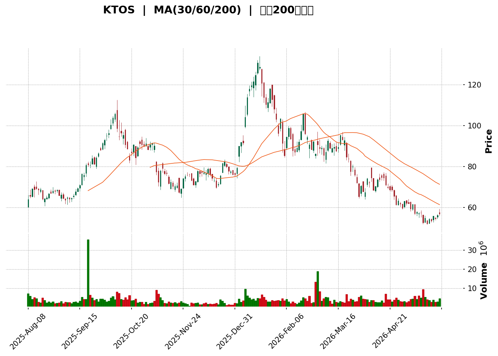
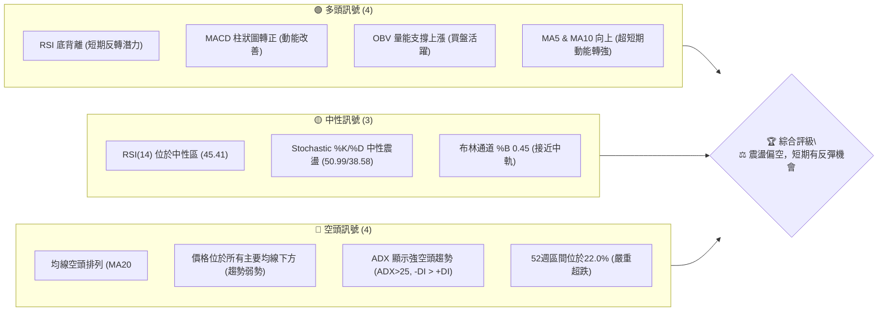
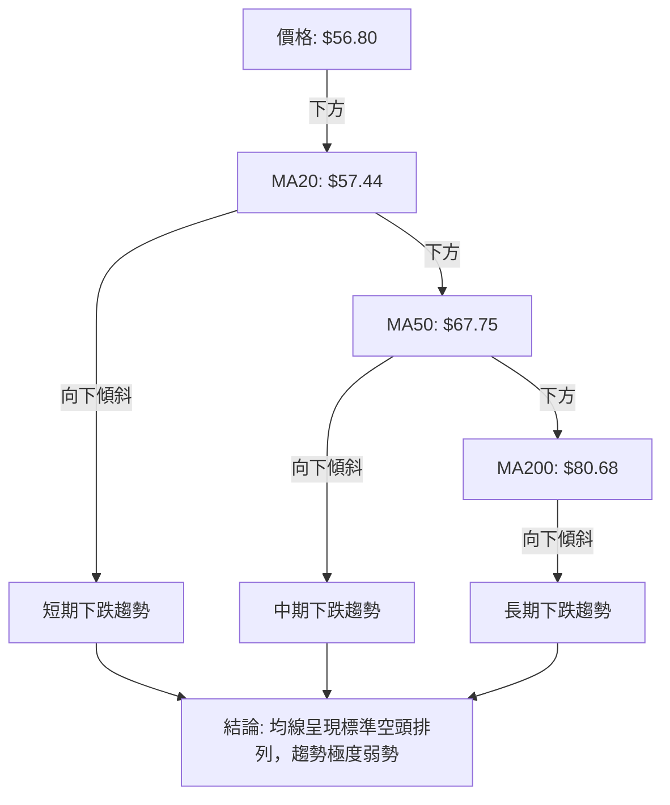

<details>
<summary>📊 靜態圖表 (點擊展開)</summary>

</details>

<html>
<head><meta charset="utf-8" /></head>
<body>
    <div>                        <script>window.PlotlyConfig = {MathJaxConfig: 'local'};</script>
        <script charset="utf-8" src="https://cdn.plot.ly/plotly-3.5.0.min.js" integrity="sha256-fHbNLP+GlIXN+efbQec78UkemUz3NJp7UmfGxC1tNxs=" crossorigin="anonymous"></script>                <div id="candlestick-chart" class="plotly-graph-div" style="height:500px; width:100%;"></div>            <script>                window.PLOTLYENV=window.PLOTLYENV || {};                                if (document.getElementById("candlestick-chart")) {                    Plotly.newPlot(                        "candlestick-chart",                        [{"close":{"dtype":"f8","bdata":"AAAA4KPwT0AAAACAPVpQQAAAAMD1SFFAAAAAAAAwUUAAAAAgrkdRQAAAAAAAIFFAAAAAIFwvUUAAAACgRwFQQAAAAKBHEVBAAAAAgOsxUEAAAACgcK1QQAAAAKCZuVBAAAAAQDMDUUAAAABA4fpQQAAAAOCjIFFAAAAAgMJ1UEAAAACAwoVQQAAAAAAAIFBAAAAAIIXLT0AAAAAA1zNQQAAAAMD1CFBAAAAAANcjUEAAAACAPWpQQAAAAEDh6lBAAAAAwMxMUUAAAAAgXK9RQAAAAGBmFlNAAAAAIFzvUkAAAACgmSlUQAAAAKBHMVRAAAAAgBQuVEAAAACgmflUQAAAACCFS1RAAAAAwMwMVUAAAACA65FVQAAAAMAeBVZAAAAAIK7XVkAAAACgcD1XQAAAAIDrwVdAAAAAACkMWEAAAAAAABBZQAAAAAAp7FlAAAAAQOFqWkAAAABAM6NYQAAAAOBRqFdAAAAAgOsRWEAAAABAM9NXQAAAAMAepVZAAAAAIK4nVkAAAAAgrsdUQAAAAKCZqVVAAAAAIK6nVkAAAABAMxNVQAAAAOB6VFZAAAAAIIXLVkAAAAAghatWQAAAAIDrcVZAAAAAoHDNVkAAAABAMxNWQAAAAGBmplZAAAAAYGbGVkAAAACAFI5WQAAAAIA9WlNAAAAAgD0aUkAAAADgUXhTQAAAACCFy1NAAAAAgMIlU0AAAADAzCxTQAAAAAAp7FFAAAAAwMwcUkAAAAAgXI9RQAAAAEAKl1FAAAAAQOGqUUAAAAAA19NQQAAAAMD1SFFAAAAAQAqHUkAAAABAM8NSQAAAAKBH8VJAAAAAYGYGU0AAAACgcE1SQAAAAKBwvVFAAAAAgOsxUkAAAAAghWtTQAAAAAAAIFNAAAAAgOtBU0AAAACA60FTQAAAAIA9OlNAAAAAgOuxU0AAAACgcP1SQAAAAOCjkFJAAAAA4FFIUkAAAACgR3FRQAAAAKCZ2VFAAAAAwPXYUkAAAACA62FUQAAAAEAzk1RAAAAAgBT+U0AAAADAzGxTQAAAAIAUXlNAAAAAYLj+UkAAAACAPfpSQAAAAGCP0lNAAAAAIIV7VkAAAAAghftWQAAAAAAp3FZAAAAAYI8CWkAAAADAzGxcQAAAAEAKd11AAAAAgBTuXUAAAAAAAGBeQAAAAADXI19AAAAAQApXYEAAAACAwhVgQAAAAIDCJV5AAAAAYGZ2XEAAAADA9ZhbQAAAAOB61FtAAAAAANeDXUAAAABA4SpcQAAAAIA9CltAAAAA4KPAWUAAAACAPQpYQAAAACCu11lAAAAAwB7VVkAAAAAAAFBVQAAAAIA9mldAAAAAANezWEAAAABguF5XQAAAAIDr8VVAAAAAQDPDVUAAAAAA10NWQAAAAIAU\u002flZAAAAAoHBNWEAAAABA4WpaQAAAAMAeBVhAAAAAANeTV0AAAAAghatWQAAAAGC4DlZAAAAAwPUIV0AAAAAghYtVQAAAAIAUrlZAAAAAwMw8VkAAAADgUUhWQAAAAGCPYlVAAAAAAADAVUAAAACAFB5XQAAAAKBwPVZAAAAAQOE6VkAAAACgcF1WQAAAAIDr4VVAAAAAgOthVkAAAAAA19NXQAAAAGCPQldAAAAAgOsxV0AAAAAgridVQAAAAAAp7FRAAAAAIFxfU0AAAABguP5TQAAAAEAK91JAAAAAACn8UUAAAACA61FQQAAAAOCjoFFAAAAAwMzsUEAAAAAA19NQQAAAAIDChVJAAAAAoHD9UUAAAACgcJ1SQAAAAMAeFVFAAAAAgMKVUUAAAABAM2NSQAAAAIA9alJAAAAAgD2qUkAAAACAPZpSQAAAACBcv1FAAAAAwB51UUAAAABAMyNRQAAAAEAKJ1FAAAAAoEdhUEAAAACgR6FOQAAAAOB6lE9AAAAA4HrUTkAAAAAgrsdNQAAAAGBmhk9AAAAAYGYGT0AAAABACvdOQAAAACCup01AAAAAYI\u002fCTkAAAAAAAIBMQAAAAIDr8UxAAAAAYLh+TEAAAACAPapMQAAAAGC4PkpAAAAAwMxsS0AAAAAghQtKQAAAAAApHEtAAAAAACm8SkAAAADA9ehLQAAAAIDCVUtAAAAAQAoXTEAAAABgZmZMQA=="},"high":{"dtype":"f8","bdata":"AAAA4FGIUEAAAAAghStRQAAAAAApXFFAAAAAQArHUUAAAADAzCxSQAAAAMD1WFFAAAAAQOFqUUAAAACgmRlRQAAAAADXI1BAAAAAgMJ1UEAAAABgj8JQQAAAAKBwLVFAAAAAgD16UUAAAAAgXC9RQAAAAOB6NFFAAAAAIFwfUUAAAACAPdpQQAAAAEDhylBAAAAAACkcUEAAAABgj1JQQAAAAAAAQFBAAAAAwB41UEAAAAAAALBQQAAAAMD1SFFAAAAAoHBtUUAAAAAA19NRQAAAACCuJ1NAAAAAgOtBU0AAAAAAKVxUQAAAAADXk1RAAAAA4FGoVEAAAABguF5VQAAAAAAAQFVAAAAA4FE4VUAAAACAwrVVQAAAAEDhalZAAAAAIK73VkAAAACgR2FXQAAAAKCZGVhAAAAAIK6HWEAAAAAAAMBZQAAAAKBwLVpAAAAAANeTWkAAAADgeiRcQAAAAKCZqVlAAAAAAABgWUAAAABgZkZYQAAAACBcn1hAAAAAgMIlV0AAAACgR6FVQAAAAIAULlZAAAAAQDOzVkAAAAAAAIBWQAAAAMDMfFZAAAAAIIU7V0AAAABgZqZXQAAAAMDMHFdAAAAAIK53V0AAAAAAAMBWQAAAAKCZCVdAAAAAgBTuVkAAAACAwuVWQAAAAAAAoFRAAAAAgBTeU0AAAABgZpZTQAAAAAAAgFRAAAAAIFy\u002fU0AAAABA4YpTQAAAAKCZ+VJAAAAAoEdxUkAAAADAzDxSQAAAAAAA0FFAAAAAIIULUkAAAABguJ5SQAAAAIDCVVFAAAAAACmcUkAAAAAghQtTQAAAAEDhSlNAAAAAIFwfU0AAAABgZiZTQAAAAGBmplJAAAAAAABAUkAAAADgepRTQAAAAOBRiFNAAAAA4HqEU0AAAACAPepTQAAAAKBwnVNAAAAAgBTeU0AAAACgmdlTQAAAAEDhGlNAAAAA4FGoUkAAAAAgXI9SQAAAAIA9GlJAAAAAYI\u002fyUkAAAAAgrndUQAAAAIA92lRAAAAAACl8VEAAAACAPfpTQAAAAIAUjlNAAAAAACmMU0AAAACAFD5TQAAAAGC47lNAAAAAQAqHVkAAAACA6wFXQAAAAOB61FdAAAAAQDNzW0AAAADAzNxcQAAAAOBR6F1AAAAA4HpkXkAAAACgcP1eQAAAAADXk19AAAAAAACAYEAAAAAAAMBgQAAAAAAAAGBAAAAAQDNTXkAAAACA6+FcQAAAAEDhalxAAAAAwPWIXUAAAAAAAABeQAAAAMDMzFxAAAAAAAAwW0AAAADA9UhZQAAAACBc31lAAAAAAADAWUAAAABgZiZXQAAAAEDhqldAAAAAgOvxWEAAAAAAAOBYQAAAAEAzI1hAAAAAgMJlVkAAAAAgXA9XQAAAAGBmVldAAAAAAAAgWUAAAACAPXpaQAAAAEDhqlpAAAAAwB7FV0AAAAAgXO9WQAAAAIDrUVdAAAAAACkcV0AAAACgmZlVQAAAAGBmRlhAAAAAgBROV0AAAABgZoZWQAAAACBcX1ZAAAAA4FG4VkAAAABA4WpXQAAAAEAzE1dAAAAAYLi+VkAAAAAgrtdWQAAAAKCZ+VZAAAAAQDPzVkAAAABgZtZXQAAAAOBROFhAAAAAAACgV0AAAAAAAABXQAAAAADXk1VAAAAAoEfBVEAAAAAAKTxUQAAAAIDr4VNAAAAA4FEYU0AAAACgmflRQAAAAIAUvlFAAAAAQDMzUkAAAADgo2BRQAAAAIA9mlJAAAAAoJk5UkAAAAAAKdxTQAAAAAAAoFJAAAAAgOuhUUAAAABgZoZSQAAAAOB6JFNAAAAAYI8SU0AAAACAFE5TQAAAAMD1OFNAAAAAoHDtUUAAAACgmblRQAAAAGC4vlFAAAAAIFwvUUAAAADgo3BQQAAAACCFG1BAAAAAoJlZT0AAAACgR+FOQAAAAEAKl09AAAAAAADAT0AAAADgUQhQQAAAAMAeZU9AAAAAYLjeTkAAAADAHsVOQAAAAOBR+ExAAAAAQOHaTEAAAADgo1BNQAAAAAAAQExAAAAAACn8S0AAAABAM\u002fNKQAAAAAApXEtAAAAAIIVLS0AAAADgo\u002fBLQAAAAADXg0tAAAAAAABgTEAAAABgZqZNQA=="},"hovertemplate":"\u003cb\u003e%{x|%Y-%m-%d}\u003c\u002fb\u003e\u003cbr\u003e\u958b: $%{open:.2f}\u003cbr\u003e\u9ad8: $%{high:.2f}\u003cbr\u003e\u4f4e: $%{low:.2f}\u003cbr\u003e\u6536: $%{close:.2f}\u003cextra\u003e\u003c\u002fextra\u003e","low":{"dtype":"f8","bdata":"AAAAYGYGTkAAAACAwiVQQAAAAEDhOlBAAAAAwPU4UEAAAAAAADBRQAAAAOBRiFBAAAAAYI\u002fCUEAAAACAFM5PQAAAAEDhWk5AAAAAANcDUEAAAABgjwJQQAAAACCut1BAAAAAAADAUEAAAAAAAKBQQAAAAKBH0VBAAAAAwPVoUEAAAABgj4JPQAAAAADXA1BAAAAAAADgTkAAAABAM7NOQAAAAIA9Kk9AAAAA4HpUT0AAAAAAKQxQQAAAAGBmZlBAAAAAoJnpUEAAAACgmflQQAAAAMAetVFAAAAAQApHUkAAAACgR8FSQAAAAKCZ+VNAAAAAQDPTU0AAAABgZkZUQAAAAGBmNlRAAAAAIK63U0AAAAAghRtVQAAAAEAz81VAAAAAYGYGVkAAAADgUShWQAAAAIDrIVdAAAAAQAp3V0AAAACgR4FYQAAAAAAAAFlAAAAAoJl5WUAAAABAMzNYQAAAAKCZOVdAAAAAQOGqV0AAAABgj7JWQAAAAIA9SlZAAAAAIFwfVkAAAACgcG1UQAAAAMDMTFVAAAAAwMxMVUAAAAAA1zNUQAAAACCuN1VAAAAAIIVLVkAAAADgoxBWQAAAAAApbFZAAAAAoHB9VkAAAABgjwJWQAAAAIA9+lVAAAAAwMz8VUAAAADgerRVQAAAAGBm9lJAAAAAoEeRUUAAAACgmSlRQAAAAEAzQ1NAAAAAwPX4UkAAAAAAAOBSQAAAAADX01FAAAAAAABAUUAAAABgZjZRQAAAAIDr8VBAAAAAQDNTUUAAAACAPbpQQAAAAEAzM1BAAAAAwPVIUUAAAACgmSlSQAAAAADX01JAAAAA4KPAUkAAAAAghTtSQAAAACCut1FAAAAAIIVrUUAAAACA6xFSQAAAAOCjsFJAAAAAoJnJUkAAAAAA1wNTQAAAAMDMTFJAAAAAQDOzUkAAAADAzMxSQAAAAGBmRlJAAAAAQOEaUkAAAAAA11NRQAAAAMD1iFFAAAAAYLjOUUAAAAAA1zNTQAAAAGBm9lNAAAAAgOvRU0AAAABgZgZTQAAAAKCZCVNAAAAAQDPzUkAAAADgUbhSQAAAAMAelVJAAAAA4FGIVEAAAADAzKxVQAAAAOCjoFZAAAAAoEexWEAAAACgmSlaQAAAAAAAoFxAAAAAwMxMXUAAAAAAAIBcQAAAAKBHUV1AAAAAAABAX0AAAAAAAMBfQAAAAIDrkVxAAAAAYLjOW0AAAABAChdbQAAAAKBHsVpAAAAAANfDW0AAAADgo1BbQAAAAIDChVpAAAAA4FFoWUAAAACgR7FXQAAAAKCZSVhAAAAAQOG6VUAAAAAAACBVQAAAAAAAAFZAAAAAwMxMV0AAAACgcE1XQAAAAKBHQVVAAAAAAABQVUAAAACgR8FVQAAAAOB6xFVAAAAAwMw8V0AAAABguD5YQAAAACCF21dAAAAAAADAVkAAAABgjwJVQAAAAKBwDVZAAAAAwPWoVUAAAAAAAABVQAAAAMAeVVVAAAAAYGamVUAAAAAAAHBVQAAAAKCZmVRAAAAAAABgVEAAAADAzMxVQAAAAMD1KFZAAAAAIK6nVUAAAADA9VhVQAAAAMDMzFVAAAAAoJm5VUAAAAAgXI9WQAAAAIA9KldAAAAAwPXoVUAAAABgZsZUQAAAAOB6hFRAAAAAoEfhUkAAAAAA11NTQAAAAKCZyVJAAAAAwMzsUUAAAAAgrhdQQAAAAEAzY1BAAAAAYGbmUEAAAAAghetPQAAAAMDMjFFAAAAAQDNzUUAAAABAMyNSQAAAAIDrEVFAAAAAIIXbUEAAAABACmdRQAAAAKBHIVJAAAAAAABQUkAAAADgo0BSQAAAAIA9mlFAAAAAQAo3UUAAAADgevRQQAAAAMD16FBAAAAAwB7lT0AAAACgR4FOQAAAAOBRmE5AAAAAACkcTkAAAAAgrodNQAAAAIDr0U1AAAAAoJl5TkAAAACgR+FOQAAAAKBHAU1AAAAAQAo3TUAAAADAHiVMQAAAAKBw3UtAAAAAoEeBS0AAAACAFI5LQAAAACCF60lAAAAAYLg+SkAAAADgetRJQAAAAIA9CkpAAAAAANdjSkAAAABAM1NKQAAAACCu50pAAAAAQOE6S0AAAABAM\u002fNLQA=="},"name":"\u50f9\u683c","open":{"dtype":"f8","bdata":"AAAAwPUITkAAAADAzHxQQAAAAOBRWFBAAAAAQOGKUUAAAADAzIxRQAAAAEAKR1FAAAAAACnsUEAAAAAgrhdRQAAAAKBwXU9AAAAAwPUIUEAAAAAAKSxQQAAAAIA96lBAAAAAAADAUEAAAACgRxFRQAAAAGCPAlFAAAAAIFwfUUAAAACAPRpQQAAAAIDrkVBAAAAAQDMTUEAAAAAAACBQQAAAAIDCNVBAAAAA4FEIUEAAAABgZlZQQAAAAIDChVBAAAAAIFzvUEAAAADAzFxRQAAAAADXw1FAAAAA4KPAUkAAAACgmSlTQAAAAKBHYVRAAAAAQAonVEAAAABgZkZUQAAAACCuF1VAAAAAAAAAVEAAAAAAAEBVQAAAAMDMPFZAAAAAwPUYVkAAAAAAAKBWQAAAAAAAwFdAAAAAACnsV0AAAABgZpZYQAAAAKCZSVlAAAAA4HrEWUAAAADA9ehaQAAAAMDMrFdAAAAAgBReWEAAAACAFG5XQAAAAMDMfFhAAAAAIFz\u002fVkAAAABA4TpVQAAAAIDr0VVAAAAAQArHVUAAAAAAAIBWQAAAAMDMTFVAAAAA4FEIV0AAAADgekRXQAAAAOB6xFZAAAAAAACAVkAAAAAAAIBWQAAAAAAAYFZAAAAAwB61VkAAAABguA5WQAAAACCul1RAAAAAwMx8U0AAAABAM5NRQAAAACCFW1RAAAAAYLhuU0AAAACA6zFTQAAAAAApvFJAAAAAgD1KUUAAAACAwgVSQAAAACBcL1FAAAAAwB5lUUAAAABguJ5SQAAAAADXs1BAAAAAQOFaUUAAAACAPYpSQAAAAEAz81JAAAAAYLgOU0AAAABgZiZTQAAAACCuh1JAAAAA4KPAUUAAAACgRyFSQAAAAAApbFNAAAAAgMJlU0AAAADgeiRTQAAAAAAAAFNAAAAAIFwvU0AAAAAghbtTQAAAAKBHEVNAAAAAAABAUkAAAADgUUhSQAAAAAApvFFAAAAAgOvhUUAAAAAAAEBTQAAAAIAUHlRAAAAAQApHVEAAAACAPfpTQAAAAKBwPVNAAAAAACmMU0AAAABAMzNTQAAAAEAzI1NAAAAAgD06VUAAAADA9XhWQAAAAOBRKFdAAAAAgOvhWEAAAABguF5aQAAAAGBmNl1AAAAAgD26XUAAAAAAAKBdQAAAAMD1+F1AAAAAoHBtX0AAAAAghQNgQAAAAGCP4l9AAAAA4KNAXkAAAADAHnVcQAAAAMDMLFtAAAAAANfDW0AAAAAAAABeQAAAAOBRuFxAAAAA4Hp0WkAAAACAPfpYQAAAAGBmplhAAAAAoHBdWUAAAACAFB5WQAAAAGBmRlZAAAAAYGamV0AAAADgerRYQAAAAIA9+ldAAAAAoJkZVkAAAAAgXM9VQAAAAMAeBVZAAAAAwPVIV0AAAACgcG1YQAAAAAApbFpAAAAAoEdRV0AAAAAAADBWQAAAAAApPFdAAAAAACn8VUAAAABAM1NVQAAAAEDhGldAAAAAoHBNVkAAAADgoyBWQAAAAGBmNlZAAAAA4FHYVEAAAABACvdVQAAAAAAp3FZAAAAAgOvBVUAAAAAAKTxWQAAAAAAAgFZAAAAAgMI1VkAAAABACrdWQAAAAIA9mldAAAAA4KOgVkAAAADAzNxWQAAAAIDC9VRAAAAAQOGqVEAAAABgj\u002fJTQAAAAOBRmFNAAAAAQAq3UkAAAADgo\u002fBRQAAAAKCZuVBAAAAAwPUoUkAAAACA61FQQAAAAOBRyFFAAAAAAAAQUkAAAADgUdhTQAAAAMDMjFJAAAAAoEcBUUAAAABgZoZRQAAAAIA9qlJAAAAAACnsUkAAAAAA1xNTQAAAACCF21JAAAAAYI+CUUAAAADgo5BRQAAAACCuh1FAAAAAwMwcUUAAAADgo3BQQAAAAOBRmE5AAAAA4FH4TkAAAABguN5OQAAAAMAeJU5AAAAA4Hq0T0AAAAAAKTxPQAAAAOBRWE9AAAAAgD2KTUAAAADAHsVOQAAAAIA9ikxAAAAAIFxvTEAAAAAghatMQAAAAOB6NExAAAAAoEdhSkAAAABguL5KQAAAAKBHIUpAAAAAYLgeS0AAAACgmflKQAAAAAAAgEtAAAAAwB6lS0AAAADA9chMQA=="},"x":["2025-08-08T00:00:00-04:00","2025-08-11T00:00:00-04:00","2025-08-12T00:00:00-04:00","2025-08-13T00:00:00-04:00","2025-08-14T00:00:00-04:00","2025-08-15T00:00:00-04:00","2025-08-18T00:00:00-04:00","2025-08-19T00:00:00-04:00","2025-08-20T00:00:00-04:00","2025-08-21T00:00:00-04:00","2025-08-22T00:00:00-04:00","2025-08-25T00:00:00-04:00","2025-08-26T00:00:00-04:00","2025-08-27T00:00:00-04:00","2025-08-28T00:00:00-04:00","2025-08-29T00:00:00-04:00","2025-09-02T00:00:00-04:00","2025-09-03T00:00:00-04:00","2025-09-04T00:00:00-04:00","2025-09-05T00:00:00-04:00","2025-09-08T00:00:00-04:00","2025-09-09T00:00:00-04:00","2025-09-10T00:00:00-04:00","2025-09-11T00:00:00-04:00","2025-09-12T00:00:00-04:00","2025-09-15T00:00:00-04:00","2025-09-16T00:00:00-04:00","2025-09-17T00:00:00-04:00","2025-09-18T00:00:00-04:00","2025-09-19T00:00:00-04:00","2025-09-22T00:00:00-04:00","2025-09-23T00:00:00-04:00","2025-09-24T00:00:00-04:00","2025-09-25T00:00:00-04:00","2025-09-26T00:00:00-04:00","2025-09-29T00:00:00-04:00","2025-09-30T00:00:00-04:00","2025-10-01T00:00:00-04:00","2025-10-02T00:00:00-04:00","2025-10-03T00:00:00-04:00","2025-10-06T00:00:00-04:00","2025-10-07T00:00:00-04:00","2025-10-08T00:00:00-04:00","2025-10-09T00:00:00-04:00","2025-10-10T00:00:00-04:00","2025-10-13T00:00:00-04:00","2025-10-14T00:00:00-04:00","2025-10-15T00:00:00-04:00","2025-10-16T00:00:00-04:00","2025-10-17T00:00:00-04:00","2025-10-20T00:00:00-04:00","2025-10-21T00:00:00-04:00","2025-10-22T00:00:00-04:00","2025-10-23T00:00:00-04:00","2025-10-24T00:00:00-04:00","2025-10-27T00:00:00-04:00","2025-10-28T00:00:00-04:00","2025-10-29T00:00:00-04:00","2025-10-30T00:00:00-04:00","2025-10-31T00:00:00-04:00","2025-11-03T00:00:00-05:00","2025-11-04T00:00:00-05:00","2025-11-05T00:00:00-05:00","2025-11-06T00:00:00-05:00","2025-11-07T00:00:00-05:00","2025-11-10T00:00:00-05:00","2025-11-11T00:00:00-05:00","2025-11-12T00:00:00-05:00","2025-11-13T00:00:00-05:00","2025-11-14T00:00:00-05:00","2025-11-17T00:00:00-05:00","2025-11-18T00:00:00-05:00","2025-11-19T00:00:00-05:00","2025-11-20T00:00:00-05:00","2025-11-21T00:00:00-05:00","2025-11-24T00:00:00-05:00","2025-11-25T00:00:00-05:00","2025-11-26T00:00:00-05:00","2025-11-28T00:00:00-05:00","2025-12-01T00:00:00-05:00","2025-12-02T00:00:00-05:00","2025-12-03T00:00:00-05:00","2025-12-04T00:00:00-05:00","2025-12-05T00:00:00-05:00","2025-12-08T00:00:00-05:00","2025-12-09T00:00:00-05:00","2025-12-10T00:00:00-05:00","2025-12-11T00:00:00-05:00","2025-12-12T00:00:00-05:00","2025-12-15T00:00:00-05:00","2025-12-16T00:00:00-05:00","2025-12-17T00:00:00-05:00","2025-12-18T00:00:00-05:00","2025-12-19T00:00:00-05:00","2025-12-22T00:00:00-05:00","2025-12-23T00:00:00-05:00","2025-12-24T00:00:00-05:00","2025-12-26T00:00:00-05:00","2025-12-29T00:00:00-05:00","2025-12-30T00:00:00-05:00","2025-12-31T00:00:00-05:00","2026-01-02T00:00:00-05:00","2026-01-05T00:00:00-05:00","2026-01-06T00:00:00-05:00","2026-01-07T00:00:00-05:00","2026-01-08T00:00:00-05:00","2026-01-09T00:00:00-05:00","2026-01-12T00:00:00-05:00","2026-01-13T00:00:00-05:00","2026-01-14T00:00:00-05:00","2026-01-15T00:00:00-05:00","2026-01-16T00:00:00-05:00","2026-01-20T00:00:00-05:00","2026-01-21T00:00:00-05:00","2026-01-22T00:00:00-05:00","2026-01-23T00:00:00-05:00","2026-01-26T00:00:00-05:00","2026-01-27T00:00:00-05:00","2026-01-28T00:00:00-05:00","2026-01-29T00:00:00-05:00","2026-01-30T00:00:00-05:00","2026-02-02T00:00:00-05:00","2026-02-03T00:00:00-05:00","2026-02-04T00:00:00-05:00","2026-02-05T00:00:00-05:00","2026-02-06T00:00:00-05:00","2026-02-09T00:00:00-05:00","2026-02-10T00:00:00-05:00","2026-02-11T00:00:00-05:00","2026-02-12T00:00:00-05:00","2026-02-13T00:00:00-05:00","2026-02-17T00:00:00-05:00","2026-02-18T00:00:00-05:00","2026-02-19T00:00:00-05:00","2026-02-20T00:00:00-05:00","2026-02-23T00:00:00-05:00","2026-02-24T00:00:00-05:00","2026-02-25T00:00:00-05:00","2026-02-26T00:00:00-05:00","2026-02-27T00:00:00-05:00","2026-03-02T00:00:00-05:00","2026-03-03T00:00:00-05:00","2026-03-04T00:00:00-05:00","2026-03-05T00:00:00-05:00","2026-03-06T00:00:00-05:00","2026-03-09T00:00:00-04:00","2026-03-10T00:00:00-04:00","2026-03-11T00:00:00-04:00","2026-03-12T00:00:00-04:00","2026-03-13T00:00:00-04:00","2026-03-16T00:00:00-04:00","2026-03-17T00:00:00-04:00","2026-03-18T00:00:00-04:00","2026-03-19T00:00:00-04:00","2026-03-20T00:00:00-04:00","2026-03-23T00:00:00-04:00","2026-03-24T00:00:00-04:00","2026-03-25T00:00:00-04:00","2026-03-26T00:00:00-04:00","2026-03-27T00:00:00-04:00","2026-03-30T00:00:00-04:00","2026-03-31T00:00:00-04:00","2026-04-01T00:00:00-04:00","2026-04-02T00:00:00-04:00","2026-04-06T00:00:00-04:00","2026-04-07T00:00:00-04:00","2026-04-08T00:00:00-04:00","2026-04-09T00:00:00-04:00","2026-04-10T00:00:00-04:00","2026-04-13T00:00:00-04:00","2026-04-14T00:00:00-04:00","2026-04-15T00:00:00-04:00","2026-04-16T00:00:00-04:00","2026-04-17T00:00:00-04:00","2026-04-20T00:00:00-04:00","2026-04-21T00:00:00-04:00","2026-04-22T00:00:00-04:00","2026-04-23T00:00:00-04:00","2026-04-24T00:00:00-04:00","2026-04-27T00:00:00-04:00","2026-04-28T00:00:00-04:00","2026-04-29T00:00:00-04:00","2026-04-30T00:00:00-04:00","2026-05-01T00:00:00-04:00","2026-05-04T00:00:00-04:00","2026-05-05T00:00:00-04:00","2026-05-06T00:00:00-04:00","2026-05-07T00:00:00-04:00","2026-05-08T00:00:00-04:00","2026-05-11T00:00:00-04:00","2026-05-12T00:00:00-04:00","2026-05-13T00:00:00-04:00","2026-05-14T00:00:00-04:00","2026-05-15T00:00:00-04:00","2026-05-18T00:00:00-04:00","2026-05-19T00:00:00-04:00","2026-05-20T00:00:00-04:00","2026-05-21T00:00:00-04:00","2026-05-22T00:00:00-04:00","2026-05-26T00:00:00-04:00"],"type":"candlestick"},{"hovertemplate":"MA30: $%{y:.2f}\u003cextra\u003e\u003c\u002fextra\u003e","line":{"color":"#2196F3","dash":"dash","width":2},"mode":"lines","name":"MA30","x":["2025-08-08T00:00:00-04:00","2025-08-11T00:00:00-04:00","2025-08-12T00:00:00-04:00","2025-08-13T00:00:00-04:00","2025-08-14T00:00:00-04:00","2025-08-15T00:00:00-04:00","2025-08-18T00:00:00-04:00","2025-08-19T00:00:00-04:00","2025-08-20T00:00:00-04:00","2025-08-21T00:00:00-04:00","2025-08-22T00:00:00-04:00","2025-08-25T00:00:00-04:00","2025-08-26T00:00:00-04:00","2025-08-27T00:00:00-04:00","2025-08-28T00:00:00-04:00","2025-08-29T00:00:00-04:00","2025-09-02T00:00:00-04:00","2025-09-03T00:00:00-04:00","2025-09-04T00:00:00-04:00","2025-09-05T00:00:00-04:00","2025-09-08T00:00:00-04:00","2025-09-09T00:00:00-04:00","2025-09-10T00:00:00-04:00","2025-09-11T00:00:00-04:00","2025-09-12T00:00:00-04:00","2025-09-15T00:00:00-04:00","2025-09-16T00:00:00-04:00","2025-09-17T00:00:00-04:00","2025-09-18T00:00:00-04:00","2025-09-19T00:00:00-04:00","2025-09-22T00:00:00-04:00","2025-09-23T00:00:00-04:00","2025-09-24T00:00:00-04:00","2025-09-25T00:00:00-04:00","2025-09-26T00:00:00-04:00","2025-09-29T00:00:00-04:00","2025-09-30T00:00:00-04:00","2025-10-01T00:00:00-04:00","2025-10-02T00:00:00-04:00","2025-10-03T00:00:00-04:00","2025-10-06T00:00:00-04:00","2025-10-07T00:00:00-04:00","2025-10-08T00:00:00-04:00","2025-10-09T00:00:00-04:00","2025-10-10T00:00:00-04:00","2025-10-13T00:00:00-04:00","2025-10-14T00:00:00-04:00","2025-10-15T00:00:00-04:00","2025-10-16T00:00:00-04:00","2025-10-17T00:00:00-04:00","2025-10-20T00:00:00-04:00","2025-10-21T00:00:00-04:00","2025-10-22T00:00:00-04:00","2025-10-23T00:00:00-04:00","2025-10-24T00:00:00-04:00","2025-10-27T00:00:00-04:00","2025-10-28T00:00:00-04:00","2025-10-29T00:00:00-04:00","2025-10-30T00:00:00-04:00","2025-10-31T00:00:00-04:00","2025-11-03T00:00:00-05:00","2025-11-04T00:00:00-05:00","2025-11-05T00:00:00-05:00","2025-11-06T00:00:00-05:00","2025-11-07T00:00:00-05:00","2025-11-10T00:00:00-05:00","2025-11-11T00:00:00-05:00","2025-11-12T00:00:00-05:00","2025-11-13T00:00:00-05:00","2025-11-14T00:00:00-05:00","2025-11-17T00:00:00-05:00","2025-11-18T00:00:00-05:00","2025-11-19T00:00:00-05:00","2025-11-20T00:00:00-05:00","2025-11-21T00:00:00-05:00","2025-11-24T00:00:00-05:00","2025-11-25T00:00:00-05:00","2025-11-26T00:00:00-05:00","2025-11-28T00:00:00-05:00","2025-12-01T00:00:00-05:00","2025-12-02T00:00:00-05:00","2025-12-03T00:00:00-05:00","2025-12-04T00:00:00-05:00","2025-12-05T00:00:00-05:00","2025-12-08T00:00:00-05:00","2025-12-09T00:00:00-05:00","2025-12-10T00:00:00-05:00","2025-12-11T00:00:00-05:00","2025-12-12T00:00:00-05:00","2025-12-15T00:00:00-05:00","2025-12-16T00:00:00-05:00","2025-12-17T00:00:00-05:00","2025-12-18T00:00:00-05:00","2025-12-19T00:00:00-05:00","2025-12-22T00:00:00-05:00","2025-12-23T00:00:00-05:00","2025-12-24T00:00:00-05:00","2025-12-26T00:00:00-05:00","2025-12-29T00:00:00-05:00","2025-12-30T00:00:00-05:00","2025-12-31T00:00:00-05:00","2026-01-02T00:00:00-05:00","2026-01-05T00:00:00-05:00","2026-01-06T00:00:00-05:00","2026-01-07T00:00:00-05:00","2026-01-08T00:00:00-05:00","2026-01-09T00:00:00-05:00","2026-01-12T00:00:00-05:00","2026-01-13T00:00:00-05:00","2026-01-14T00:00:00-05:00","2026-01-15T00:00:00-05:00","2026-01-16T00:00:00-05:00","2026-01-20T00:00:00-05:00","2026-01-21T00:00:00-05:00","2026-01-22T00:00:00-05:00","2026-01-23T00:00:00-05:00","2026-01-26T00:00:00-05:00","2026-01-27T00:00:00-05:00","2026-01-28T00:00:00-05:00","2026-01-29T00:00:00-05:00","2026-01-30T00:00:00-05:00","2026-02-02T00:00:00-05:00","2026-02-03T00:00:00-05:00","2026-02-04T00:00:00-05:00","2026-02-05T00:00:00-05:00","2026-02-06T00:00:00-05:00","2026-02-09T00:00:00-05:00","2026-02-10T00:00:00-05:00","2026-02-11T00:00:00-05:00","2026-02-12T00:00:00-05:00","2026-02-13T00:00:00-05:00","2026-02-17T00:00:00-05:00","2026-02-18T00:00:00-05:00","2026-02-19T00:00:00-05:00","2026-02-20T00:00:00-05:00","2026-02-23T00:00:00-05:00","2026-02-24T00:00:00-05:00","2026-02-25T00:00:00-05:00","2026-02-26T00:00:00-05:00","2026-02-27T00:00:00-05:00","2026-03-02T00:00:00-05:00","2026-03-03T00:00:00-05:00","2026-03-04T00:00:00-05:00","2026-03-05T00:00:00-05:00","2026-03-06T00:00:00-05:00","2026-03-09T00:00:00-04:00","2026-03-10T00:00:00-04:00","2026-03-11T00:00:00-04:00","2026-03-12T00:00:00-04:00","2026-03-13T00:00:00-04:00","2026-03-16T00:00:00-04:00","2026-03-17T00:00:00-04:00","2026-03-18T00:00:00-04:00","2026-03-19T00:00:00-04:00","2026-03-20T00:00:00-04:00","2026-03-23T00:00:00-04:00","2026-03-24T00:00:00-04:00","2026-03-25T00:00:00-04:00","2026-03-26T00:00:00-04:00","2026-03-27T00:00:00-04:00","2026-03-30T00:00:00-04:00","2026-03-31T00:00:00-04:00","2026-04-01T00:00:00-04:00","2026-04-02T00:00:00-04:00","2026-04-06T00:00:00-04:00","2026-04-07T00:00:00-04:00","2026-04-08T00:00:00-04:00","2026-04-09T00:00:00-04:00","2026-04-10T00:00:00-04:00","2026-04-13T00:00:00-04:00","2026-04-14T00:00:00-04:00","2026-04-15T00:00:00-04:00","2026-04-16T00:00:00-04:00","2026-04-17T00:00:00-04:00","2026-04-20T00:00:00-04:00","2026-04-21T00:00:00-04:00","2026-04-22T00:00:00-04:00","2026-04-23T00:00:00-04:00","2026-04-24T00:00:00-04:00","2026-04-27T00:00:00-04:00","2026-04-28T00:00:00-04:00","2026-04-29T00:00:00-04:00","2026-04-30T00:00:00-04:00","2026-05-01T00:00:00-04:00","2026-05-04T00:00:00-04:00","2026-05-05T00:00:00-04:00","2026-05-06T00:00:00-04:00","2026-05-07T00:00:00-04:00","2026-05-08T00:00:00-04:00","2026-05-11T00:00:00-04:00","2026-05-12T00:00:00-04:00","2026-05-13T00:00:00-04:00","2026-05-14T00:00:00-04:00","2026-05-15T00:00:00-04:00","2026-05-18T00:00:00-04:00","2026-05-19T00:00:00-04:00","2026-05-20T00:00:00-04:00","2026-05-21T00:00:00-04:00","2026-05-22T00:00:00-04:00","2026-05-26T00:00:00-04:00"],"y":{"dtype":"f8","bdata":"AAAAAAAA+H8AAAAAAAD4fwAAAAAAAPh\u002fAAAAAAAA+H8AAAAAAAD4fwAAAAAAAPh\u002fAAAAAAAA+H8AAAAAAAD4fwAAAAAAAPh\u002fAAAAAAAA+H8AAAAAAAD4fwAAAAAAAPh\u002fAAAAAAAA+H8AAAAAAAD4fwAAAAAAAPh\u002fAAAAAAAA+H8AAAAAAAD4fwAAAAAAAPh\u002fAAAAAAAA+H8AAAAAAAD4fwAAAAAAAPh\u002fAAAAAAAA+H8AAAAAAAD4fwAAAAAAAPh\u002fAAAAAAAA+H8AAAAAAAD4fwAAAAAAAPh\u002fAAAAAAAA+H8AAAAAAAD4f97d3R2wClFAiYiIAJ0uUUCamZkBD1ZRQLy7u3O+b1FA3t3dNbSQUUAzMzPbT7VRQN7d3SUV31FA3t3dJVwPUkB3d3c\u002fGU1SQHd3d0+4jlJAREREXLrRUkBERESsRxlTQDMzM+vDZ1NAvLu7cwW4U0DNzMyEXflTQM3MzIQWMVRAmpmZ0QZyVECJiIhgV7BUQBEREYn651RAERERQWAdVUBVVVX1b0RVQLy7u2t1dFVAiYiIqA2sVUBVVVWV0dNVQO\u002fu7l4BAlZAIiIiYuUwVkCJiIhIb1tWQKuqqtoVeFZAmpmZiRaZVkBVVVV1aKlWQDMzM\u002fNgvlZAAAAA0IXUVkAAAABgAeJWQERERHT22VZAvLu7i8\u002fAVkBmZmYG5K5WQAAAAHDnm1ZAVVVVlV98VkBERER0r1lWQERERLTkJ1ZA7+7ufj\u002f1VUCJiIgIOrVVQImIiGgfblVA3t3dvXQjVUCJiIiIz+BUQImIiJhuqlRAIiIi0iJ7VEDv7u6e709UQCIiImJXMFRAq6qqyqEVVEC8u7ubfQBUQGZmZsYE31NAERERwfW4U0CamZlZ1qpTQLy7u+t8j1NAIiIiIk1xU0CamZlpLlRTQN7d3a25OFNA3t3dPTUeU0BERET04QNTQDMzMyMG4VJA7+7uHrC6UkARERGxD49SQN7d3W09glJAd3d355iIUkCrqqpKYpBSQKuqqjoKl1JAmpmZKUCeUkC8u7tLYqBSQCIiIvK2rFJAzczMzD60UkARERFhV8BSQJqZmVlk01JAERER4Xr8UkDv7u6uADFTQFVVVXWTYFNAq6qqOm2gU0B3d3dH4fJTQImIiAisTFRA7+7uXrqpVEBmZmYmvxBVQFVVVeUXg1VAzczM3LL+VUCJiIiof2tWQM3MzKyOyVZA3t3dTRsYV0AAAABQRl9XQCIiIsKuqFdAAAAA4Hr8V0De3d1ty0pYQJqZmVkdk1hAERER0dvSWEB3d3dHKAtZQJqZmSlcT1lAd3d3h11xWUBVVVUlTXlZQCIiItIik1lAiYiI+FO7WUBVVVX1\u002fdxZQHd3d5f88llAmpmZSZoKWkAAAADwpyZaQImIiOi0QVpAIiIiwjxRWkARERGhjG5aQAAAALByeFpA7+7uzrBjWkAiIiLSlDJaQERERORe81lAiYiIiIi4WUCrqqoaL21ZQERERPT9JFlAZmZm9uHLWEBERERkgndYQLy7u2u8LFhA3t3dvXTzV0CJiIgIOs1XQN7d3X2GnVdAq6qqKlxfV0CamZlp2C1XQN7d3a3VAVdAzczMzBPlVkBVVVWVQ+NWQGZmZgY6zVZAq6qq6lHQVkCrqqra+c5WQN7d3U0buFZA3t3dvZ+KVkARERHx0m1WQImIiAhlVFZAVVVV9Sg0VkCJiIjobQFWQDMzM+Ol01VA3t3dfbGUVUARERHR20JVQHd3d1fyE1VAMzMzQ0TkVECrqqr6qcFUQM3MzOw1l1RAd3d3N7RoVEDe3d2Nwk1UQFVVVYVdKVRAd3d3R+EKVEAzMzMzeutTQFVVVfVvzFNAmpmZ2c6nU0B3d3dXx3RTQHd3d4ddSVNAIiIiAnIXU0BEREQMSdtSQHd3d8dLp1JAMzMzC9drUkB3d3fHkh9SQFVVVT2Y31FAAAAAkAmeUUC8u7vLoW1RQImIiBCfOVFAERERUY0XUUC8u7srh+ZQQHd3dycxwFBA3t3ddUygUEC8u7uzVo9QQBEREWHlaFBAERERkXtNUEAzMzNrAy1QQImIiMCfAlBA7+7uflu2T0BVVVWl02ZPQHd3d0eLLE9AmpmZySDwTkARERFRqahOQA=="},"type":"scatter"},{"hovertemplate":"MA60: $%{y:.2f}\u003cextra\u003e\u003c\u002fextra\u003e","line":{"color":"#9C27B0","dash":"dash","width":2},"mode":"lines","name":"MA60","x":["2025-08-08T00:00:00-04:00","2025-08-11T00:00:00-04:00","2025-08-12T00:00:00-04:00","2025-08-13T00:00:00-04:00","2025-08-14T00:00:00-04:00","2025-08-15T00:00:00-04:00","2025-08-18T00:00:00-04:00","2025-08-19T00:00:00-04:00","2025-08-20T00:00:00-04:00","2025-08-21T00:00:00-04:00","2025-08-22T00:00:00-04:00","2025-08-25T00:00:00-04:00","2025-08-26T00:00:00-04:00","2025-08-27T00:00:00-04:00","2025-08-28T00:00:00-04:00","2025-08-29T00:00:00-04:00","2025-09-02T00:00:00-04:00","2025-09-03T00:00:00-04:00","2025-09-04T00:00:00-04:00","2025-09-05T00:00:00-04:00","2025-09-08T00:00:00-04:00","2025-09-09T00:00:00-04:00","2025-09-10T00:00:00-04:00","2025-09-11T00:00:00-04:00","2025-09-12T00:00:00-04:00","2025-09-15T00:00:00-04:00","2025-09-16T00:00:00-04:00","2025-09-17T00:00:00-04:00","2025-09-18T00:00:00-04:00","2025-09-19T00:00:00-04:00","2025-09-22T00:00:00-04:00","2025-09-23T00:00:00-04:00","2025-09-24T00:00:00-04:00","2025-09-25T00:00:00-04:00","2025-09-26T00:00:00-04:00","2025-09-29T00:00:00-04:00","2025-09-30T00:00:00-04:00","2025-10-01T00:00:00-04:00","2025-10-02T00:00:00-04:00","2025-10-03T00:00:00-04:00","2025-10-06T00:00:00-04:00","2025-10-07T00:00:00-04:00","2025-10-08T00:00:00-04:00","2025-10-09T00:00:00-04:00","2025-10-10T00:00:00-04:00","2025-10-13T00:00:00-04:00","2025-10-14T00:00:00-04:00","2025-10-15T00:00:00-04:00","2025-10-16T00:00:00-04:00","2025-10-17T00:00:00-04:00","2025-10-20T00:00:00-04:00","2025-10-21T00:00:00-04:00","2025-10-22T00:00:00-04:00","2025-10-23T00:00:00-04:00","2025-10-24T00:00:00-04:00","2025-10-27T00:00:00-04:00","2025-10-28T00:00:00-04:00","2025-10-29T00:00:00-04:00","2025-10-30T00:00:00-04:00","2025-10-31T00:00:00-04:00","2025-11-03T00:00:00-05:00","2025-11-04T00:00:00-05:00","2025-11-05T00:00:00-05:00","2025-11-06T00:00:00-05:00","2025-11-07T00:00:00-05:00","2025-11-10T00:00:00-05:00","2025-11-11T00:00:00-05:00","2025-11-12T00:00:00-05:00","2025-11-13T00:00:00-05:00","2025-11-14T00:00:00-05:00","2025-11-17T00:00:00-05:00","2025-11-18T00:00:00-05:00","2025-11-19T00:00:00-05:00","2025-11-20T00:00:00-05:00","2025-11-21T00:00:00-05:00","2025-11-24T00:00:00-05:00","2025-11-25T00:00:00-05:00","2025-11-26T00:00:00-05:00","2025-11-28T00:00:00-05:00","2025-12-01T00:00:00-05:00","2025-12-02T00:00:00-05:00","2025-12-03T00:00:00-05:00","2025-12-04T00:00:00-05:00","2025-12-05T00:00:00-05:00","2025-12-08T00:00:00-05:00","2025-12-09T00:00:00-05:00","2025-12-10T00:00:00-05:00","2025-12-11T00:00:00-05:00","2025-12-12T00:00:00-05:00","2025-12-15T00:00:00-05:00","2025-12-16T00:00:00-05:00","2025-12-17T00:00:00-05:00","2025-12-18T00:00:00-05:00","2025-12-19T00:00:00-05:00","2025-12-22T00:00:00-05:00","2025-12-23T00:00:00-05:00","2025-12-24T00:00:00-05:00","2025-12-26T00:00:00-05:00","2025-12-29T00:00:00-05:00","2025-12-30T00:00:00-05:00","2025-12-31T00:00:00-05:00","2026-01-02T00:00:00-05:00","2026-01-05T00:00:00-05:00","2026-01-06T00:00:00-05:00","2026-01-07T00:00:00-05:00","2026-01-08T00:00:00-05:00","2026-01-09T00:00:00-05:00","2026-01-12T00:00:00-05:00","2026-01-13T00:00:00-05:00","2026-01-14T00:00:00-05:00","2026-01-15T00:00:00-05:00","2026-01-16T00:00:00-05:00","2026-01-20T00:00:00-05:00","2026-01-21T00:00:00-05:00","2026-01-22T00:00:00-05:00","2026-01-23T00:00:00-05:00","2026-01-26T00:00:00-05:00","2026-01-27T00:00:00-05:00","2026-01-28T00:00:00-05:00","2026-01-29T00:00:00-05:00","2026-01-30T00:00:00-05:00","2026-02-02T00:00:00-05:00","2026-02-03T00:00:00-05:00","2026-02-04T00:00:00-05:00","2026-02-05T00:00:00-05:00","2026-02-06T00:00:00-05:00","2026-02-09T00:00:00-05:00","2026-02-10T00:00:00-05:00","2026-02-11T00:00:00-05:00","2026-02-12T00:00:00-05:00","2026-02-13T00:00:00-05:00","2026-02-17T00:00:00-05:00","2026-02-18T00:00:00-05:00","2026-02-19T00:00:00-05:00","2026-02-20T00:00:00-05:00","2026-02-23T00:00:00-05:00","2026-02-24T00:00:00-05:00","2026-02-25T00:00:00-05:00","2026-02-26T00:00:00-05:00","2026-02-27T00:00:00-05:00","2026-03-02T00:00:00-05:00","2026-03-03T00:00:00-05:00","2026-03-04T00:00:00-05:00","2026-03-05T00:00:00-05:00","2026-03-06T00:00:00-05:00","2026-03-09T00:00:00-04:00","2026-03-10T00:00:00-04:00","2026-03-11T00:00:00-04:00","2026-03-12T00:00:00-04:00","2026-03-13T00:00:00-04:00","2026-03-16T00:00:00-04:00","2026-03-17T00:00:00-04:00","2026-03-18T00:00:00-04:00","2026-03-19T00:00:00-04:00","2026-03-20T00:00:00-04:00","2026-03-23T00:00:00-04:00","2026-03-24T00:00:00-04:00","2026-03-25T00:00:00-04:00","2026-03-26T00:00:00-04:00","2026-03-27T00:00:00-04:00","2026-03-30T00:00:00-04:00","2026-03-31T00:00:00-04:00","2026-04-01T00:00:00-04:00","2026-04-02T00:00:00-04:00","2026-04-06T00:00:00-04:00","2026-04-07T00:00:00-04:00","2026-04-08T00:00:00-04:00","2026-04-09T00:00:00-04:00","2026-04-10T00:00:00-04:00","2026-04-13T00:00:00-04:00","2026-04-14T00:00:00-04:00","2026-04-15T00:00:00-04:00","2026-04-16T00:00:00-04:00","2026-04-17T00:00:00-04:00","2026-04-20T00:00:00-04:00","2026-04-21T00:00:00-04:00","2026-04-22T00:00:00-04:00","2026-04-23T00:00:00-04:00","2026-04-24T00:00:00-04:00","2026-04-27T00:00:00-04:00","2026-04-28T00:00:00-04:00","2026-04-29T00:00:00-04:00","2026-04-30T00:00:00-04:00","2026-05-01T00:00:00-04:00","2026-05-04T00:00:00-04:00","2026-05-05T00:00:00-04:00","2026-05-06T00:00:00-04:00","2026-05-07T00:00:00-04:00","2026-05-08T00:00:00-04:00","2026-05-11T00:00:00-04:00","2026-05-12T00:00:00-04:00","2026-05-13T00:00:00-04:00","2026-05-14T00:00:00-04:00","2026-05-15T00:00:00-04:00","2026-05-18T00:00:00-04:00","2026-05-19T00:00:00-04:00","2026-05-20T00:00:00-04:00","2026-05-21T00:00:00-04:00","2026-05-22T00:00:00-04:00","2026-05-26T00:00:00-04:00"],"y":{"dtype":"f8","bdata":"AAAAAAAA+H8AAAAAAAD4fwAAAAAAAPh\u002fAAAAAAAA+H8AAAAAAAD4fwAAAAAAAPh\u002fAAAAAAAA+H8AAAAAAAD4fwAAAAAAAPh\u002fAAAAAAAA+H8AAAAAAAD4fwAAAAAAAPh\u002fAAAAAAAA+H8AAAAAAAD4fwAAAAAAAPh\u002fAAAAAAAA+H8AAAAAAAD4fwAAAAAAAPh\u002fAAAAAAAA+H8AAAAAAAD4fwAAAAAAAPh\u002fAAAAAAAA+H8AAAAAAAD4fwAAAAAAAPh\u002fAAAAAAAA+H8AAAAAAAD4fwAAAAAAAPh\u002fAAAAAAAA+H8AAAAAAAD4fwAAAAAAAPh\u002fAAAAAAAA+H8AAAAAAAD4fwAAAAAAAPh\u002fAAAAAAAA+H8AAAAAAAD4fwAAAAAAAPh\u002fAAAAAAAA+H8AAAAAAAD4fwAAAAAAAPh\u002fAAAAAAAA+H8AAAAAAAD4fwAAAAAAAPh\u002fAAAAAAAA+H8AAAAAAAD4fwAAAAAAAPh\u002fAAAAAAAA+H8AAAAAAAD4fwAAAAAAAPh\u002fAAAAAAAA+H8AAAAAAAD4fwAAAAAAAPh\u002fAAAAAAAA+H8AAAAAAAD4fwAAAAAAAPh\u002fAAAAAAAA+H8AAAAAAAD4fwAAAAAAAPh\u002fAAAAAAAA+H8AAAAAAAD4f4mIiIiI5FNAREREaJEBVEDNzMwwCBxUQAAAAHTaJFRAzczM4MEoVEDNzMzwGTJUQO\u002fu7kp+PVRAmpmZ3d1FVEDe3d1ZZFNUQN7d3YFOW1RAmpmZ7XxjVEBmZmbaQGdUQN7d3anxalRAzczMGL1tVECrqqqGFm1UQKuqqo7CbVRA3t3d0ZR2VEC8u7t\u002fI4BUQJqZmfUojFRA3t3dBYGZVECJiIjIdqJUQBERERm9qVRAzczMtIGyVEB3d3f3U79UQFVVVSW\u002fyFRAIiIiQhnRVEARERHZztdUQERERMRn2FRAvLu746XbVEDNzMw0pdZUQDMzM4uzz1RAd3d395rHVECJiIiIiLhUQBEREfEZrlRAmpmZObSkVECJiIgoo59UQFVVVdV4mVRAd3d330+NVEAAAADgCH1UQDMzM9NNalRA3t3dJb9UVEDNzMy0yDpUQBEREeHBIFRAd3d3z\u002fcPVEC8u7sb6AhUQO\u002fu7gaBBVRAZmZmBsgNVEAzMzNzaCFUQFVVVbWBPlRAzczMFK5fVEARERFhnohUQN7d3VUOsVRA7+7uTtTbVEAREREBKwtVQERERMyFLFVAAAAAOLREVUDNzMxcullVQAAAADi0cFVA7+7uDliNVUARERGxVqdVQGZmZr4RulVAAAAA+MXGVUBERET8G81VQLy7u8vM6FVAd3d3N\u002fv8VUAAAAC41wRWQGZmZoYWFVZAEREREcosVkCJiIggsD5WQM3MzMTZT1ZAMzMzi2xfVkCJiIiof3NWQBEREaGMilZAmpmZ0dumVkAAAACoxs9WQKuqqhKD7FZAzczMBA8CV0DNzMwMuxJXQGZmZnYFIFdAvLu7cyExV0CJiIgg9z5XQM3MzOwKVFdAmpmZaUplV0BmZmYGgXFXQERERIwle1dA3t3dBciFV0BEREQsQJZXQAAAAKAao1dAVVVVheutV0C8u7vrUbxXQLy7u4N5yldA7+7uzvfbV0BmZmbuNfdXQAAAABhLDlhAERERudcgWEAAAACAIyRYQAAAABCfJVhAMzMz2\u002fkiWEAzMzNzaCVYQAAAANCwI1hAd3d3n2EfWEBERETsChRYQN7d3WWtClhAAAAAIPfyV0ARERE5tNhXQLy7u4MyxldAERERifqjV0BmZmZmH3pXQImIiGhKRVdAAAAAYJ4QV0BERETUeN1WQM3MzLwtp1ZA7+7unmFrVkC8u7tLfjFWQImIiDCW\u002fFVAvLu7y6HNVUAAAACwAKFVQKuqqgJyc1VAZmZmFmc7VUDv7u66kARVQKuqqrqQ1FRAAAAAbHWoVEBmZmYua4FUQN7d3SFpVlRAVVVVvS03VEAzMzPTTR5UQDMzMy\u002fd+FNAd3d3hxbRU0BmZmYOLapTQAAAABhLilNAmpmZtTpqU0AiIiJOYkhTQCIiIqJFHlNAd3d3hxbxUkAiIiKe77dSQAAAAAxJi1JAVVVVAblfUkCrqqrmiTpSQERERMi9FlJAIiIiTmLwUUAzMzObC9FRQA=="},"type":"scatter"},{"hovertemplate":"MA200: $%{y:.2f}\u003cextra\u003e\u003c\u002fextra\u003e","line":{"color":"#FF6F00","dash":"solid","width":2},"mode":"lines","name":"MA200","x":["2025-08-08T00:00:00-04:00","2025-08-11T00:00:00-04:00","2025-08-12T00:00:00-04:00","2025-08-13T00:00:00-04:00","2025-08-14T00:00:00-04:00","2025-08-15T00:00:00-04:00","2025-08-18T00:00:00-04:00","2025-08-19T00:00:00-04:00","2025-08-20T00:00:00-04:00","2025-08-21T00:00:00-04:00","2025-08-22T00:00:00-04:00","2025-08-25T00:00:00-04:00","2025-08-26T00:00:00-04:00","2025-08-27T00:00:00-04:00","2025-08-28T00:00:00-04:00","2025-08-29T00:00:00-04:00","2025-09-02T00:00:00-04:00","2025-09-03T00:00:00-04:00","2025-09-04T00:00:00-04:00","2025-09-05T00:00:00-04:00","2025-09-08T00:00:00-04:00","2025-09-09T00:00:00-04:00","2025-09-10T00:00:00-04:00","2025-09-11T00:00:00-04:00","2025-09-12T00:00:00-04:00","2025-09-15T00:00:00-04:00","2025-09-16T00:00:00-04:00","2025-09-17T00:00:00-04:00","2025-09-18T00:00:00-04:00","2025-09-19T00:00:00-04:00","2025-09-22T00:00:00-04:00","2025-09-23T00:00:00-04:00","2025-09-24T00:00:00-04:00","2025-09-25T00:00:00-04:00","2025-09-26T00:00:00-04:00","2025-09-29T00:00:00-04:00","2025-09-30T00:00:00-04:00","2025-10-01T00:00:00-04:00","2025-10-02T00:00:00-04:00","2025-10-03T00:00:00-04:00","2025-10-06T00:00:00-04:00","2025-10-07T00:00:00-04:00","2025-10-08T00:00:00-04:00","2025-10-09T00:00:00-04:00","2025-10-10T00:00:00-04:00","2025-10-13T00:00:00-04:00","2025-10-14T00:00:00-04:00","2025-10-15T00:00:00-04:00","2025-10-16T00:00:00-04:00","2025-10-17T00:00:00-04:00","2025-10-20T00:00:00-04:00","2025-10-21T00:00:00-04:00","2025-10-22T00:00:00-04:00","2025-10-23T00:00:00-04:00","2025-10-24T00:00:00-04:00","2025-10-27T00:00:00-04:00","2025-10-28T00:00:00-04:00","2025-10-29T00:00:00-04:00","2025-10-30T00:00:00-04:00","2025-10-31T00:00:00-04:00","2025-11-03T00:00:00-05:00","2025-11-04T00:00:00-05:00","2025-11-05T00:00:00-05:00","2025-11-06T00:00:00-05:00","2025-11-07T00:00:00-05:00","2025-11-10T00:00:00-05:00","2025-11-11T00:00:00-05:00","2025-11-12T00:00:00-05:00","2025-11-13T00:00:00-05:00","2025-11-14T00:00:00-05:00","2025-11-17T00:00:00-05:00","2025-11-18T00:00:00-05:00","2025-11-19T00:00:00-05:00","2025-11-20T00:00:00-05:00","2025-11-21T00:00:00-05:00","2025-11-24T00:00:00-05:00","2025-11-25T00:00:00-05:00","2025-11-26T00:00:00-05:00","2025-11-28T00:00:00-05:00","2025-12-01T00:00:00-05:00","2025-12-02T00:00:00-05:00","2025-12-03T00:00:00-05:00","2025-12-04T00:00:00-05:00","2025-12-05T00:00:00-05:00","2025-12-08T00:00:00-05:00","2025-12-09T00:00:00-05:00","2025-12-10T00:00:00-05:00","2025-12-11T00:00:00-05:00","2025-12-12T00:00:00-05:00","2025-12-15T00:00:00-05:00","2025-12-16T00:00:00-05:00","2025-12-17T00:00:00-05:00","2025-12-18T00:00:00-05:00","2025-12-19T00:00:00-05:00","2025-12-22T00:00:00-05:00","2025-12-23T00:00:00-05:00","2025-12-24T00:00:00-05:00","2025-12-26T00:00:00-05:00","2025-12-29T00:00:00-05:00","2025-12-30T00:00:00-05:00","2025-12-31T00:00:00-05:00","2026-01-02T00:00:00-05:00","2026-01-05T00:00:00-05:00","2026-01-06T00:00:00-05:00","2026-01-07T00:00:00-05:00","2026-01-08T00:00:00-05:00","2026-01-09T00:00:00-05:00","2026-01-12T00:00:00-05:00","2026-01-13T00:00:00-05:00","2026-01-14T00:00:00-05:00","2026-01-15T00:00:00-05:00","2026-01-16T00:00:00-05:00","2026-01-20T00:00:00-05:00","2026-01-21T00:00:00-05:00","2026-01-22T00:00:00-05:00","2026-01-23T00:00:00-05:00","2026-01-26T00:00:00-05:00","2026-01-27T00:00:00-05:00","2026-01-28T00:00:00-05:00","2026-01-29T00:00:00-05:00","2026-01-30T00:00:00-05:00","2026-02-02T00:00:00-05:00","2026-02-03T00:00:00-05:00","2026-02-04T00:00:00-05:00","2026-02-05T00:00:00-05:00","2026-02-06T00:00:00-05:00","2026-02-09T00:00:00-05:00","2026-02-10T00:00:00-05:00","2026-02-11T00:00:00-05:00","2026-02-12T00:00:00-05:00","2026-02-13T00:00:00-05:00","2026-02-17T00:00:00-05:00","2026-02-18T00:00:00-05:00","2026-02-19T00:00:00-05:00","2026-02-20T00:00:00-05:00","2026-02-23T00:00:00-05:00","2026-02-24T00:00:00-05:00","2026-02-25T00:00:00-05:00","2026-02-26T00:00:00-05:00","2026-02-27T00:00:00-05:00","2026-03-02T00:00:00-05:00","2026-03-03T00:00:00-05:00","2026-03-04T00:00:00-05:00","2026-03-05T00:00:00-05:00","2026-03-06T00:00:00-05:00","2026-03-09T00:00:00-04:00","2026-03-10T00:00:00-04:00","2026-03-11T00:00:00-04:00","2026-03-12T00:00:00-04:00","2026-03-13T00:00:00-04:00","2026-03-16T00:00:00-04:00","2026-03-17T00:00:00-04:00","2026-03-18T00:00:00-04:00","2026-03-19T00:00:00-04:00","2026-03-20T00:00:00-04:00","2026-03-23T00:00:00-04:00","2026-03-24T00:00:00-04:00","2026-03-25T00:00:00-04:00","2026-03-26T00:00:00-04:00","2026-03-27T00:00:00-04:00","2026-03-30T00:00:00-04:00","2026-03-31T00:00:00-04:00","2026-04-01T00:00:00-04:00","2026-04-02T00:00:00-04:00","2026-04-06T00:00:00-04:00","2026-04-07T00:00:00-04:00","2026-04-08T00:00:00-04:00","2026-04-09T00:00:00-04:00","2026-04-10T00:00:00-04:00","2026-04-13T00:00:00-04:00","2026-04-14T00:00:00-04:00","2026-04-15T00:00:00-04:00","2026-04-16T00:00:00-04:00","2026-04-17T00:00:00-04:00","2026-04-20T00:00:00-04:00","2026-04-21T00:00:00-04:00","2026-04-22T00:00:00-04:00","2026-04-23T00:00:00-04:00","2026-04-24T00:00:00-04:00","2026-04-27T00:00:00-04:00","2026-04-28T00:00:00-04:00","2026-04-29T00:00:00-04:00","2026-04-30T00:00:00-04:00","2026-05-01T00:00:00-04:00","2026-05-04T00:00:00-04:00","2026-05-05T00:00:00-04:00","2026-05-06T00:00:00-04:00","2026-05-07T00:00:00-04:00","2026-05-08T00:00:00-04:00","2026-05-11T00:00:00-04:00","2026-05-12T00:00:00-04:00","2026-05-13T00:00:00-04:00","2026-05-14T00:00:00-04:00","2026-05-15T00:00:00-04:00","2026-05-18T00:00:00-04:00","2026-05-19T00:00:00-04:00","2026-05-20T00:00:00-04:00","2026-05-21T00:00:00-04:00","2026-05-22T00:00:00-04:00","2026-05-26T00:00:00-04:00"],"y":{"dtype":"f8","bdata":"AAAAAAAA+H8AAAAAAAD4fwAAAAAAAPh\u002fAAAAAAAA+H8AAAAAAAD4fwAAAAAAAPh\u002fAAAAAAAA+H8AAAAAAAD4fwAAAAAAAPh\u002fAAAAAAAA+H8AAAAAAAD4fwAAAAAAAPh\u002fAAAAAAAA+H8AAAAAAAD4fwAAAAAAAPh\u002fAAAAAAAA+H8AAAAAAAD4fwAAAAAAAPh\u002fAAAAAAAA+H8AAAAAAAD4fwAAAAAAAPh\u002fAAAAAAAA+H8AAAAAAAD4fwAAAAAAAPh\u002fAAAAAAAA+H8AAAAAAAD4fwAAAAAAAPh\u002fAAAAAAAA+H8AAAAAAAD4fwAAAAAAAPh\u002fAAAAAAAA+H8AAAAAAAD4fwAAAAAAAPh\u002fAAAAAAAA+H8AAAAAAAD4fwAAAAAAAPh\u002fAAAAAAAA+H8AAAAAAAD4fwAAAAAAAPh\u002fAAAAAAAA+H8AAAAAAAD4fwAAAAAAAPh\u002fAAAAAAAA+H8AAAAAAAD4fwAAAAAAAPh\u002fAAAAAAAA+H8AAAAAAAD4fwAAAAAAAPh\u002fAAAAAAAA+H8AAAAAAAD4fwAAAAAAAPh\u002fAAAAAAAA+H8AAAAAAAD4fwAAAAAAAPh\u002fAAAAAAAA+H8AAAAAAAD4fwAAAAAAAPh\u002fAAAAAAAA+H8AAAAAAAD4fwAAAAAAAPh\u002fAAAAAAAA+H8AAAAAAAD4fwAAAAAAAPh\u002fAAAAAAAA+H8AAAAAAAD4fwAAAAAAAPh\u002fAAAAAAAA+H8AAAAAAAD4fwAAAAAAAPh\u002fAAAAAAAA+H8AAAAAAAD4fwAAAAAAAPh\u002fAAAAAAAA+H8AAAAAAAD4fwAAAAAAAPh\u002fAAAAAAAA+H8AAAAAAAD4fwAAAAAAAPh\u002fAAAAAAAA+H8AAAAAAAD4fwAAAAAAAPh\u002fAAAAAAAA+H8AAAAAAAD4fwAAAAAAAPh\u002fAAAAAAAA+H8AAAAAAAD4fwAAAAAAAPh\u002fAAAAAAAA+H8AAAAAAAD4fwAAAAAAAPh\u002fAAAAAAAA+H8AAAAAAAD4fwAAAAAAAPh\u002fAAAAAAAA+H8AAAAAAAD4fwAAAAAAAPh\u002fAAAAAAAA+H8AAAAAAAD4fwAAAAAAAPh\u002fAAAAAAAA+H8AAAAAAAD4fwAAAAAAAPh\u002fAAAAAAAA+H8AAAAAAAD4fwAAAAAAAPh\u002fAAAAAAAA+H8AAAAAAAD4fwAAAAAAAPh\u002fAAAAAAAA+H8AAAAAAAD4fwAAAAAAAPh\u002fAAAAAAAA+H8AAAAAAAD4fwAAAAAAAPh\u002fAAAAAAAA+H8AAAAAAAD4fwAAAAAAAPh\u002fAAAAAAAA+H8AAAAAAAD4fwAAAAAAAPh\u002fAAAAAAAA+H8AAAAAAAD4fwAAAAAAAPh\u002fAAAAAAAA+H8AAAAAAAD4fwAAAAAAAPh\u002fAAAAAAAA+H8AAAAAAAD4fwAAAAAAAPh\u002fAAAAAAAA+H8AAAAAAAD4fwAAAAAAAPh\u002fAAAAAAAA+H8AAAAAAAD4fwAAAAAAAPh\u002fAAAAAAAA+H8AAAAAAAD4fwAAAAAAAPh\u002fAAAAAAAA+H8AAAAAAAD4fwAAAAAAAPh\u002fAAAAAAAA+H8AAAAAAAD4fwAAAAAAAPh\u002fAAAAAAAA+H8AAAAAAAD4fwAAAAAAAPh\u002fAAAAAAAA+H8AAAAAAAD4fwAAAAAAAPh\u002fAAAAAAAA+H8AAAAAAAD4fwAAAAAAAPh\u002fAAAAAAAA+H8AAAAAAAD4fwAAAAAAAPh\u002fAAAAAAAA+H8AAAAAAAD4fwAAAAAAAPh\u002fAAAAAAAA+H8AAAAAAAD4fwAAAAAAAPh\u002fAAAAAAAA+H8AAAAAAAD4fwAAAAAAAPh\u002fAAAAAAAA+H8AAAAAAAD4fwAAAAAAAPh\u002fAAAAAAAA+H8AAAAAAAD4fwAAAAAAAPh\u002fAAAAAAAA+H8AAAAAAAD4fwAAAAAAAPh\u002fAAAAAAAA+H8AAAAAAAD4fwAAAAAAAPh\u002fAAAAAAAA+H8AAAAAAAD4fwAAAAAAAPh\u002fAAAAAAAA+H8AAAAAAAD4fwAAAAAAAPh\u002fAAAAAAAA+H8AAAAAAAD4fwAAAAAAAPh\u002fAAAAAAAA+H8AAAAAAAD4fwAAAAAAAPh\u002fAAAAAAAA+H8AAAAAAAD4fwAAAAAAAPh\u002fAAAAAAAA+H8AAAAAAAD4fwAAAAAAAPh\u002fAAAAAAAA+H8AAAAAAAD4fwAAAAAAAPh\u002fAAAAAAAA+H9I4XrAyitUQA=="},"type":"scatter"}],                        {"template":{"data":{"barpolar":[{"marker":{"line":{"color":"rgb(17,17,17)","width":0.5},"pattern":{"fillmode":"overlay","size":10,"solidity":0.2}},"type":"barpolar"}],"bar":[{"error_x":{"color":"#f2f5fa"},"error_y":{"color":"#f2f5fa"},"marker":{"line":{"color":"rgb(17,17,17)","width":0.5},"pattern":{"fillmode":"overlay","size":10,"solidity":0.2}},"type":"bar"}],"carpet":[{"aaxis":{"endlinecolor":"#A2B1C6","gridcolor":"#506784","linecolor":"#506784","minorgridcolor":"#506784","startlinecolor":"#A2B1C6"},"baxis":{"endlinecolor":"#A2B1C6","gridcolor":"#506784","linecolor":"#506784","minorgridcolor":"#506784","startlinecolor":"#A2B1C6"},"type":"carpet"}],"choropleth":[{"colorbar":{"outlinewidth":0,"ticks":""},"type":"choropleth"}],"contourcarpet":[{"colorbar":{"outlinewidth":0,"ticks":""},"type":"contourcarpet"}],"contour":[{"colorbar":{"outlinewidth":0,"ticks":""},"colorscale":[[0.0,"#0d0887"],[0.1111111111111111,"#46039f"],[0.2222222222222222,"#7201a8"],[0.3333333333333333,"#9c179e"],[0.4444444444444444,"#bd3786"],[0.5555555555555556,"#d8576b"],[0.6666666666666666,"#ed7953"],[0.7777777777777778,"#fb9f3a"],[0.8888888888888888,"#fdca26"],[1.0,"#f0f921"]],"type":"contour"}],"heatmap":[{"colorbar":{"outlinewidth":0,"ticks":""},"colorscale":[[0.0,"#0d0887"],[0.1111111111111111,"#46039f"],[0.2222222222222222,"#7201a8"],[0.3333333333333333,"#9c179e"],[0.4444444444444444,"#bd3786"],[0.5555555555555556,"#d8576b"],[0.6666666666666666,"#ed7953"],[0.7777777777777778,"#fb9f3a"],[0.8888888888888888,"#fdca26"],[1.0,"#f0f921"]],"type":"heatmap"}],"histogram2dcontour":[{"colorbar":{"outlinewidth":0,"ticks":""},"colorscale":[[0.0,"#0d0887"],[0.1111111111111111,"#46039f"],[0.2222222222222222,"#7201a8"],[0.3333333333333333,"#9c179e"],[0.4444444444444444,"#bd3786"],[0.5555555555555556,"#d8576b"],[0.6666666666666666,"#ed7953"],[0.7777777777777778,"#fb9f3a"],[0.8888888888888888,"#fdca26"],[1.0,"#f0f921"]],"type":"histogram2dcontour"}],"histogram2d":[{"colorbar":{"outlinewidth":0,"ticks":""},"colorscale":[[0.0,"#0d0887"],[0.1111111111111111,"#46039f"],[0.2222222222222222,"#7201a8"],[0.3333333333333333,"#9c179e"],[0.4444444444444444,"#bd3786"],[0.5555555555555556,"#d8576b"],[0.6666666666666666,"#ed7953"],[0.7777777777777778,"#fb9f3a"],[0.8888888888888888,"#fdca26"],[1.0,"#f0f921"]],"type":"histogram2d"}],"histogram":[{"marker":{"pattern":{"fillmode":"overlay","size":10,"solidity":0.2}},"type":"histogram"}],"mesh3d":[{"colorbar":{"outlinewidth":0,"ticks":""},"type":"mesh3d"}],"parcoords":[{"line":{"colorbar":{"outlinewidth":0,"ticks":""}},"type":"parcoords"}],"pie":[{"automargin":true,"type":"pie"}],"scatter3d":[{"line":{"colorbar":{"outlinewidth":0,"ticks":""}},"marker":{"colorbar":{"outlinewidth":0,"ticks":""}},"type":"scatter3d"}],"scattercarpet":[{"marker":{"colorbar":{"outlinewidth":0,"ticks":""}},"type":"scattercarpet"}],"scattergeo":[{"marker":{"colorbar":{"outlinewidth":0,"ticks":""}},"type":"scattergeo"}],"scattergl":[{"marker":{"line":{"color":"#283442"}},"type":"scattergl"}],"scattermapbox":[{"marker":{"colorbar":{"outlinewidth":0,"ticks":""}},"type":"scattermapbox"}],"scattermap":[{"marker":{"colorbar":{"outlinewidth":0,"ticks":""}},"type":"scattermap"}],"scatterpolargl":[{"marker":{"colorbar":{"outlinewidth":0,"ticks":""}},"type":"scatterpolargl"}],"scatterpolar":[{"marker":{"colorbar":{"outlinewidth":0,"ticks":""}},"type":"scatterpolar"}],"scatter":[{"marker":{"line":{"color":"#283442"}},"type":"scatter"}],"scatterternary":[{"marker":{"colorbar":{"outlinewidth":0,"ticks":""}},"type":"scatterternary"}],"surface":[{"colorbar":{"outlinewidth":0,"ticks":""},"colorscale":[[0.0,"#0d0887"],[0.1111111111111111,"#46039f"],[0.2222222222222222,"#7201a8"],[0.3333333333333333,"#9c179e"],[0.4444444444444444,"#bd3786"],[0.5555555555555556,"#d8576b"],[0.6666666666666666,"#ed7953"],[0.7777777777777778,"#fb9f3a"],[0.8888888888888888,"#fdca26"],[1.0,"#f0f921"]],"type":"surface"}],"table":[{"cells":{"fill":{"color":"#506784"},"line":{"color":"rgb(17,17,17)"}},"header":{"fill":{"color":"#2a3f5f"},"line":{"color":"rgb(17,17,17)"}},"type":"table"}]},"layout":{"annotationdefaults":{"arrowcolor":"#f2f5fa","arrowhead":0,"arrowwidth":1},"autotypenumbers":"strict","coloraxis":{"colorbar":{"outlinewidth":0,"ticks":""}},"colorscale":{"diverging":[[0,"#8e0152"],[0.1,"#c51b7d"],[0.2,"#de77ae"],[0.3,"#f1b6da"],[0.4,"#fde0ef"],[0.5,"#f7f7f7"],[0.6,"#e6f5d0"],[0.7,"#b8e186"],[0.8,"#7fbc41"],[0.9,"#4d9221"],[1,"#276419"]],"sequential":[[0.0,"#0d0887"],[0.1111111111111111,"#46039f"],[0.2222222222222222,"#7201a8"],[0.3333333333333333,"#9c179e"],[0.4444444444444444,"#bd3786"],[0.5555555555555556,"#d8576b"],[0.6666666666666666,"#ed7953"],[0.7777777777777778,"#fb9f3a"],[0.8888888888888888,"#fdca26"],[1.0,"#f0f921"]],"sequentialminus":[[0.0,"#0d0887"],[0.1111111111111111,"#46039f"],[0.2222222222222222,"#7201a8"],[0.3333333333333333,"#9c179e"],[0.4444444444444444,"#bd3786"],[0.5555555555555556,"#d8576b"],[0.6666666666666666,"#ed7953"],[0.7777777777777778,"#fb9f3a"],[0.8888888888888888,"#fdca26"],[1.0,"#f0f921"]]},"colorway":["#636efa","#EF553B","#00cc96","#ab63fa","#FFA15A","#19d3f3","#FF6692","#B6E880","#FF97FF","#FECB52"],"font":{"color":"#f2f5fa"},"geo":{"bgcolor":"rgb(17,17,17)","lakecolor":"rgb(17,17,17)","landcolor":"rgb(17,17,17)","showlakes":true,"showland":true,"subunitcolor":"#506784"},"hoverlabel":{"align":"left"},"hovermode":"closest","mapbox":{"style":"dark"},"paper_bgcolor":"rgb(17,17,17)","plot_bgcolor":"rgb(17,17,17)","polar":{"angularaxis":{"gridcolor":"#506784","linecolor":"#506784","ticks":""},"bgcolor":"rgb(17,17,17)","radialaxis":{"gridcolor":"#506784","linecolor":"#506784","ticks":""}},"scene":{"xaxis":{"backgroundcolor":"rgb(17,17,17)","gridcolor":"#506784","gridwidth":2,"linecolor":"#506784","showbackground":true,"ticks":"","zerolinecolor":"#C8D4E3"},"yaxis":{"backgroundcolor":"rgb(17,17,17)","gridcolor":"#506784","gridwidth":2,"linecolor":"#506784","showbackground":true,"ticks":"","zerolinecolor":"#C8D4E3"},"zaxis":{"backgroundcolor":"rgb(17,17,17)","gridcolor":"#506784","gridwidth":2,"linecolor":"#506784","showbackground":true,"ticks":"","zerolinecolor":"#C8D4E3"}},"shapedefaults":{"line":{"color":"#f2f5fa"}},"sliderdefaults":{"bgcolor":"#C8D4E3","bordercolor":"rgb(17,17,17)","borderwidth":1,"tickwidth":0},"ternary":{"aaxis":{"gridcolor":"#506784","linecolor":"#506784","ticks":""},"baxis":{"gridcolor":"#506784","linecolor":"#506784","ticks":""},"bgcolor":"rgb(17,17,17)","caxis":{"gridcolor":"#506784","linecolor":"#506784","ticks":""}},"title":{"x":0.05},"updatemenudefaults":{"bgcolor":"#506784","borderwidth":0},"xaxis":{"automargin":true,"gridcolor":"#283442","linecolor":"#506784","ticks":"","title":{"standoff":15},"zerolinecolor":"#283442","zerolinewidth":2},"yaxis":{"automargin":true,"gridcolor":"#283442","linecolor":"#506784","ticks":"","title":{"standoff":15},"zerolinecolor":"#283442","zerolinewidth":2}}},"xaxis":{"rangeslider":{"visible":false},"title":{"text":"\u65e5\u671f"}},"font":{"size":11},"title":{"text":"KTOS  |  MA(30\u002f60\u002f200)  |  \u6700\u8fd1200\u4ea4\u6613\u65e5"},"yaxis":{"title":{"text":"\u80a1\u50f9 (USD)"}},"hovermode":"x unified","height":500},                        {"responsive": true}                    )                };            </script>        </div>
</body>
</html>

# KTOS 技術分析報告

> **報告日期**：2026-05-27 ｜ **語言**：繁體中文 ｜ **數據來源**：Yahoo Finance ｜ **當前價格**：$56.80

---

## 目錄

| 章節 | 內容 |
|------|------|
| [1. 技術面概覽](#1-技術面概覽) | 訊號儀表板、核心指標、評分卡 |
| [2. 趨勢分析](#2-趨勢分析) | 多時框趨勢、長中短期走勢 |
| [3. 圖表形態分析](#3-圖表形態分析) | 形態識別、K線組合、目標價 |
| [4. 支撐與阻力](#4-支撐與阻力) | 關鍵價位、斐波那契回調 |
| [5. 技術指標深度解讀](#5-技術指標深度解讀) | MA/RSI/MACD/布林/成交量 |
| [6. 動能與波動率](#6-動能與波動率) | 動能評估、ATR、Beta |
| [7. 多時框架總結](#7-多時框架總結) | 時框架評分矩陣 |
| [8. 交易策略建議](#8-交易策略建議) | 多空策略、風險報酬比 |
| [9. 風險提示與監控](#9-風險提示與監控) | 監控指標、風險場景 |
| [10. 報告總結](#10-報告總結) | 綜合評級與關鍵結論 |

---

## 1. 技術面概覽

本章節旨在提供 KTOS 當前技術狀況的全面速覽，透過視覺化儀表板、核心指標彙總與專業評分卡，快速掌握其多空訊號分佈與整體技術強度。

### 🎯 技術訊號儀表板

KTOS 當前技術訊號呈現多空交織的複雜局面。儘管長期趨勢仍處於空頭排列，但短期動能指標已展現出潛在的築底與反彈跡象，值得密切關注。



**儀表板解讀**：
多頭訊號主要來自短期動能指標的改善，特別是RSI底背離和MACD柱狀圖轉正，暗示市場賣壓可能暫歇，買盤力量正在積聚。OBV的正面趨勢也為此提供了量能上的支持。然而，不容忽視的是，空頭訊號依然強勁，尤其體現在長週期均線的空頭排列以及ADX所指示的強烈空頭趨勢。這表明儘管短期存在反彈空間，但整體市場結構仍然偏弱，任何反彈都可能面臨來自上方均線的強大阻力。中性訊號則反映了市場在多空拉鋸下的猶豫狀態。

### 📊 核心指標速覽表

下表彙整了 KTOS 當前最關鍵的技術指標，提供精確數值與初步判斷。

| 指標類別 | 指標名稱 | 當前數值 | 訊號 | 解讀 |
|----------|----------|----------|------|------|
| **價格** | 當前收盤價 | $56.80 | 🟡 | 位於52週高點 $134.00 和低點 $34.97 之間的 22.0% 區間，處於相對低位。 |
| **均線** | MA20 | $57.44 | 🔴 | 價格 $56.80 位於 MA20 下方，且 MA20 趨勢向下，顯示短期賣壓。 |
| **均線** | MA50 | $67.75 | 🔴 | 價格 $56.80 位於 MA50 下方，且 MA50 趨勢向下，顯示中期趨勢疲軟。 |
| **均線** | MA200 | $80.68 | 🔴 | 價格 $56.80 位於 MA200 下方，且 MA200 趨勢向下，顯示長期趨勢空頭。 |
| **動能** | RSI(14) | 45.41 | 🟡 | 位於 30-70 的中性區間，但已從超賣區回升，且存在底背離，暗示動能正在改善。 |
| **動能** | MACD | -3.733 | 🟢 | MACD 線 -3.733 高於 Signal 線 -4.457，MACD 柱狀圖 +0.724 轉正，顯示短期多頭動能增強。 |
| **趨勢** | ADX(14) | 30.91 | 🔴 | ADX 超過 25，顯示存在強趨勢。但 -DI (21.31) > +DI (19.17)，表明為強烈的空頭趨勢。 |
| **波動** | ATR(14) | $3.19 | 🟡 | 佔價格 5.62%，顯示每日波動性中等偏高，交易風險相對較大。 |
| **成交量** | 量比(20日) | 1.11x | 🟢 | 最新成交量 (4,733,582) 高於 20 日均量 (4,259,029)，顯示買盤活躍度增加。 |
| **成交量** | OBV趨勢 | OBV > MA | 🟢 | 顯示量能正在支撐價格上漲，確認短期買盤力量。 |

### 🏆 技術評分卡

綜合上述指標，KTOS 的技術評分卡反映出其當前處於一個具有短期反彈潛力，但整體結構仍偏弱的階段。

```
╔══════════════════════════════════════════════════════════════╗
║              技術評分卡 — KTOS (2026-05-27)                 ║
╠══════════════════════════════════════════════════════════════╣
║趨勢強度      ████████░░░░░░░░░░░░  40/100  🔴 強空頭趨勢，但有短期改善跡象     ║
║動能指標      ████████████░░░░░░░░  65/100  🟢 RSI底背離與MACD轉正，動能改善    ║
║支撐穩定度    ██████████░░░░░░░░░░  55/100  🟡 近期低點有初步支撐，但下方空間大  ║
║成交量配合    ██████████████░░░░░░  75/100  🟢 量能積極配合，有利短期反彈       ║
║形態完整度    ████████░░░░░░░░░░░░  45/100  🟡 尚未形成明確反轉形態，但有築底徵兆║
║均線排列      ████░░░░░░░░░░░░░░░░  20/100  🔴 典型空頭排列，壓力沉重           ║
╠══════════════════════════════════════════════════════════════╣
║綜合評分      ████████░░░░░░░░░░░░  50/100  ⚖️ 中性偏空，短期具反彈潛力         ║
╚══════════════════════════════════════════════════════════════╝
```

**評分卡解讀**：
KTOS 的趨勢強度評分較低，主要因為其長期均線的空頭排列和 ADX 顯示的強空頭趨勢。價格自高點大幅回落，使得長期趨勢處於劣勢。然而，動能指標和成交量配合度獲得了較高評分，這得益於 RSI 的底背離、MACD 柱狀圖轉正以及 OBV 的積極表現，這些都指向短期內賣壓減輕，買盤開始活躍。支撐穩定度為中等，雖然近期低點 $52.09 提供了初步支撐，但若跌破，下方缺乏強勁支撐。形態完整度也偏中性，目前尚未形成明確的反轉形態，但有築底的初步跡象。綜合來看，KTOS 處於一個關鍵的轉折點，長期下行趨勢的慣性依然存在，但短期內有技術性反彈的機會。投資者應密切關注其能否突破短期阻力並形成更明確的底部形態。

---

## 2. 趨勢分析

本章節將深入分析 KTOS 在不同時間框架下的價格趨勢，從長期的月線到短期的日線，以提供全面的趨勢判斷。

### 🌐 多時框趨勢分析

```mermaid
graph TD
    A[月線趨勢: 長期熊市] --> B{股價自高點 $134.00 嚴重回落}
    B --> C{2026-01 $103.01 後加速下跌}
    C --> D[週線趨勢: 中期下跌通道]
    D --> E{自 2026-01 $130.72 至 2026-05 $56.80}
    E --> F{均線空頭排列，屢次反彈失敗}
    F --> G[日線趨勢: 短期震盪築底/反彈]
    G --> H{價格 $56.80 位於 MA20 ($57.44) 之下}
    H --> I{MA5 ($55.39) 和 MA10 ($54.79) 向上，但 MA20 向下}
    I --> J{RSI 底背離與 MACD 金叉暗示短期反彈}
    J --> K[整體判斷: 長期空頭，中期下跌，短期有反彈需求]
```

**多時框架分析解讀**：
*   **月線趨勢 (長期)**：從提供的數據來看，KTOS 在 2025 年經歷了一波強勁的上升趨勢，從 2024 年 5 月的 $21.74 一路飆升至 2026 年 1 月的 $103.01 (數據中最高月收盤價，52週高點為 $134.00)。然而，自 2026 年 1 月高點後，股價開始急劇下跌，從 $103.01 跌至當前的 $56.80，跌幅超過 44%。這標誌著長期上升趨勢的終結，並進入了顯著的熊市階段。價格已經跌破了所有重要的長期移動平均線，顯示出強烈的賣壓。
*   **週線趨勢 (中期)**：從近 20 週的收盤價數據觀察，KTOS 的中期趨勢呈現明顯的下跌通道。自 2026 年 1 月 18 日的 $130.72 高點以來，股價持續走低，儘管期間有小幅反彈，但均未能突破關鍵阻力位，並不斷創下階段性新低，例如 2026 年 5 月 17 日的 $52.09。均線系統（MA20, MA50, MA200）呈現完美的空頭排列，且均線本身都向下傾斜，進一步確認了中期趨勢的弱勢。
*   **日線趨勢 (短期)**：當前價格 $56.80 略低於 MA20 ($57.44)，但 MA5 ($55.39) 和 MA10 ($54.79) 已開始向上彎曲，且價格高於這兩條短期均線。這表明在經歷了數週的下跌後，KTOS 在極短期內出現了止跌回穩的跡象，並正在嘗試反彈。RSI 的底背離和 MACD 柱狀圖轉正也為短期反彈提供了動能信號。然而，這種短期反彈能否持續，仍需觀察其能否有效突破 MA20 和 MA50 等中期阻力。

### 📈 長期趨勢 — 12個月走勢圖（Unicode）

KTOS 在過去 12 個月的價格走勢經歷了從強勁上漲到急劇下跌的重大轉變。

```
KTOS 月線走勢圖（過去12個月）
價格軸 ($)
$130 ┤                               ● (2026-01 $103.01)
$120 ┤                               │
$110 ┤                               │
$100 ┤              ●                │
$90  ┤            ● ●                │
$80  ┤          ●                    │
$70  ┤        ●                      │
$60  ┤      ●                        ●←現在 ($56.80)
$50  ┤    ●                          │
$40  ┤  ●                            │
$30  ┤●                              │
     └─────────────────────────────────────────────────────
      2025-05 06  07  08  09  10  11  12  2026-01 02  03  04  05
```
*(註：圖中高點以月收盤價 $103.01 標示，而非 52W 高點 $134.00，因月收盤數據中最高為 $103.01。)*

**走勢特徵分析表格**：

| 時間區間 | 主要走勢 | 漲跌幅 (月收盤價) | 關鍵特徵 |
|----------|----------|--------------------|----------|
| 2025-05 至 2025-09 | 強勁上漲 | 從 $36.89 漲至 $91.37 (+147.6%) | 股價快速拉升，多頭動能強勁，為主要上漲波段。 |
| 2025-09 至 2025-12 | 高位震盪/修正 | 從 $91.37 跌至 $75.91 (-16.9%) | 股價在高位進行盤整和初步回調，為之後的下跌積蓄動能。 |
| 2026-01 | 衝高回落 | 從 $75.91 漲至 $103.01 (+35.7%) 後迅速回落 | 股價在年初達到月收盤高點，但隨後遭遇強勁賣壓，未能守住漲幅。 |
| 2026-02 至 2026-05 | 急劇下跌 | 從 $103.01 跌至 $56.80 (-44.9%) | 股價呈現斷崖式下跌，空頭主導市場，賣壓沉重，不斷創下新低。 |

### 📊 中期趨勢（週線分析）

從近期的週線走勢來看，KTOS 呈現出一個清晰的下跌通道。儘管偶爾有反彈，但股價始終未能突破通道上沿，且每一次反彈的高度都低於前一次，顯示出市場的弱勢。

```
KTOS 近期週線壓力與支撐示意圖
價格軸 ($)
$130 ┤          R1 (130.72)
$120 ┤          /
$110 ┤         /
$100 ┤        /
$90  ┤       /
$80  ┤      /
$70  ┤     /
$60  ┤    /
$50  ┤   /  S1 (52.09)
$40  ┤  /
     └───────────────────
      時間軸
```
**圖示解讀**：
R1 ($130.72) 代表了 2026 年 1 月的週線高點，是中期下跌趨勢的起點，也是未來重要的阻力位。S1 ($52.09) 則代表了 2026 年 5 月 17 日的近期週線低點，為當前主要的短期支撐。在此下跌通道中，任何反彈都可能在通道上沿或之前的反彈高點遭遇阻力。

**中期趨勢詳細分析**：
自 2026 年 1 月的 $130.72 高點以來，KTOS 的週線圖呈現出一系列「更低的高點」和「更低的低點」，這是經典的下跌趨勢定義。
*   **關鍵阻力位**：在下跌過程中，股價在 $110.39 (2026-01-25), $96.08 (2026-02-22), $87.53 (2026-03-15), $70.99 (2026-04-19) 等價位都曾嘗試反彈，但最終都未能突破並恢復上升趨勢，反而形成了新的阻力位。這些價位，尤其是 $70.99 和 $87.53，將是中期反彈的重要考驗。
*   **關鍵支撐位**：在下跌過程中，股價在 $89.06 (2026-02-15), $71.94 (2026-03-29), $61.26 (2026-04-26) 等價位曾獲得短暫支撐，但最終都被跌破。最近的低點 $52.09 (2026-05-17) 成為了當前的關鍵支撐，若此價位失守，股價可能進一步探底。
*   **均線壓制**：週線上的 MA20、MA50 和 MA200 均已形成空頭排列，且價格持續運行在所有主要均線下方，這顯示了中期趨勢的極度弱勢。每次股價反彈至均線附近，都可能遭遇強大的賣壓。

### ⚡ 趨勢強度評估（ADX 解讀）

ADX 指標用於衡量趨勢的強度，而非方向。結合 +DI 和 -DI 則可判斷趨勢的方向。

```mermaid
graph TD
    A[ADX(14) = 30.91] --> B{趨勢強度判斷}
    B -- ADX > 25 --> C[強趨勢]
    B -- ADX < 20 --> D[無趨勢/盤整]
    B -- ADX 20-25 --> E[弱趨勢]

    C --> F{趨勢方向判斷}
    F -- -DI (21.31) > +DI (19.17) --> G[空頭主導]
    F -- +DI > -DI --> H[多頭主導]

    G --> I[結論: KTOS 處於強烈的空頭趨勢中]
```

**ADX 強度對照表**：

| ADX 數值範圍 | 趨勢強度 | 判斷 |
|--------------|----------|------|
| 0-20         | 無趨勢/弱趨勢 | 股價可能處於盤整或震盪區間，缺乏明確方向。 |
| 20-25        | 趨勢形成中 | 趨勢開始發展，但仍需確認。 |
| 25-50        | 強趨勢     | 股價呈現明顯的趨勢性走勢 (上漲或下跌)。 |
| 50-75        | 非常強趨勢 | 趨勢非常強勁，慣性極強。 |
| 75-100       | 極端強趨勢 | 趨勢過於強勁，可能面臨超買/超賣修正。 |

**ADX 解讀**：
KTOS 的 ADX(14) 值為 **30.91**，這明確表明當前市場存在一個「強趨勢」。由於 ADX 值高於 25，我們可以確認 KTOS 並非處於盤整行情，而是有著明確的方向性走勢。
進一步觀察趨勢方向，+DI (19.17) 代表多頭力量，而 -DI (21.31) 代表空頭力量。由於 **-DI > +DI**，這清晰地指示了當前強趨勢是由空頭主導。
**結論**：KTOS 正處於一個強勁的空頭趨勢中。儘管短期動能指標顯示有反彈跡象，但從 ADX 的角度來看，整體市場的慣性仍然偏向下跌。這意味著任何反彈都可能只是下跌途中的修正，而非趨勢反轉的開始，除非 ADX 顯著下降或 +DI 成功超越 -DI。

---

## 3. 圖表形態分析

圖表形態是價格行為的重要組成部分，它們能揭示市場參與者的心理狀態，並預示未來的價格走勢。本章節將識別 KTOS 歷史走勢中可能存在的形態，並據此推導潛在的目標價。

### 🔍 形態識別系統

從提供的歷史數據來看，KTOS 在經歷了長期大幅上漲後，出現了快速的下跌。這種情況下，可能會形成一些頂部形態或下跌途中的修正形態。鑑於當前股價自高點大幅回落，且近期有止跌跡象，我們可以關注是否存在底部反轉形態的早期跡象，例如「下降楔形」或「雙重底」的潛力。

```mermaid
graph TD
    A[股價歷史走勢] --> B{識別潛在形態}
    B -- 2025-05 至 2026-01 大幅上漲 --> C[觀察頂部形態]
    C -- 2026-01 至 2026-05 急劇下跌 --> D[觀察下跌通道/築底形態]
    D --> E{當前情境: 價格自高點 $134.00 跌至 $56.80}
    E --> F{近期有止跌回升跡象}
    F --> G[潛在形態: 下降楔形 (Falling Wedge)]
    G --> H[潛在形態: 潛在雙重底 (Double Bottom) 早期階段]
    H --> I[當前未形成明確反轉形態，但有築底嘗試]
```

**形態分析解讀**：
*   **頂部形態 (已形成)**：從 2025 年 9 月到 2026 年 1 月，股價在 $90-$103 區間經歷了一段震盪，然後在 2026 年 1 月衝高至 $130.72 (週線收盤)，隨後迅速回落。這可能形成了一個擴散形頂部或複合頂部，預示著強大的賣壓。但由於數據是月度收盤價，難以精確識別短期的頂部 K 線形態。然而，從 $130.72 的高點到 $52.09 的低點，這是一個明顯的下跌趨勢。
*   **下降楔形 (Falling Wedge) 潛力**：在長期下跌趨勢中，如果股價在兩個收斂的下傾趨勢線之間震盪，並且每次下跌的力度減弱，則可能形成下降楔形。下降楔形通常被視為看漲的反轉形態。從近期的週線數據來看，股價從 $130.72 一路下跌，但最近幾週的下跌速度似乎有所減緩，並且在 $52.09 獲得支撐後有所反彈。如果股價能在 $52.09 附近形成第二個低點，並在下降的阻力線下方震盪，則下降楔形形態將更為清晰。
*   **潛在雙重底 (Double Bottom) 早期階段**：近期股價在 $52.09 觸底反彈，如果未來股價再次回落到該水平附近並再次獲得支撐，則有可能形成雙重底形態。目前僅有第一個底部，因此仍處於早期觀察階段。

### 🕯️ 重要K線形態分析

由於提供的數據是週收盤價，難以進行精確的 K 線形態判斷（如錘頭、射擊之星等），但可以觀察價格行為的變化。

| 月份 | 收盤價 | K線形態 (週線觀察) | 解讀 | 訊號 |
|------|--------|----------------------|------|------|
| 2026-01-18 | $130.72 | 長上影線/吞噬頂部 (推測) | 股價達高點後迅速回落，表明上方賣壓沉重。 | 🔴 |
| 2026-02-08 | $94.41 | 長陰線/下跌延續 | 股價持續下跌，動能強勁。 | 🔴 |
| 2026-03-29 | $71.94 | 長陰線/下跌加速 | 股價跌破重要支撐，加速下跌。 | 🔴 |
| 2026-05-17 | $52.09 | 較長下影線 (推測) | 股價觸及低點後有買盤介入，顯示下方有初步支撐，賣壓暫緩。 | 🟡 |
| 2026-05-31 | $56.80 | 小陽線/反彈啟動 | 股價從低點回升，MACD柱狀圖轉正，RSI底背離，短期反彈動能積聚。 | 🟢 |

**K線形態分析詳情**：
從 2026 年 1 月的高點 $130.72 開始，股價經歷了數週的大陰線，特別是 2026-03-29 跌至 $71.94，顯示空頭力量的壓倒性優勢。然而，在 2026 年 5 月 17 日，股價跌至 $52.09 後迅速反彈，並在接下來的兩週內收陽線，顯示買盤開始活躍。雖然無法確認具體的 K 線形態，但這種從低點反彈的行為，結合 RSI 底背離和 MACD 柱狀圖轉正，暗示了短期賣壓的衰竭和多頭力量的初步介入。這可能是底部形成過程中的早期信號。

### 📉 ASCII 走勢形態示意圖

以下示意圖描繪了 KTOS 自 2026 年 1 月高點以來的下跌通道，以及近期可能形成的下降楔形或潛在底部結構。

```
KTOS 下跌通道與潛在築底形態示意圖
價格軸 ($)
$130 ┤╲                        (2026-01 高點)
$120 ┤ ╲
$110 ┤  ╲
$100 ┤   ╲
$90  ┤    ╲
$80  ┤     ╲
$70  ┤      ╲
$60  ┤       ╲    ●← 現價 ($56.80)
$50  ┤        ╲  /  (2026-05 低點 $52.09)
$40  ┤         ╲/
     └────────────────────────────
          時間軸
```
**圖示解讀**：
圖中虛線代表了自高點以來形成的下跌趨勢線，股價一直在該趨勢線下方運行。近期股價在 $52.09 附近獲得支撐並開始反彈，這使得股價可能在下跌通道的下沿形成一個潛在的「下降楔形」底部。如果股價能夠沿著這個潛在的楔形底部區域震盪並最終向上突破，將確認反轉形態。目前，股價正試圖從低點回升，這是一個積極的信號，但距離確認明確的反轉形態還有待觀察。

### 🎯 形態目標價計算

由於尚未形成明確的反轉形態，因此形態目標價的計算帶有推測性。若假設下降楔形形態成立並向上突破，則目標價計算如下：

**假設形態**：下降楔形 (Falling Wedge)
*   **形態定義**：下降楔形由兩條向下傾斜並逐漸收斂的趨勢線組成，通常在下跌趨勢末期出現，被視為看漲反轉形態。
*   **形態確認**：需要股價向上突破楔形上沿阻力線。
*   **形態高度**：取楔形最寬處的高度。在 KTOS 的情況下，可以大致將其視為 2026 年 1 月高點 $130.72 到 2026 年 5 月低點 $52.09 的垂直距離。
    *   形態高度 = $130.72 - $52.09 = $78.63
*   **突破點**：假設股價在 $60.00 處向上突破下降楔形上沿。
*   **目標價計算**：將形態高度加到突破點上。
    *   **目標價 T1 (基於形態高度)** = 突破點 + 形態高度 = $60.00 + $78.63 = $138.63
    *   **實際操作目標價**：由於 $138.63 接近歷史高點，且股價下跌幅度大，通常會將目標價設定在形態高度的 50%-75% 處，或考慮斐波那契回調位。
    *   **目標價 T2 (基於斐波那契回調)**：考慮到股價從 $103.01 (月收盤高點) 跌至 $52.09 的回調，斐波那契 38.2% 回調位為 $71.54，50% 回調位為 $77.55，61.8% 回調位為 $83.56。這些將是更實際的短期形態突破目標。

**結論**：如果下降楔形形態得到確認並向上突破，其理論目標價可能很高，但實際操作中，應首先關注斐波那契回調位所提供的阻力區間。因此，形態目標價 T1 可設為斐波那契 38.2% 回調位 $71.54，T2 可設為斐波那契 50% 回調位 $77.55。

---

## 4. 支撐與阻力

支撐與阻力位是技術分析的基石，它們代表了買賣雙方力量平衡的關鍵價格水平。本章節將詳細識別 KTOS 的關鍵支撐與阻力位，並結合斐波那契回調進行分析。

### 🗺️ 關鍵價位分布圖（Unicode）

以下圖示清晰地展示了 KTOS 當前價格附近的關鍵支撐與阻力結構。

```
KTOS 價位結構分布圖
═══════════════════════════════════════════════════
$103.01 ║████████████████████████║ 強阻力 R4 (2026-01 月收盤高點)
$83.56  ║████████████████████████║ 強阻力 R3 (斐波那契 61.8% 回調位)
$80.68  ║████████████████████████║ 強阻力 R2 (MA200)
$77.55  ║████████████████████    ║ 阻力 R1 (斐波那契 50% 回調位)
$71.54  ║████████████████████████║ 關鍵阻力 R0 (斐波那契 38.2% 回調位)
$67.75  ║▓▓▓▓▓▓▓▓▓▓▓▓▓▓▓▓        ║ 中期阻力 (MA50)
$64.16  ║▓▓▓▓▓▓▓▓▓▓▓▓▓▓▓▓▓▓▓▓▓▓▓▓║ 布林上軌
$57.44  ║▓▓▓▓▓▓▓▓▓▓▓▓▓▓▓▓        ║ 短期阻力 (MA20 / 布林中軌)
$56.80  ╠════════════════════════╣ ◄ 現價
$52.09  ║▓▓▓▓▓▓▓▓▓▓▓▓▓▓▓▓        ║ 近期支撐 S1 (2026-05-17 低點)
$50.73  ║████████████████████████║ 強支撐 S2 (布林下軌)
$34.97  ║████████████████████████║ 極強支撐 S3 (52週低點)
═══════════════════════════════════════════════════
```

**圖示解讀**：
當前價格 $56.80 位於多個阻力位下方，顯示上方壓力沉重。最近的短期阻力是 MA20 ($57.44) 和布林中軌。中期阻力則來自 MA50 ($67.75) 和斐波那契回調位 $71.54。長期阻力則在 MA200 ($80.68) 和更高的斐波那契回調位。在支撐方面，近期低點 $52.09 提供了初步支撐，而布林下軌 $50.73 則是一個關鍵的心理和技術支撐。最極端的支撐是 52 週低點 $34.97。

### 🚧 阻力位分析表

| 阻力級別 | 價位 | 形成原因 | 突破難度 | 重要性 |
|----------|------|----------|----------|--------|
| **短期阻力 R0** | $57.44 | MA20 / 布林通道中軌 | 中等 | 股價能否企穩反彈的初步考驗，突破將開啟上行空間。 |
| **短期阻力 R1** | $64.16 | 布林通道上軌 | 中等 | 短期反彈的潛在上限，突破可能預示波動性擴大。 |
| **中期阻力 M1** | $67.75 | MA50 | 較高 | 中期趨勢的關鍵轉折點，突破意味著中期趨勢有所改善。 |
| **中期阻力 M2** | $71.54 | 斐波那契 38.2% 回調位 | 較高 | 從高點 $103.01 下跌以來，第一個重要的反彈阻力。 |
| **中期阻力 M3** | $77.55 | 斐波那契 50% 回調位 | 高 | 反彈至此將收復一半跌幅，是市場情緒的重要分水嶺。 |
| **長期阻力 L1** | $80.68 | MA200 | 極高 | 長期空頭趨勢的最後防線，突破意味著長期趨勢可能反轉。 |
| **長期阻力 L2** | $83.56 | 斐波那契 61.8% 回調位 | 極高 | 強勁反彈的標誌，突破將對長期趨勢產生重大影響。 |
| **長期阻力 L3** | $103.01 | 2026-01 月收盤高點 | 極高 | 股價要回到此水平需極強動能，是熊市結束的標誌之一。 |

### 🛡️ 支撐位分析表

| 支撐級別 | 價位 | 形成原因 | 守住機率 | 重要性 |
|----------|------|----------|----------|--------|
| **短期支撐 S1** | $52.09 | 2026-05-17 週線低點 | 中等 | 近期股價反彈的起點，是當前多頭能否守住的關鍵。 |
| **短期支撐 S2** | $50.73 | 布林通道下軌 | 較高 | 布林通道的動態支撐，跌破可能引發加速下跌。 |
| **中期支撐 M1** | $45.00 | 心理關口 / 歷史區間 (推測) | 中等 | 若 $50.73 失守，可能測試的下一整數關口及較遠期支撐區間。 |
| **長期支撐 L1** | $34.97 | 52週低點 | 極高 | 長期下跌的最終防線，若跌破將確認極度弱勢，可能開啟更深跌幅。 |

### 📐 斐波那契回調位分析

斐波那契回調位是基於黃金分割比率的關鍵價位，常用於判斷股價回調的潛在支撐或反彈的潛在阻力。我們將以 2026 年 1 月的月收盤高點 $103.01 作為下跌波段的起點，以 2026 年 5 月 17 日的近期週線低點 $52.09 作為下跌波段的終點來計算反彈的阻力位。

*   **下跌波段**：從高點 $103.01 到低點 $52.09。
*   **總跌幅**：$103.01 - $52.09 = $50.92。

| 斐波那契回調比例 | 計算方式 | 價位 | 解讀 | 視覺化 |
|------------------|----------|------|------|--------|
| **23.6% 回調** | $52.09 + ($50.92 * 0.236) | $64.08 | 較弱的反彈阻力，通常在強勢下跌後出現。 | ▓▓▓▓▓▓▓▓▓▓▓▓▓▓▓▓░░░░ |
| **38.2% 回調** | $52.09 + ($50.92 * 0.382) | $71.54 | 重要的反彈阻力位，若能突破此處，顯示反彈力量較強。與分析師低目標 $75.00 接近。 | ▓▓▓▓▓▓▓▓▓▓▓▓▓▓▓▓▓▓▓▓ |
| **50% 回調** | $52.09 + ($50.92 * 0.500) | $77.55 | 心理和技術上的重要阻力，反彈至此意味著收復一半跌幅。與分析師低目標 $75.00 接近。 | ▓▓▓▓▓▓▓▓▓▓▓▓▓▓▓▓▓▓▓▓ |
| **61.8% 回調** | $52.09 + ($50.92 * 0.618) | $83.56 | 最重要的黃金分割回調位，突破此處通常被視為趨勢反轉的強烈信號。與 MA200 ($80.68) 接近，形成強阻力區。 | ▓▓▓▓▓▓▓▓▓▓▓▓▓▓▓▓▓▓▓▓ |
| **76.4% 回調** | $52.09 + ($50.92 * 0.764) | $90.98 | 接近前高點，極強的反彈阻力。 | ▓▓▓▓▓▓▓▓▓▓▓▓▓▓▓▓▓▓▓▓ |

**斐波那契回調視覺化**：
```
KTOS 斐波那契回調示意圖 (基於 $103.01 -> $52.09)
價格軸 ($)
$103.01 ┤───────────────────────────┐ (高點)
        │                           │
$90.98  ┤─ 76.4% 回調位 ─           │
        │                           │
$83.56  ┤─ 61.8% 回調位 (強阻力) ─   │
        │                           │
$77.55  ┤─ 50.0% 回調位 (重要阻力) ─ │
        │                           │
$71.54  ┤─ 38.2% 回調位 (關鍵阻力) ─ │
        │                           │
$64.08  ┤─ 23.6% 回調位 ─           │
        │                           │
$56.80  ╠═══════════════════════════╣ ◄ 現價
        │                           │
$52.09  └───────────────────────────┘ (低點)
```
**分析**：
當前價格 $56.80 位於所有斐波那契回調位下方，表明反彈尚處於早期階段。最近的斐波那契阻力是 23.6% 回調位 $64.08。如果 KTOS 的反彈能夠持續，需要依次突破 $71.54 (38.2%)、$77.55 (50%) 和 $83.56 (61.8%)。其中，38.2% 和 61.8% 回調位因其在市場心理中的重要性，往往會形成較強的阻力。特別是 $83.56 附近，與 MA200 ($80.68) 和分析師低目標 $75.00-111.95 的區間上沿有重疊，將構成極其強大的阻力區。

---

## 5. 技術指標深度解讀

技術指標是量化市場行為的重要工具，本章節將對 KTOS 的主要技術指標進行深入分析，揭示其背後的市場動態。

### 🎛️ 指標訊號總覽

以下 Mermaid 圖表展示了各關鍵技術指標的當前訊號及其相互關係。

```mermaid
graph TD
    A[當前價格: $56.80] --> B(均線系統: 空頭排列)
    B --> B1[MA20: $57.44 (壓力)]
    B --> B2[MA50: $67.75 (壓力)]
    B --> B3[MA200: $80.68 (強壓力)]

    A --> C(動能指標)
    C --> C1[RSI(14): 45.41 (中性)]
    C1 --> C1a[⚠️ 底背離 (看多)]
    C --> C2[MACD: -3.733]
    C2 --> C2a[MACD Signal: -4.457 (金叉看多)]
    C2 --> C2b[MACD Hist: +0.724 (看多)]
    C --> C3[Stoch %K: 50.99, %D: 38.58 (中性)]

    A --> D(趨勢強度)
    D --> D1[ADX(14): 30.91 (強趨勢)]
    D1 --> D1a[-DI (21.31) > +DI (19.17) (空頭主導)]

    A --> E(波動率與量能)
    E --> E1[ATR(14): $3.19 (中高波動)]
    E --> E2[布林通道: BB%B 0.45 (接近中軌)]
    E2 --> E2a[BB上軌: $64.16, 中軌: $57.44, 下軌: $50.73]
    E --> E3[OBV趨勢: OBV > MA (量能支撐上漲)]
    E3 --> E3a[最新成交量: 1.11x 20日均量 (買盤活躍)]

    B -- 壓制 --> A
    C1a -- 支撐 --> A
    C2a -- 支撐 --> A
    D1a -- 壓制 --> A
    E3 -- 支撐 --> A
```
**指標訊號總覽解讀**：
從總覽圖中可以看出，KTOS 的技術面呈現明顯的「長期空頭壓制下的短期動能改善」。均線系統的空頭排列對價格構成強大壓力，ADX 也確認了當前趨勢的強空頭性質。然而，RSI 的底背離、MACD 的金叉和柱狀圖轉正，以及 OBV 量能的積極配合，都為短期反彈提供了有力的支持。這表明市場正在經歷多空力量的拉鋸，短期買盤正在嘗試挑戰長期賣壓。

### 📈 移動平均線排列分析

移動平均線 (MA) 是判斷趨勢方向和強度的重要工具。當前 KTOS 的均線系統呈現典型的空頭排列。



**移動平均線分析詳情**：
*   **均線排列**：當前 MA20 ($57.44) < MA50 ($67.75) < MA200 ($80.68)，這是一個典型的「空頭排列」模式。這種排列方式表明股價在短期、中期和長期都處於下跌趨勢中，且下跌動能強勁。
*   **價格與均線的關係**：當前價格 $56.80 位於所有主要均線下方，這進一步確認了市場的弱勢。每一條均線都對股價構成了阻力：
    *   **MA20 ($57.44)**：作為最近的短期阻力，股價必須首先突破 MA20 才能擺脫短期下行壓力。MA20 趨勢向下，顯示短期賣壓持續。
    *   **MA50 ($67.75)**：中期阻力，突破此線將暗示中期趨勢有所改善。MA50 趨勢向下，確認中期趨勢疲軟。
    *   **MA200 ($80.68)**：長期趨勢的關鍵分水嶺，對股價構成強大阻力。MA200 趨勢向下，明確了長期空頭趨勢。
*   **均線走勢**：所有主要的移動平均線（MA20, MA60, MA120, MA240）都呈現向下傾斜的趨勢，這表明下跌動能正在持續，且趨勢慣性強大。儘管 MA5 和 MA10 開始向上，這僅代表極短期內的買盤介入，尚未改變整體均線的空頭格局。

**結論**：均線系統發出明確的空頭訊號。在股價未能有效突破並站穩 MA20、MA50 甚至改變均線排列之前，任何反彈都應被視為下跌趨勢中的修正。

### 📉 RSI(14) 分析

相對強弱指數 (RSI) 衡量買賣雙方力量的相對強度，以判斷超買或超賣狀況。

*   **RSI 數值進度條**：
    RSI(14): 45.41 🟡 中性 30-70
    RSI 強度: ▓▓▓▓▓▓▓▓▓▓▓▓▓▓▓▓▓▓░░ 45.41%

*   **超買超賣區間分析**：
    *   RSI 值為 45.41，位於 30-70 的中性區間。這表明 KTOS 既未處於超買狀態，也未處於超賣狀態。
    *   然而，從近 20 週數據來看，RSI 曾多次跌入超賣區 (RSI < 30)，例如 2026-02-08 的 28.5、2026-03-29 的 25.6、2026-05-03 的 26.6 和 2026-05-10 的 29.4。從超賣區回升至中性區間，本身就是一個積極的信號，表明賣壓有所緩解。

*   **背離判斷 (底