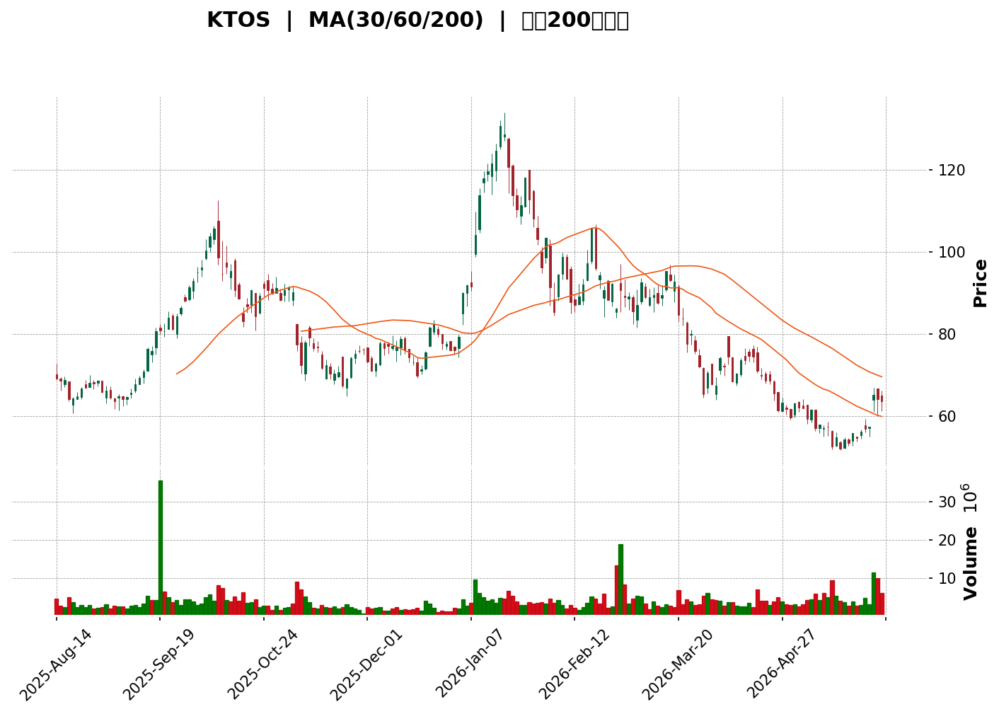
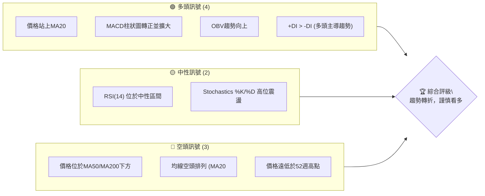
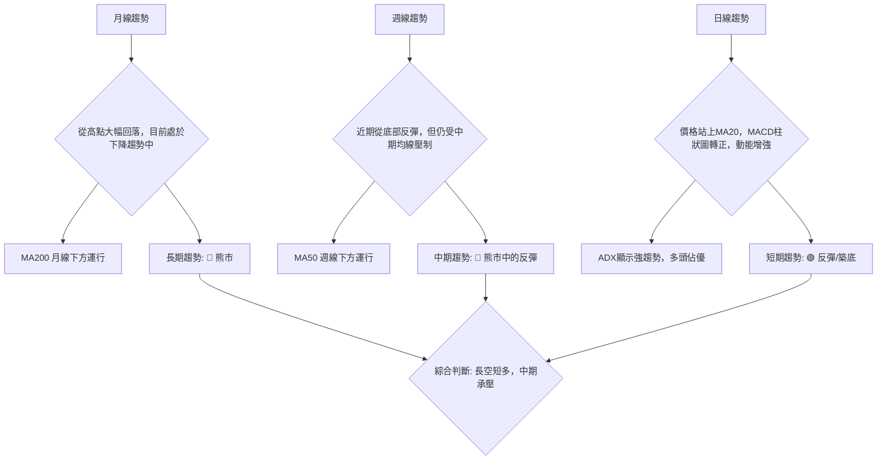

<details>
<summary>📊 靜態圖表 (點擊展開)</summary>

</details>

<html>
<head><meta charset="utf-8" /></head>
<body>
    <div>                        <script>window.PlotlyConfig = {MathJaxConfig: 'local'};</script>
        <script charset="utf-8" src="https://cdn.plot.ly/plotly-3.5.0.min.js" integrity="sha256-fHbNLP+GlIXN+efbQec78UkemUz3NJp7UmfGxC1tNxs=" crossorigin="anonymous"></script>                <div id="candlestick-chart" class="plotly-graph-div" style="height:500px; width:100%;"></div>            <script>                window.PLOTLYENV=window.PLOTLYENV || {};                                if (document.getElementById("candlestick-chart")) {                    Plotly.newPlot(                        "candlestick-chart",                        [{"close":{"dtype":"f8","bdata":"AAAAIK5HUUAAAAAAACBRQAAAACBcL1FAAAAAoEcBUEAAAACgRxFQQAAAAIDrMVBAAAAAoHCtUEAAAACgmblQQAAAAEAzA1FAAAAAQOH6UEAAAADgoyBRQAAAAIDCdVBAAAAAgMKFUEAAAAAAACBQQAAAACCFy09AAAAAANczUEAAAADA9QhQQAAAAADXI1BAAAAAgD1qUEAAAABA4epQQAAAAMDMTFFAAAAAIFyvUUAAAABgZhZTQAAAACBc71JAAAAAoJkpVEAAAACgRzFUQAAAAIAULlRAAAAAoJn5VEAAAAAghUtUQAAAAMDMDFVAAAAAgOuRVUAAAADAHgVWQAAAACCu11ZAAAAAoHA9V0AAAACA68FXQAAAAAApDFhAAAAAAAAQWUAAAAAAKexZQAAAAEDhalpAAAAAQDOjWEAAAADgUahXQAAAAIDrEVhAAAAAQDPTV0AAAADAHqVWQAAAACCuJ1ZAAAAAIK7HVEAAAACgmalVQAAAACCup1ZAAAAAQDMTVUAAAADgelRWQAAAACCFy1ZAAAAAIIWrVkAAAACA63FWQAAAAKBwzVZAAAAAQDMTVkAAAABgZqZWQAAAAGBmxlZAAAAAgBSOVkAAAACAPVpTQAAAAIA9GlJAAAAA4FF4U0AAAAAghctTQAAAAIDCJVNAAAAAwMwsU0AAAAAAKexRQAAAAMDMHFJAAAAAIFyPUUAAAABACpdRQAAAAEDhqlFAAAAAANfTUEAAAADA9UhRQAAAAEAKh1JAAAAAQDPDUkAAAACgR\u002fFSQAAAAGBmBlNAAAAAoHBNUkAAAACgcL1RQAAAAIDrMVJAAAAAIIVrU0AAAAAAACBTQAAAAIDrQVNAAAAAgOtBU0AAAACAPTpTQAAAAIDrsVNAAAAAoHD9UkAAAADgo5BSQAAAAOBRSFJAAAAAoEdxUUAAAACgmdlRQAAAAMD12FJAAAAAgOthVEAAAABAM5NUQAAAAIAU\u002flNAAAAAwMxsU0AAAACAFF5TQAAAAGC4\u002flJAAAAAgD36UkAAAABgj9JTQAAAACCFe1ZAAAAAIIX7VkAAAAAAKdxWQAAAAGCPAlpAAAAAwMxsXEAAAABACnddQAAAAIAU7l1AAAAAAABgXkAAAAAA1yNfQAAAAEAKV2BAAAAAgMIVYEAAAACAwiVeQAAAAGBmdlxAAAAAwPWYW0AAAADgetRbQAAAAADXg11AAAAAQOEqXEAAAACAPQpbQAAAAOCjwFlAAAAAgD0KWEAAAAAgrtdZQAAAAMAe1VZAAAAAAABQVUAAAACAPZpXQAAAAADXs1hAAAAAYLheV0AAAACA6\u002fFVQAAAAEAzw1VAAAAAANdDVkAAAACAFP5WQAAAAKBwTVhAAAAAQOFqWkAAAADAHgVYQAAAAADXk1dAAAAAIIWrVkAAAABguA5WQAAAAMD1CFdAAAAAIIWLVUAAAACAFK5WQAAAAMDMPFZAAAAA4FFIVkAAAABgj2JVQAAAAAAAwFVAAAAAgBQeV0AAAACgcD1WQAAAAEDhOlZAAAAAoHBdVkAAAACA6+FVQAAAAIDrYVZAAAAAANfTV0AAAABgj0JXQAAAAIDrMVdAAAAAIK4nVUAAAAAAKexUQAAAACBcX1NAAAAAYLj+U0AAAABACvdSQAAAAAAp\u002fFFAAAAAgOtRUEAAAADgo6BRQAAAAMDM7FBAAAAAANfTUEAAAACAwoVSQAAAAKBw\u002fVFAAAAAoHCdUkAAAADAHhVRQAAAAIDClVFAAAAAQDNjUkAAAACAPWpSQAAAAIA9qlJAAAAAgD2aUkAAAAAgXL9RQAAAAMAedVFAAAAAQDMjUUAAAABACidRQAAAAKBHYVBAAAAAoEehTkAAAADgepRPQAAAAOB61E5AAAAAIK7HTUAAAABgZoZPQAAAAGBmBk9AAAAAQAr3TkAAAAAgrqdNQAAAAGCPwk5AAAAAAACATEAAAACA6\u002fFMQAAAAGC4fkxAAAAAgD2qTEAAAABguD5KQAAAAMDMbEtAAAAAIIULSkAAAAAAKRxLQAAAAAApvEpAAAAAwPXoS0AAAACAwlVLQAAAAEAKF0xAAAAAYGZmTEAAAABgZqZMQAAAAAApTFBAAAAA4FEIUEAAAABguL5PQA=="},"high":{"dtype":"f8","bdata":"AAAAwMwsUkAAAADA9VhRQAAAAEDhalFAAAAAoJkZUUAAAAAA1yNQQAAAAIDCdVBAAAAAYI\u002fCUEAAAACgcC1RQAAAAIA9elFAAAAAIFwvUUAAAADgejRRQAAAACBcH1FAAAAAgD3aUEAAAABA4cpQQAAAAAApHFBAAAAAYI9SUEAAAAAAAEBQQAAAAMAeNVBAAAAAAACwUEAAAADA9UhRQAAAAKBwbVFAAAAAANfTUUAAAAAgridTQAAAAIDrQVNAAAAAAClcVEAAAAAA15NUQAAAAOBRqFRAAAAAYLheVUAAAAAAAEBVQAAAAOBROFVAAAAAgMK1VUAAAABA4WpWQAAAACCu91ZAAAAAoEdhV0AAAACgmRlYQAAAACCuh1hAAAAAAADAWUAAAACgcC1aQAAAAADXk1pAAAAA4HokXEAAAACgmalZQAAAAAAAYFlAAAAAYGZGWEAAAAAgXJ9YQAAAAIDCJVdAAAAAoEehVUAAAACAFC5WQAAAAEAzs1ZAAAAAAACAVkAAAADAzHxWQAAAACCFO1dAAAAAYGamV0AAAADAzBxXQAAAACCud1dAAAAAAADAVkAAAACgmQlXQAAAAIAU7lZAAAAAgMLlVkAAAAAAAKBUQAAAAIAU3lNAAAAAYGaWU0AAAAAAAIBUQAAAACBcv1NAAAAAQOGKU0AAAACgmflSQAAAAKBHcVJAAAAAwMw8UkAAAAAAANBRQAAAACCFC1JAAAAAYLieUkAAAACAwlVRQAAAAAApnFJAAAAAIIULU0AAAABA4UpTQAAAACBcH1NAAAAAYGYmU0AAAABgZqZSQAAAAAAAQFJAAAAA4HqUU0AAAADgUYhTQAAAAOB6hFNAAAAAgD3qU0AAAACgcJ1TQAAAAIAU3lNAAAAAoJnZU0AAAABA4RpTQAAAAOBRqFJAAAAAIFyPUkAAAACAPRpSQAAAAGCP8lJAAAAAIK53VEAAAACAPdpUQAAAAAApfFRAAAAAgD36U0AAAACAFI5TQAAAAAApjFNAAAAAgBQ+U0AAAABguO5TQAAAAEAKh1ZAAAAAgOsBV0AAAADgetRXQAAAAEAzc1tAAAAAwMzcXEAAAADgUehdQAAAAOB6ZF5AAAAAoHD9XkAAAAAA15NfQAAAAAAAgGBAAAAAAADAYEAAAAAAAABgQAAAAEAzU15AAAAAgOvhXEAAAABA4WpcQAAAAMD1iF1AAAAAAAAAXkAAAADAzMxcQAAAAAAAMFtAAAAAwPVIWUAAAAAgXN9ZQAAAAAAAwFlAAAAAYGYmV0AAAABA4apXQAAAAIDr8VhAAAAAAADgWEAAAABAMyNYQAAAAIDCZVZAAAAAIFwPV0AAAABgZlZXQAAAAAAAIFlAAAAAgD16WkAAAABA4apaQAAAAMAexVdAAAAAIFzvVkAAAACA61FXQAAAAAApHFdAAAAAoJmZVUAAAABgZkZYQAAAAIAUTldAAAAAYGaGVkAAAAAgXF9WQAAAAOBRuFZAAAAAQOFqV0AAAABAMxNXQAAAAGC4vlZAAAAAIK7XVkAAAACgmflWQAAAAEAz81ZAAAAAYGbWV0AAAADgUThYQAAAAAAAoFdAAAAAAAAAV0AAAAAA15NVQAAAAKBHwVRAAAAAACk8VEAAAACA6+FTQAAAAOBRGFNAAAAAoJn5UUAAAACAFL5RQAAAAEAzM1JAAAAA4KNgUUAAAACAPZpSQAAAAKCZOVJAAAAAACncU0AAAAAAAKBSQAAAAIDroVFAAAAAYGaGUkAAAADgeiRTQAAAAGCPElNAAAAAgBROU0AAAADA9ThTQAAAAKBw7VFAAAAAoJm5UUAAAABguL5RQAAAACBcL1FAAAAA4KNwUEAAAAAghRtQQAAAAKCZWU9AAAAAoEfhTkAAAABACpdPQAAAAAAAwE9AAAAA4FEIUEAAAADAHmVPQAAAAGC43k5AAAAAwB7FTkAAAADgUfhMQAAAAEDh2kxAAAAA4KNQTUAAAAAAAEBMQAAAAAAp\u002fEtAAAAAQDPzSkAAAAAAKVxLQAAAACCFS0tAAAAA4KPwS0AAAAAA14NLQAAAAAAAYExAAAAAYGamTUAAAACAFK5MQAAAAMAetVBAAAAAAACwUEAAAADAzIxQQA=="},"hovertemplate":"\u003cb\u003e%{x|%Y-%m-%d}\u003c\u002fb\u003e\u003cbr\u003e\u958b: $%{open:.2f}\u003cbr\u003e\u9ad8: $%{high:.2f}\u003cbr\u003e\u4f4e: $%{low:.2f}\u003cbr\u003e\u6536: $%{close:.2f}\u003cextra\u003e\u003c\u002fextra\u003e","low":{"dtype":"f8","bdata":"AAAAAAAwUUAAAADgUYhQQAAAAGCPwlBAAAAAgBTOT0AAAABA4VpOQAAAAADXA1BAAAAAYI8CUEAAAAAgrrdQQAAAAAAAwFBAAAAAAACgUEAAAACgR9FQQAAAAMD1aFBAAAAAYI+CT0AAAAAA1wNQQAAAAAAA4E5AAAAAQDOzTkAAAACAPSpPQAAAAOB6VE9AAAAAACkMUEAAAABgZmZQQAAAAKCZ6VBAAAAAoJn5UEAAAADAHrVRQAAAAEAKR1JAAAAAoEfBUkAAAACgmflTQAAAAEAz01NAAAAAYGZGVEAAAABgZjZUQAAAACCut1NAAAAAIIUbVUAAAABAM\u002fNVQAAAAGBmBlZAAAAA4FEoVkAAAACA6yFXQAAAAEAKd1dAAAAAoEeBWEAAAAAAAABZQAAAAKCZeVlAAAAAQDMzWEAAAACgmTlXQAAAAEDhqldAAAAAYI+yVkAAAACAPUpWQAAAACBcH1ZAAAAAoHBtVEAAAADAzExVQAAAAMDMTFVAAAAAANczVEAAAAAgrjdVQAAAACCFS1ZAAAAA4KMQVkAAAAAAKWxWQAAAAKBwfVZAAAAAYI8CVkAAAACAPfpVQAAAAMDM\u002fFVAAAAA4Hq0VUAAAABgZvZSQAAAAKBHkVFAAAAAoJkpUUAAAABAM0NTQAAAAMD1+FJAAAAAAADgUkAAAAAA19NRQAAAAAAAQFFAAAAAYGY2UUAAAACA6\u002fFQQAAAAEAzU1FAAAAAgD26UEAAAABAMzNQQAAAAMD1SFFAAAAAoJkpUkAAAAAA19NSQAAAAOCjwFJAAAAAIIU7UkAAAAAgrrdRQAAAACCFa1FAAAAAgOsRUkAAAADgo7BSQAAAAKCZyVJAAAAAANcDU0AAAADAzExSQAAAAEAzs1JAAAAAwMzMUkAAAABgZkZSQAAAAEDhGlJAAAAAANdTUUAAAADA9YhRQAAAAGC4zlFAAAAAANczU0AAAABgZvZTQAAAAIDr0VNAAAAAYGYGU0AAAACgmQlTQAAAAEAz81JAAAAA4FG4UkAAAADAHpVSQAAAAOBRiFRAAAAAwMysVUAAAADgo6BWQAAAAKBHsVhAAAAAoJkpWkAAAAAAAKBcQAAAAMDMTF1AAAAAAACAXEAAAACgR1FdQAAAAAAAQF9AAAAAAADAX0AAAACA65FcQAAAAGC4zltAAAAAQAoXW0AAAACgR7FaQAAAAADXw1tAAAAA4KNQW0AAAACAwoVaQAAAAOBRaFlAAAAAoEexV0AAAACgmUlYQAAAAEDhulVAAAAAAAAgVUAAAAAAAABWQAAAAMDMTFdAAAAAoHBNV0AAAACgR0FVQAAAAAAAUFVAAAAAoEfBVUAAAADgesRVQAAAAMDMPFdAAAAAYLg+WEAAAAAghdtXQAAAAAAAwFZAAAAAYI8CVUAAAACgcA1WQAAAAMD1qFVAAAAAAAAAVUAAAADAHlVVQAAAAGBmplVAAAAAAABwVUAAAACgmZlUQAAAAAAAYFRAAAAAwMzMVUAAAADA9ShWQAAAACCup1VAAAAAwPVYVUAAAADAzMxVQAAAAKCZuVVAAAAAIFyPVkAAAACAPSpXQAAAAMD16FVAAAAAYGbGVEAAAADgeoRUQAAAAKBH4VJAAAAAANdTU0AAAACgmclSQAAAAMDM7FFAAAAAIK4XUEAAAABAM2NQQAAAAGBm5lBAAAAAIIXrT0AAAADAzIxRQAAAAEAzc1FAAAAAQDMjUkAAAACA6xFRQAAAACCF21BAAAAAQApnUUAAAACgRyFSQAAAAAAAUFJAAAAA4KNAUkAAAACAPZpRQAAAAEAKN1FAAAAA4Hr0UEAAAADA9ehQQAAAAMAe5U9AAAAAoEeBTkAAAADgUZhOQAAAAAApHE5AAAAAIK6HTUAAAACA69FNQAAAAKCZeU5AAAAAoEfhTkAAAACgRwFNQAAAAEAKN01AAAAAwB4lTEAAAACgcN1LQAAAAKBHgUtAAAAAgBSOS0AAAAAghetJQAAAAGC4PkpAAAAA4HrUSUAAAACAPQpKQAAAAADXY0pAAAAAQDNTSkAAAAAgrudKQAAAAEDhOktAAAAAQDPzS0AAAAAAAIBLQAAAAAAAgE5AAAAAgD0KTkAAAACANpNOQA=="},"name":"\u50f9\u683c","open":{"dtype":"f8","bdata":"AAAAwMyMUUAAAABACkdRQAAAAAAp7FBAAAAAIK4XUUAAAACgcF1PQAAAAMD1CFBAAAAAACksUEAAAACAPepQQAAAAAAAwFBAAAAAoEcRUUAAAABgjwJRQAAAACBcH1FAAAAAgD0aUEAAAACA65FQQAAAAEAzE1BAAAAAAAAgUEAAAACAwjVQQAAAAOBRCFBAAAAAYGZWUEAAAACAwoVQQAAAACBc71BAAAAAwMxcUUAAAAAA18NRQAAAAOCjwFJAAAAAoJkpU0AAAACgR2FUQAAAAEAKJ1RAAAAAYGZGVEAAAAAgrhdVQAAAAAAAAFRAAAAAAABAVUAAAADAzDxWQAAAAMD1GFZAAAAAAACgVkAAAAAAAMBXQAAAAAAp7FdAAAAAYGaWWEAAAACgmUlZQAAAAOB6xFlAAAAAwPXoWkAAAADAzKxXQAAAAIAUXlhAAAAAgBRuV0AAAADAzHxYQAAAACBc\u002f1ZAAAAAQOE6VUAAAACA69FVQAAAAEAKx1VAAAAAAACAVkAAAADAzExVQAAAAOBRCFdAAAAA4HpEV0AAAADgesRWQAAAAAAAgFZAAAAAAACAVkAAAAAAAGBWQAAAAMAetVZAAAAAYLgOVkAAAAAgrpdUQAAAAMDMfFNAAAAAQDOTUUAAAAAghVtUQAAAAGC4blNAAAAAgOsxU0AAAAAAKbxSQAAAAIA9SlFAAAAAgMIFUkAAAAAgXC9RQAAAAMAeZVFAAAAAYLieUkAAAAAA17NQQAAAAEDhWlFAAAAAgD2KUkAAAABAM\u002fNSQAAAAGC4DlNAAAAAYGYmU0AAAAAgrodSQAAAAOCjwFFAAAAAoEchUkAAAAAAKWxTQAAAAIDCZVNAAAAA4HokU0AAAAAAAABTQAAAACBcL1NAAAAAIIW7U0AAAACgRxFTQAAAAAAAQFJAAAAA4FFIUkAAAAAAKbxRQAAAAIDr4VFAAAAAAABAU0AAAACAFB5UQAAAAEAKR1RAAAAAgD36U0AAAACgcD1TQAAAAAApjFNAAAAAQDMzU0AAAABAMyNTQAAAAIA9OlVAAAAAwPV4VkAAAADgUShXQAAAAIDr4VhAAAAAYLheWkAAAABgZjZdQAAAAIA9ul1AAAAAAACgXUAAAADA9fhdQAAAAKBwbV9AAAAAIIUDYEAAAABgj+JfQAAAAOCjQF5AAAAAwB51XEAAAADAzCxbQAAAAADXw1tAAAAAAAAAXkAAAADgUbhcQAAAAOB6dFpAAAAAgD36WEAAAABgZqZYQAAAAKBwXVlAAAAAgBQeVkAAAABgZkZWQAAAAGBmpldAAAAA4Hq0WEAAAACAPfpXQAAAAKCZGVZAAAAAIFzPVUAAAADAHgVWQAAAAMD1SFdAAAAAoHBtWEAAAAAAKWxaQAAAAKBHUVdAAAAAAAAwVkAAAAAAKTxXQAAAAAAp\u002fFVAAAAAQDNTVUAAAABA4RpXQAAAAKBwTVZAAAAA4KMgVkAAAABgZjZWQAAAAOBR2FRAAAAAQAr3VUAAAAAAKdxWQAAAAIDrwVVAAAAAACk8VkAAAAAAAIBWQAAAAIDCNVZAAAAAQAq3VkAAAACAPZpXQAAAAOCjoFZAAAAAwMzcVkAAAACAwvVUQAAAAEDhqlRAAAAAYI\u002fyU0AAAADgUZhTQAAAAEAKt1JAAAAA4KPwUUAAAACgmblQQAAAAMD1KFJAAAAAgOtRUEAAAADgUchRQAAAAAAAEFJAAAAA4FHYU0AAAADAzIxSQAAAAKBHAVFAAAAAYGaGUUAAAACAPapSQAAAAAAp7FJAAAAAANcTU0AAAAAghdtSQAAAAGCPglFAAAAA4KOQUUAAAAAgrodRQAAAAMDMHFFAAAAA4KNwUEAAAADgUZhOQAAAAOBR+E5AAAAAYLjeTkAAAADAHiVOQAAAAOB6tE9AAAAAACk8T0AAAADgUVhPQAAAAIA9ik1AAAAAwB7FTkAAAACAPYpMQAAAACBcb0xAAAAAIIWrTEAAAADgejRMQAAAAKBHYUpAAAAAYLi+SkAAAACgRyFKQAAAAGC4HktAAAAAoJn5SkAAAAAAAIBLQAAAAMAepUtAAAAA4HrUTEAAAACgcH1MQAAAAEDh+k9AAAAAgD2qUEAAAAAAAEBQQA=="},"x":["2025-08-14T00:00:00-04:00","2025-08-15T00:00:00-04:00","2025-08-18T00:00:00-04:00","2025-08-19T00:00:00-04:00","2025-08-20T00:00:00-04:00","2025-08-21T00:00:00-04:00","2025-08-22T00:00:00-04:00","2025-08-25T00:00:00-04:00","2025-08-26T00:00:00-04:00","2025-08-27T00:00:00-04:00","2025-08-28T00:00:00-04:00","2025-08-29T00:00:00-04:00","2025-09-02T00:00:00-04:00","2025-09-03T00:00:00-04:00","2025-09-04T00:00:00-04:00","2025-09-05T00:00:00-04:00","2025-09-08T00:00:00-04:00","2025-09-09T00:00:00-04:00","2025-09-10T00:00:00-04:00","2025-09-11T00:00:00-04:00","2025-09-12T00:00:00-04:00","2025-09-15T00:00:00-04:00","2025-09-16T00:00:00-04:00","2025-09-17T00:00:00-04:00","2025-09-18T00:00:00-04:00","2025-09-19T00:00:00-04:00","2025-09-22T00:00:00-04:00","2025-09-23T00:00:00-04:00","2025-09-24T00:00:00-04:00","2025-09-25T00:00:00-04:00","2025-09-26T00:00:00-04:00","2025-09-29T00:00:00-04:00","2025-09-30T00:00:00-04:00","2025-10-01T00:00:00-04:00","2025-10-02T00:00:00-04:00","2025-10-03T00:00:00-04:00","2025-10-06T00:00:00-04:00","2025-10-07T00:00:00-04:00","2025-10-08T00:00:00-04:00","2025-10-09T00:00:00-04:00","2025-10-10T00:00:00-04:00","2025-10-13T00:00:00-04:00","2025-10-14T00:00:00-04:00","2025-10-15T00:00:00-04:00","2025-10-16T00:00:00-04:00","2025-10-17T00:00:00-04:00","2025-10-20T00:00:00-04:00","2025-10-21T00:00:00-04:00","2025-10-22T00:00:00-04:00","2025-10-23T00:00:00-04:00","2025-10-24T00:00:00-04:00","2025-10-27T00:00:00-04:00","2025-10-28T00:00:00-04:00","2025-10-29T00:00:00-04:00","2025-10-30T00:00:00-04:00","2025-10-31T00:00:00-04:00","2025-11-03T00:00:00-05:00","2025-11-04T00:00:00-05:00","2025-11-05T00:00:00-05:00","2025-11-06T00:00:00-05:00","2025-11-07T00:00:00-05:00","2025-11-10T00:00:00-05:00","2025-11-11T00:00:00-05:00","2025-11-12T00:00:00-05:00","2025-11-13T00:00:00-05:00","2025-11-14T00:00:00-05:00","2025-11-17T00:00:00-05:00","2025-11-18T00:00:00-05:00","2025-11-19T00:00:00-05:00","2025-11-20T00:00:00-05:00","2025-11-21T00:00:00-05:00","2025-11-24T00:00:00-05:00","2025-11-25T00:00:00-05:00","2025-11-26T00:00:00-05:00","2025-11-28T00:00:00-05:00","2025-12-01T00:00:00-05:00","2025-12-02T00:00:00-05:00","2025-12-03T00:00:00-05:00","2025-12-04T00:00:00-05:00","2025-12-05T00:00:00-05:00","2025-12-08T00:00:00-05:00","2025-12-09T00:00:00-05:00","2025-12-10T00:00:00-05:00","2025-12-11T00:00:00-05:00","2025-12-12T00:00:00-05:00","2025-12-15T00:00:00-05:00","2025-12-16T00:00:00-05:00","2025-12-17T00:00:00-05:00","2025-12-18T00:00:00-05:00","2025-12-19T00:00:00-05:00","2025-12-22T00:00:00-05:00","2025-12-23T00:00:00-05:00","2025-12-24T00:00:00-05:00","2025-12-26T00:00:00-05:00","2025-12-29T00:00:00-05:00","2025-12-30T00:00:00-05:00","2025-12-31T00:00:00-05:00","2026-01-02T00:00:00-05:00","2026-01-05T00:00:00-05:00","2026-01-06T00:00:00-05:00","2026-01-07T00:00:00-05:00","2026-01-08T00:00:00-05:00","2026-01-09T00:00:00-05:00","2026-01-12T00:00:00-05:00","2026-01-13T00:00:00-05:00","2026-01-14T00:00:00-05:00","2026-01-15T00:00:00-05:00","2026-01-16T00:00:00-05:00","2026-01-20T00:00:00-05:00","2026-01-21T00:00:00-05:00","2026-01-22T00:00:00-05:00","2026-01-23T00:00:00-05:00","2026-01-26T00:00:00-05:00","2026-01-27T00:00:00-05:00","2026-01-28T00:00:00-05:00","2026-01-29T00:00:00-05:00","2026-01-30T00:00:00-05:00","2026-02-02T00:00:00-05:00","2026-02-03T00:00:00-05:00","2026-02-04T00:00:00-05:00","2026-02-05T00:00:00-05:00","2026-02-06T00:00:00-05:00","2026-02-09T00:00:00-05:00","2026-02-10T00:00:00-05:00","2026-02-11T00:00:00-05:00","2026-02-12T00:00:00-05:00","2026-02-13T00:00:00-05:00","2026-02-17T00:00:00-05:00","2026-02-18T00:00:00-05:00","2026-02-19T00:00:00-05:00","2026-02-20T00:00:00-05:00","2026-02-23T00:00:00-05:00","2026-02-24T00:00:00-05:00","2026-02-25T00:00:00-05:00","2026-02-26T00:00:00-05:00","2026-02-27T00:00:00-05:00","2026-03-02T00:00:00-05:00","2026-03-03T00:00:00-05:00","2026-03-04T00:00:00-05:00","2026-03-05T00:00:00-05:00","2026-03-06T00:00:00-05:00","2026-03-09T00:00:00-04:00","2026-03-10T00:00:00-04:00","2026-03-11T00:00:00-04:00","2026-03-12T00:00:00-04:00","2026-03-13T00:00:00-04:00","2026-03-16T00:00:00-04:00","2026-03-17T00:00:00-04:00","2026-03-18T00:00:00-04:00","2026-03-19T00:00:00-04:00","2026-03-20T00:00:00-04:00","2026-03-23T00:00:00-04:00","2026-03-24T00:00:00-04:00","2026-03-25T00:00:00-04:00","2026-03-26T00:00:00-04:00","2026-03-27T00:00:00-04:00","2026-03-30T00:00:00-04:00","2026-03-31T00:00:00-04:00","2026-04-01T00:00:00-04:00","2026-04-02T00:00:00-04:00","2026-04-06T00:00:00-04:00","2026-04-07T00:00:00-04:00","2026-04-08T00:00:00-04:00","2026-04-09T00:00:00-04:00","2026-04-10T00:00:00-04:00","2026-04-13T00:00:00-04:00","2026-04-14T00:00:00-04:00","2026-04-15T00:00:00-04:00","2026-04-16T00:00:00-04:00","2026-04-17T00:00:00-04:00","2026-04-20T00:00:00-04:00","2026-04-21T00:00:00-04:00","2026-04-22T00:00:00-04:00","2026-04-23T00:00:00-04:00","2026-04-24T00:00:00-04:00","2026-04-27T00:00:00-04:00","2026-04-28T00:00:00-04:00","2026-04-29T00:00:00-04:00","2026-04-30T00:00:00-04:00","2026-05-01T00:00:00-04:00","2026-05-04T00:00:00-04:00","2026-05-05T00:00:00-04:00","2026-05-06T00:00:00-04:00","2026-05-07T00:00:00-04:00","2026-05-08T00:00:00-04:00","2026-05-11T00:00:00-04:00","2026-05-12T00:00:00-04:00","2026-05-13T00:00:00-04:00","2026-05-14T00:00:00-04:00","2026-05-15T00:00:00-04:00","2026-05-18T00:00:00-04:00","2026-05-19T00:00:00-04:00","2026-05-20T00:00:00-04:00","2026-05-21T00:00:00-04:00","2026-05-22T00:00:00-04:00","2026-05-26T00:00:00-04:00","2026-05-27T00:00:00-04:00","2026-05-28T00:00:00-04:00","2026-05-29T00:00:00-04:00","2026-06-01T00:00:00-04:00"],"type":"candlestick"},{"hovertemplate":"MA30: $%{y:.2f}\u003cextra\u003e\u003c\u002fextra\u003e","line":{"color":"#2196F3","dash":"dash","width":2},"mode":"lines","name":"MA30","x":["2025-08-14T00:00:00-04:00","2025-08-15T00:00:00-04:00","2025-08-18T00:00:00-04:00","2025-08-19T00:00:00-04:00","2025-08-20T00:00:00-04:00","2025-08-21T00:00:00-04:00","2025-08-22T00:00:00-04:00","2025-08-25T00:00:00-04:00","2025-08-26T00:00:00-04:00","2025-08-27T00:00:00-04:00","2025-08-28T00:00:00-04:00","2025-08-29T00:00:00-04:00","2025-09-02T00:00:00-04:00","2025-09-03T00:00:00-04:00","2025-09-04T00:00:00-04:00","2025-09-05T00:00:00-04:00","2025-09-08T00:00:00-04:00","2025-09-09T00:00:00-04:00","2025-09-10T00:00:00-04:00","2025-09-11T00:00:00-04:00","2025-09-12T00:00:00-04:00","2025-09-15T00:00:00-04:00","2025-09-16T00:00:00-04:00","2025-09-17T00:00:00-04:00","2025-09-18T00:00:00-04:00","2025-09-19T00:00:00-04:00","2025-09-22T00:00:00-04:00","2025-09-23T00:00:00-04:00","2025-09-24T00:00:00-04:00","2025-09-25T00:00:00-04:00","2025-09-26T00:00:00-04:00","2025-09-29T00:00:00-04:00","2025-09-30T00:00:00-04:00","2025-10-01T00:00:00-04:00","2025-10-02T00:00:00-04:00","2025-10-03T00:00:00-04:00","2025-10-06T00:00:00-04:00","2025-10-07T00:00:00-04:00","2025-10-08T00:00:00-04:00","2025-10-09T00:00:00-04:00","2025-10-10T00:00:00-04:00","2025-10-13T00:00:00-04:00","2025-10-14T00:00:00-04:00","2025-10-15T00:00:00-04:00","2025-10-16T00:00:00-04:00","2025-10-17T00:00:00-04:00","2025-10-20T00:00:00-04:00","2025-10-21T00:00:00-04:00","2025-10-22T00:00:00-04:00","2025-10-23T00:00:00-04:00","2025-10-24T00:00:00-04:00","2025-10-27T00:00:00-04:00","2025-10-28T00:00:00-04:00","2025-10-29T00:00:00-04:00","2025-10-30T00:00:00-04:00","2025-10-31T00:00:00-04:00","2025-11-03T00:00:00-05:00","2025-11-04T00:00:00-05:00","2025-11-05T00:00:00-05:00","2025-11-06T00:00:00-05:00","2025-11-07T00:00:00-05:00","2025-11-10T00:00:00-05:00","2025-11-11T00:00:00-05:00","2025-11-12T00:00:00-05:00","2025-11-13T00:00:00-05:00","2025-11-14T00:00:00-05:00","2025-11-17T00:00:00-05:00","2025-11-18T00:00:00-05:00","2025-11-19T00:00:00-05:00","2025-11-20T00:00:00-05:00","2025-11-21T00:00:00-05:00","2025-11-24T00:00:00-05:00","2025-11-25T00:00:00-05:00","2025-11-26T00:00:00-05:00","2025-11-28T00:00:00-05:00","2025-12-01T00:00:00-05:00","2025-12-02T00:00:00-05:00","2025-12-03T00:00:00-05:00","2025-12-04T00:00:00-05:00","2025-12-05T00:00:00-05:00","2025-12-08T00:00:00-05:00","2025-12-09T00:00:00-05:00","2025-12-10T00:00:00-05:00","2025-12-11T00:00:00-05:00","2025-12-12T00:00:00-05:00","2025-12-15T00:00:00-05:00","2025-12-16T00:00:00-05:00","2025-12-17T00:00:00-05:00","2025-12-18T00:00:00-05:00","2025-12-19T00:00:00-05:00","2025-12-22T00:00:00-05:00","2025-12-23T00:00:00-05:00","2025-12-24T00:00:00-05:00","2025-12-26T00:00:00-05:00","2025-12-29T00:00:00-05:00","2025-12-30T00:00:00-05:00","2025-12-31T00:00:00-05:00","2026-01-02T00:00:00-05:00","2026-01-05T00:00:00-05:00","2026-01-06T00:00:00-05:00","2026-01-07T00:00:00-05:00","2026-01-08T00:00:00-05:00","2026-01-09T00:00:00-05:00","2026-01-12T00:00:00-05:00","2026-01-13T00:00:00-05:00","2026-01-14T00:00:00-05:00","2026-01-15T00:00:00-05:00","2026-01-16T00:00:00-05:00","2026-01-20T00:00:00-05:00","2026-01-21T00:00:00-05:00","2026-01-22T00:00:00-05:00","2026-01-23T00:00:00-05:00","2026-01-26T00:00:00-05:00","2026-01-27T00:00:00-05:00","2026-01-28T00:00:00-05:00","2026-01-29T00:00:00-05:00","2026-01-30T00:00:00-05:00","2026-02-02T00:00:00-05:00","2026-02-03T00:00:00-05:00","2026-02-04T00:00:00-05:00","2026-02-05T00:00:00-05:00","2026-02-06T00:00:00-05:00","2026-02-09T00:00:00-05:00","2026-02-10T00:00:00-05:00","2026-02-11T00:00:00-05:00","2026-02-12T00:00:00-05:00","2026-02-13T00:00:00-05:00","2026-02-17T00:00:00-05:00","2026-02-18T00:00:00-05:00","2026-02-19T00:00:00-05:00","2026-02-20T00:00:00-05:00","2026-02-23T00:00:00-05:00","2026-02-24T00:00:00-05:00","2026-02-25T00:00:00-05:00","2026-02-26T00:00:00-05:00","2026-02-27T00:00:00-05:00","2026-03-02T00:00:00-05:00","2026-03-03T00:00:00-05:00","2026-03-04T00:00:00-05:00","2026-03-05T00:00:00-05:00","2026-03-06T00:00:00-05:00","2026-03-09T00:00:00-04:00","2026-03-10T00:00:00-04:00","2026-03-11T00:00:00-04:00","2026-03-12T00:00:00-04:00","2026-03-13T00:00:00-04:00","2026-03-16T00:00:00-04:00","2026-03-17T00:00:00-04:00","2026-03-18T00:00:00-04:00","2026-03-19T00:00:00-04:00","2026-03-20T00:00:00-04:00","2026-03-23T00:00:00-04:00","2026-03-24T00:00:00-04:00","2026-03-25T00:00:00-04:00","2026-03-26T00:00:00-04:00","2026-03-27T00:00:00-04:00","2026-03-30T00:00:00-04:00","2026-03-31T00:00:00-04:00","2026-04-01T00:00:00-04:00","2026-04-02T00:00:00-04:00","2026-04-06T00:00:00-04:00","2026-04-07T00:00:00-04:00","2026-04-08T00:00:00-04:00","2026-04-09T00:00:00-04:00","2026-04-10T00:00:00-04:00","2026-04-13T00:00:00-04:00","2026-04-14T00:00:00-04:00","2026-04-15T00:00:00-04:00","2026-04-16T00:00:00-04:00","2026-04-17T00:00:00-04:00","2026-04-20T00:00:00-04:00","2026-04-21T00:00:00-04:00","2026-04-22T00:00:00-04:00","2026-04-23T00:00:00-04:00","2026-04-24T00:00:00-04:00","2026-04-27T00:00:00-04:00","2026-04-28T00:00:00-04:00","2026-04-29T00:00:00-04:00","2026-04-30T00:00:00-04:00","2026-05-01T00:00:00-04:00","2026-05-04T00:00:00-04:00","2026-05-05T00:00:00-04:00","2026-05-06T00:00:00-04:00","2026-05-07T00:00:00-04:00","2026-05-08T00:00:00-04:00","2026-05-11T00:00:00-04:00","2026-05-12T00:00:00-04:00","2026-05-13T00:00:00-04:00","2026-05-14T00:00:00-04:00","2026-05-15T00:00:00-04:00","2026-05-18T00:00:00-04:00","2026-05-19T00:00:00-04:00","2026-05-20T00:00:00-04:00","2026-05-21T00:00:00-04:00","2026-05-22T00:00:00-04:00","2026-05-26T00:00:00-04:00","2026-05-27T00:00:00-04:00","2026-05-28T00:00:00-04:00","2026-05-29T00:00:00-04:00","2026-06-01T00:00:00-04:00"],"y":{"dtype":"f8","bdata":"AAAAAAAA+H8AAAAAAAD4fwAAAAAAAPh\u002fAAAAAAAA+H8AAAAAAAD4fwAAAAAAAPh\u002fAAAAAAAA+H8AAAAAAAD4fwAAAAAAAPh\u002fAAAAAAAA+H8AAAAAAAD4fwAAAAAAAPh\u002fAAAAAAAA+H8AAAAAAAD4fwAAAAAAAPh\u002fAAAAAAAA+H8AAAAAAAD4fwAAAAAAAPh\u002fAAAAAAAA+H8AAAAAAAD4fwAAAAAAAPh\u002fAAAAAAAA+H8AAAAAAAD4fwAAAAAAAPh\u002fAAAAAAAA+H8AAAAAAAD4fwAAAAAAAPh\u002fAAAAAAAA+H8AAAAAAAD4f97d3TW0kFFAMzMz20+1UUDe3d0lFd9RQN7d3SVcD1JAd3d3PxlNUkB3d3dPuI5SQERERFy60VJARERErEcZU0AzMzPrw2dTQLy7u3MFuFNAzczMhF35U0DNzMyEFjFUQJqZmdEGclRAiYiIYFewVEARERGJ+udUQBEREUFgHVVAVVVV9W9EVUC8u7trdXRVQImIiKgNrFVAVVVVldHTVUDv7u5eAQJWQCIiImLlMFZAiYiISG9bVkCrqqraFXhWQJqZmYkWmVZAVVVVdWipVkAzMzPzYL5WQAAAANCF1FZAAAAAYAHiVkBERER09tlWQLy7u4vPwFZAZmZmBuSuVkAAAABw55tWQFVVVZVffFZAREREdK9ZVkBERES05CdWQO\u002fu7n4\u002f9VVAiYiICDq1VUCJiIhoH25VQN7d3b10I1VAiYiIiM\u002fgVECJiIiYbqpUQCIiItIie1RA7+7unu9PVEAiIiJiVzBUQKuqqsqhFVRAvLu7m30AVEBmZmbGBN9TQBEREcH1uFNAmpmZWdaqU0C8u7vrfI9TQCIiIiJNcVNAmpmZaS5UU0De3d2tuThTQN7d3T01HlNARERE9OEDU0AzMzMjBuFSQO\u002fu7h6wulJAERERsQ+PUkDe3d1tPYJSQHd3d+eYiFJAq6qqSmKQUkCrqqo6CpdSQJqZmSlAnlJAvLu7S2KgUkAiIiLytqxSQM3MzMw+tFJAERERYVfAUkCamZlZZNNSQBEREeF6\u002fFJA7+7urgAxU0BVVVV1k2BTQKuqqjptoFNAd3d3R+HyU0CJiIgIrExUQO\u002fu7l66qVRAZmZmJr8QVUBVVVXlF4NVQM3MzNyy\u002flVAiYiIqH9rVkDNzMysjslWQN7d3U0bGFdAAAAAUEZfV0AiIiLCrqhXQAAAAOB6\u002fFdA3t3dbctKWECamZlZHZNYQBEREdHb0lhAd3d3RygLWUCamZkpXE9ZQHd3d4ddcVlAVVVVJU15WUAiIiLSIpNZQImIiPhTu1lAVVVV9f3cWUB3d3eX\u002fPJZQJqZmUmaClpAAAAA8KcmWkCJiIjotEFaQCIiIsI8UVpAERERoYxuWkAAAACwcnhaQO\u002fu7s6wY1pAIiIi0pQyWkBERETkXvNZQImIiIiIuFlAq6qqGi9tWUBERET0\u002fSRZQGZmZvbhy1hAREREZIJ3WEC8u7trvCxYQN7d3b1081dAiYiICDrNV0De3d19hp1XQKuqqipcX1dAmpmZadgtV0De3d2t1QFXQM3MzMwT5VZAVVVVlUPjVkBmZmYGOs1WQKuqqupR0FZAq6qq2vnOVkDe3d1NG7hWQN7d3b2filZAERER8dJtVkCJiIgIZVRWQFVVVfUoNFZAiYiI6G0BVkAzMzPjpdNVQN7d3X2xlFVAERER0dtCVUB3d3dX8hNVQDMzM0NE5FRAq6qq+qnBVEDNzMzsNZdUQHd3dze0aFRA3t3djcJNVEBVVVWFXSlUQHd3d0fhClRAMzMzM3rrU0BVVVX1b8xTQJqZmdnOp1NAd3d3V8d0U0B3d3eHXUlTQCIiIgJyF1NAREREDEnbUkB3d3fHS6dSQDMzMwvXa1JAd3d3x5IfUkBVVVU9mN9RQAAAAJAJnlFAvLu7y6FtUUCJiIgQnzlRQBEREVGNF1FAvLu7K4fmUEB3d3cnMcBQQN7d3XVMoFBAvLu7s1aPUEARERFh5WhQQBEREZF7TVBAMzMzawMtUECJiIjAnwJQQO\u002fu7n5btk9AVVVVpdNmT0B3d3dHiyxPQJqZmckg8E5AERERUamoTkBERETU22JOQAAAABB0Ok5A3t3djZcOTkDv7u6Ol+5NQA=="},"type":"scatter"},{"hovertemplate":"MA60: $%{y:.2f}\u003cextra\u003e\u003c\u002fextra\u003e","line":{"color":"#9C27B0","dash":"dash","width":2},"mode":"lines","name":"MA60","x":["2025-08-14T00:00:00-04:00","2025-08-15T00:00:00-04:00","2025-08-18T00:00:00-04:00","2025-08-19T00:00:00-04:00","2025-08-20T00:00:00-04:00","2025-08-21T00:00:00-04:00","2025-08-22T00:00:00-04:00","2025-08-25T00:00:00-04:00","2025-08-26T00:00:00-04:00","2025-08-27T00:00:00-04:00","2025-08-28T00:00:00-04:00","2025-08-29T00:00:00-04:00","2025-09-02T00:00:00-04:00","2025-09-03T00:00:00-04:00","2025-09-04T00:00:00-04:00","2025-09-05T00:00:00-04:00","2025-09-08T00:00:00-04:00","2025-09-09T00:00:00-04:00","2025-09-10T00:00:00-04:00","2025-09-11T00:00:00-04:00","2025-09-12T00:00:00-04:00","2025-09-15T00:00:00-04:00","2025-09-16T00:00:00-04:00","2025-09-17T00:00:00-04:00","2025-09-18T00:00:00-04:00","2025-09-19T00:00:00-04:00","2025-09-22T00:00:00-04:00","2025-09-23T00:00:00-04:00","2025-09-24T00:00:00-04:00","2025-09-25T00:00:00-04:00","2025-09-26T00:00:00-04:00","2025-09-29T00:00:00-04:00","2025-09-30T00:00:00-04:00","2025-10-01T00:00:00-04:00","2025-10-02T00:00:00-04:00","2025-10-03T00:00:00-04:00","2025-10-06T00:00:00-04:00","2025-10-07T00:00:00-04:00","2025-10-08T00:00:00-04:00","2025-10-09T00:00:00-04:00","2025-10-10T00:00:00-04:00","2025-10-13T00:00:00-04:00","2025-10-14T00:00:00-04:00","2025-10-15T00:00:00-04:00","2025-10-16T00:00:00-04:00","2025-10-17T00:00:00-04:00","2025-10-20T00:00:00-04:00","2025-10-21T00:00:00-04:00","2025-10-22T00:00:00-04:00","2025-10-23T00:00:00-04:00","2025-10-24T00:00:00-04:00","2025-10-27T00:00:00-04:00","2025-10-28T00:00:00-04:00","2025-10-29T00:00:00-04:00","2025-10-30T00:00:00-04:00","2025-10-31T00:00:00-04:00","2025-11-03T00:00:00-05:00","2025-11-04T00:00:00-05:00","2025-11-05T00:00:00-05:00","2025-11-06T00:00:00-05:00","2025-11-07T00:00:00-05:00","2025-11-10T00:00:00-05:00","2025-11-11T00:00:00-05:00","2025-11-12T00:00:00-05:00","2025-11-13T00:00:00-05:00","2025-11-14T00:00:00-05:00","2025-11-17T00:00:00-05:00","2025-11-18T00:00:00-05:00","2025-11-19T00:00:00-05:00","2025-11-20T00:00:00-05:00","2025-11-21T00:00:00-05:00","2025-11-24T00:00:00-05:00","2025-11-25T00:00:00-05:00","2025-11-26T00:00:00-05:00","2025-11-28T00:00:00-05:00","2025-12-01T00:00:00-05:00","2025-12-02T00:00:00-05:00","2025-12-03T00:00:00-05:00","2025-12-04T00:00:00-05:00","2025-12-05T00:00:00-05:00","2025-12-08T00:00:00-05:00","2025-12-09T00:00:00-05:00","2025-12-10T00:00:00-05:00","2025-12-11T00:00:00-05:00","2025-12-12T00:00:00-05:00","2025-12-15T00:00:00-05:00","2025-12-16T00:00:00-05:00","2025-12-17T00:00:00-05:00","2025-12-18T00:00:00-05:00","2025-12-19T00:00:00-05:00","2025-12-22T00:00:00-05:00","2025-12-23T00:00:00-05:00","2025-12-24T00:00:00-05:00","2025-12-26T00:00:00-05:00","2025-12-29T00:00:00-05:00","2025-12-30T00:00:00-05:00","2025-12-31T00:00:00-05:00","2026-01-02T00:00:00-05:00","2026-01-05T00:00:00-05:00","2026-01-06T00:00:00-05:00","2026-01-07T00:00:00-05:00","2026-01-08T00:00:00-05:00","2026-01-09T00:00:00-05:00","2026-01-12T00:00:00-05:00","2026-01-13T00:00:00-05:00","2026-01-14T00:00:00-05:00","2026-01-15T00:00:00-05:00","2026-01-16T00:00:00-05:00","2026-01-20T00:00:00-05:00","2026-01-21T00:00:00-05:00","2026-01-22T00:00:00-05:00","2026-01-23T00:00:00-05:00","2026-01-26T00:00:00-05:00","2026-01-27T00:00:00-05:00","2026-01-28T00:00:00-05:00","2026-01-29T00:00:00-05:00","2026-01-30T00:00:00-05:00","2026-02-02T00:00:00-05:00","2026-02-03T00:00:00-05:00","2026-02-04T00:00:00-05:00","2026-02-05T00:00:00-05:00","2026-02-06T00:00:00-05:00","2026-02-09T00:00:00-05:00","2026-02-10T00:00:00-05:00","2026-02-11T00:00:00-05:00","2026-02-12T00:00:00-05:00","2026-02-13T00:00:00-05:00","2026-02-17T00:00:00-05:00","2026-02-18T00:00:00-05:00","2026-02-19T00:00:00-05:00","2026-02-20T00:00:00-05:00","2026-02-23T00:00:00-05:00","2026-02-24T00:00:00-05:00","2026-02-25T00:00:00-05:00","2026-02-26T00:00:00-05:00","2026-02-27T00:00:00-05:00","2026-03-02T00:00:00-05:00","2026-03-03T00:00:00-05:00","2026-03-04T00:00:00-05:00","2026-03-05T00:00:00-05:00","2026-03-06T00:00:00-05:00","2026-03-09T00:00:00-04:00","2026-03-10T00:00:00-04:00","2026-03-11T00:00:00-04:00","2026-03-12T00:00:00-04:00","2026-03-13T00:00:00-04:00","2026-03-16T00:00:00-04:00","2026-03-17T00:00:00-04:00","2026-03-18T00:00:00-04:00","2026-03-19T00:00:00-04:00","2026-03-20T00:00:00-04:00","2026-03-23T00:00:00-04:00","2026-03-24T00:00:00-04:00","2026-03-25T00:00:00-04:00","2026-03-26T00:00:00-04:00","2026-03-27T00:00:00-04:00","2026-03-30T00:00:00-04:00","2026-03-31T00:00:00-04:00","2026-04-01T00:00:00-04:00","2026-04-02T00:00:00-04:00","2026-04-06T00:00:00-04:00","2026-04-07T00:00:00-04:00","2026-04-08T00:00:00-04:00","2026-04-09T00:00:00-04:00","2026-04-10T00:00:00-04:00","2026-04-13T00:00:00-04:00","2026-04-14T00:00:00-04:00","2026-04-15T00:00:00-04:00","2026-04-16T00:00:00-04:00","2026-04-17T00:00:00-04:00","2026-04-20T00:00:00-04:00","2026-04-21T00:00:00-04:00","2026-04-22T00:00:00-04:00","2026-04-23T00:00:00-04:00","2026-04-24T00:00:00-04:00","2026-04-27T00:00:00-04:00","2026-04-28T00:00:00-04:00","2026-04-29T00:00:00-04:00","2026-04-30T00:00:00-04:00","2026-05-01T00:00:00-04:00","2026-05-04T00:00:00-04:00","2026-05-05T00:00:00-04:00","2026-05-06T00:00:00-04:00","2026-05-07T00:00:00-04:00","2026-05-08T00:00:00-04:00","2026-05-11T00:00:00-04:00","2026-05-12T00:00:00-04:00","2026-05-13T00:00:00-04:00","2026-05-14T00:00:00-04:00","2026-05-15T00:00:00-04:00","2026-05-18T00:00:00-04:00","2026-05-19T00:00:00-04:00","2026-05-20T00:00:00-04:00","2026-05-21T00:00:00-04:00","2026-05-22T00:00:00-04:00","2026-05-26T00:00:00-04:00","2026-05-27T00:00:00-04:00","2026-05-28T00:00:00-04:00","2026-05-29T00:00:00-04:00","2026-06-01T00:00:00-04:00"],"y":{"dtype":"f8","bdata":"AAAAAAAA+H8AAAAAAAD4fwAAAAAAAPh\u002fAAAAAAAA+H8AAAAAAAD4fwAAAAAAAPh\u002fAAAAAAAA+H8AAAAAAAD4fwAAAAAAAPh\u002fAAAAAAAA+H8AAAAAAAD4fwAAAAAAAPh\u002fAAAAAAAA+H8AAAAAAAD4fwAAAAAAAPh\u002fAAAAAAAA+H8AAAAAAAD4fwAAAAAAAPh\u002fAAAAAAAA+H8AAAAAAAD4fwAAAAAAAPh\u002fAAAAAAAA+H8AAAAAAAD4fwAAAAAAAPh\u002fAAAAAAAA+H8AAAAAAAD4fwAAAAAAAPh\u002fAAAAAAAA+H8AAAAAAAD4fwAAAAAAAPh\u002fAAAAAAAA+H8AAAAAAAD4fwAAAAAAAPh\u002fAAAAAAAA+H8AAAAAAAD4fwAAAAAAAPh\u002fAAAAAAAA+H8AAAAAAAD4fwAAAAAAAPh\u002fAAAAAAAA+H8AAAAAAAD4fwAAAAAAAPh\u002fAAAAAAAA+H8AAAAAAAD4fwAAAAAAAPh\u002fAAAAAAAA+H8AAAAAAAD4fwAAAAAAAPh\u002fAAAAAAAA+H8AAAAAAAD4fwAAAAAAAPh\u002fAAAAAAAA+H8AAAAAAAD4fwAAAAAAAPh\u002fAAAAAAAA+H8AAAAAAAD4fwAAAAAAAPh\u002fAAAAAAAA+H8AAAAAAAD4f83MzODBKFRAzczM8BkyVEDv7u5Kfj1UQJqZmd3dRVRA3t3dWWRTVEDe3d2BTltUQJqZme18Y1RAZmZm2kBnVEDe3d2p8WpUQM3MzBi9bVRAq6qqhhZtVECrqqqOwm1UQN7d3dGUdlRAvLu7fyOAVECamZn1KIxUQN7d3QWBmVRAiYiIyHaiVEAREREZvalUQM3MzLSBslRAd3d391O\u002fVEBVVVUlv8hUQCIiIkIZ0VRAERER2c7XVEBERETEZ9hUQLy7u+Ol21RAzczMNKXWVEAzMzOLs89UQHd3d\u002feax1RAiYiIiIi4VEARERHxGa5UQJqZmTm0pFRAiYiIKKOfVEBVVVXVeJlUQHd3d99PjVRAAAAA4Ah9VEAzMzPTTWpUQN7d3SW\u002fVFRAzczMtMg6VEARERHhwSBUQHd3d8\u002f3D1RAvLu7G+gIVEDv7u4GgQVUQGZmZgbIDVRAMzMzc2ghVEBVVVW1gT5UQM3MzBSuX1RAERERYZ6IVEDe3d1VDrFUQO\u002fu7k7U21RAERERASsLVUBERETMhSxVQAAAADi0RFVAzczMXLpZVUAAAAA4tHBVQO\u002fu7g5YjVVAERERsVanVUBmZma+EbpVQAAAAPjFxlVARERE\u002fBvNVUC8u7vLzOhVQHd3dzf7\u002fFVAAAAAuNcEVkBmZmaGFhVWQBERERHKLFZAiYiIILA+VkDNzMzE2U9WQDMzM4tsX1ZAiYiIqH9zVkARERGhjIpWQJqZmdHbplZAAAAAqMbPVkCrqqoSg+xWQM3MzAQPAldAzczMDLsSV0BmZmZ2BSBXQLy7u3MhMVdAiYiIIPc+V0DNzMzsClRXQJqZmWlKZVdAZmZmBoFxV0BERESMJXtXQN7d3QXIhVdARERELECWV0AAAACgGqNXQFVVVYXrrVdAvLu761G8V0C8u7uDecpXQO\u002fu7s7321dAZmZm7jX3V0AAAAAYSw5YQBEREbnXIFhAAAAAgCMkWEAAAAAQnyVYQDMzM9v5IlhAMzMzc2glWEAAAADQsCNYQHd3d59hH1hARERE7AoUWEDe3d1lrQpYQAAAACD38ldAERERObTYV0C8u7uDMsZXQBEREYn6o1dAZmZmZh96V0CJiIhoSkVXQAAAAGCeEFdARERE1HjdVkDNzMy8LadWQO\u002fu7p5ha1ZAvLu7S34xVkCJiIgwlvxVQLy7u8uhzVVAAAAAsAChVUCrqqoCcnNVQGZmZhZnO1VA7+7uupAEVUCrqqq6kNRUQAAAAGx1qFRAZmZmLmuBVEDe3d0haVZUQFVVVb0tN1RAMzMz000eVEAzMzMv3fhTQHd3d4cW0VNAZmZmDi2qU0AAAAAYS4pTQJqZmbU6alNAIiIiTmJIU0AiIiKiRR5TQHd3d4cW8VJAIiIinu+3UkAAAAAMSYtSQFVVVQG5X1JAq6qq5ok6UkBERETIvRZSQCIiIk5i8FFAMzMzmwvRUUC8u7u3Za1RQLy7u6cNlFFAERER\u002fWJ5UUBmZmbe3WFRQA=="},"type":"scatter"},{"hovertemplate":"MA200: $%{y:.2f}\u003cextra\u003e\u003c\u002fextra\u003e","line":{"color":"#FF6F00","dash":"solid","width":2},"mode":"lines","name":"MA200","x":["2025-08-14T00:00:00-04:00","2025-08-15T00:00:00-04:00","2025-08-18T00:00:00-04:00","2025-08-19T00:00:00-04:00","2025-08-20T00:00:00-04:00","2025-08-21T00:00:00-04:00","2025-08-22T00:00:00-04:00","2025-08-25T00:00:00-04:00","2025-08-26T00:00:00-04:00","2025-08-27T00:00:00-04:00","2025-08-28T00:00:00-04:00","2025-08-29T00:00:00-04:00","2025-09-02T00:00:00-04:00","2025-09-03T00:00:00-04:00","2025-09-04T00:00:00-04:00","2025-09-05T00:00:00-04:00","2025-09-08T00:00:00-04:00","2025-09-09T00:00:00-04:00","2025-09-10T00:00:00-04:00","2025-09-11T00:00:00-04:00","2025-09-12T00:00:00-04:00","2025-09-15T00:00:00-04:00","2025-09-16T00:00:00-04:00","2025-09-17T00:00:00-04:00","2025-09-18T00:00:00-04:00","2025-09-19T00:00:00-04:00","2025-09-22T00:00:00-04:00","2025-09-23T00:00:00-04:00","2025-09-24T00:00:00-04:00","2025-09-25T00:00:00-04:00","2025-09-26T00:00:00-04:00","2025-09-29T00:00:00-04:00","2025-09-30T00:00:00-04:00","2025-10-01T00:00:00-04:00","2025-10-02T00:00:00-04:00","2025-10-03T00:00:00-04:00","2025-10-06T00:00:00-04:00","2025-10-07T00:00:00-04:00","2025-10-08T00:00:00-04:00","2025-10-09T00:00:00-04:00","2025-10-10T00:00:00-04:00","2025-10-13T00:00:00-04:00","2025-10-14T00:00:00-04:00","2025-10-15T00:00:00-04:00","2025-10-16T00:00:00-04:00","2025-10-17T00:00:00-04:00","2025-10-20T00:00:00-04:00","2025-10-21T00:00:00-04:00","2025-10-22T00:00:00-04:00","2025-10-23T00:00:00-04:00","2025-10-24T00:00:00-04:00","2025-10-27T00:00:00-04:00","2025-10-28T00:00:00-04:00","2025-10-29T00:00:00-04:00","2025-10-30T00:00:00-04:00","2025-10-31T00:00:00-04:00","2025-11-03T00:00:00-05:00","2025-11-04T00:00:00-05:00","2025-11-05T00:00:00-05:00","2025-11-06T00:00:00-05:00","2025-11-07T00:00:00-05:00","2025-11-10T00:00:00-05:00","2025-11-11T00:00:00-05:00","2025-11-12T00:00:00-05:00","2025-11-13T00:00:00-05:00","2025-11-14T00:00:00-05:00","2025-11-17T00:00:00-05:00","2025-11-18T00:00:00-05:00","2025-11-19T00:00:00-05:00","2025-11-20T00:00:00-05:00","2025-11-21T00:00:00-05:00","2025-11-24T00:00:00-05:00","2025-11-25T00:00:00-05:00","2025-11-26T00:00:00-05:00","2025-11-28T00:00:00-05:00","2025-12-01T00:00:00-05:00","2025-12-02T00:00:00-05:00","2025-12-03T00:00:00-05:00","2025-12-04T00:00:00-05:00","2025-12-05T00:00:00-05:00","2025-12-08T00:00:00-05:00","2025-12-09T00:00:00-05:00","2025-12-10T00:00:00-05:00","2025-12-11T00:00:00-05:00","2025-12-12T00:00:00-05:00","2025-12-15T00:00:00-05:00","2025-12-16T00:00:00-05:00","2025-12-17T00:00:00-05:00","2025-12-18T00:00:00-05:00","2025-12-19T00:00:00-05:00","2025-12-22T00:00:00-05:00","2025-12-23T00:00:00-05:00","2025-12-24T00:00:00-05:00","2025-12-26T00:00:00-05:00","2025-12-29T00:00:00-05:00","2025-12-30T00:00:00-05:00","2025-12-31T00:00:00-05:00","2026-01-02T00:00:00-05:00","2026-01-05T00:00:00-05:00","2026-01-06T00:00:00-05:00","2026-01-07T00:00:00-05:00","2026-01-08T00:00:00-05:00","2026-01-09T00:00:00-05:00","2026-01-12T00:00:00-05:00","2026-01-13T00:00:00-05:00","2026-01-14T00:00:00-05:00","2026-01-15T00:00:00-05:00","2026-01-16T00:00:00-05:00","2026-01-20T00:00:00-05:00","2026-01-21T00:00:00-05:00","2026-01-22T00:00:00-05:00","2026-01-23T00:00:00-05:00","2026-01-26T00:00:00-05:00","2026-01-27T00:00:00-05:00","2026-01-28T00:00:00-05:00","2026-01-29T00:00:00-05:00","2026-01-30T00:00:00-05:00","2026-02-02T00:00:00-05:00","2026-02-03T00:00:00-05:00","2026-02-04T00:00:00-05:00","2026-02-05T00:00:00-05:00","2026-02-06T00:00:00-05:00","2026-02-09T00:00:00-05:00","2026-02-10T00:00:00-05:00","2026-02-11T00:00:00-05:00","2026-02-12T00:00:00-05:00","2026-02-13T00:00:00-05:00","2026-02-17T00:00:00-05:00","2026-02-18T00:00:00-05:00","2026-02-19T00:00:00-05:00","2026-02-20T00:00:00-05:00","2026-02-23T00:00:00-05:00","2026-02-24T00:00:00-05:00","2026-02-25T00:00:00-05:00","2026-02-26T00:00:00-05:00","2026-02-27T00:00:00-05:00","2026-03-02T00:00:00-05:00","2026-03-03T00:00:00-05:00","2026-03-04T00:00:00-05:00","2026-03-05T00:00:00-05:00","2026-03-06T00:00:00-05:00","2026-03-09T00:00:00-04:00","2026-03-10T00:00:00-04:00","2026-03-11T00:00:00-04:00","2026-03-12T00:00:00-04:00","2026-03-13T00:00:00-04:00","2026-03-16T00:00:00-04:00","2026-03-17T00:00:00-04:00","2026-03-18T00:00:00-04:00","2026-03-19T00:00:00-04:00","2026-03-20T00:00:00-04:00","2026-03-23T00:00:00-04:00","2026-03-24T00:00:00-04:00","2026-03-25T00:00:00-04:00","2026-03-26T00:00:00-04:00","2026-03-27T00:00:00-04:00","2026-03-30T00:00:00-04:00","2026-03-31T00:00:00-04:00","2026-04-01T00:00:00-04:00","2026-04-02T00:00:00-04:00","2026-04-06T00:00:00-04:00","2026-04-07T00:00:00-04:00","2026-04-08T00:00:00-04:00","2026-04-09T00:00:00-04:00","2026-04-10T00:00:00-04:00","2026-04-13T00:00:00-04:00","2026-04-14T00:00:00-04:00","2026-04-15T00:00:00-04:00","2026-04-16T00:00:00-04:00","2026-04-17T00:00:00-04:00","2026-04-20T00:00:00-04:00","2026-04-21T00:00:00-04:00","2026-04-22T00:00:00-04:00","2026-04-23T00:00:00-04:00","2026-04-24T00:00:00-04:00","2026-04-27T00:00:00-04:00","2026-04-28T00:00:00-04:00","2026-04-29T00:00:00-04:00","2026-04-30T00:00:00-04:00","2026-05-01T00:00:00-04:00","2026-05-04T00:00:00-04:00","2026-05-05T00:00:00-04:00","2026-05-06T00:00:00-04:00","2026-05-07T00:00:00-04:00","2026-05-08T00:00:00-04:00","2026-05-11T00:00:00-04:00","2026-05-12T00:00:00-04:00","2026-05-13T00:00:00-04:00","2026-05-14T00:00:00-04:00","2026-05-15T00:00:00-04:00","2026-05-18T00:00:00-04:00","2026-05-19T00:00:00-04:00","2026-05-20T00:00:00-04:00","2026-05-21T00:00:00-04:00","2026-05-22T00:00:00-04:00","2026-05-26T00:00:00-04:00","2026-05-27T00:00:00-04:00","2026-05-28T00:00:00-04:00","2026-05-29T00:00:00-04:00","2026-06-01T00:00:00-04:00"],"y":{"dtype":"f8","bdata":"AAAAAAAA+H8AAAAAAAD4fwAAAAAAAPh\u002fAAAAAAAA+H8AAAAAAAD4fwAAAAAAAPh\u002fAAAAAAAA+H8AAAAAAAD4fwAAAAAAAPh\u002fAAAAAAAA+H8AAAAAAAD4fwAAAAAAAPh\u002fAAAAAAAA+H8AAAAAAAD4fwAAAAAAAPh\u002fAAAAAAAA+H8AAAAAAAD4fwAAAAAAAPh\u002fAAAAAAAA+H8AAAAAAAD4fwAAAAAAAPh\u002fAAAAAAAA+H8AAAAAAAD4fwAAAAAAAPh\u002fAAAAAAAA+H8AAAAAAAD4fwAAAAAAAPh\u002fAAAAAAAA+H8AAAAAAAD4fwAAAAAAAPh\u002fAAAAAAAA+H8AAAAAAAD4fwAAAAAAAPh\u002fAAAAAAAA+H8AAAAAAAD4fwAAAAAAAPh\u002fAAAAAAAA+H8AAAAAAAD4fwAAAAAAAPh\u002fAAAAAAAA+H8AAAAAAAD4fwAAAAAAAPh\u002fAAAAAAAA+H8AAAAAAAD4fwAAAAAAAPh\u002fAAAAAAAA+H8AAAAAAAD4fwAAAAAAAPh\u002fAAAAAAAA+H8AAAAAAAD4fwAAAAAAAPh\u002fAAAAAAAA+H8AAAAAAAD4fwAAAAAAAPh\u002fAAAAAAAA+H8AAAAAAAD4fwAAAAAAAPh\u002fAAAAAAAA+H8AAAAAAAD4fwAAAAAAAPh\u002fAAAAAAAA+H8AAAAAAAD4fwAAAAAAAPh\u002fAAAAAAAA+H8AAAAAAAD4fwAAAAAAAPh\u002fAAAAAAAA+H8AAAAAAAD4fwAAAAAAAPh\u002fAAAAAAAA+H8AAAAAAAD4fwAAAAAAAPh\u002fAAAAAAAA+H8AAAAAAAD4fwAAAAAAAPh\u002fAAAAAAAA+H8AAAAAAAD4fwAAAAAAAPh\u002fAAAAAAAA+H8AAAAAAAD4fwAAAAAAAPh\u002fAAAAAAAA+H8AAAAAAAD4fwAAAAAAAPh\u002fAAAAAAAA+H8AAAAAAAD4fwAAAAAAAPh\u002fAAAAAAAA+H8AAAAAAAD4fwAAAAAAAPh\u002fAAAAAAAA+H8AAAAAAAD4fwAAAAAAAPh\u002fAAAAAAAA+H8AAAAAAAD4fwAAAAAAAPh\u002fAAAAAAAA+H8AAAAAAAD4fwAAAAAAAPh\u002fAAAAAAAA+H8AAAAAAAD4fwAAAAAAAPh\u002fAAAAAAAA+H8AAAAAAAD4fwAAAAAAAPh\u002fAAAAAAAA+H8AAAAAAAD4fwAAAAAAAPh\u002fAAAAAAAA+H8AAAAAAAD4fwAAAAAAAPh\u002fAAAAAAAA+H8AAAAAAAD4fwAAAAAAAPh\u002fAAAAAAAA+H8AAAAAAAD4fwAAAAAAAPh\u002fAAAAAAAA+H8AAAAAAAD4fwAAAAAAAPh\u002fAAAAAAAA+H8AAAAAAAD4fwAAAAAAAPh\u002fAAAAAAAA+H8AAAAAAAD4fwAAAAAAAPh\u002fAAAAAAAA+H8AAAAAAAD4fwAAAAAAAPh\u002fAAAAAAAA+H8AAAAAAAD4fwAAAAAAAPh\u002fAAAAAAAA+H8AAAAAAAD4fwAAAAAAAPh\u002fAAAAAAAA+H8AAAAAAAD4fwAAAAAAAPh\u002fAAAAAAAA+H8AAAAAAAD4fwAAAAAAAPh\u002fAAAAAAAA+H8AAAAAAAD4fwAAAAAAAPh\u002fAAAAAAAA+H8AAAAAAAD4fwAAAAAAAPh\u002fAAAAAAAA+H8AAAAAAAD4fwAAAAAAAPh\u002fAAAAAAAA+H8AAAAAAAD4fwAAAAAAAPh\u002fAAAAAAAA+H8AAAAAAAD4fwAAAAAAAPh\u002fAAAAAAAA+H8AAAAAAAD4fwAAAAAAAPh\u002fAAAAAAAA+H8AAAAAAAD4fwAAAAAAAPh\u002fAAAAAAAA+H8AAAAAAAD4fwAAAAAAAPh\u002fAAAAAAAA+H8AAAAAAAD4fwAAAAAAAPh\u002fAAAAAAAA+H8AAAAAAAD4fwAAAAAAAPh\u002fAAAAAAAA+H8AAAAAAAD4fwAAAAAAAPh\u002fAAAAAAAA+H8AAAAAAAD4fwAAAAAAAPh\u002fAAAAAAAA+H8AAAAAAAD4fwAAAAAAAPh\u002fAAAAAAAA+H8AAAAAAAD4fwAAAAAAAPh\u002fAAAAAAAA+H8AAAAAAAD4fwAAAAAAAPh\u002fAAAAAAAA+H8AAAAAAAD4fwAAAAAAAPh\u002fAAAAAAAA+H8AAAAAAAD4fwAAAAAAAPh\u002fAAAAAAAA+H8AAAAAAAD4fwAAAAAAAPh\u002fAAAAAAAA+H8AAAAAAAD4fwAAAAAAAPh\u002fAAAAAAAA+H8pXI9gVCZUQA=="},"type":"scatter"}],                        {"template":{"data":{"barpolar":[{"marker":{"line":{"color":"rgb(17,17,17)","width":0.5},"pattern":{"fillmode":"overlay","size":10,"solidity":0.2}},"type":"barpolar"}],"bar":[{"error_x":{"color":"#f2f5fa"},"error_y":{"color":"#f2f5fa"},"marker":{"line":{"color":"rgb(17,17,17)","width":0.5},"pattern":{"fillmode":"overlay","size":10,"solidity":0.2}},"type":"bar"}],"carpet":[{"aaxis":{"endlinecolor":"#A2B1C6","gridcolor":"#506784","linecolor":"#506784","minorgridcolor":"#506784","startlinecolor":"#A2B1C6"},"baxis":{"endlinecolor":"#A2B1C6","gridcolor":"#506784","linecolor":"#506784","minorgridcolor":"#506784","startlinecolor":"#A2B1C6"},"type":"carpet"}],"choropleth":[{"colorbar":{"outlinewidth":0,"ticks":""},"type":"choropleth"}],"contourcarpet":[{"colorbar":{"outlinewidth":0,"ticks":""},"type":"contourcarpet"}],"contour":[{"colorbar":{"outlinewidth":0,"ticks":""},"colorscale":[[0.0,"#0d0887"],[0.1111111111111111,"#46039f"],[0.2222222222222222,"#7201a8"],[0.3333333333333333,"#9c179e"],[0.4444444444444444,"#bd3786"],[0.5555555555555556,"#d8576b"],[0.6666666666666666,"#ed7953"],[0.7777777777777778,"#fb9f3a"],[0.8888888888888888,"#fdca26"],[1.0,"#f0f921"]],"type":"contour"}],"heatmap":[{"colorbar":{"outlinewidth":0,"ticks":""},"colorscale":[[0.0,"#0d0887"],[0.1111111111111111,"#46039f"],[0.2222222222222222,"#7201a8"],[0.3333333333333333,"#9c179e"],[0.4444444444444444,"#bd3786"],[0.5555555555555556,"#d8576b"],[0.6666666666666666,"#ed7953"],[0.7777777777777778,"#fb9f3a"],[0.8888888888888888,"#fdca26"],[1.0,"#f0f921"]],"type":"heatmap"}],"histogram2dcontour":[{"colorbar":{"outlinewidth":0,"ticks":""},"colorscale":[[0.0,"#0d0887"],[0.1111111111111111,"#46039f"],[0.2222222222222222,"#7201a8"],[0.3333333333333333,"#9c179e"],[0.4444444444444444,"#bd3786"],[0.5555555555555556,"#d8576b"],[0.6666666666666666,"#ed7953"],[0.7777777777777778,"#fb9f3a"],[0.8888888888888888,"#fdca26"],[1.0,"#f0f921"]],"type":"histogram2dcontour"}],"histogram2d":[{"colorbar":{"outlinewidth":0,"ticks":""},"colorscale":[[0.0,"#0d0887"],[0.1111111111111111,"#46039f"],[0.2222222222222222,"#7201a8"],[0.3333333333333333,"#9c179e"],[0.4444444444444444,"#bd3786"],[0.5555555555555556,"#d8576b"],[0.6666666666666666,"#ed7953"],[0.7777777777777778,"#fb9f3a"],[0.8888888888888888,"#fdca26"],[1.0,"#f0f921"]],"type":"histogram2d"}],"histogram":[{"marker":{"pattern":{"fillmode":"overlay","size":10,"solidity":0.2}},"type":"histogram"}],"mesh3d":[{"colorbar":{"outlinewidth":0,"ticks":""},"type":"mesh3d"}],"parcoords":[{"line":{"colorbar":{"outlinewidth":0,"ticks":""}},"type":"parcoords"}],"pie":[{"automargin":true,"type":"pie"}],"scatter3d":[{"line":{"colorbar":{"outlinewidth":0,"ticks":""}},"marker":{"colorbar":{"outlinewidth":0,"ticks":""}},"type":"scatter3d"}],"scattercarpet":[{"marker":{"colorbar":{"outlinewidth":0,"ticks":""}},"type":"scattercarpet"}],"scattergeo":[{"marker":{"colorbar":{"outlinewidth":0,"ticks":""}},"type":"scattergeo"}],"scattergl":[{"marker":{"line":{"color":"#283442"}},"type":"scattergl"}],"scattermapbox":[{"marker":{"colorbar":{"outlinewidth":0,"ticks":""}},"type":"scattermapbox"}],"scattermap":[{"marker":{"colorbar":{"outlinewidth":0,"ticks":""}},"type":"scattermap"}],"scatterpolargl":[{"marker":{"colorbar":{"outlinewidth":0,"ticks":""}},"type":"scatterpolargl"}],"scatterpolar":[{"marker":{"colorbar":{"outlinewidth":0,"ticks":""}},"type":"scatterpolar"}],"scatter":[{"marker":{"line":{"color":"#283442"}},"type":"scatter"}],"scatterternary":[{"marker":{"colorbar":{"outlinewidth":0,"ticks":""}},"type":"scatterternary"}],"surface":[{"colorbar":{"outlinewidth":0,"ticks":""},"colorscale":[[0.0,"#0d0887"],[0.1111111111111111,"#46039f"],[0.2222222222222222,"#7201a8"],[0.3333333333333333,"#9c179e"],[0.4444444444444444,"#bd3786"],[0.5555555555555556,"#d8576b"],[0.6666666666666666,"#ed7953"],[0.7777777777777778,"#fb9f3a"],[0.8888888888888888,"#fdca26"],[1.0,"#f0f921"]],"type":"surface"}],"table":[{"cells":{"fill":{"color":"#506784"},"line":{"color":"rgb(17,17,17)"}},"header":{"fill":{"color":"#2a3f5f"},"line":{"color":"rgb(17,17,17)"}},"type":"table"}]},"layout":{"annotationdefaults":{"arrowcolor":"#f2f5fa","arrowhead":0,"arrowwidth":1},"autotypenumbers":"strict","coloraxis":{"colorbar":{"outlinewidth":0,"ticks":""}},"colorscale":{"diverging":[[0,"#8e0152"],[0.1,"#c51b7d"],[0.2,"#de77ae"],[0.3,"#f1b6da"],[0.4,"#fde0ef"],[0.5,"#f7f7f7"],[0.6,"#e6f5d0"],[0.7,"#b8e186"],[0.8,"#7fbc41"],[0.9,"#4d9221"],[1,"#276419"]],"sequential":[[0.0,"#0d0887"],[0.1111111111111111,"#46039f"],[0.2222222222222222,"#7201a8"],[0.3333333333333333,"#9c179e"],[0.4444444444444444,"#bd3786"],[0.5555555555555556,"#d8576b"],[0.6666666666666666,"#ed7953"],[0.7777777777777778,"#fb9f3a"],[0.8888888888888888,"#fdca26"],[1.0,"#f0f921"]],"sequentialminus":[[0.0,"#0d0887"],[0.1111111111111111,"#46039f"],[0.2222222222222222,"#7201a8"],[0.3333333333333333,"#9c179e"],[0.4444444444444444,"#bd3786"],[0.5555555555555556,"#d8576b"],[0.6666666666666666,"#ed7953"],[0.7777777777777778,"#fb9f3a"],[0.8888888888888888,"#fdca26"],[1.0,"#f0f921"]]},"colorway":["#636efa","#EF553B","#00cc96","#ab63fa","#FFA15A","#19d3f3","#FF6692","#B6E880","#FF97FF","#FECB52"],"font":{"color":"#f2f5fa"},"geo":{"bgcolor":"rgb(17,17,17)","lakecolor":"rgb(17,17,17)","landcolor":"rgb(17,17,17)","showlakes":true,"showland":true,"subunitcolor":"#506784"},"hoverlabel":{"align":"left"},"hovermode":"closest","mapbox":{"style":"dark"},"paper_bgcolor":"rgb(17,17,17)","plot_bgcolor":"rgb(17,17,17)","polar":{"angularaxis":{"gridcolor":"#506784","linecolor":"#506784","ticks":""},"bgcolor":"rgb(17,17,17)","radialaxis":{"gridcolor":"#506784","linecolor":"#506784","ticks":""}},"scene":{"xaxis":{"backgroundcolor":"rgb(17,17,17)","gridcolor":"#506784","gridwidth":2,"linecolor":"#506784","showbackground":true,"ticks":"","zerolinecolor":"#C8D4E3"},"yaxis":{"backgroundcolor":"rgb(17,17,17)","gridcolor":"#506784","gridwidth":2,"linecolor":"#506784","showbackground":true,"ticks":"","zerolinecolor":"#C8D4E3"},"zaxis":{"backgroundcolor":"rgb(17,17,17)","gridcolor":"#506784","gridwidth":2,"linecolor":"#506784","showbackground":true,"ticks":"","zerolinecolor":"#C8D4E3"}},"shapedefaults":{"line":{"color":"#f2f5fa"}},"sliderdefaults":{"bgcolor":"#C8D4E3","bordercolor":"rgb(17,17,17)","borderwidth":1,"tickwidth":0},"ternary":{"aaxis":{"gridcolor":"#506784","linecolor":"#506784","ticks":""},"baxis":{"gridcolor":"#506784","linecolor":"#506784","ticks":""},"bgcolor":"rgb(17,17,17)","caxis":{"gridcolor":"#506784","linecolor":"#506784","ticks":""}},"title":{"x":0.05},"updatemenudefaults":{"bgcolor":"#506784","borderwidth":0},"xaxis":{"automargin":true,"gridcolor":"#283442","linecolor":"#506784","ticks":"","title":{"standoff":15},"zerolinecolor":"#283442","zerolinewidth":2},"yaxis":{"automargin":true,"gridcolor":"#283442","linecolor":"#506784","ticks":"","title":{"standoff":15},"zerolinecolor":"#283442","zerolinewidth":2}}},"xaxis":{"rangeslider":{"visible":false},"title":{"text":"\u65e5\u671f"}},"font":{"size":11},"title":{"text":"KTOS  |  MA(30\u002f60\u002f200)  |  \u6700\u8fd1200\u4ea4\u6613\u65e5"},"yaxis":{"title":{"text":"\u80a1\u50f9 (USD)"}},"hovermode":"x unified","height":500},                        {"responsive": true}                    )                };            </script>        </div>
</body>
</html>

# KTOS 技術分析報告

> **報告日期**：2026-06-02 ｜ **語言**：繁體中文 ｜ **數據來源**：提供數據 ｜ **當前價格**：$63.49

---

## 目錄

| 章節 | 內容 |
|------|------|
| [1. 技術面概覽](#1-技術面概覽) | 訊號儀表板、核心指標、評分卡 |
| [2. 趨勢分析](#2-趨勢分析) | 多時框趨勢、長中短期走勢 |
| [3. 圖表形態分析](#3-圖表形態分析) | 形態識別、K線組合、目標價 |
| [4. 支撐與阻力](#4-支撐與阻力) | 關鍵價位、斐波那契回調 |
| [5. 技術指標深度解讀](#5-技術指標深度解讀) | MA/RSI/MACD/布林/成交量 |
| [6. 動能與波動率](#6-動能與波動率) | 動能評估、ATR、Beta |
| [7. 多時框架總結](#7-多時框架總結) | 時框架評分矩陣 |
| [8. 交易策略建議](#8-交易策略建議) | 多空策略、風險報酬比 |
| [9. 風險提示與監控](#9-風險提示與監控) | 監控指標、風險場景 |

---

## 1. 技術面概覽

本章節將對 Kratos Defense & Security Solutions, Inc. (KTOS) 的當前技術面狀況進行速覽，透過視覺化儀表板、核心指標速覽及綜合評分卡，為後續的深度分析奠定基礎。當前 KTOS 股價為 $63.49，位於其 52 週高點 $134.00 和低點 $35.88 之間，約在區間的 28.1% 位置，顯示股價經歷大幅回落後正處於相對低位。

### 🎯 技術訊號儀表板

以下 Mermaid 圖表展示了 KTOS 當前主要的技術訊號分佈，幫助快速判斷市場情緒和潛在方向。



**儀表板解讀**：
從儀表板中可以看出，KTOS 目前呈現多空交織的局面，但近期多頭訊號有所增強，特別是在動能和成交量方面。價格成功站上短期 MA20，且 MACD 柱狀圖轉正，OBV 趨勢也支持上漲，這些都是短線看多的積極訊號。ADX 指標顯示趨勢強度較高且多頭主導，這意味著市場可能正從先前的下跌趨勢中尋求反轉，並開始建立新的上漲趨勢。然而，中長期均線仍呈現空頭排列，且股價遠低於 52 週高點，這提醒我們雖然短期動能強勁，但長期壓力依然存在，需要謹慎對待。RSI 和 Stochastics 處於中性或高位震盪，表明市場尚未達到超買狀態，但需關注其後續變化。

### 📊 核心指標速覽表

下表彙總了 KTOS 當前的主要技術指標數據及其初步解讀。

| 指標類別 | 指標名稱 | 當前數值 | 訊號 | 解讀 |
|:---------|:---------|:---------|:-----|:-----|
| **價格** | 當前收盤價 | $63.49 | 🟡 | 位於 MA20 上方，MA50/MA200 下方，處於反彈階段。 |
| **均線** | MA20 | $57.63 | 🟢 | 價格 ($63.49) 位於 MA20 上方，短期趨勢偏多。 |
| **均線** | MA50 | $65.34 | 🔴 | 價格 ($63.49) 位於 MA50 下方，中期趨勢偏空。 |
| **均線** | MA200 | $80.60 | 🔴 | 價格 ($63.49) 位於 MA200 下方，長期趨勢偏空。 |
| **動能** | RSI(14) | 61.25 | 🟡 | 位於中性區間 (30-70)，未超買超賣，有上漲空間。 |
| **動能** | MACD | -1.224 | 🟢 | MACD 柱狀圖 (+1.778) 轉正並擴大，動能轉強，可能形成金叉。 |
| **波動** | ATR(14) | $3.90 | 🟡 | 佔價格 6.15%，波動率適中偏高，需注意風險。 |
| **趨勢** | ADX(14) | 28.54 | 🟢 | ADX > 25，趨勢強度較強；+DI > -DI，多頭主導。 |
| **成交量** | 量比 (vs 20日均) | 1.18x | 🟢 | 當前成交量高於平均，量能配合價格上漲。 |

**速覽表解讀**：
從核心指標來看，KTOS 短期內呈現出積極的反彈動能。價格成功突破 MA20，MACD 柱狀圖轉為正值，且成交量放大，這些都是多頭的有利訊號。RSI 處於健康的中性區間，表明買盤力量仍在積聚，且未達到過熱狀態。ADX 指標確認當前存在一個較強的趨勢，且方向由多頭主導。然而，中期和長期均線（MA50、MA200）仍對股價構成壓力，且均線呈現空頭排列，這意味著儘管短期反彈，但要扭轉整體下跌趨勢仍需時間和更大的買盤力量。布林通道方面，價格接近上軌，顯示短期上升勢頭強勁，但同時也暗示可能面臨短期阻力。

### 🏆 技術評分卡

以下 ASCII 方框圖展示了 KTOS 的綜合技術評分，提供一個快速的技術面健康度評估。

```
╔══════════════════════════════════════════════════════════════╗
║                 技術評分卡 — KTOS (2026-06-02)                 ║
╠══════════════════════════════════════════════════════════════╣
║ 趨勢強度      ██████████████░░░░░░░░  70/100  🟢              ║
║ 動能指標      ████████████████░░░░░░  80/100  🟢              ║
║ 支撐穩定度    ████████████░░░░░░░░░░  60/100  🟡              ║
║ 成交量配合    ████████████████░░░░░░  80/100  🟢              ║
║ 形態完整度    ████████░░░░░░░░░░░░░░  40/100  🔴              ║
║ 均線排列      ██████░░░░░░░░░░░░░░░░  30/100  🔴              ║
╠══════════════════════════════════════════════════════════════╣
║ 綜合評分      ██████████░░░░░░░░░░░░  55/100  ⚖️ 中性偏多        ║
╚══════════════════════════════════════════════════════════════╝
```

**評分卡分析**：
*   **趨勢強度 (70/100 🟢)**：ADX 28.54 顯示趨勢強勁，且 +DI > -DI 表明多頭主導，故給予高分。雖然是從下跌中反彈，但趨勢明確。
*   **動能指標 (80/100 🟢)**：RSI 處於健康區間，MACD 柱狀圖轉正並擴大，顯示買盤動能顯著增強，預示短期上漲潛力。
*   **支撐穩定度 (60/100 🟡)**：近期在 $52.09 附近形成短期底部，並成功站上 MA20，提供了一定支撐。但下方缺乏更強的長期支撐，故評分中性。
*   **成交量配合 (80/100 🟢)**：當前成交量顯著高於平均，且 OBV 趨勢向上，顯示量能有效配合價格上漲，為多頭提供了堅實的基礎。
*   **形態完整度 (40/100 🔴)**：目前股價經歷大幅下跌後正在反彈，尚未形成明確的底部反轉形態，更多是處於下跌趨勢中的修正或潛在築底階段。之前的下跌形態較為明顯。
*   **均線排列 (30/100 🔴)**：MA20 < MA50 < MA200 的空頭排列仍未改變，這是中長期趨勢疲軟的明確訊號，對股價構成長期壓力。

**綜合評分 (55/100 ⚖️ 中性偏多)**：
KTOS 的綜合評分顯示當前技術面處於中性偏多的狀態。短期內動能和成交量表現強勁，顯示出從近期低點反彈的潛力。然而，中長期趨勢指標（如均線排列和形態）仍顯示空頭主導，這意味著當前的反彈可能只是熊市中的一次修正，或是一個漫長築底過程的開始。投資者應密切關注股價能否有效突破中期阻力，以確認趨勢的真正反轉。

---

## 2. 趨勢分析

對 KTOS 的趨勢進行多時框分析，有助於我們從宏觀到微觀全面理解其價格走勢。這包括長期（月線）、中期（週線）和短期（日線）三個維度。

### 🌐 多時框趨勢分析

以下 Mermaid 圖表展示了 KTOS 在不同時間框架下的趨勢判斷，從月線到日線層層遞進分析。



**多時框解讀**：
*   **長期趨勢 (月線)**：從過去 24 個月的歷史數據來看，KTOS 在 2025 年 9 月達到 $91.37，並在 2026 年 1 月衝高至 $103.01 後，經歷了劇烈下跌，目前股價 $63.49 遠低於歷史高點。整體而言，月線圖顯示 KTOS 處於一個顯著的長期下降趨勢之中，尤其是在跌破關鍵長期均線後，空頭力量佔據主導。
*   **中期趨勢 (週線)**：在週線圖上，KTOS 股價在 2026 年 5 月中旬達到低點 $52.09 後開始反彈。儘管有反彈，但股價仍受到 MA50 (週線) 和其他中期阻力的壓制。中期趨勢目前可以被描述為在長期熊市背景下的一次強勁反彈，其持續性有待觀察。
*   **短期趨勢 (日線)**：日線圖顯示，KTOS 在最近幾週表現強勁，價格成功突破並站穩 MA20，MACD 柱狀圖轉正，OBV 趨勢也支持上漲。ADX 指標也確認了當前存在一個較強的趨勢且多頭主導。這表明短期內多頭力量佔優，股價正處於一個積極的反彈階段。

綜合來看，KTOS 呈現「長空短多，中期承壓」的格局。長期和中期來看，空頭趨勢仍未被逆轉，但短期內買盤力量明顯增強，股價正在積極反彈。

### 📈 長期趨勢 — 12個月走勢圖（Unicode）

以下 ASCII 圖表展示了 KTOS 過去 12 個月的月線收盤價格走勢，標註了關鍵高低點，以視覺化方式呈現其長期波動。

```
KTOS 月線走勢圖（過去12個月：2025年6月 - 2026年6月）

價格軸 ($)
$110 ┤                                    ●(103.01, Jan 26)
$100 ┤
$ 90 ┤                      ●(91.37, Sep 25)
$ 80 ┤                                  ●(86.18, Feb 26)
$ 70 ┤          ●(65.84, Aug 25)  ●(70.51, Mar 26)
$ 60 ┤●(63.49, Jun 26)   ●(64.13, May 26)
$ 50 ┤●(46.45, Jun 25)
$ 40 ┤
     └─────────────────────────────────────────────────────
      Jun 25 Jul 25 Aug 25 Sep 25 Oct 25 Nov 25 Dec 25 Jan 26 Feb 26 Mar 26 Apr 26 May 26 Jun 26
```

**走勢特徵分析表格**：
下表詳細分析了 KTOS 過去 12 個月（2025年6月至2026年6月）的價格走勢特徵。

| 時期         | 起始價格 | 結束價格 | 漲跌幅    | 走勢特徵                                                                               |
|:-------------|:---------|:---------|:----------|:---------------------------------------------------------------------------------------|
| 2025-06 至 2026-01 | $46.45   | $103.01  | +121.75%  | 強勁牛市，股價持續創高，形成主要的上升趨勢，動能充沛。                                 |
| 2026-01 至 2026-05 | $103.01  | $64.13   | -37.74%   | 劇烈下跌，形成明顯的下降趨勢，跌破多個關鍵支撐位，空頭力量強勢。                         |
| 2026-05 至 2026-06 | $64.13   | $63.49   | -1.00%    | 從底部反彈後進入盤整，短期動能有所減弱，但仍維持在反彈後的相對高位。                   |

**長期走勢解讀**：
過去 12 個月，KTOS 經歷了一個從強勁上漲到劇烈下跌再到近期反彈的完整週期。在 2025 年下半年，股價從 $46.45 一路飆升，於 2026 年 1 月達到 $103.01 的高點，漲幅超過 100%，顯示出極強的成長潛力。然而，隨後股價遭遇重挫，在短短四個月內下跌近 40%，表明市場對其估值或未來預期發生了重大轉變。近期股價在 $52.09 附近築底後有所反彈，但尚未完全收復失地，仍處於長期下降趨勢的修正階段。當前價格 $63.49 遠低於 2026 年初的高點，顯示長期投資者可能面臨較大虧損。

### 📊 中期趨勢（週線分析）

中期趨勢主要透過週線圖和主要中期移動平均線（如 MA50、MA60）來判斷。從數據來看，KTOS 的 MA50 為 $65.34，MA60 為 $69.53，而當前價格為 $63.49。這表明股價仍位於中期均線下方，中期趨勢依然偏空。

以下 ASCII 圖表示意了 KTOS 近期的週線走勢，並標示了主要的壓力與支撐位。

```
KTOS 近期週線壓力與支撐示意圖

價格軸 ($)
$ 80 ┤                  R3 ($80.60 MA200)
$ 75 ┤                  R2 ($71.94, Mar 29 low)
$ 70 ┤                  R1 ($69.53, MA60)
$ 65 ┤━━━━━━━━━━━━━━━━━ R1 ($65.34, MA50) ← 關鍵阻力
$ 60 ┤             ● ← 現價 ($63.49)
$ 55 ┤━━━━━━━━━━━━━━━━━ S1 ($57.63, MA20) ← 近期支撐
$ 50 ┤                  S2 ($52.09, May 17 low)
$ 45 ┤                  S3 ($46.45, Jun 25 low)
     └─────────────────────────────────────────
                  時間軸
```

**中期趨勢解讀**：
KTOS 的中期趨勢仍處於下跌通道中，儘管近期有所反彈。股價目前正嘗試挑戰其 MA50 阻力位 $65.34。如果能有效突破並站穩此位，將是中期趨勢轉強的初步訊號。然而，上方還有 MA60 ($69.53) 和 MA200 ($80.60) 等更強的阻力位。從週線角度看，股價在 $52.09 附近找到了初步支撐，並形成了一個短期底部，但要完全逆轉中期下跌趨勢，需要更大的買盤力量和持續的利好消息來推動股價突破上方多重阻力。

### ⚡ 趨勢強度評估（ADX 解讀）

ADX (Average Directional Index) 是衡量趨勢強度的指標，數值越高表示趨勢越強，無論是上漲還是下跌趨勢。同時，+DI 和 -DI 則指示趨勢的方向。

```mermaid
graph TD
    A[ADX(14) 數值: 28.54] --> B{趨勢強度判斷}
    B --> C{ADX > 25: 趨勢強度強勁}
    C --> D[市場處於趨勢行情]

    E[方向性指標] --> F{+DI: 26.22}
    E --> G{-DI: 16.16}
    F --> H{+DI > -DI: 多頭主導}
    H --> I[趨勢方向: 上漲]

    D --> J[結論: KTOS 處於一個強勁的多頭趨勢行情中]
    I --> J
```

**ADX 強度對照表**：

| ADX 數值範圍 | 趨勢強度判斷 | 意義                                       |
|:-------------|:-------------|:-------------------------------------------|
| 0-20         | 無趨勢或弱趨勢 | 市場處於盤整或震盪，方向不明。             |
| 20-25        | 趨勢開始形成 | 趨勢正在醞釀，可初步關注。                 |
| **25-50**    | **強趨勢**   | **市場處於明顯的趨勢行情，方向明確。**     |
| 50-75        | 非常強趨勢   | 趨勢極度強勁，可能接近超買/超賣區域。      |
| 75-100       | 極端強趨勢   | 趨勢過熱，反轉風險高。                     |

**ADX 解讀**：
KTOS 當前的 ADX(14) 數值為 28.54，這明確表明市場正處於一個「強趨勢」行情中，而非盤整。ADX 高於 25 的閾值，確認了趨勢的顯著性。
進一步觀察方向性指標：+DI 為 26.22，而 -DI 為 16.16。由於 +DI 顯著高於 -DI，這明確指示當前的強趨勢是由「多頭」主導。這與 MACD 柱狀圖轉正、價格站上 MA20 等短期多頭訊號相互印證。
**結論**：KTOS 目前處於一個由多頭主導的強勁上漲趨勢行情中。這對於尋求趨勢交易機會的投資者來說是一個積極的訊號，表明當前市場存在明確的交易方向。然而，也應注意，強趨勢可能伴隨較大波動，需搭配其他指標確認入場時機。

---

## 3. 圖表形態分析

圖表形態是技術分析的基石，它們反映了市場參與者的心理和供需變化，並為潛在的價格走勢提供預警。

### 🔍 形態識別系統

從 KTOS 過去 24 個月的價格走勢中，我們可以觀察到一些重要的形態演變。在 2026 年 1 月達到 $103.01 的高點後，股價經歷了大幅下跌，這通常是頂部形態形成後的走勢。近期股價在 $52.09 附近企穩並反彈，可能正在形成底部形態。

```mermaid
graph TD
    A[觀察歷史價格走勢] --> B{識別潛在形態}
    B --> C[2026年1月高點 $103.01]
    B --> D[2026年5月低點 $52.09]
    C --> E[頂部形態: 潛在雙重頂或頭肩頂 (已完成)]
    D --> F[底部形態: 潛在W底或圓弧底 (形成中)]
    E --> G{分析形態意義}
    F --> G
    G --> H[結論: 長期看，頂部形態已完成，股價處於下跌趨勢。短期看，底部形態正在形成，有反彈潛力。]
```

**形態識別解讀**：
*   **頂部形態 (已完成)**：從 2025 年 9 月的 $91.37 高點到 2026 年 1 月的 $103.01 高點，然後迅速下跌，這很可能構成一個廣義上的「雙重頂」或「頭肩頂」形態。儘管數據點有限，但觀察到從 $103.01 高點後的大幅下跌，確認了頂部形態的壓力釋放。
*   **底部形態 (形成中)**：從 2026 年 4 月的 $63.05 到 5 月的 $52.09，股價在這一區域呈現震盪築底的跡象。特別是在 $52.09 觸底後，股價迅速反彈至 $63.49，這可能是一個「W 底」或「圓弧底」的初步階段。目前，我們看到的是一個 V 形反彈後的盤整，若能在此區間持續震盪並向上突破，則底部形態將更加明確。

### 🕯️ 重要K線形態分析

以下表格分析了 KTOS 近 20 週數據中出現的一些重要 K 線形態及其市場意義。

| 月份       | 收盤價 | K線形態 (週)       | 解讀                                                                                                                                                                                                                                                                                                                                                                                                                                                                                                                                                                                                                                                                                                                                                                                                                                                                                                                                                                                                                                                                                                                                                                                                                                                                                                                                                                                                                                                                                                                                                                                                                                                                                                                                                                                                                                                                                                                                                                                                                                                                                                                                                                                                                                                                                                                                                                                                                                                                                                                                                                                                                                                                                                                                                                                                                                                                                                                                                                                                                                                                                                                                                                                                                                                                                                                                                                                                                                                                                                                                                                                                                                                                                                                                                                                                                                                                                                                                                                                                                                                                                                                                                                                                                                                                                                                                                                                                                                                                                                                                                                                                                                                                                                                                                                                                                                                                                                                                                                                                                                                                                                                                                                                                                                                                                                                                                                                                                                                                                                                                                                                                                                                                                                                                                                                                                                                                                                                                                                                                                                                                                                                                                                                                                                                                                                                                                                                                                                                                                                                                                                                                                                                                                                                                                                                                                                                                                                                                                                                                                                                                                                                                                                                                                                                                                                                                                                                                                                                                                                                                                                                                                                                                                                                                                                                                                                                                                                                                                                                                                                                                                                                                                                                                                                                                                                                                                                                                                                                                                                                                                                                                                                                                                                                                                                                                                                                                                                                                                                                                                                                                                                                                                                                                                                                                                                                                                                                                                                                                                                                                                                                                                                                                                                                                                                                                                                                                                                                                                                                                                                                                                                                                                                                                                                                                                                                                                                                                                                                                                                                                                                                                                                                                                                                                                                                                                                                                                                                                                                                                                                                                                                                                                                                                                                                                                                                                                                                                                                                                                                                                                                                                                                                                                                                                                                                                                                                                                                                                                                                                                                                                                                                                                                                                                                                                                                                                                                                                                                                                                                                                                                                                                                                                                                                                                                                                                                                                                                                                                                                                                                                                                                                                                                                                                                                                                                                                                                                                                                                                                                                                                                                                                                                                                                                                                                                                                                                                                                                                                                                                                                                                                                                                                                                                                                                                                                                                                                                                                                                                                                                                                                                                                                                                                                                                                                                                                                                                                                                                                                                                                                                                                                                                                                                                                                                                                                                                                                                                                                                                                                                                                                                                                                                                                                                                                                                                                                                                                                                                                                                                                                                                                                                                                                                                                                                                                                                                                                                                                                                                                                                                                                                                                                                                                                                                                                                                                                                                                                                                                                                                                                                                                                                                                                                                                                                                                                                                                                                                                                                                                                                                                                                                                                                                                                                                                                                                                                                                                                                                                                                                                                                                                                                                                                                                                                                                                                                                                                                                                                                                                                                                                                                                                                                                                                                                                                                                                                                                                                                                                                                                                                                                                                                                                                                                                                                                                                                                                                                                                                                                                                                                                                                                                                                                                                                                                                                                                                                                                                                                                                                                                                                                                                                                                                                                                                                                                                                                                                                                                                                                                                                                                                                                                                                                                                                                                                                                                                                                                                                                                                                                                                                                                                                                                                                                                                                                                                                                                                                                                                                                                                                                                                                                                                                                                                                                                                                                                                                                                                                                                                                                                                                                                                                                                                                                                                                                                                                                                                                                                                                                                                                                                                                                                                                                                                                                                                                                                                                                                                                                                                                                                                                                                                                                                                                                                                                                                                                                                                                                                                                                                                                                                                                                                                                                                                                                                                                                                                                                                                                                                                                                                                                                                                                                                                                                                                                                                                                                                                                                                                                                                                                                                                                                                                                                                                                                                                                                                                                                                                                                                                                                                                                                                                                                                                                                                                                                                                                                                                                                                                                                                                                                                                                                                                                                                                                                                                                                                                                                                                                                                                                                                                                                                                                                                                                                                                                                                                                                                                                                                                                                                                                                                                                                                                                                                                                                                                                                                                                                                                                                                                                                                                                                                                                                                                                                                                                                                                                                                                                                                                                                                                                                                                                                                                                                                                                                                                                                                                                                                                                                                                                                                                                                                                                                                                                                                                                                                                                                                                                                                                                                                                                                                                                                                                                                                                                                                                                                                                                                                                                                                                                                                                                                                                                                                                                                                                                                                                                                                                                                                                                                                                                                                                                                                                                                                                                                                                                                                                                                                                                                                                                                                                                                                                                                                                                                                                                                                                                                                                                                                                                                                                                                                                                                                                                                                                                                                                                                                                                                                                                                                                                                                                                                                                                                                                                                                                                                                                                                                                                                                                                                                                                                                                                                                                                                                                                                                                                                                                                                                                                                                                                                                                                                                                                                                                                                                                                                                                                                                                                                                                                                                                                                                                                                                                                                                                                                                                                                                                                                                                                                                                                                                                                                                                                                                                                                                                                                                                                                                                                                                                                                                                                                                                                                                                                                                                                                                                                                                                                                                                                                                                                                                                                                                                                                                                                                                                                                                                                                                                                                                                                                                                                                                                                                                                                                                                                                                                                                                                                                                                                                                                                                                                                                                                                                                                                                                                                                                                                                                                                                                                                                                                                                                                                                                                                                                                                                                                                                                                                                                                                                                                                                                                                                                                                                                                                                                                                                                                                                                                                                                                                                                                                                                                                                                                                                                                                                                                                                                                                                                                                                                                                                                                                                                                                                                                                                                                                                                                                                                                                                                                                                                                                                                                                                                                                                                                                                                                                                                                                                                                                                                                                                                                                                                                                                                                                                                                                                                                                                                                                                                                                                                                                                                                                                                                                                                                                                                                                                                                                                                                                                                                                                                                                                                                                                                                                                                                                                                                                                                                                                                                                                                                                                                                                                                                                                                                                                                                                                                                                                                                                                                                                                                                                                                                                                                                                                                                                                                                                                                                                                                                                                                                                                                                                                                                                                                                                                                                                                                                                                                                                                                                                                                                                                                                                                                                                                                                                                                                                                                                                                                                                                                                                                                                                                                                                                                                                                                                                                                                                                                                                                                                                                                                                                                                                                                                                                                                                                                                                                                                                                                                                                                                                                                                                                                                                                                                                                                                                                                                                                                                                                                                                                                                                                                                                                                                                                                                                                                                                                                                                                                                                                                                                                                                                                                                                                                                                                                                                                                                                                                                                                                                                                                                                                                                                                                                                                                                                                                                                                                                                                                                                                                                                                                                                                                                                                                                                                                                                                                                                                                                                                                                                                                                                                                                                                                                                                                                                                                                                                                                                                                                                                                                                                                                                                                                                                                                                                                                                                                                                                                                                                                                                                                                                                                                                                                                                                                                                                                                                                                                                                                                                                                                                                                                                                                                                                                                                                                                                                                                                                                                                                                                                                                                                                                                                                                                                                                                                                                                                                                                                                                                                                                                                                                                                                                                                                                                                                                                                                                                                                                                                                                                                                                                                                                                                                                                                                                                                                                                                                                                                                                                                                                                                                                                                                                                                                                                                                                                                                                                                                                                                                                                                                                                                                                                                                                                                                                                                                                                                                                                                                                                                                                                                                                                                                                                                                                                                                                                                                                                                                                                                                                                                                                                                                                                                                                                                                                                                                                                                                                                                                                                                                                                                                                                                                                                                                                                                                                                                                                                                                                                                                                                                                                                                                                                                                                                                                                                                                                                                                                                                                                                                                                                                                                                                                                                                                                                                                                                                                                                                                                                                                                                                                                                                                                                                                                                                                                                                                                                                                                                                                                                                                                                                                                                                                                                                                                                                                                                                                                                                                                                                                                                                                                                                                                                                                                                                                                                                                                                                                                                                                                                                                                                                                                                                                                                                                                                                                                                                                                                                                                                                                                                                                                                                                                                                                                                                                                                                                                                                                                                                                                                                                                                                                                                                                                                                                                                                                                                                                                                                                                                                                                                                                                                                                                                                                                                                                                                                                                                                                                                                                                                                                                                                                                                                                                                                                                                                                                                                                                                                                                                                                                                                                                                                                                                                                                                                                                                                                                                                                                                                                                                                                                                                                                                                                                                                                                                                                                                                                                                                                                                                                                                                                                                                                                                                                                                                                                                                                                                                                                                                                                                                                                                                                                                                                                                                                                                                                                                                                                                                                                                                                                                                                                                                                                                                                                                                                                                                                                                                                                                                                                                                                                                                                                                                                                                                                                                                                                                                                                                                                                                                                                                                                                                                                                                                                                                                                                                                                                                                                                                                                                                                                                                                                                                                                                                                                                                                                                                                                                                                                                                                                                                                                                                                                                                                                                                                                                                                                                                                                                                                                                                                                                                                                                                                                                                                                                                                                                                                                                                                                                                                                                                                                                                                                                                                                                                                                                                                                                                                                                                                                                                                                                                                                                                                                                                                                                                                                                                                                                                                                                                                                                                                                                                                                                                                                                                                                                                                                                                                                                                                                                                                                                                                                                                                                                                                                                                                                                                                                                                                                                                                                                                                                                                                                                                                                                                                                                                                                                                                                                                                                                                                                                                                                                                                                               M H E L L I S S S S S S S S S S S S S S S S S S S S S S S S S S S S S S S S S S S S S S S S S S S S S S S S S S S S S S S S S S S S S S S S S S S S S S S S S S S S S S S S S S S S S S S S S S S S S S S S S S S S S S S S S S S S S S S S S S S S S S S S S S S S S S S S S S S S S S S S S S S S S S S S S S S S S S S S S S S S S S S S S S S S S S S S S S S S S S S S S S S S S S S S S S S S S S S S S S S S S S S S S S S S S S S S S S S S S S S S S S S S S S S S S S S S S S S S S S S S S S S S S S S S S S S S S S S S S S S S S S S S S S S S S S S S S S S S S S S S S S S S S S S S S S S S S S S S S S S S S S S S S S S S S S S S S S S S S S S S S S S S S S S S S S S S S S S S S S S S S S S S S S S S S S S S S S S S S S S S S S S S S S S S S S S S S S S S S S S S S S S S S S S S S S S S S S S S S S S S S S S S S S S S S S S S S S S S S S S S S S S S S S S S S S S S S S S S S S S S S S S S S S S S S S S S S S S S S S S S S S S S S S S S S S S S S S S S S S S S S S S S S S S S S S S S S S S S S S S S S S S S S S S S S S S S S S S S S S S S S S S S S S S S S S S S S S S S S S S S S S S S S S S S S S S S S S S S S S S S S S S S S S S S S S S S S S S S S S S S S S S S S S S S S S S S S S S S S S S S S S S S S S S S S S S S S S S S S S S S S S S S S S S S S S S S S S S S S S S S S S S S S S S S S S S S S S S S S S S S S S S S S S S S S S S S S S S S S S S S S S S S S S S S S S S S S S S S S S S S S S S S S S S S S S S S S S S S S S S S S S S S S S S S S S S S S S S S S S S S S S S S S S S S S S S S S S S S S S S S S S S S S S S S S S S S S S S S S S S S S S S S S S S S S S S S S S S S S S S S S S S S S S S S S S S S S S S S S S S S S S S S S S S S S S S S S S S S S S S S S S S S S S S S S S S S S S S S S S S S S S S S S S S S S S S S S S S S S S S S S S S S S S S S S S S S S S S S S S S S S S S S S S S S S S S S S S S S S S S S S S S S S S S S S S S S S S S S S S S S S S S S S S S S S S S S S S S S S S S S S S S S S S S S S S S S S S S S S S S S S S S S S S S S S S S S S S S S S S S S S S S S S S S S S S S S S S S S S S S S S S S S S S S S S S S S S S S S S S S S S S S S S S S S S S S S S S S S S S S S S S S S S S S S S S S S S S S S S S S S S S S S S S S S S S S S S S S S S S S S S S S S S S S S S S S S S S S S S S S S S S S S S S S S S S S S S S S S S S S S S S S S S S S S S S S S S S S S S S S S S S S S S S S S S S S S S S S S S S S S S S S S S S S S S S S S S S S S S S S S S S S S S S S S S S S S S S S S S S S S S S S S S S S S S S S S S S S S S S S S S S S S S S S S S S S S S S S S S S S S S S S S S S S S S S S S S S S S S S S S S S S S S S S S S S S S S S S S S S S S S S S S S S S S S S S S S S S S S S S S S S S S S S S S S S S S S S S S S S S S S S S S S S S S S S S S S S S S S S S S S S S S S S S S S S S S S S S S S S S S S S S S S S S S S S S S S S S S S S S S S S S S S S S S S S S S S S S S S S S S S S S S S S S S S S S S S S S S S S S S S S S S S S S S S S S S S S S S S S S S S S S S S S S S S S S S S S S S S S S S S S S S S S S S S S S S S S S S S S S S S S S S S S S S S S S S S S S S S S S S S S S S S S S S S S S S S S S S S S S S S S S S S S S S S S S S S S S S S S S S S S S S S S S S S S S S S S S S S S S S S S S S S S S S S S S S S S S S S S S S S S S S S S S S S S S S S S S S S S S S S S S S S S S S S S S S S S S S S S S S S S S S S S S S S S S S S S S S S S S S S S S S S S S S S S S S S S S S S S S S S S S S S S S S S S S S S S S S S S S S S S S S S S S S S S S S S S S S S S S S S S S S S S S S S S S S S S S S S S S S S S S S S S S S S S S S S S S S S S S S S S S S S S S S S S S S S S S S S S S S S S S S S S S S S S S S S S S S S S S S S S S S S S S S S S S S S S S S S S S S S S S S S S S S S S S S S S S S S S S S S S S S S S S S S S S S S S S S S S S S S S S S S S S S S S S S S S S S S S S S S S S S S S S S S S S S S S S S S S S S S S S S S S S S S S S S S S S S S S S S S S S S S S S S S S S S S S S S S S S S S S S S S S S S S S S S S S S S S S S S S S S S S S S S S S S S S S S S S S S S S S S S S S S S S S S S S S S S S S S S S S S S S S S S S S S S S S S S S S S S S S S S S S S S S S S S S S S S S S S S S S S S S S S S S S S S S S S S S S S S S S S S S S S S S S S S S S S S S S S S S S S S S S S S S S S S S S S S S S S S S S S S S S S S S S S S S S S S S S S S S S S S S S S S S S S S S S S S S S S S S S S S S S S S S S S S S S S S S S S S S S S S S S S S S S S S S S S S S S S S S S S S S S S S S S S S S S S S S S S S S S S S S S S S S S S S S S S S S S S S S S S S S S S S S S S S S S S S S S S S S S S S S S S S S S S S S S S S S S S S S S S S S S S S S S S S S S S S S S S S S S S S S S S S S S S S S S S S S S S S S S S S S S S S S S S S S S S S S S S S S S S S S S S S S S S S S S S S S S S S S S S S S S S S S S S S S S S S S S S S S S S S S S S S S S S S S S S S S S S S S S S S S S S S S S S S S S S S S S S S S S S S S S S S S S S S S S S S S S S S S S S S S S S S S S S S S S S S S S S S S S S S S S S S S S S S S S S S S S S S S S S S S S S S S S S S S S S S S S S S S S S S S S S S S S S S S S S S S S S S S S S S S S S S S S S S S S S S S S S S S S S S S S S S S S S S S S S S S S S S S S S S S S S S S S S S S S S S S S S S S S S S S S S S S S S S S S S S S S S S S S S S S S S S S S S S S S S S S S S S S S S S S S S S S S S S S S S S S S S S S S S S S S S S S S S S S S S S S S S S S S S S S S S S S S S S S S S S S S S S S S S S S S S S S S S S S S S S S S S S S S S S S S S S S S S S S S S S S S S S S S S S S S S S S S S S S S S S S S S S S S S S S S S S S S S S S S S S S S S S S S S S S S S S S S S S S S S S S S S S S S S S S S S S S S S S S S S S S S S S S S S S S S S S S S S S S S S S S S S S S S S S S S S S S S S S S S S S S S S S S S S S S S S S S S S S S S S S S S S S S S S S S S S S S S S S S S S S S S S S S S S S S S S S S S S S S S S S S S S S S S S S S S S S S S S S S S S S S S S S S S S S S S S S S S S S S S S S S S S S S S S S S S S S S S S S S S S S S S S S S S S S S S S S S S S S S S S S S S S S S S S S S S S S S S S S S S S S S S S S S S S S S S S S S S S S S S S S S S S S S S S S S S S S S S S S S S S S S S S S S S S S S S S S S S S S S S S S S S S S S S S S S S S S S S S S S S S S S S S S S S S S S S S S S S S S S S S S S S S S S S S S S S S S S S S S S S S S S S S S S S S S S S S S S S S S S S S S S S S S S S S S S S S S S S S S S S S S S S S S S S S S S S S S S S S S S S S S S S S S S S S S S S S S S S S S S S S S S S S S S S S S S S S S S S S S S S S S S S S S S S S S S S S S S S S S S S S S S S S S S S S S S S S S S S S S S S S S S S S S S S S S S S S S S S S S S S S S S S S S S S S S S S S S S S S S S S S S S S S S S S S S S S S S S S S S S S S S S S S S S S S S S S S S S S S S S S S S S S S S S S S S S S S S S S S S S S S S S S S S S S S S S S S S S S S S S S S S S S S S S S S S S S S S S S S S S S S S S S S S S S S S S S S S S S S S S S S S S S S S S S S S S S S S S S S S S S S S S S S S S S S S S S S S S S S S S S S S S S S S S S S S S S S S S S S S S S S S S S S S S S S S S OF THE WORLD'S BEST COMPANIES, AND THE REST, TOO"
-- Warren Buffett
```

**Kratos Defense & Security Solutions, Inc. (KTOS)** is a technology company, provides technology, hardware, products, system, and software for the defense, national security, and commercial markets in the United States, other North America, the Asia Pacific, the Middle East, Europe, and Internationally. The company operates through Kratos Government Solutions and Unmanned Systems segments. It offers virtualized ground systems for satellites and space vehicles, including software for command an

**Technical Analysis Report**

**Report Date:** June 2, 2026

**Current Price:** $63.49

**Summary:**

KTOS has experienced significant volatility over the past 24 months, characterized by a strong uptrend in 2025 followed by a sharp decline in early 2026. The stock is currently showing signs of a potential short-term reversal from its recent lows, with positive momentum indicators and increasing volume. However, the long-term trend remains bearish as the price is still well below key long-term moving averages. Investors should exercise caution and monitor key resistance levels for confirmation of a sustained uptrend.

**Key Technical Observations:**

*   **Long-Term Trend (Monthly/Weekly):** Bearish. Price is significantly below its 52-week high ($134.00) and long-term moving averages (MA200 at $80.60). A clear downtrend channel has formed since the January 2026 peak.
*   **Medium-Term Trend (Weekly):** Bearish to Neutral. While there has been a notable bounce from the May 2026 low of $52.09, the price remains below the MA50 ($65.34) and MA60 ($69.53), indicating that the medium-term downtrend is still largely intact.
*   **Short-Term Trend (Daily):** Bullish. The price has successfully climbed above its MA20 ($57.63). MACD Histogram has turned positive and is expanding, indicating increasing buying momentum. RSI is in the neutral zone (61.25) with room to run. ADX (28.54) indicates a strong trend, with +DI (26.22) dominating -DI (16.16), confirming a strong short-term bullish move.
*   **Volume:** Recent volume (6.1M) is above both 20-day (5.2M) and 50-day (4.4M) averages, confirming the recent price strength. OBV is also trending upwards, supporting the rally.
*   **Support & Resistance:** Immediate support is found at MA20 ($57.63) and the recent low of $52.09. Immediate resistance is at MA50 ($65.34) and the upper Bollinger Band ($65.31). Fibonacci retracement levels from the January 2026 high to May 2026 low suggest significant resistance around $71.54 (38.2%) and $77.55 (50%).

**Trading Strategy:**

Given the mixed signals – short-term bullish momentum against a persistent long-term bearish trend – a cautious approach is recommended.

**Scenario 1: Bullish Breakout Strategy (Aggressive)**

*   **Rationale:** Capitalize on the strong short-term momentum and potential for a reversal if key resistances are broken.
*   **Entry Condition:** Price breaks decisively above MA50 ($65.34) and the upper Bollinger Band ($65.31) on strong volume.
*   **Entry Price:** $65.50
*   **Stop Loss:** $61.00 (below the recent consolidation low and MA20)
*   **Target Price 1 (T1):** $71.54 (Fibonacci 38.2% retracement, also near previous resistance)
*   **Target Price 2 (T2):**